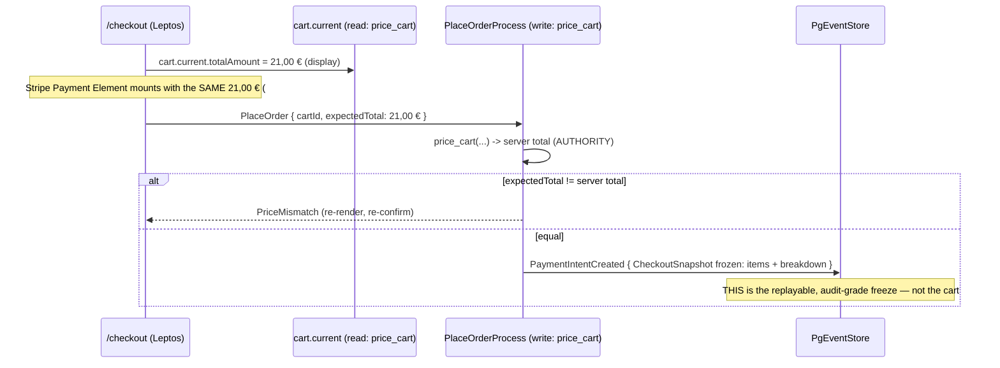

# PROP-20260810-231500 — `cart.current`: the authenticated customer's PRICED cart

- **Status**: Proposed
- **Date**: 2026-08-10
- **Tracking issue**: [#451 "cart.current returns the authenticated customer's priced cart (#429 keystone: total computes + no route params)"](https://github.com/TheCaptainCompany/captain-food/issues/451)
- **Realized by**: _(filled at completion — PR + ADR)_
- **Concerns**:
  - [ ] read-side pricing observability: a read-time pricing seam has NO `specs/observability.yaml` contract; `cart.current` prices on every render of `/checkout` and the cart summary, and a per-line unresolvable at read is a silent conversion killer. A contract (latency percentile + `cart_price_unresolvable_total{reason}`) must exist before `Approved`. See §Concerns.

> History lives in `git log -p` on this file (ADR-20260801-020000): this file always holds the clean CURRENT state of the design.

---

## 1. Why now?

`#429 "Production with test data"` cannot close until a test customer can see a real total on
`/checkout` and pay it. Two of its recorded blockers are the same seam viewed from two ends
(`docs/STATUS.md`, the #429 "what stands between here and that target" list, 2026-08-09):

1. **"the cart total never computes"** — `crates/application/src/projectors/cart.rs:33-35`
   returns `MoneyCents(0)` for `total_amount_cents`, `[]` for `lines`, `None` for
   `estimated_breakdown`/`uber_comparison`. The customer sees `0,00 €`.
2. **"/checkout carries no route params while both its resolvers take required inputs"** — the
   checkout page still needs a `cartId` handed to it; the final shape (`#434`, ADR-20260809-050000
   CARD-11) resolves identity from JWT claims, so a checkout page should carry NOTHING and let the
   server resolve *your* cart.

This proposal folds **both** of those checklist lines. It does NOT change the pricing MODEL — that
is settled (server-side authority, ADR-20260720-002217; 3-way split, ADR-0028). It arbitrates only
the open **projection mechanism**: *how does a read of `cart.current` obtain a price?*

The ETA/total a customer sees before paying **is the product** (CLAUDE.md domain lens). A checkout
that renders `0,00 €` is a conversion failure, not a polish item.

## 2. What & why? — the two decisions

### DECISION 1 — Fold purity: how does `cart.current` get a price? (the decisive one — Greg Young)

**The current spec commits the rejected option.** `specs/database/tables/projection_tables.yaml`
(the `Cart` view, lines 399-473) declares `total_amount_cents`, `currency`,
`estimated_breakdown`, `uber_comparison` as **fold columns** fed by `CartLineAdded` /
`CartLineQuantityChanged` / `CartLineRemoved`, with the note *"COMPUTED by the projection from the
live catalog"*, and ADR-0028 §5 says the estimate is *"derived by the projection from the food
total + policy + margin."* That is **option C**: the projector reaches into the live catalog while
folding. Greg Young: *current state is a left fold of the event stream; projections are folds a
replay must reproduce.* A projector that reads today's catalog is **not** a pure fold — a rebuild
reprices old carts against a **mutated** catalog and produces different rows than the ones that
existed when the events happened. The column claims to be `from:` the cart events but is actually a
function of external mutable state. **We reject C explicitly and correct the spec.**

The real choice is between the two honest options:

| | **(B) Price at read time in the resolver** — the projection-on-read pattern | **(A) Capture priced lines into cart-mutation events** |
|---|---|---|
| Fold | `Cart` row folds **only** lines (`offer_id`, `quantity`, `selected_option_ids`), `status`, ids, `customer_id` — **pure, money-free**. Price is computed at query time by `application::pricing::price_cart` against the live catalog. | `CartLineAdded`/`…QuantityChanged` carry `unitPrice`/`lineTotal` (`Money`). The row's price columns become a **true fold** of the stream — a replay reproduces the exact price shown. |
| Consistency with settled decisions | **Honors ADR-20260720-002217** ("cart events still record NO money") and executes its own follow-up verbatim: *"Price the Cart READ projection … from the same catalog source so the UI total the customer confirms is computed by the same rules."* | **Reverses** ADR-20260720-002217. Money re-enters cart event payloads. |
| Event-contract cost (Young: immutable contracts, versioning is upcasting) | None — no event shape changes. | Requires an explicit **versioning/upcasting story** for `CartLine*` before it touches `domain_events` (no production data yet, but the doctrine and the validator's payload-shape discipline still apply). |
| Domain correctness of the *price shown* | Cart always shows the **LIVE** catalog price; a restaurant price change is reflected on the next read. The authoritative freeze happens once, downstream, at checkout. | Price is **frozen at add-to-cart**; a catalog price change is **not reflected until the line is re-added**. For a high-churn ephemeral cart this is very likely a **bug**, not a feature. |
| Write-path coupling (Vernon: small aggregates, one aggregate per transaction) | None new — `AddCartLine` stays a pure line-append validated against the catalog read model it already consults; no money decided at add time. | The Cart aggregate/handler must **price against the catalog at add time**, so add-to-cart now fails-closed on catalog unavailability — heavy for a mere line add. |
| Code paths | **ONE**. `price_cart` (`crates/application/src/pricing.rs:43`) already exists and is the checkout authority; `cart.current` reuses it. No second implementation. | Two producers of a priced line (write-time pricer + the existing checkout `price_cart`), which must be kept in lockstep or they drift. |
| Audit / replay of the *cart* price | A replay reconstructs the LINES exactly but **not** the transient price a guest once saw. | A replay reconstructs the exact historical cart price. |

**Recommendation: (B), and it is the final vision — not the intermediate.** The clean endpoint for a
*cart* is a money-free, purely-foldable aggregate whose display total is a **live** computation, with
the ONE authoritative, replayable, audit-grade price freeze living exactly where the money moves:
`PlaceOrder → price_cart → PaymentBreakdown` frozen onto `PaymentIntentCreated.CheckoutSnapshot`
(ADR-20260720-002217 §1, `rules.yaml#/CheckoutSnapshotFrozenAtIntent`). That endpoint is **already
built and recorded** — so (A) is not "more final," it is a *different* domain shape (add-time
price-lock) that would duplicate a freeze we already own and contradict a settled ADR. (B)'s only
real con — "a replay can't reconstruct the cart price shown" — is immaterial for a cart: the
legally- and audit-meaningful price is the ORDER price, which IS in the log. And (B)'s stated con of
"two code paths" is inverted here: (B) *consolidates* onto the single `price_cart`, while (A) is what
would create the second pricer.

**The one thing only the product owner can settle** (it is the pivot that would flip B→A):

> **Should a cart's displayed price track the LIVE catalog (re-priced every read — option B), or be
> LOCKED at the moment each line is added (frozen into the event — option A)?**

Food-delivery domain judgement says LIVE: the customer commits at checkout, where the equality-checked
`expectedTotal` (ADR-20260720-002217 §2) already protects displayed-vs-charged. If the PO wants
add-time price-lock, this proposal's recommendation flips to (A) **with** the ADR-20260720 reopening
and the event-versioning story attached — never silently.

### DECISION 2 — Resolver input: claims-resolved "my cart" vs a `/checkout` route param

`#434` (ADR-20260809-050000 CARD-11) made `ReadScope` resolve identity from JWT claims for **all**
roles. The `carts` resolver already does the final-vision thing:
`crates/server/src/graphql/generated/query.rs:318-322` forces the customer id from
`ReadScope::Customer(id)` and **ignores** any client-supplied `customerId` (fail-closed to empty on
an unresolvable identity). `cart.current` is the singular of that, with **no argument at all**.

| | **(final vision) Claims-resolved, zero-arg `cart.current`** | (intermediate) `/checkout` carries a `cartId`/`restaurantId` route param |
|---|---|---|
| Identity source | `ReadScope::Customer(id)` from the verified JWT claim — the exact `#144`/`#434` pattern, one resolution per request at the edge. | Client-supplied id in the URL. |
| Ownership | Enforced server-side by construction; a customer can only ever resolve **their own** cart. | Must be re-checked against ownership on every read (an unscoped id in a URL is precisely the `#144` hole). |
| Satisfies the #429 line | **Yes** — `/checkout` carries no route params; the resolver takes no input. | No — it is the very state #429 lists as a blocker. |
| Which cart is "current" | The customer's most-recently-updated **OPEN** cart (`by_customer` already returns rows most-recent-first; `crates/application/src/queries.rs:265-266`). No param needed. | The URL names it. |

**Recommendation: claims-resolved, zero-arg `cart.current`.** It reuses the shipped
`ReadScope::Customer` plumbing, closes the #429 route-param line, and is ownership-safe by
construction. The route-param form is the cheap intermediate and is rejected.

*(Open sub-point — see §Unresolved: a customer may hold several OPEN carts, one per restaurant.
"Most-recently-updated OPEN cart" is the proposed disambiguation; confirm it fits the checkout flow,
or scope `/checkout` per-restaurant via the session rather than a route param.)*

## 3. Screen mockups (per use case)

Degraded/empty shells already exist from
`#440 "Stripe publishable key … SSR-delivered to /checkout"` (`checkout_degraded_render_total{reason}`,
`crates/server/tests/checkout_degraded_metric.rs`). This proposal fills the **total** into the
resolved state and defines what the pre-total states look like.

### 3a. `/checkout` — total resolved (the happy path)
```
+------------------------------------------------------+
|  Checkout — Chez Mémé (Tours)                        |
+------------------------------------------------------+
|  Pizza Reine        x2            17,00 €             |
|    + extra mozza                   1,50 €             |
|  Coca 33cl          x1             2,50 €             |
|  ------------------------------------------------     |
|  Articles                         21,00 €             |
|  Service fee                       0,00 €   (V0)      |
|  Delivery                          0,00 €   (V0)      |
|  ------------------------------------------------     |
|  TOTAL                            21,00 €             |  <- cart.current.totalAmount (== breakdown.total)
|                                                       |
|  [ Stripe Payment Element mounts here ]               |  <- amount = same 21,00 € (deferred, §4)
|  [  Pay 21,00 €  ]                                    |
+------------------------------------------------------+
   resolver: query { current { totalAmount { amountCents currency }
                               breakdown { articles serviceFee delivery total }
                               lines { name quantity lineTotal } } }   # NO arguments
```

### 3b. `/checkout` — cart still empty (guest added nothing / no open cart)
```
+------------------------------------------------------+
|  Your cart is empty                                  |
|  Browse restaurants to start an order.               |  <- cart.current == null; page shows empty state,
|  [ Back to restaurants ]                             |     NEVER a fabricated 0,00 € payable
+------------------------------------------------------+
```

### 3c. `/checkout` — price cannot be resolved (a line left the catalog)
```
+------------------------------------------------------+
|  We can't confirm your prices right now.             |
|  One item may no longer be available.                |  <- price_cart -> PriceUnresolvable at read;
|  [ Review your cart ]                                |     fail-closed, no payable amount shown, no mount
+------------------------------------------------------+
   emits cart_price_unresolvable_total{reason="offer_gone"} (see Concerns)
```

### 3d. Cart summary (storefront mini-cart) — same source, same number
```
+---------------------------+
|  Cart · Chez Mémé         |
|  3 items         21,00 €  |  <- SAME cart.current price path; one number, one code path
|  [ Go to checkout ]       |
+---------------------------+
```

## 4. Sequence diagrams (hexagonal / CQRS-faithful)

### 4a. Add-to-cart — the write path stays money-free (option B)
```mermaid
sequenceDiagram
    actor Guest
    participant BFF as server (GraphQL BFF)
    participant MB as actor_runtime (Cart mailbox)
    participant AGG as Cart aggregate (pure)
    participant ES as PgEventStore
    participant PROJ as CartProjector (fold)
    Guest->>BFF: mutation addCartLine(cartId, offerId, qty)
    BFF->>MB: enqueue AddCartLine (acceptance-first, PENDING)
    MB->>AGG: deliver (one writer per cartId)
    AGG->>AGG: validate line vs catalog read model (orderability); decide
    AGG-->>MB: CartLineAdded { line } — NO money
    MB->>ES: append CartLineAdded
    ES->>PROJ: fold event
    PROJ->>PROJ: lines := fold(lines, event)  (offer_id, qty, options only)
    Note over PROJ: NO price column written — money never enters the fold
```

### 4b. `cart.current` read — price computed at read via the shared `price_cart`
```mermaid
sequenceDiagram
    actor Customer
    participant Edge as server edge (auth)
    participant Q as cart.current resolver
    participant CartRepo as CartReadRepository
    participant Price as application::pricing::price_cart
    participant Cat as CatalogReadRepository (live)
    Customer->>Edge: GET /checkout (JWT cookie)
    Edge->>Edge: verify JWT -> ReadScope::Customer(id)
    Edge->>Q: query { current { total breakdown lines } }  (no args)
    Q->>CartRepo: by_customer(id) -> most-recent OPEN cart (money-free lines)
    alt no open cart
        Q-->>Customer: null  (screen 3b, empty state)
    else has cart
        Q->>Price: price_cart(catalogs, cartId, restaurantId, lines)
        Price->>Cat: offer_by_id / option prices (LIVE)
        alt a line unresolvable
            Price-->>Q: PriceUnresolvable  (fail-closed)
            Q-->>Customer: priced=false  (screen 3c; cart_price_unresolvable_total++)
        else priced
            Price-->>Q: PricedCart { items, total, breakdown }
            Q-->>Customer: Cart { totalAmount, breakdown, lines }  (screen 3a)
        end
    end
```

### 4c. The deferred Stripe amount — one authority, computed twice, checked once


## 5. Impact

- `crates/**` (GREEN half): the `cart.current` resolver + `CartReadRepository` wiring + reusing
  `price_cart` at read; the `CartProjector` shrinks to a money-free fold (drop the `0`-stub price
  methods). No new pricing logic.
- `specs/**` (AMBER half — plan-mode only, needs approval): (a) add `queries.yaml#/current`
  (zero-arg, `returns Cart nullable`) to `specs/ordering/api.yaml` + a `stories.yaml` step
  (ADR-0032 `op-uncovered-by-story`); (b) correct `projection_tables.yaml` `Cart` so the price
  columns are no longer declared `from:` cart events (they are read-computed), and align ADR-0028 §5
  / the `Cart` view rules text to "priced on read," recording the correction in an ADR;
  (c) add the read-side pricing observability contract (Concern).
- Fixes `carts` and `cart` too: all three cart readers converge on the one `price_cart` seam.

## 6. Estimation

Impact **M** (a resolver + a repo method + a projector simplification + spec edits, no new domain
logic; `price_cart` already exists). Effort **Medium**.

## 7. Definition of done (ADR-0032)

- `cart.current` returns the caller's most-recently-updated OPEN cart, PRICED via `price_cart`, or
  `null`; `/checkout` and the mini-cart render a real total, `null`→empty state, `PriceUnresolvable`→
  the honest failure state (screens 3a–3d).
- The `Cart` projection is a **pure money-free fold**; no projector method returns a stubbed price,
  no price column is declared `from:` a cart event.
- ADR-0032 completeness: the new query has a story step; the read-side pricing rule (or the corrected
  `ServerPriceAuthority` note) is asserted by a behaviour test; the observability contract exists.
- `make rust` green · `make validate` 0 errors and **no NEW warning** vs `main` · `check-drift` clean.

## 8. Drawbacks (why we might regret the whole thing)

- **Read cost.** Every `/checkout` render and every mini-cart reprices against the catalog. At peak
  (Fri/Sat 19:00–21:30) that is a hot path with no cache. Mitigation: `price_cart` is an in-memory
  fold over already-loaded offers; if it bites, a per-request memoized catalog read is the lever, and
  the Concern's contract tells us *before* it hurts.
- **The cart price is not in the log.** Accepted: the audit-grade price is the ORDER price, which is.
- **We touch a settled ADR's spec text** (`projection_tables.yaml` Cart, ADR-0028 §5) to remove the
  impure-fold declaration. That is a correction, recorded by ADR — but it means editing an
  `Accepted` decision's realizing spec, which needs the reviewer sweep of the old wording.

## 9. Unresolved questions (copied to the tracking issue on approval)

1. **LIVE vs LOCKED cart price** — the DECISION 1 pivot (§2). PO to answer; B assumed until then.
2. **Which cart is "current"** when a customer holds several OPEN carts (one per restaurant):
   most-recently-updated (proposed) vs a session-scoped per-restaurant checkout context.
3. **`estimated_breakdown` at read** — V0 breakdown is degenerate (articles==total, fees 0). Confirm
   the read path emits the same degenerate shape as checkout until the ADR-0016/0017 fee policy lands
   in `price_cart` (it must, to keep "one code path" true).

## Concerns (blocking `Approved`)

- [ ] **Read-side pricing observability contract absent.** `specs/observability.yaml` has a
  `pricing.compute` span only on the write-path `place-order` workflow (lines 168-173). A read-time
  pricer on the checkout hot path has **no** contract — no latency percentile, no
  `cart_price_unresolvable_total{reason}` for the 3c failure that silently loses the sale. Per the
  standing rule *"every critical workflow must have an observability contract,"* this must be added
  and the metric proved firing (the `checkout_degraded_metric.rs` spy pattern) before `Approved`.

## Refs

- `crates/application/src/projectors/cart.rs:33-45` (the `0`-stub); `crates/application/src/pricing.rs:43` (`price_cart`); `crates/application/src/queries.rs:264-274` (`CartReadRepository`); `crates/server/src/graphql/generated/query.rs:307-352` (`carts`/`cart` resolvers, the claims-resolution pattern); `specs/database/tables/projection_tables.yaml:399-473` (`Cart` view, the impure-fold columns); `specs/ordering/api.yaml` (`carts`/`cart`).
- ADRs: [ADR-20260720-002217 "Server-side pricing, fail-closed"](../adr/20260720-002217-server-side-pricing.md) · [ADR-0028 "Pricing & 3-way split"](../adr/0028-pricing-3way-split-model.md) · [ADR-20260809-050000 "morning-brief eight decisions" (CARD-11 claims)](../adr/ADR-20260809-050000-morning-brief-eight-decisions.md) · [ADR-20260810-015941 "Stripe publishable key delivery"](../adr/ADR-20260810-015941-stripe-publishable-key-delivery.md).
- Issues: [#429 "Production with test data: a test customer places a real order against a test restaurant, paid with Stripe test mode"](https://github.com/TheCaptainCompany/captain-food/issues/429) · [#144 "read-side per-instance authorization"](https://github.com/TheCaptainCompany/captain-food/issues/144) · [#434](https://github.com/TheCaptainCompany/captain-food/issues/434) · [#440 "Stripe publishable key SSR-delivered to /checkout"](https://github.com/TheCaptainCompany/captain-food/issues/440).

## DECISIONS.md register row (add to §1 when the tracking issue is filed)

```
| **G** | [PROP-20260810-231500 D1](PROP-20260810-231500-cart-current-priced.md) — **cart price: LIVE (re-priced every read, option B) vs LOCKED at add-to-cart (money in events, option A)** | Unblocks the #429 keystone (`cart.current` priced) and settles whether the cart is a live estimate or a price-lock; A would reopen ADR-20260720-002217 and need event versioning. Gates [#429](https://github.com/TheCaptainCompany/captain-food/issues/429). | **B — live, priced on read via the shared `price_cart`; authoritative freeze stays at checkout** (recommended, final vision) |
```

---
🤖 Generated with [Claude Code](https://claude.com/claude-code)

https://claude.ai/code/session_01RuLQZG6EjeZfQhLDTco8Ey
