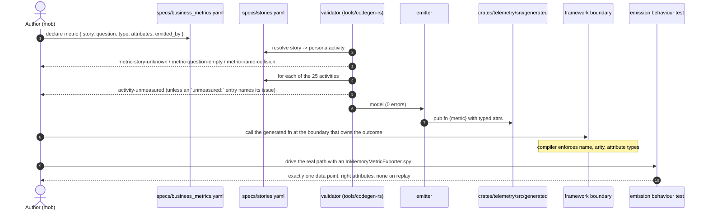
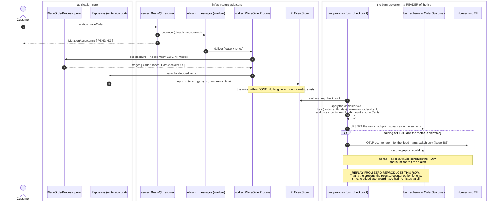
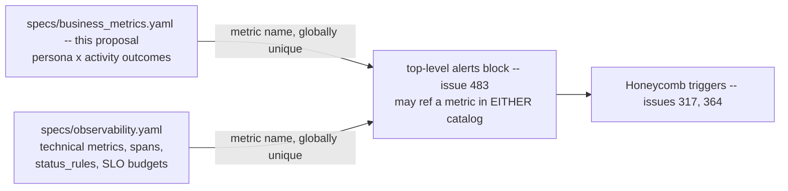

# PROP-20260810-234225 — Business metrics for every feature and every persona: where they are declared, and what makes the claim checkable

- **Status**: Proposed
- **Date**: 2026-08-10
- **Tracking issue**: [#484 "26 of the 29 declared `business_metrics` emit nothing: give business metrics their own catalog, keyed persona x activity, with a bidirectional coverage gate"](https://github.com/TheCaptainCompany/captain-food/issues/484)
- **Principle**: [ADR-20260810-234225 "Business metrics for every feature and every persona, developed with the test and the code"](../adr/ADR-20260810-234225-business-metrics-for-every-feature-and-every-persona.md)
- **Realized by**: _(filled at completion)_

> **Scope fence.** This proposal owns the **principle, the declaration mechanism and the
> enforcement**. It does **not** define the metrics themselves — the per-persona, per-activity grid
> (which outcome each activity should measure) is the `ux-designer` lens's parallel deliverable, and
> the two are designed not to overlap: this document decides *where a metric goes and what makes it
> real*, that one decides *what to measure*.

---

## 1. Context — what is true today

The product owner's directive is *"we must have business metrics for all features for each
persona"*, and *"during the analysis must be developed with the test and the code"*. A slot for that
already exists. It is almost entirely empty, and nothing says so.

### 1.1 Verified facts (`168fd77`)

| # | Fact | Evidence |
|---|---|---|
| F1 | `specs/observability.yaml` declares **14 contracts** carrying **29 `business_metrics` entries** (20 distinct names) | `specs/observability.yaml:213,334,407,474,550,695,776,855,926,993,1071` |
| F2 | **26 of the 29 have zero occurrences** in `crates/`, `tools/` or `deploy/` — no constant, no instrument, no call site | `grep -rl <name> crates/ tools/ deploy/` returns nothing for all 20 of: `refunds_settled_total`, `saga_compensation_total`, `customer_signins_total`, `otp_verifications_failed_total`, `prospect_contacts_sent_total`, `prospects_converted_total`, `prospects_cold_total`, `inbound_events_staged_total`, `inbound_events_delivered_total`, `webhook_duplicates_total`, `delivery_offers_total`, `delivery_dispatch_failed_total`, `delivery_self_dispatched_total`, `reclamations_decided_total`, `reclamations_overdue_total`, `sirene_records_created_total`, `sirene_records_updated_total`, `sirene_records_ignored_total`, `sirene_records_failed_total`, `event_store_version_conflicts_total` |
| F3 | Exactly **3** are emitted on a real path | `crates/infrastructure/src/mailbox/mod.rs:53` · `crates/adapters/stripe/src/outbound.rs:121` · `crates/infrastructure/src/projection/worker.rs:684` |
| F4 | The emitted-ness gate covers **3 of 14 contracts**, by a hardcoded allowlist, and asserts only that the metric's **name appears as a string constant** in `contract.rs` | `tools/codegen-rs/src/tests.rs:1500` — `for feature in ["command-acceptance", "place-order", "cart-price"]` |
| F5 | Two of those three contracts declare **zero** business metrics, so the gate's effective business-metric coverage is **2 of 29** | `command-acceptance` and `cart-price` have no `business_metrics:` block |
| F6 | `crates/telemetry/src/contract.rs` and `meters.rs` are **hand-written**, not generated | no `generated` marker; `crates/telemetry/src/` contains `contract.rs, http_client.rs, lib.rs, meters.rs, spans.rs` and no `generated/` |
| F7 | `specs/stories.yaml` holds **8 personas, 25 activities, 144 steps** | parsed from the file |
| F8 | Steps are operation calls, not outcomes: two different steps `$ref` the *same* query, and one step is a poll loop | `specs/stories.yaml:57-58` (`SeeCheckoutBreakdown`, `CompareWithUberEats` → `api.yaml#/queries/cart`); `PollOperationStatus` at line 61, ~30 fires per checkout per [#482](https://github.com/TheCaptainCompany/captain-food/issues/482) |
| F9 | The emission-proof pattern already exists, twice | `crates/infrastructure/tests/orders_placed_metric.rs:129` and `crates/server/tests/checkout_degraded_metric.rs` — `InMemoryMetricExporter` spy, asserts the point fires once and never on a replay |
| F10 | `specs/tests.yaml` is actor/command-shaped (`actor` + `when: command` + `then: events` / `thrown: errors`), so it cannot express "this metric fires when this event is appended" | 231 tests, all of that shape; the structural gap is [#212](https://github.com/TheCaptainCompany/captain-food/issues/212), decided 2026-07-28, unbuilt |
| F11 | `specs/observability.yaml` cannot express an alert at all — no `alerts` key, `alert` appears zero times in the validator | [#483](https://github.com/TheCaptainCompany/captain-food/issues/483) |
| F12 | **The architecture already says a business metric is a PROJECTION.** The C4 declares a `bam` container — *"Business Activity Monitoring projector — consumes the same event stream to answer business questions"* — with an edge `bam → event-store` *"Consume the event stream for business metrics"*, and the read-models database is described as *"Per-scope schemas of denormalized `View_*` projections + admin + **bam**"* | `specs/architecture/c4-l2.yaml:343,370,484` · `c4-l3.yaml:102-105` |
| F13 | **And that `bam` schema has zero tables.** `bam` returns **zero hits** across `specs/database/` — no table, no view, no fold. The container and its schema are declared; nothing they would hold exists | `grep -rn bam specs/database/` = 0 |
| F14 | **The Order lifecycle events do not all carry the same fields, so a projection's grouping keys are NOT free.** `restaurantId` is on every Order event **except `OrderExpired`** (which carries `orderId` alone). **`serviceType` is on `OrderPlaced` and nowhere else.** `customerId` is on `OrderPlaced`, `OrderRated`, `OrderTipped` only | measured over `specs/ordering/events.yaml:114-533`; `OrderExpired` at `:517` has 1 property |
| F15 | **A GraphQL mutation in this system is structurally a command.** `op-missing-command` is an **ERROR** (*"mutation declares no command."*) and `mutation-command-unhandled` requires an actor to handle it — all 86 mutations across every scope bind a `commands.yaml` `$ref`; **zero** do not | `tools/codegen-rs/src/validate/core.rs:292,295,301`; measured over `specs/*/api.yaml` |

### 1.2 What F14 proves, and why it decides the shape

`serviceType` is on `OrderPlaced` and on **no other Order event**. So a metric grouped by
`(restaurantId, serviceType, day)` **cannot be decremented by a cancellation** — `OrderCancelledByCustomer`
does not carry the field, so a fold has no row to address and a counter has no dimension to attach.
The result is not an error; it is two numbers that quietly disagree, discovered weeks later by someone
reconciling placed-minus-cancelled against reality.

A counter emitted at a call site cannot see this: it emits whatever dimensions happen to be in scope.
A **declared fold can be checked before it runs** — "every event in this fold carries every key of this
projection" is a validator rule (§3 D8 R3), and on this repo today it would fail on a real declaration.
That single property is the strongest argument for the shape §3 D4 recommends, and it is measured
rather than argued.

### 1.3 The consequence, plainly

A reader of `specs/observability.yaml` today concludes that the refund flow, the delivery dispatch
strategy, the reclamation SLA, the prospection funnel, the three webhook ingestions and the SIRENE
sync are all measured. **None of them is.** The DSL is the source of truth and here it reads as
coverage while emitting nothing — which is the same class of defect as a doc comment claiming
ownership is enforced on an unscoped query: it stops the next reviewer looking.

This matters for the directive specifically. If the principle is recorded as "declare a metric per
feature per persona" and the declaration is the only enforced half, we get 25 activities' worth of
new declarations on top of 26 dead ones, all certified green by `make validate`. The gate would then
be actively producing the false confidence it exists to prevent.

---

## 2. Recommended approach

In sequence, and the order is the point.

1. **Give business metrics their own catalog** — `specs/business_metrics.yaml`, root-level like
   `stories.yaml` and `tests.yaml` (it is cross-scope by nature: an activity spans scopes). Move the
   29 existing entries into it. `specs/observability.yaml` keeps only technical `metrics`. This is
   not a new concern; it is the split the file's own header already claims ("technical vs business
   signals (kept separate — see BAM)", `specs/observability.yaml:26`) made structural.
2. **Bind each metric to a `stories.yaml` persona ACTIVITY**, and make coverage bidirectional and
   ERROR-severity. That is the sentence *"every feature for every persona has a business metric"*
   compiled into `make validate`.
3. **Seed an enumerated `unmeasured:` waiver list** with all 25 activities, each entry naming the
   issue that will remove it. From that commit forward the rule is live: **nothing new can land
   unmeasured**, and the existing debt is a number that only goes down.
4. **Declare the fold, and generate the projector and the read** (D4, D8, D9): a `projections:` block
   folded by the `bam` projector into the `bam` schema the C4 already declares (F12) and the database
   spec does not yet have (F13), plus a generated GraphQL query per projection. Compiler-first applies
   to the generated projector and query types; the source-text scanner at
   `tools/codegen-rs/src/tests.rs:1500` is **deleted**, not extended (ADR-20260803-234035) — under a
   fold there is no call site for it to look for.
5. **Emit an OTLP counter only for the `alertable:` subset**, as the projector folds at head. One
   declaration, two outputs: the projection is the metric, the counter is the alert's tap. Operational
   telemetry — latency, error budgets, span status, saturation — stays exactly where it is and is not
   a business metric.
6. **Backfill one activity per slice, in value-stream order**, each slice landing the declaration, the
   fold and a behaviour test that appends events, runs the projector and asserts the **row** — then
   runs it again from zero and asserts the same row. The waiver entry is removed in the same slice.

Steps 1–5 are one GREEN chunk and make the principle structurally true. Step 6 is the proportionate
part.

**The one precondition to state plainly.** A fold can reproduce history only for fields the events
already carry (F14): `serviceType` is on `OrderPlaced` alone, and `OrderExpired` carries `orderId` and
nothing else. Where a projection needs a field an event lacks, the honest answer is *"add it to the
event"* — a payload shape change, i.e. a **versioning story, not an edit**. That is free only while the
log is empty (start-clean, ADR-20260807-002705 D6), which is the same window `event_version` is waiting
in. Choosing keys that every folded event already carries is the cheaper first move, and R7 is what
makes the choice visible instead of discovered.

---

## 3. Decisions surfaced

### D1 — Where is a business metric declared?

| Option | Pros | Cons |
|---|---|---|
| **A new root catalog `specs/business_metrics.yaml`; the 29 existing entries move; `observability.yaml` keeps only technical `metrics`** ✅ **recommended** | **The real reason, which is stronger than "the fields are awkward": the two answer different questions, live in different stores, and have OPPOSITE failure requirements.** Operational telemetry answers *is the system healthy right now*, is consumed by on-call, holds no personal data, and **must keep working when Postgres is down** — so it lives in Honeycomb and is not replayable, which does not matter. A business metric answers *did the persona achieve the outcome*, is consumed by the product owner and the restaurant, sometimes holds identity, and **must be reproducible by replay** — so it lives in the `bam` schema (D4). Two mechanisms for two questions is a cleaner split than two blocks of one YAML shape, and it is the split the C4 already draws (F12). Beyond that: the unit is persona × activity by construction, so the coverage rule needs no contortion; a declaration stays small instead of dragging spans, `run_identity`, `status_rules` and SLO budgets it does not use; "critical workflow" keeps its meaning | A third observability-adjacent surface once [#483](https://github.com/TheCaptainCompany/captain-food/issues/483)'s `alerts` lands; needs a cross-catalog metric-name uniqueness rule; new loader kind + emitter; the 29-entry move touches a file three live emission sites read |
| Extend `specs/observability.yaml`: a `business_metrics` entry gains a `story:` ref, and contracts may bind a story activity as their `workflow` | No new file, no new loader kind; metrics arrive with criticality and status semantics; the existing 3-feature gate keeps working unchanged | Forces a *contract* onto activities that have no critical workflow — `FavoriteRestaurant`, `ConfigureProfile`, admin screens — so either "critical workflow" is diluted to mean "anything a persona does", or those activities can never be measured; every such contract must invent `spans`, `run_identity` (mandatory `correlation_id`+`trace_id`), `status_rules` and budgets it has no use for, because the validator requires them (`validate/core.rs:1113-1128`); the file goes from 1090 lines toward ~2500 and the ops on-call reads product funnels in it |
| Declare inline on each activity in `specs/stories.yaml` | The join is structural — no `$ref` can dangle; reading the story map shows what it measures; zero new files | Contradicts the file's own contract — *"This file is product knowledge — it does not define new operations, only wires personas to the existing api surface"* (`specs/stories.yaml:7-8`); a metric declaration **is** a new definition; makes the one file the whole §6 completeness gate rests on into a payload catalog; the metric loses its emission binding and attribute typing unless those move in too |
| Status quo — keep the `business_metrics` block, add nothing | Zero cost | Is the thing that produced 26 dead declarations. Not defensible against the directive |

### D2 — What is the unit of obligation: the story STEP or the persona ACTIVITY?

| Option | Pros | Cons |
|---|---|---|
| **The persona ACTIVITY (25 obligations)** ✅ **recommended** | Patton's backbone is the activity, and "feature × persona" *is* the activity — this is the directive read literally; 25 is a surface a team can hold in its head and a product owner can read on one page; an activity has an outcome (did the customer get food?), which is what a business metric measures | A large activity (`customer/OrderFood`, 22 steps) satisfies the rule with one metric, so the rule alone does not guarantee *depth* — depth comes from the `ux-designer` grid, not from the gate |
| The story STEP (144 obligations) | Finest granularity the map offers; the join is already validator-enforced in both directions (`op-uncovered-by-story`), so the rule is a copy-paste | 144 metric declarations is not measurement, it is a cardinality bill; two steps `$ref` the *same* query (`stories.yaml:57-58`) so one operation would owe two metrics; `PollOperationStatus` is a poll loop firing ~30x per checkout ([#482](https://github.com/TheCaptainCompany/captain-food/issues/482)) and would owe a metric for a retry mechanism; a step is a *call*, an outcome is not |
| The persona (8 obligations) | Trivially satisfiable; smallest possible surface | "Every feature for every persona" is not satisfied by one metric per persona — this answers a different question than the one asked |

### D3 — What do the validator rules look like?

| Option | Pros | Cons |
|---|---|---|
| **Four ERROR rules + an enumerated `unmeasured:` waiver list** ✅ **recommended** — `activity-unmeasured` (every persona activity is named by ≥1 metric, unless waived), `metric-story-unknown` (every metric's `story:` resolves to a real persona+activity), `metric-question-empty` (every metric states the decision it informs), `metric-name-collision` (unique across `metrics` + `business_metrics`) | Mirrors ADR-0032 exactly on the half where ADR-0032 applies; the waiver list makes the debt **countable and monotone** — `make validate` fails if you add to it, so it can only shrink; `metric-question-empty` is the anti-sprawl rule, and it is what turns telemetry into measurement | A waiver list is a mechanism that can rot if nobody prunes it — mitigated by requiring each entry to name its issue, and by the architect run reporting its length |
| The same four rules at WARNING severity | Lands with zero backfill; no waiver mechanism to maintain | Invisible by construction: this repo carries a drifting warning baseline (43 as of 2026-08-08) and CLAUDE.md explicitly instructs re-measuring rather than trusting the count, so one more warning kind changes no behaviour |
| Only the backward rule (`metric-story-unknown`), no coverage rule | Cheapest; no waiver list | Does not encode the directive at all. "Every feature for every persona" is precisely the forward direction |

### D4 — What IS a business metric: a projection folded from the log, or a counter emitted at a boundary?

**This is the load-bearing decision, and it is the one that changed.** An earlier draft of this
proposal recommended generating OpenTelemetry instruments and emitting them at framework boundaries.
That option is now the *rejected* one, and the reasons are below rather than in a superseded block.

| Option | Pros | Cons |
|---|---|---|
| **The metric IS a projection: a declared `fold:` over `domain_events` maintained by the `bam` projector into a table in the `bam` schema, read through a GraphQL query. A named subset ALSO emits an OTLP counter as it folds at head, for alerting only** ✅ **recommended** | **(1) It is a fold, so a replay reproduces it.** Young's rule — current state is a left fold of the event stream — is the whole reason this system pays for an event log, and a metric is current state. Under the counter option the metric is explicitly *not* re-emitted on replay (`orders_placed_metric.rs:129` asserts exactly that), so adding a metric gives you **zero history**; under this option, adding a metric and replaying gives you **full history from the first event ever appended**. With no production yet, that is the difference between metrics we can add later and metrics we must guess right now. **(2) The awkward case becomes the normal case.** Ratios, distinct-identity denominators, cohorts and "of the customers who did X, what fraction did Y" are ordinary queries over a read model and are *structurally inexpressible* as monotonic pre-aggregated counters. A counter design needs an escape hatch for them; a projection design needs an escape hatch for nothing, and the plain counter becomes a one-line `value:` over a one-key projection. **(3) It is already the declared architecture.** F12: the C4 says `bam` is a projector consuming the event stream, with a schema in read-models. F13 says that schema is empty. This option builds what the architecture already claims. **(4) The numbers land inside the erasure path** — our Postgres, our deletion engine, our retention — instead of a vendor store with no per-subject deletion API. **(5) It makes the co-op differentiator nearly free**: a queryable read model is one GraphQL query away from a restaurant seeing aggregates about its own storefront, which over a telemetry backend is not merely hard but the wrong kind of system | **(a) Backfill is only as good as the events.** A metric can be folded retroactively **only for fields the events already carry** — F14 shows `serviceType` exists on `OrderPlaced` alone. Adding a field to an event is a payload shape change, i.e. a versioning story, not an edit; the window in which it is still an edit is the empty log (`event_version` has zero occurrences repo-wide while PROP-170000 D2 decided to add it). Say this plainly rather than promise free history. **(b)** Eventual consistency — fine for business metrics, and stated so nobody builds an SLO on one. **(c)** A GraphQL read surface is new attack surface: an un-scoped metrics query leaks one restaurant's numbers to another (D9). **(d)** Storage grows with grouping-key cardinality, and a projection per metric family means more projectors and more checkpoints |
| Generate OTLP instruments and emit them at framework boundaries (the earlier recommendation) | The compiler catches renames, attribute names, types and arity at every call site; real-time, so a dead-man's switch on orders going to zero at 20:00 Friday works even when Postgres is down; no new storage; the `InMemoryMetricExporter` proof pattern already exists twice in the tree | **It forfeits replay, which is the property the event log is paid for**, and it does so by design — the test asserts the point does not fire on a replay. **It cannot express a ratio or a distinct-identity denominator at all**, so any metric of that shape needs a second mechanism, and a design whose escape hatch covers the most interesting questions has the default backwards. It puts business numbers in a vendor store outside the erasure path, keeping [Q7](#8-open-questions-for-the-product-owner) alive for no benefit. It cannot serve a customer- or restaurant-facing screen. And F14 is invisible to it: a call site emits whatever dimensions are in scope, so mismatched keys become disagreeing numbers rather than a build failure. **What survives from it is real and is kept**: the alerting need (see the recommended option's counter subset) and the compiler-first discipline, which now applies to the generated projector and query types instead of to instrument functions |
| Extend the existing source-text scanner from 3 contracts to all 14 | One-line change to an allowlist; ships today | Proves only that a string constant exists somewhere — it would have passed on all 26 dead metrics the moment someone added the constants, a 20-line change. It cannot see a call site, and it is the exact class of gate CLAUDE.md rules out where the type system can reach ([#329](https://github.com/TheCaptainCompany/captain-food/issues/329), seven review rounds over a boundary the compiler already enforced) |
| Link-time registration (`linkme`/`inventory`) to prove ≥1 call site exists | Would be a genuine link-time proof under the instrument option | **Does not work, and the reason is kept so it is not re-proposed**: the registration static would live inside the generated emit fn, and a `pub` fn in a library crate links whether or not anything calls it — so the registry fills up with metrics nobody emits. Moving registration to the call site makes it ceremony a developer forgets exactly as easily as the metric call. Moot under the recommended option: a fold has no call site to prove |
| Declaration only; emission by convention | Zero mechanism | Is the status quo. See F2 |

**What binds declaration to reality under the recommended option.** Not a scanner and not a call-site
proof — a **behaviour test over the fold**: append the events, run the projector, assert the row. That
is strictly stronger than "a counter fired once", because it asserts the *value*, and it is
replay-testable by construction (run the projector twice from zero and assert the same row — a test
that would have caught F14's key mismatch). The `asserted_by:` link into `specs/tests.yaml` still
waits on [#212](https://github.com/TheCaptainCompany/captain-food/issues/212) (F10); until then the
test is a convention, and saying so is better than pretending.

### D5 — Backfill: gate-forward with a shrinking waiver list, or one sweep?

| Option | Pros | Cons |
|---|---|---|
| **Gate forward now; backfill one activity per slice in value-stream order** ✅ **recommended** — order: `customer/OrderFood` → restaurant-manager order operations → `public_user/BrowseForFood` → rider → admin → `restaurant_sync` | The principle is **structurally true from the first commit** — nothing new lands unmeasured; each slice is small, reviewable and lands its emission + its proof together; metrics are declared when someone is about to look at them, which is when the right metric is knowable; `customer/OrderFood` is nearly free (`orders_placed_total` already emits); cardinality and Honeycomb cost grow with usefulness | The waiver list is visible debt for weeks — deliberately, and its length is a number the architect reports each run |
| One sweep: declare all 25 activities' metrics in one change | One design pass, one mob, consistent naming; the register row closes at once; no waiver mechanism to build or prune | **Already tried at this scale, and F2 is the receipt.** With no production and no users, most declarations would be unfalsifiable for weeks, so the first time anyone learns a metric was wrong is when it is expensive to change; ~25–60 new declarations reviewed by people who cannot yet check any of them against reality; the metrics for `admin/*` are genuinely not knowable today |
| Defer the whole thing until there is production traffic | No speculative work at all | Loses the only cheap moment: instrumenting *before* first traffic is how the first week of real orders teaches anything. And the go-to-market is build → show restaurants → onboard on the fly ([#400](https://github.com/TheCaptainCompany/captain-food/issues/400)), so the first sensing that pays off is the onboarding path — which starts at the demo, not at scale |

### D6 — What may a grouping key be?

**This rule relaxes under D4, and the relaxation is the point.** The old constraint — *never an entity
id* — was a property of OTLP time series, where every distinct dimension value is a new series and an
unbounded one is an invoice. A projection row is a Postgres row, and `restaurantId` is bounded by the
number of restaurants. So the rule is no longer "never an id", it is **"bounded population, declared"**
— and that is precisely what makes the restaurant-facing panel expressible at all, because it needs
`groupBy: [restaurantId]`.

| Option | Pros | Cons |
|---|---|---|
| **A key must have a DECLARED BOUNDED population: a `scalars.yaml` enum `$ref`, an enumerated list, a time bucket, or an entity id whose population is bounded and named (`RestaurantId` — yes; `OrderId` — no). The `alertable:` subset keeps the strict enum-only rule, because that half really is a time series** ✅ **recommended** | Unlocks the per-restaurant breakdown that was previously "one extra hop for the analyst" and is in fact the co-op differentiator; keeps row growth predictable and reviewable; the two-tier rule is honest about the fact that the two outputs have different cost models — a Postgres row and an OTLP series are not the same object and pretending they are is what produced the old over-strict rule; the validator can check both tiers | Two tiers to explain. And a bounded population still grows: `restaurantId × serviceType × day` is fine, `× customerId` is a per-customer table and must be declared as one deliberately (`CustomerOrderCounts` in D8 is exactly that, and it is *in the erasure path* — which is a feature, not an oversight) |
| Keep the strict rule: enums and enumerated lists only, never an entity id, in both tiers | One rule, trivially checkable; smallest possible growth | Makes `groupBy: [restaurantId]` unspellable, which kills the restaurant-facing panel and the per-restaurant acceptance-latency question — both of which are things this product specifically exists to give an independent restaurant. It would be carrying an OTLP constraint into a store that does not have it |
| Free-form keys, reviewed by humans | Maximum flexibility; no rule to write | Unbounded cardinality is a table that grows without a ceiling on the *same instance family* as the order path ([#443](https://github.com/TheCaptainCompany/captain-food/issues/443)); "reviewed by humans" is what produced the 26 dead metrics |

**Identity in a projection is personal data, and that is deliberate.** `CustomerOrderCounts` holds
customer ids, so it is inside the erasure path and owes an `OrderExpired`/account-erasure tombstone
fold like any other customer-fed read model
([`projection_tables.yaml:829`](../../specs/database/tables/projection_tables.yaml) is the precedent
already recorded for exactly this). Under the rejected instrument option the same data would have sat
in a vendor store with no per-subject deletion API — the erasure problem does not disappear when the
metric leaves the building, it just stops being solvable.

### D7 — Is this one piece of work with [#483](https://github.com/TheCaptainCompany/captain-food/issues/483) (`alerts` is not expressible), or two?

| Option | Pros | Cons |
|---|---|---|
| **Two issues, one shared shape constraint** ✅ **recommended** — [#483](https://github.com/TheCaptainCompany/captain-food/issues/483) builds `alerts` as a **top-level block whose entries `$ref` a metric by name**, not as a per-contract key. That one sentence is the entire coupling | #483 is Priority Urgent tier-1 observability and stays unblocked — it does not wait on this proposal's approval; the constraint costs #483 nothing (a top-level block is not harder than a per-contract key) and keeps it able to alert on a business metric wherever the metric lives; the two concerns keep their own owners, lifecycles and reviewers — #483 is *technical absence of signal* (dead-man's switch, telemetry degrading silently), this is *what is worth knowing about the product* | Requires the constraint to actually be honoured; recorded here, in #483's refs, and in the register so it is not folklore |
| Merge into one DSL change | One design, one mob, one migration of `observability.yaml`; guaranteed consistency | Blocks an Urgent tier-1 observability fix behind a proposal that needs product-owner approval and a 25-activity backfill plan. Also merges two very different blast radii: `alerts` is ops posture (Honeycomb triggers, [#317](https://github.com/TheCaptainCompany/captain-food/issues/317), [#364](https://github.com/TheCaptainCompany/captain-food/issues/364)); this is product measurement |
| Fully independent, no constraint | Simplest coordination | #483 would most naturally add `alerts:` **inside** each contract — and then, once business metrics move out (D1), no alert could reference one. A dead-man's switch on `orders_placed_total` going to zero at 20:00 on a Friday is *the* alert this product needs, and it would be structurally unspellable |

### D8 — The fold DSL: how are the properties, the increment/decrement per event, and the grouping declared?

This is the mechanical question D4 leaves open, and it is small enough to write out. **Two layers**:
a `projections:` block declares the fold (what is stored and how each event changes it), and a
`metrics:` block declares the read (what is asked of it). The plain counter is the degenerate case of
the same grammar, not a separate concept.

| Option | Pros | Cons |
|---|---|---|
| **Two layers — `projections:` (key + measures + fold) and `metrics:` (over + groupBy + value + exposedAs), every field reference a `$ref` into the specific event's payload** ✅ **recommended** | The three things the question names map to exactly three keys: *properties* → `measures:` and `key:`; *increment/decrement per event* → `fold:`; *grouping* → `key:` on the projection and `groupBy:` on the read. Because a field reference is a `$ref` into `events.yaml#/<Event>/properties/<field>`, the validator can prove the field exists **on that event** — which is the check F14 shows we need. Separating fold from read is what makes ratios and distinct counts ordinary: the fold maintains per-customer rows, the metric asks a ratio of them. One projection feeds several metrics, so `orders_placed_total`, `orders_cancelled_total` and average basket are one fold and three reads | Two blocks instead of one; an author must decide what is a projection and what is a metric over it. Mitigated by the degenerate case being one line of `value:` — and by `projection-unread` (R6), which stops projections accumulating without readers |
| One flat block: each metric declares its own fold inline | Simplest to author for a single counter; nothing to cross-reference | Every metric gets its own table, so `orders_placed_total` and `orders_cancelled_total` fold the same events into two projections that must agree and cannot be joined. A ratio across them becomes a cross-table query the DSL cannot express, which puts `derived` back as an exception — the exact defect D4 removed |
| Free-form SQL per metric in the DSL | Maximum expressiveness, zero grammar to design | Unreviewable and uncheckable: nothing can prove a field exists on an event, nothing can prove the projection is replayable, and `bam` becomes a place where arbitrary SQL runs against the read-models database with the order path one instance away ([#443](https://github.com/TheCaptainCompany/captain-food/issues/443)). It also defeats the point — a metric nobody can read as a declaration is back to being a call site |

**The grammar.**

```yaml
# specs/business_metrics.yaml

projections:                       # LAYER 1 -- the fold. Maintained by the bam projector.
  OrderOutcomes:
    description: "Per (restaurant, service type, day): orders placed, cancelled, gross."
    key:                           # <- the GROUPING the product owner asked about.
      - { name: restaurantId, from: { $ref: 'events.yaml#/OrderPlaced/properties/restaurantId' } }
      - { name: serviceType,  from: { $ref: 'events.yaml#/OrderPlaced/properties/serviceType'  } }
      - { name: day,          from: { envelope: occurredAt, bucket: DAY } }
    measures:                      # <- the PROPERTIES the metric carries.
      - { name: orders,      type: counter }
      - { name: cancelled,   type: counter }
      - { name: gross_cents, type: sum }
    fold:                          # <- the INCREMENT/DECREMENT per event.
      - { on: { $ref: 'events.yaml#/OrderPlaced' }, increment: orders, by: 1 }
      - { on: { $ref: 'events.yaml#/OrderPlaced' }, add: gross_cents,
          from: { $ref: 'events.yaml#/OrderPlaced/properties/totalAmount/properties/amountCents' } }
      - { on: { $ref: 'events.yaml#/OrderCancelledByCustomer' }, increment: cancelled, by: 1 }
      #        ^ REFUSED TODAY by R3: OrderCancelledByCustomer does not carry serviceType (F14),
      #          so this fold cannot address a row keyed by it. Either drop serviceType from the
      #          key, or add the field to the event -- which is a versioning story, not an edit.

  CustomerOrderCounts:             # the fold that makes a distinct-identity denominator ordinary
    key:
      - { name: restaurantId, from: { $ref: 'events.yaml#/OrderPlaced/properties/restaurantId' } }
      - { name: customerId,   from: { $ref: 'events.yaml#/OrderPlaced/properties/customerId'   } }
    measures: [{ name: orders, type: counter }]
    fold:
      - { on: { $ref: 'events.yaml#/OrderPlaced' }, increment: orders, by: 1 }

metrics:                           # LAYER 2 -- the read.
  orders_placed_total:             # the DEGENERATE case: one line of `value:`
    question: "Are orders completing end to end, and at what hourly shape?"
    activity: { $ref: 'stories.yaml#/customer/activities/OrderFood' }
    over:     { $ref: '#/projections/OrderOutcomes' }
    groupBy:  [day]
    value:    { sum: orders }
    alertable: true                # ALSO emits an OTLP counter while folding at head (D4)
    exposedAs: { $ref: 'api.yaml#/queries/orderOutcomes' }

  repeat_order_rate:               # the case a counter backend CANNOT express at all
    question: "What fraction of a restaurant's customers come back?"
    activity: { $ref: 'stories.yaml#/customer/activities/OrderFood' }
    over:     { $ref: '#/projections/CustomerOrderCounts' }
    groupBy:  [restaurantId]
    value:
      ratio:
        numerator:   { countRows: { measure: orders, atLeast: 2 } }
        denominator: { countRows: {} }
    exposedAs: { $ref: 'api.yaml#/queries/repeatOrderRate' }
```

**Operations.** `increment` / `decrement` (by a literal), `add` / `subtract` (by a `$ref`'d numeric
payload field), `set` (last-write-wins, for state a metric groups on), `max` / `min`. Measure types:
`counter`, `sum`, `gauge`. Read values: `sum`, `countRows`, `ratio`. Deliberately **no** free
expression language — every one of these is a checkable shape, and the moment an author needs
something outside it that is a signal the projection's key is wrong, not that the grammar is too small.

**Validator rules (all ERROR).** R1–R4 are the four already in D3; these are the fold's own.

| # | Rule | What it refuses |
|---|---|---|
| R5 | `fold-event-unknown` | An `on:` that resolves to no declared event |
| R6 | `fold-field-not-on-event` | A `from:`/`of:` naming a property **that event does not carry** — the direct answer to *"how do we know the property exists"* |
| **R7** | **`fold-key-not-on-every-event`** | **An event in a projection's `fold:` that does not carry every field of that projection's `key:`.** The row could not be addressed. **This rule fails on `main` today** for any realistic Order projection (F14), which is what earns it |
| R8 | `metric-over-unknown` · `metric-groupby-not-a-key` · `metric-value-measure-unknown` | A read over an undeclared projection, a `groupBy` on a non-key field (a scan), or a `value:` naming an undeclared measure |
| R9 | `projection-unread` | A projection no metric reads — the `view-fedby-unused` parity rule, so folds cannot accumulate unowned |
| R10 | `metric-query-unscoped` | An `exposedAs:` query whose read scope is not tenant-bounded. A metrics query is the highest-leverage cross-tenant leak in the product: one un-scoped resolver hands every restaurant's revenue to every other. This is [#144](https://github.com/TheCaptainCompany/captain-food/issues/144)/[#432](https://github.com/TheCaptainCompany/captain-food/issues/432) territory and must not be re-derived per metric |

### D9 — How is a metric read, and by whom?

| Option | Pros | Cons |
|---|---|---|
| **A GraphQL query per metric family, `$ref`'d from the metric's `exposedAs:`, tenant-scoped, reached by a story step like any other operation** ✅ **recommended** | Inherits everything the surface already has: role-path routing, the ACL, `op-uncovered-by-story` completeness (ADR-0032), and the read-scope machinery. It is also what makes the restaurant-facing panel and the product owner's own dashboard the same mechanism rather than two. `exposedAs:` being a `$ref` means a metric with no reader is a validator finding, not a mystery table | New surface needs new authorization care (R10). A per-metric query would sprawl — hence *per family*, one query per projection with the metric as an argument |
| Read it only from the `bam` schema with SQL, no API | Nothing to build; analysts can already do it | Puts every reader on a database credential, makes the restaurant-facing view impossible, and leaves the tenant-scoping question unanswered rather than answered wrongly — which is worse, because nobody notices |
| Export to a BI tool and read it there | Familiar to a non-engineer | A third system, a third copy of the authorization model, and the customer- and restaurant-facing surfaces still cannot use it |

---

## 4. Screen mockups

The "screens" of a DSL change are the surfaces a human actually reads: the authoring form, the gate's
refusal, and the coverage report the product owner works from.

### UC-1 — An author declares a metric (`specs/business_metrics.yaml`)

```
+--------------------------------------------------------------------------+
| specs/business_metrics.yaml                    (full grammar in D8)       |
+--------------------------------------------------------------------------+
| version: 1                                                               |
|                                                                          |
| projections:                    # LAYER 1 -- the fold (bam projector)    |
|   OrderOutcomes:                                                         |
|     key:      [ restaurantId, day ]        <-- D6: bounded populations   |
|     measures: [ orders(counter), gross_cents(sum) ]                      |
|     fold:                                                                |
|       - on OrderPlaced              -> increment orders by 1             |
|       - on OrderPlaced              -> add gross_cents from              |
|                                        totalAmount.amountCents           |
|       - on OrderCancelledByCustomer -> increment cancelled by 1          |
|                                                                          |
| metrics:                        # LAYER 2 -- the read                    |
|   orders_placed_total:                                                   |
|     question: >                                                          |   <-- D3: refused if empty
|       Are orders actually completing end to end, and at what hourly      |
|       shape? Feeds the Friday/Saturday 19:00-21:30 peak view and the     |
|       dead-man's-switch alert (#483).                                    |
|     activity:  { $ref: 'stories.yaml#/customer/activities/OrderFood' }   |   <-- D2: activity, not step
|     over:      { $ref: '#/projections/OrderOutcomes' }                   |
|     groupBy:   [ day ]                                                   |
|     value:     { sum: orders }             <-- the counter is ONE LINE   |
|     alertable: true                        <-- D4: also taps an OTLP     |
|     exposedAs: { $ref: 'api.yaml#/queries/orderOutcomes' }               |        counter, for #483
|                                                                          |
| unmeasured:                          # D3/D5: countable, monotone debt   |
|   - { activity: 'stories.yaml#/admin/activities/Pricing',                |
|       issue: 'https://github.com/.../issues/NNN' }                       |
+--------------------------------------------------------------------------+
```

### UC-2 — The gate refuses (`make validate`) — the state that must exist on `main` today

```
$ make validate
...
checks: 3 error(s), 43 warning(s)

ERROR activity-unmeasured      stories.yaml/rider/activities/RunDeliveries
  persona activity 'rider.RunDeliveries' is measured by no business metric --
  declare one in business_metrics.yaml, or add an `unmeasured:` entry naming
  the issue that will (ADR-20260810-234225).

ERROR metric-question-empty    business_metrics.yaml/delivery_offers_total
  metric declares no `question:` -- a metric that answers no decision is
  cardinality without a return.

ERROR metric-story-unknown     business_metrics.yaml/prospects_cold_total
  story ref 'stories.yaml#/prospector/activities/Outreach' resolves to no
  persona activity.
```

### UC-3 — The coverage report the product owner reads (generated)

```
+------------------------------------------------------------------------------------+
| specs/generated/documentation.generated.md  #  Business metric coverage             |
+------------------------------------------------------------------------------------+
| Persona            Activity                  Metrics  Emitting  Question stated     |
| -----------------  ------------------------  -------  --------  ----------------    |
| public_user        BrowseForFood                  0      0/0     --        [WAIVED] |
| customer           OrderFood                      2      1/2     yes                |
| customer           FavoriteRestaurant             0      0/0     --        [WAIVED] |
| customer           ConfigureProfile               0      0/0     --        [WAIVED] |
| restaurant_manager RunService                     0      0/0     --        [WAIVED] |
| rider              RunDeliveries                  0      0/0     --        [WAIVED] |
| ...                                                                                 |
| -----------------  ------------------------  -------  --------  ----------------    |
| TOTAL                          25 activities      29     3/29                       |
| MEASURED 1/25          WAIVED 24/25  (each naming its issue -- list only shrinks)    |
+------------------------------------------------------------------------------------+
```

That table is the deliverable behind *"the only way that will allow us to know the usage of the
product"*. Today the honest version of it reads `3/29`, and nothing in the repo says so.

### UC-4 — Failure state: the fold that cannot address its row (the refusal that fires on `main` today)

```
$ make validate
...
ERROR fold-key-not-on-every-event   business_metrics.yaml/projections/OrderOutcomes
  fold entry 3 folds 'OrderCancelledByCustomer' into a projection keyed by
  (restaurantId, serviceType, day), but that event carries only
  (orderId, restaurantId, reason) -- it has no `serviceType`, so the decrement
  has no row to address.
    Either drop `serviceType` from the key, or add the field to the event --
    which is a PAYLOAD SHAPE CHANGE and needs a versioning story, not an edit
    (free only while the log is empty; ADR-20260807-002705 D6).
  Measured: `serviceType` appears on OrderPlaced and on NO other Order event.
```

This is the failure a counter design cannot have and therefore cannot catch: a call site emits
whatever dimensions are in scope, the numbers disagree, and someone reconciles it by hand a month
later.

### UC-5 — The read (D9): what a restaurant asks, and what it is not allowed to ask

```
+------------------------------------------------------------------+
|  Your storefront -- last 30 days           [ Delivery | Pickup ]  |
+------------------------------------------------------------------+
|                                                                  |
|   Orders            312      ^ 8%     query { orderOutcomes(     |
|   Gross           4 812 EUR  ^ 5%       groupBy: DAY ) { ... } }  |
|   Cancelled          11      v 2%                                |
|   Repeat customers   38%     ^ 3%     <-- repeat_order_rate:     |
|                                           a RATIO over a         |
|   Fri 19:00-21:30 is 41% of your week      per-customer fold.    |
|                                           A counter backend      |
|   [========================]               cannot express this   |
|    Mon Tue Wed Thu Fri Sat Sun             at all.               |
|                                                                  |
+------------------------------------------------------------------+
   R10: this resolver is tenant-scoped. Without that rule, ONE
   un-scoped metrics query hands every restaurant's revenue to
   every other -- the highest-leverage read leak in the product.
```

---

## 5. Sequence diagrams

### 5.1 Authoring and gate flow — how a declaration becomes a fact



<a href="https://mermaid.live/view#pako:eNp1VE2L20AM_SvCpyzEm1LoxYdAoaX0sL209LSwK4-VZNj5cEeaZE3If6_GdjbpkgaCPRpJ897TGx8rEzuqGqiY_mQKhr5Y3Cb0jwH0h1liyL6lNK-NxASfs-z0gXx-W_jY3k0ZPSaxxvYYBH72ZEoW65NXbWYbiPnJkyRr-H5A724U6QmW-FLHU-A_6b_RldQ9OtthAbeQGB2vCq0thTrxDWDfKJQi8lbkTO16_xeNTU1CIV4JOSqYhxUns9KmVOLdDehWqNRtVD86xPQCbcyhwzTcOoJlxsBsY4CWdri3MSfQM-UxTCWTwPV6XbRsoCPjMBFMEsIRijjDEnR0LNplCTL0tAQU3W-zdlrOLLundoDT1FQ1Kx0nXRtIxNHtaeoF9Rp6ShwD3uu07d7KcKnSsglRM0Oox6I6h5cQDwFW5_AZUE2-l-ESD6pMbaJztpC-CWejQyQ0O4gbkB3Bx08wA9Htm1DOOBWGJ-ScqINFDk7NBhjg-RJunoGCThIKDgYr-mfOdHeNRN2h9NQ_DhYfgFKKbybSLU1QezTQ5xY2AY4TsRMcrOxG9btRfX4_P_VGAwadG0m9uaj0QBljZ7PoQiMqJ4_hmMVET1O_H1EtFveUYG4YfW-dLimobkY5FWZqgKR6XPlgRPYeU_GgeipZHX45KZFeph6Vx0hGpfseHsjrgB9Gkl9f-5j0wujFnD1ROlxPgl51Fm6AGAj0OiL00QZZQrLbnfzjylBS1PaJeodDtYTKU_JoO_0WHStF48evUkcbzE6q0-kvzjGk5A" target="_blank" rel="noopener noreferrer">Open this diagram with pan and zoom on mermaid.live — on github.com use Ctrl/Cmd+click or middle-click to get a NEW tab (GitHub strips target=_blank)</a>

### 5.2 The metric is a fold — the paid-order path, hexagonal-faithful

The write path is untouched and knows nothing about metrics: the process manager decides, the
Repository saves, `PgEventStore` appends. The metric happens **afterwards and independently**, in the
`bam` projector, which is a reader of the log like every other projector. The aggregate and the PM
stay SDK-free (ADR-0012) — and now so does the write path's framework boundary, which under the
rejected option had to carry a post-commit observer.



<a href="https://mermaid.live/view#pako:eNptVVtP80YQ_SujvDSoCVXVPlRRhQSJC6iEpAkI9aZPE3sSb7F33d01IUL8955ZJwTKl4f4smduZ86MX3q5K6Q3ol6Qf1uxuUwMbzzXf1nCj9vobFuvxO-f8-g8jYkDjdsQXX04WLln4qapTM7ROEu589KdNOyjyU3DNtJ8qpbzinOZ-UL83LtcQqB-03o5-YxfSOPUQq_BIPSO-ltvogyDKYQa5-PeSmxxTMTYtecQfZtH-CUuuIniw2f_l7_dqPsg_kn8iC49NyVeeQmuejqU9t5geqF4Y1eutcWXGrnzRpB_zaZC5K-U8KAGW-cfNcCnyj_js2WiaJM9iY3L-EbjhwJjKbTimhrv_pHUkuGQmBbZ-SRbkFsnQOU2n91fnKcWfDTuuy06Vkr-2Dhj41equFgerAJwNWu8VMesjTlU8JVCrpJKrpyVHRAryu7fFdLdjodnZ2jBiOo2drJp3gjqEDgFZnoxghnk2Qr1i9bzqkJX81yayFDsyREL8HhE07278zcIvdA8u51c317Sa4eeXgD7MKJCKoNWU78SDkLf0lqOLh-AmU8VlKvekky1dOsoSiW1RChyOfl1oG_0yeR7y_l02PkPEQop6M-OriSAYkBjEDVWwqUAg_T3MZxKHVb8JKmJXeSC1pi8PcmKADBbjnTiQCf6Z8HHZuNlw1EGpI_Rsw0wAg37lG5dFHJa68NAjdV9Gia0LZZkAk1mt9mp4kpjN1QKin20bhsgra44kmcTYjg9NBBq2mfihZGkdzXVu3dSeg_Df8q42h0qq9hraa4qQOrPK__d2aNgwjF-kdFlG69BVcG7kwFGLvfgG7pyyiO0uKPvB8mGi4I23oXwJcd56LKILnJ1XmNM4ymny1gPP-SDtO_ny2xxl_Lxbjt4lzm2xpMqR6c9nQeuwerzfg9WMeWtPDG0jsEjRicUuKcKfHIlPqpYO6Nj6CuIdHZ3M8eaRGboSORGdbXGMHbccDGs2X6D3bQ1MS_RUtDWNyFgBH786YfD1qsgWWzcPDWsbUAOOrFqTcrsGPXYesQfaHRVcBeTYYGx22EIQ9R774o279S3mD3sOUZt6dw6xQzXRveq7Sr834L6GExZXmTzm_Pf6ZfFbEp_ZIuZvljMJvdjLLu7q-ulxjlNce5KsAnmNDgSaeC9U4sX3VVQy4Ex16SFAcbWYmIYdWkeyIcmgK1YkVvXQmClTlQJkaLyEiLWbwlicVWd9gbUw4cMO7zAh_Clh3h1-iQWsua2ir3X1_8AlTlg1Q" target="_blank" rel="noopener noreferrer">Open this diagram with pan and zoom on mermaid.live — on github.com use Ctrl/Cmd+click or middle-click to get a NEW tab (GitHub strips target=_blank)</a>

### 5.3 The D7 boundary — one shape constraint, two pieces of work



<a href="https://mermaid.live/view#pako:eNqVkUFLAzEQhf_KkPPWIi0qIgVbCiu0FKo3V8okO90NZpM1k1SX0v9uurbVq3Oded97M7MXypUk7kFsjftUNfoAi3VhIdV0-VoIbknxUEbWlpg3DQWvFV912BgYDCDUmqH1rnWM5kH64aQlz84ifAGqoHc6dOBiUK4hLsTbD3k1vZCdZPI7lNqkyR7bUwKp2mqFBk6OGXCLlrO-ywFD5I2PhlLjebECGcuKwq_D4yI5BNcODO3IABrygUEap96PsTVzJBjfjXpcgx142gKezEBbmD-95PM1KAxoXHXhTpdHeSFOgxYbyqAyTqIxHUSrPyIVIs1MUoTzsv-W5LOUPneWunQ3CUlXVemsl-QMo-vbDEY34z8L94R8JjJIVr5BXaa37kWoqekfXNIWownicPgGhWakbg" target="_blank" rel="noopener noreferrer">Open this diagram with pan and zoom on mermaid.live — on github.com use Ctrl/Cmd+click or middle-click to get a NEW tab (GitHub strips target=_blank)</a>

---

## 6. Alternatives considered for the cluster as a whole

- **Do nothing / record the principle in prose only.** The directive would be honoured on paper. It
  fails on F2: prose is exactly what produced 26 dead declarations, and this project's method is that
  a principle nobody can violate beats a principle everybody agrees with.
- **Do it all at once** — the catalog, all 25 activities' metrics, all emission sites, in one epic.
  Loses on D5's grounds, and on a scope point worth naming: it would put ~40 hours of speculative
  instrumentation ahead of [#429 "Production with test data"](https://github.com/TheCaptainCompany/captain-food/issues/429),
  which is the thing that would tell us whether any of the metrics are right.
- **Buy product analytics instead** (a hosted funnel/product-analytics SDK on the front end). Would
  answer the usage question faster for browsing funnels. It puts customer behaviour in a third-party
  US-default tenancy, reopens the GDPR posture settled by ADR-20260729-183000 (Honeycomb EU) and
  ADR-0042 (Frankfurt), and splits the answer to "what happened to this order" across two systems that
  do not share `correlation_id`. **D4 largely dissolves it**: once the metric is a fold over our own
  log, read through our own API, the order-side funnel is already answered inside our erasure path —
  and the browse-side is answered by
  [PROP-20260811-000946](PROP-20260811-000946-behaviour-event-tracking-in-the-screens-spec.md)'s own
  store, for the same reason. §8 Q7 therefore recommends **closing** it rather than deferring it.
- **One mechanism for everything** — put operational telemetry in the `bam` schema too, or put
  business metrics in Honeycomb along with the latency histograms. Both lose to the same fact: the two
  have **opposite failure requirements**. Operational signal must survive the database being down,
  which is exactly when a Postgres-backed metric is blind; business signal must be reproducible by
  replay and readable by a customer-facing screen, which is exactly what a trace backend cannot do.
  Two mechanisms, two questions — stated in D1, and it is a cleaner line than the `metrics` /
  `business_metrics` split inside one YAML shape that this proposal started from.
- **Fold this into [#400](https://github.com/TheCaptainCompany/captain-food/issues/400)'s epic
  without a mechanism decision.** #400 scopes 1–2 already ask for "mission metrics as first-class
  observability contracts" and "product analytics contracts, distinct from ops traces" — but it names
  no declaration site, no unit and no gate, which is why its DECISIONS.md §22 row has sat open since
  2026-08-08. This proposal is that missing mechanism; the epic keeps the *content* scopes (3 and 4)
  and the mission-metric grid.

---

## 7. Verification plan

**Which tests must fail on `main` today** — this is what proves the finding is real:

| Assertion | State on `168fd77` |
|---|---|
| `activity-unmeasured` for all 25 activities | **Fails** — 24 activities have no metric at all; only `customer/OrderFood` has one that emits |
| Every `business_metrics` entry resolves to a persona activity | **Fails** — the key does not exist |
| Every declared business metric has ≥1 emission site | **Fails 26 times** (F2) |
| Every declared business metric states its `question` | **Fails 29 times** — the key does not exist |
| Renaming `orders_placed_total` in the spec breaks the build | **Fails** — `contract.rs` is hand-written; the rename produces a *silently different metric name* and only the 3-feature scanner notices, in one direction |
| A projection keyed by `serviceType` and folding a cancellation is refused (D8 R7) | **Fails** — the rule does not exist, and F14 shows a real declaration would trip it |
| The `bam` schema has a table | **Fails** — `bam` is zero hits across `specs/database/` (F13) while the C4 declares the schema (F12) |
| A metric survives a rebuild | **Fails, and would keep failing under the rejected option by design** — the existing proof asserts the point does **not** fire on replay (`orders_placed_metric.rs:129`) |

**Per slice:**

- **Slice 1 (catalog + rules).** The four D3 rules plus the six D8 rules, each with a positive and a
  **negative** unit test in `tools/codegen-rs` (a waived activity passes; an unwaived one fails; a
  dangling `activity:` fails; a duplicate name across catalogs fails; a `from:` naming a field the
  event lacks fails; **a fold whose event lacks a key field fails**). `make validate` = 0 errors, no
  NEW warning kind against a freshly re-measured `main` baseline. No `rules.yaml` entry — these are
  gates, not domain invariants.
- **Slice 2 (generated fold + read).** A codegen test asserting the generated projector and the
  generated `bam` DDL match the catalog byte-for-byte (the
  `generated_config_patterns_match_the_spec_byte_for_byte` pattern,
  `tools/codegen-rs/src/tests.rs:1580`). The metric half of
  `the_required_observability_contracts_are_actually_emitted` is **deleted** in the same change, with
  the deletion justified in the PR body — under a fold there is no call site for it to scan
  (ADR-20260803-234035).
- **Slice 3..n (per activity).** Each lands the declaration, the fold and **two** behaviour tests:
  *(i)* append the events, run the projector, assert the **row and its value**; *(ii)* run the
  projector again from position zero and assert the **same** row — the replay proof, which is the
  property this design exists for and the one that would have caught F14. For an `alertable:` metric,
  additionally the `InMemoryMetricExporter` spy asserting the OTLP tap fires at head and **not**
  during the rebuild (the existing pattern at `crates/infrastructure/tests/orders_placed_metric.rs:129`
  transfers unchanged; the process-wide `OnceLock` meter still forces one provider per test binary).
  Waiver entry removed in the same PR.

**Observability signal for the mechanism itself:** the generated coverage table (UC-3) is the report;
its `MEASURED n/25` line is what the architect quotes each run. Note the pleasing property that the
report is now itself a query over the `bam` schema rather than a static document.

---

## 8. Open questions for the product owner

1. **Q1 (D1)** — Business metrics get their **own catalog** `specs/business_metrics.yaml`, and the
   29 existing entries move out of `specs/observability.yaml`. *Recommended: yes.*
2. **Q2 (D2)** — The obligation is **one metric per persona ACTIVITY** (25), not per story step
   (144). *Recommended: activity.*
3. **Q3 (D3)** — Coverage is enforced at **ERROR** severity with an enumerated, monotone-shrinking
   `unmeasured:` waiver list, not as a warning. *Recommended: yes — a warning here is invisible.*
4. **Q4 (D4)** — **A business metric IS a projection**: a declared fold over `domain_events`
   maintained by the `bam` projector, read through GraphQL, with an OTLP counter tap only for the
   `alertable:` subset. *Recommended: yes.* This is the question that changed — an earlier draft
   recommended generating instruments, and it lost on replay (a metric that cannot be backfilled),
   on expressiveness (ratios and distinct counts are inexpressible as counters), on erasure, and on
   consistency with the C4 the repo already has.
5. **Q5 (D5)** — The gate lands now; the 25 activities are backfilled **one slice at a time in
   value-stream order**, not in one sweep. *Recommended: gate-forward.* (This is the question where a
   different answer changes the most work.)
6. **Q6 (D6)** — Grouping keys must have a **declared bounded population** — which now **permits
   `restaurantId`**, because a projection row is not a time series. The strict enum-only rule survives
   for the `alertable:` OTLP subset. *Recommended: yes* — and note this is a deliberate relaxation of
   the earlier rule, without which the restaurant-facing panel is unspellable.
7. **Q7 (D7 / §6)** — Do we ever want a **hosted product-analytics SDK** on the front end?
   ***Recommended: CLOSE this as "no", rather than defer it.*** Q4's answer removes its technical
   motivation on the order side (the funnel is a fold over our own log, in our own erasure path), and
   [PROP-20260811-000946](PROP-20260811-000946-behaviour-event-tracking-in-the-screens-spec.md)
   removes it on the browse side (behaviour events land in our own partitioned store). What remains is
   only "do we want to buy convenience", against a real cost: a third-party tenancy holding customer
   behaviour, reopening the residency posture of ADR-20260729-183000 and ADR-0042, and an answer to
   "what happened to this order" split across two systems that do not share `correlation_id`.
8. **Q8 (D8)** — The **fold grammar** — `projections:` (`key`/`measures`/`fold`) and `metrics:`
   (`over`/`groupBy`/`value`/`exposedAs`), every field reference a `$ref` into the specific event, six
   ERROR rules including `fold-key-not-on-every-event`. *Recommended: yes.* This is the direct answer
   to *"I don't know how we can define the properties and increment/decrement to do for each event and
   how we can define the grouping by."*
9. **Q9 (D9)** — Metrics are read through a **tenant-scoped GraphQL query per projection**, reached by
   a story step like any other operation. *Recommended: yes* — and `metric-query-unscoped` is an ERROR
   rule, because an un-scoped metrics resolver is the highest-leverage cross-tenant leak available.

---

## 9. Refs

- `specs/architecture/c4-l2.yaml:343,370,484` · `c4-l3.yaml:102-105` — the `bam` projector and its read-models schema: the architecture already says a business metric is a projection (F12)
- `specs/ordering/events.yaml:114-533` — the key-completeness measurement (F14): `serviceType` on `OrderPlaced` only; `restaurantId` on every Order event but `OrderExpired` (`:517`, one property)
- `tools/codegen-rs/src/validate/core.rs:292,295,301` — `op-missing-command` is an ERROR: a GraphQL mutation is structurally a command (F15)
- `specs/database/tables/projection_tables.yaml:829` — the recorded precedent that a customer-fed read model owes an erasure tombstone fold (D6)
- `specs/observability.yaml:26` — the ops/BAM split this proposal makes structural
- `specs/observability.yaml:213,334,407,474,550,695,776,855,926,993,1071` — the 11 `business_metrics:` blocks (29 entries)
- `specs/stories.yaml:7-8` — *"does not define new operations, only wires personas to the existing api surface"* (the D1 option-C objection)
- `specs/stories.yaml:57-58,61` — two steps on one query; the poll-loop step (the D2 evidence)
- `tools/codegen-rs/src/tests.rs:1500` — the 3-of-14 allowlist; `:1541-1550` — the metric half that gets deleted
- `tools/codegen-rs/src/tests.rs:1580` — `generated_config_patterns_match_the_spec_byte_for_byte`, the byte-for-byte precedent for slice 2
- `tools/codegen-rs/src/validate/core.rs:738-820` — the story-map completeness rules these mirror; `:1072-1165` — the observability §8 rules that make D1 option B expensive
- `crates/telemetry/src/contract.rs:83-140` · `crates/telemetry/src/meters.rs` — hand-written today
- `crates/infrastructure/src/mailbox/mod.rs:53` · `crates/adapters/stripe/src/outbound.rs:121` · `crates/infrastructure/src/projection/worker.rs:684` — the three real emission sites
- `crates/infrastructure/tests/orders_placed_metric.rs:129` — the emission-proof pattern
- [ADR-20260810-234225 "Business metrics for every feature and every persona"](../adr/ADR-20260810-234225-business-metrics-for-every-feature-and-every-persona.md) — the principle
- [ADR-0032 "Business rules and completeness gates"](../adr/0032-business-rules-and-completeness-gates.md) — the precedent, and where it stops
- [ADR-0012 "Domain / infra / observability separation"](../adr/0012-domain-infra-observability-separation.md) — no telemetry SDK in the domain
- [ADR-20260803-234035 "Compiler first; a check is the fallback"](../adr/ADR-20260803-234035-compiler-first-a-check-is-the-fallback.md)
- [ADR-20260729-183000 "Telemetry is Honeycomb EU and degrades, never gates"](../adr/ADR-20260729-183000-telemetry-is-honeycomb-eu-and-degrades-never-gates.md) — the D6 residency constraint
- [#484 "26 of the 29 declared `business_metrics` emit nothing…"](https://github.com/TheCaptainCompany/captain-food/issues/484) — tracking issue
- [#400 "Epic: reality-sensing infrastructure — agents closer to customers, mission metrics as contracts"](https://github.com/TheCaptainCompany/captain-food/issues/400) — parent epic; this is its missing mechanism
- [#483 "Every alert we have can only fire when signal ARRIVES…"](https://github.com/TheCaptainCompany/captain-food/issues/483) — D7
- [#212 "ADR-0032 completeness cannot reach projectors or read guards"](https://github.com/TheCaptainCompany/captain-food/issues/212) — the `asserted_by:` dependency
- [#482 "paymentStatusChanged is subscribed by nobody: the money path polls 30x1s…"](https://github.com/TheCaptainCompany/captain-food/issues/482) — the poll-loop evidence for D2
- [#329](https://github.com/TheCaptainCompany/captain-food/issues/329) — why D4 does not extend the scanner
