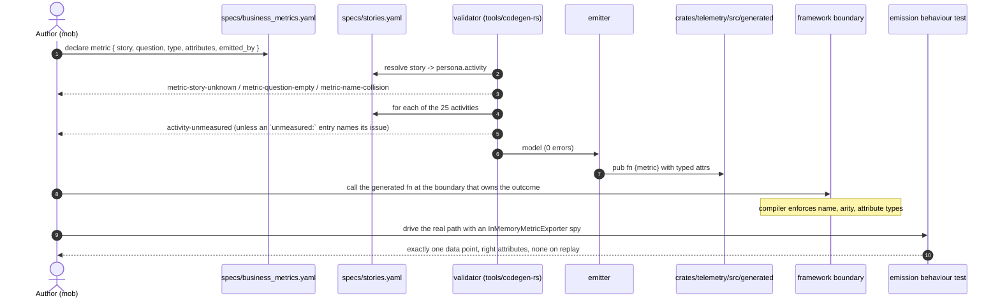
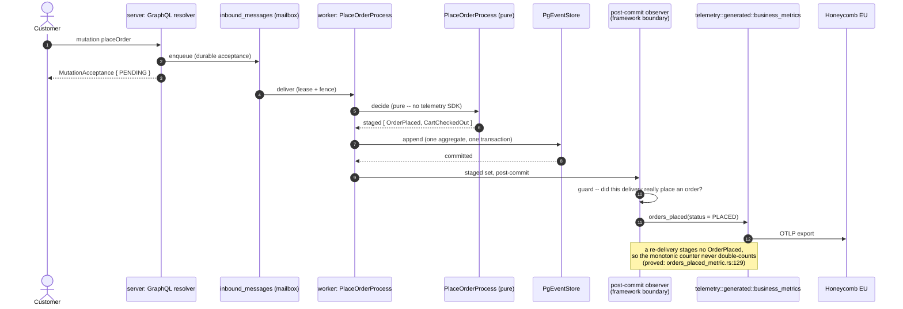
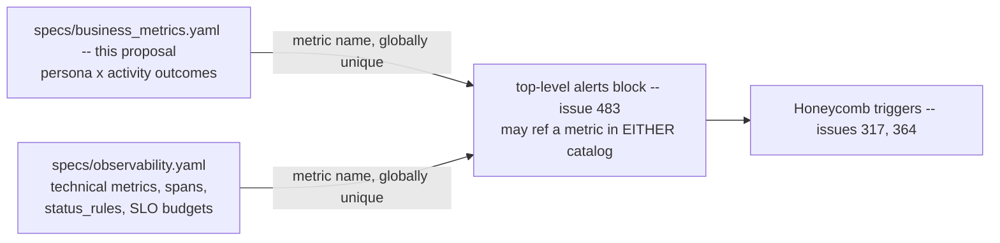

# PROP-20260810-234225 — Business metrics for every feature and every persona: where they are declared, and what makes the claim checkable

- **Status**: Proposed
- **Date**: 2026-08-10
- **Tracking issue**: [#484 "26 of the 29 declared `business_metrics` emit nothing: give business metrics their own catalog, keyed persona x activity, with a bidirectional coverage gate"](https://github.com/TheCaptainCompany/captain-food/issues/484)
- **Principle**: [ADR-20260810-234225 "Business metrics for every feature and every persona, developed with the test and the code"](../adr/ADR-20260810-234225-business-metrics-for-every-feature-and-every-persona.md)
- **Realized by**: _(filled at completion)_

> **Scope fence.** This proposal owns the **principle, the declaration mechanism and the
> enforcement**. It does **not** define the metrics themselves — the per-persona, per-activity grid
> (which outcome each activity should measure) is the `ux-designer` lens's parallel deliverable, and
> the two are designed not to overlap: this document decides *where a metric goes and what makes it
> real*, that one decides *what to measure*.

---

## 1. Context — what is true today

The product owner's directive is *"we must have business metrics for all features for each
persona"*, and *"during the analysis must be developed with the test and the code"*. A slot for that
already exists. It is almost entirely empty, and nothing says so.

### 1.1 Verified facts (`168fd77`)

| # | Fact | Evidence |
|---|---|---|
| F1 | `specs/observability.yaml` declares **14 contracts** carrying **29 `business_metrics` entries** (20 distinct names) | `specs/observability.yaml:213,334,407,474,550,695,776,855,926,993,1071` |
| F2 | **26 of the 29 have zero occurrences** in `crates/`, `tools/` or `deploy/` — no constant, no instrument, no call site | `grep -rl <name> crates/ tools/ deploy/` returns nothing for all 20 of: `refunds_settled_total`, `saga_compensation_total`, `customer_signins_total`, `otp_verifications_failed_total`, `prospect_contacts_sent_total`, `prospects_converted_total`, `prospects_cold_total`, `inbound_events_staged_total`, `inbound_events_delivered_total`, `webhook_duplicates_total`, `delivery_offers_total`, `delivery_dispatch_failed_total`, `delivery_self_dispatched_total`, `reclamations_decided_total`, `reclamations_overdue_total`, `sirene_records_created_total`, `sirene_records_updated_total`, `sirene_records_ignored_total`, `sirene_records_failed_total`, `event_store_version_conflicts_total` |
| F3 | Exactly **3** are emitted on a real path | `crates/infrastructure/src/mailbox/mod.rs:53` · `crates/adapters/stripe/src/outbound.rs:121` · `crates/infrastructure/src/projection/worker.rs:684` |
| F4 | The emitted-ness gate covers **3 of 14 contracts**, by a hardcoded allowlist, and asserts only that the metric's **name appears as a string constant** in `contract.rs` | `tools/codegen-rs/src/tests.rs:1500` — `for feature in ["command-acceptance", "place-order", "cart-price"]` |
| F5 | Two of those three contracts declare **zero** business metrics, so the gate's effective business-metric coverage is **2 of 29** | `command-acceptance` and `cart-price` have no `business_metrics:` block |
| F6 | `crates/telemetry/src/contract.rs` and `meters.rs` are **hand-written**, not generated | no `generated` marker; `crates/telemetry/src/` contains `contract.rs, http_client.rs, lib.rs, meters.rs, spans.rs` and no `generated/` |
| F7 | `specs/stories.yaml` holds **8 personas, 25 activities, 144 steps** | parsed from the file |
| F8 | Steps are operation calls, not outcomes: two different steps `$ref` the *same* query, and one step is a poll loop | `specs/stories.yaml:57-58` (`SeeCheckoutBreakdown`, `CompareWithUberEats` → `api.yaml#/queries/cart`); `PollOperationStatus` at line 61, ~30 fires per checkout per [#482](https://github.com/TheCaptainCompany/captain-food/issues/482) |
| F9 | The emission-proof pattern already exists, twice | `crates/infrastructure/tests/orders_placed_metric.rs:129` and `crates/server/tests/checkout_degraded_metric.rs` — `InMemoryMetricExporter` spy, asserts the point fires once and never on a replay |
| F10 | `specs/tests.yaml` is actor/command-shaped (`actor` + `when: command` + `then: events` / `thrown: errors`), so it cannot express "this metric fires when this event is appended" | 231 tests, all of that shape; the structural gap is [#212](https://github.com/TheCaptainCompany/captain-food/issues/212), decided 2026-07-28, unbuilt |
| F11 | `specs/observability.yaml` cannot express an alert at all — no `alerts` key, `alert` appears zero times in the validator | [#483](https://github.com/TheCaptainCompany/captain-food/issues/483) |

### 1.2 The consequence, plainly

A reader of `specs/observability.yaml` today concludes that the refund flow, the delivery dispatch
strategy, the reclamation SLA, the prospection funnel, the three webhook ingestions and the SIRENE
sync are all measured. **None of them is.** The DSL is the source of truth and here it reads as
coverage while emitting nothing — which is the same class of defect as a doc comment claiming
ownership is enforced on an unscoped query: it stops the next reviewer looking.

This matters for the directive specifically. If the principle is recorded as "declare a metric per
feature per persona" and the declaration is the only enforced half, we get 25 activities' worth of
new declarations on top of 26 dead ones, all certified green by `make validate`. The gate would then
be actively producing the false confidence it exists to prevent.

---

## 2. Recommended approach

In sequence, and the order is the point.

1. **Give business metrics their own catalog** — `specs/business_metrics.yaml`, root-level like
   `stories.yaml` and `tests.yaml` (it is cross-scope by nature: an activity spans scopes). Move the
   29 existing entries into it. `specs/observability.yaml` keeps only technical `metrics`. This is
   not a new concern; it is the split the file's own header already claims ("technical vs business
   signals (kept separate — see BAM)", `specs/observability.yaml:26`) made structural.
2. **Bind each metric to a `stories.yaml` persona ACTIVITY**, and make coverage bidirectional and
   ERROR-severity. That is the sentence *"every feature for every persona has a business metric"*
   compiled into `make validate`.
3. **Seed an enumerated `unmeasured:` waiver list** with all 25 activities, each entry naming the
   issue that will remove it. From that commit forward the rule is live: **nothing new can land
   unmeasured**, and the existing debt is a number that only goes down.
4. **Generate the instruments** into `crates/telemetry/src/generated/business_metrics.rs`, one typed
   emit fn per metric. Renames and attribute changes become compile errors at every call site; the
   metric-name half of the source-text scanner at `tools/codegen-rs/src/tests.rs:1500` is **deleted**,
   not extended (compiler first, ADR-20260803-234035).
5. **Backfill one activity per slice, in value-stream order**, each slice landing the declaration,
   the emission site and its `InMemoryMetricExporter` proof together, and removing its waiver entry.

Steps 1–4 are one GREEN chunk and make the principle structurally true. Step 5 is the proportionate
part.

---

## 3. Decisions surfaced

### D1 — Where is a business metric declared?

| Option | Pros | Cons |
|---|---|---|
| **A new root catalog `specs/business_metrics.yaml`; the 29 existing entries move; `observability.yaml` keeps only technical `metrics`** ✅ **recommended** | The unit is persona × activity by construction, so the coverage rule needs no contortion; keeps the ops/BAM split the repo already asserts, as two files rather than two blocks; a declaration stays small (name, type, attributes, story, question, owner) instead of dragging spans, `run_identity`, `status_rules` and SLO budgets it does not use; the word "critical workflow" keeps its meaning; the doc generator gets a clean persona × activity coverage table | A third observability-adjacent surface once [#483](https://github.com/TheCaptainCompany/captain-food/issues/483)'s `alerts` lands; needs a cross-catalog metric-name uniqueness rule; new loader kind + emitter; the 29-entry move touches a file three live emission sites read |
| Extend `specs/observability.yaml`: a `business_metrics` entry gains a `story:` ref, and contracts may bind a story activity as their `workflow` | No new file, no new loader kind; metrics arrive with criticality and status semantics; the existing 3-feature gate keeps working unchanged | Forces a *contract* onto activities that have no critical workflow — `FavoriteRestaurant`, `ConfigureProfile`, admin screens — so either "critical workflow" is diluted to mean "anything a persona does", or those activities can never be measured; every such contract must invent `spans`, `run_identity` (mandatory `correlation_id`+`trace_id`), `status_rules` and budgets it has no use for, because the validator requires them (`validate/core.rs:1113-1128`); the file goes from 1090 lines toward ~2500 and the ops on-call reads product funnels in it |
| Declare inline on each activity in `specs/stories.yaml` | The join is structural — no `$ref` can dangle; reading the story map shows what it measures; zero new files | Contradicts the file's own contract — *"This file is product knowledge — it does not define new operations, only wires personas to the existing api surface"* (`specs/stories.yaml:7-8`); a metric declaration **is** a new definition; makes the one file the whole §6 completeness gate rests on into a payload catalog; the metric loses its emission binding and attribute typing unless those move in too |
| Status quo — keep the `business_metrics` block, add nothing | Zero cost | Is the thing that produced 26 dead declarations. Not defensible against the directive |

### D2 — What is the unit of obligation: the story STEP or the persona ACTIVITY?

| Option | Pros | Cons |
|---|---|---|
| **The persona ACTIVITY (25 obligations)** ✅ **recommended** | Patton's backbone is the activity, and "feature × persona" *is* the activity — this is the directive read literally; 25 is a surface a team can hold in its head and a product owner can read on one page; an activity has an outcome (did the customer get food?), which is what a business metric measures | A large activity (`customer/OrderFood`, 22 steps) satisfies the rule with one metric, so the rule alone does not guarantee *depth* — depth comes from the `ux-designer` grid, not from the gate |
| The story STEP (144 obligations) | Finest granularity the map offers; the join is already validator-enforced in both directions (`op-uncovered-by-story`), so the rule is a copy-paste | 144 metric declarations is not measurement, it is a cardinality bill; two steps `$ref` the *same* query (`stories.yaml:57-58`) so one operation would owe two metrics; `PollOperationStatus` is a poll loop firing ~30x per checkout ([#482](https://github.com/TheCaptainCompany/captain-food/issues/482)) and would owe a metric for a retry mechanism; a step is a *call*, an outcome is not |
| The persona (8 obligations) | Trivially satisfiable; smallest possible surface | "Every feature for every persona" is not satisfied by one metric per persona — this answers a different question than the one asked |

### D3 — What do the validator rules look like?

| Option | Pros | Cons |
|---|---|---|
| **Four ERROR rules + an enumerated `unmeasured:` waiver list** ✅ **recommended** — `activity-unmeasured` (every persona activity is named by ≥1 metric, unless waived), `metric-story-unknown` (every metric's `story:` resolves to a real persona+activity), `metric-question-empty` (every metric states the decision it informs), `metric-name-collision` (unique across `metrics` + `business_metrics`) | Mirrors ADR-0032 exactly on the half where ADR-0032 applies; the waiver list makes the debt **countable and monotone** — `make validate` fails if you add to it, so it can only shrink; `metric-question-empty` is the anti-sprawl rule, and it is what turns telemetry into measurement | A waiver list is a mechanism that can rot if nobody prunes it — mitigated by requiring each entry to name its issue, and by the architect run reporting its length |
| The same four rules at WARNING severity | Lands with zero backfill; no waiver mechanism to maintain | Invisible by construction: this repo carries a drifting warning baseline (43 as of 2026-08-08) and CLAUDE.md explicitly instructs re-measuring rather than trusting the count, so one more warning kind changes no behaviour |
| Only the backward rule (`metric-story-unknown`), no coverage rule | Cheapest; no waiver list | Does not encode the directive at all. "Every feature for every persona" is precisely the forward direction |

### D4 — What binds declaration to emission, so a declared metric cannot be fiction?

| Option | Pros | Cons |
|---|---|---|
| **Generate the instruments (compiler) + require an emission behaviour test (`asserted_by:`)** ✅ **recommended** — `crates/telemetry/src/generated/business_metrics.rs` emits one `pub fn` per metric with the declared attributes as **typed parameters**; the emission proof is the `InMemoryMetricExporter` spy pattern of `crates/infrastructure/tests/orders_placed_metric.rs:129` | The compiler catches everything it can reach: rename a metric, change an attribute's name or type, add an attribute → compile error at every call site, not a silent contract violation; **deletes** the metric half of the source-text scanner rather than extending it (the #329 lesson); the behavioural half is proved behaviourally, which is exactly *"developed with the test and the code"*; both halves already have working precedents in the tree | The `asserted_by:` link cannot point into `specs/tests.yaml` today (F10) — it is actor/command-shaped, so the link waits on [#212](https://github.com/TheCaptainCompany/captain-food/issues/212). Until then the test is a **convention with two examples**, not a gate. Say so rather than pretend |
| Extend the existing source-text scanner from 3 contracts to all 14 | One-line change to an allowlist; ships today | Proves only that a string constant exists somewhere — it would have passed on all 26 dead metrics the moment someone added the constants, which is a 20-line change. It cannot see a call site. And it is the exact class of gate CLAUDE.md rules out where the type system can reach: the compiler-first directive was *earned* by [#329](https://github.com/TheCaptainCompany/captain-food/issues/329), seven review rounds and ~191 lines hardening a scanner over a boundary the compiler already enforced |
| Link-time registration (`linkme`/`inventory`): each emission site registers a marker; a generated test asserts every declared metric appears | Would be a genuine compile/link-time proof of "≥1 call site" | **Does not work here**, and the reason is worth recording: the registration static would live inside the generated emit fn, and a `pub` fn in a library crate is linked whether or not anything calls it — so the slice is populated for metrics nobody emits. Putting the registration at the call site instead makes it a line of ceremony a developer forgets exactly as easily as the metric call; it moves the risk rather than removing it. Adds a dependency with WASM-target friction for the Leptos side |
| Declaration only; emission by convention | Zero mechanism | Is the status quo. See F2 |

### D5 — Backfill: gate-forward with a shrinking waiver list, or one sweep?

| Option | Pros | Cons |
|---|---|---|
| **Gate forward now; backfill one activity per slice in value-stream order** ✅ **recommended** — order: `customer/OrderFood` → restaurant-manager order operations → `public_user/BrowseForFood` → rider → admin → `restaurant_sync` | The principle is **structurally true from the first commit** — nothing new lands unmeasured; each slice is small, reviewable and lands its emission + its proof together; metrics are declared when someone is about to look at them, which is when the right metric is knowable; `customer/OrderFood` is nearly free (`orders_placed_total` already emits); cardinality and Honeycomb cost grow with usefulness | The waiver list is visible debt for weeks — deliberately, and its length is a number the architect reports each run |
| One sweep: declare all 25 activities' metrics in one change | One design pass, one mob, consistent naming; the register row closes at once; no waiver mechanism to build or prune | **Already tried at this scale, and F2 is the receipt.** With no production and no users, most declarations would be unfalsifiable for weeks, so the first time anyone learns a metric was wrong is when it is expensive to change; ~25–60 new declarations reviewed by people who cannot yet check any of them against reality; the metrics for `admin/*` are genuinely not knowable today |
| Defer the whole thing until there is production traffic | No speculative work at all | Loses the only cheap moment: instrumenting *before* first traffic is how the first week of real orders teaches anything. And the go-to-market is build → show restaurants → onboard on the fly ([#400](https://github.com/TheCaptainCompany/captain-food/issues/400)), so the first sensing that pays off is the onboarding path — which starts at the demo, not at scale |

### D6 — What may a metric attribute be?

| Option | Pros | Cons |
|---|---|---|
| **A declared bounded set only — a `scalars.yaml` enum `$ref` or an explicitly enumerated list. Never an entity id** ✅ **recommended** | Keeps time-series cardinality bounded and predictable, which is the difference between a metric and a bill; ids already live on **spans** (`business.order_id`, `business.correlation_id`, `contract.rs:73-74`), which is the correct home for high-cardinality correlation; sidesteps a GDPR data-minimisation argument on the EU telemetry tenancy (ADR-20260729-183000) that we do not need to have; the validator can check it | A legitimate per-restaurant breakdown ("which restaurants are slow to accept?") must be answered from spans or a read model, not from a metric dimension — one extra hop for the analyst |
| Free-form attribute names, reviewed by humans | Maximum flexibility; no rule to write | Unbounded cardinality is a production incident that arrives as an invoice; "reviewed by humans" is what produced the 26 dead metrics |

### D7 — Is this one piece of work with [#483](https://github.com/TheCaptainCompany/captain-food/issues/483) (`alerts` is not expressible), or two?

| Option | Pros | Cons |
|---|---|---|
| **Two issues, one shared shape constraint** ✅ **recommended** — [#483](https://github.com/TheCaptainCompany/captain-food/issues/483) builds `alerts` as a **top-level block whose entries `$ref` a metric by name**, not as a per-contract key. That one sentence is the entire coupling | #483 is Priority Urgent tier-1 observability and stays unblocked — it does not wait on this proposal's approval; the constraint costs #483 nothing (a top-level block is not harder than a per-contract key) and keeps it able to alert on a business metric wherever the metric lives; the two concerns keep their own owners, lifecycles and reviewers — #483 is *technical absence of signal* (dead-man's switch, telemetry degrading silently), this is *what is worth knowing about the product* | Requires the constraint to actually be honoured; recorded here, in #483's refs, and in the register so it is not folklore |
| Merge into one DSL change | One design, one mob, one migration of `observability.yaml`; guaranteed consistency | Blocks an Urgent tier-1 observability fix behind a proposal that needs product-owner approval and a 25-activity backfill plan. Also merges two very different blast radii: `alerts` is ops posture (Honeycomb triggers, [#317](https://github.com/TheCaptainCompany/captain-food/issues/317), [#364](https://github.com/TheCaptainCompany/captain-food/issues/364)); this is product measurement |
| Fully independent, no constraint | Simplest coordination | #483 would most naturally add `alerts:` **inside** each contract — and then, once business metrics move out (D1), no alert could reference one. A dead-man's switch on `orders_placed_total` going to zero at 20:00 on a Friday is *the* alert this product needs, and it would be structurally unspellable |

---

## 4. Screen mockups

The "screens" of a DSL change are the surfaces a human actually reads: the authoring form, the gate's
refusal, and the coverage report the product owner works from.

### UC-1 — An author declares a metric (`specs/business_metrics.yaml`)

```
+--------------------------------------------------------------------------+
| specs/business_metrics.yaml                                              |
+--------------------------------------------------------------------------+
| version: 1                                                               |
|                                                                          |
| metrics:                                                                 |
|   orders_placed_total:                                                   |
|     description: A stranger paid us -- one real OrderPlaced append.      |
|     question: >                                                          |   <-- D3: refused if empty
|       Are orders actually completing end to end, and at what hourly      |
|       shape? Feeds the Friday/Saturday 19:00-21:30 peak view and the     |
|       dead-man's-switch alert (#483).                                    |
|     story:  { $ref: 'stories.yaml#/customer/activities/OrderFood' }      |   <-- D2: activity, not step
|     type: counter                                                        |
|     attributes:                                                          |
|       - { name: status, values: [PLACED] }                               |   <-- D6: bounded set only
|     emitted_by: { $ref: 'events.yaml#/OrderPlaced' }                     |
|     asserted_by: crates/infrastructure/tests/orders_placed_metric.rs     |   <-- becomes a tests.yaml
|     owner: ordering                                                      |        $ref once #212 lands
|                                                                          |
| unmeasured:                          # D3/D5: countable, monotone debt   |
|   - { story: 'stories.yaml#/admin/activities/ManagePlatform',            |
|       issue: 'https://github.com/.../issues/NNN' }                       |
+--------------------------------------------------------------------------+
```

### UC-2 — The gate refuses (`make validate`) — the state that must exist on `main` today

```
$ make validate
...
checks: 3 error(s), 43 warning(s)

ERROR activity-unmeasured      stories.yaml/rider/activities/RunDeliveries
  persona activity 'rider.RunDeliveries' is measured by no business metric --
  declare one in business_metrics.yaml, or add an `unmeasured:` entry naming
  the issue that will (ADR-20260810-234225).

ERROR metric-question-empty    business_metrics.yaml/delivery_offers_total
  metric declares no `question:` -- a metric that answers no decision is
  cardinality without a return.

ERROR metric-story-unknown     business_metrics.yaml/prospects_cold_total
  story ref 'stories.yaml#/prospector/activities/Outreach' resolves to no
  persona activity.
```

### UC-3 — The coverage report the product owner reads (generated)

```
+------------------------------------------------------------------------------------+
| specs/generated/documentation.generated.md  #  Business metric coverage             |
+------------------------------------------------------------------------------------+
| Persona            Activity                  Metrics  Emitting  Question stated     |
| -----------------  ------------------------  -------  --------  ----------------    |
| public_user        BrowseForFood                  0      0/0     --        [WAIVED] |
| customer           OrderFood                      2      1/2     yes                |
| customer           FavoriteRestaurant             0      0/0     --        [WAIVED] |
| customer           ConfigureProfile               0      0/0     --        [WAIVED] |
| restaurant_manager RunService                     0      0/0     --        [WAIVED] |
| rider              RunDeliveries                  0      0/0     --        [WAIVED] |
| ...                                                                                 |
| -----------------  ------------------------  -------  --------  ----------------    |
| TOTAL                          25 activities      29     3/29                       |
| MEASURED 1/25          WAIVED 24/25  (each naming its issue -- list only shrinks)    |
+------------------------------------------------------------------------------------+
```

That table is the deliverable behind *"the only way that will allow us to know the usage of the
product"*. Today the honest version of it reads `3/29`, and nothing in the repo says so.

### UC-4 — Failure state: a metric declared, never emitted (what slice 2 makes impossible to ship silently)

```
$ cargo build -p infrastructure
error[E0061]: this function takes 2 arguments but 1 argument was supplied
   --> crates/infrastructure/src/mailbox/mod.rs:53
    |
 53 |     telemetry::generated::business_metrics::orders_placed(Status::Placed);
    |                                             ^^^^^^^^^^^^^ missing `channel`
    |
note: generated from specs/business_metrics.yaml -- the attribute set changed there
```

---

## 5. Sequence diagrams

### 5.1 Authoring and gate flow — how a declaration becomes a fact



### 5.2 Runtime emission on the paid-order path — hexagonal-faithful, acceptance-first

The metric is emitted at a **framework boundary** after the append commits. The aggregate and the
process manager stay SDK-free (ADR-0012); nothing in the decision path knows a meter exists.



### 5.3 The D7 boundary — one shape constraint, two pieces of work



---

## 6. Alternatives considered for the cluster as a whole

- **Do nothing / record the principle in prose only.** The directive would be honoured on paper. It
  fails on F2: prose is exactly what produced 26 dead declarations, and this project's method is that
  a principle nobody can violate beats a principle everybody agrees with.
- **Do it all at once** — the catalog, all 25 activities' metrics, all emission sites, in one epic.
  Loses on D5's grounds, and on a scope point worth naming: it would put ~40 hours of speculative
  instrumentation ahead of [#429 "Production with test data"](https://github.com/TheCaptainCompany/captain-food/issues/429),
  which is the thing that would tell us whether any of the metrics are right.
- **Buy product analytics instead** (a hosted funnel/product-analytics SDK on the front end). Would
  answer the usage question faster for browsing funnels. Rejected here as a *scope* change rather
  than a technical one: it puts customer behaviour in a third-party US-default tenancy, reopens the
  GDPR posture settled by ADR-20260729-183000 (Honeycomb EU) and ADR-0042 (Frankfurt), and splits the
  answer to "what happened to this order" across two systems that do not share `correlation_id`. It
  is a real option and it should be a separate decision if the product owner wants it — see §8 Q7.
- **Fold this into [#400](https://github.com/TheCaptainCompany/captain-food/issues/400)'s epic
  without a mechanism decision.** #400 scopes 1–2 already ask for "mission metrics as first-class
  observability contracts" and "product analytics contracts, distinct from ops traces" — but it names
  no declaration site, no unit and no gate, which is why its DECISIONS.md §22 row has sat open since
  2026-08-08. This proposal is that missing mechanism; the epic keeps the *content* scopes (3 and 4)
  and the mission-metric grid.

---

## 7. Verification plan

**Which tests must fail on `main` today** — this is what proves the finding is real:

| Assertion | State on `168fd77` |
|---|---|
| `activity-unmeasured` for all 25 activities | **Fails** — 24 activities have no metric at all; only `customer/OrderFood` has one that emits |
| Every `business_metrics` entry resolves to a persona activity | **Fails** — the key does not exist |
| Every declared business metric has ≥1 emission site | **Fails 26 times** (F2) |
| Every declared business metric states its `question` | **Fails 29 times** — the key does not exist |
| Renaming `orders_placed_total` in the spec breaks the build | **Fails** — `contract.rs` is hand-written; the rename produces a *silently different metric name* and only the 3-feature scanner notices, in one direction |

**Per slice:**

- **Slice 1 (catalog + rules).** New validator rules with unit tests in `tools/codegen-rs` covering
  each rule's positive and **negative** case (a waived activity passes; an unwaived one fails; a
  dangling `story:` fails; a duplicate name across the two catalogs fails). `make validate` = 0
  errors, no NEW warning kind against a freshly re-measured `main` baseline. No `rules.yaml` entry —
  this is a gate, not a domain invariant.
- **Slice 2 (generated instruments).** A codegen test asserting the generated file matches the
  catalog byte-for-byte (the `generated_config_patterns_match_the_spec_byte_for_byte` pattern,
  `tools/codegen-rs/src/tests.rs:1580`); a deliberate mutation test proving a spec attribute change
  breaks a call site. The metric half of `the_required_observability_contracts_are_actually_emitted`
  is **deleted** in the same change, with the deletion justified in the PR body (deleting a gate the
  compiler subsumes is a correct outcome, ADR-20260803-234035).
- **Slice 3..n (per activity).** Each lands the emission site plus an `InMemoryMetricExporter`
  behaviour test in its own test binary (the process-wide `OnceLock` meter forces one provider per
  process — see the header of `crates/infrastructure/tests/orders_placed_metric.rs`), asserting the
  point fires once on the real path and **not** on a replay. Waiver entry removed in the same PR.

**Observability signal for the mechanism itself:** the generated coverage table (UC-3) is the report;
its `MEASURED n/25` line is what the architect quotes each run.

---

## 8. Open questions for the product owner

1. **Q1 (D1)** — Business metrics get their **own catalog** `specs/business_metrics.yaml`, and the
   29 existing entries move out of `specs/observability.yaml`. *Recommended: yes.*
2. **Q2 (D2)** — The obligation is **one metric per persona ACTIVITY** (25), not per story step
   (144). *Recommended: activity.*
3. **Q3 (D3)** — Coverage is enforced at **ERROR** severity with an enumerated, monotone-shrinking
   `unmeasured:` waiver list, not as a warning. *Recommended: yes — a warning here is invisible.*
4. **Q4 (D4)** — Emission is bound by **generated instruments (compiler) + a behaviour test**, and
   the existing source-text scanner's metric half is deleted rather than extended. *Recommended:
   yes.*
5. **Q5 (D5)** — The gate lands now; the 25 activities are backfilled **one slice at a time in
   value-stream order**, not in one sweep. *Recommended: gate-forward.* (This is the question where a
   different answer changes the most work.)
6. **Q6 (D6)** — Metric attributes are **bounded sets only**; entity ids stay on spans. *Recommended:
   yes.*
7. **Q7 (D7 / §6)** — Do we ever want a **hosted product-analytics SDK** on the front end in addition
   to this? It would answer browsing-funnel questions faster and it is a genuine option — but it is a
   data-residency and vendor decision, not a technical one, so it is asked rather than assumed.
   *Recommended: not now; revisit after the first real orders.*

---

## 9. Refs

- `specs/observability.yaml:26` — the ops/BAM split this proposal makes structural
- `specs/observability.yaml:213,334,407,474,550,695,776,855,926,993,1071` — the 11 `business_metrics:` blocks (29 entries)
- `specs/stories.yaml:7-8` — *"does not define new operations, only wires personas to the existing api surface"* (the D1 option-C objection)
- `specs/stories.yaml:57-58,61` — two steps on one query; the poll-loop step (the D2 evidence)
- `tools/codegen-rs/src/tests.rs:1500` — the 3-of-14 allowlist; `:1541-1550` — the metric half that gets deleted
- `tools/codegen-rs/src/tests.rs:1580` — `generated_config_patterns_match_the_spec_byte_for_byte`, the byte-for-byte precedent for slice 2
- `tools/codegen-rs/src/validate/core.rs:738-820` — the story-map completeness rules these mirror; `:1072-1165` — the observability §8 rules that make D1 option B expensive
- `crates/telemetry/src/contract.rs:83-140` · `crates/telemetry/src/meters.rs` — hand-written today
- `crates/infrastructure/src/mailbox/mod.rs:53` · `crates/adapters/stripe/src/outbound.rs:121` · `crates/infrastructure/src/projection/worker.rs:684` — the three real emission sites
- `crates/infrastructure/tests/orders_placed_metric.rs:129` — the emission-proof pattern
- [ADR-20260810-234225 "Business metrics for every feature and every persona"](../adr/ADR-20260810-234225-business-metrics-for-every-feature-and-every-persona.md) — the principle
- [ADR-0032 "Business rules and completeness gates"](../adr/0032-business-rules-and-completeness-gates.md) — the precedent, and where it stops
- [ADR-0012 "Domain / infra / observability separation"](../adr/0012-domain-infra-observability-separation.md) — no telemetry SDK in the domain
- [ADR-20260803-234035 "Compiler first; a check is the fallback"](../adr/ADR-20260803-234035-compiler-first-a-check-is-the-fallback.md)
- [ADR-20260729-183000 "Telemetry is Honeycomb EU and degrades, never gates"](../adr/ADR-20260729-183000-telemetry-is-honeycomb-eu-and-degrades-never-gates.md) — the D6 residency constraint
- [#484 "26 of the 29 declared `business_metrics` emit nothing…"](https://github.com/TheCaptainCompany/captain-food/issues/484) — tracking issue
- [#400 "Epic: reality-sensing infrastructure — agents closer to customers, mission metrics as contracts"](https://github.com/TheCaptainCompany/captain-food/issues/400) — parent epic; this is its missing mechanism
- [#483 "Every alert we have can only fire when signal ARRIVES…"](https://github.com/TheCaptainCompany/captain-food/issues/483) — D7
- [#212 "ADR-0032 completeness cannot reach projectors or read guards"](https://github.com/TheCaptainCompany/captain-food/issues/212) — the `asserted_by:` dependency
- [#482 "paymentStatusChanged is subscribed by nobody: the money path polls 30x1s…"](https://github.com/TheCaptainCompany/captain-food/issues/482) — the poll-loop evidence for D2
- [#329](https://github.com/TheCaptainCompany/captain-food/issues/329) — why D4 does not extend the scanner
