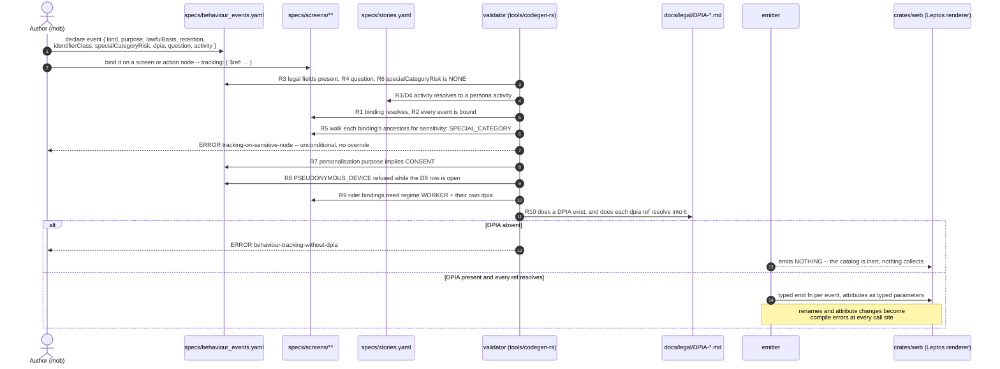
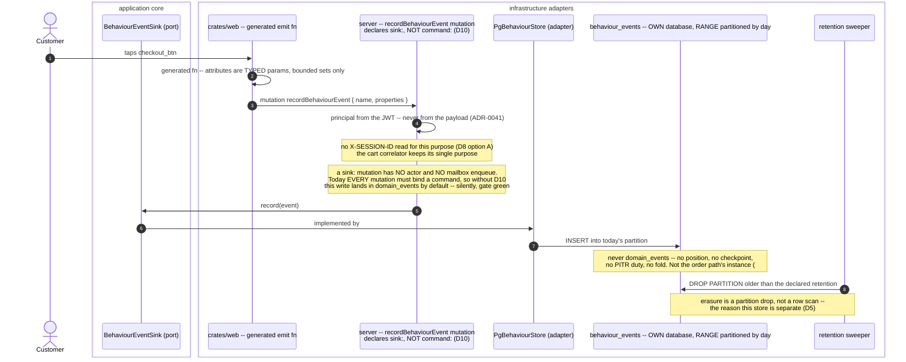
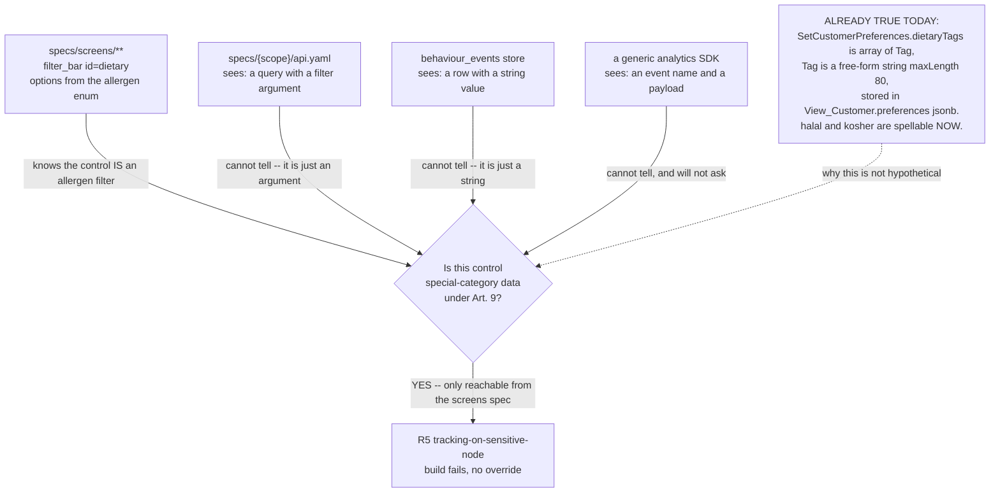
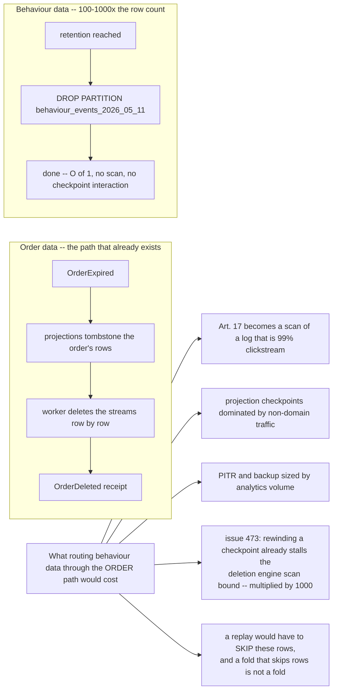

# PROP-20260811-000946 — Behaviour event tracking declared inside the screens spec: the UI spec already IS the event taxonomy, and it is the only artifact that can refuse an Article 9 event

- **Status**: Proposed
- **Date**: 2026-08-11
- **Tracking issue**: [#485 "Behaviour event tracking has no declaration site, and the one place that knows a component is an allergen filter is the only place that can refuse it"](https://github.com/TheCaptainCompany/captain-food/issues/485)
- **Companion half**: [PROP-20260810-234225 "Business metrics for every feature and every persona"](PROP-20260810-234225-business-metrics-for-every-persona.md) · [#484 "26 of the 29 declared `business_metrics` emit nothing…"](https://github.com/TheCaptainCompany/captain-food/issues/484)
- **Realized by**: _(filled at completion)_
- **Concerns**:
  - [ ] DPIA-before-processing: no live instrumentation may be generated until a DPIA exists — the gate in D6/R10 must be built and tested, not promised
  - [ ] Counsel review: every legal claim below is marked VERIFY-FIRST and none has been reviewed by licensed counsel
  - [ ] Rider regime: the rider taxonomy is a SEPARATE processing and must not be built under this proposal's basis

> **Scope fence.** This proposal owns **half two** of the product owner's directive — *"integrate the
> behaviour event tracking inside the screens spec."* **Half one is already recorded and is not
> re-derived here**: [PROP-20260810-234225](PROP-20260810-234225-business-metrics-for-every-persona.md)
> and [#484](https://github.com/TheCaptainCompany/captain-food/issues/484) cover metrics-in-the-spec —
> the `specs/business_metrics.yaml` catalog keyed persona × activity, the four ERROR rules, generated
> instruments, the `unmeasured:` waiver list. The directive's first clause is an **endorsement of that
> direction, not a new ask**: D1–D7 there stand as written and nothing below changes them. The only
> thing this proposal adds to that half is one join key (D4) and one row on its generated coverage
> table (UC-6).
>
> This proposal also does **not** define the events themselves. It defines the declaration mechanism,
> what a declaration must carry, where the records go, and what the validator refuses. **The first
> slice ships zero events on purpose** (D7).

---

## 1. Context — what is true today

### 1.1 Verified facts (`8ee073b`)

| # | Fact | Evidence |
|---|---|---|
| F1 | **There is no behaviour tracking anywhere.** `clickstream`, `session replay`, `behaviour_event` and `Art. 9` return **zero hits** across `specs/`, `crates/` and `docs/` | repo-wide grep |
| F2 | **The DSL cannot express a lawful basis for anything.** `lawfulBasis` and `legitimate interest` appear **zero times in `specs/`** | repo-wide grep |
| F3 | **No DPIA, no privacy notice and no terms of service exist.** This is not a new discovery — it is the standing content of [#194](https://github.com/TheCaptainCompany/captain-food/issues/194) | [#194](https://github.com/TheCaptainCompany/captain-food/issues/194); `docs/adr/ADR-20260810-194548-…:76` restates it as an *"unrelated blocker"* |
| F4 | **The client-side device identifier already exists.** `X-SESSION-ID` is *"a client-generated UUID, kept in a cookie / app cache; identifies anonymous users end-to-end"*, validated at the transport boundary and injected into GraphQL execution data | `crates/server/src/graphql/session.rs:1-15,54-62` |
| F5 | **Special-category-adjacent data is already declared, already stored, and free-form.** `SetCustomerPreferences.dietaryTags` is `array<Tag>`; `Tag` is `type: string, maxLength: 80`, *"Free-form label… Example: 'vegan', 'spicy', 'eco'"*; it lands in `View_Customer.preferences` jsonb as `{ dietary_tags: [...] }`. `halal` and `kosher` are spellable values **today**, with no enum, no classification and no rule | `specs/customer/commands.yaml:179-182` · `specs/common/scalars.yaml:145-148` · `specs/customer/events.yaml:140-150` · `specs/database/tables/projection_tables.yaml:337` · `specs/tests.yaml:49` |
| F6 | **`dietaryTags` is reachable from no screen.** `setCustomerPreferences` and `dietary` return zero hits across `specs/screens/*.yaml` | grep over `specs/screens/` |
| F7 | **Allergens do not exist in code, and the model is decided.** `allergen` has **zero occurrences in `specs/catalog/*.yaml`**; the 14-category Annex II enum + explicit `NOT_DECLARED` (which gates orderability) was decided 2026-08-08 and is unbuilt | `grep -ri allergen specs/catalog/` = 0 · PROP-20260726-165500 §D1 · [ADR-20260808-171056](../adr/ADR-20260808-171056-register-sweep-consent-decisions.md) · [#184](https://github.com/TheCaptainCompany/captain-food/issues/184) |
| F8 | **The screens DSL already declares the full interaction surface.** 25 screens across 5 files, each with a `resolvers` allowlist, an `actions` allowlist (`kind: client \| mutation \| gap`), a `component_registry` of ~90 allowed component types, and per-screen `roles`/`data_requirements`/`gaps` | `specs/screens/*.yaml`; registry at `restaurant_frontoffice.yaml:136-146` |
| F9 | **But the screens surface covers roughly half the product.** **61 of the 121 api operations** (32 queries + 86 mutations + 3 subscriptions) are bound in a screen file; **6 of the 25 persona activities** have **no** screen-bound operation at all | computed over `specs/screens/*.yaml` × `specs/*/api.yaml` × `specs/stories.yaml` |
| F10 | **The gap is concentrated on the restaurant-owner and admin side.** `restaurant_backoffice.yaml` contains **zero occurrences of the string `catalog`** — `restaurant_owner/ManageCatalog` (14 steps) has no screen. `admin` has 7 activities and 1 screen. `ManageCatalog` 1/14, `ConfigureProfile` 2/12, `admin/OnboardRestaurants` 1/5, `admin/Pricing` 1/4 | `grep -c catalog specs/screens/restaurant_backoffice.yaml` = 0 · the per-activity table in §3 D2 |
| F11 | **A screen node does not identify a persona.** Home, search, restaurant and cart all carry `roles: [PUBLIC, CUSTOMER]` — the two personas whose funnels we would most want to tell apart share every screen in the discovery path | `captain_frontoffice.yaml:181,229` · `restaurant_frontoffice.yaml:298,338` |
| F12 | **A behaviour event is not a domain event, and the log is not shaped for it.** `domain_events` is **not partitioned**; retention is a per-stream `$maxAge`/`$maxCount` sweep plus an `AFTER INSERT` trigger, and erasure is row-level tombstone-then-stream-deletion | `specs/database/tables/eventstore.yaml:9-42` · [ADR-20260731-160000](../adr/ADR-20260731-160000-order-erasure-tombstone-then-stream-deletion.md) |
| F13 | **A business-activity projector already exists and is the right neighbour, not the right home.** The C4 declares a `bam` container — *"Business Activity Monitoring projection… business_metrics only"* — consuming `domain_events` | `specs/architecture/c4-l3.yaml:102-105` · `c4-l2.yaml:370,484` |
| F14 | **Sharing the order path's database with analytics is already a filed risk.** `deploy/generated/manifests/bins/bam.yaml` points BAM at the same `DATABASE_URL` as the order path with `temp_file_limit` unset | [#443](https://github.com/TheCaptainCompany/captain-food/issues/443) |
| F15 | **The domain already stitches anonymous to authenticated, without any analytics identifier.** `CustomerIdentified` carries `sessionId` precisely so *"the visitor's OPEN guest carts can be bound to the customerId"*; `CartBindingProcess` performs the association | `specs/customer/events.yaml:50-70` · `specs/ordering/api.yaml:136` |
| F16 | **A GraphQL mutation in this system is structurally a COMMAND that routes to an actor.** `op-missing-command` is an **ERROR** — *"mutation declares no command."* — and `mutation-command-unhandled` requires an actor to handle it. All **86** mutations bind a `commands.yaml` `$ref`; **zero** do not. So a mutation, declared the only way the DSL currently allows, enqueues on the actor mailbox and its handler appends to `domain_events` | `tools/codegen-rs/src/validate/core.rs:292,295,301`; measured over `specs/*/api.yaml` |
| F17 | **The acting principal is already envelope metadata, never payload.** ADR-0041: `user_id`/`user_type` are recorded on `domain_events` by infrastructure, and *"the actor/user who performed an event is envelope metadata… not a payload field"* | `CLAUDE.md` conventions · `specs/database/tables/eventstore.yaml:18-19` |

### 1.2 The consequence, plainly

Two things are true at once, and both matter.

**The instinct is right, and the reason is stronger than it first looks.** F8 says the screens DSL
already declares every screen, every component, every action and every navigation. That means the UI
spec **already contains the complete event taxonomy** — not a description of it, the thing itself. A
tracking declaration bound to it is an allowlist *by construction*: an event that no screen node binds
cannot fire, because there is no node to fire it. The alternative everyone actually ships — a
`track()` call a developer adds wherever they remember to — is a firehose someone has to prune, and
pruning a firehose is a privacy programme, not a code review.

**And there is exactly one place that knows what a component *is*.** F5 and F7 are the finding. A
generic analytics pipeline sees `filter_bar` with `id: dietary`; it cannot know that the values
flowing through it are religious belief and health data. `specs/screens/**` knows, because that is
where the filter is declared, with its id, its options and its resolver. **That is the argument for
this location, and it is not an aesthetic one**: it is the only location where the rule *"this control
may never be tracked"* can be written at all.

F5 makes it concrete and current rather than hypothetical. `dietaryTags` is not a future risk — it is
declared, stored in a jsonb column, free-form (so `halal` and `kosher` are already spellable), and
reachable from no screen (F6). Nobody has done anything wrong: nothing is running. But the moment a
preferences screen is built and a tracking pipeline exists, the default outcome is that a cooperative
in Tours is holding inferred religious-belief data about its customers because a `Tag` scalar had a
`maxLength` and no enum.

**Meanwhile the derivation instinct — "just derive tracking from the screen tree" — fails on F9–F11**,
and it fails in the direction that matters: it under-covers the half of the product that has no
screens (F10) and over-attributes the half that has them (F11). §3 D2 is that argument in full.

---

## 2. Recommended approach

In sequence, and as with the metrics half, the order is the point.

1. **Declare the taxonomy in its own root catalog, `specs/behaviour_events.yaml`** — the legal fields
   live with the event definition, where a DPIA can be generated from them. Bind it **from**
   `specs/screens/**` with a `tracking:` key on screen and action nodes: *what the event is* lives in
   the catalog, *where it can fire* lives on the screen. Neither half is complete alone, and that
   split is what makes both rules checkable (D1).
2. **Make the dangerous kinds unspellable rather than forbidden.** `kind:` is `VIEW | INTERACTION`
   and nothing else — there is no `IMPRESSION` value and no session-replay concept in the grammar, so
   the refusal is not a policy someone can argue with (D3, D6).
3. **Add `sensitivity:` to screen nodes and refuse tracking under it.** Land this **before**
   [#184](https://github.com/TheCaptainCompany/captain-food/issues/184) builds the allergen filter
   (F7): the gate before the thing it protects, which is the one ordering that is free now and
   expensive later.
4. **Send the records to their own store** — a `behaviour_events` table in its own database, RANGE
   partitioned by day, never `domain_events` and never the order path's instance (D5).
5. **Ten ERROR-severity validator rules**, in the same style the metrics half chose, plus the one
   that is not like the others: **the emitter produces no instrumentation while no DPIA exists** (D6
   R10).
6. **Ship the mechanism with zero events.** Then the DPIA. Then the first three events, server-side,
   authenticated (D7).

Steps 1–5 are one GREEN chunk. Step 6's first two parts are the whole of slice 1 and slice 2, and
slice 2 is a legal deliverable rather than code.

**Why this is not an "intermediate step" under ADR-20260808-235113.** The mechanism *is* the final
shape; what is deferred is content, exactly as [#484](https://github.com/TheCaptainCompany/captain-food/issues/484)'s
D5 defers metric content behind a live gate. And the deferral of instrumentation is not a convenience:
**instrumentation shipped before a DPIA is processing that should not have started** (D8/legal).

---

## 3. Decisions surfaced

### D1 — Where exactly is a behaviour event declared?

| Option | Pros | Cons |
|---|---|---|
| **Split: a root `specs/behaviour_events.yaml` catalog for the definition, plus a `tracking:` `$ref` binding on screen/action nodes in `specs/screens/**`** ✅ **recommended** | The two halves answer two different questions and both are checkable: the catalog answers *what is this event and under what basis* (and is the DPIA's generated input), the binding answers *where may it fire* (and is the allowlist). Mirrors the shape the screens DSL already uses for data — `resolvers`/`actions` are allowlists that `$ref` a definition living elsewhere (`api.yaml`), so this is the file's own idiom, not a new one. Legal fields sit in ONE place, so a DPIA generator reads one file rather than walking five screen trees. The `sensitivity:` refusal (D3) still works because it evaluates on the SCREEN side, where the component is. Parallel to `business_metrics.yaml` (D4), so the persona × activity report is one join | Two files to keep in step — mitigated by making the binding bidirectional and ERROR-severity (R1/R2). A new root catalog kind for the loader, the fourth observability-adjacent surface after `observability.yaml`, `business_metrics.yaml` and [#483](https://github.com/TheCaptainCompany/captain-food/issues/483)'s `alerts` |
| Everything inline in `specs/screens/**` — a full `tracking:` block per screen and per action, legal fields included | One file, one place to look; impossible for a binding to dangle | The legal fields are the problem. `purpose`/`lawfulBasis`/`retention` are properties of a **processing**, not of a widget, and the same event fires from several nodes (the cart FAB and the bottom-nav cart entry are one event). Inline forces either duplication — five copies of a lawful basis that must agree, with nothing checking that they do — or a de-facto catalog with worse ergonomics. A DPIA assembled by walking five screen files is a DPIA nobody regenerates. It also puts legally reviewed text in the file that is *"runtime-editable via Supabase `screen_specs`"* (`captain_frontoffice.yaml:14`), which is the wrong mutability class for a lawful basis |
| Everything in the root catalog, binding by an address expression (`screen: checkout, component: place_order_btn`) — screens untouched | No edits to five screen files; the taxonomy is one reviewable document | The address is a **string**, so it is not a `$ref` and the loader cannot prove it resolves; it silently rots the first time a component id changes, which is precisely the failure the screens DSL was built to prevent. Worse, it defeats the whole reason for choosing this location: the `sensitivity:` refusal needs the tracking declaration to be structurally *inside* the subtree it is refused from, and an external address that merely names a node can always be written for a node the author did not read |
| Status quo — no declaration; instrument in the Leptos renderer as needed | Zero mechanism, zero cost | This is how every firehose starts, and it forfeits the one advantage this codebase has: the taxonomy would be discovered by reading `crates/web`, which is exactly where a legal reviewer will not look. It also makes F5's `dietaryTags` exposure a matter of whether a developer thought about it |

### D2 — Derived from screen structure, or authored per event?

**This is the question the `ux-designer` lens was asked, and the answer is quantitative.**

| Option | Pros | Cons |
|---|---|---|
| **Authored per event, with the BINDING (not the event) proven complete both ways** ✅ **recommended** — every declared event must be bound by ≥1 screen node, and every `tracking:` binding must resolve; but a node without a binding is simply not tracked, and that is legal and normal | Keeps the allowlist property (nothing fires that no node binds) without inheriting the screen tree's coverage holes. An event gets a NAME a human chose and a `question` it answers, so the taxonomy reads as product knowledge rather than as a DOM dump. Attribution stays honest: the author states which persona activity an event belongs to, which is the only way to resolve F11. Un-tracked nodes are the default, which is the correct default for personal data | The forward direction is not enforced — there is no "every screen must be tracked" rule, so coverage is a judgement rather than a gate. **That is deliberate**, and it is the opposite of the metrics half: for metrics, uncovered means unmeasured and the rule pushes coverage UP; for behaviour events, uncovered means not-collected and a rule pushing coverage up would be a rule mandating surveillance |
| Derived by default from screen/action id, with `tracking: false` opt-out | Zero authoring cost; complete by construction over the screens that exist; renames propagate automatically | **Fails on the numbers.** (i) *Under-covers*: 61 of 121 operations are screen-bound (F9) and 6 of 25 activities have no screen at all (F10) — `restaurant_owner/ManageCatalog` is 14 steps with zero screens, `admin` is 7 activities with 1 screen. A derived taxonomy would produce a product picture that is systematically blind to the restaurant-owner and admin experience, and blind in a way nothing reports. (ii) *Over-attributes*: four discovery screens are `roles: [PUBLIC, CUSTOMER]` (F11), so a derived event cannot say which persona's activity it belongs to — and the one operation `ManageCatalog` does share with a screen is `queries/catalog`, read by *customers* on the storefront, so a naive derivation attributes customer menu-browsing to the owner's catalog-management activity. (iii) *Opt-out is the wrong default for personal data*: a new screen would start collecting on merge, and the reviewer who forgets `tracking: false` produces a processing nobody decided to start. (iv) It cannot carry a lawful basis or a purpose, because those are not derivable from a widget |
| Authored per event AND enforced forward (every interactive node must declare tracking or `tracking: none`) | Total coverage of intent — every control's tracking status is explicit and reviewed | Turns ~90 component types across 25 screens into a mandatory annotation with no product question behind most of them, and makes `tracking: none` the most common line in the UI spec. Worse in kind: a forward gate on *collection* is a gate that ratchets toward more collection, and data minimisation (Art. 5(1)(c)) is the principle it would be arguing with |

**What the ux-designer lens contributes beyond the numbers** — applied from
`.claude/agents/ux-designer.md`, which the parent should also run as a live briefing lens before any
code (§7 notes why this proposal could not spawn it):

- **The journey is the unit, not the screen.** A derived taxonomy has one event per node and no
  concept of *sequence*, but every question worth asking is about a sequence: "how many people who
  opened the menu reached a cart". Authoring lets one event carry the activity it belongs to, which
  is what makes the funnel expressible at all.
- **The states that matter most are not nodes.** The lens's own doctrine is that *"empty, loading and
  error states are screens"* and that *"the worst UX state in delivery is silence after payment"*.
  The single most valuable behaviour signal in this product is **how long the customer stared at a
  tracking screen whose ETA had gone stale** — and that is a *state*, not a component; no derivation
  from the component tree can name it. Meanwhile derivation would faithfully generate an event for
  every `divider` and `spacer`.
- **Peak is where instrumentation costs.** Friday 19:00–21:30 is exactly when a derived per-node
  firehose is heaviest and when the back-office board must stay glanceable. An authored taxonomy is
  the only version where someone decided what is worth the bytes.

### D3 — What does an event declaration carry, and which kinds exist?

The three kinds the product owner named are genuinely different, and only one is structurally implied
by the DSL today.

| Kind | Derivable from the DSL? | Recommendation |
|---|---|---|
| **INTERACTION** — an action fired | **Yes.** `action: { type: … }` nodes are a declared allowlist per file (F8) | **In scope.** This is the kind the DSL structurally implies, and the kind that answers "is the product usable" |
| **VIEW** — a screen was routed to | **Partly.** `screens[].id`/`route` exist, but "routed to" is a runtime fact | **In scope.** Cheap, low cardinality, and needed as the denominator of every funnel |
| **IMPRESSION** — what was actually *seen* | **No.** `items: "{{ featured_restaurants }}"` is runtime data; which items entered the viewport is not in the spec at all | **Unspellable in v1** — see below |

| Option | Pros | Cons |
|---|---|---|
| **`kind:` is a closed enum of `VIEW \| INTERACTION`. `IMPRESSION` and session replay are not values and not concepts — the grammar cannot express them.** Legal fields `purpose`, `lawfulBasis`, `retention`, `identifierClass`, `specialCategoryRisk`, `dpia` are all REQUIRED with no defaults; product fields `question` and `activity:` mirror `business_metrics.yaml`; `attributes` are bounded sets only (metrics D6 parity — an enum `$ref` or an enumerated list, never an entity id and never free text) ✅ **recommended** | Compiler-first applied to a DSL: the mistake is unspellable rather than reviewed (ADR-20260803-234035). Impression tracking is the kind that (a) requires client machinery the renderer does not have, (b) generates the highest volume by an order of magnitude, and (c) is the one that turns a *menu* into a health-and-religion inference engine — "this person looked at the halal section for 40 seconds" is an Art. 9 inference produced by nobody's intent. Refusing it in the grammar means adding it later is a **visible, recorded decision with its own DPIA**, which is the correct cost. No defaults on legal fields means an author cannot inherit a lawful basis they did not think about — the single most common way analytics taxonomies go wrong. Bounded attributes keep free text (and therefore arbitrary PII) out by construction, and inherit the metrics half's cardinality argument for free | Genuine analytical loss: recommendation and merchandising ("which dishes get seen but not ordered") need impressions, and that is a real product question the restaurant would value. Answer: it is a real question and it deserves its own decision and its own DPIA — not to arrive as a side effect of a pipeline. Two enums to keep aligned with the metrics catalog |
| Open `kind:`, with impressions and replay discouraged in the doctrine header | Flexible; no rework when merchandising analytics is wanted; the doctrine header is where this repo puts guidance anyway | Prose cannot refuse anything, and this project's own method says so — the `makefile_recipe_lines_are_ascii` precedent exists because a rule that could be ignored was. "No session replay, ever" is a hard constraint; encoding a hard constraint as a comment in a YAML header is the exact defect class this audit keeps finding elsewhere |
| Legal fields optional, defaulted to the safest value | Lower authoring friction; nothing is ever unset | A default lawful basis is a lawful basis nobody chose, and Art. 5(2) accountability is about being able to show *who decided what and why*. A defaulted `specialCategoryRisk: NONE` in particular would make the one field whose entire purpose is to force the author to look into the one field the author never sees |

#### D3a — The typing audit of this catalog (ADR-20260811-014129 Decision 2)

The product owner's *"heavily strongly typed the spec, no string in it"* applies here as much as to the
metrics grammar, and this catalog had one violation that matters more than the rest.

| Field | Today's draft | Verdict |
|---|---|---|
| the event id (`checkout_started`) | bare name | ✅ **DECLARATION** — correct, and the only place a bare name is |
| `kind` | `INTERACTION` | ✅ closed set (`VIEW\|INTERACTION`) — a typo is a parse error |
| `purpose` | `UNDERSTAND_PRODUCT_USE` | ✅ closed set, and it **must** be: R7 keys off "is this purpose in the personalisation family", which is unimplementable over free text |
| `lawfulBasis` · `identifierClass` · `specialCategoryRisk` · `regime` | tokens | ✅ closed sets. `specialCategoryRisk` especially: R6 refuses anything but `NONE`, which is only checkable against a closed set |
| `question` · `description` | prose | ✅ **prose stays prose** — typing it would be theatre |
| `activity` · `dpia` | `$ref` | ✅ references, already refs |
| **`attributes: [{ name: serviceType, values: [DELIVERY, COLLECTION] }]`** | **hand-written list** | ❌ **the real defect.** `ServiceType` is a kernel scalar with exactly those members (`specs/common/scalars.yaml:260-262`), so this is a **verbatim restatement of a domain enum in a tracking spec** — the "one name = one dedicated scalar" convention violated in the file whose whole job is to keep the taxonomy honest. It goes stale the day a third service type is added, and it goes stale *silently*: the tracking spec would keep recording an attribute whose declared members no longer match the domain's |
| **`retention: P90D`** | **free duration string** | ❌ **contradicts a recorded legal position.** [docs/legal/BRIEF-20260808-account-erasure-two-path.md:82](../legal/BRIEF-20260808-account-erasure-two-path.md): *"This table IS the written retention schedule CNIL expects — windows declared **once, in the DSL**, feeding both the sweep and the DPIA."* A free duration lets an author invent a window counsel never approved, and `P90DD` is not a parse error. No duration scalar exists today (`Duration`, `Retention`, `interval` = zero hits in `specs/common/scalars.yaml`) |

**`attributes:` — the fix.** An attribute's value set is a `$ref`, never a list:

```yaml
attributes:
  - from: { $ref: 'scalars.yaml#/ServiceType' }   # name AND members derived from the scalar
```

| Option | Pros | Cons |
|---|---|---|
| **`values:` must be a `$ref` — to a domain scalar where one exists, or to an enum declared once in this catalog where the set is genuinely UI-only** ✅ **recommended** | The domain enum stays the single source: add `EAT_IN` to `ServiceType` and every tracking attribute over it follows, with no sweep and no drift. A UI-only set (say a sort order with no domain counterpart) is still expressible — it is *declared once* in the catalog, which is a declaration and therefore legitimate, then referenced. Enforced by `value-set-not-scalar-backed` (R13, metrics D8) | An author who wants a *subset* of a scalar's members must say so explicitly (`only:` / `except:`), which is one more shape — and arguably a good thing, because a silent subset is how a taxonomy stops matching the domain |
| Allow an inline list, with a rule that it must match a scalar if one exists | Lower authoring friction for one-offs | The rule has to compare a hand-written list against a scalar's members and say "these agree" — which is a check that a duplicate is currently correct, not a mechanism that prevents duplication. The next member added makes it fail somewhere far from where it was caused |
| Keep hand-written lists | Nothing to build | Is the defect. It is also the exact thing this proposal criticises the rest of the repo for |

**`retention:` — the fix.** A `$ref` into a declared retention-window catalog owned by the legal
table, not a duration literal:

```yaml
retention: { $ref: 'retention.yaml#/BEHAVIOUR_ANALYTICS_90D' }
```

| Option | Pros | Cons |
|---|---|---|
| **A declared retention-window catalog, `$ref`'d** ✅ **recommended** | It is not new work — the legal brief already *has* the table and already says the windows are *"declared once, in the DSL"*; this makes that sentence true. An author cannot invent a window: the set is what counsel approved. One place to change when a window changes, feeding the sweep, the DPIA and this catalog together. It also gives the erasure sweep and the behaviour store the same vocabulary, which is the point of declaring it once | A new catalog to create, and it needs an owner. It is arguably [#194](https://github.com/TheCaptainCompany/captain-food/issues/194)'s work rather than this proposal's — so this proposal *depends* on it rather than building it, and says so |
| A `Duration` scalar with an ISO-8601 `pattern:` | Cheap; catches `P90DD`; no new catalog | Catches typos and nothing else. The failure that matters is not a malformed duration, it is a **well-formed window nobody approved** — and a pattern cannot tell those apart |
| Leave it a free string | Zero cost | Contradicts a recorded legal position, in the field where that position is load-bearing |

### D4 — How does this bind to the metrics catalog?

| Option | Pros | Cons |
|---|---|---|
| **Separate catalogs sharing exactly ONE thing — the `activity:` `$ref` into `stories.yaml` — plus one global name-uniqueness namespace** ✅ **recommended** | The two answer different questions over the same backbone: a business metric asks *did this persona achieve the outcome* (a fold over `domain_events`, emitted by the `bam` projector, F13); a behaviour event asks *what did they do* (a UI-originated record, in a different store, under a lawful basis). Sharing the activity key is what makes the persona × activity grid gain a second column pair (UC-6) — "of the 210 who opened the menu, 31 placed an order" is one row, joined on a key that already exists and is already validator-enforced. Different files keep the legal fields mandatory on one and absent on the other. Evans, ubiquitous language: *metric* and *event* are two concepts and must not share a type; giving them one name would be the "one term, two meanings" defect the per-scope layout exists to prevent | Two catalogs plus `observability.yaml` plus [#483](https://github.com/TheCaptainCompany/captain-food/issues/483)'s `alerts` is four surfaces. Mitigated the same way #483 was: the shared constraint is one sentence — **metric names and behaviour-event names are unique in one namespace**, so an alert can name either |
| One catalog with a `kind: metric \| behaviour_event` discriminator | One file, one loader kind, one coverage report, guaranteed name uniqueness for free | Half the fields are meaningless for half the entries, so the schema becomes "required if kind == X" — the shape that makes a validator rule hard to read and easy to get wrong. It also invites the real error: a metric picking up a `lawfulBasis` it does not need, or a behaviour event inheriting a metric's absence of one. And it couples two lifecycles that should move independently: metrics are backfilled per activity now ([#484](https://github.com/TheCaptainCompany/captain-food/issues/484) D5), behaviour events are blocked on a DPIA |
| Nothing but a naming convention (`*_total` vs `*_event`) | Zero coupling; each half free to evolve | Loses the join, which is the entire payoff — the grid in UC-6 becomes two grids nobody puts side by side. And a convention is not a namespace: the first collision between a metric and an event name is discovered in Honeycomb at 20:00 on a Friday |

### D5 — Where do the records GO?

| Option | Pros | Cons |
|---|---|---|
| **A separate store: a `behaviour_events` table in its OWN database, RANGE-partitioned by day, retention implemented as a partition DROP** ✅ **recommended**. Not `domain_events`, not the `core` schema, and not the order path's instance | **Erasure becomes a partition drop instead of a row scan** — which is the whole point. Clickstream is 100–1000× the row count of order data with no natural retention carve-out, so routing it through the order path's tombstone-then-stream-deletion (F12, [ADR-20260731-160000](../adr/ADR-20260731-160000-order-erasure-tombstone-then-stream-deletion.md)) would make [#194](https://github.com/TheCaptainCompany/captain-food/issues/194)'s hardest problem an order of magnitude harder for data of an order of magnitude less value. Own instance answers [#443](https://github.com/TheCaptainCompany/captain-food/issues/443) by construction: an analytics aggregate cannot spill into the volume that carries `domain_events`, and a WAL `ENOSPC` on the money path is a `PANIC`, not a degradation. Purpose separation is also a legal asset — a store whose every row is under one declared basis is a store a DPIA can describe in a paragraph | A second database to provision, back up and reason about (though it is explicitly NOT PITR-critical: losing behaviour events loses analysis, never money or state). Cross-store joins to order outcomes must happen in analysis rather than in SQL — which is the correct constraint, not a cost |
| `domain_events` with a distinguishing `event_type` prefix | Zero new infrastructure; one log; `correlation_id` joins to the order path for free; the `bam` projector already reads it | **Must be refused, and the reason is doctrinal before it is operational.** Every row in `domain_events` is a fact an aggregate *decided* in response to a message it could have *rejected*. A behaviour event is neither: nothing decided it, nothing can reject it, no aggregate owns it and no projection folds it into state. Young's rule that current state is a left fold of the event stream stops holding — a replay would have to skip these rows, and a fold that must skip rows is not a fold. Operationally it detonates the rest: the `position` sequence and every projection checkpoint get dominated by non-domain traffic, PITR and backup sizing follow clickstream volume, the `AFTER INSERT` `enforce_max_count` trigger fires on every row (F12), and Art. 17 erasure of a customer becomes a scan of a log that is now 99% behaviour data. **[#473](https://github.com/TheCaptainCompany/captain-food/issues/473) already reports that rewinding a checkpoint stalls the deletion engine's scan bound** — this option multiplies that scan by three orders of magnitude |
| Honeycomb (EU) as wide events / spans | Already provisioned, already EU-resident (ADR-20260729-183000), already has the query tooling and the `correlation_id` discipline | Wrong instrument for personal data with an erasure duty: a trace store has a fixed short retention and no per-subject deletion API, so Art. 17 has no answer there. It also merges two purposes in one tenancy — ops telemetry (legitimate interest, operating the service) and behavioural analytics (a different basis, and for personalisation, consent) — which is precisely the mixing "two purposes, two bases" forbids. The metrics half already ruled entity ids off metrics for a version of this reason ([#484](https://github.com/TheCaptainCompany/captain-food/issues/484) D6) |
| A hosted product-analytics SDK on the front end | Fastest to funnel answers; someone else owns the pipeline | This is already an open question — **[#484](https://github.com/TheCaptainCompany/captain-food/issues/484) Q7**, product-owner-owed — and it does not replace this proposal: an SDK still needs a taxonomy, and a taxonomy nobody declared is the firehose. It also lands behavioural personal data in a third-party (usually US-default) tenancy, reopening the residency posture settled by ADR-20260729-183000 and ADR-0042, and it cannot implement the D3 refusal — no SDK will decline to record your allergen filter |

### D6 — What does the validator enforce?

ERROR severity throughout, in the style the metrics half chose. Since
[ADR-20260811-170559](../adr/ADR-20260811-170559-the-validator-owns-the-warning-baseline.md) a warning
is no longer invisible — the ratchet fails the gate on a new kind — but it is cleared by refreshing
one artifact, which records a count and not *which* screen declared an untracked event. For R5 and
R10, where the gap is the whole point, that is not enough.

| Option | Pros | Cons |
|---|---|---|
| **Ten ERROR rules (R1–R10 below), of which R5 and R10 are the load-bearing ones** ✅ **recommended** | R1–R4 are the ordinary hygiene the story-map and screens rules already model (`validate/core.rs:738-820`, `:1332-1535`), so they are cheap. **R5 is the finding made executable** and cannot be argued past by an author who believes their event is fine. **R10 makes "gated on the DPIA" a build failure instead of a promise**, which is the difference between this and every other project that said the same sentence. R8 keeps the banner question (D8) from being answered by accident in a PR | Ten rules is a lot to land at once; the negative tests are the bulk of the work. R5 needs a `sensitivity:` marker that does not exist yet, so it lands with its own authoring burden — mitigated by F7: there is nothing sensitive on a screen **today**, so the marker starts empty and is added with the allergen filter |
| The hygiene rules only (R1–R4, R6), leaving Art. 9 and the DPIA to review | Half the work; the remaining rules are uncontroversial | Leaves the two constraints the product owner graded (a) to human vigilance — and F5 is the evidence that human vigilance already missed one: `dietaryTags` is free-form and stored, and no review caught it because no review was looking for it. A rule that catches what reviewers miss is the only kind worth writing |
| No validator rules; the catalog is documentation | Fastest to land | Reproduces exactly the failure the metrics half is filed against — [#484](https://github.com/TheCaptainCompany/captain-food/issues/484)'s F2: 26 of 29 declarations that read as truth and do nothing. Filing the same defect twice in two days would be its own finding |

**The ten rules.**

| # | Rule | What it refuses |
|---|---|---|
| R1 | `tracking-ref-unknown` | A `tracking:` binding whose `$ref` names no declared behaviour event |
| R2 | `behaviour-event-unbound` | A declared event that no screen node binds — the both-ways rule, and the direct lesson of [#484](https://github.com/TheCaptainCompany/captain-food/issues/484) F2 |
| R3 | `behaviour-event-missing-legal` | Any of `purpose`, `lawfulBasis`, `retention`, `identifierClass`, `specialCategoryRisk`, `dpia` absent. No defaults, ever |
| R4 | `behaviour-event-question-empty` | An event that states no question it answers (metrics `metric-question-empty` parity — the anti-sprawl rule) |
| R5 | **`tracking-on-sensitive-node`** | **Any `tracking:` binding anywhere under a node marked `sensitivity: SPECIAL_CATEGORY`, or on an action whose declared inputs reference an allergen or dietary field.** Unconditional. This is the rule only the screens spec can host |
| R6 | `behaviour-event-special-category` | `specialCategoryRisk` set to anything other than `NONE`. The field exists to make the author look; the only passing answer is that there is no risk. A non-`NONE` value is not a warning to weigh — it is a statement that this event must not be built as specified |
| R7 | `behaviour-event-purpose-basis-mismatch` | A `purpose` in the personalisation family (`SUGGEST_ACTION`, `RECOMMEND`, `PERSONALISE`) declared with anything but `lawfulBasis: CONSENT`. *Two purposes, two bases* — and they cannot share a declaration |
| R8 | `behaviour-event-identifier-escalation` | `identifierClass: PSEUDONYMOUS_DEVICE` while the D8 register row is open. The value is simply not in the accepted set until a recorded decision adds it |
| R9 | **`behaviour-event-rider-regime`** | A behaviour event bound to a `rider.yaml` screen that does not declare `regime: WORKER` and its own separate `dpia:` ref — and `purpose: PRODUCTIVITY_SCORING` and `purpose: NUDGE` are **not spellable values** under that regime at all |
| R10 | **`behaviour-tracking-without-dpia`** | The **emitter** produces client or server instrumentation for any event while `docs/legal/DPIA-*.md` does not exist, or while an event's `dpia:` ref does not resolve into it. The catalog stays inert; nothing is generated; nothing collects |

### D7 — What is the first slice?

| Option | Pros | Cons |
|---|---|---|
| **Slice 1 = the declaration mechanism, the rules and the refusals, with an EMPTY catalog and an emitter that emits nothing. Slice 2 = the DPIA (a legal deliverable, not code). Slice 3 = the first three events, server-side, authenticated, `identifierClass: CUSTOMER` or `NONE`** ✅ **recommended** | Instrumentation shipped before a DPIA is **processing that should not have started** — the legal position is not "do the DPIA soon", it is that the DPIA is a precondition of beginning (D8). Slice 1 changes no runtime and processes no data, so it can land while the DPIA is being procured. It puts R5 in place **before** [#184](https://github.com/TheCaptainCompany/captain-food/issues/184) builds the allergen filter (F7) — the gate before the fix it protects, free now, a retrofit later. And with no production and no users, every tracked event is currently theoretical: the first slice that would teach us anything is the one after real orders exist ([#429](https://github.com/TheCaptainCompany/captain-food/issues/429)). An empty catalog satisfies R2 vacuously and R5 vacuously — and R5 vacuous is not R5 useless, because its job is to make a future binding impossible | The mechanism looks like unused machinery for as long as the DPIA takes, and someone will ask why. That is answerable in one sentence and worth the ask |
| Mechanism plus a starter set of 5–10 obviously-safe events (page views on public screens) | Proves the pipeline end to end; gives the DPIA something concrete to describe | "Obviously safe" is a judgement made before counsel has looked, on a product where the already-declared free-form `dietaryTags` (F5) shows how the non-obvious arrives. It also inverts the DPIA's purpose: a DPIA is supposed to shape the processing, not describe one already running. And a page-view on a *storefront* screen is a page-view on a *restaurant's menu*, which is not as neutral as it sounds |
| Wait for the DPIA before building the mechanism | Nothing speculative; strictly correct ordering of legal and technical work | Wastes the one window where R5 is free (F7) and gives the DPIA nothing to be a DPIA *of*. A DPIA describes a specific processing with specific fields and a specific retention; the catalog schema is the most useful input counsel can receive, and building it costs nothing legally because it collects nothing |
| Do nothing until there are users | Zero speculative work; honest about the absence of evidence | The product owner asked, the option space is real, and the R5 window closes when [#184](https://github.com/TheCaptainCompany/captain-food/issues/184) lands. Recording the design costs one document; the *build* is what this option is right to defer, and D7 defers it |

### D8 — Client storage: does a consent banner exist at all? **(product-owner-owed)**

**The framing has to change before the options make sense.** The question is usually "do we create a
device identifier". Here, **F4 says it already exists**: `X-SESSION-ID` is a client-generated UUID
kept in a cookie or app cache that identifies anonymous users end-to-end, and it exists because an
anonymous cart needs a correlator. So the real question is whether we attach a *new purpose* to
storage that currently has exactly one.

> **VERIFY-FIRST (counsel).** The reasoning below rests on the ePrivacy/Art. 82 "strictly necessary"
> exemption attaching to the **purpose** of the terminal-equipment storage rather than to the key's
> name — i.e. that a shopping-cart cookie is exempt, and the same cookie read for analytics is not.
> Every legal claim in this proposal is (a)-graded reasoning, not advice.

| Option | Pros | Cons |
|---|---|---|
| **A — Authenticated, server-side only. No new client identifier and no new read of the existing one. Events are recorded at the BFF from requests the user already makes, keyed by the authenticated customer id; `identifierClass` is `CUSTOMER` or `NONE`. Anonymous visitors are COUNTED, never stitched** ✅ **recommended** | Plausibly avoids Art. 82 entirely — nothing is written to or read from terminal equipment for an analytics purpose — which means **no consent banner exists at all**. That is not only a compliance saving: a banner is a conversion tax on the first screen of a food-ordering funnel, and the ETA-and-taps discipline this product runs on says so. Keeps the cart cookie's exemption uncontaminated. Simplest DPIA by a wide margin. **And the analytical loss is much smaller than it looks, because of F15**: `CustomerIdentified` carries `sessionId` precisely so guest carts bind to the customer on identification — so for every visitor who creates a cart and later identifies, the domain *already* provides retroactive authenticated attribution, through business data, with no analytics identifier. What A actually loses is only the funnel of people who never created a cart | Real loss, and it should be stated plainly: **`public_user/BrowseForFood` is a whole persona activity (8 steps) that A cannot attribute to a person at all.** We would know "N searches happened" and "M carts were created" but not "of the people who searched, what fraction reached a cart" — a browse-to-cart conversion rate is not computable. Four discovery screens are `roles: [PUBLIC, CUSTOMER]` (F11), so this is the *entire* pre-cart half of the funnel |
| B — Reuse the existing `X-SESSION-ID` for analytics | Free: the identifier, its transport, its validation and its lifecycle all exist today (F4). Full anonymous funnel, immediately | **This is the worst option, not the cheapest.** Reading a strictly-necessary cart correlator for an analytics purpose is exactly the act that forfeits the exemption — and it forfeits it **for the cart cookie too**, not just for the analytics, because the exemption attaches to the purpose of the storage. So B buys the anonymous funnel at the price of needing a banner *and* of having argued that the cart cookie was never exempt. It also silently changes the meaning of a field that `crates/server/src/graphql/session.rs:5-6` documents as scoping-only ("an UNAUTHENTICATED correlator, scoping only, never identity", `specs/ordering/api.yaml:136`) — an Evans one-name-two-meanings defect in the most sensitive place available |
| C — A new dedicated analytics device id, with a consent banner and consent-gated collection | Honest and clean: one identifier, one purpose, one basis, one banner. Full anonymous funnel for consenting visitors. Leaves the cart cookie untouched | The banner is unavoidable and lands on the first screen of the funnel. Real consent means real refusal rates, so the anonymous funnel is measured on a self-selected subset — which is worse than no data in a specific way: it looks like data. Adds consent capture, storage, proof and withdrawal as a build (none of which exists — `consent` has 3 hits in `specs/`, all HubRise OAuth). And it imports the posture the product owner's own positioning argues against (D9) |

**Recommendation: A, with C as the recorded upgrade path** — if the browse-to-cart rate turns out to
be the question that actually decides the product, C is a deliberate later decision with its own DPIA
amendment, and R8 keeps it from arriving by accident. **B should be refused explicitly**, because it
is the one a hurried implementer would pick.

> **Independent convergence, worth recording as strongly as a disagreement.** The product owner's own
> design for this half — withheld until this proposal existed, precisely so the two would be
> independent — specifies *"the principal context will be sent with the jwt"*. That is option A
> arrived at from the other direction: an authenticated mutation carrying principal context is
> server-side capture with no analytics identifier and no terminal-equipment read for an analytics
> purpose. It is also ADR-0041's envelope doctrine applied to a non-domain write without being asked.
> Two independent routes to the same answer is the strongest evidence available that A is right, and
> it means Q1 below is narrower than it looked: the question left is not *"which option"* but
> *"do we ever want C's anonymous funnel badly enough to accept a banner"*. See D10 for the one place
> the mutation instruction meets a shape the DSL does not have yet.

### D10 — The write path: a GraphQL mutation, and the one shape the DSL does not have yet

The product owner's independent design for this half converged with §3 D1/D3/D8 on every point:
*"we can name the interaction name and the properties we want to share inside the event, of course the
principal context will be sent with the jwt. A mutation should be exposed to send these events."*
Interaction name → `kind: INTERACTION` plus a declared event id. Declared properties → `attributes:`.
**Principal from the JWT rather than the payload → this is D8 option A reached from the other
direction**, and it is also the repo's own envelope doctrine applied without being asked (F17,
ADR-0041: the acting user is envelope metadata, never a payload field). An authenticated mutation
carrying principal context *is* server-side capture with no analytics identifier. Recorded as a
convergence, not a concession.

The mutation is a better answer than this proposal's original "BFF tracking boundary", because it
inherits the role-path routing, the ACL, and the `op-uncovered-by-story` completeness gate. **But F16
is the trap**: as the DSL stands, a mutation *cannot* be anything but a command handled by an actor —
so declaring `recordBehaviourEvent` the only way the validator currently accepts would enqueue it on
the actor mailbox and append it to `domain_events`, which is precisely what D5 refuses. It would
happen silently, by default, and `make validate` would be green.

| Option | Pros | Cons |
|---|---|---|
| **A mutation that declares `sink:` where a command declares `command:` — a new, small api.yaml shape meaning "this write is recorded, not decided". `op-missing-command` becomes "declares neither `command:` nor `sink:`"; a `sink:` mutation is refused an actor, refused the mailbox, and generated straight to the `BehaviourEventSink` port** ✅ **recommended** | Keeps everything the product owner wanted — one authenticated mutation, JWT principal, the existing GraphQL surface — while making the D5 boundary a **type-level fact rather than a review note**: a `sink:` mutation has no aggregate to reach and no `domain_events` append to make. The distinction it encodes is the real one and is worth a keyword: a command can be **rejected**, a sink write cannot. It also generalises honestly — the same shape is what any future "record a fact we did not decide" write needs | A new key in the api DSL, which is a real (small) design change and needs its own validator rules: a `sink:` mutation must not appear in any actor's inbox, must not be reachable by a process manager, and must declare its target store. Until it exists, this half of the work is **structurally blocked** — which is worth knowing now rather than at implementation time |
| Declare `recordBehaviourEvent` as an ordinary mutation with a command, and rely on the handler not appending | Ships with zero DSL change; validator green today | Puts behaviour events on the actor mailbox and gives them an aggregate they do not have. Every one of D5's objections applies, and the *only* thing standing between the spec and `domain_events` would be a handler someone remembers not to write. This is the option a hurried implementer picks precisely because the validator demands it |
| A plain HTTP endpoint outside GraphQL, JWT-authenticated | No DSL change at all; trivially cannot reach the mailbox | Loses the role-path routing, the ACL, the generated client and the story-map completeness gate, so the one write in the product that most needs a declared, reviewable surface is the one with none. It also splits the front end's write path in two for a reason a reader cannot see |

### D9 — Is there a version of this that serves THIS product? **(unprompted judgement; product-owner-owed in part)**

The product owner described the technique as *"the same technique used by LinkedIn"*. LinkedIn's
tracking exists to optimise engagement on a platform whose users are the product. This is a
cooperative whose stated position is radical transparency ([ADR-20260808-195315](../adr/ADR-20260808-195315-customer-brief-answers.md))
and that the restaurant keeps its customers.

**The honest first answer: the pipeline design is neutral.** Declared taxonomy, bounded attributes, a
partitioned store, a basis per purpose — LinkedIn's pipe and ours would look similar, and most of what
distinguishes them is the purposes, which are a product decision rather than an engineering one. Any
answer that claims otherwise is marketing.

**But three things are genuinely design, not purpose, and all three are only available if decided
now** — because each is a property of the *declaration mechanism*, not a feature bolted on later.

| | The LinkedIn shape | The available alternative | Why it is nearly free HERE |
|---|---|---|---|
| **1. Who can read the trail** | The subject can obtain a GDPR export: a ZIP of rows, on request, in a format designed for compliance rather than comprehension | **The customer's own trail is a SCREEN** — "what Captain knows about your visits", rendered in the same words the spec uses, always available, never requested | The catalog already carries a human-readable name, a `purpose` and a `question` per event (D3). A "your activity" screen is a **rendering of the taxonomy**, not a new engineering project. This is only true because the taxonomy is declared |
| **2. Who the aggregate serves** | The platform's funnel dashboard; the merchant sees what the platform chooses to show | **The restaurant sees its own storefront's behaviour** — "23 people opened your menu at 19:40, 4 ordered; these three items are opened most and ordered least" | Same data, beneficiary changed. It is also the *easier* legal position: the restaurant is controller of its own storefront's traffic, which is a far simpler legitimate-interest balancing than a platform building cross-restaurant profiles. And it is a thing an independent restaurant cannot buy from Uber Eats at any price |
| **3. What the taxonomy REFUSES** | A firehose is purpose-free by design; the privacy statement is prose written afterwards | **The spec cannot express an impression event over a menu (D3) and cannot express tracking on an allergen filter (R5)** | Publishing the catalog — which [#377 "Build in public: transparency levels"](https://github.com/TheCaptainCompany/captain-food/issues/377) already contemplates — turns "we do not surveil you" from a claim into a **file anyone can read and a gate anyone can check**. A refusal that is executable is a different kind of statement than a refusal that is promised |

So: **the technique is neutral and the purposes matter — and there is also a materially different
design.** It costs close to nothing extra *if it is chosen now*, and it is unreachable later, because
retrofitting "the customer can read their own trail" onto an undeclared firehose is a project rather
than a rendering. That is the strongest reason to declare tracking in the spec at all — stronger than
the compliance argument, which is merely the reason not to do it any other way.

**One line that is not free and should be said**: item 2 makes the restaurant a controller (or a
joint controller) of its storefront's behavioural data, which needs a controller/processor arrangement
that does not exist. It is a product decision with a legal tail, which is why it gets a register row.

---

## 4. Screen mockups

The first three "screens" of a DSL change are the surfaces a human reads: the authoring form, the
binding, and the gate's refusal. The last three are real UI.

### UC-1 — An author declares a behaviour event (`specs/behaviour_events.yaml`)

```
+----------------------------------------------------------------------------------+
| specs/behaviour_events.yaml                                                      |
+----------------------------------------------------------------------------------+
| version: 1                                                                       |
| # DOCTRINE (kernel header):                                                      |
| #  - A behaviour event is NOT a domain event. Nothing decided it, nothing can     |
| #    reject it, no aggregate owns it, no projection folds it. It never enters     |
| #    domain_events. (D5)                                                          |
| #  - kind is VIEW | INTERACTION. There is no IMPRESSION and no session replay.    |
| #    Not discouraged -- ABSENT from the grammar. (D3)                             |
| #  - No legal field has a default. (R3)                                           |
|                                                                                  |
| events:                                                                          |
|   checkout_started:                                                              |
|     kind: INTERACTION                                                            |
|     question: >                                                       <-- R4     |
|       Of the customers who reach a priced cart, what fraction start checkout?     |
|       The denominator for the payment-anxiety work (#479).                        |
|     activity: { $ref: 'stories.yaml#/customer/activities/OrderFood' }  <-- D4     |
|     purpose:          UNDERSTAND_PRODUCT_USE           <-- closed set; R7 needs it|
|     lawfulBasis:      LEGITIMATE_INTEREST                              <-- R7     |
|     retention:        { $ref: 'retention.yaml#/BEHAVIOUR_ANALYTICS_90D' }         |
|                          ^ NOT the string "P90D": the window set is what counsel  |
|                            approved (legal brief:82 -- "declared once, in the DSL")|
|     identifierClass:  CUSTOMER                                         <-- R8     |
|     specialCategoryRisk: NONE                                          <-- R6     |
|     dpia:             { $ref: 'legal/DPIA-customer-analytics.md#/S3' } <-- R10    |
|     attributes:                                                                  |
|       - from: { $ref: 'scalars.yaml#/ServiceType' }                               |
|            ^ NOT `values: [DELIVERY, COLLECTION]` -- that was a verbatim copy of  |
|              a kernel scalar (scalars.yaml:260-262). Name and members derive from |
|              the scalar, so adding EAT_IN never leaves this file stale. (D3a/R13) |
|                                                                                  |
| # NOT SPELLABLE, by design:                                                       |
| #   kind: IMPRESSION                    -> unknown enum value                     |
| #   attributes: [{ from: '.../RestaurantId' }] -> entity id, refused              |
| #   purpose: SUGGEST_ACTION + LEGITIMATE_INTEREST -> R7                           |
| #   any bare name pointing at a declaration elsewhere -> R11                      |
+----------------------------------------------------------------------------------+
```

### UC-2 — The author binds it on a screen node (`specs/screens/restaurant_frontoffice.yaml`)

```
+----------------------------------------------------------------------------------+
|   - id: cart                                                                     |
|     roles: [PUBLIC, CUSTOMER]                                                    |
|     route: "/cart"                                                               |
|     ...                                                                          |
|       - type: sticky_bottom_bar                                                  |
|         content:                                                                 |
|           - type: button                                                         |
|             id: checkout_btn                                                     |
|             action: { type: conditional, ... }                                   |
|             tracking: { $ref: 'behaviour_events.yaml#/checkout_started' }  <-- R1 |
|                                                                                  |
|   # An untracked node is the DEFAULT and is normal (D2). There is no rule         |
|   # requiring coverage -- a forward gate on collection would ratchet toward       |
|   # more collection, which Art. 5(1)(c) argues with.                              |
+----------------------------------------------------------------------------------+
```

### UC-3 — The gate refuses (`make validate`) — the three refusals that matter

```
$ make validate
...
checks: 3 error(s), 43 warning(s)

ERROR tracking-on-sensitive-node       screens/restaurant_frontoffice.yaml
  screen 'restaurant' > filter_bar#dietary carries a `tracking:` binding and sits
  under `sensitivity: SPECIAL_CATEGORY`. Allergen, dietary and religious menu
  filters are special-category data by inference (GDPR Art. 9); this control may
  not be tracked under any basis, purpose or consent state. Remove the binding.
  -- there is no override flag, and that is deliberate (PROP-20260811-000946 R5).

ERROR behaviour-event-purpose-basis-mismatch   behaviour_events.yaml/dish_suggested
  purpose 'SUGGEST_ACTION' is a personalisation purpose and requires
  `lawfulBasis: CONSENT`; this event declares LEGITIMATE_INTEREST. "Know how the
  product is used" and "suggest actions to the user" are two processings with two
  bases -- they cannot share a declaration (R7).

ERROR behaviour-tracking-without-dpia   behaviour_events.yaml
  4 events are declared and `docs/legal/DPIA-*.md` does not exist. A DPIA is a
  PRECONDITION of this processing (evaluation/scoring + systematic monitoring),
  not a follow-up. No instrumentation will be generated; the catalog stays inert
  until the DPIA lands and every `dpia:` ref resolves into it (R10).
```

### UC-4 — Failure state: the allergen filter, once [#184](https://github.com/TheCaptainCompany/captain-food/issues/184) builds it

```
+----------------------------------------------------------------------------------+
| specs/screens/restaurant_frontoffice.yaml   (the FUTURE allergen filter)          |
+----------------------------------------------------------------------------------+
|       - type: filter_bar                                                         |
|         id: dietary_filters                                                      |
|         sensitivity: SPECIAL_CATEGORY      <-- authored ONCE, here, by the        |
|         filters:                               person who knows what it is       |
|           - { id: allergens, type: multi_select_chips, options: "{{ allergens }}" }
|           - { id: dietary,   type: toggle_chips,       options: "{{ tags }}" }   |
|                                                                                  |
|   Everything below this node is untrackable. Not "requires review" --             |
|   the build fails. This is the ONLY artifact in the repo that knows this          |
|   filter_bar is an allergen filter: the api layer sees a query, the store         |
|   sees a jsonb column, the renderer sees chips.                                   |
+----------------------------------------------------------------------------------+
```

### UC-5 — The differentiator, customer side (D9.1): "what Captain knows about your visits"

```
+------------------------------------------------------------+
|  <-  Your activity                                          |
+------------------------------------------------------------+
|                                                            |
|  We record a short list of things you do here, so we can    |
|  tell whether the product works. It is written down in      |
|  public, and this is all of it.            [ Read the spec ]|
|                                                            |
|  WHAT WE RECORD                                            |
|  +------------------------------------------------------+  |
|  | You started a checkout                               |  |
|  | Why: to know how many priced carts become orders     |  |  <-- the `question:`
|  | Kept for: 90 days           Basis: legitimate interest|  |      field, rendered
|  +------------------------------------------------------+  |
|  | You opened a restaurant page                         |  |
|  | Why: to know which discovery routes work             |  |
|  | Kept for: 90 days           Basis: legitimate interest|  |
|  +------------------------------------------------------+  |
|                                                            |
|  WHAT WE NEVER RECORD                                      |
|  x  Anything you do with allergen or dietary filters       |  <-- R5, rendered
|  x  What you looked at -- only what you did                |  <-- D3, rendered
|  x  Screen recordings or replays of your session           |  <-- not in the grammar
|                                                            |
|  YOUR LAST 30 DAYS                          [ Download ]   |
|  10 Aug  19:42   Started a checkout                        |
|  10 Aug  19:38   Opened a restaurant page                  |
|  ...                                                       |
|                                        [ Object to this ]  |  <-- Art. 21
+------------------------------------------------------------+
```

The three "never" lines are not copy someone wrote — each is a **rendering of a validator rule**, and
each is false the moment the rule is deleted. That is the point of the mockup.

### UC-6 — The generated coverage report the product owner reads (metrics + behaviour, one grid)

```
+-------------------------------------------------------------------------------------------+
| specs/generated/documentation.generated.md  #  Persona x activity coverage                 |
+-------------------------------------------------------------------------------------------+
| Persona            Activity              Metrics Emitting | Events Bound  Basis            |
| -----------------  --------------------  ------- -------- | ------ -----  --------------   |
| public_user        BrowseForFood              0    0/0    |   0     0/0   --      [WAIVED] |
| customer           OrderFood                  2    1/2    |   0     0/0   --               |
| customer           FavoriteRestaurant         0    0/0    |   0     0/0   --      [WAIVED] |
| restaurant_manager ManageOrders               0    0/0    |   0     0/0   --      [WAIVED] |
| rider              Deliver                    0    0/0    |   0     0/0   --   [SEPARATE   |
|                                                           |                     REGIME R9] |
| ...                                                       |                                |
| -----------------  --------------------  ------- -------- | ------ -----  --------------   |
| TOTAL                     25 activities      29    3/29   |   0     0/0                    |
|                                                           |                                |
| BEHAVIOUR TRACKING: INERT -- no DPIA (docs/legal/DPIA-*.md absent). R10 holds.              |
+-------------------------------------------------------------------------------------------+
```

The right-hand block is the whole of this proposal's contribution to the metrics grid, and on the day
slice 1 lands it reads `0 0/0` everywhere — **honestly**, which is the thing
[#484](https://github.com/TheCaptainCompany/captain-food/issues/484) F2 exists to fix.

---

## 5. Sequence diagrams

### 5.1 Authoring, gate and generation — where the DPIA becomes a build failure



<a href="https://mermaid.live/view#pako:eNp1Vf1v0zAQ_VdOFRJjJC3fHxWaNNpoTIx2SgcICWlynGtrzbGD7bRU0_537pymK3Tkl9bO3fO7d8-X2560JfaG0PP4q0EjcazEwonqpwF6RBOsaaoC3XYtg3Vw2oQl_Qjf_TuqbPGkjaiFC0qqWpgAIxE4yNco_aDApVgp27hrXKEJvr8RlT7MmUl3n-OlQzR-cHz8QCAxUej3gtuN_-B-E5pDV0KrUnARR8Fa7Qdc_gJN6vwDBVzgok0rLR2geTUYX56fpsf9qjwMP0PDwVipEDrF9t9_x4LfSycC-sGaVkcXWAfrwaEp0aEjDm1aK2x6ckIaDqFEqYVDiMrBLdwoUyZQN662HhPQYj1v9EfhlU8IKlCQsib5ULjBiSp5NVfoRlp4es9iKaEJFxfWbXLlbxIoayUSIAP4mMl9VisVNnD3Dx1qzxAKOh5UAEvlQtsjYD9ITgZDikKaQnBCEtHFkAg_cjgfQr_f7wCpHV1x-UuIygKR1KWH2qEnzgnkr_YY5W8eYg7Kw2Q6yfZBt8Yg4OeD8av7UgjW6hU5JliiXaPz1ojd678QuMj8eayTCthlEosX3AO32XaCTi9sY8rD5NewFvoGUMhlB_OYvEr3i23qYU56UZVetacPYXaZjc5PL65Hp1fZ2TT_cQ9JmK38Q8jyfJrvhE2tSTsMTDvZGyMtnceqCZ1QN8ASY0c-OFT-bSeDVl7E5m09BaqqNd-u0XQyyyZXh6nv4HKWfR1PJz--TL_OrsfZt_NRRkrNG48lrJdKI4QlwvgdOLtmpWyN5lCo98DUXCeSB4OU73ChKoTv0_xzlsNTRlIO7NpEp-6jxCvK3XpGl5THAfAFBfytPFlIkFHjdmwE5zLFrqGgDHlBhe1s06HNFQX7r938bxN24yzdtWOtKKAJ6T1FfmgocDbd_WGcDGzYq0_nk7N4R0ghKYLQdsESKYMucM_Ckn0nrdYog2_BUFNfIsHtDYnVtXbcK8r_ffT25LCpSVY-H-aGu946mBQKwamiCe0kbcNoZomKxojbw5rYgNFJjJpETBpaFOYjjR0MyKUwC9otUNoK4wyiPzX7gWzI3qevQstaCq2B7Lt1Js3AXgK9Cl0lVEnfpNse6VPFr1OJc9Ho0Lu7-wNk60M9" target="_blank" rel="noopener noreferrer">Open this diagram with pan and zoom on mermaid.live — on github.com use Ctrl/Cmd+click or middle-click to get a NEW tab (GitHub strips target=_blank)</a>

### 5.2 Runtime recording — hexagonal-faithful, and deliberately NOT the write path

Note what is **absent** from this diagram and why: no `inbound_messages` mailbox, no aggregate, no
process manager, no `Repository`, no `PgEventStore`, no `domain_events`. A behaviour event is not a
command (nothing may reject it) and not a domain event (no actor decided it), so it touches none of
the write path's machinery. That absence is the D5 decision drawn.



<a href="https://mermaid.live/view#pako:eNptVWFv2zgM_StE7sNSwNk6rAccgkOBtM6G7EMSJMH1BgwYaItJhNqSJ9HNgqL_faTsNNvafIpEvadH8lF-HJTe0GAMg0jfW3Il5RZ3AeuvDuSHLXvX1gWFfl2yD3ALGOG2jezrU6DwPwCbprIlsvUOSh-oizQY2Ja2Qcew9IEVe0N7fLC-DdMHcry27h6GjcQuOgg5c2a1bhswcmhLbgMBGmyYQnxJfkeFcpcBmeK7g6xGI9iRI90wQLVl2LqXuJuPHxUXKTxQUEwgUW9-1wh1yymzf4vw7tpQWWEgAYn0cQbzxUYyrmt0ZgzD_P3lxctrJkZvWe6eeddSSoJhn9AriPxGEcXp_DdSIVEVLu7mYJCxwEgZrCbzT9MOqQol1-Io4eNLxvWBqFHSQCxc2qioW6cupsJ3f29H19dS0TEwNlLUPZX3vuVvBfdxiZ1OnGu8daoOmYMtWukCSJFg82U5zVUG1jGTlrbOyNFIkop31fFXOmnF-LnSr_fhERzWknQTvMhmK5c8dRQCPlE0wTpNuYJt8DXwnuDz3Ua1OdImP-82eKw8GhhO8tXo8vLqfd-GuWcCr0cTn_Pw_2g9Xa9ni_lolosywWxlEnhvIzRtaHyUVub_gG-S9MlF8oleUUr9dRwCVajDcy_1jmA5mWdX0Qn-6sXYOexck700b77o51DsposabaWTQk4muKW36eqNFwfA9L_p6ssZXcvMQmEFhie_ZhA9HCzvpbsgzu11S1qHYEVLJWdErgPj5R53MqE6jLbYVqxVjbaS3eqYwU58ALtA5H5tis79uO_nMDH0ddaAxCcyNrZuKqollPzbhSdGgvnNGGbz9XS1ERnsgTWzN_Fs-D8rp4Cuz79r1vZ7kFonVKaL5OvGC2-WEpet5WyzAtPyMR3Y-sq8Ve5kF5EvrA3y_o3WJDLKgwnDv66uPvQJpQnrReerxRKWk9VmthHfgDCROgZd4urfEHOexT_zSFyZMsl4RX38pCt4zhuMzICqlDcVgj9ALFEH8Nl6YtPoXWfSmF4b_UM6iqx2_ftikMFA3nCpkpFvwONAUHX6GvTNHTw9_QR-WhMl" target="_blank" rel="noopener noreferrer">Open this diagram with pan and zoom on mermaid.live — on github.com use Ctrl/Cmd+click or middle-click to get a NEW tab (GitHub strips target=_blank)</a>

### 5.3 Why the screens spec is the only artifact that can refuse an Article 9 event



<a href="https://mermaid.live/view#pako:eNqFlMFu2zAMhl-F8LGInV0KbMXWIVhyCFasaeJ2KOahYGw6ViNLniTHM9K8-2jZcTvssCCHRBR_kh9_-xikOqPgCoJc6iYt0DiI54kC_twvfySBrSi1U5saImWnFxcft2Z6nQvpyDxt0YDIPmWCHJrWR3TlhFYWcqNLcAUBSklmRwpI1WUS_OylZ6tX7aNNdUWnKVYiarGUXscS2StA-FWTaaERruA_fVlAs6tLUm5U28S36wXrbanAg9C1eaIDxy1Ypw39pWd0c1azzgi1gwPKmkap1XLVKSFwy2RECqhQtk6kFjbzr2-leKKuCCgseUqVsWKFrdSYjWJ3xyRYWsYgLKRaOaOH4XhugTJM0dFO83wZOvSRWmU84My4CD58ToJTos6rgDC8fkmCvdKN9WAHQVhuul5GzD2jJHiBuxH1kJuiUtqBIyn5BIQD7uu5ts4LjFDHTI_1_7kDyDeJHcR_8yaeUiNYoTtCu3-Tcjfcf1xsOn2tZAuGkA25lfTqpsGH0BHssteXvKz1JTiD6Z6bCLUKLV8QThwoVGxtj3VbC5lBjkLaCRcHfSBjRNavvW9gHrPS7Ga9mM0fIV7fLyC-nc8er3z-htwXnlWXZFaGcjKkUrLRYPwYd7bDgcZgCzoHPpj4PP7hAzwAUZhrU55dV-LvG1I7NuL7d_1d79UMhIIHQc3TuV5UvRaEZ6vVNvLXC5QoPdG9toV_KqjDIqUn9u32ezT6cB5DGHm8TdH2duRvt4SirTRzZX-j9NsIJhBw1RJFxi-FY8DB0r8eMsqxli44nf4AdDlqsQ" target="_blank" rel="noopener noreferrer">Open this diagram with pan and zoom on mermaid.live — on github.com use Ctrl/Cmd+click or middle-click to get a NEW tab (GitHub strips target=_blank)</a>

### 5.4 Erasure: the reason for a separate, time-partitioned store



<a href="https://mermaid.live/view#pako:eNplVO9r2zAQ_VcOw9iXZIuTdqVlFBoSWNiYgxfIh2WEsyTHWmTJSHJ-rPR_30luliYzGBvL7967d096TpjhInmApFRmzyq0Hr7lKw10ubbYWGwqyPLJz1WSWS4scPQI_T74SkCDvqIX9IDKCuRHEAfpvFslv7oK4crSE3Z6aKQVnFapwCNkQ1porPktmJdGO_CmLpw3WsTiJkDeO7Bmf1Vw2MFHBN8buw2ihBJeuIhznqTUEQfFMTwu0aMOfXNSNYlYDlYwIRv_72eh-ZUN4-kXAo1FhTtp2rMV6WDQp3twiPyBl5lW-wvacXDBEpEOvRIZsupsxThYMcmzOcyf8sVsMcu-Q3HiWYsdodx6OBh-Wg9u12l6WbmzYxzs4ME8UpSBKSHtgTbgGOr4Qnxs2xipPdAtLEbX_293SXWWYabWtF7qzVlI17CvaGFTxV4pGNO8i8HetIpT4-7c9zIKW4bOn6z_AOkd1WKmpkFh1BVUIiiz6UIkHdzfvwOmJNt2U7wudZmYNy054KaWGsMgaeja6D59QKnBWyxLya4rBbfms0UOqAmBbNs24OSfDo4a1dFL5mBnVFuLa3DIjnSuFXBzN3qgYe6l5sEqfOvyaU84j0rFbH4u7MfHmNWgXuiNpHFFIwoKDA-Tq1vlZaNkJySk6pr8lsiROBuFx1fXaT60Zwz8-DqbBx4XU-h6kS80iFAa-i-67Lay6XZVMFwb_7pKPEkPklpY8o3TifCcUKk6ng1clEjCkpeXv5B4WMA" target="_blank" rel="noopener noreferrer">Open this diagram with pan and zoom on mermaid.live — on github.com use Ctrl/Cmd+click or middle-click to get a NEW tab (GitHub strips target=_blank)</a>

---

## 6. Alternatives considered for the cluster as a whole

- **Do nothing.** The product owner asked, and the option space is real. But there is a specific,
  dated cost to deferring: the R5 window is open only while `allergen` has zero occurrences in
  `specs/catalog/` (F7). Once [#184](https://github.com/TheCaptainCompany/captain-food/issues/184)
  ships the filter, the refusal is a retrofit over shipped UI and a review conversation instead of a
  gate. Deferring the *build* is defensible (that is D7); deferring the *record* is not.
- **Do it all at once** — catalog, bindings, rules, DPIA, instrumentation, the customer trail screen
  and the restaurant panel, in one epic. Loses on the legal ordering above all: instrumentation before
  a DPIA is processing that should not have started, and no amount of engineering sequencing fixes
  that. It also puts a large speculative build ahead of
  [#429 "Production with test data"](https://github.com/TheCaptainCompany/captain-food/issues/429),
  which is the thing that would tell us whether any of the events are the right ones.
- **Buy it: a hosted product-analytics SDK.** Faster to funnel answers, and a genuine option — it is
  already [#484](https://github.com/TheCaptainCompany/captain-food/issues/484) Q7 and should be
  decided there rather than duplicated here. Two things worth carrying across: an SDK does not remove
  the need for a taxonomy (a taxonomy nobody declared is the firehose), and **no SDK will implement
  the D3/R5 refusals** — the ability to decline to record an allergen filter is not a feature vendors
  sell.
- **Fold this into [#400](https://github.com/TheCaptainCompany/captain-food/issues/400)'s epic
  without a mechanism decision.** #400 already scopes "product analytics contracts, distinct from ops
  traces", but names no declaration site, no legal fields and no gate — the same shape that left its
  DECISIONS.md row open since 2026-08-08 and that
  [#484](https://github.com/TheCaptainCompany/captain-food/issues/484) had to supply for metrics.
- **A tracking taxonomy without any legal fields**, on the grounds that legal review happens
  elsewhere. This is the option most projects actually take, and F5 is why it fails here: the
  cooperative already holds free-form `dietaryTags` in a jsonb column and nobody noticed, because the
  artifact that would have made someone notice did not exist. The fields are not decoration; they are
  the only forcing function.

---

## 7. Verification plan

**Which tests must fail on `main` today** — the proof that the finding is real:

| Assertion | State on `8ee073b` |
|---|---|
| A behaviour event can be declared with a lawful basis | **Fails** — no catalog, and `lawfulBasis` is zero-hits in `specs/` (F2) |
| A `tracking:` key on a screen node is accepted | **Fails** — the key does not exist; the screens loader would ignore it silently, which is its own defect |
| A tracking binding on an allergen filter is refused | **Fails** — nothing refuses anything; there is no `sensitivity:` marker and no rule |
| Instrumentation cannot be generated without a DPIA | **Fails** — no such gate; and no DPIA exists to gate on (F3) |
| `dietaryTags` cannot carry a religious dietary value | **Fails** — `Tag` is `type: string, maxLength: 80` with no enum (F5) |
| Tracking is attributable to a persona | **Fails** — four discovery screens are `roles: [PUBLIC, CUSTOMER]` (F11) |

**Per slice:**

- **Slice 1 (mechanism).** Ten validator rules, each with a positive **and** a negative unit test in
  `tools/codegen-rs` — mirroring the negative-case discipline of the existing screens rules
  (`tools/codegen-rs/src/tests.rs:4270-4345` is the model for `action-missing-required-input` /
  `action-unknown-input`). The three that must be tested hardest: a fixture where `tracking:` sits
  **three levels deep** under a `sensitivity: SPECIAL_CATEGORY` node still fails (R5 walks ancestors,
  not the immediate parent); a fixture where `identifierClass: PSEUDONYMOUS_DEVICE` fails while the
  D8 row is open (R8); and a fixture where events exist and no `docs/legal/DPIA-*.md` does, asserting
  the emitter's output is **empty** (R10). `make validate` = 0 errors and
  `tools/codegen-rs/warning-baseline.json` unchanged (the §17 ratchet asserts the warning surface —
  nothing to re-measure). No `rules.yaml` entry — these are gates, not domain invariants.
- **Slice 2 (the DPIA).** Not code. A `docs/legal/DPIA-customer-analytics.md` with counsel review,
  which then makes R10 satisfiable. The **build gate is the acceptance test**: before it, generation
  is empty; after it, generation is non-empty. That transition is itself worth a test.
- **Slice 3+ (per event).** Each lands the declaration, the binding, the emission site and a
  behaviour proof together. The metrics half's `InMemoryMetricExporter` pattern
  (`crates/infrastructure/tests/orders_placed_metric.rs:129`) is the shape; the assertion here is
  additionally that the record carries **no** identifier beyond its declared `identifierClass` — a
  negative assertion, and the important one.

**Observability signal for the mechanism itself:** the UC-6 coverage table's behaviour block, whose
first honest reading is `0 events, 0 bound, INERT — no DPIA`. The architect quotes that line each run,
and the day it stops saying `INERT` is a day someone decided something.

**A note the executor must not skip.** This proposal could **not** spawn the `ux-designer` lens as a
subagent — no `Task` tool was available in the session that wrote it, so §3 D2's UX arguments are
applied from `.claude/agents/ux-designer.md` by reading, not by consultation. The mob briefing for
[#485](https://github.com/TheCaptainCompany/captain-food/issues/485) must include `ux-designer` and
`legal-specialist` as live lenses before any code, per
[ADR-20260809-013142](../adr/ADR-20260809-013142-mob-programming-every-agent-is-in-the-dev.md).

---

## 8. Open questions for the product owner

Most of the design below is **team-owned** under the delegation that lifted the `specs/**` freeze
([ADR-20260810-221840](../adr/ADR-20260810-221840-specs-are-the-teams-work-the-freeze-is-lifted.md))
— D1–D7 are mechanism decisions the team can take and record. **Two rows are genuinely
product-owner-owed**, and one standing item is a sequencing dependency rather than a new question.

1. **Q1 (D8) — client storage, and therefore whether a consent banner exists at all.**
   *Recommended: **A**, authenticated server-side only, no new client identifier and no analytics read
   of the existing `X-SESSION-ID`.* **What we lose:** the pre-cart funnel — `public_user/BrowseForFood`
   (8 steps) cannot be attributed to a person, so browse-to-cart conversion is not computable. **What
   softens it:** the domain already stitches anonymous carts to customers on identification (F15), so
   everything from cart onward *is* attributable without any analytics identifier. **What must not
   happen quietly:** option B — reusing the cart cookie for analytics — is the cheapest-looking and the
   worst, because it forfeits the strictly-necessary exemption for the cart cookie too. R8 exists to
   keep this question from being answered by accident in a PR.
2. **Q2 (D9.2) — does the restaurant see its own storefront's behaviour?** This is the differentiator
   and it is a product-scope decision, not a technical one: it makes the restaurant a controller (or
   joint controller) of its storefront's behavioural data and needs a controller/processor arrangement
   that does not exist. *Recommended: yes in principle, decided now so the taxonomy is designed for it,
   built after the DPIA.*
3. **Standing, not a new question — the DPIA, privacy notice and terms.** Already
   [#194](https://github.com/TheCaptainCompany/captain-food/issues/194), open and unchanged. It is
   named here only because this work is **sequenced behind it** and R10 makes that sequencing a build
   failure rather than a promise. No new register row.
4. **Team-owned, recorded for visibility (D1–D7):** the split catalog + screens binding (D1); authored
   rather than derived (D2); `VIEW | INTERACTION` only, with impressions and replay unspellable (D3);
   the shared `activity:` join with `business_metrics.yaml` (D4); a separate time-partitioned store
   (D5); ten ERROR rules including the Art. 9 refusal and the DPIA build gate (D6); mechanism-first
   with zero events (D7).

---

## 9. Refs

**Evidence in the tree**

- `crates/server/src/graphql/session.rs:1-15,54-62` — `X-SESSION-ID`, the device identifier that already exists (F4, D8)
- `specs/customer/commands.yaml:179-182` · `specs/common/scalars.yaml:145-148` · `specs/customer/events.yaml:140-150` · `specs/database/tables/projection_tables.yaml:337` — free-form `dietaryTags`, declared and stored (F5)
- `specs/customer/events.yaml:50-70` · `specs/ordering/api.yaml:136` — `CustomerIdentified.sessionId` and the anonymous-cart stitch (F15)
- `specs/screens/restaurant_frontoffice.yaml:136-146` — the `component_registry` allowlist (F8); `:298,338` — `roles: [PUBLIC, CUSTOMER]` (F11)
- `specs/database/tables/eventstore.yaml:9-42` — `domain_events` is unpartitioned; `$maxAge`/`$maxCount` + `enforce_max_count` trigger (F12)
- `specs/architecture/c4-l3.yaml:102-105` · `c4-l2.yaml:370,484` — the `bam` projector (F13)
- `tools/codegen-rs/src/validate/core.rs:738-820` — the story-map completeness rules these mirror; `:1332-1535` — the existing screens binding rules (`resolver-no-binding`, `action-not-a-mutation`, `screen-unknown-resolver`, `screen-ref-out-of-scope`)
- `tools/codegen-rs/src/tests.rs:4270-4345` — the positive/negative test pattern for screen-binding rules
- `crates/infrastructure/tests/orders_placed_metric.rs:129` — the emission-proof pattern slice 3+ reuses

**Decisions**

- [ADR-20260731-160000 "Order erasure: tombstone then stream deletion"](../adr/ADR-20260731-160000-order-erasure-tombstone-then-stream-deletion.md) — the erasure path this store must not join (D5)
- [ADR-20260808-171056 "Register sweep: consent decisions"](../adr/ADR-20260808-171056-register-sweep-consent-decisions.md) — the allergen model decision (F7)
- [ADR-20260803-234035 "Compiler first; a check is the fallback"](../adr/ADR-20260803-234035-compiler-first-a-check-is-the-fallback.md) — why D3 makes kinds unspellable rather than discouraged
- [ADR-20260808-235113 "Final vision first"](../adr/ADR-20260808-235113-final-vision-first-no-intermediate-steps.md) — why an empty catalog is not an intermediate step
- [ADR-20260810-221840 "specs/** is the team's work"](../adr/ADR-20260810-221840-specs-are-the-teams-work-the-freeze-is-lifted.md) — why D1–D7 are team-owned
- [ADR-20260809-013142 "Mob programming"](../adr/ADR-20260809-013142-mob-programming-every-agent-is-in-the-dev.md) — the lens obligation in §7
- [ADR-20260729-183000 "Telemetry is Honeycomb EU"](../adr/ADR-20260729-183000-telemetry-is-honeycomb-eu-and-degrades-never-gates.md) — the residency posture D5 declines to reopen
- [ADR-20260808-195315 "Customer brief answers"](../adr/ADR-20260808-195315-customer-brief-answers.md) — radical transparency, the D9 premise

**Issues**

- [#485 "Behaviour event tracking has no declaration site…"](https://github.com/TheCaptainCompany/captain-food/issues/485) — tracking issue
- [#484 "26 of the 29 declared `business_metrics` emit nothing…"](https://github.com/TheCaptainCompany/captain-food/issues/484) — the metrics half; D4's join, and Q7's SDK question
- [#194 "GDPR Article 17 has no technical answer… no DPIA/privacy policy/terms exist"](https://github.com/TheCaptainCompany/captain-food/issues/194) — the standing blocker this is sequenced behind
- [#184](https://github.com/TheCaptainCompany/captain-food/issues/184) · [#200 "Epic: catalog compliance and merchandising — allergens, photos, menu management, promotions"](https://github.com/TheCaptainCompany/captain-food/issues/200) — the allergen filter R5 must precede
- [#443 "temp_file_limit is unset while BAM analytics shares the order path's database"](https://github.com/TheCaptainCompany/captain-food/issues/443) — why the behaviour store gets its own instance
- [#473 "Rewinding a projection checkpoint stalls the GDPR deletion engine's scan bound"](https://github.com/TheCaptainCompany/captain-food/issues/473) — the scan bound D5 declines to multiply
- [#400 "Epic: reality-sensing infrastructure — agents closer to customers, mission metrics as contracts"](https://github.com/TheCaptainCompany/captain-food/issues/400) — parent epic
- [#377 "Build in public: transparency levels, public status/dashboards, what stays closed"](https://github.com/TheCaptainCompany/captain-food/issues/377) — where publishing the taxonomy belongs (D9.3)
- [#429 "Production with test data"](https://github.com/TheCaptainCompany/captain-food/issues/429) — the thing that would tell us whether any event is the right one
- [#483 "Every alert we have can only fire when signal ARRIVES…"](https://github.com/TheCaptainCompany/captain-food/issues/483) — shares the one-namespace constraint (D4)

**Legal**

- [docs/legal/BRIEF-20260808-account-erasure-two-path.md](../legal/BRIEF-20260808-account-erasure-two-path.md) — the retention table this catalog's `retention:` must agree with
- [docs/legal/BRIEF-20260808-listing-opt-out-objections.md](../legal/BRIEF-20260808-listing-opt-out-objections.md) — the DPIA framing and the "the event log is a compliance asset" argument
- EU FIC 1169/2011 (allergen declaration) · GDPR Arts. 5(1)(c), 9, 17, 21, 22, 35 · ePrivacy Art. 5(3) as transposed (Art. 82 Loi Informatique et Libertés) · Platform Work Directive (EU) 2024/2831 Arts. 7–11 (the rider regime, R9) — **all VERIFY-FIRST; no licensed-counsel review has taken place**
