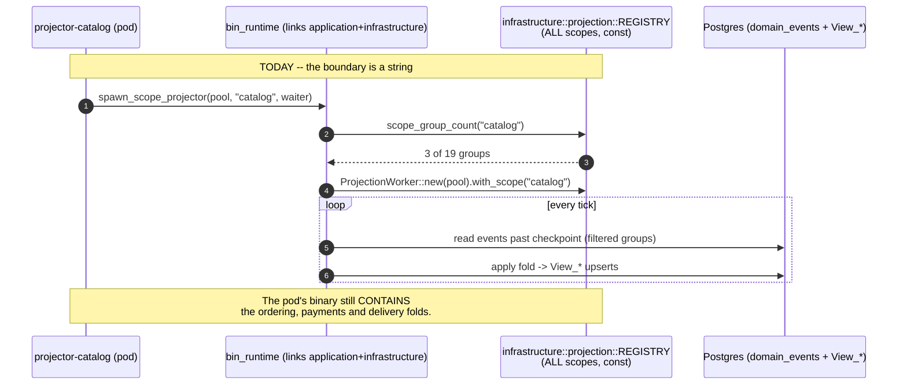
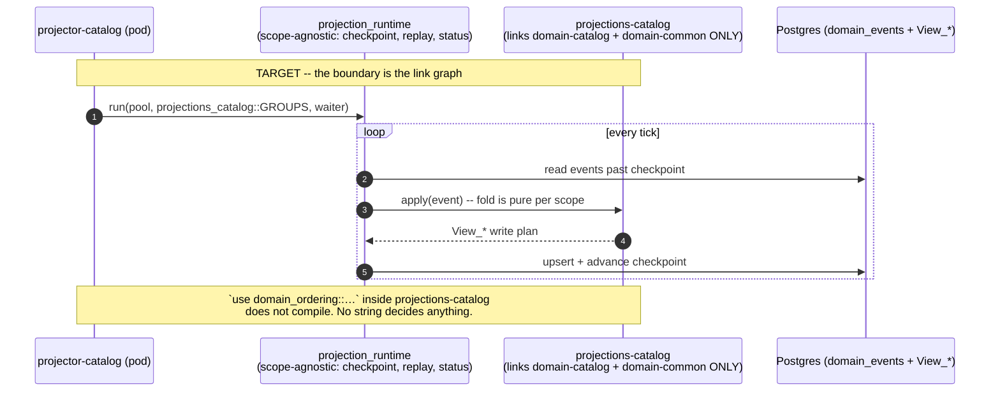

# PROP-20260811-090000 — Scope isolation is real or it is not: the runtime decomposition that makes a wrong coupling not compile

- **Status**: Proposed
- **Date**: 2026-08-11
- **Tracking issue**: [#423 "Design record for the per-scope infrastructure split — the named exit of the facade-coupling deviation has no artifact"](https://github.com/TheCaptainCompany/captain-food/issues/423) (this proposal IS the deliverable that issue asks for)
- **Realized by**: _(filled at completion)_
- **Origin**: product-owner directive, 2026-08-11 — *"The enforcement is required before working on any other functional subject"*, re-prioritised under [ADR-20260810-215503](../adr/ADR-20260810-215503-backlog-prioritisation-delegated-to-the-team.md). Restates the 2026-08-02 threat model of [PROP-20260802-130500](PROP-20260802-130500-isolation-by-construction.md): *"protect bad AI behavior that could use easy path instead of the right one."*
- **History**: `git log -p` on this file.

---

## TL;DR

Every one of the 57 bin manifests carried a header asserting that *"linking a domain crate is the
ONLY way that scope's vocabulary exists in this deployable, so the wrong coupling is **unspellable**
rather than merely unrouted"* (`tools/codegen-rs/src/emit/bins.rs`). For **50 of them** the opposite
is true. The sentence itself is being corrected by the honesty fix dispatched off this proposal
([#475 "Per-bin scope isolation is nominal: every actor/pm/projector bin transitively links all 8 domain scopes…"](https://github.com/TheCaptainCompany/captain-food/issues/475)), which restates the header per
family and gates it against the measured closure — but that changes only what the comment *says*.
The coupling below is untouched by it, and the declared dependency is not merely insufficient — it is
**unused**:

```rust
// crates/bins/projector-catalog/src/main.rs:16
use domain_catalog as _;
```

That line exists to stop `cargo machete` (CI, `.github/workflows/ci.yml:104`) flagging the very
dependency the manifest calls the scope assertion. The bin's real code reaches all eight scopes
through `bin_runtime → infrastructure/application → domain → domains/*`, measured:

```
$ cargo tree -p projector-catalog -e normal
domain-catalog domain-common domain-comms domain-customer
domain-delivery domain-network domain-ordering domain-payments
```

**The mechanism is decomposition; a check is the ratchet, not the answer.** Under the product
owner's stated test — a boundary an agent *cannot cross*, not one it is trusted to respect — a
codegen test is a file the agent edits (level 4, the floor, PROP-20260802-130500 §1). Only removing
the crate from the link graph makes `use domain_ordering::…` in a catalog projector fail to compile.

**But decomposing `bin_runtime` alone changes nothing.** The closure does not come from
`bin_runtime` (268 lines, five helpers); it comes from `application` and `infrastructure` both
depending on the fat `domain` facade (`crates/application/Cargo.toml:10`,
`crates/infrastructure/Cargo.toml:10`, `crates/domain/Cargo.toml:16-23`). The unit of work is
therefore **per-scope runtime crates**, family by family, and the first family is the **projectors**.

---

## 1. What is actually wrong, precisely

Three defects, one cause.

| # | Defect | Evidence |
|---|---|---|
| 1 | **50 of 57 bins** carry all 8 domain scopes in their resolved graph — by three different paths, not one | the family table below |
| 2 | The scope assertion is decorative — the declared crate is imported as `_` to appease `cargo machete` | `crates/bins/projector-catalog/src/main.rs:16` |
| 3 | The runtime boundary is a **string filter over a global registry**, not a link boundary | `crates/infrastructure/src/projection/worker.rs:338` (`const REGISTRY`), `:559` (`REGISTRY.iter().filter(|g| g.scope == scope)`); `crates/bin_runtime/src/lib.rs:120-143` (`lanes: &'static [&'static str]`) |

**Which bins, and by which path.** Measured 2026-08-11 over the resolved normal-dependency graph
(`cargo tree -e normal`, every one of the 57 bins enumerated — not sampled):

| Family | Bins | Reaches the `domain` facade? | Path |
|---|---|---|---|
| `actor-*` (15) · `pm-*` (5) · `projector-*` (7) · `worker-*` (4) + `bam` · `adapter-*` (5) | 37 | yes | `bin_runtime` → `application` + `infrastructure` → `domain` → all 8 `domains/*` |
| `graphql-*` subgraphs | 8 | yes | `server` — the whole monolith surface, filtered by a scope string |
| `fo-*` / `bo-*` surfaces | 5 | yes | `surface_runtime` → `web` → `app-core` → `domain` |
| `gateway-*` | 7 | **no** | `gateway_runtime` + `bin_probes` only |

```
$ cargo tree -p projector-catalog -e normal        # the spine family
domain-catalog domain-common domain-comms domain-customer
domain-delivery domain-network domain-ordering domain-payments

$ cargo tree -p fo-storefront -e normal -i domain-ordering    # the surface family
domain-ordering v0.1.0 (crates/domains/ordering)
└── domain v0.1.0 (crates/domain)
    └── app-core v0.1.0 (crates/core)
        └── web v0.1.0 (crates/web)
            └── surface_runtime v0.1.0 (crates/surface_runtime)
                └── fo-storefront v0.1.0 (crates/bins/fo-storefront)
```

**The surface family is the most misleading row in that table, and it is worth saying plainly.**
Its generated manifest note — *"DELIBERATELY no database, no server, no infrastructure"* — is
**correct**: a surface bin really does read only over GraphQL, and links none of those three. That
correctness is exactly why it reads as isolation and why an audit stops there. But SSR still folds
domain rows through `app-core`, so `use domain_payments::…` compiles inside a storefront renderer
today. A true note about what a bin does *not* link is not a claim about what it *can name*, and this
family is where the two were confused: it is the reason the first count of this defect said 45.

Defect 3 is the one that matters architecturally: **every projector pod carries every scope's fold
code and selects at runtime by a `&str`.** That is the env-var-boundary failure mode — N images of
identical code, gated by configuration. The 7 clean bins (`gateway-*`) prove the target shape is
reachable: they link neither `bin_runtime`, nor `server`, nor `surface_runtime`, and their closure is
honest today. They are also the only family of which that holds.

**Not in scope of this finding**: the 17 `crates/clients/*` crates also depend on the `domain`
facade. That is folded into [#475 "Per-bin scope isolation is nominal: every actor/pm/projector bin transitively links all 8 domain scopes…"](https://github.com/TheCaptainCompany/captain-food/issues/475)
already and its fix is the same shape; it is not the enforcement mechanism, because a client crate
is not a deployable.

---

## 2. Screen mockups

None — no user-facing surface. This proposal changes who may compile what. Recorded per the
mockups-required rule: there is nothing to draw.

---

## 3. The load-bearing flow, before and after

The projector family, drawn hexagonally.





---

## 4. Decisions

### D1 — What is the enforcement mechanism? *(recommendation: A, with C as its ratchet)*

Final vision first: A is the final clean shape and is presented first.

| Option | Pros | Cons |
|---|---|---|
| **(A) Per-scope runtime decomposition — `projection_runtime` + `projections-{scope}`, then the actor and subgraph equivalents** ✅ **recommended** | The only option that satisfies the stated test: a cross-scope reach becomes a **manifest edit**, which is the loudest, most reviewable act an agent can perform (PROP-20260802-130500 §5 D3's own argument). Level 5 — compiler. Shrinks images and deploy blast radius at the [#358 "MKS bootstrap: OVH auth, cluster + vRack, ≥3-node pool, kubeconfig into CI"](https://github.com/TheCaptainCompany/captain-food/issues/358) cutover. Directly unblocks a properly isolated behaviour projector ([#485 "Behaviour event tracking has no declaration site…"](https://github.com/TheCaptainCompany/captain-food/issues/485)) | Largest work; spans several slices; `infrastructure` must grow real internal seams it does not have today |
| (B) `cargo-deny` capability allowlist (PROP-20260802-130500 D3) | Config-only | **Does not address this problem.** D3 is about *capabilities* (`sqlx`, `reqwest`), not scope closure, and its intent WAS built — as `capability_dependencies_are_allowlisted` (`tools/codegen-rs/src/tests.rs`, 21 allowlisted entries), with the substitution reasoned in its doc comment. `[bans].wrappers` constrains **direct** dependents only; it cannot express "this bin's *transitive* closure is these scopes". Adopting it here would be a second mechanism that leaves defect 1 exactly as it is |
| **(C) Codegen test over the transitive graph** — assert each bin's closure ⊆ its declared scopes ∪ a platform allowlist | Fails the build on the 51st violation; cheap; **measures** every decomposition slice (rows deleted). Landable today with the 50 current violations enumerated | Level 4 — a check an agent can edit. Alone it either fails the build immediately (unlandable) or ships with a 50-row excuse list that becomes permanent |
| (D) Do nothing; keep the manifest comment | Zero cost | The comment claims an enforcement the build does not provide — worse than no comment (CLAUDE.md). Separately dispatched as an XS honesty fix |

**Recommendation: A as the mechanism, C as its ratchet, landed first.** C is not an alternative to
A; it is the instrument that makes A verifiable and irreversible — "prefer what makes the next thing
verifiable: the gate before the fix it protects". C's exception list is a **shrinking ledger**, not
an excuse list: every A-slice deletes rows, and reaching zero rows is the definition of done for the
whole program. B is declined with reasons, not deferred.

### D2 — Which family is cut first? *(recommendation: projectors)*

| Option | Pros | Cons |
|---|---|---|
| **(a) Projectors (7 bins)** ✅ **recommended** | Smallest infrastructure surface of any family: no mailbox, no adapters, no GraphQL, no `application` handlers — a projector needs pool + event read + fold + checkpoint. The coupling is one hand-written `const REGISTRY` (`worker.rs:338`) filtered by string, so the cut is mechanical. **It is the family [#485 "Behaviour event tracking has no declaration site…"](https://github.com/TheCaptainCompany/captain-food/issues/485)'s behaviour worker joins**, so the first consumer arrives already isolated. Independent of the other 43 fat bins | Delivers 7 of 50; the fat families remain |
| (b) Actor bins (15 + 5 PMs) | Highest domain value — one writer per aggregate is the consistency promise | Requires per-actor handler crates = [#307 "Isolation phase 3: per-actor implementation crates (D2a) — cost before committal"](https://github.com/TheCaptainCompany/captain-food/issues/307) phase 3 (D2a, decided 2026-08-02, **costing still owed**). A program, not a slice |
| (c) GraphQL subgraph bins (8) | Worst blast radius today — each links the whole `server` (all 17 client crates, `web`, 4 adapters, every resolver) filtered by a scope string | Therefore the **last** cuttable, not the first: `server` is the composition root. Cutting it means decomposing resolvers, adapters and the web surface at once. Highest risk per unit of value |
| (e) Surface bins (5 `fo-*`/`bo-*`) | Only family whose path avoids `bin_runtime` AND `server`, so it is separable from both; the closure comes from one edge, `app-core → domain` | Cutting it means deciding what an SSR renderer may hold — a view-model boundary the codebase has never drawn. Not smaller than (a), just differently shaped |
| (d) All 50 at once | One landing | Not reviewable; touches every family's runtime simultaneously |

**Recommendation: (a).** The instinct that (c) is most valuable is right about *blast radius* and
wrong about *sequencing*: (c) is where the defect costs most and where the cut is least separable.
(a) is the only family whose boundary can be made real without another decided-and-unbuilt program,
or an undrawn view-model boundary, landing first. (e) is the runner-up and is genuinely independent
of (a)–(c) — it is sequenced last only because its cut asks a question nobody has answered yet.

### D3 — Where does the scope→group mapping live? *(recommendation: generated per scope)*

| Option | Pros | Cons |
|---|---|---|
| **(a) Generated `GROUPS` const per `projections-{scope}` crate, from the spec** ✅ **recommended** | The scope's group list becomes a codegen output of `specs/{scope}/`, so adding a projection to the wrong scope is a spec error, not a runtime string. Consistent with `crate-graph.generated.json` being the manifest source | One more emitter |
| (b) Keep one hand-written `REGISTRY`, split by module | Smallest diff | Keeps the single const every scope's crate would have to link — i.e. keeps defect 1 |

---

## 5. Sequencing

1. **Slice 0 — the ratchet (C).** Codegen test `bin_scope_closure_matches_declaration`: for each
   `crates/bins/*`, the transitive normal-dependency closure's `domain-*` set must equal the
   manifest's declared set, unless the bin is on an explicit `PENDING_DECOMPOSITION` list carrying
   its family and the slice that will remove it. Lands green with **49 rows** — and the two numbers
   in play are both right, for different rules: **50 bins reach the `domain` facade** (the
   measurement used everywhere else in this document and in the manifest header gate), but under
   slice 0's **equality** rule `bam` is honest — it declares all 8 domain crates and its closure is
   those same 8, so it is fat by design, not lying, and takes no row. 49 is what
   [#490 "Scope-closure ratchet: a bin's transitive domain set must equal its declared set…"](https://github.com/TheCaptainCompany/captain-food/issues/490)
   counts. **No bin may join the list.** Also delete the `use domain_x as _;` shims' justification
   note once a bin is honest.
2. **Slice 1 — projectors (D2a).** `projection_runtime` (scope-agnostic; `sqlx` + `domain-common`)
   + `projections-{scope}` × 7; `bin_runtime`'s `spawn_scope_projector` moves out; 7 rows deleted.
3. **Slice 2 — workers.** `worker-erasure`, `worker-journal-sweep`, `worker-retention`,
   `worker-sirene-sync` and the 5 `adapter-*` bins declare **zero** domain crates today; they should
   link zero. Mostly a `bin_runtime` split once slice 1 has factored the pool/probe floor.
4. **Slice 3 — actors + PMs**, i.e. [#307 "Isolation phase 3: per-actor implementation crates (D2a) — cost before committal"](https://github.com/TheCaptainCompany/captain-food/issues/307)
   phase 3, whose costing this proposal makes non-optional.
5. **Slice 4 — subgraph bins**, after `server` decomposition (D8 subgraphs).
6. **Slice 5 — surface bins (D2e).** The 5 `fo-*`/`bo-*` bins reach `domain` by a path none of the
   slices above touches (`surface_runtime → web → app-core → domain`), so no amount of `bin_runtime`
   or `server` decomposition removes their rows. The cut is an SSR **view-model** boundary: what
   `app-core` may hold when it renders. Sequenced last because that boundary has never been drawn,
   not because the family is small — five bins is 10% of the ledger.

Zero `PENDING_DECOMPOSITION` rows = the program is done and the manifest header becomes true.
**Slices 1–4 reach 44 of the 49 rows (45 of the 50 facade-reaching bins); without slice 5 the ledger
stops at 5 and never closes** — which is the practical cost of the count having been wrong.

---

## 6. What this must deliver for the behaviour worker ([#485 "Behaviour event tracking has no declaration site…"](https://github.com/TheCaptainCompany/captain-food/issues/485))

The behaviour-tracking projector is the first *new* consumer, and under the directive it is blocked
until the boundary is real. Concretely it needs, from slice 1 and nothing else:

- a `projection_runtime` crate it can link **without** `application`, `infrastructure` or `domain`;
- a `projections-{scope}` template whose manifest names exactly the domain crates its folds read;
- the generated `GROUPS` shape (D3a) so its groups are declared in the spec, not appended to a const;
- `bin_runtime`'s projector helper factored so a projector bin's `main` is a parameter list.

If those four exist, `projector-behaviour` is born isolated instead of being born inside the fat
closure and retro-fitted — which is exactly the "no intermediate step where the final step can be
built" clause ([ADR-20260808-235113](../adr/ADR-20260808-235113-final-vision-first-no-intermediate-steps.md)).

---

## 7. Other decided-and-unbuilt enforcement (same class, found while auditing)

| Boundary | Decision | State |
|---|---|---|
| `EventStore::append` | PROP-20260802-130500 §5 audit table marks it **"❌ hole (phase-3 territory)"** | **Unbuilt and untracked.** `crates/application/src/ports.rs:50-60`: `append(stream_name, expected_version, events, actor)` takes **no capability witness**. Anyone holding `Arc<dyn EventStore>` may append any event to any stream — the mailbox got `MailboxAccess` ([ADR-20260803-172654](../adr/ADR-20260803-172654-mailbox-port-demands-a-capability-witness.md)); the event log did not |
| `View_*` read METHODS | same table, "❌ hole" | Tracked, unbuilt — [#337 "Generated ReadPorts bundle: make an undeclared read not compile"](https://github.com/TheCaptainCompany/captain-food/issues/337) |
| Per-actor implementation crates | D2 **(a)**, decided 2026-08-02 | Tracked, unbuilt, costing owed — [#307 "Isolation phase 3: per-actor implementation crates (D2a) — cost before committal"](https://github.com/TheCaptainCompany/captain-food/issues/307) |
| Capability allowlist (D3) | decided 2026-08-02 | **Built**, by a different mechanism than the word "cargo-deny" implies (codegen test, 21 entries); substitution reasoned in the test's doc comment. Not a gap |
| Lint floor (D6) | decided 2026-08-02, deferred | **Built** — [#302](https://github.com/TheCaptainCompany/captain-food/issues/302); `cargo machete` runs in CI (`.github/workflows/ci.yml:104`) |

---

## 8. Drawbacks

- The program is large and its value is invisible to a customer. Under any ordering but the current
  directive it would keep losing to features — which is how it reached 50 bins.
- Slice 1 introduces a crate-count increase (7 + 1) on a workspace already at ~90 crates; build
  graph width is a real cost, mitigated by each crate being small and independently rebuilt.
- A shrinking ledger that stops shrinking is indistinguishable from an excuse list. The ratchet's
  value depends on slices continuing to land.

## 9. Unresolved questions

- Does `projection_runtime` own the `EventWaiter`/LISTEN plumbing, or does that stay in
  `infrastructure` and get passed in? (Affects whether a projector bin links `infrastructure` at all
  — if it does, slice 1 delivers less than it promises.)
- Do `View_*` write repositories move into `projections-{scope}`, or stay shared? A shared write
  repo re-introduces the facade by the back door.
- Should the `EventStore::append` witness ride slice 3, or be filed and costed on its own now?
- **What may an SSR renderer hold?** Slice 5 cannot start without it. `app-core` renders from domain
  types today; the isolated shape is a per-surface view model fed by the GraphQL response, which is
  either a generated artifact of `specs/screens/**` or a hand-written layer per surface. Nothing in
  the record picks one, and the answer decides whether slice 5 is mechanical or a rewrite.
