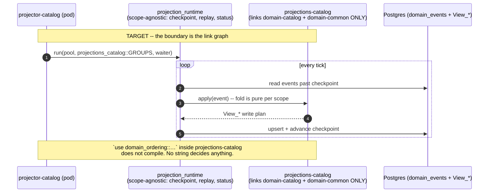

# PROP-20260811-090000 — Scope isolation is real or it is not: the runtime decomposition that makes a wrong coupling not compile

- **Status**: Proposed
- **Date**: 2026-08-11
- **Tracking issue**: [#423 "Design record for the per-scope infrastructure split — the named exit of the facade-coupling deviation has no artifact"](https://github.com/TheCaptainCompany/captain-food/issues/423) (this proposal IS the deliverable that issue asks for)
- **Realized by**: _(filled at completion)_
- **Origin**: product-owner directive, 2026-08-11 — *"The enforcement is required before working on any other functional subject"*, re-prioritised under [ADR-20260810-215503](../adr/ADR-20260810-215503-backlog-prioritisation-delegated-to-the-team.md). Restates the 2026-08-02 threat model of [PROP-20260802-130500](PROP-20260802-130500-isolation-by-construction.md): *"protect bad AI behavior that could use easy path instead of the right one."*
- **Refined by**: [PROP-20260811-173223](PROP-20260811-173223-repository-crates-and-the-infrastructure-split.md)
  (**repository crates and the dissolution of `infrastructure`**,
  [#497](https://github.com/TheCaptainCompany/captain-food/issues/497), register §33 REP-1…REP-5).
  **This proposal decides which BINS link which scopes; that one decides which CRATES exist for them
  to link** — and it **closes ISO-1 and ISO-2** (§9 below). It also names the coupling this document
  did not: `DomainEvent` is one enum over all eight scopes, so slice 1 as written would not change
  any bin's closure.
- **History**: `git log -p` on this file.

---

## TL;DR

Every one of the 57 bin manifests carried a header asserting that *"linking a domain crate is the
ONLY way that scope's vocabulary exists in this deployable, so the wrong coupling is **unspellable**
rather than merely unrouted"* (`tools/codegen-rs/src/emit/bins.rs`). For **50 of them** the opposite
is true. The sentence itself is being corrected by the honesty fix dispatched off this proposal
([#475 "Per-bin scope isolation is nominal: every actor/pm/projector bin transitively links all 8 domain scopes…"](https://github.com/TheCaptainCompany/captain-food/issues/475)), which restates the header per
family and gates it against the measured closure — but that changes only what the comment *says*.
The coupling below is untouched by it, and the declared dependency is not merely insufficient — it is
**unused**:

```rust
// crates/bins/projector-catalog/src/main.rs:16
use domain_catalog as _;
```

That line exists to stop `cargo machete` (CI, `.github/workflows/ci.yml:104`) flagging the very
dependency the manifest calls the scope assertion. The bin's real code reaches all eight scopes
through `bin_runtime → infrastructure/application → domain → domains/*`, measured:

```
$ cargo tree -p projector-catalog -e normal
domain-catalog domain-common domain-comms domain-customer
domain-delivery domain-network domain-ordering domain-payments
```

**Re-measured 2026-08-11, and the widest app is not on the spine.** Each of the 8 `graphql-*`
subgraphs declares 3 crates and links **44** — a 14× ratio, against 1.5× for the 7 `gateway-*` bins.
`server` is a **direct** dependency of all eight, and 25 of the 44 are reachable only through it, so
one edge removal drops the entire SSR stack and all five partner adapters out of eight pods
(§1, §4.1–§4.4, product-owner directive 2026-08-11: *"Remove the damn server crate it's currently the
purpose of what we are doing"*). The cause is a recorded design choice, not drift —
`crates/server/src/bin_support.rs:1-8` says a subgraph IS the monolith's surface filtered by a scope
**string**, which is defect 3 of §1 in the API tier.

**The mechanism is decomposition; a check is the ratchet, not the answer.** Under the product
owner's stated test — a boundary an agent *cannot cross*, not one it is trusted to respect — a
codegen test is a file the agent edits (level 4, the floor, PROP-20260802-130500 §1). Only removing
the crate from the link graph makes `use domain_ordering::…` in a catalog projector fail to compile.

**But decomposing `bin_runtime` alone changes nothing.** The closure does not come from
`bin_runtime` (268 lines, five helpers); it comes from `application` and `infrastructure` both
depending on the fat `domain` facade (`crates/application/Cargo.toml:10`,
`crates/infrastructure/Cargo.toml:10`, `crates/domain/Cargo.toml:16-23`). The unit of work is
therefore **per-scope runtime crates**, family by family. **Order revised 2026-08-11 (D2):** the
subgraph **cut** goes first because it is gated on nothing, is a pure crate move with a
byte-identical SDL as its acceptance test, and is the largest reduction in the topology; the
**projectors** remain the first family whose *domain closure* narrows, and they are unchanged.

---

## 1. What is actually wrong, precisely

Three defects, one cause.

| # | Defect | Evidence |
|---|---|---|
| 1 | **50 of 57 bins** carry all 8 domain scopes in their resolved graph — by three different paths, not one | the family table below |
| 2 | The scope assertion is decorative — the declared crate is imported as `_` to appease `cargo machete` | `crates/bins/projector-catalog/src/main.rs:16` |
| 3 | The runtime boundary is a **string filter over a global registry**, not a link boundary | `crates/infrastructure/src/projection/worker.rs:338` (`const REGISTRY`), `:559` (`REGISTRY.iter().filter(\|g\| g.scope == scope)`); `crates/bin_runtime/src/lib.rs:120-143` (`lanes: &'static [&'static str]`) |

**Which bins, and by which path.** Measured 2026-08-11 over the resolved normal-dependency graph
(`cargo tree -e normal`, every one of the 57 bins enumerated — not sampled):

| Family | Bins | Reaches the `domain` facade? | Path |
|---|---|---|---|
| `actor-*` (15) · `pm-*` (5) · `projector-*` (7) · `worker-*` (4) + `bam` · `adapter-*` (5) | 37 | yes | `bin_runtime` → `application` + `infrastructure` → `domain` → all 8 `domains/*` |
| `graphql-*` subgraphs | 8 | yes | `server` — the whole monolith surface, filtered by a scope string |
| `fo-*` / `bo-*` surfaces | 5 | yes | `surface_runtime` → `web` → `app-core` → `domain` |
| `gateway-*` | 7 | **no** | `gateway_runtime` + `bin_probes` only |

**And the widest row is not the spine — it is the API tier.** Re-measured 2026-08-11 over the same
resolved graph, counting **workspace crates**, not just `domains/*`:

| App | Declares | Links (workspace crates) | Ratio |
|---|---:|---:|---:|
| each of the 8 `graphql-*` | 3 | **44** | **14×** |
| each of the 7 `gateway-*` | 2 | 3 | 1.5× |
| `projector-catalog` (the family this proposal cuts first) | 2 | 18 | 9× |

```
$ cargo tree -p graphql-catalog -e normal | grep '/crates/' | awk '{print $1}' | sort -u | wc -l
45          # itself + 44
```

Of those 44, **25 are reachable ONLY through `server`** — `web`, `app-core`, `surface_runtime`, all
five partner adapters (`stripe-adapter`, `uber-direct-adapter`, `hubrise-adapter`,
`coopcycle-adapter`, `avelo37-adapter`), `shared_types`, and **14 of the 15 `crates/clients/*` actor
clients the scope does not address**. So a pod whose entire job is answering `catalog` and
`categories` links the Stripe integration, the Uber Direct integration and the whole SSR renderer,
and can spell `client_order::OrderClient`. **`server` is a DIRECT dependency of all eight**
(`crates/bins/graphql-catalog/Cargo.toml`), which makes it the single edge whose removal drops those
25 crates from eight pods at once — the largest single-edit reduction available anywhere in the
topology.

```
$ cargo tree -p projector-catalog -e normal        # the spine family
domain-catalog domain-common domain-comms domain-customer
domain-delivery domain-network domain-ordering domain-payments

$ cargo tree -p fo-storefront -e normal -i domain-ordering    # the surface family
domain-ordering v0.1.0 (crates/domains/ordering)
└── domain v0.1.0 (crates/domain)
    └── app-core v0.1.0 (crates/core)
        └── web v0.1.0 (crates/web)
            └── surface_runtime v0.1.0 (crates/surface_runtime)
                └── fo-storefront v0.1.0 (crates/bins/fo-storefront)
```

**The surface family is the most misleading row in that table, and it is worth saying plainly.**
Its generated manifest note — *"DELIBERATELY no database, no server, no infrastructure"* — is
**correct**: a surface bin really does read only over GraphQL, and links none of those three. That
correctness is exactly why it reads as isolation and why an audit stops there. But SSR still folds
domain rows through `app-core`, so `use domain_payments::…` compiles inside a storefront renderer
today. A true note about what a bin does *not* link is not a claim about what it *can name*, and this
family is where the two were confused: it is the reason the first count of this defect said 45.

Defect 3 is the one that matters architecturally: **every projector pod carries every scope's fold
code and selects at runtime by a `&str`.** That is the env-var-boundary failure mode — N images of
identical code, gated by configuration. The 7 clean bins (`gateway-*`) prove the target shape is
reachable: they link neither `bin_runtime`, nor `server`, nor `surface_runtime`, and their closure is
honest today. They are also the only family of which that holds.

**Not in scope of this finding**: the 17 `crates/clients/*` crates also depend on the `domain`
facade. That is folded into [#475 "Per-bin scope isolation is nominal: every actor/pm/projector bin transitively links all 8 domain scopes…"](https://github.com/TheCaptainCompany/captain-food/issues/475)
already and its fix is the same shape; it is not the enforcement mechanism, because a client crate
is not a deployable.

---

## 2. Screen mockups

None — no user-facing surface. This proposal changes who may compile what. Recorded per the
mockups-required rule: there is nothing to draw.

---

## 3. The load-bearing flow, before and after

The projector family, drawn hexagonally.




---

## 4. Decisions

### D1 — What is the enforcement mechanism? *(recommendation: A, with C as its ratchet)*

Final vision first: A is the final clean shape and is presented first.

| Option | Pros | Cons |
|---|---|---|
| **(A) Per-scope runtime decomposition — `projection_runtime` + `projections-{scope}`, then the actor and subgraph equivalents** ✅ **recommended** | The only option that satisfies the stated test: a cross-scope reach becomes a **manifest edit**, which is the loudest, most reviewable act an agent can perform (PROP-20260802-130500 §5 D3's own argument). Level 5 — compiler. Shrinks images and deploy blast radius at the [#358 "MKS bootstrap: OVH auth, cluster + vRack, ≥3-node pool, kubeconfig into CI"](https://github.com/TheCaptainCompany/captain-food/issues/358) cutover. Directly unblocks a properly isolated behaviour projector ([#485 "Behaviour event tracking has no declaration site…"](https://github.com/TheCaptainCompany/captain-food/issues/485)) | Largest work; spans several slices; `infrastructure` must grow real internal seams it does not have today |
| (B) `cargo-deny` capability allowlist (PROP-20260802-130500 D3) | Config-only | **Does not address this problem.** D3 is about *capabilities* (`sqlx`, `reqwest`), not scope closure, and its intent WAS built — as `capability_dependencies_are_allowlisted` (`tools/codegen-rs/src/tests.rs`, 21 allowlisted entries), with the substitution reasoned in its doc comment. `[bans].wrappers` constrains **direct** dependents only; it cannot express "this bin's *transitive* closure is these scopes". Adopting it here would be a second mechanism that leaves defect 1 exactly as it is |
| **(C) Codegen test over the transitive graph** — assert each bin's closure ⊆ its declared scopes ∪ a platform allowlist | Fails the build on the 51st violation; cheap; **measures** every decomposition slice (rows deleted). Landable today with the 50 current violations enumerated | Level 4 — a check an agent can edit. Alone it either fails the build immediately (unlandable) or ships with a 50-row excuse list that becomes permanent |
| (D) Do nothing; keep the manifest comment | Zero cost | The comment claims an enforcement the build does not provide — worse than no comment (CLAUDE.md). Separately dispatched as an XS honesty fix |

**Recommendation: A as the mechanism, C as its ratchet, landed first.** C is not an alternative to
A; it is the instrument that makes A verifiable and irreversible — "prefer what makes the next thing
verifiable: the gate before the fix it protects". C's exception list is a **shrinking ledger**, not
an excuse list: every A-slice deletes rows, and reaching zero rows is the definition of done for the
whole program. B is declined with reasons, not deferred.

### D2 — Which family is cut first? *(recommendation REVISED 2026-08-11: the subgraph CUT (c) first, then projectors (a))*

| Option | Pros | Cons |
|---|---|---|
| **(a) Projectors (7 bins)** ✅ **recommended** | Smallest infrastructure surface of any family: no mailbox, no adapters, no GraphQL, no `application` handlers — a projector needs pool + event read + fold + checkpoint. The coupling is one hand-written `const REGISTRY` (`worker.rs:338`) filtered by string, so the cut is mechanical. **It is the family [#485 "Behaviour event tracking has no declaration site…"](https://github.com/TheCaptainCompany/captain-food/issues/485)'s behaviour worker joins**, so the first consumer arrives already isolated. Independent of the other 43 fat bins | Delivers 7 of 50; the fat families remain |
| (b) Actor bins (15 + 5 PMs) | Highest domain value — one writer per aggregate is the consistency promise | Requires per-actor handler crates = [#307 "Isolation phase 3: per-actor implementation crates (D2a) — cost before committal"](https://github.com/TheCaptainCompany/captain-food/issues/307) phase 3 (D2a, decided 2026-08-02, **costing still owed**). A program, not a slice |
| **(c) GraphQL subgraph bins (8)** — **RE-RANKED 2026-08-11, see §4.1** | Worst blast radius today (44 links against 3 declared, 14×) **and the cheapest first cut in the topology**: `server` is a *direct* dependency of all eight, so removing that one edge drops 25 crates from 8 pods with **no SDL change and no behaviour change**. The product owner named it: *"Remove the damn server crate it's currently the purpose of what we are doing"* (2026-08-11) | The FULL cut (per-scope schema + DI) is genuinely harder than (a), and its blocker is neither `server` nor REP-4 — it is the cross-scope **type** graph (§4.1 D4). So the family splits into a trivial first slice and a real second one, which is why it was mis-ranked as monolithic |
| (e) Surface bins (5 `fo-*`/`bo-*`) | Only family whose path avoids `bin_runtime` AND `server`, so it is separable from both; the closure comes from one edge, `app-core → domain` | Cutting it means deciding what an SSR renderer may hold — a view-model boundary the codebase has never drawn. Not smaller than (a), just differently shaped |
| (d) All 50 at once | One landing | Not reviewable; touches every family's runtime simultaneously |

**Recommendation, REVISED 2026-08-11: (c) first, then (a).** The original text said the instinct
that (c) is most valuable *"is right about blast radius and wrong about sequencing"*. Measurement
says the second half of that sentence was wrong, and the reason is worth stating because it is the
same reason twice: **(c) was ranked as one indivisible cut, and it is two.** Removing `server` from
the eight manifests is a **pure crate move** — same emitters, same resolvers, byte-identical SDL —
and it is the largest reduction available for the smallest review surface in the repo. Building the
per-scope schema underneath it is the hard half, and it is sequenced after. (a) is unchanged and
remains the first *domain-closure* cut; (c) slice 1 deletes **zero** `PENDING_DECOMPOSITION` rows
and this proposal says so plainly rather than claiming the ledger moved. (e) is unchanged.

### D3 — Where does the scope→group mapping live? *(recommendation: generated per scope)*

| Option | Pros | Cons |
|---|---|---|
| **(a) Generated `GROUPS` const per `projections-{scope}` crate, from the spec** ✅ **recommended** | The scope's group list becomes a codegen output of `specs/{scope}/`, so adding a projection to the wrong scope is a spec error, not a runtime string. Consistent with `crate-graph.generated.json` being the manifest source | One more emitter |
| (b) Keep one hand-written `REGISTRY`, split by module | Smallest diff | Keeps the single const every scope's crate would have to link — i.e. keeps defect 1 |

---

### 4.1 — D4: How does a subgraph compose without `server`? *(recommendation: A, in two slices)*

`crates/server/src/bin_support.rs:1-8` states the current design in its own words: *"A subgraph bin
is the monolith's GraphQL surface RESTRICTED to one domain: the same generated type layer, the same
resolvers over the same adapters (`crate::build_graphql_di` — one composition, no logic fork) …
plus the scope slice that rejects any top-level field owned by another scope."* `subgraph_app`
calls `crate::build_graphql_di` and `crate::graphql_schema::build_schema_for_scope`
(`bin_support.rs:63-69`): it builds the **master** schema and the **master** DI, then filters by a
scope **string**. That is defect 3 of §1 — the boundary is a runtime string over a fully linked
graph — reproduced in the API tier.

**What a subgraph needs, and where each piece goes.** Enumerated from `bin_support.rs` and measured
per scope from the generated roots (the resolver-dependency table is §4.2):

| Piece | Today | Target home | Scope-agnostic? |
|---|---|---|---|
| Supabase-JWT verifier, `Principal`, `RequestRole`, `resolve_read_scope` | `server/src/auth.rs` (1462 ln) | **`api_runtime`** | yes |
| `/{role}/graphql` + `/{role}/voyager` routes, WS upgrade, `private, no-store` | `server/src/graphql/routes.rs` (427 ln) | **`api_runtime`**, made generic `graphql_routes<Q, M, S>` | yes, once generic |
| Response identity/timing headers | `server::response_timing` | **`api_runtime`** | yes |
| Session header, trace context, `RequestCorrelationId` | `server/src/graphql/session.rs` | **`api_runtime`** | yes |
| `RoleGuard` / `visible_*` ACL machinery | `server/src/graphql/acl.rs` + `generated/acl.rs` | **`api_runtime`** (hand) + generated per scope | yes — derived from `roles:` alone, never from scope (PROP-20260811-150242 §5.1.1 A3) |
| Tenant lookup (`Host` → slug → `RestaurantId`) | `server/src/hosts.rs:29` — `TenantLookup(Option<Arc<dyn RestaurantReadRepository>>)` | **`api_runtime`, behind a `TenantResolver` port** | **no, today** — it names a `restaurant`-boundary read model on **every request of every subgraph**. See §4.3 |
| Money posture read (`PM_MAILBOX_DELIVERY`) | `infrastructure::mailbox::pm_mailbox_delivery_posture` | **`api_runtime`** over a small posture port | yes |
| Mailbox nudges registration | `bin_support.rs:56-62` — registers **every** `ACTOR_MAILBOXES` entry | **deleted for subgraphs** | — a subgraph runs no worker, so the registry is inert *and* misleading. The real enqueue boundary is the linked client-crate set, which is 15 today and must be 1–3 |
| Scalars / types / inputs / `QueryRoot` / `MutationRoot` / `SubscriptionRoot` | `server/src/graphql/generated/*` (12,000 ln) | **`api_graph`** (slice 1) → **`api-{B}` × N** (slice 3) | no — this is the whole cut |
| Read repositories + write ports DI | `server::build_graphql_di` (`lib.rs:331-479`) | **generated `build_di` per scope**, over `ports-{B}` + `read-{B}` (REP slices 4/6) | no |
| Scope slice extension | `server/src/graphql/scope_slice.rs` | **deleted** — a per-scope root has no foreign field to reject | — |

| Option | Pros | Cons |
|---|---|---|
| **(A) Generated per-scope composition: `api_runtime` (scope-agnostic serving) + `api-{B}` (generated roots + DI), monolith recomposes via `#[derive(MergedObject)]`** ✅ **recommended** | The final vision. A subgraph builds **only its own** schema and DI; `use client_order::…` in a catalog subgraph stops compiling. `async_graphql::MergedObject`/`MergedSubscription` exist in the pinned 7.2.1 (`async-graphql/src/lib.rs:278,280`), and the merge is over **the same resolver bodies** — so "no logic fork" is kept by the compiler, not by a convention (§4.4). Root fields are disjoint by construction (`generated/operation_scopes.rs`), so the merge cannot conflict | Requires the cross-scope type graph to be a DAG first (§4.3) and `ports-{B}`/`read-{B}` (REP slices 4/6) to exist. Three slices, not one |
| (B) Keep the master schema, move it out of `server` into one `api_graph` crate; subgraphs link that + `api_runtime` | **Is slice 1 of (A)**, not an alternative: zero SDL change, zero behaviour change, drops 25 crates from 8 pods. Ships the product owner's literal ask today | On its own it is still a string filter over a fully linked graph and deletes zero ledger rows. Named as a step, with (A) already designed — the form [ADR-20260808-235113](../adr/ADR-20260808-235113-final-vision-first-no-intermediate-steps.md) permits |
| (C) Federation / a query planner at the gateway | Industry-standard cross-subgraph composition | Reverses D8 (codegen-time stitching, no planner, one scope per request) and adds a runtime that must be operated at Friday peak. Not on the table |
| (D) Leave it; sharpen the manifest comment | Zero cost | The comment already says the truth ([#475](https://github.com/TheCaptainCompany/captain-food/issues/475)) and the coupling is unchanged. This is (D) of D1 one layer down |

**Recommendation: (A), landed as slice 1 = (B) then slices 2–3.** Slice 1 is a pure move whose
acceptance test is `specs/generated/schema.generated.graphql` being **byte-identical** — the
cheapest review in the program, for the largest single reduction in it.

### 4.2 — What each scope's resolvers actually need (measured)

Derived 2026-08-11 by parsing every `ctx.data::<…>()` and `client_*::` path out of
`crates/server/src/graphql/generated/{query,mutation}.rs` and joining to `generated/operation_scopes.rs`:

| Scope | Actor clients | Read ports | Write ports |
|---|---|---|---|
| `catalog` | `client-catalog` | `CatalogReadRepository`, **`RestaurantReadRepository`** | `Mailbox` |
| `customer` | `client-customer` | `CustomerReadRepository` | `Mailbox` |
| `comms` | `client-conversation` | `OrderConversationReadRepository` | `Mailbox` |
| `network` | `client-prospect`, `client-restaurant`, `client-restaurant-account` | `RestaurantReadRepository`, `ProspectionReadRepository`, **`CustomerReadRepository`** | `Mailbox` |
| `delivery` | `client-delivery-job`, `client-delivery-partner-registration`, `client-rider` | `DeliveryReadRepository`, `DeliveryPartnerAvailabilityReadRepository`, **`OrderReadRepository`**, **`RestaurantReadRepository`** | `Mailbox` |
| `ordering` | `client-cart`, `client-order`, `client-place-order-process`, `client-reclamation` | `CartReadRepository`, `OrderReadRepository`, `ReclamationReadRepository`, `DeliverySatisfactionReadRepository`, **`CatalogReadRepository`**, **`RestaurantReadRepository`**, **`CustomerReadRepository`** | `Mailbox`, `CommandJournal`, **`EventStore`**, `PaymentService`, `PaymentProcessStateStore` |
| `payments` | `client-refund-process` | `RefundReadRepository`, `CustomerCreditReadRepository`, `PricingPolicyReadRepository`, `UberEstimationPolicyReadRepository`, `UberSplitPolicyReadRepository`, **`CustomerReadRepository`** | `Mailbox`, `CommandJournal`, **`EventStore`**, `PaymentService`, `RefundProcessStateStore` |
| `common` | `client-mailbox-supervision` | `MailboxLaneRepository` | `Mailbox`, `CommandJournal` |

Two things fall out of this table, and both change decisions elsewhere.

**1. REP-4 (`DomainEvent`) reaches the API tier in exactly three resolvers, and only on the legacy
arm.** `EventStore` — the one port whose signature names the all-scopes `DomainEvent` union
(`crates/application/src/ports.rs:54-65`) — appears in `generated/mutation.rs` at **three** lines
(`:4942`, `:6384`, `:6584`), inside `placeOrder`, `approveRefund` and `denyRefund`, and in all three
it is in the **`else` branch of the `pm_mailbox_delivery` gate** (`mutation.rs:4939-4945`) — the
legacy in-resolver process-manager path. Queries name it **zero** times; the subscription path
carries `infrastructure::AppendedEvent`, which is `{String, String, Uuid, i64}`
(`crates/infrastructure/src/persistence/event_bus.rs:20-31`), not the union. So **six of the eight
subgraphs — `catalog`, `customer`, `comms`, `delivery`, `network`, `common` — do not name
`DomainEvent` at all**, and REP-4 does not gate them. Under the BND-1 reshape the two that do
(`ordering`, `payments`) merge into `graphql-order`, so the statement becomes *"one of six subgraphs
is REP-4-coupled, on a gated legacy arm whose default is `false`"*
([ADR-20260803-104819](../adr/20260803-104819-db-persisted-pm-mailbox-delivery-posture.md) seeds the
row `false`, so the coupled arm is the one running today). **The API tier is therefore cuttable
before the event split** — the sequencing in §5 is corrected accordingly.

**2. Every subgraph but `customer` and `common` reads another boundary's read model.** The bold
entries above are cross-boundary reads *inside a resolver*. That is §4.3.

### 4.3 — The real blocker: the API TYPE graph has cycles, and the gate that forbids them cannot see them

This is the finding that decides how hard slice 3 is, and it is neither `server` nor REP-4.

The validator already carries the rule that should have prevented it. `api-nested-cross-scope`
(`tools/codegen-rs/src/validate/scopes.rs:21-24`): *"an api TYPE in scope S may nest only S or
kernel types — cross-scope data appears at TOP LEVEL (gateway routing) or **pre-joined in a
projector-owned view**, never as a nested subgraph. This is the gate that keeps codegen-time
stitching cheap (no entity resolution, no N+1)."* `make validate` reports **0 errors**.

**The generated schema violates it ten times.** Measured over
`specs/generated/schema.generated.graphql` joined to each type's owning `specs/{scope}/api.yaml`:

| Owner scope | Type | Field | Target | Target scope | Live? |
|---|---|---|---|---|---|
| catalog | `Catalog` | `restaurant` | `Restaurant` | network | **hydrated** (`generated/query.rs:19-32`) |
| ordering | `Cart` | `restaurant` | `Restaurant` | network | **hydrated** |
| ordering | `Order` | `restaurant` | `Restaurant` | network | **hydrated** |
| delivery | `DeliveryJob` | `order` | `Order` | ordering | **hydrated** |
| delivery | `DeliveryJob` | `restaurant` | `Restaurant` | network | **hydrated** |
| network | `Restaurant` | `deliveryJobs` | `DeliveryJob` | delivery | **always `[]`** (`generated/types.rs:1101`) |
| network | `Restaurant` | `catalogs` | `Catalog` | catalog | **always `[]`** (`types.rs:1103`) |
| network | `Restaurant` | `carts` | `Cart` | ordering | **always `[]`** (`types.rs:1104`) |
| network | `Restaurant` | `orders` | `Order` | ordering | **always `[]`** (`types.rs:1105`) |
| ordering | `Order` | `deliveryJobs` | `DeliveryJob` | delivery | **always `[]`** (`types.rs:1230`) |

**Why the gate misses all ten: it inspects the SPEC, and these fields are DERIVED.** The rule walks
`$ref: '#/types/…'` inside an api type's `properties` (`scopes.rs:441-467`). `specs/catalog/api.yaml`
declares no `restaurant` property on `Catalog` (`specs/catalog/api.yaml:9-20`) — the emitter adds
`restaurant: Restaurant!` from the `restaurantId` FK (`emit/server_graphql.rs:229` `nav_fields`), and
the reverse edges come from `navRoles:` (`specs/network/api.yaml:13-16`,
`specs/ordering/api.yaml:31-32`). **A gate that reads the source of truth while the emitter derives
the thing it forbids is a gate with a hole, and this hole is load-bearing**: it is why nobody noticed
that the API type graph cannot be split into crates.

**Consequence for slice 3.** Per-scope crates need the type graph to be a **DAG**. It is not:
`network → ordering → network`, `network → delivery → ordering → network`, `network → catalog →
network`. `api-network` and `api-ordering` would have to depend on each other, which Rust forbids.
**The BND-1 reshape does not fix this** — merging `ordering`+`payments`+`comms` into `order` leaves
`restaurant ↔ order`, `restaurant ↔ delivery`, `restaurant ↔ catalog` and `delivery ↔ order`. So the
8→6 reshape is neither a prerequisite nor a mitigation here.

**And every cycle runs through a field that is permanently empty.** All five reverse edges resolve
`Vec::new()` unconditionally, at the only construction sites that exist (`types.rs:1101-1105,1230`).
Delete them and the remaining graph is `catalog → network`, `ordering → network`, `delivery →
{ordering, network}` — **acyclic**. That is the whole unblock, and it is a spec + emitter change of
seven lines plus a regeneration.

Deleting them is nevertheless a **schema removal**, so it is a promise change, not a spec tidy-up
(CLAUDE.md's second question: *is the shape already emitted, stored or promised?*). The migration
story, recorded here because it must be recorded before the change lands:

- The fields are **provably always empty** at every construction site — there is no data to lose and
  no behaviour to migrate; a client selecting `restaurant { orders { id } }` receives `[]` today and
  would receive an unknown-field error after. This is CLAUDE.md's *"a control that renders but does
  nothing is worse than no control"*, at the API layer.
- **No first-party client selects them**: zero hits for `deliveryJobs`, `restaurant.catalogs`,
  `restaurant.carts` or `restaurant.orders` in `specs/screens/**` or `crates/web/src/**`; the only
  `specs/**` hits are the two `navRoles:` declarations themselves.
- **No third-party client exists** and production is down with an empty event log — the cheapest
  window this removal will ever have. After the [#358](https://github.com/TheCaptainCompany/captain-food/issues/358)
  cutover it is a deprecation cycle instead.
- The replacements already exist as top-level operations: `restaurantDeliveries`, `orders`, `carts`,
  `catalog` — which is what D8's *"cross-scope data appears at TOP LEVEL"* means.

The **five live forward edges** are a different question and are NOT resolved by deletion: they are
real joins a customer sees. Options are recorded as register row **API-1** (§34); the doctrine's own
answer — *"pre-joined in a projector-owned view"* — is the recommendation, and until it lands each
subgraph legitimately links one foreign boundary's `read-{B}`, which contradicts
[PROP-20260811-150242](PROP-20260811-150242-domain-boundaries-the-four-and-the-two-partitions.md)
§5.1.2's *"coarser is forbidden"* table and §5.1.7's closure invariant. Both are corrected there.

### 4.4 — What replaces "one composition, no logic fork"

`bin_support.rs`'s guarantee is real and must not be lost: today there is exactly ONE definition of
each resolver, and the subgraph is a filtered view of it. Under (A) the answer is **not** "the
generator emits both and a test compares them" — it is that **there is still exactly one definition**:

- the emitter emits each scope's `QueryRoot`/`MutationRoot`/`SubscriptionRoot` **once**, into
  `api-{B}`;
- the subgraph bin builds `Schema::build(api_catalog::Query, api_catalog::Mutation, …)`;
- the monolith builds `Schema::build(MasterQuery, MasterMutation, MasterSubscription)` where
  `#[derive(async_graphql::MergedObject)] pub struct MasterQuery(api_catalog::Query, api_customer::Query, …)`
  — available in the pinned `async-graphql 7.2.1`
  (`async-graphql/src/lib.rs:278,280`, `MergedObject` / `MergedSubscription`).

A divergence between the two compositions is therefore **unspellable**, not merely untested — which
is the compiler-first hierarchy's level 5, not a level-4 check
([ADR-20260803-234035](../adr/ADR-20260803-234035-compiler-first-a-check-is-the-fallback.md)). The
merge cannot conflict on a field name because root fields are disjoint by construction and the
generated composition table proves it (`crates/server/src/graphql/generated/operation_scopes.rs`).

Two checks remain, and they are about the *shape*, not about a fork:

1. **SDL equality** — a codegen test asserting the monolith's merged runtime SDL equals
   `specs/generated/schema.generated.graphql`. `crates/server/src/graphql/schema.rs:170-208` already
   does the weak form of this (a `contains` list); slice 3 makes it an equality.
2. **Introspection has to move.** `crates/gateway_runtime/src/lib.rs:121-122` routes a document with
   only `__schema`/`__type` to `table.kernel_scope`, on the comment *"introspection — any subgraph
   answers the role-filtered shape"*. That comment is TRUE today (every subgraph holds the master
   schema) and becomes **FALSE** the moment composition is per-scope: `graphql-platform` would answer
   with 5 operations instead of 121. The fix belongs in the gateway, which already embeds a generated
   table: embed the generated SDL and answer introspection locally. Recorded as **API-3** (§34) — it
   is a hard precondition of slice 3, not a follow-up.

## 5. Sequencing

> ### Deploy ordering is CONSUMER-FIRST, and it is a precondition, not a preference
>
> Recorded here because this is where the [#358](https://github.com/TheCaptainCompany/captain-food/issues/358)
> cutover work reads its preconditions
> ([ADR-20260830-183000](../adr/ADR-20260830-183000-the-actor-inbox-is-a-generated-enum-and-the-match-is-human-owned.md),
> [#771](https://github.com/TheCaptainCompany/captain-food/issues/771)).
>
> **A runtime that CONSUMES a message type must be deployed before any runtime that EMITS it.** Once
> the monolith is several pods, a rolling deploy has two builds live at once, and a producer that
> ships first hands the old consumer a message type its `<Actor>Inbox` does not declare. The typed
> inbox makes that survivable rather than fatal — an undeclared type is TRANSIENT, so the row is
> retried with backoff and then parked on the poison queue with
> `mailbox_poison_failed_total{actor_type}` and an operator `RequeueMailboxMessage`, never terminally
> `FAILED` — but *survivable* means "costs latency and a manual requeue", not "free". During peak
> (Fri/Sat 19:00–21:30) a mis-ordered deploy is paid in orders sitting on a lane.
>
> The practical rule for the cutover plan: **a slice that introduces a new message type ships the
> consumer's deploy in an earlier step than the producer's**, and the two are never in the same
> rollout step.


1. **Slice 0 — the ratchet (C).** Codegen test `bin_scope_closure_matches_declaration`: for each
   `crates/bins/*`, the transitive normal-dependency closure's `domain-*` set must equal the
   manifest's declared set, unless the bin is on an explicit `PENDING_DECOMPOSITION` list carrying
   its family and the slice that will remove it. Lands green with **49 rows** — and the two numbers
   in play are both right, for different rules: **50 bins reach the `domain` facade** (the
   measurement used everywhere else in this document and in the manifest header gate), but under
   slice 0's **equality** rule `bam` is honest — it declares all 8 domain crates and its closure is
   those same 8, so it is fat by design, not lying, and takes no row. 49 is what
   [#490 "Scope-closure ratchet: a bin's transitive domain set must equal its declared set…"](https://github.com/TheCaptainCompany/captain-food/issues/490)
   counts. **No bin may join the list.** Also delete the `use domain_x as _;` shims' justification
   note once a bin is honest.
2. **Slice 1 — projectors (D2a).** `projection_runtime` (scope-agnostic; `sqlx` + `domain-common`)
   + `projections-{scope}` × 7; `bin_runtime`'s `spawn_scope_projector` moves out; 7 rows deleted.
3. **Slice 2 — workers.** `worker-erasure`, `worker-journal-sweep`, `worker-retention`,
   `worker-sirene-sync` and the 5 `adapter-*` bins declare **zero** domain crates today; they should
   link zero. Mostly a `bin_runtime` split once slice 1 has factored the pool/probe floor.
4. **Slice 3 — actors + PMs**, i.e. [#307 "Isolation phase 3: per-actor implementation crates (D2a) — cost before committal"](https://github.com/TheCaptainCompany/captain-food/issues/307)
   phase 3, whose costing this proposal makes non-optional.
5. **Slice 4 — subgraph bins.** RE-SEQUENCED 2026-08-11 (D2(c), §4.1–§4.4): this is now **three
   independent slices, of which the first is dispatchable today and gated on nothing**. The old
   wording — *"after `server` decomposition"* — treated the family as monolithic and put it behind a
   program it does not actually need.

   | Sub-slice | What lands | Gated on | Acceptance |
   |---|---|---|---|
   | **A1 — the cut** | `crates/api_runtime` (auth, routes made generic over `Schema<Q,M,S>`, session, tenant behind a `TenantResolver` port, ACL guards, response timing, posture read) + `crates/api_graph` (the generated GraphQL layer, moved verbatim out of `server/src/graphql/generated/`). `bin_support.rs` moves to `api_runtime` and loses the `ACTOR_MAILBOXES` blanket registration. **`server` off all 8 subgraph manifests.** `server` keeps compiling by re-exporting both | **nothing** | `cargo tree -p graphql-catalog` contains **no `server`, no `web`, no `app-core`, no `surface_runtime`, no `*-adapter`**: 45 → **35** workspace crates. `specs/generated/schema.generated.graphql` **byte-identical**. Zero ledger rows deleted, and the proposal says so |
   | **A2 — the DAG** | Delete the 5 permanently-empty cross-scope reverse-nav fields (§4.3) — 2 `navRoles:` blocks in `specs/**`, the reverse-FK derivation in `emit/server_graphql.rs`; extend `api-nested-cross-scope` to the **derived** nav edges with the 5 live forward edges on a shrinking `PENDING_PREJOIN` ledger (the [#490](https://github.com/TheCaptainCompany/captain-food/issues/490) pattern) | A1 (same emitter files) | A codegen test `api_type_scope_graph_is_acyclic` passes. Cross-scope type edges 10 → 5, cycles 4 → **0**. One `docs/SPEC-LOG.md` sentence |
   | **A3 — per-scope composition** | `api-{B}` × N generated (roots + `build_di`); monolith recomposes via `MergedObject`; `scope_slice` deleted; introspection moves to the gateway (API-3); ledger rows deleted as each subgraph's closure narrows | A2 + **REP slices 4/6** (`ports-{B}`, `read-{B}`) + API-1 for the 5 live edges | `cargo tree -p graphql-catalog` contains exactly `{domain-catalog, domain-common}` + one `client-*`. Ledger rows for the subgraph family → 0 |

   **REP-4 is NOT on this path** (§4.2): six of the eight subgraphs never name `DomainEvent`, and the
   two that do name it only on the gated legacy arm of `placeOrder`/`approveRefund`/`denyRefund`.
6. **Slice 5 — surface bins (D2e).** The 5 `fo-*`/`bo-*` bins reach `domain` by a path none of the
   slices above touches (`surface_runtime → web → app-core → domain`), so no amount of `bin_runtime`
   or `server` decomposition removes their rows. The cut is an SSR **view-model** boundary: what
   `app-core` may hold when it renders. Sequenced last because that boundary has never been drawn,
   not because the family is small — five bins is 10% of the ledger.

Zero `PENDING_DECOMPOSITION` rows = the program is done and the manifest header becomes true.
**Slices 1–4 reach 44 of the 49 rows (45 of the 50 facade-reaching bins); without slice 5 the ledger
stops at 5 and never closes** — which is the practical cost of the count having been wrong.

### 5.1 — Does the 8→6 subgraph reshape land before, with, or after the cut? *(**after**)*

[PROP-20260811-150242](PROP-20260811-150242-domain-boundaries-the-four-and-the-two-partitions.md)
§5.1.3 recommends 5 boundary subgraphs + `graphql-platform` (today `graphql-common`), and BND-1 is
closed. The obvious argument for doing it first is *"then we cut 6 compositions instead of 8"*.

| Option | Pros | Cons |
|---|---|---|
| **(a) Cut first (A1/A2), reshape after** ✅ **recommended** | **The compositions are GENERATED, so cutting 8 costs the same as cutting 6** — the emitter iterates `Model::origins`, and B3 of the reshape is explicitly *"regeneration: the generated layers follow the one axis with no hand edits"*. The hand-written half (`api_runtime`) is scope-agnostic and identical either way. A1 is gated on **nothing**; the reshape still owes the superseding ADR on ADR-20260807-183024 D1's scope list (STATUS, 2026-08-11), so ordering it first idles the enforcement track behind a paperwork item the product owner has already answered but nobody has written | A1 regenerates 8 bin manifests that B3 will regenerate again. Both regenerations are `make rust`, not review |
| (b) Reshape first (B1→B3), then cut | 6 instead of 8 of everything; one fewer regeneration | Buys nothing on the hard part: §4.3's cycles **survive the merge** (`restaurant ↔ order`, `restaurant ↔ delivery`, `restaurant ↔ catalog`, `delivery ↔ order`), so A2 is unchanged in size. And it blocks a nothing-gated slice behind an ADR |
| (c) Together, one landing | One regeneration | A folder move touching every scope, plus a 2,400-line crate extraction, plus a schema removal, in one diff. Not reviewable, and it destroys A1's whole virtue — that its acceptance test is a byte-identical SDL |

**Recommendation: (a).** State the reason in one line so it is not re-argued: *the count of
compositions is a generator loop bound, not a work item.*

### 5.2 — What `server` retains, and what deleting the crate additionally costs

The product-owner directive is *"Remove the damn server crate it's currently the purpose of what we
are doing"*. There are two readings and only one of them is available now; conflating them would be
delivering the smaller one silently.

**(i) Remove `server` from the subgraphs — available now, slice A1.** Eight manifests lose the edge;
`server` stays as the monolith bin's composition root, re-exporting `api_runtime` and `api_graph` so
`router()` is unchanged. This is the whole of the measured 44→34 reduction and it is what the
directive's *evidence* (a catalog pod carrying `stripe-adapter` and `web`) is about.

**(ii) Delete the crate — after the [#358](https://github.com/TheCaptainCompany/captain-food/issues/358)
cutover, and it needs four more homes.** `server` is still the DEPLOYED runtime, and its `router()`
composes seven things beyond GraphQL (`crates/server/src/lib.rs:1305-1346`):

| Route set | Today | Where it must go before `server` can be deleted |
|---|---|---|
| `/{role}/graphql` + voyager | `graphql::routes` | `api_runtime` — **slice A1** |
| 5 partner webhook mounts | `stripe_adapter::routes(…)` etc. | the 5 `adapter-*` bins, which already exist and already mount them standalone — **already homed** |
| SSR host fallback (`hosts::host_root`, `web_ssr`) | `server/src/hosts.rs`, `web_ssr.rs` | the 5 `fo-*`/`bo-*` surface bins — **slice 5's territory**, and it needs the undrawn SSR view-model boundary |
| `POST /auth/session` cookie mint | `server/src/auth_routes.rs` (225 ln) | **no bin home exists** — already a recorded [#385](https://github.com/TheCaptainCompany/captain-food/issues/385) cutover precondition |
| `/internal/sirene/drain` | `graphql::routes::sirene_internal_routes` | `worker-sirene-sync` — **unhomed, trivial** |
| `generated::services_routes::services_router()` | generated | follows the services it fronts |
| production traffic | the monolith pod | [#358](https://github.com/TheCaptainCompany/captain-food/issues/358) |

So: **the directive is satisfiable today in form (i), and form (ii) is gated on #358 plus three
homeless route sets, of which only the auth-session mint is non-trivial.** Say which one is being
delivered, every time.

---

## 6. What this must deliver for the behaviour worker ([#485 "Behaviour event tracking has no declaration site…"](https://github.com/TheCaptainCompany/captain-food/issues/485))

The behaviour-tracking projector is the first *new* consumer, and under the directive it is blocked
until the boundary is real. Concretely it needs, from slice 1 and nothing else:

- a `projection_runtime` crate it can link **without** `application`, `infrastructure` or `domain`;
- a `projections-{scope}` template whose manifest names exactly the domain crates its folds read;
- the generated `GROUPS` shape (D3a) so its groups are declared in the spec, not appended to a const;
- `bin_runtime`'s projector helper factored so a projector bin's `main` is a parameter list.

If those four exist, `projector-behaviour` is born isolated instead of being born inside the fat
closure and retro-fitted — which is exactly the "no intermediate step where the final step can be
built" clause ([ADR-20260808-235113](../adr/ADR-20260808-235113-final-vision-first-no-intermediate-steps.md)).

---

## 7. Other decided-and-unbuilt enforcement (same class, found while auditing)

| Boundary | Decision | State |
|---|---|---|
| `EventStore::append` | PROP-20260802-130500 §5 audit table marks it **"❌ hole (phase-3 territory)"** | **Unbuilt and untracked.** `crates/application/src/ports.rs:50-60`: `append(stream_name, expected_version, events, actor)` takes **no capability witness**. Anyone holding `Arc<dyn EventStore>` may append any event to any stream — the mailbox got `MailboxAccess` ([ADR-20260803-172654](../adr/ADR-20260803-172654-mailbox-port-demands-a-capability-witness.md)); the event log did not |
| `View_*` read METHODS | same table, "❌ hole" | Tracked, unbuilt — [#337 "Generated ReadPorts bundle: make an undeclared read not compile"](https://github.com/TheCaptainCompany/captain-food/issues/337) |
| Per-actor implementation crates | D2 **(a)**, decided 2026-08-02 | Tracked, unbuilt, costing owed — [#307 "Isolation phase 3: per-actor implementation crates (D2a) — cost before committal"](https://github.com/TheCaptainCompany/captain-food/issues/307) |
| Capability allowlist (D3) | decided 2026-08-02 | **Built**, by a different mechanism than the word "cargo-deny" implies (codegen test, 21 entries); substitution reasoned in the test's doc comment. Not a gap |
| Lint floor (D6) | decided 2026-08-02, deferred | **Built** — [#302](https://github.com/TheCaptainCompany/captain-food/issues/302); `cargo machete` runs in CI (`.github/workflows/ci.yml:104`) |

---

## 8. Drawbacks

- The program is large and its value is invisible to a customer. Under any ordering but the current
  directive it would keep losing to features — which is how it reached 50 bins.
- Slice 1 introduces a crate-count increase (7 + 1) on a workspace already at ~90 crates; build
  graph width is a real cost, mitigated by each crate being small and independently rebuilt.
- A shrinking ledger that stops shrinking is indistinguishable from an excuse list. The ratchet's
  value depends on slices continuing to land.

## 9. Unresolved questions

- ✅ **ANSWERED 2026-08-11 — (a).** Does `projection_runtime` own the `EventWaiter`/LISTEN plumbing,
  or does that stay in `infrastructure` and get passed in? Closed by the product-owner direction
  *"The infrastructure has to be split in multiple crates to be able to regulate permissions of apps
  based on what they need nothing more"* — register §29 ISO-1 and §5, design record
  [PROP-20260811-173223](PROP-20260811-173223-repository-crates-and-the-infrastructure-split.md),
  [#497](https://github.com/TheCaptainCompany/captain-food/issues/497). Under that proposal's D3 there
  is no `infrastructure` to stay in.
- ✅ **ANSWERED 2026-08-11 — (a).** Do `View_*` write repositories move into `projections-{scope}`, or
  stay shared? Same origin, same records; the generic upsert plumbing (not the typed writes) stays in
  `projection_runtime`/`store_core`.
- ⚠️ **The coupling this proposal did not name, and it is the one that decides slice 1.**
  `DomainEvent` is a **single enum over all eight scopes**, defined in the facade
  (`crates/domain/src/generated/events.rs:20`) and named by `EventStore::append`/`load`
  (`crates/application/src/ports.rs:54-65`), by the projector `Envelope`
  (`crates/application/src/projections.rs`) and by 95 arms of `generated/projectors.rs`. A
  `projections-{scope}` crate that traffics in it links every scope, so **slice 1 as written delivers
  a smaller module tree and the identical closure.** The `EventWaiter` was never the hardest coupling.
  Tracked as **REP-4** (register §33); it is *not* an event-versioning question, because the storage
  format is already `(event_type TEXT, payload jsonb)`
  (`crates/infrastructure/src/persistence/event_store.rs:203`).
  **SCOPED 2026-08-11 (§4.2)**: REP-4 blocks the **projector, actor and PM** families. It does **not**
  block the API tier — six of eight subgraphs never name `DomainEvent`, and the two that do name it
  in three resolvers on the gated legacy arm. Slice 4's re-sequencing depends on this.
- ✅ **ANSWERED 2026-08-11 (§4.4).** How is *"one composition, no logic fork"* preserved once the
  generator emits per-scope roots? By there still being **one definition**: the monolith recomposes
  the same per-scope roots with `#[derive(MergedObject)]` (available in the pinned async-graphql
  7.2.1). A fork is unspellable, not merely untested. The residual checks are SDL equality and the
  introspection home (API-3), both named in §4.4.
- ⚠️ **The API type graph is cyclic and the gate that forbids it cannot see it (§4.3).** Ten
  cross-scope nested type edges exist in the generated SDL against an `api-nested-cross-scope` rule
  that reports zero errors, because it reads `$ref`s in the spec while the emitter derives the fields
  from FKs and `navRoles:`. Five of the ten are permanently empty and their deletion makes the graph
  acyclic (slice A2, migration story recorded in §4.3); the other five are live joins and are
  register row **API-1**. Until A2 lands, per-scope API crates cannot exist at all — this, not
  REP-4 and not the boundary reshape, is what gates slice A3.
- Should the `EventStore::append` witness ride slice 3, or be filed and costed on its own now?
  (**2026-08-11**: PROP-20260811-173223 D1 splits `EventStore` into `EventStreamReader` +
  `EventStore: EventStreamReader` in its slice 1, so the witness can ride that same signature edit —
  ISO-3's option (b) efficiency without waiting for slice 3.)
- **What may an SSR renderer hold?** Slice 5 cannot start without it. `app-core` renders from domain
  types today; the isolated shape is a per-surface view model fed by the GraphQL response, which is
  either a generated artifact of `specs/screens/**` or a hand-written layer per surface. Nothing in
  the record picks one, and the answer decides whether slice 5 is mechanical or a rewrite.
