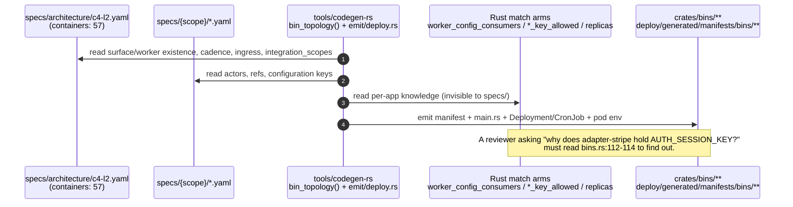
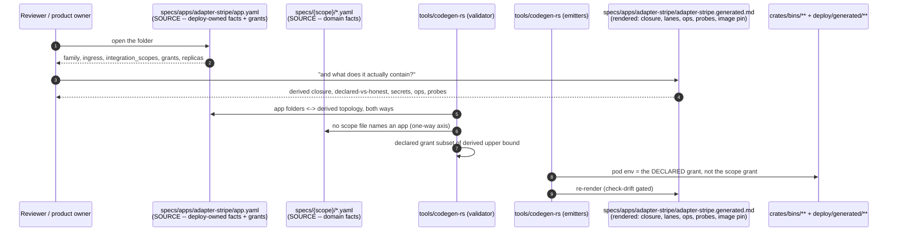

# PROP-20260811-141654 — One folder per app: the deployables declare what only they know, and everything else is rendered

- **Status**: Proposed
- **Date**: 2026-08-11
- **Tracking issue**: [#491 "Per-app declaration folders: specs/apps/{app}/ owns the deploy-owned facts, and the generated per-app index is the 57-app list"](https://github.com/TheCaptainCompany/captain-food/issues/491)
- **Realized by**: _(filled at completion)_
- **Origin**: product-owner request, 2026-08-11, verbatim: *"Give me the app list to be on the same page. Perhaps we should create a sub folder for each app/worker and indicate what it contains with the yaml files in it. Build me proposal for that."*
- **Concerns**:
  - [ ] ENFORCEMENT-ORDER: this must not be scheduled ahead of [PROP-20260811-090000](PROP-20260811-090000-scope-isolation-runtime-decomposition.md) slices or [#490 "Scope-closure ratchet"](https://github.com/TheCaptainCompany/captain-food/issues/490). A folder cannot make a link boundary real, and a filing exercise that *looks* like enforcement is the most expensive outcome available here.
  - [ ] AXIS-ONE-WAY: the validator rule proving no file under `specs/{scope}/` names an app id must land **with or before** slice A2, or the second axis starts fighting the first on day one.
  - [ ] GRANT-BLAST: slice A4 narrows what a pod can read. A wrong narrowing takes a pod down at boot, not in review — it ships report-only first (gate-then-stabilize), and the flip to enforcing is a separate recorded decision.
- **Screen mockups**: **deliberately none, and this is recorded rather than silently omitted.** The proposal has no user-facing surface and no use case a persona performs — it changes where a fact is written and what a build refuses. The mockups rule (docs/proposals/README.md) exists so a design's shape is fixed before its visuals; the shape here is a directory layout and a validator rule, and §1 + §5 fix it. The nearest thing to a "screen" is the generated per-app index, sketched in §4.
- **History**: `git log -p` on this file.

---

## TL;DR

**The app list already exists as source, in one place** — the `containers:` block of
`specs/architecture/c4-l2.yaml`, 57 deployable entries. What does **not** exist is a home for the
per-app facts that are neither domain facts nor derivable, and those facts are today written in
**Rust, inside the generator**: `worker_config_consumers()` is a literal
`match name { "worker-sirene-sync" => … }` (`tools/codegen-rs/src/emit/bins.rs:217-224`),
`adapter_key_allowed`/`worker_key_allowed` are per-family grant policies (`:111-139`), and
`replicas: 1` / `strategy: Recreate` are string literals in `tools/codegen-rs/src/emit/deploy.rs:335-340`
under a comment reading *"Flipping either value is a SPEC change once #242 lands — never a hand
edit here"* while **no spec key exists to flip**.

So the answer to "source or generated" is not a coin toss: **source for what only the deploy
topology knows, generated for everything else, and nothing written twice.** The `containers:` block
is **moved** into `specs/apps/{app}/app.yaml`, not copied; the derived content (domain crates,
lanes, operations, projection groups, probes, image pins) is **rendered read-only** into a generated
per-app index. One fact, one home, one direction.

**And the payoff is not what the request implies.** A YAML folder cannot make a scope boundary real
— only the crate graph does that, which is [PROP-20260811-090000](PROP-20260811-090000-scope-isolation-runtime-decomposition.md)'s
job and is untouched by this. The measurable payoff is **least privilege**, because the per-app
grant is currently derived from *scope*, and scope is the wrong granularity for a credential:

| App | Its own stated boundary | Secrets in its generated pod env |
|---|---|---|
| `adapter-stripe` | *"holds ONLY this partner's secrets"* (`specs/architecture/c4-l2.yaml:125`, `tools/codegen-rs/src/emit/bins.rs:415`) | **13** — incl. `AUTH_SESSION_KEY`, `SUPABASE_SECRET_KEY`, `EXTERNAL_API_TOKENS`, `INTERNAL_TRIGGER_TOKEN`, `OVH_APPLICATION_SECRET` |
| `gateway-public` | *"no DB access, no business logic, no state"* (`tools/codegen-rs/src/emit/bins.rs:410`) | **10** — incl. `SUPABASE_SECRET_KEY` and the four `OVH_*` SMS credentials |
| `fo-storefront` | *"holds no domain vocabulary and no broad views access"* (`:413`) | **10** |
| `bam` | *"a cross-scope consumer BY DESIGN"* | **18** — incl. `STRIPE_SECRET_KEY`, `UBER_DIRECT_CLIENT_SECRET` |
| `worker-erasure` | *"its env carries DATABASE_URL + telemetry ONLY"* (`c4-l2.yaml`) | **2** ✅ |

The mechanism that produces the last row already exists and works
(`worker_key_allowed`, `tools/codegen-rs/src/emit/bins.rs:131-139`). It is applied to exactly one
family. The per-app folder is the artifact that lets it apply to all of them **without** a growing
`match` in the emitter.

---

## 1. The 57 apps, by family — the direct answer to the request

Counts verified against `crates/bins/` (57 directories) and `specs/generated/crate-graph.generated.json`
(57 `bins` entries). "Declared domain crates" is the manifest's scope assertion; "secrets" is
`secretKeyRef` occurrences in `deploy/generated/manifests/bins/{app}.yaml`.

### `actor-*` — 15 apps · one per aggregate
**What it contains**: a mailbox worker that leases and drains **only its own aggregate's lanes** and
appends that aggregate's events. One writer per aggregate is the consistency promise; the bin is
that promise's deployment shape.

| App | Aggregate | Declared domain crates | Secrets |
|---|---|---|---|
| `actor-order` | `Order` (the Friday-peak hot type) | 2 | 11 |
| `actor-cart` | `Cart` | 2 | 11 |
| `actor-payment` | `Payment` | 3 | 13 |
| `actor-catalog` | `Catalog` (incl. HubRise imports) | 2 | 12 |
| `actor-customer` | `Customer` | 2 | 11 |
| `actor-customer-credit` | `CustomerCredit` (goodwill ledger) | 1 | 13 |
| `actor-restaurant` | `Restaurant` | 2 | 11 |
| `actor-restaurant-account` | `RestaurantAccount` | 2 | 11 |
| `actor-prospect` | `Prospect` | 1 | 11 |
| `actor-rider` | `Rider` | 2 | 15 |
| `actor-delivery-job` | `DeliveryJob` | 2 | 15 |
| `actor-delivery-partner-registration` | `DeliveryPartnerRegistration` | 1 | 15 |
| `actor-conversation` | `Conversation` (per-order messaging) | 2 | 11 |
| `actor-reclamation` | `Reclamation` | 1 | 11 |
| `actor-mailbox-supervision` | `MailboxSupervision` (operator facts, #315) | 1 | 11 |

### `pm-*` — 5 apps · one per process manager
**What it contains**: a mailbox worker running **one** saga, restricted to its own process manager.
A PM is the declared cross-scope bridge, so its domain-crate links are legitimately its spec `$ref`s.

| App | Process manager | Declared | Secrets |
|---|---|---|---|
| `pm-place-order` | `PlaceOrderProcess` — checkout, acceptance-first | 3 | 13 |
| `pm-refund` | `RefundProcess` | 3 | 13 |
| `pm-reclamation` | `ReclamationProcess` | 3 | 13 |
| `pm-delivery-dispatch` | `DeliveryDispatchProcess` | 2 | 15 |
| `pm-cart-binding` | `CartBindingProcess` — anonymous cart → customer | 2 | 11 |

### `projector-*` — 7 apps · one per non-kernel scope
**What it contains**: a projection worker folding the single log, filtered to its scope's events,
into its scope's `View_*` schema on its own checkpoint (D4). The kernel scope has none — it owns no
`View_*`.
`projector-ordering` · `catalog` · `network` · `customer` · `delivery` · `payments` · `comms` —
1 declared domain crate each, 11–15 secrets each.

### `graphql-*` — 8 apps · one subgraph per scope, kernel included
**What it contains**: the read/write GraphQL surface for one scope — queries over that scope's views
schema, mutations that enqueue that scope's commands on the mailbox. D8, one domain one graph.
`graphql-ordering` · `catalog` · `network` · `customer` · `delivery` · `payments` · `comms` ·
`common` (kernel: operation status + mailbox supervision, served from the write-path journals, no
`View_*`).

### `gateway-*` — 7 apps · one per role path
**What it contains**: nothing but routing. A generated top-level field-routing table per
`/{role}/graphql` (role = path, ADR-0006). No DB, no state, no domain vocabulary.
`gateway-public` · `customer` · `restaurant` · `restaurant-account` · `rider` · `admin` ·
`external` — 0 declared domain crates each, **10 secrets each**.

### `fo-*` / `bo-*` — 5 apps · the surfaces
**What it contains**: assets + SSR for one audience, speaking only to its role gateway.
`fo-marketplace` (live.captain.food) · `fo-storefront` (`{slug}.captain.food`, Host-resolved
tenant) · `bo-restaurant` · `bo-rider` · `bo-admin` — 0 declared domain crates, 10 secrets each.

### `adapter-*` — 5 apps · one per partner ACL (ADR-20260808-062432)
**What it contains**: one partner's webhook ingestor — verify signature, mirror into that partner's
`external_*` journal, translate through the ACL, enqueue on the shared mailbox. The owning actor bin
does the writing.
`adapter-stripe` (13 secrets) · `adapter-hubrise` (12) · `adapter-uber-direct` (15) ·
`adapter-coopcycle` (11) · `adapter-avelo37` (11, deliberately unprovisioned pre-milestone).

### `worker-*` + `bam` — 5 apps · the cross-cutting jobs (ADR-20260808-062933)
**What it contains**: shape follows cadence — a declared `schedule:` renders a CronJob whose main
runs one pass and exits; no schedule renders an always-on Deployment.

| App | Cadence | What one pass does | Secrets |
|---|---|---|---|
| `worker-erasure` | `15 * * * *` | GDPR deletion journeys, tombstone → stream delete → receipt | **2** |
| `worker-retention` | `0 */6 * * *` | one `sweep_retention()` call; never touches `domain_events` | 2 |
| `worker-journal-sweep` | `*/5 * * * *` | flips stale `RECEIVED` command-journal rows to `FAILED` | 2 |
| `worker-sirene-sync` | `0 3 * * 1`, **suspended** | INSEE ingestion + staged-row drain through the SIRENE ACL | 2 |
| `bam` | always-on | business-activity projector; cross-scope consumer by design | **18** |

---

## 2. Where per-app truth lives today — three places, and what each gets wrong

| # | Place | What it holds | Defect |
|---|---|---|---|
| 1 | `specs/architecture/c4-l2.yaml` `containers:` | existence (for `fo-*`/`bo-*`/`worker-*`/`bam`), `technology`, `description`, `realizes:` `$ref`s, `schedule:`, `suspended:`, `ingress_host:`, `integration_scopes:` | It is **source and correct**. Its only problem is that it is a *diagram* artifact carrying operational configuration, so nobody looks for a pod's cadence in a C4 file |
| 2 | `bin_topology()` — `tools/codegen-rs/src/emit/bins.rs:229-377` → `specs/generated/crate-graph.generated.json` → `crates/bins/*` + `deploy/generated/manifests/bins/*` | family, scope, role, partner, domain crates, ports, mailboxed, consumers | The derivation is **sound and its output is false where it matters**: measured over the manifest graph, **49 of 57** bins' transitive `domain-*` closure ≠ their declared set. That is [#475](https://github.com/TheCaptainCompany/captain-food/issues/475) / [#490](https://github.com/TheCaptainCompany/captain-food/issues/490)'s territory, not this proposal's |
| 3 | **Rust `match` arms inside the emitter** | `worker_config_consumers()` (`bins.rs:217-224`), `adapter_key_allowed` (`:111-117`), `worker_key_allowed` (`:131-139`), `replicas`/`strategy` literals (`emit/deploy.rs:335-340`), the per-partner `adapter_main` arms | **This is the real gap.** These are per-app product decisions written in generator source. They are invisible to `specs/`, absent from `documentation.generated.md`, unreviewable by anyone who does not read the codegen, and they grow one arm per app |

Two measurements make place 3 concrete, and they point in **opposite** directions — which is exactly
why a policy expressed as `if family == X` cannot be right:

- **Too wide**: `adapter-stripe`, whose whole reason to exist is credential isolation, is granted
  `AUTH_SESSION_KEY`, `SUPABASE_SECRET_KEY`, `SUPABASE_SMS_HOOK_SECRET`, `EXTERNAL_API_TOKENS`,
  `INTERNAL_TRIGGER_TOKEN` and all four `OVH_*` SMS keys. The narrowing that exists explicitly
  exempts the kernel scope: `if b.family != "adapter" || origin_scope == KERNEL_SCOPE { return true }`
  (`bins.rs:112-114`), and `specs/common/configuration.yaml` declares **11** secret keys.
- **Too narrow**: `worker-sirene-sync`'s pod env contains **no `INSEE_API_TOKEN`**, and
  `SireneClient::from_env` returns `Err("INSEE_API_TOKEN must be set")`
  (`crates/sirene_ingest/src/client.rs:100-102`). This is correct *today* — the key deliberately
  declares no `deploy:` block because GitHub Actions is still the authoritative residence — and it
  is a live trap at the [#358](https://github.com/TheCaptainCompany/captain-food/issues/358)
  cutover, because nothing anywhere states *"this app needs this key to function"*.

---

## 3. Do the two axes compose, or fight?

`specs/{scope}/{kind}.yaml` (ADR-20260807-183024) is the **domain ownership** axis; `specs/apps/{app}/`
would be the **deployable** axis. They compose **if and only if** every fact has exactly one home,
decided by a total rule, and the reference direction is one-way.

**The rule that makes them compose:**

1. **Domain facts** — commands, events, errors, rules, api, views, configuration *keys* — belong to
   the scope axis. An app folder **never restates them**.
2. **Deploy facts** — existence, technology, cadence, ingress host, partner, integration scopes,
   config consumers, replicas/strategy, secret grant — belong to the app axis. A scope folder
   **never restates them**.
3. **The mapping between them is derived**, except where the mapping *is itself* the deploy decision:
   `realizes:` (which app hosts which actor) and `integration_scopes:` (which partner scope this pod
   ingests). Those are `$ref`s **from the app axis into the scope axis**.
4. **One direction, enforced**: the app axis may `$ref` into the scope axis; **a scope file may never
   name an app id.** Verified true today — grepping `specs/{ordering,catalog,common,customer,delivery,network,payments,comms}`,
   `specs/screens`, `specs/stories.yaml`, `specs/tests.yaml` and `specs/observability.yaml` for the
   57 app ids returns exactly **one** hit, and it is prose inside a `gates:` description
   (`specs/common/configuration.yaml:735`, "`http://gateway-public` Service"), not a structural
   reference. The property holds; it is simply not yet a rule, and it must become one before the
   second axis exists.

**Where they would fight, and the answer**: the temptation to write `scopes: [catalog]` in
`projector-catalog/app.yaml`. That fact is already derived from the app's name and proven by
`c4-bin-unknown` (`tools/codegen-rs/src/validate/bins.rs:135`). Restating it creates the arbitration
problem — two files, one truth, a validator adjudicating. **Rule 1 forbids it**, and D2 below is
where the line is drawn item by item.

**D8 is served, not contradicted.** A `graphql-{scope}` app folder holds no API content whatsoever;
the composed-schema model stays exactly as it is, with `specs/{scope}/api.yaml` the only source. The
generated index *renders* the operation list the subgraph serves — a reading convenience over the
existing derivation, which is what "indicate what it contains" asks for.

---

## 4. Flows

### 4.1 Today — three sources, one of them written in Rust



### 4.2 Target — one source per fact class, one rendered view



### 4.3 The generated index, sketched (this is the "screen")

```
specs/apps/adapter-stripe/
├── app.yaml                       <- SOURCE, hand-authored, ~20 lines
└── adapter-stripe.generated.md    <- GENERATED, read-only

  # adapter-stripe -- partner webhook ingestion (adapter family)
  Realizes .......... partner ACL `stripe` (crates/adapters/stripe)
  Ingress ........... hooks.captain.food/adapters/stripe
  Deploy shape ...... Deployment, replicas 1, strategy Recreate
  Probes ............ readiness /health, liveness /ping
  Image ............. ghcr.io/.../adapter-stripe  (pin: deploy/pins/adapter-stripe.json)
  Domain scopes ..... declared: (none)   honest closure: 8  <-- PENDING_DECOMPOSITION [#490]
  Secrets ........... declared 2: STRIPE_SECRET_KEY, STRIPE_WEBHOOK_SECRET
                      effective 13   <-- 11 kernel keys not declared  [#491 slice A4]
  Enqueues on ....... Payment lane
```

---

## 5. Decisions

### D1 — Is the per-app folder SOURCE or a GENERATED view? *(recommendation: A)*

Final vision first: A is the final clean shape and is presented first.

| Option | Pros | Cons |
|---|---|---|
| **(A) SOURCE for deploy-owned facts only; the derived content is a GENERATED index in the same folder; `c4-l2.yaml`'s `containers:` block is MOVED, not copied** ✅ **recommended** | The only option where the folder count of truths stays **one**. Gives the per-app facts currently hidden in Rust `match` arms a reviewable home in `specs/`, where the operating model already gates them. Makes the grant declaration (D4) possible, which is where the measured defect is. Satisfies the request literally: open a folder, read a YAML, read a generated index | Largest change: a loader, a §15 rule set, the c4 emitter reading a new tree, and 57 new folders. The `containers:` move touches the artifact three validator rule families read |
| (B) A fully GENERATED read-only view (`specs/generated/apps/`) and nothing else | Zero drift risk by construction; cheap; lands in one slice; immediately answers *"be on the same page"* | It **cannot hold anything** — the per-app facts in `c4-l2.yaml` and in the emitter's `match` arms stay exactly where they are, so the folder documents the problem without moving it. It also cannot carry the grant declaration, which is the only part of this with a measurable payoff. Good as **slice A1 of A**; wrong as the destination |
| (C) Hand-authored SOURCE for **everything** (scopes, lanes, api surface, config keys), validator-reconciled against the derivation | Each app is fully readable in one file; no cross-referencing | **This is the drift surface the request must not produce.** 57 files restating derivable facts, a validator arbitrating between two truths, and — under Evans — the same term (`catalog`) meaning "the scope that owns these events" in one file and "the thing this pod links" in another. It manufactures exactly the asserted-but-unenforced claim [#475](https://github.com/TheCaptainCompany/captain-food/issues/475) spent a PR deleting |
| (D) Do nothing structural; publish a generated roll-up doc of the 57 apps | Zero cost; the "same page" ask is met in one commit | Leaves the grant defect (13 secrets in the isolation pod) with no home to fix it in, and leaves per-app product decisions in generator source where no reviewer will find them. Honest fallback **only if** D4 is judged not worth the work — and the `adapter-stripe` measurement says it is |

**Recommendation: (A).** Slice A1 of A *is* option B's artifact, delivered first — that is **scope
staging of the final shape, not shape staging** (ADR-20260808-235113): the generated index is a
permanent part of A, not a shim that A replaces.

### D2 — What is the minimum content of `app.yaml`? *(recommendation: (a) — deploy-owned only)*

| Option | Pros | Cons |
|---|---|---|
| **(a) Deploy-owned facts only; everything derivable is forbidden** ✅ **recommended** | Rule 1 of §3 holds mechanically; the file stays ~20 lines and every line is a decision someone made. A reviewer knows that anything in `app.yaml` is a choice and anything in the index is a consequence | Reading "what this app contains" needs two files (the source and the index). Mitigated by putting them side by side in the folder (D3a) |
| (b) Deploy-owned + a short echo of scopes/lanes "for readability" | One file answers everything | The echo is a second truth by definition. Even validator-reconciled, it invites the next author to edit the echo and expect it to mean something. This is (C) at 10% size and it fails for the same reason |
| (c) Deploy-owned + the honest-closure ledger row | Puts the debt next to the app it belongs to | The closure is **measured from the crate graph**, not declared. Hand-writing it makes a stale row indistinguishable from a true one — see D5 |

**The content, item by item** — SOURCE (moved from where it lives now) vs FORBIDDEN (already derived):

| Field | Status | Where it lives today |
|---|---|---|
| `family` | SOURCE (identity of the folder; validated against the derivation where one exists) | derived from the name prefix |
| `description`, `technology` | SOURCE — **moved** | `c4-l2.yaml` containers |
| `realizes:` (`$ref` into actors.yaml/processmanager.yaml) | SOURCE — **moved** | `c4-l2.yaml` `realizes:` |
| `schedule:`, `suspended:` | SOURCE — **moved** | `c4-l2.yaml` |
| `ingress_host:` (+ path) | SOURCE — **moved** | `c4-l2.yaml` |
| `integration_scopes:` | SOURCE — **moved** | `c4-l2.yaml` |
| `config_consumers:` | SOURCE — **moved out of Rust** | `worker_config_consumers()`, `bins.rs:217-224` |
| `replicas:`, `strategy:` | SOURCE — **moved out of Rust** (the comment at `emit/deploy.rs:335` already promises this is a spec key) | string literals, `emit/deploy.rs:335-340` |
| `grants:` (secret keys this pod needs) | **SOURCE — new** (D4) | nowhere; approximated by scope routing + two family `if`s |
| domain scope crates | **FORBIDDEN** — derived | `actor_scope_links()` / `bin_topology()` |
| mailbox lanes, `ports:` | **FORBIDDEN** — derived | `actors.yaml` / `processmanager.yaml` |
| api operations served | **FORBIDDEN** — derived | `specs/{scope}/api.yaml` |
| projection groups / `View_*` | **FORBIDDEN** — derived | `specs/database/`, the projection registry |
| probes, ports, labels | **FORBIDDEN** — derived from family | `emit/deploy.rs` |
| image digest / source hash | **FORBIDDEN** — deploy ledger | `deploy/pins/{app}.json` |
| non-secret configuration keys | **FORBIDDEN** — derived by scope routing | `specs/{scope}/configuration.yaml` |

### D3 — Where does the generated index live? *(recommendation: (a) — in the app folder)*

| Option | Pros | Cons |
|---|---|---|
| **(a) `specs/apps/{app}/{app}.generated.md`, beside `app.yaml`** ✅ **recommended** | Answers the request as asked — open the folder, see what it contains. Precedent exists (`deploy/generated/`, the `database.md` GENERATED region) and `check-drift` already covers regenerated artifacts | Source and generated share a directory, so the hand-edit hazard is real. Mitigated by the standard GENERATED header + `check-drift` — the same mitigation every other generated artifact relies on |
| (b) `specs/generated/apps/{app}.md` | Clean separation; matches the `specs/generated/` convention exactly | The app folder then contains a single 20-line YAML and answers "what does it contain?" with nothing. The request is specifically about being able to look |
| (c) Both (index in-folder, roll-up under `specs/generated/`) | Best of both | Two generated artifacts to keep in step for no additional information. **Except** for the roll-up: recommend `specs/generated/apps.md` as the single 57-row table *in addition* to (a), because §1 of this proposal should not have to be hand-maintained |

**Recommendation: (a) + a single generated `specs/generated/apps.md` roll-up.**

### D4 — Do apps declare their secret grants? *(recommendation: (a))*

| Option | Pros | Cons |
|---|---|---|
| **(a) Each app declares `grants:`; the scope-routing derivation becomes the UPPER BOUND, and the emitted pod env is the declaration** ✅ **recommended** | Fixes the measured defect: `adapter-stripe` declares 2 and gets 2. Reaches **level 5** on the axis where it is reachable — the generated typed `Config` for an app has no field for a key it did not declare, so reading it does not compile (compiler-first, ADR-20260803-234035). Turns *"holds ONLY this partner's secrets"* from a comment into a file plus a gate. Subsumes the family `if`s in `bins.rs:111-139` — deleting a check the declaration subsumes is a correct outcome | A wrong declaration is a **boot failure**, not a review comment. Must ship report-only first (Concerns/GRANT-BLAST). Adds a per-app authoring obligation |
| (b) Extend the Rust narrowings family by family (`projector_key_allowed`, `gateway_key_allowed`, …) | No new spec surface; smallest immediate diff | One `if` per family, forever, in generator source; a per-app exception (which `bam` already is) has nowhere to go but another `match` arm. It is (a) written in the least reviewable language available |
| (c) Leave it — accept scope-granularity grants | Zero cost | An unrecorded acceptance, not a decision. `adapter-stripe`'s 13 secrets and `gateway-public`'s 10 stay, under comments claiming the opposite |

**Note on ordering**: this decision is **independent** of the isolation program. It fixes a
credential boundary; `PROP-20260811-090000` fixes a code boundary. Neither blocks the other.

### D5 — Does [#490](https://github.com/TheCaptainCompany/captain-food/issues/490)'s `PENDING_DECOMPOSITION` ledger move into the app folders? *(recommendation: (a) — no)*

| Option | Pros | Cons |
|---|---|---|
| **(a) No. The ledger stays a codegen artifact; the per-app index RENDERS its row** ✅ **recommended** | The closure is **measured**, not declared: making it hand-authored means a stale row and a true row look identical, which is the failure #490's own both-ways assertion exists to prevent. Rendering it puts the debt in front of anyone who opens the folder — the visibility benefit at none of the cost. **#490 is unaffected and stays dispatchable today** | The debt lives in two files (the test's list, the rendered index) — but one is generated from the other, so it is one truth |
| (b) Yes — each app carries its own `pending_decomposition:` row | Reads well; the debt sits with its owner | 49 hand-maintained rows asserting a fact the build measures. Slice 1 of the isolation program would delete rows in `specs/` and in the test, and a missed one is a silent lie |

**This is the load-bearing "does it change the enforcement track?" answer, and it is: no.**
See §6.

### D6 — Do the `c4-l2.yaml` `relationships:` move per app too? *(recommendation: (a) — no)*

| Option | Pros | Cons |
|---|---|---|
| **(a) No. Relationships stay in `c4-l2.yaml`; only `containers:` moves** ✅ **recommended** | A relationship is an **edge of a graph**, not a property of a node; the readable artifact is the whole graph in one file. Keeps `c4-l2.yaml` a real C4 artifact (boundedContexts + externalSystems + relationships) rather than a husk. Half the edges have an external system at one end and would have no app folder to live in | A reviewer reading one app's folder does not see its edges — mitigated by rendering the app's in/out edges into the generated index (D3a), which is derivation, not duplication |
| (b) Move edges to the `from` end's folder | Every fact about an app in one place | Splits one readable graph across 57 files; external→app edges need an arbitrary rule; and the diff of "who talks to whom" stops being reviewable as a diff |

This is a **boundary of the axis, not a stage of it** — recording it so a later session does not read
(a) as an unfinished migration.

---

## 6. What this changes — and does NOT change — on the enforcement track

**ISO-1 and ISO-2 are untouched, and that is the most important sentence in this proposal.**

[DECISIONS §29](DECISIONS.md) **ISO-1** (does `projection_runtime` own the `EventWaiter`/LISTEN
plumbing, or receive it?) and **ISO-2** (do `View_*` write repositories move into
`projections-{scope}`, or stay shared?) are questions about the **Cargo dependency graph** — about
`crates/**`. Nothing in `specs/**` can answer either. A per-app folder cannot make
`use domain_ordering::…` fail to compile inside a catalog projector; only removing the crate from the
link graph does that. If this proposal's folders land and ISO-1/ISO-2 stay open, the isolation
program is exactly where it was, with better documentation of its debt.

The concrete risk is therefore **displacement**: 57 folders is visible, satisfying work that will
read to an observer as progress on isolation. It is not. Hence the ENFORCEMENT-ORDER concern in the
header, and hence:

| Track | Status after this proposal |
|---|---|
| [#490 "Scope-closure ratchet"](https://github.com/TheCaptainCompany/captain-food/issues/490) | **Unchanged and still dispatchable today.** D5 keeps the ledger a codegen artifact; the per-app index renders it later, and rendering is additive |
| ISO-1, ISO-2 | **Unchanged.** Still the gate on `PROP-20260811-090000` slice 1; still owed |
| ISO-3 (`EventStore::append` has no capability witness) | **Unchanged.** Adjacent in class — an undeclared capability — but this proposal's `grants:` covers configuration secrets, not port capabilities |
| [#446 "Surface bins: derive a bin's config needs from what it SSRs"](https://github.com/TheCaptainCompany/captain-food/issues/446) | **Complemented, not duplicated.** #446 derives a surface bin's *needs* from its screens (an upper bound from the domain side); D4 declares the *grant* from the app side. They meet in the validator: declared ⊆ derived. #446 makes the derived bound correct for surfaces; D4 makes the declaration binding for every family |
| [#452 "Secret gate"](https://github.com/TheCaptainCompany/captain-food/issues/452) | **Complemented.** #452 checks a secret *exists* in the cluster; D4 checks a pod *may read it*. Presence vs authority |
| [#423 "Design record for the per-scope infrastructure split"](https://github.com/TheCaptainCompany/captain-food/issues/423) | **Unchanged** — `PROP-20260811-090000` remains its deliverable |

**One accuracy note for whoever executes #490**, found while measuring for §1: recomputing the
closure over the workspace manifests gives **49** violating bins, not 50, and the clean set is the
7 `gateway-*` bins **plus `bam`**. `bam` declares all 8 domain crates (`crate-graph.generated.json`)
and its closure is those same 8, so under the issue's own stated rule — *"the transitive closure's
`domain-*` set must EQUAL the manifest's declared set"* — `bam` **passes**. Since the issue also
specifies that a stale ledger entry must fail the test, listing `bam` in `PENDING_DECOMPOSITION`
would land the ratchet **red**. `bam` is a cross-scope consumer by design, so equality is the right
verdict for it; a separate row noting "declares 8 deliberately" is documentation, not debt.

---

## 7. Sequencing and rollback

| Slice | What lands | Proves | Rollback |
|---|---|---|---|
| **A1** | The generated roll-up `specs/generated/apps.md` + per-app index, rendered entirely from today's derivation. **No source moves.** | The renderer, and the request's "same page" ask, in one commit. If the index reads as noise, the whole idea is wrong and we stop here having spent one slice | Delete two generated paths and their emitter |
| **A2** | `specs/apps/{app}/app.yaml` × 57; `c4-l2.yaml`'s `containers:` block **deleted** and its container list derived from the app folders. Plus the **AXIS-ONE-WAY** validator rule and app-folder completeness both ways | That the move is semantically empty: `make validate` errors unchanged, `check-drift` clean, every `c4-bin-*` rule passing on derived input | `git revert` — a pure move with no semantic change is the cheapest revert in the repo |
| **A3** | `worker_config_consumers()`, `replicas`/`strategy`, and the family key-narrowing policy read from `app.yaml`; the `match` arms deleted | That per-app knowledge can leave generator source without the generated output changing by one byte (`check-drift` is the proof) | Revert; the `match` arms return |
| **A4** | `grants:` per app, **report-only**: the emitter still routes by scope, and a new check *reports* declared-vs-effective diffs. Then, as a **separate recorded decision**, the flip to enforcing — pod env = declaration | That the declarations are right before they are load-bearing (gate-then-stabilize). The `adapter-stripe` 13 → 2 reduction is the headline number | The flip is one config decision; report-only is inert |

**If the second axis turns out to fight the first**, the signal appears at A2 as validator rules that
cannot be written without arbitrating between two files. That is the stop condition: revert A2, keep
A1's generated index, and the outcome is option D with a good roll-up — a survivable, cheap landing.

---

## 8. Drawbacks

- **57 folders is a real navigation cost** even at ~20 lines each, and `specs/` gains a second
  top-level organising idea. Anyone learning the repo now has two axes to hold, and the one-way rule
  is the only thing keeping that from being confusing.
- **Displacement risk is the biggest one** and it is not technical: this is satisfying, visible work
  adjacent to unglamorous enforcement work that is genuinely urgent. It is listed as a Concern
  because a Drawbacks bullet is not a gate.
- **A generated file inside a source folder** (D3a) is a hand-edit hazard we are choosing to accept
  for readability. `check-drift` catches it in CI, not at authoring time.
- **A4 moves a boot-time failure earlier in the deploy**, which is the point, but it does mean a
  missing declaration takes a pod down rather than degrading it. Worth naming plainly.
- **Nothing here fixes the thing the request may be assumed to fix.** Scope isolation stays exactly
  as broken as `PROP-20260811-090000` measured it.

## 9. Unresolved questions

- **Does the `common` kernel secret floor survive at all?** D4 implies every app declares
  `DATABASE_URL` and `HONEYCOMB_API_KEY` explicitly, or we keep a two-key implicit floor (which is
  precisely what `worker_key_allowed` already hardcodes). Explicit-everywhere is more honest and
  noisier; a declared floor in `specs/common/` is quieter and is one more implicit rule.
- **Do the client apps (`web-client`, `mobile-*`, `desktop-restaurant`) and the infrastructure
  containers (`event-store`, `read-models`, `otel-collector`) get folders?** They are `c4-l2`
  containers but not `crates/bins/` deployables. Recommendation leans **no** — `specs/apps/` means
  "a thing we build and deploy an image of" — but that leaves `c4-l2.yaml` holding a partial
  container list after A2, which needs a clean statement of what each file owns.
- **Where does the `bam` exception live** once its 18 secrets are reviewed? It is a cross-scope
  consumer by design, so its grant is legitimately wide; the question is whether "wide by design" is
  a declaration in its `app.yaml` or an entry in a reviewed exceptions list.
- **Does A2 change the C4 emitter's output at all?** It must not. If rendering the container list
  from app folders reorders or reshapes `c4.generated.dsl`, the move is not semantically empty and
  the slice needs re-planning.
