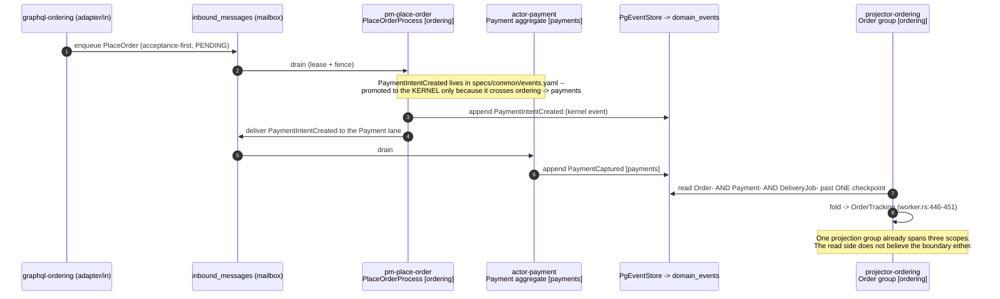
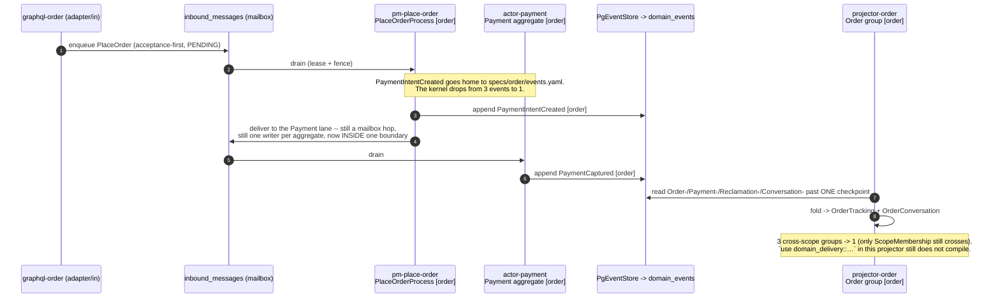

# PROP-20260811-150242 — The four boundaries already exist: `boundedContexts` and `specs/{scope}/` are two partitions of the same twenty actors

- **Status**: Proposed
- **Date**: 2026-08-11
- **Tracking issue**: [#493 "Two partitions, one domain: boundedContexts and specs/{scope}/ home 6 of 20 actors differently, and nothing reconciles them"](https://github.com/TheCaptainCompany/captain-food/issues/493)
- **Realized by**: _(filled at completion)_
- **Origin**: product-owner proposal, 2026-08-11, verbatim:

  > We have to have domain boundaries that potentially contains multiple actors process managers and workers I propose:
  > - customer <== public and customer management will be handle there
  > - order <== cart, order management payment reclamation refund
  > - restaurant <== catalog management restaurant management restaurant account management
  > - rider <== rider, rider partner

  and, the same day, the storage grouping that arrived with it, verbatim:

  > We should have one database for
  >
  > DomainEventLogDb <== domain_events
  >
  > DomainCommonDb <== customer, restaurant, rider
  > CatalogDb
  > OrderDb
  >
  > BehaviorEventTrackingDb <== events table
  >
  > ——
  > Every app/worker that need to access a database must have a dedicated user in the database with the most restricted access based on the spec
  >
  > Normally
  > - the reading of the read side is done only by graphql queries and projectors to know the current state of the rows to update them
  > - the writing of the read side is done only by the projectors
  > - the writing of the write side is done only by the actors
  > - the reading of the read side is done by actors to load the events and the projectors

- **Concerns**:
  - [ ] DECISION-REVERSAL: this amends [ADR-20260807-183024](../adr/ADR-20260807-183024-one-decomposition-axis.md) D1's **named scope list** (8, "from PM coupling"), which the product owner approved on 2026-08-07 as *"Approved as recommended"*. It lands as a **superseding ADR**, never as a silent spec edit — CLAUDE.md non-negotiable rule, question 1.
  - [ ] WINDOW: ADR-20260807-183024 D7 — *"start-clean makes the storage split free — the window that does not recur"*. [#358](https://github.com/TheCaptainCompany/captain-food/issues/358) and [#360](https://github.com/TheCaptainCompany/captain-food/issues/360) are in flight. A boundary reshape is free at the storage layer **today** and a schema migration after the cutover. The decision is time-boxed by an external event, not by preference.
  - [ ] AXIS-DISAGREEMENT: the link graph ([PROP-20260811-090000](PROP-20260811-090000-scope-isolation-runtime-decomposition.md)) and the per-app database role (this proposal's D11/D12, [#360](https://github.com/TheCaptainCompany/captain-food/issues/360)) are **two** enforcement axes and both are per-boundary. If crates are cut per-scope (8) while `GRANT`s are issued per-boundary (5), the two axes disagree about what a boundary IS, and every later review must ask which is authoritative. Worse than either alone. Neither may land before the set is recorded.
- **Screen mockups**: **deliberately none, and recorded rather than silently omitted.** This proposal has no user-facing surface and no use case a persona performs — it decides which deployable units exist and who may write what. The mockups rule (docs/proposals/README.md) exists so a design's shape is fixed before its visuals; the shape here is a partition of twenty actors and a validator rule, and §2, §3 and §5 fix it exhaustively. The nearest thing to a "screen" is the boundary map in §2 and the all-57-apps table in §5.
- **History**: `git log -p` on this file.

---

## TL;DR

**The product owner's four boundaries are not new. They are already source DSL, in
`specs/architecture/c4-l2.yaml:30-73`, and they have been since before the scope reorg.** That block
declares six `boundedContexts:` — `restaurant` · `catalog` · `order` · `platform` · `customer` ·
`delivery` — and its membership already answers **five of the eight ambiguous calls** the request
asks us to make, the same way the request does: `CustomerCredit` → `order` (`:50`), `Conversation` →
`order` (`:48`), `Prospect` → `restaurant` (`:37`), `MailboxSupervision` → a `platform` bucket
(`:55-58`), and `PUBLIC` as a **role of** the customer context (`:61`), not a member of it.

The finding is what sits underneath. **`boundedContexts:` and `specs/{scope}/` are two different
partitions of the same twenty actors, and nothing reconciles them.** The only gate is
`c4-actor-unmapped` (`tools/codegen-rs/src/validate/core.rs:1186-1193`) — a **warning** that each
actor belongs to *some* context. No rule checks that a context's members share a scope folder. They
have diverged since 2026-08-07 with every gate green.

And the divergence is almost trivially closable, which is the good news:

> **The context partition is a strict coarsening of the scope partition on 7 of the 8 scopes.**
> `payments` → `order`. `comms` → `order`. `network` → `restaurant`. `catalog`, `customer`,
> `delivery` map one-to-one. `common` → `platform` + the kernel. **Exactly one scope splits —
> `ordering` — and it splits on exactly one member: `CartBindingProcess`, which the C4 puts in
> `customer` and the folder puts in `ordering`.** Decide that one actor's home and the two
> partitions become one partition.

**Where the request does not close, and where we recommend differently:**

1. **Catalog should NOT fold into restaurant.** Measured, `catalog`↔`network` coupling is **zero of
   every kind**: no PM bridge, no shared kernel event, no co-checkpointed projection group, no
   `$ref`. The merge internalizes nothing and deletes a boundary the compiler enforces today. The
   product owner's own storage message agrees — it gives catalog its **own database**.
2. **The boundary is `delivery`, not `rider`.** It contains `DeliveryJob`, which is not a rider.
   Naming a domain boundary after a role is the same conflation the request correctly avoids for
   `public`. `RIDER` is its role (`c4-l2.yaml:68`).
3. **`platform` is a real, needed bucket** and the request omits it. It is where the 18 apps live
   that serve every boundary — gateways, surfaces, the mailbox supervisor, `bam`, the erasure and
   sweep workers — and homing them into a business boundary is how a boundary becomes nominal.
4. **`public` is a surface and a role path, not a domain member** — plainly, because conflating the
   two is how a boundary becomes nominal. `gateway-public` declares **0** domain crates; `public_user`
   is a persona (`specs/stories.yaml:12`), not an aggregate; and anonymous browsing reads
   **catalog and network** read models, i.e. the restaurant side's data, through a customer-side path.

**Recommended set: 5 business boundaries + 1 platform bucket + the kernel** — `customer` · `order` ·
`restaurant` · `catalog` · `delivery`, plus `platform`, plus `common` (kernel, not a boundary).

**The uncomfortable answer on sequencing, stated plainly: this does not unblock
[PROP-20260811-090000](PROP-20260811-090000-scope-isolation-runtime-decomposition.md) slice 1. It
adds a gate upstream of ISO-1 and ISO-2.** Slice 1 builds `projections-{scope}` × 7. If the boundary
set is 5, slice 1 builds seven crates that a later reshape merges into five — precisely the
intermediate step [ADR-20260808-235113](../adr/ADR-20260808-235113-final-vision-first-no-intermediate-steps.md)
forbids. The gate is cheap (five of eight calls are pre-answered) but it is real, and it is the
first thing to say.

---

## 1. What is actually true today, measured

| # | Fact | Evidence |
|---|---|---|
| 1 | `boundedContexts:` is **source DSL** declaring 6 contexts over all 20 actors | `specs/architecture/c4-l2.yaml:30-73` |
| 2 | `specs/{scope}/` declares 8 scopes over the same 20 actors | `specs/{ordering,payments,catalog,network,customer,delivery,comms,common}/actors.yaml` + `processmanager.yaml` |
| 3 | **6 of 20 actors are homed differently** by the two | `Payment`, `CustomerCredit`, `RefundProcess` (context `order` / folder `payments`); `Conversation` (`order`/`comms`); `CartBindingProcess` (`customer`/`ordering`); `MailboxSupervision` (`platform`/`common`) |
| 4 | The **only** gate is a warning that each actor is in *some* context | `tools/codegen-rs/src/validate/core.rs:1186-1193`, rule id `c4-actor-unmapped`. Zero rules compare the partitions |
| 5 | The cross-scope `$ref` DAG is a **pure star** — every `domains/*` crate depends on `domain-common` and nothing else; **zero** scope→scope edges | `specs/generated/crate-graph.generated.json` `domain_crates` block |
| 6 | `specs/common/events.yaml` holds exactly **3** events, and **2** exist only as ordering↔payments bridges | `PaymentIntentCreated` (emitted by `PlaceOrderProcess` in ordering, received by `Payment` in payments), `RefundApproved` (emitted by `RefundProcess` in payments, received by `ReclamationProcess` in ordering). The third, `MailboxMessageRequeued`, is genuinely kernel |
| 7 | The refund vocabulary is scattered across **three** scopes | `RefundOpened` → `specs/ordering/events.yaml`; `RefundApproved` → `specs/common/events.yaml`; `RefundDenied` → `specs/payments/events.yaml` |
| 8 | **5** declared cross-scope PM bridges; 3 of them are ordering↔payments | `pm-place-order`, `pm-refund`, `pm-reclamation` (ordering+payments); `pm-cart-binding` (customer+ordering); `pm-delivery-dispatch` (delivery+ordering) — `crate-graph.generated.json` `bins` |
| 9 | **9** projection groups; **3** slice streams from more than one scope | `crates/infrastructure/src/projection/worker.rs:446-451` (`Order`: `Order-`/`Payment-`/`DeliveryJob-`), `:458-463` (`OrderConversation`: `Conversation-`/`Order-`/`Reclamation-`), and `ScopeMembership` (`Order-`/`DeliveryJob-`/`Restaurant-`) |
| 10 | **Zero** duplicate scalar names across all 8 scope files | `specs/{scope}/scalars.yaml`; the only repeated top-level keys are the YAML headers `description`/`version` |
| 11 | `catalog`↔`network` coupling is **zero of every kind** | No `$ref` edge (fact 5), no PM bridge (fact 8), no shared kernel event (fact 6), no co-checkpointed group (fact 9) |
| 12 | There is **no notification port anywhere** | `crates/application/src/ports.rs` declares exactly 4 traits — `EventStore`, `GoogleOwnershipVerifier`, `GbpOrderLinkProbe`, `RestaurantRepository`. `specs/services.yaml` declares exactly 3 services — `payment`, `delivery`, `identity`. Zero repo hits for `NotificationPort` / `trait Notifier` / `SendNotification` |

**One correction to a sibling proposal, found while measuring.**
[PROP-20260811-090000](PROP-20260811-090000-scope-isolation-runtime-decomposition.md)'s §3 diagram
shows `scope_group_count("catalog")` returning *"3 of 19 groups"*. The registry has **9** groups
(`worker.rs:408-511`) and catalog has **1**. The diagram is illustrative and the proposal's argument
is unaffected, but the numbers should be corrected when that file is next edited — a wrong measured
number in a lasting artifact outlives the session that wrote it.

---

## 2. The two partitions, side by side

Read the last two columns together: the C4 column is the product owner's proposal, already written
down. **Bold rows are where the two disagree.**

| Actor | Kind | `specs/{scope}/` (today) | `c4-l2.yaml` `boundedContexts:` | Recommended (§3) |
|---|---|---|---|---|
| `Cart` | aggregate | ordering | order | **order** |
| `Order` | aggregate | ordering | order | **order** |
| `Reclamation` | aggregate | ordering | order | **order** |
| `PlaceOrderProcess` | pm | ordering | order | **order** |
| `ReclamationProcess` | pm | ordering | order | **order** |
| **`CartBindingProcess`** | pm | **ordering** | **customer** | **order** (D9) |
| **`Payment`** | aggregate | **payments** | **order** | **order** |
| **`CustomerCredit`** | aggregate | **payments** | **order** | **order** (D3) |
| **`RefundProcess`** | pm | **payments** | **order** | **order** |
| **`Conversation`** | aggregate | **comms** | **order** | **order** (D4) |
| `Customer` | aggregate | customer | customer | **customer** |
| `RestaurantAccount` | aggregate | network | restaurant | **restaurant** |
| `Restaurant` | aggregate | network | restaurant | **restaurant** |
| `Prospect` | aggregate | network | restaurant | **restaurant** (D5) |
| `Catalog` | aggregate | catalog | catalog | **catalog** (D1) |
| `DeliveryJob` | aggregate | delivery | delivery | **delivery** (D2) |
| `Rider` | aggregate | delivery | delivery | **delivery** |
| `DeliveryPartnerRegistration` | aggregate | delivery | delivery | **delivery** |
| `DeliveryDispatchProcess` | pm | delivery | delivery | **delivery** |
| **`MailboxSupervision`** | aggregate | **common** | **platform** | **platform** (D6) |

**The structural observation that makes this cheap.** Test whether the context partition is a
*coarsening* of the scope partition — i.e. whether every scope sits entirely inside one context:

| Scope | Contexts its members fall into | Contained? |
|---|---|---|
| `payments` | order, order, order | ✅ |
| `comms` | order | ✅ |
| `network` | restaurant ×3 | ✅ |
| `catalog` | catalog | ✅ |
| `customer` | customer | ✅ |
| `delivery` | delivery ×4 | ✅ |
| `common` | platform | ✅ |
| `ordering` | order ×5, **customer ×1** (`CartBindingProcess`) | ❌ |

**Seven of eight scopes are contained. One member breaks it.** So this is a **coarsening of the same
axis, not a second axis** — the question `PROP-20260811-141654` had to answer for app folders is
answered differently here, and more favourably: there is nothing to compose, because there was only
ever one axis and one of its two writings drifted.

---

## 3. The eight calls, decided

### D1 — Does `catalog` fold into `restaurant`? *(recommendation: **no** — keep it a boundary)*

Final vision first: the recommended option is presented first.

| Option | Pros | Cons |
|---|---|---|
| **(a) Keep `catalog` a separate boundary — 5 business boundaries** ✅ **recommended** | The merge would buy **nothing measurable**: `catalog`↔`network` has zero `$ref` edges, zero PM bridges, zero shared kernel events and zero co-checkpointed projection groups (fact 11). It would **delete** a boundary the compiler enforces today — `actor-catalog` declares `domain-catalog` alone, so catalog code cannot name `Restaurant`/`Prospect` types, and after a merge it could. Catalog has a genuinely different **writer class** (restaurant staff *and* the HubRise ACL), a different **change cadence** (bulk import vs lifecycle), and a different **read profile** (high-read, cacheable). **The product owner's own storage message agrees**: `CatalogDb` gets its own database while customer/restaurant/rider share one — that is catalog being treated as operationally distinct in the same breath as being folded in domainally | Departs from the request as written. Five boundaries, not four. A restaurant-staff person works across two boundaries (menu and shop), so one persona spans two |
| (b) Fold `catalog` into `restaurant` — 4 boundaries, exactly as proposed | Matches the request literally. One persona (`restaurant_owner`/`restaurant_manager`), one surface (`bo-restaurant`), one tenant — the boundary reads naturally to a human | Internalizes no bridge, repatriates no kernel event, makes no projection group intra-boundary — it is a pure boundary deletion with no compensating gain. And it contradicts the storage grouping the same product owner sent the same day |

**Recommendation: (a).** The rule this applies is Evans's own: a bounded context is justified by a
distinct ubiquitous language and a distinct model, not by a shared user. `Product`, `Offer`, `SKU`,
`OptionList`, `Stock` is a different language from `RestaurantAccount`, `slug`, `SIRET`, `opening
hours`, `listing opt-out` — and the fact that one person touches both is a **surface** observation,
which §D7 shows is exactly the class of observation that must not decide a boundary.

### D2 — `DeliveryJob`: order or rider? *(recommendation: **delivery/rider**)*

This is the hardest call in the set, as the request says. It is decided by **who writes**.

| Option | Pros | Cons |
|---|---|---|
| **(a) `delivery` (the rider boundary)** ✅ **recommended** | **Every one of `DeliveryJob`'s 16 inbox messages is written by a rider or a partner** — `AcceptDelivery`, `ConfirmPickup`, `CompleteDelivery`, `DeclineDelivery`, `UpdateDeliveryStatus`, `ReportDeliveryIssue`, `ResolveDeliveryIssue`, `EscalateDelivery`, `CancelDelivery`, `UnassignDeliveryFromPartner` + the six inbound partner facts (`specs/delivery/actors.yaml:74-148`). **Not one command comes from the order side.** Vernon's rule is that the mailbox is the consistency boundary and the aggregate belongs where its single writer is; the writer is the rider. The aggregate's own doc comment already says it: *"One delivery of an order (bounded context: delivery)"* (`specs/delivery/actors.yaml:42`). **Peak argument, and it is the decisive one**: Friday 19:00–21:30 has two independent hot write paths — checkout and dispatch — and they contend on different things (payment latency vs rider-accept races). Homing `DeliveryJob` in `order` puts a rider's accept behind the order boundary's deploy and scale unit, so an order deploy restarts the dispatch drain at peak. Keeping them apart is the *entire* point of having boundaries at all | The order lifecycle cannot complete without it, and the ETA — the product — is computed from it. A reader will feel the split |
| (b) `order` | The delivery job is the fulfilment of an order; `OrderTracking` folds `DeliveryJob-%` today (`worker.rs:448`) and the `ScopeMembership` group slices it too; `pm-delivery-dispatch` bridges the two | Both of those couplings are **read** and **bridge**, not write. A projection fold and a declared PM edge are exactly the two mechanisms this architecture provides so that a boundary does *not* have to absorb its neighbour. Using them as evidence for absorption inverts their purpose |

**Recommendation: (a).** The order side's relationship to `DeliveryJob` is a projection fold
(`worker.rs:446-451`) and a process manager (`pm-delivery-dispatch`) — the two sanctioned
cross-boundary mechanisms. It never sends it a command. Dispatch stays a cross-boundary
conversation, and it should: the alternative couples the two hottest write paths of a Friday
service into one deploy unit.

### D3 — `CustomerCredit`: customer or order? *(recommendation: **order**)*

| Option | Pros | Cons |
|---|---|---|
| **(a) `order`** ✅ **recommended** | It is a **money instrument**, and both of its writers are order-side: `GrantCustomerCredit` arrives from the reclamation/refund path and `ConsumeCustomerCredit` fires at checkout (`specs/payments/actors.yaml:61-68`). Being keyed `CustomerCredit-{customerId}` is Vernon's *"reference other aggregates by identity"* — an identity choice, not a membership one. The repo already has the precedent one row down: `Conversation-{orderId}` is not an Order aggregate. `c4-l2.yaml:50` already homes it here | The name says "customer", so a reader looking in the customer boundary will not find it |
| (b) `customer` | The key is the customer id; the balance is a customer-facing fact shown in the customer's profile | Every checkout consumption becomes a cross-boundary conversation **on the money path** — a second mailbox hop between "customer has €5 goodwill" and "this order costs €5 less", at peak, on the path where a failure means a wrong charge. This is the one place a cross-boundary hop is most expensive |

**Recommendation: (a).** Identity ≠ membership; writers decide.

### D4 — `Conversation`, and does `comms` survive as a boundary? *(recommendation: **order**; `comms` dissolves)*

| Option | Pros | Cons |
|---|---|---|
| **(a) `Conversation` → `order`; `comms` dissolves** ✅ **recommended** | **Its identity IS its order** — `identity: { $ref: '#/Conversation/state/orderId' }` with the comment *"a conversation's identity IS its order (ADR-20260725-015921)"* (`specs/comms/actors.yaml:10`). **The read side already treats them as one boundary**: the `OrderConversation` group co-checkpoints `Conversation-`, `Order-` AND `Reclamation-` under one checkpoint precisely so the three fold in global `position` order (`worker.rs:458-463`). Its language is order language — order status woven into the thread, claim entries woven in. It is the smallest scope in the repo: 1 aggregate, 6 events, 6 commands | Loses a named home for the messaging growth path |
| (b) Keep `comms` a boundary | It was justified in `PROP-20260807-174246:52` by *"its own growth path (attachments, PROP-20260725-120055)"* | That justification is a **forecast**, and the attachment framework is still unbuilt. A bounded context earns its cost by having a distinct model today (Young's *"CQRS is not a top-level architecture"* argument applied one level up: a boundary applies where it earns its cost, not pre-emptively). Meanwhile the co-checkpointed group means the boundary is already crossed on every read |
| (c) `Conversation` → a `platform` messaging capability | Messaging as infrastructure is a common shape | The thread is not generic — it carries folded order status and reclamation entries. This would make the order boundary depend on platform for order semantics |

**Recommendation: (a).** Say it plainly: **`comms` does not survive as a boundary; it dissolves into
`order`.** The cost is real but bounded — `projector-comms`, `graphql-comms` and the comms views
schema merge into their order equivalents. The spec-folder move itself rewrites no `$ref`s.

### D5 — `Prospect` → `restaurant`, and the erasure consequence *(recommendation: **restaurant**, with a named consequence)*

**Call: `restaurant`,** and it is not close. A prospect row **is** the restaurant listing —
`identity: { $ref: '#/Prospect/state/restaurantId' }` with the comment *"a prospect row IS the
restaurant listing (stream `Prospect-{restaurantId}`)"* (`specs/network/actors.yaml:160`). Same
identity, same lifecycle, same surface. `c4-l2.yaml:37` already homes it there.

**The consequence must be recorded, because it is a trap for anyone who assumes a boundary has one
retention posture.** `RestaurantListingOptedOut` (`specs/network/events.yaml:344-356`) **is** the
Art. 21 objection register, and the legal record says suppression entries are retained
**indefinitely** (`docs/legal/BRIEF-20260811-erasure-zone-and-retention.md:376`, question G5 at
`:344-351`). So the `restaurant` boundary contains, in the same schema and behind the same database
role:

- an **indefinite-retention accountability record** (the objection register), which must survive
  every erasure request, and
- ordinary restaurant and contact data, which is erasable.

**Therefore: retention is a property of a stream category, never of a boundary, and no per-boundary
erasure worker may be designed on the assumption that a boundary erases uniformly.** This argues
directly against homing `worker-erasure` in a business boundary (§5 puts it in `platform`) and
against any "one retention window per database" shortcut in the storage work.

### D6 — `MailboxSupervision` and `common` *(recommendation: kernel stays a kernel; `platform` is a separate bucket)*

**Confirmed: `common` stays the kernel and is NOT a fifth business boundary.** It holds shared
contracts, the 77 kernel scalars, each kind's doctrine header, and — after D1–D4 — exactly **one**
event (`MailboxMessageRequeued`), down from three, because `PaymentIntentCreated` and
`RefundApproved` go home to `order` (fact 6). That shrinkage is the point: **the kernel stops being
an escape hatch for one boundary's chatter and goes back to being a kernel.**

`MailboxSupervision` moves to a `platform` bucket, as `c4-l2.yaml:55-58` already says. The
distinction is load-bearing and worth stating because conflating the two is a real failure mode:

- **kernel** = a *linkage* concept. `domain-common` is a crate every boundary links. It is not
  deployed; it has no pod.
- **platform** = an *ownership and deployment* concept. It has 18 pods (§5).

Making the kernel a deployable is exactly the "N images of identical code" split-theater failure.
They must not share a name.

### D7 — Is "public" a domain member? *(recommendation: **no — it is a surface and a role path**)*

**Stated plainly, because conflating a surface with a domain boundary is exactly how a boundary
becomes nominal.**

Evidence that `public` is not a domain member:

- `gateway-public` declares **0** domain crates (`crate-graph.generated.json`); its own header says
  *"no DB access, no business logic, no state"* (`tools/codegen-rs/src/emit/bins.rs:410`).
- `public_user` is a **persona** (`specs/stories.yaml:12`), not an aggregate. There is no `Public`
  actor anywhere.
- `PUBLIC` appears in `api.yaml` only as a **role in an `@auth` list** — `[PUBLIC, CUSTOMER]`,
  `[PUBLIC, RESTAURANT_ACCOUNT]`, `[PUBLIC, CUSTOMER, ADMIN]` — and `specs/common/api.yaml:36-37`
  says so verbatim: *"PUBLIC in the list is just the anonymous path (/public/graphql)"*.

**And the sharper point**: anonymous browsing reads the **catalog and network** read models — the
restaurant side's data — through a customer-side path. So "public belongs to customer" is **true of
the surface and false of the data**. `c4-l2.yaml:61` already models it correctly, as
`roles: [CUSTOMER, PUBLIC]` on the customer context. Keep it there, as a role.

### D8 — Is the boundary called `delivery` or `rider`? *(recommendation: **`delivery`**; the product owner may overrule)*

| Option | Pros | Cons |
|---|---|---|
| **(a) `delivery`** ✅ **recommended** | The boundary contains `DeliveryJob`, which is not a rider — it is a unit of work that a *partner* may fulfil with no rider involved at all (`DeliveryAcceptedByPartner`, the avelo37/CoopCycle/Uber Direct ACLs). `RIDER` is its **role**, and `c4-l2.yaml:68` already writes it as `roles: [RIDER]`. Consistent with D7: do not name a domain boundary after a role | Departs from the request's wording |
| (b) `rider` | The request's own word; matches the persona and the `bo-rider` surface | Repeats, for delivery, exactly the conflation the request correctly avoids for `public`. It would also make `DeliveryPartnerRegistration` — a partner, not a rider — a member of a boundary named after riders |

**Recommendation: (a).** Flagged as a register row because the product owner named the word, and a
name is a legitimate product-owner call; the reasoning is offered, not imposed.

### D9 — `CartBindingProcess`: the one member that breaks the coarsening *(recommendation: **order**)*

| Option | Pros | Cons |
|---|---|---|
| **(a) `order`** ✅ **recommended** | **The PM's entire job is to write a `Cart`** — it reacts to `CustomerIdentified` and sends the binding command to the Cart aggregate. One-writer-per-aggregate says the boundary that owns the *written* aggregate owns the policy that writes it. It is also where the folder puts it today (`specs/ordering/processmanager.yaml:120`), so (a) is a zero-diff answer on the spec side | Contradicts `c4-l2.yaml:65`, which puts it in `customer` — so the C4 must change |
| (b) `customer` | Its trigger is a customer fact; the C4 already says so; the decision *"identification implies cart adoption"* is arguably a customer-boundary policy | The customer boundary would own a policy whose only effect is on another boundary's aggregate, which inverts the PM doctrine — *"aggregates own the facts; a process manager delivers events for the owning aggregate to record"* (`specs/common/processmanager.yaml:7-9`) |

**Recommendation: (a).** This is genuinely 50/50 on intuition and decided by doctrine, not taste.
**It is also the single most valuable row in this proposal per unit of effort**: it is the one member
whose home makes the two partitions identical.

### D10 — Where does the notification port live? *(recommendation: **transport in `platform`, policy in `order`**)*

**It does not exist.** `crates/application/src/ports.rs` declares exactly four traits —
`EventStore`, `GoogleOwnershipVerifier`, `GbpOrderLinkProbe`, `RestaurantRepository` — and none is a
notifier. `specs/services.yaml` declares exactly three services — `payment`, `delivery`, `identity`.
Zero repo hits for `NotificationPort`, `trait Notifier`, `SendNotification`. The only outbound
message the system can send today is the auth OTP, via `identity.send_phone_otp` (`:129`) over the
four `OVH_SMS_*` credentials.

| Option | Pros | Cons |
|---|---|---|
| **(a) The `notification:` SERVICE is `platform` (a fourth entry in `specs/services.yaml` with an adapter-shaped sender bin); the POLICY — who is told, when, and what happens if nobody acts — lives in the `order` boundary's process managers** ✅ **recommended** | Splits the two things that must not share an owner. The **transport** is a foreign model (SMS/push vendor) and gets an ACL like every other partner — Evans, and the shape `payment`/`delivery`/`identity` already use. The **policy** is cross-aggregate, so under Vernon it lives in a process manager, and the specific policy *"the restaurant has not accepted in 5 minutes → tell someone → release the authorization"* is already `PlaceOrderProcess`'s, because [ADR-20260808-195315](../adr/ADR-20260808-195315-customer-brief-answers.md) put the release there. This makes *"a paid order nobody is told about"* **an order-boundary defect with a named owner** | Two homes for one capability; a reader must look in two places |
| (b) Everything in `platform` — a notification service that decides what to send | One home | *"Nobody is told"* becomes a platform bug that **no boundary owns**, which is exactly how the worst failure mode of this domain stays unowned. A platform service would also have to know order semantics (accepted/ready/late), i.e. import the order model — a boundary violation by construction |
| (c) A notification adapter per boundary | Each boundary owns its own sends end to end | Four copies of vendor plumbing and four credential grants for one vendor, contradicting [ADR-20260808-062432](../adr/ADR-20260808-062432-one-bin-per-adapter.md)'s one-adapter-per-partner rule |

**Recommendation: (a).** The missing artifact is also an observability finding under
[ADR-20260808-144738](../adr/ADR-20260808-144738-product-ownership-lives-in-the-team-no-pm-agent.md): there is no
`specs/observability.yaml` contract for notification delivery, so once this exists there will be no
signal for *"the order was placed and the restaurant was never reached"* — the one number this
domain most needs. Name the contract in the same change that names the service.

### D11 — Does storage follow the domain boundary one-to-one? *(recommendation: **no — and the deviation is stated, not inherited**)*

The product owner's grouping does not match the boundaries, and the request is to say whether that
is right. **It is right, and the reason is not "cheaper" — it is that the two are answering
different questions.**

- A **domain boundary** answers *who may write what* — a consistency promise.
- A **database** answers *what shares a recovery posture, a buffer pool and a failure domain* — an
  operational promise.

[ADR-20260807-183024](../adr/ADR-20260807-183024-one-decomposition-axis.md)
D2 already made exactly this argument, in the product owner's own words (*"I don't like heavy
responsibility or too many responsibilities on one database"*), and split by **responsibility**
(`captain-core` = be the truth, backed up; `captain-views` = serve reads, rebuildable by replay)
rather than by scope. **The new grouping is that decision refined one level down**: it keeps the
truth/serving split (`DomainEventLogDb` = core) and then subdivides the serving side by **read
profile** — `CatalogDb` high-read and bulk-imported, `OrderDb` write-hot and money-critical,
`DomainCommonDb` for three low-write boundaries. That is coherent.

| Option | Pros | Cons |
|---|---|---|
| **(a) Storage groups by operational profile; the BOUNDARY is the SCHEMA + the per-app ROLE, not the database** ✅ **recommended** | Answers *"what still makes it a boundary?"* concretely: **a schema per boundary and a database role per app**, exactly what ADR-20260807-183024 D2's option table ranked above "a database per scope", with reasons. Three boundaries sharing `DomainCommonDb` still cannot read each other, because no app's role is granted another boundary's schema. Keeps cross-boundary admin SQL possible as incident tooling. Matches the product owner's own two-part message: the grouping AND *"a dedicated user with the most restricted access"* — the second half is what makes the first half safe | The boundary is invisible in the connection string, so a reviewer must read the `GRANT`s to see it. Mitigated by generating both from the spec |
| (b) One database per boundary, strictly | The boundary is legible at a glance | Kills cross-boundary admin SQL (Postgres has no cross-database join); N backup configs whose cross-restore is not mutually consistent; connection pools multiply. Already weighed and declined in ADR-20260807-183024 D2's option table |
| (c) One database, schemas only | Simplest | Puts the money path and analytics in one buffer pool — the resource form of the integration-database antipattern the product owner named on 2026-08-07 |

**Recommendation: (a) — and the deviation is now RECORDED rather than inherited.** State it as one
sentence in the superseding ADR: *"A boundary is a schema and a role, not a database; databases group
by recovery posture and read profile."* **The stop condition that keeps it honest**: if any app's
`GRANT` spans two boundaries' schemas outside the declared exceptions (`admin_ro`/`claude_ro`
incident tooling, `bam`, `worker-erasure`), the shared database has silently become an integration
database. That should be a validator rule, not a review habit.

**Two corrections the permission matrix needs before it becomes a `GRANT`** — flagged because an
ambiguous line in a permission matrix becomes a wrong `GRANT`, and a wrong `GRANT` is a boot failure
or a silent breach:

1. **The fourth bullet reads *"the reading of the **read** side is done by actors to load the
   events"* — loading events is reading the WRITE side.** Almost certainly a transcription slip for
   *"the reading of the **write** side is done by actors (to load their events) and by the
   projectors"*. Confirm before it is written into a role.
2. **The matrix omits the mailbox, and the omission is load-bearing.** `inbound_messages` lives in
   `captain-core` (ADR-20260807-183024 D2: *"event log + mailbox only"*), and **GraphQL mutation
   resolvers write it** — `crates/server/src/graphql/generated/mutation.rs:42` takes
   `Arc<dyn actor_client::mailbox::Mailbox>` and `:56-57` builds the envelope the resolver enqueues.
   So *"the writing of the write side is done only by the actors"*, taken literally as a `GRANT`,
   **makes every mutation fail at runtime**. The `graphql-*` pods need `INSERT` on
   `inbound_messages` (and nothing else in core). Process-manager state tables
   (`specs/database/tables/process_managers.yaml`) are a third row the matrix has no line for.

**And the fact the dba is quantifying, stated but not re-derived**: `specs/database/projection_views.yaml`
emits read models as `CREATE OR REPLACE VIEW` over `domain_events` (ADR-0039). Postgres has no
cross-database query, so isolating the log breaks them unless they become materialized tables. **Two
numbers this proposal contributes to that analysis, because they bear on the boundary decision**:
of the 15 read models, **5 are SQL views** (`View_DeliveryJob`, `View_DeliverySatisfaction`,
`View_DeliveryPartnerAvailability`, `View_Reclamation`, `View_PendingRefunds`) and **10 are already
materialized tables** (`projection_tables.yaml`). **All 5 of the breaking views sit in exactly two
boundaries — `delivery` (3) and `order` (2). `customer`, `restaurant` and `catalog` are entirely
unaffected.** No boundary recommendation here assumes the current view mechanism survives; the
remedy is the dba's.

### D12 — Which enforcement axis is load-bearing? *(recommendation: **both, and the link graph first**)*

The per-app database role is a **second** enforcement axis and it interacts with ISO-1. A boundary
can be nominal in the link graph and real in the database, or the reverse. Which one carries the
directive?

| Axis | Catches | Cannot catch |
|---|---|---|
| **Link graph** (`domains/*`, PROP-20260811-090000) | `use domain_ordering::OrderPlaced;` inside a catalog projector — a **compile-time vocabulary reach with no SQL in it** | A pod holding a wide connection string reading a table it has no business reading |
| **Database role** (`GRANT`, [#360](https://github.com/TheCaptainCompany/captain-food/issues/360)) | Cross-boundary reads and writes at runtime; credential blast radius | Anything that never issues SQL — including the exact mistake above |

**They are complements; neither subsumes the other. The link graph is load-bearing *for the
directive*,** because the product owner's stated test is *"a boundary an agent cannot cross"*, and
the easy-path mistake an agent actually makes is importing a type, not issuing a cross-schema
`SELECT`. A `GRANT` is invisible to `cargo build`.

**But the role axis lands sooner and is measurable in production**, and [#360](https://github.com/TheCaptainCompany/captain-food/issues/360)
is already in flight — so under *"prefer what makes the next thing verifiable"* it is good early
work. **What changes about the first cut: nothing about ISO-1's answer, everything about its
prerequisite.** Both axes are per-boundary. Cutting crates per-scope (8) while issuing roles
per-boundary (5) leaves two enforcement mechanisms that disagree about what a boundary is — the
AXIS-DISAGREEMENT concern in the header. **The boundary set must be recorded before either lands.**

---

## 4. Flows

### 4.1 Today — checkout crosses three boundaries, and two of its events live in the kernel

### 4.2 Recommended — the bridge is internal; the kernel keeps one event

**What does NOT change, and must be said**: merging scopes does **not** merge aggregates. `Payment`
keeps its own stream, its own mailbox lane and its own single writer. One aggregate per transaction
is untouched (Vernon); what changes is which crate the vocabulary lives in and which pod family
carries it.

---

## 5. All 57 apps, homed — no app left unassigned

Measured against `crates/bins/` (57 directories) and `specs/generated/crate-graph.generated.json`.
An unassigned app is a boundary hole, so every one is placed.

### Boundary members (39 apps)

| Boundary | Apps (today's names) | n |
|---|---|---|
| **customer** | `actor-customer` · `graphql-customer` · `projector-customer` | 3 |
| **order** | `actor-cart` · `actor-order` · `actor-reclamation` · `actor-payment` · `actor-customer-credit` · `actor-conversation` · `pm-place-order` · `pm-refund` · `pm-reclamation` · `pm-cart-binding` · `graphql-ordering` · `graphql-payments` · `graphql-comms` · `projector-ordering` · `projector-payments` · `projector-comms` · **`adapter-stripe`** | 17 |
| **restaurant** | `actor-restaurant` · `actor-restaurant-account` · `actor-prospect` · `graphql-network` · `projector-network` · **`worker-sirene-sync`** | 6 |
| **catalog** | `actor-catalog` · `graphql-catalog` · `projector-catalog` · **`adapter-hubrise`** | 4 |
| **delivery** | `actor-delivery-job` · `actor-rider` · `actor-delivery-partner-registration` · `pm-delivery-dispatch` · `graphql-delivery` · `projector-delivery` · **`adapter-uber-direct`** · **`adapter-coopcycle`** · **`adapter-avelo37`** | 9 |

**Why the adapters are boundary members, not platform.** An adapter is one partner's
anticorruption layer — it verifies, mirrors into that partner's `external_*` journal, translates
through the ACL and enqueues on the mailbox. Under Evans an ACL belongs to the boundary whose model
it protects, and homing it there is what lets the credential grant be narrow: `adapter-stripe` should
hold Stripe's secrets **and** reach only the order boundary, which is precisely the defect
[PROP-20260811-141654](PROP-20260811-141654-per-app-declaration-folders.md) measured (13 secrets in
the pod whose stated purpose is credential isolation). `worker-sirene-sync` is the same shape wearing
a worker's clothes: it drains staged INSEE rows through the SIRENE ACL into `Prospect`, so it is a
restaurant-boundary app.

### Platform / cross-cutting (18 apps)

| Group | Apps | n | Why not a boundary member |
|---|---|---|---|
| Role gateways | `gateway-public` · `gateway-customer` · `gateway-restaurant` · `gateway-restaurant-account` · `gateway-rider` · `gateway-admin` · `gateway-external` | 7 | A gateway is a **role path**, and every role reaches several boundaries. 0 declared domain crates each; pure routing from a generated composition table (D8, ADR-0006). Homing one in a boundary would import that role's whole fan-out into it |
| Surfaces | `fo-marketplace` · `fo-storefront` · `bo-restaurant` · `bo-rider` · `bo-admin` | 5 | A surface is an **audience**, not a boundary — the same distinction D7 draws for `public`. `bo-rider` renders order data; `fo-storefront` renders catalog, network and order data. 0 declared domain crates each |
| Kernel subgraph + supervisor | `graphql-common` · `actor-mailbox-supervision` | 2 | Operator facts about the mailbox itself (#315); no business vocabulary |
| Cross-cutting workers | `worker-erasure` · `worker-retention` · `worker-journal-sweep` | 3 | Each spans every boundary by nature. `worker-erasure` in particular deletes streams across all of them — it needs the **widest** grant of any app, which is a real tension with least privilege and must be named rather than discovered. See D5: it also cannot assume a boundary erases uniformly |
| Analytics | `bam` | 1 | *"A cross-scope consumer BY DESIGN"* — declares all 7 non-kernel domain crates and its closure equals its declaration, so it is honest, not debt |

**39 + 18 = 57.** ✅

### What the app count becomes after the reshape

`graphql-ordering`+`graphql-payments`+`graphql-comms` → `graphql-order` (3→1);
`projector-ordering`+`projector-payments`+`projector-comms` → `projector-order` (3→1);
`graphql-network`/`projector-network` → `graphql-restaurant`/`projector-restaurant` (rename).
**57 apps → 53.** Every removal is a generated bin, a generated image and a generated Deployment.

---

## 6. What it costs and what it unlocks

### Unlocks — each one measured, not asserted

| Gain | Before | After |
|---|---|---|
| Kernel events that exist only as a boundary bridge | 2 of 3 (`PaymentIntentCreated`, `RefundApproved`) | **0 of 1** |
| Refund vocabulary split across scopes | 3 scopes (`ordering`, `common`, `payments`) | **1 boundary** |
| Declared cross-boundary PM bridges | 5 | **2** (`pm-cart-binding` if D9 goes the other way; `pm-delivery-dispatch`) — and under D9(a), **1** |
| Projection groups slicing more than one boundary | 3 of 9 | **1 of 9** (`ScopeMembership` only) |
| `projections-{X}` crates in PROP-090000 slice 1 | 7 | **5** — ~29% less slice-1 work, and the first consumer ([#485](https://github.com/TheCaptainCompany/captain-food/issues/485)) is born in the final shape |
| Deployable apps | 57 | **53** |
| Boundary definitions in the repo | **2, unreconciled** | **1, gated** |

### Costs — stated honestly

| Cost | Size |
|---|---|
| **Two compiler-enforced boundaries are deleted** (`ordering`\|`payments`, `comms`\|`order`). After the merge, `actor-order` can name payment types where today it cannot | Real, and the price of the merge. It is paid for by the bridges and kernel events it internalizes — which is exactly why D1 declines the `catalog`\|`network` merge, where the same price buys nothing |
| **It is a recorded-decision reversal** of ADR-20260807-183024 D1's named scope list | One superseding ADR + one `docs/SPEC-LOG.md` sentence. Not optional, not a spec edit |
| Spec-folder move | **Free of `$ref` churn** — `$ref`s are kind-logical, so moving an item between scope folders rewrites nothing (ADR-20260807-183024 D1, CLAUDE.md) |
| `$ref` DAG | **Unaffected.** It is a star (fact 5); merging star points removes points and cannot create a cycle |
| `api.yaml` fragments | Merge per boundary; the composed per-role schema is unchanged, because composition is per **role**, not per scope, and the routing table is generated |
| `View_*` schemas + projector checkpoints | Checkpoints are per **group** (9), not per scope; a group's `scope:` is a filter label. Merging changes labels, not checkpoints. Schemas merge **free at start-clean** (D7) and become a migration after the cutover |
| `domains/*` crates | 8 → 5 + kernel. All generated |
| "One name, one dedicated scalar" | **Not affected anywhere.** Zero duplicate scalar names across all 8 scope files today (fact 10), and the rule is global rather than per-scope, so no merge can create a collision. The guarantee is safe |

---

## 7. The ISO consequence, stated explicitly

**This proposal does not answer ISO-1 and does not change its answer.** ISO-1 asks whether
`projection_runtime` owns the `EventWaiter`/LISTEN plumbing or receives it. That is a `crates/**`
layering question, and its answer is identical at 4, 5 or 8 units. **Recommendation (a) stands
unchanged.** ISO-2 likewise: *"move the `View_*` write repositories per scope"* simply reads *"per
boundary"*.

**What it changes is the N and the prerequisite.**

| Row | Effect |
|---|---|
| **ISO-1** | Answer unchanged — (a), `projection_runtime` owns it |
| **ISO-2** | Answer unchanged — (a), move them; "per scope" now reads "per boundary" |
| **ISO-3** (`EventStore::append` has no capability witness) | **Unchanged, and now more urgent**: whatever the boundary set is, `Arc<dyn EventStore>` lets any holder append to any stream. Still untracked. It is orthogonal to this and should not wait for it |
| **PROP-090000 slice 1** | **A new gate, upstream of both.** `projections-{scope}` × 7 becomes `projections-{boundary}` × 5. Building 7 first is the intermediate step [ADR-20260808-235113](../adr/ADR-20260808-235113-final-vision-first-no-intermediate-steps.md) forbids |
| [#490 "Scope-closure ratchet"](https://github.com/TheCaptainCompany/captain-food/issues/490) | **Unaffected and still dispatchable today.** It measures declared-vs-honest closure per bin; the ledger shrinks either way and its rows are regenerated, not hand-written |
| [#491 "Per-app declaration folders"](https://github.com/TheCaptainCompany/captain-food/issues/491) | **Slice A1 unaffected** (a rendered index of today's derivation). A2 onward should follow the boundary decision, since an `app.yaml` names the boundary its pod serves |

**So the honest verdict on "does this unblock slice 1": no — it blocks it, correctly.** The blockage
is cheap: five of the eight calls are already recorded in `c4-l2.yaml`, and this proposal recommends
the other three. It is one sitting, not a program.

---

## 8. Sequencing

| Slice | What lands | Proves | Rollback |
|---|---|---|---|
| **B1** | The **reconciliation gate**: a validator rule (ERROR) that every `boundedContexts:` member shares a boundary folder with its context-mates, plus the superseding ADR recording the set. **Lands before any move**, so the move cannot drift | That there is exactly one definition of a boundary, and the build knows it | Revert the rule; the ADR stays as a record of what was decided |
| **B2** | The folder move: `payments/` + `comms/` → `order/`; `ordering/` → `order/`; `network/` → `restaurant/`; the `platform` bucket. `c4-l2.yaml` `boundedContexts:` updated in the same commit. One `docs/SPEC-LOG.md` sentence | That the move is semantically empty: `make validate` errors unchanged, no new warning kind, `check-drift` clean, zero `$ref` rewrites | `git revert` — a pure move with no semantic change is the cheapest revert in the repo |
| **B3** | Regeneration: `domains/*` 8 → 5 + kernel; `graphql-*`/`projector-*` families 57 → 53 apps; the `PENDING_DECOMPOSITION` ledger rows renamed | That the generated layers follow the one axis with no hand edits | Revert B2; B3 is derived |
| **B4** | Per-boundary `captain-views` schemas + the per-app database roles (D11), **report-only first** — a check reports declared-vs-effective grants before any `GRANT` narrows. The flip is a separate recorded decision | That the grants are right before they are load-bearing (gate-then-stabilize). A wrong narrowing takes a pod down at boot, not in review | Report-only is inert; the flip is one config decision |

**Then**, and only then, PROP-20260811-090000 slice 1 builds `projections-{boundary}` × 5.

---

## 9. Drawbacks

- **It reverses a three-day-old approved decision.** ADR-20260807-183024 D1's eight-scope list was
  itself the answer to the product owner's earlier *"what is the right split?"*, approved *"as
  recommended"*. Reversing it that fast is a cost in credibility even when the reversal is right,
  and the honest reading is that the 2026-08-07 list was derived from PM coupling and got two
  boundaries wrong in the direction this proposal corrects.
- **Two compiler-enforced boundaries are deleted** and cannot be cheaply restored once the merged
  crates exist. If `payments` later needs to be its own boundary again, that is a second reversal.
- **The window is externally timed.** If [#358](https://github.com/TheCaptainCompany/captain-food/issues/358)
  cuts over before B2 lands, B4 stops being free and becomes a schema migration with data in it.
  That is the one drawback nobody controls.
- **`comms` disappears as a named home** for the messaging growth path, so attachments
  ([PROP-20260725-120055](PROP-20260725-120055-generic-file-attachment-framework.md)) will land inside
  the order boundary. If messaging genuinely grows a distinct model later, extracting it is a third
  boundary decision.
- **The `order` boundary becomes large** — 6 aggregates, 4 PMs, 17 apps. Vernon's "design small
  aggregates" is untouched (no aggregate merges), but a large boundary is a large blast radius for a
  deploy, and it is the Friday-peak boundary. Naming this now so it is not discovered at peak.

## 10. Unresolved questions

- **Does the `platform` bucket get a folder** (`specs/platform/`), or does `MailboxSupervision` stay
  in `specs/common/` with `platform` existing only as a C4 context and a deploy grouping? The kernel
  and the platform bucket must not share a name (D6), but they could share a folder.
- **Does `worker-erasure`'s cross-boundary grant get a declared exception**, or does erasure become
  per-boundary workers with a coordinating process manager? D5 says a boundary does not erase
  uniformly, which argues against per-boundary workers, but a single app with `DELETE` on every
  boundary's streams is the widest privilege in the system.
- **Does the `order` boundary want internal modules** (`order/payment/`, `order/conversation/`) to
  keep the folder navigable at 6 aggregates and 4 PMs, and if so does the validator's placement rule
  need to understand nesting?
- **Does `bam` get its own boundary** once the behaviour store is separate
  ([#485](https://github.com/TheCaptainCompany/captain-food/issues/485), `BehaviorEventTrackingDb`)?
  It is platform today; a separate database plus a separate projector is most of what a boundary is.
- **What is the fate of the 5 `View_*` SQL views** under a separated `DomainEventLogDb` — owned by
  the dba pass, but the answer decides whether `delivery` and `order` (the only two boundaries
  holding them) need materialization work inside B4 or before it.
