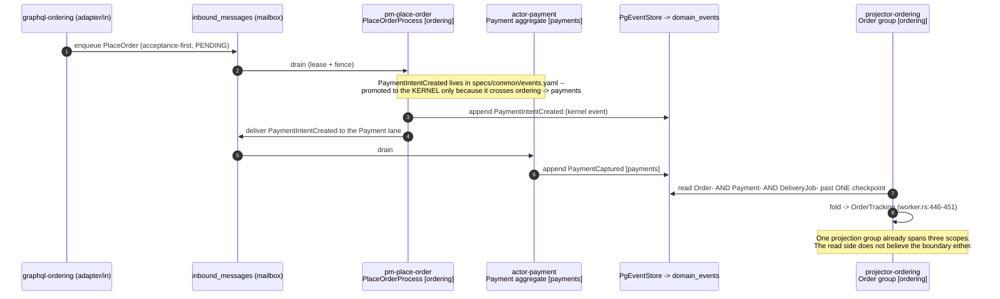
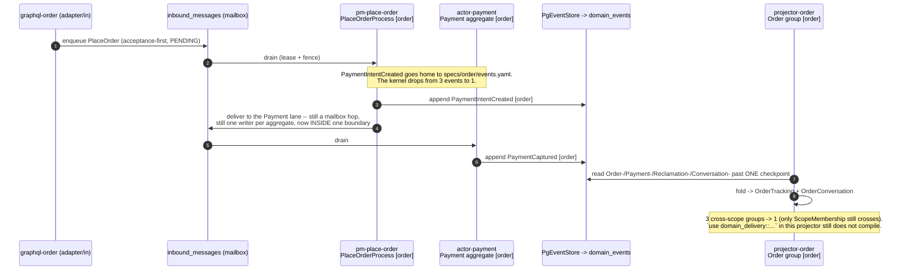
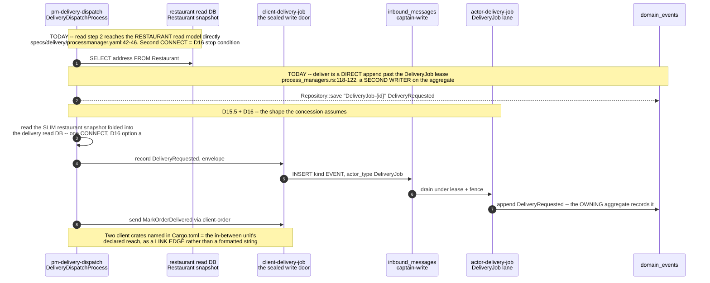
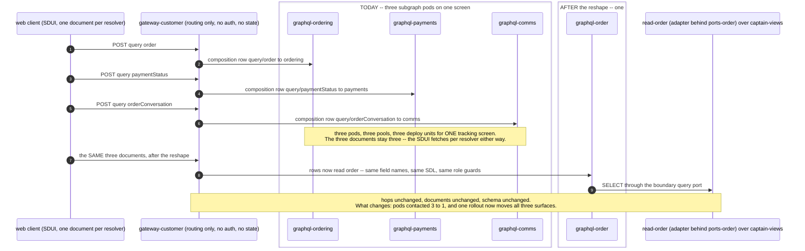

# PROP-20260811-150242 — The four boundaries already exist: `boundedContexts` and `specs/{scope}/` are two partitions of the same twenty actors

- **Status**: Proposed — **the boundary set is ANSWERED by the product owner (2026-08-11, §0)**; the
  file moves to the approved state when the superseding ADR named in the DECISION-REVERSAL concern lands.
- **Date**: 2026-08-11
- **Tracking issue**: [#493 "Two partitions, one domain: boundedContexts and specs/{scope}/ home 6 of 20 actors differently, and nothing reconciles them"](https://github.com/TheCaptainCompany/captain-food/issues/493)
- **Realized by**: _(filled at completion)_
- **Origin**: product-owner proposal, 2026-08-11, verbatim:

  > We have to have domain boundaries that potentially contains multiple actors process managers and workers I propose:
  > - customer <== public and customer management will be handle there
  > - order <== cart, order management payment reclamation refund
  > - restaurant <== catalog management restaurant management restaurant account management
  > - rider <== rider, rider partner

  and, the same day, the storage grouping that arrived with it, verbatim:

  > We should have one database for
  >
  > DomainEventLogDb <== domain_events
  >
  > DomainCommonDb <== customer, restaurant, rider
  > CatalogDb
  > OrderDb
  >
  > BehaviorEventTrackingDb <== events table
  >
  > ——
  > Every app/worker that need to access a database must have a dedicated user in the database with the most restricted access based on the spec
  >
  > Normally
  > - the reading of the read side is done only by graphql queries and projectors to know the current state of the rows to update them
  > - the writing of the read side is done only by the projectors
  > - the writing of the write side is done only by the actors
  > - the reading of the read side is done by actors to load the events and the projectors

- **Adjacent, and each assumes the other**: [PROP-20260811-093000](PROP-20260811-093000-storage-boundaries-and-least-privilege-database-users.md)
  (**storage boundaries and least-privilege database users**, [#494](https://github.com/TheCaptainCompany/captain-food/issues/494),
  register §32 STO-1…STO-6) answers the second half of the same product-owner message. The division is
  deliberate: **this proposal decides which units exist**; **that one decides what shares a recovery
  posture and a buffer pool** — and it reaches the same conclusion **BND-3** does here, that storage
  deliberately does **not** follow the boundary one-to-one (its §4.2 records the conclusion and the
  stop condition that keeps the deviation honest). The permission-matrix corrections BND-4 raises are
  worked through into actual grants in its §6.1.1, and the write-side transactional unit
  (**STO-1**: `DomainEventLogDb` cannot hold the log alone, or the fencing token is deleted) is a
  constraint this proposal inherits rather than re-decides.
- **Concerns**:
  - [ ] DECISION-REVERSAL: this amends [ADR-20260807-183024](../adr/ADR-20260807-183024-one-decomposition-axis.md) D1's **named scope list** (8, "from PM coupling"), which the product owner approved on 2026-08-07 as *"Approved as recommended"*. It lands as a **superseding ADR**, never as a silent spec edit — CLAUDE.md non-negotiable rule, question 1.
  - [ ] WINDOW: ADR-20260807-183024 D7 — *"start-clean makes the storage split free — the window that does not recur"*. [#358](https://github.com/TheCaptainCompany/captain-food/issues/358) and [#360](https://github.com/TheCaptainCompany/captain-food/issues/360) are in flight. A boundary reshape is free at the storage layer **today** and a schema migration after the cutover. The decision is time-boxed by an external event, not by preference.
  - [ ] AXIS-DISAGREEMENT: the link graph ([PROP-20260811-090000](PROP-20260811-090000-scope-isolation-runtime-decomposition.md)) and the per-app database role (this proposal's D11/D12, [#360](https://github.com/TheCaptainCompany/captain-food/issues/360)) are **two** enforcement axes and both are per-boundary. If crates are cut per-scope (8) while `GRANT`s are issued per-boundary (5), the two axes disagree about what a boundary IS, and every later review must ask which is authoritative. Worse than either alone. Neither may land before the set is recorded.
- **Screen mockups**: **deliberately none, and recorded rather than silently omitted.** This proposal has no user-facing surface and no use case a persona performs — it decides which deployable units exist and who may write what. The mockups rule (docs/proposals/README.md) exists so a design's shape is fixed before its visuals; the shape here is a partition of twenty actors and a validator rule, and §2, §3 and §5 fix it exhaustively. The nearest thing to a "screen" is the boundary map in §2 and the all-57-apps table in §5.
- **History**: `git log -p` on this file.

---

## 0. The product owner's answers, 2026-08-11 — verbatim, and what each closes

Recorded before anything else, because five rows of the register close here and one genuinely new
architectural concession arrives with them. Quotes are verbatim; the reading follows each.

| Quote (verbatim) | Closes | Reading |
|---|---|---|
| *"I'm ok for the 5 / Customer / Order / Catalog / Restaurant / Delivery"* | **BND-1** | **The boundary set is CLOSED as recommended (a)**: five business boundaries — `customer` · `order` · `catalog` · `restaurant` · `delivery` — plus the `platform` bucket and the `common` kernel, exactly as §3 and §5 propose them. `catalog` stays a boundary; `comms` and `payments` dissolve into `order`. **This is the row that had been top of the register across several runs, and it unblocks slices 1–5 of [PROP-20260811-090000](PROP-20260811-090000-scope-isolation-runtime-decomposition.md) and 15 of the 28 crates in [PROP-20260811-173223](PROP-20260811-173223-repository-crates-and-the-infrastructure-split.md) REP-2(a).** |
| *"Considering that you prefer delivery to rider because we have restaurants and admin commands in it make sense"* | **BND-2** | **`delivery`, not `rider`** — accepted with the reasoning endorsed (two of five `DeliveryJob` mutations are `[RESTAURANT, …, ADMIN]`, `specs/delivery/api.yaml:107-113`). `RIDER` stays a role. |
| *"Estimate for now"* | **BND-7** | **The ETA is an ESTIMATE, not a promise, for V0** — option (a): the frozen number exists as an internal quality signal (promised-vs-actual), never as a commitment with a remedy. **This must be reflected wherever the freeze onto `OrderPlaced` is specified** (§D13.5 step 4), and it is the cheap moment to get the shape right: the field is named and documented as an estimate, and no remedy semantics attach to it. |
| *"Prep time only + labelled"* | **BND-6** | **Option (b)**: when the travel leg cannot resolve, show a **prep-time-only** estimate, **explicitly labelled as what it is** ("ready in ~25 min", not "arrival"). The label is the whole condition — the defect D13.1 fact 4 measured (`eta_bar` labelled *"Estimated arrival"* bound to the kitchen ready time) is precisely the failure this answer forbids. |
| *"I agree it was the write side of course my mistake"* | **BND-4(i)** | **Confirmed: it is the WRITE side that actors and projectors read to load events.** The permission matrix in [PROP-20260811-093000](PROP-20260811-093000-storage-boundaries-and-least-privilege-database-users.md) §6.1 may now be written on that reading, and BND-4(i) is no longer a question. |
| *"I believe creating the apps will do a cleaner split between and help the split process / Do the way you think it's better / I need to know the app list and all dependencies we need to make sure we have a clean split"* | **APP-1** | **Sequencing is delegated to the team**, with a concrete deliverable demanded: **the app list plus all dependencies**, so a clean split can be verified. Tracked under [#491](https://github.com/TheCaptainCompany/captain-food/issues/491) / [PROP-20260811-141654](PROP-20260811-141654-per-app-declaration-folders.md); §5 of this file is its boundary-side input (all 57 apps homed, 39 + 18). |
| *"Ok for the event log, but I'm concerned about the word « journal », we have replace journal with unified mailbox inbound messages make sure we don't do both"* | **D14 confirmed; opens JRN-1** | The one-log property is accepted. The `journal` concern is **correct and sharper than it reads**: both tables exist today. Answered in [PROP-20260811-093000](PROP-20260811-093000-storage-boundaries-and-least-privilege-database-users.md) §6.1.2, which owns the permission matrix the residual breaks. |
| *"I'm ok if we create in between boundaries for process managers that are making the translation between 2 boundaries thanks to the fact that we have one crate per actor client type it's perfectly fine"* | **new — D15** | A genuine architectural concession, and it needs designing rather than filing. **§D15** below gives it a test, a classification of all five PMs, and the one measured fact that reverses its safety argument. |

**One correction owed to the product owner in the same breath as the thanks: the premise of the
concession does not hold today for process managers.** *"One crate per actor client type"* is real
and excellent — `crates/clients/{actor}` is 17 crates, each the sealed permission to address exactly
one actor (`crates/clients/cart/Cargo.toml:4-11`). **But no process manager uses it.** The generated
PM pipeline reaches the target aggregate two other ways, both of which bypass the client crate, the
target's mailbox lane and its lease:

- **`deliver:` is a direct append to the target's stream.**
  `crates/application/src/generated/process_managers.rs:118-122` —
  `Repository::new(store).save(&format!("DeliveryJob-{…}"), stream_version, &[DomainEvent::DeliveryRequested(…)], &actor)`.
- **`send:` runs the target aggregate's command handler IN-LINE**, in the PM's own process and
  transaction — `crates/application/src/generated/process_managers.rs:786` —
  `crate::commands::bind_cart_to_customer(store, sent, &actor)`.

**And the DSL's own doctrine header says the opposite, verbatim** (`specs/common/processmanager.yaml:7-9`):

> *"AGGREGATES OWN THE FACTS — a process manager never appends to `domain_events` itself; it
> delivers events for the owning aggregate to record, or sends commands the aggregate may reject."*

That is a spec claiming something the code does not do, on the write path, and it is exactly the
class CLAUDE.md warns is worst: it stops the next reviewer looking. It is also the concrete instance
that makes **ISO-3** (`EventStore::append` takes a bare `stream_name: &str`,
`crates/application/src/ports.rs:54-60`) load-bearing rather than theoretical — the PM is the caller
that actually appends to another boundary's stream category today. **The concession is sound; its
stated safety mechanism is not yet in place.** §D15 designs the rule so that it becomes true rather
than assumed.

---

## TL;DR

**The product owner's four boundaries are not new. They are already source DSL, in
`specs/architecture/c4-l2.yaml:30-73`, and they have been since before the scope reorg.** That block
declares six `boundedContexts:` — `restaurant` · `catalog` · `order` · `platform` · `customer` ·
`delivery` — and its membership already answers **five of the eight ambiguous calls** the request
asks us to make, the same way the request does: `CustomerCredit` → `order` (`:50`), `Conversation` →
`order` (`:48`), `Prospect` → `restaurant` (`:37`), `MailboxSupervision` → a `platform` bucket
(`:55-58`), and `PUBLIC` as a **role of** the customer context (`:61`), not a member of it.

The finding is what sits underneath. **`boundedContexts:` and `specs/{scope}/` are two different
partitions of the same twenty actors, and nothing reconciles them.** The only gate is
`c4-actor-unmapped` (`tools/codegen-rs/src/validate/core.rs:1186-1193`) — a **warning** that each
actor belongs to *some* context. No rule checks that a context's members share a scope folder. They
have diverged since 2026-08-07 with every gate green.

And the divergence is almost trivially closable, which is the good news:

> **The context partition is a strict coarsening of the scope partition on 7 of the 8 scopes.**
> `payments` → `order`. `comms` → `order`. `network` → `restaurant`. `catalog`, `customer`,
> `delivery` map one-to-one. `common` → `platform` + the kernel. **Exactly one scope splits —
> `ordering` — and it splits on exactly one member: `CartBindingProcess`, which the C4 puts in
> `customer` and the folder puts in `ordering`.** Decide that one actor's home and the two
> partitions become one partition.

**Where the request does not close, and where we recommend differently:**

1. **Catalog should NOT fold into restaurant.** Measured, `catalog`↔`network` coupling is **zero of
   every kind**: no PM bridge, no shared kernel event, no co-checkpointed projection group, no
   `$ref`. The merge internalizes nothing and deletes a boundary the compiler enforces today. The
   product owner's own storage message agrees — it gives catalog its **own database**.
2. **The boundary is `delivery`, not `rider`.** It contains `DeliveryJob`, which is not a rider.
   Naming a domain boundary after a role is the same conflation the request correctly avoids for
   `public`. `RIDER` is its role (`c4-l2.yaml:68`).
3. **`platform` is a real, needed bucket** and the request omits it. It is where the 18 apps live
   that serve every boundary — gateways, surfaces, the mailbox supervisor, `bam`, the erasure and
   sweep workers — and homing them into a business boundary is how a boundary becomes nominal.
4. **`public` is a surface and a role path, not a domain member** — plainly, because conflating the
   two is how a boundary becomes nominal. `gateway-public` declares **0** domain crates; `public_user`
   is a persona (`specs/stories.yaml:12`), not an aggregate; and anonymous browsing reads
   **catalog and network** read models, i.e. the restaurant side's data, through a customer-side path.

**Recommended set: 5 business boundaries + 1 platform bucket + the kernel** — `customer` · `order` ·
`restaurant` · `catalog` · `delivery`, plus `platform`, plus `common` (kernel, not a boundary).

**Two things the boundary set silently decides, now decided explicitly (D13, D14).** Both were raised
as open product-owner questions and both are answerable from doctrine plus the code, so both are
closed here rather than routed to the register:

- **D13 — the ETA is a READ-SIDE COMPOSITION owned by `order`, not a projection and not a process
  manager**, frozen onto `OrderPlaced` at checkout as the promise. Young's fold rule eliminates the
  projection answer outright: the pre-order estimate depends on *now*, so a replay cannot reproduce
  it. **The row also names the third sanctioned cross-boundary mechanism the proposal was missing —
  a read-time query contract** — alongside the fold and the PM bridge. Measured on the way:
  **nothing computes an ETA anywhere** (0 hits repo-wide), **no pre-order estimate exists at all**,
  and two shipped surfaces already promise one — an `eta_bar` labelled *"Estimated arrival"* bound to
  the kitchen **ready** time (`specs/screens/restaurant_frontoffice.yaml:490`) and four marketplace
  sort options, including `delivery_time_asc`, over a query with **no sort argument**
  (`captain_frontoffice.yaml:206` vs `specs/network/api.yaml:66-83`).
- **D14 — ONE event log. Boundaries are write-isolated and read-shared on it.** Two projection groups
  fold across boundaries on the log's global `position` and **no boundary reshape removes them**, so
  a per-boundary log would break replay determinism. The REP-4 event-type split is **orthogonal** —
  the storage format is already untyped — and the isolation that replaces a separate log is
  **write-exclusivity per stream category**, which has **no enforcement today** (`EventStore::append`
  takes a bare `&str`). That raises ISO-3 from orthogonal to load-bearing.

**The uncomfortable answer on sequencing, stated plainly: this does not unblock
[PROP-20260811-090000](PROP-20260811-090000-scope-isolation-runtime-decomposition.md) slice 1. It
adds a gate upstream of ISO-1 and ISO-2.** Slice 1 builds `projections-{scope}` × 7. If the boundary
set is 5, slice 1 builds seven crates that a later reshape merges into five — precisely the
intermediate step [ADR-20260808-235113](../adr/ADR-20260808-235113-final-vision-first-no-intermediate-steps.md)
forbids. The gate is cheap (five of eight calls are pre-answered) but it is real, and it is the
first thing to say.

---

## 1. What is actually true today, measured

| # | Fact | Evidence |
|---|---|---|
| 1 | `boundedContexts:` is **source DSL** declaring 6 contexts over all 20 actors | `specs/architecture/c4-l2.yaml:30-73` |
| 2 | `specs/{scope}/` declares 8 scopes over the same 20 actors | `specs/{ordering,payments,catalog,network,customer,delivery,comms,common}/actors.yaml` + `processmanager.yaml` |
| 3 | **6 of 20 actors are homed differently** by the two | `Payment`, `CustomerCredit`, `RefundProcess` (context `order` / folder `payments`); `Conversation` (`order`/`comms`); `CartBindingProcess` (`customer`/`ordering`); `MailboxSupervision` (`platform`/`common`) |
| 4 | The **only** gate is a warning that each actor is in *some* context | `tools/codegen-rs/src/validate/core.rs:1186-1193`, rule id `c4-actor-unmapped`. Zero rules compare the partitions |
| 5 | The cross-scope `$ref` DAG is a **pure star** — every `domains/*` crate depends on `domain-common` and nothing else; **zero** scope→scope edges | `specs/generated/crate-graph.generated.json` `domain_crates` block |
| 6 | `specs/common/events.yaml` holds exactly **3** events, and **2** exist only as ordering↔payments bridges | `PaymentIntentCreated` (emitted by `PlaceOrderProcess` in ordering, received by `Payment` in payments), `RefundApproved` (emitted by `RefundProcess` in payments, received by `ReclamationProcess` in ordering). The third, `MailboxMessageRequeued`, is genuinely kernel |
| 7 | The refund vocabulary is scattered across **three** scopes | `RefundOpened` → `specs/ordering/events.yaml`; `RefundApproved` → `specs/common/events.yaml`; `RefundDenied` → `specs/payments/events.yaml` |
| 8 | **5** declared cross-scope PM bridges; 3 of them are ordering↔payments | `pm-place-order`, `pm-refund`, `pm-reclamation` (ordering+payments); `pm-cart-binding` (customer+ordering); `pm-delivery-dispatch` (delivery+ordering) — `crate-graph.generated.json` `bins` |
| 9 | **9** projection groups; **3** slice streams from more than one scope | `crates/infrastructure/src/projection/worker.rs:446-451` (`Order`: `Order-`/`Payment-`/`DeliveryJob-`), `:458-463` (`OrderConversation`: `Conversation-`/`Order-`/`Reclamation-`), and `ScopeMembership` (`Order-`/`DeliveryJob-`/`Restaurant-`) |
| 10 | **Zero** duplicate scalar names across all 8 scope files | `specs/{scope}/scalars.yaml`; the only repeated top-level keys are the YAML headers `description`/`version` |
| 11 | `catalog`↔`network` coupling is **zero of every kind** | No `$ref` edge (fact 5), no PM bridge (fact 8), no shared kernel event (fact 6), no co-checkpointed group (fact 9) |
| 12 | There is **no notification port anywhere** | `crates/application/src/ports.rs` declares exactly 4 traits — `EventStore`, `GoogleOwnershipVerifier`, `GbpOrderLinkProbe`, `RestaurantRepository`. `specs/services.yaml` declares exactly 3 services — `payment`, `delivery`, `identity`. Zero repo hits for `NotificationPort` / `trait Notifier` / `SendNotification` |

**One correction to a sibling proposal, found while measuring.**
[PROP-20260811-090000](PROP-20260811-090000-scope-isolation-runtime-decomposition.md)'s §3 diagram
shows `scope_group_count("catalog")` returning *"3 of 19 groups"*. The registry has **9** groups
(`worker.rs:408-511`) and catalog has **1**. The diagram is illustrative and the proposal's argument
is unaffected, but the numbers should be corrected when that file is next edited — a wrong measured
number in a lasting artifact outlives the session that wrote it.

---

## 2. The two partitions, side by side

Read the last two columns together: the C4 column is the product owner's proposal, already written
down. **Bold rows are where the two disagree.**

| Actor | Kind | `specs/{scope}/` (today) | `c4-l2.yaml` `boundedContexts:` | Recommended (§3) |
|---|---|---|---|---|
| `Cart` | aggregate | ordering | order | **order** |
| `Order` | aggregate | ordering | order | **order** |
| `Reclamation` | aggregate | ordering | order | **order** |
| `PlaceOrderProcess` | pm | ordering | order | **order** |
| `ReclamationProcess` | pm | ordering | order | **order** |
| **`CartBindingProcess`** | pm | **ordering** | **customer** | **order** (D9) |
| **`Payment`** | aggregate | **payments** | **order** | **order** |
| **`CustomerCredit`** | aggregate | **payments** | **order** | **order** (D3) |
| **`RefundProcess`** | pm | **payments** | **order** | **order** |
| **`Conversation`** | aggregate | **comms** | **order** | **order** (D4) |
| `Customer` | aggregate | customer | customer | **customer** |
| `RestaurantAccount` | aggregate | network | restaurant | **restaurant** |
| `Restaurant` | aggregate | network | restaurant | **restaurant** |
| `Prospect` | aggregate | network | restaurant | **restaurant** (D5) |
| `Catalog` | aggregate | catalog | catalog | **catalog** (D1) |
| `DeliveryJob` | aggregate | delivery | delivery | **delivery** (D2) |
| `Rider` | aggregate | delivery | delivery | **delivery** |
| `DeliveryPartnerRegistration` | aggregate | delivery | delivery | **delivery** |
| `DeliveryDispatchProcess` | pm | delivery | delivery | **delivery** |
| **`MailboxSupervision`** | aggregate | **common** | **platform** | **platform** (D6) |

**The structural observation that makes this cheap.** Test whether the context partition is a
*coarsening* of the scope partition — i.e. whether every scope sits entirely inside one context:

| Scope | Contexts its members fall into | Contained? |
|---|---|---|
| `payments` | order, order, order | ✅ |
| `comms` | order | ✅ |
| `network` | restaurant ×3 | ✅ |
| `catalog` | catalog | ✅ |
| `customer` | customer | ✅ |
| `delivery` | delivery ×4 | ✅ |
| `common` | platform | ✅ |
| `ordering` | order ×5, **customer ×1** (`CartBindingProcess`) | ❌ |

**Seven of eight scopes are contained. One member breaks it.** So this is a **coarsening of the same
axis, not a second axis** — the question `PROP-20260811-141654` had to answer for app folders is
answered differently here, and more favourably: there is nothing to compose, because there was only
ever one axis and one of its two writings drifted.

---

## 3. The eight calls, decided

### D1 — Does `catalog` fold into `restaurant`? *(recommendation: **no** — keep it a boundary)*

Final vision first: the recommended option is presented first.

| Option | Pros | Cons |
|---|---|---|
| **(a) Keep `catalog` a separate boundary — 5 business boundaries** ✅ **recommended** | The merge would buy **nothing measurable**: `catalog`↔`network` has zero `$ref` edges, zero PM bridges, zero shared kernel events and zero co-checkpointed projection groups (fact 11). It would **delete** a boundary the compiler enforces today — `actor-catalog` declares `domain-catalog` alone, so catalog code cannot name `Restaurant`/`Prospect` types, and after a merge it could. Catalog has a genuinely different **writer class** (restaurant staff *and* the HubRise ACL), a different **change cadence** (bulk import vs lifecycle), and a different **read profile** (high-read, cacheable). **The product owner's own storage message agrees**: `CatalogDb` gets its own database while customer/restaurant/rider share one — that is catalog being treated as operationally distinct in the same breath as being folded in domainally | Departs from the request as written. Five boundaries, not four. A restaurant-staff person works across two boundaries (menu and shop), so one persona spans two |
| (b) Fold `catalog` into `restaurant` — 4 boundaries, exactly as proposed | Matches the request literally. One persona (`restaurant_owner`/`restaurant_manager`), one surface (`bo-restaurant`), one tenant — the boundary reads naturally to a human | Internalizes no bridge, repatriates no kernel event, makes no projection group intra-boundary — it is a pure boundary deletion with no compensating gain. And it contradicts the storage grouping the same product owner sent the same day |

**Recommendation: (a).** The rule this applies is Evans's own: a bounded context is justified by a
distinct ubiquitous language and a distinct model, not by a shared user. `Product`, `Offer`, `SKU`,
`OptionList`, `Stock` is a different language from `RestaurantAccount`, `slug`, `SIRET`, `opening
hours`, `listing opt-out` — and the fact that one person touches both is a **surface** observation,
which §D7 shows is exactly the class of observation that must not decide a boundary.

### D2 — `DeliveryJob`: order or rider? *(recommendation: **delivery/rider**)*

This is the hardest call in the set, as the request says. It is decided by **who writes**.

| Option | Pros | Cons |
|---|---|---|
| **(a) `delivery` (the rider boundary)** ✅ **recommended** | **No order-side aggregate or process manager ever sends `DeliveryJob` a command.** Measured over the five `DeliveryJob` mutations that exist today (`specs/delivery/api.yaml:91-114`): `acceptDelivery`, `confirmPickup`, `completeDelivery` are `[RIDER]`; `cancelDelivery` is `[RESTAURANT, RESTAURANT_ACCOUNT, ADMIN]` and `escalateDelivery` is `[RESTAURANT, ADMIN]`. **None is `[CUSTOMER]`, and none originates in the order boundary's own machinery.** The two restaurant-issued ones actually *strengthen* the case: a restaurant cancelling or escalating a delivery reaches a delivery-boundary aggregate through a restaurant **role path**, which is what gateways are for — roles cross boundaries by design, aggregates do not. The remaining inbox messages are partner facts recorded through the ACL and the six rider commands still unbuilt ([#348](https://github.com/TheCaptainCompany/captain-food/issues/348)). The aggregate's own doc comment already says it: *"One delivery of an order (bounded context: delivery)"* (`specs/delivery/actors.yaml:42`). **Peak argument, and it is the decisive one**: Friday 19:00–21:30 has two independent hot write paths — checkout and dispatch — contending on different things (payment latency vs rider-accept races). Homing `DeliveryJob` in `order` puts a rider's accept behind the order boundary's deploy and scale unit, so an order deploy restarts the dispatch drain at peak. Keeping them apart is the *entire* point of having boundaries at all | The order lifecycle cannot complete without it, and the ETA — the product — is computed from it. A reader will feel the split. And the boundary is **not** purely rider-written (two of five mutations are restaurant/admin), so "the rider boundary" is a slight misnomer — see D8 on the name |
| (b) `order` | The delivery job is the fulfilment of an order; `OrderTracking` folds `DeliveryJob-%` today (`worker.rs:448`) and the `ScopeMembership` group slices it too; `pm-delivery-dispatch` bridges the two | Both of those couplings are **read** and **bridge**, not write. A projection fold and a declared PM edge are exactly the two mechanisms this architecture provides so that a boundary does *not* have to absorb its neighbour. Using them as evidence for absorption inverts their purpose |

**Recommendation: (a).** The order side's relationship to `DeliveryJob` is a projection fold
(`worker.rs:446-451`) and a process manager (`pm-delivery-dispatch`) — the two sanctioned
cross-boundary mechanisms. It never sends it a command. Dispatch stays a cross-boundary
conversation, and it should: the alternative couples the two hottest write paths of a Friday
service into one deploy unit.

### D3 — `CustomerCredit`: customer or order? *(recommendation: **order**)*

| Option | Pros | Cons |
|---|---|---|
| **(a) `order`** ✅ **recommended** | It is a **money instrument**, and both of its writers are order-side: `GrantCustomerCredit` arrives from the reclamation/refund path and `ConsumeCustomerCredit` fires at checkout (`specs/payments/actors.yaml:61-68`). Being keyed `CustomerCredit-{customerId}` is Vernon's *"reference other aggregates by identity"* — an identity choice, not a membership one. The repo already has the precedent one row down: `Conversation-{orderId}` is not an Order aggregate. `c4-l2.yaml:50` already homes it here | The name says "customer", so a reader looking in the customer boundary will not find it |
| (b) `customer` | The key is the customer id; the balance is a customer-facing fact shown in the customer's profile | Every checkout consumption becomes a cross-boundary conversation **on the money path** — a second mailbox hop between "customer has €5 goodwill" and "this order costs €5 less", at peak, on the path where a failure means a wrong charge. This is the one place a cross-boundary hop is most expensive |

**Recommendation: (a).** Identity ≠ membership; writers decide.

### D4 — `Conversation`, and does `comms` survive as a boundary? *(recommendation: **order**; `comms` dissolves)*

| Option | Pros | Cons |
|---|---|---|
| **(a) `Conversation` → `order`; `comms` dissolves** ✅ **recommended** | **Its identity IS its order** — `identity: { $ref: '#/Conversation/state/orderId' }` with the comment *"a conversation's identity IS its order (ADR-20260725-015921)"* (`specs/comms/actors.yaml:10`). **The read side already treats them as one boundary**: the `OrderConversation` group co-checkpoints `Conversation-`, `Order-` AND `Reclamation-` under one checkpoint precisely so the three fold in global `position` order (`worker.rs:458-463`). Its language is order language — order status woven into the thread, claim entries woven in. It is the smallest scope in the repo: 1 aggregate, 6 events, 6 commands | Loses a named home for the messaging growth path |
| (b) Keep `comms` a boundary | It was justified in `PROP-20260807-174246:52` by *"its own growth path (attachments, PROP-20260725-120055)"* | That justification is a **forecast**, and the attachment framework is still unbuilt. A bounded context earns its cost by having a distinct model today (Young's *"CQRS is not a top-level architecture"* argument applied one level up: a boundary applies where it earns its cost, not pre-emptively). Meanwhile the co-checkpointed group means the boundary is already crossed on every read |
| (c) `Conversation` → a `platform` messaging capability | Messaging as infrastructure is a common shape | The thread is not generic — it carries folded order status and reclamation entries. This would make the order boundary depend on platform for order semantics |

**Recommendation: (a).** Say it plainly: **`comms` does not survive as a boundary; it dissolves into
`order`.** The cost is real but bounded — `projector-comms`, `graphql-comms` and the comms views
schema merge into their order equivalents. The spec-folder move itself rewrites no `$ref`s.

### D5 — `Prospect` → `restaurant`, and the erasure consequence *(recommendation: **restaurant**, with a named consequence)*

**Call: `restaurant`,** and it is not close. A prospect row **is** the restaurant listing —
`identity: { $ref: '#/Prospect/state/restaurantId' }` with the comment *"a prospect row IS the
restaurant listing (stream `Prospect-{restaurantId}`)"* (`specs/network/actors.yaml:160`). Same
identity, same lifecycle, same surface. `c4-l2.yaml:37` already homes it there.

**The consequence must be recorded, because it is a trap for anyone who assumes a boundary has one
retention posture.** `RestaurantListingOptedOut` (`specs/network/events.yaml:344-356`) **is** the
Art. 21 objection register, and the legal record says suppression entries are retained
**indefinitely** (`docs/legal/BRIEF-20260811-erasure-zone-and-retention.md:376`, question G5 at
`:344-351`). So the `restaurant` boundary contains, in the same schema and behind the same database
role:

- an **indefinite-retention accountability record** (the objection register), which must survive
  every erasure request, and
- ordinary restaurant and contact data, which is erasable.

**Therefore: retention is a property of a stream category, never of a boundary, and no per-boundary
erasure worker may be designed on the assumption that a boundary erases uniformly.** This argues
directly against homing `worker-erasure` in a business boundary (§5 puts it in `platform`) and
against any "one retention window per database" shortcut in the storage work.

### D6 — `MailboxSupervision` and `common` *(recommendation: kernel stays a kernel; `platform` is a separate bucket)*

**Confirmed: `common` stays the kernel and is NOT a fifth business boundary.** It holds shared
contracts, the 77 kernel scalars, each kind's doctrine header, and — after D1–D4 — exactly **one**
event (`MailboxMessageRequeued`), down from three, because `PaymentIntentCreated` and
`RefundApproved` go home to `order` (fact 6). That shrinkage is the point: **the kernel stops being
an escape hatch for one boundary's chatter and goes back to being a kernel.**

`MailboxSupervision` moves to a `platform` bucket, as `c4-l2.yaml:55-58` already says. The
distinction is load-bearing and worth stating because conflating the two is a real failure mode:

- **kernel** = a *linkage* concept. `domain-common` is a crate every boundary links. It is not
  deployed; it has no pod.
- **platform** = an *ownership and deployment* concept. It has 18 pods (§5).

Making the kernel a deployable is exactly the "N images of identical code" split-theater failure.
They must not share a name.

### D7 — Is "public" a domain member? *(recommendation: **no — it is a surface and a role path**)*

**Stated plainly, because conflating a surface with a domain boundary is exactly how a boundary
becomes nominal.**

Evidence that `public` is not a domain member:

- `gateway-public` declares **0** domain crates (`crate-graph.generated.json`); its own header says
  *"no DB access, no business logic, no state"* (`tools/codegen-rs/src/emit/bins.rs:410`).
- `public_user` is a **persona** (`specs/stories.yaml:12`), not an aggregate. There is no `Public`
  actor anywhere.
- `PUBLIC` appears in `api.yaml` only as a **role in an `@auth` list** — `[PUBLIC, CUSTOMER]`,
  `[PUBLIC, RESTAURANT_ACCOUNT]`, `[PUBLIC, CUSTOMER, ADMIN]` — and `specs/common/api.yaml:36-37`
  says so verbatim: *"PUBLIC in the list is just the anonymous path (/public/graphql)"*.

**And the sharper point**: anonymous browsing reads the **catalog and network** read models — the
restaurant side's data — through a customer-side path. So "public belongs to customer" is **true of
the surface and false of the data**. `c4-l2.yaml:61` already models it correctly, as
`roles: [CUSTOMER, PUBLIC]` on the customer context. Keep it there, as a role.

### D8 — Is the boundary called `delivery` or `rider`? *(recommendation: **`delivery`**; the product owner may overrule)*

| Option | Pros | Cons |
|---|---|---|
| **(a) `delivery`** ✅ **recommended** | The boundary contains `DeliveryJob`, which is not a rider — it is a unit of work that a *partner* may fulfil with no rider involved at all (`DeliveryAcceptedByPartner`, the avelo37/CoopCycle/Uber Direct ACLs). **And measurably it is not rider-only even on the write side**: of its five mutations today, two are `[RESTAURANT, …, ADMIN]` (`specs/delivery/api.yaml:107-113`). `RIDER` is its **role**, and `c4-l2.yaml:68` already writes it as `roles: [RIDER]`. Consistent with D7: do not name a domain boundary after a role | Departs from the request's wording |
| (b) `rider` | The request's own word; matches the persona and the `bo-rider` surface | Repeats, for delivery, exactly the conflation the request correctly avoids for `public`. It would also make `DeliveryPartnerRegistration` — a partner, not a rider — a member of a boundary named after riders |

**Recommendation: (a).** Flagged as a register row because the product owner named the word, and a
name is a legitimate product-owner call; the reasoning is offered, not imposed.

### D9 — `CartBindingProcess`: the one member that breaks the coarsening *(recommendation: **order**)*

| Option | Pros | Cons |
|---|---|---|
| **(a) `order`** ✅ **recommended** | **The PM's entire job is to write a `Cart`** — it reacts to `CustomerIdentified` and sends the binding command to the Cart aggregate. One-writer-per-aggregate says the boundary that owns the *written* aggregate owns the policy that writes it. It is also where the folder puts it today (`specs/ordering/processmanager.yaml:119`), so (a) is a zero-diff answer on the spec side | Contradicts `c4-l2.yaml:65`, which puts it in `customer` — so the C4 must change |
| (b) `customer` | Its trigger is a customer fact; the C4 already says so; the decision *"identification implies cart adoption"* is arguably a customer-boundary policy | The customer boundary would own a policy whose only effect is on another boundary's aggregate, which inverts the PM doctrine — *"aggregates own the facts; a process manager delivers events for the owning aggregate to record"* (`specs/common/processmanager.yaml:7-9`) |

**Recommendation: (a).** This is genuinely 50/50 on intuition and decided by doctrine, not taste.
**It is also the single most valuable row in this proposal per unit of effort**: it is the one member
whose home makes the two partitions identical.

**The doctrine, named and sourced — because this is the one row where the masters genuinely pull in
opposite directions.**

- **Vernon (*Implementing Domain-Driven Design*, the aggregate-design and process-manager chapters):
  a process manager is stateful coordination whose output is COMMANDS, and coordination belongs with
  the aggregate whose transaction it drives.** Measured against the spec, this PM's every output is a
  Cart output: it reads the `Cart` read model (`specs/ordering/processmanager.yaml:128-134`,
  `read: model → projection_tables.yaml#/Cart` keyed on `session_id` + `status: OPEN`) and sends
  `BindCartToCustomer` **to `actors.yaml#/Cart`** (`:135-138`). **It never sends `Customer` anything.**
  Its whole failure surface — duplicate `CustomerIdentified` delivery, lease contention, head-of-line
  blocking — is the *Cart lane's* failure surface, and under Vernon's actor rule
  (*Reactive Messaging Patterns*: the mailbox is the serialization point) the lane and the policy that
  feeds it belong to one owner.
- **Evans (*Domain-Driven Design*, part IV): a translating concept belongs to the context whose
  ubiquitous language it speaks.** The PM's vocabulary is `OPEN cart`, `session_id`, `bind` — cart
  language throughout. `CustomerIdentified` enters it as a **foreign fact**, which is precisely what a
  context edge looks like.
- **Where they conflict, and it is a real conflict.** Evans's context-mapping instinct points the
  other way: an anticorruption/translation concept is often drawn on the *upstream* side, and
  "identification implies cart adoption" is legible as a customer-side policy about what
  identification MEANS. A reader with Evans in hand can honestly land on `customer`. **We follow
  Vernon here, and the tie-break is that Vernon's rule is the one this runtime actually enforces**:
  the mailbox gives one writer per aggregate at runtime, so a boundary that owns a policy it cannot
  serialize owns nothing.

**What the losing side costs, concretely rather than aesthetically.** Homing it in `customer` makes
`pm-cart-binding` a customer-boundary app that needs, under the least-privilege grants of
[PROP-20260811-093000](PROP-20260811-093000-storage-boundaries-and-least-privilege-database-users.md):

1. `SELECT` on the **order** boundary's `Cart` projection table (`:128-134`), and
2. `INSERT` into the **order** boundary's mailbox lane to send `BindCartToCustomer` (`:135-138`).

That is a single app whose `GRANT` spans two boundaries' schemas — **the exact stop condition D11
names as the signal that a shared database has silently become an integration database.** It would be
the first such grant in the system and it would be issued on day one, by choice. Under (a) the grant
is intra-boundary and the stop condition holds.

**Therefore this row is closed by the team and is NOT a product-owner question.** The only artifact it
produces is a one-line edit to `c4-l2.yaml:65` moving `CartBindingProcess` from `customer` to `order`,
landing in B2 with the rest of the reconciliation.

#### D9bis — re-examined 2026-08-11 against the THIRD option (an in-between unit): **`order` is CONFIRMED**, and the grant consequence is now measured rather than predicted

The product owner's in-between concession creates an option that did not exist when D9 was decided,
and the row was flagged as the one the losing side would make expensive. Re-examined against §D15's
test, **`CartBindingProcess` does not qualify for an in-between unit at all**, and the reason is
measurable rather than aesthetic:

| Dimension | What `CartBindingProcess` actually touches | Boundaries |
|---|---|---|
| Read models it `read:`s | `projection_tables.yaml#/Cart` (`specs/ordering/processmanager.yaml:131-134`) | **order only** |
| Aggregates it writes | `Cart` — via `crate::commands::bind_cart_to_customer(store, sent, &actor)` (`process_managers.rs:786`), i.e. an append to `Cart-{id}` | **order only** |
| Its own PM state | `cart_binding_process_manager`, in `captain-write` | not boundary-scoped |
| Its trigger | `CustomerIdentified`, a **customer** fact **delivered to its mailbox** | a context edge, not a data reach |

**It commands one boundary and reads one boundary, and both are `order`.** The only customer-side
thing about it is the trigger, and a trigger arrives through the mailbox as a foreign fact — which is
Evans's context edge working exactly as intended, not a reason to create a unit. Under §D15's test it
is a **single-boundary PM with a foreign trigger**, the most common shape there is, and an in-between
unit for it would be a third deployable buying nothing.

**The grant consequence, stated in both directions as promised.** Under **(a) `order`** — the
confirmed answer — `pm-cart-binding`'s role is: `CONNECT` to the **order** read database with `SELECT`
on `Cart`; `CONNECT` to `captain-write` with `INSERT` on `domain_events` for `Cart-%`, its own PM
state row, and its own mailbox lane. **Zero cross-boundary grants; the system's first two-boundary
`GRANT` is not created.** Under **(b) `customer`** it would need `CONNECT` to a second read database —
the `CONNECT` wall, §D15's stop condition, breached on day one by choice. **Confirmed: `order`.**

**But the "first such grant" claim in D9's original text is now known to be wrong, and correcting it
is the more valuable half of this re-examination.** Two PMs already need a cross-boundary grant
today, in the spec, before any in-between unit exists — see **§D16**.

### D10 — Where does the notification port live? *(recommendation: **transport in `platform`, policy in `order`**)*

**It does not exist.** `crates/application/src/ports.rs` declares exactly four traits —
`EventStore`, `GoogleOwnershipVerifier`, `GbpOrderLinkProbe`, `RestaurantRepository` — and none is a
notifier. `specs/services.yaml` declares exactly three services — `payment`, `delivery`, `identity`.
Zero repo hits for `NotificationPort`, `trait Notifier`, `SendNotification`. The only outbound
message the system can send today is the auth OTP, via `identity.send_phone_otp` (`:129`) over the
four `OVH_SMS_*` credentials.

| Option | Pros | Cons |
|---|---|---|
| **(a) The `notification:` SERVICE is `platform` (a fourth entry in `specs/services.yaml` with an adapter-shaped sender bin); the POLICY — who is told, when, and what happens if nobody acts — lives in the `order` boundary's process managers** ✅ **recommended** | Splits the two things that must not share an owner. The **transport** is a foreign model (SMS/push vendor) and gets an ACL like every other partner — Evans, and the shape `payment`/`delivery`/`identity` already use. The **policy** is cross-aggregate, so under Vernon it lives in a process manager, and the specific policy *"the restaurant has not accepted in 5 minutes → tell someone → release the authorization"* is already `PlaceOrderProcess`'s, because [ADR-20260808-195315](../adr/ADR-20260808-195315-customer-brief-answers.md) put the release there. This makes *"a paid order nobody is told about"* **an order-boundary defect with a named owner** | Two homes for one capability; a reader must look in two places |
| (b) Everything in `platform` — a notification service that decides what to send | One home | *"Nobody is told"* becomes a platform bug that **no boundary owns**, which is exactly how the worst failure mode of this domain stays unowned. A platform service would also have to know order semantics (accepted/ready/late), i.e. import the order model — a boundary violation by construction |
| (c) A notification adapter per boundary | Each boundary owns its own sends end to end | Four copies of vendor plumbing and four credential grants for one vendor, contradicting [ADR-20260808-062432](../adr/ADR-20260808-062432-one-bin-per-adapter.md)'s one-adapter-per-partner rule |

**Recommendation: (a), REFINED into three parts rather than two.** The original two-part answer
(transport in `platform`, policy in `order`) was challenged on a good ground — *the recipient of the
most important notification is a restaurant, so should policy not live with the party being
notified?* The challenge is half right, and the half that is right is the part the two-part answer
was missing.

**Why policy stays in `order`.** The challenge conflates **recipient** with **owner**. Under Evans a
context is defined by the model and language it owns, not by who reads its output — otherwise every
context that renders data would own the model behind it, and `bo-rider` rendering order data would
make `delivery` the owner of `Order`. Under Vernon, policy lives with the aggregate whose state the
policy is a function of. Write the condition out and every term is order-boundary state:

> `Order.status == PLACED` **∧** `now − placedAt > deadline`

Neither term is restaurant state. The restaurant is where the *consequence* lands, which is what
makes it the worst failure mode — not what makes it the owner.

**And the decisive evidence is that the mechanism already exists, in `order`, one line short of the
guarantee.** `specs/ordering/actors.yaml:92-96` declares a first-class `reminders:` block **on the
`Order` aggregate**:

```yaml
  reminders:
    OrderExpired:
      payload: { $ref: 'events.yaml#/OrderExpired' }
      after: { $ref: 'configuration.yaml#/keys/ORDER_RETENTION_WINDOW_DAYS' }
      reschedule: in-place
```

A durable timer, declared on the aggregate, delivered by the promotion pass, and — the part that
matters under Young — **recorded as a business event the projections fold**, rather than fired as an
engine-internal timer (`:88-91` says exactly this: *"the expiry must be a recorded business fact
projections can fold to tombstone … an engine-internal timer would erase read models without a
foldable cause in the log"*). It is used today for **one** thing: the GDPR retention window.

**`OrderPlaced` (`specs/ordering/actors.yaml:105-107`) declares no `schedules:` at all.** Every
`schedules:` in the file hangs off a *terminal* transition (`:137,144,151,158`). So the acceptance
deadline is **not a missing capability — it is an unused one**, on the Order aggregate, in the order
boundary, whose semantics (recorded fact, reschedule-in-place, config-driven window) are already
exactly what an acceptance timeout needs. Moving the policy to `restaurant` would mean a
restaurant-boundary process manager subscribing to an order-boundary aggregate's reminder. That
settles the placement empirically rather than by taste.

**What the challenge gets right, and what it adds as a third part.** The **recipient** genuinely is
restaurant-boundary data — which channel, which phone, which staff member, quiet hours, and the
escalation chain when the first target does not answer. None of that is order state and none of it
should be resolved by a platform transport guessing. **So the shape is three parts, not two:**

| Part | Boundary | Why | Exists today? |
|---|---|---|---|
| **Policy** — who must be told, by when, and what happens if nobody acts | **`order`** | The trigger condition is entirely order state; the timer mechanism is already declared on `Order` | Mechanism ✅ (`actors.yaml:92-96`), use ❌ (`OrderPlaced` schedules nothing) |
| **Recipient contract** — the notification target(s) for a restaurant, with escalation | **`restaurant`** | Contact routing, staffing and quiet hours are restaurant model, published to `order` as a read contract (Evans: **open host service / published language**, not a shared kernel — `order` must not co-own the restaurant's contact model) | ❌ absent entirely; no notification-target field on `Restaurant` (`specs/network/entities.yaml`) |
| **Transport** — the SMS/push/email send itself | **`platform`** | A vendor is a foreign model and gets an ACL like every other partner — the shape `payment`/`delivery`/`identity` already use, and ADR-20260808-062432's one-adapter-per-partner rule | ❌ absent; `ports.rs` has 4 traits, none a notifier |

**The chain this closes, stated once because it is the compounding one.** Order placed at 19:40 →
`OrderPlaced` schedules nothing → no deadline elapses → no policy fires → no recipient is resolved →
no transport exists → the restaurant is never told → and the payment authorization stays captured
because the release [ADR-20260808-195315](../adr/ADR-20260808-195315-customer-brief-answers.md) put
on `PlaceOrderProcess` has no trigger either. **Six absent links, one missing `schedules:` line at
the head of them.** That is the sequencing argument: the policy leg is cheap and it is what makes the
other two legs testable.

**The missing observability contract, unchanged and now sharper.** `specs/observability.yaml`
declares nothing for notification delivery, so *"the order was placed and the restaurant was never
reached"* has no signal — and under
[ADR-20260808-144738](../adr/ADR-20260808-144738-product-ownership-lives-in-the-team-no-pm-agent.md)
that is itself a finding, because it is a question evidence should answer and cannot. Name the
contract in the same change that names the service.

### D11 — Does storage follow the domain boundary one-to-one? *(recommendation: **no — and the deviation is stated, not inherited**)*

The product owner's grouping does not match the boundaries, and the request is to say whether that
is right. **It is right, and the reason is not "cheaper" — it is that the two are answering
different questions.**

- A **domain boundary** answers *who may write what* — a consistency promise.
- A **database** answers *what shares a recovery posture, a buffer pool and a failure domain* — an
  operational promise.

[ADR-20260807-183024](../adr/ADR-20260807-183024-one-decomposition-axis.md)
D2 already made exactly this argument, in the product owner's own words (*"I don't like heavy
responsibility or too many responsibilities on one database"*), and split by **responsibility**
(`captain-core` = be the truth, backed up; `captain-views` = serve reads, rebuildable by replay)
rather than by scope. **The new grouping is that decision refined one level down**: it keeps the
truth/serving split (`DomainEventLogDb` = core) and then subdivides the serving side by **read
profile** — `CatalogDb` high-read and bulk-imported, `OrderDb` write-hot and money-critical,
`DomainCommonDb` for three low-write boundaries. That is coherent.

| Option | Pros | Cons |
|---|---|---|
| **(a) Storage groups by operational profile; the BOUNDARY is the SCHEMA + the per-app ROLE, not the database** ✅ **recommended** | Answers *"what still makes it a boundary?"* concretely: **a schema per boundary and a database role per app**, exactly what ADR-20260807-183024 D2's option table ranked above "a database per scope", with reasons. Three boundaries sharing `DomainCommonDb` still cannot read each other, because no app's role is granted another boundary's schema. Keeps cross-boundary admin SQL possible as incident tooling. Matches the product owner's own two-part message: the grouping AND *"a dedicated user with the most restricted access"* — the second half is what makes the first half safe | The boundary is invisible in the connection string, so a reviewer must read the `GRANT`s to see it. Mitigated by generating both from the spec |
| (b) One database per boundary, strictly | The boundary is legible at a glance | Kills cross-boundary admin SQL (Postgres has no cross-database join); N backup configs whose cross-restore is not mutually consistent; connection pools multiply. Already weighed and declined in ADR-20260807-183024 D2's option table |
| (c) One database, schemas only | Simplest | Puts the money path and analytics in one buffer pool — the resource form of the integration-database antipattern the product owner named on 2026-08-07 |

**Recommendation: (a) — and the deviation is now RECORDED rather than inherited.** State it as one
sentence in the superseding ADR: *"A boundary is a schema and a role, not a database; databases group
by recovery posture and read profile."* **The stop condition that keeps it honest**: if any app's
`GRANT` spans two boundaries' schemas outside the declared exceptions (`admin_ro`/`claude_ro`
incident tooling, `bam`, `worker-erasure`), the shared database has silently become an integration
database. That should be a validator rule, not a review habit.

**Two corrections the permission matrix needs before it becomes a `GRANT`** — flagged because an
ambiguous line in a permission matrix becomes a wrong `GRANT`, and a wrong `GRANT` is a boot failure
or a silent breach:

1. **The fourth bullet reads *"the reading of the **read** side is done by actors to load the
   events"* — loading events is reading the WRITE side.** Almost certainly a transcription slip for
   *"the reading of the **write** side is done by actors (to load their events) and by the
   projectors"*. Confirm before it is written into a role.
2. **The matrix omits the mailbox, and the omission is load-bearing.** `inbound_messages` lives in
   `captain-core` (ADR-20260807-183024 D2: *"event log + mailbox only"*), and **GraphQL mutation
   resolvers write it** — `crates/server/src/graphql/generated/mutation.rs:42` takes
   `Arc<dyn actor_client::mailbox::Mailbox>` and `:56-57` builds the envelope the resolver enqueues.
   So *"the writing of the write side is done only by the actors"*, taken literally as a `GRANT`,
   **makes every mutation fail at runtime**. The `graphql-*` pods need `INSERT` on
   `inbound_messages` (and nothing else in core). Process-manager state tables
   (`specs/database/tables/process_managers.yaml`) are a third row the matrix has no line for.

**And the fact the dba is quantifying, stated but not re-derived**: `specs/database/projection_views.yaml`
emits read models as `CREATE OR REPLACE VIEW` over `domain_events` (ADR-0039). Postgres has no
cross-database query, so isolating the log breaks them unless they become materialized tables. **Two
numbers this proposal contributes to that analysis, because they bear on the boundary decision**:
of the 15 read models, **5 are SQL views** (`View_DeliveryJob`, `View_DeliverySatisfaction`,
`View_DeliveryPartnerAvailability`, `View_Reclamation`, `View_PendingRefunds`) and **10 are already
materialized tables** (`projection_tables.yaml`). **All 5 of the breaking views sit in exactly two
boundaries — `delivery` (3) and `order` (2). `customer`, `restaurant` and `catalog` are entirely
unaffected.** No boundary recommendation here assumes the current view mechanism survives; the
remedy is the dba's.

### D12 — Which enforcement axis is load-bearing? *(recommendation: **both, and the link graph first**)*

The per-app database role is a **second** enforcement axis and it interacts with ISO-1. A boundary
can be nominal in the link graph and real in the database, or the reverse. Which one carries the
directive?

| Axis | Catches | Cannot catch |
|---|---|---|
| **Link graph** (`domains/*`, PROP-20260811-090000) | `use domain_ordering::OrderPlaced;` inside a catalog projector — a **compile-time vocabulary reach with no SQL in it** | A pod holding a wide connection string reading a table it has no business reading |
| **Database role** (`GRANT`, [#360](https://github.com/TheCaptainCompany/captain-food/issues/360)) | Cross-boundary reads and writes at runtime; credential blast radius | Anything that never issues SQL — including the exact mistake above |

**They are complements; neither subsumes the other. The link graph is load-bearing *for the
directive*,** because the product owner's stated test is *"a boundary an agent cannot cross"*, and
the easy-path mistake an agent actually makes is importing a type, not issuing a cross-schema
`SELECT`. A `GRANT` is invisible to `cargo build`.

**But the role axis lands sooner and is measurable in production**, and [#360](https://github.com/TheCaptainCompany/captain-food/issues/360)
is already in flight — so under *"prefer what makes the next thing verifiable"* it is good early
work. **What changes about the first cut: nothing about ISO-1's answer, everything about its
prerequisite.** Both axes are per-boundary. Cutting crates per-scope (8) while issuing roles
per-boundary (5) leaves two enforcement mechanisms that disagree about what a boundary is — the
AXIS-DISAGREEMENT concern in the header. **The boundary set must be recorded before either lands.**

### D13 — The ETA spans three boundaries and nothing computes it *(recommendation: **a read-side composition owned by `order`, frozen onto `OrderPlaced`** — NOT a projection, NOT a process manager)*

CLAUDE.md's domain lens opens with *"The ETA is the product. The estimate a customer sees before
ordering is the number they decide on."* Under any boundary set on the table that estimate is
inherently cross-boundary: prep capacity is **restaurant**, travel and rider supply are **delivery**,
and it is surfaced during checkout in **order**. **No proposal has said how it is computed, and the
boundary decision silently determines the answer.** So it is decided here.

#### D13.1 — What exists today, measured

| # | Fact | Evidence |
|---|---|---|
| 1 | **Nothing computes an ETA anywhere.** Zero functions repo-wide | `grep -rni "fn.*eta\|estimate_arrival\|compute_eta" crates/` → **0 hits**. Every `estimated_*` identifier in Rust is a generated pass-through field |
| 2 | **There is no pre-order estimate of any kind.** Both `estimated*` values the system holds arrive **after** the customer has paid | `estimatedReadyAt` ← `OrderAcceptedByRestaurant` (`specs/ordering/events.yaml:187`; restaurant-supplied, post-acceptance). `estimatedDropoffAt` ← `DeliveryAcceptedByPartner` (`specs/database/tables/projection_tables.yaml:671-675`; partner-supplied, post-dispatch) |
| 3 | The one input that COULD feed a pre-order estimate exists and is rendered on **no customer screen** | `preparationTimeMinutes` on `Restaurant` (`specs/network/entities.yaml:198-202`, fed by `RestaurantRegistered`/`RestaurantUpdated`, projected at `projection_tables.yaml:171-174`, exposed at `specs/network/api.yaml:43`). Grep of `specs/screens/*.yaml` for `prep`: **only** restaurant-backoffice "Start preparing" button labels. **Zero customer-facing uses** |
| 4 | **The only customer-facing ETA widget in the repo shows the wrong number.** Labelled *"Estimated arrival" / "Arrivée estimée"*, bound to the KITCHEN READY time | `specs/screens/restaurant_frontoffice.yaml:490` — `{ type: eta_bar, visible_when: "order.status in ['ACCEPTED','PREPARING','OUT_FOR_DELIVERY']", estimated_time: "{{ order.estimatedReadyAt }}", label: … #/order.eta }`, and `restaurant_frontoffice.translations.yaml:146` `order.eta: { en: "Estimated arrival", fr: "Arrivée estimée" }` |
| 5 | The **right** field is on the same GraphQL type and is used by no screen | `specs/ordering/api.yaml:62` `estimatedDropoffAt: … # partner-reported ETA`. Zero `estimatedDropoffAt` hits in `specs/screens/**` |
| 6 | …and it is **unfed on the partner path anyway** | `crates/infrastructure/src/projection/worker.rs:441-444`: *"`DeliveryAcceptedByPartner` is in the fedBy (it feeds courier/estimated_dropoff_at) yet carries no `orderId`, so it keys to nothing and those two columns stay unfed on a partner delivery"* — [#420](https://github.com/TheCaptainCompany/captain-food/issues/420) owns closing it |
| 7 | **The marketplace offers a sort by delivery time over a query that has no sort argument** | `specs/screens/captain_frontoffice.yaml:206` offers `value: delivery_time_asc` (with `recommended`, `rating_desc`, `price_asc`); resolver `restaurants.all` (`:75`) passes no args; `queries/restaurants` (`specs/network/api.yaml:66-83`) declares 11 args and **none is a sort** |

**Read facts 4 and 7 together and the class is the one CLAUDE.md names explicitly — *a control that
renders but does nothing is worse than no control*.** Fact 7 is four live sort options bound to
nothing. Fact 4 is worse than nothing: it is a number that renders, is labelled as the arrival time,
and is the *ready* time — during `OUT_FOR_DELIVERY`, when ready-at is already in the past. On a
delivery order the two differ by the entire travel leg. **That is a wrong ETA, not a missing one**,
and a wrong ETA is the one thing this domain cannot afford to ship. Both are screen-spec defects
independent of the boundary decision and should be filed as such.

#### D13.2 — The decision: what KIND of thing is the ETA?

| Option | Pros | Cons |
|---|---|---|
| **(a) A read-side composition owned by `order`, computed fresh per read from two published contracts (`restaurant` prep-time, `delivery` travel-time), and FROZEN onto `OrderPlaced` at checkout as the promise** ✅ **recommended** | **It is the only option consistent with Young's fold rule** (see below), because the pre-order ETA is not a function of the log. **It reuses a pattern this repo already chose and proved** — pricing: `price_cart` computes fresh on every read against the LIVE catalog, never materialized, and *"the authoritative freeze happens once, at checkout"* (`specs/ordering/api.yaml:124` and `projection_tables.yaml:420`). The ETA has identical semantics: live before, frozen at commitment. It fails closed the same way (`PriceUnresolvable` → *"the honest no-price state, never a stale or client number"*, `projection_tables.yaml:419`) — an unavailable travel estimate must yield **no ETA**, never a guessed one. And it makes the promise a **recorded, immutable business fact**, which is what lateness must be measured against | Read-time composition on the checkout path has a latency budget, and it fans out to two boundaries at Friday peak. Needs an explicit timeout-and-degrade rule (which is the fail-closed behaviour above, so it is bounded design work, not open-ended) |
| (b) A projection folding events from all three boundaries into an `ETA` read model | Cheap to describe; matches how every other read model here is built; one checkpoint, one row per restaurant | **It cannot work, and the reason is doctrinal not practical.** Young: *current state is a left fold of the event stream* — a projection must be reproducible by replay. The pre-order ETA is a function of **now** (current kitchen queue depth, current rider supply, travel time to an address the customer typed thirty seconds ago and which is in no stream). Fold it and a rebuild reproduces a **different, stale** number — the projector has hidden state outside the fold, which this proposal's own channel calls a finding *regardless of whether it works today*. It also stores a number that is wrong the moment it is written |
| (c) A process manager that maintains the estimate | PMs already bridge these boundaries (`pm-delivery-dispatch`) | Category error. Vernon: a process manager is stateful coordination whose **output is commands** — it exists to change state. The pre-order ETA changes nothing; it is a **query**. A PM that emits no command is a projection wearing the wrong hat, and inherits (b)'s replay problem plus a mailbox lane it does not need |
| (d) A read model owned by `order` and **written** by `restaurant` and `delivery` | Keeps the read cheap; single row to query | Two boundaries writing into a third boundary's read model is the integration-database shape at table granularity — the `GRANT` spans boundaries and D11's stop condition fires. It also inverts ownership: `order` would own a promise whose inputs it cannot see |
| (e) Buy it — the delivery partner's ETA API is the ETA | Partners already compute travel time well; zero model | Only answers the **travel** leg, only **after** a job exists, and only for partner deliveries (fact 6 shows even that is unfed). Answers nothing pre-order, which is the whole product question. It is an **input** to (a), not a substitute |

#### D13.3 — Recommendation: (a), and the doctrine it rests on

**Young — *projections are a left fold the replay must reproduce* (his CQRS/ES documents and
talks).** This is the argument that eliminates (b) and (c) outright, and it is worth stating as a
rule the team can reuse: **a number that depends on `now` is a read-side computation, never a
projection.** The corollary is the read/write asymmetry Young insists on — the read side is permitted
to do work (compose, call out, degrade) that the write side may not.

**Young — *stored events are immutable contracts*.** This is what makes the *frozen* half of (a)
correct: the estimate **you showed the customer** is a fact that happened, it is exactly what the
order should be judged against, and it belongs on `OrderPlaced` as a payload field. The estimate you
would compute today is not a fact and must never be stored. **The distinction between "the promise"
and "the current estimate" is the whole design**, and it is the same distinction the repo already
draws between the frozen `OrderPlaced.breakdown` and the live `price_cart`.

**Evans — cross-context integration patterns (*Domain-Driven Design*, part IV).** The two inputs are
**published contracts from an open host service**, not a shared kernel:

- `restaurant` publishes a **prep-time estimate** (today: the static `preparationTimeMinutes`;
  later: queue-aware). `order` consumes it and does **not** co-own it.
- `delivery` publishes a **travel-time estimate** (today: nothing; later: partner APIs behind the
  existing ACLs, which is what an ACL is for — the partner's model must not become ours).

A **shared kernel** would be wrong here and it is worth saying why, because it is the tempting
answer: a shared kernel is a model two contexts **jointly own and jointly change**, and neither
prep-time nor travel-time is jointly owned — each has exactly one owner who changes it for its own
reasons. Putting them in `specs/common/` would repeat precisely the kernel-as-escape-hatch pattern
D6 measures and reverses (2 of 3 kernel events exist only as a boundary bridge).

**Vernon — small aggregates, reference by identity.** The composition holds `RestaurantId` and a
destination, not restaurant or delivery aggregate state. Nothing about the ETA enlarges an aggregate.

#### D13.4 — The consequence for the boundary decision, stated plainly

**The ETA does NOT argue for merging `delivery` into `order`, and this is the answer to "the boundary
decision silently determines how the number is computed."** It argues for something the proposal was
missing: **there are THREE sanctioned cross-boundary mechanisms here, and §D2 named only two.**

| Mechanism | Direction | Used for | Declared where |
|---|---|---|---|
| Projection fold (co-checkpointed group) | read | Historical facts already in the log | `worker.rs` group registry |
| Process manager bridge | write | Cross-aggregate policy that issues commands | `processmanager.yaml` |
| **Read-time query contract** *(this row adds it)* | **read** | **Live values that are not a function of the log** | **`{scope}/api.yaml` — a published, `@auth`-scoped query** |

Without the third, a reader facing a cross-boundary read has only "fold it" available and reaches
(b) — the wrong answer — because the architecture appeared to offer nothing else. **Naming the third
mechanism is the durable output of this row.** D2's conclusion stands unchanged and is now better
supported: `order`'s relationship to `delivery` is a fold, a PM bridge, and a read contract — three
sanctioned conversations, no absorption.

#### D13.5 — What this makes buildable, in order

Sequenced so each step is verifiable before the next, and so nothing ships a number it cannot stand
behind:

1. **Fix the two lies first** (independent of everything else, and both are screen-spec one-liners):
   bind the `eta_bar` to the arrival estimate rather than the ready time, or relabel it; and either
   remove the unbacked sort options or add the `sort` argument. **A wrong ETA outranks a missing one.**
2. **`restaurant` publishes prep-time** — the field already exists (fact 3); it needs a read contract
   and a customer-facing surface.
3. **`order` composes and shows a pre-order ETA at checkout**, fail-closed to "no estimate" when
   either input is unavailable.
4. **Freeze the promise onto `OrderPlaced`.** ⚠️ This is an `events.yaml` payload change on an event
   that is **already emitted and stored**, so under CLAUDE.md question 2 it is a **migration**: the
   versioning story (upcasting — old events have no promise, and the reader must say so rather than
   default to a value) is recorded **before** it lands. Cheap now, irreversible later — and cheapest
   of all before the [#358](https://github.com/TheCaptainCompany/captain-food/issues/358) cutover puts
   real orders in the log.
5. **`delivery` publishes travel-time**, replacing the prep-only estimate with a full one.

**And the observability contract that must exist by step 4**: `specs/observability.yaml` declares
nothing about estimate-versus-actual. Once the promise is frozen, *promised-vs-actual ready* and
*promised-vs-actual dropoff* are the two numbers that tell the team whether the product's most
important number is any good — and under
[ADR-20260808-144738](../adr/ADR-20260808-144738-product-ownership-lives-in-the-team-no-pm-agent.md)
a needed signal that does not exist is itself a finding. **Step 4 without it freezes a promise nobody
can grade.**

### D14 — One event log or one per boundary? *(recommendation: **ONE log — boundaries are write-isolated and read-shared on it**; and the property must be STATED, because it is currently only implied)*

The product owner's storage message names a single `DomainEventLogDb`. Projections routinely fold
*other* boundaries' events, and `bam` does so by design. **That combination is a real architectural
property that nobody has written down**, and it interacts with both the storage split (§32/STO-1) and
[PROP-20260811-173223](PROP-20260811-173223-repository-crates-and-the-infrastructure-split.md)'s
**REP-4** (one `DomainEvent` union over all eight scopes). State it:

> **The event log is ONE log with ONE total order. A boundary owns exclusive WRITE access to its own
> stream categories, and every boundary may READ the whole log. Boundaries are write-isolated and
> read-shared on `domain_events`.**

#### D14.1 — Why one log, and why the alternative is not available

`domain_events.position` is `bigint identity` and its own note says *"$all total order; projections
checkpoint on it"* (`specs/database/tables/eventstore.yaml:12`). **Projection groups depend on that
total order across boundaries — measurably**, over all 9 groups in
`crates/infrastructure/src/projection/worker.rs:408-511`:

| Group | Stream prefixes | Boundaries (recommended set) | Crosses? |
|---|---|---|---|
| `Restaurant` (`:410-413`) | `Restaurant-` | restaurant | — |
| `Customer` (`:416-419`) | `Customer-` | customer | — |
| `Catalog` (`:422-425`) | `Catalog-` | catalog | — |
| `Cart` (`:428-431`) | `Cart-` | order | — |
| **`Order` (`:447-450`)** | `Order-`, `Payment-`, **`DeliveryJob-`** | order + **delivery** | ✅ **crosses** |
| `OrderConversation` (`:459-462`) | `Conversation-`, `Order-`, `Reclamation-` | order (all three, after D4) | — |
| `SlugAlias` (`:469-472`) | `Restaurant-` | restaurant | — |
| `CustomerCreditBalance` (`:478-481`) | `CustomerCredit-` | order (after D3) | — |
| **`ScopeMembership` (`:507-510`)** | `Order-`, `DeliveryJob-`, `Restaurant-` | order + **delivery** + **restaurant** | ✅ **crosses** |

The code states the dependency in its own words at `:434-436`: *"Same 'Order' checkpoint = one ordered
fold"*, and at `:463-464`: *"keeping the message timeline, folded status and claim entries ordered by
global `position`"*.

**Split the log per boundary and this breaks — not degrades, breaks.** Two logs are two independent
`identity` sequences with **no defined interleaving**, so a fold over both is no longer a
deterministic function of the stored data. **Under Young that is fatal**: current state is a left
fold of the event stream, and a fold whose result depends on which log the reader happened to poll
first cannot be reproduced by replay. A rebuild would produce a different `OrderTracking` than the
live one, and the rebuild is the thing that makes projections disposable in the first place. The
`ScopeMembership` group makes this permanent rather than transitional: it spans **three** of the five
boundaries and no boundary reshape removes it.

**This is also the one place the masters genuinely disagree**, and it should be named rather than
papered over. **Vernon and Evans both push toward context autonomy** — a bounded context owning its
own persistence is close to the definition of the pattern, and "one shared log" reads like the
integration database Evans warns against. **Young's fold requirement pushes the other way**, and here
it wins, on a checkable ground rather than a preference: **the folds that already exist require the
total order.** The Evans objection is answered not by ignoring it but by where the isolation is
enforced instead — **write-exclusivity per stream category**, which gives a boundary the thing
autonomy is *for* (nobody else may write my facts) without the thing that breaks replay (a private
sequence). Read-sharing is not an integration database, because **nobody writes anyone else's
streams**; an integration database is defined by shared *write*.

#### D14.2 — Does the REP-4 type split force or forbid a per-boundary log? **Neither — and it depends on the log staying one.**

**They are orthogonal, and the reason is that the log is already untyped.** `domain_events` stores
`event_type text` + `payload jsonb` (`specs/database/tables/eventstore.yaml:20-21`), and the adapter
does `serde_json::to_value(event)` → `(event_type, payload)` at
`crates/infrastructure/src/persistence/event_store.rs:203`, rebuilding by re-tagging at `:187-193`.
So:

- **A per-boundary event TYPE split (REP-4(a)) changes Rust types over an unchanged storage format.**
  It touches no stored contract, needs no upcaster and no versioning story — which
  [PROP-20260811-173223](PROP-20260811-173223-repository-crates-and-the-infrastructure-split.md) D4
  already says, and which this row confirms from the storage side.
- **It does not enable a per-boundary log**, because the obstacle to splitting the log was never the
  Rust union — it is the total order the folds consume.
- **It does not forbid one either.** The types are simply not the binding constraint in either
  direction.

**But there is a consequence REP-4 must absorb, and it is the useful part of this row.** If each
boundary gets its own union, the **two cross-boundary projection groups above still need to read
events from more than one boundary**. REP-4(a) already anticipates this (*"the 5 cross-boundary PM
bridges and the 3 cross-boundary projection groups genuinely need more than one boundary's union —
they take an explicit, declared, reviewable union"*). This row supplies the exact set it must cover
and corrects the count:

> **After the boundary reshape, the explicit cross-boundary unions are needed by exactly TWO
> projection groups — `Order` (order+delivery) and `ScopeMembership` (order+delivery+restaurant) —
> plus `bam`, plus `pm-delivery-dispatch`.** Everything else becomes single-boundary.

**Consequences of the property, stated so they are not rediscovered:**

1. **`DomainEventLogDb` is one database and one table.** Per-boundary logs are off the table; the
   isolation lives in `GRANT`s, not in separate stores.
2. **The `GRANT` shape follows directly**: every boundary's actors get `INSERT` on `domain_events`
   constrained to their own stream categories, and **`SELECT` on the whole table** for projectors.
   This is a **narrower-write / wider-read** grant, which is *not* the shape D11's stop condition
   assumes, and PROP-20260811-093000 §6.1.1 must say so explicitly — otherwise a reviewer reads a
   cross-boundary `SELECT` on the log as the integration-database signal when it is the design.
3. **Write-exclusivity per stream category is the isolation that replaces a separate log, and it has
   no enforcement today.** `EventStore::append` takes `stream_name: &str`
   (`crates/application/src/ports.rs:54-60`) with no capability witness — **any holder of
   `Arc<dyn EventStore>` can append to any stream in any boundary.** This is ISO-3, already tracked
   and untracked-by-issue, and **D14 raises its priority**: under a shared log, ISO-3 *is* the
   boundary on the write side. Compiler-first says the answer is a typed stream-category witness with
   a `pub(crate)` constructor, not a runtime check.
4. **Cross-boundary reporting stays possible without an integration database** — which was the
   original instinct behind the question, and it is right: `bam` reads the whole log honestly
   (declaring all 7 non-kernel domain crates) rather than needing a copy of everyone's data.

---

### D15 — In-between units for translating process managers *(recommendation: **allowed, under one test, and the test is `CONNECT`**)*

The product owner has approved in-between units for PMs that translate between two boundaries, on the
ground that one crate per actor-client type makes it safe. The concession is right in principle and
**an unbounded licence here recreates the failure mode it is meant to avoid** — a boundary per awkward
thing, which is how a service split becomes a distributed monolith. So it gets a test, and the test is
chosen so a reviewer can apply it from the spec alone, without opinions.

#### D15.1 The rule, in two sentences

> **A translating process manager earns its own in-between unit only when it WRITES two boundaries'
> aggregates and READS neither boundary's read models beyond its own state — because then its entire
> data reach is `captain-write`, and the extra permission is two enumerated `actor_type` /
> stream-category values on one shared table, not a second `CONNECT`.**
>
> **If it must READ another boundary's read model, it is not in-between: it lives in the boundary it
> reads, because a read is a `CONNECT` through the strongest wall in the permission matrix and no
> crate-per-client argument reaches it.**

Call it **the `CONNECT` test**. Its whole merit is that it is decidable from `processmanager.yaml`:
count the distinct boundaries named by the PM's `read:` steps, and count the distinct boundaries named
by its `deliver:`/`send:` targets. Two writes and ≤ 1 read database ⇒ eligible. Two read databases ⇒
ineligible, whatever the writes say.

#### D15.2 Why the test lands there and not somewhere prettier

**Because the two directions cost different things, and only one of them is what the product owner's
argument covers.**

- **The write direction is genuinely cheap, and the concession's instinct is correct.** Every write a
  PM performs lands in **one** database: `domain_events`, `inbound_messages` and the PM state tables
  all live in `captain-write` (**STO-1(a)**, [PROP-20260811-093000](PROP-20260811-093000-storage-boundaries-and-least-privilege-database-users.md)
  §32 — the log cannot be separated from the mailbox without deleting the fencing token). There is **no
  second schema to grant**. Widening a PM's write reach is widening an *enumeration* — one more
  `actor_type` in the RLS `WITH CHECK (actor_type = ANY(…))` predicate the storage proposal already
  derives from `actors.yaml` (§6.1.1), one more stream-category prefix in the append policy. That is
  reviewable, generatable and diffable. **And it does not make `captain-write` an integration
  database, on D14's own definition: an integration database is defined by shared *write* to the same
  rows, and no two units write the same stream category.**
- **The read direction is the expensive one, and the concession does not reach it.** Read models live
  in per-boundary read databases whose wall is `REVOKE CONNECT` — the storage proposal's own strongest
  mechanism (§6, *"the strongest wall, and the split buys it for free"*). A PM that reads two
  boundaries' read models needs `CONNECT` to two read databases, and at that moment the app has the
  standing ability to read everything in both — the exact stop condition **BND-3** names. A client
  crate is a **write** door; it says nothing about `SELECT`.

**The doctrinal reading, so the rule is not just operational convenience.** Vernon: a process manager
is stateful coordination whose output is **commands**, and its own state is its state row. A PM that
needs to *read* another boundary's read model is not coordinating — it is **querying another
context's model**, which under Evans is an integration concern that belongs behind a published
contract (D13.4's third sanctioned mechanism, a **read-time query contract**), not behind a database
grant. So the test is not a compromise: **it says that a PM's legitimate cross-boundary reach is
commands, and that its cross-boundary *reads* were always supposed to be contracts.**

#### D15.3 What an in-between unit IS, precisely — and what it is not

An in-between unit is a **deployable and a crate family, never a bounded context.** The distinction is
D6's, applied one level down, and it is what stops the count growing:

| It has | It does NOT have |
|---|---|
| a bin (`pm-{name}`), a Deployment, a database role | a `specs/{scope}/` folder |
| its own PM state table in `captain-write` | a schema of its own |
| exactly the two client crates it names, and nothing more | a stream category of its own — **a PM owns no aggregate and no events** |
| an entry in the app list naming BOTH boundaries | a ubiquitous language, a persona, or a surface |
| a `read:` reach of at most ONE read database | authority to define a term |

**A PM has no vocabulary of its own**, which is why an in-between unit is not an Evans context: every
term it uses is borrowed from one of the two boundaries it bridges. That is the structural reason the
count cannot run away — **there is exactly one in-between unit per genuinely two-boundary PM, and PMs
are declared, countable and validator-checked** (`processmanager.yaml`, 5 today). It is not a bucket
anything can be dropped into.

#### D15.4 The five PMs today, classified

Measured from `specs/{ordering,payments,delivery}/processmanager.yaml`, under the boundary set closed
in §0. `Restaurant` and `OrderTracking`/`Cart` are read models; the write column is `deliver:`/`send:`
targets.

| PM | `read:` boundaries | write boundaries | Verdict |
|---|---|---|---|
| **`CartBindingProcess`** | **order** (`Cart`, `:131-134`) | **order** (`Cart`, `:137-139`) | **Single-boundary → `order`.** Foreign trigger only (`CustomerIdentified`). **No in-between unit** (D9bis) |
| **`ReclamationProcess`** | — (none) | **order** (`CustomerCredit`, `specs/ordering/processmanager.yaml:204-206`) | **Single-boundary → `order`.** The cleanest case in the set: no reads at all. **No in-between unit** |
| **`RefundProcess`** | **order** (`OrderTracking`, ×4) | **order** (`Payment`, ×6) | **Single-boundary → `order`** once `payments` dissolves. **No in-between unit** |
| **`PlaceOrderProcess`** | **order** (`Cart`, `:28-31`) + **restaurant** (`Restaurant`, `:38-41`) | **order** (`Payment`, `Order`, `Cart`) | **Writes ONE boundary, reads TWO. INELIGIBLE — it is not in-between, it is an `order` PM with a cross-boundary READ** → §D16 |
| **`DeliveryDispatchProcess`** | **order** (`OrderTracking`, `:34-37`) + **restaurant** (`Restaurant`, `:42-46`) | **delivery** (`DeliveryJob`, ×4) + **order** (`Order`, `:230-232`, `:249-251`) | **The ONLY genuine two-boundary WRITER — and still ineligible today**, because it reads two read databases. Eligible the moment its `Restaurant` read becomes a contract (§D16) |

**So the concession creates ZERO in-between units today, and exactly one candidate.** That is the
honest answer and it is the reassuring one: the rule is not a licence being spent, it is a licence
being reserved for the one place the architecture actually bends — dispatch, which genuinely
coordinates a delivery job and an order and is the second-hottest write path of a Friday service.

#### D15.5 The precondition the concession itself needs — and it is not optional

**The product owner's safety argument is *"we have one crate per actor client type"*, and process
managers do not use those crates.** §0 measures it: `deliver:` is a direct `Repository::save` to the
target's stream (`process_managers.rs:118-122`) and `send:` runs the target's command handler in-line
(`:786`). Neither goes through `crates/clients/{actor}`; neither goes through the target's mailbox
lane; neither takes the target's lease. So today, an in-between unit's "permission to address two
boundaries" would be **a formatted string**, not a link edge — and the argument that makes the
concession safe would be a comment.

**Therefore the in-between unit is gated on the PM write path going through the client crates**, which
is the same change ISO-3 already demands and which the concession makes urgent:

1. `deliver:` emits `Client{Target}::record(fact, envelope)` instead of `Repository::save(&format!(…))`.
2. `send:` emits `Client{Target}::send(cmd, envelope)` instead of an in-line handler call.
3. The PM bin's `Cargo.toml` then names exactly the client crates its `processmanager.yaml` targets —
   **its declared reach becomes a link edge**, which is what the product owner believed it already was.
4. `EventStore::append` loses its bare `&str` in favour of a stream-category witness (**ISO-3**), so
   the escape hatch closes rather than moving.

**And this is a correctness fix independently of boundaries**, which is why it should not be argued as
a boundary cost. Today a PM appending to `Cart-{id}` in its own transaction is a **second writer** on
an aggregate whose whole runtime discipline — mailbox serialization, lease, `ownership_version`
fencing — exists to guarantee there is one. Vernon's rule (*the mailbox is the serialization point*)
is enforced for every GraphQL and adapter path and **not** for the PM path. A `Cart` being bound by
`pm-cart-binding` while `actor-cart` drains an `AddCartLine` for the same cart is two writers racing
on optimistic concurrency alone, which is exactly the anomaly the mailbox was built to remove.

#### D15.6 What stops the list growing — the three mechanical brakes

Named explicitly, because *"an unbounded licence recreates the failure"* is the right worry:

1. **The `CONNECT` test is a validator rule, not a review habit.** It is computable from
   `processmanager.yaml` alone: `distinct_read_boundaries(pm) <= 1` for any PM declared in-between,
   and `distinct_write_boundaries(pm) == 2`. A PM that fails it cannot be declared in-between; a PM
   whose `read:` steps later grow a second boundary **breaks the build**, which is the point.
2. **In-between is a property of a PM, and PMs are a closed, declared catalog.** There is no way to
   create an in-between unit for anything else — not a subgraph, not a projector, not an adapter, not
   a worker. §5's app table stays exhaustive.
3. **Two boundaries, never three.** A PM writing three boundaries is not translating; it is
   orchestrating, and it is the signal that the boundary set is wrong — which is a **BND** question,
   not a licence to widen. Encode it as the same rule's upper bound.

**Recommendation: adopt the rule as stated, adopt the three brakes, and treat D15.5 as the
precondition rather than the follow-up** — final-vision-first
([ADR-20260808-235113](../adr/ADR-20260808-235113-final-vision-first-no-intermediate-steps.md)): the
concession's premise is the design, so build the premise.

### D16 — The stop condition already fires, today, on two process managers *(recommendation: **project a slim published snapshot; do not grant the second `CONNECT`**)*

**Measured, and it corrects this proposal's own D9 text.** D9 said a `customer`-homed
`CartBindingProcess` *"would be the first such grant in the system."* It would not be the first.
**Two PMs already need a `GRANT` spanning two boundaries, in the spec, on the two hottest paths of a
Friday service:**

| PM | Cross-boundary read | Where | Why it reads it |
|---|---|---|---|
| `PlaceOrderProcess` (**order**) | `projection_tables.yaml#/Restaurant` | `specs/ordering/processmanager.yaml:38-41` | The four checkout guards immediately after it: `RestaurantPaused`, `CannotOrderTestRestaurant`, `DeliveryAddressRequired`, `OutsideDeliveryArea` (`:42-45`) |
| `DeliveryDispatchProcess` (**delivery**) | `projection_tables.yaml#/Restaurant` | `specs/delivery/processmanager.yaml:42-46` | *"The pickup address"* — fed straight into `DeliveryRequested.pickup` (`:53`) |

Both read the **restaurant** boundary's read model. `pm-place-order` does it **on the checkout path**,
i.e. on every order at 19:30 Friday. So BND-3's stop condition — *"if any app's `GRANT` spans two
boundaries' schemas outside the declared exceptions, the shared database has silently become an
integration database"* — is not a future risk to watch for: **it is the current design, and it was
never noticed because nothing measures it.**

| Option | Pros | Cons |
|---|---|---|
| **(a) The restaurant boundary PUBLISHES the two facts, and each consuming boundary's projector folds a slim snapshot into its OWN read database** ✅ **recommended** | Final vision, and it is the answer STO-2(a) already gave for `ScopeMembership` — *"composition happens in the projector, not the query"*, applied to authorization; this applies it to dispatch inputs. Each PM keeps **one** `CONNECT`, the stop condition holds unbroken, and `DeliveryDispatchProcess` becomes **eligible** for an in-between unit under D15. The data is tiny and slow-moving: `order_acceptance`, `is_test`, `address`, `delivery_area`, `preparation_time_minutes`. Read-shared log (D14) makes the fold free — the restaurant events are already in the one log every projector may read | A second copy of five restaurant fields, eventually consistent. **Say the staleness cost out loud**: a restaurant pausing orders at 19:45 is honoured one projection lag later, so the pause guard is *near*-immediate, not immediate. That is the honest trade and it is small — the alternative's failure mode (a wrong `GRANT`) is not small |
| (b) A read-time query contract — the PM calls `restaurant`'s published query (D13.4's third mechanism) | No copy, no staleness; uses a mechanism this proposal already sanctioned | Puts a **synchronous cross-boundary hop inside the checkout saga**, at peak, on the money path — a restaurant-side latency spike becomes a checkout failure. D13 chose read-time composition for a value that *must* be fresh (the ETA); a pause flag and a pickup address are not that value |
| (c) Declare a permanent exception and grant the second `CONNECT` | Zero work; matches what the code does today | The exception list is where boundary erosion lives. Two exceptions on the two hottest paths is not an exception list, it is the design — and it would make `DeliveryDispatchProcess` permanently ineligible for the in-between unit the product owner just authorised |

**Recommendation: (a).** And note the sequencing gift: it is the **same** projector-side composition
STO-2 already recommends, so it is one mechanism serving two programs rather than a new one.

**On exceptions, since BND-3's stop condition names a list.** Keep the list, keep it **short**, and
make granting one a recorded act rather than a review outcome:

> **An exception to the one-`CONNECT`-per-app rule is granted only by a register row with a named
> owner and a stated removal condition, and the list is emitted into the generated grant script from
> a single declared place** (the app's own declaration folder,
> [#491](https://github.com/TheCaptainCompany/captain-food/issues/491) / REP-5(a)) **so that adding
> one is a visible diff in the file whose entire purpose is permissions.** The standing list is the
> three already named — `admin_ro`/`claude_ro` incident tooling, `bam`, `worker-erasure` — each of
> which is cross-cutting *by definition* rather than by convenience. **A business app is never on it.**

That is what stops the list growing: not a promise, but the fact that the only way onto it is a diff
in a permissions file with a removal condition written next to it.

---

## 4. Flows

### 4.1 Today — checkout crosses three boundaries, and two of its events live in the kernel



<a href="https://mermaid.live/view#pako:eNptVN9P2zAQ_ldOeSoaaTWJ7SGaKhUaITpSvMEbm5BrX4OHYxvbYasQ__vOTrqx0T5EPcf3-ftxznMhrMSigiLgY49G4FLx1vPumwH68T5a03cb9EPtuI9KKMdNhPMvl8AD0GZ3_6hL6yV6ZVqYcMldRD9T5uhtV3OampTZ2N7Iuw5D4C0GmHRc6Y39daCDNanDdaXTXOBwzqeNn81Zqq9SybwVhAS3exLf38IsWILhIlpfOr7r0MQBZfgPvG09tjwi3I6vwwGU-jqhsLZ-og3XhIVQzkFaom_uMC2GAwpWWYG3PzAfv2eZz88CyEXbu3_4DzBkcjmfN6cVoKF8eoS_qslpIdBFTqmVW-VDPAZWr5cX6_PRxuaUmllTgfTEDyYaeUB4B9sU9LhnbUmyfSI41hwvWAWjIRcm0vPMI1kiQasnTLFBcCjCTNius2Y2CJ7ueKehLLMcUtnZ1BEtxHuEz_XXdX0J1ugdbFDwngioCMLbEAjxz9SQi3vbB16sIe71dQXcOTTyMK3JA3qDGjKRo1eNyTGJibU_3DnS26evucFXniUfsmfD2oId5HJGc957Avt_Ythq3E-HSchhlbBYL_eNQ7Ec-O1WdlOS-BDhal2DuEfx4Kwy8RUWW1WwtVommzLcjefiId-2n9aTCVMfqpOTj-XJh_dvc6XmK4P7AVTWjOPGdeK3o0y5CWSHR4QgrMMwzVnekEFZQVASacgpL2MjxagVGZ79y9eY-x2gotJPi2MoOvR0HSR9VJ4LWuzy50Xilvc6Fi8vvwG7BoVU" target="_blank" rel="noopener noreferrer">Open this diagram with pan and zoom on mermaid.live — on github.com use Ctrl/Cmd+click or middle-click to get a NEW tab (GitHub strips target=_blank)</a>

### 4.2 Recommended — the bridge is internal; the kernel keeps one event



<a href="https://mermaid.live/view#pako:eNp1VF1v2zAM_CuEn1IsjtcW2IMxBOhHUKSYU2_p2zq0isQ4WmVJleR2QdH_Pkr21gzJAiQIZfJ4vKP8mnEjMCsh8_jUoeZ4KVnjWHungT6sC0Z37QpdH1vmguTSMh3g6usXYB4o2W6eVG6cQAcjJpgN6Aqpj_ZLqvNYIfXKdFrct-g9a9DDqGVSrcyvAxV1FStsm1vFOPZNPq9cMa1jfBPD2hlOSPA9Pfyxj3FWRwzGg3G5ZdsWdegh-v_AmsZhwwL-H2K2jBB1M3umgiUBIeRTEIaI63uMh_4A9-vE3ZmfmHq_k0-8STnT2feePQCpmk-n1XkJqMmQDuF9UlKXc7SBkU35WjofxlDPFpfzxdUgXXVOxXVVgnDEDEYKmUf4AOvo7JCzMDSpeSa4uhqf1SUMOsx1oN8Lh6SEgMaQMRvTIgQD3iL3RSJa9NNOtqxVkzTM7QbhEZ1GRV2N9bB2poVT6BNj-fGk71xXxG62LIFZi1ocbvyPB6kiiiFQyUiZ0AL1-2OdYpqcyMEHqRQwGBaJiNtxItc_MJT14iTtJVj6_jV8DNq8wHyxnF_OUlJaTOa2O2pGhZKa_dlZfXCGC9r6zu3Rvx6SaTYBycO8GCry4htyxVoWpNF5cWE0zef7iNbIB7hZzIBvkD9aI3XYQayvS1gbJeIOJtBbx_ij1A05neJdsD3TqfgUuDPe554bi_0e-gh2DCOj1RaW8bzCeO_9RtpB3lSD_qi3_aGjzRpuwODOtizvupOPJ58e6I6TT3Jn-wcMEddKmwDctFYqnGRjyFp0BCPoLfSakbtteh8JXLNOhezt7TdRoZYr" target="_blank" rel="noopener noreferrer">Open this diagram with pan and zoom on mermaid.live — on github.com use Ctrl/Cmd+click or middle-click to get a NEW tab (GitHub strips target=_blank)</a>

### 4.3 D15 — an in-between unit, drawn as it must be built (dispatch, the one candidate)

Today's path is drawn first because the difference is the whole design: the PM currently **appends to
`DeliveryJob-{id}` itself**, in its own transaction, past the `DeliveryJob` lane's lease. The
in-between unit is only safe once that arrow is a client-crate send.



<a href="https://mermaid.live/view#pako:eNptVG1v4jgQ_iujfLkPS6ha7a5O6K4SJbkVPRKqwO3qpErVEE_Bt4ntsw0Vqvrfb-wkW_aAT2A8zzwvnnlNai0omUDi6N89qZoyiVuL7aMC_uDea7VvN2S73watl7U0qDw8FIAOTJsKauSB7DEV0hn09e63jb26zfrTrD98sLom585xquwuAFlyHvc2nFhCAdldhKnej51C43ban0PMFgGhbiQp_07nH72JEH5H4AgbEvBipScQWl_QU0QaUm30XomnlrnillxEqNF4lCqN5eeV0_tQibXX9rz74MO93kCD6kJ5vgrlQrfc4okOrIFd6q6VmulqLme3R2zUBNbLbPo3pGlnkvNk4CZ8r3fkICit8tV6-lc1LdfdlZbzbUBIS7VvjpGSM1S7q4HplemSaVGxYDs-YttMPt6kHz-PYUW1VgJmy7LMZ2v4HbLrz9xUGwjn0kvdE30o0tvbSHCVL8JVFIITdfBHtSzgPcQLsvLViaqeFEj2E7J5FaGMISZh0Pmo8CdHCR1FUb2Kp16GG1s3ub7-Nb2-uRkx1ipnERl8q-brvAKtIhJut5a2OGTKIlhF4FOR0U5ynsfJxOGB4DE56Zq-SvH2mPwgUoXR4SjExdim9xO27dP4E3yI9rHK-CJ3aCh-YysDc_aS34Hb88s78fShmHQ5hpurxbw4HZRhIuBZN4Kft1Re_3jyQ77DOIXGWtEQ5iiS0cbHvicdZ4vQsdZWnAscAakDNdr0js0WXFBw6vNylVdr-C45qPxrXjJ8nIcnfzQ_JdbVFXdcF4wRlh898MCxVzFLNuk5rKHu3vS-D6R_A2eEBjeX38p5-eU90F4Bz7P_nzQXcAq035eWm_aADHSQOGwQHf65kGQoX7_o_hrUlhs5UNhG62GGdqvHXrcND0ogxRtjQ_6FKCiU_pdumQiqGwwd49SO4uqAxbz8E_LsSw4MuuN2foccCwdrW_RBqPNWqm0ygqQlPpOCl_ZrwnfbuL4FPeO-8cnb239Q0PWT" target="_blank" rel="noopener noreferrer">Open this diagram with pan and zoom on mermaid.live — on github.com use Ctrl/Cmd+click or middle-click to get a NEW tab (GitHub strips target=_blank)</a>

**What does NOT change, and must be said**: merging scopes does **not** merge aggregates. `Payment`
keeps its own stream, its own mailbox lane and its own single writer. One aggregate per transaction
is untouched (Vernon); what changes is which crate the vocabulary lives in and which pod family
carries it.

---

## 5. All 57 apps, homed — no app left unassigned

Measured against `crates/bins/` (57 directories) and `specs/generated/crate-graph.generated.json`.
An unassigned app is a boundary hole, so every one is placed.

### Boundary members (39 apps)

| Boundary | Apps (today's names) | n |
|---|---|---|
| **customer** | `actor-customer` · `graphql-customer` · `projector-customer` | 3 |
| **order** | `actor-cart` · `actor-order` · `actor-reclamation` · `actor-payment` · `actor-customer-credit` · `actor-conversation` · `pm-place-order` · `pm-refund` · `pm-reclamation` · `pm-cart-binding` · `graphql-ordering` · `graphql-payments` · `graphql-comms` · `projector-ordering` · `projector-payments` · `projector-comms` · **`adapter-stripe`** | 17 |
| **restaurant** | `actor-restaurant` · `actor-restaurant-account` · `actor-prospect` · `graphql-network` · `projector-network` · **`worker-sirene-sync`** | 6 |
| **catalog** | `actor-catalog` · `graphql-catalog` · `projector-catalog` · **`adapter-hubrise`** | 4 |
| **delivery** | `actor-delivery-job` · `actor-rider` · `actor-delivery-partner-registration` · `pm-delivery-dispatch` · `graphql-delivery` · `projector-delivery` · **`adapter-uber-direct`** · **`adapter-coopcycle`** · **`adapter-avelo37`** | 9 |

**Why the adapters are boundary members, not platform.** An adapter is one partner's
anticorruption layer — it verifies, mirrors into that partner's `external_*` journal, translates
through the ACL and enqueues on the mailbox. Under Evans an ACL belongs to the boundary whose model
it protects, and homing it there is what lets the credential grant be narrow: `adapter-stripe` should
hold Stripe's secrets **and** reach only the order boundary, which is precisely the defect
[PROP-20260811-141654](PROP-20260811-141654-per-app-declaration-folders.md) measured (13 secrets in
the pod whose stated purpose is credential isolation). `worker-sirene-sync` is the same shape wearing
a worker's clothes: it drains staged INSEE rows through the SIRENE ACL into `Prospect`, so it is a
restaurant-boundary app.

### Platform / cross-cutting (18 apps)

| Group | Apps | n | Why not a boundary member |
|---|---|---|---|
| Role gateways | `gateway-public` · `gateway-customer` · `gateway-restaurant` · `gateway-restaurant-account` · `gateway-rider` · `gateway-admin` · `gateway-external` | 7 | A gateway is a **role path**, and every role reaches several boundaries. 0 declared domain crates each; pure routing from a generated composition table (D8, ADR-0006). Homing one in a boundary would import that role's whole fan-out into it |
| Surfaces | `fo-marketplace` · `fo-storefront` · `bo-restaurant` · `bo-rider` · `bo-admin` | 5 | A surface is an **audience**, not a boundary — the same distinction D7 draws for `public`. `bo-rider` renders order data; `fo-storefront` renders catalog, network and order data. 0 declared domain crates each |
| Platform graph + supervisor | `graphql-common` (→ `graphql-platform`) · `actor-mailbox-supervision` | 2 | Request-lifecycle operations that name NO boundary's vocabulary — a *message* and a *lane*, not an order or a restaurant. **Not low-traffic operator trivia**: `operationStatus` is the acceptance poll every mutation's client runs (up to 30 reads at 1 s, `crates/web/src/actions.rs:30-40`), so at Friday peak this is the highest-QPS pod in the API tier and it reads `command_journal` in `captain-core` — see §5.1.4, which also names the `GRANT` line §32 owes it |
| Cross-cutting workers | `worker-erasure` · `worker-retention` · `worker-journal-sweep` | 3 | Each spans every boundary by nature. `worker-erasure` in particular deletes streams across all of them — it needs the **widest** grant of any app, which is a real tension with least privilege and must be named rather than discovered. See D5: it also cannot assume a boundary erases uniformly |
| Analytics | `bam` | 1 | *"A cross-scope consumer BY DESIGN"* — declares all 7 non-kernel domain crates and its closure equals its declaration, so it is honest, not debt |

**39 + 18 = 57.** ✅

### What the app count becomes after the reshape

`graphql-ordering`+`graphql-payments`+`graphql-comms` → `graphql-order` (3→1);
`projector-ordering`+`projector-payments`+`projector-comms` → `projector-order` (3→1);
`graphql-network`/`projector-network` → `graphql-restaurant`/`projector-restaurant` (rename).
**57 apps → 53.** Every removal is a generated bin, a generated image and a generated Deployment.

**Why the API tier follows the boundary set at all — and how far that freedom actually goes — is §5.1**, which also records what the merge does to the composed schema (nothing), to the gateways (nothing), to Friday-peak query cost (fewer pods, identical hops), and to the `api-nested-cross-scope` gate (it deletes it, and names the replacement that must land in the same change).

---

## 5.1 The API tier under the reshape — the subgraph set REFINES the boundary set, it does not copy it

§5's app table asserts the API-tier consequence (`graphql-ordering` + `graphql-payments` +
`graphql-comms` → `graphql-order`) without arguing it, and the assertion is load-bearing for three
other programs: §32's `graphql_{scope}` grant matrix, [PROP-20260811-173223](PROP-20260811-173223-repository-crates-and-the-infrastructure-split.md)'s
`read-{B}` link claim, and the generated composition table every role gateway embeds. This section
argues it, and answers the question it raises — **does a bounded context own a GraphQL subgraph
one-to-one?**

**Answer, final vision first: no, one-to-one is not a law — but the freedom runs in exactly one
direction, and the recommended set is nevertheless one-to-one plus the kernel graph.**

> **The subgraph partition must be a REFINEMENT of the boundary partition: a subgraph may serve a
> part of one boundary, and may never span two.** Equal is the default and the recommendation
> (**6 subgraph bins: 5 boundaries + the platform/kernel graph**); finer is available later on
> operational grounds with no schema change; coarser is forbidden, and the thing that forbids it is
> not GraphQL — it is §32's `GRANT`.

### 5.1.1 What a subgraph is HERE, measured — three facts that dissolve most of the question

| # | Fact | Evidence |
|---|---|---|
| A1 | **There is exactly ONE schema.** `specs/generated/schema.generated.graphql` is emitted from the MERGED api.yaml fragments, and every `graphql-{scope}` bin builds that same master schema — the scope is passed only as an execution filter | `crates/server/src/graphql/schema.rs:118` (`build_schema_for_scope`), `crates/server/src/bin_support.rs:64-70` |
| A2 | **A subgraph is an EXECUTION PARTITION, not a schema-composition unit.** `ScopeSlice` rejects a document whose top-level fields belong to another scope, before validation; introspection is deliberately never sliced, because *"the SLICE is about data ownership, not schema visibility"* | `crates/server/src/graphql/scope_slice.rs:1-13,56-80` |
| A3 | **The ACL is derived from `roles:` alone and never from the scope origin.** Every guard/visible pair is emitted per operation from its literal role list; `origins` is not an input to it | `tools/codegen-rs/src/emit/server_graphql.rs:487-560`; `crates/server/src/graphql/acl.rs` |
| A4 | **Role × boundary is a routing PRODUCT, not a deployment product** — 7 gateways + N subgraphs = 7 + N pods, never 7 × N. Each subgraph mounts all seven role paths and the gateway routes by field, not by role | `crates/server/src/graphql/routes.rs:47-52`; `crates/gateway_runtime/src/lib.rs:115-155` |

A1+A2 are the whole of the "does the client see it" question: **the owning scope of a field is
invisible in the SDL.** Moving `orderConversation` from the `comms` fragment to the `order` fragment
changes the third column of one row in a generated routing table and nothing else a client can
observe by introspection. Byron's rule that *the type system is the contract* is satisfied here in
the strong form: the contract is generated from the merged fragments, so the fragment layout is
below the contract, not part of it.

A3 is the answer the brief asked to be said plainly: **authorization is genuinely orthogonal to the
composition units.** Role visibility and role guards are computed per operation from `roles:`; no
role gains or loses a field because the operation's fragment moved folder. This decision is
therefore made on operational and ownership grounds, never on authorization grounds.

### 5.1.2 The one real constraint, and it points one way

Nothing in GraphQL requires a subgraph to equal a bounded context — the schema describes the
product, not the backend's ownership chart, and under static, codegen-time stitching a subgraph is
simply *a pod that is allowed to execute a set of top-level fields*. The binding constraint comes
from **below**, from §32's per-app database role
([PROP-20260811-093000](PROP-20260811-093000-storage-boundaries-and-least-privilege-database-users.md)
§6.1: `graphql_{scope}` gets **its read DB only, no CONNECT to any other**):

| Granularity | What it does to the grant | Verdict |
|---|---|---|
| Subgraph **finer** than a boundary (2+ subgraphs inside one B) | every pod's role stays inside that boundary's schema — the grants are the same or narrower | **legal**, costs pods, buys isolation |
| Subgraph **equal** to a boundary | one pod, one role, one read database | **the default** |
| Subgraph **coarser** than a boundary (one pod spanning two Bs) | that pod needs CONNECT to two boundaries' read databases — STO-2's wall is gone, and the crate axis and the `GRANT` axis disagree about what a boundary is (D12 / REP-5) | **forbidden** |

So the count is a free choice in one direction only. That asymmetry is what makes the API tier a
**follower** of the boundary decision rather than an input to it: no API-tier argument prefers 5 to
8 or 8 to 5.

### 5.1.3 The recommended set: 5 + the platform graph = 6 subgraph bins

Measured today from the generated composition table (`crates/server/src/graphql/generated/operation_scopes.rs`
— 121 operations):

| Boundary (recommended §3) | Subgraph | Operations | From today's scopes |
|---|---|---|---|
| order | `graphql-order` | **48** | ordering 31 + payments 9 + comms 8 |
| restaurant | `graphql-restaurant` | 25 | network |
| customer | `graphql-customer` | 15 | customer |
| catalog | `graphql-catalog` | 15 | catalog |
| delivery | `graphql-delivery` | 13 | delivery |
| *(platform — not a boundary, §5.1.4)* | `graphql-platform` (today `graphql-common`) | 5 | common |

| Option | Pros | Cons |
|---|---|---|
| **(a) One subgraph per boundary + the platform graph — 6 bins** ✅ **recommended** | One definition of a unit at the API tier, the crate axis (`read-{B}`), the `GRANT` axis (`graphql_{B}`) and the pod all name the same thing — which is the whole point of REP-5(a)'s single declaration. Two fewer pool sets against STO-4's already-tight connection ceiling. Every removal is generated: a bin, an image, a Deployment, six routing rows | The `order` subgraph is 48 operations and mixes hot checkout reads with cold admin reads in one pool (§5.1.6). One rollout moves three previously independent surfaces |
| (b) Keep 8 subgraphs (a refinement of the 5 boundaries, today's names) | Zero API-tier churn; `payments` and `comms` keep independent deploys and blast radius | Re-creates [#493](https://github.com/TheCaptainCompany/captain-food/issues/493)'s defect one layer down: two partitions of the same operations, unreconciled, with `graphql_payments` and `graphql_order` holding roles on the SAME read database and schema — the wall stops meaning anything, and every later reviewer must ask which unit is authoritative. The isolation it buys is real but unmeasured |
| (c) One graph per ROLE (collapse subgraphs into the 7 gateways) | Fewest pods; no routing table at all | The over-responsible graph D8 already rejected — one runtime reaching every domain is the integration database of the API layer, and it hands every role path a `GRANT` on every read database |

**Recommendation: (a).** And say the boring part out loud: it is (a) *because* it is the same unit
as everything else, not because 6 is a better number than 8. If a measured Friday-peak reason later
demands splitting `graphql-order`, §5.1.2 already permits it — inside the boundary, with no schema
change, no ACL change and no new database role (see the one caveat in §5.1.5).

### 5.1.4 `graphql-common` survives — and §5's classification of it is wrong in a way that costs money

§5 files `graphql-common` under *"Kernel subgraph + supervisor — operator facts about the mailbox
itself ([#315](https://github.com/TheCaptainCompany/captain-food/issues/315)); no business
vocabulary"*. Two of its five operations make that false, and the error is a capacity and on-call
error, not a taxonomy quibble:

1. **`operationStatus` is the acceptance poll of EVERY mutation in the product.** Mutations are
   acceptance-first: the client gets `PENDING` and then polls — up to **30 reads at 1 s** per action
   (`crates/web/src/actions.rs:30-40`). Every checkout, every restaurant acceptance, every rider
   transition. **At Friday peak the kernel subgraph is the highest-QPS pod in the API tier, and it is
   the pod that tells a customer whether the order they just paid for was accepted.** That is the
   single failure mode this product cannot have.
2. **It reads the WRITE side.** The resolver reads the mailbox row, then `command_journal`
   (`crates/server/src/graphql/generated/query.rs:65-89`) — both live in `captain-core`. So
   `graphql_common`'s role needs CONNECT to the write database with **SELECT on `inbound_messages`
   and `command_journal`**. §32's matrix (§6.1.1) grants the `graphql_{scope}` mutation path
   `INSERT + SELECT` on `inbound_messages` and says nothing about `command_journal`: **a correction
   owed there before that line becomes a `GRANT`, because the failure mode is every acceptance poll
   in the product returning null at 19:30 while the writes themselves succeed** — the acceptance
   contract silently reporting "we never heard of your order".
3. It is also the **introspection default**: a document with only `__schema`/`__type` routes to
   `kernel_scope: "common"` (`crates/gateway_runtime/src/lib.rs:141`). Dissolving the graph means
   choosing a new default, mechanically.

**So the kernel graph survives, and it is not a boundary and must never become one.** D6's
distinction holds exactly as written — `domain-common` is a **linkage** concept with no pod;
the platform graph is a **deployment** concept with one — which is why the bin should be renamed
`graphql-platform` when §10's `specs/platform/` question is answered, and why the standing rule for
it is the API-tier form of D6's own argument:

> **An operation belongs in the platform graph only if it names NO boundary's vocabulary** — it is
> about the request lifecycle (acceptance, the mailbox, introspection), not about an order, a
> restaurant or a rider. Otherwise the kernel is an escape hatch again, this time at the API tier.

Both current inhabitants pass that test: `operationStatus`/`operationStatusChanged` are about a
*message*, and `mailboxLanes`/`poisonedMailboxMessages`/`requeueMailboxMessage` are about a *lane*.

### 5.1.5 The `comms` case: build topology only — plus one client-visible edge and one lost gate

**The composed schema does not change, byte for byte.** `orderConversation` keeps its name, its
args, its return type, its nullability and its role list; only the composition table's third column
moves from `comms` to `order` (A1/A2). No field is removed, renamed or narrowed, so the versionless
rule — evolve additively, deprecate rather than break, because clients in the field do not redeploy
on our schedule — is not merely satisfied, it is not even engaged. **A type or field moving between
subgraphs is guaranteed invisible to clients by construction here, because the SDL is generated from
the merged catalog and the subgraph is only an execution filter over it.**

Two things do change, and both must be named rather than discovered.

**(i) The gateway's one-scope-per-document rule gets more permissive — and its inverse is a
breaking-change class.** A document whose top-level fields span two scopes is answered **400**
(`crates/gateway_runtime/src/lib.rs:140-154`). Today `{ order(...) paymentStatus(...)
orderConversation(...) }` is rejected; after the merge it is one legal request. That direction is
safe. The reverse is not: **any future subgraph SPLIT retracts legality from documents the schema
still advertises**, and that constraint appears nowhere in the SDL — a client cannot discover it by
introspection, only by a 400 in production. It is the mirror image of *a behaviour the schema does
not express does not exist for a client*: here the schema expresses a composability the runtime
refuses. **No client is exposed today** — the SDUI issues exactly one document per resolver
(`crates/web/src/generated/data_layer.rs`, one `ResolverKey` → one query), which is why the merge is
free. Record the rule: **a subgraph split is a breaking change until the gateway can split-and-merge
a multi-field document (the recorded [#385](https://github.com/TheCaptainCompany/captain-food/issues/385)
follow-up); a subgraph merge never is.**

**(ii) A validator gate is silently deleted by the folder merge, and its replacement must land in
the same change.** `api-nested-cross-scope` (`tools/codegen-rs/src/validate/scopes.rs:21-24,441-468`)
is an **ERROR** that an api type may nest only its own scope's or kernel types — the executable form
of *the join belongs in the projector, not in the query*, and the rule that keeps codegen-time
stitching cheap (no entity resolution, no N+1). Merging `ordering` + `payments` + `comms` makes
three scopes' worth of nesting legal overnight, **with no diff to review**: from B2 onward an `Order`
type may nest a `Payment` type and nobody is told. Compiler-first
([ADR-20260803-234035](../adr/ADR-20260803-234035-compiler-first-a-check-is-the-fallback.md)) says
the answer is not a review habit but a sharper rule:

> **Restate `api-nested-cross-scope` on the BACKING VIEW instead of the folder**: a projected api
> type may nest a projected api type only when both are fed by the same `View_*` (kernel and
> non-projected types exempt). It is strictly stronger than the folder test, it states the actual
> invariant — the composition already happened in the projector — and it is **boundary-set
> independent**, so it never has to be re-tuned the next time the partition moves.

That rule lands with **B2/B3**, not after. A merge that removes a gate and schedules its replacement
for later is how a design smell becomes a resolver.

### 5.1.6 Friday peak, 19:00–21:30: what actually changes



<a href="https://mermaid.live/view#pako:eNp9VF1v2zAM_CuEn1rAaTHsLRgKFHEWDOiaoskQDNgLLTGxMFt09dEsKPbfR9le6zTL_CRL5PF4OvElU6wpm0Lm6SmSVVQY3DlsfliQD2NgG5uSXP_fogtGmRZtgBmghz2VoGpD8n-xKr59yYEtgWYVm7TXkgNHnutncpenEItNwthhoD0eJir6wI1kXDiOwdidYNWHHCwnHlW38EGCB6SSf8F6Wdx-h8kEQuWIwMdSyLcVtKy9pHdsvJIj2-ecMFh2DFLOUz1hp8lJ4TOxD-PYFg-pRX8mdjaOVdw0QyBZ_cb-9vN6_ijUKYlUYUupE6F8BrM44foOcxz92HXmCHUfCheosQ2yKKkyVotELvj-7BJYLgiUnKOxk2dD-4HubHJzs9hM4WG5WoMYxB1gVHixScfLKUiDLXsTjEjueN9HXvd1A8Oxrv_AHMRcye1GP8Z-OId9lJFqHN_HOd4zttKpx4Q2rjP7bw_jrFRrdJ_3HKhXb7HME0xvxOS__HXN9euPprbmA0RrgoctO1jezyE4VD-T4XurXn0q3fXNWmwx5AzPySf7H4bNzvME6dHBloKqyB89NyAj5w7kZV0da9Kl3X6dv0fPAbfJHyM_jiUqpkkWL69w39mqFzTx8NgQbA3VGqwsBajbWRV3w8pxTbCL6PTfyy0E8VGMs5rfzWfrxITjrupKlxytRrmwwRpi0xOpN3lKrrj1oqSq0O5I5yOdRptelGnwbacXd1NhgH7HT_tpodgGVIE0fEx3_EHkkFeSBojQr2UidZ03QsAD1vXrxHFbVOSvshwyGV4NGi3j9CWTVppusGraYqxD9vv3H7c_14Y" target="_blank" rel="noopener noreferrer">Open this diagram with pan and zoom on mermaid.live — on github.com use Ctrl/Cmd+click or middle-click to get a NEW tab (GitHub strips target=_blank)</a>

- **Hops and query cost are unchanged.** Client → role gateway → exactly one subgraph, resolved from
  a static table. No planner, no entity resolution, no N+1 — the D8 property holds identically at 5,
  6 or 8 subgraphs, because composition already happened in the projector.
- **Documents per screen are unchanged.** The SDUI fetches per resolver; coarsening does not merge
  round trips (it only makes merging them *possible* — see §5.1.5(i)).
- **Pods contacted per screen shrinks.** The storefront's resolver set
  (`specs/screens/restaurant_frontoffice.yaml:65-82`) touches **7 of today's 8 subgraphs** (network,
  catalog, ordering, payments, comms, customer, common — everything but delivery); after the reshape
  it touches **5 of 6**. The customer tracking poll set — `order` + `paymentStatus` +
  `orderConversation` — goes from **3 pods to 1**.
- **The connection budget moves in the right direction, slightly.** Every subgraph family holds its
  own pool (`crates/bin_runtime/src/lib.rs:39`), and STO-4 already measures the post-cutover budget
  at ~235 against `max_connections: 220`. Two fewer subgraph families is two fewer pool sets against
  the same ceiling. It does **not** remove STO-4's session-mode pooler prerequisite.
- **What gets worse, named before it is discovered at peak**: blast radius and noisy neighbours. A
  `graphql-order` rollout at 19:30 disturbs tracking, payment status and the order chat together.
  And the 48-operation order graph mixes hot money-path reads (`order`, `cart`, `current`,
  `paymentStatus`) with cold heavy admin reads (`pendingRefunds`, `pricingPolicy`,
  `uberSplitPolicy`) in one pool. **Honest framing: the merge enlarges this defect, it does not
  create it** — `paymentStatus` (hot) and `pendingRefunds` (cold) already share the `payments` pod
  today, so no subgraph boundary has ever separated hot from cold. If it bites, the remedy is a
  refinement *inside* the boundary (`graphql-order-checkout` / `graphql-order-admin`), which §5.1.2
  permits and which needs no schema change and no new database role. **Do not pre-split: measure
  first**, and note the §5.1.5(i) caveat — a split needs the gateway's split-and-merge to be a
  non-breaking change.

### 5.1.7 The `read-{B}`-linked-by-`graphql-{B}`-only claim, restated correctly

[PROP-20260811-173223](PROP-20260811-173223-repository-crates-and-the-infrastructure-split.md) D2
states `read-{B}` is *"Linked by: `graphql-{B}` **only**"*. That is true under the recommended
subgraph = boundary set and false as a *name* identity the moment the API tier refines (§5.1.2). The
form that holds at any granularity is a closure rule, not a name:

> **`read-{B}` is linked by the API-tier bins that serve B's operations, and by nothing else.** For
> every bin, the `read-*` crates in its transitive closure must be a subset of `{read-B}` for its ONE
> declared boundary B, and no bin outside the API tier may link a `read-*` crate at all.

And the complement the same table should state, because the measured code contradicts the tidy
reading of it: **a subgraph's closure is not `{ports-B, read-B}`.** Every mutation resolver enqueues
through its generated typed actor-client door and journals the acceptance
(`crates/server/src/graphql/generated/mutation.rs:42,57,69` — `client_{actor}::…Client::new(mailbox,
actor_id)`), and `operationStatus` reads the journal (§5.1.4). Those are write-side crates and they
are *required* — that is what acceptance-first means. The invariant worth enforcing is therefore not
"the subgraph links only read crates" but:

> **A subgraph links no crate that can WRITE a read model and no crate that can APPEND to the log.**
> Forbidden families: `projections-*`, `eventstore`. Required: `ports-{B}`, `read-{B}`, B's actor
> clients, and the mailbox client half.

Stated that way it is directly measurable by [#490](https://github.com/TheCaptainCompany/captain-food/issues/490)'s
ratchet (REP's slice 0). Stated as "only `read-{B}`", the ratchet is built to measure a set no
subgraph has ever had, and it will be relaxed by the first person who hits it — which is how a gate
becomes a comment.

### 5.1.8 The seven role gateways: unchanged — confirmed, not assumed

`specs/generated/crate-graph.generated.json` gives every `gateway-*` bin `"domain_crates": []`, and
the generated main links `gateway_runtime` + `bin_probes` only — no `server`, no `infrastructure`, no
pool, no auth (`tools/codegen-rs/src/emit/bins.rs:519-524,1191-1215`). Under the reshape the
embedded table's third column changes value and `SCOPES` goes 8 → 6. **The bin count, the role
paths, the auth posture (none — the subgraph is the schema boundary) and the routing algorithm are
untouched.** There is nothing to decide about the gateways, and a domain crate ever appearing in one
stays what the emitter's own header calls it: a boundary violation to review.

One observation worth acting on while the table is regenerated anyway: `SCOPES` and `COMPOSITION`
are **not role-filtered**, so `gateway-rider` resolves URLs for subgraphs no RIDER operation reaches.
This is harmless for correctness (a forbidden field is denied at the subgraph, where the schema
boundary is) but it makes the gateway→subgraph fan-out 7 × N pairs — 42 after the reshape instead of
56 — where the true reachable set per role is much smaller. Filtering the emitted table by the role's
ACL would make the generated NetworkPolicy exactly the role's reachable set, at zero runtime cost.
A cheap, generated tightening for whoever next touches the deploy emitters, not a blocker.

### 5.1.9 What this section does NOT change, and what is left open

- **D8 stands entirely**: one domain one graph, codegen-time composition tables, top-level routing,
  no query planner, auth at the schema boundary.
- **The boundary decision is not made on API-tier grounds.** The API tier follows; nothing here
  argues for 5 over 8 or 8 over 5.
- **Nothing is added to the decision register.** The subgraph count is a derived consequence of
  BND-1 plus §32's grant rule, and the two follow-ups it creates are team-owned and executable: the
  view-based restatement of `api-nested-cross-scope` (§5.1.5, lands with B2/B3) and the closure-form
  restatement of the `read-{B}` link claim (§5.1.7, lands in REP's slice 0 ratchet). The one
  correction owed to another document is `graphql_platform`'s SELECT on `command_journal` in §32's
  grant matrix (§5.1.4).

---

## 6. What it costs and what it unlocks

### Unlocks — each one measured, not asserted

| Gain | Before | After |
|---|---|---|
| Kernel events that exist only as a boundary bridge | 2 of 3 (`PaymentIntentCreated`, `RefundApproved`) | **0 of 1** |
| Refund vocabulary split across scopes | 3 scopes (`ordering`, `common`, `payments`) | **1 boundary** |
| Declared cross-boundary PM bridges | 5 | **2** (`pm-cart-binding` if D9 goes the other way; `pm-delivery-dispatch`) — and under D9(a), **1** |
| Projection groups slicing more than one boundary | 3 of 9 | **2 of 9** — `Order` (order+delivery, via the `DeliveryJob-` prefix) and `ScopeMembership` (order+delivery+restaurant). `OrderConversation` becomes fully intra-boundary. **Corrected on the D14 pass**: an earlier draft of this row said *"1 of 9 (`ScopeMembership` only)"*, which overlooked that the `Order` group's `DeliveryJob-` prefix (`worker.rs:448`) still crosses into `delivery` under the recommended set. The gain is real but smaller, and the residue is **permanent, not transitional** — which is exactly why D14's single-log property is load-bearing rather than a migration convenience |
| `projections-{X}` crates in PROP-090000 slice 1 | 7 | **5** — ~29% less slice-1 work, and the first consumer ([#485](https://github.com/TheCaptainCompany/captain-food/issues/485)) is born in the final shape |
| Deployable apps | 57 | **53** |
| Boundary definitions in the repo | **2, unreconciled** | **1, gated** |

### Costs — stated honestly

| Cost | Size |
|---|---|
| **Two compiler-enforced boundaries are deleted** (`ordering`\|`payments`, `comms`\|`order`). After the merge, `actor-order` can name payment types where today it cannot | Real, and the price of the merge. It is paid for by the bridges and kernel events it internalizes — which is exactly why D1 declines the `catalog`\|`network` merge, where the same price buys nothing |
| **It is a recorded-decision reversal** of ADR-20260807-183024 D1's named scope list | One superseding ADR + one `docs/SPEC-LOG.md` sentence. Not optional, not a spec edit |
| Spec-folder move | **Free of `$ref` churn** — `$ref`s are kind-logical, so moving an item between scope folders rewrites nothing (ADR-20260807-183024 D1, CLAUDE.md) |
| `$ref` DAG | **Unaffected.** It is a star (fact 5); merging star points removes points and cannot create a cycle |
| `api.yaml` fragments | Merge per boundary; the composed per-role schema is unchanged, because composition is per **role**, not per scope, and the routing table is generated |
| `View_*` schemas + projector checkpoints | Checkpoints are per **group** (9), not per scope; a group's `scope:` is a filter label. Merging changes labels, not checkpoints. Schemas merge **free at start-clean** (D7) and become a migration after the cutover |
| `domains/*` crates | 8 → 5 + kernel. All generated |
| "One name, one dedicated scalar" | **Not affected anywhere.** Zero duplicate scalar names across all 8 scope files today (fact 10), and the rule is global rather than per-scope, so no merge can create a collision. The guarantee is safe |

---

## 7. The ISO consequence, stated explicitly

**This proposal does not answer ISO-1 and does not change its answer.** ISO-1 asks whether
`projection_runtime` owns the `EventWaiter`/LISTEN plumbing or receives it. That is a `crates/**`
layering question, and its answer is identical at 4, 5 or 8 units. **Recommendation (a) stands
unchanged.** ISO-2 likewise: *"move the `View_*` write repositories per scope"* simply reads *"per
boundary"*.

**What it changes is the N and the prerequisite.**

| Row | Effect |
|---|---|
| **ISO-1** | Answer unchanged — (a), `projection_runtime` owns it |
| **ISO-2** | Answer unchanged — (a), move them; "per scope" now reads "per boundary" |
| **ISO-3** (`EventStore::append` has no capability witness) | **Unchanged, and now more urgent**: whatever the boundary set is, `Arc<dyn EventStore>` lets any holder append to any stream. Still untracked. It is orthogonal to this and should not wait for it |
| **PROP-090000 slice 1** | **A new gate, upstream of both.** `projections-{scope}` × 7 becomes `projections-{boundary}` × 5. Building 7 first is the intermediate step [ADR-20260808-235113](../adr/ADR-20260808-235113-final-vision-first-no-intermediate-steps.md) forbids |
| [#490 "Scope-closure ratchet"](https://github.com/TheCaptainCompany/captain-food/issues/490) | **Unaffected and still dispatchable today.** It measures declared-vs-honest closure per bin; the ledger shrinks either way and its rows are regenerated, not hand-written |
| [#491 "Per-app declaration folders"](https://github.com/TheCaptainCompany/captain-food/issues/491) | **Slice A1 unaffected** (a rendered index of today's derivation). A2 onward should follow the boundary decision, since an `app.yaml` names the boundary its pod serves |

**So the honest verdict on "does this unblock slice 1": no — it blocks it, correctly.** The blockage
is cheap: five of the eight calls are already recorded in `c4-l2.yaml`, and this proposal recommends
the other three. It is one sitting, not a program.

---

## 8. Sequencing

| Slice | What lands | Proves | Rollback |
|---|---|---|---|
| **B1** | The **reconciliation gate**: a validator rule (ERROR) that every `boundedContexts:` member shares a boundary folder with its context-mates, plus the superseding ADR recording the set. **Lands before any move**, so the move cannot drift | That there is exactly one definition of a boundary, and the build knows it | Revert the rule; the ADR stays as a record of what was decided |
| **B2** | The folder move: `payments/` + `comms/` → `order/`; `ordering/` → `order/`; `network/` → `restaurant/`; the `platform` bucket. `c4-l2.yaml` `boundedContexts:` updated in the same commit. One `docs/SPEC-LOG.md` sentence | That the move is semantically empty: `make validate` errors unchanged, no new warning kind, `check-drift` clean, zero `$ref` rewrites | `git revert` — a pure move with no semantic change is the cheapest revert in the repo |
| **B3** | Regeneration: `domains/*` 8 → 5 + kernel; `graphql-*`/`projector-*` families 57 → 53 apps; the `PENDING_DECOMPOSITION` ledger rows renamed | That the generated layers follow the one axis with no hand edits | Revert B2; B3 is derived |
| **B4** | Per-boundary `captain-views` schemas + the per-app database roles (D11), **report-only first** — a check reports declared-vs-effective grants before any `GRANT` narrows. The flip is a separate recorded decision | That the grants are right before they are load-bearing (gate-then-stabilize). A wrong narrowing takes a pod down at boot, not in review | Report-only is inert; the flip is one config decision |

**Then**, and only then, PROP-20260811-090000 slice 1 builds `projections-{boundary}` × 5.

---

## 9. Drawbacks

- **It reverses a three-day-old approved decision.** ADR-20260807-183024 D1's eight-scope list was
  itself the answer to the product owner's earlier *"what is the right split?"*, approved *"as
  recommended"*. Reversing it that fast is a cost in credibility even when the reversal is right,
  and the honest reading is that the 2026-08-07 list was derived from PM coupling and got two
  boundaries wrong in the direction this proposal corrects.
- **Two compiler-enforced boundaries are deleted** and cannot be cheaply restored once the merged
  crates exist. If `payments` later needs to be its own boundary again, that is a second reversal.
- **The window is externally timed.** If [#358](https://github.com/TheCaptainCompany/captain-food/issues/358)
  cuts over before B2 lands, B4 stops being free and becomes a schema migration with data in it.
  That is the one drawback nobody controls.
- **`comms` disappears as a named home** for the messaging growth path, so attachments
  ([PROP-20260725-120055](PROP-20260725-120055-generic-file-attachment-framework.md)) will land inside
  the order boundary. If messaging genuinely grows a distinct model later, extracting it is a third
  boundary decision.
- **The `order` boundary becomes large** — 6 aggregates, 4 PMs, 17 apps — and it is simultaneously
  the **hottest write path at Friday peak**. Vernon's "design small aggregates" is untouched (no
  aggregate merges). Stating it as a deployment fact rather than letting it be discovered at 19:40 on
  a Friday, and **sharpening two things that are easy to get wrong about it**:

  1. **Boundary size is a CODE blast radius, not a POD blast radius, and the distinction is the whole
     mitigation.** Since [ADR-20260807-002705](../adr/ADR-20260807-002705-cloudnativepg-on-ovh-mks.md)
     / PROP-20260806-223656 §D5 this system deploys **per-surface binaries and per-actor workers**.
     `actor-order`, `actor-payment` and `pm-place-order` are separate Deployments with separate
     mailbox lanes whether or not they share a boundary, so **merging scopes does not merge deploy
     units and does not widen a restart**. What a large boundary genuinely widens is the *rebuild*
     surface — a `domain-order` change recompiles 17 bins and reships 17 images — and the CI/rollout
     cost of that is real. It is not a peak-availability risk.
  2. **"Splitting payments out would put a boundary hop on the money path" is directionally right but
     overstates latency and understates coupling — the honest version is the second half.** The hop
     is a **mailbox hop, and it exists either way**: §4.2's own diagram says *"still a mailbox hop,
     still one writer per aggregate, now INSIDE one boundary"*. `PlaceOrderProcess` →
     `PaymentIntentCreated` → mailbox → `Payment` lane is the same number of hops before and after
     the merge, because one-writer-per-aggregate requires it (Vernon: one aggregate per transaction).
     **So the merge buys no latency.** What it buys, measurably, is (i) the elimination of the two
     kernel events that exist *only* to bridge ordering↔payments — 2 of the kernel's 3 (fact 6) — and
     (ii) no cross-boundary `GRANT` on the money path, which is D11's stop condition holding on the
     one path where a wrong grant means a wrong charge. **Argue the merge on kernel purity and grant
     shape, not on speed** — the speed claim is checkable and would not survive checking.

## 10. Unresolved questions

**Closed on the 2026-08-11 D13/D14 pass, recorded so they are not re-opened**: *which boundary owns
`CartBindingProcess`* (D9 — `order`, by Vernon's coordination-follows-the-commanded-aggregate rule,
and the losing side costs the system its first cross-boundary `GRANT`); *what kind of thing the ETA
is* (D13 — a read-side composition, frozen at checkout); *whether notification policy follows the
recipient* (D10 — no; policy in `order`, **recipient contract in `restaurant`**, transport in
`platform`); *one log or one per boundary* (D14 — one, write-isolated and read-shared).

- **The `OrderPlaced` promise freeze (D13.5 step 4) is a MIGRATION, and its versioning story is not
  written.** Adding `promisedReadyAt`/`promisedDropoffAt` to an event that is already emitted and
  stored needs an upcasting story before it lands (CLAUDE.md question 2; Young: stored events are
  immutable contracts). It is nearly free **before** the
  [#358](https://github.com/TheCaptainCompany/captain-food/issues/358) cutover and a real migration
  after — the same externally-timed window as B4.
- **Does the `platform` bucket get a folder** (`specs/platform/`), or does `MailboxSupervision` stay
  in `specs/common/` with `platform` existing only as a C4 context and a deploy grouping? The kernel
  and the platform bucket must not share a name (D6), but they could share a folder.
- **Does `worker-erasure`'s cross-boundary grant get a declared exception**, or does erasure become
  per-boundary workers with a coordinating process manager? D5 says a boundary does not erase
  uniformly, which argues against per-boundary workers, but a single app with `DELETE` on every
  boundary's streams is the widest privilege in the system.
- **Does the `order` boundary want internal modules** (`order/payment/`, `order/conversation/`) to
  keep the folder navigable at 6 aggregates and 4 PMs, and if so does the validator's placement rule
  need to understand nesting?
- **Does `bam` get its own boundary** once the behaviour store is separate
  ([#485](https://github.com/TheCaptainCompany/captain-food/issues/485), `BehaviorEventTrackingDb`)?
  It is platform today; a separate database plus a separate projector is most of what a boundary is.
- **What is the fate of the 5 `View_*` SQL views** under a separated `DomainEventLogDb` — owned by
  the dba pass, but the answer decides whether `delivery` and `order` (the only two boundaries
  holding them) need materialization work inside B4 or before it.
