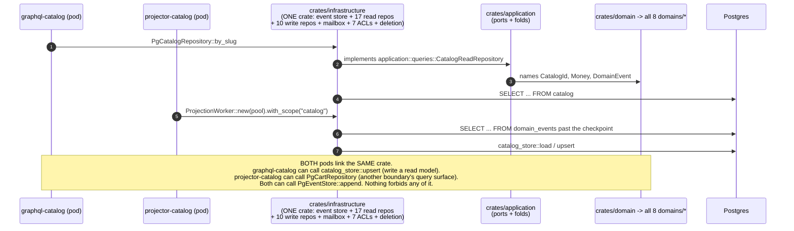
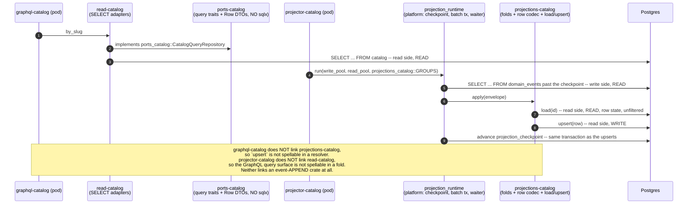
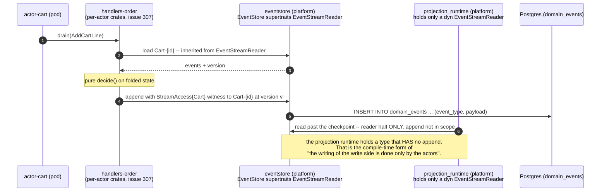

# PROP-20260811-173223 — Repository crates and the dissolution of `infrastructure`: read and write are separate crates, and "inherit" is right on the log and wrong on the read model

- **Status**: Proposed
- **Date**: 2026-08-11
- **Tracking issue**: [#497 "Repository crates and the dissolution of `infrastructure`: read and write are separate crates, and \"inherit\" is right on the log and wrong on the read model"](https://github.com/TheCaptainCompany/captain-food/issues/497)
- **Realized by**: _(filled at completion)_
- **Origin**: product-owner direction, 2026-08-11, verbatim:

  > We also have to create crates for repositories.
  > There is read repositories and writes repositories, the write repositories generally inherit from the read repositories
  > ——
  > The infrastructure has to be split in multiple crates to be able to regulate permissions of apps based on what they need nothing more.

  Third message of the same day and the third face of one idea. The first two are
  [PROP-20260811-150242](PROP-20260811-150242-domain-boundaries-the-four-and-the-two-partitions.md)
  (**which units exist** — register §31, BND-1…BND-5) and
  [PROP-20260811-093000](PROP-20260811-093000-storage-boundaries-and-least-privilege-database-users.md)
  (**what shares a recovery posture and a database role** — register §32, STO-1…STO-6). This one
  decides **what a unit may link**, which is the same least-privilege question moved from runtime to
  compile time. It restates the 2026-08-02 threat model of
  [PROP-20260802-130500](PROP-20260802-130500-isolation-by-construction.md): *"protect bad AI
  behavior that could use easy path instead of the right one."*
- **Refines**: [PROP-20260811-090000](PROP-20260811-090000-scope-isolation-runtime-decomposition.md)
  (register §29). **That proposal decides which BINS link which scopes; this one decides which CRATES
  exist for them to link.** It is filed separately rather than folded in because the option space is
  different in kind — a layer topology and a trait doctrine, not a bin-closure ledger — and because
  the two have different lifetimes: §29's ledger is done when it reaches zero rows, while the
  read/write repository doctrine is a standing rule every future read model is built against.
  **It closes ISO-1 and ISO-2** (§5 below).
- **Concerns**:
  - [ ] **BND-1-GATE**: the per-boundary half of this topology (15 of the ~27 crates) cannot start
    before **BND-1** ([#493](https://github.com/TheCaptainCompany/captain-food/issues/493)) records
    the boundary set. Building 3 crates × 8 scopes and merging to 5 is precisely the intermediate
    step [ADR-20260808-235113](../adr/ADR-20260808-235113-final-vision-first-no-intermediate-steps.md)
    forbids. **This direction makes BND-1 more urgent, not less.** The platform half (§6 slices 0–3)
    is boundary-agnostic and is not gated.
  - [ ] **EVENT-UNION**: `DomainEvent` is a single enum over all eight scopes, defined in the `domain`
    facade (`crates/domain/src/generated/events.rs:20`). Every crate that names it links all eight
    domain crates. Until **REP-4** is decided, a "per-boundary repository crate" that traffics in
    `DomainEvent` re-imports the facade and the split delivers a smaller module tree and no boundary.
  - [ ] **MONOLITH-WINDOW**: the monolith `server` bin is still the deployed runtime until the
    [#358](https://github.com/TheCaptainCompany/captain-food/issues/358) cutover. Dissolving
    `infrastructure` must not break it, so REP-3's dissolution ships behind the cutover
    (gate-then-stabilize) rather than in front of it.
- **Screen mockups**: **deliberately none, and recorded rather than silently omitted.** There is no
  user-facing surface and no use case a persona performs — this decides which crate a `SELECT` may be
  written in. The mockups rule (docs/proposals/README.md) exists so a design's shape is fixed before
  its visuals; the shape here is the crate table in §4 D2 and the two sequence diagrams in §3, and
  they fix it exhaustively. The nearest thing to an operator "screen" is the dependency table.
- **History**: `git log -p` on this file.

---

## TL;DR

**The direction is right and it closes two open rows** — ISO-1 and ISO-2 (§29) are both answered
**(a)** by *"based on what they need nothing more"*, because both (b) options end with a bin linking
a crate that carries every other boundary's code (§5).

**One phrase needs refining, and the code already argues the refinement.** *"The write repositories
generally inherit from the read repositories"* has no Rust equivalent as OO inheritance; the nearest
constructs are a supertrait bound and composition, and they are not interchangeable here. The
measured answer is a split:

> **There are TWO read contracts on every read model, not one.** The **query** contract
> (`CartReadRepository`, five methods, all narrowed — `by_id` returns `None` for a CHECKED_OUT cart)
> and the **row-state** contract (`cart_store::load`, one method, deliberately unfiltered). The
> projector's write repository **inherits the row-state contract** — that is the product owner's
> "generally inherit", and it is correct. It must **not** inherit the query contract: doing so is
> over-privilege *and* a correctness bug, and `crates/infrastructure/src/persistence/cart.rs:67-70`
> already says so in a comment written for a different reason.
>
> **On the write side, "inherit" is right without qualification**: an actor cannot decide without
> loading its own stream, so `EventStore: EventStreamReader` (supertrait) is the honest shape — and
> the reader half is exactly what a projector and the deletion engine need without `append`.

**Three facts, verified, that decide the topology:**

| # | Fact | Evidence |
|---|---|---|
| 1 | `DomainEvent` is ONE enum over all 8 scopes, defined in the facade crate | `crates/domain/src/generated/events.rs:20`; `crates/domain/Cargo.toml` depends on all 8 `domains/*` |
| 2 | The read ports live in `application`, which depends on the `domain` facade — so a repository crate implementing them **re-imports all 8 scopes** | `crates/application/src/queries.rs:7-19` (`use domain::generated::scalars::{…}`), `crates/application/Cargo.toml:8` |
| 3 | There is **no log-read port at all**: three components read `domain_events` three different ways | `EventStore::load` (`ports.rs:65`) · projector raw SQL (`projection/worker.rs:753`) · deletion engine raw SQL (`deletion.rs:255,320`) |

Fact 2 is the one that would waste the work: **moving the adapters into crates while the ports stay
in `application` buys nothing**, because `application → domain → all 8`. The ports move too, or the
split is cosmetic. Fact 1 is the one blocker with a real option space (REP-4) — and the good news is
that the *storage* format is already untyped (`event_type` TEXT + `payload` jsonb,
`event_store.rs:203`), so it is a port signature change and not a migration.

**What is left in `infrastructure` afterwards: nothing.** The honest end state is that the crate is
**dissolved**, not slimmed — every module has a home above, and an `infrastructure` that keeps a fat
facade defeats the exercise even after the repositories leave (§4 D3).

---

## 1. What is true today, measured

| # | Fact | Evidence |
|---|---|---|
| 1 | `crates/infrastructure` is **one crate, ~13,200 lines**, holding the event store, the read repositories, the projection write repositories, the mailbox SQL, 7 partner ACLs, the deletion engine and the projection worker | `persistence` 4,590 · `integrations` 2,847 · `mailbox` 2,188 · `generated` 1,311 · `projection` 1,140 · `process_manager` 588 · `deletion.rs` 544 |
| 2 | **20 read-repository ports** are declared in ONE file in `application`, and one more sits in `ports.rs` | `crates/application/src/queries.rs` (`SlugReservationRepository` :64 … `ScopeMembershipRepository` :847) + `RestaurantRepository` (`ports.rs:98`) — **two ports over the same read model in two files**, a small Evans ubiquitous-language smell worth fixing while the file is being split |
| 3 | **17 Pg adapters** implement them, all in `crates/infrastructure/src/persistence/` | `cart.rs`, `catalog.rs`, `customer.rs`, `delivery.rs`, `order.rs`, `reclamation.rs`, `referential.rs` (3 policies), `refund_queue.rs`, … |
| 4 | **10 projection write repositories** exist as free functions, not traits, and have **no port** | `{cart,catalog,customer,customer_credit_balance,order_conversation,order_tracking,prospection,restaurant,scope_membership,slug_alias}_store.rs`, each `pub async fn load` + `pub async fn upsert` |
| 5 | Read repo and write repo **already share a row codec** — the `COLUMNS` const and `decode` — by module composition | `cart.rs:10` `use super::cart_store;` then `cart_store::COLUMNS` / `cart_store::decode` at `:44,52,74,82,90,98,118,127,141,150` |
| 6 | The two read contracts are **already semantically different, deliberately, with the reason written down** | `cart.rs:67-70`: *"Deliberately NOT delegating to `cart_store::load` any more: that function is also the PROJECTOR's read-modify-write … so an OPEN predicate there would stop a CHECKED_OUT cart from ever folding another event onto itself. The narrowing belongs to the READ port only."* |
| 7 | The projector's fold is **pure app code**; only the SQL is in infrastructure | `crates/application/src/projectors/*.rs` (10 modules) + `generated/projectors.rs` (95 `DomainEvent::` arms); `projection/worker.rs:195-225` is `store::load` → `project_*` → `store::upsert` |
| 8 | `DomainEvent` is a **single enum over every scope**, defined in the facade | `crates/domain/src/generated/events.rs:20`, re-exporting `domain_{catalog,common,comms,customer,delivery,network,ordering,payments}::events::*` at `:6-13` |
| 9 | The event **storage** format is already untyped — the typed union is a Rust-side convenience only | `event_store.rs:203` `serde_json::to_value(event)` → `(event_type, payload)` columns; `:187-193` rebuilds by re-tagging |
| 10 | `EventStore` has **no capability witness** on `append` (ISO-3, unchanged) | `crates/application/src/ports.rs:54-60` |
| 11 | The **composition root builds every repository in one `AppState`** — 17 `Arc::new(Pg…Repository::new(pool.clone()))` in one function | `crates/server/src/lib.rs:341-377,405,452-457` |
| 12 | The read ports name their scalars **through the facade**, but the facade is a pure re-export with the same type identity | `queries.rs:7-19`, `generated/rows.rs:5` `use domain::generated::scalars::*;` — `domain/src/generated/events.rs:1-4` states the same-identity guarantee. **So rewriting `domain::generated::scalars::CartId` → `domain_ordering::scalars::CartId` is an import rewrite, not a type change** |

Fact 12 is the good news of the whole exercise: the per-boundary rewrite of the read side is
mechanical and mostly generated. Fact 8 is the bad news, and it is the only genuinely hard part.

---

## 2. Screen mockups

None — recorded, not omitted. See the header. The operator-visible artifact is the crate table in
§4 D2 and the generated `crate-graph.generated.json` it produces.

---

## 3. The load-bearing flows, before and after

Drawn hexagonally: ports point inward, adapters outward, and the arrows a *pod* can make are what
the crate graph decides.

### 3.1 Today — one crate, every capability

<a href="https://mermaid.live/view#pako:eNqFVO9v2jAQ_VdO-TLYaNg-dbImJEopa8WPrFTaFyRkkgM8HNs9O-1Q1f99l5hR1FZqpESJ8-7d3btnPyW5LTARkHi8r9DkeKnkhmS5MMCXrII1VblCit9OUlC5ctIEGP0ag_TAYLe912e5DFLbDbScLdpv0dlNDXZk_2AeLH0Ev55e1ficZEDfVWZN0geq8lAR_lhRt9eaTYfxtwB8QA7xTIvwBb6dA6Es-OGsb7C89hUeSQWMiwwqpdIr-5ffzqE_GNdLBWoMypp3quln2Uk10jmtuH7GxlKcpVAzrK0u_Dvhl7PJSXhhObmBsx5IreE7xG_f_fyOaKM6LrM-bAj9wkQEC3_W67FCArLNIOp4W_elWIG9EKv90utqE8EMYzA3IECVTmPJUnk4aUEInjsp9EIcuWTxwhdpmIBpuBEBRpbo4YC9LjowsQb3Hbhs-hjWszhNnY0EzIfj4eAO0jSFq1sW4zD8CMtujt1Ed3BRvy3tkIQw-MjqWt1OH1XYLn1uHbYWyf_4pP1RpijusnEI249NBGGLkG8x3zmr3pZ6oF42bhJCW3ZSFyrnkQ7YqWUf2QekehCdRpKL2d1PYCN70Mrsmgzz_uTgz7QxyettkkvDNxvgVcKYCVrRrjJaueQ9yho0RG-30JGqdgOFl9FBSxrLxRCsbGUKSftPHupp78FXtJY5HjgvGHVK0wxxHgtiq6Ap0rrtrTIbNjmtFHcqzR7sGlRIkw4kJRILXfBB8pRwxrI5Ugpcy0qH5Pn5H7epfFI" target="_blank" rel="noopener noreferrer">Open this diagram with pan and zoom on mermaid.live — on github.com use Ctrl/Cmd+click or middle-click to get a NEW tab (GitHub strips target=_blank)</a>

### 3.2 Target — the capability IS the dependency edge

<a href="https://mermaid.live/view#pako:eNqFVFFv2jAQ_iunPFEt0PdoqlQBQ6s6SFOm9aESPeIDvDq2azu0qOp_3zmhHdBM48k4d9933313fk1KIyjJIPH0VJMuaSRx7bC618A_rIPRdbUk1_636IIspUUdYHJzDeiBg-3mSfVLDKjMGnrWiLPP0cUwBjtC8R75denOL3q34-vxcA4o0AZyviMzbzKtccEfp3K9bgfBoQwevkBhnmE0n_kUpjPwT-qlC-uqwXLmN5XBuP8VnRcH4dLohat1kBW1_FZhWBlXZVBuqHy0RuqQwhJDuYHwksIzF0auC_buGPZE18ooEQU5FhTdKfmsDIrz2npyoQtwEgFz48Pakb_XbQQb1L-4KIYZLHcLr-p1e10M-TbnW1lZRRXpsO_uYl9Flg3bw01scEHWeMnN2h2mTzLYOzcYDOBbMfsB773s9xubwUtBKRTjy1GbmF_FxCIDbmLv2XFvFtYYlTbR--NBT_5WMylmP_Pbvey8-Ae9MBVKvaBtKwh9gLChA2tiYQ3t58oazLsM0Fq165HekjKW3hnv9ozRg54UZx0K08YsHzDwRa1XUrHzJE4AWv96HHqK8av4Ph-fCESxRd7Hw_E7FuOxojj-2mPzOc5AlNzS-BZualiw2ZKL45BGkacLKwx5Xpk5KKkfu6YybcbSG3hokR9AetAmgLekFC4VgWRy1uONYqZBE_95yY6JDp-CD4ZY_iTWx29Lu96-divkLnRTxlVp6aYkOdk12B5QQzMI_cs8H09HUDp2BjAAKjVIUkgqcjwugh--14TzquYJFLTCWoXk7e0Px7C22Q" target="_blank" rel="noopener noreferrer">Open this diagram with pan and zoom on mermaid.live — on github.com use Ctrl/Cmd+click or middle-click to get a NEW tab (GitHub strips target=_blank)</a>

### 3.3 The write side — where "inherit" is right

<a href="https://mermaid.live/view#pako:eNqNU02L2zAQ_SuDTw6N00IPhVACIQ2bwpINcS6FhaBI41itrVElOUsI-e8dyc623d1CfZE1H2_evBldMkkKsylkHn92aCR-0eLoRPtogD_RBTJde0DX361wQUtthQkwX4DwIGQgV0i2Q25JjV7HrVJcLYxq0PmCnEL3-eDez3KLrkj5IJ0I6Megve8QPn749AbOsow4eEITPOcg12tEqMi1owS3jJ4yeXzH0MEJHTwMZoei3aJQb3Wy2UZk6-g7yqDJ7F1ngm5fVaipUR7INGcQoM7mv7DvIvaGfDg69JAraoU2-74N7rLPmC-K2Wy1mIJi0iafK7VgjHttcBBiFQOW5RQaEgqis7hodYWiAG1qdDqggspR-y9Oy7IYSvSl4R2ceBzcbe9fU0AgNkGMsR2rqFBqhfmIO4aKW-cKPvCcXjAS1qJR8KRDDX3duZTo_SWyvEa74RsE-oO2CLfqcHrmN5tt7qbwdV0utzs-dg_wl1gwmUwgT__7cLY4Zp3PUY5Bos12IMQUFPt8gFAjyBrlD0uaZ8FiuSQJb2NTwcP6_tv4Rt9QYCXBS7L4UpHNdhxxI9rvJYHbkvRbISBy4hhubTUvGW9AnqTV2UW79j0jaq1usEjZcbuAqhT0mEX3Ew9TmyMb4XbljeZJxHxFBvsNPJyTO70f_5hNsjFkLToWTPFzvkSoNj1shZXompBdr78AOD9WcQ" target="_blank" rel="noopener noreferrer">Open this diagram with pan and zoom on mermaid.live — on github.com use Ctrl/Cmd+click or middle-click to get a NEW tab (GitHub strips target=_blank)</a>

---

## 4. Decisions

### D1 — Does "the write repository inherits the read repository" hold in Rust? *(recommendation: **split the answer** — supertrait on the log, composition on the read model)*

Final vision first: the recommended option is presented first.

The phrase has three candidate translations and they are not interchangeable.

| Option | Pros | Cons |
|---|---|---|
| **(a) Two read contracts. The write repository supertraits the ROW-STATE port; the query port stands alone and shares only a row codec** ✅ **recommended** | **The code already argues it, for a reason nobody invented for this proposal**: `cart.rs:67-70` records that the query port's `by_id` filters `status = OPEN` while the projector's `load` must not, *"or a CHECKED_OUT cart would never fold another event onto itself"*. So the two "reads" are different contracts, and inheriting the wrong one is a **correctness bug**, not merely over-privilege. Expressed as `trait CartProjectionRepository: CartRowStateRepository`, "write inherits read" is **literally true** and the inherited method is exactly the one the product owner described (*"projectors … to know the current state of the rows to update them"*). The query port, which is 5 methods wide and GraphQL-shaped, stays out of the projector's reach — *"nothing more"*, enforced by the type | Two traits per read model where the mental model says one. Needs a naming convention (`…QueryRepository` vs `…RowStateRepository`) and a validator/codegen rule so a future read model does not collapse them back |
| (b) One supertrait: `trait CartWriteRepository: CartReadRepository` | Matches the phrase literally; one trait per side; conveniently, anything holding the write trait can read | **Hands every projector the whole GraphQL query surface** — `by_customer`, `open_by_session`, `open_by_customer_at`, `open_by_session_at` — which is the opposite of *"nothing more"*. And it is **wrong**, not just wide: `CartReadRepository::by_id` is OPEN-only by port contract (`queries.rs:277-279`), so a projector that used the inherited method would silently stop folding checked-out carts. A supertrait would make that mistake *available*, and the existing comment shows it is a mistake somebody already nearly made |
| (c) Pure composition — the write repo holds a `&dyn ReadRepository` | No new trait relation; smallest conceptual load | Buys nothing the module-level sharing does not already buy (fact 5: `COLUMNS` + `decode` are already shared by composition), and it makes the *narrowed* query port reachable from the write path at runtime, which is the same defect as (b) with an extra indirection |
| (d) Keep free functions with no port at all (today) | Zero work; the projector's writes are already unspellable outside `infrastructure` because `decode` is `pub(crate)` | The crate boundary is the only thing enforcing it, and the crate is the one being dissolved. Once `projections-{B}` is its own crate, `upsert` becomes `pub` across a crate boundary and needs a contract; a trait is also what makes the fold testable against a double without a database |

**Recommendation: (a).** State the rule in one sentence so it survives this proposal:

> **A read model has a QUERY port (narrowed, GraphQL-shaped, read-only) and a ROW-STATE port
> (unnarrowed, `load(id) -> Option<Row>`). The projection write repository supertraits the ROW-STATE
> port and nothing else. No crate holds both the query port's adapter and the write repository.**

**Where inheritance is right without qualification: the log.** `EventStore` today is one trait with
`load` + `append` (`ports.rs:50-66`). An actor genuinely cannot write without reading its own stream,
so the two belong together for *that* consumer — this is the product owner's "generally inherit",
already true and already correct. What is missing is the **reader half as a separate contract**:

| Option | Pros | Cons |
|---|---|---|
| **(a) `trait EventStreamReader { load }` + `trait EventStore: EventStreamReader { append }`** ✅ **recommended** | The supertrait *is* the phrase, in the one place it is exactly right. It creates the log-read port that does not exist today (fact 3), so *"the reading of the write side is done by actors and projectors"* becomes a type rather than a convention. A projector, the deletion engine, `bam` and any future replay tool hold `&dyn EventStreamReader` — a type that **has no `append`**. It is also the natural landing site for the ISO-3 witness (D6) | Two traits where there was one; every existing impl gains a second `impl` block (mechanical — there is exactly one real impl, `PgEventStore`, plus in-memory doubles such as `adapters/hubrise/src/enrich.rs:885`) |
| (b) Leave `EventStore` as one trait | Zero diff | Any component that only needs to read the log is handed `append`. Today three of them dodge the problem by writing raw SQL instead (fact 3), which is worse: the access rule is expressed nowhere and enforced by nothing |

### D2 — What is the crate topology? *(recommendation: the 2×2 matrix below, 3 crates per boundary + 7 platform crates)*

The brief asks whether the split is read/write per scope, read/write globally, or both axes. **It is
both axes, and the matrix is not full — two of the four cells are per-boundary and two are platform.**

|  | **Write side** (`domain_events`, mailbox) | **Read side** (`View_*` / projection tables) |
|---|---|---|
| **Platform** (scope-agnostic machinery) | `store_core` · `eventstore` · `mailbox_pg` | `projection_runtime` |
| **Per boundary** (typed, one boundary's vocabulary) | `handlers-{B}` ([#307](https://github.com/TheCaptainCompany/captain-food/issues/307), already decided) | `ports-{B}` · `read-{B}` · `projections-{B}` |

**Why there is no per-boundary "write repository over the log" crate.** `Repository<'a>`
(`crates/application/src/repository.rs`, 71 lines) is generic glue over `EventStore` parameterised by
`A: Aggregate` — it carries no boundary vocabulary of its own. It belongs *with the handlers*, in the
per-actor crates D2(a) of PROP-20260802-130500 already decided. Creating `write-{B}` as well would be
a crate whose entire content is `Repository::new(store)`.

**Why there is no platform "read repository".** A query is always about one boundary's rows. The only
candidates are the three referential policy repos (`referential.rs`) and `ScopeMembershipRepository`
— which are genuinely cross-boundary, and which STO-2 already recommends **replicating per read
database**. They get one small `read-platform` crate, named as an exception so it is not mistaken for
a shared read layer.

**The full list.** Per boundary B (5 boundaries under BND-1(a), 8 if the scopes stand):

| Crate | Contents | Links | Linked by |
|---|---|---|---|
| `ports-{B}` | the boundary's **query** ports + **row-state** ports + the generated `…Row` DTOs | `domain-{B}`, `domain-common`, `async-trait` — **no `sqlx`** | `read-{B}`, `projections-{B}`, `handlers-{B}`, `graphql-{B}` |
| `read-{B}` | Pg adapters implementing the **query** ports (SELECT only) | `ports-{B}`, `store_core`, `sqlx` | **the API-tier bins that serve B's operations, and nothing else** — one under the recommended subgraph-per-boundary set ([PROP-20260811-150242](PROP-20260811-150242-domain-boundaries-the-four-and-the-two-partitions.md) §5.1), several if the API tier ever refines *inside* a boundary. The invariant is a closure rule, not a name: `read-*` in a bin's closure ⊆ `{read-B}` for its ONE declared boundary, and no non-API bin links a `read-*` crate at all |
| `projections-{B}` | the pure folds (moved from `application/src/projectors/`) + the row codec + `load`/`upsert` implementing the **row-state** + **projection-write** ports | `ports-{B}`, `store_core`, `sqlx`, `domain-{B}` | `projector-{B}` **only** |
| `handlers-{B}` | the aggregates' command handlers + PMs (#307) | `ports-{B}`, `eventstore`, `domain-{B}` | `actor-*`, `pm-*` of B |

**And the subgraph's closure is NOT `{ports-B, read-B}` — say so before the ratchet is built to the
wrong set.** A subgraph is acceptance-first: every mutation resolver enqueues through B's generated
typed actor-client door and journals the acceptance
(`crates/server/src/graphql/generated/mutation.rs:42,57,69`), and `operationStatus` reads
`command_journal`. Those write-side links are required, not leakage. The enforceable invariant is
**a subgraph links no crate that can WRITE a read model and no crate that can APPEND to the log** —
forbidden families `projections-*` and `eventstore`; required `ports-{B}`, `read-{B}`, B's actor
clients and the mailbox client half (PROP-20260811-150242 §5.1.7).

Platform:

| Crate | Contents | Links |
|---|---|---|
| `store_core` | pool construction, `db_err`, `enum_sql::EnumText`, retry/backoff, the generic upsert plumbing (ISO-2's carve-out) | `sqlx`, `domain-common` |
| `eventstore` | `PgEventStore` (append/load, `pg_notify`, version-conflict), the `EventBus`, `event_wake` | `store_core`, the event-union crate (REP-4) |
| `mailbox_pg` | `PgMailbox`, `mailbox_lanes`, `mailbox_wake`, the completion transaction's SQL, PM state tables, `command_journal`, `slug_reservations` | `store_core`, `actor_runtime` |
| `projection_runtime` | checkpoint, batch transaction, `SAVEPOINT` isolation, the LISTEN/`EventWaiter` plumbing (**ISO-1(a)**), status/health, the generic upsert plumbing | `store_core`, `&dyn EventStreamReader` |
| `read-platform` | the 3 referential policy repos + `ScopeMembershipRepository` + `MailboxLaneRepository` | `store_core`, `domain-common` |
| `erasure` | the deletion engine (`deletion.rs`) + the generated deletion policy | `store_core`, `eventstore` |
| `acl-{partner}` × 7 | one anticorruption layer per partner: `stripe`, `hubrise`, `sirene`, `google`, `ovh-sms`, `supabase`, `delivery` | `store_core` + that partner's SDK/HTTP only |

**Count**: 4 × 5 + 7 + 6 = **33 crates** at 5 boundaries (`handlers-{B}` is #307's, already counted
there). Net new to *this* proposal: 3 × 5 + 7 + 6 = **28**, replacing `crates/infrastructure`
entirely and moving ~1,500 lines out of `application`.

| Option | Pros | Cons |
|---|---|---|
| **(a) 3 crates per boundary (`ports` / `read` / `projections`) + 13 platform crates** ✅ **recommended** | It is the **only granularity where the access model is a link edge**: `graphql-{B}` linking `read-{B}` and not `projections-{B}` is *"the writing of the read side is done only by the projectors"* made unspellable; `projector-{B}` linking `projections-{B}` and not `read-{B}` is *"nothing more"* for the query surface. Splitting `ports` from adapters keeps `sqlx` out of every crate that pure code links, which the existing `capability_dependencies_are_allowlisted` gate already cares about | ~33 crates on a workspace already near 90. Build-graph width is a real cost, though each crate is small and independently rebuilt (measured precedent: `cargo test -p application` = 324 tests in 0.04 s linking 9 crates, recorded in ADR-20260810-194548) |
| (b) 2 crates per boundary — merge `ports-{B}` into `read-{B}` | Fewer crates; the traits sit beside their only real impl | `projections-{B}` and `handlers-{B}` would have to link `read-{B}` to get the Row types — and thereby gain the query adapters and `sqlx`. That is exactly the privilege the split exists to remove; the whole matrix collapses to (c) |
| (c) 1 crate per boundary (`store-{B}`) | Simplest; one home per boundary | A GraphQL bin linking it gains `upsert`. The compile-time boundary would enforce the *boundary* axis and abandon the *side* axis — half of the product owner's sentence |
| (d) Split by side only, not by boundary (`read-all` / `write-all`) | 2 crates; trivially cheap | Every subgraph links every boundary's queries. The `graphql_{scope}` CONNECT wall STO-4/§6.1 buys at runtime would have no compile-time counterpart, and the two axes would disagree (D5) |

### D3 — What is left in `infrastructure`? *(recommendation: **nothing** — it is dissolved, behind the #358 cutover)*

Every module, placed. Nothing is left unassigned, because an unassigned module is where the facade
grows back.

| Module (lines) | Home | Note |
|---|---|---|
| `persistence/event_store.rs`, `event_bus.rs`, `event_wake.rs` | `eventstore` | |
| `persistence/mailbox_store.rs`, `mailbox_lanes.rs`, `mailbox_wake.rs`, `command_journal.rs`, `slug_reservation.rs` | `mailbox_pg` | STO-1's transactional unit is one crate as well as one database — the completion transaction (`actor_runtime/src/completion.rs:71-100`) must stay writable from one place |
| `persistence/{cart,catalog,customer,delivery,order,reclamation,refund_queue,order_conversation,prospection,restaurant,customer_credit_balance,delivery_satisfaction,delivery_partner_availability}.rs` | `read-{B}` × 5 | the query adapters |
| `persistence/*_store.rs` (10 projection stores) | `projections-{B}` × 5 | the row codec + `load`/`upsert` |
| `persistence/referential.rs`, `scope_membership_store.rs` | `read-platform` + `projections-platform` | `ScopeMembership` splits: its projector arm is a write, its lookup is a read |
| `persistence/enum_sql.rs`, `db_err`, pool | `store_core` | |
| `persistence/auth_sessions.rs`, `runtime_posture.rs` | `acl-supabase` / `store_core` | |
| `projection/` (1,140) | `projection_runtime` | ISO-1(a) |
| `mailbox/` (2,188) | `mailbox_pg` + `handlers-{B}` | `handler.rs` and `activation.rs` dispatch commands: the dispatch table is per boundary |
| `integrations/` (2,847) | `acl-{partner}` × 7 | this is where the credential least-privilege of §30/APP-3 lands: `adapter-stripe` links `acl-stripe` and nothing else |
| `deletion.rs` (544) | `erasure` | the **widest** privilege in the system and the one honest exception; PROP-20260811-150242 D5 already records that a boundary does not erase uniformly, so it cannot become per-boundary workers |
| `generated/` (1,311) | split per consumer — `command_router` → `handlers-{B}`, `deletion_policy` → `erasure`, `pm_state` → `mailbox_pg`, `service_clients`/`service_bindings` → `acl-*`, `scopes` → `store_core` | |
| `process_manager/` (588) | `mailbox_pg` | the PM runner is write-side machinery |

| Option | Pros | Cons |
|---|---|---|
| **(a) Dissolve `infrastructure` entirely; during the [#358](https://github.com/TheCaptainCompany/captain-food/issues/358) window it survives ONLY as a monolith-only composition crate re-exporting the new crates, guarded by a codegen test that no per-surface/per-actor bin links it, and is deleted at cutover** ✅ **recommended** | Final-vision-first: the end state is stated and built, and the transitional form is *gated* rather than open-ended — which is exactly what gate-then-stabilize licenses and what a shim is not. The guard makes the transitional crate's audience checkable, so it cannot quietly become permanent | Two homes for the composition root during the window; the guard is one more codegen test |
| (b) Keep `infrastructure` as the permanent facade over the new crates | Smallest disruption; the monolith and every bin keep one import path | **Defeats the exercise.** Any bin that links it links everything, so the closure ledger ([#490](https://github.com/TheCaptainCompany/captain-food/issues/490)) never reaches zero and the manifest header stays a wish. This is the same defect [#475](https://github.com/TheCaptainCompany/captain-food/issues/475) spent a PR deleting the *claim* of |
| (c) Delete `infrastructure` immediately | Cleanest graph today | Breaks the deployed monolith before the cutover has been rehearsed. The cutover is externally sequenced; this is the one place staging is forced |

### D4 — The `DomainEvent` union: the split's actual blocker *(recommendation: per-boundary unions + a generated facade union)*

**This is the row that decides whether any of the above delivers a boundary.** `DomainEvent`
(`crates/domain/src/generated/events.rs:20`) is one enum over all eight scopes, defined in the crate
that depends on all eight domain crates. It appears in `EventStore::append`/`load`
(`ports.rs:54-65`), in the projector `Envelope` (`application/src/projections.rs`), and in 95 match
arms of `generated/projectors.rs`. **A `projections-order` crate that names `DomainEvent` links
`domain-catalog`, `domain-delivery` and the rest — and slice 1 delivers a smaller module tree with
the identical closure.**

ISO-1 was framed around the `EventWaiter`; the sharper coupling is this one, and it was not named.

| Option | Pros | Cons |
|---|---|---|
| **(a) Generate a per-boundary union (`domain_order::events::OrderEvent`) in each `domains/{B}` crate, keep the all-boundaries `DomainEvent` in the facade for the monolith and `bam`, and make the ports generic (`EventStore<E>` / `Envelope<E>`) or per-boundary-typed** ✅ **recommended** | Final vision: each boundary's code names only its own events, so the union stops being a facade import. **Cheap where it matters**: the storage format is already `(event_type TEXT, payload jsonb)` (fact 9), so nothing about `domain_events` changes and there is no versioning story to record — this is a Rust type change, not an event-shape change (Young: stored events are immutable contracts; this touches no stored contract). The emitters already produce the per-scope modules, so the per-boundary union is one more generated item | The 5 cross-boundary PM bridges and the 3 cross-boundary projection groups genuinely need more than one boundary's union — they take an explicit, declared, reviewable union (`processmanager.yaml` already declares those bridges, so the set is derivable rather than invented) |
| (b) Untyped port: `append(stream, version, &[(event_type, payload)])` with typed codecs per boundary | Smallest port; matches the storage exactly; no unions at all | Deletes the compile-time guarantee that an appended payload matches its declared shape — the thing the generated types exist for. It would make `append("Order-x", 0, [("Nonsense", json!({}))])` compile. Rejected on compiler-first grounds |
| (c) Leave `DomainEvent` as is | Zero work | Every per-boundary crate links all 8 domain crates. **The repository split then buys module hygiene and nothing else**, and the ledger cannot reach zero |
| (d) One union per *side*: a write union and a read union | Fewer types than per-boundary | Both unions still span all boundaries; it solves nothing |

**Recommendation: (a).** And note what it does *not* need: no ADR on event versioning, no migration,
no upcaster — because the wire and storage shapes are untouched. That should be stated in the change
itself, because "we are changing the event enum" reads like a migration and is not one here.

### D5 — Crate graph vs database role: which axis is authoritative? *(recommendation: **both, derived from one declaration** — the disagreement is the real risk)*

The brief asks whether two mechanisms disagreeing about what a boundary is would be worse than either
alone. **Yes — and this proposal is the first place where they can be made to agree by construction.**

[PROP-20260811-150242](PROP-20260811-150242-domain-boundaries-the-four-and-the-two-partitions.md)
D12 already ruled that the link graph is load-bearing *for the directive* (the mistake an agent makes
is importing a type, not issuing a cross-schema `SELECT`) and that the DB role catches a class the
link graph cannot (a migration script, an ad-hoc `psql`, a future bin). Nothing there changes. What
this adds:

| Option | Pros | Cons |
|---|---|---|
| **(a) One declaration per app feeds BOTH: the crate manifest and the `GRANT`.** The app declares its boundary and its side(s); the emitter derives the allowed crate families (`read-{B}` ⇒ SELECT-only role; `projections-{B}` ⇒ INSERT/UPDATE on that boundary's read models; `handlers-{B}` ⇒ INSERT on `domain_events` for its streams) ✅ **recommended** | The two axes **cannot** disagree, because there is one source. It converts PROP-20260811-150242's AXIS-DISAGREEMENT concern from a review habit into an emitter invariant, and it is exactly what [#491](https://github.com/TheCaptainCompany/captain-food/issues/491)'s `specs/apps/{app}/` (APP-2(a), APP-3(a)) was proposed to hold — so this direction **raises the value of #491's A2 slice** rather than competing with it. A crate-family-to-privilege table is small and fully derivable | Couples two work programs to one declaration format; a wrong declaration is both a compile failure and a boot failure (which is the good failure mode, but it is two at once) |
| (b) Keep them independent, reconcile by review | No coupling; each program moves at its own pace | Two definitions of "boundary" in one repo is the exact defect [#493](https://github.com/TheCaptainCompany/captain-food/issues/493) exists to fix, reproduced one layer down. Six months on, every reviewer must ask which is authoritative |
| (c) Crate graph only; drop the per-app roles | One mechanism | Loses everything that never issues a Rust import — migrations, `psql`, a future bin. STO-5 already rules this out |

**Recommendation: (a).** And the honest ranking, restated so it is not lost: **the crate graph is the
load-bearing axis for the stated threat model**, because a `GRANT` is invisible to `cargo build` and
the easy-path mistake is an import. The role axis is the one that catches everything *outside* our
code, and it lands sooner.

### D6 — ISO-3: does the write-repository crate split subsume the capability witness? *(recommendation: **complements, and makes it cheap** — do not close ISO-3 with this)*

`crates/application/src/ports.rs:54-60` — `append(&self, stream_name, expected_version, events,
actor)` takes no capability witness, so any holder of `&dyn EventStore` may append any event to any
stream. Verified again on this pass; unchanged.

| | Crate split (this proposal) | Capability witness (ISO-3) |
|---|---|---|
| Granularity | **boundary** — which apps may hold an appending type at all | **aggregate** — which streams that type may append to |
| What it stops | `graphql-catalog` calling `append` (it links no crate that has it) | `actor-cart`, inside `handlers-order`, appending to `Order-…` |
| What it misses | everything inside a boundary: `handlers-order` holds 6 aggregates under BND-1(a), so cart code can append to payment streams | everything outside our code, and any crate that is *given* the witness |

**They are orthogonal, and the split makes the witness cheaper rather than redundant**: D1's
`EventStore: EventStreamReader` supertrait is a change to the same signature, so the witness rides
the same edit instead of touching `ports.rs` twice — which is exactly what ISO-3's option (b)
anticipated. **Recommendation: land the witness *with* the `EventStore` split (slice 1), not after
it, and do not read this proposal as closing ISO-3.** ISO-3 stays open in §29 until an issue tracks
it.

### D7 — What can start before BND-1 closes? *(recommendation: the whole platform axis; nothing per-boundary)*

| Option | Pros | Cons |
|---|---|---|
| **(a) Platform axis now (slices 0–3: `store_core`, `eventstore` + the reader split + the witness, `projection_runtime`, the ratchet extension); per-boundary axis after BND-1** ✅ **recommended** | Every crate in slices 0–3 is boundary-agnostic — its shape is identical at 4, 5 or 8 boundaries — so none of it is the forbidden intermediate. It is also the half that makes the next half verifiable (the ratchet, the reader port, ISO-1's runtime crate), which is the "gate before the fix it protects" ordering. And it takes the pressure off BND-1 being answered *this week* without pretending the pressure is gone | Delivers no boundary by itself; the ledger rows do not shrink until slice 4 |
| (b) Everything after BND-1 | One clean program | Idles the platform work behind a decision only the product owner can make, and BND-1 has been open since 2026-08-11 with a window that closes at the #358 cutover |
| (c) Everything now, at 8 scopes, renaming later | Fastest apparent progress | 24 per-boundary crates merged to 15 later. Forbidden intermediate, and a rename across 24 crate manifests is not free |

---

## 5. ISO-1 and ISO-2 are closed by this direction

Both rows in [DECISIONS.md §29](DECISIONS.md) asked a question whose option (b) ends with a bin
linking a crate carrying every other boundary's code. *"The infrastructure has to be split in
multiple crates to be able to regulate permissions of apps based on what they need nothing more"* is
an answer to both, and the same answer.

| Row | Question | Closed as | Why this message closes it |
|---|---|---|---|
| **ISO-1** | Does `projection_runtime` own the LISTEN/`EventWaiter` plumbing (a), or stay in `infrastructure` and get passed in (b)? | **(a)** — the team's recommendation | Option (b) is written in the register as *"the bin keeps linking `infrastructure`"*. A projector pod linking the crate that also holds the event-append path, 7 partner ACLs and the deletion engine is the definition of *more than it needs*. Under D3 there is no `infrastructure` to stay in |
| **ISO-2** | Do `View_*` write repositories move into `projections-{scope}` (a), or stay shared (b)? | **(a)** — the team's recommendation, with the generic upsert plumbing staying in `projection_runtime`/`store_core` | Option (b) is a single crate every projector links, so every projector gains every boundary's write access — the exact opposite of *"nothing more"*, and it re-imports the facade because the shared crate must name every boundary's Row types |

**One caveat recorded rather than hidden**: closing ISO-1 and ISO-2 does **not** make slice 1
deliverable on its own, because of D4. The `EventWaiter` was never the hardest coupling; the event
union is. That is REP-4, and it is new.

---

## 6. Sequencing and cost

Final-vision-first: no shims. Each slice below is a piece of the end state, not a step toward it.

| Slice | What lands | Gated on | Proves it delivered a boundary, not a smaller binary |
|---|---|---|---|
| **0** | Extend [#490](https://github.com/TheCaptainCompany/captain-food/issues/490)'s ratchet with a **capability-family dimension**: a bin's transitive closure over the `read-*` / `projections-*` / `eventstore` / `mailbox_pg` families must equal its declared set, same `PENDING_DECOMPOSITION` ledger, same shrinking rule | — | The instrument exists before the work it measures. Rows are **measured**, never declared |
| **1** | `store_core` + `eventstore`; `EventStore` split into `EventStreamReader` + `EventStore: EventStreamReader` (D1); the **ISO-3 capability witness** on `append` (D6) | — | A crate holding `&dyn EventStreamReader` cannot spell `append`. Asserted by a compile-fail test |
| **2** | `projection_runtime` (ISO-1(a)) — checkpoint, batch transaction, `SAVEPOINT`, waiter, status. Generic over the fold, holding only the reader port | — | `cargo tree -p projection_runtime` contains no `domain-{B}` crate and no `application` |
| **3** | `acl-{partner}` × 7 + `mailbox_pg` + `erasure` | — | `adapter-stripe`'s closure contains `acl-stripe` and no other ACL — and its **secret grant** narrows to Stripe's, which is §30's measured 13-secret defect fixed by construction |
| **4** | **BND-1 answered.** `ports-{B}` + the per-boundary event unions (D4) | **BND-1** | Zero `domain::generated::*` paths remain in the port layer; each `ports-{B}` links exactly `domain-{B}` + `domain-common` |
| **5** | `projections-{B}` × N: folds move out of `application/src/projectors/`, stores out of `persistence/*_store.rs` | slice 4 | `projector-{B}`'s closure = `{projection_runtime, projections-{B}, ports-{B}, domain-{B}, domain-common, store_core}`. Ledger rows deleted |
| **6** | `read-{B}` × N + `read-platform`; `infrastructure` becomes monolith-only with its guard (D3a); deleted at the #358 cutover | slice 4 | `graphql-{B}`'s closure contains no `projections-*` crate. Ledger reaches zero for the projector and subgraph families |

**Cost.** ~28 new crates, roughly 13,200 lines relocated with very little rewritten: the row codecs
move verbatim, the folds move verbatim, and fact 12 makes the import rewrites mechanical (and mostly
generated). The irreducible new code is D1's port traits (~20 read models × 2 small traits, generated
from `projection_tables.yaml`), D4's union generation, and slice 0's ratchet dimension. The real cost
is **review surface**, not typing: 7 slices, each of which must keep the monolith green while the
cutover is in flight.

**What proves each slice delivered a boundary rather than a smaller binary**: the ratchet's row count
for that family goes to zero *and* the corresponding compile-fail test exists. A slice that shrinks
an image without deleting a ledger row has not delivered anything this proposal is about.

---

## 7. Drawbacks

- **~33 crates for the repository layer alone**, on a workspace already near 90. Build-graph width is
  a real cost; the mitigation is that each is small and independently rebuilt, and that per-crate test
  runs get faster, not slower.
- **Two traits per read model** (D1) is a permanent conceptual overhead on every future read model. It
  needs a generated shape and a validator rule or it will decay back to one.
- **The `EventStore` split touches the single most correctness-critical signature in the system**, and
  it does so in the same slice as the capability witness. That is deliberate (one edit, not two) and
  it is also the slice most deserving of a multi-lens review.
- **The per-boundary half is hostage to BND-1**, which is hostage to the #358 cutover window. If the
  cutover lands first, slices 4–6 do not become impossible, but their storage counterpart (STO-2's
  placement map) stops being free.
- **`infrastructure` surviving as a monolith-only crate during the window is a transitional form**,
  and transitional forms outlive their windows unless something forces the issue. The guard test is
  that something; if it is weakened, (b) has won by default.
- **D4 will read like an event-versioning change and is not one.** Someone will stop the work to ask
  for an upcasting story. The answer is in the storage format (fact 9) and should be written into the
  commit, not re-derived.

---

## 8. Unresolved questions

Copied to [#497](https://github.com/TheCaptainCompany/captain-food/issues/497)'s checklist on approval.

1. **Do the pure folds stay in `projections-{B}` or get their own `folds-{B}` crate?** Keeping them
   together means the projector bin's whole world is one crate (simple); splitting them keeps the
   pure fold linkable by behaviour tests without `sqlx`. The generated behaviour tests currently live
   in `application` and would move either way.
2. **Where do the 3 cross-boundary projection groups live** (`OrderTracking` folds `Order-`/`Payment-`/`DeliveryJob-`;
   `OrderConversation` folds three; `ScopeMembership` folds three)? Under BND-1(a) two of the three
   become intra-boundary, but `ScopeMembership` still crosses — so it needs either a declared
   multi-boundary union (D4's exception) or its own platform projections crate.
3. **Does `RestaurantRepository` (`ports.rs:98`) merge into `RestaurantQueryRepository`?** Two ports
   over one read model in two files is an Evans ubiquitous-language smell; the split is the moment to
   fix it, but `exists()` has a different consumer (write-side invariant checks) than the query port.
4. **Does the per-app declaration format ([#491](https://github.com/TheCaptainCompany/captain-food/issues/491) A2)
   carry the crate families, or does the crate manifest stay the source and the declaration render
   it?** D5(a) needs one source; which one is not decided here.
5. **Does `erasure` get a compile-time exception marker**, given it legitimately needs the widest
   privilege in the system and the ratchet will flag it forever otherwise?
