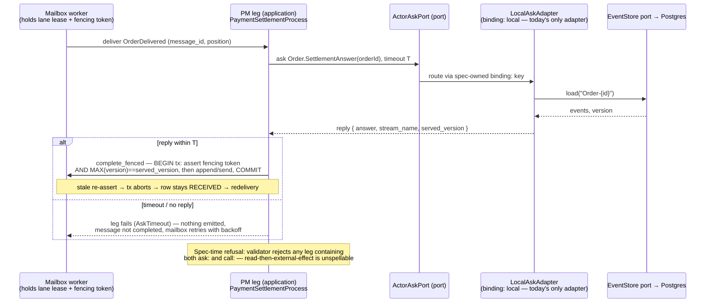

# PROP-20260815-142349 — Actor `answers:` block + the PM `ask:` step — typed request/reply for actor queries; the transport stays parked

- **Status**: Proposed
- **Date**: 2026-08-15
- **Tracking issue**: [#582 "Actor `answers:` block + PM `ask:` step — typed request/reply for actor queries, transport stays parked"](https://github.com/TheCaptainCompany/captain-food/issues/582)
- **Realized by**: — (filled at completion)
- **Founder constraint (verbatim)**: *"It must be simple and strongly typed avoid redondant info"*
- **Consulted** (ADR-20260812-143619): **vernon** (core grammar, sealed client, validator rules),
  **evans** (kind doctrine, naming grammar, anti-redundancy), **young** (versioning wall, hard NOs),
  **architect** (option tables, sequence diagram, register wiring) — this proposal's co-design,
  2026-08-15. The founder message that asked for this design went to the **full 14-lens roster the
  same day** per [ADR-20260812-143619](../adr/ADR-20260812-143619-the-founder-is-the-founder-and-every-founder-message-goes-to-the-whole-team.md);
  the four lenses above carried the design content and are composed below — the file speaks as the
  team, not as any one lens.
- History lives in `git log -p` on this file (ADR-20260801-020000).

## 1. Context — the recorded target, and what is untyped today

[ADR-20260815-030206](../adr/ADR-20260815-030206-a-process-manager-is-a-write-side-component-and-never-reads-the-read-side.md)
Correction §3 records the final-vision shape for "PMs ask the actor": an `answers:` block beside the
actor's inbox, a spec-owned `binding:`, always-serde replies, a typed `ask` on the sealed per-actor
client, and a round-trip test per reply type (items 1–5). Today **none of it exists**: the five PM
read structs that *are* the reply shapes carry no serde
(`crates/application/src/generated/process_managers.rs:22,31,736,866,1045` — ADR §5's enumeration),
and `HookOutcome::Skip(String)` carries prose (`crates/application/src/generated/process_managers.rs:12-15`)
— a defect AND a wire blocker. Today's ask-shaped replies more broadly have no serde and no spec
home (register row BUS-1, `crates/actor_client/src/status_bus.rs:20-38`).

The truest near-term ask is the settlement leg's "ask Payment → status" (ADR-20260815-030206,
"Recommended sequence"); `PaymentStatus` and `OrderId` already exist as kernel scalars
(`specs/common/scalars.yaml:307,35`), so the reference example below redeclares nothing. The actor
DSL's inbox key is spelled `receives:` (`specs/payments/actors.yaml:33`), so the block lands
**beside `receives:`**. The reference precedent for a spec-owned `binding:` with unconditional serde
is `specs/services.yaml:16-39`.

**Boundary stated up front**: this grammar is items 1–5 of the recorded final-vision target,
buildable now with `binding: local`; the *transport* — any PM asking over a wire — remains **PMW-3,
open and not adopted** ([DECISIONS.md §42](DECISIONS.md)). Nothing here authorizes it; the grammar
makes flipping it one spec key later, exactly as `services.yaml` does.

## 2. The grammar — minimal key set

```yaml
# specs/payments/actors.yaml — on the Payment aggregate, beside `receives:`
Payment:
  type: aggregate
  identity: { $ref: '#/Payment/state/paymentIntentId' }
  receives:
    - ...                                  # unchanged
  answers:                                 # the queries this actor answers — the declaration IS the permission
    binding: local                         # REQUIRED, spec-owned, closed set: [local] today ("grpc" joins the set only by a PMW-3 decision)
    deadline_ms: 500                       # OPTIONAL — defaults to the platform key (specs/common/configuration.yaml, new ACTOR_ASK_DEADLINE_MS)
    queries:
      GetSettlementState:
        description: "The settlement guard's facts: is this payment capturable/refundable right now."   # REQUIRED (catalog convention); prose stays prose
        reply:
          orderId:       { $ref: 'scalars.yaml#/OrderId' }
          status:        { $ref: 'scalars.yaml#/PaymentStatus' }
          captureFailed: { type: boolean }
        # input: OPTIONAL and absent here — see §3
```

The consuming side is one step: a PM leg spells
`- ask: { answer: { $ref: 'actors.yaml#/Payment/answers/queries/GetSettlementState' }, key: { from: ... }, as: payment }`
— the new step kind is decision D2 below, its full key set
`{ answer: $ref into the actor's answers:, key:, as:, timeout: }`.

## 3. What is deliberately absent — the founder's constraint applied

Never declared twice, anywhere:

- **No `input:` in the common case.** An ask is addressed to an actor **by identity** — the
  `Payment-{intentId}` stream key *is* the argument. Repeating `paymentIntentId` inside the request
  payload would be the redundant info the founder forbade. `input:` exists as an optional key only
  for an ask parameterized beyond identity; none of the register's near-term asks needs one.
- **The asker declares nothing.** No `actor:` key on the consuming side — the answer `$ref` already
  encodes the actor, so naming it twice is unspellable rather than forbidden. A PM's ask row is one
  `$ref` to the actor's answer path — no restating of the reply shape, timeout semantics, or target
  actor type on the asking side. The actor's declaration is the single source; the asker's ref is
  the whole edge. (Published-Language discipline: the moment both sides declare the shape, you have
  two publications and a Conformist fight over which is real.)
- **No per-query timeout/absent/version keys, and no version field in any payload.** Those are the
  *envelope*, generated once, never restated per query. The served version rides the ENVELOPE,
  never the payload — no `asOf`/`version`/`streamPosition` field in any reply — same rule, same
  reason as the event-payload/envelope split in CLAUDE.md ("Event payloads = business only"). One
  rule, both speech acts.
- **Reply shapes are composition, not declaration.** Every property is a `$ref` into
  entities.yaml/scalars.yaml (or a bare primitive that is not already a declared scalar); a reply
  introducing its own inline scalar violates "one name = one dedicated scalar" and forks the
  kernel. If a reply needs a whole entity, it is `{ $ref: 'entities.yaml#/X' }`; if it needs a
  shape no entity has, that is a missing entity, declared once in its owning scope.
- **No request/reply mirror files.** No `answers.yaml` catalog, no per-scope replies fragment — the
  actor block is the one home (ADR-20260731-120825's reasoning). A top-level catalog would be a
  second place the actor's contract lives.

Co-design note, for the record: a divergence was raised on whether the reply should be declared
where the *asker* can see it; it resolved itself — the answer is part of the answering actor's
language, the asker crossing the boundary via `$ref` **is** the translation, and the grammar above
already has the asker carrying only the `$ref`. No conflict remains.

## 4. Kind doctrine — the `answers:` header

To sit at the top of the `answers:` grammar, same register as the commands doctrine header
(`specs/common/commands.yaml:1-23`):

```
# An answer is a VALUE the actor serves on Ask — the third column of an inbox row, not a
# fourth speech act. It is declared INSIDE the actor (ADR-20260731-120825), never a catalog.
# 1. The ref path encodes the kind: `actors.yaml#/{Actor}/answers/{Name}` — no other path form
#    resolves to a reply, so kind confusion is a resolution error, not a review comment.
# 2. A reply ref may appear ONLY in a `receives:` row's `answers:` slot. In `emits:`, a
#    lifecycle transition, a projection/fold source, or a tombstone -> validator error.
# 3. A reply is constitutionally unpersistable: no journal, no `domain_events`, no View_* may
#    name one. It exists on the wire for one Ask and nowhere else.
# 4. A reply shape is composed of $refs into entities/scalars; it may declare NO new scalar.
```

Rule 1 is load-bearing: without it the Ask edge would be a **naming convention** — the worst kind
of edge on a context map, invisible to the loader like the `format!("{CATEGORY}-{}")` stream-name
edge at `crates/domain/src/payment.rs:26-28`. An actor-nested ref path makes the edge a
**Published Language**: named, resolvable, versionable, checkable. Rules 2–3 make "value, not
event" enforceable rather than aspirational — the refs walker already collects every `$ref` node,
so "never in a fold" is one predicate over paths.

The header also needs one sentence making clear `answers:` ≠ `api.yaml` queries: write-side
internal asks carry no persona, no authz, no story step (see D3's cons and validator rule 7).

## 5. Naming grammar — 3 lines

```
# Requests: IMPERATIVE verb phrase, same grammar as commands (they share the speech act of
#   asking). Good: QuoteCart. Bad: CartQuoted (that is an event's grammar — a fact).
# Replies: NOUN-PHRASE SNAPSHOT — the thing served, named as a value. Good: CartQuote,
#   DispatchCandidates. Bad: GetCartQuoteResponse (transport noise), CartQuoteProvided (a fact).
# FORBIDDEN in a reply name: past participles (Provided/Returned/Served), Get*/Fetch* prefixes,
#   *Response/*Result/*DTO suffixes. If the name reads as something that HAPPENED, it is
#   trying to be an event; if it reads as plumbing, it is trying to be a transport.
```

The repo already runs three grammars that never collide — imperative commands (`AddCartLine`),
past-participle events (`CartLineAdded`), noun-phrase errors (`CartNotFound`). A reply that borrows
the past participle steals the events' grammar and readers WILL treat it as a fact.
Noun-phrase-snapshot is the one unclaimed register.

## 6. The wall — a reply is a snapshot whose authority expires at send

A reply is a **snapshot whose authority expires at the moment it is sent**. It is a conversation,
not history. Everything below follows from that one sentence.

### Two versioning contracts, two kinds — never merged

- **A stored event** is an immutable fact. Changing its shape means **upcasting**: new code learns
  to read old history; history is never rewritten (*Versioning in an Event Sourced System*; the
  repo's only exception is GDPR stream *deletion*, ADR-20260731-160000 — deletion, not rewriting).
- **A reply** is never stored, so there is no history to teach. Changing its shape means
  **additive-only fields + a tolerant reader**: the sender may add, never remove or retype; the
  caller ignores what it does not know.
- These are **mirror-image disciplines** — one protects a durable past, the other protects a live
  conversation — and applying either to the other's artifact is a defect: upcasting ceremony on a
  wire reply is cargo cult; wire-reply informality on `domain_events` is data loss.
- **Therefore the DSL keeps the reply a separate kind from `events.yaml`** — same rigor of typing
  (every field a `$ref`, ADR-20260811-014129 Decision 2), different evolution rule attached to the
  kind itself, so the validator can enforce the right discipline per kind and the wrong one is
  unspellable. This also closes the gap ADR-20260815-030206 §5 records: today's ask replies are
  unshaped Rust structs with no serde and no spec home (BUS-1 row,
  `crates/actor_client/src/status_bus.rs:20-38`).

### The hard NOs

- **No reply in `domain_events`.** A reply is not a fact; appending one would make a conversation
  replayable history and a rebuild non-neutral.
- **No projection or fold ever consumes a reply.** Current state is a left fold of the event
  stream — a fold over replies is a fold over answers that expired at send.
- **No `validUntil` or config-derived value in anything stored.** Expiry and configuration belong
  to the conversation; frozen onto an event they become "facts" that were never facts (RSO-1's
  `CheckoutSnapshot` verdict stores the *window and inputs* — evidence — precisely because a stored
  boolean-with-expiry is unfalsifiable).
- **No request/response on commands.** A command's reply *is* an event plus PENDING, because
  acceptance-first is the write model's contract: the mailbox accepts, the worker appends, and the
  caller learns the outcome from the log — a synchronous return channel on a command would promise
  an answer the write side has deliberately not computed yet.

### Where the PM's context comes from today — and the honest line about `ask:`

Today the context is the **in-process fold of the aggregate's own stream**:
`crates/application/src/process_managers/place_order.rs:47` (Payment stream → frozen checkout) and
`crates/application/src/process_managers/delivery_dispatch.rs:126` (Restaurant stream → pickup
address) — spelled in the grammar as `source: EVENT_STREAM` on the PM `read:` step (PMW-1 option
(a), riding
[#564 "Derive reader sets mechanically: a declared, walkable reads: grammar that distinguishes source from shape"](https://github.com/TheCaptainCompany/captain-food/issues/564)
PR1's enumeration). An `ask:` step would be preferable **only** when a resident activation can
serve that same fold cheaper than a cold stream load *and* PMW-3's three objections — no fence for
a positionless message, head-of-line behind a Stripe capture, no grain directory — are answered;
until then the grammar may exist as a declared kind while the transport stays parked (PMW-3:
**not adopted**, DECISIONS §42).

Carried verbatim so nobody upgrades the fold later: **a fold gives freshness, not atomicity
(CHK-1)** — an `ask:` reply, however transported, inherits the same limit, which is exactly why its
authority expires at send.

## 7. Sealed-client contract (sketch only)

Beside the existing `send` (`crates/clients/order/src/lib.rs:144`) and using the same seal
(`crates/clients/payment/src/lib.rs:29`):

```rust
/// Generated iff the actor declares `answers:` (absent surface, never uncallable-but-present).
pub trait PaymentAnswer: sealed::Sealed {
    const QUERY_TYPE: &'static str;
    type Reply: serde::Serialize + serde::de::DeserializeOwned;   // serde ALWAYS, regardless of binding
}

pub enum AskOutcome<R> {
    Answered { reply: R, served_version: i64 },   // dba's PMW-3 minimum: (stream, served_version) travels with every answer
    Absent,                                        // the stream has no birth event — modeled, not an error string
    Deadline,                                      // the declared deadline elapsed — modeled, not a hang
}

impl PaymentClient {
    pub async fn ask<Q: PaymentAnswer>(&self, q: Q) -> Result<AskOutcome<Q::Reply>, DomainError>;
}
```

`Err` stays reserved for infrastructure failure; `Absent` and `Deadline` are **Ok-channel arms the
caller must match** — exhaustively, by the compiler.

## 8. Validator rules (C = compiler-carried, V = validator-carried, T = generated-test-carried)

1. **Pairing completeness** — every declared answer consumed by ≥1 `ask:` step, every `ask:`
   resolves to a declared answer (ADR-0032 shape). **V**
2. **Refs resolve; no shape redeclared** — every reply field a `$ref` or a bare primitive *not*
   already a declared scalar ("one name = one dedicated scalar"). **V**
3. **An `ask:` never shares a leg with a `call:`** — the PMW-3 compiler-first item:
   `handler.prepare` runs before `pool.begin` (`crates/actor_runtime/src/completion.rs:69`), so
   read-then-external-effect cannot be closed by re-assert; make the shape unspellable. **V**
4. **`binding` from the closed set `[local]`** — `grpc` cannot be spelled until PMW-3 is decided;
   extending the enum *is* the gate flip. **V** (loader schema)
5. **Round-trip serde test per reply type** — the wire shape cannot rot while binding is local
   (ADR-20260815-030206 Correction §3 item 5). **T**
6. **`ask` exists iff `answers:` declared; reply types sealed; outcome match exhaustive.** **C**
7. **Answers are not a product query surface** — no `$ref` into `answers/` from api.yaml or
   screens; a caller wanting a query surface reads a read model. **V**
8. **Breaking reshape = new query name** (additive-only producer / tolerant reader). Not
   machine-checkable against history; review-carried, pinned only partially by rule 5. Said
   plainly: this one is doctrine.

## 9. Timeout / no-reply as a modeled outcome

The DSL refuses to leave three things implicit: **(a)** what an empty stream means — the generated
`AskOutcome` has a mandatory `Absent` arm, so "not found" can never arrive as a prose
`Skip(String)` (the exact defect ADR-20260815-030206 §5 tables for `HookOutcome`); **(b)** the
deadline — always defined, either the block's `deadline_ms` or the named platform default key,
never an unbounded await; **(c)** staleness — `served_version` rides every `Answered`, so a caller
*can* re-assert where a fenced transaction exists (and rule 3 forbids the one place it cannot
close). Vernon's four Ask conditions made structural: addressed reply, defined timeout, modeled
failure — and rule 3 handles "no irreversible effect after an unre-checked answer".

## 10. Sequence diagram — a PM leg asks an actor (local binding), timeout and refusal modeled

The structural point: **the fence belongs to the delivered message, never to the ask.** A query has
no message_id/position (PMW-3 objection i), so safety is the caller re-asserting `served_version`
inside its **own** fenced completion transaction (the dba minimum from PMW-3 option b). The
spec-time refusal — no `ask:` in a leg with `call:` — exists precisely because `complete_fenced`
runs `prepare()` **before** `pool.begin()` (`crates/actor_runtime/src/completion.rs:69`).



<a href="https://mermaid.live/view#pako:eNptVF1v2zAM_CuEX-Zg9roWe5mxFvAaYwiwtMZSrHsoEDAWnWqRJU9SvhDkv4-ynazF6gfBlnTH45H0IaqMoCiDyNGfNemKxhKXFpsnDfy0aL2sZIvawyOggylKtTA72Bq7IvtlYS9u4mejhAOFmkAROoL3UDOT1EvwZkV69D9XOQ1kvCpaQoxtq2SFXho96ihL3Dek_Yy8VxTeSmsqcu4NosCTV97Y3K1KYz3ELa9vhMzDze-mQsU3c4GtP-lfSC1YbAYqnMLT-urj5SeWLnD_zoHRag_Y33-DtpgF3mIT5LIKghA-cFx-voLSOL-0xLp74GN6c1NOMxCk5IYs3FtBdtx_kIC44RxxSXMpEuZxsnOkh5bTgM042KqHffjnTq7dlmxswvZEjBLwsiGz9vAwYBmaZ2B5i2AjEVxLVWq2mmOek1_Rvr-d8-1iFtxAET9FXbD0IMXxKRq0FLO0Z6SQtkuA5TuWesIPWVpq2boDYCcvAectYTPX2BB_kN2QmA9IOPZYVH6AbaV_lvqUwdmBxwwq07SKPM1Dk3EGQ72-Ft8md-B3wSIm9697sKt0fjeGaf4rHoKOrq9fq2DjnkkDtyNpceF4SeD2fjqdvFBxZ9hDE4pXThNW4zwqYs3pEHWovN8BLrgT3GnDmm24u3fwo7gtJj-L8fmEhnYY_CfFI3Sq4AVo0zvyyojeiTA8NQ-kg5h7-qGHjE6GaBMcXAI10nsSSWfB0GHh8GwkZ9kMY23JW0mucx8WWK1MXQ-qtOhfXhqQwSx0UhDL0HrtUGWwQSUF8izw1m-q2ALU-05rZbRHqVlUp2XBAkM_c8W0AB49Bg_auVFEGoqR0o7nTqNKqa6ZDKSDteb-VQoXiqIEooYsyxf8DztEDGm6v5mgGtfKR8fjX1HjpBY" target="_blank" rel="noopener noreferrer">Open this diagram with pan and zoom on mermaid.live — on github.com use Ctrl/Cmd+click or middle-click to get a NEW tab (GitHub strips target=_blank)</a>

Timeout is safe by construction: the leg emitted nothing, the mailbox row never completed,
at-least-once redelivery re-runs the whole leg — no compensation needed because nothing happened.

## 11. The option space

### D1 — Adopt `answers:` now: spec + client + serde only?

| Option | Pros | Cons |
|---|---|---|
| **(a) Adopt now — spec grammar + generated reply types with unconditional serde + typed `ask` on the sealed per-actor client + round-trip test per reply type; `binding: local` pinned; zero transport** ✅ recommended | This IS the final vision minus one spec key (ADR-20260808-235113): exactly Correction §3 items 1–5, already recorded as the target. Types what **already exists untyped** — the five PM read structs (`crates/application/src/generated/process_managers.rs:22,31,736,866,1045`) *are* the reply shapes and carry no serde today. Makes "gRPC is one spec key" true instead of aspirational. Mirrors the proven `specs/services.yaml:16-28` pattern. No redundancy: reply declared once, derived everywhere. | Grammar lands before any remote consumer; rot risk bounded by the mandatory round-trip test. Touches actor DSL, so AMBER until this proposal is Approved. |
| (b) Wait for a first consumer | No speculative grammar; shape driven by a real call site. | The "first consumer" of a *remote* ask is exactly PMW-3's unresolved transport — waiting welds the cheap typed half to the expensive parked half. The intermediate-step posture CLAUDE.md forbids; meanwhile reply shapes keep rotting (`HookOutcome::Skip(String)` carries prose — a defect AND a wire blocker). |
| (c) Full transport now (`answers:` + tonic/gRPC) | Realises the queryable-actor sentence completely. | PMW-3 is explicitly **NOT adopted**; fencing (a query has no message_id/position), head-of-line (a query queues a Stripe capture behind itself), and the grain directory (lanes are lease-raced, not assigned) are all unsolved. Zero tonic/prost/.proto in the tree. Building it would be a decision reversal against the register, not a spec edit. |

### D2 — PM step grammar: new `ask:` step kind vs a third `source:` value

Composed on
[PR #566 "A process-manager read step declares its SOURCE, not only its shape (#564 PR1)"](https://github.com/TheCaptainCompany/captain-food/pull/566)
as it stands: `source:` is required on every `read:` step, the set is closed at two
(`READ_SOURCES: [PROJECTION, EVENT_STREAM]`, `validate/process_managers.rs:49`), the key set is
closed (`READ_KEYS`, :53), and the branch's own validator comment refuses a third token: *"Both
need a THIRD source token, and inventing one here would be a patch standing in for a decision.
Refusing them keeps the option open instead."*

| Option | Pros | Cons |
|---|---|---|
| **(a) New step kind `ask:` — `{ answer: $ref into the actor's answers:, key:, as:, timeout: }`** ✅ recommended | An ask is not a table read: #566 enforces `read.model` must `$ref` a projection table or `View_*` — an ask has **no table**, forcing it through `read:` makes `model:` a lie. The routing key (which aggregate stream) becomes explicit and typed — exactly what the PMW-3 row notes `OrderDelivered` lacks. The compiler-first rule becomes trivially spellable: no `ask:` in a leg containing `call:`. Keeps #566's PROJECTION→CONNECT derivation clean (an ask needs no read-database CONNECT). Additive: `read:`'s two-token set untouched. | A new node kind: walker, emitter and validator surface grows. Two step kinds that both fetch data — mitigated because the validator states the boundary (`read:` = table shape, `ask:` = actor answer) instead of prose. |
| (b) Third `source:` value (`source: ACTOR`) on `read:` | Smallest textual diff on an enumeration already landing. | Violates "avoid redondant info": the reply typed once in `answers:` and again as a fake projection-table `model:`. #566's own gate comment rejects a third token as "a patch standing in for a decision". The CONNECT derivation special-cases. `where:` semantics (SQL lookup) do not match an ask's routing key. |
| (c) Reuse `call:` (service port) | `call:` already models a synchronous typed request/reply with the `binding:` pattern. | Erases the distinction the ADR turns on: a `call:` reaches an external capability through a port; an `ask:` addresses an **aggregate by identity** and inherits the lease/fencing question. If asks are calls, the "no ask in a leg with call:" rule becomes unspellable — the compiler-first item dies in the grammar. |

### D3 — Where the reply declaration lives

| Option | Pros | Cons |
|---|---|---|
| **(a) Inside the actor, `answers:` beside `receives:`** ✅ recommended — the recorded lean (Correction §3 item 1) | One file states the actor's full protocol: what it receives, what it answers. Scope membership derives from the actor's folder like everything else (ADR-20260807-183024). The answer shape is meaningless without the actor that answers it — colocating declares the pair **once**; every other placement forces the entry to re-name its actor, the redundancy the founder banned. `binding:` sits naturally at the same level. | `actors.yaml` grows; needs one doctrine-header sentence making clear `answers:` ≠ `api.yaml` queries (write-side internal asks carry no persona, no authz, no story step). |
| (b) A "query" kind in `commands.yaml` | Reuses the payload-catalog parallelism. | A query is not a command — it cannot be rejected into events and derives from no use case (ADR-0004); the file's CQRS doctrine header would now be false, and "the ref path encodes kind" would lie. |
| (c) New per-scope kind file (`asks.yaml`) | Kind purity, parallel to commands/events/errors. | Every entry must name its answering actor anyway (the routing key), duplicating what (a) states once — redundant by construction. New kind = loader, placement rules, doctrine header, for zero information gain. |
| (d) In `api.yaml` | One query surface. | Wrong side of the wall: `api.yaml` is the customer-facing read-side surface with role composition and `op-uncovered-by-story` enforcement; an internal PM ask has no persona and would need standing exemptions from the story gate. |

## 12. Screen mockups — not applicable (stated per rulebook)

This proposal changes DSL grammar, generated write-side types and the sealed actor client. No
screen, resolver or action surface is touched; there is no UI use case to mock. The rulebook's
mockup requirement is per use case — zero use cases here, zero mockups, stated explicitly rather
than skipped silently.

## 13. Register wiring

**Note: [DECISIONS.md](DECISIONS.md) is deliberately NOT edited by this change** — the PMW-1/PMW-3
rows move only when this proposal is Approved; what follows records how they move then.

**PMW-1** — current: AMBER, open 2026-08-15, lean (a) — ride #566's required
`source: PROJECTION \| EVENT_STREAM`, sequenced behind
[#564 "Derive reader sets mechanically: a declared, walkable reads: grammar that distinguishes source from shape"](https://github.com/TheCaptainCompany/captain-food/issues/564)'s
PR1 (DECISIONS.md:2069). *This proposal resolves PMW-1's (a)-vs-(b) tension by taking both halves
without overlap* — `read:` stays exactly as #566 lands it, and PMW-1 option (b)'s richer grammar
arrives as the additive `ask:` step kind under D2(a). On approval, PMW-1 moves to §5 as decided
(a)+additive-`ask:`.

**PMW-3** — current: RED, **NOT adopted, nothing authorises building it**, lean (a) do-not-build,
four standing objections — no fencing anchor for queries, head-of-line on the settlement lane, no
grain directory, and the founder's own exclusion of inbound_messages for queries
(DECISIONS.md:2071). *This proposal takes only the two items the row marks buildable today*: the
dba minimum shape (`(stream_name, served_version)` in every reply, re-asserted in the fenced
completion tx) and the compiler-first `ask:`+`call:` refusal rule. *It does NOT reopen the
transport* — preconditions in one line: a fencing story for unfenced queries, a grain directory, a
head-of-line answer, and a recorded decision flipping `binding:` off `local`; this proposal touches
none of them (gate-then-stabilize: the flip is a separate one-line ADR).

## 14. Sequencing

Strictly behind
[PR #566 "A process-manager read step declares its SOURCE, not only its shape (#564 PR1)"](https://github.com/TheCaptainCompany/captain-food/pull/566)
— verified open and draft (head `564-mechanical-reader-derivation`, 8 commits, not on `main`); the
`ask:` walker composes on the closed READ_KEYS step machinery and the same processmanager.yaml
regions that branch owns. Dispatching before its merge would put two sessions in the same files.
(PMW-2 deliberately not ridden: the local adapter's fold hits Postgres per ask until residency
lands — an accepted cost, not reopened.)

## 15. Non-goals (honest caveats)

ADR-20260815-030206 §4 names two things this work does NOT fix; both stay owed:

- **`SettlementHooks`' cross-call `Mutex` state has no wire form regardless of serde** — it must
  become an explicit value passed between steps before any serialization question is even askable.
- **The fencing hazard is independent of serialization** — PMW-3's objections are about *when* an
  answer was true and *who* held the lease, not how it was encoded.

And, restating the boundary: no transport, no tonic/gRPC, no `grpc` token in the `binding` set —
PMW-3 stays parked; flipping `binding:` off `local` is a separate recorded decision.

## 16. Drawbacks — why we might regret the whole thing

- The grammar lands before any remote consumer exists; until a transport is ever decided, its
  only production consumer is the local adapter, and the wire shape is kept honest solely by the
  mandatory round-trip tests (rule 5).
- A new node kind grows the walker, emitter and validator surface, and the DSL now has two step
  kinds that both fetch data (`read:` = table shape, `ask:` = actor answer) — the boundary is
  validator-stated, but it is one more distinction every future reader must hold.
- `actors.yaml` grows a second block whose resemblance to an API query surface must be actively
  fenced off (doctrine header sentence + validator rule 7).

## 17. Unresolved questions

On approval these are copied into the tracking issue's checklist:

- **The transport preconditions** (PMW-3, unchanged and untouched here): a fencing story for
  unfenced queries, a grain directory, a head-of-line answer, and a recorded decision flipping
  `binding:` off `local`.
- **Rule 8 stays doctrine** — "breaking reshape = new query name" is review-carried, only
  partially pinned by the round-trip tests; whether it can ever be machine-checked against history
  is open.
- **The value of the new platform default `ACTOR_ASK_DEADLINE_MS`** (`specs/common/configuration.yaml`)
  is set when the grammar lands.
- **Residency** (PMW-2): the local adapter folds from Postgres on every ask until residency lands
  — accepted here, resolved on its own register row.

## 18. Verification plan

- The 8 rules of §8 land with the grammar, each on its stated carrier: validator rules
  (`make validate`, 0 errors), generated round-trip serde test per reply type, and the
  compiler-carried seal/exhaustiveness.
- `make rust` green (build + test + validate + generate); zero drift.
- Done when: grammar + validator rules land, reply types derive serde with round-trip tests, typed
  `ask` on the sealed clients, `make rust` green, PMW-1 moved to DECISIONS §5.
