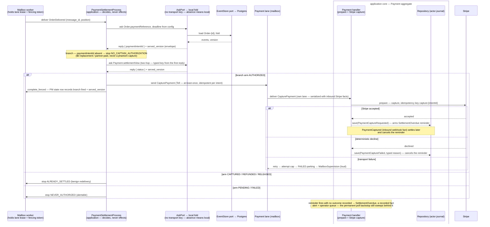

# PROP-20260815-142349 — Actor `answers:` + the PM `ask:`/`branch:` decision grammar — typed request/reply, reply-driven decisions, the settlement capture as a command; the transport stays parked

- **Status**: Approved (2026-08-15) — founder, verbatim: *"I'm ok for the dsl for process
  manager"*. The approval follows the three founder-directed design rounds recorded in §0: the PM
  decision grammar and the `answers:` block it depends on were both shaped by his directives.
- **Date**: 2026-08-15
- **Tracking issue**: [#582 "Actor `answers:` block + PM `ask:` step — typed request/reply for actor queries, transport stays parked"](https://github.com/TheCaptainCompany/captain-food/issues/582)
- **Realized by**: — (filled at completion)
- **Consulted** (ADR-20260812-143619): **vernon** (core grammar, key binding, sealed client,
  validator rules), **evans** (kind doctrine, spelling — the language owner's rulings carried where
  lenses diverged, anti-redundancy), **young** (versioning wall, decision boundary, evidence
  discipline, the speech-act test), **architect** (option tables, shape comparison, watchdog
  failure table, worked example, sequence diagram, register wiring) — three co-design rounds,
  2026-08-15. Every founder message went to the **full 14-lens roster** per
  [ADR-20260812-143619](../adr/ADR-20260812-143619-the-founder-is-the-founder-and-every-founder-message-goes-to-the-whole-team.md);
  the four lenses above carried the design content and are composed below — the file speaks as the
  team, not as any one lens.
- History lives in `git log -p` on this file (ADR-20260801-020000).

## 0. Decision log — the founder's directives, verbatim

1. *"It must be simple and strongly typed avoid redondant info"* — the standing constraint every
   key below is tested against.
2. *"Let's design the dsl for process manager using the the actors asks operations and how they
   makes decisions based on the reply content."* — widened the scope from the `answers:`
   declaration alone to the full PM decision grammar (§8).
3. *"The caller timeout is decided on the client side"* — **DECIDED**: the deadline lives on the
   caller's `ask:` step, never on the answering actor (D5, founder-confirmed).
4. *"Make it strongly typed avoid string use $refs only. I'm worried about the binding property
   usage. And I'm worried about the call that you propose in the deliver to the payment actor I'm
   not sure it's clean enough. And yes I agree we must call stripe just after and indicate the
   outcome. And subscribe just in case to payment capture requested just in case the call to
   stripe failed and cannot be retried."* — four rulings absorbed as: refs-only value forms (§8),
   the transport key **removed entirely** (D6 — the worry was vindicated), the capture leg
   reshaped from a PM-delivered event to a **command Payment handles** (§10, D4 — the "not clean
   enough" instinct was the correct doctrinal call), and the settlement **watchdog** (§11 — the
   "subscribe just in case").
5. Amendment 2026-08-15 (the actors-half landing, #582/#583/#584 — a refinement, not a decision
   change): the optional beyond-identity param key is **REFUSED this slice**
   (`ans-params-refused`) — the local ask cannot consume one; reintroducing the key is the
   recorded decision of whichever slice gives it semantics. §§2/3/8.4 now carry that posture.

## 1. Context — the recorded target, and what is untyped today

[ADR-20260815-030206](../adr/ADR-20260815-030206-a-process-manager-is-a-write-side-component-and-never-reads-the-read-side.md)
Correction §3 records the final-vision shape for "PMs ask the actor": an `answers:` block beside the
actor's inbox, always-serde replies, a typed `ask` on the sealed per-actor client, and a round-trip
test per reply type. Today **none of it exists**: the five PM read structs that *are* the reply
shapes carry no serde
(`crates/application/src/generated/process_managers.rs:22,31,736,866,1045` — ADR §5's enumeration),
and `HookOutcome::Skip(String)` carries prose (`crates/application/src/generated/process_managers.rs:12-15`)
— a defect AND a wire blocker. Today's ask-shaped replies more broadly have no serde and no spec
home (register row BUS-1, `crates/actor_client/src/status_bus.rs:20-38`).

The design was then driven through the truest near-term consumer, the settlement leg
(ADR-20260815-030206, "Recommended sequence"): on `OrderDelivered`, ask the Order for its payment
reference, ask the Payment for its status, and act on the answer. `PaymentStatus` and `OrderId`
already exist as kernel scalars (`specs/common/scalars.yaml:307,35`), so the worked example (§9)
redeclares nothing. The actor DSL's inbox key is spelled `receives:`
(`specs/payments/actors.yaml:33`), so the block lands **beside `receives:`**.

**Boundary stated up front**: this grammar is the recorded final-vision target buildable now with
the local in-process fold; the *transport* — any PM asking over a wire — remains **PMW-3, open and
not adopted** ([DECISIONS.md §42](DECISIONS.md)). Nothing here authorizes it, and (D6) nothing here
even *names* it: an `answers:` block with no transport key is served locally, and introducing a
transport key is itself the future gate.

## 2. The `answers:` grammar — minimal key set

A flat map of the operations the actor answers, beside `receives:`; each reply property is a
**state-ref** into the actor's own declared `state:` block (the declared-state DSL piloted on
`Conversation`, `specs/comms/actors.yaml:17`), so the property and its scalar are declared exactly
once and the reply only composes:

```yaml
# specs/payments/actors.yaml — on the Payment aggregate, beside `receives:`
Payment:
  type: aggregate
  identity: { $ref: '#/Payment/state/paymentIntentId' }
  state:                       # declared-state DSL (Conversation pilot) — each property + scalar declared ONCE
    paymentIntentId: { type: { $ref: 'scalars.yaml#/PaymentIntentId' }, from: [ ... ] }
    orderId:         { type: { $ref: 'scalars.yaml#/OrderId' },         from: [ ... ] }
    status:          { type: { $ref: 'scalars.yaml#/PaymentStatus' },   from: [ ... ] }
  receives:
    - ...                      # unchanged
  answers:                     # the queries this actor answers — the declaration IS the permission
    settlementView:
      description: "The settlement guard's facts: is this payment capturable/refundable right now."   # REQUIRED (catalog convention); prose stays prose
      reply:
        orderId: { $ref: '#/Payment/state/orderId' }
        status:  { $ref: '#/Payment/state/status' }
      # no params key — REFUSED this slice (ans-params-refused): identity IS the argument, see §3
```

```yaml
# specs/ordering/actors.yaml — the Order side of the settlement pair
  answers:
    paymentReference:
      description: "The payment intent this order was placed with — absent for a $0 replacement / partner-paid external order."
      reply:
        paymentIntentId: { $ref: '#/Order/state/paymentIntentId' }   # nullable in state → callers must branch on absence (§8)
```

From each operation the generator derives a **`<Actor><Op>Request` / `<Actor><Op>Reply` pair**
(`PaymentSettlementViewRequest`/`PaymentSettlementViewReply`) with **unconditional serde**, and a
typed `ask` on the sealed per-actor client (§7). The ref path is the whole address:
`actors.yaml#/Payment/answers/settlementView` names the operation, and
`actors.yaml#/Payment/answers/settlementView/reply/status` names a reply property — the actor is
encoded in the path, never restated.

**What round 1 carried here and rounds 2–3 removed** (reversals recorded in D5/D6): the block no
longer takes a `binding:` key (absence means local; *introducing* the key is the future transport
gate) nor a `deadline_ms:` (the deadline is the **caller's**, founder-decided), and the `queries:`
wrapper is gone with them — `answers:` maps operation names directly.

## 3. What is deliberately absent — the founder's constraint applied

Never declared twice, anywhere:

- **No request payload beyond identity — and no params key at all this slice.** An ask is
  addressed to an actor **by identity** — the `Payment-{intentId}` stream key *is* the argument,
  and the generated Request derives exactly that field. Repeating `paymentIntentId` inside the
  request payload would be the redundant info the founder forbade. A beyond-identity parameter key
  is **REFUSED** while the local ask is load → fold → project(state) (`ans-params-refused`, the
  #583/#584 hardening): nothing can consume a param yet, and an accepted key nothing consumes is a
  control that renders and does nothing. Reintroducing the key is the recorded decision of
  whichever slice gives it semantics; none of the register's near-term asks needs one.
- **The asker declares nothing about the answer.** The `ask:` step carries **one operation `$ref`
  and no `actor:` key** — the ref path already encodes the actor, so naming it twice is unspellable
  rather than forbidden (evans's anti-redundancy ruling; the validator derives the actor from the
  ref). No restating of the reply shape, timeout semantics, or target actor type on the asking
  side. (Published-Language discipline: the moment both sides declare the shape, you have two
  publications and a Conformist fight over which is real.)
- **No transport key. At all.** Round 1 carried `binding: local`; it is **gone** (D6). Topology
  belongs to the callee's declaration, never the call site — and today there is nothing to
  declare: absence means local, and the key's *introduction* is the gate a PMW-3 decision would
  flip. The word `binding` was also triply loaded in this repo (`services.yaml` topology /
  data-binding prose / the `CartBindingProcess` domain name) — retiring it here ends the collision.
- **No deadline on the actor.** *"The caller timeout is decided on the client side"* (founder,
  DECIDED): the deadline exists in exactly one place, the caller's `ask:` step, as a config `$ref`
  (§8) — never a per-actor default, never a per-query key.
- **No version field in any payload.** The served version rides the ENVELOPE, never the payload —
  no `asOf`/`version`/`streamPosition` field in any reply — same rule, same reason as the
  event-payload/envelope split in CLAUDE.md ("Event payloads = business only"). One rule, both
  speech acts.
- **Reply shapes are composition, not declaration.** Every reply property is a `$ref` into the
  actor's own `state:` block, whose fields are themselves typed by `$ref` into scalars/entities —
  the scalar is named once, in one place. A reply needing a value the state does not declare is a
  missing *state* declaration (or a missing entity, declared once in its owning scope); a reply
  introducing its own inline scalar violates "one name = one dedicated scalar" and forks the
  kernel.
- **No request/reply mirror files.** No `answers.yaml` catalog, no per-scope replies fragment — the
  actor block is the one home (ADR-20260731-120825's reasoning). A top-level catalog would be a
  second place the actor's contract lives.

Co-design note, for the record: a divergence was raised on whether the reply should be declared
where the *asker* can see it; it resolved itself — the answer is part of the answering actor's
language, the asker crossing the boundary via `$ref` **is** the translation, and the grammar above
already has the asker carrying only the `$ref`. No conflict remains.

## 4. Kind doctrine — the `answers:` header

To sit at the top of the `answers:` grammar, same register as the commands doctrine header
(`specs/common/commands.yaml:1-23`):

```
# An answer is a VALUE the actor serves on Ask — the third column of an inbox row, not a
# fourth speech act. It is declared INSIDE the actor (ADR-20260731-120825), never a catalog.
# 1. The ref path encodes the kind: `actors.yaml#/{Actor}/answers/{op}` — no other path form
#    resolves to a reply, so kind confusion is a resolution error, not a review comment.
# 2. A reply ref may appear ONLY in a PM `ask:` step (and its `from_ask` uses) — refused today
#    (`ans-ref-isolation`); the PM half reintroduces this structurally against the parsed step.
#    In `emits:`, a lifecycle transition, a projection/fold source, or a tombstone -> validator
#    error.
# 3. A reply is constitutionally unpersistable: no journal, no `domain_events`, no View_* may
#    name one. It exists on the wire for one Ask and nowhere else.
# 4. A reply shape is composed of $refs into the actor's own state: (itself $ref-typed); it may
#    declare NO new scalar and NO new property.
```

Rule 1 is load-bearing: without it the Ask edge would be a **naming convention** — the worst kind
of edge on a context map, invisible to the loader like the `format!("{CATEGORY}-{}")` stream-name
edge at `crates/domain/src/payment.rs:26-28`. An actor-nested ref path makes the edge a
**Published Language**: named, resolvable, versionable, checkable. Rules 2–3 make "value, not
event" enforceable rather than aspirational — the refs walker already collects every `$ref` node,
so "never in a fold" is one predicate over paths.

The header also needs one sentence making clear `answers:` ≠ `api.yaml` queries: write-side
internal asks carry no persona, no authz, no story step (see D3's cons and validator rule V6).

## 5. Naming grammar

```
# Answer operations: NOUN-PHRASE VALUE — the thing served, named as a value the actor holds.
#   Good: paymentReference, settlementView, dispatchCandidates. Bad: GetSettlementState
#   (transport noise), SettlementStateProvided (a fact's grammar).
# FORBIDDEN in an operation or reply name: past participles (Provided/Returned/Served),
#   Get*/Fetch* prefixes, *Response/*Result/*DTO suffixes. If the name reads as something that
#   HAPPENED, it is trying to be an event; if it reads as plumbing, it is trying to be a
#   transport. The generated <Actor><Op>Request/Reply pair is code, not language — the DSL
#   names only the operation.
```

The repo already runs three grammars that never collide — imperative commands (`AddCartLine`),
past-participle events (`CartLineAdded`), noun-phrase errors (`CartNotFound`). An answer that
borrows the past participle steals the events' grammar and readers WILL treat it as a fact.
Noun-phrase-value is the one unclaimed register. (Round 1 also reserved an imperative *request*
grammar; with the operation-ref-only form there is no separately named request in the DSL — the
generated `Request` type derives — so the noun-phrase rule is the whole grammar.)

## 6. The wall — a reply is a snapshot whose authority expires at send

A reply is a **snapshot whose authority expires at the moment it is sent**. It is a conversation,
not history. Everything below follows from that one sentence.

### Two versioning contracts, two kinds — never merged

- **A stored event** is an immutable fact. Changing its shape means **upcasting**: new code learns
  to read old history; history is never rewritten (*Versioning in an Event Sourced System*; the
  repo's only exception is GDPR stream *deletion*, ADR-20260731-160000 — deletion, not rewriting).
- **A reply** is never stored, so there is no history to teach. Changing its shape means
  **additive-only fields + a tolerant reader**: the sender may add, never remove or retype; the
  caller ignores what it does not know.
- These are **mirror-image disciplines** — one protects a durable past, the other protects a live
  conversation — and applying either to the other's artifact is a defect: upcasting ceremony on a
  wire reply is cargo cult; wire-reply informality on `domain_events` is data loss.
- **Therefore the DSL keeps the reply a separate kind from `events.yaml`** — same rigor of typing
  (every field a `$ref`, ADR-20260811-014129 Decision 2), different evolution rule attached to the
  kind itself, so the validator can enforce the right discipline per kind and the wrong one is
  unspellable. This also closes the gap ADR-20260815-030206 §5 records: today's ask replies are
  unshaped Rust structs with no serde and no spec home (BUS-1 row,
  `crates/actor_client/src/status_bus.rs:20-38`).

### The hard NOs

- **No reply in `domain_events`.** A reply is not a fact; appending one would make a conversation
  replayable history and a rebuild non-neutral.
- **No projection or fold ever consumes a reply.** Current state is a left fold of the event
  stream — a fold over replies is a fold over answers that expired at send.
- **No `validUntil` or config-derived value in anything stored.** Expiry and configuration belong
  to the conversation; frozen onto an event they become "facts" that were never facts (RSO-1's
  `CheckoutSnapshot` verdict stores the *window and inputs* — evidence — precisely because a stored
  boolean-with-expiry is unfalsifiable).
- **No request/response on commands.** A command's reply *is* an event plus PENDING, because
  acceptance-first is the write model's contract: the mailbox accepts, the worker appends, and the
  caller learns the outcome from the log — a synchronous return channel on a command would promise
  an answer the write side has deliberately not computed yet.

### Evidence discipline — stricter than aggregates

A replay never re-runs a PM decision — the PM state row is the **only record** of what the PM
decided and why. So the row carries: **which branch fired**, the operation asked, and the reply's
**`served_version`** (the RSO-1 amendment-6 evidence pattern), in **generated columns derived from
the decision's outcome enum** — never prose. Two non-homes, said plainly: the command row in
`inbound_messages` is a **delivery guarantee, not evidence** (the journal is not a second event
log), and the permanent record of the settlement decision splits between the PM state row (the
decision + its evidence) and the outcome events on Payment's stream (the facts) — both ways.
*"A failed external call on the money path is a domain fact, not a log line"* — `PaymentCaptureFailed`
is as mandatory as `PaymentCaptured` (§10).

### Where the PM's context comes from today — and the honest line about `ask:`

Today the context is the **in-process fold of the aggregate's own stream**:
`crates/application/src/process_managers/place_order.rs:47` (Payment stream → frozen checkout) and
`crates/application/src/process_managers/delivery_dispatch.rs:126` (Restaurant stream → pickup
address) — spelled in the grammar as `source: EVENT_STREAM` on the PM `read:` step (PMW-1 option
(a), riding
[#564 "Derive reader sets mechanically: a declared, walkable reads: grammar that distinguishes source from shape"](https://github.com/TheCaptainCompany/captain-food/issues/564)
PR1's enumeration). An `ask:` step's local form IS that same fold, now typed and declared; a
*remote* ask would be preferable **only** when a resident activation can serve the fold cheaper
than a cold stream load *and* PMW-3's three objections — no fence for a positionless message,
head-of-line behind a Stripe capture, no grain directory — are answered; until then the grammar
exists as a declared kind while the transport stays parked (PMW-3: **not adopted**, DECISIONS §42).

Carried verbatim so nobody upgrades the fold later: **a fold gives freshness, not atomicity
(CHK-1)** — an `ask:` reply, however transported, inherits the same limit, which is exactly why its
authority expires at send.

## 7. Sealed-client contract (sketch only)

Beside the existing `send` (`crates/clients/order/src/lib.rs:144`) and using the same seal
(`crates/clients/payment/src/lib.rs:29`):

```rust
/// Generated iff the actor declares `answers:` (absent surface, never uncallable-but-present).
pub trait PaymentAnswer: sealed::Sealed {
    const QUERY_TYPE: &'static str;
    type Reply: serde::Serialize + serde::de::DeserializeOwned;   // serde ALWAYS — the wire shape may not rot
}

pub enum AskOutcome<R> {
    Answered { reply: R, served_version: i64 },   // dba's PMW-3 minimum: (stream, served_version) travels with every answer
    Absent,                                        // the stream has no birth event — modeled, not an error string
    Deadline,                                      // the caller's declared deadline elapsed — modeled, not a hang
}

impl PaymentClient {
    pub async fn ask<Q: PaymentAnswer>(&self, q: Q) -> Result<AskOutcome<Q::Reply>, DomainError>;
}
```

`Err` stays reserved for infrastructure failure; `Absent` and `Deadline` are **Ok-channel arms the
caller must match** — exhaustively, by the compiler. The YAML never spells `AskOutcome`: the ask
step's `as:` / `absent:` / `deadline:` keys (§8) **are** its three arms, declared once each.

## 8. The PM decision grammar — `ask:`, `branch:`, `from_ask`

*"Let's design the dsl for process manager using the the actors asks operations and how they makes
decisions based on the reply content."* (founder, round 2). Spelling is unified under the language
owner's rulings: the existing step vocabulary is reused wherever it exists — the predicate word is
`that:`, the body word is `steps:` (`specs/common/processmanager.yaml:33-63`), the default arm is
`otherwise:`; no `on_*` key exists anywhere in the DSL and none is introduced.

### 8.1 The `ask:` step

```yaml
- ask:
    operation: { $ref: 'actors.yaml#/Payment/answers/settlementView' }   # the ref path IS the actor — no actor: key
    params:
      paymentIntentId: { from_ask: { as: order_payment, property: { $ref: 'actors.yaml#/Order/answers/paymentReference/reply/paymentIntentId' } } }
    as: payment                  # declares the reply alias — the Answered arm
    absent: RETRY                # MANDATORY arm — the stream has no birth event
    deadline:                    # MANDATORY arm — the ONE place the deadline exists (caller-side, DECIDED)
      after: { $ref: 'configuration.yaml#/settlementAskDeadlineMs' }
      then: RETRY
```

- `operation:` is the whole address — the validator derives the actor from the ref path (§3).
- `params:` values use the existing typed value family (`from:` — triggering-event property,
  `from_state:` — own row, legal only with `state_table:`, and the new `from_ask` — an earlier
  reply in the same leg). Typing is end-to-end: the source's scalar must equal the target param's
  declared scalar. This is load-bearing, not decoration: `OrderDelivered` has **no
  `PaymentIntentId`-typed property**, so a one-hop ask of Payment is *unspellable* and the two-hop
  (Order first) is **forced by typing**.
- `as:` is a category-1 declaration (the only legal bare-name introduction) — a **domain noun**,
  never equal to any reserved step/value-form key (validator rule V9). The same operation may be
  asked more than once per leg on different keys under different aliases (vernon's
  at-most-once-per-leg alternative was considered and **not adopted** — it would delete `as:` but
  also that expressiveness).
- `absent:` and `deadline:` are **mandatory arms with non-empty consequences** — bare nouns, not
  `on_*` keys. A reply alias is not in scope inside them: no reply arrived, so the grammar prevents
  branching on it. The consequence set is closed: **`RETRY`** (abort without checkpoint advance →
  mailbox redelivery → attempt cap → FAILED parking — loud and modeled, never a hang) or a
  **`stop:`** with a named outcome. `deadline:` additionally carries `after:`, a config `$ref`
  (the reminder grammar's duration word, `specs/ordering/actors.yaml:95`) — the deadline is
  declared exactly once, here.

### 8.2 The `branch:` step

The DSL owns the **branching topology** (variant → arm); the compiler owns computing the variant.
An inline branch is a total, closed-set discrimination on **one declared reply property**
(enum / flag / null-presence), exhaustiveness proved by the validator. The discriminating alias is
hoisted **once** at the head (`on:`); arms never repeat it.

```yaml
- branch:
    on:
      from_ask:
        as: payment
        property: { $ref: 'actors.yaml#/Payment/answers/settlementView/reply/status' }
    arms:            # the property resolves to scalars.yaml#/PaymentStatus — every member covered, or otherwise: required
      - that: [AUTHORIZED]
        steps:
          - send: { command: ..., to: ..., with: ... }
      - that: [CAPTURED, REFUNDED, RELEASED]
        steps:
          - stop: { outcome: ALREADY_SETTLED, note: "Benign redelivery." }
```

- Arms reuse `that:` (values are bare enum tokens — category 3, the set closed by the ref chain
  reply property → state → scalar, exactly like lifecycle `from: [PENDING]` today) and `steps:`;
  the default arm is `otherwise:`. When the arms cover the resolved scalar completely, `otherwise:`
  is refused as dead; when they do not, it is required.
- A **nullable** reply property gets a bare-noun **`absent:`** arm (same word, same meaning family
  as the ask step's: the value is not there) — and a `from_ask` use of a nullable property
  *requires* a preceding absence-terminating branch, syntactically provable (validator rule V12).
- `stop:` ends the leg with a **named outcome token** — a declaration that feeds the PM's generated
  decision enum and state-row columns (§6 evidence discipline); `CONTINUE` falls through to the
  next step. Decision arms end in `send:` / `deliver:` / `state:` / `stop:` / `RETRY` / `CONTINUE`
  — the PM grammar gains **no effect construct** (§10).
- **Everything beyond closed-set single-property discrimination** — arithmetic, thresholds, money
  comparison, multi-property conjunction, time — is NOT spellable inline. The recorded extension is
  a named domain function `f(Reply) -> DecisionEnum` in `crates/domain`, referenced from the branch
  via a `via:` key so both the runtime and any future reviewer import one artifact — **recorded as
  the extension, NOT built in slice 1**. A branch that needs it today is a finding to bring back to
  the register, not a licence to widen the inline matcher.

### 8.3 The `from_ask` value form

Joins the existing typed family (`from:` / `from_state:` / `from_read:` / `from_port:` /
`from_envelope:`):

```yaml
from_ask:
  as: order_payment            # alias USE — category 3, the leg-local closed set of declared aliases
  property: { $ref: 'actors.yaml#/Order/answers/paymentReference/reply/paymentIntentId' }   # category 2 — a ref, never a dotted string
```

The apparent redundancy between `as:` and the property ref is a **checkable consistency
constraint**: the validator requires the alias's declaring `operation:` ref to be a prefix of every
`property:` ref used through it — a property ref whose operation does not match the ask that
declared the alias is an error, not a surprise at runtime. Dotted strings
(`payment.status`) are gone; every property access is a `$ref` to the declared reply property
(ADR-20260811-014129 Decision 2 — a bare name here would be silently invisible to the refs walker,
the exact [#413](https://github.com/TheCaptainCompany/captain-food/issues/413) defect class).

### 8.4 Never declared twice — the grammar's six rules

1. No `actor:`/`to:` key where the operation ref already encodes the actor.
2. The only ask-site argument is the derived identity — the future `ask:` step's `params:`/`with:`
   binds the identity `key:` only (the shipped grammar refuses beyond-identity params,
   `ans-params-refused`, until a slice gives them semantics); no types are ever restated at the
   ask site.
3. Reply properties are named by `$ref` to the declared property only — no dotted strings, no
   re-spelled shapes.
4. Enum members in `that:` are validated against the resolved scalar — never a hand-copied set.
5. The deadline is declared once, on the caller's ask step, as a config `$ref`.
6. `AskOutcome` is never spelled in YAML — `as:` / `absent:` / `deadline:` ARE its three arms.

## 9. The worked example — the settlement leg, refs-only

The proposal's centerpiece: `PaymentSettlementProcess` on `OrderDelivered`, two asks, two branches,
one command. Every semantic value is a `$ref` or a closed-set token; the only bare names are the
two alias declarations.

```yaml
# specs/payments/processmanager.yaml — PaymentSettlementProcess
- message: { $ref: 'events.yaml#/OrderDelivered' }
  steps:
    - ask:
        operation: { $ref: 'actors.yaml#/Order/answers/paymentReference' }
        params:
          orderId: { from: { $ref: 'events.yaml#/OrderDelivered/properties/orderId' } }
        as: order_payment
        absent: RETRY
        deadline:
          after: { $ref: 'configuration.yaml#/settlementAskDeadlineMs' }
          then: RETRY
    - branch:
        on:
          from_ask:
            as: order_payment
            property: { $ref: 'actors.yaml#/Order/answers/paymentReference/reply/paymentIntentId' }
        absent:
          stop:
            outcome: NO_CAPTAIN_AUTHORIZATION
            note: "$0 replacement / partner-paid external order — never a phantom capture (rules.yaml#/PaymentCapturedOnFulfilment)."
        otherwise: CONTINUE
    - ask:
        operation: { $ref: 'actors.yaml#/Payment/answers/settlementView' }
        params:
          paymentIntentId:
            from_ask:
              as: order_payment
              property: { $ref: 'actors.yaml#/Order/answers/paymentReference/reply/paymentIntentId' }
        as: payment
        absent: RETRY
        deadline:
          after: { $ref: 'configuration.yaml#/settlementAskDeadlineMs' }
          then: RETRY
    - branch:
        on:
          from_ask:
            as: payment
            property: { $ref: 'actors.yaml#/Payment/answers/settlementView/reply/status' }
        arms:      # resolves to scalars.yaml#/PaymentStatus — 6 members, all covered, no otherwise:
          - that: [AUTHORIZED]
            steps:
              - send:
                  command: { $ref: 'commands.yaml#/CapturePayment' }
                  to: { $ref: 'actors.yaml#/Payment' }
                  with:
                    paymentIntentId:
                      from_ask:
                        as: order_payment
                        property: { $ref: 'actors.yaml#/Order/answers/paymentReference/reply/paymentIntentId' }
                    orderId: { from: { $ref: 'events.yaml#/OrderDelivered/properties/orderId' } }
          - that: [CAPTURED, REFUNDED, RELEASED]
            steps:
              - stop: { outcome: ALREADY_SETTLED, note: "Benign redelivery." }
          - that: [PENDING, FAILED]
            steps:
              - stop: { outcome: NEVER_AUTHORIZED, note: "Delivered but never authorized — alertable." }
```

The two-hop shape (Order first, then Payment) is not a style choice — it is **forced by typing**
(§8.1): `OrderDelivered` carries no `PaymentIntentId`-typed property. And the remaining ask surface
is telling: after §10 moves the capture effect into Payment's own handler, the only ask a decision
truly needs from Order is a **written-once identity**. *"Ask for immutable routing, Tell for the
decision, receiver enforces the invariant."*

## 10. The capture is a command — decided by the design (D4)

Round 2 had the PM `deliver:` a `PaymentCaptureRequested` event to Payment, with a separate effect
leg calling Stripe. The founder: *"I'm worried about the call that you propose in the deliver to
the payment actor I'm not sure it's clean enough."* The worry was the correct doctrinal call, and
the design reversed:

**The speech-act test** (young): *can the recipient legitimately refuse it, and does its truth
depend on an effect not yet performed?* `PaymentCaptureRequested` delivered *by the PM* fails both
— a fact written onto another aggregate's stream by someone else, whose truth depends on a Stripe
call that has not happened: **a command wearing past tense**. So it is spelled as one:
**`send: CapturePayment`**, and Payment's own handler calls Stripe in `prepare` and records the
outcome. `RefundOpened → Payment` is NOT a counter-example and the existing `deliver:` pattern is
not suspect: `RefundOpened` passes both tests (the decision is complete at recording; it demands
nothing of Payment). The line is **recorded decision vs pending instruction** — fact vs demand.

| | (1) Event-then-effect-leg (round 2) | (2) `send: CapturePayment` → Payment's handler calls Stripe in prepare ✅ **decided** |
|---|---|---|
| Doctrine | `PaymentCaptureRequested` delivered *by the PM* is a fact written onto another aggregate's stream by someone else — an imperative wearing an event's clothes | ADR-0004 holds cleanly: "capture this payment" IS a use case — the action arm of the settlement decision (and of CAP-READY) — and it CAN be rejected (not AUTHORIZED). Saga-driven commands are established (`GrantCustomerCredit`/`ConsumeCustomerCredit`, `specs/payments/actors.yaml:77`). Acceptance-first then applies naturally: Payment *itself* records its facts — one writer per aggregate honored in spirit, not just mechanically |
| Machinery | Needs a new PM effect-leg pattern; retry rides PM event redelivery | **Zero new grammar**: `send:` already exists (`CartBindingProcess` uses it today). The effect inherits the aggregate lane's acceptance-first machinery whole: per-payment serialization (the right head-of-line — money ops on one intent are *supposed* to queue), fencing, attempt cap with backoff, FAILED parking, MailboxSupervision |
| One-aggregate-per-transaction | PM completion tx + Payment append | Payment handler appends only to Payment's stream. Clean |
| Cost | New event + new PM leg | New command + ONE new event (`PaymentCaptureFailed` already exists — authoring seam changes only) |

The command shape is also **stronger on the race** (vernon): the AUTHORIZED guard and the Stripe
effect serialize on **Payment's own lane** — the same lane as the inbound Stripe facts — so
one-writer closes the fold-to-decision race the ADR said the PM's fold cannot. The PM's stateful
ask of Payment becomes a routing convenience; the invariant is enforced by the receiver.

```yaml
# specs/payments/actors.yaml — Payment gains the command; the effect lives HERE
  receives:
    - message: { $ref: 'commands.yaml#/CapturePayment' }
      emits:
        - { $ref: 'events.yaml#/PaymentCaptureRequested' }   # NEW — the durable decision, on Payment's own stream
        - { $ref: 'events.yaml#/PaymentCaptureFailed' }      # EXISTS — authoring seam moves here from the PM seam
      schedules:
        - { $ref: '#/Payment/reminders/SettlementOverdue' }  # the watchdog is armed by the receive (§11)
      effect: >
        prepare = Stripe capture, idempotency key capture:{intentId} (ADR-20260801-023000).
        Accepted -> PaymentCaptureRequested; PaymentCaptured settles via the inbound webhook fact.
        Deterministic decline -> PaymentCaptureFailed (typed reason, paging counter). Transport
        failure -> mailbox retry -> attempt cap -> FAILED parking -> MailboxSupervision (loud).
        Idempotent: already requested / already CAPTURED -> recorded no-op.
        PaymentCaptured / PaymentCaptureFailed cancels the SettlementOverdue reminder.
```

**The honest event triple** (evans): `CapturePayment` (command, imperative — the saga-dispatched
precedent is `PlaceReplacementOrder`) → **`PaymentCaptureRequested`** (NEW fact: the recorded
intent, on Payment's own stream, where the past participle is now legitimate) →
**`PaymentCaptured`** (the INBOUND Stripe settled fact, `specs/payments/events.yaml` — recorded
without a command, 📥, **untouched**; never reuse it as the command's acceptance outcome) /
**`PaymentCaptureFailed`** (EXISTS, typed `CaptureFailureReason`, `specs/payments/scalars.yaml:28-33`;
the settled webhook supersedes a `GATEWAY_UNAVAILABLE`). The PM's `send:` is at-least-once, so
`CapturePayment` is **idempotent by declaration** (already-requested / already-CAPTURED → recorded
no-op).

The PM grammar gains **no effect construct**: decision arms end in
`send:`/`deliver:`/`state:`/`stop:`/`RETRY`/`CONTINUE`; external effects live in aggregate command
handlers' `prepare`. `call:` survives only in legacy legs, marked for migration —
`RefundProcess`'s `ApproveRefund` leg is the named candidate, **out of scope here**.

## 11. The settlement watchdog — the founder's "subscribe just in case"

*"And subscribe just in case to payment capture requested just in case the call to stripe failed
and cannot be retried."* Which failure escapes which net:

| Path | Net | Loud? |
|---|---|---|
| Transport failure / retryable Stripe error in `prepare` | Mailbox retry → attempt cap → FAILED parking → MailboxSupervision | Already loud. Existing. This IS the "cannot be retried" net for retry-exhaustion |
| Deterministic decline | `PaymentCaptureFailed` (typed reason) + paging counter | Already loud. Existing |
| **Stripe accepted, but `PaymentCaptured` (webhook fact) never arrives** — webhook outage/misconfig/stall | `PaymentCaptureRequested` recorded, mailbox row COMPLETED, nothing retries, nothing parks, no threshold trips | **SILENT. The escape** — ADR-20260810-231300's named defect class; the ~7-day authorization expiry eats the restaurant's money invisibly (the [#544](https://github.com/TheCaptainCompany/captain-food/issues/544) class, longer fuse) |
| Crash between Stripe success and completion commit | At-least-once redelivery + deterministic key `capture:{intentId}` | Covered, benign |

Path 3 is the only one the founder's subscription is needed for, and it is **time-triggered work,
not propagation** — nobody can `NOTIFY` "a webhook didn't arrive"; the absence of an outcome after
a deadline is clock-work (ADR-20260810-231300's scope line, young's phrasing: *"nobody can NOTIFY
'no outcome happened'"*). So it is **the first real money use case for the deferred actor-reminder**
(ADR-20260731-120825; full grammar landed by the GDPR pilot, `specs/ordering/actors.yaml:92-96`:
payload / `after:` / reschedule, promotion pass delivers when due, the delivery RECORDS the fact —
record semantics, never Rejected). Sleep-until-due, never an interval scan:

```yaml
# specs/payments/actors.yaml — on Payment
  reminders:
    SettlementOverdue:
      payload: { $ref: 'events.yaml#/SettlementOverdue' }   # NEW event — foldable, alertable
      after: { $ref: 'configuration.yaml#/keys/SETTLEMENT_OUTCOME_WINDOW_HOURS' }
      reschedule: in-place
```

Armed by the `CapturePayment` receive (`schedules:`, §10); **cancelled by the outcome facts**
(`PaymentCaptured` / `PaymentCaptureFailed`) — reminder cancellation on a receive is the one
grammar addition the GDPR pilot lacks, named in the slice-1 build list (§19). Firing is a
**recorded fact** (`SettlementOverdue` folds, alerts, and feeds the operator queue) — never an
engine-internal timer erasing silently.

**And the poll stays. Permanently.** Under the monitoring carve-out (ADR-20260810-231300, the
founder's own refinement: monitoring *keeps a poll in every case, even where push works*, because
for a monitor silence is ambiguous): the timer-driven reconciling sweep behind
`payment_authorized_unsettled_age_seconds` (`specs/observability.yaml:433`) is not retired by the
reminder — a reminder that never fires and a healthy path look identical from outside. The sweep
reconciles a `View_UnsettledCaptures`-shaped question (CaptureRequested without a settlement
outcome) against the log. One **`specs/observability.yaml` contract row is owed with the watchdog**
— the dead-man's-switch on the capture path — and lands in slice 1.

## 12. Validator rules (C = compiler-carried, V = validator-carried, T = generated-test-carried)

Answer-block rules:

| # | Rule | Carrier |
|---|---|---|
| V1 | **Pairing completeness** — every declared answer consumed by ≥1 `ask:` step, every `ask:` resolves to a declared answer (ADR-0032 shape) | V |
| V2 | **Refs resolve; nothing redeclared** — every reply property a `$ref` into the actor's own `state:`; every state field `$ref`-typed; no inline scalar ("one name = one dedicated scalar") | V |
| V3 | **An `ask:` never shares a leg with a `call:`** — the PMW-3 compiler-first item: `handler.prepare` runs before `pool.begin` (`crates/actor_runtime/src/completion.rs:69`), so read-then-external-effect cannot be closed by re-assert; the shape is unspellable | V |
| V4 | **Round-trip serde test per reply type** — the wire shape cannot rot while the ask is local (ADR-20260815-030206 Correction §3 item 5) | T |
| V5 | **`ask` exists iff `answers:` declared; reply types sealed; `AskOutcome` match exhaustive** | C |
| V6 | **Answers are not a product query surface** — no `$ref` into `answers/` from api.yaml or screens; a caller wanting a query surface reads a read model | V |
| V7 | **Breaking reshape = new answer name** (additive-only producer / tolerant reader). Not machine-checkable against history; review-carried, pinned only partially by V4. Said plainly: this one is doctrine | — |

PM-step rules (`pm-*`):

| # | Rule | Carrier |
|---|---|---|
| V8 | `pm-ask-arms` — every `ask:` declares `absent:` + `deadline:` arms with non-empty consequences from the closed set (`RETRY` \| `stop:`); `deadline.after` resolves to a declared config key; `RETRY` = abort without checkpoint advance → redelivery → attempt cap → FAILED parking (loud, modeled) | V |
| V9 | `pm-ask-alias` — `as:` is a domain noun, never a reserved step/value-form key; every `from_ask.as` resolves to an alias declared earlier in the same leg | V |
| V10 | `pm-ask-consistency` — the alias's declaring `operation:` ref is a prefix of every `property:` ref used through it | V |
| V11 | `pm-branch-exhaustive` — `that:` tokens ∈ the resolved scalar's members (the set closed by the ref chain reply → state → scalar); full cover XOR `otherwise:` — a dead `otherwise:` is refused, a missing one required | V |
| V12 | `pm-branch-absent` — a `from_ask` use of a nullable reply property requires a preceding absence-terminating `absent:` arm, syntactically provable | V |
| V13 | `pm-params-typed` — every `params:`/`with:` value's source scalar equals the target's declared scalar (end-to-end typing; the two-hop settlement shape is forced by this rule) | V |
| V14 | `pm-no-foreign-write` — closure of the step set: `send:`/`deliver:` are Tells the receiver may reject, `state:` writes the PM's own row only, `ask:` is read-only — a foreign-aggregate write is unspellable | V |
| V15 | `pm-decision-evidence` — every `stop:` outcome token feeds the PM's generated decision enum; the state row's generated columns record branch-fired + `served_version` per ask | V + T |

## 13. Timeout / no-reply as a modeled outcome — DECIDED caller-side

*"The caller timeout is decided on the client side"* (founder). The DSL refuses to leave three
things implicit: **(a)** what an empty stream means — the `absent:` arm is mandatory and the
generated `AskOutcome::Absent` is a modeled variant, so "not found" can never arrive as a prose
`Skip(String)` (the exact defect ADR-20260815-030206 §5 tables for `HookOutcome`); **(b)** the
deadline — declared exactly once, on the caller's `ask:` step, as a config `$ref`, never an
unbounded await and never an actor-side default; **(c)** staleness — `served_version` rides every
`Answered` on the envelope, so a caller *can* re-assert where a fenced transaction exists (and V3
forbids the one place it cannot close). Vernon's four Ask conditions made structural: addressed
reply, defined timeout, modeled failure — and V3 plus the §10 command shape handle "no irreversible
effect after an unre-checked answer" (the PM no longer performs effects at all).

## 14. Sequence diagram — the settlement leg end-to-end (command shape)

The structural points: **the fence belongs to the delivered message, never to the ask** (a query
has no message_id/position — PMW-3 objection i), and **the external effect lives in Payment's own
handler**, serialized on Payment's lane with the inbound Stripe facts — the PM decides and Tells,
nothing more.



<a href="https://mermaid.live/view#pako:eNqVVl1vIkcQ_CsjlAdQ4Hx3yktQYml1rBMUDAjwWYksoWG3gQm7M5uZAY6z_N9T87GADVYUHmxgtqu7q7tqeG5kKqdGlzUM_bMlmVFP8JXm5ZNkeFVcW5GJikvLHhk37J6LYqG-sb3SG9K_LPTNbXOtitywgktiBXFD7Ee2BJKQK2bVhmTrEmt878DG_FCStFOytiD3bqxVRsYEWF5Vhci4FUqyp-3nj59-YjllIifTZpJ2pBktl5RZcwU_mf7hEiRmM1bauvBPP39mhcp4wZYoN2SQilnNpancMxs61Gn4wjgmWEk4DFFXcqRTlyLduQ6s0sSqs1RjZexKk7nS-uCs9cBaswysxiSO3_PmMwceS6vj-AroK24phFwkSc6TrLnMi3palSY8SexXNrVaVMQyXtmtptZ1pEk6HjmsCVXKCPR5YE2e4T_7W221PDJDMr_s1TMU0jzJcPzYub0d33cxykK4GY50TroXPlAOKjB_vqK5yNvMZwQDMcX4HrGYbBeomxD4oQotTmiJcMysDWCeFwKsLrUqwZ1cilWIRygA0mkXI-V5AOg8i_yl7XciPJROO3UWcqPFsqEygypOILEFEFkc2DOLNfSldX9z9gIBGNI7yucxlDVJ7qhQVc3yUFliyvXvgBZYwmxdj_gtnN_G42IZqyo2HM2_JONZ0h_Ok4fZ76NJ_69k1h8Nw4R_-OhL45nXFLvxI5HoteKO1aAdziqshXUUvZr_a5LjBn0wR4l-FbRnTbtXnTUKiSXbQ4XZOQV50u0a7AttbKCo9S5zxnK7NVcICxG8sDU3XJesbjXtnVbVlzsedBEvc_YltFLvfXNGRXEUte04d7Id5dcEPlJWylHMKtAhPNutN8CPXSxQWRVkae4sDU3WOrz3xRPTao92IFFYYKwVrePB6y156IGrOTlp4G3Zai-DMcRkABK8EN-Buhd2jWIXaot2o4CX_GSCHj8BPra8VnpEiXM-az07-JnFg-6ziCv3csJyI4hpeJZRZSk_HbqXl4tr5voxasG5MxGMiO-oGZuMLU_cpWMQ1TqOSZewjOO6jcBPvgXNVAoJvb5GP5NR0g5JXuPDUGqy9rRYK7XxbLVYWGh3a9lojPBIMIEZF8Yv8GVGnBBmhgCcCAOXcxeS85p3KImn_4-SO9wFBJkGTWmsLAzwNMP_LPB0oy2BBMDL7N-cYDRZfahdhVuLnbBuFeqv7pL-IO0579i4mzx-G-__6Rai2YngbYXa5mfrd7wJfDlOuM6rHiYAu8F1cvcw7MW3gzSZXogZmvMelwwmadL7cz5NZzNXSHNBUqwk6o6yqX3lmGacDnv94W-ADrW_AzxMv6aT-clMcJ_hcrR8UdDbu-x8v7pHwr3ATZAifkKorYVJUHSBYBGOqoslbsN0jw-5NfR7V0_A1QDTwB2hubteIYztUbtu3jgoYQrOsBRsbcGzje8Hi4iPZk9UwYJojRqZsI02a5QuQuT4dffcAELpf-fltOTbwjZeXv4FFqREgg" target="_blank" rel="noopener noreferrer">Open this diagram with pan and zoom on mermaid.live — on github.com use Ctrl/Cmd+click or middle-click to get a NEW tab (GitHub strips target=_blank)</a>

An ask that times out or finds no stream is safe by construction: the leg emitted nothing, the
mailbox row never completed, at-least-once redelivery re-runs the whole leg — no compensation
needed because nothing happened.

## 15. The option space

### D1 — Adopt `answers:` now: spec + client + serde only?

| Option | Pros | Cons |
|---|---|---|
| **(a) Adopt now — spec grammar + generated reply types with unconditional serde + typed `ask` on the sealed per-actor client + round-trip test per reply type; zero transport, absence-means-local** ✅ recommended | This IS the final vision minus the transport (ADR-20260808-235113): exactly Correction §3's target, already recorded. Types what **already exists untyped** — the five PM read structs (`crates/application/src/generated/process_managers.rs:22,31,736,866,1045`) *are* the reply shapes and carry no serde today. Makes "the transport is one future spec key" true instead of aspirational. No redundancy: reply declared once, derived everywhere. | Grammar lands before any remote consumer; rot risk bounded by the mandatory round-trip test. Touches actor DSL, so AMBER until this proposal is Approved. |
| (b) Wait for a first consumer | No speculative grammar; shape driven by a real call site. | The "first consumer" of a *remote* ask is exactly PMW-3's unresolved transport — waiting welds the cheap typed half to the expensive parked half. The intermediate-step posture CLAUDE.md forbids; meanwhile reply shapes keep rotting (`HookOutcome::Skip(String)` carries prose — a defect AND a wire blocker). |
| (c) Full transport now (`answers:` + tonic/gRPC) | Realises the queryable-actor sentence completely. | PMW-3 is explicitly **NOT adopted**; fencing (a query has no message_id/position), head-of-line (a query queues a Stripe capture behind itself), and the grain directory (lanes are lease-raced, not assigned) are all unsolved. Zero tonic/prost/.proto in the tree. Building it would be a decision reversal against the register, not a spec edit. |

### D2 — PM step grammar: new `ask:` step kind vs a third `source:` value — **DECIDED (a), and the question it sat on has since been dissolved**

Composed on
[PR #566 "A process-manager read step declares its SOURCE, not only its shape (#564 PR1)"](https://github.com/TheCaptainCompany/captain-food/pull/566),
**merged 2026-08-16 as `b0fd7fdf`**: `source:` is required on every `read:` step, the set is closed
at two (`READ_SOURCES: [PROJECTION, EVENT_STREAM]`,
`tools/codegen-rs/src/validate/process_managers.rs:49`), the key set is closed (`READ_KEYS`, `:53`),
and its validator comment refuses a third token: *"Both need a THIRD source token, and inventing one
here would be a patch standing in for a decision. Refusing them keeps the option open instead."*

**(a) was adopted, and it is now the ONLY option that survives** — because on 2026-08-31 the founder
retired `read:` from the process manager altogether
([ADR-20260831-121957](../adr/ADR-20260831-121957-the-pm-read-step-is-retired-source-fixed-the-physics-and-left-the-ownership.md),
row **PMW-4**). Option (b) proposed a third `source:` value on a step kind that no longer exists;
option (c) proposed reusing `call:` and would have made the `ask:`-plus-`call:` refusal rule
unspellable. **The option table below is retained because its reasoning still decides the shape of
`ask:` — it is no longer a live choice.** Two of (a)'s recorded pros are now load-bearing rather
than persuasive: an ask has **no table**, so forcing it through `read:` makes `model:` a lie; and the
routing key becomes explicit and typed.

| Option | Pros | Cons |
|---|---|---|
| **(a) New step kind `ask:`** (§8.1's key set) ✅ recommended | An ask is not a table read: #566 enforces `read.model` must `$ref` a projection table or `View_*` — an ask has **no table**, forcing it through `read:` makes `model:` a lie. The routing key (which aggregate stream) becomes explicit and typed — exactly what the PMW-3 row notes `OrderDelivered` lacks. The compiler-first rule becomes trivially spellable: no `ask:` in a leg containing `call:`. Keeps #566's PROJECTION→CONNECT derivation clean (an ask needs no read-database CONNECT). Additive: `read:`'s two-token set untouched. | A new node kind: walker, emitter and validator surface grows. Two step kinds that both fetch data — mitigated because the validator states the boundary (`read:` = table shape, `ask:` = actor answer) instead of prose. |
| (b) Third `source:` value (`source: ACTOR`) on `read:` | Smallest textual diff on an enumeration already landing. | Violates "avoid redondant info": the reply typed once in `answers:` and again as a fake projection-table `model:`. #566's own gate comment rejects a third token as "a patch standing in for a decision". The CONNECT derivation special-cases. `where:` semantics (SQL lookup) do not match an ask's routing key. |
| (c) Reuse `call:` (service port) | `call:` already models a synchronous typed request/reply. | Erases the distinction the ADR turns on: a `call:` reaches an external capability through a port; an `ask:` addresses an **aggregate by identity** and inherits the lease/fencing question. If asks are calls, the "no ask in a leg with call:" rule becomes unspellable — the compiler-first item dies in the grammar. |

### D3 — Where the reply declaration lives

| Option | Pros | Cons |
|---|---|---|
| **(a) Inside the actor, `answers:` beside `receives:`** ✅ recommended — the recorded lean (Correction §3 item 1) | One file states the actor's full protocol: what it receives, what it answers, what state backs both. Scope membership derives from the actor's folder like everything else (ADR-20260807-183024). The answer shape is meaningless without the actor that answers it — colocating declares the pair **once**; every other placement forces the entry to re-name its actor, the redundancy the founder banned. State-ref replies only work here. | `actors.yaml` grows; needs one doctrine-header sentence making clear `answers:` ≠ `api.yaml` queries (write-side internal asks carry no persona, no authz, no story step). |
| (b) A "query" kind in `commands.yaml` | Reuses the payload-catalog parallelism. | A query is not a command — it cannot be rejected into events and derives from no use case (ADR-0004); the file's CQRS doctrine header would now be false, and "the ref path encodes kind" would lie. |
| (c) New per-scope kind file (`asks.yaml`) | Kind purity, parallel to commands/events/errors. | Every entry must name its answering actor anyway (the routing key), duplicating what (a) states once — redundant by construction. New kind = loader, placement rules, doctrine header, for zero information gain. |
| (d) In `api.yaml` | One query surface. | Wrong side of the wall: `api.yaml` is the customer-facing read-side surface with role composition and `op-uncovered-by-story` enforcement; an internal PM ask has no persona and would need standing exemptions from the story gate. |

### D4 — The capture leg's shape — **DECIDED BY THE DESIGN** (§10)

The full comparison is §10's table: **(2) `send: CapturePayment`, Payment's handler calls Stripe in
`prepare` and records the outcome** wins over (1) the round-2 event-then-effect-leg, on the
speech-act test, on machinery (zero new grammar, the aggregate lane's whole retry/fencing/parking
apparatus inherited), on one-aggregate-per-transaction, and on cost (one command + one new event vs
a new event + a new PM effect-leg construct). The founder's *"I'm not sure it's clean enough"* on
shape (1) is the recorded trigger of the reversal.

### D5 — Where the deadline lives — **DECIDED** (founder: *"The caller timeout is decided on the client side"*)

| Option | Outcome |
|---|---|
| Actor-side `deadline_ms:` with a platform default (`ACTOR_ASK_DEADLINE_MS`) — round 1's shape | **REVERSED.** The answering actor cannot know its callers' latency budgets; a shared default is a hidden coupling between call sites. Removed from the block. |
| **Caller-side: the ask step's mandatory `deadline:` arm, `after:` a config `$ref`** ✅ decided | Declared exactly once per call site, in the one place the consequence of missing it is also declared. Founder-confirmed. |

### D6 — The transport key — **DECIDED: there is none** (the founder's *"I'm worried about the binding property usage"*, vindicated)

| Option | Outcome |
|---|---|
| `binding: local` REQUIRED on the block, closed set, `grpc` joins by a PMW-3 decision — round 1's shape | **REVERSED**, two lenses converging with the founder's worry. Evans: the word `binding` is triply loaded (`services.yaml` topology / data-binding prose / `CartBindingProcess` domain name), and *"topology belongs to the callee's declaration, never the call site"*. Vernon, retracting his own round-1 key: **absence-means-local** — *"the key's introduction is the gate"* — and `services.yaml` is not a counter-precedent because it had `http` from day one, a real second value. A required key with one legal value is ceremony. |
| **No key. Absence means local; introducing a topology key (with `services.yaml`'s existing word, on the actor) IS the future PMW-3 gate flip, a separate recorded decision** ✅ decided | Gate-then-stabilize preserved with less surface: the day a transport is ever decided, the key arrives with it — and any binding-conditional refinements of the validator rules are written that day, not speculatively now. |

Also considered, **not adopted**: vernon's "an answer may be asked at most once per leg" (would
delete `as:` aliases) — rejected because two asks of the same operation on different keys must stay
expressible; `as:` stays, disciplined by V9/V10.

## 16. Screen mockups — not applicable (stated per rulebook)

This proposal changes DSL grammar, generated write-side types and the sealed actor client. No
screen, resolver or action surface is touched; there is no UI use case to mock. The rulebook's
mockup requirement is per use case — zero use cases here, zero mockups, stated explicitly rather
than skipped silently.

## 17. Register wiring

**Note: [DECISIONS.md](DECISIONS.md) is deliberately NOT edited by this change** — the PMW-1/PMW-3
rows move only when this proposal is Approved; what follows records how they move then.

**PMW-1** — current: AMBER, open 2026-08-15, lean (a) — ride #566's required
`source: PROJECTION \| EVENT_STREAM`, sequenced behind
[#564 "Derive reader sets mechanically: a declared, walkable reads: grammar that distinguishes source from shape"](https://github.com/TheCaptainCompany/captain-food/issues/564)'s
PR1 (DECISIONS.md:2069). *This proposal resolves PMW-1's (a)-vs-(b) tension by taking both halves
without overlap — and rounds 2–3 resolved it further than the row asked*: `read:` stays exactly as
#566 lands it, and PMW-1 option (b)'s richer grammar arrives not as a lone `ask:` step but as the
**full decision grammar** of §8 (`ask:` + `branch:` + `from_ask`), which is what "how do you SPELL
'fold the aggregate's stream'" turned out to need once the folds feed decisions. On approval,
PMW-1 moves to §5 as decided (a) + additive §8 grammar.

**PMW-3** — current: RED, **NOT adopted, nothing authorises building it**, lean (a) do-not-build,
four standing objections — no fencing anchor for queries, head-of-line on the settlement lane, no
grain directory, and the founder's own exclusion of inbound_messages for queries
(DECISIONS.md:2071). **Untouched and parked.** *This proposal takes only the two items the row
marks buildable today*: the dba minimum shape (`(stream_name, served_version)` on every reply
envelope, recorded as PM decision evidence) and the compiler-first `ask:`+`call:` refusal rule
(V3). *It does NOT reopen the transport* — preconditions in one line: a fencing story for unfenced
queries, a grain directory, a head-of-line answer, and a recorded decision introducing a topology
key (D6); this proposal touches none of them (gate-then-stabilize: that introduction is a separate
one-line ADR).

**Merge posture of the implementing PR — `HOLD: human`** (ADR-20260815-115220, amended by
ADR-20260815-134655): slice 1 adds **stored event shapes** (`PaymentCaptureRequested`,
`SettlementOverdue`), sits on the **payments/customer-funds path**, and touches the **actor
mailbox/reminder runtime** — three of the named HOLD classes. The PR stops at ready-for-review for
the TEAM's independent reviewer pass; after PASS + green gates the coordinator merges. Never a
founder wait.

## 18. Sequencing

**#566 is MERGED** — 2026-08-16, `b0fd7fdf` — so the blocking dependency this section was written
against is discharged. The `ask:`/`branch:` walkers compose on the closed `READ_KEYS` step machinery
it landed (`tools/codegen-rs/src/validate/process_managers.rs:53`).

**Part 1 of [#582](https://github.com/TheCaptainCompany/captain-food/issues/582) — the actors half —
has landed**: `answers:` blocks exist at `specs/ordering/actors.yaml:112` (`Order.paymentReference`)
and `specs/payments/actors.yaml:49` (`Payment.settlementView`), with the validator module
`tools/codegen-rs/src/validate/answers.rs`. **The PM half — `ask:` / `branch:` / `from_ask` — is what
remains.**

**What changed under it, and it changes the sequencing rather than the design.** The founder retired
`read:` from the process manager on 2026-08-31
([ADR-20260831-121957](../adr/ADR-20260831-121957-the-pm-read-step-is-retired-source-fixed-the-physics-and-left-the-ownership.md),
register row **PMW-4**). `source:` fixed the *physics* and left the *ownership* of the fold with the
PM. So the PM half is no longer *additive alongside* `read:` — **it is what `read:` becomes**, and
the deliverable is **nine legs**, eight of them on the money path, not a grammar key
(`specs/payments/processmanager.yaml:53,70,86,101` settlement and `:132,161,189,219` refund, all on
`OrderTracking`; plus `specs/delivery/processmanager.yaml:36`). The build is **`HOLD: human`** — a
behaviour change on the money path — and is **not** a migration: no `read:` step is emitted into
data, written to a PM state column, or carried in any event payload.

**Two survivors are NOT absorbed by `ask:`, and they are two different classes** — how they are
spelled is the open half of PMW-4, with a two-kind shape recommended (`index:` with `by:` → the
unowned key scalar; `authority:` → the authoritative rule) and a single differently-named kind
recorded as the dissent. A *generic* escape hatch is refused: *"two carve-outs riding a surviving
`read:`, or a generic exemption `$ref`, is `source:` again wearing a new name."*

**§9 STANDS UNAMENDED — founder decision 2026-08-31, row `SETTLE-PAYMENT-REF`.** The settlement leg
**keeps the two-hop ask**; `paymentIntentId` is **not** added to the Order's facts and no event shape
changes. The challenge (event-carry it, on the precedent of PROP-20260808-142532 D2) was **considered
and rejected**, and is recorded intact in
[ADR-20260831-121957](../adr/ADR-20260831-121957-the-pm-read-step-is-retired-source-fixed-the-physics-and-left-the-ownership.md)
§4e so it is not re-litigated. The accepted cost is **two stream folds per settlement decision, on the
money path, at Friday peak, with no residency** (`crates/infrastructure/src/mailbox/activation.rs:237`,
foreign-stream bypass at `:238-240`) — which is what raises PMW-2's value.

**One adjacent founder decision worth knowing while reading §9 and the `:142` payload rule** (row
`QUOTE-TOKEN`, ADR-20260831-121957 §4d): the priced cart will return an **opaque quote token carrying
the catalog stream version it was computed at**, and `PlaceOrder` will carry it. That is **not** a
breach of this proposal's *"no version field in any payload — the served version rides the ENVELOPE"*
rule at `:142`: that rule governs an **ask reply**, whose authority expires at send, whereas **a price
quote the customer was shown is business data** on a **command**, like an `ExternalReference`. Adjacent
speech act, not the same one — the tension was named when the decision was taken, not discovered after.

**Unchanged.** PMW-3 (a transport) stays parked and not adopted — D6 below. **PMW-2 deliberately not
ridden** by this proposal: the local ask's fold hits Postgres per ask until residency lands — an
accepted cost, not reopened, and now an explicitly **priced** one.

## 19. Slice 1 — the build list, with its ADR-0032 obligations

New spec surface (each item lands with its completeness obligations: every new command/event/error
a behaviour test + `rules:` link, every new grammar key a validator rule, in the same change):

- **`answers:` blocks**: `Order.paymentReference`, `Payment.settlementView` — plus the **`state:`
  blocks** for both answering actors (extending the declared-state pilot from `Conversation`),
  since state-ref replies require them.
- **Step kinds `ask:` and `branch:`** + the **`from_ask` value form** + the closed consequence
  tokens (`RETRY`, `CONTINUE`, named-outcome `stop:`).
- **`CapturePayment`** command; **`PaymentCaptureRequested`** and **`SettlementOverdue`** events
  (NEW, stored — tests + rules links; `PaymentCaptureFailed` exists, its authoring seam moves to
  the Payment handler).
- **The Payment reminder block** `SettlementOverdue` + `schedules:` on the `CapturePayment` receive
  + the **reminder-cancellation grammar** on the outcome receives (the one addition the GDPR pilot
  lacks — its exact spelling is settled at landing).
- **Config keys**: the settlement ask deadline and `SETTLEMENT_OUTCOME_WINDOW_HOURS` (values and
  final `#/keys/` spelling normalized at landing — see §22).
- **Generated**: `<Actor><Op>Request`/`<Actor><Op>Reply` types with unconditional serde +
  round-trip tests (V4); the typed sealed `ask` (§7); PM state-row generated columns from the
  decision enum + per-ask `served_version` (V15).
- **The validator rules** of §12 on their stated carriers.
- **The observability contract row** for the settlement watchdog (dead-man's-switch on the capture
  path), with the **permanent poll backstop** (`payment_authorized_unsettled_age_seconds` sweep)
  noted as staying under the monitoring carve-out.

NOT in slice 1, recorded as extensions: the **`via:` named-function branch escape** (§8.2 — the
grammar refuses computation inline; the escape exists on paper only), and any topology key (D6).

## 20. Non-goals (honest caveats)

- **No transport, no tonic/gRPC, no topology key** — PMW-3 stays parked; introducing the key is a
  separate recorded decision (D6).
- **The `via:` escape is not built** — slice 1's branches are closed-set single-property
  discriminations only.
- **Legacy `call:` legs are not migrated** — `call:` survives where it stands, marked for
  migration; `RefundProcess`'s `ApproveRefund` leg is the named candidate, out of scope here.
- ADR-20260815-030206 §4's two standing debts stay owed: **`SettlementHooks`' cross-call `Mutex`
  state has no wire form regardless of serde** (it must become an explicit value passed between
  steps before any serialization question is even askable), and **the fencing hazard is independent
  of serialization** — PMW-3's objections are about *when* an answer was true and *who* held the
  lease, not how it was encoded.

## 21. Drawbacks — why we might regret the whole thing

- The grammar lands before any remote consumer exists; until a transport is ever decided, its only
  production consumer is the local fold, and the wire shape is kept honest solely by the mandatory
  round-trip tests (V4).
- Two new node kinds grow the walker, emitter and validator surface, and the DSL now has two step
  kinds that fetch data (`read:` = table shape, `ask:` = actor answer) plus two that branch
  (`guard:` = one predicate, one outcome; `branch:` = closed-set arms) — each boundary is
  validator-stated, but they are more distinctions every future reader must hold.
- `actors.yaml` grows a second block whose resemblance to an API query surface must be actively
  fenced off (doctrine header sentence + V6), and answering actors must now carry `state:` blocks
  the pilot had made optional.
- The inline branch grammar is deliberately weak (no computation); the pressure to widen it will
  recur, and the recorded answer — `via:` named domain functions — is not built, so the first
  session that needs one pays the extension cost.

## 22. Unresolved questions

On approval these are copied into the tracking issue's checklist:

- **The transport preconditions** (PMW-3, unchanged and untouched here): a fencing story for
  unfenced queries, a grain directory, a head-of-line answer, and a recorded decision introducing
  the topology key (D6).
- **V7 stays doctrine** — "breaking reshape = new answer name" is review-carried, only partially
  pinned by the round-trip tests; whether it can ever be machine-checked against history is open.
- **Config key values and spelling**: the settlement ask deadline value and
  `SETTLEMENT_OUTCOME_WINDOW_HOURS` value are set when the grammar lands; the worked example's
  `configuration.yaml#/settlementAskDeadlineMs` ref is normalized to the catalog's `#/keys/`
  SCREAMING_SNAKE convention at the same time.
- **The reminder-cancellation key's exact spelling** (§19) — the grammar addition is decided, its
  word is settled at landing with the loader schema.
- **Residency** (PMW-2): the local ask folds from Postgres on every ask until residency lands —
  accepted here, resolved on its own register row.

## 23. Verification plan

- The rules of §12 land with the grammar, each on its stated carrier: validator rules
  (`make validate`, 0 errors), generated round-trip serde test per reply type, and the
  compiler-carried seal/exhaustiveness.
- `make rust` green (build + test + validate + generate); zero drift.
- Done when: §8's grammar + §12's rules land, reply types derive serde with round-trip tests, typed
  `ask` on the sealed clients, the §10 command triple + §11 watchdog land with their tests, rules
  links and observability row, `make rust` green, PMW-1 moved to DECISIONS §5 — and the
  implementing PR merged through the `HOLD: human` posture (§17).
