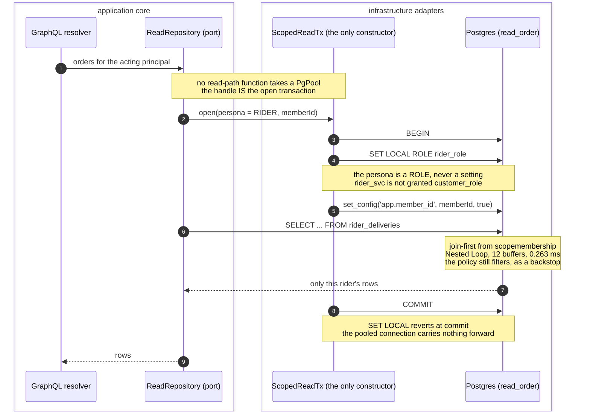
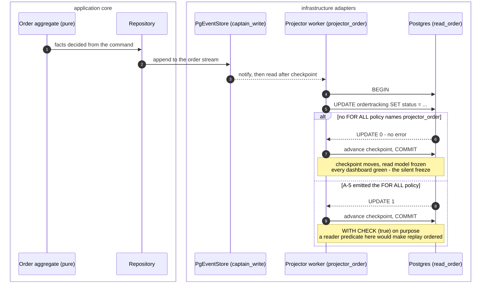
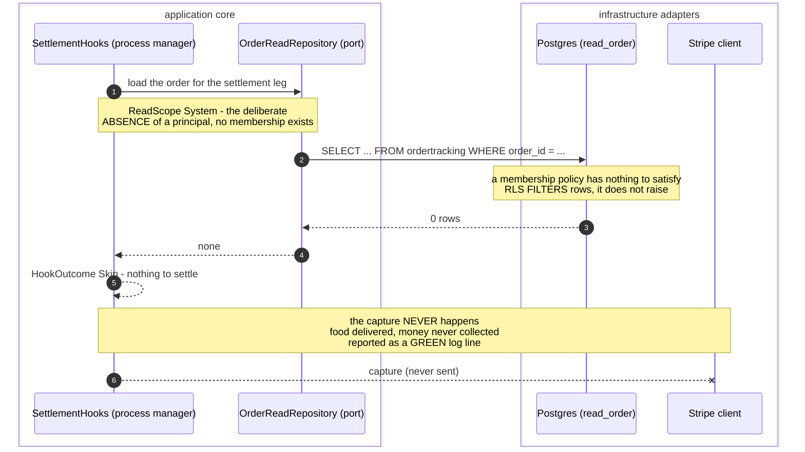
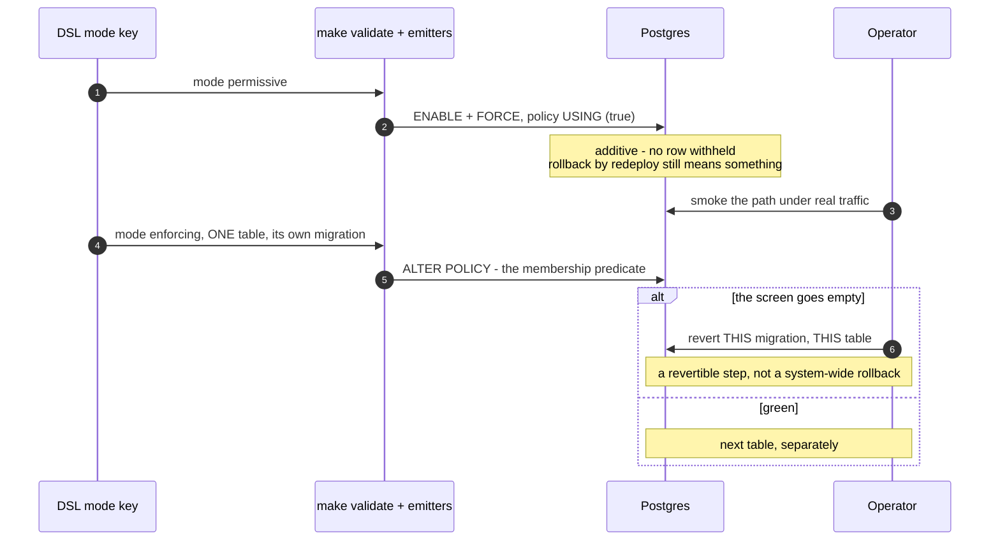

# PROP-20260818-010343 — Database-level security: the measured design (role-bound member type, join-first persona views, seven generated artifacts, seven gates)

- **Status**: Proposed
- **Date**: 2026-08-18
- **Tracking issue**: [#638 "Database-level security: the measured RLS design — role-bound member type, join-first persona views, seven generated artifacts and seven gates"](https://github.com/TheCaptainCompany/captain-food/issues/638)
- **Realized by**: _(filled at completion)_
- **Decided already, and NOT reopened here**: [ADR-20260818-004647](../adr/ADR-20260818-004647-database-level-security-lands-at-the-cutover-and-the-settlement-read-returns-to-scope.md) — database-level security lands **at the CloudNativePG cutover, on the empty database**, starting at `OrderConversation` and **not** at `OrderTracking`. This proposal answers *what is built*, never *when*.
- **Sequenced after**: [ADR-20260818-004646](../adr/ADR-20260818-004646-no-business-identifier-lives-in-the-identity-provider.md) — the identity ruling that creates `identity_binding` and makes §7 of this file necessary.
- **Composes with, does NOT replace**: [PROP-20260811-093000](PROP-20260811-093000-storage-boundaries-and-least-privilege-database-users.md) §6.1 — the **per-actor / per-app** role model. See **§5**, which states the composition as an explicit product of two axes rather than leaving two role models in the repo pointing at each other.
- **Adopts as its rollout**: [#637 "RLS voids the recorded rollback mechanism — ADR-0043's redeploy the previous app does not undo a policy"](https://github.com/TheCaptainCompany/captain-food/issues/637) (`farley`), see **§11**.
- **Concerns**:
  - [ ] **rider-own-data**: the persona column list for RIDER withholds `rider_payout_cents`, `rider_tip_cents` and `rider_thumb` in the held draft. Generating that list converts a product gap into an enforced, world-readable policy. **D-1 in §14 is a FOUNDER decision** and this concern stays unchecked until it is answered. No lens output here is legal advice or clearance.
  - [ ] **deliveryjob-unreachable**: `View_DeliveryJob` is a VIEW over `domain_events` in `captain_write`, which no persona role can reach. It needs a **placement** decision (**D-2**), not a SQL edit, and the rider's own-jobs guarantee stays application-enforced until that lands.
- **History**: this file is a LIVING document (ADR-20260801-020000). It always holds the clean current design; `git log -p` on the file is the history.

---

## 1. Why this file exists, and whose measurements these are

The founder asked for the SQL/RLS design. A first draft arrived **authored outside the team** on
2026-08-17 (the three held ADRs `ADR-20260817-232744/232745/232746`, **held and not deposited** per
ADR-20260818-004647). During the mob pass the **`dba` lens did not read the draft — it built it**:
a throwaway **PostgreSQL 16.13** cluster, the **real generated identifiers** (`scopemembership`,
`ordertracking` — the emitter creates unquoted identifiers, so they fold to lower case), 200k orders
and 400k memberships, and every case executed.

**Almost none of the draft survived contact.** Those numbers existed only in a session transcript.
This file is where they become durable, and every one of the seven CI gates in §10 is traceable to a
defect that was *executed*, not reasoned about.

**Provenance discipline for every number below.** A figure taken from that run is marked
**`measured (dba, PG 16.13)`**. A figure derived from an assumption is marked **`UNVERIFIED input`**
and names what it was derived from (ADR-20260817-105845). Nothing in this file states a bare number.

Two conventions this design leans on, both already in the repo and neither introduced here:

- **`View_*` is a SQL VIEW, unprefixed is a TABLE** (CLAUDE.md). Postgres has no policy object for a
  view, so the prefix is load-bearing for this whole subject.
- **`ScopeMembership` is the single authorization index** — one row per (scope, member), `replicated:
  read-databases`, i.e. projected into every `recovery: replay` database
  (`specs/database/tables/projection_tables.yaml`). Every predicate in this design resolves against
  it, in the caller's own database. No cross-database predicate is proposed anywhere.

### 1.1 The founder's own rationale — and it is not the one any lens gave

Stated by the founder on **2026-08-18**, verbatim:

> **"This will help us to avoid AI errors and unauthorised access."**

It gets its own subsection because **no lens in the mob pass produced the first clause**. Every lens
argued this subject as *defence in depth against an attacker* — a forged token, a stolen session, a
hostile tenant. The founder's argument is different, and for this repository it is the stronger of
the two: **row security still holds when a resolver written by an agent forgets its filter.**

That is not a hypothetical failure here. This codebase is largely agent-authored, so an omitted
`WHERE` clause in new code is a likelier event than a forged credential — and it is the failure
mode application-layer review is worst at catching, **because the code looks correct**. There is
nothing to notice: it compiles, the test written alongside it passes, and the diff reads as
intended. The register's own §39 IDOR-1 surface is the same observation counted from the other end
(antecedent: [DECISIONS §39](DECISIONS.md), which states that count with its antecedents) — that is
what *"the filter is something a human has to remember"* looks like at scale. A policy is applied by
the engine, once, to every statement any code will ever send.

**This is the rationale that best justifies building the layer EARLY**, while production is
suspended ([DECISIONS §45](DECISIONS.md) PROD-1) and the guarded databases do not exist yet. The
other rationales price the mechanism against attackers who are not attacking anything today; this
one prices it against a mistake the team makes in the ordinary course of every session.

**Two limits, so it is not overstated:**

- **It argues for BUILDING and PROVING the layer, not for applying it to a database that does not
  exist.** The sequencing ruling is untouched (ADR-20260818-004647): policies land at the
  CloudNativePG cutover, on the empty database. A property that catches forgotten filters catches
  nothing where there are no rows, and nothing here is a reason to rush a policy onto a populated
  table.
- **The property is conditional on §2 staying fixed.** If the member type comes from a caller-set
  GUC (**C-1**), the forgotten filter is joined by a settable string and the layer holds nothing. If
  the persona view is not **join-first** (**C-2**), the layer keeps correctness and loses the
  service at peak — its own kind of forgotten filter. The founder's argument is a reason to build
  *this* design, not row security in general.

---

## 2. The two blocking findings

### 2.1 C-1 — the persona split is decorative when the member type comes from a GUC

The draft's policy reads the member type from `current_setting('app.member_type')` — **a setting the
caller sets**. Nothing cross-checks it against the database role the caller is connected as.

**Measured (dba, PG 16.13).** On the rider service connection:

```sql
SET ROLE rider_role;
SELECT set_config('app.member_type', 'CUSTOMER', true);
SELECT count(*) FROM ordertracking;   -- 2 customer orders
```

Two customer orders, read by a rider connection. **The whole role tree is bypassed by one
`set_config`.** A role hierarchy that any caller can step outside of with a string is not a security
boundary — it is documentation with a `CREATE ROLE` in front of it.

**The fix: delete `app.member_type` entirely and bind the member type to the DATABASE ROLE.** One
policy per (table × role), with the member type as a **literal in the policy text**:

```sql
CREATE POLICY ordertracking_customer ON ordertracking
  FOR SELECT TO customer_role
  USING (EXISTS (SELECT 1 FROM scopemembership m
                  WHERE m.scope_type = 'ORDER'
                    AND m.scope_id   = ordertracking.order_id
                    AND m.member_type = 'CUSTOMER'          -- LITERAL, never a setting
                    AND m.member_id  = current_setting('app.member_id')::uuid));
```

**Never one policy naming four roles**, because the moment a policy has to work out *which* of its
roles is calling, the member type comes back as data. Four roles means four policies with four
literals. The emitter writes them, so the duplication costs nothing a human pays for.

**Why this actually holds.** *Measured (dba, PG 16.13):* the rider service connection attempting
`SET ROLE customer_role` gets `permission denied to set role`. Postgres itself gates the role change;
it does not gate a `set_config`. That is the entire difference between the two designs.

### 2.2 C-2 — an RLS predicate cannot drive a scan

*Measured (dba, PG 16.13), 200k orders and 400k memberships, a rider reading their own jobs.*

| Shape | Plan | Rows removed by filter | Buffers | Time |
|---|---|---|---|---|
| Persona view selecting `FROM ordertracking`, relying on the `EXISTS` policy | `Seq Scan` | 200,002 | 3,452 | **180.569 ms** |
| Persona view **joining from `scopemembership` first**, policy still enabled | `Nested Loop` over two index scans | n/a | 12 | **0.263 ms** |

Same rows out. Same policy in force as a backstop. **A factor the plan chose, not the predicate.**

The rule to record, and the reason gate G-2 exists:

> **RLS is the backstop; the query must carry its own selective predicate.**

An RLS policy is a filter the planner applies *after* it has decided how to get the rows. It is not
an access path. A generated persona view that selects `FROM <table>` and leans on the policy for
correctness is correct and is **a peak-time outage**: Friday 19:00–21:30 is exactly when the guarded
tables are largest and the customer is deciding on an ETA.

So the generated persona view is **join-first, by construction**:

```sql
CREATE VIEW rider_deliveries WITH (security_invoker = true) AS
SELECT t.order_id, t.status, t.estimated_dropoff_at        -- the persona column list, §9
  FROM scopemembership m
  JOIN ordertracking  t ON t.order_id = m.scope_id
 WHERE m.scope_type  = 'ORDER'
   AND m.member_type = 'RIDER'
   AND m.member_id   = current_setting('app.member_id')::uuid;
```

The `(member_type, member_id, scope_type)` index already declared on `ScopeMembership` is exactly the
one this drives. That index was put there for "everything this member may see" list-filtering
(PROP-20260725-185140 §3.4); it turns out to be the access path the whole design depends on.

---

## 3. The zero-row family — four distinct ways this design silently returns nothing

These are grouped deliberately. **Each of the four is indistinguishable from "there is no data"**,
and that signature has already cost this project nineteen nights once
([#622](https://github.com/TheCaptainCompany/captain-food/issues/622)). All four are
*measured (dba, PG 16.13)*.

**(1) Owner-executed view + `FORCE` + no policy for the owner.** Persona views owned by `migrator`,
tables under `FORCE ROW LEVEL SECURITY`, no policy admitting `migrator` ⇒ **0 rows for every caller**.
Three separate facts compose into it: a non-`security_invoker` view reads the underlying tables as its
**owner**; `FORCE` removes the owner's usual exemption; RLS is default-deny. And `security_barrier` does
not help — it is an **optimizer fence** that stops a cheap leaky function being pushed below the view's
qualifiers, **not an identity**.

**(2) `security_invoker = true`, then a staircase of three denials.** Switching the view to
`security_invoker` ⇒ `permission denied for table ordertracking`. Adding the column grants ⇒
`permission denied for table scopemembership` — because **policy expressions evaluate with the
caller's privileges**, so the caller needs its own grant on the table the predicate reads. Granting
that ⇒ `scopemembership` is itself `FORCE`d and has no policy for this role, so the subquery filters
to nothing ⇒ **0 rows again**. The third step is the one that reads as a data problem.

> **Consequence for the design: `scopemembership` is a policy-BEARING table, not just a predicate
> source.** Every persona role gets a self-rows `FOR SELECT` policy on it —
> `USING (member_type = 'RIDER' AND member_id = current_setting('app.member_id')::uuid)` — with the
> member type as the same literal as §2.1. Omit it and every persona view in the system returns
> nothing, correctly and silently.

**(3) `set_config(..., true)` outside an explicit transaction.** The `true` means *local to the
transaction*. Outside one, the statement is its own transaction: the setting is discarded the instant
it commits, the helper reads NULL, and the predicate matches **0 rows**. This is not a hypothetical
mis-use — it is the default behaviour of every connection helper that does not open a transaction
first, and it is why §8 makes the transaction unspellable-to-forget rather than documented.

**(4) `ScopeMembership` grant lag at order placement.** The membership row is written by a projector
folding `OrderPlaced`. Between the customer's payment and that fold, the customer's **own tracking
screen is blank**. A note saying "a missing row is safe" is true of a breach and **wrong about the
product**: *the ETA is the product*, and the blank screen lands in the seconds after the money moved
— the one moment the customer is most anxious. This is a **product** requirement on the design, not a
security one, and §12's first mockup is where it is answered.

---

## 4. The counterfactual that matters most — `FORCE` is the only flag between two opposite failures

*Measured (dba, PG 16.13).* With `NO FORCE`, the **same** design let the rider read **both** orders,
including one they hold no membership on. Not a filtered subset — a full cross-order read through a
view that looks correct on the page.

So a single per-table `ALTER` separates:

| Flag | Failure mode |
|---|---|
| `FORCE ROW LEVEL SECURITY` missing | **total cross-order leak** through a view whose text reads correctly |
| `FORCE` present, writer policy missing | **empty screen** (§3, §6) |

And `FORCE` is **invisible in the table DDL**. It is an `ALTER TABLE` that lives beside the `CREATE
TABLE`, not inside it — so **a newly generated projection table will not have it**. The read side gains
tables routinely: every new read model is a `projection_tables.yaml` entry away, and it is born
unFORCEd, wide open, with nothing on the page to notice.

That makes it a **generated invariant plus a CI assertion**, never a hand-written line
(artifact A-3, gate **G-3**). The emitter emits `ENABLE` + `FORCE` for **every** table in every
`recovery: replay` database as a set operation over the placement catalog, and the gate asserts
`relrowsecurity AND relforcerowsecurity` for that same derived set. A table added tomorrow is covered
by the emitter that already ran, not by a reviewer remembering.

---

## 5. How this relates to PROP-20260811-093000 — two axes, one product, no second role model

`holub` named the competing model during the mob pass, and the register carries it
(ADR-20260818-004647 `Consulted:`). **This proposal does not propose a second role model.** It adds a
second **axis** to the one already on the table, and the two multiply:

| Axis | Answers | Where it is decided | The unit |
|---|---|---|---|
| **Per-app / per-actor** (PROP-20260811-093000 §6.1) | *which database, which tables, which verbs* | that proposal, unchanged | `actor_{Actor}`, `projector_{scope}`, `graphql_{scope}`, `migrator`, … |
| **Per-persona reader** (this file) | *which ROWS and which COLUMNS, within a table the app may already reach* | here | `customer_role`, `restaurant_role`, `restaurant_account_role`, `rider_role`, … |

They are orthogonal on purpose. The per-app axis is the **CONNECT wall** — a role that cannot connect
to `read_catalog` cannot read it, full stop, and no policy is involved. The per-persona axis only ever
operates **inside** a database the app already legitimately holds CONNECT on, and it narrows rows and
columns there. Neither can express the other: a CONNECT wall cannot say *"this customer's orders"*,
and a row policy cannot say *"this app has no business in this database at all"*.

**The composition, concretely.** The persona roles are **`NOLOGIN NOBYPASSRLS`** roles. An app
connects as its own per-app login role and issues `SET LOCAL ROLE <persona_role>` inside the scoped
transaction (§8). A login role is `GRANT`ed **only** the persona roles its role path serves — which is
what makes the C-1 measurement bind: `rider_svc` is not granted `customer_role`, so `SET ROLE
customer_role` is `permission denied to set role`, from Postgres, not from us.

**Stated honestly, because it is the residual.** That wall is per **login role**, so it is only a hard
wall where a login role serves **exactly one** role path. The repository convention is already
**role = path** (one composed schema per role at `/{role}/graphql`), so the decomposition can make the
grant set a singleton — and **it should be a deployment target that it does**. The monolith `server`
bin, which is the DEPLOYED runtime until the #358 cutover, is the case where it is not: one process
serves every path, so its login role holds several persona grants and the wall there degrades from
*"cannot be spelled"* to *"exactly one typed path spells it"* (§8). That is a dated residual attached to
a recorded cutover, not an open-ended one.

The alternative — one **login** role per persona, and therefore one pool per (read database ×
persona) — is stronger and is rejected in §13 D-A on a recorded collision: PROP-20260811-093000's
**connection-ceiling** concern already puts the post-cutover fleet at roughly 235 backends against a
`max_connections` of 220 (*that proposal's §8.3 figures, restated, not re-measured here*), and
multiplying pools by the persona count is the one change that concern cannot absorb.

---

## 6. Silent write failures — the projector and the migration that both report success

*All measured (dba, PG 16.13).* Under `ENABLE` + `FORCE` with only `FOR SELECT` policies present,
`projector_role` gets:

| Statement | Result |
|---|---|
| `INSERT` | **error** — loud, and therefore harmless |
| `UPDATE` | **`UPDATE 0`**, transaction commits, **no error** |
| `DELETE` | **`DELETE 0`**, silent |

This is the shape that matters, because **a projector's fold is mostly updates**. It keeps advancing
its checkpoint over a stream whose effects never land: the dashboards are green, the checkpoint lag is
zero, and the read model is frozen. At Friday peak that is order statuses that stop moving while
everything reports healthy — a monitoring path that can only fire when a signal *arrives*
(`observability-agent`'s defect class, CLAUDE.md).

And the same trap catches migrations: ***`migrator` running a backfill on its own table returns
`UPDATE 0`.*** A migration that reports success and changes nothing, recorded as applied in
`_sqlx_migrations`, forever.

**The fix, and why this form rather than `BYPASSRLS`:**

```sql
CREATE POLICY <table>_projector_all ON <table>
  FOR ALL TO projector_{scope} USING (true) WITH CHECK (true);
```

| Option | Pros | Cons | Verdict |
|---|---|---|---|
| **`FOR ALL … USING (true) WITH CHECK (true)`** | Visible in `pg_policies`, so it is greppable and assertable; generated from the same placement catalog as the grants; keeps the `NOBYPASSRLS` invariant intact for every role, which is what gate G-6 asserts | One more generated statement per table | **Chosen** |
| `ALTER ROLE projector_{scope} BYPASSRLS` | One statement, no per-table emission | Invisible in `pg_policies`; breaks the single crisp invariant *no application role bypasses RLS*, which is the cheapest gate in the set; a role attribute is not scoped to a table, so it also bypasses on every table it was never meant to | Rejected |

Three consequences, all of which are design commitments, not notes:

1. **`WITH CHECK (true)`, deliberately.** Inheriting the reader predicate as the writer's check makes a
   rebuild depend on `ScopeMembership` already being caught up **in the same database** — replay in the
   wrong order and every row fails its own check. A read model whose rebuild depends on another read
   model's checkpoint **is no longer a disposable projection** (`young`), and disposability is the
   property the entire read side is built on. This is ADR-20260818-004647 reason 4(b), and this clause
   is what keeps it closed.
2. **Backfills run as `projector_{scope}`, never as the owner.** The owner has no write policy, on
   purpose — so the `UPDATE 0` above is a *correct refusal* rather than a hole, and the migration must
   name the role that is allowed to write.
3. **Migrations are linted for DML against an RLS table** (gate **G-6**). A `UPDATE`/`DELETE`/`INSERT`
   in a migration file whose target is an RLS-bearing table, without an explicit `SET ROLE
   projector_{scope}` in the same file, fails CI.

`beck`'s note from the mob pass, adopted as the test order in §9: **the negative test comes first** —
*the projector cannot write when its policy is absent* — because otherwise the first green build is a
build with a stopped projection.

---

## 7. `identity_binding` — placement is the finding, not cost

ADR-20260818-004646 makes the `sub` → domain-id mapping ours: the token carries the auth subject and
nothing of Captain Food. That creates `identity_binding`, read on **every authenticated request**.

### 7.1 D-12 — the placement correction, and it is architectural

The held draft puts `identity_binding` in **`captain_write`**, while revoking CONNECT to
`captain_write` from all six user roles (*six is the draft's count — the draft is held, not
deposited, so this is an `UNVERIFIED input`; the derived set is in §7.3*). Those two clauses do not
compose. Together they mean **every authenticated read needs a second connection, to the database
that holds the irreplaceable log**:

- a **second pool checkout per request**, on the read path, at peak;
- **read-path load placed on the money-path database** — the one database whose `recovery` posture is
  `pitr` because its contents cannot be re-derived;
- and a **regression against the mechanism that already exists**: `by_auth_ref`
  (`CustomerReadRepository::by_auth_ref`, an indexed lookup on `Customer.auth_ref`) reads **in the same
  database as the query it authorizes**. The draft would make the new general mechanism worse than the
  one-role mechanism it generalises.

**Correct placement: authored write-side — ideally sourced from `IdentityBound` / `IdentityRevoked`
events — and PROJECTED into every `recovery: replay` database.** That is precisely the treatment
`ScopeMembership` already carries (`replicated: read-databases`), for precisely the same reason: an
authorization fact every read database must resolve locally. One placement class, two tables, no new
grammar.

*(The event names above are the natural shape, not a declaration: authoring them is a `specs/**`
change this proposal does not make. **D-3** in §14.)*

### 7.2 Schema defects — all measured, all shape, none of them cost

| Defect in the held draft | What it actually does | Fix |
|---|---|---|
| Unconditional `UNIQUE (issuer, subject, member_type)` | **Revoke-then-rebind is impossible.** A revoked staff member can never be re-onboarded: the revoked row still occupies the key | Partial unique index `WHERE status = 'ACTIVE'`, `INCLUDE (member_id)` — which also serves the per-request lookup **index-only** |
| No uniqueness on the member side | **Two subjects can bind to one `member_id` — an account-takeover primitive.** Bind a second auth subject to an existing member and you are that member | Partial unique index per member type, `WHERE status = 'ACTIVE'` |
| No shape CHECK on `status` / `revoked_at` | A row can be `ACTIVE` with a `revoked_at`, or `REVOKED` with none. Two sources of truth for the same fact | `CHECK` binding them, both directions |
| No closed-set CHECK on `member_type` | A typo mints a member type no policy will ever match — a zero-row family member with no diagnosis | `CHECK (member_type IN (…))`, the list generated from the `UserType` scalar's bindable subset |

```sql
CREATE UNIQUE INDEX identity_binding_active_subject
  ON identity_binding (issuer, subject, member_type) INCLUDE (member_id)
  WHERE status = 'ACTIVE';

CREATE UNIQUE INDEX identity_binding_active_member
  ON identity_binding (member_type, member_id)
  WHERE status = 'ACTIVE';
```

### 7.3 The grant split — because `INSERT` here is minting an identity

| Role | Privilege on `identity_binding` | Why |
|---|---|---|
| `command_runtime_role` | **`SELECT` only** | It resolves the mapping on every request. That is a read |
| `identity_lifecycle_role` | `INSERT`, `UPDATE` | Onboarding and revocation, and nothing else runs as it |
| everyone, always | **no `DELETE`, ever** | A binding's end is `status = 'REVOKED'` with a `revoked_at`. Deleting one destroys the audit trail of who was who |

**The reason the split is not fussiness:** `INSERT` into this table is **minting an identity**.
Granting it to the role that runs every command handler makes **every handler bug an
identity-forgery primitive** — an injection or a mis-scoped write anywhere in the command surface
becomes "bind my subject to their member id". The split costs one role.

A `BEFORE UPDATE` trigger allowing only `status` and `revoked_at` to move is **recommended**: it makes
"an update repointed `member_id`" unrepresentable rather than reviewable. It is `WHEN`-clause cheap and
it is the same instinct as §8 — prefer the thing that cannot be spelled.

### 7.4 The cost, and the decision not to cache

*Measured (dba, PG 16.13):* **~0.05 ms**, index-only, per lookup. Against an **estimated ~10 rps at
peak** — **`UNVERIFIED input`**, derived from assumed order volume, not from any measurement, and it
must not be requoted as a fact — that is **~0.05% of one core**.

**The conclusion to record: the lookup cost is a non-issue by three orders of magnitude. The
PLACEMENT was the issue.** ADR-20260818-004646 states the price of this ruling as *"the enforcement
slice's zero I/O at peak claim dies with it"*, which is true and stays true — but the I/O in question
is 0.05 ms of index-only read in a database the request is already connected to, once §7.1 is applied.

**No cache in V0.** Two reasons, and the second is the one that decides it:

1. 0.05 ms does not justify a cache. There is nothing to buy.
2. **A cache on the identity path is a revocation-latency liability.** Its TTL becomes the window in
   which a revoked binding still authenticates — the one property this table exists to make
   immediate. Buying nothing and paying in revocation latency is a strictly bad trade.

If contention ever appears, the shape is **resolve once per session, not per request** — the same
answer, no new invalidation story, no window.

---

## 8. What must be a TYPE, not a discipline

Compiler-first (ADR-20260803-234035): before writing a gate, ask whether the type system can make the
mistake unspellable. Here it can, and the mistake is a member of the zero-row family (§3.3):

> **No read-path function may take a `&PgPool`.** The only way to obtain a scoped read handle is a
> constructor that **opens the transaction itself** and issues `set_config` **inside it**. Private
> fields. No other path, no escape hatch, no `Deref` to the pool.

That single rule makes two distinct bugs unrepresentable rather than reviewable:

- **"forgot the transaction"** — `set_config(..., true)` outside one, discarded on commit, 0 rows;
- **"configured a different connection than the one I queried"** — the classic pool bug, where the
  binding lands on connection A and the query goes out on connection B, and which no amount of review
  reliably catches because both lines look right.

The constructor also issues the `SET LOCAL ROLE <persona_role>` of §5 in the same transaction, so
persona and member id can never be set apart or on different connections. `SET LOCAL` reverts at
commit or rollback, which is what makes reusing a pooled connection safe.

**The accepted residual, written down rather than implied away.** `app.member_id` remains
**caller-settable**, and no `REVOKE` closes it: *measured (dba, PG 16.13)* — revoking execute on
`set_config` still leaves plain `SET LOCAL app.member_id`. There is no Postgres mechanism that makes a
custom GUC unwritable by the session that owns it. **The mitigation is that exactly one typed path
issues the binding**, and that path is the constructor above. RLS does not close this, and this file
does not pretend it does. It is the reason §5's persona-role wall matters: the member *type* is not
caller-settable, so the residual is bounded to *"a compromised connection can claim another member of
the SAME persona"*, not *"any row in the database"*.

---

## 9. The artifacts — seven generated, and the hand-written remainder

**Everything below is emitted from the DSL by `tools/codegen-rs`, from the placement catalog
(`specs/database/databases.yaml`), the table declarations, `UserType` and the role model.** A
hand-written policy is the defect this whole file is about.

| # | Artifact | Contents | Closes |
|---|---|---|---|
| **A-1** | `roles.generated.sql` | `CREATE ROLE` for every per-app role and every persona role. Persona roles are `NOLOGIN NOBYPASSRLS`. The `GRANT <persona_role> TO <app_login_role>` edges, derived from role paths | §5 |
| **A-2** | `grants.generated.sql` | `REVOKE CONNECT, TEMPORARY … FROM PUBLIC` per database, then the explicit per-role `GRANT CONNECT`, then table and **native column** grants (`GRANT SELECT (cols)`) | §10, §11.3 |
| **A-3** | `rls.generated.sql` | `ENABLE` **and** `FORCE ROW LEVEL SECURITY`, emitted as a **set operation over every table in every `recovery: replay` database** — never per-table by hand | §4 |
| **A-4** | `policies_read.generated.sql` | One policy per (table × persona role), member type a **literal**, carrying the `mode:` of §11 | §2.1 |
| **A-5** | `policies_write.generated.sql` | One `FOR ALL TO projector_{scope} USING (true) WITH CHECK (true)` per table | §6 |
| **A-6** | `views_persona.generated.sql` | The **join-first** persona views, `security_invoker = true`, one per (table × persona), each selecting that persona's column list | §2.2, §3.1, §3.2 |
| **A-7** | `identity_binding.generated.sql` | The table, both partial unique indexes, both CHECKs, the column-restricting trigger and the three-way grant split | §7 |

**The hand-written remainder** — deliberately small, and each item is hand-written because it is not
derivable from the DSL:

- the **CNPG cluster manifests'** role bootstrap hook, which invokes A-1/A-2 at database birth;
- the **cutover runbook**, including the `pg_terminate_backend` sweep of §11.3 and the order in which
  A-1…A-7 are applied;
- the **Rust `ScopedReadTx` constructor** of §8 — a type, not SQL, and the one place a human writes
  the `set_config` and the `SET LOCAL ROLE`;
- the per-table **`mode:` value** (§11) — a decision per table, recorded in the DSL, consumed by A-4.

*Role authentication material is out of scope of this document and is not described in it: this
repository is public.*

---

## 10. The seven CI gates — one per measured defect

Each row names the measurement that earned it. A gate with no measured defect behind it is not in
this table.

| Gate | Assertion | Earned by |
|---|---|---|
| **G-1** `no-member-type-guc` | No policy expression and no application call site references `app.member_type`. The identifier must not exist in the tree | **C-1** — 2 customer orders read on a rider connection (§2.1) |
| **G-2** `persona-view-joins-membership-first` | Every generated persona view's `FROM` begins at `scopemembership`, and the behaviour test's `EXPLAIN` contains **no `Seq Scan`** on the guarded table | **C-2** — 180.569 ms vs 0.263 ms (§2.2) |
| **G-3** `every-read-table-is-forced` | For the derived set *every table in every `recovery: replay` database*: `relrowsecurity AND relforcerowsecurity` | **The counterfactual** — `NO FORCE` leaked both orders, and `FORCE` is invisible in the table DDL (§4) |
| **G-4** `no-forced-table-without-an-applicable-policy` | No relation has `relrowsecurity = true` with **zero applicable policies** for a role that holds `SELECT` on it | **Zero-row family 1 and 2** (§3), and it is [#637](https://github.com/TheCaptainCompany/captain-food/issues/637)'s own proposed assertion |
| **G-5** `every-writer-has-a-write-policy` | Every table a `projector_{scope}` role holds `INSERT`/`UPDATE`/`DELETE` on has a matching-command policy for that role | **`UPDATE 0`, commits, no error** (§6) |
| **G-6** `no-bypass-and-no-owner-dml` | No application role has `rolbypassrls` or `rolsuper`; **and** no migration file contains DML against an RLS-bearing table without an explicit `SET ROLE projector_{scope}` | **`migrator` backfill returned `UPDATE 0`** (§6) |
| **G-7** `connect-is-revoked-from-public` | Every database revokes `CONNECT, TEMPORARY` from `PUBLIC`; the per-role `GRANT CONNECT` set equals the derived reader set; **a `REVOKE CONNECT … FROM <role>` that revokes nothing is an error** | **The `REVOKE CONNECT` no-op** (§11.3) — and this one is recorded as *a gate doing its job*: the check catches the false claim |

**G-7 deserves its framing.** `REVOKE CONNECT … FROM <role>` is a **no-op**: `CONNECT` is granted to
`PUBLIC` by default, so revoking it from a role that was never granted it **succeeds and changes
nothing** — *measured (dba, PG 16.13)*: `has_database_privilege` still returns true afterwards. The
draft's process-manager isolation claim is therefore **false as written**. It is recorded here as a
**gate doing its job** rather than as a defect list entry, because the check proposed alongside the
draft is exactly the thing that catches it.

---

## 11. Rollout — a policy is subtractive, and the recorded rollback does not undo it

### 11.1 The finding (`farley`, [#637](https://github.com/TheCaptainCompany/captain-food/issues/637))

[ADR-0043](../adr/0043-db-migration-release-strategy.md) Decision 3 makes rollback *"redeploy the
previous app"*, and Decision 4's `>=` readiness gate is what preserves it. **That holds only because
migrations are additive.** An RLS policy is **subtractive on reads**: the previous binary hits the same
policies and returns the same empty sets. The recorded rollback is a **no-op against this class of
change** — and the failure does not look like a failure, because zero rows is byte-identical to "the
projection has not caught up".

Landing at the cutover on an empty database (ADR-20260818-004647) removes the lock event and the
populated-table risk, which is why that sequencing is right. **It does not fix this**: the empty
database still receives the policies, and the first order after cutover is the first enforcing read.

### 11.2 The shape adopted

1. **Every generated policy ships `USING (true)` FIRST.** That is genuinely additive: row security is
   enabled, `FORCE` is on, the `SET LOCAL ROLE` and `set_config` path is exercised end to end under
   real traffic, and **no row is withheld** — so rollback-by-redeploy still means something.
2. **Tightening is a separate, per-table, reviewable, revertible migration.** One `mode:` key in the
   DSL expresses the whole thing: **`permissive` → `enforcing`**, per table, consumed by artifact A-4.
3. **`identity_binding` carries the two-step before it carries traffic.** It is read on every
   authenticated request, so it is the first table RLS could brick, and the one where an empty result
   set is an outage rather than a missing row.

This is *gate-then-stabilize* in its exact recorded form: the behaviour ships behind a per-table flag,
and flipping the default is a separate recorded decision after the gated form has been smoked.

### 11.3 Two operational facts the runbook owns

- **`REVOKE CONNECT, TEMPORARY ON DATABASE <db> FROM PUBLIC` first, then explicit grants.** Revoking
  from a role is the no-op of §10/G-7. Note `TEMPORARY` survives a `CONNECT`-only revoke, and a role
  with `TEMPORARY` can fill the disk out of a database it cannot select from.
- **Revoking CONNECT does not terminate existing sessions.** A held connection keeps working. The
  `pg_terminate_backend` sweep belongs in the **cutover runbook**, and it is the reason the runbook is
  in the hand-written remainder rather than the emitter.

### 11.4 Column masking — native grants, not generated views

`farley`'s second point, adopted: prefer **`GRANT SELECT (col, …)`** over generated per-role
`security_barrier` views for column masking.

| Option | Pros | Cons | Verdict |
|---|---|---|---|
| **Native `GRANT SELECT (cols)`** | Same outcome; **roughly half the migration surface**; no view-owner-vs-`FORCE` interaction to reason about; visible in `information_schema.column_privileges`, so it is assertable | Column-level `GRANT` errors are less legible than a missing view column | **Chosen** |
| Generated per-role `security_barrier` views | Reads as a tidy per-persona surface | Doubles the object count; drags in the owner-executed-view trap of §3.1 where a view owned by the table owner can return **nothing at all**; `security_barrier` is not `security_invoker` and the two get confused precisely here | Rejected for masking |

The **join-first persona views of §2.2 stay** — they exist for the *access path*, which a grant cannot
provide. The rejection above is specifically about using views as the *masking* mechanism.

---

## 12. Screen mockups — one per use case

### 12.1 Customer tracking, inside the `ScopeMembership` grant-lag window (§3.4)

The blank screen is not acceptable output. The membership row is *expected to be missing* for a moment
after payment, and the surface must say so.

```
+------------------------------------------+     +------------------------------------------+
|  Your order                              |     |  Your order                              |
|                                          |     |                                          |
|   (   nothing here   )                   |     |   Payment confirmed                      |
|                                          |     |   We are sending it to the kitchen...    |
|                                          |     |                                          |
|                                          |     |   [ spinner ]  updating in a moment      |
|                                          |     |                                          |
|  WRONG - indistinguishable from          |     |  RIGHT - the grant-lag window is a       |
|  "no such order" and from a breach       |     |  DECLARED state, not an empty result     |
+------------------------------------------+     +------------------------------------------+
   query: orderTracking(orderId)                    query: orderTracking(orderId)
   0 rows -> render nothing                         0 rows + placedAt within the window
                                                    -> render the accepted-not-yet-visible state
```

### 12.2 Rider job board — the guarantee that is NOT in the database (D-2)

```
+--------------------------------------------------+
|  My deliveries                          [ RIDER ] |
+--------------------------------------------------+
|  #4821  Pizzeria Vinci -> 14 rue Nationale       |
|         PICKED_UP        drop ~ 19:42            |
|--------------------------------------------------|
|  #4830  Le Bistrot     -> 3 place Plumereau      |
|         ASSIGNED         pickup ~ 19:55          |
+--------------------------------------------------+
   source: View_DeliveryJob  (a VIEW over domain_events, in captain_write)
   -> NO persona role holds CONNECT there
   -> "a rider sees only their own jobs" is enforced in the APPLICATION,
      not in the database, until D-2 is decided.  Recorded, not assumed away.
```

### 12.3 The rider's own money — the open decision (D-1)

```
+--------------------------------------------------+     the held draft's RIDER column list
|  Delivery #4821 - what I earned                  |     WITHHOLDS all three of these:
|                                                  |
|   Payout .......................  4.60 EUR       |       rider_payout_cents
|   Tip ..........................  2.00 EUR       |       rider_tip_cents
|   Customer rating ..............  [ thumb up ]   |       rider_thumb
|                                                  |
|  THIS SCREEN DOES NOT EXIST TODAY.               |     Generating the withholding list turns a
|  There is no rider earnings surface.             |     PRODUCT GAP into an ENFORCED policy.
+--------------------------------------------------+
```

### 12.4 What a gate failure looks like — the CI surface (§10)

```
$ make validate
ERROR  rls-force-missing        specs/database/tables/projection_tables.yaml#/RiderPayoutLedger
       table lands in read_order (recovery: replay) and A-3 emits no FORCE for it.
       A table without FORCE ROW LEVEL SECURITY is readable ACROSS members by any role
       granted SELECT - measured: NO FORCE returned BOTH orders to a rider holding one
       membership.  G-3.
ERROR  rls-writer-policy-missing  ordertracking / projector_order
       projector_order holds UPDATE but no FOR ALL policy names it.
       UPDATE would return "UPDATE 0" and COMMIT - the projection freezes silently.  G-5.
2 errors
```

---

## 13. Sequence diagrams — the load-bearing flows

### 13.1 An authenticated persona read, end to end



<a href="https://mermaid.live/view#pako:eNptVF1v2zAM_CuEX5oCTrZ1wB6CLcDWZkGAtPFcPw4IGEuOtdqiRsn9QNH_XspOlnZtXhxb5PHuePZjUpLSyRQSr_922pb6wuCOsf1tQX7YBbJdu9U83G_pHtC5xpQYDFkoifVw4pCDKY1DGyAH9LBgdPWvFbD21NweAF6WZbEs16hy7cibQPwAI0ccTodabdVxqrEVow_claFjDajQBc3-LWoRUa9LclpF7OIeRqHWQLZ5ELp2gCA-fYfPIrZm5MNOSMOIpX1DrDS_JDT8zcezWTaF_tRDRQxxCJbB2B04NjZiNkPtFQWZLxZAlhZTsAQReeww1FB1tuydDHgjMxGyXUbUfN3yh1lErNGqRsPyuscXUVLJaD32XQN-JlwENx6OnNAhi_AN8uXFPE-h1XF7S7WXUETeiyn8mC-WV68fXc8LWK3Pv68gX6_mwEakbZga_b-KIo3lkc9hmonMY1cKVscSBK9D9KIXMkD52zIWWgogAbNBKyg7H6h9NebARvo3sq7K7EYnkrjJoGNj1MlRUypedPr06MIgYzU_L2AymcDPfH2516F0Y4SY0f7NTqTnDxk7rgz7ABVTCz7GZ5jia-N6EVfaR8orIpfCpzPYdlUlxyl8nJx9-Qyt_7czR_J-PIAPpmmgMk3oyzB6tMXyRiS7PeXFeB-jGM5Qizs92xO50p1_bcj5-vJyWby_i-PqONofZFSQsLetCS9YiccqvgJWD5ErkaMhcSN1jK2k-A5ZHeyUufm0J5KkkMiWWjRKvhSPicC1_TdD6Qq7JiRPT8-0pWyZ" target="_blank" rel="noopener noreferrer">Open this diagram with pan and zoom on mermaid.live — on github.com use Ctrl/Cmd+click or middle-click to get a NEW tab (GitHub strips target=_blank)</a>

### 13.2 The projector write leg, and the silent freeze it avoids



<a href="https://mermaid.live/view#pako:eNqtVE1v2kAQ_Ssjn4gEaXvoBbVIFNwGNQmWoeqlUjTsjs0W70d311AS5b9nbEPIl3qqL7bXbz7emze-S4SVlAwhCfSnJiNoqrD0qH8Z4AvraE2tV-S795X9C-hcpQRGZQ0I66n74tBHJZRDE2EMGGDuJXnAsvRUYiToudrT2WtwTq6B880GFa3fdxAy8lRSmcJjiL4WkZMASnSRfHidLF00ubIy3ZKJC87GdQWDUZmbnVfxrQayvI3x9jcJjoCd9RvuvOeOJze2ofJW69M20obIJAP0PKF8Bm5JdI_jwWjEHIdQoIgBJAklSULhrYa4JlZSazxyZiDD08WwEZuTQLQtqM0NLAQdB5QuBozM8iEYG1Wx7zc4A00ngAWLBGJNYuOsMrGLyPKmk-kQvqTfZtcvzn5k0_Ey7epEj2KjTAmLdMk1MdYBPsP5-fnBGlXkmvB1nsP48hKcZVPswaBmJV5I1wW0xKbHdg-V3sOgyULe2yewx35QbpE9-YREHybzq6vZ8gS-tuwuu2WqWd5vgk5g0Hwe-p0cmo1eNYLfkvm08u9GxDF7kBjWK4teAg-RpRu0SgdVsYMYTXR7cDhVgXiMH4G0ipFn1-Ce0_8H0Q__i93P2fICJhfp5Dv0eCPoDHgPebd4failhS1dDnCeZLOoBGviRdjZumIVcEMMcBXuuzGTfPRq0odEk9eoJP8R7hImqNt_g6QC6yom9_cPbCBc0g" target="_blank" rel="noopener noreferrer">Open this diagram with pan and zoom on mermaid.live — on github.com use Ctrl/Cmd+click or middle-click to get a NEW tab (GitHub strips target=_blank)</a>

### 13.3 Why no policy goes on `OrderTracking` before STO-9 — the money leg



<a href="https://mermaid.live/view#pako:eNptU9FOGzEQ_JXVPYGU0D5HLVJLjlKJhHAXtS-VkLE3icWd113vtUSIf-_aFygt3NPZ3tmZHY8fKksOqxlUCX8OGCzOvdmy6X8E0M8MQmHob5HH9S3dg4mx89aIpwCWGMeTaFi89dEEgdUCTIIWRTrsMcgF0V2Co8hkMSXoTTBb5OPXwOuMu2KH3KBxDUZKXoj3iiWWAwCD-yvGhw2bJDxYGRjBOBMFOb1u3cxz7xUl2TKqGFaCG8pUb-ho12UAYR8RbOd1hhfc4-9qMT09vZ5BR8aB7BBKM9gQl1V6nh463I6QJYmW_dKq1WKi0Dxka0k52n0S7GFaoA47r44bwQ-3_O700-e2Xp7VQBswENmHLLKbQCDoMV9N2vkIeO-THOa-VmXNfAZtfVmfreHk5ATOm6vFqFDY2DsftvD9om7qce_GO_iY6_7XmbuYlzSR9O73sFN7Asku9xGCpGlIm32R21y2cP71cl03LTD9ThPwAo6wAICNT4fENPPp6OD7UvckXfdWi5kWB3w2-rCXc3Q1iKVeHbtTNdN_RBTH33C6Xc-Kr1azkUOyrL_VjY4QI4ZUNG-IXLFdEegm0Cv5HgLmBpa6Dq2gK5WMOYnocj4MfGnqeqkJ2ELnX8q9z5RPdEdjn6RROK4mUPXIvfFO39xDpbL68vocbszQSfX4-AcQDTFj" target="_blank" rel="noopener noreferrer">Open this diagram with pan and zoom on mermaid.live — on github.com use Ctrl/Cmd+click or middle-click to get a NEW tab (GitHub strips target=_blank)</a>

### 13.4 The rollout, per table



<a href="https://mermaid.live/view#pako:eNp1Ustu20AM_BVCpxaV0btRGIgj1TVgWEGcHgr0stqlJcL7UHcpu0KQfy9lKXCLpLqtOBwOZ_ic6WAwW0KW8FePXmNBqonK_fQgn-o5-N7VGKd3pyKTpk55hgJUguKwAycMcMLhLWQzQpw6IZyVJaMY4ROgI2aM6R3G9Yh_CImbiO_Uq7FcdRgVBxE0AYrFarVZTiKk5CglOuNU20itWC-h3N-td6XM_lo93pc5dMGSHuD7YbvfwAeOPX6cGvZBJIYzRhjblDHEQgYL8AFiuMCFuG3Rmi91_LyKwdpa6RPUA0Q02NkwQGKyFhwqnyAFh9ySbybyalaTXBBHuBW9ilvovZF5EZUFjup4JP12MfTHELUw5VDtS2BVW8yBOEG4eHAkiTEF_-_Wd7un8hEeqt32_oesMA50OGaZWuqgE8mkJZI5actXRNIR0UMTMElSHc-p_q0_ohjE8PRte7iNzqf3Vdmt5eZnlV8dnZtJUGIVdrk4y_I7DfJyiwvJsq--TjRoE0Izivo_rcff_GpKQjkZWcvOytGbLIfMyWkoMnLpz5ns6a43b_CoesvZy8sfDEP9ag" target="_blank" rel="noopener noreferrer">Open this diagram with pan and zoom on mermaid.live — on github.com use Ctrl/Cmd+click or middle-click to get a NEW tab (GitHub strips target=_blank)</a>

---

## 14. Options considered

### D-A — how a connection acquires its persona

**Final vision first**, and the final vision here is *the persona is a database role*; the two options
differ only in **how** a connection gets one.

| Option | Pros | Cons | Verdict |
|---|---|---|---|
| **A. Persona is a `NOLOGIN` role; app connects as its per-app login role and issues `SET LOCAL ROLE` in the scoped transaction** | Composes cleanly with the per-app axis already decided (§5); **no new pools**, so the recorded connection-ceiling concern is untouched; `SET LOCAL` reverts at commit, so pooled connections are safe; the wall is hard wherever a login role serves one role path, which `role = path` makes achievable | Where one process serves several role paths — the monolith `server` bin until the #358 cutover — its login role holds several persona grants, and the wall degrades to *"exactly one typed path spells it"* (§8) | **Chosen** |
| B. One **login** role per persona, one pool per (read database × persona) | The strongest possible wall: `permission denied to set role` is enforced at authentication, per connection, with no grant graph to get wrong | Multiplies pools by the persona count against a **recorded** ceiling — PROP-20260811-093000's connection-ceiling concern already sits at roughly 235 backends vs `max_connections` 220 (*that proposal's figures, restated*). It is the one change that concern cannot absorb | Rejected — externally forced, and A is the same shape without the pools |
| C. Member type from `current_setting('app.member_type')` (the held draft) | One connection, no roles to manage | **C-1**: measured bypass, 2 customer orders on a rider connection. The role tree becomes decorative | Rejected |

### D-B — the persona view's access path

| Option | Pros | Cons | Verdict |
|---|---|---|---|
| **Join-first from `scopemembership`, policy retained as the backstop** | 0.263 ms, 12 buffers, `Nested Loop` on two index scans; drives the index `ScopeMembership` already declares; RLS still enforces if the view is ever wrong | Two objects must agree on the predicate — which is exactly why both are **generated from one declaration** | **Chosen** |
| `SELECT FROM <table>`, correctness left to the policy | Shortest generated SQL; obviously correct on the page | `Seq Scan`, 200,002 rows removed, 3,452 buffers, **180.569 ms** at 200k orders. A peak-time outage in a view that reviews clean | Rejected |

### D-C — the projector's write path

Presented in full in §6: `FOR ALL … USING (true) WITH CHECK (true)` **chosen** over `BYPASSRLS`,
because a policy is visible in `pg_policies` and a role attribute is not, and because keeping
`NOBYPASSRLS` universal is what makes gate G-6 a one-line invariant.

### D-D — column masking

Presented in full in §11.4: native **`GRANT SELECT (cols)`** chosen over generated `security_barrier`
views.

---

## 15. Drawbacks — why we might regret the whole thing

- **A second correctness surface that is invisible in the application.** After this, a query can be
  correct, compile, pass review and return nothing, for a reason that lives in `pg_policies`. Every one
  of the seven gates exists to buy that back, and gates are a cost too.
- **The zero-row signature is now systemic.** §3 lists four ways; the four are the ones that were
  *found in forty minutes*. The honest posture is that the list is a **lower bound**, and the
  authorization-matrix test of §16 is the only thing that keeps discovering members of it.
- **Two coupled generated objects per (table × persona)** — a view and a policy that must agree. They
  are generated from one declaration, so they cannot drift, but the object count on a read database
  grows by a factor the operator will feel in `\d` output and in migration times.
- **It does not cover the surface people assume it covers.** `View_DeliveryJob` — the rider's job board
  — is out of reach by construction (D-2), and `CustomerCreditBalance` cannot be spelled at all until
  `ScopeType` gains a customer-keyed member (ADR-20260818-004647 reason 3). Shipping database-level
  security while two persona-critical surfaces stay application-enforced is a **communication hazard**
  inside the team as much as a technical one.
- **The residual of §8 is permanent.** `app.member_id` stays caller-settable. No amount of further
  work in this direction closes it; only the typed path does.

---

## 16. The verification plan — the per-persona authorization matrix

**One behaviour test, against a real Postgres**, in the harness that already exists
(`crates/infrastructure/tests/main/common.rs`: `DATABASE_URL`, loud under `DB_TESTS_REQUIRED`).

For **each (persona, table)** pair, five assertions:

| # | Assertion | Catches |
|---|---|---|
| 1 | sees **its own** row | the whole zero-row family (§3) — this is the assertion that fails first when any of the four fires |
| 2 | sees **zero** for a foreign member | the ordinary breach |
| 3 | sees **zero** with **no context set** (fail-closed) | a request path that skipped the scoped transaction |
| 4 | sees **zero** when **claiming another persona's member type** | **C-1** — this is the assertion the held draft would have failed |
| 5 | **cannot read** a non-granted column | the column-grant surface of §11.4 |

Plus, per §6 and `beck`'s ordering note, **the negative test comes first**: *the projector cannot write
when its policy is absent* — asserted before any positive projector test, so a green build can never be
a build with a stopped projection. And per G-2, an `EXPLAIN` assertion that the persona view's plan
contains **no `Seq Scan`** on the guarded table.

> **`dba`'s note, and it is the argument for the whole section: every finding in this review came out
> of forty minutes of exactly that test.** Not review, not reading the draft — running the matrix.
> The test is not verification of the design; it is the instrument that produced it.

---

## 17. Unresolved questions

Copied into the tracking issue's checklist on approval, per `docs/proposals/README.md`.

- **D-1 — FOUNDER decision, not the team's.** Does the RIDER persona column list expose
  `rider_payout_cents`, `rider_tip_cents` and `rider_thumb`? All three are present on `ordertracking`.
  Data minimisation limits what the **controller processes**; it never justifies **withholding a
  subject's own data**. An invisible rating that feeds dispatch engages the Platform Work Directive's
  **algorithmic-management** chapter. And there is **no rider earnings surface today** (§12.3), so
  generating the withholding list converts a product gap into an **enforced, world-readable policy**.
  Raised by `legal-specialist`; **no lens output here is legal advice or clearance**.
- **D-2 — `View_DeliveryJob` placement.** It is a VIEW (`specs/generated/views.generated.sql`), so
  `CREATE POLICY` and `ALTER TABLE … FORCE` both refuse it — **loud at deploy, which is good**. But it
  reads `domain_events` in `captain_write`, which no persona role can connect to, so it is
  **unreachable by any persona role by construction**. Materialize it into `read_order`, or keep the
  rider's own-jobs guarantee application-enforced and say so. A placement decision, not a SQL edit.
- **D-3 — the `identity_binding` source events.** §7.1 recommends the table be projected from
  `IdentityBound` / `IdentityRevoked`. Authoring those events is a `specs/**` change this proposal does
  not make, and it is question 2 of the three-question test (an event shape, once emitted, is a
  migration).
- **D-4 — the bindable subset of `UserType`.** `identity_binding.member_type`'s closed-set CHECK is
  generated from the scalar, but the scalar has seven members and only some are bindable (`PUBLIC` is
  anonymous, `ADMIN` holds no `ScopeMembership` rows by declared rule, `EXTERNAL` is an ACL boundary).
  The bindable subset must be a **declaration** in the DSL, not a filter hard-coded in the emitter.
- **D-5 — `CustomerCreditBalance` has no matching `ScopeType`.** Closing it means widening the scalar,
  which touches the generated scalar, the `ScopeMembership` projector's fold and the guard's
  vocabulary (ADR-20260818-004647 reason 3).
- **D-6 — STO-9** ([DECISIONS §32](DECISIONS.md)) is a **precondition** of any policy on
  `OrderTracking`, per §13.3. It stays open and it stays inside this work rather than beside it.
