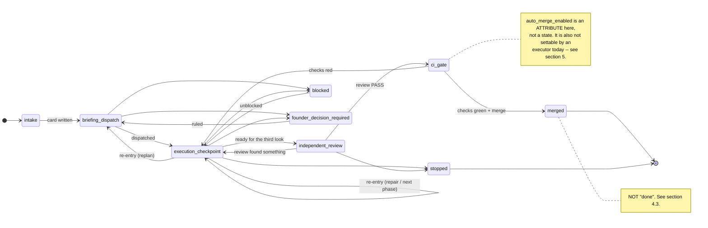
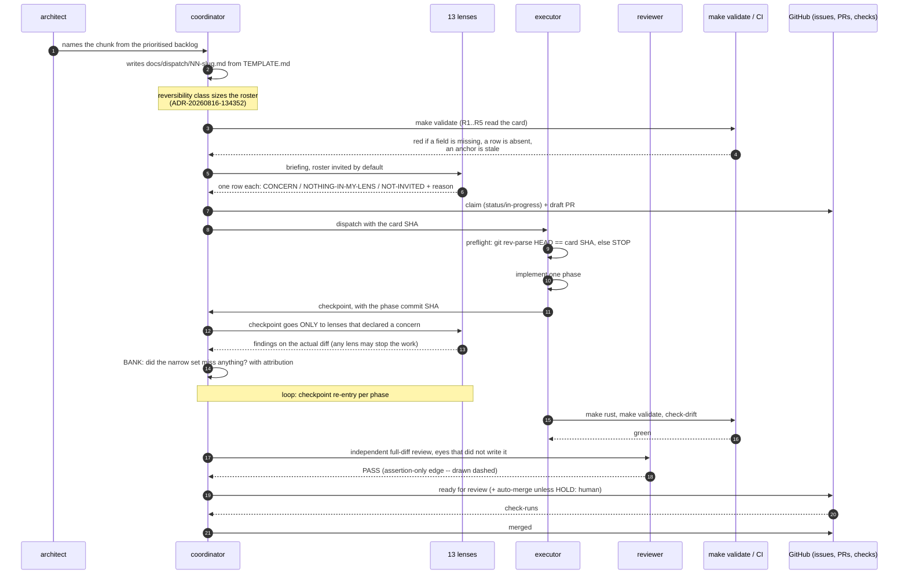
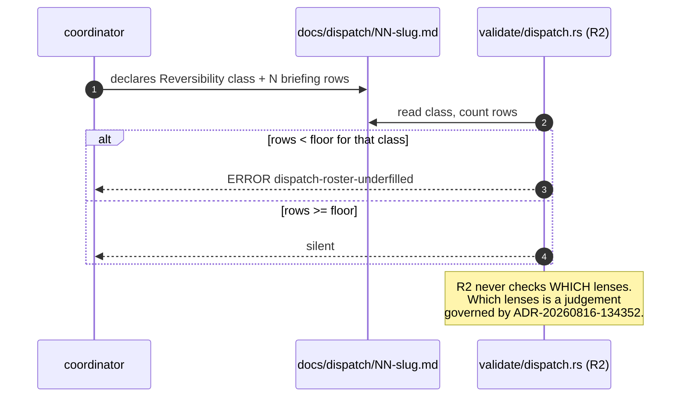

# PROP-20260818-013222 — Graph engineering for the team workflow: a template, a validator, and the document as the gate's doc comment

- **Status**: **Proposed — DEFERRED by founder decision, 2026-08-18. NOT dispatchable.**
  Resume condition: the work already in flight is finished. Verbatim: *"Thanks for the plan we will
  not apply it yet we will finish what we have started first."*
- **Date**: 2026-08-18
- **Tracking issue**:
  [#643 "DEFERRED — Graph engineering for the team workflow"](https://github.com/TheCaptainCompany/captain-food/issues/643)
  — created by the coordinator after this document landed, because the authoring session had neither
  `gh` nor a GitHub MCP tool and correctly refused to reach the REST API another way. It wrote #643 as
  a *guess* (the highest number referenced under `docs/` was 639) and flagged it UNVERIFIED; the guess
  happened to be right, which is luck and not a method. **The durable finding stands**: the
  `proposal-tracking-issue-missing` rule checks the link's *shape*, not that the issue exists, so a
  wrong number here would have passed the gate as a dead reference — an instance of §5's own argument,
  found in the act of writing §5.
- **Realized by**: (filled at completion)
- **Base**: `main` @ `8494e67` — every measured figure in this document was re-derived at that SHA on
  2026-08-18 and each one names the command that produced it.
- **Decision that ordered it**: founder, 2026-08-18, verbatim — *"If we put in place the graph
  engineering we will improve the efficiency so make the plan now."*

## Why this is deferred, and why both decisions are recorded

The `holub` lens, asked whether this was worth doing now, answered: **not until one order flows end
to end.** Its argument was that the walk is a single leg from the first end-to-end evidence this
product has ever produced, that process artifacts already outrun code here by more than two to one,
and that all four defects the mob caught that night were caught at the **briefing** — a rule that
already exists and already binds — not by knowing which state a work item occupied. Real yield,
wrong attribution.

The founder decided to proceed anyway: *"If we put in place the graph engineering we will improve
the efficiency so make the plan now."* This document is the result of that ruling.

He then decided, on reading it, to **finish the started work first**. So the plan stands, complete
and costed, and does not start.

Both decisions are kept because the sequence is the useful record: a lens measured against the work,
the founder overrode it, the plan was built, and the plan itself made the cost visible enough to
change the timing. Erasing either half would leave a document that looks like it was never
questioned.

> **Screen mockups do not apply and are deliberately omitted.** The
> [proposals README](README.md) requires one mockup per use case; this proposal changes a *process*
> and adds no actor-facing screen, no command and no query. Its user-visible surfaces are a markdown
> template, validator error strings and a CI annotation — reproduced verbatim in §8 and §10, which is
> the honest equivalent. Sequence diagrams DO apply and are in §6 and §7.

---

## 1. What was decided, and the dissent that is preserved

The founder has ruled: **build it.** This document is the implementation brief for that ruling.

**Recorded dissent — `holub` lens.** The recommendation measured against building this now was
**wait until one order flows end to end**. The argument, preserved as it was made: process
machinery is not the constraint; no order has ever gone through this system end to end, and
formalising the workflow that produces no orders optimises the wrong loop. The measured backdrop
supports the concern — §13's commit arithmetic shows process artifacts outrunning code changes
**2.4 to 1** over the last fortnight, and this proposal adds process artifacts.

**The founder has decided otherwise, and that is his call.** The dissent is recorded, not
relitigated, and it is not erased by the decision. Two consequences are carried forward into the
design rather than argued about:

- §14 sequences the work so the **cheapest, highest-yield phase lands first** and each later phase is
  independently abandonable. If the walk (#556) needs the time, phases 3–5 can be dropped without
  stranding phases 1–2.
- §5's rule — *a gate that cannot go red is worse than none* — is the direct technical form of
  holub's concern. Every rule proposed here had to survive a mutation test before earning its place,
  and **two proposed rules were killed by that test** (§9).

---

## 2. The premise, verified: a prose graph fails open, and this repo has the proof

`CLAUDE.md:120` states, in the resident index that every session loads:

> Agents live in `.claude/agents/`; gates are hooks in `.claude/settings.json`.

**Re-derived at `8494e67`:**

- `grep -n -i "hook" .claude/settings.json` returns **nothing**. The string does not occur.
- `grep -rln '"hooks"' .claude/` returns **nothing**. There is no `hooks` key anywhere under
  `.claude/`, in `settings.json` or any other file. There is no `settings.local.json`.
- `.claude/settings.json` is a `model` key, a `disabledMcpjsonServers` key and a `permissions` block
  of `deny`/`allow` path and command patterns. That is the whole file.
- Four shell scripts do exist in `.claude/hooks/` — `loop-budget.sh`, `loop-budget-selftest.sh`,
  `stop-gate.sh`, `validate-generated.sh` — but **nothing wires them**. They run when an agent's
  prose tells it to run them.

So a load-bearing claim in the resident index — the sentence that tells every session where the
gates are — is **false**, and **nothing ever went red**. No test asserts it. No validator reads it.
It has been read by every session on this repo and enforced by none.

This is the entire argument for the proposal's shape, and it is not an analogy: **prose describing a
system's control flow decays silently, and the decay is invisible precisely because prose cannot
fail.** A "team graph" written as a document would acquire exactly this property on day one. The
only version worth building is one where the graph's claims are the doc comments on executable
rules, so that a claim going stale makes something red.

**Corollary that shapes §3**: this proposal must not add a *sixth* prose authority. See §3.5.

**A second, live instance, met while writing this document.** The dispatch cited
`docs/claude/sessions.md:1612` for the rule that agent-definition changes need in-conversation
approval. The rule exists and says what was claimed — but it is at **line 1638**, not 1612. A
26-line drift, in a citation issued the same week. Nothing could have caught it, because a line
number is not checkable without an anchor. That is §9's finding arriving unbidden.

---

## 3. The change set

Five files. No new runtime dependency, no new service, no database, no hosted orchestrator. Every
rule runs inside `make validate`, which is already a blocking gate in CI's `codegen` job.

### 3.1 `docs/dispatch/TEMPLATE.md` — one dialect, and a briefing table where silence is one token

**The measured problem.** Nine cards exist in `docs/dispatch/`. They spell the same fields three
different ways; verified at `8494e67` by grepping each field's line-start form:

| Field | Spellings found | Cards using each | Cards with no such field |
|---|---|---|---|
| Base commit | 3 — `**Read at**`, `- **Base**`, `- **Card SHA stamp**` | 4, 5, 1 (609 carries two of them) | 0 |
| Issue | 2 — `- **Issues**`, `- **Issue**` | 3, 2 | 4 (in the H1 only) |
| Briefing roster | 3 — `- **Roster**`, `- **Briefed**`, `- **Briefing roster**` | 1, 2, 1 | 5, of which 1 states it in prose only |
| Reversibility class | 1 — `- **Reversibility class**` | 5 | 4, which use `**Artifact class**` instead |
| Merge posture | 1 — `- **Merge posture**` | 2 | 7, of which 2 fold it into the class line |

**No rule can read this corpus.** That is why the template lands before the validator and not
alongside it: five rules over three dialects is five rules that each have to be wrong in three ways.

**The briefing table is the load-bearing part.** Thirteen rows, one per lens, and **silence is one
token**:

| Lens | Verdict |
|---|---|
| `beck` | `NOTHING-IN-MY-LENS` |
| `business-specialist` | `NOT-INVITED: reversible internal, no customer-facing surface` |
| `dba` | `CONCERN` — one line, then a link to the finding |
| ... | ... |

Roster size is derivable and is **13**: `ls -1 .claude/agents/` yields **16** files, minus the three
that are not lenses — `executor` (writes the diff), `reviewer` (the independent third look),
`architect` (names the chunk). The thirteen are `beck`, `business-specialist`, `dba`, `evans`,
`farley`, `generator`, `graphql-architect`, `holub`, `legal-specialist`, `observability-agent`,
`ux-designer`, `vernon`, `young`.

**Why a table and not a paragraph.** A card that says *"briefed the full roster"* and briefed seven
is unfalsifiable prose. A card with a thirteen-row table and seven rows is **a missing row in a
diff** — visible to a human reader, countable by a validator, and cheap for the lens that has nothing
to say. `NOTHING-IN-MY-LENS` is a complete answer under
[ADR-20260809-013142](../adr/ADR-20260809-013142-mob-programming-every-agent-is-in-the-dev.md), and
this keeps it a complete answer that costs one token instead of a paragraph. **Silence stays cheap;
it stops being indistinguishable from absence.**

### 3.2 `tools/codegen-rs/src/validate/dispatch.rs` — five rules

Modelled **exactly** on `tools/codegen-rs/src/validate/proposals.rs` (343 lines, read in full while
writing this). That file is the precedent for every structural choice: a tolerant `read_dir` loader
returning `Vec<(String, String)>`, pure rule functions over `(path, content)` so unit tests feed
fixture strings, `err(code, path, message)` issues whose message says what to do, and severities
**calibrated against the committed corpus** so the gate stays 0-error without grandfathering any rule
down to a warning. Rules in §8.

It also sets the standard for the doc comments. `proposals.rs` §13b spends eighteen lines explaining
that a pipe inside a code span still opens a table cell, *including* what it deliberately does not
model and why the conservative reading costs nothing on the current corpus. That is the target
register.

### 3.3 One preflight line in `.claude/agents/executor.md` — **proposed only, not written**

`git rev-parse HEAD` must equal the card's declared base SHA, or the executor stops and reports
rather than implementing against a tree the card does not describe.

**This proposal does not include the edit.** `docs/claude/sessions.md:1638` records that the
permission classifier blocks any `git add`/`git commit` whose pathset includes `CLAUDE.md` or
`.claude/agents/*.md`, for subagents and the main session alike, until the user approves in
conversation — and that the block is on the *pathset*, not the tree, so a worktree does not exempt
it. The recorded cost of learning this was one stopped executor, one denied retry and a founder
round-trip. So the line is specified here and lands only with in-conversation approval, on its own
commit.

### 3.4 A scheduled dead-man's-switch workflow — fires on **absence**

Same shape and roughly the same cost as `.github/workflows/stale-claim-reaper.yml`: a cron
(`17 * * * *`, deliberately off the `:00` rush), `actions/github-script@v7`, `permissions: issues:
write`, a `<!-- marker -->` comment so its own output never counts as activity, and
`.catch(() => {})` on the mutation so one bad row does not abort the sweep. Copy that file's
structure; it is the working precedent for exactly this.

The reaper answers *"a claim went quiet"*. This one answers the class the reaper cannot see: **a
graph state that stopped emitting** — briefed with no checkpoint, checkpoint with no review, review
passed with no merge. Tracked as [#642](https://github.com/TheCaptainCompany/captain-food/issues/642)
(`UNVERIFIED input` — this session could not reach GitHub to confirm that issue's number or subject).

This is the defect class named in CLAUDE.md's no-polling rule: *a monitoring path that can only fire
when a signal ARRIVES goes quiet exactly when it should scream.* It also sits squarely inside the
rule's permanent **monitoring carve-out** — monitoring keeps a poll, with no exit, because for a
monitor silence is ambiguous. This workflow is not a status poll standing in for a push; it is the
dead-man's switch that makes the absence of push observable.

### 3.5 `docs/claude/team-graph.md` — the derivation, and how it avoids being a fifth authority

The narrative of **why each rule exists**, each linked to the failure that earned it. Not a rulebook.

**The risk, stated plainly.** Four files already claim authority over how the team works: `CLAUDE.md`
(the resident index, explicitly authoritative over the others), `docs/PLAYBOOK.md` (268 lines),
`docs/claude/autonomous-run.md` (123 lines, and its own opening line concedes *"every rule there is
authoritative over this file"*), `docs/claude/loops.md` (153 lines). A fifth is a real cost and §2's
finding is that documents which describe control flow decay silently.

**Three constraints keep it from becoming one, and they are testable:**

1. **It states no rule that is not implemented in `dispatch.rs`.** Its sections are named after rule
   codes. If it describes behaviour, the behaviour is in the gate.
2. **It is the doc comment, not the source.** Where `proposals.rs` puts eighteen lines of GFM
   reasoning above the code, `team-graph.md` holds the equivalent for the workflow rules, because it
   is longer than a Rust comment should be and needs mermaid. Each `dispatch.rs` rule links to its
   section; each section names its rule code. **A section whose rule code no longer exists is caught
   by rule R5 (§8).** That is the one mechanism that makes this different from the other four files.
3. **It adds nothing to the resident set.** `CLAUDE.md` gains one entry in its existing topic-file
   list. Nothing is copied up.

---

## 4. The state model — thirteen collapse to eight

```
intake -> briefing/dispatch -> execution-checkpoint* -> independent-review -> ci-gate -> merged
```

plus the three off-path states `blocked`, `founder-decision-required`, `stopped`.

### 4.1 What was cut, and why each cut is a modelling correction

| Removed | Why it is not a state |
|---|---|
| `repair` | A **re-entry**, not a state. The work re-enters `execution-checkpoint`. Modelling it separately loses information; a fold over transitions gives *"entered checkpoint the second time"* for free, which says strictly more than a flag named `repair`. |
| `replan` | Same: a re-entry to `briefing/dispatch`. The interesting fact is *how many times*, and a re-entry count carries it. |
| `split` | An **edge** — one chunk becomes two, each with its own card. It is a transition producing two successors, not a resting place. |
| `merge-supervision` | An **attribute** of `ci-gate`, `auto_merge_enabled: bool`, not a successor. Under [ADR-20260815-115220](../adr/ADR-20260815-115220-auto-merge-on-green-by-default-hold-human-for-the-named-class.md) the supervision *is* the CI gate with a flag set. Also see §5's note: the flag is currently unsettable by an executor. |
| `customer-decision-required` | **Renamed** `founder-decision-required`. In this codebase a customer orders food; the word is domain vocabulary and belongs to the ordering context (`evans` lens — ubiquitous language, one word one meaning). |

Eight states, and the collapse is not cosmetic: **each cut replaces a categorical state with a
countable fold over transitions**, which is the same move CLAUDE.md's business-metrics rule makes
about counters — a fold replays and answers questions the state name never could.

### 4.2 The graph



### 4.3 `farley`'s concern, carried and sharpened: **`done` must not mean merged**

The concern as raised: nothing has deployed in fifteen days; `deploy.yml` has run four times ever; so
either rename `done` to `merged` and add a `deployed` state with a real evidence source, or the graph
certifies a pipeline that stops short of production.

**Verified here, and it changes the remedy rather than weakening it.**

- The last-run count is `UNVERIFIED input` — no GitHub access this session. The last commit touching
  `.github/workflows/deploy.yml` is `16de7c3`, 2026-08-12.
- `deploy.yml` is **`workflow_dispatch` only**. Its own header says why, and the reason is a decision,
  not neglect: *"Render can be unable to receive a deploy... When that happens nothing should
  auto-run against production."*
- Production is **deliberately suspended** by founder decision — `DECISIONS §45 PROD-1`,
  [ADR-20260817-105844](../adr/ADR-20260817-105844-the-walk-goes-first-on-one-database-and-production-stays-suspended.md).

So the first half of the remedy is adopted outright: **the terminal state is named `merged`, never
`done`.** The second half cannot be honestly satisfied today — a `deployed` state whose evidence
source is a manually-dispatched workflow against a suspended environment would be a state that never
fires, which is §5's forbidden shape wearing a different hat.

**The resolution, which preserves the whole of farley's point:** `deployed` is declared **out of the
modelled graph, with a named reason and a named trigger**, in `team-graph.md`, in one sentence the
reader cannot miss: *"This graph ends at `merged`. It does not model delivery to production, because
production is suspended under PROD-1 and `deploy.yml` is manual. When PROD-1 is lifted, `deployed` is
added with `deployment_status` as its evidence source, and `merged` stops being terminal."* An
honest, dated boundary is a different artifact from an unstated one. **What the graph must never do
is call `merged` "done".**

---

## 5. Every edge carries its evidence source — and the ratio is the finding

Each edge is annotated with *what proves the transition happened*: `check-runs`, `timeline event`,
`label`, or `agent assertion`.

| Transition | Evidence source | Machine-decidable |
|---|---|---|
| `intake -> briefing/dispatch` | card file present in `docs/dispatch/` at a commit | yes |
| `briefing/dispatch -> execution-checkpoint` | `status/in-progress` label + claim comment | yes (label) |
| `execution-checkpoint` re-entry | phase commit on the branch | yes (timeline event) |
| `execution-checkpoint -> independent-review` | **agent assertion** | no |
| `independent-review -> execution-checkpoint` | **agent assertion** | no |
| `independent-review -> ci-gate` | ready-for-review timeline event | yes |
| `ci-gate -> merged` | check-runs conclusion + merge event | yes |
| `ci-gate -> execution-checkpoint` | check-runs conclusion | yes |
| `* -> blocked` | **agent assertion** | no |
| `* -> founder-decision-required` | **agent assertion** (a `DECISIONS.md` row follows) | no |
| `* -> stopped` | **agent assertion** | no |
| `blocked -> execution-checkpoint` | **agent assertion** | no |

**Five machine-decidable, six assertion-only** (one row is a re-entry family rather than a single
edge). **That ratio is the finding, and it is the most important output of this modelling exercise.**
Half the graph's transitions are things an agent *says* happened. Any tooling that renders them
identically is lying about its own confidence.

**So they are drawn differently** — solid for machine-decidable, dashed for assertion-only — in every
rendering, and `team-graph.md` states the count in the same sentence as the legend. A reader who sees
six dashed edges understands the graph's epistemic status in one glance; a reader who sees eleven
identical arrows does not.

**A measured aggravation on the one edge that looks safest.** `docs/claude/sessions.md` records
(2026-08-16, #609) that **GraphQL is blocked for these sessions and `gh` is not on PATH**, that
`markPullRequestReadyForReview` and `enablePullRequestAutoMerge` exist *only* in GraphQL, and that
`PATCH /pulls/{n}` with `{"draft": false}` returns **200 with `draft` still `true`** — it silently
ignores the field. So `independent-review -> ci-gate` has a genuine timeline event as its evidence,
but **an executor cannot currently produce it**, and the API it would naturally reach for reports
success while doing nothing. The graph must record that edge as coordinator-performed. This is
recorded here because a graph that assumes an actor can make a transition it cannot make is worse
than no graph.

---

## 6. The briefing to checkpoint to review path



Two properties of this flow are non-negotiable and survive unchanged:

- **The independent review stays independent.** It is the *third* look, by eyes that did not write
  the diff. Nothing here converts it into a whole-team post-hoc vote — the lenses' involvement is at
  briefing (before code) and checkpoint (during), which is
  [ADR-20260809-013142](../adr/ADR-20260809-013142-mob-programming-every-agent-is-in-the-dev.md)
  unchanged. The graph *records* the review edge; it never aggregates opinions into it.
- **The deterministic blocking gates stay exactly where they are.** `make validate` at 0 errors,
  `make rust`, `check-drift`. R1–R5 are added *inside* `make validate`, not beside it, and no
  existing gate is relaxed to accommodate them.

---

## 7. The routing matrix — **refused as a matrix**

The brief asked for a routing matrix mapping change categories to lens rosters. **It is refused, and
the refusal is the recommendation.**

**It already exists, as three lines of prose in
[ADR-20260816-134352](../adr/ADR-20260816-134352-the-checkpoint-goes-to-declared-concerns-and-review-is-priced-by-reversibility.md):**
the roster is invited by default; a lens excuses itself; the reversibility class sizes the briefing.
Those three lines are *more* expressive than a matrix, because a matrix must enumerate categories and
the interesting cases are the ones nobody enumerated.

**A CI check over changed paths plus PR-body text proves only that a string was typed.** Three
reasons it cannot do better:

1. **Lenses are agents with no GitHub identity.** CODEOWNERS — the mechanism GitHub provides for
   exactly this — cannot apply, because there is no account to own anything. Any check must fall back
   to text matching, and text matching a self-authored body is self-certification.
2. **It makes the PR body into state.** CLAUDE.md is explicit that GitHub is never the record: issue
   and PR bodies carry links and a checklist at most. A rule that reads routing decisions out of a PR
   body promotes that body to a source of truth, which is the second-mutable-source failure the
   founder's brief forbids.
3. **It would encode a founder ruling in a place the founder does not edit.** ADR-20260816-134352 is
   a founder directive amending a founder directive. Re-expressing it as a table in a Rust file
   creates a copy that can drift from the ruling, and a drifted copy of a founder ruling is worse
   than a link to it.

**What is encoded instead** — the minimum a rule needs, and nothing more: a small
`category -> minimum-roster-size` table that R2 reads.

| Reversibility class | Minimum briefing rows | Source of the number |
|---|---|---|
| `HIGH-CONSEQUENCE` (money, stored event shapes, legal surfaces, Tours-facing) | 13 (full roster) | ADR-20260816-134352, standing rule |
| `REVERSIBLE INTERNAL` (refactors, generated artifacts, doc sweeps) | 2 | ADR-20260816-134352 |
| anything else | 3 | ADR-20260816-134352 default |

The table encodes a **floor on rows present**, never *which* lenses. The choice of lenses stays with
the coordinator, stays justified in prose on the card, and stays governed by the ADR — and the
routing prose itself stays binding in `docs/BACKLOG.md`, which is where the prioritisation method
already lives.



---

## 8. The five rules

Each is pure over `(path, content)` pairs, unit-tested against fixture strings, and
**corpus-calibrated**: a rule ships as ERROR only if the corpus (after the template migration in
phase 1) passes it. Each doc comment names **the failure that earned the rule** and **what the rule
does not prove** — the second clause is mandatory, and §5's forbidden shape is why.

| Code | Rule | Earned by | Explicitly does NOT prove |
|---|---|---|---|
| **R1** `dispatch-field-missing` | Every card carries the canonical fields from `TEMPLATE.md`: issue link, base SHA, reversibility class, merge posture, briefing table. | Three spellings of the base-SHA field across nine cards (§3.1); four cards with no roster field at all. | That any field's *value* is correct. R1 is a shape rule. |
| **R2** `dispatch-roster-underfilled` | The briefing table has at least the floor number of rows for the declared class (§7), and every row's verdict is one of the three tokens. | *"Briefed the full roster"* is unfalsifiable prose; a short table is a missing row in a diff. | That a lens was actually consulted. It proves a row was written. The row's honesty is a human property. |
| **R3** `dispatch-citation-anchor-missing` | Every `file:line` citation carries an anchor token, and that token is present in the cited file at the stated SHA. | The dispatch's own `sessions.md:1612` citation, 26 lines stale (§2). Six of nine cards carried a wrong header. | That the citation points at the *relevant* line — only that the named text still exists there. |
| **R4** `dispatch-checkpoint-not-in-history` | Each declared checkpoint SHA exists in the branch history, is an ancestor of the final PR head, and is **not** the base SHA. | A checkpoint that is the base is a checkpoint that happened before any work — indistinguishable from a skipped checkpoint. | That the mob actually read the diff at that SHA. |
| **R5** `team-graph-orphan-section` | Every `team-graph.md` section names a rule code that exists in `dispatch.rs`, and every rule code has a section. | `CLAUDE.md:120` — a false claim about gates, in the resident index, red nowhere (§2). | That the prose is *accurate*. It proves the prose is not orphaned. |

**R3 is the rule that carries the most weight**, and §9 explains why it, rather than the two obvious
alternatives, is the one that survived.

---

## 9. Two proposed gates, killed by testing them — `beck` lens

`beck` mutation-tested candidate rules against the real nine-card corpus. Two died. **This section is
the most transferable content in the proposal**, because it is the method, not the result.

### 9.1 Killed: "the card's base SHA exists"

Intuitive, cheap, and **useless**. Re-derived here at `8494e67`: every SHA-shaped token in the first
two references of all nine cards resolves under `git cat-file -e` — **sixteen references, sixteen
`EXISTS`**. That includes `4077188`, which card `623-placeorder-unattributable.md` **itself labels
stale in its own header** ("the first card's header said `4077188`, which was stale").

**A wrong SHA is not a nonexistent SHA.** It is a real commit that is simply not the one the card was
written against. The rule is green on the whole corpus including every card that was wrong. It cannot
go red on the defect it was designed to catch.

### 9.2 Killed: line-number bounds checking

*"The cited line number is within the file's length."* Tested with an off-by-eight planted into a
citation: **green on all citations, including the mutant.** Files are hundreds of lines long; an
eight-line drift is always in bounds. The realistic drift is exactly the drift this cannot see.

Citation count re-derived at `8494e67` across the nine cards with:

```sh
grep -oE '`[A-Za-z0-9_./-]+\.(rs|yaml|yml|toml|md|sh)(:[0-9]+(-[0-9]+)?)+`' docs/dispatch/*.md
```

(**93**, distributed 0 / 1 / 13 / 8 / 26 / 5 / 30 / 1 / 9. The brief's figure of 42 is marked
`UNVERIFIED input` — this session could not reproduce it and does not know which narrower regex
produced it. The conclusion is unaffected: whichever count is right, bounds checking is green on all
of them.)

### 9.3 Survived: the anchor token

Each citation carries a short quoted token that must be present in the cited file:

```
`crates/infrastructure/src/deletion.rs:229-231` ("COALESCE(MIN(position)")
```

R3 reads the file at the stated SHA and requires the token. Verified against a citation shifted by
eight lines: **red.** The token moved with the code, the line number did not, and the rule sees the
disagreement.

**The general rule this buys, and the reason it is written down:**

> **A gate that cannot go red is worse than no gate, because it reads as coverage.** Before a rule
> ships, plant the defect it claims to catch and watch it go red. Two of the four candidates here did
> not survive that test, and both would have shipped as reassuring green forever.

---

## 10. Acceptance criteria

1. **The template lands first.** No rule ships before `docs/dispatch/TEMPLATE.md` exists and the nine
   existing cards are migrated to its field names. Rules over three dialects are three times wrong.
2. **A full-roster claim with fewer than 13 briefing rows goes red** at `make validate`, with the
   message naming the class, the floor and the count found.
3. **A citation whose anchor token is absent in the cited file at the stated SHA goes red.**
4. **Skipping the briefing goes red** — a card with no briefing table fails R1; a card with a table
   under its floor fails R2.
5. **A checkpoint SHA that is not in branch history, is not an ancestor of the final PR head, or
   equals the base SHA, goes red.**
6. **Each rule's doc comment names the failure that earned it AND what it does not prove.** A
   reviewer can reject a rule for the absence of the second clause alone.
7. **Every rule ships with a planted-defect test** demonstrating red, in the same commit as the rule
   (ADR-0032's completeness discipline, applied to gates). A rule with only a green test is not
   merged.
8. **`make validate` remains 0 errors** on the migrated corpus, and no existing gate is weakened. If
   a new rule cannot be 0-error on the corpus, the corpus is fixed, never the rule.
9. **The warning surface is unchanged**, or `make warning-baseline` is refreshed in the same commit
   with a stated reason.

---

## 11. Alternatives considered

**Final vision first** (ADR-20260808-235113): Option A is the final shape, presented first and
recommended. It is not a stage toward B, C or D — those are different shapes, and each closes doors A
leaves open.

### Option A — a template plus a validator, with the document as the gate's doc comment (RECOMMENDED)

| Pros | Cons |
|---|---|
| No new runtime dependency; the whole thing is one Rust file in an existing binary and one markdown template | Only covers what a card can state — five of eleven edges stay unmechanised |
| Runs inside `make validate`, already blocking in CI, so enforcement is free | Adds a fifth process document, mitigated but not eliminated (§3.5) |
| Every rule survived a planted-defect test before earning its place (§9) | Cards must be migrated before rules ship — real up-front cost |
| The document cannot drift into fiction: R5 reds an orphan section | Assertion-only edges remain self-certified; the gate makes them *visible*, not *true* |
| Silence stays one token; a missing lens becomes a missing row in a diff | Nothing here makes the mob better at finding defects; it makes gaps auditable |
| No new state store — the card in git and GitHub's own timeline are the state | |

### Option B — a workflow engine (LangGraph, n8n, or a hosted orchestrator)

| Pros | Cons |
|---|---|
| Real graph semantics: enforced transitions, retries, visualisation for free | **Violates the founder's explicit no-new-runtime-dependency constraint** |
| Off-the-shelf, well-understood | Introduces a second mutable source of truth by construction: the engine's DB |
| | Something must run continuously; nothing here does today |
| | The graph would *drive* the workflow — §13's forbidden posture |
| | Six of eleven edges are agent assertions the engine still could not observe |

### Option C — a `graph-state.json` state file in the repo

| Pros | Cons |
|---|---|
| No new dependency; git is the store | **This repo has already paid for exactly this.** A single mutable committed JSON counter produced **seven distinct failures in one day** ([ADR-20260812-011057](../adr/ADR-20260812-011057-loop-budget-is-an-append-only-ledger-and-the-timer-is-never-committed.md)) — six checkouts holding six different values simultaneously, a silent no-op write, a stale timer billing 261 minutes for a 16-minute run, and a merge where both "take ours" and "take theirs" were wrong |
| Machine-readable | Conflicts on nearly every concurrent branch |
| | A second mutable source of truth, explicitly forbidden by the brief |

### Option D — prose only: write `team-graph.md`, add no gate

| Pros | Cons |
|---|---|
| Cheapest possible; zero code | **§2 is the refutation, measured in this repo**: `CLAUDE.md:120` claims gates are hooks in `.claude/settings.json`; that file contains zero hooks; nothing ever went red |
| No risk of a bad gate | Produces a fifth authority with none of the three constraints that keep A's honest |
| | Fails open, silently, and the failure is invisible because prose cannot fail |

### Option E — do nothing yet, revisit after one order flows end to end

This is `holub`'s position (§1) and it is recorded as a real option with a real case. The founder has
decided against it. Kept in the table because a proposal that omits the losing option it was told to
preserve is not preserving it.

| Pros | Cons |
|---|---|
| Zero cost now; the constraint is arguably the walk, not the workflow | The decay §2 measures continues, and every session pays for it |
| Avoids adding process artifacts to a 2.4:1 ratio (§13) | The failures the rules catch are already recurring — six of nine cards carried a wrong header |
| The graph could be drawn from more evidence later | **Overruled by the founder, 2026-08-18** |

---

## 12. Drawbacks — why we might regret the whole thing

- **It formalises a workflow that has not yet delivered an order.** Cementing the shape of a process
  before its output exists risks freezing accidents as structure. This is holub's dissent restated as
  a global cost, and it is real regardless of the decision.
- **Five new rules are five new ways for a legitimate change to go red.** Every false positive is
  paid for by the session that hits it, and the pressure to weaken a gate is a real pressure.
- **The anchor convention is a permanent authoring tax.** Every `file:line` citation costs a quoted
  token forever, on every card.
- **`team-graph.md` is a fifth authority even with the three constraints.** The constraints make it
  *checkable*, not *free*.
- **It could invite scope creep toward Option B.** Once a graph is drawn, "the graph should just do
  it" is a short step. §13's final risk exists to make that step a recorded reversal.

---

## 13. Risks, measured

**The process/code ratio.** At `8494e67`, `git log --since='14 days ago'`: **102** commits; **19**
touched `crates/**`; **46** touched only `docs/**`, `CLAUDE.md` or `README.md`; 22 touched
`specs/**`. Docs-only outnumbers code-touching **2.4 to 1**. Standing artifacts: **228** ADRs, **55**
proposals (this is the 56th), `docs/STATUS.md` at **6,496** lines. (The brief's 99 / 43 / 6,476 are
close but not reproducible at this SHA; the figures above are the re-derived ones and the commands
are stated so the next reader can redo them.) **Mitigation:** phases 3–5 are independently
abandonable (§14), and R5 is the only rule that adds prose surface.

**"No second source of truth" is unsatisfiable as written — and the answer is not a state file.**
Four states cannot be derived from GitHub: `blocked`, `founder-decision-required`, `stopped`, and the
checkpoint re-entry count. Something must be authored.

**The authored part is append-only, one file per transition.** Exactly the shape
`.claude/loop-budget/<ISO-week>/<timestamp>-<id>.json` already uses — verified present, with
`2026-W33/` and `2026-W34/` directories holding one file per run. That shape exists **because** the
mutable-counter version failed seven ways in one day (ADR-20260812-011057). Append-only files never
conflict, never need a three-way merge of a monotonic counter, and are a *log*, not a second truth: a
log of assertions the agents made, alongside the log GitHub keeps. **If the two disagree, GitHub
wins** — and that sentence goes in `team-graph.md`, because a tie-break rule stated once is what
keeps a log from becoming a source of truth.

**New risk surfaced by the testing: a gate that cannot go red is worse than none, because it reads as
coverage.** Two of four candidate rules had this property (§9). Mitigated by acceptance criterion 7:
every rule ships with a planted-defect test proving red.

**The graph must never drive anything.** The moment it auto-labels, auto-merges, or re-ranks the
backlog, it stops being a read model over a log we do not own and becomes a controller with a stale
view of state it cannot see. All five rules are **read-only**: they read files and emit `Issue`s. The
dead-man's switch (§3.4) posts a comment and does nothing else — notably it does **not** remove
labels, which is where it deliberately differs from `stale-claim-reaper.yml`. Making the graph
actuate anything is a **decision reversal** requiring a `DECISIONS.md` row, and that is stated in
`team-graph.md` so a future session cannot do it by drift.

**Preserved unchanged, and listed so a reviewer can check them off:** the weekly loop budget
(ADR-0014 / ADR-20260812-011057) and its guard; the deterministic blocking gates; the independent
reviewer's independence; `HOLD: human` posture for the named class; silence as a one-token answer;
no new runtime dependency; GitHub, CI, ADRs and docs as the system of record.

---

## 14. Sequencing — one dispatch, five phases

One dispatch, phased, each phase its own commit. **Reversibility class: `REVERSIBLE INTERNAL`** for
phases 1, 2, 4 and 5 — no stored event shape, no money path, no legal surface, nothing Tours-facing.
Phase 3 is `HOLD: human` by pathset.

| Phase | Deliverable | Notes |
|---|---|---|
| 1 | `docs/dispatch/TEMPLATE.md` + migrate the nine existing cards to its field names | Must land first: the rules need one dialect. Pure rename of field labels; no card's content changes. |
| 2 | `tools/codegen-rs/src/validate/dispatch.rs` with R1–R4, each with a planted-defect test | Modelled on `proposals.rs`. Land each rule red against a fixture, then green. |
| 3 | The dead-man's-switch workflow | Copy `stale-claim-reaper.yml`'s structure. Comments only, never removes a label. |
| 4 | `.claude/agents/executor.md` preflight line | **Blocked on in-conversation founder approval** (sessions.md:1638). Own commit, own pathset. |
| 5 | `docs/claude/team-graph.md` + R5 + one `CLAUDE.md` topic-list entry | Last, because R5 cannot be written until the rule codes are fixed. The `CLAUDE.md` edit shares phase 4's approval constraint. |

**Abandonment points**: after phase 1 the corpus is consistent and strictly better. After phase 2 the
gates exist and hold. Phases 3–5 can be dropped without stranding anything — which is the concrete
form of taking holub's dissent seriously while executing the founder's decision.

---

## 15. Unresolved questions

Copied to the tracking issue's checklist on approval; each closed later by an ADR, a spec change, or
an explicit "won't fix".

- [ ] **The tracking issue number.** #643 is a guess (see header). Correct it when the issue exists.
- [ ] **R3's SHA resolution.** Reading a cited file *at the card's stated SHA* needs `git show
      <sha>:<path>` from inside `codegen-rs`. Alternative: check the anchor at the **working tree**,
      which is weaker but needs no git invocation. Decide in phase 2, with the reasoning recorded in
      the rule's doc comment.
- [ ] **R4's PR head.** "Ancestor of the final PR head" needs the PR head, which is not in the local
      tree at validate time. Options: relax R4 to *"ancestor of the current branch tip"* (checkable
      locally), or move R4 into a CI-only step. Prefer the former; note what it does not prove.
- [ ] **Does the dead-man's switch belong in this repo's CI at all**, given it fires on absence and
      GitHub Actions cron is best-effort? Named because a dead-man's switch that itself dies silently
      is the defect it exists to catch, one level up.
- [ ] **`deployed`** — deferred with a named trigger (§4.3): PROD-1 being lifted.

### 15.1 A founder decision, recorded as a decision rather than encoded as a constraint

The founder's brief for this work contained the clause *"`specs/` remains read-only in autonomous
mode."* **It is deliberately not encoded in this plan**, and the reason is that it is verbatim the
rule an Accepted ADR supersedes.

[ADR-20260810-221840 "specs are the team's work: the freeze is lifted"](../adr/ADR-20260810-221840-specs-are-the-teams-work-the-freeze-is-lifted.md)
is **Accepted**, quotes the founder lifting the freeze, and records that it was lifted after
**eight issues were measured blocked by it**. CLAUDE.md carries the lifted posture as a
non-negotiable rule with its three-question test. Re-freezing `specs/**` is therefore a **decision
reversal**, not a constraint an executor may adopt from a brief — and CLAUDE.md is explicit that a
decision reversal means stop and file a register row, whatever the diff size.

**This plan proceeds with `specs/**` NOT re-frozen.** The clause is raised here as the register row it
needs to be:

| Row | Question | Options | Recommendation | Status |
|---|---|---|---|---|
| **GRAPH-SPEC-1** | Does the graph-engineering work re-freeze `specs/**` in autonomous mode, reversing ADR-20260810-221840? | **(a)** No — the freeze stays lifted; the three-question test in CLAUDE.md already governs, and this proposal touches no `specs/**` path anyway. **(b)** Yes — re-freeze, superseding ADR-20260810-221840, and re-open the eight issues it was lifted to unblock. **(c)** Narrow — freeze only during unattended autonomous runs, leaving supervised sessions unfrozen; needs a definition of "unattended" that a gate can read. | **(a)**. The freeze was lifted on measured evidence of harm, and nothing in graph engineering needs it back: the five rules read `docs/dispatch/**`, `docs/claude/**` and git history, and touch no spec. If the founder intends a genuine re-freeze it is a reversal on its own merits, deserving its own ADR and its own consult — not a clause inherited through an implementation brief. | **Open — founder decision required** |

---

## 16. Verification plan

1. `make validate` at 0 errors after each phase; `make rust` green; `check-drift` clean.
2. Unit tests in `dispatch.rs` over fixture strings, per `proposals.rs`'s pattern — for each rule, one
   green fixture and **one planted-defect fixture asserting the error code** (criterion 7).
3. Corpus calibration: after phase 1, run R1–R4 over all nine migrated cards and record which rules
   are 0-error. A rule that cannot be 0-error ships only after the corpus is fixed.
4. The mutation evidence in §9 is re-run at phase 2 against the migrated corpus, and the result is
   written into each rule's doc comment as the calibration note — the same way `proposals.rs` records
   *"corpus-calibrated to ERROR: every committed PROP-* file passes"*.
5. `docs/STATUS.md` entry in the same change as each phase that changes behaviour.
6. Independent reviewer pass over the full branch diff before ready-for-review, per the standing rule.

---

## 17. Sources for every measured claim

Re-derived at `main` @ `8494e67`, 2026-08-18. Anything this session could not verify is marked.

| Claim | How it was derived | Result |
|---|---|---|
| Zero hooks in `.claude/settings.json` | `grep -n -i "hook" .claude/settings.json`; `grep -rln '"hooks"' .claude/` | no match; no match |
| Hook scripts exist but are unwired | `ls -1 .claude/hooks/` | 4 scripts, referenced by no config |
| The false claim's location | `grep -n "hooks in" CLAUDE.md` | `CLAUDE.md:120` |
| 13 lenses | `ls -1 .claude/agents/` = 16, minus `executor`, `reviewer`, `architect` | 13 |
| 9 dispatch cards | `ls -1 docs/dispatch/` | 9 |
| 3 spellings of the base-SHA field | per-field `grep -l` over the nine cards | `**Read at**` 4, `- **Base**` 5, `- **Card SHA stamp**` 1 |
| Every card SHA exists, including one the card calls stale | `git cat-file -e <sha>^{commit}` over the first two SHA refs of each card | 16 of 16 EXISTS, incl. `4077188` |
| 93 file:line citations | the regex quoted in §9.2 | 93 (brief said 42 — `UNVERIFIED input`, not reproduced) |
| 102 commits / 19 crates / 46 docs-only / 22 specs, 14 days | `git log --since='14 days ago'` with pathspecs | as stated (brief said 99 / 19 / 43) |
| 228 ADRs, 55 proposals, STATUS.md 6,496 lines | `ls -1 \| wc -l`, `wc -l` | as stated (brief said 6,476) |
| `proposals.rs` is 343 lines | `wc -l` | 343 |
| Agent-definition commits need approval | `docs/claude/sessions.md:1638` | confirmed; brief cited 1612 — 26 lines off |
| GraphQL blocked, `gh` absent, `PATCH draft:false` is a silent no-op | `docs/claude/sessions.md`, the #609 entry | confirmed as recorded |
| `deploy.yml` is manual only | its own header + `on: workflow_dispatch` | confirmed |
| Production suspended by decision | `DECISIONS §45 PROD-1`; ADR-20260817-105844 | confirmed |
| Loop budget is append-only, one file per run | `find .claude/loop-budget` | `2026-W33/`, `2026-W34/`, one JSON per run |
| Seven loop-budget failures in one day | ADR-20260812-011057, enumerated 1–7 | confirmed |
| `deploy.yml` has run four times ever; nothing deployed in 15 days | **not verifiable** — no `gh`, no GitHub MCP tool, API access fenced | `UNVERIFIED input` |
| Issue #642 is the dead-man's-switch issue | **not verifiable**, same reason; max issue referenced under `docs/` is 639 | `UNVERIFIED input` |

---

**Related**: [ADR-20260809-013142](../adr/ADR-20260809-013142-mob-programming-every-agent-is-in-the-dev.md) ·
[ADR-20260816-134352](../adr/ADR-20260816-134352-the-checkpoint-goes-to-declared-concerns-and-review-is-priced-by-reversibility.md) ·
[ADR-20260817-105845](../adr/ADR-20260817-105845-a-dispatch-card-may-not-state-a-derived-number-without-its-antecedents.md) ·
[ADR-20260816-020752](../adr/ADR-20260816-020752-the-loops-context-budget-a-dispatch-card-snapshot-semantics-and-phase-commits.md) ·
[ADR-20260812-011057](../adr/ADR-20260812-011057-loop-budget-is-an-append-only-ledger-and-the-timer-is-never-committed.md) ·
[ADR-20260810-221840](../adr/ADR-20260810-221840-specs-are-the-teams-work-the-freeze-is-lifted.md) ·
[docs/BACKLOG.md](../BACKLOG.md) · [docs/claude/sessions.md](../claude/sessions.md)
