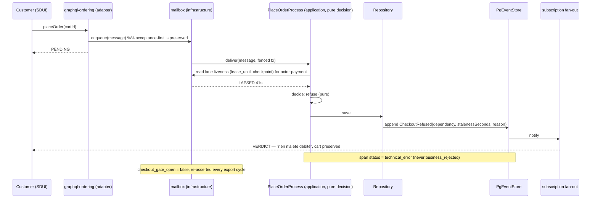
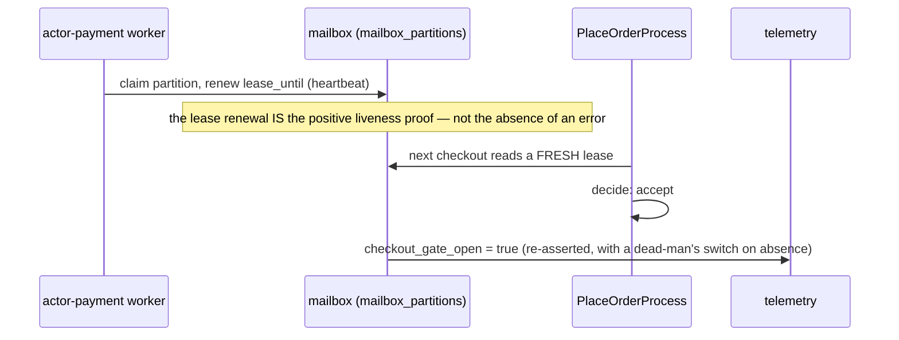
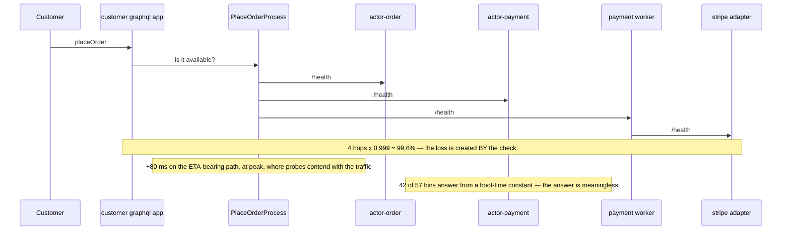

# PROP-20260819-021500 — Checkout stops when payments are down: as a published fact and an appended refusal

- **Status**: Proposed
- **Date**: 2026-08-19
- **Tracking issue**: [#657 "Checkout must stop when payments are down — design the mechanism the founder's goal needs (PROP-20260819-021500)"](https://github.com/TheCaptainCompany/captain-food/issues/657)
- **Register row**: [DECISIONS §47](DECISIONS.md) **CHECKOUT-STOP**
- **Realized by**: _(filled at completion)_

---

## 0. What is decided, and what is not

The founder decided the **posture** on 2026-08-18 (Q3), recorded verbatim in
[ADR-20260818-233000](../adr/ADR-20260818-233000-the-ten-answers-per-head-monthly-invoice-and-a-cagnotte-that-exists-only-in-prose.md):
at 20:00 on a Friday with payments down, **checkout must not take money it cannot process**. That
posture is not reopened by this proposal and no option below weakens it.

What he also described was a **mechanism**: *"The customer graphql app will check the availability of
the actors it depends on … the place order process manager will check the availability of order
actor payment actor and payment worker … Payment worker will check the availability of stripe
adapter."* Six lenses rejected that chain on six independent grounds. This proposal designs the
mechanism that delivers his goal without them.

---

## 1. Context — what is true today, with evidence

| # | Fact | Evidence |
|---|---|---|
| 1 | **The system already fails closed.** No `OrderPlaced` is appended unless the fenced mailbox transaction commits. There is no path where money is taken and the order is lost. | `PlaceOrderProcess` in `specs/ordering/processmanager.yaml:10`; the fencing counter `ownership_version` in `migrations/20260731063000_actor_mailbox_tables.sql:85-93` |
| 2 | **What is missing is a VERDICT, not a gate.** A `placeOrder` that is accepted onto the mailbox and never drained answers `PENDING` and stays `PENDING`. The customer sees a spinner, not a refusal. | acceptance-first, ADR-20260720-015500 |
| 3 | **The readiness endpoint the chain would read is a boot-time constant.** `let db_ready = !config.database_url.is_empty();` is computed once and captured by `move` into the health closure. | `crates/bins/actor-mailbox-supervision/src/main.rs:67,88-96`; the shape appears in **45** of **57** bin crates (`grep -rl "database_url.is_empty()" crates/bins --include='*.rs' \| cut -d/ -f3 \| sort -u \| wc -l`) |
| 4 | **Zero of the 57 bins know what schema they need.** The monolith's real gate — 503 `schema_behind` when `applied_version < REQUIRED_SCHEMA_VERSION` — is referenced by no bin crate. | `grep -rl REQUIRED_SCHEMA_VERSION crates/bins --include='*.rs' \| wc -l` = 0; the implementation is `crates/server/src/lib.rs:1541-1563` |
| 5 | **The push-shaped answer already exists in this repo.** `/health` is a **30 s cached snapshot refreshed by a background heartbeat**; the handler locks a mutex and returns. It reports on its OWN dependency and calls no other service. | `crates/server/src/lib.rs:251-268` (the four-state `Snapshot`), `:1541-1563` (the handler) |
| 6 | **The mailbox already carries a durable liveness signal.** `mailbox_partitions` holds `claimed_by`, a heartbeat-renewed `lease_until`, and a monotonic `checkpoint` — per actor type, per partition. A worker that answers `200` while its lane has not advanced is visible here and nowhere else. | `migrations/20260731063000_actor_mailbox_tables.sql:85-93`. ⚠️ **Correction to the round-2 aggregation**: the column is `lease_until`, not `lease_heartbeat_at` |
| 7 | **A closed gate is invisible to the observability contract.** `place-order` is a per-workflow contract keyed on runs of the workflow; zero runs means zero errors and zero budget burn. | `specs/observability.yaml:111-230` (`place-order`, `place_order_duration_ms{result}`) |
| 8 | **The gate has no legal home in the composed schema.** The chain spans scopes; nested-cross-scope is validator-forbidden, the gateway holds no state and 400s cross-scope documents. | api composition rules, `docs/claude/dsl.md`; role = path, one composed schema per role |
| 9 | **The checkout screen already has an honest degraded state** — `payment_unavailable_state`, rendered instead of the Stripe element with the pay button disabled, asserted by tests. | `crates/web/src/checkout.rs:264,357`; `crates/web/src/router.rs:566,572` |
| 10 | **The deploy topology turns a stop into an outage.** 54 Deployments, all `replicas: 1`, all `strategy: Recreate`. Deploying `actor-payment` at any hour deletes the only replica before the new one exists. | `grep -rn "replicas: 1" deploy/generated/manifests \| wc -l` = 54; `type: Recreate` = 54 |

**The consequence, stated plainly.** Today a payments outage at Friday peak produces a **silent
spinner** for every customer who checks out, a **green** `place-order` contract, and **no fact in the
log** that says why. Adding the described four-hop chain would replace the silence with a
**manufactured** outage: four hops at 0.999 is 99.6 % availability created by the check itself,
+80 ms on the ETA-bearing path, and a cached probe that reports a dead worker healthy for up to
9 seconds — so it does not even deliver the stop it costs.

---

## 2. Recommended approach

Four slices, in this order. The order is the point: each one is useful alone, and the ones that
protect the customer come before the one that protects the platform.

1. **Slice A — the verdict** *(fixes fact 2; no gate involved)*. A `placeOrder` that is not drained
   within a bounded window resolves to a **typed refusal the customer can read**, delivered over the
   existing subscription. This is today's failure, it needs no readiness signal at all, and it is the
   only slice that improves a customer's Friday before the cutover.
2. **Slice B — readiness becomes a real published fact** *(fixes facts 3 and 4)*. One implementation
   in `bin_runtime`, lifted from `crates/server/src/lib.rs`: a background heartbeat does a real pool
   round-trip and compares applied schema to required schema; the handler reads a cached snapshot.
   Tracked as [#655 "Every bin lies about readiness: the probe is a boot-time constant"](https://github.com/TheCaptainCompany/captain-food/issues/655).
   **Nothing may consume readiness before this lands** — the current endpoint would answer `ready` for
   a pod with no database.
3. **Slice C — the refusal is an appended fact** *(`young`'s remedy)*. When checkout refuses, a
   `CheckoutRefused` fact carrying the dependency, the observed staleness and the reason is appended,
   so a replay of that Friday can say **why**. Classified `technical_error`, never `business_rejected`.
4. **Slice D — the stop itself** *(`vernon`'s remedy)*, shipped **shadow-first, default OFF**
   (gate-then-stabilize): the decision is taken from **lane staleness read from the mailbox**, not
   from an availability question asked of another service.

**Both remedies are taken, not blended.** `young` asked explicitly that his not be merged with
`vernon`'s. They fix different defects: one makes the refusal *reconstructible*, the other makes it
*happen*. Neither substitutes for the other.

---

## 3. Decisions surfaced

### D1 — Where does the readiness fact come from?

| Option | Pros | Cons |
|---|---|---|
| **Published fact, consumed from the mailbox: `mailbox_partitions.lease_until` + `checkpoint` per actor type** ✅ **recommended** | Measures the worker's last **durable act**, so a worker that answers 200 while its lane has not advanced is caught; no new endpoint, no new hop, no cross-scope call; one indexed read on a table the write path already touches; honours ADR-20260810-231300 (nothing is asked, a fact is read) | The signal is coarse-grained per actor type; a lane that is idle because there is no work looks the same as one that is idle because the worker died, so the rule must be *lease lapsed*, never *checkpoint unchanged* |
| HTTP readiness probe of each dependency, at checkout time (as described in Q3) | Directly expresses "is payments up?"; familiar shape | Manufactures the outage it reports (0.999^4 = **99.6 %**); +80 ms on the ETA-bearing path; probes contend with the traffic they report on, so **slow reads as down** and a slow Friday becomes a zero-revenue one; the endpoint is a boot-time constant (fact 3); four of the six components in the chain have **no `kind: Service`** and are unaddressable; forbidden by ADR-20260810-231300, whose monitoring carve-out explicitly does not cover an observer *inside* the system with a durable record to reconcile against |
| Each component pushes its readiness into a shared table, consumed by checkout | Push-shaped; uniform across component kinds | A second liveness mechanism beside the mailbox lease, which is the one that already exists and is already fenced; two sources of truth about the same fact is how they diverge |
| Status quo — no readiness input at all | Zero cost; the system already fails closed (fact 1) | Delivers the founder's goal only in the sense that no money is taken; the customer still gets a spinner and the platform still learns nothing |

### D2 — What does the customer see, and when?

| Option | Pros | Cons |
|---|---|---|
| **A typed refusal at checkout, before payment details are entered where possible, reusing `payment_unavailable_state`** ✅ **recommended** | The degraded state, its copy and its tests already exist (fact 9); the pay button is already disabled there; one screen state instead of a new one | Needs a distinct reason so "Stripe.js failed to load" and "our payments worker is down" are not the same message to a support agent, even if they are the same message to the customer |
| A generic error toast after the pay attempt | Cheapest | Takes the customer through the whole funnel to fail at the last step — the worst point of a food-ordering flow, and it looks like their card was declined |
| Leave it PENDING and let the customer refresh | No work | This is the current behaviour and it is the defect (fact 2) |

### D3 — Is the refusal appended to the log?

| Option | Pros | Cons |
|---|---|---|
| **Append `CheckoutRefused{dependency, stalenessSeconds, reason}`** ✅ **recommended** | A replay of a bad Friday can reconstruct **why** checkout refused, which a counter cannot; it makes the refusal rate a **fold** (a business metric, per ADR-20260811-014129) rather than a call-site counter; it is the only representation that survives a rebuild | A new stored event shape — immutable once appended, so its payload must be right the first time; it is a fact about a **non-order**, so its stream identity needs deciding (see D5) |
| A counter and a span only | No stored shape, no versioning story | Ratios and distinct-customer denominators are inexpressible as counters; the refusal disappears from history at the retention horizon; `young`'s ground is unaddressed |
| Nothing — the absence of `OrderPlaced` is the record | Zero cost | An absence is not evidence: it is byte-identical to "nobody tried to order", which is the same failure mode as the `{"cart":null}` defect [#622 "prod-smoke L4 reads the guest cart on the marketplace host, where `current` returns null by design"](https://github.com/TheCaptainCompany/captain-food/issues/622) |

### D4 — How is the refusal classified in telemetry?

| Option | Pros | Cons |
|---|---|---|
| **`technical_error`, plus a `checkout_gate_open` gauge re-asserted every export cycle and a dead-man's-switch on its absence** ✅ **recommended** | A payments outage burns error budget instead of hiding inside a business rejection; the gauge closes the **green contract, dead checkout** hole (fact 7) by making the *state* observable when the *runs* are zero; the re-assert + absence alarm is the defect class CLAUDE.md names — a threshold alert goes quiet exactly when it should scream. In-repo precedents: `otp_send_guard_enforcing`, `payment_birth_gap_sweep_heartbeat_total` | One more gauge to keep alive; a gauge that stops being exported must itself alarm, or the fix reintroduces the hole one level up |
| `business_rejected` (what it would be if the refusal rode the validate span) | Nothing to build | Hides **every** payments outage inside the normal rejection rate; the SLO stays green through a zero-revenue evening |
| No classification decision | — | Not an option: the span exists either way and defaults to whatever it inherits |

### D5 — What stream does a refusal belong to, and does the gate live in the process manager or the gateway?

| Option | Pros | Cons |
|---|---|---|
| **The `PlaceOrderProcess` decides, and the fact is appended on the cart's stream** ✅ **recommended** | The PM is a write-side component and may read the mailbox (its own runtime), never a projection (ADR-20260815-030206); the cart exists at refusal time and the order does not; the refusal is then in the same stream as the checkout attempt that produced it | Widens what a cart stream carries; needs a rule saying a refused checkout never blocks a later successful one on the same cart |
| A new `Checkout` aggregate holding the attempt | Cleanest boundary for a fact about a non-order | A whole aggregate for one fact; and `vernon`'s test — an aggregate boundary is a consistency promise — is not met by a thing with no invariant to protect |
| The gateway refuses before the mutation reaches a scope | Fails fastest, cheapest per request | Has **no legal home**: the chain spans scopes, the gateway holds no state and 400s cross-scope documents (fact 8); and a refusal that never reaches the write side cannot be appended, which loses D3 |

---

## 4. Screen mockups

### 4.1 Customer — checkout while the payments lane is stale (the Friday-20:00 case)

```
┌──────────────────────────────────────────┐
│  ← Paiement                              │
├──────────────────────────────────────────┤
│  Chez Marco · Livraison ~30 min          │
│  ────────────────────────────────────    │
│  2 × Pizza Reine            24,00 €      │
│  Livraison                   3,50 €      │
│  ────────────────────────────────────    │
│  Total                      27,50 €      │
│                                          │
│  ┌────────────────────────────────────┐  │
│  │ ⚠  Paiement momentanément          │  │  <- payment_unavailable_state
│  │    indisponible                    │  │     (crates/web/src/checkout.rs:264)
│  │                                    │  │     reason: payments_lane_stale
│  │    Nous ne pouvons pas encaisser   │  │
│  │    votre commande pour l'instant.  │  │
│  │    Votre panier est conservé.      │  │
│  │                                    │  │
│  │    [ Réessayer ]                   │  │  -> re-runs placeOrder, no card data re-entry
│  └────────────────────────────────────┘  │
│                                          │
│  [  Payer 27,50 €  ]  (disabled)         │  <- already disabled in this state
└──────────────────────────────────────────┘
```

Commands/queries: the CTA maps to `placeOrder` (unchanged). The panel is a **state of the existing
checkout screen**, not a new screen; the cart is untouched, so *"votre panier est conservé"* is a
true statement and not reassurance copy.

### 4.2 Customer — the verdict that Slice A adds, with no gate at all

```
┌──────────────────────────────────────────┐
│  Commande en cours…                      │
│                                          │
│        ( spinner, ≤ N seconds )          │   <- today: forever
│                                          │
├──────────────────────────────────────────┤
│  after the bounded window:               │
│                                          │
│  ✕  Nous n'avons pas pu enregistrer      │
│     votre commande.                      │
│     Rien n'a été débité.                 │   <- true by fact 1; say it, it is the
│                                          │      question every customer has
│     [ Réessayer ]   [ Voir mon panier ]  │
└──────────────────────────────────────────┘
```

### 4.3 Operator — the supervision surface, so a human sees the stop as a state

```
LANES                                   lease        checkpoint   verdict
───────────────────────────────────────────────────────────────────────────
actor-order            p0..p4           fresh        1 204 812    ok
actor-payment          p0..p4           LAPSED 41s   1 204 040    ⛔ CHECKOUT STOPPED
adapter-stripe         p0               fresh        —            ok
───────────────────────────────────────────────────────────────────────────
checkout_gate_open = false   since 20:04:11   refusals: 37
```

This is the screen that answers *"is it us or is it Stripe?"* at the moment somebody is being asked
that question by a restaurant on the phone. It reads `mailbox_partitions` — the same row the decision
reads, never a second source.

---

## 5. Sequence diagrams

### 5.1 Today — the silent spinner (what a Friday outage actually looks like)

```mermaid
sequenceDiagram
    participant C as Customer (SDUI)
    participant GQL as graphql-ordering (adapter)
    participant MB as mailbox (infrastructure)
    participant PM as PlaceOrderProcess (application)
    participant ES as PgEventStore

    C->>GQL: placeOrder(cartId)
    GQL->>MB: enqueue(message)  %% acceptance-first
    GQL-->>C: PENDING
    Note over MB,PM: actor-payment is down: nobody drains the lane
    Note over C: spinner forever — no verdict, no error, no fact
    Note over ES: nothing appended; place-order contract sees ZERO runs and stays GREEN
```

### 5.2 Recommended — published fact in, appended refusal out



### 5.3 Recovery — nothing polls, and the path back is positively detected



### 5.4 The rejected mechanism, drawn once so the record shows what was declined



---

## 6. Alternatives considered for the cluster as a whole

- **Do nothing.** Defensible on one reading: the system already fails closed and no money is taken
  (fact 1). It loses because the customer is left on a spinner, the platform learns nothing, and the
  founder's decision was explicit. Rejected.
- **Build the described chain as described.** Rejected on six independent grounds, each of which
  survives fixing the other five (§1 and D1). Recorded here so the rejection is attributable, not
  editorial.
- **Do it all at once** — gate, verdict, appended fact and contract in one change. Rejected: the
  gate is the only part that can *reduce* revenue if it is wrong, and shipping it beside three
  changes that cannot means a bad Friday has four suspects. Gate-then-stabilize is the recorded
  posture; the gate ships shadow-first, default OFF, and flipping the default is a separate recorded
  decision.
- **Make checkout degrade instead of stop** — accept the order, authorize later. Rejected: it
  changes the product's promise (a customer would be told their order is placed when nothing can
  process it), it contradicts the founder's answer, and it is exactly the shape ADR-20260808-195315
  chose against when it put authorization at checkout.
- **Wait for the 57-process split and design the gate then.** This is `holub`'s sequencing and it is
  right about the *gate*: a stop between processes cannot be designed before the processes exist. It
  is wrong about the *verdict* and the *readiness fact*, both of which are needed today and are
  preconditions of the gate. Hence four slices rather than one.

---

## 7. Verification plan

| Slice | Rule (`rules.yaml`) | Behaviour tests, **including the negatives** | Observability |
|---|---|---|---|
| A — verdict | a `placeOrder` accepted onto the mailbox resolves to a terminal customer-visible outcome within a bounded window | (+) an undrained checkout produces a refusal verdict; (−) a **slow but draining** lane produces `OrderPlaced`, never a refusal; (−) a refusal never appears for an order that was in fact placed | `place_order_duration_ms{result="refused"}`; the window itself is a declared config key |
| B — readiness | a bin's readiness reflects a real round-trip and the required schema version | (+) 503 `schema_behind` against a database one migration short, **seen RED first**; (−) 503 when the pool cannot connect after a successful boot — the case the current shape cannot express | readiness transition span; see [#655 "Every bin lies about readiness: the probe is a boot-time constant"](https://github.com/TheCaptainCompany/captain-food/issues/655) |
| C — appended fact | every checkout refusal appends exactly one `CheckoutRefused` | (+) a refusal appends the fact with dependency and staleness; (−) a **retry** of the same cart after recovery appends `OrderPlaced` and does not re-append the refusal; (−) replay of the log reproduces the refusal count exactly | the refusal is a **fold** (business metric) with its declared `activity:` in `specs/stories.yaml` |
| D — the gate | the gate is OFF by default and its state is asserted, not inferred | **four arms** (`beck`): all-ready accepts; an **unrelated** dependency down still accepts; a probe timeout is distinguished from NOT_READY; a **stale snapshot** forces the fail-open/fail-closed decision explicitly rather than by omission | `checkout.readiness` span; `checkout_blocked_total{dependency,reason}`; `checkout_gate_open` re-asserted every cycle with a dead-man's switch on its absence; every refusal classified `technical_error` |

**Which of these must fail on `main` today** — that is what proves the findings were real: the
Slice A positive (there is no bounded window), the Slice B `schema_behind` arm (no bin can express
it), and the Slice C replay arm (no such fact exists).

**The fault-injection upside nobody else named** (`beck`): once the split exists, the harness can
**kill `actor-payment` and watch checkout refuse**. That is Slice D's own acceptance test, and it is
close to unwriteable in a monolith — a genuine argument *for* the process topology, on a property
the topology actually delivers.

---

## 8. Open questions for the product owner

1. **D1** — readiness from the **mailbox lease** (recommended) rather than HTTP probes between
   services. This is the one place where the answer differs from what he described; the difference is
   that nothing is asked at request time.
2. **D2** — the customer sees a **refusal at checkout** reusing the existing unavailable state
   (recommended), not a failure after the pay attempt.
3. **D3** — the refusal is **appended to the log** (recommended), not only counted.
4. **D4** — a refusal is `technical_error` and the gate's state is a re-asserted gauge with a
   dead-man's switch (recommended).
5. **D5** — the **process manager decides** and the fact rides the cart's stream (recommended); the
   gateway is not a legal home for the gate.
6. **Sequencing** — the **verdict ships before the gate** (recommended). A customer left on a spinner
   is today's failure; the gate protects a topology that has not been deployed yet.

---

## 9. Refs

- [ADR-20260818-233000](../adr/ADR-20260818-233000-the-ten-answers-per-head-monthly-invoice-and-a-cagnotte-that-exists-only-in-prose.md) §4 (the six grounds, both remedies, verbatim Q3) · [DECISIONS §47](DECISIONS.md) row **CHECKOUT-STOP**
- Records this narrows, and which the register row must resolve: [ADR-20260810-231300](../adr/ADR-20260810-231300-no-polling-only-pushing-polling-as-graceful-fallback.md) (no polling, only pushing) · ADR-20260720-015500 (acceptance-first) · [ADR-20260815-030206](../adr/ADR-20260815-030206-a-process-manager-is-a-write-side-component-and-never-reads-the-read-side.md) (a PM never reads the read side)
- Code: `crates/server/src/lib.rs:251-268,1541-1563` · `crates/bins/actor-mailbox-supervision/src/main.rs:67,88-96` · `crates/web/src/checkout.rs:264,357` · `crates/web/src/router.rs:566,572` · `migrations/20260731063000_actor_mailbox_tables.sql:85-93`
- Specs: `specs/observability.yaml:111-230` (`place-order`) · `specs/ordering/processmanager.yaml:10` (`PlaceOrderProcess`)
- Issues: [#657 "Checkout must stop when payments are down"](https://github.com/TheCaptainCompany/captain-food/issues/657) · [#655 "Every bin lies about readiness: the probe is a boot-time constant"](https://github.com/TheCaptainCompany/captain-food/issues/655) · [#193 "The system cannot run more than one instance: no leader election"](https://github.com/TheCaptainCompany/captain-food/issues/193) and [#242 "Write path becomes an actor mailbox…"](https://github.com/TheCaptainCompany/captain-food/issues/242) (what must mature before `Recreate` can be lifted) · [#358 "MKS bootstrap"](https://github.com/TheCaptainCompany/captain-food/issues/358)
