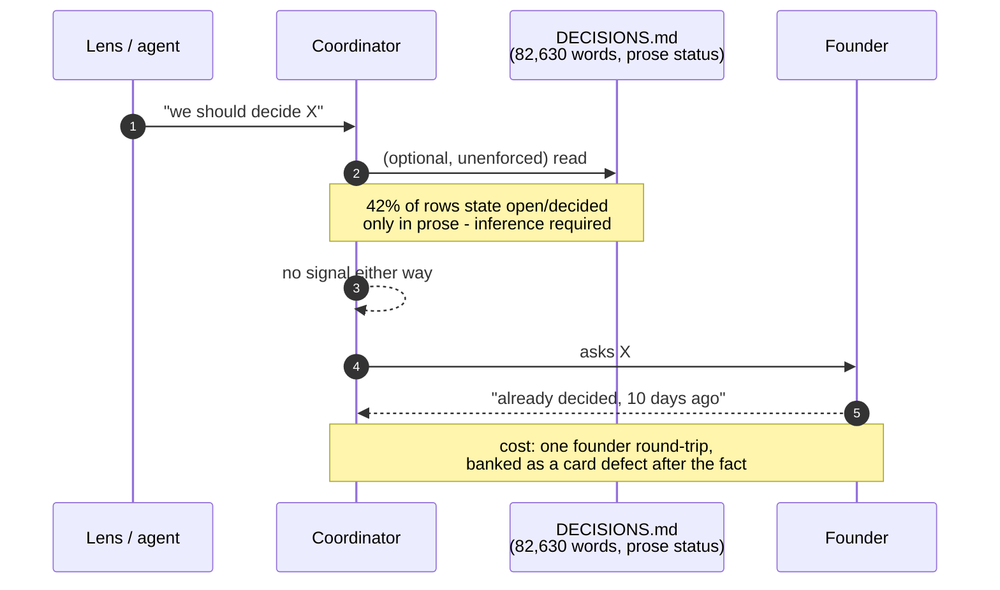

# PROP-20260819-110442 — The decision register is the unit of decision, and it has no machine identity

- **Status**: **Approved** — the founder ruled 2026-08-19; the ruling and its three defects are
  recorded in [ADR-20260819-191227](../adr/ADR-20260819-191227-the-register-ruling-canonical-records-a-nine-status-vocabulary-and-a-capped-boot-index.md).
  **Approval is not a dispatch**: the work is sequenced into four slices behind #659, and whether this
  ruling *schedules* the slices or only approves their *design* is explicitly unsettled (that ADR,
  Consequences).
- **Date**: 2026-08-19
- **Tracking issue**: [#658 "The decision register cannot say what is still open: 62 of 148 rows carry no status token, 22 keys are ambiguous, and nothing confronts a question with the register before it reaches the founder"](https://github.com/TheCaptainCompany/captain-food/issues/658)
- **Realized by**: _(filled at completion)_
- **Base**: `main` @ `bfe6694`. Every figure below was derived at that SHA and each names the
  command that produced it (§12). No number in this document is a bare number.
- **Question that ordered it**: the founder, 2026-08-19, verbatim — *"Is it possible that the agents
  do not have the context of the ADRs and ask me questions that are already answered? If yes, how
  could we resolve that issue?"*

> **Screen mockups are interpreted as validator output, deliberately.** The
> [proposals README](README.md) requires one mockup per use case; this proposal adds no actor-facing
> screen, no command and no query. Its entire user interface is a set of validator failure messages
> and one generated page, and those are reproduced verbatim in §4 — which is the honest equivalent,
> and the same reading `PROP-20260818-013222` took. Sequence diagrams DO apply and are in §5.

---

## 0. The answer, in three sentences

**Yes, and it is not fixable by reading more.** There are ~672,000 words of standing decision record
against a 3,612-word resident index, so no agent can hold the corpus — but the three incidents this
session were **not** caused by a bad index: the record that was re-litigated on 2026-08-18 is 891
words, single-topic, and named `tips-voluntary-contributions-funding-model.md`, which `ls docs/adr |
grep -i contribut` finds in one command. It was one grep away and nobody grepped, because **nothing
required it** — so the fix is not a better index, it is making the lookup a precondition of asking.

---

## 1. Context — what is true today, with evidence

### 1.1 The corpus cannot be read exhaustively

| Fact | Value | Antecedent |
|---|---|---|
| Words in `docs/adr/**` | **241,177** | `cat docs/adr/*.md \| wc -w` |
| Words in `docs/proposals/DECISIONS.md` | **82,630** | `wc -w docs/proposals/DECISIONS.md` |
| Words in `docs/STATUS.md` | **83,068** | `wc -w docs/STATUS.md` |
| Words in 57 `PROP-*.md` | **261,404** | `cat docs/proposals/PROP-*.md \| wc -w` |
| **Total standing decision record** | **~668,000 words** | sum of the four |
| Words in `CLAUDE.md`, the resident index | **3,612** | `wc -w CLAUDE.md` |

The record is roughly **185×** the index that points at it. At a conservative 1.4 tokens/word that is
~935,000 tokens — beyond any context window. **"Give the agent the ADR context" is not an available
option**; only retrieval or enforcement is.

### 1.2 The ADR corpus is in better shape than it looks — and the card's framing overstates its faults

Three claims deserve correction before any money is spent on them.

| Claim | Verified verdict |
|---|---|
| "No machine-readable metadata on any ADR; status is prose" | **Half true.** `grep -l -E '^(topics\|supersedes\|superseded_by\|status):' docs/adr/*.md` → **0**, and no file has YAML frontmatter. But **all 236** carry a Status marker, and **234 of 236** lead with a closed-vocabulary word (`Accepted` 217, `Proposed` 13, `Superseded` 4, lowercase `accepted` 2). What is *not* parseable is the **relationships**, which live in qualifying prose on 148 of them. |
| "Supersession is invisible" | **Substantially wrong for the recent corpus.** Every governance ADR checked carries a prominent amendment banner in its first ten lines: `ADR-20260816-134352:8-9` (*"Amended 2026-08-17 … §4's revert trigger is **struck**"*), `ADR-20260809-013142:8`, `ADR-20260808-154005:8-10`, `ADR-20260810-234225:3` (*"Superseded in part by …"*). The discipline exists and is being followed. What is missing is only that the banner is **prose-shaped and unwalkable**, so no tool can act on it. Severity: downgraded from "invisible" to "unqueryable". |
| "`docs/adr/README.md` was twelve entries stale until `bfe6694` tonight" | **Understated. It is 13 entries stale right now, after the fix.** `bfe6694` indexed exactly the twelve ADRs dated 2026-08-18 and left thirteen dated 2026-08-11 → 2026-08-16 unindexed, including `ADR-20260815-115220` and `ADR-20260816-134352`, both cited by `CLAUDE.md`. **This is the single best piece of evidence in the document**: a deliberate, competent, agent-executed staleness fix, whose commit message accurately describes its own scope, left the index 5.5% wrong. Prose discipline does not converge. |

**Citation hygiene is already near-perfect, which kills the obvious gate as a headline.** Scanning
1,263 files under `specs/ docs/ crates/ tools/ .claude/ .github/ CLAUDE.md README.md`:

- **8,271** ADR citations (6,160 full-form `ADR-YYYYMMDD-HHMMSS`, 2,111 legacy `ADR-NNNN`).
- **17 of 6,160** full-form citations resolve to no file — **0.3%**. Of those 17:
  - **3** are `ADR-20260817-232744/232745/232746`, **deliberately** held-not-deposited
    (`docs/STATUS.md:420`, `docs/adr/ADR-20260818-004647-…:179`) — a gate must exempt these, not flag them.
  - **1** is a test fixture, `tools/codegen-rs/src/tests.rs:6204`.
  - **1** is a genuine defect: **`docs/STATUS.md:5707` cites `ADR-20260724-172808`, and no such file exists.**
- **27** citations use an ambiguous time-only shorthand (`ADR-150500` at
  `docs/adr/ADR-20260731-153000-…:40`, `ADR-183024` at `docs/STATUS.md:4085`) that names no unique record.

**A dangling-citation gate would catch one real defect today.** It is still worth ~40 lines as a
ratchet, but it is *not* the answer to the founder's question and this proposal does not pretend it is.

### 1.3 The register is the artifact that actually fails

`docs/proposals/DECISIONS.md` exists to answer exactly one question — *is this still open?* — and it
answers it in prose.

| Fact | Value |
|---|---|
| Row-anchored keys | **148** |
| **Unique** keys | **126** — 22 duplicates, all in the per-proposal `D1`–`D7` family, so `D1` names seven different decisions |
| **Rows with no status token in the key cell** | **62 of 148 (42%)** — status is free prose in the recommendation cell (`D5` → *"**Yes — it is what makes the cycle reach the work…**"*; `D3` → *"Move them to `RefundProcess`…"*). Counting `⚠️` as a status would lower this to 52; it is excluded because it marks a *hazard*, not an open/decided state, and rows carry it alongside `✅`. |
| Rows marked decided (`✅`) | 51 |
| Distinct glyphs in use in the key cell | 7 — `✅ 🟠 🔴 🟢 ⏸️ ⏳` as status, `⚠️` as a hazard marker, plus "none" |
| Longest single paragraph | **8,511 words** (one markdown table) |
| Duplicate `##` section numbers | **2** — two `## 37.` and two `## 42.` |
| File size | 2,641 lines / 82,630 words |

An agent instructed to *"check the register before you ask"* must read 82,630 words and **infer**
open-vs-decided for 42% of rows. That instruction is not executable, which is why it was broken six
hours after it was written (§1.5).

### 1.4 The ADR id is no longer the unit of decision — `evans`

| ADR | Decisions inside | Words |
|---|---|---|
| `0003-semver-per-dsl-file.md` | 1 | **148** |
| `ADR-20260819-103112-the-six-queue-answers-…` | **6** | 6,241 |
| `ADR-20260818-233000-the-ten-answers-…` | **10** | 6,248 |

One name, two concepts — the `evans` diagnosis exactly. "ADR" means both *one decision* and *a
sitting's ten answers*. A citation of `ADR-20260818-233000` cites ten decisions at once; closing one
of them requires prose. Meanwhile the **register row key** (`MARGIN-MECHANISM`, `CAPTAINNET-ZERO`,
`STO-9`) *is* the real unit of decision — 115 of them already exist and are already used as stable
handles across ADRs, STATUS and proposals — and it is **the one thing in this repo with no machine
identity, no declaration site, and no ref-walker**.

This is precisely the surface [ADR-20260811-014129](../adr/ADR-20260811-014129-a-business-metric-is-a-projection-and-every-reference-is-a-ref.md)
already governs everywhere else: *every reference is a `$ref`; only a declaration may introduce a
bare name*, because **a plain-string reference is invisible to the refs walker, so no rule can see
it.** The register is the largest surface still exempt.

### 1.5 The failure is not findability — and the incident proves it

The 2026-08-18 exchange asked the founder to re-decide something already settled. Banked as
coordinator defect 2 in
[ADR-20260818-210000](../adr/ADR-20260818-210000-the-ai-maintained-codebase-premise-prose-is-a-convention.md):

> ask #3 asked the founder to decide something ADR-20260808-203443 settled ten days earlier … The
> "check the register before you ask" rule was written into `docs/claude/sessions.md` **that
> morning** and broken by the decision form built **that afternoon**. … **The fix must be executable,
> not another prose rule** — the form's question set has to be mechanically confronted with the
> register before it can be sent.

**Test the volume hypothesis against this incident.** `ADR-20260808-203443-tips-voluntary-
contributions-funding-model.md` is **891 words**, **97 lines**, single-topic, ten days old, and its
filename contains the subject. `ls docs/adr | grep -i 'contribut\|tips'` returns it plus one other
file. It was **one grep away**.

> **Therefore: no index, no frontmatter, no topic taxonomy and no reduction in ADR count would have
> prevented it.** The record was maximally findable and the lookup did not happen, because nothing
> made it a precondition. Options A, B and C as posed are all improvements to an index that was not
> the bottleneck. That is the finding that determines this proposal's shape.

### 1.6 The precedent that sizes the whole thing

`tools/codegen-rs/src/validate/proposals.rs` (343 lines) **already reads `docs/proposals/`**, and
`load_decision_table_files` at `:21-23` **already includes `DECISIONS.md` by name**, with the comment:

> `DECISIONS.md` is deliberately in scope here … it is the table the whole decision process reads (#572).

So validating the register is not a new capability, a new dependency or a new authority — it is
extending a module that is already pointed at the file. Its four rules are pure functions over
`(path, content)` pairs with fixture-driven unit tests. **This is the cheapest well-trodden path in
the repo for this class of work.**

### 1.7 The doctrine is already decided, so option D is foreclosed

The repo adopted, on the founder's own argument, in
[ADR-20260818-210000](../adr/ADR-20260818-210000-the-ai-maintained-codebase-premise-prose-is-a-convention.md):

> **A rule that lives only in prose is a convention, and this repo has decided conventions are not
> enough.**

> *"layers was just conventions now it will be compilation and controlled … I'm not able to maintain
> rust, only the ai will be able to do it"* — the founder, 2026-08-18.

And `CLAUDE.md:120` demonstrates the decay on itself: it tells every session *"gates are hooks in
`.claude/settings.json`"*. Re-verified at `bfe6694`: `grep -c -i hook .claude/settings.json` → **0**;
the file's only keys are `model`, `disabledMcpjsonServers`, `permissions`. Four scripts exist in
`.claude/hooks/` and **nothing wires them**. A load-bearing sentence in the resident index is false
and nothing ever went red.

---

## 2. Recommended approach

**Make the ask, not the archive, the enforced surface.** In order, and the order is the argument:

1. **Give the register row a declaration site.** `docs/decisions/*.yaml` — one declared row per
   decision, with a `status` from a **closed set**, a globally unique key, and `decided_by` as a
   resolvable reference. This is the *only* new authored artifact.
2. **Generate `DECISIONS.md`'s index from it**, so the human page cannot disagree with the data, and
   generate `docs/adr/README.md`'s index from the filesystem, so it cannot be 13 stale again.
3. **Make an unregistered ask unspellable.** A decision-queue question must `$ref` a row whose
   `status` is `open`. A question naming a `decided` row **cannot be authored** — the gate refuses
   it and prints the answer and the ADR that gave it. This is the executable form of
   ADR-20260818-210000's own prescription, which is prose today.
4. **Close the ratchet on citations.** An ADR citation anywhere in the repo that resolves to no file
   is an error, with a declared exemption list for the three held ids.

**Compiler-first placement, stated honestly** ([ADR-20260803-234035](../adr/ADR-20260803-234035-compiler-first-a-check-is-the-fallback.md),
whose level 4 is the floor). The type system **cannot reach markdown**, so no `struct` makes a stale
citation unspellable in `docs/**`. Level 4 — a validator gate over a declared artifact — is both the
floor and the ceiling here, and this proposal says so plainly rather than dressing a check as a type.
What *is* recovered from the compiler-first spirit is the **declaration/reference split**: a row key
becomes a declared name with a walker, which is the same move ADR-20260811-014129 made for the DSL,
and it is what turns "remember to check" into "the reference does not resolve."

---

## 3. Decisions surfaced — RULED 2026-08-19

> **All five were ruled, and the ruling re-cut them.** The founder's answer did not map 1:1 onto the
> `D1`–`D5` below: his reply covered `D2`+`D3` in one clause, expanded `D4`'s five-value vocabulary to
> **nine**, split enforcement into two stages, and added a sixth decision (the boot index) that did not
> exist here. The ruled design, its namespaced keys — `DECISION-UNIT` · `REGISTER-STORAGE` ·
> `STATUS-VOCABULARY` · `REGISTER-MIGRATION` · `ASK-ENFORCEMENT` · `BOOT-INDEX-BOUND` — and the three
> defects the ruling's own text carries are in [ADR-20260819-191227](../adr/ADR-20260819-191227-the-register-ruling-canonical-records-a-nine-status-vocabulary-and-a-capped-boot-index.md).
>
> **The `D1`–`D5` headings below are kept as written**, because records and dispatch cards already cite
> them and `evans` ruled that they stay legal as *citation anchors* — just never as keys. Read them as
> the option space that was put to the founder, not as the current design.

| This proposal asked | The founder ruled | Ruled key |
|---|---|---|
| `D1` enforcement: archive or ask | **the ask**, in two stages (A: queue question cites an `open` key; B: `Decision Context` before a decision-sensitive plan) | `ASK-ENFORCEMENT` |
| `D2` register source shape | **`docs/decisions/**` YAML, one record per key** | `REGISTER-STORAGE` |
| `D3` whole file generated, or only the index | **`DECISIONS.md` becomes a generated view outright**, never a maintained authority — stronger than this proposal recommended | `REGISTER-STORAGE` |
| `D4` status vocabulary | **nine values, not five**, splitting `decided` (binding policy) from `realized` (implementation evidence) | `STATUS-VOCABULARY` |
| `D5` the 22 ambiguous keys | **namespace them in the first migration**, and no source row may silently disappear | `DECISION-UNIT` + `REGISTER-MIGRATION` |
| _(not asked here)_ | **the boot index is discovery-only and hard-capped at 8 KB**, carrying open/proposed/blocked plus a schema-backed `resident:` subset | `BOOT-INDEX-BOUND` |


### D1 — Where does enforcement go: the archive, or the ask?

| Option | Pros | Cons |
|---|---|---|
| **Enforce the ASK: a question must name an open register row** ✅ **recommended** | Targets the only mechanism that actually failed (§1.5) — the record was one grep away and the lookup was optional. Executes ADR-20260818-210000's own prescription verbatim. Cost is bounded and does not scale with 236 files. Every redundant ask it prevents is a founder round-trip saved. | Only covers questions routed through the decision queue; a lens asking inline in conversation is untouched (§9, UQ-1). Requires the register to be structured first, so it cannot land alone. |
| Enforce the ARCHIVE: frontmatter + topics on 236 ADRs | Makes the whole corpus queryable; enables topic-based retrieval later. | **Would not have prevented any of the three incidents** (§1.5). 236-file backfill. Status is already 234/236 parseable, so most of the gain is imaginary. Adds a per-ADR discipline to a corpus growing at 5.7/day. |
| Enforce neither; sharpen the prose rule | Zero cost. | Foreclosed by ADR-20260818-210000, which the founder's own argument produced, and refuted by that ADR's own defect 2 — the prose rule survived six hours. |

### D2 — What shape does the register source take?

| Option | Pros | Cons |
|---|---|---|
| **`docs/decisions/<KEY>.yaml`, one file per row; `DECISIONS.md` index GENERATED from them** ✅ **recommended** | Append-only, one file per row: **never conflicts**, no three-way merge — the shape `.claude/loop-budget/<ISO-week>/` already uses, adopted *because* the mutable-counter version failed seven ways in one day (ADR-20260812-011057). Critical here because `DECISIONS.md` is edited by concurrent sessions daily. Each row is independently migratable, so §7 is scope staging, not shape staging. | 148 files. Prose reasoning must stay somewhere — it stays in the `.md` body sections, which remain hand-written. |
| One `docs/decisions.yaml` with all rows | One file to read; simplest loader. | Every concurrent session writing a row conflicts on it — reintroducing exactly the failure ADR-20260812-011057 records. Rejected on that ground alone. |
| Keep markdown, add a status token + a table-parsing rule | No new artifact; smallest diff. | The parser is anchored on table-cell position and glyphs, which is the brittleness `PROP-20260818-013222 §9.2` killed a rule for. A row key stays a bare string with no walker, so ADR-20260811-014129 is still violated. Acceptable **only** as slice 1's stepping stone if D2's recommendation is rejected. |

### D3 — Is the whole `DECISIONS.md` generated, or only its index?

| Option | Pros | Cons |
|---|---|---|
| **Only the index/status table is generated; the prose sections stay hand-written** ✅ **recommended** | The reasoning columns are the register's actual value and are genuinely prose. Generating only the machine-answerable part means the generated region can never disagree with the source, while nothing valuable is flattened into YAML. Mirrors the existing `database.md` GENERATED-region pattern. | Two regions in one file; a contributor must know which is which. Mitigated by the standard GENERATED marker the repo already uses. |
| Generate the whole file | One source, zero drift. | Would force 82,630 words of dense reasoning into YAML string blocks — unreadable, unreviewable, and a real loss. |
| Generate nothing; validate only | Smallest change. | Leaves the 13-stale-index failure mode (§1.2) fully intact for the register too. |

### D4 — What is the status vocabulary?

| Option | Pros | Cons |
|---|---|---|
| **Closed set: `open` · `decided` · `deferred` · `superseded` · `withdrawn`** ✅ **recommended** | Five values cover all 148 observed rows. `decided` requires a resolvable `decided_by`; `superseded` requires `superseded_by`. A closed set is the one place the loader schema can make a wrong value unspellable — the `$ref` doctrine's clause 3 exemption applies exactly here. | Migrating 62 unmarked rows requires a human judgement per row. That judgement is the point: it is currently unmade. |
| Keep the eight glyphs | No migration. | Eight glyphs, no defined semantics, 42% of rows using none. Not a vocabulary. |

### D5 — What happens to the 22 ambiguous `D1`–`D7` keys?

| Option | Pros | Cons |
|---|---|---|
| **Namespace them by proposal: `PROP-20260809-003000/D1`** ✅ **recommended** | Preserves every existing in-document reference's meaning; makes the key globally unique without renaming the local concept the proposals already use. | Every citation of a bare `D1` must gain its namespace — mechanical, and the gate names each site. |
| Rename to globally unique mnemonics | Cleaner keys. | Breaks readability against the proposal that defines them, and rewrites history in living documents. |

---

## 4. Screen mockups — the validator's failure messages are its UI

**Use case 1 — an agent drafts a question the register already answered.**

```
error[decision-ask-answered]: docs/dispatch/CARD-20260819-1104.md:31
  the question cites register row `CONTRIB-DEFAULT`, whose status is `decided`.

    decided_by: ADR-20260819-103112 "The six queue answers..."
    answered:   2026-08-19
    answer:     "Q3 - ship the pre-fill (a reaffirmed decision, with CRD Art. 22 in
                front of him; the exposure is carried, not removed)."

  A decided row is not a question. If the answer is wrong or its premise has changed,
  that is a DECISION REVERSAL: open a NEW row citing this one, do not re-ask this one.
```

**Use case 2 — an agent drafts a question that names no row at all.**

```
error[decision-ask-unregistered]: docs/dispatch/CARD-20260819-1104.md:44
  a question in the decision queue names no register row.

  Every question put to the founder cites the row it is asking about
  (ADR-20260818-210000, coordinator defect 2: "the form's question set has to be
  mechanically confronted with the register before it can be sent").

  Nearest open rows by key similarity:
    CAPTAINNET-ZERO   open   "Is captainNet zero, or does the contribution make it non-zero?"
    DELIV-THRESHOLD   open   "What is the free-delivery threshold, and who funds it?"

  If this is genuinely new, declare it: docs/decisions/<KEY>.yaml
```

**Use case 3 — a row is closed without naming what closed it.**

```
error[decision-decided-without-record]: docs/decisions/MARGIN-MECHANISM.yaml:6
  status is `decided` but `decided_by` names no resolvable record.
  A decision with no record is a memory. Name the ADR that carries it.
```

**Use case 4 — a citation that resolves to nothing.**

```
error[adr-citation-unresolved]: docs/STATUS.md:5707
  cites `ADR-20260724-172808`; no file matches docs/adr/*20260724-172808*.md

  3 ids are exempt (held, not deposited) via docs/decisions/_exempt.yaml:
    ADR-20260817-232744, ADR-20260817-232745, ADR-20260817-232746
```

**Use case 5 — the generated register index (the founder's page).** This is the only human-facing
surface that changes, and it is what he works from:

```
| Key                | Status    | Age   | Question                                  | Owner   |
|--------------------|-----------|-------|-------------------------------------------|---------|
| CAPTAINNET-ZERO    | open      | 1d    | Is captainNet zero, or non-zero?          | founder |
| MONEY-LINE-LEGAL   | open      | 11d ⏳| What a customer-facing money line legally is | counsel |
| DELIV-THRESHOLD    | open      | 0d    | Free-delivery threshold, and who funds it | founder |
| CONTRIB-DEFAULT    | decided   | -     | -> ADR-20260819-103112                    | -       |
...
  126 rows: 41 open, 51 decided, 12 deferred, 22 superseded
  Oldest open row: MONEY-LINE-LEGAL, 11 days, 3 founder exchanges
```

The **Age** column is not decoration: it is the one number that makes a stalled decision visible
without anyone remembering to say so, and the architect's standing duty to flag long-open rows
becomes a `sort`.

---

## 5. Sequence diagrams

### 5.1 The ask path — today, and where it fails



### 5.2 The ask path — proposed

```mermaid
sequenceDiagram
    autonumber
    participant L as Lens / agent
    participant C as Coordinator
    participant SRC as docs/decisions/*.yaml<br/>(declared rows)
    participant GATE as make validate<br/>validate/decisions.rs
    participant IDX as DECISIONS.md index<br/>(GENERATED region)
    participant F as Founder

    L->>C: "we should decide X"
    C->>SRC: resolve X -> row key
    alt key resolves, status decided
        SRC-->>C: decided_by + the answer
        C-->>L: answered - here is the record
        Note over C,L: the ask never reaches the founder
    else key resolves, status open
        C->>GATE: card cites $ref <KEY>
        GATE->>SRC: key exists? open? decided_by absent?
        GATE-->>C: green
        C->>F: the question, carrying its key and its age
        F-->>C: the answer
        C->>SRC: status: decided, decided_by: $ref ADR-...
        GATE->>IDX: regenerate; drift = RED
    else no key
        GATE-->>C: RED decision-ask-unregistered
        C->>SRC: declare a new row, or find the existing one
    end
```

### 5.3 Where this sits relative to the hexagon

It sits **outside it, entirely, and on purpose.** No `crates/**` file is touched; no aggregate,
process manager, port, adapter or projection is involved; no event shape changes. The change is
confined to `tools/codegen-rs` (a build-time validator, the same layer as
`validate/proposals.rs`) and to `docs/**`. **Stating that explicitly is the hexagonal-faithfulness
this proposal owes** — a sequence diagram drawing a domain interaction here would be fiction.

---

## 6. Alternatives considered for the cluster as a whole

The four options as posed in the brief, judged against §1.5's test — *would it have prevented the
incidents?*

### Option A — frontmatter on every ADR + generated index + validator rules

| Pros | Cons |
|---|---|
| Machine-readable status, topics and supersession on all 236. Enables topic retrieval later. Mechanical backfill. | **Would not have prevented any of the three incidents** — the re-litigated record was 891 words, single-topic, and one `grep` away (§1.5). Status is **already** 234/236 parseable, so most of the claimed gain does not exist. 236-file backfill plus a permanent per-ADR discipline at 5.7 ADRs/day. **Does nothing about failure mode 3** unless the question itself carries search evidence — which is D1's recommendation, not this one. |

**Verdict: rejected as the headline; the generated-index half is absorbed into slice 4.** Generating
`docs/adr/README.md` from the filesystem is worth doing on its own evidence — it is 13 entries stale
today *after* a deliberate fix — and it needs no frontmatter at all.

### Option B — a sidecar registry, ADRs stay prose

| Pros | Cons |
|---|---|
| No ADR backfill. One structured file to query. | Drifts from the ADRs it describes, with nothing detecting it — the `docs/adr/README.md` failure mode reproduced deliberately. A registry *of ADRs* is still the wrong index: the unit of decision is the row, not the ADR (§1.4). |

**Verdict: rejected as posed** — but note the recommendation is *adjacent* to it: a sidecar keyed on
**decision rows** rather than on ADRs, with the ADR as the closing reference rather than the subject.
That distinction is the whole difference between B and the recommendation.

### Option C — generate the metadata from existing prose headings

| Pros | Cons |
|---|---|
| No backfill, no new discipline. **More viable than expected**: 234/236 status values lead with a vocabulary word, and only 2 need a case fix. | Works for **status** and fails for **relationships** — the amendment banners are prose in at least four distinct shapes (`Superseded in part by`, `**Amended 2026-08-17** by`, `**AMENDED 2026-08-15 by**`, `supersedes the enum-storage rule of ADR-0037`), some spanning lines, some struck through. A parser over these is exactly `PROP-20260818-013222 §9.2`'s killed rule: brittle, and green by luck. |

**Verdict: rejected as a system, adopted as a one-off.** Use prose-derivation **once**, as a
migration aid to draft the 148 rows for human review — never as the standing mechanism.

### Option D — do nothing structural; sharpen the prose rule

| Pros | Cons |
|---|---|
| Zero cost, zero new surface. Genuinely correct if the mechanism were reliable. | **Foreclosed by a decision one day old.** ADR-20260818-210000 adopted *"a rule that lives only in prose is a convention, and this repo has decided conventions are not enough"* — from the founder's own argument — and its **defect 2 is this exact rule failing six hours after being written**. Recommending D would be the spec-edit-that-reverses-a-recorded-decision trap, in proposal form. |

**Verdict: rejected, and it must be argued this plainly** — it is the null option and the repo has
already ruled on its class.

### Option E — do nothing yet; revisit after one order flows end to end

| Pros | Cons |
|---|---|
| `holub`'s standing position, and the founder ruled this way on the sibling proposal **yesterday**: *"we will not apply it yet we will finish what we have started first."* Process artifacts already outrun code **2.4 to 1** (`PROP-20260818-013222 §13`). This proposal adds process artifacts. | The cost is a recurring founder round-trip at ~6 ADRs/day and rising (**91 ADRs in the last 14 days**), and the register gets harder to migrate every day it grows. |

**Verdict: this is a real option and it is the founder's call, not the team's.** §8 states the
recommendation honestly: **it should not displace [#556 "Local acceptance harness"](https://github.com/TheCaptainCompany/captain-food/issues/556).**

---

## 7. Sequencing — five slices, each a thin slice of the final shape

Scope staging, not shape staging: every slice writes the **final** artifact for a subset of rows,
none builds an interim shape that is later thrown away
([ADR-20260808-235113](../adr/ADR-20260808-235113-final-vision-first-no-intermediate-steps.md)).
**Reversibility class: `REVERSIBLE INTERNAL`** throughout — no stored event shape, no money path, no
legal surface, nothing Tours-facing.

| # | Deliverable | Abandonable after? |
|---|---|---|
| 1 | `tools/codegen-rs/src/validate/decisions.rs` with `adr-citation-unresolved` + the `_exempt.yaml` declaration; fix `docs/STATUS.md:5707`. Modelled on `proposals.rs`. | Yes — a standing ratchet, complete in itself. |
| 2 | The `docs/decisions/<KEY>.yaml` schema + the ~41 rows that are **open today**. Open rows only: they are what an ask can collide with. | Yes — the ask gate can run on the open set alone. |
| 3 | `decision-ask-unregistered` + `decision-ask-answered`, each with a planted-defect test proving RED. **This is the slice that answers the founder's question.** | Yes. |
| 4 | Generate the `DECISIONS.md` index region **and** `docs/adr/README.md` from source. | Yes. |
| 5 | Migrate the remaining ~85 decided/deferred rows; namespace the 22 `D1`–`D7` keys. | Terminal. |

**Slices 1 and 3 carry essentially all the value.** If the walk needs the time, 4 and 5 drop with
nothing stranded.

---

## 8. How this ranks — stated against the board, not around it

- **It does not displace [#556 "Local acceptance harness"](https://github.com/TheCaptainCompany/captain-food/issues/556)** (`status/in-progress`). `holub` has twice said nothing should, and the argument holds: **no order has ever flowed through this system end to end**, and process machinery that produces no orders optimises the wrong loop.
- **The founder deferred the sibling proposal yesterday.** [#643 "DEFERRED — Graph engineering for the team workflow"](https://github.com/TheCaptainCompany/captain-food/issues/643) / `PROP-20260818-013222` is the same class — a template, a validator, a generated artifact over the team's own workflow — and he ruled: *"we will not apply it yet we will finish what we have started first."* **That ruling plausibly covers this proposal too.** Recommending this for immediate dispatch would route around a one-day-old founder decision, and this document will not do that.
- **Bucket: `High`**, per `docs/BACKLOG.md:61` — *"`High` = operating-model / codegen foundations"*. Not `Urgent`: it is not tier-1 contract/security/correctness/observability/NFR. **No other item's bucket or row position is changed by this proposal**, and this bucket was not chosen to make anything dispatchable — the proposal is `Proposed`, therefore 🔴 RED, therefore undispatchable regardless of bucket.
- **The one argument for doing slice 1 + 3 sooner rather than later**: they are the cheapest items here, they are pure additions to a module that already exists, and the cost of *not* having them is paid in founder round-trips, which is the scarcest resource on the project. If any slice rides along with other work, it is these two.

**Not duplicates, and how they differ:**

| Existing work | Relationship |
|---|---|
| [#619 "Make the antecedent rule executable…"](https://github.com/TheCaptainCompany/captain-food/issues/619) | Makes coordinator-authored **numbers** traceable to antecedents. This makes coordinator-authored **questions** traceable to register rows. Same failure class — *a coordinator assertion consumed by thirteen readers as established fact* — disjoint mechanisms. Complement, not overlap. |
| [#643 "DEFERRED — Graph engineering…"](https://github.com/TheCaptainCompany/captain-food/issues/643) | Models the **work-item lifecycle** (intake → briefing → review → merged). This models the **decision lifecycle** (open → decided). Both add a `validate/*.rs` module; they share a pattern and no rules. If both are ever built, they should share the loader. |
| [ADR-20260819-103112](../adr/ADR-20260819-103112-the-six-queue-answers-a-fiscal-host-in-the-money-path-and-a-refund-bearer-with-no-field.md) §11 item 8 | **Already records** the `specs/stories.yaml:279-282` stale-citation gate hole. Cited here as the **antecedent**, not re-reported as a finding. |

---

## 9. Drawbacks — why we might regret the whole thing

- **It adds process machinery to a project whose process already outruns its code 2.4 to 1.** This is the strongest argument against, it comes from `holub`, and it is not answered by anything in this document — only weighed against a recurring founder cost.
- **A sixth authority risk.** `docs/decisions/*.yaml` must be *source* for the generated index and nothing else. The moment something reads it to make a decision rather than to record one, it becomes a controller with a stale view. **This must never gate a merge, auto-close a row, or re-rank the backlog** — making it actuate anything is a decision reversal needing its own row.
- **The gate can be satisfied without being obeyed.** An agent can declare a fresh row for a question the register already answers under a different key, and the gate goes green. Semantic duplication is not machine-detectable; enforcement replaces a reviewer's eye on **shape**, never on **semantics** (ADR-20260818-210000's own stated bound). The nearest-key hint in §4 use case 2 is a mitigation, not a fix.
- **A migration on a file three sessions a day write.** `DECISIONS.md` was reconciled twice on 2026-08-19 alone. One-file-per-row (D2) is chosen specifically for this, but slice 5 will still be a rebase fight.
- **62 rows need a human judgement.** Assigning a status to rows that never had one is real work and the judgement may be wrong. It is currently unmade, which is worse — but it is not free.

---

## 10. Unresolved questions

- **UQ-1 — the inline ask is out of scope.** The gate covers questions routed through the decision queue. A lens asking the founder mid-conversation is untouched and probably untouchable. Is a partial fix acceptable? *Recommendation: yes* — the queue is where the batched asks that cost him time live.
- **UQ-2 — who owns assigning status to the 62 unmarked rows?** A single reconciliation pass by the architect, or one row at a time as each is next touched? *Recommendation: one pass over the ~41 open rows in slice 2; the decided ones can be lazy.*
- **UQ-3 — should the ADR corpus get topics at all, later?** §1.5 shows they were not the bottleneck for these incidents. They may still be for the next class of failure. *Recommendation: defer, and revisit only if a redundant ask survives the slice-3 gate.*
- **UQ-4 — does the time-only shorthand (`ADR-150500`, 27 sites) become an error or a warning?** It is unambiguous in context and ambiguous to a tool. *Recommendation: error, with the 27 sites fixed in slice 1 — a ratchet the validator owns is worth more than 27 characters saved.*

## 11. The volume ruling — asked for, and not softened

**236 ADRs in 33 days is 5.73/day, and 91 landed in the last 14.** The brief asks whether the answer
includes fewer, larger records. Three findings, and they do not point where one would expect.

1. **Volume did not cause the incidents.** §1.5 is decisive: the re-litigated record was 891 words,
   single-topic, findable by one `grep` on its own filename. **Fewer, larger ADRs would have made it
   harder to find, not easier** — folding it into a 6,000-word answer-sheet would have buried the
   subject inside a title about something else.
2. **The batched answer-sheet ADRs are the right direction, not the wrong one.** Recording a sitting's
   ten answers in one record is cheaper than ten records and preserves the exchange. The **only**
   defect is that a decision inside them is **not addressable**: `ADR-20260818-233000` holds ten
   decisions behind one id, so closing one requires prose. Give each answer a row key and an anchor
   and the batching becomes strictly good.
3. **The real granularity error is that the ADR is being used as the decision index at all.** It is
   a *narrative and verbatim record*, and an excellent one — it preserves the founder's exact words,
   which is why eight lenses could concede doctrine to a quoted paragraph. It is a **bad index**,
   because its id names between one and ten decisions and its status is a paragraph.

**The ruling: do not write fewer ADRs. Stop making them the index.** The register row is the unit of
decision, it already exists as a working vocabulary of 115 keys used across ADRs, STATUS and
proposals, and it needs a declaration site, a closed status vocabulary and a walker. The ADR then
becomes what it is good at — the record that *closes* a row and carries the reasoning — and the count
stops mattering, because nobody has to read 236 files to learn whether something is open.

**One thing that should change about ADR production, and it is small**: an ADR that closes a register
row **names the key** in its header. Cost, one line. It is what makes findings 2 and 3 above operate,
and it is the only new per-ADR discipline this document asks for.

---

## 12. Verification plan and sources

Every figure was derived at `bfe6694`; re-run to check:

| Claim | Command |
|---|---|
| 236 ADRs | `ls docs/adr/*.md \| grep -v -E 'README\|HISTORY\|_template' \| wc -l` |
| 0 frontmatter | `grep -l -E '^(topics\|supersedes\|superseded_by\|status):' docs/adr/*.md \| wc -l` |
| Status forms 135/60/50, 0 without | regex census over `^#{2,4}\s*Status`, `^\s*[-*]\s*\*\*Status\*\*`, `^\*\*Status\*\*` |
| 234/236 vocabulary-leading | extract the status value across all three forms; leading token ∈ {Accepted 217, Proposed 13, Superseded 4, accepted 2} |
| 8,271 citations, 17 unresolved | walk `specs docs crates tools .claude .github CLAUDE.md README.md`, match `ADR-\d{8}-\d{6}` and `ADR-\d{4}\b` against filenames |
| 13 unindexed ADRs | set-difference of `docs/adr/*.md` against `\]\(([^)]*\.md)\)` links in `docs/adr/README.md` |
| 148 rows / 126 unique / 62 unmarked | `^\|\s*\*\*([A-Z][A-Z0-9-]{1,30})\*\*` over `DECISIONS.md`, then glyph scan of the key cell |
| Word counts | `wc -w` on each file; `cat docs/adr/*.md \| wc -w` |
| 5.73 ADRs/day, 91 in 14 days | parse `\d{8}` from 189 dated filenames (47 legacy are undated) |
| `hooks` absent | `grep -c -i hook .claude/settings.json` → 0; keys are `model`, `disabledMcpjsonServers`, `permissions` |
| `proposals.rs` already reads `DECISIONS.md` | `tools/codegen-rs/src/validate/proposals.rs:21-23` |

**Acceptance**: each new rule ships with a planted-defect test proving it goes RED before it goes
green (`PROP-20260818-013222 §9` killed two candidate rules with exactly this test); `make rust`
green; `make validate` 0 errors; `check-drift` clean.

---

## 13. Consulted

- **`evans`** — carried §1.4: "ADR" names two concepts (one decision at 148 words; ten at 6,248), and the register row is the unpublished ubiquitous language. The context-map edge between the decision context and every consumer is a bare string with no ACL and no walker.
- **`young`** — the register is a **read model over a decision log**, and it is currently maintained by hand-editing the read model. Slice 4 makes the index a **fold** over declared rows, which is the only form a rebuild can replay. He notes the corollary: `DECISIONS.md`'s prose sections are *not* derivable and must stay authored — which is why D3 rejects full generation.
- **`vernon`** — one row, one writer: file-per-row (D2) is the mailbox discipline applied to a document. The single-file alternative is a shared mutable aggregate with concurrent writers and no lease.
- **`holub`** (position recorded, not overridden) — nothing should displace [#556 "Local acceptance harness"](https://github.com/TheCaptainCompany/captain-food/issues/556) until one order flows end to end. Reflected in §6 Option E and §8, and not argued past.
