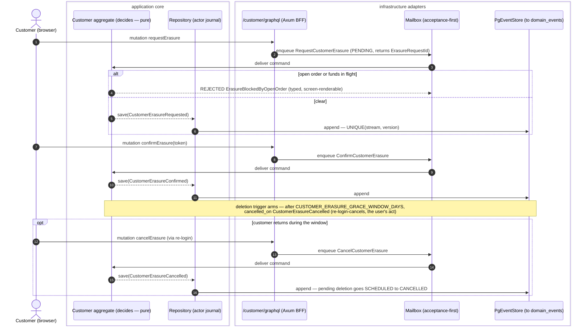
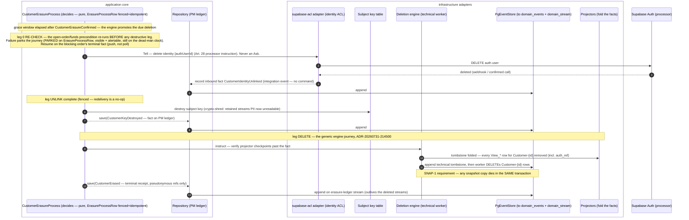

# PROP-20260829-150752 — Customer GDPR erasure: request, unlink, shred, delete, prove

- **Status**: **Approved** — founder, 2026-08-29, verbatim: *"ERASURE-PROPOSAL (PROP-20260829-150752): A — Approve Option 1"*.
  Scope choices: **Option 1 (final vision)** as recommended, all seven legs; the three §9 counsel
  questions run in **parallel** and **refine, not block** (they sharpen the invoice-field split,
  the value of W and the response wording — they never reopen the architecture). Sequencing: per
  [ADR-20260829-230418](../adr/ADR-20260829-230418-aggregates-own-the-facts-isolation-first.md),
  the build starts now that slice C1 has proved the pattern (default flipped by
  [ADR-20260830-012200](../adr/ADR-20260830-012200-the-order-birth-routes-through-the-lane.md));
  the realizing dispatch carries the two banked round-2 non-blockings (the residual EXECUTING
  checkout race; rule-1 window tracing) and the reviewer's `holds_place_order` freshness edges
  noted on [#760](https://github.com/TheCaptainCompany/captain-food/issues/760).
- **Date**: 2026-08-29
- **Tracking issue**: [#708 "No GDPR erasure flow exists for Customer — deletion blocks exist only on Order"](https://github.com/TheCaptainCompany/captain-food/issues/708)
- **Realized by**: (filled at completion)
- **Launch gate**: [ERASURE-LAUNCH-GATE](../decisions/ERASURE-LAUNCH-GATE.yaml) — decided **"A — Erasure ships first"** ([ADR-20260829-145848](../adr/ADR-20260829-145848-the-founders-answer-sheet-of-2026-08-29.md)): the first real order in Tours waits on this work.
- **Living document** (ADR-20260801-020000): this file always holds the clean current design; history is `git log -p` on it.
- **Consulted**: the full 13-lens mob spoke at the 2026-08-29 design consult; the per-lens constraints are recorded in [ADR-20260829-145848 §Consulted](../adr/ADR-20260829-145848-the-founders-answer-sheet-of-2026-08-29.md) and are this proposal's design inputs, each attributed inline below.

## TL;DR

A Tours customer must be able to be **forgotten, provably**, before the first real order — that is
the launch gate. This is **not a from-scratch build** (farley): the generic deletion engine exists,
gated OFF (`RUN_DELETION_ENGINE`, default `false`, readiness at `GET /deletion` —
[ADR-20260731-214500](../adr/ADR-20260731-214500-deletion-dsl-declarative-generic-engine.md);
verified: `crates/server/src/generated/config.rs:246`, `crates/server/src/lib.rs:1314`), and the
recorded journey — projection tombstone → technical stream deletion → pseudonymous ledger receipt —
is live on the Order pilot (`specs/ordering/actors.yaml:156-162`,
[ADR-20260731-160000](../adr/ADR-20260731-160000-order-erasure-tombstone-then-stream-deletion.md)).

What Customer lacks, and what this proposal designs (Option 1, recommended):

1. a **rejectable command pair** `RequestCustomerErasure` / `ConfirmCustomerErasure` (two-mutation
   GraphQL flow, customer role only), with a grace window and re-login-cancels;
2. a `deletion:` block on the Customer actor — the recorded grammar, reused;
3. an **unlinking** leg: revoking the Supabase identity through the identity ACL (a Tell with an
   inbound confirmation fact, never an Ask);
4. **crypto-shred** (per-subject key, destruction = erasure) for the personal data that lives on
   streams legal retention forbids us to delete — declared via a `legalRetention:` marker on the
   event;
5. a **`CustomerErasureProcess`** process manager owning the journey end to end, terminal receipt
   `CustomerErased`;
6. a **recurring, executed drill**: seed a customer through real order placement, erase, assert PII
   absent from every `View_*` row, from every subsequent replay of `domain_events`, and from the
   GraphQL surface per role — per-PR in CI, scheduled in the deployed environment once MKS exists;
7. a **backup posture W**: erasure is legally complete at deletion + W; PITR before a deletion
   re-runs the sweep; the weekly restore drill gains "erased subject absent after replay".

Three counsel questions ride the proposal (invoice-field split, the value of W, the wording of the
"what was retained" response) — named, not decided here. SNAP-1 (snapshots) is a **dependency with
a stated requirement**, not decided here.

## 1. Vocabulary — two terms, kept distinct (evans)

- **Erasure** — data destroyed: stream deletion (the pilot's meaning) and key destruction
  (crypto-shred). After erasure the data is unrecoverable by us.
- **Unlinking** — the identity mapping severed: the Supabase `authUserId` revoked at the provider
  through the identity ACL (ADR-0015 wraps Supabase; identity-only, no business data). Erasing our
  stream **without** provider-side revocation leaves the foreign model holding exactly what we
  deleted — unlinking is a mandatory leg, not a nicety.

Customer-facing copy never says "deletion" where legal retention survives: the honest sentence is
*"your account and personal data are erased; the law requires us to keep the financial record of
your orders (without your name, address or phone) for N years"* — final wording is a counsel
question (§9). The Art. 17(1)/17(3)(b) reconciliation this rests on: invoice/receipt data survives
under CGI 242 nonies A and Code de commerce L123-22 (10 years) —
[BRIEF-20260808-account-erasure-two-path.md §4](../legal/BRIEF-20260808-account-erasure-two-path.md)
carries the carve-out table, [BRIEF-20260811 G3](../legal/BRIEF-20260811-erasure-zone-and-retention.md)
carries the open closure question.

## 2. What exists, verified

| Piece | State | Where |
|---|---|---|
| Generic deletion engine (tombstone → stream deletion → ledger receipt) | **Built, gated OFF** (`RUN_DELETION_ENGINE` default `false`; gate-then-stabilize) | `crates/infrastructure/src/deletion.rs`, `crates/server/src/lib.rs:1258-1314`, [ADR-20260731-214500](../adr/ADR-20260731-214500-deletion-dsl-declarative-generic-engine.md) |
| `deletion:` DSL grammar (triggers / `after:` window / `cancelled_on:` / `receipt:`) | **Recorded and validated** (`deletion-ref-unresolved`, `deletion-match-untyped`, `deletion-tree-cycle`) | [ADR-20260731-214500 §3](../adr/ADR-20260731-214500-deletion-dsl-declarative-generic-engine.md), `tools/codegen-rs/src/validate/reminders.rs` |
| Order pilot: `OrderExpired` → tombstone → stream deletion → `OrderDeleted` receipt | **Live in the spec** | `specs/ordering/actors.yaml:156-162` |
| Customer `deletion:` block | **Absent** — no erasure path at all | `specs/customer/actors.yaml` (verified: no `deletion:` key) |
| Identity | Supabase Auth, **wrapped, identity-only** — the handler calls Supabase through the supabase-acl adapter | ADR-0015, `specs/customer/actors.yaml:14-22` |
| PM pattern: private state row per journey, per-leg Tells | **Established** (`PaymentProcessRow`, `DeliveryDispatchRow` in `crates/application/src/generated/pm_state.rs`) | `crates/application/src/process_managers/` |
| Retention-window catalog (MET-W) | **Approved, not landed** — sequenced with this work | [DECISIONS MET-W](DECISIONS.md), [BRIEF-20260811 §4](../legal/BRIEF-20260811-erasure-zone-and-retention.md) |
| Backups | CNPG, WAL archiving + weekly restore drill recorded; **no recorded erasure-vs-PITR posture** | [ADR-20260807-002705](../adr/ADR-20260807-002705-hosting-ovh-mks-cnpg-gitops.md) |
| Snapshots | **None in the tree**; SNAP-1 open (AMBER) | [DECISIONS §43 SNAP-1](DECISIONS.md) |

## 3. Option 1 — the final vision: full erasure flow (RECOMMENDED)

Presented first per [ADR-20260808-235113](../adr/ADR-20260808-235113-final-vision-first-no-intermediate-steps.md).

### 3.1 The request is a rejectable COMMAND (young, vernon, graphql)

Erasure begins as a command because it can be **refused**: an open order or funds in flight is a
set-based precondition the write side must check — an event cannot be rejected, a command can.
Two mutations, because an irreversible act takes two round-trips (graphql; the lens opinion is
posted on [#708](https://github.com/TheCaptainCompany/captain-food/issues/708) per
[ADR-20260829-082616](../adr/ADR-20260829-082616-the-graphql-lens-opines-in-the-issue.md)):

- `requestErasure` → `RequestCustomerErasure` command on the Customer actor. Throws
  `ErasureBlockedByOpenOrder` (open order / funds in flight) — typed, screen-renderable. On
  acceptance emits `CustomerErasureRequested` carrying an `ErasureRequestId` and a confirmation
  token reference; acceptance-first, the mutation returns the request id (PENDING).
- `confirmErasure` (token) → `ConfirmCustomerErasure` command. Throws
  `InvalidVerificationToken` / expired. Emits `CustomerErasureConfirmed` — the recorded fact the
  machinery reacts to.
- Status is a **nullable `View_*` query** (`erasureStatus`): REQUESTED → CONFIRMED → grace window
  running → EXECUTING → ERASED (and, post-erasure, the receipt-backed answer — §3.6). Customer
  role only.

A second `requestErasure` while one is pending is **idempotent** — it returns the SAME
`ErasureRequestId` and records nothing new (acceptance-first absorbs the duplicate; a typed
rejection would punish a double-tap for no gain). A fresh request after a cancel gets a fresh id.

The **grace window** (≤30 days, defensible per
[BRIEF-20260808-account-erasure-two-path.md §3](../legal/BRIEF-20260808-account-erasure-two-path.md))
rides the recorded `deletion:` grammar: the trigger carries `after:` a
`configuration.yaml` window ref, and `cancelled_on:` lists `CustomerErasureCancelled` — emitted
when the customer logs back in and cancels (re-login-cancels is the user's act, never an admin
resurrection). Disclosed at request time; skippable on explicit confirmed demand (counsel
question E-series, already in the packet).

**The precondition holds at PROMOTION, not only at request.** The request-time check alone
leaves an up-to-30-day gap: a customer can log back in during grace and place a **paid** order,
and a key shred at promotion would make that in-flight order's encrypted delivery address
unreadable **mid-delivery** — money moved, nobody able to act, the exact failure mode CLAUDE.md
names as the worst there is. Chosen posture — **re-check and PARK**: when the window elapses, the
journey re-runs the open-order/funds-in-flight precondition **before any destructive leg** (leg 0,
§3.3); on failure it parks (`PARKED(reason)` on the `ErasureProcessRow`, visible on the
supervision surface and still on the §3.8 dead-man's clock — a parked erasure alerts, it never
silently waits) and resumes when the blocking order records its terminal fact (the PM reacts to
the order-terminal facts it parked on — push, not poll). A paid order placed during grace does
**not** auto-cancel the erasure — the recorded intent stands until the customer cancels it; it
only defers execution. The alternative — refusing new orders while an erasure is
REQUESTED/CONFIRMED — is simpler and closes the gap at the door, but it punishes exactly the
customer who changed their mind (a returning order is the strongest cancel-intent signal there
is) and turns a privacy right into an ordering outage; it is the fallback if counsel objects to
any execution delay past the window (§9).

### 3.2 The Customer `deletion:` block — the recorded grammar, reused

```yaml
# specs/customer/actors.yaml (sketch — the realizing spec change writes the real refs)
deletion:
  triggers:
    - on: [{ $ref: 'events.yaml#/CustomerErasureConfirmed' }]
      after: { $ref: 'configuration.yaml#/keys/CUSTOMER_ERASURE_GRACE_WINDOW_DAYS' }
      match:
        event: { $ref: 'events.yaml#/CustomerErasureConfirmed/properties/customerId' }
        state: { $ref: '#/Customer/state/customerId' }
  cancelled_on: [{ $ref: 'events.yaml#/CustomerErasureCancelled' }]
  receipt: { $ref: 'events.yaml#/CustomerErased' }
```

The engine's journey is unchanged (tombstone through projections — every projector folds the
deletion fact and removes its own rows, including `View_Customer.auth_ref`
(`specs/database/tables/projection_tables.yaml:395`), the access-control artifact
[#708](https://github.com/TheCaptainCompany/captain-food/issues/708) names — then technical
tombstone, stream deletion from `domain_events` + `domain_stream`, ledger receipt). What Customer
adds beyond the pilot is **bespoke legs**, which is exactly the recorded escape hatch of
[ADR-20260731-214500 §4](../adr/ADR-20260731-214500-deletion-dsl-declarative-generic-engine.md):
*"an aggregate needing bespoke steps falls back to a hand-written PM — `deletion:` is sugar over
the same machinery."*

### 3.3 `CustomerErasureProcess` — a PM with its own state row, per-leg Tells (vernon)

The journey has multiple legs against multiple stores and one external party; a process manager
owns it, in the established pattern (`crates/application/src/process_managers/`, private state in
`crates/application/src/generated/pm_state.rs` — the `PaymentProcessRow` shape): an
**`ErasureProcessRow`**
keyed by `ErasureRequestId`, one column per leg, fenced and idempotent (re-delivery re-asserts a
completed leg as a no-op). Per-leg **Tells, one aggregate per transaction**; the identity leg is a
**Tell with an inbound confirmation event, never an Ask** (PMW-3 stands not-adopted —
[DECISIONS §42](DECISIONS.md)):

0. **Re-check** — re-run the open-order/funds-in-flight precondition at promotion (§3.1). Failure
   parks the journey (`PARKED(reason)`, alertable); resumption on the blocking order's terminal
   fact. **No destructive leg runs before this passes.**
1. **Unlink** — Tell the supabase-acl adapter to delete the identity at the provider (an Art. 28
   processor instruction). The provider's completion comes back as an **inbound integration
   event** `CustomerIdentityUnlinked` recorded through the ACL (an external fact that already
   happened — no command, ADR-0004). Failure is retried under the mailbox's ordinary machinery;
   a stuck leg is visible on the supervision surface and alertable (§3.8).
2. **Shred** — destroy the subject's key (§3.4). Recorded as `CustomerKeyDestroyed` (fact, on the
   PM's ledger — the key row itself is gone).
3. **Delete** — the generic engine's journey for the `Customer-{id}` stream: verify projection
   checkpoints past the fact, append the technical tombstone, the technical worker deletes the
   stream rows.
4. **Receipt** — terminal `CustomerErased` on the erasure ledger (the `OrderDeleted` shape,
   [ADR-20260731-160000 §6](../adr/ADR-20260731-160000-order-erasure-tombstone-then-stream-deletion.md)):
   pseudonymous references only — `customerId`, the policy, the per-leg completion stamps, when.
   Never the erased payloads. This receipt is what makes "is this customer really gone?" a
   queryable, durable answer that outlives the streams — and it backs the post-erasure status
   response (§3.6).

Ordering rationale: the re-check strictly first (nothing irreversible happens against an
in-flight order); unlink **before** stream deletion (while our record of `authUserId` still
exists to address the instruction); shred before or with deletion (key destruction is what makes
the retained streams' PII unreadable); the receipt strictly last. Third-party PII holders beyond
Supabase (Stripe, HubRise, delivery partners, OVH SMS) are handled per the recipient/processor
map (§9.6) — named, never silently absent.

### 3.4 Crypto-shred for `legalRetention`-bearing data (dba, legal)

Stream deletion cannot be the whole answer: the customer's orders carry financial facts French law
retains for 10 years (L123-22), and those `Order-*` streams also carry the customer's personal
data — delivery address, phone — plus the Supabase `sub` in the append-only
`domain_events.user_id` envelope column ([BRIEF-20260811 G4](../legal/BRIEF-20260811-erasure-zone-and-retention.md):
after provider-side deletion, whether the orphaned `sub` is still personal data is the question
that decides whether crypto-shredding is optional or mandatory; we design as if mandatory, which
is also [PROP-20260726-170000 D3](PROP-20260726-170000-event-log-integrity-evolution-and-erasure.md)'s
recommended mechanism).

Design:

- **A per-subject key table**: one key per `customerId`, created at registration
  (`CustomerRegistered`). PII fields on events destined for retention-bearing streams are
  encrypted under the subject's key at append time; **key destruction = erasure** — the log stays
  append-only forever, the ciphertext becomes noise.
- **Scope of encryption**: the personal fields of events on streams that survive erasure (the
  order's delivery address/contact snapshot), plus the `user_id` envelope value for those rows.
  The financial facts (amounts, VAT, dates, refs) stay plaintext — they are what retention keeps.
- **The declaration is on the event, not in prose**: a **`legalRetention:`** clause on
  `events.yaml` entries naming the instrument and the window, `$ref`ing the MET-W approved
  retention-window catalog (the shape [BRIEF-20260811 §3](../legal/BRIEF-20260811-erasure-zone-and-retention.md)
  already specified). Two validator rules then write themselves, spec-keyed:
  1. **a `deletion:` trigger may not undercut retention** — scoped **per trigger**, not per
     actor: the trigger's effective window (`after:` ref) must be at least the longest
     `legalRetention` window among the events reachable from the actor's `emits`, and an
     `indefinite` window (the Art. 21 register) bars stream deletion outright. Per-trigger
     scoping is what reconciles the rule with the **live Order pilot**:
     `ORDER_RETENTION_WINDOW_DAYS` defaults to **3650 days** — deliberately at the conservative
     accounting horizon because the per-category split is open
     (`specs/ordering/configuration.yaml:107-119`) — so the pilot's stream deletion never
     precedes retention expiry and passes the rule as-is; the same rule is the gate that protects
     the `RestaurantListingOptedOut` Art. 21 register from an Order-shaped deletion (the
     BLOCKER-on-arrival BRIEF-20260811 §3 recorded);
  2. every `legalRetention` event must name a window from the catalog.
- **This closes the left-open item of
  [ADR-20260731-160000](../adr/ADR-20260731-160000-order-erasure-tombstone-then-stream-deletion.md)**
  ("personal data tombstones early while financial facts survive — OR the skeleton is exported
  before phase 2"): the financial skeleton survives **in place** — plaintext financial facts on
  retained streams, personal fields shredded — the G3 closure-(A) posture, held pending counsel's
  G3 answer on which closure is more defensible.
- **Which order fields are invoice data** (and must stay plaintext) vs personal data (encrypted,
  shredded) is **counsel's to confirm, not ours to decide** — named in §9, sharpening
  [G3](../legal/BRIEF-20260811-erasure-zone-and-retention.md). The proposal's default pending
  counsel: encrypt everything that identifies the person, keep amounts/VAT/dates/references
  plaintext.
- Projectors must tolerate redacted payloads (D3's known cost): a fold meeting
  undecryptable PII renders the tombstoned/absent form, deterministically.

### 3.5 Restore-by-replay reproduces erasure, and the backup posture W (dba)

- **The projector folds the tombstone**: a full rebuild replays `domain_events`; a deleted stream
  is simply never seen (erasure by construction), and a retained stream's shredded fields cannot
  decrypt — so **replay reproduces erasure deterministically**. This is the property the drill
  asserts (§3.7).
- **NEW recorded posture needed** (register check: WAL archiving + weekly restore drill are
  recorded in [ADR-20260807-002705](../adr/ADR-20260807-002705-hosting-ovh-mks-cnpg-gitops.md);
  no erasure-vs-backup posture exists anywhere in `docs/adr/` or `docs/decisions/` — searched
  `PITR`, `backup retention`, `WAL retention`):
  1. backup/WAL retention window **W** (suggest **30 days**; counsel confirms, §9);
  2. erasure is **legally complete at deletion + W** — the subject's response says so (§3.6);
  3. **PITR never restores to a point before a deletion without re-running the sweep**: the
     erasure ledger (receipts) survives independently and is the worklist the sweep re-executes
     after any restore;
  4. the **weekly restore drill gains an assertion**: erased subject absent after replay.
- Backups lag lawfully on the rotation cycle if documented and never restored without re-applying
  erasure ([BRIEF-20260808 §3](../legal/BRIEF-20260808-account-erasure-two-path.md), grade (b)) —
  this posture is a **design statement plus an executed drill**, not a fakeable unit test (beck).

### 3.6 The response tells the data subject what was retained, on which limb (legal, ux)

The post-erasure status surface (and the confirmation email/SMS wording) states, per category:
erased (account, addresses, preferences, conversations, identity link) vs retained (the financial
record of orders — instrument and window, from the `legalRetention:` declarations, so the screen
is **generated from the same source as the enforcement** and cannot drift from it). Exact French
wording: counsel question (§9). All copy via i18n keys (§6). On the do-not-contact suppression
row of the carve-out table: **no customer-side prospection exists at V0** (prospection is
restaurant-side SIRENE), so no customer suppression entry is retained — the Art. 21 register
concern stays restaurant-side, protected by validator rule 1 (§3.4); if customer marketing ever
ships, its suppression entry joins the retained list then.

### 3.7 The proof is a round-trip ABSENCE test, executed recurringly (beck, farley)

Done means the declared journey through the ordinary pipeline **plus an executed recurring
drill** — never "event emitted":

1. **Seed through real placement**: register a customer (real command path), place an order
   through checkout, generate conversations/addresses — the realistic PII spread.
2. **Erase**: `requestErasure` → `confirmErasure` → clock advanced past the grace window → engine
   runs.
3. **Assert absence**: the seeded PII values (phone, name, address strings) appear in **no
   `View_*` row**, in **no output of a full projection REPLAY of `domain_events`**, and on **no
   GraphQL surface, per role** (customer/restaurant/admin composed schemas). Assert presence of:
   the tombstone, the `CustomerErased` receipt, the retained financial skeleton.
4. **Cadence**: per-PR in CI against local Postgres; **scheduled in the deployed environment once
   MKS exists**; the weekly restore drill's new assertion (§3.5) is the backup-side twin.

### 3.8 Observability contract (observability lens — shape agreed at consult)

A `specs/observability.yaml` workflow (`feature: customer-erasure`, criticality high):

- **Spans**: `command.receive` (request/confirm) → per-store `erasure.store.purge{store}` (one per
  leg: views, key table, identity provider, stream) → terminal append.
- **Identity is pseudonymous**: `aggregate_id` survives as the tombstone reference; **never**
  email/phone/name in span attributes.
- **Metrics**: `erasure_duration_ms` (request→receipt), `erasure_store_failed_total{store}`.
- **Dead-man**: the Art. 12(3) 30-day clock, **anchored at `CustomerErasureRequested` receipt** —
  the month runs from receipt of the request, and the confirmation step is OUR safeguard, so it
  may not eat the subject's clock. The confirm token therefore expires (72 h proposed): an
  unconfirmed request lapses visibly on the status view instead of silently consuming the month.
  Overdue = requested + 30 d + no receipt and no recorded cancel/lapse; a `PARKED` journey (§3.1)
  stays on the clock and alerts **with its parked reason**. Fires on SILENCE, not on a signal
  arriving (the monitoring carve-out of
  [ADR-20260810-231300](../adr/ADR-20260810-231300-no-polling-only-pushing-polling-as-graceful-fallback.md)).
- **Partial purge is `technical_error`, never silent**: any leg failed while others succeeded is
  a red status, on the supervision surface.

Operational telemetry stays on OTLP/Honeycomb (it must work when Postgres is down); the sweep
itself is time-triggered work — outside the push doctrine, the recorded carve-out (young).

### 3.9 SNAP-1 — a dependency with a stated requirement, not decided here

[DECISIONS §43 SNAP-1](DECISIONS.md) (where snapshots live, and how they meet upcasting and
erasure) is a separate open decision. **What erasure requires of whatever SNAP-1 decides**
(young's SNAP-1 row already states the principle): a snapshot — and every derived copy — is a
**second copy** of the data the events carried; **deleting the stream while a snapshot survives
erases nothing**. So SNAP-1's chosen mechanism must (a) make snapshots enumerable by stream, (b)
delete them **in the same transaction** as the stream deletion (enforced, not remembered), and
(c) fall inside the drill's absence assertion. No snapshot mechanism exists in the tree today, so
Option 1 is buildable now; the requirement binds SNAP-1 whenever it lands.

## 4. Sequence diagrams

### 4.1 Request → confirm → grace window (acceptance-first)



<a href="https://mermaid.live/view#pako:eNqNVdtu2kAQ_ZURL3UkUNqqT6iKBMahVOESCIoqRULL7uBss9519pKLovx7Z8EmKRAFP4F35sycc2bWLw1uBDba0HB4H1Bz7EmWW1bcaKCHBW90KJZoq__cGwspMAdpcN4UaCFZWvPo0J5sQpbmCVhZKsmZl0YDNxY3J_EpmfWSy5JpD-l8dvUfEstziznzCIlALgU6uAnfv377AWWweHIYZZpNxhFliqVxktp7hmTT5l8TrGaqykMt3hqUemWZ8zZwT8jABCs9Wne4Qv_yIhY45VWfp6RPeXuvIOk8hQK65-cftDbsxrwhkyrWpK44lp6Rxq2VtM5_kDXpx6xJnj2g9jMiQnJ4A8IUTOoFxrdul1PaOjujNttQBL-R3UY7nc-IZqgNoAiKG3bblEinAUm0dVTtQBUNySQb9QajfpNgSCDtoDqp4geiamDYJcDoYxsEKvlAJnJTFKzuiykPpkQNxgo6I1NWQQtH-sNKyfzWv0kQUVpVe9Psd5ZeZb26bFcZfoei-zwmrPEaKvHPJYomOG4RdcuSFGjZUtVjgsohcIXM7peII9MGxx4w2WFe8UPxzpsYTUmTfjvONdWph3I-GlzOs4TGCFnRBCLvSPnPreFGk_9FVZK8vcM6a9-hdBO80-dx6n_Ot0Lf8t3junk9MrSTJuJHyGY8poK4ZuOtzPO4vLbYritb-Sp2PMymi2zamc2n2aI_7aTZ4now6o2vF73On1nz59KenvG4EkqhWBDcboP1GSQWW8rkUrc28a4J_hYh0M3zxcWLqaJgSg_1pm7HVwQrdb5OeJRamMd3Q7Hvzxp_uwsPkkFd-91YHLBqnXfQqWPcOtKxWpBjJjT-jry3ZuWG7tRZ-ivrzS9ovehaSTujNLugP9uxbTShQfXothH0XXhpkGjF-gshcMWC8o3X13_U_geo" target="_blank" rel="noopener noreferrer">Open this diagram with pan and zoom on mermaid.live — on github.com use Ctrl/Cmd+click or middle-click to get a NEW tab (GitHub strips target=_blank)</a>

### 4.2 The erasure journey — unlink, shred, delete, receipt



<a href="https://mermaid.live/view#pako:eNqNVmtvIkcQ_CstvmSdY23sXB5CkSVi9i6ObYzwOVKkk07DTANz7M7szcMEWf7v6d7ZBc4PKUh82MdUdVdXFzz2pFXYG0LP47eIRuJYi6UT1WcD9BExWBOrObp0Pbf_gqjrUksRtDUgrcP0hD-1cEFLXQsTYHoDwsNF9MFW6AonfHQ4dVai95AplFqhh8_xbHD6Hmp61ofvX5rZDSy4IPWOXq1qG9CEo9fJZsX0lulmWFuvg3VbyKiAEtUSXXsGjdr3oM2CyIKLMhAjCCXqgM6_jj66uGZwH2sxFx5zIcvuBGRUmwk6bPmtN6q7Kv7h83dx_hVlgDVuIYh5-YZwxeQjvz3GEhuJ0Sy1QcgCypUh3UvYWLfetfVC9-b0dFk8UF13JAUftaBsJbT5gnzXw7vumiRAUb0FNbv9qwFzlgu3jga3sKWCsEJYCBn8c2kPT9_dT0ep7SQbjGJYQVan6dqu_gnNFewDSTm9GQI5TyJstFE0fSxF7VGBWLDSz6x0Yc1Cu4oetx7iolqtiKMiWN_cU5G-rZivUZa4hAE5KL_4s7i4OkSzNZrcOoXuZBGN8oSL0hqlm7k4zF00Hv4oPtzOChBmSzTJUvoBGfb497k7Of8gdMkeI23WqaKvNjqDbNHR7KoYA4G9sH4fHrTXZBKalSjRNYbpgw-6LPlA0xkKlVeCtrC0cn2U6GboY4XdK3N-os0SmjZ-IH50lTZkIp4fTSP6VR-MDVDbsmxHMr3Jz8_JzkP4hMTWKtJoiLDz-yNlw-reo7tUT5CNXDiGs99gN15asVYMa46OYYKsN9U68uvjREMMxMM2GcK4uC4-FRw3K4i-Sxt-lne1JH4F2QbnK2vXcELp03mA1qKrnmHpDEfCEHhgTlEtc0sTTE13RrpsO7k3pTZrRtYmIDkwrR1vSte7scRVkdSqJWF0Ipl-HHIc7vz_0ln3k-vLyRWfrhv5shRpHbBDaovsQoGlPQgiym19OAbKjmHyld1SAu0TJJNuWweb-xVhcKOB9pmA00bT0l5eEtoGoqFrxe7Zw-7k8eIBs06PK9yOE9G-vkYwUuN5mP6P_vscH0mEdroHq7VEg07LbmHbjejDaDzLzwZnvwx-_ek0Pzt9__NgcCAGReNw56sOjtj0YsvGSyEFcoVyXVvNQVdTyO_iKiERCFfeFEd9z6l5qoBzbd82NhP5W-Pmy4_g-IfI7gMof9TkeIcVNdqYRpbHjXO_OFwcfUeykwf26b3j7HNhpk3zViP_nMVu_HNpCbvPyHeT0TQ_pUK-RU3VHNiVs8gbCs8VLba0NSWTpjTUKRPuRjcFBCeMF3Ifim_agqPpIGW7_KDNQl2HPlBER2XNtrLR092FJ7-U27d8wmbCFHZ5clTrWMhsDLwKbWq3297a-ajXhx4VQz9aiv6sPPbonar526JwIWIZek9P_wF6iPIy" target="_blank" rel="noopener noreferrer">Open this diagram with pan and zoom on mermaid.live — on github.com use Ctrl/Cmd+click or middle-click to get a NEW tab (GitHub strips target=_blank)</a>

## 5. Screen mockups (one per use case, ux journey)

All copy through i18n keys (stubs below, §6); French text final wording pending counsel (§9).

### 5.1 Request erasure — from `/account`

Delete is as findable as any account action (equal prominence — the dark-pattern condition,
[BRIEF-20260808 §2](../legal/BRIEF-20260808-account-erasure-two-path.md)).

```
┌────────────────────────────────────────────┐
│ ← Account                                  │
│                                            │
│  Delete my account and data                │  key: account.erasure.title
│                                            │
│  What happens:                             │
│  • Your account, addresses, preferences    │  key: account.erasure.explainer.erased
│    and messages are permanently erased.    │
│  • The law requires us to keep the         │  key: account.erasure.explainer.retained
│    financial record of your orders         │  (generated from legalRetention: declarations)
│    (without your name or address) for      │
│    {years} years.                          │
│  • You have {days} days to change your     │  key: account.erasure.explainer.grace
│    mind — logging back in lets you cancel. │
│                                            │
│  [ Request deletion ]                      │  → mutation requestErasure
│                                            │
│  ⚠ You have an order in progress. You can  │  error: ErasureBlockedByOpenOrder
│    request deletion once it is complete.   │  (typed rejection, rendered honestly)
└────────────────────────────────────────────┘
```

### 5.2 Confirm erasure — the second round-trip

```
┌────────────────────────────────────────────┐
│  Confirm deletion                          │  key: account.erasure.confirm.title
│                                            │
│  We sent a confirmation code to your       │  key: account.erasure.confirm.body
│  phone. Enter it to confirm — this         │
│  cannot be undone after {days} days.       │
│                                            │
│  Code: [ _ _ _ _ _ _ ]                     │
│                                            │
│  [ Confirm deletion ]                      │  → mutation confirmErasure(token)
│  [ Keep my account ]                       │  → back, nothing recorded
└────────────────────────────────────────────┘
```

### 5.3 Status — "what was erased, what was retained and why"

Backed by the nullable `erasureStatus` query (pre-receipt: the `View_*` row; post-receipt: the
ledger receipt).

```
┌────────────────────────────────────────────┐
│  Your deletion request                     │  key: account.erasure.status.title
│                                            │
│  Status: scheduled — runs on {date}        │  key: account.erasure.status.scheduled
│  Logging in before then and choosing       │  key: account.erasure.status.cancel_hint
│  "Keep my account" cancels it.             │
│  [ Keep my account ]                       │  → mutation cancelErasure
│  ──────────────────────────────────────    │
│  After completion:                         │
│  ✓ Erased: account, addresses,             │  key: account.erasure.status.erased_list
│    preferences, messages, identity link    │
│  ◦ Retained (legal obligation):            │  key: account.erasure.status.retained_list
│    financial record of {n} orders —        │  (instrument + window, generated from
│    Code de commerce L123-22, {years} yrs   │   legalRetention: declarations)
│  Reference: {erasureRequestId}             │  the pseudonymous receipt reference
└────────────────────────────────────────────┘
```

## 6. Spec footprint of Option 1 (the realizing change, on approval)

- `specs/customer/commands.yaml`: `RequestCustomerErasure`, `ConfirmCustomerErasure`,
  `CancelCustomerErasure`.
- `specs/customer/events.yaml`: `CustomerErasureRequested`, `CustomerErasureConfirmed`,
  `CustomerErasureCancelled`, `CustomerErased` (receipt); inbound `CustomerIdentityUnlinked`.
- `specs/customer/errors.yaml`: `ErasureBlockedByOpenOrder` (typed context, en/fr).
- `specs/customer/actors.yaml`: the receives + the `deletion:` block (§3.2);
  `specs/customer/processmanager` entry for `CustomerErasureProcess`.
- `specs/common/` (kernel): the retention-window catalog (MET-W, sequenced with this work) and the
  `legalRetention:` event clause + its two validator rules (§3.4).
- `specs/customer/api.yaml`: `requestErasure` / `confirmErasure` / `cancelErasure` mutations +
  `erasureStatus` query (customer role only — role = path).
- `specs/database/`: the subject-key table, the erasure-status `View_*`, the PM state table.
- `specs/observability.yaml`: the `customer-erasure` workflow (§3.8).
- `specs/stories.yaml` / `specs/tests.yaml` / `rules` / `screens/` / translations: the ADR-0032
  completeness set — every new command/event/error gets its behaviour test, every new
  mutation/query its story step, the three screens land with their sidecar translations.
- Stored-event-shape class throughout: **`HOLD: human`** on execution, full-mob briefing,
  versioning story recorded before anything lands.

## 7. Options considered

### Option 1 — Full erasure flow (final vision) ✅ RECOMMENDED

| Pros | Cons |
|---|---|
| The only option that makes "a Tours customer can be forgotten, provably" TRUE — satisfies the launch gate on its own terms | Largest scope: key management joins the critical path, and every projector must tolerate redacted payloads |
| Reuses everything recorded: the deletion engine, the `deletion:` grammar, the PM pattern, the ledger receipt — no new machinery class | Crypto-shred touches append-time encoding of retained-stream events — a stored-event-shape change needing its versioning story |
| Closes the G4 trap (orphaned Supabase `sub`) and the BRIEF-20260811 §3 register trap with one spec-keyed marker | Depends on MET-W (retention catalog) landing with it, and states a requirement on SNAP-1 |
| The response screen is generated from the same `legalRetention:` source as the enforcement — copy cannot drift from behaviour | Three counsel questions must resolve before the retained/erased boundary is final (build can start; the boundary is config + catalog) |
| The drill is executable per-PR from day one (engine + local Postgres already in CI) | |

### Option 2 — Pilot parity only (stream deletion + receipt, no crypto-shred, no unlinking)

| Pros | Cons |
|---|---|
| Smallest diff: a `deletion:` block on Customer, the two commands, done in days | **Legally insufficient alone**: the customer's PII survives on retained `Order-*` streams (address, phone, the `sub` in `domain_events.user_id`) — "erased" would be false the moment counsel reads G3/G4 |
| No key management | **Leaves the foreign model holding what we deleted**: without the unlinking leg the Supabase identity survives — the Art. 28 instruction never happens (evans) |
| | An Order-shaped whole-stream deletion generalized without the `legalRetention:` gate is exactly the register-destroying trap BRIEF-20260811 §3 records as BLOCKER-on-arrival |
| | Would need to be rebuilt as Option 1 anyway — the intermediate step ADR-20260808-235113 forbids when the final step can be built |

### Option 3 — Manual/off-system process for V0 (a runbook, a human, a support inbox)

| Pros | Cons |
|---|---|
| Zero code before launch | **Fails the provable-drill bar**: no round-trip absence test can exercise a human process per-PR; "forgotten, provably" becomes "forgotten, hopefully" |
| | Art. 12(3)'s 30-day clock enforced by nobody: a missed email is a CNIL complaint (the classic trigger, Art. 83(5)(b) tier) |
| | Manual deletion against an append-only event store is not even *possible* correctly — a human cannot crypto-shred or safely delete streams by hand; the runbook would instruct the exact mutations the architecture forbids |
| | The founder's decision is "erasure ships first" — a runbook does not ship erasure |

**Recommendation**: Option 1, sliced per holub — the smallest slice that makes the sentence true
is the whole vertical: request → confirm → grace → unlink → shred → delete → receipt → drill.
What is deliberately **not** in the slice: Art. 18 restriction (G8 — designed with, built after
counsel answers whether filtered-at-read suffices), dormant-account auto-sunset (the ~3y
notify-then-delete window — G6, its own scheduled work), and Restaurant/Cart retention sweeps
(the same engine, separate dispatches). The `legalRetention:` marker + validator rules ARE in the
slice because the deletion block is unsafe to generalize without them. **Third-party PII holders
are in the slice as a drawn artifact, not silently absent**: the recipient/processor map (§9.6 —
Stripe, HubRise, delivery partners, OVH SMS) is drawn with the realizing change and the Supabase
instruction leg ships in it; outbound instructions/notifications to the OTHER holders ship per
the map's counsel-confirmed answer — deferred per
[BRIEF-20260808 §2](../legal/BRIEF-20260808-account-erasure-two-path.md)'s recorded grade-(b)
"Art. 19: map, likely minimal", never by omission.

## 8. Drawbacks (why we might regret the whole thing)

- **Key management is forever**: a per-subject key table becomes critical infrastructure — its
  loss is mass data loss, its leak undoes erasure claims. Backup/rotation discipline is a
  permanent operational tax.
- **Every future projector inherits the redacted-payload obligation** — a fold that panics on
  undecryptable PII is a new bug class the drill must keep catching.
- **The retained/erased field boundary is load-bearing legal surface**: if counsel later moves a
  field across it (e.g. "the delivery address IS invoice data"), re-encoding retained streams is
  a migration, not an edit.
- **Erasure semantics constrain every future storage feature** (snapshots, caches, exports,
  analytics): each new copy of customer data must join the enumeration the drill asserts over.
  That is the point — but it is a permanent design tax this proposal knowingly takes on.

## 9. Unresolved questions (copied to #708's checklist on approval)

Register check: searched `docs/legal/` (G1–G8 packet), `docs/decisions/`, `docs/adr/` for prior
answers; G2/G3/G4 are recorded open counsel questions — cited, not re-asked; the backup window W
and the response wording have no recorded row (searched `PITR`, `backup retention`, `WAL
retention`, `response wording`).

1. **Invoice-field split** (sharpens [G3/G6](../legal/BRIEF-20260811-erasure-zone-and-retention.md),
   grade (b)): which `Order` fields are invoice/accounting data (plaintext, retained under CGI 242
   nonies A + Code de commerce L123-22) vs personal data (encrypted, shredded)? Counsel names the
   list; the proposal's default (identifying fields encrypted, financial facts plaintext) is a
   posture, not a decision.
2. **The backup window W** (new — no recorded posture): is 30 days a defensible W such that
   erasure is legally complete at deletion + W, with the PITR-re-runs-the-sweep rule (§3.5)?
   (Meta's "up to 90 days" is persuasive precedent per BRIEF-20260808 §3, grade (b).)
3. **Response wording** (new; adjacent to [G2](../legal/BRIEF-20260811-erasure-zone-and-retention.md)'s
   receipt-proportionality question): the exact French copy for "what was retained on which limb"
   (§3.6/§5.3) — counsel-confirmed before the screens ship.
4. **SNAP-1 interaction** (dependency, decided elsewhere —
   [DECISIONS §43 SNAP-1](DECISIONS.md)): erasure states its requirement (§3.9: same-transaction
   snapshot deletion, enumerable by stream, inside the drill); the row itself stays open and is
   not decided here.
5. **Immediate execution on demand** (already in the E-packet, grade (c)): may the subject skip
   the grace window? Designed skippable pending counsel.
6. **The recipient/processor map at erasure time** (new as a drawn artifact;
   [BRIEF-20260808 §2](../legal/BRIEF-20260808-account-erasure-two-path.md) records the question:
   *"Art. 19 recipient notifications: map, likely minimal (b)"* — cited, not re-asked): who holds
   the subject's PII when an erasure runs — **Stripe** (name/payment PII from the first real
   order; partly an independent controller for its own legal obligations), **HubRise** (order
   payloads pushed to the partner POS), **delivery partners** (Uber Direct / CoopCycle job
   payloads: name, address, phone), **Supabase** (the unlinking leg, already in-slice), **OVH
   SMS** (message logs). Per holder: does an Art. 28 instruction or an Art. 19 notification
   issue, on what trigger, and does the holder join the drill's enumeration? The map is drawn
   with the realizing change; the brief's grade-(b) "likely minimal" is the presented default,
   counsel confirms the per-holder answers.
7. **Parking vs blocking during grace** (the §3.1 posture): does counsel accept a PARKED erasure
   — execution deferred past the window by the subject's own in-flight paid order, alerting the
   whole time — as Art. 12(3)-compliant handling, or does the fallback (refuse new orders while
   an erasure is pending) become required?

## 10. Verification plan

- `make validate` 0 errors on the realizing spec change (ADR-0032 completeness enforced: tests,
  stories, rules for every new command/event/error/mutation).
- The round-trip absence drill (§3.7) green per-PR in CI before the PR that flips anything on.
- **A mutant run proves the drill can fail**: run once with the shred leg (or one purge store)
  deliberately skipped and assert the drill goes RED — a drill that cannot detect a skipped leg
  proves nothing (beck: the proof is the absence assertion, not the run's existence).
- **Flake posture**: a flaking absence drill is a BLOCKING failure, never a retry-until-green —
  a nondeterministic "gone" is indistinguishable from "not gone".
- `RUN_DELETION_ENGINE` stays gated: the Customer journey is smoked gated-ON in a non-production
  profile first; the default flip is its own one-line ADR (gate-then-stabilize — the recorded
  precedent on this exact toggle).
- The weekly restore drill's "erased subject absent after replay" assertion executed at least
  once before the launch gate is declared satisfied.
- `HOLD: human` on every executing PR (stored event shapes, erasure, legal surface — the named
  class).
