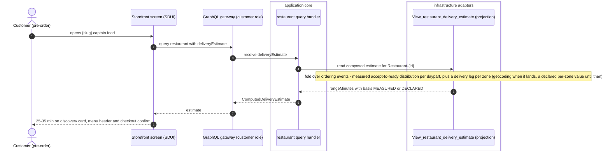
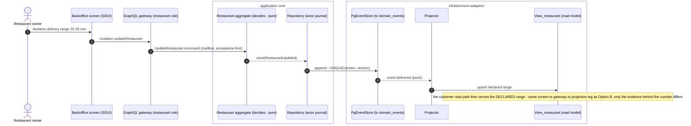
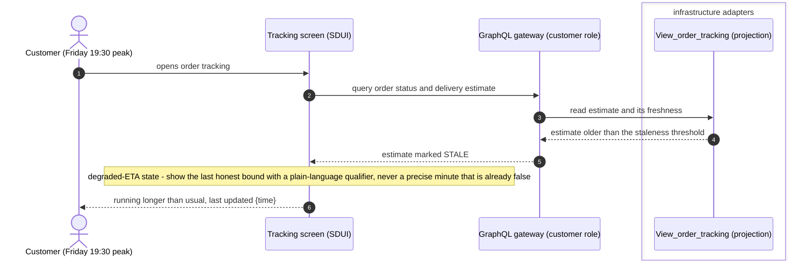

# PROP-20260829-165042 — Pre-order delivery ETA: computed estimate vs declared range

- **Status**: Proposed
- **Date**: 2026-08-29
- **Tracking issue**: [#733 "Storefront pre-order delivery ETA: the slot is now honestly empty — and the ETA is the product"](https://github.com/TheCaptainCompany/captain-food/issues/733)
- **Realized by**: (filled at completion)
- **Commissioned by**: founder answer *"C — Team drafts the proposal with both options"* (2026-08-29,
  [ADR-20260829-145848](../adr/ADR-20260829-145848-the-founders-answer-sheet-of-2026-08-29.md)).
- This file is a LIVING DOCUMENT (ADR-20260801-020000): it holds the clean current design; history
  lives in `git log -p`.

## 1. Context — the slot is honestly empty, and that is a conversion tax

[#717 "Wire the screen-binding gate: 13 template bindings on three screens name fields their types don't have"](https://github.com/TheCaptainCompany/captain-food/issues/717)
removed the storefront's ETA widget because it rendered `undefined–NaN min` off a field the api
`Restaurant` type never carried. The screen now declares the concept gap
(`specs/screens/restaurant_frontoffice.yaml`, `restaurant` screen `gaps`): *"Pre-order delivery
ETA: no domain concept computes a customer-facing delivery estimate (preparationTimeMinutes is
prep, not delivery — binding it would show a false ETA). The ETA slot is honestly empty; THE
priority gap on this screen (the ETA is the product)."*

The domain lens (CLAUDE.md) makes the stake explicit: **the estimate shown before ordering is the
number the customer decides on**. Every storefront session now reaches checkout without it —
heaviest at Friday/Saturday 19:00–21:30 peak, the exact window where most of the funnel runs.

**The business position this proposal is built on: honest over optimistic.** An ETA that is wrong
converts once and churns forever; #717 established that a false ETA is worse than none. Whatever
ships must be a number we can stand behind at peak, or must say plainly that it cannot.

## 2. Vocabulary (ubiquitous language — two terms, no synonyms)

Today the word "ETA" covers two different things, and the conflation already produced one defect:

- **`DeclaredPrepEstimate`** — the restaurant's DECLARED statement about preparation. Existing
  lineage: `Restaurant.preparationTimeMinutes` (declared base prep time) and
  `OrderAcceptedByRestaurant.estimatedReadyAt` (the per-order declared ready instant, set at
  acceptance via `AcceptOrder`). A declaration is testimony: nobody computed it, and it says
  nothing about the delivery leg.
- **`ComputedDeliveryEstimate`** — the customer-facing number: WHEN THE FOOD ARRIVES, composed by
  the platform from a prep signal plus a delivery leg. It is always computed, never typed by
  anyone, and it is the only thing a customer screen may label as an ETA.

Everything customer-facing uses the `Computed…` term; everything restaurant-authored uses the
`Declared…` term. No synonyms, no bare "eta" naming either one.

**The `eta_bar` conflation, named for fixing under the same vocabulary.** The order-tracking
screen (`specs/screens/restaurant_frontoffice.yaml:555`) binds
`estimated_time: "{{ order.estimatedReadyAt }}"` under the `order.eta` label — a Declared prep
instant presented as an arrival estimate. For a DELIVERY order in `OUT_FOR_DELIVERY`, the moment
the food left the kitchen its declared ready-instant is *by construction* not the arrival time.
The realizing slice rebinds the tracking bar to `ComputedDeliveryEstimate` (which, for a
COLLECTION order, degrades to the declared prep estimate — the customer collects at ready time, so
there the two legitimately coincide). That fix rides whichever option is chosen.

## 3. The journey — ETA continuity is the spine (ux)

One number, carried through the funnel without changing meaning:

**discovery card → menu header → checkout confirm → tracking.**

The customer first sees the estimate where they choose the restaurant, re-reads it while building
the cart, confirms against it at the moment money moves, and then watches it resolve into reality
on tracking. Breaking continuity (a range on the menu, silence at checkout, a different number on
tracking) reads as bait-and-switch even when each number is individually defensible. Note on
discovery: with host-as-tenant (`{slug}.captain.food`, the storefront root IS the restaurant page),
the "discovery card" surface is any listing that carries a restaurant card — the badge component is
specified once and appears wherever such a card exists.

## 4. The options

Final-vision option first (ADR-20260808-235113). The letters match the commissioning consult.

**The degenerate baseline, rejected explicitly: stay empty (the current live state).** The #717
posture — no widget, an honest declared gap — has real pros: zero false-promise risk and zero
running cost (no evaluator, no staleness handling, no copy to maintain). It is rejected because
the conversion tax is permanent and peak-weighted: every storefront session reaches checkout
without the one number the customer decides on, and the ETA is the product. Honest silence was the
right EMERGENCY fix for a false number; it is not a position to hold through more Friday peaks
than the dependencies force.

### Option B — Computed delivery estimate (the final vision)

`ComputedDeliveryEstimate` = prep signal + delivery leg, maintained as a read model and served
through the customer GraphQL role:

- **Prep signal**: starts from the `DeclaredPrepEstimate` lineage (`preparationTimeMinutes`,
  per-order `estimatedReadyAt` at acceptance), and matures into a **measured** distribution —
  **GAP(read-model), named now**: no projection today aggregates actual accept→ready durations per
  restaurant per daypart. That fold over the ordering events is new, deliberate work (and it is a
  fold, so it replays — a counter cannot express it).
- **Delivery leg**: needs distance. **Dependency, cited**: DECISIONS row **PROP-172500 D1** —
  *"Delivery-area model: Postal-code sets now, geocoding next — ✅ decided by ensemble consent
  2026-08-08 (ADR-20260808-171056; veto open)"*, with the row's own margin note: *"Geocoding
  unlocks distance fees and honest ETAs — sequence it deliberately."* Until geocoding lands, the
  delivery leg is a per-zone declared value (which pairs naturally with the per-zone delivery-fee
  decision, PROP-165000 D4).
- **Composition**: served with a `basis` discriminator (`MEASURED` | `DECLARED`) so the screens —
  and later the business metrics — always know what kind of claim they are making.



<a href="https://mermaid.live/view#pako:eNp1U8tu2zAQ_JWFTg5g5dAiFx8CBLJhFEgKOELsSwFjTa4kthSp8mHXNfzvXUqykwaJTuJyZoczS54yYSVlM8g8_Y5kBM0V1g7bHwb4wxisie2O3LgWwTooAD0U0QfbkoNJ5yi3TpK7GUAduqCE6tAEKHtsySyqnOWCF47IwKScv3z7AL_cJPzSYdesHqHGQAc8wkRcxJzVNNJ29g9g12klMChrQLDGsPO-6Sr1dOQDRpfWbNQdoUEj9cUYGfnaVZnKoQ8uihAdAUrsAjn_cfN1ar5WdNi-KmwlabVnkS2XVMsuUkr2J4l00pt3kkV-f18WM7AdGQ8nr2N9vhWsicrcVtaOsDLhlpvZePw3fg4qNHCRXIyKA2m5YdJqltBW7-kT1IpB6wRCyTG2nfUk4Xr0ikf-fFXLT0qeB9p3y7uW2wGTK6vlsOjvgjI10J5M8JBDS-g5Scn3R1AX8mDzpHUEqThmtYv9ADvmSjymcKfQ6egBr-cFTXUP-GsNh1mT5XubNA4N3yYVQPM0_bRnCI1Ji9F5j96jjgTRBKUhMHzMf52P0aCp6UmZGMgPUe7QKw9Pi4fy5XkxZz8wXxSPD_x_iWucRMFZMU3OP8t-nCz9V-dBcp3LX-7yr3fQKgPsnqMQtrcq0MkpZ2YiNJwSm2ZvIBoSv2wMPCBTKddmU8j4RbSoJD_fU8bO2v4hS6ow6pCdz_8AOIpSKg" target="_blank" rel="noopener noreferrer">Open this diagram with pan and zoom on mermaid.live — on github.com use Ctrl/Cmd+click or middle-click to get a NEW tab (GitHub strips target=_blank)</a>

**Pros**
- Honest per-restaurant, per-daypart truth; the estimate improves as data accumulates instead of
  rotting.
- **Friday-peak validity: strongest of the three.** A daypart-bucketed fold makes peak the
  BEST-measured window — peak is where most orders happen, so most of the evidence is peak
  evidence.
- Real domain design: one concept, one projection, one `basis` field — the "promised vs actual"
  business metric falls out of the same fold.
- Screens bind the final concept once and never re-bind.

**Cons**
- Slowest to ship: needs the prep-time read model (a new fold) AND the delivery-leg input (per-zone
  declared until geocoding — a dependency deliberately sequenced elsewhere, PROP-172500 D1).
- Cold start: a new restaurant has no distribution — the evaluator must degrade to declared inputs
  anyway, so the declared path gets built regardless.
- More moving parts to keep honest (staleness, replay, daypart buckets).

### Option A — Declared range

The restaurant declares a range ("25–35 min") in its configuration/backoffice; the storefront
renders it verbatim, labeled as declared.



<a href="https://mermaid.live/view#pako:eNp1VEFu2zAQ_MpCJxewLy1y0SFAXBtGgiBWHDi5FAg24kpmKpEsSTkNgvy9Q0muCyfVSaRmhzOzS71lpVWS5ZQF-dWJKWWhufbc_jCEh7toTdc-iR_XZbSeNsSBNhIid55NJPtiDgDHPupSu7Q9XyfcnMuftqp0KRRKL2JocrfYXn75iF89JPzKs9vdXlPNUV74lSb-eJC3jYyFT_Y3sXONLjlqa6i0XoYvp7QXq9WJXq5rL4mfJkpKrSTQjFznD9ynDJtlsR4onA0aCUDVkMSz7bzhZqwTo47itKk8h-i7MoKZWLGL4sPnJxS9xKJe7sXEOzBDWrSkbMvaPEraDf8RV1z1pd4-S5L0Oeg-Ye61vDz-kyaSZUUt-v_BwGZ2fj5f54R4GkYJXhq9FxhHZS309Wz27YxabQb4fA386iGntotDOzqnkO8x8wG3egAO_chpe_Id_WtbNoomcNwgvylmrRQXGSM5q7QPcdSI8hlYUk9yCryXyZFlYFUjMkGALHAcJgXe0OXtzeXtdjlBX4TbKcFSgNyxoOiZi6uc-sQPpgWqXBd2B9QVQPc5LAbx8RCRGpIZIDcWs2VRSsDFnVDZhWhbrPvIHcdd2jYEhj3STZDF8vv1xWa5GBOewVv798pgFg73Aa9uaHbKuZE6tXbt-tV8StY0rz2f7DHYCI-eZKfhPe0NV5mUrioYz6aUQRMCV_gBvGVAtP2vQEnFXROz9_c_HIJhPQ" target="_blank" rel="noopener noreferrer">Open this diagram with pan and zoom on mermaid.live — on github.com use Ctrl/Cmd+click or middle-click to get a NEW tab (GitHub strips target=_blank)</a>

**Pros**
- Fastest to ship: one declared field pair, one backoffice control, screen bindings — no new fold,
  no geocoding dependency.
- Honest about its nature IF labeled as declared ("about 25–35 min"), and set by the person who
  actually knows the kitchen.
- The declared input is needed by Option B's cold-start path anyway — nothing here is discarded
  work *if the shape is right* (see the hybrid, §5).

**Cons — staleness, faced squarely**
- **A declared range is static; peak is not.** Friday 19:00–21:30 the queue depth multiplies and
  the declared "25–35 min" goes false EXACTLY when most customers read it. What happens then: the
  customer orders against a number the kitchen already knows is wrong, the order lands late, and
  the tracking screen either repeats the storefront's number or contradicts it. Nothing measures
  the gap and nothing raises it — the widget re-acquires #717's false-ETA property at lower
  intensity, through neglect instead of a missing field.
- Mitigations inside Option A (a peak-specific declared range, "up to" phrasing) are MORE
  declaration, not measurement — a second value to forget to maintain.
- **Friday-peak validity: weakest.** The claim is least true when it is most read.

### The stale-ETA unhappy path (both options must answer it)

Under Option B this is the tracking screen's degraded state; under Option A it is ALSO the
storefront's silent failure mode at peak — with the difference that Option A has no freshness
signal to detect it with.



<a href="https://mermaid.live/view#pako:eNptUs2K2zAQfpXBpxQSaOmpPiws2W0oLIXiNLkUlllrbKuRR-5IahpC3r0j2_Gh1AdhMd_fjOZa1N5QUUIR6FcirunJYivY_2DQD1P0nPo3kvleRy-wBQywTSH6ngRWn8UavMCHT-XH9zAQnt5N4AEl2toOyBGqkbMXrE-WWwi1EDGsqqfvX_6D3h0zeic4dN9eoMVIZzVY1XdL8Y5m2pv_A5YbwRAl1TEJARocIkmYAP9qH7L0wdL51YsheY33TKtB_E-qo_U8axOb6We7eXiotiX4gTjAyIM7b0JUGbI7lqBDlMsMCRFjCoBswJCzv3OFQrS9NjTRdkelHUoQQrOURoKNARqh0DGFuZPDZvZYgN6NSTpkPSj7Ocp4vWWqlhebuYOF2qOcyEC1f3x5nkBffVbUkJCBhnQLDJnN8_5xbIRgAyp5Hp2cjhs6r15RXyBp3rONHSAMDi1vHHKbsCWdBjrbWJI1MGVpRQjVNmgAy0lFNXwEq0NyeQYXaNAFWmaqqTWLJOb8Qs5ze-83BZVeT0HSYDSfgav2RrdiDYUuSY_W6F5fC83bjxtuqMHkYnG7_QWvAQE2" target="_blank" rel="noopener noreferrer">Open this diagram with pan and zoom on mermaid.live — on github.com use Ctrl/Cmd+click or middle-click to get a NEW tab (GitHub strips target=_blank)</a>

## 5. The hybrid — A ships as B's degraded mode (argued, not assumed)

"Ship A now, replace with B later" must pass **ADR-20260808-235113 (final vision first)**: an
intermediate is only legitimate when it is the final vision's own degraded mode, never a shim you
redo. The two forms of the hybrid are NOT equivalent:

- **Illegitimate form (shape staging — rejected)**: bare `Restaurant.deliveryRangeMinutes` fields
  bound directly on screens as "the ETA". That is a different shape from the final vision — when B
  arrives, the field, the bindings, the copy and the API surface all get redone, and in the
  meantime the declared number wears the computed number's clothes.
- **Legitimate form (scope staging — this is what §6 recommends)**: the screens, the API and the
  vocabulary carry **`ComputedDeliveryEstimate` from day one**, and at V0 its **evaluator** composes
  declared inputs only — declared prep + declared per-zone delivery leg — served with
  `basis: DECLARED`. When the measured prep fold and geocoding land, the EVALUATOR upgrades and
  `basis` flips to `MEASURED`; no screen, no API field, no term changes. ADR-20260808-235113 draws
  this line itself (boundary sharpening 1): *"Scope staging is not shape staging. Thin vertical
  slices OF the final shape … are how the final vision ships — compliant. What the principle bans
  is SHAPE staging: building a different shape that must be redone."* Option A's content ships;
  Option B's shape ships; nothing is thrown away.

The honest cost that stays: at V0 the hybrid's NUMBER is exactly Option A's number, so it inherits
Option A's Friday-peak weakness until the measured upgrade — the difference is that the shape can
say so (`basis: DECLARED` licenses "about" copy and a peak qualifier), and the upgrade is a slice,
not a rebuild.

## 6. Recommendation

**The hybrid in its legitimate form: Option B's shape now, with a declared-inputs evaluator; the
measured upgrade as recorded follow-on work.** Argued from the three lenses:

- **evans**: one customer-facing concept with one name beats two concepts fused under "eta" — the
  vocabulary (§2) only holds if the screens bind `ComputedDeliveryEstimate` from the start; binding
  a declared field directly re-creates the conflation this proposal exists to end.
- **ux**: the journey spine (§3) needs the SAME concept at all four stations; a shape swap mid-life
  would change the number's meaning under returning customers.
- **business**: honest-over-optimistic is served by `basis` — the platform never claims measurement
  it does not have, and the conversion-critical slot stops being empty within one slice. The peak
  question is answered honestly: declared at V0 with "about" copy, measured (and peak-best) after
  the fold lands.

Pure Option A is rejected as shape staging; pure "wait for B" is rejected because the slot stays
empty through more Friday peaks than the dependency sequencing requires — and the ETA is the
product.

## 7. Mockups (one per use case, low-fidelity)

### 7a. Discovery card (any listing surface carrying a restaurant card)

```
┌──────────────────────────────────────┐
│  ▒▒▒▒▒▒▒▒▒▒▒▒ (cover imagery: GAP)  │
│  Chez Fatima            ★ 4.7        │
│  Couscous · Tajines                  │
│  🕐 about 25–35 min      Ouvert      │   ← ComputedDeliveryEstimate (basis-aware copy)
└──────────────────────────────────────┘
     read: restaurant query → deliveryEstimate
```

### 7b. Menu header ETA badge (`restaurant` screen, the #717 slot refilled)

```
┌──────────────────────────────────────┐
│  ← Chez Fatima              ⇪  ♡     │
│  Chez Fatima                         │
│  Couscous · Tajines                  │
│  ★ 4.7   🕐 about 25–35 min  Ouvert  │   ← badge next to serviceWindow verdict
│  ──────────────────────────────────  │
│  Entrées | Plats | Desserts          │
│  ...menu...                          │
└──────────────────────────────────────┘
     read: restaurant.bySlug → deliveryEstimate; renders NOTHING when the
     estimate is absent (never a placeholder number — the #717 rule)
```

### 7c. Checkout confirm line (above the pay control)

```
┌──────────────────────────────────────┐
│  Votre commande            18,50 €   │
│  Livraison · 12 rue Colbert          │
│  🕐 Arrivée estimée : 25–35 min      │   ← same ComputedDeliveryEstimate, re-read at
│     (estimation du restaurant)       │     checkout time (basis: DECLARED copy shown)
│  ┌────────────────────────────────┐  │
│  │        Payer 18,50 €           │  │   ← PlaceOrder
│  └────────────────────────────────┘  │
└──────────────────────────────────────┘
```

### 7d. Tracking — degraded (stale) ETA state

```
┌──────────────────────────────────────┐
│  🔥 En préparation                    │
│  ──────────────────────────────────  │
│  ⚠ Ça prend plus de temps que prévu  │   ← STALE: last honest bound + qualifier,
│    Dernière estimation : 19:52       │     never a precise minute already false
│  ──────────────────────────────────  │
│  Votre commande     18,50 €          │
└──────────────────────────────────────┘
     eta_bar rebound to ComputedDeliveryEstimate with a freshness field;
     fresh state shows the live range, stale state shows this
```

### 7e. Restaurant backoffice — the declared inputs (maps to `UpdateRestaurant`)

The restaurant actor's side of the hybrid: at V0 the customer-facing number is composed ENTIRELY
of what this screen holds, so this control's maintenance burden IS the staleness con of §4 — a
value set once at onboarding and never revisited is exactly how the declared range goes false at
peak. The screen carries its own last-updated line to keep that visible to the restaurant too.

```
┌──────────────────────────────────────┐
│  ← Réglages · Délais                 │
│  ──────────────────────────────────  │
│  Temps de préparation (base)         │
│  ┌──────────┐                        │
│  │  20 min  │                        │   ← preparationTimeMinutes
│  └──────────┘                        │
│  Trajet de livraison (déclaré)       │
│  ┌──────────┐  ┌──────────┐          │
│  │  10 min  │–│  15 min  │           │   ← declared delivery-leg range
│  └──────────┘  └──────────┘          │     (placement — per zone vs per
│                                      │      restaurant — is unresolved
│  Affiché au client :                 │      question 1; drawn generic here)
│  « environ 30–35 min »               │   ← live preview of the composed
│                                      │     ComputedDeliveryEstimate
│  Dernière mise à jour : il y a 47 j  │   ← the neglect signal, shown to the
│                                      │     restaurant itself
│  ┌────────────────────────────────┐  │
│  │         Enregistrer            │  │   ← UpdateRestaurant
│  └────────────────────────────────┘  │     (specs/network/commands.yaml)
└──────────────────────────────────────┘
```

(French copy in mockups is illustrative surface text for the Tours audience; actual strings land in
`specs/translations.yaml`/screen translation files at realization, en+fr.)

## 8. Drawbacks (of the whole thing, whichever option)

- An ETA is a measurable promise: shipping one creates an implicit SLA in customers' minds and a
  permanent obligation to keep it honest (staleness handling, peak copy, eventually
  promised-vs-actual metrics). The empty slot was cheap; the filled slot has running costs.
- The `basis` discriminator adds a branch to every surface that renders the estimate — more copy
  variants to translate and maintain.
- Declared inputs invite neglect (a restaurant sets the range once and never returns); the design
  contains this (`basis` copy, later measurement) but cannot eliminate it at V0.

## 9. Unresolved questions (copied to #733's checklist on approval)

1. Exact spec names and placement for the declared delivery-leg value: per-zone (pairs with
   PROP-165000 D4 per-zone fees) vs per-restaurant at V0 — and whether it lives on the delivery
   zone entity or in restaurant configuration.
2. The staleness threshold for the degraded state (minutes since last evaluator refresh), and
   whether it is a platform configuration key.
3. Whether COLLECTION orders surface a pre-order estimate at V0 (the computed concept degrades to
   declared prep there; the minimum-order rule is delivery-only, but the ETA question is separate).
4. Peak copy: whether `basis: DECLARED` at Friday peak carries an extra qualifier ("peak hours —
   may take longer") — a product/copy decision, not a shape one.
5. The measured-upgrade trigger: which volume of accept→ready observations flips a restaurant's
   daypart bucket from DECLARED to MEASURED (instrument-then-decide; never guessed here).

## 10. Verification plan

- The screen-binding gate from #717 already blocks binding a field the api type does not carry —
  the realizing slice adds the api field(s) and re-fills the declared `gaps` entry in the same
  change, so the gate proves the wiring.
- ADR-0032 completeness: the new query surface gets its story step; the evaluator gets behaviour
  tests (declared-inputs composition, absence → render-nothing, staleness → degraded state).
- The `eta_bar` rebind is pinned by a test that the tracking screen never labels
  `estimatedReadyAt` as a delivery ETA for a DELIVERY order.
