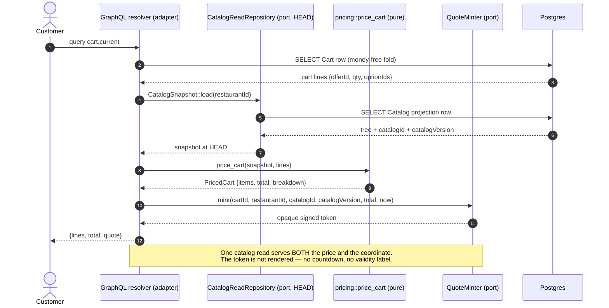
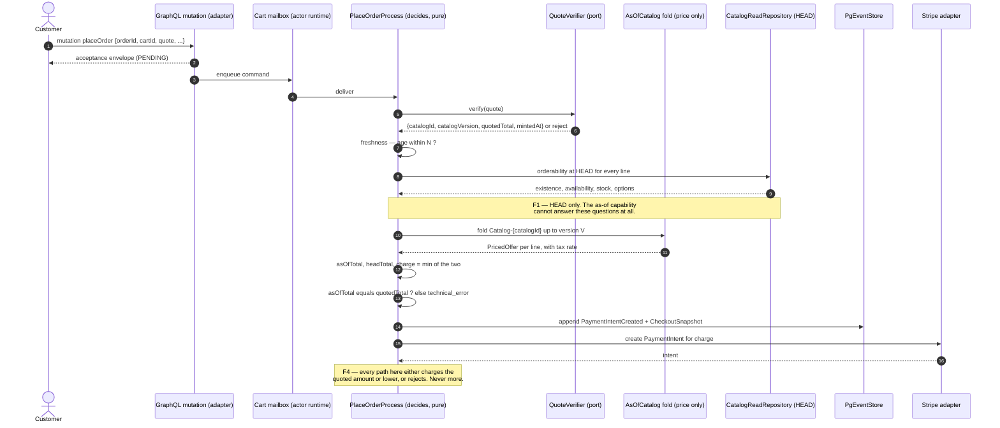
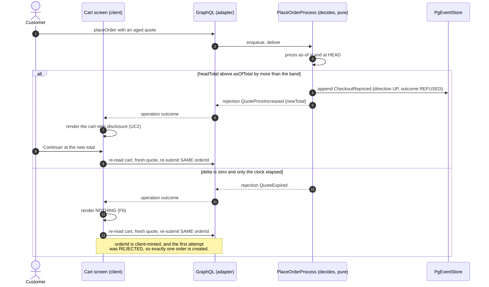

# PROP-20260831-134539 — The priced quote token: display and charge agree by construction

- **Status**: **Approved (2026-08-31)** — founder decision, verbatim option label *"Approve — build it, slice 1 first"*; recorded by [ADR-20260831-165146](../adr/ADR-20260831-165146-the-quote-backstop-is-thirty-minutes-and-the-priced-quote-token-is-approved.md), which also closes register row `QUOTE-STALENESS` (see §7)
- **Date**: 2026-08-31
- **Tracking issue**: [#816 "Display/charge divergence is undetected: the expectedTotal equality check never runs in production"](https://github.com/TheCaptainCompany/captain-food/issues/816) (the defect this designs the fix for; the build sub-issues are created at approval, per §13)
- **Realized by**: _(filled at completion)_
- **Decided by**: [ADR-20260831-121957](../adr/ADR-20260831-121957-the-pm-read-step-is-retired-source-fixed-the-physics-and-left-the-ownership.md) §4d — the founder chose **build the priced quote token** (register row `QUOTE-TOKEN`, decided 2026-08-31). **This proposal is the design that record deferred**, verbatim: *"NOT built here, and not designed here. It is a separate work item with a real option space — where the token lives, opaque vs structured, and the staleness policy — so a proposal + tracking issue follow."*
- **Reverses in part**: [ADR-20260810-112836 "Cart priced LIVE on read"](../adr/ADR-20260810-112836-cart-priced-live-on-read.md) §2 — see §2.4. That reversal was **unflagged in both deciding records** until this change; fixing it is part of this work.
- **Register rows**: `QUOTE-STALENESS` (**decided 2026-08-31** — priced in §7, closed by the approving record; it was open when this file was written) · `CAPTAINNET-ZERO` (open, founder-owned — §6 D6's *alternative* resolves into it) · `ERASURE-LAUNCH-GATE` (decided 2026-08-29 — §3 F5 exists to keep it intact)
- **Related**: [#817 "Checkout button states a price, not the obligation to pay (L221-14 / CRD Art. 8(2)) — sanction is the consumer is not bound"](https://github.com/TheCaptainCompany/captain-food/issues/817) — same screen, re-armed by this work, **referenced not absorbed** (§4 UC4) · [PROP-20260810-231500](PROP-20260810-231500-cart-current-priced.md) (the option space ADR-20260810-112836 decided) · [PROP-20260815-142349](PROP-20260815-142349-actor-answers-block-and-the-ask-step.md) §18/D2 (the envelope-vs-payload tension, named in §6 D1) · [PROP-20260829-150752](PROP-20260829-150752-customer-erasure.md) §3.4 (crypto-shred, the split F5 relies on) · [`BRIEF-20260831-repricing-and-price-quote-counsel-packet`](../legal/BRIEF-20260831-repricing-and-price-quote-counsel-packet.md) (**the `legal` lens's own return — the obligation map behind §8; its §10 reconciles the numbering**) · [`BRIEF-20260818-counsel-packet-and-self-answer-triage`](../legal/BRIEF-20260818-counsel-packet-and-self-answer-triage.md) §2 and §5
- **History**: this file is LIVING (ADR-20260801-020000) — `git log -p` on it, never appended superseded blocks.

- **Concerns**:
  - [x] **DISCHARGED 2026-08-31** — `legal`-lens return attached. The blockers **B1–B5** and counsel questions **QT-1…QT-10** were named in the dispatch that commissioned this proposal but their text was not handed to it, and at the time it was written they resolved nowhere in the repo (`grep -rn "QT-1\|QT-4\|QT-10" docs/ specs/` returned **0 hits**). §8 therefore reconstructed the legal map from **primary repo records only**, under this proposal's own `L1–L7` labels. The lens's own return has since landed as [`docs/legal/BRIEF-20260831-repricing-and-price-quote-counsel-packet.md`](../legal/BRIEF-20260831-repricing-and-price-quote-counsel-packet.md), whose **§10 reconciles `L1–L7` against `QT-1…QT-10` and `B1–B5` row by row** — cross-referenced, not competing. **§8 below is unchanged and still correct**; the reconciliation confirms every `L` row and adds four subjects §8 could not reach (**QT-2** which *arrêté*, **QT-5** the pinned higher price, **QT-7** the evidential retention clock, **QT-8/QT-9** the funds-posture leg). Residue, and it is not blocking: whether §8 is eventually **rewritten** to cite the brief instead of carrying its own reconstruction is this proposal's call.
  - [x] **DISCHARGED 2026-08-31 — the number is DECIDED.** Founder decision of 2026-08-31, verbatim option label *"30 minutes (recommended)"*: **N = 30 minutes as a backstop only, M dropped** — §7's recommendation taken unchanged. Row `QUOTE-STALENESS` is **decided** (`docs/decisions/QUOTE-STALENESS.yaml`), record [ADR-20260831-165146](../adr/ADR-20260831-165146-the-quote-backstop-is-thirty-minutes-and-the-priced-quote-token-is-approved.md) §1. **The caveat did not vanish with the concern** and now lives in that row: 30 is EVIDENCE-DEFERRED (ADR-20260808-144738 decision 5), because contract **C1** (§9) does not exist yet — it is re-derived from the observed cart-to-pay p99 after the first peak, and is never a permanent constant.
  - [x] **RE-EXPRESSED 2026-08-31 as a SLICE-4 GATE — it was never an approval gate.** `PlaceOrder`'s input change is **non-additive** (§6 D4 makes `quote` required and retires `expectedTotal`): a breaking GraphQL input change on a shipped money mutation, posture **`HOLD: human`**. That posture binds the **PR that lands it**, not this approval — per [ADR-20260815-134655](../adr/ADR-20260815-134655-the-team-merges-its-own-work-no-pr-waits-on-founder-review.md) the `HOLD: human` class stops at ready-for-review for the TEAM's independent reviewer pass and **never waits on founder review**, so an approval could not discharge it and its absence could not block one. It is written into **§11 slice 4** as a blocking condition on that PR, where it can be observed to hold. Nothing is weakened: the gate moved to the artifact it gates.
  - [x] **RE-EXPRESSED 2026-08-31 as a SLICE-2 ACCEPTANCE CRITERION — as written it could never be discharged.** The as-of catalog fold has **no implementation anywhere today** (`grep -rn "as_of\|asOf" crates/ --include=*.rs` → 0 hits on any catalog path, verified 2026-08-31 and still true at `9cd15c75`), so §12's peak cost is a **projection, not a measurement**. That is a statement of fact about the absence of code: it cannot become false before the code exists, so left as a `- [ ]` it would block `Approved` **forever**. The measurement is **owed when the code exists** and is now a Done-when on **§11 slice 2**. The design claim it qualifies (§6 D2's capability split) is unchanged and still carries its own compiler-enforced negative test.

---

## TL;DR

The founder decided the mechanism; this designs it. The recommendation is the **signed coordinate**: the priced cart returns an opaque token that carries **where in the catalog's history the price was computed** — `(catalogId, catalogVersion)` — plus the total it produced, signed by the server. `PlaceOrder` carries it, **required**. The write side folds the catalog **as of that version** and prices from it.

The load-bearing choice inside that is smaller than it sounds and it is the whole recommendation: **the token carries the coordinate, not the prices.** The catalog stays the price authority (`specs/ordering/rules.yaml#/ServerPriceAuthority`); the token is a pointer into it. A token that carried per-line prices would make the *client* the carrier of the numbers we charge — which is the thing that rule forbids in its own words.

Two things fall out for free, and one has to be built deliberately:

- **Free**: the VAT rate is pinned by the same coordinate, because `Product.taxRate` lives on the catalog (`specs/catalog/entities.yaml:112` → `specs/common/entities.yaml:74`). Freezing price without rate would have hardcoded `BRIEF-20260818` §5's recorded blocker into a brand-new surface.
- **Free**: the `expectedTotal` check that never runs (#816) becomes a **server-authored invariant** on both ends instead of a client courtesy.
- **Deliberate**: the as-of fold must be **price-only**. `price_cart` resolves price *and existence* in one lookup today (`crates/application/src/pricing.rs:57-59`), and that lookup is the **only** catalog reality check the checkout path has — the oversell guard runs at cart-edit time and is **never called at checkout** (verified: `require_orderable_line` at `crates/application/src/commands.rs:793`, called only at `:921` and `:950`). Making the fold as-of without splitting it would move the last HEAD contact off the money path with no diff to notice.

---

## 1. Context — what is true today

Every row verified against the worktree at `origin/main` `f13b5958`, 2026-08-31.

| Fact | Evidence |
|---|---|
| The server **does** price authoritatively, on both sides, through one function | `crates/server/src/graphql/cart_read.rs:150` (read) and `crates/application/src/commands.rs:2612` (write), both calling `crates/application/src/pricing.rs:45` |
| What never runs is the **comparison against what was displayed** | `crates/application/src/commands.rs:2615` — `if let Some(expected) = &cmd.expected_total` |
| `expectedTotal` is optional in the spec | `specs/ordering/commands.yaml:141` `nullable: true`, absent from `required` at `:149` |
| The SDUI `place_order` action does not send it | `specs/screens/restaurant_frontoffice.yaml:512` — six variables, no `expectedTotal` |
| The client plumbing **exists and is correct** — it is simply never fed | `crates/web/src/checkout.rs:217-219` inserts `expectedTotal` when `ctx.expected_total` is `Some`; the **only** construction of `CheckoutContext` in the workspace is the test helper at `crates/web/src/checkout.rs:579-585` |
| Production passes `None` | `crates/application/src/commands.rs:3986` |
| The spec says that dead check **is** the legal enforcement | `specs/ordering/rules.yaml:61-65`: *"The equality check on expectedTotal is the enforcement"* |
| The oversell guard is **never** called at checkout | `require_orderable_line` defined `crates/application/src/commands.rs:793`, called **only** at `:921` (`AddCartLine`) and `:950` (`ChangeCartLineQuantity`) |
| …and the checkout path knows it | `crates/application/src/commands.rs:2604-2606` — `TODO(invariant): OfferUnavailable / InsufficientStock / InvalidOptionSelection` |
| The only checkout-time catalog reality check is therefore `offer_by_id` returning `Some` inside the pricer | `crates/application/src/pricing.rs:57-59` — `let Some(offer) = catalogs.offer_by_id(...) else { return Err(unresolvable(...)) }` |
| Carts **never expire**, so the token's N is the only clock on the whole cart | `specs/ordering/actors.yaml:15` — *"carts never expire, so there is no abandonment state"* |
| `PriceMismatch` already exists and already rejects — as a red toast at the pay button | `specs/ordering/errors.yaml:250-262`, surfaced by `specs/screens/restaurant_frontoffice.yaml:518` `on_error: { type: show_toast, variant: error }` |
| Nothing in ordering or payments carries VAT | `grep -rn "tax\|Tax\|VAT" specs/ordering/*.yaml specs/payments/*.yaml` → two prose mentions only (`specs/ordering/commands.yaml:18`, `specs/ordering/events.yaml:123`); `PaymentBreakdown` has eight `Money` fields and no tax decomposition (`crates/application/src/pricing.rs:105-114`) |
| `TaxRate` **does** exist, on the catalog | `specs/common/entities.yaml:74`, referenced by `specs/catalog/entities.yaml:112-113` (`Product.taxRate`) and `specs/network/entities.yaml:103` (`defaultTaxRate`) |
| `specs/ordering/commands.yaml:18` claims the handler *"resolves names/prices/tax from the current catalog"* — **it does not resolve tax** | `crates/application/src/pricing.rs:45-115` reads `offer.price` and option prices only |
| The event log already carries the coordinate this design needs | `specs/database/tables/eventstore.yaml:17` `version` (0-based per stream) + `:28` `unique: [stream_name, version]`; the catalog's stream is `Catalog-{catalogId}` (`specs/catalog/actors.yaml:8-10`) |
| At V0 the restaurant payout **is** the total, and `captainNet` is literally zero | `crates/application/src/pricing.rs:105-114` — `restaurant_payout: total_amount.clone()`, `captain_net: zero` |
| There is precedent for making an optional field required on this exact command | `specs/ordering/commands.yaml:116-123` — `customerId` was made non-null by [#144](https://github.com/TheCaptainCompany/captain-food/issues/144), recorded reason: *"Non-null makes it a structural (GraphQL) rejection rather than a domain invariant … so no new errors.yaml code is needed"* |
| No as-of fold exists anywhere | `grep -rn "as_of\|asOf" crates/ --include=*.rs` → 0 hits on any catalog path |

### 1.1 The defect, stated precisely

The read path prices at T. The write path reprices at T+Δ while the customer types an address and clears 3DS. If the catalog moved in that window — or if the projection the read used was lagging or mid-rebuild — **the customer is charged a total different from the one displayed, silently**: no `PriceMismatch`, no error, nothing in telemetry that distinguishes it from a normal order.

That is a TOCTOU window on a legal surface (`specs/ordering/rules.yaml:60-65`, C. conso. L112-1 / L221-5 posture). It is **not** missing pricing. Saying it is missing pricing sends an executor looking for code that exists — the correction #816 already carries.

### 1.2 What is genuinely good here, and must not be broken

- **One pricer serves both sides.** `price_cart` is called from the read resolver and the write handler; there is no second implementation to drift. That property is why this fix is small.
- **Fail-closed is real.** An unresolvable line rejects (`PriceUnresolvable`); there is no fallback to a client number anywhere on the path.
- **The `CatalogSnapshot` memo** (`crates/application/src/pricing.rs:129-164`) already collapses the N+1 into one catalog read on the read side. The as-of fold must land behind the same shape.
- **`ADR-20260831-121957` §4c is right and stays right.** The shared read on the checkout leg was never an exemption or a lapse. This proposal replaces the **mechanism** that enforces the Published Language, never its **status**.

---

## 2. Recommended approach

### 2.1 The shape

1. **Mint on every priced cart read.** `cart.current` / `cart` return, alongside the priced lines, an opaque `quote` string. It is minted at HEAD, from the same `CatalogSnapshot` the pricing already used, so it costs one extra field and no extra read.
2. **Carry it on the command, required.** `PlaceOrder.quote` is non-nullable; `expectedTotal` is retired in the same change (§6 D4).
3. **Verify, then fold as-of.** The write side verifies the signature and the cart/restaurant binding, checks freshness against N (§7), and folds the catalog stream **as of `catalogVersion`** into a **price-only** capability (§6 D2).
4. **Also read HEAD — for everything that is not price.** Existence, availability, stock, restaurant state and service hours resolve at HEAD, always, whatever the token says (§3 F1). This is where the oversell guard that is missing today gets added.
5. **Charge `min(as-of, HEAD)`.** Downward moves are passed to the customer with no interstitial; upward moves are absorbed within a band or refused (§6 D6). **Never more than quoted** (§3 F4).
6. **Disclose at the cart, before the Stripe element — never after.** The founder's own words in ADR-20260831-121957 §4d. A refusal routes back to the cart step, where a fresh quote is minted and the delta is shown; on a **zero** delta nothing is shown and the quote is silently re-minted (§3 F6).

### 2.2 Why the order matters

The as-of fold (step 3) and the HEAD orderability check (step 4) must land **together**. Landing 3 alone converts the checkout's last HEAD contact into a historical read, and the resulting oversell has no failing test and no diff to notice — it looks like the change working. Landing 4 alone is a straight improvement and is the only slice of this that could ship independently (§11).

### 2.3 Why this is the final vision, not a stage

ADR-20260808-235113 asks for the final step first. This *is* the final step: there is no richer form of "display and charge agree" than "both are computed from the same coordinate in the same log". Two things this deliberately does **not** stage toward, because they are different work:

- **VAT decomposition on the stored order shape** is a migration (`BRIEF-20260818` §5, `HOLD: human`). This design **unblocks** it — the rate becomes resolvable and frozen at a coordinate — and does not perform it (§6 D3).
- **Snapshots** (`SNAP-1`, DECISIONS §43) share the as-of primitive, as `QUOTE-TOKEN`'s own note records. Building the fold once and using it twice is the point; building it twice is the waste.

### 2.4 The reversal, flagged

`ADR-20260810-112836` §2 says the freeze locus is **commitment** (*"Live upstream, frozen at commitment"*) and that the legal display guarantee *"is carried by the `expectedTotal` equality check"*. **Both clauses are in §2** of that record — the dispatch that commissioned this proposal attributed the second one to §4, which is the IDOR retirement; the citation is corrected here.

The quote token moves the freeze locus from **commitment** to **quote time**. That is materially the option `ADR-20260810-112836` considered and rejected as its Alternative **A** — with the reservation, in its own words, that A *"freezes a price the customer has not committed to."* The reservation is answered, not ignored:

- A froze the price **into cart events at add-time**, which needed an event-versioning story and reversed ADR-20260720-002217. This design freezes **nothing into an event** — it freezes a *coordinate on a command*, which is why `QUOTE-TOKEN`'s note can say *"nothing in `domain_events` moves."*
- The price the customer "has not committed to" is bounded by N (§7) and is only ever binding **downward or within the absorb band** (§3 F4, §6 D6). The restaurant is never held to a price it did not offer for longer than the backstop, and the customer is never charged more than displayed at all.

Neither deciding record cited `ADR-20260810-112836` before this change: `grep -c "20260810-112836"` returned **0** on both `docs/adr/ADR-20260831-121957-*.md` and `docs/decisions/QUOTE-TOKEN.yaml` (verified 2026-08-31). Both are corrected in the same commit as this file, and `ADR-20260810-112836` gains a forward pointer so a reader arriving at it first is not told the `expectedTotal` check is the enforcement.

---

## 3. The six fences — design rules, not preferences

Each names what enforces it. A fence enforced by prose is a fence that will be crossed.

### F1 — The as-of fold is PRICE-ONLY

Existence, availability, stock, restaurant state and service hours resolve at **HEAD**, always, regardless of the token.

*Why it is not optional.* `price_cart` resolves price and existence in the same lookup (`crates/application/src/pricing.rs:57-59`), and that lookup is the only catalog reality check on the checkout path — the oversell guard is never called there (`commands.rs:793`, callers `:921`/`:950` only; the `TODO(invariant)` at `:2604-2606` says so). Make that lookup as-of and a dish 86'd at 20:20 is bought at 20:40 and the order **accepts**. That is oversell at peak, which CLAUDE.md names as losing both sides of the marketplace at once.

*What enforces it — the type system, not a check* (ADR-20260803-234035, level 4). The as-of fold returns a narrow capability that **cannot express an availability question**:

```rust
/// The as-of catalog: PRICE ONLY. It has no availability, stock or existence accessor,
/// so "check availability as of V" is unspellable, not merely forbidden.
pub struct AsOfCatalog { /* private */ }
impl AsOfCatalog {
    pub fn price_of(&self, offer: OfferId, options: &[OptionId]) -> Option<PricedOffer>;
}
/// price + option prices + tax rate. No `availability`, no `stock_status`, no `stock_quantity`.
pub struct PricedOffer { /* … */ }
```

`OfferView` (`crates/application/src/queries.rs:151-167`) keeps `availability`, `stock_status` and `stock_quantity` and stays reachable **only** through the HEAD `CatalogReadRepository`. A gate is written only where types cannot reach: one behaviour test asserting that a token minted before an offer went `UNAVAILABLE` still rejects the checkout.

### F2 — The quote pins the TAX RATE, not only the price

*Why.* Nothing in ordering or payments carries VAT (`BRIEF-20260818` §5, re-verified in §1); `TaxRate` hangs off mutable current state. A token that freezes price without rate hardcodes that defect into a new surface, and it is nearly free at this moment and expensive later.

*What enforces it.* `PricedOffer` carries `tax_rate` as a **required** field, resolved by the same as-of fold — `Product.taxRate` is on the catalog (`specs/catalog/entities.yaml:112`), so the coordinate pins it with no extra mechanism. The compiler refuses a `PricedOffer` without a rate; that is the enforcement. Putting the decomposition into `PaymentBreakdown` / `CheckoutSnapshot` is separate, migration-class work (§6 D3).

### F3 — Non-nullable on the command

A guarantee carried by an optional field the client may omit is carried by convention — which is exactly how #816 happened.

*What enforces it.* `PlaceOrder.quote` is in `required`, so omission is a **structural GraphQL rejection** before any handler runs, and the generated Rust field is `QuoteToken`, not `Option<QuoteToken>`. Precedent, on this same command: `customerId` (`specs/ordering/commands.yaml:116-123`, #144). `expectedTotal` is removed in the same change — leaving a dead optional field beside a live required one is the #816 shape preserved as a fossil.

### F4 — Charge exactly the quoted amount, or refuse. Never more

After the confirming click the staleness response is a **pure refusal**, never an auto-accept of a new price.

*What enforces it.* The write side computes `charge = min(as_of_total, head_total)` and every other outcome is a rejection. Expressed as a total function over the two totals with no branch that charges more, plus a behaviour test whose negative is "HEAD is higher and the charge is still the quoted amount or a rejection". This is what makes the design safe under **both** branches of the open contract-formation question (§8 L1) — which is why the fence exists rather than a legal answer.

### F5 — Pseudonymous payload — no contact data

Token payload and any event this work introduces carry **cart id, offer ids, catalog id, version, amounts, rates, timestamps — and nothing else**.

*Why.* `ERASURE-LAUNCH-GATE` is decided (2026-08-29) and launch-gating. If a quote artefact lands on the Cart stream carrying a `legalRetention:` marker, it takes the Cart actor out of stream deletion and breaks that gate. Retention rides the **order** side, which already declares `FRENCH_COMMERCIAL_BOOKS_10Y` (`specs/ordering/events.yaml:123`), under the split `PROP-20260829-150752` §3.4 builds: retained under an evidential window while identity is crypto-shredded.

*What enforces it.* No `legalRetention:` clause on the new `CheckoutRepriced` event (§6 D8) — and the validator rule that already exists for that clause (`PROP-20260829-150752` §3.4, rule 2) makes its absence the default rather than an omission. The token payload is a struct with no contact-bearing type in it; the compiler refuses one.

### F6 — Fires on DIVERGENCE, never on expiry

If the backstop elapses and the reprice comes back identical, show **nothing** and silently re-mint.

*Why.* A "your quote expired" message on a zero-delta reprice is invented friction and the easiest way to make this lose money. Carts never expire (`specs/ordering/actors.yaml:15`); a customer who took 35 minutes has done nothing wrong.

*What enforces it.* The disclosure component's render condition is `delta != 0`, not `expired`. The re-submission is safe because `orderId` is **client-minted** (`specs/ordering/commands.yaml:108-110`) and the first attempt was *rejected*, so no order exists: re-submitting the same `orderId` with a fresh quote creates it exactly once. One behaviour test: expiry with zero delta produces a placed order and **no** customer-visible reprice event.

---

## 4. Screen mockups — one per use case

Low fidelity is enough; what is fixed here is the shape and which operation each control maps to.

### UC1 — Cart, fresh quote (the normal path, 99% of reads)

Nothing new is visible. The quote rides the response.

```
┌──────────────────────────────────────────────┐
│  ← Le Petit Zinc                             │
├──────────────────────────────────────────────┤
│  2 ×  Burger maison            19,00 €       │
│         + Cheddar                             │
│  1 ×  Frites                    4,50 €       │
├──────────────────────────────────────────────┤
│  Total                         23,50 €       │
│                                              │
│  [  Continuer  ]                             │
└──────────────────────────────────────────────┘
   query cart.current -> { lines, total, quote }
   the quote is NOT rendered: no countdown, no
   "valid until", no timer (F6, and §8 L3)
```

### UC2 — Cart, price moved UP beyond the absorb band

Rendered at the cart step, **before** the Stripe element. An explicit choice, not a dead end.

```
┌──────────────────────────────────────────────┐
│  ← Le Petit Zinc                             │
├──────────────────────────────────────────────┤
│  ⚠  Le prix a changé                         │
│                                              │
│  Burger maison   9,50 €  →  11,00 €          │
│                                              │
│  Ancien total       23,50 €                  │
│  Nouveau total      26,50 €   (+3,00 €)      │
├──────────────────────────────────────────────┤
│  [  Continuer à 26,50 €  ]   (primary)       │
│  [  Modifier mon panier  ]   (outline)       │
└──────────────────────────────────────────────┘
   role=alert, focusable, NOT auto-dismissing
   (this is what replaces the toast at
    specs/screens/restaurant_frontoffice.yaml:518)
   "Continuer" re-mints the quote at HEAD and
   re-arms checkout. No countdown, no pre-armed
   button, no implied acceptance (§8 L2).
```

### UC3 — Cart, price moved DOWN

Passed through with no interstitial (§6 D6). The wording is a **correction**, never a discount — no strike-through, no "économisez", no reference price (§8 L4, Omnibus).

```
┌──────────────────────────────────────────────┐
│  2 ×  Burger maison            17,00 €       │
│  1 ×  Frites                    4,50 €       │
├──────────────────────────────────────────────┤
│  Total                         21,50 €       │
│  [  Continuer  ]                             │
└──────────────────────────────────────────────┘
   No banner at all. The customer simply sees the
   lower number and is charged it (F4).
```

### UC4 — Checkout, the confirming click (#817 rides here — referenced, not absorbed)

```
┌──────────────────────────────────────────────┐
│  Récapitulatif                               │
│  2 ×  Burger maison            17,00 €       │
│  1 ×  Frites                    4,50 €       │
│  ─────────────────────────────────────────   │
│  Total à payer                 21,50 €       │
│      ↑ UNCOLLAPSED — #817, SHIPPED 2026-08-31 │
│        by #833. Was collapsible: true; the    │
│        section is now at                      │
│        restaurant_frontoffice.yaml:476        │
├──────────────────────────────────────────────┤
│  [ Stripe payment element ]                  │
├──────────────────────────────────────────────┤
│  [  Commander avec obligation de paiement  ] │
│      ↑ #817's safe-harbour wording, SHIPPED   │
│        2026-08-31 by #833 -- but the shipped  │
│        label APPENDS the total ("... — 23,50  │
│        EUR", translations.yaml:132-136). This │
│        mockup shows the formula alone. That   │
│        difference is exactly what QT-4 asks   │
│        counsel; do not read the mockup as     │
│        settling it either way.                │
└──────────────────────────────────────────────┘
   action place_order, variables now include
   quote (required, F3) and NOT expectedTotal.
```

**#817 was a live independent defect, is not absorbed by this proposal, and SHIPPED on 2026-08-31** ([#833](https://github.com/TheCaptainCompany/captain-food/pull/833)). It stays named here because this work **re-arms that button**, and because a reprice disclosure sitting above a confirm control whose compliance is still unresolved (**QT-4**) is a worse composite than either defect alone.

### UC5 — PlaceOrder refused after the click (expiry, or an upward move above band)

The two refusals differ in what the customer sees, which is F6.

```
 delta == 0 (expiry only)          delta != 0 (a real move)
┌────────────────────────────┐   ┌────────────────────────────┐
│  (nothing rendered)        │   │  ⚠  Le prix a changé       │
│  client re-reads the cart, │   │  Nouveau total  26,50 €    │
│  re-mints, re-submits the  │   │  [ Continuer à 26,50 € ]   │
│  SAME orderId once         │   │  [ Modifier mon panier ]   │
│  -> order placed           │   │   -> back to UC2 at cart   │
└────────────────────────────┘   └────────────────────────────┘
```

### UC6 — Failure state: the token does not verify, or the as-of fold disagrees with it

A bad signature is an attack or a key-rotation bug. An as-of fold that disagrees with the total the token carries is a **defect** — the same coordinate must produce the same price — and is never presented as a price change.

```
┌──────────────────────────────────────────────┐
│  ⚠  Nous n'avons pas pu finaliser votre      │
│     commande. Aucun montant n'a été prélevé. │
│                                              │
│  [  Revenir au panier  ]                     │
└──────────────────────────────────────────────┘
   classification: technical_error, alerting,
   never business_rejected — §9 C2.
   The customer is NOT told a price moved,
   because none did.
```

---

## 5. Sequence diagrams

Hexagonal-faithful: the pricer is pure and SDK-free, adapters sit at the edges, and the process manager decides.

### SD1 — Priced cart read and quote mint (read path)



<a href="https://mermaid.live/view#pako:eNptk29v2kAMxr-KlVdMS9kf7VU0IW1pRZG6FSjqK6TJ5Ay9NTmHOweEEN99vkCg7ZpXdzn78c-P7_ZJwYaSDJJA64ZcQdcWVx6ruQP9sBF2TbUgf9oXwh5ywAB5E4Sr7qBGL7awNTqB4eQuBgw91k-69BS43JCHHhqshfyH_1PyaSuJgiWvpoRmSjUHq8V20KvZSwq3Nz-u38kcx8Ta69atsiwu6E-h55rWeHonYRITJg0L_bJOIlbUf095GCPHHGSlLczdMSK_Ggy0wQzULYWLpfpF4z05OQbooYaMhxk83Nzd5DPtSmk8b6FXsaPd1dITwZJLc6o5Hl51mi14aR0F2PNySX5kUljLLgWuxbIbmXB4WSWfZp1pDw7r8MSSZSWj6SmxYOO1j1FXJ5--5WoT1Tz-S0WUj5QvmaK8RNqPStYGj8xl_Ug-aNJZvGsinEgApR3aK1syuIyo10Wmx547P85K4xhqWv_2VqgKKQhr7RQWnvDZ8Na9smOSQaUz7UXx6NxLE9JLC-mbDs6qjrcnhsmZgWvUSUOwK0dGA5_JXUpGjzLYt_RnlXW8Wyeu37oEjpdfw1Plu3fUVVc8NBDIb3TcP-9ntyBPdLQH0Jl2VzB7Yx0K9b8v_KfBTP-1DGCD4uq9ImfIK9m8-fr5yzf9pzmNk-hNbAg2WFpjZQclLqjsJykk-mgrtEYf_T7RIlX7_A0tsSklORz-AQ5fWX0" target="_blank" rel="noopener noreferrer">Open this diagram with pan and zoom on mermaid.live — on github.com use Ctrl/Cmd+click or middle-click to get a NEW tab (GitHub strips target=_blank)</a>

### SD2 — PlaceOrder with a quote (write path, the normal case)



<a href="https://mermaid.live/view#pako:eNp1VNtu2kAQ_ZURT0Q1tKnyZLVExCFppEIAozxFqob1gLexd7e7axKE-PfO2qbQhiIh3-bM5Zyzs-sInVEnho6jXxUpQbcS1xbLZwX8w8prVZVLsu2z8NpCAuggqZzX5eGDQeulkAaVh_vZ9xBwb9HkfFtWHr3UCrqYofFkL95Dxjd1Sn4DJcpiqd84uq5lK-VlSWcw03HATAsU9GgzslOrBTkH3YyEzMhFYCp7DjgLuFmlPT2RlStJFrpGW38mdJg-3oXooXtcJeix0GtY6SJjgJWCQKtiewaWzJtxasCcMJuT0U7yPFvofhsNb89gRmk9znq0IeVTDqX3MekixKTeSkPQsvmsmrikNxgw8_GRb_OHGtjpcHnIIhCcLlx_hfkj6Pf7-wbP2B6nSGIWWZDxyF4AUhsqNBfrTkeT24fJ_cUxeDAY38QcwbapCIQuS1RZ83l8w1-n4xgyKuTm4JHpmN_OYtgE1rfduoM236zXAnaiIa1ptb5lkRyP07acLTS_jaCUih-Gfg_BJPSThD-pElKtLLlcBUc8V58_XV4Brglepc-lgglcn0Qn8xhqgnApC-m3gB6CSiy1BeJ2t1BI1eqRzA-90pt0PhyZCHDDrm3REfDBEC8RaBNkcA1swr2D5lxcMgoF7y4PfdWlgpP6sMhZV9fTKx7etPm-LO3HgUCltAdU7pVT-JwcMR_k6gqhXyyK_slIwbhxY9XWhr0jtXuoDHgdhAjMwlMDDJjDbNNg7-xxteJqhv9h_qhmDzy-gUVP_9CNfERabXJ2fHsrcrRM-9egF_BY3Dn4V_0_LPASwsKdSg3XQAVP60nkSgosfpC1-tRSo5QzGEMqgyluSz4-D-wN5RNL3GYGHyDJSbzoyqcKjcv1qVPSRQyiDvwbXGvfdN9Ep4sDN7IOeC8ra3p10LRxjUHmKyfLB4mZo0NCF2ioZW3mBCw1r7ng5EKzvtHR064Pk5ALSl4I_U4EHV65vCIzXtm7Dqcp6-Wd0Qqrwnf2-98VHO9Z" target="_blank" rel="noopener noreferrer">Open this diagram with pan and zoom on mermaid.live — on github.com use Ctrl/Cmd+click or middle-click to get a NEW tab (GitHub strips target=_blank)</a>

### SD3 — Divergence above the band, and the zero-delta silent re-mint



<a href="https://mermaid.live/view#pako:eNqtVMFu2zAM_RXCpwRwNmCHHYIhQOG4aYYlcZt2ufSiSEys1ZZUiU7bBfn3UbbbrlgPAzafbPO9x8dHW8dEWoXJGJKA9w0aiVMt9l7Utwb4Eg1Z09Rb9P2zJOshAxEgawLZ-rnghCcttROGYNOW-QUE6RENDGSl0dDwT-js8lsEz7xwJd8OhBKO0L-DLBYRWFRC4sor9IW3EkOAgUKpFYYUXOPxHWK-bon7_MAW1mwfb02HykaTCRsYg3tRhQdNJQgDYo8K7htL2GEZx-hiMQY0nFODKSis9OF5_mLRl53X7ItbjuwOvrOUAkFwkZ9N-wQrghKFurYkKhBbe0AGr3bd8_YJanYIVLIHKhG2LNARX7rk6zEI55CVsxLlnW3oCtu2Co5Ke5SkrYGbIgUuSd4RXOXnN-t8enqj9Dy9xx895TLOW0SlueHNiRAVDT603n4jxzCYvRmDdehFy-1bvYI2HcKzT841ziJ5K6NA6EDpICsbeGEwuMk-DV9ZWcfKrCFtGiZyeJHLLoCijbcN-gFGbFa1-insPIayW10aS6HZ1ppgfbbIwcYdz_tAsQoYl0gCdICf6G27LWuqp85uZeUdo4TjHP4mufzRcfrqn3Jarq4v5ssZDM4_D__fqPFaMgr4a_OwSVutHhGH7_7PUa0NoUrbGGICO-0D8QYIa0dftv7j5IF_pav8a55d59MUggV85COBA7MGO8FWjj2y0Ic-Z6OSFBI-KmqhFR81x4TF6_bQUbgTTUXJ6fQLNdR2eg" target="_blank" rel="noopener noreferrer">Open this diagram with pan and zoom on mermaid.live — on github.com use Ctrl/Cmd+click or middle-click to get a NEW tab (GitHub strips target=_blank)</a>

---

## 6. Decisions surfaced

### D1 — Where the token lives, and what it is

This is the option space `QUOTE-TOKEN` explicitly left open. Priced on: replay/rebuild survival, wire size, erasure cost, forgeability, and what it obliges us to retain.

| Option | Pros | Cons |
|---|---|---|
| **1. Signed COORDINATE token** — opaque base64url over `{v, keyId, cartId, restaurantId, catalogId, catalogVersion, totalCents, currency, mintedAt}`, HMAC-signed ✅ **recommended** | The catalog stays the price authority — the token is a **pointer**, never the numbers, so `ServerPriceAuthority` is untouched · replay-neutral by construction: the coordinate is `(stream_name, version)`, already unique and immutable (`eventstore.yaml:28`) · ~150 B payload, **constant** in cart size · nothing stored server-side, so **zero** retention and **zero** erasure surface · pseudonymous, so F5 is free · the carried total becomes a genuine server-authored invariant (asOf must reproduce it) — #816's dead check, alive · unforgeable under key hygiene | Introduces a signing key: rotation, deploy secret, KMS or equivalent — a **new operational surface** · a leaked key forges a price, so key handling is on the money path · the write side must parse an attacker-influenced blob (mitigated: fixed-size, versioned, verify-then-parse) · per-line provenance is not carried and must be reproduced by the fold when a receipt needs it (deterministic, but a second fold) |
| 2. Opaque handle + server-side quote record (`quoteId` only; record on a `Quote` table or a `CartQuoted` event) | Smallest possible wire (a uuid) · unforgeable with **no key at all** — the server holds the truth · per-line provenance retained at zero wire cost · if recorded as an event, replay-survivable | **A read that writes**: pricing a cart is a query, and minting would make every cart read a command — `young`'s objection, and it puts write load on the checkout hot path at peak · creates a retention obligation from nothing, and the record must then be covered by the erasure design — a **direct cost to the launch-gating** `ERASURE-LAUNCH-GATE` · needs a GC/TTL nobody has designed · the `CartQuoted` variant risks the F5 trap precisely |
| 3. Fully structured signed quote — version **plus** total **plus** per-line prices and options | Per-line provenance travels with the token, so a receipt needs no fold · self-describing for debugging | **Makes the client the carrier of the prices we charge**, which is what `specs/ordering/rules.yaml:56-58` forbids in its own words · the per-line payload is **redundant**: the write side reprices as-of V anyway, so the carried lines are only a cross-check bought at a large price · wire size grows with cart size (a 15-line cart with options is kilobytes on a mobile network at peak) · same key surface as option 1, with strictly more to leak |
| 4. Bare `catalogVersion` on the command, no token object | Simplest imaginable · one integer plus `catalogId` · no key, no store, no retention, no erasure surface | **Forgeable for profit**: a client can submit an older version where the item was cheaper, and nothing detects it — an unsigned price coordinate on a money path · no total to cross-check, so #816's invariant stays unenforceable · cannot bind the coordinate to a cart, so a coordinate from one cart works on another |
| 5. Status quo, hardened — make `expectedTotal` required, keep both sides reading HEAD | Very small diff · fixes the **detection** half of #816 today · no new concepts | Does not close the TOCTOU at all — it converts silent divergence into a `PriceMismatch` **at the pay button**, the most expensive presentation there is (`specs/screens/restaurant_frontoffice.yaml:518`, a transient toast on a dead end) · still depends on a projection being current, so it does not survive a rebuild — the exact property `QUOTE-TOKEN` was decided to obtain · leaves the client as the source of the compared number |

**Recommendation: option 1.** The distinction that decides it is `young`'s: the token must be a *pointer into the log*, not a *carrier of prices*. Option 3 wins on convenience and loses on the one rule the whole pricing design rests on. Option 2's cost is not the storage, it is that it makes a query into a command and hands the launch-gating erasure work a new subject-linked artefact for a benefit option 1 gets for free. Option 4 is option 1 with the signature removed, which is the only part that makes it safe.

**The tension with `PROP-20260815-142349`:142, named rather than glossed.** That proposal refuses a version field in an **ask reply payload** — *"The served version rides the ENVELOPE, never the payload."* A quote token on a **command** is adjacent but is not the same speech act: a reply is a snapshot whose authority expires at send, whereas **a price the customer was shown is business data** — a fact about the world, like an `ExternalReference`. That reading is the one the founder accepted (`ADR-20260831-121957` §4d), and it is restated here so the next reader knows the rule was weighed rather than overlooked.

### D2 — The scope of the as-of fold

| Option | Pros | Cons |
|---|---|---|
| **Price and tax as-of, everything else at HEAD — enforced by a narrow capability type** ✅ **recommended** | Closes the display/charge window without opening an oversell window · the restriction is **unspellable**, not merely documented (ADR-20260803-234035 level 4) · forces the checkout orderability re-check that is missing today (`commands.rs:2604-2606`) to be built, which is a real defect fixed in passing | Two catalog resolutions per checkout instead of one (cost projected in §12) · a new type and a split of `price_cart`'s current single-lookup shape · `PricedOffer` must not accidentally grow an availability field later — the compiler prevents it, but the reviewer must know why it is narrow |
| Everything as-of the token's version | One fold, simplest code, perfectly self-consistent | **Oversell at peak.** A dish 86'd at 20:20 sells at 20:40 and the order accepts, with no failing test and no visible diff — CLAUDE.md's "loses both sides of the marketplace at once" |
| Nothing as-of — keep reading the HEAD projection, and use the token only as a comparison total | Tiny diff, no fold to build | This is option 5 of D1 wearing a token: it does not survive a rebuild or a lagging projection, which is the property the decision was taken to obtain |

### D3 — Does the quote pin the tax rate?

| Option | Pros | Cons |
|---|---|---|
| **Yes — `PricedOffer.tax_rate` is required and resolved by the same as-of fold** ✅ **recommended** | Free: `Product.taxRate` is already on the catalog (`specs/catalog/entities.yaml:112`) · prevents hardcoding `BRIEF-20260818` §5's recorded blocker into a brand-new surface · makes the VAT decomposition a later **additive** change instead of a redesign · a required struct field is compiler-enforced | Surfaces immediately that many catalogs will carry no usable rate — which is a **funnel** cost (collecting rates per menu item at onboarding), not a software cost, and it is better surfaced now than at the first receipt |
| No — pin price only, add tax later | Smaller now | Builds a price-freeze mechanism that is structurally unable to freeze the other half of the same number. Redoing it later is a migration on a surface that will by then be live |
| Carry the rate **in the token payload** | Explicit, visible | Redundant with the coordinate, grows the payload per line, and re-introduces D1 option 3's problem for the rate specifically |

**This decision does not put tax into any stored event shape.** `PaymentBreakdown` and `CheckoutSnapshot` are unchanged here; that remains migration-class work (`BRIEF-20260818` §5, `HOLD: human`). What changes is that the rate becomes *frozen at a coordinate* and therefore *resolvable deterministically for any past order* — which is the precondition that work needs.

### D4 — Optionality on the command

| Option | Pros | Cons |
|---|---|---|
| **`quote` required, `expectedTotal` removed, in one change** ✅ **recommended** | Omission becomes a structural GraphQL rejection before any handler runs — no new error code needed · exact precedent on this command: `customerId` under #144 (`specs/ordering/commands.yaml:116-123`) · leaves no dead optional field for the next reader to mistake for enforcement | **Non-additive GraphQL input change** on a shipped money mutation → `HOLD: human`, and the client must ship the field before the server requires it (§11 sequencing) |
| `quote` required, `expectedTotal` kept nullable | Marginally gentler rollout | Preserves the #816 fossil: a field the spec describes as a guarantee and nothing populates. That is the defect, not a mitigation |
| `quote` nullable, enforced by a domain rule | Additive, no client coordination | This is precisely how #816 happened. A guarantee carried by an optional field is carried by convention |

### D5 — Where the divergence is disclosed

| Option | Pros | Cons |
|---|---|---|
| **At the cart step, before the Stripe element** ✅ **recommended** | The founder's own words (`ADR-20260831-121957` §4d) · converts today's dead end into a choice, which `business` prices as **net positive** for conversion — `PriceMismatch` already rejects today as a transient toast at the pay button, the most expensive possible presentation · no payment intent exists yet, so nothing has to be cancelled | Requires a cart-step component that does not exist and an SDUI/handwritten decision on the checkout screen (which is `sdui: false`, `specs/screens/restaurant_frontoffice.yaml:429`) |
| At the pay button, as today | Zero new UI | It is the status quo's worst property, kept |
| After PaymentIntent creation | — | Not available: capture-**more** is not reliably offered by card networks, while capture-**less** is free. After intent creation the only permissible upward response is to honour (§6 D6) |

### D6 — The response to a divergence

| Option | Pros | Cons |
|---|---|---|
| **Down: charge the lower, no interstitial. Up: honour within `min(1,00 €, 2% of subtotal)`, disclosed at onboarding, with a per-restaurant weekly cap that ALERTS. Above the band: confirm at the cart, before PaymentIntent creation** ✅ **recommended** | Never charges more than displayed (F4), so it is safe under both branches of the contract-formation question (§8 L1) · the band absorbs the overwhelmingly common tiny move without any friction · **at V0 it needs no money machinery at all**: `restaurant_payout` **is** the total and `captain_net` is zero (`crates/application/src/pricing.rs:105-114`), so a lower charge is structurally restaurant-borne with no ledger entry · the weekly cap is an **abuse detector**, not a budget — it alerts rather than blocks, so a restaurant is never silently prevented from selling at peak | The band is a judgement, not a measurement, until §9 C3 exists · "disclosed at onboarding" is a partner-contract obligation with no owner in this proposal · it does mean a restaurant is occasionally paid slightly less than its current list price |
| Captain absorbs the delta | Restaurant never loses a cent | **Blocked on `CAPTAINNET-ZERO`** (open, founder-owned): if `captainNet` is zero there is nothing to absorb from — and it *is* zero in code today. Recorded as a dependency; **not resolved here**, and no new register row is opened for it |
| Always refuse on any upward move | Simplest rule | Every 10-cent move becomes an interstitial at peak. This is the conversion cost `QUOTE-STALENESS`'s note warns about, paid on the most common case |
| Auto-charge the new higher price | No friction | Forbidden by F4, and unsafe under §8 L1 |

### D7 — What is recorded, and where

| Option | Pros | Cons |
|---|---|---|
| **A new `CheckoutRepriced` event on the Cart stream — pseudonymous, no `legalRetention:` marker** ✅ **recommended** | Gives the `bam` folds in §9 something to fold — a ratio over `domain_events`, which is what ADR-20260811-014129 requires and a call-site counter cannot express · **additive**: a new event is not a change to an emitted shape, so CLAUDE.md question (2) is answered NO and nothing in `domain_events` moves · no marker means the Cart stream stays fully deletable and `ERASURE-LAUNCH-GATE` is untouched (F5) | One more event type, and a fold the `bam` projector must learn |
| Extend `OrderPlaced` / `PaymentIntentCreated` with the quoted total | No new event type | **A stored event shape change** → migration, versioning story recorded before it lands, `HOLD: human`. Buys nothing the new event does not |
| Record nothing — telemetry counters only | Cheapest | A counter cannot express "absorbed value per restaurant" or "conversion split by whether a reprice fired": both are ratios with distinct-identity denominators, and a counter does not replay (ADR-20260811-014129) |

---

## 7. The staleness policy — priced here, DECIDED 2026-08-31

Register row **`QUOTE-STALENESS`** is **decided** (`docs/decisions/QUOTE-STALENESS.yaml`, 2026-08-31, record [ADR-20260831-165146](../adr/ADR-20260831-165146-the-quote-backstop-is-thirty-minutes-and-the-priced-quote-token-is-approved.md) §1). What follows is the team's pricing of it, per that row's own instruction that it be *"priced rather than re-asked"*, and **the founder took it unchanged** — verbatim option label *"30 minutes (recommended)"*.

**DECIDED: N = 30 minutes, as a backstop only. M (a version count) is dropped.**

**Why N exists at all, and why it is load-bearing.** `specs/ordering/actors.yaml:15` says carts never expire. The token's N is therefore **the only clock on the whole cart** — there is no other bound anywhere on how stale a checkout may be. That is a bigger job than the name "staleness policy" suggests.

**Why 30, and what it is derived from.** It is sized from the **p99 of the cart-to-pay leg with SCA/3DS in it** — the tail is a customer bounced into a bank app, not a customer deliberating — and *not* from risk appetite. It is a backstop: the 99th percentile customer never meets it. Sizing it from risk appetite would produce a much smaller number and pay a conversion cost on the ETA path for a correctness benefit the Δtotal gate already provides.

**Why M is dropped.** The catalog stream also carries `OfferStockUpdated` from POS callbacks (`specs/catalog/events.yaml:198`, described as *"e.g. HubRise inventory sync"*). At a busy service the catalog stream advances constantly for reasons that have nothing to do with price, so any small M is a **100%-fire timer wearing a correctness costume**. Keep the version as the as-of anchor and for audit; **gate on Δtotal**, which is the thing that actually matters.

**The honest limit on this number.** 30 is a judgement, because the instrument that would let it be derived from evidence does not exist: there is no quote-age measurement, and no `specs/observability.yaml` contract for one (`grep -rn "quote\|reprice" specs/observability.yaml` → **0 hits**). Under ADR-20260808-144738 that makes N an **evidence-deferred** decision: ship the instrument (§9 C1) with the mechanism, then re-derive N from the observed p99 rather than defending the guess. The row was closed on exactly those terms — *"30 as a backstop, to be re-derived from `quote_age_seconds` after the first peak"*, never as a permanent constant — and the caveat lives on in the decided row rather than dying with the question.

---

## 8. Legal map — carried, never cleared

**No lens output and no aggregation of lenses is legal advice or clearance** (ADR-20260812-143619). **No counsel is engaged.** Every article number below is **VERIFY-FIRST**; primary sources could not be fetched in the sessions that produced the surrounding records (`legifrance.gouv.fr` returned egress-policy denials — recorded on [#817](https://github.com/TheCaptainCompany/captain-food/issues/817)).

**A gap this proposal declared rather than papered over — now CLOSED.** The `legal` lens's blockers **B1–B5** and counsel questions **QT-1…QT-10** were named in the dispatch that commissioned this proposal. Their text was **not handed to this proposal** and, when it was written, resolved nowhere in the repository: `grep -rn "QT-1\|QT-4\|QT-10" docs/ specs/` returned **0 hits** (2026-08-31). Reproducing ten numbered questions from memory would have been inventing a lens return, so the table below is reconstructed from **primary repo records only**, under this proposal's own `L1–L7` labels.

**The lens's return has since landed**: [`docs/legal/BRIEF-20260831-repricing-and-price-quote-counsel-packet.md`](../legal/BRIEF-20260831-repricing-and-price-quote-counsel-packet.md), relayed by the coordinator from a return that was not otherwise persisted. **Its §10 is the row-by-row reconciliation** of `L1–L7` against `QT-1…QT-10` and `B1–B5`; the two numberings are cross-referenced, not competing — `L` are this proposal's *design-facing constraints*, `QT` are *questions for counsel*, `B` are *build blockers*. **Every `L` row below survived the reconciliation.** Read the brief for what this table could not reach: **QT-2** (which *arrêté* reaches an online storefront), **QT-5** (may we charge the pinned higher price when the restaurant lowered its own), **QT-7** (the **evidential** retention clock, distinct from `FRENCH_COMMERCIAL_BOOKS_10Y`, and the erasure-gate hazard under it), and **QT-8/QT-9** (the funds-posture leg, which resolves into `BRIEF-20260818` §3(c) Q10 and makes the **restaurant-facing** half of this design unbuildable until that row closes — the customer-facing half is safe under both postures and is unaffected).

| # | The constraint | Source | What this design does about it |
|---|---|---|---|
| **L1** | The contract may form at the **confirming click** (C. civ. 1127-2, double-clic). If it does, **no upward reprice is available afterwards at all** | The open question named in `ADR-20260831-121957` §4d's neighbourhood; article VERIFY-FIRST | **F4 makes it moot** — after the click the only outcomes are the quoted amount, a lower amount, or a refusal. This is precisely why F4 exists rather than a legal answer: it lets the design ship under either branch without waiting on counsel |
| **L2** | **No implied acceptance.** Silence or the passage of time may not constitute consent to a new price | C. conso. / C. civ. general principle, VERIFY-FIRST | No countdown to charge, no pre-armed button, no auto-accept on expiry. UC2's control is an explicit affirmative click at the new number. F6 keeps the *silent* path strictly to the **zero-delta** case, where there is nothing to consent to |
| **L3** | A **countdown or validity timer** on a price shown to a consumer is a dark-pattern surface | DSA Art. 25 concern already raised on [#817](https://github.com/TheCaptainCompany/captain-food/issues/817) | The quote is **never rendered** (UC1). No "valid until", no timer, no urgency framing. N is a server-side backstop the customer never sees unless it fires with a real delta |
| **L4** | A downward move may **never** be presented as a discount — prior-price and 30-day reference rules | Omnibus Directive (EU) 2019/2161, VERIFY-FIRST | UC3 renders **no banner at all**: no strike-through, no reference price, no "économisez". It is a correction, and the safest presentation of a correction is the corrected number alone |
| **L5** | The **legal display guarantee**: the total displayed at the commit moment equals the total charged | `specs/ordering/rules.yaml:60-65` (C. conso. L112-1 / L221-5 posture) | This is the guarantee #816 shows is currently unenforced. The design makes it structural rather than a comparison that never runs — and the rule's enforcement clause must be rewritten in the same change, because it currently names a check that is unreachable |
| **L6** | **Obligation to pay** on the order button, and a clear legible recap immediately before ordering. **Sanction: the consumer is not bound** | C. conso. L221-14 / CRD 2011/83 Art. 8(2), VERIFY-FIRST; [#817](https://github.com/TheCaptainCompany/captain-food/issues/817) | **Referenced, not absorbed — and #817 SHIPPED on 2026-08-31** ([#833](https://github.com/TheCaptainCompany/captain-food/pull/833)), so this row no longer describes a live defect. The button now carries the safe-harbour formula followed by the total (`translations.yaml:132-136`) and the recap is uncollapsed (`specs/screens/restaurant_frontoffice.yaml:476`); *before #833* they were `"Commander — 23,50 €"` and `collapsible: true`. What remains OPEN is **QT-4**, now asking whether the formula **plus an appended total** satisfies Art. 8(2) subpara. 2's *"only with the words"* limb. UC4 still shows the composed target state because this work re-arms that button, and a reprice disclosure above a confirm control whose compliance is unresolved is worse than either defect alone |
| **L7** | **Nothing in ordering or payments carries VAT**, and `TaxRate` hangs off mutable current state, so an accounting fold would join today's catalog to yesterday's order | `docs/legal/BRIEF-20260818-counsel-packet-and-self-answer-triage.md` §5 (*"a defect and not a trade-off"*), re-verified in §1 | **F2 / D3.** The rate is pinned at the coordinate, making past orders' rates deterministically resolvable. Putting the decomposition on the stored order shape stays migration-class work with a versioning story, `HOLD: human` |

**Also constraining, and deliberately untouched.** `BRIEF-20260818` §2 records that the repo asserts **two opposite payment postures** — merchant-of-record vs commercial-agent — and that *"one of those records is wrong about what the system does with the customer's money."* This design does not depend on which is right and does not resolve it: it changes **what number is charged**, never **who holds the money**. That is stated so the reconciliation, when it happens, does not have to re-open this design.

---

## 9. Observability contracts this design owes

None of these exist: `grep -rn "quote\|reprice" specs/observability.yaml` returns **0 hits** (2026-08-31). Each is owed by this work.

- **C1 — `quote_age_seconds` at PlaceOrder** (operational, OTLP/Honeycomb; histogram on the `place-order` feature). **This is the instrument that lets N ever be re-derived from evidence rather than judgement** (§7). Without it, `QUOTE-STALENESS` can only ever be re-guessed. It is operational, not `bam`, because it must work when Postgres is down.
- **C2 — `checkout_reprice_total{direction, outcome}`** (operational, `alertable`). `direction` ∈ `UP` / `DOWN`; `outcome` ∈ `HONOURED` / `ABSORBED` / `REFUSED` / `EXPIRED_ZERO_DELTA`. Separately, the **token-disagreement defect** of UC6 is `technical_error` with its own alert on any sustained non-zero — the same classification split `ADR-20260810-112836` §6 already uses for `cart_price_unresolvable_total`.
- **C3 — Absorbed value per restaurant** — a **`bam` fold** over `domain_events` (ADR-20260811-014129), not a call-site counter: it is a **sum with a per-restaurant grouping key over a bounded population**, it must replay, and it is what the weekly abuse cap in §6 D6 alerts on. Question it answers: *"which restaurants are having orders honoured below their current list price, and by how much?"*
- **C4 — Cart-to-placed conversion, split by whether a reprice fired** — a **`bam` fold**. This one is *inexpressible* as a counter: it is a ratio whose denominator is a **distinct cart identity count**. It is also the number that tells us whether §6 D5's claim (moving the disclosure to the cart is net-positive for conversion) was true.

C3 and C4 attach to persona **activities** in `specs/stories.yaml`, not to steps, per ADR-20260811-014129.

---

## 10. Alternatives considered for the cluster as a whole

| Shape | Pros | Cons |
|---|---|---|
| **Do the whole thing: token, as-of fold, HEAD orderability, tax pin, disclosure UI, four contracts** ✅ **recommended** | The pieces are not separable without creating the oversell hole (§2.2) · the as-of primitive is shared with `SNAP-1`, so building it once is the saving `QUOTE-TOKEN`'s note names | Large single change on the money path, `HOLD: human` throughout, and it touches specs, domain, application, server, web and observability at once |
| Do nothing | Zero cost | Leaves a silent TOCTOU on a legal surface with no telemetry that distinguishes it from a normal order. The founder has already decided against this |
| **Ship the HEAD orderability re-check at checkout first, alone** | Genuinely independent, small, and fixes a real oversell hole today (`commands.rs:2604-2606`) · reduces the blast radius of the main change · is *scope* staging (a thin slice of the final shape), not *shape* staging | Does not address #816 at all. Worth doing **only** as the first slice of this work, never as a substitute for it |
| Fix the rule text instead of the code — rewrite `ServerPriceAuthority` to stop claiming the `expectedTotal` check is the enforcement | Free, honest, removes a false comment | Removes the *claim* and leaves the *exposure*. Acceptable only as an emergency stopgap if this work slips; it must then be recorded as such, not filed as a fix |

---

## 11. Verification plan

Slices, in order. Each is a separate PR; all are `HOLD: human` except the first.

1. **HEAD orderability at checkout.** Call `require_orderable_line` on the `PlaceOrder` path. Rule: extend `specs/ordering/rules.yaml#/CheckoutPricesCartCreatesPaymentIntent`. Tests, **including the negatives**: an offer that went `UNAVAILABLE` after the cart line was added rejects; a stock-tracked offer that dropped below the line quantity rejects; an untracked offer never blocks. **These fail on `main` today** — the guard is not called (`commands.rs:793`, callers `:921`/`:950` only). That is what proves the finding was real.
2. **The as-of capability.** `AsOfCatalog` + `PricedOffer` with a required `tax_rate`. Test: folding `Catalog-{id}` to version V reproduces the price at V after arbitrary later events, including `OfferStockUpdated`. Negative: `PricedOffer` exposes no availability accessor — enforced by the type, so the "test" is that the code does not compile if one is added.
   **Done-when, added at approval (the re-expressed third `Concerns` entry):** the fold's cost at a Tours peak is **measured, not projected** — a benchmark over a catalog stream of realistic length, with the number and its antecedents recorded in the PR, and §12's first bullet rewritten from a projection into that measurement. This is the slice where the code first exists, so it is the first slice where the question is answerable at all.
3. **Mint and verify.** `QuoteMinter` / `QuoteVerifier` ports + the signed envelope. Tests: a tampered token rejects; a token minted for cart A rejects on cart B; a token signed with a retired key id rejects; round-trip is stable across a process restart.
4. **The command change.** `quote` required, `expectedTotal` removed (D4). Client ships the field **before** the server requires it — that ordering is the whole rollout risk. Story step + behaviour test per ADR-0032.
   **Gate, added at approval (the re-expressed second `Concerns` entry):** this slice is **`HOLD: human`** and **blocks on it** — a non-additive input change on a shipped money mutation. It stops at ready-for-review for the TEAM's independent reviewer pass ([ADR-20260815-134655](../adr/ADR-20260815-134655-the-team-merges-its-own-work-no-pr-waits-on-founder-review.md): no PR waits on founder review), and the **client-before-server rollout order stated above must be reviewed in that pass before this lands**. Approval of this proposal does not discharge it.
5. **Divergence policy and the disclosure UI.** `CheckoutRepriced`, the min rule, the band, UC2/UC3/UC5/UC6. Negative test for F4: HEAD above as-of by more than the band never produces a charge above the quote. Negative test for F6: expiry with zero delta produces a placed order and **no** customer-visible reprice.
6. **The four contracts** (§9), with the metrics proved firing by a spy, in the `checkout_degraded_metric.rs` style `ADR-20260810-112836` §Follow-up already established.

Alongside, in the same change as slice 4: **`specs/ordering/rules.yaml:61-65` stops claiming the `expectedTotal` check is the enforcement.** Leaving that sentence in place after the check is deleted would be worse than the original defect.

---

## 12. Drawbacks — why we might regret the whole thing

- **Two catalog resolutions per checkout.** As-of plus HEAD. The as-of fold is a stream fold, not a projection read, so its cost grows with the catalog's stream length and there are no snapshots (a consciously accepted V0 trade-off). At Friday 20:30 this sits on the money path. Mitigations exist and are unproven: the shared `SNAP-1` primitive, and folding only the offers the cart references. **This is a projection, not a measurement** — no as-of fold exists to measure (§1, `grep` for `as_of` → 0 hits).
- **A signing key on the money path.** We do not have one today. Rotation, storage and the blast radius of a leak are new operational surface, and "the key was fine" is not observable — a forged-price attack looks like a cheap order.
- **A new refusal class the customer can meet.** `QuoteExpired` and `QuotePriceIncreased` are two more ways a checkout can not complete. F6 and the band are what keep them rare; if the band is set too tight, this design *adds* friction to the path it exists to protect.
- **A restaurant can be paid below its list price**, occasionally and by a bounded amount, and that has to be disclosed at onboarding — a partner-contract obligation this proposal creates and does not own.
- **It closes a door**: after this, the checkout no longer reads the catalog projection for price, so `ADR-20260831-121957` §4b stops being a survivor of the `read:` retirement, and `evans`'s proposed `authority:` kind may ship with **zero users**. `QUOTE-TOKEN`'s note already records this as an input `PMW-4`'s decider must weigh; it is repeated here because it is a cost of *this* change.

---

## 13. Unresolved questions

Copied to the tracking issue's checklist at approval, per the README's tracking-issue move.

1. ~~**N** — the backstop, 30 minutes recommended (§7).~~ **RESOLVED 2026-08-31**: row `QUOTE-STALENESS` is **decided** — N = 30 minutes as a backstop only, M dropped, founder decision, record [ADR-20260831-165146](../adr/ADR-20260831-165146-the-quote-backstop-is-thirty-minutes-and-the-priced-quote-token-is-approved.md). **Residue, and it is not a question**: re-derive from C1 after the first peak, which needs no new decision unless the direction of the answer changes.
2. **The absorb band's funding, in the alternative where Captain bears it** — resolves into `CAPTAINNET-ZERO` (open, founder-owned). **No new row is opened.** The *recommended* band needs no funding decision at V0, because payout is the total and `captainNet` is zero in code (`crates/application/src/pricing.rs:105-114`).
3. ~~**`legal`'s B1–B5 / QT-1…QT-10** — not handed to this proposal and absent from the repo (§8). A blocking Concern.~~ **RESOLVED 2026-08-31**: landed as [`BRIEF-20260831`](../legal/BRIEF-20260831-repricing-and-price-quote-counsel-packet.md), reconciled with §8 in its §10. What it leaves open is **counsel-gated, not proposal-gated** — **QT-1** (the formation moment, mitigated to near-zero by `B2` = this design's F4), **QT-6** (absorb VAT, blocked on `CAPTAINNET-ZERO`, and the same row as item 2 above), **QT-7** (the evidential retention window's *number*; that a **third** window is needed is self-answered, and it constrains where the quote event lives — see the `ERASURE-LAUNCH-GATE` hazard in that brief's §6, which sharpens F5) and **QT-8/QT-9** (the funds posture — it makes the **restaurant-facing** half unbuildable, not this one).
4. **Onboarding disclosure of the absorb band** — a partner-contract obligation with no owner here.
5. **Key management** for D1 option 1 — where the signing key lives, how it rotates, and what a rotation does to tokens in flight (the `keyId` field is the hook; the policy is not designed here).
6. **Whether the checkout screen's reprice disclosure is SDUI or hand-written** — the screen is `sdui: false` (`specs/screens/restaurant_frontoffice.yaml:429`), but the cart screen is not, and the disclosure lives on the cart.
7. **#817's fixes** — same screen, independently live, cheapest in this change's blast radius, but **not** absorbed into this proposal's scope.

---

## 14. Refs

**Records**
- [ADR-20260831-121957 "The PM `read:` step is retired"](../adr/ADR-20260831-121957-the-pm-read-step-is-retired-source-fixed-the-physics-and-left-the-ownership.md) §4d — the deciding record
- [ADR-20260810-112836 "Cart priced LIVE on read"](../adr/ADR-20260810-112836-cart-priced-live-on-read.md) §2 — reversed in part by this design (§2.4)
- [ADR-20260811-014129 "A business metric is a projection"](../adr/ADR-20260811-014129-a-business-metric-is-a-projection-and-every-reference-is-a-ref.md) — §9 C3/C4
- [ADR-20260803-234035 "Compiler first"](../adr/ADR-20260803-234035-compiler-first-a-check-is-the-fallback.md) — F1 and F3's enforcement
- [ADR-20260808-235113 "Final vision first"](../adr/ADR-20260808-235113-final-vision-first-no-intermediate-steps.md) — §2.3
- [ADR-20260812-143619](../adr/ADR-20260812-143619-the-founder-is-the-founder-and-every-founder-message-goes-to-the-whole-team.md) — §8's clearance disclaimer
- [ADR-20260831-165146 "The quote's backstop is 30 minutes, and the priced quote token is approved"](../adr/ADR-20260831-165146-the-quote-backstop-is-thirty-minutes-and-the-priced-quote-token-is-approved.md) — **the approving record**: closes `QUOTE-STALENESS`, approves this proposal, and re-states the §2.4 reversal so approval does not re-bury it
- `docs/decisions/QUOTE-TOKEN.yaml` (decided) · `docs/decisions/QUOTE-STALENESS.yaml` (decided 2026-08-31) · `docs/decisions/CAPTAINNET-ZERO.yaml` (open) · `docs/decisions/ERASURE-LAUNCH-GATE.yaml` (decided)
- `docs/legal/BRIEF-20260818-counsel-packet-and-self-answer-triage.md` §2, §5

**Code**
- `crates/application/src/pricing.rs:45` (`price_cart`), `:57-59` (existence and price in one lookup), `:105-114` (payout is the total, `captainNet` zero), `:129-164` (`CatalogSnapshot`)
- `crates/application/src/commands.rs:793` (`require_orderable_line`), `:921`/`:950` (its only callers), `:2604-2606` (the `TODO(invariant)`), `:2612` (write-side pricing), `:2615` (the check that never runs), `:3986`
- `crates/server/src/graphql/cart_read.rs:150` (read-side pricing)
- `crates/application/src/queries.rs:151-167` (`OfferView`, availability and stock)
- `crates/web/src/checkout.rs:217-219` (the plumbing), `:579-585` (its only, test-only, constructor)

**Specs**
- `specs/ordering/commands.yaml:108-110` (client-minted `orderId`), `:116-123` (the #144 precedent), `:141-149` (`expectedTotal`)
- `specs/ordering/rules.yaml:54-65` (`ServerPriceAuthority`, the legal display guarantee, the false enforcement clause)
- `specs/ordering/errors.yaml:250-262` (`PriceMismatch`) · `specs/ordering/actors.yaml:15` (carts never expire) · `specs/ordering/events.yaml:123` (the 10-year window)
- `specs/ordering/processmanager.yaml:63-68` (the checkout leg's catalog read)
- `specs/catalog/entities.yaml:112` and `specs/common/entities.yaml:74` (`TaxRate`) · `specs/catalog/events.yaml:198` (`OfferStockUpdated`) · `specs/catalog/actors.yaml:8-10` (the `Catalog` aggregate)
- `specs/database/tables/eventstore.yaml:17,28` (the coordinate) · `specs/screens/restaurant_frontoffice.yaml:429,462,512,518`

**Issues**
- [#816 "Display/charge divergence is undetected: the expectedTotal equality check never runs in production"](https://github.com/TheCaptainCompany/captain-food/issues/816)
- [#817 "Checkout button states a price, not the obligation to pay (L221-14 / CRD Art. 8(2)) — sanction is the consumer is not bound"](https://github.com/TheCaptainCompany/captain-food/issues/817)
- [#144 "Read-side authorization"](https://github.com/TheCaptainCompany/captain-food/issues/144) — the `customerId` non-null precedent
