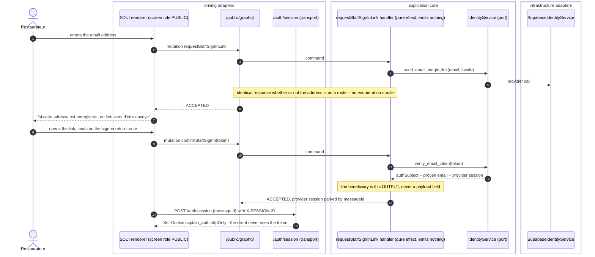
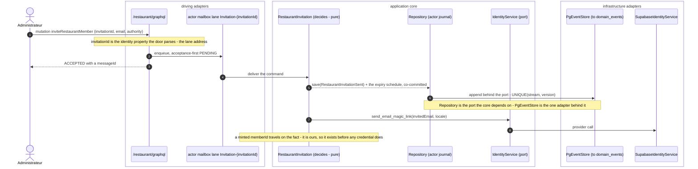
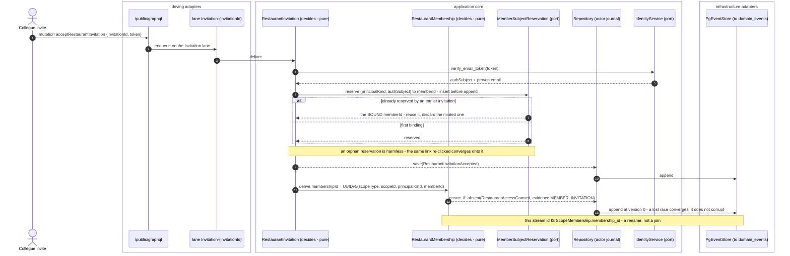
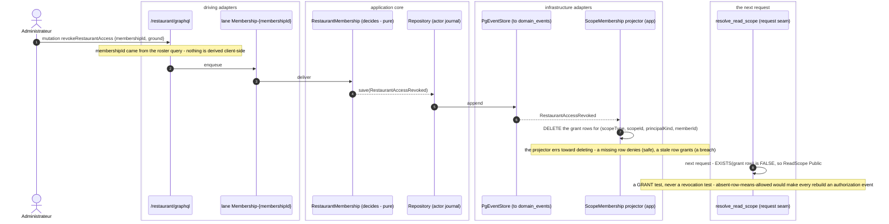
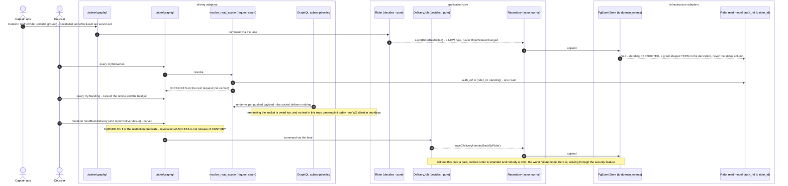

# PROP-20260831-180622 — Staff authentication: the roster, the invitation, and the door (#639 part C)

- **Status**: Proposed — **approved in principle by the FOUNDER on 2026-08-31, conditional on the
  four Concerns.** It moves to `Approved` when they are checked, not before: an unchecked Concern
  blocks it mechanically, and the founder's own words were *"approve; work the Concerns, then build
  in the stated order"* — never *"ship it"*.
- **Approver's scope choices** (2026-08-31, recorded per ADR-20260724-135945):
  - **FORK 3 — where the sign-in door lives: R1.** One screen on the staff host addresses
    `/public/graphql` while the rest of its surface addresses `/restaurant/graphql`. The
    restaurateur stays on one address the whole way; the renderer gains the per-screen role
    capability it does not have today. The separate-host alternative was declined.
  - **`public-graph-limits`: the limits land in the SAME slice.** Not shipped-and-recorded. So step 6
    carries `limit_depth` and `limit_complexity` rather than merely noting their absence, and the
    Concern discharges when they land — this choice commits the work, it does not complete it.
  - FORKS 1 and 2 (invitation identity; check-versus-lock) were **deliberately not put to him** — they
    are the team's to settle under the independent reviewer pass. He did not ask for them back.
- **Date**: 2026-08-31
- **Tracking issue**: [#639 "STAFF-AUTH: restaurant staff, account managers and riders cannot sign in at all"](https://github.com/TheCaptainCompany/captain-food/issues/639) (part C)
- **Realized by**: — (filled at completion)
- **Reversibility class**: **HOLD: human** — identity surface, stored event shapes, Tours-facing.
- **Related**:
  [ADR-20260830-213135](../adr/ADR-20260830-213135-the-staff-auth-answers-captain-binds-the-first-person-and-the-owner-invites-the-rest.md)
  (the four founder answers this designs) ·
  [ADR-20260830-234532](../adr/ADR-20260830-234532-the-second-sitting-publish-france-wide-revocation-is-immediate-and-the-objection-chain-was-decided-22-days-ago.md)
  (revocation is effective on the next request; the custody finding) ·
  [ADR-20260818-101500](../adr/ADR-20260818-101500-the-restaurant-signs-in-by-email-link-and-638-freezes-at-chunk-1.md)
  (email link; the two non-negotiables in §0) ·
  [ADR-20260818-094500](../adr/ADR-20260818-094500-staff-auth-mechanism-and-refund-approval-stays-with-the-restaurant.md) ·
  [ADR-20260818-004646](../adr/ADR-20260818-004646-no-business-identifier-lives-in-the-identity-provider.md) ·
  [ADR-20260830-191457](../adr/ADR-20260830-191457-a-role-guard-takes-a-witness-and-an-unbound-caller-is-recorded-as-public.md)
  (parts A and B) ·
  [PRINCIPALS-MEMBER](../decisions/PRINCIPALS-MEMBER.yaml) (**decided 2026-08-31** by [ADR-20260831-220559](../adr/ADR-20260831-220559-the-person-is-a-principalkind-not-an-eighth-usertype.md) — a declared dependency of this proposal, closed by step 1's [PR #835 "#639 part C step 1: the person is a `PrincipalKind`, not an eighth `UserType`"](https://github.com/TheCaptainCompany/captain-food/pull/835), not by this proposal) ·
  [SUPPORT-CONTACT](../decisions/SUPPORT-CONTACT.yaml) (decided 2026-08-31)
- **Concerns** (a proposal cannot move to `Approved` while one is unchecked):
  - [ ] **public-graph-limits**: `limit_depth` / `limit_complexity` occur **nowhere** in `specs/**` or `crates/**`. Part C adds unauthenticated write entry points to `/public/graphql`. Either the limits land in the same slice, or the decision to ship without them is recorded with its reason.
  - [ ] **kernel-change**: [PRINCIPALS-MEMBER](../decisions/PRINCIPALS-MEMBER.yaml) is **decided** (2026-08-31, [ADR-20260831-220559](../adr/ADR-20260831-220559-the-person-is-a-principalkind-not-an-eighth-usertype.md), landed in [PR #835 "#639 part C step 1: the person is a `PrincipalKind`, not an eighth `UserType`"](https://github.com/TheCaptainCompany/captain-food/pull/835)), and §3/§2 have their answer for three of its four parts: the person is a `PrincipalKind`, `UserType` does **not** widen (an eighth value would mint an eighth `/{path}/graphql` surface), `ScopeType` is untouched. **The box stays unchecked** — checking it is a separate act, and the fourth part is not built: `requires.acting`'s membership semantics are stated but consumed by nothing (zero `requires:` blocks exist in any `specs/*/api.yaml`; [#636](https://github.com/TheCaptainCompany/captain-food/issues/636) owns the emitter), so §5's membership predicate still has no compiler to compile to.
  - [x] **revocation-grounds**: the closed `RiderRestrictionGround` (né `RevocationGround`) vocabulary is the highest-value item in the rider slice and it is a legal surface. **Ruled 2026-09-04** ([ADR-20260904-014136](../adr/ADR-20260904-014136-rider-restriction-ships-now-with-the-smallest-closed-set-of-grounds-and-counsel-can-only-add.md), founder: *"build step 4 now with the smallest closed set naming no work-performance ground; counsel can only add"*): step 4 ships **four grounds naming the FACT the platform observed** (`RIDER_REQUESTED`, `ELIGIBILITY_DOCUMENT_LAPSED`, `IDENTITY_MISMATCH`, `ACCOUNT_COMPROMISE` — the legal lens's proposal, not clearance), refuses every performance or behaviour ground and any catch-all, and is **additive-only** (a value is never removed — a regretted one is made unspellable at the command door, the `SUSPENDED` move; readers deploy first). Counsel's review comes under the [PUBLISH-PRECONDITIONS](../decisions/PUBLISH-PRECONDITIONS.yaml) timing and may only add. The Directive (EU) 2024/2831 duties on the event, the notice and the review path are that ADR's §Decision 6; the review path is [#858](https://github.com/TheCaptainCompany/captain-food/issues/858). [REVOKED-COLLEAGUE-NOTICE](../decisions/REVOKED-COLLEAGUE-NOTICE.yaml) is a different instrument and stays counsel-owned. **Discharged 2026-09-04**: 4-i landed the set, additive-only, with the `readOnlyCatchAll: UNRECOGNISED` tolerant-decode variant unspellable at every write door and off OTLP ([PR #875](https://github.com/TheCaptainCompany/captain-food/pull/875), still DRAFT pending the team's independent review).
  - [x] **custody-door**: `DeclineDelivery`, `ReportDeliveryIssue` and `ResolveDeliveryIssue` have **no API operation**. Until they do, a revoked rider holding paid, cooked food has no way to hand it back — and the test that would prove otherwise cannot be written. **Discharged 2026-09-04**: all four now have one — `declineDelivery`/`reportDeliveryIssue`/`resolveDeliveryIssue` landed in 3-i ([PR #864](https://github.com/TheCaptainCompany/captain-food/pull/864)), `handBackDelivery` — the door that actually returns the food, §7.2 — in 3-ii ([PR #870](https://github.com/TheCaptainCompany/captain-food/pull/870)). The step-4 restriction predicate's carve-out (§6) now has doors to name.
  - [x] **one-subject-one-role**: the provider replaces the `captain_food` claim object **wholesale**, and each stamper writes the whole object (`stamp_put_body` → `{role: CUSTOMER, customer_id}`, `stamp_rider_put_body` → `{role: RIDER}`), so stamping RIDER on a subject that already carries `customer_id` would **erase the customer claim** — a rider who also orders dinner is unrepresentable (§1, §2). Registered 2026-09-03 by [PR #852 "#639 part C step 2c-i: the hardcoded RIDER stamper and the identify-only rider sign-in mutations"](https://github.com/TheCaptainCompany/captain-food/pull/852). **Decided 2026-09-04** ([ADR-20260904-014135](../adr/ADR-20260904-014135-one-subject-may-hold-several-roles-the-claim-carries-a-role-set-and-the-path-picks-the-one-that-acts.md), founder: *"final vision: one claim, one binding per role; own issue after step 6; refusal stands until then"*): the claim carries a **role SET** and no id for any role (ADR-20260818-004646 read forward), the `/{role}/graphql` path picks the one that acts, `domain_events.user_type` stays the path role; additive producer + tolerant reader, one write, readers deploy first. Built by [#857](https://github.com/TheCaptainCompany/captain-food/issues/857) **after step 6**; until then `confirmRiderSignIn` **refuses** such a subject with the typed, translated `AuthSubjectHoldsAnotherRole` — fail closed, counted as `rider_claim_stamp_failed_total{reason="claim_conflict"}` — and the customer stamper is unchanged.

> History lives in `git log -p` on this file (ADR-20260801-020000): it always holds the clean current
> design, never appended superseded blocks.

---

## TL;DR

Three of the four principal roles cannot authenticate at all. Part A landed the `riders` projection
table (**written and not yet read**); part B landed the role guard and its witness. Part C is the
door — and the door needs a **person**, which the model does not have.

This proposes:

1. **A person concept with a domain id** (`MemberId`), bridged from the auth subject in our Postgres
   — never the auth subject itself in the authorization index, because
   `ScopeMembership.member_id` already says in writing that it is *"the DOMAIN id … never the auth
   subject"*.
2. **Two aggregates**: `RestaurantInvitation` (client-minted id, addressable at the mailbox door) and
   `RestaurantMembership` (id = the **existing** `ScopeMembership.membership_id` derivation, so the
   projection is a rename of the stream id rather than a join).
3. **One grant act with a closed evidence discriminator** (`GrantRestaurantAccess` +
   `AccessEvidence`) instead of four sibling commands, so there is one write path into the table
   every read-authorization predicate resolves against.
4. **A rider sign-in door** that resolves `auth_ref → rider_id` from Postgres and fails closed to
   `ReadScope::Public` — *specifically not* to the claim's rider id — plus **restriction as its own
   fact** (`RiderRestricted` / `RiderReinstated`, never `RiderStatusChanged`) with a closed ground
   vocabulary.
5. **Revocation of ACCESS separated from release of CUSTODY of the food**: an immediately-restricted
   rider keeps exactly the operations that return a customer's paid meal to the restaurant.

Three forks are presented with both costs and no pre-resolution: **what identifies an invitation and
a membership** (§3), **check-or-lock for an act on another aggregate** (§4), and **where the sign-in
door lives, given that no staff surface can reach a `PUBLIC` operation today** (§5).

---

## 0. What is already decided, and what this proposal may not do

Restated here because each has a reason, and each has been re-derived from scratch by someone who did
not know it existed.

| Constraint | Why it holds | Source |
|---|---|---|
| **Do NOT clone `verifyPhone` with a wider `roles:` list** | `verifyPhone` is *register-or-identify*: a first verified phone **creates** the Customer, with a client-supplied id used as the mailbox actor address. Staff sign-in is **identify-only against a pre-provisioned roster**, whatever the factor. A wider `roles:` list on a register-or-identify command manufactures principals. | ADR-20260818-101500 |
| **Do NOT parameterise `stamp_put_body`** | It hardcodes `"role": "CUSTOMER"` so a wrong-role stamp is **unspellable rather than validated** (#437): one stamper per role, each hardcoded, selected at compile time. | ADR-20260818-101500, `supabase_auth.rs:424` |
| **Account managers stay unmodelled for V0** | Deliberate. `RESTAURANT_ACCOUNT` exists as a scope width; no account-manager person is designed here. | ADR-20260818-101500 |
| **"Provisions" means appending a domain fact** | Never *creating a user in the identity provider's console* — that reproduces exactly the hand-stamped credential ADR-20260818-004646 exists to remove. | ADR-20260830-213135 |
| **Revocation is effective on the next request** | The write path re-derives; an outstanding token's remaining life stops mattering. | ADR-20260830-234532 |
| **`support@captain.food`, read by the founder, NO voice leg** | So the rider handback screen carries an in-app report, not a call button — a control that renders and does nothing is worse than no control. | [SUPPORT-CONTACT](../decisions/SUPPORT-CONTACT.yaml) |
| **`RESTAURANT` is never renamed as a stored token** | `UserType` is on every `domain_events` row (ADR-0041, immutable log). Correct vocabulary is added **alongside**; `RESTAURANT` becomes a value no new event carries. | PRINCIPALS-MEMBER |

**Out of scope, named so it is not silently inherited**: [PUBLISH-PRECONDITIONS](../decisions/PUBLISH-PRECONDITIONS.yaml)
and [REVOKED-COLLEAGUE-NOTICE](../decisions/REVOKED-COLLEAGUE-NOTICE.yaml) are counsel-owned and open.
No lens output in this document is legal advice or clearance.

---

## 1. What is true at HEAD — verified, with the line that proves it

Every row was read at `c28f0ec`. These are the facts the design starts **from**, not conclusions it
argues to.

| Fact | Evidence |
|---|---|
| One subject holds exactly one role. A restaurant owner who also orders dinner is **unrepresentable**. | `stamp_put_body` writes the whole `captain_food` object as `{role: "CUSTOMER", customer_id}` — `crates/infrastructure/src/integrations/supabase_auth.rs:424-433`. The provider merges shallowly, so every write replaces the object wholesale. |
| A staff surface **cannot reach a `PUBLIC` operation**. | `Surface::role()` returns exactly one role per surface — `crates/web/src/router.rs:57-64`. `RestaurantBackoffice => Role::Restaurant`, `Rider => Role::Rider`. Its own doc-comment: *"staff surfaces are their role by construction — the path 401s without a matching JWT."* |
| There is not one unauthenticated screen on either staff surface. | `restaurant_backoffice.yaml`: 9 screens, 9 × `requires_auth: true`. `rider.yaml`: 2 screens, 2 × `requires_auth: true`. |
| A resolver whose `roles()` exclude the client's role is skipped **by design**, not attempted. | `SkipReason::RoleRefused`, `crates/web/src/graphql.rs:204,261`. A sign-in control bound to a `PUBLIC` operation from a `RESTAURANT` transport does not 403 loudly — it is skipped quietly. |
| The mailbox lane address **must be a payload property known at the door**. | Generated door: `payload_json.get("catalogId")…ok_or_else(\|\| "identity property 'catalogId' missing or not a uuid -- unaddressable")` — `crates/server/src/graphql/generated/mutation.rs:52`. There is no server-derived-from-principal addressing mode. |
| `authSubject` is known only **after** `verify_email_token`, i.e. inside the handler. | `application/src/commands.rs:3546-3556` — `confirm_email_verification` calls the port and reads `.email` from its **output**. |
| `ScopeMembership.member_id` is **the domain id, never the auth subject**. | `specs/database/tables/projection_tables.yaml:1173-1181`, verbatim: *"The DOMAIN id (customerId / restaurantId / restaurantAccountId / riderId), never the auth subject — the sub→domain bridge happens once per request at the edge."* |
| `member_type` is typed `UserType` — the role, which is a URL path. | Same file, line 1160-1161. This is the conflation §2 unpicks. |
| Nothing on the write side prevents two `RiderRegistered` with the same `authRef`. | `specs/database/tables/projection_tables.yaml:485`, in the table's own rules at `c28f0ec`: the write-side reservation *"is designed but unbuilt — see the Rider sign-in door, tracked on #639 part C."* **Since built** (step 2a, `auth_subject_reservations`, `RiderAuthSubjectBoundOnce`): the rule now points at the reservation, and the duplicate is reachable only by REPLAY of pre-#794 history — which is why the classification test in step 2b stays. |
| A duplicate would be **silently swallowed**, not rejected. | `DbFaultPolicy::Skip` is `#[default]` — `crates/infrastructure/src/projection/worker.rs:118-127`: *"Log the failure and advance past it."* Chain: appended → caller told success → projector hits `UNIQUE` → checkpoint advances → no row → fail-closed to Public → the rider can never sign in, and no human sees a rejection. |
| Only CUSTOMER does per-request identity I/O. Every other role is a pure claims function. | `resolve_customer_scope`, `crates/server/src/auth.rs:2270-2280` — every other combination `return read_scope(principal)`, zero I/O. So the rider path is a **new** round trip, not a marginal addition. |
| The public graph has **no depth and no complexity limit**. | `grep -rn 'limit_depth\|limit_complexity' specs/ crates/` → zero hits. |
| Three delivery commands exist with **no door**. | `DeclineDelivery`, `ReportDeliveryIssue`, `ResolveDeliveryIssue` are declared at `specs/delivery/commands.yaml:78,91,105`; no `api.yaml` operation names them. |
| `/auth/*` transport routes already exist and are **not** GraphQL. | `crates/server/src/auth_routes.rs:54-58` — `/auth/session`, `/auth/refresh`, `/auth/logout`, `/auth/sms-hook`. The token is chosen by the server and delivered as an httpOnly cookie. |
| `SUPPORT_CONTACT` **exists as a key since 2c-i** ([PR #852 "#639 part C step 2c-i: the hardcoded RIDER stamper and the identify-only rider sign-in mutations"](https://github.com/TheCaptainCompany/captain-food/pull/852)): `specs/common/configuration.yaml`, `required: [staging, production]`, no default, baked `support@captain.food` for both (the SUPPORT-CONTACT decision, 2026-08-31). | Before 2c-i `grep -rn SUPPORT_CONTACT specs/ crates/` returned nothing and "required key with no default" was a recorded **design**, not a live constraint. It is consumed by ONE surface today — the `RiderNotRegistered` refusal — and printed on no screen yet (#792, step 6). |

### One correction to the dispatch card, load-bearing enough to state first

The card carries, from `vernon`: *"`RestaurantMembership` is separate, keyed
`UUIDv5(scopeType:scopeId:memberType:authSubject)` — the **SAME derivation**
`ScopeMembership.membership_id` already uses, so the projection becomes a rename of the stream id
rather than a join."*

It is the same **shape** and a different **value**. The existing derivation's fourth term is
`member_id`, whose column note forbids the auth subject in that position by name. Substituting
`authSubject` for `member_id` therefore does **not** produce the existing key; it produces a
different key *and* contradicts a written rule on the column that the whole read-authorization
predicate resolves against. Adopting it as stated would put the auth subject into the authorization
index and dissolve the "bridge once, at the edge" property that ADR-20260818-004646 exists to hold.

The "rename, not a join" prize is real and reachable — but only via a **person id** (§2), which is
what makes the fourth term a domain id again. This is why §3's recommended option looks slightly
different from the card's option 1.

---

## 2. The vocabulary — one person concept, two axes, and one word that is about to mean a third thing

`evans`' rule: **the identified thing is the relationship.** `RestaurantMembershipId`, never
`RestaurantMemberId` for the grant. And `RESTAURANT` is a *place* standing in for a *person*;
`RESTAURANT` / `RESTAURANT_ACCOUNT` are two **scope widths**, not two kinds of person. So: one person
concept, and two axes on the membership — **scope** and **authority**.

### 2.1 The names proposed

| Name | Where | What it is | Why not the near-miss |
|---|---|---|---|
| `AuthSubject` | `specs/common/` (kernel) | The identity provider's subject for one credential. | **Minted, and the retype LANDED** (step 1, [PR #835 "#639 part C step 1: the person is a `PrincipalKind`, not an eighth `UserType`"](https://github.com/TheCaptainCompany/captain-food/pull/835)). It was **seven** sites, not the four enumerated here: `customer/events.yaml` ×2, `delivery/events.yaml`, `delivery/commands.yaml`, **and `services.yaml` ×3** — `verify_phone_otp`'s output, `verify_email_token`'s output and `stamp_customer_claim`'s input, which this proposal missed and without which the retype does not compile (the identity service's output flows straight into the retyped event fields). All seven were `ExternalReference`, which the kernel declares as **the HubRise `ref`**, with examples `'MARGHERITA'` and `'CAT-PIZZAS'`. One name = one dedicated scalar. Same string format, so **no stored JSON changed** — a spec-level retype, not a data migration, with a zero-byte SQL diff. |
| `MemberId` | `specs/common/` (kernel) | A natural person who may act within some scope. Minted by us, bridged from an `AuthSubject` in our Postgres. | Not the `AuthSubject` (the column note forbids it in `member_id`). Not `RestaurantMemberId` — the person is not restaurant-shaped; **scope is an axis on the membership**, and naming the person for one width bakes the collapse back in. |
| `PrincipalKind` | `specs/common/` (kernel) | What `member_type` is **really** typed by: `CUSTOMER \| RESTAURANT \| RESTAURANT_ACCOUNT \| RIDER \| MEMBER`. | `UserType` is the **role**, and a role is a URL path (`/{role}/graphql`). Typing `member_type` as `UserType` means every new kind of member manufactures a GraphQL role path. `young`'s reservation key was already spelled with `principal_kind` — the word existed in the finding before it existed in the DSL. (The finding's second term was `auth_ref`; the column that landed in step 2a is `auth_subject`, so the key is `(principal_kind, auth_subject)`.) |
| `RestaurantMembershipId` | `specs/network/` | The relationship: one person's grant on one scope. `UUIDv5(scopeType\|scopeId\|principalKind\|memberId)`. | Membership belongs in `network`, not `customer` (`evans`): the scope is a restaurant. |
| `RestaurantInvitationId` | `specs/network/` | One invitation, client-minted. | See §3 — this is the fork. |
| `AccessEvidence` | `specs/network/` | The closed discriminator on the ONE grant act: `CAPTAIN_ONBOARDING \| GOOGLE_BUSINESS_PROFILE \| OWNER_DECLARATION \| MEMBER_INVITATION`. | Four sibling commands would be four write paths into the table every read-authorization predicate resolves against, each with its own guard to get wrong. |
| `MemberAuthority` | `specs/network/` | The authority axis: `ADMINISTRATOR \| OPERATOR`. | **Provenance test** (`evans`): *could a colleague invited on a Tuesday hold this value?* `ADMINISTRATOR` — yes. `OPERATOR` — yes. **`OWNER` — no**, which is exactly why `OWNER` is provenance masquerading as authority. Ownership, when it matters, is `AccessEvidence`. |
| `RiderRestrictionGround` | `specs/delivery/` | The closed ground of a rider restriction (named `RevocationGround` until the step-4 briefing: "revocation" already means a partner's availability and a `ScopeMembership` grant — `evans`). | A free-text field lets an ops person type *"suspendu pour avoir refusé trois courses"* into a log we cannot rewrite; French case law treats the power to sanction as a criterion of *lien de subordination*, and a ground keyed on declining jobs is the strongest requalification evidence obtainable. A closed enum makes that sentence **unspellable**, and the enum becomes the one page counsel reviews instead of a code audit. **Contents are a Concern, not a recommendation.** |

`RESTAURANT` stays a legal `UserType` value forever. `MEMBER` is added to `PrincipalKind` — a NEW
scalar with no stored history, so it costs no upcaster and no re-attribution. Whether `UserType`
itself also widens is [PRINCIPALS-MEMBER](../decisions/PRINCIPALS-MEMBER.yaml)'s to answer; §3 does
not need it to.

### 2.2 The migration posture, stated before anything lands

CLAUDE.md question 2. `UserType` is stored on every `domain_events` row and `ScopeType` in
`ScopeMembership`, so:

- **Widening an enum is additive and needs no upcaster** (`young`) — but the cost is **deploy order**:
  **readers first, then writers**, because `from_text` is strict while the writer is stringly typed.
  A writer deployed first emits a token the running readers reject.
- **Historical `RESTAURANT` rows are never re-attributed.** They mean what they meant.
- **The cost window is open and closes soon** (`evans`): the sole claim writer hardcodes `CUSTOMER`,
  so **no `domain_events` row was ever authored by a `RESTAURANT` principal**. The vocabulary change
  is a spec edit plus a projection replay *today*, and becomes permanent at the first restaurant
  credential part C issues. Confirm with `SELECT user_type, count(*) FROM domain_events GROUP BY 1`
  before relying on it — **`UNVERIFIED input` until run** (no production query has been executed for
  this proposal).

---

## 3. FORK 1 — what identifies an invitation, and what identifies a membership

**The obstacle, from three sides.** At invite time no auth subject exists. The mailbox lane address
must be a payload property parsed as a UUID **at the door** (`mutation.rs:52`), and `authSubject` is
only known **inside the handler**, after `verify_email_token`. So a subject-derived key cannot be the
lane address of the invite, and `vernon`'s *"a second invite lands on the same stream"* does not hold
as stated at the invitation layer.

**Not in scope to design around**: a new server-derived addressing mode would live in
`tools/codegen-rs/src/emit/actor_inbox.rs`, which a concurrent session owns. Every option below
addresses lanes with machinery that exists today.

### The options

#### Option A — two aggregates, and the person gets a domain id *(recommended — the final shape)*

- `RestaurantInvitation`, `identity: invitationId` — a **client-minted UUID** in the payload. The
  `CreateCatalog` precedent exactly (`mutation.rs:52`); zero new machinery.
- `MemberId` **minted at invite time** and carried on `RestaurantInvitationSent`. It is ours, so it
  can exist before any credential does.
- `RestaurantMembership`, `identity: membershipId = UUIDv5(scopeType|scopeId|principalKind|memberId)`
  — **the existing `ScopeMembership.membership_id` derivation, same terms, same value**. The
  projection row's pk *is* the stream id: a rename, not a join.
- At accept the handler verifies the token → obtains the `AuthSubject` → **arbitrates
  `(principal_kind, auth_subject)` in a write-side reservation table** (insert-before-append). First
  accept binds the subject to the invited `MemberId`; a second invitation to a person already bound
  **reuses the bound `MemberId`** and discards its own minted one, so the membership stream is the
  same one — and the fold, not a set query, rejects the duplicate grant.

| Pros | Cons |
|---|---|
| The membership stream id **is** the authorization index's pk — the prize the card names, reached without putting the auth subject in `member_id`. | **Accept is a two-aggregate step**: `RestaurantInvitationAccepted` on one stream, the membership birth on another. Two appends, not one transaction — the thing `vernon` normally forbids. |
| Revocation addresses the membership lane directly from a `membershipId` the roster query already returned. No lookup, no derivation client-side. | Two aggregates to build instead of one. |
| **One active membership per person per restaurant is stream identity**, because the derivation collapses the population into one stream — and the *population* question (one `MemberId` per subject) is answered by the reservation table, which is the class `reservations.yaml` exists for and which the slice **already owes for the rider** (#794). | The reservation table is on the critical path of a first sign-in. A lost race must produce a rejection a human can read, not a stuck projection. |
| An invitation never accepted leaves **no employment stream for a natural person** — only an invitation stream, with its own retention. That is the cheapest possible answer to the `deletion:` question. | `MemberId` is a new kernel scalar and touches [PRINCIPALS-MEMBER](../decisions/PRINCIPALS-MEMBER.yaml). |
| The invitation's own lifecycle (sent, resent, expired, revoked) never pollutes the membership's. | |

**The two-aggregate step's ordering, answered rather than left open** — the `slug_reservations`
precedent, which pre-writes the reasoning: *"A reservation with no event is a harmless orphan … an
event with no reservation would mean two restaurants believing they own one host."* Applied here:

1. reserve `(principal_kind, auth_subject) → memberId` (an orphan reservation is harmless — the same
   magic link re-clicked converges onto it);
2. append `RestaurantInvitationAccepted`;
3. birth the membership with `create_if_absent` on the derived id (the `verify_phone` precedent).

A crash between 2 and 3 leaves an accepted invitation with no membership: the person is told the link
worked and then cannot act. **Re-clicking the link converges**, because every step is idempotent on a
derived or reserved key — and the roster screen shows `Invitation acceptée, accès en cours` for
exactly that window rather than claiming an access that does not exist. This is the only crash window
the design has and it is named, bounded and self-healing.

*Two writers on one stream*: the membership stream is born from the invitation's lane and later
written from its own. Optimistic concurrency (`UNIQUE(stream, version)`) keeps that correct; the
birth expects version 0, so a race loses harmlessly. Head-of-line ordering is not weakened for any
sequence that matters, because the birth happens exactly once.

#### Option B — one aggregate, keyed over the normalised invited address (`young`)

`membershipId = UUIDv5(scopeType|scopeId|normalisedEmail)`. The invitation is the membership's
PENDING phase.

| Pros | Cons |
|---|---|
| **One aggregate, one stream, one transaction at every step** — no two-aggregate step at all. | The key is **an email**: a natural person's identifier baked into a stream id, in an immutable log, for a record that is an employment history and owes a `deletion:` block. |
| Two invites to the same address converge **at the invite layer**, not merely at accept — so the roster cannot show a person twice even before anyone signs in. | **Normalisation becomes a frozen algorithm forever** (dots, plus-addressing, unicode case folding). Change it and every stream id moves. |
| The roster is a single fold. | A person re-invited at a **different** address gets a second stream for the same human — and the `ScopeMembership.membership_id` alignment is lost, because the pk's fourth term is an email, not a domain id. The projection becomes a join again. |
| | The client must derive the id; the door only checks that it parses as a UUID. A mis-derivation lands on the wrong lane and is caught only by a handler-side recompute-and-reject rule. |

#### Option C — one aggregate, minted membership id, uniqueness by reservation only

`membershipId` is a plain client-minted UUID; the invitation is the PENDING phase; population
uniqueness is arbitrated entirely by the reservation table.

| Pros | Cons |
|---|---|
| The simplest addressing in the document — the `CreateCatalog` precedent, no derivation anywhere, no email in a key. | The `ScopeMembership.membership_id` derivation must change, or the projection becomes a join. That is the concrete price of the simplicity. |
| Duplicates are rejected **before** the append, by the database, with a message a human can read — strictly stronger than a fold check for a population invariant, and it is what `riders.yaml` already says: *"Uniqueness over a POPULATION is not an aggregate's to enforce."* | The invitation's lifecycle and the membership's live on one stream, so an invitation that is never accepted still creates a natural person's stream. |
| Reuses machinery the slice owes anyway (#794). | |

#### Option D — membership keyed over the auth subject, as the card states it

Recorded so the record shows why it lost rather than omitting it.

| Pros | Cons |
|---|---|
| Reads as the shortest path from "the person is the subject" to a stream id. | **It cannot address the invite** — no subject exists at the door. |
| | It contradicts `ScopeMembership.member_id`'s written rule in the position that matters, putting the auth subject into the authorization index. |
| | The "same derivation" claim is false: same shape, different value, so the projection is a join, not a rename — the opposite of the property it was chosen for. |

### Recommendation

**Option A.** It is the only option that reaches the `ScopeMembership` alignment without violating the
`member_id` rule, and its single real cost — a two-aggregate accept — has a precedented, idempotent,
self-healing ordering. **Option C is the honest runner-up** and is genuinely cheaper; the deciding
question is whether the authorization index's pk being the membership stream id is worth one
two-aggregate step. If the answer is no, C is a coherent design and this document does not need
rewriting to adopt it — only §3 and §6's id column.

---

## 4. FORK 2 — for an act on a *different* aggregate, the membership fold is a check, not a lock

`vernon`'s open question, and it is not answerable by assertion. When a member approves a refund, the
acting aggregate is the **Order**, not the membership. The membership fold consulted on the way in is
a **check**: between the check and the append, the membership may be revoked.

#### Option 4a — bounded window plus a recorded actor *(recommended)*

The check happens at command-handling time; the window is one command's duration. The acting person
is recorded in the envelope (`domain_events.user_id`, ADR-0041), so *"who approved this refund"* is
answerable per natural person **after the fact**. Revocation is not retroactive.

| Pros | Cons |
|---|---|
| One aggregate per transaction, unchanged. | A revoked member can, in principle, complete one in-flight act. |
| *"Who approved this"* is answerable forever from the log — which is what ruling B requires. | The window's size is a property of command latency, not a declared number. |
| Costs nothing to build: it is what the mailbox already does. | |

#### Option 4b — authorization state on the acting aggregate

The Order (or Restaurant) folds who may act, so the check is a term in the same transaction as the
append — no window at all.

| Pros | Cons |
|---|---|
| The race is structurally impossible, not merely bounded. | Every membership change fans out into every acting aggregate's stream. |
| | It puts *"invite a colleague"* onto the same lane as *"change opening hours"* — head-of-line at peak, which is `vernon`'s own reason for not putting the roster on `Restaurant`. |
| | Authorization state duplicated into aggregates that have no business holding it: a stale copy grants. |

**Recommendation: 4a**, with the invariant that keeps it safe stated as a rule rather than a habit —
**no irreversible act is authorized by the read index; the write path re-derives from the stream.**

---

## 5. FORK 3 — where the sign-in door lives

**This is a card defect worth stating plainly**: a `PUBLIC` operation is **not reachable from a staff
surface**. `Surface::role()` returns one role per surface, staff paths 401 before any guard, and
there is not one unauthenticated screen on either staff surface (9/9 and 2/2 `requires_auth: true`).
Worse than a 403: a control bound to an operation the client's role does not allow is
`SkipReason::RoleRefused` — **skipped by design, silently**. Part C therefore needs a renderer
capability that does not exist, and it must be scoped explicitly or the sign-in button does nothing.

And a rule with no exception: **never OMIT `roles:`** — an omitted list is more public than
`[PUBLIC]`.

#### Option R1 — a per-screen GraphQL role in the screens DSL *(recommended — DECIDED by the founder 2026-08-31, LANDED 2026-09-03)*

`graphql_role: PUBLIC` on the sign-in screen, generated into the screen table; the renderer holds one
transport per role and picks per screen, with `Surface::role()` as the default. **Landed as exactly
that name** ([PR #854](https://github.com/TheCaptainCompany/captain-food/pull/854)): `Screen::graphql_role`,
`Surface::role_for(screen)`, validator §26 (`screen-graphql-role-refused-operation` and its two clause
rules — the mitigation named in the Cons column below is enforced, and widened: not just
`requires_auth: false`, but every operation the screen binds must admit the role). The staff door of
§8.1 reuses it unchanged.

| Pros | Cons |
|---|---|
| It makes an existing implicit behaviour explicit: the customer surfaces already *"start anonymous and upgrade after auth"* — the upgrade is real and undeclared. | A new DSL key on `specs/screens/**` and a renderer change. |
| The sign-in door stays inside SDUI, so the screens spec keeps describing the whole product. | It widens what a screen can do; a screen that picks `PUBLIC` by mistake downgrades itself silently. Mitigation: the validator can require `requires_auth: false` wherever `graphql_role: PUBLIC` is declared, making the mismatch unspellable. |
| One capability serves the sign-in door, the accept screen and the not-yet-linked refusal — all three need it. | |

#### Option R2 — a dedicated unauthenticated host for staff sign-in

`login.captain.food` as its own audience whose `Surface::role()` is `Public`.

| Pros | Cons |
|---|---|
| No renderer change: the existing one-role-per-surface rule holds. | A cross-host session hand-off for a cookie scoped to another host — the exact class of thing that works in dev and fails on the first `SameSite` review. |
| A reserved audience label is established machinery (ADR-0036). | A whole surface, its screens and its translations, for one door. |
| | The refusal screen (§8.5) is on the *back office*, and it still cannot render there. |

#### Option R3 — sign-in entirely outside the SDUI renderer

Server-rendered `/auth/staff/*` routes; the door is transport, like `/auth/session` already is.

| Pros | Cons |
|---|---|
| Adds **no** unauthenticated write entry point to a public graph that has no `limit_depth` and no `limit_complexity`. | A second UI mechanism outside SDUI — the screens spec stops describing the door, which is the thing every other surface guarantees. |
| Rate-limiting an email-send endpoint at the transport layer is ordinary and well understood. | It diverges from the established precedent: `verifyPhone` is a `PUBLIC` **mutation**, and only session *delivery* is transport. |
| | The **accept** is a domain act appending facts; hiding it inside a transport route buries a business decision in plumbing. |

### Recommendation

**R1 for the renderer, and the established split for the flow**: the domain act is a `PUBLIC`
mutation on the graph (the `verifyPhone` precedent), session delivery stays on `/auth/session`
(unchanged). The magic-link **request** may be either; this proposal puts it on the graph for
symmetry with `RequestEmailVerification`, which is already a command that emits nothing.

**The cost this incurs is registered as a Concern, not waved through**: part C adds unauthenticated
write entry points to a graph with no depth or complexity limit. That exposure exists today
(`verifyPhone`, `claimRestaurantListing`); part C multiplies it.

---

## 6. The model — three facts per lifecycle, and no `*Updated` carrying capabilities

`young`: **refuse `MembershipStatusChanged`** — that is `RiderStatusChanged` reincarnated, one event
meaning a person quit and a person was sanctioned. Payloads are business-only; the acting user is
envelope (ADR-0041).

### 6.1 Invitation (`specs/network/`)

| Message | Emits | Payload (business only) |
|---|---|---|
| `InviteRestaurantMember` | `RestaurantInvitationSent` | `invitationId`, `restaurantId`, `invitedEmail`, `authority`, `memberId` (minted) |
| `RevokeRestaurantInvitation` | `RestaurantInvitationRevoked` | `invitationId` |
| *(schedule)* | `RestaurantInvitationExpired` | `invitationId` |
| `AcceptRestaurantInvitation` | `RestaurantInvitationAccepted` | `invitationId`, `authSubject` |

Expiry is a **recorded fact**, never an engine timer — `reminders:` + `schedules:` on the aggregate,
inheriting the three prices `OrderAcceptanceTimedOut` already paid: `reschedule: keep` so a resend
cannot silently extend the window, and the schedule co-commits with the fact.

`AcceptRestaurantInvitation`'s **beneficiary is `verify_email_token`'s OUTPUT, never a payload
field.** The contrast is live and it is a defect: `ClaimRestaurantListing.accountId` is
caller-supplied, nullable, never resolved by the handler, on a `PUBLIC`-callable mutation — and the
projector turns that field into a RESTAURANT-scope grant. A caller names the beneficiary of an
authorization grant for an aggregate nobody loaded. **Not fixed here** (§11 step 6).

### 6.2 Membership (`specs/network/`)

| Message | Emits | Payload |
|---|---|---|
| `GrantRestaurantAccess` | `RestaurantAccessGranted` | `membershipId`, `scopeType`, `scopeId`, `principalKind`, `memberId`, `authority`, `evidence` (`AccessEvidence`) |
| `RevokeRestaurantAccess` | `RestaurantAccessRevoked` | `membershipId`, `ground` |

One act, four doors, one `AccessEvidence` discriminator: Captain provisions (`CAPTAIN_ONBOARDING`),
an owner proves ownership (`GOOGLE_BUSINESS_PROFILE`), an owner declares (`OWNER_DECLARATION`), a
member invites a colleague (`MEMBER_INVITATION`).

`Q1` removes the need for a coordinator in V0: **if Captain provisions by hand, the human is the
process manager.** Build the commands; do not build a saga for a two-step human process. Accept is
the only two-aggregate step and it is **not** a process manager — a PM here holds one bit both folds
already hold, and has nothing to compensate.

### 6.3 Rider restriction (`specs/delivery/`)

Ruled 2026-09-04 by [ADR-20260904-081527](../adr/ADR-20260904-081527-rider-standing-is-a-grant-on-the-identity-row-the-doors-are-human-only-and-step-4-lands-in-three-slices.md) (team consent, thirteen lenses).

| Message | Emits | Payload |
|---|---|---|
| `RestrictRider` (input: `riderId`, `ground` — nothing else) | `RiderRestricted` | `riderId`, `ground` (`RiderRestrictionGround`), `decidedAt`, `effectiveAt` — both **server-set** |
| `ReinstateRider` | `RiderReinstated` | `riderId` |

**NEW event types, not a version of `RiderStatusChanged`** — the store has no version column, so a
reshape is not expressible; a new type is. Availability is the rider's fact; restriction is the
platform's — different payloads, different authoring actors, and **one word: restriction** (never
*suspension*, never *réintégrer*). `RiderStatus::SUSPENDED` **stays in the enum** as
legacy-parseable and is made **unspellable at the command door**: `ChangeRiderStatus.status`
becomes its own scalar `RiderAvailabilityTarget { OFFLINE, AVAILABLE, ON_DELIVERY }`, the four
`→ SUSPENDED` entry edges leave the lifecycle and `SUSPENDED → OFFLINE` stays as the exit for
legacy rows.

The restriction is a **fact in state** on the `Rider` aggregate (`restriction: Option<…>` beside
the availability machine, never a second `lifecycle:`): restrict only an unrestricted rider,
reinstate only a restricted one, a second ground needs a reinstatement first — the Art. 11 log is
never overwritten. `RestrictRider` is **human-only**: `roles: [ADMIN]`, `requires: acting:
{ ADMIN: any }`, and a validator ERROR for any process manager that `sends` it.

`decidedAt` and `effectiveAt` are both in the payload because `legal-specialist` grades the
distinction a blocker: the Art. 11(3) statement deadline anchors on `effectiveAt`. **In V0 both are
stamped by the handler with the same server instant** (an admin-typed `decidedAt` is a backdating
vector; the SDUI has no date-time input). The future `effectiveAt` — permitted for
`ELIGIBILITY_DOCUMENT_LAPSED` / `RIDER_REQUESTED`, refused forever for the two protective grounds —
is designed as a **scheduled fact appended by a due-row worker**, never a clock term in the seam's
grant predicate ([ADR-20260904-081527](../adr/ADR-20260904-081527-rider-standing-is-a-grant-on-the-identity-row-the-doors-are-human-only-and-step-4-lands-in-three-slices.md) §5).

`RiderRestrictionGround` carries a read-only catch-all `UNRECOGNISED` (`#[serde(other)]`) that the
command door, the wire and OTLP cannot spell: without it an unknown stored ground fails the whole
stream load AND is skipped by the projector with the checkpoint advancing — a stale grant.

### 6.4 Read models, and the rule that keeps them from becoming oracles

**A predicate over these tables may only be a GRANT test, never a REVOCATION test.** Absent-row-means-
allowed makes every rebuild an authorization event. Concretely: `EXISTS(grant row)` is legal;
`NOT EXISTS(restriction row)` is not.

Rebuild recipes are **per table and they are opposites** — state each one where it lives:

| Table | Rebuild | Why |
|---|---|---|
| `ScopeMembership` | `DELETE` + checkpoint reset + full replay | Set-shaped: one event grants/revokes N rows. A stale row **grants** — a silent breach — so the projector errs toward deleting, and a rebuild must start from empty. |
| `Rider` | Checkpoint reset, **never** `TRUNCATE` | Upsert keyed on `rider_id` with one creating arm, so a from-zero replay rewrites every row in place and no rider is denied mid-rebuild. `TRUNCATE` + replay fails every rider closed to Public for the length of the drain: the fleet cannot sign in. **Step 4 adds `standing` (grant-shaped, NOT NULL) and the creating arm never writes it** — otherwise the same replay re-grants every restricted rider for the drain ([ADR-20260904-081527](../adr/ADR-20260904-081527-rider-standing-is-a-grant-on-the-identity-row-the-doors-are-human-only-and-step-4-lands-in-three-slices.md) §2). |
| `Member` (new, the staff bridge) | Checkpoint reset, never `TRUNCATE` | Same shape as `Rider`, same reason. |
| `auth_subject_reservations` (2a's table, REUSED — no `member_subject_reservations`, [ADR-20260905-101349](../adr/ADR-20260905-101349-step-6-lands-in-four-slices-the-bridge-and-the-grant-first-the-door-second-and-the-accept-is-two-commands-in-two-lanes.md) §4) | **Not rebuildable — do not replay it** | A reservation table is not a projection: nothing replays into it, and a rebuild would not reproduce it. It is domain-owned write state whose whole content is a `UNIQUE` constraint plus enough provenance to explain a rejection. |

**Revocation must NOT release the reservation.** The subject stays bound to its `MemberId` after the
grant ends; releasing it would let a re-invitation mint a second person for the same human and
silently split their history.

**#794 is a copy job — and since 2026-09-05 not even that: the MEMBER binding reserves in 2a's own table ([ADR-20260905-101349](../adr/ADR-20260905-101349-step-6-lands-in-four-slices-the-bridge-and-the-grant-first-the-door-second-and-the-accept-is-two-commands-in-two-lanes.md) §4).** `specs/database/tables/reservations.yaml` already declares the category and
pre-writes both refutations — why not the projection (eventually consistent: two claimants both pass
a read-model lookup and only diverge once the projector catches up) and why not the projection's own
`UNIQUE` (it fires in the projector, *after* the caller was told success). Key on
**`(principal_kind, auth_subject)`**, not `auth_subject` alone: a person may hold a rider binding and
a staff binding, and collapsing them makes one revoke the other.

### 6.5 The API surface

- **Roster query**: flat, top-level, **no args** — the restaurant is derived from `ReadScope`, never
  passed. Pagination in the shape **from day one** (`limit`/`offset`, the `PageLimit`/`PageOffset`
  scalars `restaurants` already uses). Never a nested cross-scope edge from `Restaurant`.
- **Non-additive and separate, each its own change**: the `ClaimRestaurantListing.accountId`
  deprecation path (deprecate → ignore → remove — **never reshape in the PR that adds the grant
  path**), `ScopeMembership.member_id` semantics, and any `UserType` widening.
- **`deletion:`** — the membership stream is a natural person's employment history. This proposal
  **owes it a block or an explicit "not yet, and why"**, and takes the second: a `deletion:` engine EXISTS (`specs/ordering/actors.yaml`, Customer's block) but is gated off behind the erasure launch gate, and Delivery declares none for `Rider`, so the Member block is owed on the SAME clock as Customer's, not "when an engine appears" (corrected 2026-09-05, legal, [ADR-20260905-101349](../adr/ADR-20260905-101349-step-6-lands-in-four-slices-the-bridge-and-the-grant-first-the-door-second-and-the-accept-is-two-commands-in-two-lanes.md) §11); it is owed the
  moment one is declared, and Option A minimises the exposure by leaving no membership stream at all
  for an invitation never accepted.

---

## 7. Revocation of ACCESS is not release of CUSTODY

The founder's answer is *immediately, on the next request*. Three things "next request" does not
cover, and the slice owes all three:

1. **The socket does not re-resolve.** `authorize_and_resolve_scope` resolves `ReadScope` once, and
   the WS leg calls it from the `connection_init` closure. A rider restricted at 19:40 with an open
   subscription keeps `ReadScope::Rider` until they disconnect.
2. **Per-request *identity* resolution is not per-request *authorization*.** Resolving
   `auth_ref → rider_id` gives a current identity; the restriction fact must be a **term in the
   derivation**, or the same cache has been rebuilt one layer down.
3. **A rider makes no request while standing still.** The founder-visible number is not *"how long
   does a token survive"* but *"how long can a restricted rider stand on the pavement believing they
   are still working"* — which is push-shaped, not TTL-shaped (ADR-20260810-231300).

**The shape nobody should build**: re-deriving by folding the `Rider-{id}` stream per read request —
unbounded per request, and it puts the read path on `domain_events`, which CLAUDE.md forbids
outright. The write path re-deriving from the stream is correct **for the write path**, where the
worker loads the aggregate once per command anyway.

### 7.1 The socket, and the test that cannot be written

| Option | Pros | Cons |
|---|---|---|
| **7a — terminate the socket on the restriction fact** | What ADR-20260830-234532 requires; the connection stops existing. | **No test in this repo can reach it**: there is no WS client in dev-dependencies and `oneshot` cannot upgrade. Shipping it means adding a WS client dev-dep — a named, non-trivial cost — or shipping an assertion-free feature. |
| **7b — re-derive per pushed payload** | Falsifiable **by the existing suite, for free**: the authorization term is in the same derivation the query path uses. Degrades to "the socket stays open and delivers nothing". | Does not satisfy the record on its own: an idle authenticated socket remains open. |

**Both are in the slice.** 7b first, because it is the one the suite can falsify and it is what
actually stops data flowing; 7a immediately after, with the dev-dependency cost stated in its issue
rather than discovered in it.

### 7.2 The handback — the slice's real deliverable

An immediately-restricted rider holding a customer's paid, cooked food currently has **no way to hand
it back**, while the restaurant's board still shows `EN_ROUTE` and the customer's tracking counts
down an ETA that will never arrive. That is the platform's worst failure mode — *a paid order nobody
is told about* — **arriving through the security feature**.

So: **the security transition must not execute the product one.** "Immediately, next request" applies
to `acceptDelivery`, `confirmPickup`, the job list and the online toggle. It must **not** apply to
the operations that get the food out of a restricted rider's hands.

Concretely, the restricted rider's allowed set is exactly `{ report the issue, hand the job back }`,
and the restriction predicate is per-operation rather than per-role.

**This cannot be built yet, and that is the finding.** `DeclineDelivery`, `ReportDeliveryIssue` and
`ResolveDeliveryIssue` are declared commands with **no `api.yaml` operation**. The first test
`TestRevokedRiderCanStillHandBackCustody` needs a door to knock on. Opening those doors is step 3 of
§11 and it is not optional decoration on the revocation work — it *is* the revocation work.

And per [SUPPORT-CONTACT](../decisions/SUPPORT-CONTACT.yaml): **no voice leg**, so the handback
screen carries an in-app report, never a call button.

---

## 8. Screen mockups — one per use case

Low-fidelity is the point: these fix the shape, not the visual design. Staff surfaces are `fr` by
default. Each control names the operation it maps to.

### 8.1 The staff sign-in door — `restos.captain.food/sign-in`

`graphql_role: PUBLIC`, `requires_auth: false` (the pair R1's validator rule would enforce).

```
+------------------------------------------------------------------+
|  [Captain.Food]                                    Restaurateurs |
+------------------------------------------------------------------+
|                                                                  |
|            Connectez-vous a votre espace restaurant              |
|                                                                  |
|   Adresse e-mail                                                 |
|   +----------------------------------------------------------+   |
|   |  vous@votre-restaurant.fr                                |   |
|   +----------------------------------------------------------+   |
|                                                                  |
|              [  Recevoir mon lien de connexion  ]                |
|                    -> requestStaffSignInLink                     |
|                                                                  |
|   Nous vous envoyons un lien. Ouvrez-le sur cet appareil.        |
|   Aucun mot de passe : le lien remplace le mot de passe.         |
|                                                                  |
|   Un probleme ? support@captain.food                             |
+------------------------------------------------------------------+
```

After submission the same screen swaps to a confirmation panel. **It says the same thing whether or
not the address is on a roster** — an enumeration oracle over the restaurateur population is a
liability, and the refusal that matters is §8.5, after the link is opened.

```
+------------------------------------------------------------------+
|            Si cette adresse est enregistree, un lien             |
|            vient d'etre envoye a vous@votre-restaurant.fr        |
|                                                                  |
|            Le lien expire dans 15 minutes.                       |
|            [ Renvoyer un lien ]   (actif apres 60 s)             |
+------------------------------------------------------------------+
```

### 8.2 The roster — `restos.captain.food/equipe`

Three states, two authorities. `ADMINISTRATOR` sees the controls; `OPERATOR` sees the list without
them — **the control is absent, not disabled**.

```
+------------------------------------------------------------------+
|  [Captain.Food]   Commandes  Livraisons  Equipe*  Profil    (JD) |
+------------------------------------------------------------------+
|  Equipe - Pizza Roma                    [ + Inviter un collegue ] |
|                                             -> inviteRestaurantMember
+------------------------------------------------------------------+
|  PERSONNE                 ACCES            DEPUIS                 |
|  ----------------------------------------------------------------|
|  Jean Dupont              Administrateur   12 mars 2026           |
|  vous                                                             |
|  ----------------------------------------------------------------|
|  Sofia Meunier            Operateur        3 aout 2026            |
|  sofia@pizzaroma.fr                              [ Retirer ]      |
|                                        -> revokeRestaurantAccess  |
|  ----------------------------------------------------------------|
|  karim@pizzaroma.fr       Operateur        Invite le 31 aout      |
|  Invitation en attente - expire dans 6 jours                      |
|                            [ Renvoyer ]  [ Annuler l'invitation ] |
|                                     -> revokeRestaurantInvitation |
|  ----------------------------------------------------------------|
|  lea@pizzaroma.fr         Operateur        Invitation acceptee    |
|  Acces en cours d'activation - rechargez dans un instant          |
|                                                                   |
|                                        1-4 sur 4   [<] [>]        |
+------------------------------------------------------------------+
```

The fourth row is the §3 crash window rendered honestly: an accepted invitation whose membership
birth has not landed says so, rather than claiming an access that does not exist.

**`gaps:` this screen must declare if it ships before its dependencies**: no display name exists for
an invited person until they accept (the roster shows the address), and there is no
"who last acted" column until the envelope's `user_id` is exposed to a read model.

### 8.3 Invitation acceptance — `restos.captain.food/invitation`

Reached by opening the emailed link. `graphql_role: PUBLIC`, `requires_auth: false`.

```
+------------------------------------------------------------------+
|  [Captain.Food]                                                  |
+------------------------------------------------------------------+
|                                                                  |
|      Pizza Roma vous invite a rejoindre son espace Captain.       |
|                                                                  |
|      Adresse verifiee : karim@pizzaroma.fr                       |
|      Acces demande    : Operateur                                |
|                                                                  |
|      En acceptant, vous pourrez consulter et traiter les          |
|      commandes de ce restaurant. Vous pouvez etre retire de       |
|      cet acces a tout moment par un administrateur.               |
|                                                                  |
|              [  Rejoindre Pizza Roma  ]                          |
|                 -> acceptRestaurantInvitation                     |
|                                                                  |
|      Ce n'est pas vous ? Ne cliquez pas. support@captain.food     |
+------------------------------------------------------------------+
```

The confirmation step exists deliberately: a fact binding a natural person is appended here, so the
person sees what they are joining first. The copy describes **access to a workspace** and never
asserts employment (*"personne habilitee"*, never *"employe"*).

### 8.4 Revocation confirmation (bottom sheet on §8.2)

```
+------------------------------------------------------------------+
|  Retirer Sofia Meunier de l'equipe ?                             |
|                                                                  |
|  Elle perdra l'acces aux commandes de Pizza Roma des sa           |
|  prochaine action. Les commandes qu'elle a traitees restent       |
|  a son nom dans l'historique.                                     |
|                                                                  |
|                       [ Annuler ]   [ Retirer l'acces ]          |
|                                  -> revokeRestaurantAccess        |
+------------------------------------------------------------------+
```

Second sentence is not reassurance copy — it is §4's recorded-actor property, said out loud, so the
owner is not surprised that history keeps a revoked person's name.

### 8.5 The not-yet-linked refusal — its own screen, in French

Its own screen, **not** a banner on the order queue: a banner leaves the nav in place and the next tap
serves the same refusal on eight other screens. The load-bearing difference from an empty state — if
the *Entrantes / En preparation / Pretes* tabs are on screen, **the system is claiming orders could
arrive**.

```
+------------------------------------------------------------------+
|  [Captain.Food]                                                  |
+------------------------------------------------------------------+
|                                                                  |
|                                                                  |
|        Votre compte n'est pas encore relie a un restaurant.      |
|                                                                  |
|        Votre adresse est bien verifiee, mais aucun acces         |
|        restaurant n'y est associe pour l'instant.                |
|                                                                  |
|        Ecrivez-nous et nous ferons le lien :                     |
|                                                                  |
|                     support@captain.food                          |
|                                                                  |
|        Precisez le nom et l'adresse de votre etablissement.       |
|                                                                  |
|                       [ Se deconnecter ]                          |
|                                                                  |
+------------------------------------------------------------------+
```

**No nav, no tabs, no order counts, no phone number** (there is no voice leg — a call button here
would be a control that renders and does nothing). `SUPPORT_CONTACT` is a **required configuration
key with no default**, so the surface cannot boot without a value; the key does not exist yet and
lands with this screen.

### 8.6 The restricted rider — `riders.captain.food/restricted`

Not in the card's list, and it is the screen §7.2 exists for. Rewritten 2026-09-04 at the step-4
briefing ([ADR-20260904-081527](../adr/ADR-20260904-081527-rider-standing-is-a-grant-on-the-identity-row-the-doors-are-human-only-and-step-4-lands-in-three-slices.md) §7, §11 — `ux-designer`, `legal-specialist`, `evans`): a **dedicated screen**
reached by a server-side `restricted: { navigate }` bounce (the SDUI has no negation grammar and
no `rider.*` context, and a control that renders but is denied is a false signifier), fed by the
one carved query `myStanding`; **both dates** (ADR-20260904-014136 §6(ii)); the word is
*restreint*; the one control opens the existing handback sheet on this screen (its variables from
`myStanding.heldDelivery` — no second screen, no chaining) and promises only the handback.

```
+------------------------------------------------------------------+
|  [Captain.Food Rider]                 (plain header, no topbar)  |
+------------------------------------------------------------------+
|                                                                  |
|   Votre acces est restreint.                                     |
|   Vous ne recevrez plus de courses.                              |
|                                                                  |
|   Motif : <RiderRestrictionGround, traduit — le FAIT observe>    |
|     (ou : Details de la restriction pas encore disponibles.)     |
|   Decide le : 4 sept. 2026, 14:02                                |
|   Effectif depuis : 4 sept. 2026, 14:02                          |
|                                                                  |
|   +----------------------------------------------------------+   |
|   |  VOUS AVEZ ENCORE UNE COMMANDE                           |   |
|   |  Pizza Roma -> 14 rue Nationale                          |   |
|   |                                                          |   |
|   |  Rapportez la commande au restaurant.                    |   |
|   |         [ Je ne peux pas continuer ]                     |   |
|   |   -> rider_restricted_handback_sheet (standing.heldDelivery) |   |
|   +----------------------------------------------------------+   |
|                                                                  |
|   Vous pouvez contester cette decision et demander son           |
|   reexamen par une personne : <SUPPORT_CONTACT, bound once>       |
|   (selectable text -- no copy button: a control with no listener) |
+------------------------------------------------------------------+
```

The **only live control** on this screen is the one that returns the food. Everything else is gone,
because everything else is denied on the next request — and the one Tell still confirms, because
`operationStatus` / `operationStatusChanged` carry no `roles:` and are unaffected by restriction.
No response deadline is printed until #858 makes one true.

---

## 9. Sequence diagrams — hexagonal-faithful

The actor *decides* (pure), facts are saved through the `Repository`, the Repository appends via its
one adapter. Boxes group hexagon layers; the dependency arrow points inward.

### 9.1 Staff sign-in — the email link



<a href="https://mermaid.live/view#pako:eNqNVEtv4jAQ_iujXJaqIO45VGoBLUhVYRtQ91AJGWdCvDh2ak_ooqr_fcdOKN2WrpYDAnte32P8kkibY5JC4vGpQSNxrMTWierRAH9EQ9Y01QZd91-SdTB_uJvcg_Bwj55E4wRh0wVs7G_IndorswWRi5rQ-fYmfGrhSElVC0PwMLkJJbLxagYOTY4OHfS8dIgGnNUIi9XN7Wx0cT79-4_bkD6sm41Wcsgj1-WTPh97vVpO47xDxlMOPXqvrIEeOWF8bR11PXiKEwpR11xYUIiU1uH50tNQ1gXqPGUkiiJTWzMzt8rsoBQm1wFU3TgELAqU1AesFHkwlkrm6Atws_Ei1J3laEjRIUO3VxK50BezKlM44ck1kkKrfxOfrRbXkfmmFhvh8UOXd-Xbn1HtwdUVC5byeSgMVDKgSijNvXLHfLahHMKBLE0KVUMtd-fJaeM5kuOnKRNcVeKIaMpnzEAKnqdYxzbrSmyVXGvO7MWDPmgrhcaODQ7npIAshdrZvWI7Ad93hrizhGD3fDbtx-lUxMwBPB47wHiE5xIZlQP2N4sTEXbYQHlgIIJd6Rk9DDiAiWgqdC1E64TUeIJ0JOt6NJoslpPxiRy-iXSm8Jh4BRKJQpvQhQn1xGUdbhVLidiHxoBWvA17_iLIvyEFH5m9PeBjckYcW6NptQlEMUVMaRw9HHnmfqCCHuyRsGEN4deqSWsK5ap3qvXI7tBc_JdwzLQqDp10Me-v7KBWmx72MWs2v3gz4DIqx3BbY12ehOwW9pOWaQS2QYMFm1u4Q1CK98rDfLVcrJZ9MBgCBfv_oK3IoVCo34Y9gj7K1P_UMezNDnPYHKDiE7HlZXnPWXxYUljMs-WHt-XlLf4VnhWV8HOQTbJsNr8bzDo_xOQ3r2RIg5G1O4Xs25qEMutQEEqiem70gV0XwEodvdDi8oit3JHcpA8JW5LJy_k9f0n4ooove46FaDQlr69_AFCW91Q" target="_blank" rel="noopener noreferrer">Open this diagram with pan and zoom on mermaid.live — on github.com use Ctrl/Cmd+click or middle-click to get a NEW tab (GitHub strips target=_blank)</a>

### 9.2 Invite a colleague



<a href="https://mermaid.live/view#pako:eNqFVMFu2zAM_RUipwRL0LsPBdIlCAwsmdusOw0oFIlJtNmSK8lei6L_vkfbbdoixXyxLZGPj3xPehppb3iU0SjyfcNO88KqQ1DVL0d4VJO8a6odh-FfJx9ovljnG1KR5qayzsYUVOJmCNn5BzLBttYdSBlVJw6x35GnViFZbWvlEq2uvwnIReCYVBOwdIHK9fG-PB-_vpLwnkKlbCmVSuWYctfapJL1bvZkX79z89zjsDMnaqquS6u7ANI-8PlS-ean1Lp5ZXYqQWPD2hqONKO6CTw5j3CzLL73ELWPFpQfadxT_-2b4FT5SV6-KCQtN-ySTY9bDq3VTOPahzQ50491-6CgQKMTyPxn4sVKsIvDsgX6FmQAnDwZj3G6O5bV-Amv7W0xl-RtU6udivyB4Btm_WfnkdnlJUTOqGqG2XXq8GmsaxZv0TvVpsSi7lTMd_QBNQYdNz4x-RbxHejbHLKR0pHJDqyoDr7mgA9ZNR5jRzOxE01WOtsoY2C9YVSABNv1VYYmcBAaRn2tuU4KZ2K2tyFifMvNIt-sTgnI6PrMaP7167L4sVzQX5uOpKgCsDpgSn3w-gqhMFVGhksrLQgL7atKvYiJXcET32QUVcvjc-7bor8JfenS-aG2sFXURzZNCcLazwTSpsQDqKABtFhlYnzIQzs-WrwkXyyFedxu8uvb5RgeYlVNCeQiCk0-zlygpgL0xtHD1DugviE4yrAUigS5Z--9NoR79-rTFzo2nYaAQS0KjAAgd50T7ip1sPqutO7PuDeQWfYOKb1W5csJRBZyxaeZyN_CC4GwX37spNMBElkHJCglFoSFcIu1XHa8heUepxUN2CS0cWTjlKKXX37AjRfBfC89KfdIOnDnO1XCahxHUxpVHEDR4GJ9GgGt6q5Yw3vVlGn0_PwPZ0bZNg" target="_blank" rel="noopener noreferrer">Open this diagram with pan and zoom on mermaid.live — on github.com use Ctrl/Cmd+click or middle-click to get a NEW tab (GitHub strips target=_blank)</a>

### 9.3 Accept — the only two-aggregate step



<a href="https://mermaid.live/view#pako:eNqNVdFuGjEQ_JUVT1SFti99QWqlUKLo1JLQkPSpEjL2Atvc2a7tQ0VR_r3juyNARNQihRxmd3Z3ZtY89rQz3BtRL_Lvmq3miah1UNVPS3ipOjlbV0sO3WedXKCvF7fFlFSkL64seV0zid1K4jZm6f6QCbIVuyZllE8cYvtNfnkVkmjxyia6-v4to7z39bIU_R5l_eZ3eT52Os6hpbJMRS6mkjg7fJTn58I8tZlszaER5T2gmwDSLvB58OL6R0a_5ZhUHXByKEF9w1oMRxqSrwO_eaW9y-kpwpQza3Ej_j8Rbi_nGaHNm9fLX6wT4Dhsuz68C-nV3NlNW967KJBoR_1Wql-uDlaVr-QVk1lOKwzbJGk3RzHRfFLqhE2xq6BiCrVOGOQf6s6uMvZsfbkF-hzNADg5Mq5SYhecT-Nxkfax8dbw82d4Y0RV3YmgtGafzupzYoEBJffAtnMCMIA0HY9QAOaGTxGfNp1d2_TsqDZ6OkYwnDAiw6Vs95bHST6fzEaEM1ntFowBykVTqN-8d1MgZriHwOJsOhHpLfngMC41iceo0HxEoRE5sx7EZu7Kr2IxyRHEG4xFVeOMwsBGYpGSaMmrzCo8_qySKhP-Aiuz2wMbWu5IoboKpXA4Gv6gGxp5bj0TNL65v54cVwxcR_CWBmQkahVME1aJTcB3ewq5RNBKQkRvmAE3wPkS-85eWOzaJUgEljM9g4Yc9O2C3-BfONoFibRRoSo55qXKnURVMZViHxA31Fj5B_SlnQXYGpvnLAiUdOC-IX92M0LilvvnjHXRWI5NJ26ORtLsanTCd6sjtj-7Bpced6TlxQdxn-j-vphsP_ajdp7vdp4H1Dxmq77Qe892VxCYhy41FE28kNVCLSMW56jj3GeMV_mRgcJbXDW4xnP--PJ2gQaLu4u74ub6tUFIpezsmIn9ADoVlQ4CBgWQZwYHYA-rCyqtS_kmDbVPL1VDyUHGTRsIhGuCVUViqJjTPM98uBLfHUhaiGlqBraQcNDAK1xbYnsD6lUcsDMGv0-PPchcNb9UhleqLlPv6ekvJJhBkw" target="_blank" rel="noopener noreferrer">Open this diagram with pan and zoom on mermaid.live — on github.com use Ctrl/Cmd+click or middle-click to get a NEW tab (GitHub strips target=_blank)</a>

### 9.4 Revoke a colleague's access



<a href="https://mermaid.live/view#pako:eNqFVE1v2kAQ_SsjTkbC6t2HSERxEW2cuMChh0rR4B1gE3vX2Q9IGuW_d8Z2IImIyoX1fLyZefN2X0aVVTTKYOTpMZKp6Erj1mHzxwD_MAZrYrMmN3xXwTqYXhXzG0APU9Voo31wGCgOIWv7BMrpvTZbQIVtIOd7j_xadEFXukUTYPbrWkC-OfIBo2PTN67c7h7r8_HFpYTXaAgKkp78TrfpS3M8z9Vrn0lGnZrBtq11hUFbA5V19AV4Xgj64tjLqQQkiiqtyEMKbXQ0Po-wyMvbHqK1XjNPz5D0fN3b6AzW4zPNabNxyATGKjDyfwgrZ4JfbvM9mbBkZIIkWFC2QW3uSKz-i-bKxe0PSV5WtqV3o7XO3lPXZMI8nesw7AgMPQVwIhAfzuMv82nHH-_S1nu6c4TqzksxSIZE8ITN-wr9sRNTenHBasigiaFflKO9faDTNqZVRd7Dh2VPYOtsNG9Lv7GBwO7JQQ_1LhIqbAg2zjbdOM56Jhm4K95RCsaGnahVe1DEyiWOrzWTmXreeg_OkNxjcZlx65wXB3NxKda8yDiz5szhDrAlZYcoIgOPe0o-T7Lo5lMDHRLI8eUsE7Ue6S9ngiKry-ALgCGQQ46RV_l1vsq7QbcSz-MePGxkxd1CVs8tTaA7Coet00aWWP_Uhj972uZvnZ1I7cEF9aQZcs5DsAd0SgigIDSmgNBo7-XMpdlhNN-dxOOGxhN28iA1da6uP3YhrFkw1W4oKmLiceQv-6A9xs5_z5erZXKcbCxr-z69XuY8k2WaUHUahzKu-dp_nqLHRJgtpjcrCIw54QriwU5zwzsR-mK49iIDLpM2hManWNf2wPo42FgraPCBQJKfOXcdNZvQyJu5s07_7ZG6WzmawKghx9dU8VP7MmIWm-7RVbTBWIfR6-s_JEfdGg" target="_blank" rel="noopener noreferrer">Open this diagram with pan and zoom on mermaid.live — on github.com use Ctrl/Cmd+click or middle-click to get a NEW tab (GitHub strips target=_blank)</a>

### 9.5 Rider restriction, with the custody handback



<a href="https://mermaid.live/view#pako:eNqNVdFu2zoM_RUiTy2WYu95GJAlQdBhW3Lt7hYXGFAoEhNrtSVPktMFRf_9HspOm_a2u_NLHIk8JM8h6fuR9oZHExpF_tmx0zy3ahdU890RHtUl77pmw2H4r5MPtFqXpCLNVJuUdeTbeHpbXM4XRb73XYj26Lrxv8gEu7duR8rAlcPgJk-rQrLatsolmi7_-iz-75VprHuPbNrqZ_26bXG0DdZw-L1tuZh-EdvA0dd7vgmszE3UvmU6C1J9TBRZNeevu1_nopcSATFjt4k62DZZ76jmXe_DzjxVq9q2tlplC-0Dv1GBoBaSPZ0Z1niJdEFtF_iNPD6tPorLnGu753D45Dd_6Fgs1qscjFsfLaQ60Fkv2Q8o5VR9_koR1m2Diil0OgH5f5RbLwV_vVvs2aUSyGA2eTK-QZ_csJzGt5K7-vj5iQmRhhp0Zo0Uu1RBqy0BKat8Y81ppv0revLiwwdpnQk1XepZh9IpWJ160PvsfWnGtAu-c_jtaTPTNCbeblknMDpNDz2iYAGymEC8plHO0N4qShVTrdwgZnEhFuB1QlHt-SwHKoaobM4hiKKvi2tKh5bH5EBB6EsskWIXZ5VyOx7oFhzArZcTaZ1HFdbLHAT8TGjrawNMSeJYm9RpI8JcLYovkCtfIoDdZw4Q1CfcxhwPpdRd4zK_Q1CZVsHPzGEI0BXNYWguy4PQRc-FTNDkOD_9jRw9pveaVGNqawR-mTKaqDlBeMzAsLNsyPd1OP6VaJjN3vq6PMnjItfJ1ILVtosVHFt1qL06khS9vuUE0FxOFC4qLKAe6qtPTF4UuS4nOSHrwBn204krqPV3wE3ej0mawHmYYlNkpq1sk9aTVplTXZFNMDXqgARgiZ2ha4u2F3PDeyR8XJbPiT9p2daHdBzuyxg7pndUSWTJ6gemfaP07csKepTZtPh7MafVtyvy2_9Q3gY2so8YuQXe-2E1wXI6my3KUmqVZglcs4osF7Nv5dVq_s-zJsD--d1I4PrFUDwrpsj18XGC3-j5p8IAN5bbO5sq36Wec-OxtBS0lvbS3t9KxwSZcVyiYGSGk16tjTcHOU5Po3PnAwTcKlvLSpM1I8d4tREah-EjlSpsiV3VNwPrLth0oC0r2YOjMY0aNAwSwLfzfgSbJn9FDW9VV6fRw8O_54dyRQ" target="_blank" rel="noopener noreferrer">Open this diagram with pan and zoom on mermaid.live — on github.com use Ctrl/Cmd+click or middle-click to get a NEW tab (GitHub strips target=_blank)</a>

---

## 10. The first failing tests

`beck`: the first failing test is a **PAIR** in `crates/server/src/auth.rs`, and the pair is the whole
point.

```
(a) a rider WITH a row in the Rider read model resolves to that row's riderId,
    even when the JWT claim says something else            -> Postgres wins over the claim
(b) a rider with NO row resolves to ReadScope::Public,
    specifically NOT the claim's rider id                  -> the slice itself
```

*"Try Postgres, else fall back to the claim"* **passes (a) and fails (b)** — which is exactly the
implementation a reasonable person writes, and exactly the one that leaves the claim authoritative
for everyone the projector has not caught up on.

**Do not ship behind a `RiderIdentitySource::Claim` default.** The `CustomerIdentitySource::Claim`
default was right for CUSTOMER, where OFF reproduces working previous behaviour byte for byte. For
RIDER, **nothing writes a RIDER claim at all** — the sole stamper hardcodes `CUSTOMER` — so OFF is
not "previous behaviour", it is "no rider can sign in", i.e. the feature does not exist. A gate whose
OFF state is the feature's absence is dead code, not gate-then-stabilize.

**Every revocation case is asserted as a PAIR** — data returned BEFORE, denial AFTER — because a lone
*"a revoked rider is denied"* passes when the rider was never bound in the first place. That is not a
hypothetical failure mode; it is the default outcome of a fail-closed system.

`TestRevokedRiderCanStillHandBackCustody` is the slice's keystone test, **and if it cannot be written
because `DeclineDelivery` / `ReportDeliveryIssue` have no door, that is the finding** — reported, not
worked around.

---

## 11. Build order, and what each step depends on

| # | Step | Depends on | Class |
|---|---|---|---|
| 1 | ✅ **LANDED** ([PR #835 "#639 part C step 1: the person is a `PrincipalKind`, not an eighth `UserType`"](https://github.com/TheCaptainCompany/captain-food/pull/835), [ADR-20260831-220559](../adr/ADR-20260831-220559-the-person-is-a-principalkind-not-an-eighth-usertype.md)) — **Vocabulary + kernel change**: `AuthSubject`, `MemberId`, `PrincipalKind` minted in `specs/common/`; **seven** `authRef` sites retyped (not four — see §2.1). `UserType` does not widen. **Step 1b is NOT done and is the remainder**: retype the `CustomerReadRepository::by_auth_ref` read port from `ExternalReference` to `AuthSubject` — **ten** edit sites, because Rust requires an exact signature match on every `impl` and every hand-written caller mints the value: the trait decl (`application/src/queries.rs`), **five** impls (`infrastructure/src/persistence/customer.rs`, `application/src/behaviour_support.rs`, and three `server/tests/` fakes), the `me` resolver **emitter** (`tools/codegen-rs/src/emit/server_graphql.rs`, whose output regenerates), and **three** hand-written callers — `infrastructure/src/mailbox/handler.rs` (fenced at step 1), `infrastructure/tests/main/customer_projection.rs`, and `server/src/auth.rs`, the gated `RESOLVE_CUSTOMER_IDENTITY_FROM_POSTGRES` resolver that is neither fenced nor generated. Tracked by [#836 "#639 part C step 1b: retype the by_auth_ref read port to AuthSubject (ten sites, incl. the gated auth.rs resolver)"](https://github.com/TheCaptainCompany/captain-food/issues/836). | [PRINCIPALS-MEMBER](../decisions/PRINCIPALS-MEMBER.yaml) **decided** 2026-08-31 | HOLD: human (kernel, stored shapes) |
| 2 | ✅ **LANDED** in two halves — **2a** the `(principal_kind, auth_subject)` reservation table (#794 copy job, [PR #846 "#639 part C step 2a: the `(principal_kind, auth_subject)` reservation table"](https://github.com/TheCaptainCompany/captain-food/pull/846)); **2b** the `auth_ref → rider_id` resolver at the request seam, the §10 pair (seen red first, both halves; the *try-Postgres-else-claim* shape seen passing (a) and failing (b) exactly as predicted), its WS-seam mirror, the `rider-identity` observability contract, the recursive `role_injection_gate` walk and the duplicate-`authRef` classification test ([PR #849 "#639 part C step 2b: the auth_ref -> rider_id resolver at the request seam"](https://github.com/TheCaptainCompany/captain-food/pull/849)). **Rider sign-in door**: `Identity::Rider` now holds the subject and nothing else — `ProductClaims` parses no rider field, so binding the claim is unspellable — and the RIDER seam is Postgres on every request with no `Claim` arm (§10). | 1 for the scalar; part A landed the `Rider` **projection** (the read side of the door), 2a the **reservation** (the write-side invariant) — the earlier note *"part A already landed the table"* conflated the two ([#848](https://github.com/TheCaptainCompany/captain-food/issues/848) item 4) | HOLD: human (identity surface) |
| 2c | ✅ **LANDED** in two halves (**2c-i** [PR #852](https://github.com/TheCaptainCompany/captain-food/pull/852), **2c-ii** [PR #854 "#639 part C step 2c-ii: the rider sign-in screen, and the per-screen public graph (R1) that makes it reachable"](https://github.com/TheCaptainCompany/captain-food/pull/854)). **The rider sign-in door — the CREDENTIAL** (2b built the seam that resolves a `role: RIDER` token; nothing on the platform issued one). **2c-i backend** ([PR #852 "#639 part C step 2c-i: the hardcoded RIDER stamper and the identify-only rider sign-in mutations"](https://github.com/TheCaptainCompany/captain-food/pull/852)): the SECOND hardcoded stamper `identity.stamp_rider_claim` (`{ role: RIDER }` and nothing else — no id; a distinct function and port method, never a parameter on the customer's), the identify-only `roles: [PUBLIC]` pair `requestRiderSignInCode` / `confirmRiderSignIn` (§5's staff pair transposed to the phone factor: the code request never consults the rider read model, the confirmation identifies through the 2b bridge and REFUSES an unknown phone — it registers nobody — then stamps and parks the post-stamp session for `POST /auth/session`), `SUPPORT_CONTACT` declared as a required key with no default, the OTP vocabulary promoted to `specs/common/` (thrown by two doors now), and the **one-subject-one-role** Concern registered above. **2c-ii renderer** (PR #854): R1 landed as the screen property **`graphql_role`** (validator §26: admitted by the screen's `roles`, `PUBLIC` only with `requires_auth: false`, admitted by EVERY operation the screen binds — an ERROR, seen RED), `Surface::role_for(screen)` selecting the transport; the `sign_in` screen (`/sign-in`), `unauthenticated: { navigate }` on the gated screens (server 302 + client 401 leg), refusals inline in the caller's language (`Operation.message` localized at read time). A rider signs in end to end from the app. | 2b; **2c-ii depends on FORK 3 = R1 (founder, 2026-08-31)** | HOLD: human (token issuance, identity surface) |
| 3 | **The custody doors** — ruled 2026-09-04 by the team, [ADR-20260904-015903](../adr/ADR-20260904-015903-the-custody-doors-are-a-new-fact-a-rider-hands-a-job-back-with-the-food-s-whereabouts-and-the-read-models-fold-it.md) (thirteen lenses; option (c), a NEW fact; the card's "GREEN once additive" was false at HEAD — the partner unassign refuses a rider-held job and every read model folds no release, so the fold is slice content). **3-i, the issue doors** — ✅ **LANDED** ([PR #864 "#639 part C step 3-i: the issue doors (report, resolve, decline) and the read model that tells the restaurant"](https://github.com/TheCaptainCompany/captain-food/pull/864)): `DeliveryIssueKind` + a 300-char note on `ReportDeliveryIssue` (the D2 pattern, ADR-20260808-171056), `DeliveryIssueResolution` + note on `ResolveDeliveryIssue`; additive mutations `reportDeliveryIssue` [RIDER, ADMIN], `resolveDeliveryIssue` [RESTAURANT, RESTAURANT_ACCOUNT, ADMIN], `declineDelivery` [RIDER]; `View_DeliveryJob.open_issue_kind` folded from Reported/Resolved (a hand-written `CREATE OR REPLACE VIEW` migration + the `include_str!` chain — [#861](https://github.com/TheCaptainCompany/captain-food/issues/861); the `derive:` grammar gains an explicit `null`); the rider `job_detail` "Un problème" control and `rider_issue_sheet` report-only path; the board's issue card acknowledged by `resolveDeliveryIssue`; validator `api-operation-key` (closed key set, step 4's seam); story steps under `Deliver` and `TrackDeliveries`; the `DeliveryIssue` projection + `delivery_issue_rate` metric on `Deliver`. **3-ii, the handback** — ✅ **LANDED** ([PR #870 "#639 part C step 3-ii: the handback — a rider hands a job back with the food's whereabouts, the read models fold it"](https://github.com/TheCaptainCompany/captain-food/pull/870)): `HandBackDelivery { deliveryJobId, riderId, foodLocation: FoodCustody }` → `DeliveryHandedBackByRider` — `handBackDelivery` declares `derived: { riderId: rider }` from birth (#865 closed the seam that makes this the default shape for every rider-identity mutation, not a follow-up retrofit); ASSIGNED → PENDING (`NOT_COLLECTED`, derived), PICKED_UP/OUT_FOR_DELIVERY → PENDING with `RETURNED_TO_RESTAURANT`, → **FAILED** with `WITH_RIDER` (never re-offer food in a restricted rider's bag); no free-text reason; `riderId` asserted against the job; rules `DeliveryHandBackKeepsCustodyHonest` + `HandBackIsNeverALever`; **one** additive arm in the fenced `inbox.rs` (antecedent in the ADR §10); `View_DeliveryJob` custody fold (`rider_id`/`provider` reset, `food_location`, `handed_back_at`) + `OrderTracking` arm; the sheet's second exit, the board's pinned handback card, the tracking banner; the dead-man gauge `delivery_handed_back_unreassigned_age_seconds` and its non-fenced worker; the `DeliveryHandback` fold. **The lifecycle `via:` grammar and the view `derive:` grammar were both extended** (an optional `when:` sibling on `via:`; a `{ from, map }` form on `derive:`) — neither existed before this PR, both needed because `foodLocation` is not the aggregate's/column's own status scalar. **Not wired, flagged for the reviewer**: the ADR's "report + hand back" two-Tells sequencing from one control — the SDUI `on_success` grammar has no mutation-chaining primitive; the confirm button dispatches `handBackDelivery` alone. The re-offer PM step is [#860](https://github.com/TheCaptainCompany/captain-food/issues/860); the customer remedy [#862](https://github.com/TheCaptainCompany/captain-food/issues/862); the erasure list [#863](https://github.com/TheCaptainCompany/captain-food/issues/863). | 2, **2c** (a custody door is untestable end to end without a rider who can sign in) | **HOLD: human, both halves** (stored shapes: `DeliveryIssueReported` gains `kind`; a new event type; a view migration) |
| 4 | **Rider restriction** — ruled 2026-09-04 by the team, [ADR-20260904-081527](../adr/ADR-20260904-081527-rider-standing-is-a-grant-on-the-identity-row-the-doors-are-human-only-and-step-4-lands-in-three-slices.md) (thirteen lenses), under [ADR-20260904-014136](../adr/ADR-20260904-014136-rider-restriction-ships-now-with-the-smallest-closed-set-of-grounds-and-counsel-can-only-add.md)'s four grounds. Three slices, one train: **4-i — MERGED via [PR #875](https://github.com/TheCaptainCompany/captain-food/pull/875) (three review rounds, `HOLD: human` satisfied by the team's reviewer pass) — the fact, the standing and the doors**: `RiderStanding { ACTIVE, RESTRICTED }` grant-shaped NOT NULL on the `Rider` identity row (the creating arm never writes it), `ReadScope::Rider { id, standing }`, `RiderRestrictionGround` + read-only catch-all, `RestrictRider` / `ReinstateRider` human-only (`roles: [ADMIN]`, `requires: acting`, PM `sends` an ERROR), `decidedAt == effectiveAt` server-set in V0 (the scheduled form designed, shipped later), `SUSPENDED` unspellable via `RiderAvailabilityTarget`, the `whileRestricted` grammar + `StandingGuard` + three validator rules, the set `{ myStanding, delivery, reportDeliveryIssue, handBackDelivery }`, the `RiderRestriction` read model, `ManageRiderStanding` + its fold, the two `inbox.rs` arms, `business.standing` + `rider_restricted_denied_total` + `rider_standing_lag_positions`. **4-ii — MERGED via [PR #882](https://github.com/TheCaptainCompany/captain-food/pull/882) (two review rounds, `HOLD: human` satisfied by the team's reviewer pass) — the restricted rider is told**, amended by [ADR-20260904-124600](../adr/ADR-20260904-124600-the-restricted-rider-is-told-on-the-client-leg-first-keyed-on-the-server-s-own-reason-and-the-page-get-leg-rides-with-the-socket.md): the `/restricted` screen with the `restricted:`/`while_restricted:` bounce keyed on an additive `extensions.reason: RIDER_RESTRICTED` (never a bare `FORBIDDEN`) through ONE pure `bounce_after` function covering both refused reads and refused Tells (the 2c-ii 401 leg folded in), both dates, the five `fr` strings + footer (counsel-reviewable copy, each split around the bound support address), the second sheet `rider_restricted_handback_sheet` bound to `standing.heldDelivery.*`, `screen-restricted-binds-uncarved-op` + `screen-restricted-route-unknown`, `held_by_rider` (#879). The document-GET bounce moves to step 5 (one resolver, three callers). **4-iii — the admin's hands** — ruled 2026-09-04 by the team, [ADR-20260904-152807](../adr/ADR-20260904-152807-the-admin-s-hands-one-custody-truth-read-at-query-time-a-door-that-refuses-until-the-notice-exists-and-two-slices.md) (thirteen lenses), in TWO slices: **4-iii-A — MERGED via [PR #885](https://github.com/TheCaptainCompany/captain-food/pull/885) (squash `1b1238cb`, three review rounds — the ceiling, `HOLD: human` satisfied by the team's reviewer pass; the two inert controls the new `screen-condition-on-form-field` rule un-gated are removed with declared gaps, [#888](https://github.com/TheCaptainCompany/captain-food/issues/888))** the `RiderRoster` table (own group, never `auth_ref`), `riders(limit, offset)` ordered by the contract (held first, then RESTRICTED) / `rider(riderId)` `[ADMIN]` with `heldDelivery` read at query time (one custody truth — never a folded column), the `riders` triage list + `rider_detail` (the four facts, `phone_call`, no per-rider count) + `restrict_rider_sheet` (four fact-named chips, no preselection, no free text, *Restreindre l'accès maintenant*, the notice line without an SMS claim) + *Lever la restriction*, the write-door key `RUN_RIDER_RESTRICTION_DOOR` (default false, production "false", never the read guard) with the open row [RIDER-RESTRICTION-PRECONDITIONS](../decisions/RIDER-RESTRICTION-PRECONDITIONS.yaml) and its codegen test, the `RIDER_REQUESTED` procedure page, the sheet-binding validator rule — shipped DARK (the System host is not routed and no admin door exists; step 6's magic link is the door). **4-iii-B — MERGED via [PR #892](https://github.com/TheCaptainCompany/captain-food/pull/892) (squash `1470eea3`, ONE review round, all four lenses PASS; the bam measure `heldJobAtDecision` did NOT land — the fold grammar has no cross-stream primitive, re-declaration on [#877](https://github.com/TheCaptainCompany/captain-food/issues/877))** the gauge `rider_restricted_holding_job_age_seconds` as a section of `rider-restriction` on the 3-ii tick, anchored on `effective_at`, threshold key `RIDER_RESTRICTED_CUSTODY_MAX_AGE_SECONDS` (`UNVERIFIED input`); the measure `heldJobAtDecision` did NOT land — inexpressible in the fold grammar (a cross-stream fact, `RiderRestricted` carries no `deliveryJobId`; #877 re-declares the grain). **4-ii lands before 4-iii; no production `RestrictRider` before 4-ii.** The SMS notice is its own issue, a blocker before the first production restriction. The Art. 11(3)–(4) review path is [#858](https://github.com/TheCaptainCompany/captain-food/issues/858). | 2, **2c**, 3 (the carve-out has nothing to carve out without 3); the **revocation-grounds** Concern discharges when 4-i lands the set | HOLD: human (stored shapes, legal surface) ×3, lower executor tier |
| 5 | ✅ **MERGED via [PR #895](https://github.com/TheCaptainCompany/captain-food/pull/895)** (squash `eac2a12e`, two review rounds, `HOLD: human` satisfied by the team's reviewer pass; client leg [#894](https://github.com/TheCaptainCompany/captain-food/issues/894), follow-ups [#896](https://github.com/TheCaptainCompany/captain-food/issues/896)) — **socket termination** on the restriction fact, [ADR-20260905-065415](../adr/ADR-20260905-065415-the-restriction-fact-terminates-the-rider-s-socket-a-connection-local-standing-read-inside-the-guard-and-one-writer-to-the-transport.md): a connection-local `RiderStandingCell` `StandingGuard` reads FIRST, a per-connection watcher matching this rider's OWN `RiderRestricted` fact on the in-process `EventBus` (subscribed BEFORE the seam resolves), a one-writer WS sink refactor (structural, ungated, every role) pushing a readable `4403 RIDER_RESTRICTED` close, a bounded once-per-`Lagged`/`Closed` re-derivation through `auth::current_rider_standing` (§3's "one function, three callers" — the page-GET and per-request-recheck callers are not built here) that never asserts a restriction on a lookup error. Behind `RUN_RIDER_RESTRICTION_SOCKET_CLOSE` (default OFF everywhere — ships DARK, nothing changes in production today). The DB-gated end-to-end suite over a real `graphql-transport-ws` client empirically could not win the race to observe "the cell refuses before the close" (the in-process watcher reliably beats a real network round trip), so that specific property is proven by a race-free in-process unit test instead. | 4; a WS client dev-dependency | HOLD: human (runtime) |
| 6 | **Staff roster**: the two aggregates, `GrantRestaurantAccess` + `AccessEvidence`, the roster query with pagination, the five screens, the R1 per-screen role (shared with 2c-ii), `SUPPORT_CONTACT` (declared by 2c-i) printed on the refusal screen. | 1, 2c-ii for R1, and the **public-graph-limits** Concern | HOLD: human (identity, Tours-facing) |
| 7 | **`ClaimRestaurantListing.accountId` deprecation**: deprecate → ignore → remove. **Never in the PR that adds the grant path.** | 6 | HOLD: human (non-additive, stored shape) |

Step 2 is deliberately first: it is the smallest thing that turns a role that **cannot authenticate
at all** into one that can, and it is the step that makes part A's table — *written and not yet
read* — actually read. **A green part A is not evidence that rider sign-in works**, and the table's
own note says so.

---

## 12. Drawbacks — why we might regret the whole thing

- **It adds a person to a model that has done without one.** Every aggregate that currently thinks in
  restaurants must eventually learn that a human acted. The blast radius is small today only because
  no `domain_events` row was ever authored by a `RESTAURANT` principal; that window closes at the
  first credential issued.
- **It makes an employment record.** A membership stream is a natural person's employment history at
  a specific restaurant, in an immutable log, and we do not yet have a deletion engine that reaches
  it. Option A minimises but does not remove this.
- **The authorization surface grows before its limits do.** More `PUBLIC` write entry points, on a
  graph with no depth and no complexity ceiling.
- **Revocation is a regulated act now, not a feature.** Once `RestrictRider` exists, every use of it
  is evidence in a *lien de subordination* analysis, and the enum's contents are the artifact counsel
  reads. That obligation is created by shipping, not by misusing it.
- **The roster invites shared credentials to become invisible instead of impossible.** The real
  failure `business-specialist` names is *a shared password nobody reports*; an invitation model
  makes sharing unnecessary but does not make it detectable.

---

## 13. Unresolved questions

Copied to the tracking issue's checklist on approval, per the Rust-RFC move — each later closed by an
ADR, a spec change or an explicit "won't fix".

1. **Fork 1's answer** (§3): **settled 2026-09-05 — Option A**, [ADR-20260905-101349](../adr/ADR-20260905-101349-step-6-lands-in-four-slices-the-bridge-and-the-grant-first-the-door-second-and-the-accept-is-two-commands-in-two-lanes.md) §2: the accept is TWO commands in two
   lanes (invitation accept, then `GrantRestaurantAccess` with `basis: MEMBER_INVITATION`), never one handler staging two
   streams (the open AGGREGATES-OWN-THE-FACTS plan) and never a process manager.
2. **`MemberAuthority`'s values** (§2.1). `ADMINISTRATOR` / `OPERATOR` pass the provenance test; the
   set may want a third. `evans`.
3. **`RiderRestrictionGround`'s contents** (né `RevocationGround`) — ruled 2026-09-04 by
   [ADR-20260904-014136](../adr/ADR-20260904-014136-rider-restriction-ships-now-with-the-smallest-closed-set-of-grounds-and-counsel-can-only-add.md):
   the smallest set naming no work-performance ground, additive-only; counsel may only add.
4. **Does `UserType` widen at all**, or does `PrincipalKind` absorb the whole change?
   [PRINCIPALS-MEMBER](../decisions/PRINCIPALS-MEMBER.yaml). If `PrincipalKind` absorbs it, part C
   needs no `UserType` migration and no reader-then-writer deploy order.
5. **The `deletion:` block for the membership stream** — "not yet, and why" is recorded in §6.5; the
   moment `Rider` declares one, this is owed in the same change.
6. **How long may a restricted rider stand on the pavement believing they are still working?**
   Push-shaped, not TTL-shaped, and not answered by "next request".
   **Assigned** ([ADR-20260904-081527](../adr/ADR-20260904-081527-rider-standing-is-a-grant-on-the-identity-row-the-doors-are-human-only-and-step-4-lands-in-three-slices.md) §12, §9): the SMS notice (own issue, before the first production
   restriction) and step 5's socket, with §7.1's 7b (re-derive per pushed payload) assigned to
   step 5 beside 7a.
7. **Whether the magic-link request is a mutation or a transport route** (§5). This proposal picks the
   mutation for symmetry; the transport route is defensible and cheaper on the public graph.

---

## 14. Adjacent findings — recorded here, deliberately NOT fixed in this slice

Each is a separate change. Listed so they are not rediscovered, and so nobody widens this slice to
absorb them.

1. **`crates/server/tests/role_injection_gate.rs` walks `read_dir` NON-recursively** and asserts
   `scanned >= 8`. A test moved into a subdirectory is invisible to the gate **while it stays
   green** — the exact failure class the gate's own doc-comment warns about one layer up ("a gate
   that scans nothing passes forever"). It needs a recursive walk, not a bigger threshold.
2. **`authRef` was typed `ExternalReference`** — a kernel scalar declared as the HubRise `ref` with
   examples `'MARGHERITA'` and `'CAT-PIZZAS'`. One name, one scalar. **Now closed** at the spec
   layer by step 1 ([PR #835 "#639 part C step 1: the person is a `PrincipalKind`, not an eighth `UserType`"](https://github.com/TheCaptainCompany/captain-food/pull/835)), which found **seven** such sites
   rather than the four counted here and retyped them all to `AuthSubject`; no stored JSON changed.
   What remains is the `by_auth_ref` read PORT, still `ExternalReference` — step 1b, [#836 "#639 part C step 1b: retype the by_auth_ref read port to AuthSubject (ten sites, incl. the gated auth.rs resolver)"](https://github.com/TheCaptainCompany/captain-food/issues/836).
3. **`ScopeMembership.member_id` semantics** and any `UserType` widening are non-additive and
   separate from the grant path.
4. **`DbFaultPolicy::Skip` is the default**, so a projector `UNIQUE` violation advances the
   checkpoint and the failure is invisible. On the identity path the consequence is specific: the
   caller is told success, no row exists, the person fails closed to Public forever, and no human
   sees a rejection. The reservation table in step 2 removes the cause on this path; the general
   policy question is #474's.
5. **The public graph has no `limit_depth` and no `limit_complexity`** — Concern, above.
6. **`ClaimRestaurantListing`'s caller-supplied `accountId`** becomes a RESTAURANT-scope grant for an
   aggregate nobody loaded. Step 7.

---

## Consulted

Reversibility class **HOLD: human** — identity surface, stored event shapes, Tours-facing. The lens
findings below were briefed before this document was written and each was verified against the tree
at `c28f0ec`; where a finding did not survive verification, the correction is recorded rather than the
finding dropped.

- **vernon** — two aggregates rather than one; membership's invariant is the lifecycle of ONE grant,
  which converts population uniqueness into stream identity; **not** on `Restaurant` (head-of-line at
  peak, SIRENE version conflicts, a natural person buried in an unerasable stream); accept is the only
  two-aggregate step and is **not** a process manager; a relationship aggregate `(scope, person)`,
  never a person holding a set; read the index, never Ask the actor; the `deletion:` block owed; and
  the check-not-a-lock option space in §4. **Corrected**: the stated derivation over `authSubject` is
  not the derivation `ScopeMembership.membership_id` uses and contradicts that column's written rule
  (§1).
- **evans** — `RestaurantMembershipId`, never `RestaurantMemberId`; `RESTAURANT` /
  `RESTAURANT_ACCOUNT` as two scope widths rather than two kinds of person; do not rename the stored
  token, add vocabulary alongside; the provenance test that disqualifies `OWNER`; the
  `ExternalReference` sites and the `AuthSubject` mint (**seven** sites, not the four this document
  enumerated — corrected and landed at step 1, [PR #835 "#639 part C step 1: the person is a `PrincipalKind`, not an eighth `UserType`"](https://github.com/TheCaptainCompany/captain-food/pull/835)); membership belongs in `network`; and that
  staff auth is a **supporting** subdomain, so the modelling effort goes into the closed vocabularies
  rather than a rich invitation state machine. **Extended** in §2.1: the person concept must not be
  named for one scope width either, which is why it is `MemberId`.
- **young** — `UserType` widening is additive with no upcaster, and the cost is deploy order; refuse
  re-attributing historical `RESTAURANT` rows; three facts and no `*Updated` carrying capabilities;
  refuse `MembershipStatusChanged`; `RiderRestricted` / `RiderReinstated` as new types; `SUSPENDED`
  legacy-parseable and unspellable at the door; #794 as a copy job keyed on
  `(principal_kind, auth_subject)` (spelled `auth_ref` when the lens said it; the column that
  landed is `auth_subject`); revocation must not release the reservation; the duplicate chain
  through `DbFaultPolicy::Skip`; the GRANT-test-never-REVOCATION-test rule; and the two opposite
  rebuild recipes, stated per table in §6.4.
- **graphql-architect** — the card defect (a `PUBLIC` operation is not reachable from a staff
  surface); never omit `roles:`; the mailbox lane address must be a payload property at the door, so
  no subject-derived key can address the invite; the accept token's beneficiary is
  `verify_email_token`'s output, contrasted with `ClaimRestaurantListing`'s caller-supplied
  `accountId`; one subject holds one role, so a restaurant owner who also orders dinner is
  unrepresentable; the roster query's flat shape with pagination from day one; and the missing depth
  and complexity limits.
- **beck** — the first failing test as a pair, and why (b) is the whole slice; no
  `RiderIdentitySource::Claim` default; every revocation case asserted as a pair; the socket
  termination that no test in this repo can reach and the re-derivation that the existing suite
  falsifies for free; `TestRevokedRiderCanStillHandBackCustody` and the finding it becomes if the
  door does not exist; and the `role_injection_gate.rs` `read_dir` defect.
- **ux-designer** (via ADR-20260830-213135 / -234532) — the refusal as its own screen with six
  behavioural differences from an empty state; the roster's three states and two roles; the French
  copy; `SUPPORT_CONTACT` as a required key with no default; and that a restricted rider standing
  still makes no request, so the number that matters is push-shaped.
- **legal-specialist** (via the same records) — `decidedAt ≠ effectiveAt`; the closed ground
  vocabulary as the highest-value decision; that the support string is a statutory commitment and is
  **not** the médiateur de la consommation; and that a delegation must never assert employment. **No
  clearance given, and nothing in this document is legal advice.**
