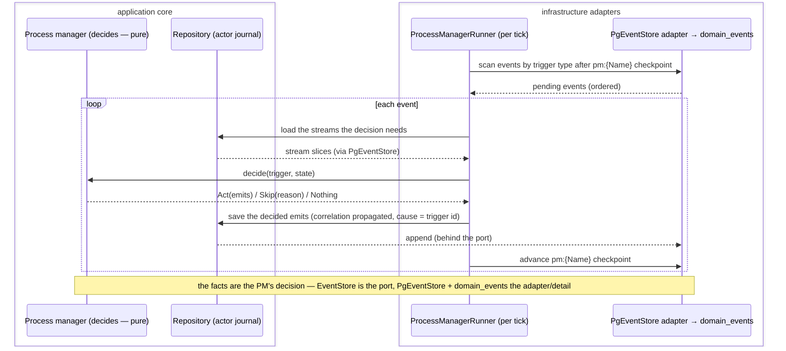
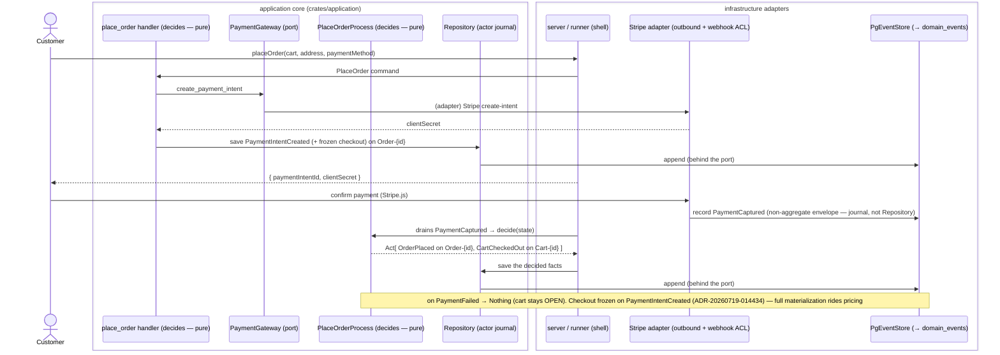
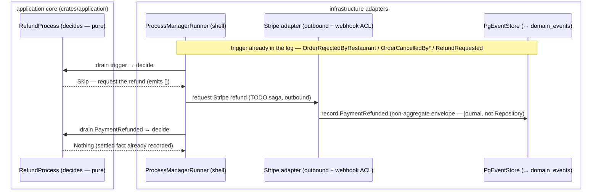
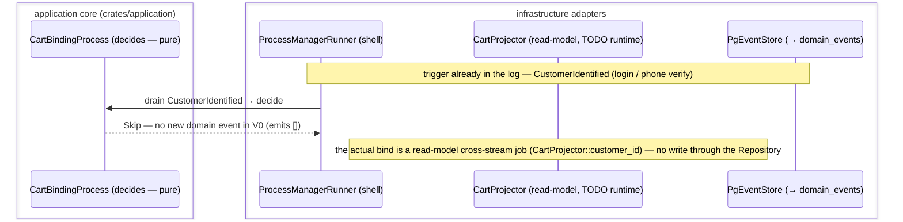
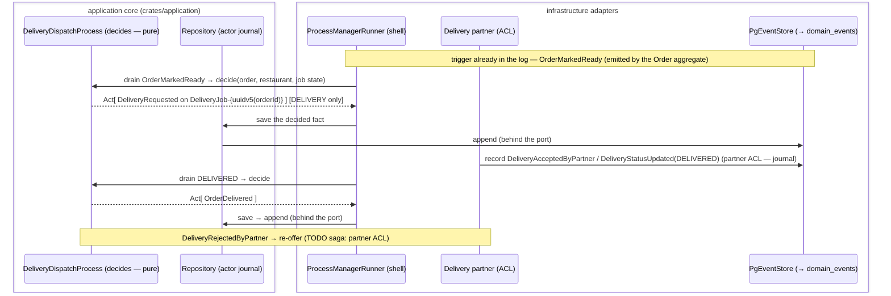

# 🔗 Sagas / Process Managers

> Hand-maintained. Source of truth = `crates/application/src/process_managers/*` (pure decisions) +
> `crates/infrastructure/src/process_manager/*` (runtime). Realizes ADR-0046 (write side) & ADR-0031
> (delivery); actors.yaml declares each process manager's inbox (`receives` → `emits`/`throws`).

## What a process manager is

A **process manager** (saga) is an actor that **reacts to events** (not commands) and **emits events**
(and/or invokes command handlers) to coordinate work across aggregates and external systems. It is the
counterpart of a projection: a projector folds events into a *read model*; a process manager folds events
into *new facts / side-effects*. Business logic stays out of the telemetry SDK (ADR-0012).

Its pure decision **owns emission**; the runtime persists the decided facts **through the write-side
`Repository`** (the actor's journal, ADR-20260719-031136) — the runner is the imperative shell and never
touches the raw `EventStore` port. Rehydration is always the actor's **own** write-side stream (never a
read model), so the version for the optimistic-concurrency append is authoritative.

## Runtime — `ProcessManagerRunner` (`crates/infrastructure/src/process_manager/`)

Mirrors the projection worker:
- A **registry** of PM groups; each has its **own `projection_checkpoint` row** (`pm:<Name>` key — reuses
  the existing table, no migration).
- Each tick drains `domain_events` past the checkpoint **by event type** (`event_type = ANY(triggers)` —
  triggers cross stream categories, e.g. `PaymentCaptured` lands on `StripeEvent-%` streams).
- Per event: load the streams the decision needs (via `PgEventStore`), take the **pure decision**, append
  its emitted events under a **saga system actor** (deterministic UUIDv5 user id, `EXTERNAL` user_type;
  **correlation_id propagated from the trigger, cause_id = trigger event id** — ADR-0041), advance the
  checkpoint.
- **Idempotent by construction**: a re-reacted trigger produces the same deterministic ids / hits the
  `UNIQUE(stream, version)` guard → no duplicate facts. **Poison events** are log-skipped (one bad event
  can't wedge the group). A **version conflict** aborts the group without advancing (re-runs next tick over
  fresh state).
- Runs **in-process** on the server, gated by `RUN_PROCESS_MANAGERS` (default on); status at **`/saga`**
  (mirrors `/projector`). Graduates to a dedicated worker with no logic change.
- Decisions are **pure sync functions** returning `Act(StreamAppend)` / `Skip(reason)` / `Nothing` over
  pre-loaded stream slices — all I/O lives in the runner (same split as the projectors' `Compute`).

## The four process managers

### 1. PlaceOrderProcess (checkout) — `place_order.rs`
- **Entry (command):** the `placeOrder` mutation → `place_order` handler creates a Stripe PaymentIntent via
  the `PaymentGateway` port and emits **`PaymentIntentCreated`** on `Order-<id>`.
- **Reactions:** `PaymentCaptured` → emit **`OrderPlaced`** (`Order-<id>`) + **`CartCheckedOut`** (`Cart-<id>`);
  `PaymentFailed` → `Nothing` (cart stays OPEN).
- **Status:** wired + idempotent. ⚠️ **Fail-closed in production** — see the checkout-snapshot gap below.
- Real Stripe **create-intent** (outbound) is the Stripe adapter's job (`crates/adapters/stripe`); a
  **fail-closed `PaymentGateway` stand-in** declines meanwhile so nothing is silently charged.

### 2. RefundProcess — `refund.rs`
- **Reactions:** `OrderRejectedByRestaurant` / `OrderCancelledByCustomer` / `OrderCancelledByRestaurant` /
  `RefundRequested` → request a refund; `PaymentRefunded` → `Nothing` (the fact is already recorded by the
  Stripe webhook ACL).
- **Status:** done per actors.yaml (all legs `emits: []`). The **outbound Stripe refund call** is a
  `TODO(saga)` awaiting the Stripe adapter (an inbound `PaymentRefunded` still closes the loop).

### 3. CartBindingProcess — `cart_binding.rs`
- **Reaction:** `CustomerIdentified` → bind the guest cart to the now-known customer.
- **Status:** done per spec (`emits: []` — "no new event in V0"). The actual bind awaits the Cart
  projection's cross-stream routing (`CartProjector::customer_id` `TODO(runtime)`).

### 4. DeliveryDispatchProcess — `delivery_dispatch.rs` (ADR-0031)
- **Reactions:** `OrderMarkedReady` → **`DeliveryRequested`** for DELIVERY orders (pickup = restaurant
  address, dropoff = order address, **deterministic UUIDv5 job id from the order id** = idempotency key;
  no-op for COLLECTION); partner `DeliveryAcceptedByPartner` → records courier; `DeliveryRejectedByPartner`
  → `TODO(saga)` re-offer (needs the delivery-partner ACL); `DeliveryStatusUpdated(DELIVERED)` /
  `DeliveryCompleted` → **`OrderDelivered`** (idempotent; a terminal cancelled/rejected order is never
  resurrected).
- **Status:** dispatch + close-order legs functional from the log; re-offer awaits the partner ACL.

## ✅ Resolved — checkout snapshot on `PaymentIntentCreated` (ADR-20260719-014434)

`events.yaml#/PaymentIntentCreated` now carries a required `checkout` (`entities.yaml#/CheckoutSnapshot` —
cartId, contact, serviceType, delivery address, priced items, breakdown), frozen by `commands::place_order`
when it creates the PaymentIntent (`rules.yaml#/CheckoutSnapshotFrozenAtIntent`). So **`OrderPlaced` +
`CartCheckedOut` are reconstructable from the `Order-{id}` stream alone** — no out-of-log store (Option 1,
over the rejected durable pending-checkout store). `PaymentIntentCreated` is non-projected → zero read-model
impact.

**Still riding on pricing (not done yet):** `place_order` freezes `items`/`breakdown` best-available until
server-side line pricing lands (the Cart projector does not price lines yet; the ADR-0016/0017 fee/split is
unwired). Until then the saga still resolves the snapshot through the fail-closed `CheckoutSnapshotSource`
seam and **`Skip`s** — nothing consumes the approximate breakdown. Retiring that seam (read
`PaymentIntentCreated.checkout` directly from the log) is a trivial follow-up once pricing makes the frozen
data correct.

## Open `TODO(saga)` summary
| Saga | Open item | Blocked on |
|---|---|---|
| PlaceOrder | materialize `OrderPlaced` in prod (retire `CheckoutSnapshotSource`) | server-side pricing (priced items + breakdown) |
| Refund | outbound Stripe refund request | Stripe adapter (outbound) |
| CartBinding | actually bind the cart | `CartProjector` cross-stream routing |
| DeliveryDispatch | re-offer on partner rejection | delivery-partner ACL |

## References
ADR-0046 (write side / command handlers), ADR-0031 (delivery bounded context), ADR-0041 (event envelope),
`specs/actors.yaml` (process-manager inboxes), `specs/tests.yaml` (behaviour cases), the `/saga` health
endpoint.
