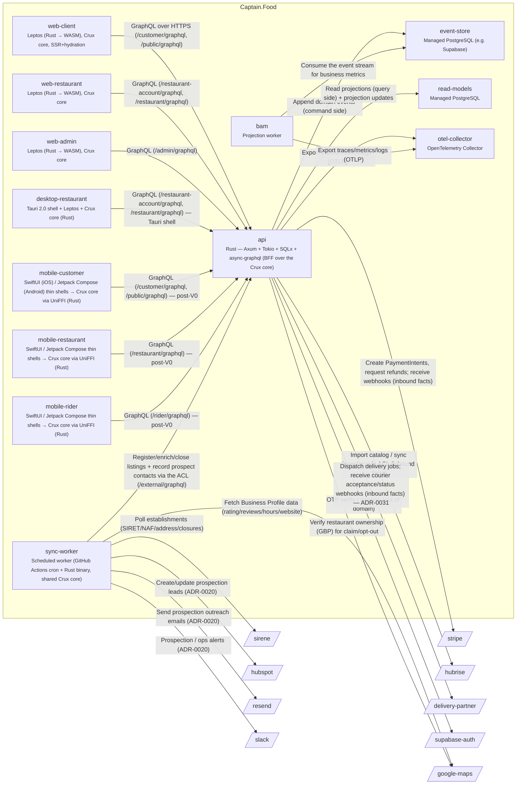
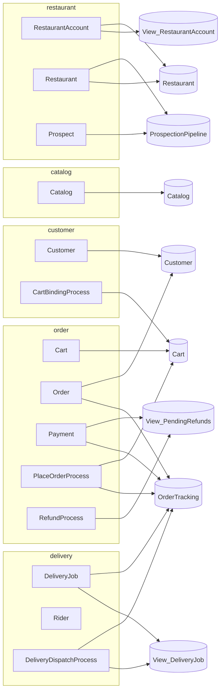
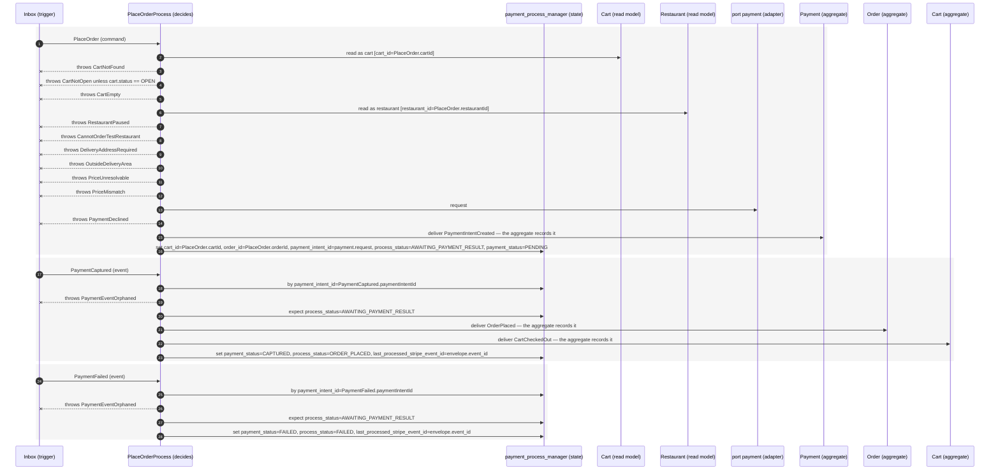
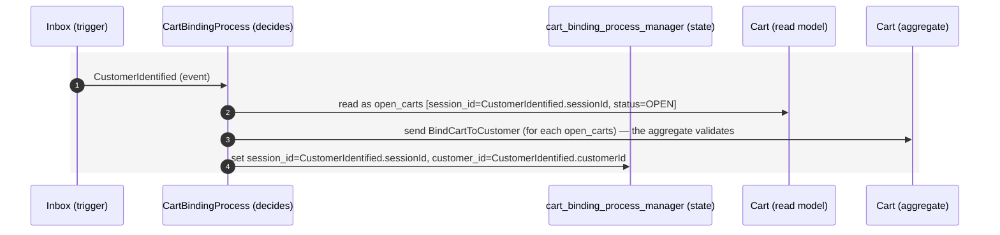
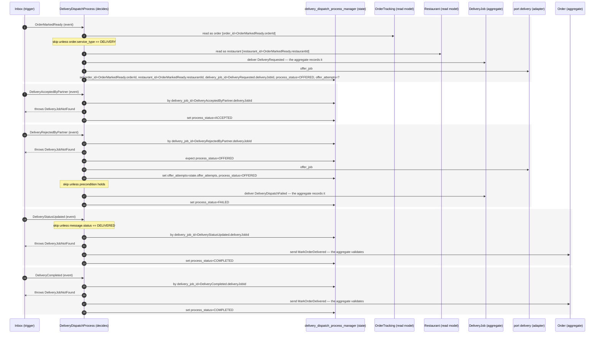

<!-- GENERATED by tools/codegen — do not edit by hand. Source: specs/architecture/c4-*.yaml. -->
# Captain.Food — C4 diagrams (Mermaid, generated)

Rendered by any Mermaid-aware viewer (GitHub, VS Code, mermaid.live). The authoritative source is
`specs/architecture/c4-l2.yaml` / `c4-l3.yaml`; regenerate with `make generate`.

## L2 — Containers & external systems



## Domain — bounded contexts → aggregates → read models

Each aggregate links to the `View_*` read models its emitted events project into.



## Saga sequences — message → emitted events, in order

Each process manager (saga) as a time-ordered sequence: the command/event it receives and the
events it emits in response (derived from `actors.yaml`).

### PlaceOrderProcess



### RefundProcess

```mermaid
sequenceDiagram
  autonumber
  participant IN as Inbox (trigger)
  participant PM as RefundProcess (decides)
  participant ST as refund_process_manager (state)
  participant RM_OrderTracking as OrderTracking (read model)
  participant AG_Payment as Payment (aggregate)
  participant PT_payment as port payment (adapter)
  rect rgb(245,245,245)
  IN->>PM: OrderRejectedByRestaurant (event)
  PM->>RM_OrderTracking: read as order [order_id=OrderRejectedByRestaurant.orderId]
  Note over PM: skip unless order.payment_status == CAPTURED
  PM->>AG_Payment: deliver RefundOpened — the aggregate records it
  PM->>ST: set order_id=OrderRejectedByRestaurant.orderId, payment_intent_id=order.payment_intent_id, process_status=PENDING_APPROVAL, reason=OrderRejectedByRestaurant.reason
  end
  rect rgb(245,245,245)
  IN->>PM: OrderCancelledByCustomer (event)
  PM->>RM_OrderTracking: read as order [order_id=OrderCancelledByCustomer.orderId]
  Note over PM: skip unless order.payment_status == CAPTURED
  PM->>AG_Payment: deliver RefundOpened — the aggregate records it
  PM->>ST: set order_id=OrderCancelledByCustomer.orderId, payment_intent_id=order.payment_intent_id, process_status=PENDING_APPROVAL, reason=OrderCancelledByCustomer.reason
  end
  rect rgb(245,245,245)
  IN->>PM: OrderCancelledByRestaurant (event)
  PM->>RM_OrderTracking: read as order [order_id=OrderCancelledByRestaurant.orderId]
  Note over PM: skip unless order.payment_status == CAPTURED
  PM->>AG_Payment: deliver RefundOpened — the aggregate records it
  PM->>ST: set order_id=OrderCancelledByRestaurant.orderId, payment_intent_id=order.payment_intent_id, process_status=PENDING_APPROVAL, reason=OrderCancelledByRestaurant.reason
  end
  rect rgb(245,245,245)
  IN->>PM: RefundRequested (event)
  PM->>RM_OrderTracking: read as order [order_id=RefundRequested.orderId]
  Note over PM: skip unless order.payment_status == CAPTURED
  PM->>AG_Payment: deliver RefundOpened — the aggregate records it
  PM->>ST: set order_id=RefundRequested.orderId, payment_intent_id=order.payment_intent_id, process_status=PENDING_APPROVAL, reason=RefundRequested.reason
  end
  rect rgb(245,245,245)
  IN->>PM: ApproveRefund (command)
  PM->>ST: by order_id=ApproveRefund.orderId
  PM--xIN: throws RefundNotPending unless state.process_status == PENDING_APPROVAL
  PM->>PT_payment: refund
  PM->>AG_Payment: deliver RefundApproved — the aggregate records it
  PM->>ST: set process_status=APPROVED_AWAITING_SETTLEMENT, approved_amount_cents=ApproveRefund.amount, reason=ApproveRefund.reason
  end
  rect rgb(245,245,245)
  IN->>PM: DenyRefund (command)
  PM->>ST: by order_id=DenyRefund.orderId
  PM--xIN: throws RefundNotPending unless state.process_status == PENDING_APPROVAL
  PM->>AG_Payment: deliver RefundDenied — the aggregate records it
  PM->>ST: set process_status=DENIED, reason=DenyRefund.reason
  end
  rect rgb(245,245,245)
  IN->>PM: PaymentRefunded (event)
  PM->>ST: by order_id=PaymentRefunded.orderId; expect process_status=APPROVED_AWAITING_SETTLEMENT
  PM->>ST: set refund_id=PaymentRefunded.refundId, process_status=REFUNDED
  end
```

### CartBindingProcess



### DeliveryDispatchProcess


