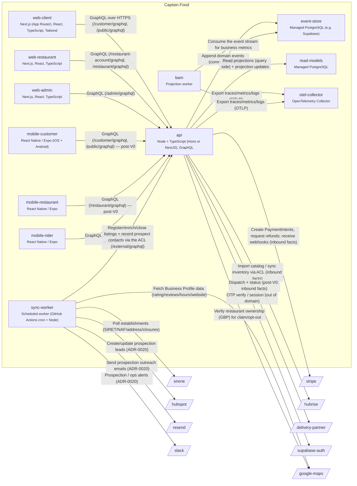
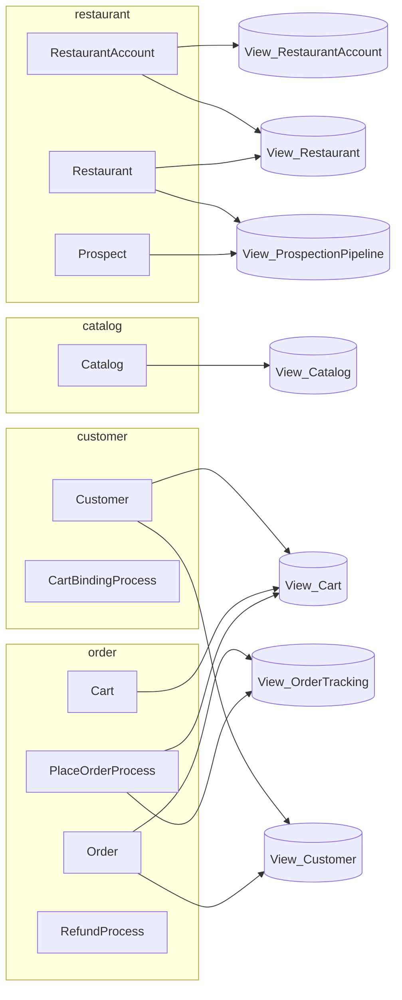
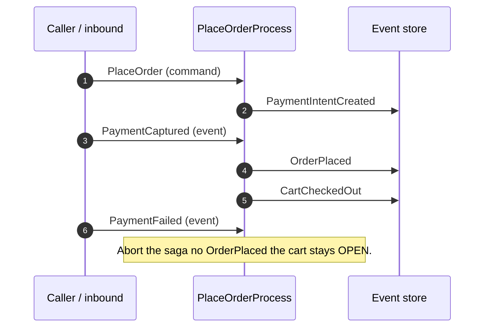
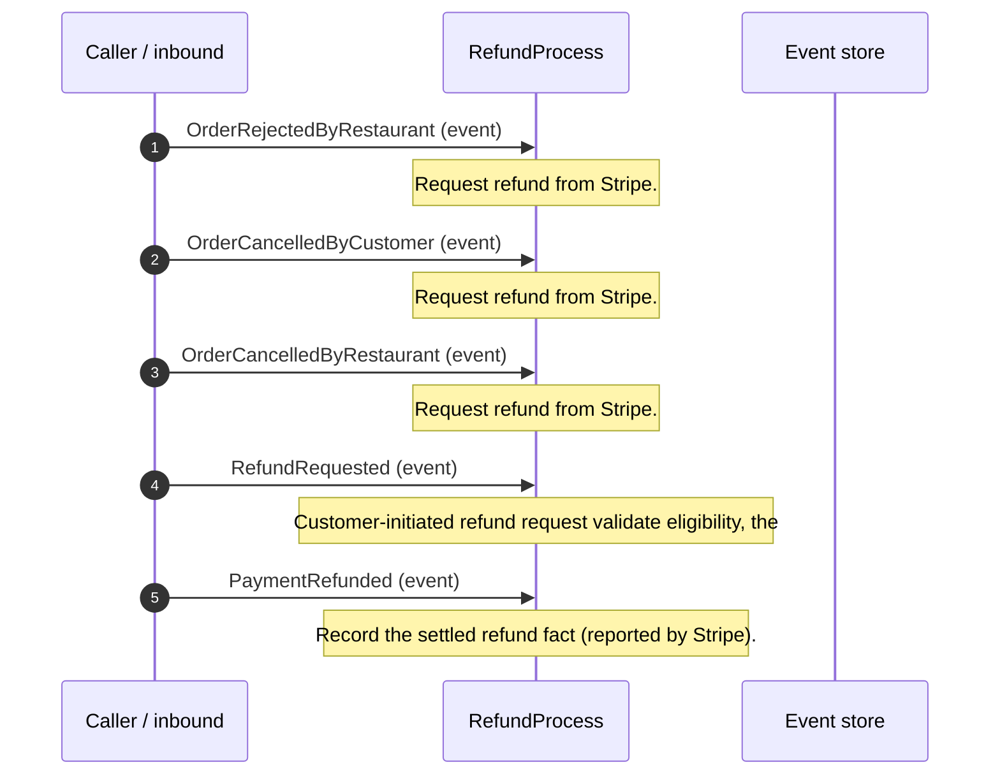
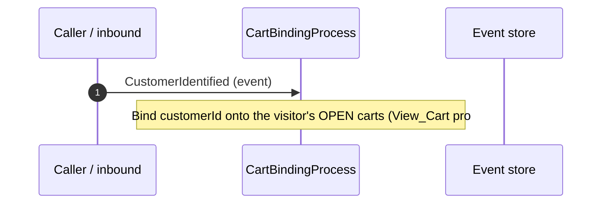

<!-- GENERATED by tools/codegen — do not edit by hand. Source: specs/architecture/c4-*.yaml. -->
# Captain.Food — C4 diagrams (Mermaid, generated)

Rendered by any Mermaid-aware viewer (GitHub, VS Code, mermaid.live). The authoritative source is
`specs/architecture/c4-l2.yaml` / `c4-l3.yaml`; regenerate with `npm run generate`.

## L2 — Containers & external systems

## Domain — bounded contexts → aggregates → read models

Each aggregate links to the `View_*` read models its emitted events project into.

## Saga sequences — message → emitted events, in order

Each process manager (saga) as a time-ordered sequence: the command/event it receives and the
events it emits in response (derived from `actors.yaml`).

### PlaceOrderProcess

### RefundProcess

### CartBindingProcess

