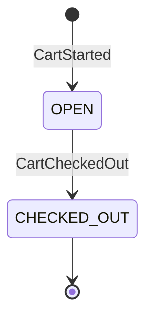
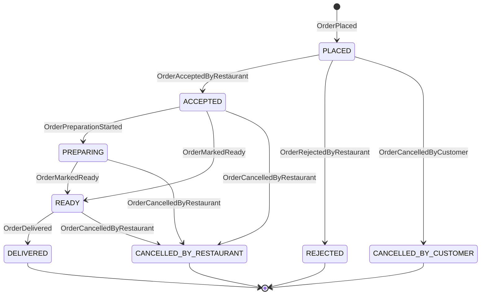
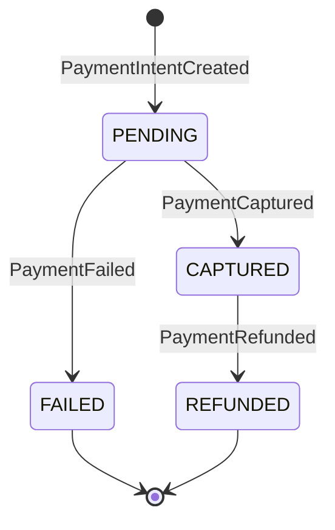
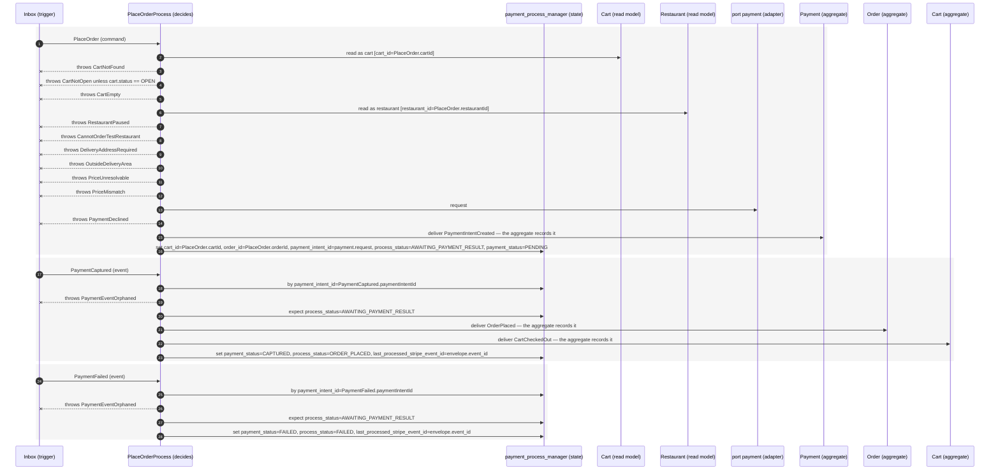
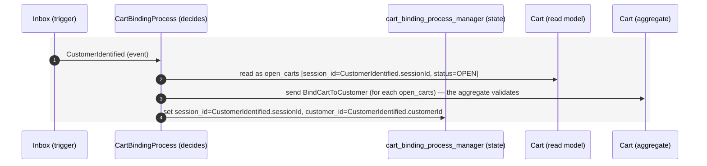
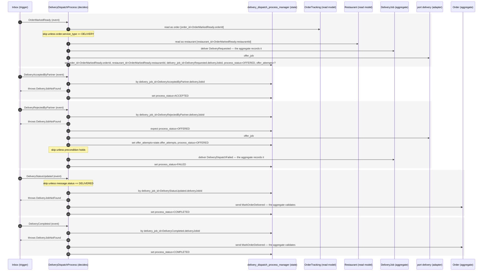

<!-- GENERATED by tools/codegen — do not edit by hand. Source: specs/*.yaml. -->
# 📖 Captain.Food — Product Documentation (generated)

A single, navigable view of the whole product, built from the specs and organized **top-level by
bounded context** (🔲). Within each context: its API operations, output types, actors, views, commands,
events, entities, scalars, errors, business rules (📐 — what we guarantee), tests (🧪 — how it's verified,
cross-linked to the rules) and observability contracts. Every item — and every
**property** 🔹 — is anchored and **cross-linked**; `cross-cutting` holds the shared vocabulary and ops
that belong to no single context. Stories and Architecture span all contexts.

**Kinds**: 🔎 query · ✏️ mutation · 🔔 subscription · 🧩 type · 🎭 actor · 🗄️ view · 📩 command · ⚡ event · 📦 entity · 🔤 scalar · ⛔ error · 🔹 property
**Roles**: 🌐 PUBLIC · 🙋 CUSTOMER · 🏪 RESTAURANT_ACCOUNT · 🍽️ RESTAURANT · 🛵 RIDER · 🛠️ ADMIN · 🔌 EXTERNAL
**Markers**: ✅ required · ⬜ optional · 🛶 V0 · 🔭 V1 · 🔒 internal · ⚠️ design hole

**Contents** — [🎬 Stories](#sec-stories) · [🔲 restaurant](#sec-ctx-restaurant) · [🔲 catalog](#sec-ctx-catalog) · [🔲 order](#sec-ctx-order) · [🔲 customer](#sec-ctx-customer) · [🔲 delivery](#sec-ctx-delivery) · [🔲 cross-cutting](#sec-ctx-cross-cutting) · [📱 Customer screens](#sec-screens) · [🌐 Translations](#sec-translations) · [🏛️ Architecture](#sec-architecture)

<a id="sec-stories"></a>
## 🎬 Stories

How each persona uses the API. `personaRole` is the persona's GraphQL path-role (UserType).

<a id="story-public_user"></a>
### 🎬 `public_user` · 🌐 `PUBLIC` · 🗣️ `fr-FR`

A visitor browsing Captain.Food without being logged in.

| Activity | Step | Operation |
| --- | --- | --- |
| 🧭 **BrowseForFood** | SearchRestaurants | [🔎 `restaurants`](#query-restaurants) |
|  | SelectRestaurant | [🔎 `restaurant`](#query-restaurant) |
|  | BrowseCatalog | [🔎 `catalog`](#query-catalog) |
|  | AddToCartLine | [✏️ `addCartLine`](#mutation-addcartline) |
|  | RemoveFromCart | [✏️ `removeCartLine`](#mutation-removecartline) |
|  | ChangeCartLineQuantity | [✏️ `changeCartLineQuantity`](#mutation-changecartlinequantity) |
|  | EnterPhone | [🔎 `phoneCountries`](#query-phonecountries) |
|  | RequestPhoneOtp | [✏️ `requestPhoneVerification`](#mutation-requestphoneverification) |
|  | VerifyPhone | [✏️ `verifyPhone`](#mutation-verifyphone) |

<a id="story-customer"></a>
### 🎬 `customer` · 🙋 `CUSTOMER` · 🗣️ `fr-FR`

An authenticated person who orders food via Captain.Food.

| Activity | Step | Operation |
| --- | --- | --- |
| 🧭 **OrderFood** | SearchRestaurants | [🔎 `restaurants`](#query-restaurants) |
|  | SelectRestaurant | [🔎 `restaurant`](#query-restaurant) |
|  | BrowseCatalog | [🔎 `catalog`](#query-catalog) |
|  | AddToCartLine | [✏️ `addCartLine`](#mutation-addcartline) |
|  | RemoveFromCart | [✏️ `removeCartLine`](#mutation-removecartline) |
|  | ChangeCartLineQuantity | [✏️ `changeCartLineQuantity`](#mutation-changecartlinequantity) |
|  | SeeCheckoutBreakdown | [🔎 `cart`](#query-cart) |
|  | CompareWithUberEats | [🔎 `cart`](#query-cart) |
|  | ViewMyCarts | [🔎 `carts`](#query-carts) |
|  | BrowseCategories | [🔎 `categories`](#query-categories) |
|  | PlaceOrder | [✏️ `placeOrder`](#mutation-placeorder) |
|  | PollOperationStatus | [🔎 `operationStatus`](#query-operationstatus) |
|  | TrackPaymentStatus | [🔎 `paymentStatus`](#query-paymentstatus) |
|  | TrackOrderStatus | [🔎 `order`](#query-order) |
|  | TrackDelivery | [🔎 `delivery`](#query-delivery) |
|  | CancelOrder | [✏️ `cancelOrderByCustomer`](#mutation-cancelorderbycustomer) |
|  | RateOrder | [✏️ `rateOrder`](#mutation-rateorder) |
|  | RateRestaurant | [✏️ `rateRestaurant`](#mutation-raterestaurant) |
|  | TipRiderRestaurantOrCaptain | [✏️ `tipOrder`](#mutation-tiporder) |
|  | RequestRefund | [✏️ `requestRefund`](#mutation-requestrefund) |
| 🧭 **FavoriteRestaurant** | MarkAsFavorite | [✏️ `markRestaurantAsFavorite`](#mutation-markrestaurantasfavorite) |
|  | UnmarkAsFavorite | [✏️ `unmarkRestaurantAsFavorite`](#mutation-unmarkrestaurantasfavorite) |
|  | ViewFavorites | [🔎 `favoriteRestaurants`](#query-favoriterestaurants) |
| 🧭 **ConfigureProfile** | ViewProfile | [🔎 `me`](#query-me) |
|  | UpdatePersonalInfo | [✏️ `updateCustomerInfo`](#mutation-updatecustomerinfo) |
|  | ChangeLanguage | [✏️ `changeLanguage`](#mutation-changelanguage) |
|  | VerifyEmail | [✏️ `requestEmailVerification`](#mutation-requestemailverification) |
|  | ConfirmEmail | [✏️ `confirmEmailVerification`](#mutation-confirmemailverification) |
|  | ChangePhone | [✏️ `requestPhoneChange`](#mutation-requestphonechange) |
|  | ConfirmPhoneChange | [✏️ `confirmPhoneChange`](#mutation-confirmphonechange) |
|  | SetPreferences | [✏️ `setCustomerPreferences`](#mutation-setcustomerpreferences) |
|  | SetAddress | [✏️ `setCustomerAddress`](#mutation-setcustomeraddress) |
|  | RemoveAddress | [✏️ `removeCustomerAddress`](#mutation-removecustomeraddress) |
|  | SetPaymentMethod | [✏️ `setCustomerPaymentMethod`](#mutation-setcustomerpaymentmethod) |

<a id="story-restaurant_owner"></a>
### 🎬 `restaurant_owner` · 🏪 `RESTAURANT_ACCOUNT` · 🗣️ `fr-FR`

Owns a restaurant ACCOUNT (HubRise restaurant). Manages the account, its locations, and the catalog. May also act as a manager, but that is a separate role.


| Activity | Step | Operation |
| --- | --- | --- |
| 🧭 **ManageAccount** | RegisterAccount | [✏️ `registerRestaurantAccount`](#mutation-registerrestaurantaccount) |
|  | UpdateAccount | [✏️ `updateRestaurantAccount`](#mutation-updaterestaurantaccount) |
|  | DeleteAccount | [✏️ `deleteRestaurantAccount`](#mutation-deleterestaurantaccount) |
| 🧭 **ManageLocations** | AddLocation | [✏️ `registerRestaurant`](#mutation-registerrestaurant) |
|  | ActivateLocation | [✏️ `activateRestaurant`](#mutation-activaterestaurant) |
|  | DeactivateLocation | [✏️ `deactivateRestaurant`](#mutation-deactivaterestaurant) |
|  | UpdateLocationProfile | [✏️ `updateRestaurant`](#mutation-updaterestaurant) |
|  | RemoveLocation | [✏️ `removeRestaurant`](#mutation-removerestaurant) |
|  | ViewAllLocations | [🔎 `restaurantLocationsByAccount`](#query-restaurantlocationsbyaccount) |
| 🧭 **ClaimListing** | FindMyListing | [🔎 `restaurant`](#query-restaurant) |
|  | ClaimIt | [✏️ `claimRestaurantListing`](#mutation-claimrestaurantlisting) |
|  | OptOut | [✏️ `optOutRestaurantListing`](#mutation-optoutrestaurantlisting) |
|  | ConfigureGoogleOrderButton | [✏️ `configureGbpOrderLink`](#mutation-configuregbporderlink) |
|  | VerifyGoogleOrderButton | [✏️ `verifyGbpOrderLink`](#mutation-verifygbporderlink) |
| 🧭 **ManageCatalog** | ViewCatalog | [🔎 `catalog`](#query-catalog) |
|  | CreateCatalog | [✏️ `createCatalog`](#mutation-createcatalog) |
|  | AddProduct | [✏️ `addProduct`](#mutation-addproduct) |
|  | UpdateProduct | [✏️ `updateProduct`](#mutation-updateproduct) |
|  | RemoveProduct | [✏️ `removeProduct`](#mutation-removeproduct) |
|  | AddCategory | [✏️ `addCatalogCategory`](#mutation-addcatalogcategory) |
|  | UpdateCategory | [✏️ `updateCatalogCategory`](#mutation-updatecatalogcategory) |
|  | RemoveCategory | [✏️ `removeCatalogCategory`](#mutation-removecatalogcategory) |
|  | AddOptionList | [✏️ `addOptionList`](#mutation-addoptionlist) |
|  | UpdateOptionList | [✏️ `updateOptionList`](#mutation-updateoptionlist) |
|  | RemoveOptionList | [✏️ `removeOptionList`](#mutation-removeoptionlist) |
|  | UpdateStock | [✏️ `updateOfferStock`](#mutation-updateofferstock) |
|  | ImportCatalog | [✏️ `importCatalog`](#mutation-importcatalog) |

<a id="story-restaurant_manager"></a>
### 🎬 `restaurant_manager` · 🍽️ `RESTAURANT` · 🗣️ `fr-FR`

Runs a SINGLE location (HubRise location): handles the live order queue. Assigned by the owner; can only manage the location they are assigned to.


| Activity | Step | Operation |
| --- | --- | --- |
| 🧭 **ManageOrders** | ViewIncomingOrders | [🔎 `orders`](#query-orders) |
|  | AcceptOrder | [✏️ `acceptOrder`](#mutation-acceptorder) |
|  | RejectOrder | [✏️ `rejectOrder`](#mutation-rejectorder) |
|  | StartPreparation | [✏️ `startPreparation`](#mutation-startpreparation) |
|  | MarkOrderReady | [✏️ `markOrderReady`](#mutation-markorderready) |
|  | MarkCollected | [✏️ `markOrderDelivered`](#mutation-markorderdelivered) |
|  | SetAcceptanceMode | [✏️ `changeOrderAcceptanceMode`](#mutation-changeorderacceptancemode) |
|  | CancelOrder | [✏️ `cancelOrderByRestaurant`](#mutation-cancelorderbyrestaurant) |
|  | ThankRiderOrCaptain | [✏️ `tipOrder`](#mutation-tiporder) |
|  | ReviewPendingRefunds | [🔎 `pendingRefunds`](#query-pendingrefunds) |
|  | ApproveRefund | [✏️ `approveRefund`](#mutation-approverefund) |
|  | DenyRefund | [✏️ `denyRefund`](#mutation-denyrefund) |
| 🧭 **TrackDeliveries** | ViewDeliveries | [🔎 `restaurantDeliveries`](#query-restaurantdeliveries) |
|  | CancelDelivery | [✏️ `cancelDelivery`](#mutation-canceldelivery) |

<a id="story-rider"></a>
### 🎬 `rider` · 🛵 `RIDER` · 🗣️ `fr-FR`

A courier who delivers orders from restaurants to customers.

| Activity | Step | Operation |
| --- | --- | --- |
| 🧭 **Deliver** | ViewMyDeliveries | [🔎 `myDeliveries`](#query-mydeliveries) |
|  | AcceptDelivery | [✏️ `acceptDelivery`](#mutation-acceptdelivery) |
|  | ConfirmPickup | [✏️ `confirmPickup`](#mutation-confirmpickup) |
|  | CompleteDelivery | [✏️ `completeDelivery`](#mutation-completedelivery) |
|  | TrackDelivery | [🔎 `delivery`](#query-delivery) |

<a id="story-admin"></a>
### 🎬 `admin` · 🛠️ `ADMIN` · 🗣️ `fr-FR`

A platform operator who onboards accounts and oversees the platform.

| Activity | Step | Operation |
| --- | --- | --- |
| 🧭 **OnboardRestaurants** | RegisterAccount | [✏️ `registerRestaurantAccount`](#mutation-registerrestaurantaccount) |
|  | AddLocation | [✏️ `registerRestaurant`](#mutation-registerrestaurant) |
|  | ActivateRestaurant | [✏️ `activateRestaurant`](#mutation-activaterestaurant) |
|  | ImportCatalog | [✏️ `importCatalog`](#mutation-importcatalog) |
| 🧭 **ManageListings** | BrowseListings | [🔎 `restaurants`](#query-restaurants) |
|  | ChangeListingStatus | [✏️ `changeRestaurantListingStatus`](#mutation-changerestaurantlistingstatus) |
|  | MarkClosed | [✏️ `markRestaurantClosed`](#mutation-markrestaurantclosed) |
| 🧭 **Prospection** | ReviewPipeline | [🔎 `prospectionPipeline`](#query-prospectionpipeline) |
|  | LogReply | [✏️ `recordProspectReply`](#mutation-recordprospectreply) |
| 🧭 **ArbitrateRefunds** | ReviewPendingRefunds | [🔎 `pendingRefunds`](#query-pendingrefunds) |
|  | ApproveRefund | [✏️ `approveRefund`](#mutation-approverefund) |
|  | DenyRefund | [✏️ `denyRefund`](#mutation-denyrefund) |
| 🧭 **Pricing** | ReviewPolicy | [🔎 `pricingPolicy`](#query-pricingpolicy) |
|  | SetRestaurantMargin | [✏️ `updateRestaurant`](#mutation-updaterestaurant) |
|  | ReviewUberEstimationPolicy | [🔎 `uberEstimationPolicy`](#query-uberestimationpolicy) |
|  | ReviewUberSplitPolicy | [🔎 `uberSplitPolicy`](#query-ubersplitpolicy) |

<a id="story-restaurant_sync"></a>
### 🎬 `restaurant_sync` · 🔌 `EXTERNAL` · 🗣️ `fr-FR`

The Sirene/Google sync ACL (a scheduled worker) acting as an EXTERNAL caller. It seeds and refreshes public listings on the restaurants' behalf — no human; it issues the same commands an owner would.


| Activity | Step | Operation |
| --- | --- | --- |
| 🧭 **SyncListings** | SeedListing | [✏️ `registerRestaurant`](#mutation-registerrestaurant) |
|  | EnrichGoogleProfile | [✏️ `updateRestaurantGoogleBusinessProfile`](#mutation-updaterestaurantgooglebusinessprofile) |
|  | MarkClosed | [✏️ `markRestaurantClosed`](#mutation-markrestaurantclosed) |
| 🧭 **Prospection** | ContactProspect | [✏️ `recordProspectContact`](#mutation-recordprospectcontact) |
|  | MarkCold | [✏️ `markProspectCold`](#mutation-markprospectcold) |

<a id="sec-ctx-restaurant"></a>
## 🔲 1. restaurant

_Restaurant provider domain: accounts, locations, lifecycle, order-acceptance mode (incl. catalog & order-fulfilment operations performed by restaurant staff)._

### 🧰 API operations _(23)_

<a id="query-restaurantdeliveries"></a>
#### 🔎 Query: `restaurantDeliveries`

A restaurant's active delivery jobs (delivery board; ownership enforced server-side).

- **Input**: 🧩 `RestaurantDeliveriesQueryInput!` — `restaurantId`: [🔤 `RestaurantId`](#scalar-restaurantid), `status?`: [🔤 `DeliveryStatus`](#scalar-deliverystatus)
- **Returns**: [🧩 `DeliveryJob`](#type-deliveryjob) (list) · **reads** [🗄️ `View_DeliveryJob`](#view-view_deliveryjob)
- **Roles**: RESTAURANT, RESTAURANT_ACCOUNT · **slice** V0

<a id="query-pendingrefunds"></a>
#### 🔎 Query: `pendingRefunds`

The refund queue (RefundProcess): refunds opened for decision, with their lifecycle status (status = REQUESTED is the pending, awaiting-decision queue). The restaurant sees its own orders' refunds (restaurant-scoped, ownership enforced server-side); an admin arbitrates across restaurants.


- **Input**: 🧩 `PendingRefundsQueryInput` — `restaurantId?`: [🔤 `RestaurantId`](#scalar-restaurantid), `status?`: [🔤 `RefundStatus`](#scalar-refundstatus)
- **Returns**: [🧩 `Refund`](#type-refund) (list) · **reads** [🗄️ `View_PendingRefunds`](#view-view_pendingrefunds)
- **Roles**: RESTAURANT, ADMIN · **slice** V0

<a id="query-restaurantlocationsbyaccount"></a>
#### 🔎 Query: `restaurantLocationsByAccount`

All restaurant locations under an account (back-office; ownership enforced server-side).

- **Input**: 🧩 `RestaurantLocationsByAccountQueryInput!` — `accountId`: [🔤 `RestaurantAccountId`](#scalar-restaurantaccountid)
- **Returns**: [🧩 `Restaurant`](#type-restaurant) (list) · **reads** [🗄️ `Restaurant`](#view-restaurant)
- **Roles**: ADMIN, RESTAURANT_ACCOUNT · **slice** V1

<a id="query-prospectionpipeline"></a>
#### 🔎 Query: `prospectionPipeline`

B2B prospection pipeline (admin): scored prospects, optionally filtered by minimum score / pipeline status.

- **Input**: 🧩 `ProspectionPipelineQueryInput` — `minScore?`: [🔤 `ProspectionScore`](#scalar-prospectionscore), `status?`: [🔤 `ProspectPipelineStatus`](#scalar-prospectpipelinestatus)
- **Returns**: [🧩 `Prospect`](#type-prospect) (list) · **reads** [🗄️ `ProspectionPipeline`](#view-prospectionpipeline)
- **Roles**: ADMIN · **slice** V1

<a id="mutation-registerrestaurantaccount"></a>
#### ✏️ Mutation: `registerRestaurantAccount`

- **Command**: [📩 `RegisterRestaurantAccount`](#command-registerrestaurantaccount) → handled by [🎭 `RestaurantAccount`](#actor-restaurantaccount)
- **Roles**: ADMIN, RESTAURANT_ACCOUNT · **slice** V0
- **Returns**: [🧩 `MutationAcceptance`](#type-mutationacceptance) (acceptance-first — outcome via [🔎 `operationStatus`](#query-operationstatus))

<a id="mutation-updaterestaurantaccount"></a>
#### ✏️ Mutation: `updateRestaurantAccount`

- **Command**: [📩 `UpdateRestaurantAccount`](#command-updaterestaurantaccount) → handled by [🎭 `RestaurantAccount`](#actor-restaurantaccount)
- **Roles**: ADMIN, RESTAURANT_ACCOUNT · **slice** V1
- **Returns**: [🧩 `MutationAcceptance`](#type-mutationacceptance) (acceptance-first — outcome via [🔎 `operationStatus`](#query-operationstatus))

<a id="mutation-deleterestaurantaccount"></a>
#### ✏️ Mutation: `deleteRestaurantAccount`

- **Command**: [📩 `DeleteRestaurantAccount`](#command-deleterestaurantaccount) → handled by [🎭 `RestaurantAccount`](#actor-restaurantaccount)
- **Roles**: ADMIN, RESTAURANT_ACCOUNT · **slice** V1
- **Returns**: [🧩 `MutationAcceptance`](#type-mutationacceptance) (acceptance-first — outcome via [🔎 `operationStatus`](#query-operationstatus))

<a id="mutation-registerrestaurant"></a>
#### ✏️ Mutation: `registerRestaurant`

- **Command**: [📩 `RegisterRestaurant`](#command-registerrestaurant) → handled by [🎭 `Restaurant`](#actor-restaurant)
- **Roles**: ADMIN, RESTAURANT_ACCOUNT, EXTERNAL · **slice** V0
- **Returns**: [🧩 `MutationAcceptance`](#type-mutationacceptance) (acceptance-first — outcome via [🔎 `operationStatus`](#query-operationstatus))

<a id="mutation-activaterestaurant"></a>
#### ✏️ Mutation: `activateRestaurant`

- **Command**: [📩 `ActivateRestaurant`](#command-activaterestaurant) → handled by [🎭 `Restaurant`](#actor-restaurant)
- **Roles**: ADMIN, RESTAURANT_ACCOUNT · **slice** V0
- **Returns**: [🧩 `MutationAcceptance`](#type-mutationacceptance) (acceptance-first — outcome via [🔎 `operationStatus`](#query-operationstatus))

<a id="mutation-updaterestaurant"></a>
#### ✏️ Mutation: `updateRestaurant`

- **Command**: [📩 `UpdateRestaurant`](#command-updaterestaurant) → handled by [🎭 `Restaurant`](#actor-restaurant)
- **Roles**: ADMIN, RESTAURANT_ACCOUNT · **slice** V1
- **Returns**: [🧩 `MutationAcceptance`](#type-mutationacceptance) (acceptance-first — outcome via [🔎 `operationStatus`](#query-operationstatus))

<a id="mutation-deactivaterestaurant"></a>
#### ✏️ Mutation: `deactivateRestaurant`

- **Command**: [📩 `DeactivateRestaurant`](#command-deactivaterestaurant) → handled by [🎭 `Restaurant`](#actor-restaurant)
- **Roles**: ADMIN, RESTAURANT_ACCOUNT · **slice** V1
- **Returns**: [🧩 `MutationAcceptance`](#type-mutationacceptance) (acceptance-first — outcome via [🔎 `operationStatus`](#query-operationstatus))

<a id="mutation-removerestaurant"></a>
#### ✏️ Mutation: `removeRestaurant`

- **Command**: [📩 `RemoveRestaurant`](#command-removerestaurant) → handled by [🎭 `Restaurant`](#actor-restaurant)
- **Roles**: ADMIN, RESTAURANT_ACCOUNT · **slice** V1
- **Returns**: [🧩 `MutationAcceptance`](#type-mutationacceptance) (acceptance-first — outcome via [🔎 `operationStatus`](#query-operationstatus))

<a id="mutation-changeorderacceptancemode"></a>
#### ✏️ Mutation: `changeOrderAcceptanceMode`

- **Command**: [📩 `ChangeOrderAcceptanceMode`](#command-changeorderacceptancemode) → handled by [🎭 `Restaurant`](#actor-restaurant)
- **Roles**: RESTAURANT, RESTAURANT_ACCOUNT · **slice** V1
- **Returns**: [🧩 `MutationAcceptance`](#type-mutationacceptance) (acceptance-first — outcome via [🔎 `operationStatus`](#query-operationstatus))

<a id="mutation-updaterestaurantgooglebusinessprofile"></a>
#### ✏️ Mutation: `updateRestaurantGoogleBusinessProfile`

- **Command**: [📩 `UpdateRestaurantGoogleBusinessProfile`](#command-updaterestaurantgooglebusinessprofile) → handled by [🎭 `Restaurant`](#actor-restaurant)
- **Roles**: EXTERNAL, ADMIN · **slice** V0
- **Returns**: [🧩 `MutationAcceptance`](#type-mutationacceptance) (acceptance-first — outcome via [🔎 `operationStatus`](#query-operationstatus))

<a id="mutation-markrestaurantclosed"></a>
#### ✏️ Mutation: `markRestaurantClosed`

- **Command**: [📩 `MarkRestaurantClosed`](#command-markrestaurantclosed) → handled by [🎭 `Restaurant`](#actor-restaurant)
- **Roles**: EXTERNAL, ADMIN · **slice** V0
- **Returns**: [🧩 `MutationAcceptance`](#type-mutationacceptance) (acceptance-first — outcome via [🔎 `operationStatus`](#query-operationstatus))

<a id="mutation-claimrestaurantlisting"></a>
#### ✏️ Mutation: `claimRestaurantListing`

- **Command**: [📩 `ClaimRestaurantListing`](#command-claimrestaurantlisting) → handled by [🎭 `Restaurant`](#actor-restaurant)
- **Roles**: PUBLIC, RESTAURANT_ACCOUNT · **slice** V0
- **Returns**: [🧩 `MutationAcceptance`](#type-mutationacceptance) (acceptance-first — outcome via [🔎 `operationStatus`](#query-operationstatus))

<a id="mutation-optoutrestaurantlisting"></a>
#### ✏️ Mutation: `optOutRestaurantListing`

- **Command**: [📩 `OptOutRestaurantListing`](#command-optoutrestaurantlisting) → handled by [🎭 `Restaurant`](#actor-restaurant)
- **Roles**: PUBLIC, RESTAURANT_ACCOUNT · **slice** V0
- **Returns**: [🧩 `MutationAcceptance`](#type-mutationacceptance) (acceptance-first — outcome via [🔎 `operationStatus`](#query-operationstatus))

<a id="mutation-changerestaurantlistingstatus"></a>
#### ✏️ Mutation: `changeRestaurantListingStatus`

- **Command**: [📩 `ChangeRestaurantListingStatus`](#command-changerestaurantlistingstatus) → handled by [🎭 `Restaurant`](#actor-restaurant)
- **Roles**: ADMIN · **slice** V0
- **Returns**: [🧩 `MutationAcceptance`](#type-mutationacceptance) (acceptance-first — outcome via [🔎 `operationStatus`](#query-operationstatus))

<a id="mutation-configuregbporderlink"></a>
#### ✏️ Mutation: `configureGbpOrderLink`

- **Command**: [📩 `ConfigureGoogleBusinessProfileOrderLink`](#command-configuregooglebusinessprofileorderlink) → handled by [🎭 `Restaurant`](#actor-restaurant)
- **Roles**: RESTAURANT_ACCOUNT, RESTAURANT, ADMIN · **slice** V1
- **Returns**: [🧩 `MutationAcceptance`](#type-mutationacceptance) (acceptance-first — outcome via [🔎 `operationStatus`](#query-operationstatus))

<a id="mutation-verifygbporderlink"></a>
#### ✏️ Mutation: `verifyGbpOrderLink`

- **Command**: [📩 `VerifyGoogleBusinessProfileOrderLink`](#command-verifygooglebusinessprofileorderlink) → handled by [🎭 `Restaurant`](#actor-restaurant)
- **Roles**: RESTAURANT_ACCOUNT, RESTAURANT, ADMIN · **slice** V1
- **Returns**: [🧩 `MutationAcceptance`](#type-mutationacceptance) (acceptance-first — outcome via [🔎 `operationStatus`](#query-operationstatus))

<a id="mutation-recordprospectcontact"></a>
#### ✏️ Mutation: `recordProspectContact`

- **Command**: [📩 `RecordProspectContact`](#command-recordprospectcontact) → handled by [🎭 `Prospect`](#actor-prospect)
- **Roles**: EXTERNAL, ADMIN · **slice** V1
- **Returns**: [🧩 `MutationAcceptance`](#type-mutationacceptance) (acceptance-first — outcome via [🔎 `operationStatus`](#query-operationstatus))

<a id="mutation-markprospectcold"></a>
#### ✏️ Mutation: `markProspectCold`

- **Command**: [📩 `MarkProspectCold`](#command-markprospectcold) → handled by [🎭 `Prospect`](#actor-prospect)
- **Roles**: EXTERNAL, ADMIN · **slice** V1
- **Returns**: [🧩 `MutationAcceptance`](#type-mutationacceptance) (acceptance-first — outcome via [🔎 `operationStatus`](#query-operationstatus))

<a id="mutation-recordprospectreply"></a>
#### ✏️ Mutation: `recordProspectReply`

- **Command**: [📩 `RecordProspectReply`](#command-recordprospectreply) → handled by [🎭 `Prospect`](#actor-prospect)
- **Roles**: ADMIN, EXTERNAL · **slice** V1
- **Returns**: [🧩 `MutationAcceptance`](#type-mutationacceptance) (acceptance-first — outcome via [🔎 `operationStatus`](#query-operationstatus))

### 🧩 Output types _(2)_

<a id="type-restaurant"></a>
#### 🧩 Type: `Restaurant`

A restaurant (public discovery + single-restaurant header). Navigates to its catalogs.

- **Read model**: [🗄️ `Restaurant`](#view-restaurant)

| Field | Type | Required |
| --- | --- | --- |
| <a id="type-restaurant--id"></a>`id` | [🔤 `RestaurantId`](#scalar-restaurantid) | ✅ |
| <a id="type-restaurant--accountid"></a>`accountId` | [🔤 `RestaurantAccountId`](#scalar-restaurantaccountid) | ⬜ |
| <a id="type-restaurant--listingstatus"></a>`listingStatus` | [🔤 `RestaurantListingStatus`](#scalar-restaurantlistingstatus) | ✅ |
| <a id="type-restaurant--orderable"></a>`orderable` | `boolean` | ✅ |
| <a id="type-restaurant--externalidentifiers"></a>`externalIdentifiers` | [[📦 `ExternalIdentifier`](#entity-externalidentifier)] | ✅ |
| <a id="type-restaurant--slug"></a>`slug` | [🔤 `Slug`](#scalar-slug) | ✅ |
| <a id="type-restaurant--displayname"></a>`displayName` | [🔤 `RestaurantDisplayName`](#scalar-restaurantdisplayname) | ✅ |
| <a id="type-restaurant--description"></a>`description` | `string` | ⬜ |
| <a id="type-restaurant--tags"></a>`tags` | [[🔤 `Tag`](#scalar-tag)] | ✅ |
| <a id="type-restaurant--cuisinecategory"></a>`cuisineCategory` | [🔤 `CuisineCategory`](#scalar-cuisinecategory) | ⬜ |
| <a id="type-restaurant--rating"></a>`rating` | [🔤 `GoogleRating`](#scalar-googlerating) | ⬜ |
| <a id="type-restaurant--reviewscount"></a>`reviewsCount` | `integer` | ⬜ |
| <a id="type-restaurant--website"></a>`website` | [🔤 `WebUrl`](#scalar-weburl) | ⬜ |
| <a id="type-restaurant--gbporderurl"></a>`gbpOrderUrl` | [🔤 `WebUrl`](#scalar-weburl) | ⬜ |
| <a id="type-restaurant--gbplinkstatus"></a>`gbpLinkStatus` | [🔤 `GbpLinkStatus`](#scalar-gbplinkstatus) | ⬜ |
| <a id="type-restaurant--address"></a>`address` | [📦 `Address`](#entity-address) | ✅ |
| <a id="type-restaurant--location"></a>`location` | [📦 `GeoPoint`](#entity-geopoint) | ⬜ |
| <a id="type-restaurant--openinghours"></a>`openingHours` | [[📦 `OpeningHoursSlot`](#entity-openinghoursslot)] | ✅ |
| <a id="type-restaurant--status"></a>`status` | [🔤 `RestaurantStatus`](#scalar-restaurantstatus) | ✅ |
| <a id="type-restaurant--orderacceptance"></a>`orderAcceptance` | [🔤 `OrderAcceptanceMode`](#scalar-orderacceptancemode) | ✅ |
| <a id="type-restaurant--defaultcurrency"></a>`defaultCurrency` | [🔤 `CurrencyCode`](#scalar-currencycode) | ✅ |
| <a id="type-restaurant--timezone"></a>`timezone` | [🔤 `TimeZone`](#scalar-timezone) | ⬜ |
| <a id="type-restaurant--preparationtimeminutes"></a>`preparationTimeMinutes` | `integer` | ⬜ |
| <a id="type-restaurant--updatedat"></a>`updatedAt` | `string` _date-time_ | ✅ |

<a id="type-prospect"></a>
#### 🧩 Type: `Prospect`

A B2B prospect (NON_PARTNER listing) with its computed score and outreach state (admin pipeline).

- **Read model**: [🗄️ `ProspectionPipeline`](#view-prospectionpipeline)

| Field | Type | Required |
| --- | --- | --- |
| <a id="type-prospect--restaurantid"></a>`restaurantId` | [🔤 `RestaurantId`](#scalar-restaurantid) | ✅ |
| <a id="type-prospect--score"></a>`score` | [🔤 `ProspectionScore`](#scalar-prospectionscore) | ✅ |
| <a id="type-prospect--pipelinestatus"></a>`pipelineStatus` | [🔤 `ProspectPipelineStatus`](#scalar-prospectpipelinestatus) | ✅ |
| <a id="type-prospect--contactscount"></a>`contactsCount` | `integer` | ✅ |
| <a id="type-prospect--lastcontactedat"></a>`lastContactedAt` | `string` _date-time_ | ⬜ |
| <a id="type-prospect--repliedat"></a>`repliedAt` | `string` _date-time_ | ⬜ |

### 🎭 Actors _(3)_

<a id="actor-restaurantaccount"></a>
#### 🎭 Actor: `RestaurantAccount`

_🧩 aggregate_ — A restaurant account (HubRise: restaurant) that owns one or more Restaurant locations.

| Receives | Emits → | Throws |
| --- | --- | --- |
| [📩 `RegisterRestaurantAccount`](#command-registerrestaurantaccount) | [⚡ `RestaurantAccountRegistered`](#event-restaurantaccountregistered) | [⛔ `RefAlreadyUsed`](#error-refalreadyused), [⛔ `InvalidCurrency`](#error-invalidcurrency) |
| [📩 `UpdateRestaurantAccount`](#command-updaterestaurantaccount) | [⚡ `RestaurantAccountUpdated`](#event-restaurantaccountupdated) | [⛔ `RestaurantAccountNotFound`](#error-restaurantaccountnotfound), [⛔ `NoEditableFieldProvided`](#error-noeditablefieldprovided) |
| [📩 `DeleteRestaurantAccount`](#command-deleterestaurantaccount) | [⚡ `RestaurantAccountDeleted`](#event-restaurantaccountdeleted) | [⛔ `RestaurantAccountNotFound`](#error-restaurantaccountnotfound) |

<a id="actor-restaurant"></a>
#### 🎭 Actor: `Restaurant`

_🧩 aggregate_ — A single restaurant location: profile, operational status (DRAFT/ACTIVE/INACTIVE), live acceptance mode, and the partnership LISTING funnel (NON_PARTNER → PASSIVE_PARTNER → ACTIVE_PARTNER). The Sirene/Google sync is an EXTERNAL ACL that calls RegisterRestaurant / UpdateRestaurantGoogleBusinessProfile / MarkRestaurantClosed here AS THE OWNER — there is no dedicated pre-registration command; an account-less registration with listingStatus NON_PARTNER is a seeded listing.


| Receives | Emits → | Throws |
| --- | --- | --- |
| [📩 `RegisterRestaurant`](#command-registerrestaurant) | [⚡ `RestaurantRegistered`](#event-restaurantregistered) | [⛔ `RestaurantAccountNotFound`](#error-restaurantaccountnotfound), [⛔ `SlugAlreadyTaken`](#error-slugalreadytaken), [⛔ `RefAlreadyUsed`](#error-refalreadyused) |
| [📩 `ActivateRestaurant`](#command-activaterestaurant) | [⚡ `RestaurantActivated`](#event-restaurantactivated) | [⛔ `RestaurantNotFound`](#error-restaurantnotfound), [⛔ `RestaurantNotReadyForActivation`](#error-restaurantnotreadyforactivation) |
| [📩 `UpdateRestaurant`](#command-updaterestaurant) | [⚡ `RestaurantUpdated`](#event-restaurantupdated) | [⛔ `RestaurantNotFound`](#error-restaurantnotfound), [⛔ `NoEditableFieldProvided`](#error-noeditablefieldprovided) |
| [📩 `DeactivateRestaurant`](#command-deactivaterestaurant) | [⚡ `RestaurantDeactivated`](#event-restaurantdeactivated) | [⛔ `RestaurantNotFound`](#error-restaurantnotfound) |
| [📩 `ChangeOrderAcceptanceMode`](#command-changeorderacceptancemode) | [⚡ `RestaurantAcceptanceModeChanged`](#event-restaurantacceptancemodechanged) | [⛔ `RestaurantNotFound`](#error-restaurantnotfound), [⛔ `RestaurantNotActive`](#error-restaurantnotactive), [⛔ `AcceptanceModeUnchanged`](#error-acceptancemodeunchanged) |
| [📩 `RemoveRestaurant`](#command-removerestaurant) | [⚡ `RestaurantRemoved`](#event-restaurantremoved) | [⛔ `RestaurantNotFound`](#error-restaurantnotfound) |
| [📩 `UpdateRestaurantGoogleBusinessProfile`](#command-updaterestaurantgooglebusinessprofile) | [⚡ `RestaurantGoogleBusinessProfileUpdated`](#event-restaurantgooglebusinessprofileupdated) | [⛔ `RestaurantNotFound`](#error-restaurantnotfound) |
| [📩 `MarkRestaurantClosed`](#command-markrestaurantclosed) | [⚡ `RestaurantMarkedClosed`](#event-restaurantmarkedclosed) | [⛔ `RestaurantNotFound`](#error-restaurantnotfound) |
| [📩 `ClaimRestaurantListing`](#command-claimrestaurantlisting) | [⚡ `RestaurantListingClaimed`](#event-restaurantlistingclaimed) | [⛔ `RestaurantNotFound`](#error-restaurantnotfound), [⛔ `ListingOwnershipNotVerified`](#error-listingownershipnotverified), [⛔ `ListingAlreadyClaimed`](#error-listingalreadyclaimed) |
| [📩 `OptOutRestaurantListing`](#command-optoutrestaurantlisting) | [⚡ `RestaurantListingOptedOut`](#event-restaurantlistingoptedout) | [⛔ `RestaurantNotFound`](#error-restaurantnotfound), [⛔ `ListingOwnershipNotVerified`](#error-listingownershipnotverified) |
| [📩 `ChangeRestaurantListingStatus`](#command-changerestaurantlistingstatus) | [⚡ `RestaurantListingStatusChanged`](#event-restaurantlistingstatuschanged) | [⛔ `RestaurantNotFound`](#error-restaurantnotfound) |
| [📩 `ConfigureGoogleBusinessProfileOrderLink`](#command-configuregooglebusinessprofileorderlink) | [⚡ `RestaurantGoogleBusinessProfileOrderLinkConfigured`](#event-restaurantgooglebusinessprofileorderlinkconfigured) | [⛔ `RestaurantNotFound`](#error-restaurantnotfound) |
| [📩 `VerifyGoogleBusinessProfileOrderLink`](#command-verifygooglebusinessprofileorderlink) | [⚡ `RestaurantGoogleBusinessProfileOrderLinkVerified`](#event-restaurantgooglebusinessprofileorderlinkverified) | [⛔ `RestaurantNotFound`](#error-restaurantnotfound), [⛔ `GbpOrderLinkNotConfigured`](#error-gbporderlinknotconfigured) |

<a id="actor-prospect"></a>
#### 🎭 Actor: `Prospect`

_🧩 aggregate_ — Sales/CRM state of a NON_PARTNER restaurant listing worked as a B2B prospect (ADR-0020); id = restaurantId. The `prospection-acl` worker (EXTERNAL) reads the COMPUTED score from ProspectionPipeline + the schedule, fires HubSpot/Resend/Slack, then records the contact fact here. The score is never an input or an emitted event. First RecordProspectContact is the prospect's birth; anti-spam invariants guard contacts.


| Receives | Emits → | Throws |
| --- | --- | --- |
| [📩 `RecordProspectContact`](#command-recordprospectcontact) | [⚡ `ProspectContacted`](#event-prospectcontacted) | [⛔ `ProspectContactLimitReached`](#error-prospectcontactlimitreached), [⛔ `ProspectContactedTooRecently`](#error-prospectcontactedtoorecently) |
| [📩 `MarkProspectCold`](#command-markprospectcold) | [⚡ `ProspectMarkedCold`](#event-prospectmarkedcold) | [⛔ `ProspectNotFound`](#error-prospectnotfound) |
| [📩 `RecordProspectReply`](#command-recordprospectreply) | [⚡ `ProspectReplied`](#event-prospectreplied) | [⛔ `ProspectNotFound`](#error-prospectnotfound) |

### 🗄️ Views (read models) _(3)_

<a id="view-view_restaurantaccount"></a>
#### 🗄️ View: `View_RestaurantAccount`

- **Source**: [🎭 `RestaurantAccount`](#actor-restaurantaccount) · 🛶 V0 · 🔒 internal
- **Note**: Account read model (HubRise restaurant). Holds account-level facts shared by its locations; locations denormalize default_currency from here.
- **Fed by**: [⚡ `RestaurantAccountRegistered`](#event-restaurantaccountregistered), [⚡ `RestaurantAccountUpdated`](#event-restaurantaccountupdated), [⚡ `RestaurantAccountDeleted`](#event-restaurantaccountdeleted)

| Column | Type | Sourced from | Constraints | Notes |
| --- | --- | --- | --- | --- |
| `restaurant_account_id` | [🔤 `RestaurantAccountId`](#scalar-restaurantaccountid) _(derived)_ | [⚡ `RestaurantAccountRegistered`.`restaurantAccountId`](#event-restaurantaccountregistered--restaurantaccountid) | PK |  |
| `ref` | [🔤 `ExternalReference`](#scalar-externalreference) _(derived)_ | [⚡ `RestaurantAccountRegistered`.`ref`](#event-restaurantaccountregistered--ref) | nullable |  |
| `legal_name` | [🔤 `RestaurantLegalName`](#scalar-restaurantlegalname) _(derived)_ | [⚡ `RestaurantAccountRegistered`.`legalName`](#event-restaurantaccountregistered--legalname), [⚡ `RestaurantAccountUpdated`.`legalName`](#event-restaurantaccountupdated--legalname) | — |  |
| `default_currency` | [🔤 `CurrencyCode`](#scalar-currencycode) _(derived)_ | [⚡ `RestaurantAccountRegistered`.`defaultCurrency`](#event-restaurantaccountregistered--defaultcurrency) | — |  |
| `timezone` | [🔤 `TimeZone`](#scalar-timezone) _(derived)_ | [⚡ `RestaurantAccountRegistered`.`timezone`](#event-restaurantaccountregistered--timezone), [⚡ `RestaurantAccountUpdated`.`timezone`](#event-restaurantaccountupdated--timezone) | nullable |  |
| `created_at` | `timestamptz` | ⚠️ _(none)_ | — | technical — stamped from event.occurred_at (implicit on every read model) |
| `updated_at` | `timestamptz` | ⚠️ _(none)_ | — | technical — stamped from event.occurred_at (implicit on every read model) |

<a id="view-restaurant"></a>
#### 🗄️ View: `Restaurant`

- **Source**: [🎭 `Restaurant`](#actor-restaurant) · 🛶 V0
- **Fed by**: [⚡ `RestaurantRegistered`](#event-restaurantregistered), [⚡ `RestaurantUpdated`](#event-restaurantupdated), [⚡ `RestaurantActivated`](#event-restaurantactivated), [⚡ `RestaurantDeactivated`](#event-restaurantdeactivated), [⚡ `RestaurantAcceptanceModeChanged`](#event-restaurantacceptancemodechanged), [⚡ `RestaurantRemoved`](#event-restaurantremoved), [⚡ `RestaurantGoogleBusinessProfileUpdated`](#event-restaurantgooglebusinessprofileupdated), [⚡ `RestaurantListingClaimed`](#event-restaurantlistingclaimed), [⚡ `RestaurantListingOptedOut`](#event-restaurantlistingoptedout), [⚡ `RestaurantMarkedClosed`](#event-restaurantmarkedclosed), [⚡ `RestaurantListingStatusChanged`](#event-restaurantlistingstatuschanged), [⚡ `RestaurantGoogleBusinessProfileOrderLinkConfigured`](#event-restaurantgooglebusinessprofileorderlinkconfigured), [⚡ `RestaurantGoogleBusinessProfileOrderLinkVerified`](#event-restaurantgooglebusinessprofileorderlinkverified), [⚡ `RestaurantAccountRegistered`](#event-restaurantaccountregistered)

| Column | Type | Sourced from | Constraints | Notes |
| --- | --- | --- | --- | --- |
| `restaurant_id` | [🔤 `RestaurantId`](#scalar-restaurantid) _(derived)_ | [⚡ `RestaurantRegistered`.`restaurantId`](#event-restaurantregistered--restaurantid) | PK |  |
| `restaurant_account_id` | [🔤 `RestaurantAccountId`](#scalar-restaurantaccountid) _(derived)_ → [🗄️ `View_RestaurantAccount`](#view-view_restaurantaccount) | [⚡ `RestaurantRegistered`.`accountId`](#event-restaurantregistered--accountid), [⚡ `RestaurantListingClaimed`.`accountId`](#event-restaurantlistingclaimed--accountid) | index, nullable | NULL for a non-partner public listing; set on claim/conversion. |
| `listing_status` | [🔤 `RestaurantListingStatus`](#scalar-restaurantlistingstatus) | [⚡ `RestaurantRegistered`.`listingStatus`](#event-restaurantregistered--listingstatus), [⚡ `RestaurantListingStatusChanged`.`listingStatus`](#event-restaurantlistingstatuschanged--listingstatus) | index |  |
| `external_identifiers` | `jsonb` | [⚡ `RestaurantRegistered`.`externalIdentifiers`](#event-restaurantregistered--externalidentifiers) | nullable | Source-agnostic [{key,value}] (siret/naf/google_place_id…); not unique. |
| `google_place_id` | [🔤 `GooglePlaceId`](#scalar-googleplaceid) | [⚡ `RestaurantGoogleBusinessProfileUpdated`.`googlePlaceId`](#event-restaurantgooglebusinessprofileupdated--googleplaceid) | nullable |  |
| `slug` | [🔤 `Slug`](#scalar-slug) _(derived)_ | [⚡ `RestaurantRegistered`.`slug`](#event-restaurantregistered--slug) | unique |  |
| `display_name` | [🔤 `RestaurantDisplayName`](#scalar-restaurantdisplayname) _(derived)_ | [⚡ `RestaurantRegistered`.`displayName`](#event-restaurantregistered--displayname), [⚡ `RestaurantUpdated`.`displayName`](#event-restaurantupdated--displayname) | — |  |
| `description` | `text` | ⚠️ _(none)_ | nullable | ⚠️ HOLE: no event carries a restaurant description — nothing populates this column yet. |
| `tags` | `jsonb` | [⚡ `RestaurantRegistered`.`tags`](#event-restaurantregistered--tags), [⚡ `RestaurantUpdated`.`tags`](#event-restaurantupdated--tags) | nullable | Cuisine/attribute tags — general restaurant info (source-agnostic), not from the GBP event. |
| `margin_rate` | [🔤 `MarginPercent`](#scalar-marginpercent) | [⚡ `RestaurantRegistered`.`marginRate`](#event-restaurantregistered--marginrate), [⚡ `RestaurantUpdated`.`marginRate`](#event-restaurantupdated--marginrate) | nullable | Food margin %, input to the Captain service-fee split (ADR-0017); back-office only. |
| `cuisine_category` | [🔤 `CuisineCategory`](#scalar-cuisinecategory) | [⚡ `RestaurantRegistered`.`cuisineCategory`](#event-restaurantregistered--cuisinecategory), [⚡ `RestaurantUpdated`.`cuisineCategory`](#event-restaurantupdated--cuisinecategory) | nullable | Selects the Uber Eats price-estimate coefficient in UberEstimationPolicy (ADR-0024). |
| `uber_prices_opt_in` | `boolean` | [⚡ `RestaurantRegistered`.`uberPricesOptIn`](#event-restaurantregistered--uberpricesoptin), [⚡ `RestaurantUpdated`.`uberPricesOptIn`](#event-restaurantupdated--uberpricesoptin) | nullable | Restaurant authorized showing its real Uber prices via HubRise (ADR-0023). Gates REAL vs ESTIMATED basis. |
| `website` | [🔤 `WebUrl`](#scalar-weburl) | [⚡ `RestaurantRegistered`.`website`](#event-restaurantregistered--website), [⚡ `RestaurantUpdated`.`website`](#event-restaurantupdated--website) | nullable |  |
| `rating` | [🔤 `GoogleRating`](#scalar-googlerating) | [⚡ `RestaurantGoogleBusinessProfileUpdated`.`rating`](#event-restaurantgooglebusinessprofileupdated--rating) | nullable | GBP-specific metric (Google listing), independent of the restaurant's own info. |
| `reviews_count` | `integer` | [⚡ `RestaurantGoogleBusinessProfileUpdated`.`reviewsCount`](#event-restaurantgooglebusinessprofileupdated--reviewscount) | nullable |  |
| `gbp_order_url` | [🔤 `WebUrl`](#scalar-weburl) | [⚡ `RestaurantGoogleBusinessProfileOrderLinkConfigured`.`gbpOrderUrl`](#event-restaurantgooglebusinessprofileorderlinkconfigured--gbporderurl) | nullable |  |
| `gbp_link_status` | [🔤 `GbpLinkStatus`](#scalar-gbplinkstatus) | [⚡ `RestaurantGoogleBusinessProfileOrderLinkVerified`.`status`](#event-restaurantgooglebusinessprofileorderlinkverified--status) | nullable |  |
| `address` | `jsonb` _(derived)_ | [⚡ `RestaurantRegistered`.`address`](#event-restaurantregistered--address), [⚡ `RestaurantUpdated`.`address`](#event-restaurantupdated--address) | — |  |
| `location` | `jsonb` _(derived)_ | [⚡ `RestaurantRegistered`.`location`](#event-restaurantregistered--location), [⚡ `RestaurantUpdated`.`location`](#event-restaurantupdated--location) | nullable | Geo coordinates {latitude, longitude}; typically from the Google Maps sync. |
| `opening_hours` | `jsonb` _(derived)_ | [⚡ `RestaurantRegistered`.`openingHours`](#event-restaurantregistered--openinghours), [⚡ `RestaurantUpdated`.`openingHours`](#event-restaurantupdated--openinghours) | — |  |
| `status` | [🔤 `RestaurantStatus`](#scalar-restaurantstatus) | [⚡ `RestaurantRegistered`](#event-restaurantregistered), [⚡ `RestaurantActivated`](#event-restaurantactivated), [⚡ `RestaurantDeactivated`](#event-restaurantdeactivated), [⚡ `RestaurantRemoved`](#event-restaurantremoved), [⚡ `RestaurantMarkedClosed`](#event-restaurantmarkedclosed) | — | Derived from the lifecycle event type: DRAFT on register, ACTIVE/INACTIVE on (de)activation, INACTIVE on closure. |
| `order_acceptance` | [🔤 `OrderAcceptanceMode`](#scalar-orderacceptancemode) _(derived)_ | [⚡ `RestaurantAcceptanceModeChanged`.`mode`](#event-restaurantacceptancemodechanged--mode) | — |  |
| `default_currency` | [🔤 `CurrencyCode`](#scalar-currencycode) _(derived)_ | [⚡ `RestaurantAccountRegistered`.`defaultCurrency`](#event-restaurantaccountregistered--defaultcurrency) | — |  |
| `timezone` | [🔤 `TimeZone`](#scalar-timezone) _(derived)_ | [⚡ `RestaurantRegistered`.`timezone`](#event-restaurantregistered--timezone), [⚡ `RestaurantUpdated`.`timezone`](#event-restaurantupdated--timezone) | nullable | Location timezone; falls back to the account's when null. |
| `preparation_time_minutes` | `integer` _(derived)_ | [⚡ `RestaurantRegistered`.`preparationTimeMinutes`](#event-restaurantregistered--preparationtimeminutes), [⚡ `RestaurantUpdated`.`preparationTimeMinutes`](#event-restaurantupdated--preparationtimeminutes) | nullable |  |
| `created_at` | `timestamptz` | ⚠️ _(none)_ | — | technical — stamped from event.occurred_at (implicit on every read model) |
| `updated_at` | `timestamptz` | ⚠️ _(none)_ | — | technical — stamped from event.occurred_at (implicit on every read model) |

<a id="view-prospectionpipeline"></a>
#### 🗄️ View: `ProspectionPipeline`

- **Source**: [🎭 `Prospect`](#actor-prospect) · 🔭 V1
- **Note**: B2B prospection pipeline (ADR-0020): one row per worked listing, with the COMPUTED score and outreach state. Read by the admin prospectionPipeline query.
- **Filters**: Rows for NON_PARTNER / PASSIVE_PARTNER listings (active prospects); CONVERTED once ACTIVE_PARTNER.
- **Rules**: `score` (0–10) is COMPUTED by the projection from listing facts, NEVER stored in an event: food-truck NAF 56.10C +3, Google rating ≥4.0 +2, reviews <20 +2, created <12mo +2, no website +1, already on Uber/Deliveroo −2, national franchise −3; clamped to 0–10. Inputs not yet captured as fields (Sirene creation date, on-aggregator, national franchise) are best-effort/V1; the formula degrades gracefully to the available signals. `pipeline_status` is derived: NEW (no contact) → CONTACTED → COLD (ProspectMarkedCold) / REPLIED (ProspectReplied); CONVERTED when RestaurantListingStatusChanged reaches ACTIVE_PARTNER.
- **Fed by**: [⚡ `RestaurantRegistered`](#event-restaurantregistered), [⚡ `RestaurantGoogleBusinessProfileUpdated`](#event-restaurantgooglebusinessprofileupdated), [⚡ `RestaurantListingStatusChanged`](#event-restaurantlistingstatuschanged), [⚡ `ProspectContacted`](#event-prospectcontacted), [⚡ `ProspectMarkedCold`](#event-prospectmarkedcold), [⚡ `ProspectReplied`](#event-prospectreplied)

| Column | Type | Sourced from | Constraints | Notes |
| --- | --- | --- | --- | --- |
| `restaurant_id` | [🔤 `RestaurantId`](#scalar-restaurantid) _(derived)_ → [🗄️ `Restaurant`](#view-restaurant) | [⚡ `RestaurantRegistered`.`restaurantId`](#event-restaurantregistered--restaurantid) | PK |  |
| `score` | [🔤 `ProspectionScore`](#scalar-prospectionscore) | [⚡ `RestaurantRegistered`.`externalIdentifiers`](#event-restaurantregistered--externalidentifiers), [⚡ `RestaurantRegistered`.`website`](#event-restaurantregistered--website), [⚡ `RestaurantGoogleBusinessProfileUpdated`.`rating`](#event-restaurantgooglebusinessprofileupdated--rating), [⚡ `RestaurantGoogleBusinessProfileUpdated`.`reviewsCount`](#event-restaurantgooglebusinessprofileupdated--reviewscount) | index | Derived (see rules); not an event field. |
| `pipeline_status` | [🔤 `ProspectPipelineStatus`](#scalar-prospectpipelinestatus) | [⚡ `ProspectContacted`](#event-prospectcontacted), [⚡ `ProspectMarkedCold`](#event-prospectmarkedcold), [⚡ `ProspectReplied`](#event-prospectreplied), [⚡ `RestaurantListingStatusChanged`](#event-restaurantlistingstatuschanged) | index | Derived from the prospect events + listingStatus (see rules). |
| `contacts_count` | `integer` | [⚡ `ProspectContacted`](#event-prospectcontacted) | — | Count of ProspectContacted; drives the anti-spam ≤3 rule. |
| `last_contacted_at` | `timestamptz` | [⚡ `ProspectContacted`](#event-prospectcontacted) | nullable |  |
| `replied_at` | `timestamptz` | [⚡ `ProspectReplied`](#event-prospectreplied) | nullable |  |
| `created_at` | `timestamptz` | ⚠️ _(none)_ | — | technical — stamped from event.occurred_at (implicit on every read model) |
| `updated_at` | `timestamptz` | ⚠️ _(none)_ | — | technical — stamped from event.occurred_at (implicit on every read model) |

### 📩 Commands _(19)_

<a id="command-registerrestaurantaccount"></a>
#### 📩 Command: `RegisterRestaurantAccount`

Admin creates a restaurant ACCOUNT (HubRise: restaurant) that will own one or more locations. Account-level facts (legal entity, billing contact, currency, default tax, timezone) live here.

- **Dispatched by**: [✏️ `registerRestaurantAccount`](#mutation-registerrestaurantaccount) · **handled by** [🎭 `RestaurantAccount`](#actor-restaurantaccount)
- **Emits**: [⚡ `RestaurantAccountRegistered`](#event-restaurantaccountregistered)
- **Throws**: [⛔ `RefAlreadyUsed`](#error-refalreadyused), [⛔ `InvalidCurrency`](#error-invalidcurrency)

| Field | Type | Required | Description |
| --- | --- | --- | --- |
| <a id="command-registerrestaurantaccount--restaurantaccountid"></a>`restaurantAccountId` | [🔤 `RestaurantAccountId`](#scalar-restaurantaccountid) | ✅ | Client-generated id for the new account. |
| <a id="command-registerrestaurantaccount--legalname"></a>`legalName` | [🔤 `RestaurantLegalName`](#scalar-restaurantlegalname) | ✅ |  |
| <a id="command-registerrestaurantaccount--contact"></a>`contact` | [📦 `RestaurantContact`](#entity-restaurantcontact) | ⬜ |  |
| <a id="command-registerrestaurantaccount--defaultcurrency"></a>`defaultCurrency` | [🔤 `CurrencyCode`](#scalar-currencycode) | ✅ |  |
| <a id="command-registerrestaurantaccount--defaulttaxrate"></a>`defaultTaxRate` | [📦 `TaxRate`](#entity-taxrate) | ✅ |  |
| <a id="command-registerrestaurantaccount--timezone"></a>`timezone` | [🔤 `TimeZone`](#scalar-timezone) | ⬜ |  |
| <a id="command-registerrestaurantaccount--ref"></a>`ref` | [🔤 `ExternalReference`](#scalar-externalreference) | ⬜ | HubRise restaurant (account) reference, when seeded externally. |

<a id="command-updaterestaurantaccount"></a>
#### 📩 Command: `UpdateRestaurantAccount`

Owner/admin edits account-level fields (legal name, billing contact, default tax, timezone).

- **Dispatched by**: [✏️ `updateRestaurantAccount`](#mutation-updaterestaurantaccount) · **handled by** [🎭 `RestaurantAccount`](#actor-restaurantaccount)
- **Emits**: [⚡ `RestaurantAccountUpdated`](#event-restaurantaccountupdated)
- **Throws**: [⛔ `RestaurantAccountNotFound`](#error-restaurantaccountnotfound), [⛔ `NoEditableFieldProvided`](#error-noeditablefieldprovided)

| Field | Type | Required | Description |
| --- | --- | --- | --- |
| <a id="command-updaterestaurantaccount--restaurantaccountid"></a>`restaurantAccountId` | [🔤 `RestaurantAccountId`](#scalar-restaurantaccountid) | ✅ |  |
| <a id="command-updaterestaurantaccount--legalname"></a>`legalName` | [🔤 `RestaurantLegalName`](#scalar-restaurantlegalname) | ⬜ |  |
| <a id="command-updaterestaurantaccount--contact"></a>`contact` | [📦 `RestaurantContact`](#entity-restaurantcontact) | ⬜ |  |
| <a id="command-updaterestaurantaccount--defaulttaxrate"></a>`defaultTaxRate` | [📦 `TaxRate`](#entity-taxrate) | ⬜ |  |
| <a id="command-updaterestaurantaccount--timezone"></a>`timezone` | [🔤 `TimeZone`](#scalar-timezone) | ⬜ |  |

<a id="command-deleterestaurantaccount"></a>
#### 📩 Command: `DeleteRestaurantAccount`

Owner/admin closes a restaurant account (its locations must already be removed).

- **Dispatched by**: [✏️ `deleteRestaurantAccount`](#mutation-deleterestaurantaccount) · **handled by** [🎭 `RestaurantAccount`](#actor-restaurantaccount)
- **Emits**: [⚡ `RestaurantAccountDeleted`](#event-restaurantaccountdeleted)
- **Throws**: [⛔ `RestaurantAccountNotFound`](#error-restaurantaccountnotfound)

| Field | Type | Required | Description |
| --- | --- | --- | --- |
| <a id="command-deleterestaurantaccount--restaurantaccountid"></a>`restaurantAccountId` | [🔤 `RestaurantAccountId`](#scalar-restaurantaccountid) | ✅ |  |
| <a id="command-deleterestaurantaccount--reason"></a>`reason` | `string` | ⬜ |  |

<a id="command-registerrestaurant"></a>
#### 📩 Command: `RegisterRestaurant`

The single, generic way to register a restaurant LOCATION. Used by an owner/admin onboarding a partner location (accountId set), AND by the Sirene/Google sync ACL seeding a public listing as if it were the owner (no accountId, listingStatus NON_PARTNER, externalIdentifiers from the source). Starts in DRAFT.

- **Dispatched by**: [✏️ `registerRestaurant`](#mutation-registerrestaurant) · **handled by** [🎭 `Restaurant`](#actor-restaurant)
- **Emits**: [⚡ `RestaurantRegistered`](#event-restaurantregistered)
- **Throws**: [⛔ `RestaurantAccountNotFound`](#error-restaurantaccountnotfound), [⛔ `SlugAlreadyTaken`](#error-slugalreadytaken), [⛔ `RefAlreadyUsed`](#error-refalreadyused)

| Field | Type | Required | Description |
| --- | --- | --- | --- |
| <a id="command-registerrestaurant--mode"></a>`mode` | [🔤 `Mode`](#scalar-mode) | ⬜ |  |
| <a id="command-registerrestaurant--restaurantid"></a>`restaurantId` | [🔤 `RestaurantId`](#scalar-restaurantid) | ✅ | Client/ACL-generated id for the new location. |
| <a id="command-registerrestaurant--accountid"></a>`accountId` | [🔤 `RestaurantAccountId`](#scalar-restaurantaccountid) | ⬜ | The owning account (must already exist) — omitted for a non-partner public listing. |
| <a id="command-registerrestaurant--listingstatus"></a>`listingStatus` | [🔤 `RestaurantListingStatus`](#scalar-restaurantlistingstatus) | ⬜ | Partnership funnel; defaults to NON_PARTNER when omitted (e.g. sync-seeded listing). |
| <a id="command-registerrestaurant--slug"></a>`slug` | [🔤 `Slug`](#scalar-slug) | ✅ |  |
| <a id="command-registerrestaurant--displayname"></a>`displayName` | [🔤 `RestaurantDisplayName`](#scalar-restaurantdisplayname) | ✅ |  |
| <a id="command-registerrestaurant--contact"></a>`contact` | [📦 `RestaurantContact`](#entity-restaurantcontact) | ⬜ | Location-specific contact; falls back to the account contact when absent. |
| <a id="command-registerrestaurant--website"></a>`website` | [🔤 `WebUrl`](#scalar-weburl) | ⬜ |  |
| <a id="command-registerrestaurant--tags"></a>`tags` | [[🔤 `Tag`](#scalar-tag)] | ⬜ |  |
| <a id="command-registerrestaurant--marginrate"></a>`marginRate` | [🔤 `MarginPercent`](#scalar-marginpercent) | ⬜ | Food margin %, input to the service-fee split (ADR-0017). |
| <a id="command-registerrestaurant--cuisinecategory"></a>`cuisineCategory` | [🔤 `CuisineCategory`](#scalar-cuisinecategory) | ⬜ | Cuisine bucket; selects the Uber Eats price-estimate coefficient (ADR-0024). |
| <a id="command-registerrestaurant--uberpricesoptin"></a>`uberPricesOptIn` | `boolean` | ⬜ | Authorize showing real Uber Eats prices for comparison (ADR-0023 opt-in). |
| <a id="command-registerrestaurant--address"></a>`address` | [📦 `Address`](#entity-address) | ✅ |  |
| <a id="command-registerrestaurant--location"></a>`location` | [📦 `GeoPoint`](#entity-geopoint) | ⬜ | Geo coordinates (typically from the Google Maps sync). |
| <a id="command-registerrestaurant--timezone"></a>`timezone` | [🔤 `TimeZone`](#scalar-timezone) | ⬜ | Location timezone; falls back to the account timezone when absent. |
| <a id="command-registerrestaurant--preparationtimeminutes"></a>`preparationTimeMinutes` | `integer` | ⬜ |  |
| <a id="command-registerrestaurant--openinghours"></a>`openingHours` | [[📦 `OpeningHoursSlot`](#entity-openinghoursslot)] | ⬜ |  |
| <a id="command-registerrestaurant--externalidentifiers"></a>`externalIdentifiers` | [[📦 `ExternalIdentifier`](#entity-externalidentifier)] | ⬜ | Source-agnostic identifiers preserving original keys (siret/naf/google_place_id…). Not unique. |
| <a id="command-registerrestaurant--ref"></a>`ref` | [🔤 `ExternalReference`](#scalar-externalreference) | ⬜ | Set only when seeded from an external source (e.g. HubRise location). |

<a id="command-activaterestaurant"></a>
#### 📩 Command: `ActivateRestaurant`

Admin makes a restaurant visible and orderable by customers.

- **Dispatched by**: [✏️ `activateRestaurant`](#mutation-activaterestaurant) · **handled by** [🎭 `Restaurant`](#actor-restaurant)
- **Emits**: [⚡ `RestaurantActivated`](#event-restaurantactivated)
- **Throws**: [⛔ `RestaurantNotFound`](#error-restaurantnotfound), [⛔ `RestaurantNotReadyForActivation`](#error-restaurantnotreadyforactivation)

| Field | Type | Required | Description |
| --- | --- | --- | --- |
| <a id="command-activaterestaurant--restaurantid"></a>`restaurantId` | [🔤 `RestaurantId`](#scalar-restaurantid) | ✅ |  |
| <a id="command-activaterestaurant--reason"></a>`reason` | `string` | ⬜ |  |

<a id="command-updaterestaurant"></a>
#### 📩 Command: `UpdateRestaurant`

Admin edits one or more mutable LOCATION fields (full replace of provided fields). Account-level facts (legalName, defaultTaxRate, currency) are edited on the account, not here.

- **Dispatched by**: [✏️ `updateRestaurant`](#mutation-updaterestaurant) · **handled by** [🎭 `Restaurant`](#actor-restaurant)
- **Emits**: [⚡ `RestaurantUpdated`](#event-restaurantupdated)
- **Throws**: [⛔ `RestaurantNotFound`](#error-restaurantnotfound), [⛔ `NoEditableFieldProvided`](#error-noeditablefieldprovided)

| Field | Type | Required | Description |
| --- | --- | --- | --- |
| <a id="command-updaterestaurant--restaurantid"></a>`restaurantId` | [🔤 `RestaurantId`](#scalar-restaurantid) | ✅ |  |
| <a id="command-updaterestaurant--displayname"></a>`displayName` | [🔤 `RestaurantDisplayName`](#scalar-restaurantdisplayname) | ⬜ |  |
| <a id="command-updaterestaurant--contact"></a>`contact` | [📦 `RestaurantContact`](#entity-restaurantcontact) | ⬜ |  |
| <a id="command-updaterestaurant--website"></a>`website` | [🔤 `WebUrl`](#scalar-weburl) | ⬜ |  |
| <a id="command-updaterestaurant--tags"></a>`tags` | [[🔤 `Tag`](#scalar-tag)] | ⬜ |  |
| <a id="command-updaterestaurant--marginrate"></a>`marginRate` | [🔤 `MarginPercent`](#scalar-marginpercent) | ⬜ |  |
| <a id="command-updaterestaurant--cuisinecategory"></a>`cuisineCategory` | [🔤 `CuisineCategory`](#scalar-cuisinecategory) | ⬜ | Cuisine bucket; selects the Uber Eats price-estimate coefficient (ADR-0024). |
| <a id="command-updaterestaurant--uberpricesoptin"></a>`uberPricesOptIn` | `boolean` | ⬜ | Authorize showing real Uber Eats prices for comparison (ADR-0023 opt-in). |
| <a id="command-updaterestaurant--address"></a>`address` | [📦 `Address`](#entity-address) | ⬜ |  |
| <a id="command-updaterestaurant--location"></a>`location` | [📦 `GeoPoint`](#entity-geopoint) | ⬜ |  |
| <a id="command-updaterestaurant--timezone"></a>`timezone` | [🔤 `TimeZone`](#scalar-timezone) | ⬜ |  |
| <a id="command-updaterestaurant--preparationtimeminutes"></a>`preparationTimeMinutes` | `integer` | ⬜ |  |
| <a id="command-updaterestaurant--openinghours"></a>`openingHours` | [[📦 `OpeningHoursSlot`](#entity-openinghoursslot)] | ⬜ |  |

<a id="command-deactivaterestaurant"></a>
#### 📩 Command: `DeactivateRestaurant`

Admin takes a restaurant offline so it can no longer receive orders.

- **Dispatched by**: [✏️ `deactivateRestaurant`](#mutation-deactivaterestaurant) · **handled by** [🎭 `Restaurant`](#actor-restaurant)
- **Emits**: [⚡ `RestaurantDeactivated`](#event-restaurantdeactivated)
- **Throws**: [⛔ `RestaurantNotFound`](#error-restaurantnotfound)

| Field | Type | Required | Description |
| --- | --- | --- | --- |
| <a id="command-deactivaterestaurant--restaurantid"></a>`restaurantId` | [🔤 `RestaurantId`](#scalar-restaurantid) | ✅ |  |
| <a id="command-deactivaterestaurant--reason"></a>`reason` | `string` | ⬜ |  |

<a id="command-removerestaurant"></a>
#### 📩 Command: `RemoveRestaurant`

Owner/admin removes a location from its account (delisted; no longer orderable).

- **Dispatched by**: [✏️ `removeRestaurant`](#mutation-removerestaurant) · **handled by** [🎭 `Restaurant`](#actor-restaurant)
- **Emits**: [⚡ `RestaurantRemoved`](#event-restaurantremoved)
- **Throws**: [⛔ `RestaurantNotFound`](#error-restaurantnotfound)

| Field | Type | Required | Description |
| --- | --- | --- | --- |
| <a id="command-removerestaurant--restaurantid"></a>`restaurantId` | [🔤 `RestaurantId`](#scalar-restaurantid) | ✅ |  |
| <a id="command-removerestaurant--accountid"></a>`accountId` | [🔤 `RestaurantAccountId`](#scalar-restaurantaccountid) | ✅ |  |
| <a id="command-removerestaurant--reason"></a>`reason` | `string` | ⬜ |  |

<a id="command-changeorderacceptancemode"></a>
#### 📩 Command: `ChangeOrderAcceptanceMode`

Restaurant toggles its live order-acceptance mode (NORMAL / BUSY / PAUSED).

- **Dispatched by**: [✏️ `changeOrderAcceptanceMode`](#mutation-changeorderacceptancemode) · **handled by** [🎭 `Restaurant`](#actor-restaurant)
- **Emits**: [⚡ `RestaurantAcceptanceModeChanged`](#event-restaurantacceptancemodechanged)
- **Throws**: [⛔ `RestaurantNotFound`](#error-restaurantnotfound), [⛔ `RestaurantNotActive`](#error-restaurantnotactive), [⛔ `AcceptanceModeUnchanged`](#error-acceptancemodeunchanged)

| Field | Type | Required | Description |
| --- | --- | --- | --- |
| <a id="command-changeorderacceptancemode--restaurantid"></a>`restaurantId` | [🔤 `RestaurantId`](#scalar-restaurantid) | ✅ |  |
| <a id="command-changeorderacceptancemode--mode"></a>`mode` | [🔤 `OrderAcceptanceMode`](#scalar-orderacceptancemode) | ✅ |  |

<a id="command-updaterestaurantgooglebusinessprofile"></a>
#### 📩 Command: `UpdateRestaurantGoogleBusinessProfile`

Record GBP-SPECIFIC metrics (Google place id + rating/reviews) for a restaurant. Issued by the Sirene/Google sync ACL (or admin). Carries ONLY Google-listing data — general restaurant info (name/address/hours/phone/website/tags) is set via Register/UpdateRestaurant, so the two data sources stay independent.

- **Dispatched by**: [✏️ `updateRestaurantGoogleBusinessProfile`](#mutation-updaterestaurantgooglebusinessprofile) · **handled by** [🎭 `Restaurant`](#actor-restaurant)
- **Emits**: [⚡ `RestaurantGoogleBusinessProfileUpdated`](#event-restaurantgooglebusinessprofileupdated)
- **Throws**: [⛔ `RestaurantNotFound`](#error-restaurantnotfound)

| Field | Type | Required | Description |
| --- | --- | --- | --- |
| <a id="command-updaterestaurantgooglebusinessprofile--restaurantid"></a>`restaurantId` | [🔤 `RestaurantId`](#scalar-restaurantid) | ✅ |  |
| <a id="command-updaterestaurantgooglebusinessprofile--googleplaceid"></a>`googlePlaceId` | [🔤 `GooglePlaceId`](#scalar-googleplaceid) | ⬜ |  |
| <a id="command-updaterestaurantgooglebusinessprofile--rating"></a>`rating` | [🔤 `GoogleRating`](#scalar-googlerating) | ⬜ |  |
| <a id="command-updaterestaurantgooglebusinessprofile--reviewscount"></a>`reviewsCount` | `integer` | ⬜ |  |

<a id="command-markrestaurantclosed"></a>
#### 📩 Command: `MarkRestaurantClosed`

Record that the establishment is closed (e.g. Sirene closure); issued by the sync ACL or admin.

- **Dispatched by**: [✏️ `markRestaurantClosed`](#mutation-markrestaurantclosed) · **handled by** [🎭 `Restaurant`](#actor-restaurant)
- **Emits**: [⚡ `RestaurantMarkedClosed`](#event-restaurantmarkedclosed)
- **Throws**: [⛔ `RestaurantNotFound`](#error-restaurantnotfound)

| Field | Type | Required | Description |
| --- | --- | --- | --- |
| <a id="command-markrestaurantclosed--restaurantid"></a>`restaurantId` | [🔤 `RestaurantId`](#scalar-restaurantid) | ✅ |  |
| <a id="command-markrestaurantclosed--reason"></a>`reason` | `string` | ⬜ |  |

<a id="command-claimrestaurantlisting"></a>
#### 📩 Command: `ClaimRestaurantListing`

An owner claims a public listing. Ownership is proven by verifying the restaurant's Google Business Profile (delegated to Google as a start); the backend validates the proof server-side before accepting.

- **Dispatched by**: [✏️ `claimRestaurantListing`](#mutation-claimrestaurantlisting) · **handled by** [🎭 `Restaurant`](#actor-restaurant)
- **Emits**: [⚡ `RestaurantListingClaimed`](#event-restaurantlistingclaimed)
- **Throws**: [⛔ `RestaurantNotFound`](#error-restaurantnotfound), [⛔ `ListingOwnershipNotVerified`](#error-listingownershipnotverified), [⛔ `ListingAlreadyClaimed`](#error-listingalreadyclaimed)

| Field | Type | Required | Description |
| --- | --- | --- | --- |
| <a id="command-claimrestaurantlisting--restaurantid"></a>`restaurantId` | [🔤 `RestaurantId`](#scalar-restaurantid) | ✅ |  |
| <a id="command-claimrestaurantlisting--accountid"></a>`accountId` | [🔤 `RestaurantAccountId`](#scalar-restaurantaccountid) | ⬜ | Account to attach the claimed listing to, when the claimant already has one. |
| <a id="command-claimrestaurantlisting--googleownershipproof"></a>`googleOwnershipProof` | `string` | ✅ | Opaque Google Business Profile ownership proof/token, verified server-side. |

<a id="command-optoutrestaurantlisting"></a>
#### 📩 Command: `OptOutRestaurantListing`

An owner opts a public listing out (edit/remove), proven via Google Business Profile ownership.

- **Dispatched by**: [✏️ `optOutRestaurantListing`](#mutation-optoutrestaurantlisting) · **handled by** [🎭 `Restaurant`](#actor-restaurant)
- **Emits**: [⚡ `RestaurantListingOptedOut`](#event-restaurantlistingoptedout)
- **Throws**: [⛔ `RestaurantNotFound`](#error-restaurantnotfound), [⛔ `ListingOwnershipNotVerified`](#error-listingownershipnotverified)

| Field | Type | Required | Description |
| --- | --- | --- | --- |
| <a id="command-optoutrestaurantlisting--restaurantid"></a>`restaurantId` | [🔤 `RestaurantId`](#scalar-restaurantid) | ✅ |  |
| <a id="command-optoutrestaurantlisting--googleownershipproof"></a>`googleOwnershipProof` | `string` | ✅ | Opaque Google Business Profile ownership proof/token, verified server-side. |
| <a id="command-optoutrestaurantlisting--reason"></a>`reason` | `string` | ⬜ |  |

<a id="command-changerestaurantlistingstatus"></a>
#### 📩 Command: `ChangeRestaurantListingStatus`

Admin moves a listing along the partnership funnel (NON_PARTNER → PASSIVE_PARTNER → ACTIVE_PARTNER).

- **Dispatched by**: [✏️ `changeRestaurantListingStatus`](#mutation-changerestaurantlistingstatus) · **handled by** [🎭 `Restaurant`](#actor-restaurant)
- **Emits**: [⚡ `RestaurantListingStatusChanged`](#event-restaurantlistingstatuschanged)
- **Throws**: [⛔ `RestaurantNotFound`](#error-restaurantnotfound)

| Field | Type | Required | Description |
| --- | --- | --- | --- |
| <a id="command-changerestaurantlistingstatus--restaurantid"></a>`restaurantId` | [🔤 `RestaurantId`](#scalar-restaurantid) | ✅ |  |
| <a id="command-changerestaurantlistingstatus--listingstatus"></a>`listingStatus` | [🔤 `RestaurantListingStatus`](#scalar-restaurantlistingstatus) | ✅ |  |
| <a id="command-changerestaurantlistingstatus--reason"></a>`reason` | `string` | ⬜ |  |

<a id="command-configuregooglebusinessprofileorderlink"></a>
#### 📩 Command: `ConfigureGoogleBusinessProfileOrderLink`

Restaurant/admin sets the GBP 'Order online' link to its {slug}.captain.food page (ADR-0021; V1).

- **Dispatched by**: [✏️ `configureGbpOrderLink`](#mutation-configuregbporderlink) · **handled by** [🎭 `Restaurant`](#actor-restaurant)
- **Emits**: [⚡ `RestaurantGoogleBusinessProfileOrderLinkConfigured`](#event-restaurantgooglebusinessprofileorderlinkconfigured)
- **Throws**: [⛔ `RestaurantNotFound`](#error-restaurantnotfound)

| Field | Type | Required | Description |
| --- | --- | --- | --- |
| <a id="command-configuregooglebusinessprofileorderlink--restaurantid"></a>`restaurantId` | [🔤 `RestaurantId`](#scalar-restaurantid) | ✅ |  |
| <a id="command-configuregooglebusinessprofileorderlink--gbporderurl"></a>`gbpOrderUrl` | [🔤 `WebUrl`](#scalar-weburl) | ✅ |  |

<a id="command-verifygooglebusinessprofileorderlink"></a>
#### 📩 Command: `VerifyGoogleBusinessProfileOrderLink`

Ping the configured GBP 'Order online' link and record whether it is live (ADR-0021; V1).

- **Dispatched by**: [✏️ `verifyGbpOrderLink`](#mutation-verifygbporderlink) · **handled by** [🎭 `Restaurant`](#actor-restaurant)
- **Emits**: [⚡ `RestaurantGoogleBusinessProfileOrderLinkVerified`](#event-restaurantgooglebusinessprofileorderlinkverified)
- **Throws**: [⛔ `RestaurantNotFound`](#error-restaurantnotfound), [⛔ `GbpOrderLinkNotConfigured`](#error-gbporderlinknotconfigured)

| Field | Type | Required | Description |
| --- | --- | --- | --- |
| <a id="command-verifygooglebusinessprofileorderlink--restaurantid"></a>`restaurantId` | [🔤 `RestaurantId`](#scalar-restaurantid) | ✅ |  |

<a id="command-recordprospectcontact"></a>
#### 📩 Command: `RecordProspectContact`

Record a B2B outreach contact to a prospect. The worker decides WHO/WHEN from the read-model score + schedule; this just records the fact. First contact is the prospect's birth. Anti-spam invariants apply.

- **Dispatched by**: [✏️ `recordProspectContact`](#mutation-recordprospectcontact) · **handled by** [🎭 `Prospect`](#actor-prospect)
- **Emits**: [⚡ `ProspectContacted`](#event-prospectcontacted)
- **Throws**: [⛔ `ProspectContactLimitReached`](#error-prospectcontactlimitreached), [⛔ `ProspectContactedTooRecently`](#error-prospectcontactedtoorecently)

| Field | Type | Required | Description |
| --- | --- | --- | --- |
| <a id="command-recordprospectcontact--restaurantid"></a>`restaurantId` | [🔤 `RestaurantId`](#scalar-restaurantid) | ✅ |  |
| <a id="command-recordprospectcontact--channel"></a>`channel` | [🔤 `OutreachChannel`](#scalar-outreachchannel) | ✅ |  |
| <a id="command-recordprospectcontact--sequencestep"></a>`sequenceStep` | `integer` | ✅ |  |

<a id="command-markprospectcold"></a>
#### 📩 Command: `MarkProspectCold`

Mark a prospect cold (no reply by J+21); stops the outreach sequence.

- **Dispatched by**: [✏️ `markProspectCold`](#mutation-markprospectcold) · **handled by** [🎭 `Prospect`](#actor-prospect)
- **Emits**: [⚡ `ProspectMarkedCold`](#event-prospectmarkedcold)
- **Throws**: [⛔ `ProspectNotFound`](#error-prospectnotfound)

| Field | Type | Required | Description |
| --- | --- | --- | --- |
| <a id="command-markprospectcold--restaurantid"></a>`restaurantId` | [🔤 `RestaurantId`](#scalar-restaurantid) | ✅ |  |
| <a id="command-markprospectcold--reason"></a>`reason` | `string` | ⬜ |  |

<a id="command-recordprospectreply"></a>
#### 📩 Command: `RecordProspectReply`

Record that a prospect replied (CRM/admin or inbound), stopping the sequence.

- **Dispatched by**: [✏️ `recordProspectReply`](#mutation-recordprospectreply) · **handled by** [🎭 `Prospect`](#actor-prospect)
- **Emits**: [⚡ `ProspectReplied`](#event-prospectreplied)
- **Throws**: [⛔ `ProspectNotFound`](#error-prospectnotfound)

| Field | Type | Required | Description |
| --- | --- | --- | --- |
| <a id="command-recordprospectreply--restaurantid"></a>`restaurantId` | [🔤 `RestaurantId`](#scalar-restaurantid) | ✅ |  |
| <a id="command-recordprospectreply--note"></a>`note` | `string` | ⬜ |  |

### ⚡ Events _(19)_

<a id="event-restaurantaccountregistered"></a>
#### ⚡ Event: `RestaurantAccountRegistered`

A restaurant account (HubRise: restaurant) was created; it owns one or more locations.

- **Emitted by**: [🎭 `RestaurantAccount`](#actor-restaurantaccount)
- **Consumed by**: —
- **Projected into**: [🗄️ `View_RestaurantAccount`](#view-view_restaurantaccount), [🗄️ `Restaurant`](#view-restaurant)

| Field | Type | Required | Description |
| --- | --- | --- | --- |
| <a id="event-restaurantaccountregistered--restaurantaccountid"></a>`restaurantAccountId` | [🔤 `RestaurantAccountId`](#scalar-restaurantaccountid) | ✅ |  |
| <a id="event-restaurantaccountregistered--ref"></a>`ref` | [🔤 `ExternalReference`](#scalar-externalreference) | ⬜ |  |
| <a id="event-restaurantaccountregistered--legalname"></a>`legalName` | [🔤 `RestaurantLegalName`](#scalar-restaurantlegalname) | ✅ |  |
| <a id="event-restaurantaccountregistered--contact"></a>`contact` | [📦 `RestaurantContact`](#entity-restaurantcontact) | ⬜ |  |
| <a id="event-restaurantaccountregistered--defaultcurrency"></a>`defaultCurrency` | [🔤 `CurrencyCode`](#scalar-currencycode) | ✅ |  |
| <a id="event-restaurantaccountregistered--defaulttaxrate"></a>`defaultTaxRate` | [📦 `TaxRate`](#entity-taxrate) | ✅ |  |
| <a id="event-restaurantaccountregistered--timezone"></a>`timezone` | [🔤 `TimeZone`](#scalar-timezone) | ⬜ |  |

<a id="event-restaurantaccountupdated"></a>
#### ⚡ Event: `RestaurantAccountUpdated`

One or more account-level fields changed (legal name, contact, default tax, timezone).

- **Emitted by**: [🎭 `RestaurantAccount`](#actor-restaurantaccount)
- **Consumed by**: —
- **Projected into**: [🗄️ `View_RestaurantAccount`](#view-view_restaurantaccount)

| Field | Type | Required | Description |
| --- | --- | --- | --- |
| <a id="event-restaurantaccountupdated--restaurantaccountid"></a>`restaurantAccountId` | [🔤 `RestaurantAccountId`](#scalar-restaurantaccountid) | ✅ |  |
| <a id="event-restaurantaccountupdated--legalname"></a>`legalName` | [🔤 `RestaurantLegalName`](#scalar-restaurantlegalname) | ⬜ |  |
| <a id="event-restaurantaccountupdated--contact"></a>`contact` | [📦 `RestaurantContact`](#entity-restaurantcontact) | ⬜ |  |
| <a id="event-restaurantaccountupdated--defaulttaxrate"></a>`defaultTaxRate` | [📦 `TaxRate`](#entity-taxrate) | ⬜ |  |
| <a id="event-restaurantaccountupdated--timezone"></a>`timezone` | [🔤 `TimeZone`](#scalar-timezone) | ⬜ |  |

<a id="event-restaurantaccountdeleted"></a>
#### ⚡ Event: `RestaurantAccountDeleted`

A restaurant account was closed/deleted.

- **Emitted by**: [🎭 `RestaurantAccount`](#actor-restaurantaccount)
- **Consumed by**: —
- **Projected into**: [🗄️ `View_RestaurantAccount`](#view-view_restaurantaccount)

| Field | Type | Required | Description |
| --- | --- | --- | --- |
| <a id="event-restaurantaccountdeleted--restaurantaccountid"></a>`restaurantAccountId` | [🔤 `RestaurantAccountId`](#scalar-restaurantaccountid) | ✅ |  |
| <a id="event-restaurantaccountdeleted--reason"></a>`reason` | `string` | ⬜ |  |

<a id="event-restaurantregistered"></a>
#### ⚡ Event: `RestaurantRegistered`

A restaurant location has been registered. Covers every path: an owner/admin onboarding a partner location (with accountId), or the Sirene/Google sync ACL seeding a public NON_PARTNER listing (no accountId). The listingStatus and externalIdentifiers distinguish them.

- **Emitted by**: [🎭 `Restaurant`](#actor-restaurant)
- **Consumed by**: —
- **Projected into**: [🗄️ `Restaurant`](#view-restaurant), [🗄️ `ProspectionPipeline`](#view-prospectionpipeline)

| Field | Type | Required | Description |
| --- | --- | --- | --- |
| <a id="event-restaurantregistered--mode"></a>`mode` | [🔤 `Mode`](#scalar-mode) | ⬜ |  |
| <a id="event-restaurantregistered--restaurantid"></a>`restaurantId` | [🔤 `RestaurantId`](#scalar-restaurantid) | ✅ |  |
| <a id="event-restaurantregistered--accountid"></a>`accountId` | [🔤 `RestaurantAccountId`](#scalar-restaurantaccountid) | ⬜ |  |
| <a id="event-restaurantregistered--listingstatus"></a>`listingStatus` | [🔤 `RestaurantListingStatus`](#scalar-restaurantlistingstatus) | ✅ |  |
| <a id="event-restaurantregistered--ref"></a>`ref` | [🔤 `ExternalReference`](#scalar-externalreference) | ⬜ |  |
| <a id="event-restaurantregistered--externalidentifiers"></a>`externalIdentifiers` | [[📦 `ExternalIdentifier`](#entity-externalidentifier)] | ⬜ |  |
| <a id="event-restaurantregistered--slug"></a>`slug` | [🔤 `Slug`](#scalar-slug) | ✅ |  |
| <a id="event-restaurantregistered--displayname"></a>`displayName` | [🔤 `RestaurantDisplayName`](#scalar-restaurantdisplayname) | ✅ |  |
| <a id="event-restaurantregistered--contact"></a>`contact` | [📦 `RestaurantContact`](#entity-restaurantcontact) | ⬜ |  |
| <a id="event-restaurantregistered--website"></a>`website` | [🔤 `WebUrl`](#scalar-weburl) | ⬜ |  |
| <a id="event-restaurantregistered--tags"></a>`tags` | [[🔤 `Tag`](#scalar-tag)] | ⬜ |  |
| <a id="event-restaurantregistered--marginrate"></a>`marginRate` | [🔤 `MarginPercent`](#scalar-marginpercent) | ⬜ |  |
| <a id="event-restaurantregistered--cuisinecategory"></a>`cuisineCategory` | [🔤 `CuisineCategory`](#scalar-cuisinecategory) | ⬜ |  |
| <a id="event-restaurantregistered--uberpricesoptin"></a>`uberPricesOptIn` | `boolean` | ⬜ |  |
| <a id="event-restaurantregistered--address"></a>`address` | [📦 `Address`](#entity-address) | ✅ |  |
| <a id="event-restaurantregistered--location"></a>`location` | [📦 `GeoPoint`](#entity-geopoint) | ⬜ |  |
| <a id="event-restaurantregistered--timezone"></a>`timezone` | [🔤 `TimeZone`](#scalar-timezone) | ⬜ |  |
| <a id="event-restaurantregistered--preparationtimeminutes"></a>`preparationTimeMinutes` | `integer` | ⬜ |  |
| <a id="event-restaurantregistered--openinghours"></a>`openingHours` | [[📦 `OpeningHoursSlot`](#entity-openinghoursslot)] | ⬜ |  |

<a id="event-restaurantupdated"></a>
#### ⚡ Event: `RestaurantUpdated`

One or more editable LOCATION fields of a restaurant have changed.

- **Emitted by**: [🎭 `Restaurant`](#actor-restaurant)
- **Consumed by**: —
- **Projected into**: [🗄️ `Restaurant`](#view-restaurant)

| Field | Type | Required | Description |
| --- | --- | --- | --- |
| <a id="event-restaurantupdated--restaurantid"></a>`restaurantId` | [🔤 `RestaurantId`](#scalar-restaurantid) | ✅ |  |
| <a id="event-restaurantupdated--displayname"></a>`displayName` | [🔤 `RestaurantDisplayName`](#scalar-restaurantdisplayname) | ⬜ |  |
| <a id="event-restaurantupdated--contact"></a>`contact` | [📦 `RestaurantContact`](#entity-restaurantcontact) | ⬜ |  |
| <a id="event-restaurantupdated--website"></a>`website` | [🔤 `WebUrl`](#scalar-weburl) | ⬜ |  |
| <a id="event-restaurantupdated--tags"></a>`tags` | [[🔤 `Tag`](#scalar-tag)] | ⬜ |  |
| <a id="event-restaurantupdated--marginrate"></a>`marginRate` | [🔤 `MarginPercent`](#scalar-marginpercent) | ⬜ |  |
| <a id="event-restaurantupdated--cuisinecategory"></a>`cuisineCategory` | [🔤 `CuisineCategory`](#scalar-cuisinecategory) | ⬜ |  |
| <a id="event-restaurantupdated--uberpricesoptin"></a>`uberPricesOptIn` | `boolean` | ⬜ |  |
| <a id="event-restaurantupdated--address"></a>`address` | [📦 `Address`](#entity-address) | ⬜ |  |
| <a id="event-restaurantupdated--location"></a>`location` | [📦 `GeoPoint`](#entity-geopoint) | ⬜ |  |
| <a id="event-restaurantupdated--timezone"></a>`timezone` | [🔤 `TimeZone`](#scalar-timezone) | ⬜ |  |
| <a id="event-restaurantupdated--preparationtimeminutes"></a>`preparationTimeMinutes` | `integer` | ⬜ |  |
| <a id="event-restaurantupdated--openinghours"></a>`openingHours` | [[📦 `OpeningHoursSlot`](#entity-openinghoursslot)] | ⬜ |  |

<a id="event-restaurantactivated"></a>
#### ⚡ Event: `RestaurantActivated`

Restaurant is now visible and orderable by customers.

- **Emitted by**: [🎭 `Restaurant`](#actor-restaurant)
- **Consumed by**: —
- **Projected into**: [🗄️ `Restaurant`](#view-restaurant)

| Field | Type | Required | Description |
| --- | --- | --- | --- |
| <a id="event-restaurantactivated--restaurantid"></a>`restaurantId` | [🔤 `RestaurantId`](#scalar-restaurantid) | ✅ |  |
| <a id="event-restaurantactivated--reason"></a>`reason` | `string` | ⬜ |  |

<a id="event-restaurantdeactivated"></a>
#### ⚡ Event: `RestaurantDeactivated`

Restaurant can no longer receive orders.

- **Emitted by**: [🎭 `Restaurant`](#actor-restaurant)
- **Consumed by**: —
- **Projected into**: [🗄️ `Restaurant`](#view-restaurant)

| Field | Type | Required | Description |
| --- | --- | --- | --- |
| <a id="event-restaurantdeactivated--restaurantid"></a>`restaurantId` | [🔤 `RestaurantId`](#scalar-restaurantid) | ✅ |  |
| <a id="event-restaurantdeactivated--reason"></a>`reason` | `string` | ⬜ |  |

<a id="event-restaurantacceptancemodechanged"></a>
#### ⚡ Event: `RestaurantAcceptanceModeChanged`

Restaurant toggled its order acceptance mode (e.g. busy, paused).

- **Emitted by**: [🎭 `Restaurant`](#actor-restaurant)
- **Consumed by**: —
- **Projected into**: [🗄️ `Restaurant`](#view-restaurant)

| Field | Type | Required | Description |
| --- | --- | --- | --- |
| <a id="event-restaurantacceptancemodechanged--restaurantid"></a>`restaurantId` | [🔤 `RestaurantId`](#scalar-restaurantid) | ✅ |  |
| <a id="event-restaurantacceptancemodechanged--mode"></a>`mode` | [🔤 `OrderAcceptanceMode`](#scalar-orderacceptancemode) | ✅ |  |

<a id="event-restaurantremoved"></a>
#### ⚡ Event: `RestaurantRemoved`

A location was removed (delisted) from its account.

- **Emitted by**: [🎭 `Restaurant`](#actor-restaurant)
- **Consumed by**: —
- **Projected into**: [🗄️ `Restaurant`](#view-restaurant)

| Field | Type | Required | Description |
| --- | --- | --- | --- |
| <a id="event-restaurantremoved--restaurantid"></a>`restaurantId` | [🔤 `RestaurantId`](#scalar-restaurantid) | ✅ |  |
| <a id="event-restaurantremoved--accountid"></a>`accountId` | [🔤 `RestaurantAccountId`](#scalar-restaurantaccountid) | ✅ |  |
| <a id="event-restaurantremoved--reason"></a>`reason` | `string` | ⬜ |  |

<a id="event-restaurantgooglebusinessprofileupdated"></a>
#### ⚡ Event: `RestaurantGoogleBusinessProfileUpdated`

GBP-SPECIFIC metrics for the restaurant's Google Business Profile (place id + Google's rating/reviews) were observed/refreshed. Carries ONLY data intrinsic to the Google listing — never general restaurant info (name/address/hours/phone/website/tags), which flows through Register/UpdateRestaurant. This keeps Sirene and Google feeding the same restaurant side-by-side with no cross-source dependency.

- **Emitted by**: [🎭 `Restaurant`](#actor-restaurant)
- **Consumed by**: —
- **Projected into**: [🗄️ `Restaurant`](#view-restaurant), [🗄️ `ProspectionPipeline`](#view-prospectionpipeline)

| Field | Type | Required | Description |
| --- | --- | --- | --- |
| <a id="event-restaurantgooglebusinessprofileupdated--restaurantid"></a>`restaurantId` | [🔤 `RestaurantId`](#scalar-restaurantid) | ✅ |  |
| <a id="event-restaurantgooglebusinessprofileupdated--googleplaceid"></a>`googlePlaceId` | [🔤 `GooglePlaceId`](#scalar-googleplaceid) | ⬜ |  |
| <a id="event-restaurantgooglebusinessprofileupdated--rating"></a>`rating` | [🔤 `GoogleRating`](#scalar-googlerating) | ⬜ |  |
| <a id="event-restaurantgooglebusinessprofileupdated--reviewscount"></a>`reviewsCount` | `integer` | ⬜ |  |

<a id="event-restaurantlistingclaimed"></a>
#### ⚡ Event: `RestaurantListingClaimed`

An owner proved ownership of the listing (Google Business Profile verification) and claimed it.

- **Emitted by**: [🎭 `Restaurant`](#actor-restaurant)
- **Consumed by**: —
- **Projected into**: [🗄️ `Restaurant`](#view-restaurant)

| Field | Type | Required | Description |
| --- | --- | --- | --- |
| <a id="event-restaurantlistingclaimed--restaurantid"></a>`restaurantId` | [🔤 `RestaurantId`](#scalar-restaurantid) | ✅ |  |
| <a id="event-restaurantlistingclaimed--accountid"></a>`accountId` | [🔤 `RestaurantAccountId`](#scalar-restaurantaccountid) | ⬜ |  |
| <a id="event-restaurantlistingclaimed--proof"></a>`proof` | `string` | ⬜ | Reference to the accepted Google ownership proof (audit; the token itself is not stored). |

<a id="event-restaurantlistingoptedout"></a>
#### ⚡ Event: `RestaurantListingOptedOut`

An owner asked to edit/remove their public listing (opt-out), proven via GBP ownership.

- **Emitted by**: [🎭 `Restaurant`](#actor-restaurant)
- **Consumed by**: —
- **Projected into**: [🗄️ `Restaurant`](#view-restaurant)

| Field | Type | Required | Description |
| --- | --- | --- | --- |
| <a id="event-restaurantlistingoptedout--restaurantid"></a>`restaurantId` | [🔤 `RestaurantId`](#scalar-restaurantid) | ✅ |  |
| <a id="event-restaurantlistingoptedout--reason"></a>`reason` | `string` | ⬜ |  |

<a id="event-restaurantmarkedclosed"></a>
#### ⚡ Event: `RestaurantMarkedClosed`

The establishment was reported closed (e.g. Sirene closure); recorded via the sync ACL.

- **Emitted by**: [🎭 `Restaurant`](#actor-restaurant)
- **Consumed by**: —
- **Projected into**: [🗄️ `Restaurant`](#view-restaurant)

| Field | Type | Required | Description |
| --- | --- | --- | --- |
| <a id="event-restaurantmarkedclosed--restaurantid"></a>`restaurantId` | [🔤 `RestaurantId`](#scalar-restaurantid) | ✅ |  |
| <a id="event-restaurantmarkedclosed--reason"></a>`reason` | `string` | ⬜ |  |

<a id="event-restaurantlistingstatuschanged"></a>
#### ⚡ Event: `RestaurantListingStatusChanged`

The partnership funnel status changed (NON_PARTNER → PASSIVE_PARTNER → ACTIVE_PARTNER).

- **Emitted by**: [🎭 `Restaurant`](#actor-restaurant)
- **Consumed by**: —
- **Projected into**: [🗄️ `Restaurant`](#view-restaurant), [🗄️ `ProspectionPipeline`](#view-prospectionpipeline)

| Field | Type | Required | Description |
| --- | --- | --- | --- |
| <a id="event-restaurantlistingstatuschanged--restaurantid"></a>`restaurantId` | [🔤 `RestaurantId`](#scalar-restaurantid) | ✅ |  |
| <a id="event-restaurantlistingstatuschanged--listingstatus"></a>`listingStatus` | [🔤 `RestaurantListingStatus`](#scalar-restaurantlistingstatus) | ✅ |  |
| <a id="event-restaurantlistingstatuschanged--reason"></a>`reason` | `string` | ⬜ |  |

<a id="event-restaurantgooglebusinessprofileorderlinkconfigured"></a>
#### ⚡ Event: `RestaurantGoogleBusinessProfileOrderLinkConfigured`

The restaurant's GBP 'Order online' link was set to its {slug}.captain.food page (ADR-0021; V1).

- **Emitted by**: [🎭 `Restaurant`](#actor-restaurant)
- **Consumed by**: —
- **Projected into**: [🗄️ `Restaurant`](#view-restaurant)

| Field | Type | Required | Description |
| --- | --- | --- | --- |
| <a id="event-restaurantgooglebusinessprofileorderlinkconfigured--restaurantid"></a>`restaurantId` | [🔤 `RestaurantId`](#scalar-restaurantid) | ✅ |  |
| <a id="event-restaurantgooglebusinessprofileorderlinkconfigured--gbporderurl"></a>`gbpOrderUrl` | [🔤 `WebUrl`](#scalar-weburl) | ✅ |  |

<a id="event-restaurantgooglebusinessprofileorderlinkverified"></a>
#### ⚡ Event: `RestaurantGoogleBusinessProfileOrderLinkVerified`

The configured GBP 'Order online' link was pinged and its live status recorded (ADR-0021; V1).

- **Emitted by**: [🎭 `Restaurant`](#actor-restaurant)
- **Consumed by**: —
- **Projected into**: [🗄️ `Restaurant`](#view-restaurant)

| Field | Type | Required | Description |
| --- | --- | --- | --- |
| <a id="event-restaurantgooglebusinessprofileorderlinkverified--restaurantid"></a>`restaurantId` | [🔤 `RestaurantId`](#scalar-restaurantid) | ✅ |  |
| <a id="event-restaurantgooglebusinessprofileorderlinkverified--status"></a>`status` | [🔤 `GbpLinkStatus`](#scalar-gbplinkstatus) | ✅ |  |

<a id="event-prospectcontacted"></a>
#### ⚡ Event: `ProspectContacted`

A B2B outreach contact was made to a prospect (NON_PARTNER listing) in the sequence.

- **Emitted by**: [🎭 `Prospect`](#actor-prospect)
- **Consumed by**: —
- **Projected into**: [🗄️ `ProspectionPipeline`](#view-prospectionpipeline)

| Field | Type | Required | Description |
| --- | --- | --- | --- |
| <a id="event-prospectcontacted--restaurantid"></a>`restaurantId` | [🔤 `RestaurantId`](#scalar-restaurantid) | ✅ |  |
| <a id="event-prospectcontacted--channel"></a>`channel` | [🔤 `OutreachChannel`](#scalar-outreachchannel) | ✅ |  |
| <a id="event-prospectcontacted--sequencestep"></a>`sequenceStep` | `integer` | ✅ | Day-offset step in the sequence (e.g. 0 = J+0, 7 = J+7 relance, 21 = J+21). |

<a id="event-prospectmarkedcold"></a>
#### ⚡ Event: `ProspectMarkedCold`

A prospect was marked cold (e.g. no reply by J+21); the outreach sequence stops.

- **Emitted by**: [🎭 `Prospect`](#actor-prospect)
- **Consumed by**: —
- **Projected into**: [🗄️ `ProspectionPipeline`](#view-prospectionpipeline)

| Field | Type | Required | Description |
| --- | --- | --- | --- |
| <a id="event-prospectmarkedcold--restaurantid"></a>`restaurantId` | [🔤 `RestaurantId`](#scalar-restaurantid) | ✅ |  |
| <a id="event-prospectmarkedcold--reason"></a>`reason` | `string` | ⬜ |  |

<a id="event-prospectreplied"></a>
#### ⚡ Event: `ProspectReplied`

A prospect replied to outreach; the sequence stops pending human follow-up.

- **Emitted by**: [🎭 `Prospect`](#actor-prospect)
- **Consumed by**: —
- **Projected into**: [🗄️ `ProspectionPipeline`](#view-prospectionpipeline)

| Field | Type | Required | Description |
| --- | --- | --- | --- |
| <a id="event-prospectreplied--restaurantid"></a>`restaurantId` | [🔤 `RestaurantId`](#scalar-restaurantid) | ✅ |  |
| <a id="event-prospectreplied--note"></a>`note` | `string` | ⬜ |  |

### 📦 Entities _(7)_

<a id="entity-openinghoursslot"></a>
#### 📦 Entity: `OpeningHoursSlot`

One opening time window for a given weekday (HubRise opening_hours).

| Field | Type | Required | Description |
| --- | --- | --- | --- |
| <a id="entity-openinghoursslot--weekday"></a>`weekday` | [🔤 `Weekday`](#scalar-weekday) | ✅ |  |
| <a id="entity-openinghoursslot--from"></a>`from` | [🔤 `TimeOfDay`](#scalar-timeofday) | ✅ |  |
| <a id="entity-openinghoursslot--to"></a>`to` | [🔤 `TimeOfDay`](#scalar-timeofday) | ✅ |  |

<a id="entity-restaurantcontact"></a>
#### 📦 Entity: `RestaurantContact`

Both fields optional: HubRise locations do not expose email/phone, so an imported restaurant starts without contact info, to be completed by the admin.

| Field | Type | Required | Description |
| --- | --- | --- | --- |
| <a id="entity-restaurantcontact--email"></a>`email` | [🔤 `EmailAddress`](#scalar-emailaddress) | ⬜ |  |
| <a id="entity-restaurantcontact--phone"></a>`phone` | [🔤 `PhoneNumber`](#scalar-phonenumber) | ⬜ |  |

<a id="entity-geopoint"></a>
#### 📦 Entity: `GeoPoint`

WGS84 geographic coordinates of the restaurant location (e.g. from Google Maps, for map display & distance).

| Field | Type | Required | Description |
| --- | --- | --- | --- |
| <a id="entity-geopoint--latitude"></a>`latitude` | [🔤 `Latitude`](#scalar-latitude) | ✅ |  |
| <a id="entity-geopoint--longitude"></a>`longitude` | [🔤 `Longitude`](#scalar-longitude) | ✅ |  |

<a id="entity-externalidentifier"></a>
#### 📦 Entity: `ExternalIdentifier`

A generic external identifier kept on a Restaurant listing, preserving the ORIGINAL source key/value (e.g. siret/naf from INSEE Sirene, google_place_id from Google, hubrise_ref). Source-agnostic and multi-valued: a restaurant may carry several, and a key (e.g. siret) is NOT unique across restaurants.

| Field | Type | Required | Description |
| --- | --- | --- | --- |
| <a id="entity-externalidentifier--key"></a>`key` | [🔤 `ExternalIdentifierKey`](#scalar-externalidentifierkey) | ✅ |  |
| <a id="entity-externalidentifier--value"></a>`value` | `string` | ✅ |  |

<a id="entity-prospect"></a>
#### 📦 Entity: `Prospect`

Sales/CRM state of a NON_PARTNER restaurant listing being worked as a B2B prospect (ADR-0020). Id is the restaurantId (1:1). The prospection SCORE is NOT here — it is computed by the ProspectionPipeline projection, never stored. This holds only the outreach state.

| Field | Type | Required | Description |
| --- | --- | --- | --- |
| <a id="entity-prospect--restaurantid"></a>`restaurantId` | [🔤 `RestaurantId`](#scalar-restaurantid) | ✅ |  |
| <a id="entity-prospect--pipelinestatus"></a>`pipelineStatus` | [🔤 `ProspectPipelineStatus`](#scalar-prospectpipelinestatus) | ✅ |  |
| <a id="entity-prospect--lastcontactedat"></a>`lastContactedAt` | `string` _date-time_ | ⬜ |  |

<a id="entity-restaurantaccount"></a>
#### 📦 Entity: `RestaurantAccount`

The business account that owns one or more restaurant locations (HubRise: restaurant).

| Field | Type | Required | Description |
| --- | --- | --- | --- |
| <a id="entity-restaurantaccount--id"></a>`id` | [🔤 `RestaurantAccountId`](#scalar-restaurantaccountid) | ✅ |  |
| <a id="entity-restaurantaccount--ref"></a>`ref` | [🔤 `ExternalReference`](#scalar-externalreference) | ⬜ | HubRise restaurant (account) reference, when imported. |
| <a id="entity-restaurantaccount--legalname"></a>`legalName` | [🔤 `RestaurantLegalName`](#scalar-restaurantlegalname) | ✅ |  |
| <a id="entity-restaurantaccount--contact"></a>`contact` | [📦 `RestaurantContact`](#entity-restaurantcontact) | ✅ |  |
| <a id="entity-restaurantaccount--defaultcurrency"></a>`defaultCurrency` | [🔤 `CurrencyCode`](#scalar-currencycode) | ✅ |  |
| <a id="entity-restaurantaccount--defaulttaxrate"></a>`defaultTaxRate` | [📦 `TaxRate`](#entity-taxrate) | ✅ |  |
| <a id="entity-restaurantaccount--timezone"></a>`timezone` | [🔤 `TimeZone`](#scalar-timezone) | ⬜ |  |
| <a id="entity-restaurantaccount--createdby"></a>`createdBy` | [🔤 `UserId`](#scalar-userid) | ✅ |  |
| <a id="entity-restaurantaccount--createdat"></a>`createdAt` | `string` _date-time_ | ✅ |  |

<a id="entity-restaurant"></a>
#### 📦 Entity: `Restaurant`

A single restaurant location (HubRise: location); belongs to a RestaurantAccount.

| Field | Type | Required | Description |
| --- | --- | --- | --- |
| <a id="entity-restaurant--mode"></a>`mode` | [🔤 `Mode`](#scalar-mode) | ⬜ |  |
| <a id="entity-restaurant--id"></a>`id` | [🔤 `RestaurantId`](#scalar-restaurantid) | ✅ |  |
| <a id="entity-restaurant--accountid"></a>`accountId` | [🔤 `RestaurantAccountId`](#scalar-restaurantaccountid) | ⬜ | The owning RestaurantAccount; NULL for a non-partner listing (no account yet), set on claim/conversion. |
| <a id="entity-restaurant--listingstatus"></a>`listingStatus` | [🔤 `RestaurantListingStatus`](#scalar-restaurantlistingstatus) | ✅ | Partnership funnel: NON_PARTNER (seeded from open data) → PASSIVE_PARTNER → ACTIVE_PARTNER. |
| <a id="entity-restaurant--ref"></a>`ref` | [🔤 `ExternalReference`](#scalar-externalreference) | ⬜ | HubRise location reference, when imported. |
| <a id="entity-restaurant--externalidentifiers"></a>`externalIdentifiers` | [[📦 `ExternalIdentifier`](#entity-externalidentifier)] | ⬜ | Source-agnostic identifiers preserving original keys (siret/naf/google_place_id/hubrise_ref…). Not unique. |
| <a id="entity-restaurant--googleplaceid"></a>`googlePlaceId` | [🔤 `GooglePlaceId`](#scalar-googleplaceid) | ⬜ | Google Place id, when known (enrichment / GBP). |
| <a id="entity-restaurant--slug"></a>`slug` | [🔤 `Slug`](#scalar-slug) | ✅ |  |
| <a id="entity-restaurant--displayname"></a>`displayName` | [🔤 `RestaurantDisplayName`](#scalar-restaurantdisplayname) | ✅ |  |
| <a id="entity-restaurant--contact"></a>`contact` | [📦 `RestaurantContact`](#entity-restaurantcontact) | ⬜ | Location-specific contact; falls back to the account contact when absent. |
| <a id="entity-restaurant--website"></a>`website` | [🔤 `WebUrl`](#scalar-weburl) | ⬜ | Restaurant website (general restaurant info; any source may provide it). |
| <a id="entity-restaurant--tags"></a>`tags` | [[🔤 `Tag`](#scalar-tag)] | ⬜ | Cuisine/attribute tags (general restaurant info; source-agnostic). |
| <a id="entity-restaurant--marginrate"></a>`marginRate` | [🔤 `MarginPercent`](#scalar-marginpercent) | ⬜ | Food margin %, input to the Captain service-fee split (ADR-0017); null → 0 restaurant contribution. |
| <a id="entity-restaurant--cuisinecategory"></a>`cuisineCategory` | [🔤 `CuisineCategory`](#scalar-cuisinecategory) | ⬜ | SINGLE primary cuisine, selects the Uber Eats estimate coefficient (ADR-0024); null → no estimate. Multi-cuisine discovery lives in `tags`. |
| <a id="entity-restaurant--uberpricesoptin"></a>`uberPricesOptIn` | `boolean` | ⬜ | The restaurant authorized showing its real Uber Eats prices for comparison (ADR-0023 opt-in). Null/false → estimate only. |
| <a id="entity-restaurant--address"></a>`address` | [📦 `Address`](#entity-address) | ✅ |  |
| <a id="entity-restaurant--location"></a>`location` | [📦 `GeoPoint`](#entity-geopoint) | ⬜ | Geo coordinates (general restaurant info; typically from the Google Maps sync). |
| <a id="entity-restaurant--status"></a>`status` | [🔤 `RestaurantStatus`](#scalar-restaurantstatus) | ✅ |  |
| <a id="entity-restaurant--orderacceptance"></a>`orderAcceptance` | [🔤 `OrderAcceptanceMode`](#scalar-orderacceptancemode) | ✅ |  |
| <a id="entity-restaurant--timezone"></a>`timezone` | [🔤 `TimeZone`](#scalar-timezone) | ⬜ | Location timezone (a chain may span zones); falls back to the account timezone when absent. |
| <a id="entity-restaurant--preparationtimeminutes"></a>`preparationTimeMinutes` | `integer` | ⬜ | Base preparation time (HubRise preparation_time). |
| <a id="entity-restaurant--openinghours"></a>`openingHours` | [[📦 `OpeningHoursSlot`](#entity-openinghoursslot)] | ⬜ |  |
| <a id="entity-restaurant--createdby"></a>`createdBy` | [🔤 `UserId`](#scalar-userid) | ✅ |  |
| <a id="entity-restaurant--createdat"></a>`createdAt` | `string` _date-time_ | ✅ |  |

### 🔤 Scalars _(23)_

| Scalar | Type | Description |
| --- | --- | --- |
| <a id="scalar-restaurantaccountid"></a>🔤 `RestaurantAccountId` | string _uuid_ | Restaurant account (HubRise: restaurant) — groups one or more Restaurant locations. |
| <a id="scalar-userid"></a>🔤 `UserId` | string _uuid_ |  |
| <a id="scalar-externalidentifierkey"></a>🔤 `ExternalIdentifierKey` | string | Key of a generic external identifier kept on a Restaurant listing (see entities.yaml#/ExternalIdentifier). Open vocabulary preserving the ORIGINAL source key; well-known values: 'siret', 'naf', 'google_place_id', 'hubrise_ref'. NOTE: external ids are NOT assumed unique — one SIRET can host several dark-kitchen brands; cross-reference sources (a google_place_id usually distinguishes them).  |
| <a id="scalar-googleplaceid"></a>🔤 `GooglePlaceId` | string | Google Maps Place id identifying the establishment (enrichment / Business Profile). |
| <a id="scalar-latitude"></a>🔤 `Latitude` | number | WGS84 latitude in decimal degrees. |
| <a id="scalar-longitude"></a>🔤 `Longitude` | number | WGS84 longitude in decimal degrees. |
| <a id="scalar-googlerating"></a>🔤 `GoogleRating` | number | Google Maps / Business Profile average rating (0–5), enrichment only. |
| <a id="scalar-weburl"></a>🔤 `WebUrl` | string `^https?://` | An http(s) URL — restaurant website or the Google Business Profile 'Order online' link. |
| <a id="scalar-restaurantlegalname"></a>🔤 `RestaurantLegalName` | string | Legal entity name used for invoices and contracts. Example: 'SARL CHEZ MARCO', 'TOKYO SUSHI RESTAURATION SAS'.  |
| <a id="scalar-cityname"></a>🔤 `CityName` | string |  |
| <a id="scalar-marginpercent"></a>🔤 `MarginPercent` | number | A restaurant's food margin (%), input to the proportional Captain service fee (ADR-0016/0017): the restaurant's variable contribution scales with clamp((margin−55)/(70−55),0,1). Example: 62.0.  |
| <a id="scalar-weekday"></a>🔤 `Weekday` | enum (MONDAY \| TUESDAY \| WEDNESDAY \| THURSDAY \| FRIDAY \| SATURDAY \| SUNDAY) |  |
| <a id="scalar-timeofday"></a>🔤 `TimeOfDay` | string `^([01][0-9]|2[0-3]):[0-5][0-9]$` | Local time of day, HH:mm (HubRise opening_hours format). |
| <a id="scalar-restaurantstatus"></a>🔤 `RestaurantStatus` | enum (DRAFT \| ACTIVE \| INACTIVE) |  |
| <a id="scalar-restaurantlistingstatus"></a>🔤 `RestaurantListingStatus` | enum (NON_PARTNER \| PASSIVE_PARTNER \| ACTIVE_PARTNER) | Partnership funnel of a restaurant LISTING, orthogonal to RestaurantStatus (the operational DRAFT/ACTIVE/INACTIVE state). Orderable ⇔ ACTIVE_PARTNER + RestaurantStatus ACTIVE + acceptance ≠ PAUSED.  |
| <a id="scalar-gbplinkstatus"></a>🔤 `GbpLinkStatus` | enum (UNSET \| CONFIGURED \| VERIFIED \| BROKEN) | State of the restaurant's Google Business Profile 'Order online' link to {slug}.captain.food (ADR-0021; V1). |
| <a id="scalar-prospectionscore"></a>🔤 `ProspectionScore` | integer | B2B prospection priority (0–10), COMPUTED by the ProspectionPipeline projection from listing facts (ADR-0020) — never stored in an event. |
| <a id="scalar-prospectpipelinestatus"></a>🔤 `ProspectPipelineStatus` | enum (NEW \| CONTACTED \| COLD \| REPLIED \| CONVERTED) | Prospect funnel stage, DERIVED in the pipeline projection: NEW (no contact) → CONTACTED → COLD (J+21) / REPLIED, and CONVERTED when the restaurant reaches ACTIVE_PARTNER. |
| <a id="scalar-outreachchannel"></a>🔤 `OutreachChannel` | enum (EMAIL \| SLACK \| PHONE) | Channel of a prospection contact (email via Resend, Slack alert, or phone). |
| <a id="scalar-orderacceptancemode"></a>🔤 `OrderAcceptanceMode` | enum (NORMAL \| BUSY \| PAUSED) | Current order acceptance mode of a restaurant (HubRise: order_acceptance). |
| <a id="scalar-pricerange"></a>🔤 `PriceRange` | enum (BUDGET \| MODERATE \| PREMIUM) | Coarse price tier of a restaurant, used as a discovery filter (UI: $ / $$ / $$$). |
| <a id="scalar-cuisinecategory"></a>🔤 `CuisineCategory` | enum (FAST_FOOD \| PIZZA \| TRADITIONAL \| BISTRONOMIC \| FOOD_TRUCK) | A restaurant's SINGLE primary/representative cuisine bucket, used only to select ONE Uber Eats mark-up coefficient in View_UberEstimationPolicy (ADR-0024): FAST_FOOD 1.30, PIZZA 1.35, TRADITIONAL 1.40, BISTRONOMIC 1.45, FOOD_TRUCK 1.35. NOT for discovery — a restaurant may belong to several cuisines for browsing/filtering; that is the multi-valued `Restaurant.tags`. This is deliberately one value because the estimate needs a single coefficient.  |
| <a id="scalar-restaurantlistkey"></a>🔤 `RestaurantListKey` | enum (ORDER_AGAIN \| RECOMMENDED \| TOP_DEALS \| GREEN_PACKAGING) | Named, read-side-curated/personalized discovery shelf for the restaurants query. The read model resolves the actual member restaurants (editorial rules / customer history); the client just asks for a list by key.  |

### ⛔ Errors _(13)_

| Error | Description | Message (en) | Message (fr) | Thrown by |
| --- | --- | --- | --- | --- |
| <a id="error-restaurantaccountnotfound"></a>⛔ `RestaurantAccountNotFound` | No restaurant account with this id (e.g. registering a location under a missing account). | 🇬🇧 Restaurant account not found. | 🇫🇷 Compte restaurant introuvable. | [📩 `UpdateRestaurantAccount`](#command-updaterestaurantaccount), [📩 `DeleteRestaurantAccount`](#command-deleterestaurantaccount), [📩 `RegisterRestaurant`](#command-registerrestaurant) |
| <a id="error-slugalreadytaken"></a>⛔ `SlugAlreadyTaken` | Another restaurant already uses this slug. | 🇬🇧 The address '{slug}' is already taken. | 🇫🇷 L'adresse '{slug}' est déjà utilisée. | [📩 `RegisterRestaurant`](#command-registerrestaurant) |
| <a id="error-refalreadyused"></a>⛔ `RefAlreadyUsed` | The external reference (idempotent import key) is already owned by another aggregate. | 🇬🇧 The reference '{ref}' is already in use. | 🇫🇷 La référence '{ref}' est déjà utilisée. | [📩 `RegisterRestaurantAccount`](#command-registerrestaurantaccount), [📩 `RegisterRestaurant`](#command-registerrestaurant) |
| <a id="error-invalidcurrency"></a>⛔ `InvalidCurrency` | Currency is not a valid ISO 4217 code. | 🇬🇧 '{currency}' is not a valid currency. | 🇫🇷 '{currency}' n'est pas une devise valide. | [📩 `RegisterRestaurantAccount`](#command-registerrestaurantaccount) |
| <a id="error-restaurantnotactive"></a>⛔ `RestaurantNotActive` | Operation requires an ACTIVE restaurant. | 🇬🇧 The restaurant '{restaurantName}' is not active. | 🇫🇷 Le restaurant '{restaurantName}' n'est pas actif. | [📩 `ChangeOrderAcceptanceMode`](#command-changeorderacceptancemode) |
| <a id="error-restaurantnotreadyforactivation"></a>⛔ `RestaurantNotReadyForActivation` | Activation requires at least one catalog with one orderable offer. | 🇬🇧 Add at least one orderable product before activating '{restaurantName}'. | 🇫🇷 Ajoutez au moins un produit commandable avant d'activer '{restaurantName}'. | [📩 `ActivateRestaurant`](#command-activaterestaurant) |
| <a id="error-acceptancemodeunchanged"></a>⛔ `AcceptanceModeUnchanged` | Requested acceptance mode equals the current one. | 🇬🇧 '{restaurantName}' is already in '{mode}' mode. | 🇫🇷 '{restaurantName}' est déjà en mode '{mode}'. | [📩 `ChangeOrderAcceptanceMode`](#command-changeorderacceptancemode) |
| <a id="error-listingalreadyclaimed"></a>⛔ `ListingAlreadyClaimed` | The restaurant listing has already been claimed by an owner. | 🇬🇧 This restaurant listing has already been claimed. | 🇫🇷 Cette fiche restaurant a déjà été revendiquée. | [📩 `ClaimRestaurantListing`](#command-claimrestaurantlisting) |
| <a id="error-listingownershipnotverified"></a>⛔ `ListingOwnershipNotVerified` | Could not verify ownership of the listing (Google Business Profile proof rejected). | 🇬🇧 We couldn't verify that you own this restaurant. Please confirm via your Google Business Profile. | 🇫🇷 Nous n'avons pas pu vérifier que ce restaurant vous appartient. Confirmez via votre fiche Google Business Profile. | [📩 `ClaimRestaurantListing`](#command-claimrestaurantlisting), [📩 `OptOutRestaurantListing`](#command-optoutrestaurantlisting) |
| <a id="error-gbporderlinknotconfigured"></a>⛔ `GbpOrderLinkNotConfigured` | No Google Business Profile 'Order online' link is configured to verify. | 🇬🇧 Configure the Google 'Order online' link before verifying it. | 🇫🇷 Configurez le lien Google « Commander en ligne » avant de le vérifier. | [📩 `VerifyGoogleBusinessProfileOrderLink`](#command-verifygooglebusinessprofileorderlink) |
| <a id="error-prospectcontactlimitreached"></a>⛔ `ProspectContactLimitReached` | The prospect already received the maximum number of outreach contacts (anti-spam: ≤ 3). | 🇬🇧 This prospect has already been contacted the maximum number of times. | 🇫🇷 Ce prospect a déjà été contacté le nombre maximum de fois. | [📩 `RecordProspectContact`](#command-recordprospectcontact) |
| <a id="error-prospectcontactedtoorecently"></a>⛔ `ProspectContactedTooRecently` | A new contact is too soon after the previous one (anti-spam: ≥ 7 days apart). | 🇬🇧 This prospect was contacted too recently; wait before contacting again. | 🇫🇷 Ce prospect a été contacté trop récemment ; patientez avant de le recontacter. | [📩 `RecordProspectContact`](#command-recordprospectcontact) |
| <a id="error-prospectnotfound"></a>⛔ `ProspectNotFound` | No prospect (contact history) exists for this restaurant. | 🇬🇧 Prospect not found. | 🇫🇷 Prospect introuvable. | [📩 `MarkProspectCold`](#command-markprospectcold), [📩 `RecordProspectReply`](#command-recordprospectreply) |

### 📐 Business rules _(19)_

<a id="rule-accountregistrationvalidcurrencyuniqueref"></a>
#### 📐 Rule: `AccountRegistrationValidCurrencyUniqueRef`

_A restaurant account is registered only with a valid ISO currency and a not-already-used external ref._

- **Verified by**: [🧪 `TestRestaurantAccountRegistered`](#test-testrestaurantaccountregistered), [🧪 `TestRestaurantAccountRegisterIsRejected`](#test-testrestaurantaccountregisterisrejected)

<a id="rule-accountupdaterequiresexistingaccountandfield"></a>
#### 📐 Rule: `AccountUpdateRequiresExistingAccountAndField`

_Account-level fields update only for an existing account and when at least one editable field is provided._

- **Verified by**: [🧪 `TestRestaurantAccountUpdated`](#test-testrestaurantaccountupdated), [🧪 `TestRestaurantAccountUpdateIsRejected`](#test-testrestaurantaccountupdateisrejected)

<a id="rule-accountdeletion"></a>
#### 📐 Rule: `AccountDeletion`

_A restaurant account can be deleted._

- **Verified by**: [🧪 `TestRestaurantAccountDeleted`](#test-testrestaurantaccountdeleted)

<a id="rule-locationregistrationunderaccountuniqueslug"></a>
#### 📐 Rule: `LocationRegistrationUnderAccountUniqueSlug`

_A location is registered under an existing account with a unique slug and a not-already-used external ref._

- **Verified by**: [🧪 `TestRestaurantLocationRegistered`](#test-testrestaurantlocationregistered), [🧪 `TestRestaurantRegisterIsRejected`](#test-testrestaurantregisterisrejected)

<a id="rule-restaurantactivationvisibility"></a>
#### 📐 Rule: `RestaurantActivationVisibility`

_Activating a restaurant makes it visible/orderable; activation is rejected from an invalid state._

- **Verified by**: [🧪 `TestRestaurantActivated`](#test-testrestaurantactivated), [🧪 `TestRestaurantActivateIsRejected`](#test-testrestaurantactivateisrejected)

<a id="rule-restaurantactivationidempotent"></a>
#### 📐 Rule: `RestaurantActivationIdempotent`

_Re-activating an already-active restaurant is a no-op (idempotent)._

- **Verified by**: [🧪 `TestRestaurantActivateAgainIsNoOp`](#test-testrestaurantactivateagainisnoop)

<a id="rule-restaurantlocationfieldsupdate"></a>
#### 📐 Rule: `RestaurantLocationFieldsUpdate`

_Editable location fields can be updated; an update to a missing location or with no field is rejected._

- **Verified by**: [🧪 `TestRestaurantUpdated`](#test-testrestaurantupdated), [🧪 `TestRestaurantUpdateIsRejected`](#test-testrestaurantupdateisrejected)

<a id="rule-restaurantdeactivation"></a>
#### 📐 Rule: `RestaurantDeactivation`

_A restaurant can be deactivated (hidden from customers)._

- **Verified by**: [🧪 `TestRestaurantDeactivated`](#test-testrestaurantdeactivated)

<a id="rule-orderacceptancemodemanagement"></a>
#### 📐 Rule: `OrderAcceptanceModeManagement`

_The order-acceptance mode reflects kitchen capacity and is rejected from an invalid state._

- **Verified by**: [🧪 `TestRestaurantAcceptanceModeChanged`](#test-testrestaurantacceptancemodechanged), [🧪 `TestRestaurantAcceptanceModeIsRejected`](#test-testrestaurantacceptancemodeisrejected)

<a id="rule-restaurantremoval"></a>
#### 📐 Rule: `RestaurantRemoval`

_A restaurant location can be removed._

- **Verified by**: [🧪 `TestRestaurantRemoved`](#test-testrestaurantremoved)

<a id="rule-listingseededfromopendata"></a>
#### 📐 Rule: `ListingSeededFromOpenData`

_A public NON_PARTNER listing can be seeded from open data (Sirene/Google) with no account, preserving source identifiers._

- **Verified by**: [🧪 `TestRestaurantSeededFromSync`](#test-testrestaurantseededfromsync)

<a id="rule-googlebusinessprofileenrichment"></a>
#### 📐 Rule: `GoogleBusinessProfileEnrichment`

_Google Business Profile data (rating/reviews/hours…) is stored separately from the restaurant's own info._

- **Verified by**: [🧪 `TestRestaurantGoogleBusinessProfileUpdated`](#test-testrestaurantgooglebusinessprofileupdated)

<a id="rule-closedlistingsyncedfromsource"></a>
#### 📐 Rule: `ClosedListingSyncedFromSource`

_A listing reported closed by the source is marked closed._

- **Verified by**: [🧪 `TestRestaurantMarkedClosed`](#test-testrestaurantmarkedclosed)

<a id="rule-listingclaimrequiresverifiedownership"></a>
#### 📐 Rule: `ListingClaimRequiresVerifiedOwnership`

_A listing can be claimed only with verified ownership, and only once._

- **Verified by**: [🧪 `TestRestaurantListingClaimed`](#test-testrestaurantlistingclaimed), [🧪 `TestRestaurantListingClaimUnverifiedIsRejected`](#test-testrestaurantlistingclaimunverifiedisrejected), [🧪 `TestRestaurantListingClaimAgainIsRejected`](#test-testrestaurantlistingclaimagainisrejected)

<a id="rule-listingoptout"></a>
#### 📐 Rule: `ListingOptOut`

_A restaurant can opt a listing out._

- **Verified by**: [🧪 `TestRestaurantListingOptedOut`](#test-testrestaurantlistingoptedout)

<a id="rule-listingfunnelprogression"></a>
#### 📐 Rule: `ListingFunnelProgression`

_A listing progresses through the partnership funnel (NON_PARTNER → PASSIVE_PARTNER → ACTIVE_PARTNER)._

- **Verified by**: [🧪 `TestRestaurantListingStatusChanged`](#test-testrestaurantlistingstatuschanged)

<a id="rule-gbporderlinksetupandverification"></a>
#### 📐 Rule: `GbpOrderLinkSetupAndVerification`

_The Google 'Order online' link can be configured and verified; verification is rejected when it fails._

- **Verified by**: [🧪 `TestRestaurantGbpOrderLinkConfigured`](#test-testrestaurantgbporderlinkconfigured), [🧪 `TestRestaurantGbpOrderLinkVerified`](#test-testrestaurantgbporderlinkverified), [🧪 `TestRestaurantGbpOrderLinkVerifyIsRejected`](#test-testrestaurantgbporderlinkverifyisrejected)

<a id="rule-prospectcontactscheduleandlimit"></a>
#### 📐 Rule: `ProspectContactScheduleAndLimit`

_A prospect contact is recorded only within the outreach schedule and under the contact limit._

- **Verified by**: [🧪 `TestProspectContacted`](#test-testprospectcontacted), [🧪 `TestProspectContactedTooRecently`](#test-testprospectcontactedtoorecently), [🧪 `TestProspectContactLimitReached`](#test-testprospectcontactlimitreached)

<a id="rule-prospectoutreachstatetransitions"></a>
#### 📐 Rule: `ProspectOutreachStateTransitions`

_A prospect can be marked cold or replied; acting on a missing prospect is rejected._

- **Verified by**: [🧪 `TestProspectMarkedCold`](#test-testprospectmarkedcold), [🧪 `TestProspectReplied`](#test-testprospectreplied), [🧪 `TestProspectMarkColdNotFound`](#test-testprospectmarkcoldnotfound)

### 🧪 Tests _(3)_

**[🎭 `RestaurantAccount`](#actor-restaurantaccount)**

<a id="test-testrestaurantaccountregistered"></a>
#### 🧪 Test: `TestRestaurantAccountRegistered`

_Registers a restaurant account_

- **Given**: _(none)_
- **When**: [📩 `RegisterRestaurantAccount`](#command-registerrestaurantaccount)
- **Then**: [⚡ `RestaurantAccountRegistered`](#event-restaurantaccountregistered)
- **Verifies**: [📐 `AccountRegistrationValidCurrencyUniqueRef`](#rule-accountregistrationvalidcurrencyuniqueref)

<a id="test-testrestaurantaccountregisterisrejected"></a>
#### 🧪 Test: `TestRestaurantAccountRegisterIsRejected`

_Rejects registering an account with an invalid currency or an already-used external ref_

- **Given**: _(none)_
- **When**: [📩 `RegisterRestaurantAccount`](#command-registerrestaurantaccount)
- **Thrown**: [⛔ `InvalidCurrency`](#error-invalidcurrency), [⛔ `RefAlreadyUsed`](#error-refalreadyused)
- **Verifies**: [📐 `AccountRegistrationValidCurrencyUniqueRef`](#rule-accountregistrationvalidcurrencyuniqueref)

<a id="test-testrestaurantaccountupdated"></a>
#### 🧪 Test: `TestRestaurantAccountUpdated`

_Updates account-level fields (legal name)_

- **Given**: [⚡ `RestaurantAccountRegistered`](#event-restaurantaccountregistered)
- **When**: [📩 `UpdateRestaurantAccount`](#command-updaterestaurantaccount)
- **Then**: [⚡ `RestaurantAccountUpdated`](#event-restaurantaccountupdated)
- **Verifies**: [📐 `AccountUpdateRequiresExistingAccountAndField`](#rule-accountupdaterequiresexistingaccountandfield)

<a id="test-testrestaurantaccountupdateisrejected"></a>
#### 🧪 Test: `TestRestaurantAccountUpdateIsRejected`

_Rejects updating a missing account or an update with no editable field_

- **Given**: _(none)_
- **When**: [📩 `UpdateRestaurantAccount`](#command-updaterestaurantaccount)
- **Thrown**: [⛔ `RestaurantAccountNotFound`](#error-restaurantaccountnotfound), [⛔ `NoEditableFieldProvided`](#error-noeditablefieldprovided)
- **Verifies**: [📐 `AccountUpdateRequiresExistingAccountAndField`](#rule-accountupdaterequiresexistingaccountandfield)

<a id="test-testrestaurantaccountdeleted"></a>
#### 🧪 Test: `TestRestaurantAccountDeleted`

_Deletes a restaurant account_

- **Given**: [⚡ `RestaurantAccountRegistered`](#event-restaurantaccountregistered)
- **When**: [📩 `DeleteRestaurantAccount`](#command-deleterestaurantaccount)
- **Then**: [⚡ `RestaurantAccountDeleted`](#event-restaurantaccountdeleted)
- **Verifies**: [📐 `AccountDeletion`](#rule-accountdeletion)

**[🎭 `Restaurant`](#actor-restaurant)**

<a id="test-testrestaurantlocationregistered"></a>
#### 🧪 Test: `TestRestaurantLocationRegistered`

_Registers a location under an existing account_

- **Given**: [⚡ `RestaurantAccountRegistered`](#event-restaurantaccountregistered)
- **When**: [📩 `RegisterRestaurant`](#command-registerrestaurant)
- **Then**: [⚡ `RestaurantRegistered`](#event-restaurantregistered)
- **Verifies**: [📐 `LocationRegistrationUnderAccountUniqueSlug`](#rule-locationregistrationunderaccountuniqueslug)

<a id="test-testrestaurantregisterisrejected"></a>
#### 🧪 Test: `TestRestaurantRegisterIsRejected`

_Rejects registering a location when the account is missing, the slug is taken, or the external ref is already used_

- **Given**: _(none)_
- **When**: [📩 `RegisterRestaurant`](#command-registerrestaurant)
- **Thrown**: [⛔ `RestaurantAccountNotFound`](#error-restaurantaccountnotfound), [⛔ `SlugAlreadyTaken`](#error-slugalreadytaken), [⛔ `RefAlreadyUsed`](#error-refalreadyused)
- **Verifies**: [📐 `LocationRegistrationUnderAccountUniqueSlug`](#rule-locationregistrationunderaccountuniqueslug)

<a id="test-testrestaurantactivated"></a>
#### 🧪 Test: `TestRestaurantActivated`

_Activates a registered restaurant_

- **Given**: [⚡ `RestaurantRegistered`](#event-restaurantregistered)
- **When**: [📩 `ActivateRestaurant`](#command-activaterestaurant)
- **Then**: [⚡ `RestaurantActivated`](#event-restaurantactivated)
- **Verifies**: [📐 `RestaurantActivationVisibility`](#rule-restaurantactivationvisibility)

<a id="test-testrestaurantactivateagainisnoop"></a>
#### 🧪 Test: `TestRestaurantActivateAgainIsNoOp`

_Re-activating an already-active restaurant is a no-op (idempotent)_

- **Given**: [⚡ `RestaurantRegistered`](#event-restaurantregistered), [⚡ `RestaurantActivated`](#event-restaurantactivated)
- **When**: [📩 `ActivateRestaurant`](#command-activaterestaurant)
- **Then**: ∅ _no event (idempotent no-op)_
- **Verifies**: [📐 `RestaurantActivationIdempotent`](#rule-restaurantactivationidempotent)

<a id="test-testrestaurantactivateisrejected"></a>
#### 🧪 Test: `TestRestaurantActivateIsRejected`

_Rejects activating a missing restaurant or one with no orderable offer_

- **Given**: _(none)_
- **When**: [📩 `ActivateRestaurant`](#command-activaterestaurant)
- **Thrown**: [⛔ `RestaurantNotFound`](#error-restaurantnotfound), [⛔ `RestaurantNotReadyForActivation`](#error-restaurantnotreadyforactivation)
- **Verifies**: [📐 `RestaurantActivationVisibility`](#rule-restaurantactivationvisibility)

<a id="test-testrestaurantupdated"></a>
#### 🧪 Test: `TestRestaurantUpdated`

_Updates editable location fields (display name)_

- **Given**: [⚡ `RestaurantRegistered`](#event-restaurantregistered)
- **When**: [📩 `UpdateRestaurant`](#command-updaterestaurant)
- **Then**: [⚡ `RestaurantUpdated`](#event-restaurantupdated)
- **Verifies**: [📐 `RestaurantLocationFieldsUpdate`](#rule-restaurantlocationfieldsupdate)

<a id="test-testrestaurantupdateisrejected"></a>
#### 🧪 Test: `TestRestaurantUpdateIsRejected`

_Rejects updating a missing restaurant or an update with no editable field_

- **Given**: _(none)_
- **When**: [📩 `UpdateRestaurant`](#command-updaterestaurant)
- **Thrown**: [⛔ `RestaurantNotFound`](#error-restaurantnotfound), [⛔ `NoEditableFieldProvided`](#error-noeditablefieldprovided)
- **Verifies**: [📐 `RestaurantLocationFieldsUpdate`](#rule-restaurantlocationfieldsupdate)

<a id="test-testrestaurantdeactivated"></a>
#### 🧪 Test: `TestRestaurantDeactivated`

_Deactivates an active restaurant_

- **Given**: [⚡ `RestaurantRegistered`](#event-restaurantregistered), [⚡ `RestaurantActivated`](#event-restaurantactivated)
- **When**: [📩 `DeactivateRestaurant`](#command-deactivaterestaurant)
- **Then**: [⚡ `RestaurantDeactivated`](#event-restaurantdeactivated)
- **Verifies**: [📐 `RestaurantDeactivation`](#rule-restaurantdeactivation)

<a id="test-testrestaurantacceptancemodechanged"></a>
#### 🧪 Test: `TestRestaurantAcceptanceModeChanged`

_Switches an active restaurant to BUSY_

- **Given**: [⚡ `RestaurantRegistered`](#event-restaurantregistered), [⚡ `RestaurantActivated`](#event-restaurantactivated)
- **When**: [📩 `ChangeOrderAcceptanceMode`](#command-changeorderacceptancemode)
- **Then**: [⚡ `RestaurantAcceptanceModeChanged`](#event-restaurantacceptancemodechanged)
- **Verifies**: [📐 `OrderAcceptanceModeManagement`](#rule-orderacceptancemodemanagement)

<a id="test-testrestaurantacceptancemodeisrejected"></a>
#### 🧪 Test: `TestRestaurantAcceptanceModeIsRejected`

_Rejects changing acceptance mode when the restaurant is inactive or already in that mode_

- **Given**: [⚡ `RestaurantRegistered`](#event-restaurantregistered)
- **When**: [📩 `ChangeOrderAcceptanceMode`](#command-changeorderacceptancemode)
- **Thrown**: [⛔ `RestaurantNotActive`](#error-restaurantnotactive), [⛔ `AcceptanceModeUnchanged`](#error-acceptancemodeunchanged)
- **Verifies**: [📐 `OrderAcceptanceModeManagement`](#rule-orderacceptancemodemanagement)

<a id="test-testrestaurantremoved"></a>
#### 🧪 Test: `TestRestaurantRemoved`

_Removes (delists) a location from its account_

- **Given**: [⚡ `RestaurantRegistered`](#event-restaurantregistered)
- **When**: [📩 `RemoveRestaurant`](#command-removerestaurant)
- **Then**: [⚡ `RestaurantRemoved`](#event-restaurantremoved)
- **Verifies**: [📐 `RestaurantRemoval`](#rule-restaurantremoval)

<a id="test-testrestaurantseededfromsync"></a>
#### 🧪 Test: `TestRestaurantSeededFromSync`

_Sync ACL seeds a public NON_PARTNER listing (no account)_

- **Given**: _(none)_
- **When**: [📩 `RegisterRestaurant`](#command-registerrestaurant)
- **Then**: [⚡ `RestaurantRegistered`](#event-restaurantregistered)
- **Verifies**: [📐 `ListingSeededFromOpenData`](#rule-listingseededfromopendata)

<a id="test-testrestaurantgooglebusinessprofileupdated"></a>
#### 🧪 Test: `TestRestaurantGoogleBusinessProfileUpdated`

_Records Google Business Profile enrichment_

- **Given**: [⚡ `RestaurantRegistered`](#event-restaurantregistered)
- **When**: [📩 `UpdateRestaurantGoogleBusinessProfile`](#command-updaterestaurantgooglebusinessprofile)
- **Then**: [⚡ `RestaurantGoogleBusinessProfileUpdated`](#event-restaurantgooglebusinessprofileupdated)
- **Verifies**: [📐 `GoogleBusinessProfileEnrichment`](#rule-googlebusinessprofileenrichment)

<a id="test-testrestaurantmarkedclosed"></a>
#### 🧪 Test: `TestRestaurantMarkedClosed`

_Marks a listing closed (Sirene closure)_

- **Given**: [⚡ `RestaurantRegistered`](#event-restaurantregistered)
- **When**: [📩 `MarkRestaurantClosed`](#command-markrestaurantclosed)
- **Then**: [⚡ `RestaurantMarkedClosed`](#event-restaurantmarkedclosed)
- **Verifies**: [📐 `ClosedListingSyncedFromSource`](#rule-closedlistingsyncedfromsource)

<a id="test-testrestaurantlistingclaimed"></a>
#### 🧪 Test: `TestRestaurantListingClaimed`

_Owner claims a listing with a valid Google ownership proof_

- **Given**: [⚡ `RestaurantRegistered`](#event-restaurantregistered)
- **When**: [📩 `ClaimRestaurantListing`](#command-claimrestaurantlisting)
- **Then**: [⚡ `RestaurantListingClaimed`](#event-restaurantlistingclaimed)
- **Verifies**: [📐 `ListingClaimRequiresVerifiedOwnership`](#rule-listingclaimrequiresverifiedownership)

<a id="test-testrestaurantlistingclaimunverifiedisrejected"></a>
#### 🧪 Test: `TestRestaurantListingClaimUnverifiedIsRejected`

_Rejects a claim whose Google ownership proof fails_

- **Given**: [⚡ `RestaurantRegistered`](#event-restaurantregistered)
- **When**: [📩 `ClaimRestaurantListing`](#command-claimrestaurantlisting)
- **Thrown**: [⛔ `ListingOwnershipNotVerified`](#error-listingownershipnotverified)
- **Verifies**: [📐 `ListingClaimRequiresVerifiedOwnership`](#rule-listingclaimrequiresverifiedownership)

<a id="test-testrestaurantlistingclaimagainisrejected"></a>
#### 🧪 Test: `TestRestaurantListingClaimAgainIsRejected`

_Rejects claiming an already-claimed listing_

- **Given**: [⚡ `RestaurantRegistered`](#event-restaurantregistered), [⚡ `RestaurantListingClaimed`](#event-restaurantlistingclaimed)
- **When**: [📩 `ClaimRestaurantListing`](#command-claimrestaurantlisting)
- **Thrown**: [⛔ `ListingAlreadyClaimed`](#error-listingalreadyclaimed)
- **Verifies**: [📐 `ListingClaimRequiresVerifiedOwnership`](#rule-listingclaimrequiresverifiedownership)

<a id="test-testrestaurantlistingoptedout"></a>
#### 🧪 Test: `TestRestaurantListingOptedOut`

_Owner opts a listing out (proven via GBP)_

- **Given**: [⚡ `RestaurantRegistered`](#event-restaurantregistered)
- **When**: [📩 `OptOutRestaurantListing`](#command-optoutrestaurantlisting)
- **Then**: [⚡ `RestaurantListingOptedOut`](#event-restaurantlistingoptedout)
- **Verifies**: [📐 `ListingOptOut`](#rule-listingoptout)

<a id="test-testrestaurantlistingstatuschanged"></a>
#### 🧪 Test: `TestRestaurantListingStatusChanged`

_Admin moves a listing along the partnership funnel_

- **Given**: [⚡ `RestaurantRegistered`](#event-restaurantregistered)
- **When**: [📩 `ChangeRestaurantListingStatus`](#command-changerestaurantlistingstatus)
- **Then**: [⚡ `RestaurantListingStatusChanged`](#event-restaurantlistingstatuschanged)
- **Verifies**: [📐 `ListingFunnelProgression`](#rule-listingfunnelprogression)

<a id="test-testrestaurantgbporderlinkconfigured"></a>
#### 🧪 Test: `TestRestaurantGbpOrderLinkConfigured`

_Configures the Google 'Order online' link_

- **Given**: [⚡ `RestaurantRegistered`](#event-restaurantregistered)
- **When**: [📩 `ConfigureGoogleBusinessProfileOrderLink`](#command-configuregooglebusinessprofileorderlink)
- **Then**: [⚡ `RestaurantGoogleBusinessProfileOrderLinkConfigured`](#event-restaurantgooglebusinessprofileorderlinkconfigured)
- **Verifies**: [📐 `GbpOrderLinkSetupAndVerification`](#rule-gbporderlinksetupandverification)

<a id="test-testrestaurantgbporderlinkverified"></a>
#### 🧪 Test: `TestRestaurantGbpOrderLinkVerified`

_Verifies the configured Google 'Order online' link_

- **Given**: [⚡ `RestaurantRegistered`](#event-restaurantregistered), [⚡ `RestaurantGoogleBusinessProfileOrderLinkConfigured`](#event-restaurantgooglebusinessprofileorderlinkconfigured)
- **When**: [📩 `VerifyGoogleBusinessProfileOrderLink`](#command-verifygooglebusinessprofileorderlink)
- **Then**: [⚡ `RestaurantGoogleBusinessProfileOrderLinkVerified`](#event-restaurantgooglebusinessprofileorderlinkverified)
- **Verifies**: [📐 `GbpOrderLinkSetupAndVerification`](#rule-gbporderlinksetupandverification)

<a id="test-testrestaurantgbporderlinkverifyisrejected"></a>
#### 🧪 Test: `TestRestaurantGbpOrderLinkVerifyIsRejected`

_Rejects verifying when no order link is configured_

- **Given**: [⚡ `RestaurantRegistered`](#event-restaurantregistered)
- **When**: [📩 `VerifyGoogleBusinessProfileOrderLink`](#command-verifygooglebusinessprofileorderlink)
- **Thrown**: [⛔ `GbpOrderLinkNotConfigured`](#error-gbporderlinknotconfigured)
- **Verifies**: [📐 `GbpOrderLinkSetupAndVerification`](#rule-gbporderlinksetupandverification)

**[🎭 `Prospect`](#actor-prospect)**

<a id="test-testprospectcontacted"></a>
#### 🧪 Test: `TestProspectContacted`

_Records the first prospection contact (prospect is born)_

- **Given**: _(none)_
- **When**: [📩 `RecordProspectContact`](#command-recordprospectcontact)
- **Then**: [⚡ `ProspectContacted`](#event-prospectcontacted)
- **Verifies**: [📐 `ProspectContactScheduleAndLimit`](#rule-prospectcontactscheduleandlimit)

<a id="test-testprospectcontactedtoorecently"></a>
#### 🧪 Test: `TestProspectContactedTooRecently`

_Rejects a new contact too soon after the previous one (≥7 days apart)_

- **Given**: [⚡ `ProspectContacted`](#event-prospectcontacted)
- **When**: [📩 `RecordProspectContact`](#command-recordprospectcontact)
- **Thrown**: [⛔ `ProspectContactedTooRecently`](#error-prospectcontactedtoorecently)
- **Verifies**: [📐 `ProspectContactScheduleAndLimit`](#rule-prospectcontactscheduleandlimit)

<a id="test-testprospectcontactlimitreached"></a>
#### 🧪 Test: `TestProspectContactLimitReached`

_Rejects a 4th contact (anti-spam: ≤ 3)_

- **Given**: [⚡ `ProspectContacted`](#event-prospectcontacted), [⚡ `ProspectContacted`](#event-prospectcontacted), [⚡ `ProspectContacted`](#event-prospectcontacted)
- **When**: [📩 `RecordProspectContact`](#command-recordprospectcontact)
- **Thrown**: [⛔ `ProspectContactLimitReached`](#error-prospectcontactlimitreached)
- **Verifies**: [📐 `ProspectContactScheduleAndLimit`](#rule-prospectcontactscheduleandlimit)

<a id="test-testprospectmarkedcold"></a>
#### 🧪 Test: `TestProspectMarkedCold`

_Marks a contacted prospect cold_

- **Given**: [⚡ `ProspectContacted`](#event-prospectcontacted)
- **When**: [📩 `MarkProspectCold`](#command-markprospectcold)
- **Then**: [⚡ `ProspectMarkedCold`](#event-prospectmarkedcold)
- **Verifies**: [📐 `ProspectOutreachStateTransitions`](#rule-prospectoutreachstatetransitions)

<a id="test-testprospectreplied"></a>
#### 🧪 Test: `TestProspectReplied`

_Records a prospect reply_

- **Given**: [⚡ `ProspectContacted`](#event-prospectcontacted)
- **When**: [📩 `RecordProspectReply`](#command-recordprospectreply)
- **Then**: [⚡ `ProspectReplied`](#event-prospectreplied)
- **Verifies**: [📐 `ProspectOutreachStateTransitions`](#rule-prospectoutreachstatetransitions)

<a id="test-testprospectmarkcoldnotfound"></a>
#### 🧪 Test: `TestProspectMarkColdNotFound`

_Rejects marking cold a prospect that was never contacted_

- **Given**: _(none)_
- **When**: [📩 `MarkProspectCold`](#command-markprospectcold)
- **Thrown**: [⛔ `ProspectNotFound`](#error-prospectnotfound)
- **Verifies**: [📐 `ProspectOutreachStateTransitions`](#rule-prospectoutreachstatetransitions)

### 📡 Observability _(1)_

<a id="obs-prospection"></a>
#### 📡 Contract: `prospection`

_criticality: **medium**_

- **Workflow**:  · command [📩 `RecordProspectContact`](#command-recordprospectcontact)
- **Emits**: [⚡ `ProspectContacted`](#event-prospectcontacted) · **Inbound**: —

**Run identity**

| Id | Source | Req. | Business key |
| --- | --- | --- | --- |
| `correlation_id` | `command.correlation_id` | ✅ | — |
| `trace_id` | `otel.trace_id` | ✅ | — |
| `restaurant_id` | `domain.aggregate_id` | ✅ | [🔤 `RestaurantId`](#scalar-restaurantid) |

**Spans** (`*` = required attribute)

| Span | Kind | Req. | Multiplicity | Attributes |
| --- | --- | --- | --- | --- |
| `pipeline.read` | `INTERNAL` | ✅ | — | `business.score`* |
| `outreach.dispatch` | `CLIENT` | ✅ | — | `messaging.system`*, `business.channel`*, `business.sequence_step`* |
| `command.receive` | `SERVER` | ✅ | — | `business.command_type`* |
| `event.store.append` | `INTERNAL` | ✅ | — | `business.event_type`* |
| `event.publish` | `PRODUCER` | ✅ | — | `business.event_type`* |

- **Metrics**: `prospect_contact_duration_ms` _(histogram)_ · **Business metrics**: `prospect_contacts_sent_total` _(counter)_, `prospects_converted_total` _(counter)_, `prospects_cold_total` _(counter)_
- **Status rules**: success ⇐ spans [`pipeline.read`, `outreach.dispatch`, `event.store.append`, `event.publish`]
- **SLOs**: p95 ≤ 2000ms · p99 ≤ 5000ms · error rate ≤ 5%

<a id="sec-ctx-catalog"></a>
## 🔲 2. catalog

_Catalog tree, products, offers (SKUs), option lists, per-offer stock; HubRise import._

### 🧰 API operations _(12)_

<a id="mutation-createcatalog"></a>
#### ✏️ Mutation: `createCatalog`

- **Command**: [📩 `CreateCatalog`](#command-createcatalog) → handled by [🎭 `Catalog`](#actor-catalog)
- **Roles**: ADMIN, RESTAURANT_ACCOUNT · **slice** V0
- **Returns**: [🧩 `MutationAcceptance`](#type-mutationacceptance) (acceptance-first — outcome via [🔎 `operationStatus`](#query-operationstatus))

<a id="mutation-addproduct"></a>
#### ✏️ Mutation: `addProduct`

- **Command**: [📩 `AddProduct`](#command-addproduct) → handled by [🎭 `Catalog`](#actor-catalog)
- **Roles**: ADMIN, RESTAURANT_ACCOUNT · **slice** V0
- **Returns**: [🧩 `MutationAcceptance`](#type-mutationacceptance) (acceptance-first — outcome via [🔎 `operationStatus`](#query-operationstatus))

<a id="mutation-updateproduct"></a>
#### ✏️ Mutation: `updateProduct`

- **Command**: [📩 `UpdateProduct`](#command-updateproduct) → handled by [🎭 `Catalog`](#actor-catalog)
- **Roles**: ADMIN, RESTAURANT_ACCOUNT · **slice** V1
- **Returns**: [🧩 `MutationAcceptance`](#type-mutationacceptance) (acceptance-first — outcome via [🔎 `operationStatus`](#query-operationstatus))

<a id="mutation-removeproduct"></a>
#### ✏️ Mutation: `removeProduct`

- **Command**: [📩 `RemoveProduct`](#command-removeproduct) → handled by [🎭 `Catalog`](#actor-catalog)
- **Roles**: ADMIN, RESTAURANT_ACCOUNT · **slice** V1
- **Returns**: [🧩 `MutationAcceptance`](#type-mutationacceptance) (acceptance-first — outcome via [🔎 `operationStatus`](#query-operationstatus))

<a id="mutation-addcatalogcategory"></a>
#### ✏️ Mutation: `addCatalogCategory`

- **Command**: [📩 `AddCatalogCategory`](#command-addcatalogcategory) → handled by [🎭 `Catalog`](#actor-catalog)
- **Roles**: ADMIN, RESTAURANT_ACCOUNT · **slice** V1
- **Returns**: [🧩 `MutationAcceptance`](#type-mutationacceptance) (acceptance-first — outcome via [🔎 `operationStatus`](#query-operationstatus))

<a id="mutation-updatecatalogcategory"></a>
#### ✏️ Mutation: `updateCatalogCategory`

- **Command**: [📩 `UpdateCatalogCategory`](#command-updatecatalogcategory) → handled by [🎭 `Catalog`](#actor-catalog)
- **Roles**: ADMIN, RESTAURANT_ACCOUNT · **slice** V1
- **Returns**: [🧩 `MutationAcceptance`](#type-mutationacceptance) (acceptance-first — outcome via [🔎 `operationStatus`](#query-operationstatus))

<a id="mutation-removecatalogcategory"></a>
#### ✏️ Mutation: `removeCatalogCategory`

- **Command**: [📩 `RemoveCatalogCategory`](#command-removecatalogcategory) → handled by [🎭 `Catalog`](#actor-catalog)
- **Roles**: ADMIN, RESTAURANT_ACCOUNT · **slice** V1
- **Returns**: [🧩 `MutationAcceptance`](#type-mutationacceptance) (acceptance-first — outcome via [🔎 `operationStatus`](#query-operationstatus))

<a id="mutation-addoptionlist"></a>
#### ✏️ Mutation: `addOptionList`

- **Command**: [📩 `AddOptionList`](#command-addoptionlist) → handled by [🎭 `Catalog`](#actor-catalog)
- **Roles**: ADMIN, RESTAURANT_ACCOUNT · **slice** V1
- **Returns**: [🧩 `MutationAcceptance`](#type-mutationacceptance) (acceptance-first — outcome via [🔎 `operationStatus`](#query-operationstatus))

<a id="mutation-updateoptionlist"></a>
#### ✏️ Mutation: `updateOptionList`

- **Command**: [📩 `UpdateOptionList`](#command-updateoptionlist) → handled by [🎭 `Catalog`](#actor-catalog)
- **Roles**: ADMIN, RESTAURANT_ACCOUNT · **slice** V1
- **Returns**: [🧩 `MutationAcceptance`](#type-mutationacceptance) (acceptance-first — outcome via [🔎 `operationStatus`](#query-operationstatus))

<a id="mutation-removeoptionlist"></a>
#### ✏️ Mutation: `removeOptionList`

- **Command**: [📩 `RemoveOptionList`](#command-removeoptionlist) → handled by [🎭 `Catalog`](#actor-catalog)
- **Roles**: ADMIN, RESTAURANT_ACCOUNT · **slice** V1
- **Returns**: [🧩 `MutationAcceptance`](#type-mutationacceptance) (acceptance-first — outcome via [🔎 `operationStatus`](#query-operationstatus))

<a id="mutation-updateofferstock"></a>
#### ✏️ Mutation: `updateOfferStock`

- **Command**: [📩 `UpdateOfferStock`](#command-updateofferstock) → handled by [🎭 `Catalog`](#actor-catalog)
- **Roles**: ADMIN, RESTAURANT_ACCOUNT · **slice** V1
- **Returns**: [🧩 `MutationAcceptance`](#type-mutationacceptance) (acceptance-first — outcome via [🔎 `operationStatus`](#query-operationstatus))

<a id="mutation-importcatalog"></a>
#### ✏️ Mutation: `importCatalog`

- **Command**: [📩 `ImportCatalog`](#command-importcatalog) → handled by [🎭 `Catalog`](#actor-catalog)
- **Roles**: ADMIN, RESTAURANT_ACCOUNT, EXTERNAL · **slice** V1
- **Returns**: [🧩 `MutationAcceptance`](#type-mutationacceptance) (acceptance-first — outcome via [🔎 `operationStatus`](#query-operationstatus))

### 🧩 Output types _(2)_

<a id="type-catalog"></a>
#### 🧩 Type: `Catalog`

A restaurant's catalog (categories → products → offers + option lists).

- **Read model**: [🗄️ `Catalog`](#view-catalog)

| Field | Type | Required |
| --- | --- | --- |
| <a id="type-catalog--id"></a>`id` | [🔤 `CatalogId`](#scalar-catalogid) | ✅ |
| <a id="type-catalog--restaurantid"></a>`restaurantId` | [🔤 `RestaurantId`](#scalar-restaurantid) | ✅ |
| <a id="type-catalog--slug"></a>`slug` | [🔤 `Slug`](#scalar-slug) | ✅ |
| <a id="type-catalog--name"></a>`name` | [🔤 `CatalogName`](#scalar-catalogname) | ✅ |
| <a id="type-catalog--categories"></a>`categories` | [[🧩 `CatalogCategory`](#type-catalogcategory)] | ✅ |
| <a id="type-catalog--products"></a>`products` | [[🧩 `Product`](#type-product)] | ✅ |
| <a id="type-catalog--optionlists"></a>`optionLists` | [[🧩 `OptionList`](#type-optionlist)] | ✅ |
| <a id="type-catalog--updatedat"></a>`updatedAt` | `string` _date-time_ | ✅ |

<a id="type-catalogcategory"></a>
#### 🧩 Type: `CatalogCategory`

A catalog category (tree via parentRef).

- **Read model**: [🗄️ `Catalog`](#view-catalog)

| Field | Type | Required |
| --- | --- | --- |
| <a id="type-catalogcategory--id"></a>`id` | [🔤 `ProductCategoryId`](#scalar-productcategoryid) | ✅ |
| <a id="type-catalogcategory--parentref"></a>`parentRef` | [🔤 `ExternalReference`](#scalar-externalreference) | ⬜ |
| <a id="type-catalogcategory--name"></a>`name` | [🔤 `CatalogCategoryName`](#scalar-catalogcategoryname) | ✅ |
| <a id="type-catalogcategory--description"></a>`description` | [🔤 `ProductDescription`](#scalar-productdescription) | ⬜ |
| <a id="type-catalogcategory--tags"></a>`tags` | [[🔤 `Tag`](#scalar-tag)] | ✅ |
| <a id="type-catalogcategory--imageids"></a>`imageIds` | [[🔤 `ImageId`](#scalar-imageid)] | ✅ |

### 🎭 Actors _(1)_

<a id="actor-catalog"></a>
#### 🎭 Actor: `Catalog`

_🧩 aggregate_ — A restaurant catalog: catalog, category tree, products, offers (SKUs), option lists and per-offer stock.

| Receives | Emits → | Throws |
| --- | --- | --- |
| [📩 `CreateCatalog`](#command-createcatalog) | [⚡ `CatalogCreated`](#event-catalogcreated) | [⛔ `RestaurantNotFound`](#error-restaurantnotfound), [⛔ `RefNotUnique`](#error-refnotunique) |
| [📩 `AddProduct`](#command-addproduct) | [⚡ `ProductAdded`](#event-productadded) | [⛔ `CatalogNotFound`](#error-catalognotfound), [⛔ `CurrencyMismatch`](#error-currencymismatch), [⛔ `CatalogCategoryRefNotFound`](#error-catalogcategoryrefnotfound), [⛔ `RefNotUnique`](#error-refnotunique) |
| [📩 `UpdateProduct`](#command-updateproduct) | [⚡ `ProductUpdated`](#event-productupdated) | [⛔ `ProductNotFound`](#error-productnotfound), [⛔ `ProductMustHaveOffer`](#error-productmusthaveoffer), [⛔ `CurrencyMismatch`](#error-currencymismatch) |
| [📩 `RemoveProduct`](#command-removeproduct) | [⚡ `ProductRemoved`](#event-productremoved) | [⛔ `ProductNotFound`](#error-productnotfound) |
| [📩 `AddCatalogCategory`](#command-addcatalogcategory) | [⚡ `CatalogCategoryAdded`](#event-catalogcategoryadded) | [⛔ `CatalogNotFound`](#error-catalognotfound), [⛔ `ParentCatalogCategoryNotFound`](#error-parentcatalogcategorynotfound), [⛔ `RefNotUnique`](#error-refnotunique) |
| [📩 `UpdateCatalogCategory`](#command-updatecatalogcategory) | [⚡ `CatalogCategoryUpdated`](#event-catalogcategoryupdated) | [⛔ `CatalogCategoryNotFound`](#error-catalogcategorynotfound), [⛔ `CatalogCategoryCycle`](#error-catalogcategorycycle) |
| [📩 `RemoveCatalogCategory`](#command-removecatalogcategory) | [⚡ `CatalogCategoryRemoved`](#event-catalogcategoryremoved) | [⛔ `CatalogCategoryNotFound`](#error-catalogcategorynotfound), [⛔ `CatalogCategoryNotEmpty`](#error-catalogcategorynotempty) |
| [📩 `AddOptionList`](#command-addoptionlist) | [⚡ `OptionListAdded`](#event-optionlistadded) | [⛔ `CatalogNotFound`](#error-catalognotfound), [⛔ `OptionListMustHaveOption`](#error-optionlistmusthaveoption), [⛔ `InvalidSelectionBounds`](#error-invalidselectionbounds) |
| [📩 `UpdateOptionList`](#command-updateoptionlist) | [⚡ `OptionListUpdated`](#event-optionlistupdated) | [⛔ `OptionListNotFound`](#error-optionlistnotfound), [⛔ `OptionListMustHaveOption`](#error-optionlistmusthaveoption) |
| [📩 `RemoveOptionList`](#command-removeoptionlist) | [⚡ `OptionListRemoved`](#event-optionlistremoved) | [⛔ `OptionListNotFound`](#error-optionlistnotfound), [⛔ `OptionListInUse`](#error-optionlistinuse) |
| [📩 `UpdateOfferStock`](#command-updateofferstock) | [⚡ `OfferStockUpdated`](#event-offerstockupdated) | [⛔ `OfferNotFound`](#error-offernotfound), [⛔ `OfferNotStockTracked`](#error-offernotstocktracked) |
| [📩 `ImportCatalog`](#command-importcatalog) | [⚡ `CatalogImported`](#event-catalogimported) | [⛔ `CatalogNotFound`](#error-catalognotfound), [⛔ `CatalogTranslationFailed`](#error-catalogtranslationfailed), [⛔ `MissingRef`](#error-missingref) |
| [⚡ `OfferStockUpdated`](#event-offerstockupdated) | [⚡ `OfferStockUpdated`](#event-offerstockupdated) | — |

### 🗄️ Views (read models) _(1)_

<a id="view-catalog"></a>
#### 🗄️ View: `Catalog`

- **Source**: [🎭 `Catalog`](#actor-catalog) · 🛶 V0
- **Rules**: `stock_status` is derived (quantity vs lowStockThreshold); orderable = AVAILABLE and stock > 0. Could be normalized (one row per offer) if per-item querying is needed later. Each offer carries a derived `uberPrice` { amountCents, currency } + `uberPriceBasis` for the product-level comparison (ADR-0022): ESTIMATED = UberEstimationPolicy[restaurant.cuisine_category].price_coefficient × offer price (null when the restaurant has no cuisine_category); REAL = the restaurant's own Uber price when uber_prices_opt_in and a HubRise Uber menu is present (ingestion deferred — runtime). Always labelled.
- **Fed by**: [⚡ `CatalogCreated`](#event-catalogcreated), [⚡ `CatalogCategoryAdded`](#event-catalogcategoryadded), [⚡ `CatalogCategoryUpdated`](#event-catalogcategoryupdated), [⚡ `CatalogCategoryRemoved`](#event-catalogcategoryremoved), [⚡ `ProductAdded`](#event-productadded), [⚡ `ProductUpdated`](#event-productupdated), [⚡ `ProductRemoved`](#event-productremoved), [⚡ `OptionListAdded`](#event-optionlistadded), [⚡ `OptionListUpdated`](#event-optionlistupdated), [⚡ `OptionListRemoved`](#event-optionlistremoved), [⚡ `OfferStockUpdated`](#event-offerstockupdated), [⚡ `CatalogImported`](#event-catalogimported)

| Column | Type | Sourced from | Constraints | Notes |
| --- | --- | --- | --- | --- |
| `catalog_id` | [🔤 `CatalogId`](#scalar-catalogid) _(derived)_ | [⚡ `CatalogCreated`.`catalogId`](#event-catalogcreated--catalogid) | PK |  |
| `restaurant_id` | [🔤 `RestaurantId`](#scalar-restaurantid) _(derived)_ → [🗄️ `Restaurant`](#view-restaurant) | [⚡ `CatalogCreated`.`restaurantId`](#event-catalogcreated--restaurantid) | index |  |
| `slug` | [🔤 `Slug`](#scalar-slug) | ⚠️ _(none)_ | — | ⚠️ HOLE: CatalogCreated carries no slug — nothing populates this column (drop it or add slug to the event). |
| `name` | [🔤 `CatalogName`](#scalar-catalogname) _(derived)_ | [⚡ `CatalogCreated`.`name`](#event-catalogcreated--name) | — |  |
| `tree` | `jsonb` | [⚡ `CatalogCategoryAdded`](#event-catalogcategoryadded), [⚡ `CatalogCategoryUpdated`](#event-catalogcategoryupdated), [⚡ `CatalogCategoryRemoved`](#event-catalogcategoryremoved), [⚡ `ProductAdded`](#event-productadded), [⚡ `ProductUpdated`](#event-productupdated), [⚡ `ProductRemoved`](#event-productremoved), [⚡ `OptionListAdded`](#event-optionlistadded), [⚡ `OptionListUpdated`](#event-optionlistupdated), [⚡ `OptionListRemoved`](#event-optionlistremoved), [⚡ `OfferStockUpdated`](#event-offerstockupdated), [⚡ `CatalogImported`](#event-catalogimported) | — | Assembled tree: categories -> products -> offers { price_cents, currency, availability, stock_status, uberPrice?, uberPriceBasis? } + option lists. See rules for how uberPrice is derived (ADR-0022/0024). |
| `created_at` | `timestamptz` | ⚠️ _(none)_ | — | technical — stamped from event.occurred_at (implicit on every read model) |
| `updated_at` | `timestamptz` | ⚠️ _(none)_ | — | technical — stamped from event.occurred_at (implicit on every read model) |

### 📩 Commands _(12)_

<a id="command-createcatalog"></a>
#### 📩 Command: `CreateCatalog`

Admin creates a catalog for a restaurant.

- **Dispatched by**: [✏️ `createCatalog`](#mutation-createcatalog) · **handled by** [🎭 `Catalog`](#actor-catalog)
- **Emits**: [⚡ `CatalogCreated`](#event-catalogcreated)
- **Throws**: [⛔ `RestaurantNotFound`](#error-restaurantnotfound), [⛔ `RefNotUnique`](#error-refnotunique)

| Field | Type | Required | Description |
| --- | --- | --- | --- |
| <a id="command-createcatalog--catalogid"></a>`catalogId` | [🔤 `CatalogId`](#scalar-catalogid) | ✅ | Client-generated id for the new catalog. |
| <a id="command-createcatalog--restaurantid"></a>`restaurantId` | [🔤 `RestaurantId`](#scalar-restaurantid) | ✅ |  |
| <a id="command-createcatalog--name"></a>`name` | [🔤 `CatalogName`](#scalar-catalogname) | ✅ |  |
| <a id="command-createcatalog--ref"></a>`ref` | [🔤 `ExternalReference`](#scalar-externalreference) | ⬜ |  |

<a id="command-addproduct"></a>
#### 📩 Command: `AddProduct`

Admin adds a product (with its one-or-more offers) to a catalog. The client supplies the product id and each offer id (client-generated).

- **Dispatched by**: [✏️ `addProduct`](#mutation-addproduct) · **handled by** [🎭 `Catalog`](#actor-catalog)
- **Emits**: [⚡ `ProductAdded`](#event-productadded)
- **Throws**: [⛔ `CatalogNotFound`](#error-catalognotfound), [⛔ `CurrencyMismatch`](#error-currencymismatch), [⛔ `CatalogCategoryRefNotFound`](#error-catalogcategoryrefnotfound), [⛔ `RefNotUnique`](#error-refnotunique)

| Field | Type | Required | Description |
| --- | --- | --- | --- |
| <a id="command-addproduct--productid"></a>`productId` | [🔤 `ProductId`](#scalar-productid) | ✅ | Client-generated id for the new product. |
| <a id="command-addproduct--catalogid"></a>`catalogId` | [🔤 `CatalogId`](#scalar-catalogid) | ✅ |  |
| <a id="command-addproduct--restaurantid"></a>`restaurantId` | [🔤 `RestaurantId`](#scalar-restaurantid) | ✅ |  |
| <a id="command-addproduct--categoryref"></a>`categoryRef` | [🔤 `ExternalReference`](#scalar-externalreference) | ⬜ |  |
| <a id="command-addproduct--name"></a>`name` | [🔤 `ProductName`](#scalar-productname) | ✅ |  |
| <a id="command-addproduct--description"></a>`description` | [🔤 `ProductDescription`](#scalar-productdescription) | ⬜ |  |
| <a id="command-addproduct--tags"></a>`tags` | [[🔤 `Tag`](#scalar-tag)] | ⬜ |  |
| <a id="command-addproduct--taxrate"></a>`taxRate` | [📦 `TaxRate`](#entity-taxrate) | ✅ |  |
| <a id="command-addproduct--offers"></a>`offers` | [[📦 `Offer`](#entity-offer)] | ✅ |  |
| <a id="command-addproduct--ref"></a>`ref` | [🔤 `ExternalReference`](#scalar-externalreference) | ⬜ |  |

<a id="command-updateproduct"></a>
#### 📩 Command: `UpdateProduct`

Admin updates an existing product (full replace, including offers).

- **Dispatched by**: [✏️ `updateProduct`](#mutation-updateproduct) · **handled by** [🎭 `Catalog`](#actor-catalog)
- **Emits**: [⚡ `ProductUpdated`](#event-productupdated)
- **Throws**: [⛔ `ProductNotFound`](#error-productnotfound), [⛔ `ProductMustHaveOffer`](#error-productmusthaveoffer), [⛔ `CurrencyMismatch`](#error-currencymismatch)

| Field | Type | Required | Description |
| --- | --- | --- | --- |
| <a id="command-updateproduct--catalogid"></a>`catalogId` | [🔤 `CatalogId`](#scalar-catalogid) | ✅ |  |
| <a id="command-updateproduct--restaurantid"></a>`restaurantId` | [🔤 `RestaurantId`](#scalar-restaurantid) | ✅ |  |
| <a id="command-updateproduct--product"></a>`product` | [📦 `Product`](#entity-product) | ✅ |  |

<a id="command-removeproduct"></a>
#### 📩 Command: `RemoveProduct`

Admin removes a product from a catalog.

- **Dispatched by**: [✏️ `removeProduct`](#mutation-removeproduct) · **handled by** [🎭 `Catalog`](#actor-catalog)
- **Emits**: [⚡ `ProductRemoved`](#event-productremoved)
- **Throws**: [⛔ `ProductNotFound`](#error-productnotfound)

| Field | Type | Required | Description |
| --- | --- | --- | --- |
| <a id="command-removeproduct--catalogid"></a>`catalogId` | [🔤 `CatalogId`](#scalar-catalogid) | ✅ |  |
| <a id="command-removeproduct--restaurantid"></a>`restaurantId` | [🔤 `RestaurantId`](#scalar-restaurantid) | ✅ |  |
| <a id="command-removeproduct--productid"></a>`productId` | [🔤 `ProductId`](#scalar-productid) | ✅ |  |

<a id="command-addcatalogcategory"></a>
#### 📩 Command: `AddCatalogCategory`

Admin adds a category to a catalog (categories form a tree via parentRef).

- **Dispatched by**: [✏️ `addCatalogCategory`](#mutation-addcatalogcategory) · **handled by** [🎭 `Catalog`](#actor-catalog)
- **Emits**: [⚡ `CatalogCategoryAdded`](#event-catalogcategoryadded)
- **Throws**: [⛔ `CatalogNotFound`](#error-catalognotfound), [⛔ `ParentCatalogCategoryNotFound`](#error-parentcatalogcategorynotfound), [⛔ `RefNotUnique`](#error-refnotunique)

| Field | Type | Required | Description |
| --- | --- | --- | --- |
| <a id="command-addcatalogcategory--catalogid"></a>`catalogId` | [🔤 `CatalogId`](#scalar-catalogid) | ✅ |  |
| <a id="command-addcatalogcategory--restaurantid"></a>`restaurantId` | [🔤 `RestaurantId`](#scalar-restaurantid) | ✅ |  |
| <a id="command-addcatalogcategory--category"></a>`category` | [📦 `CatalogCategory`](#entity-catalogcategory) | ✅ |  |

<a id="command-updatecatalogcategory"></a>
#### 📩 Command: `UpdateCatalogCategory`

Admin updates a category (full replace).

- **Dispatched by**: [✏️ `updateCatalogCategory`](#mutation-updatecatalogcategory) · **handled by** [🎭 `Catalog`](#actor-catalog)
- **Emits**: [⚡ `CatalogCategoryUpdated`](#event-catalogcategoryupdated)
- **Throws**: [⛔ `CatalogCategoryNotFound`](#error-catalogcategorynotfound), [⛔ `CatalogCategoryCycle`](#error-catalogcategorycycle)

| Field | Type | Required | Description |
| --- | --- | --- | --- |
| <a id="command-updatecatalogcategory--catalogid"></a>`catalogId` | [🔤 `CatalogId`](#scalar-catalogid) | ✅ |  |
| <a id="command-updatecatalogcategory--restaurantid"></a>`restaurantId` | [🔤 `RestaurantId`](#scalar-restaurantid) | ✅ |  |
| <a id="command-updatecatalogcategory--category"></a>`category` | [📦 `CatalogCategory`](#entity-catalogcategory) | ✅ |  |

<a id="command-removecatalogcategory"></a>
#### 📩 Command: `RemoveCatalogCategory`

Admin removes a category from a catalog.

- **Dispatched by**: [✏️ `removeCatalogCategory`](#mutation-removecatalogcategory) · **handled by** [🎭 `Catalog`](#actor-catalog)
- **Emits**: [⚡ `CatalogCategoryRemoved`](#event-catalogcategoryremoved)
- **Throws**: [⛔ `CatalogCategoryNotFound`](#error-catalogcategorynotfound), [⛔ `CatalogCategoryNotEmpty`](#error-catalogcategorynotempty)

| Field | Type | Required | Description |
| --- | --- | --- | --- |
| <a id="command-removecatalogcategory--catalogid"></a>`catalogId` | [🔤 `CatalogId`](#scalar-catalogid) | ✅ |  |
| <a id="command-removecatalogcategory--restaurantid"></a>`restaurantId` | [🔤 `RestaurantId`](#scalar-restaurantid) | ✅ |  |
| <a id="command-removecatalogcategory--productcategoryid"></a>`productCategoryId` | [🔤 `ProductCategoryId`](#scalar-productcategoryid) | ✅ |  |

<a id="command-addoptionlist"></a>
#### 📩 Command: `AddOptionList`

Admin adds an option list (modifier group) to a catalog.

- **Dispatched by**: [✏️ `addOptionList`](#mutation-addoptionlist) · **handled by** [🎭 `Catalog`](#actor-catalog)
- **Emits**: [⚡ `OptionListAdded`](#event-optionlistadded)
- **Throws**: [⛔ `CatalogNotFound`](#error-catalognotfound), [⛔ `OptionListMustHaveOption`](#error-optionlistmusthaveoption), [⛔ `InvalidSelectionBounds`](#error-invalidselectionbounds)

| Field | Type | Required | Description |
| --- | --- | --- | --- |
| <a id="command-addoptionlist--catalogid"></a>`catalogId` | [🔤 `CatalogId`](#scalar-catalogid) | ✅ |  |
| <a id="command-addoptionlist--restaurantid"></a>`restaurantId` | [🔤 `RestaurantId`](#scalar-restaurantid) | ✅ |  |
| <a id="command-addoptionlist--optionlist"></a>`optionList` | [📦 `OptionList`](#entity-optionlist) | ✅ |  |

<a id="command-updateoptionlist"></a>
#### 📩 Command: `UpdateOptionList`

Admin updates an option list (full replace).

- **Dispatched by**: [✏️ `updateOptionList`](#mutation-updateoptionlist) · **handled by** [🎭 `Catalog`](#actor-catalog)
- **Emits**: [⚡ `OptionListUpdated`](#event-optionlistupdated)
- **Throws**: [⛔ `OptionListNotFound`](#error-optionlistnotfound), [⛔ `OptionListMustHaveOption`](#error-optionlistmusthaveoption)

| Field | Type | Required | Description |
| --- | --- | --- | --- |
| <a id="command-updateoptionlist--catalogid"></a>`catalogId` | [🔤 `CatalogId`](#scalar-catalogid) | ✅ |  |
| <a id="command-updateoptionlist--restaurantid"></a>`restaurantId` | [🔤 `RestaurantId`](#scalar-restaurantid) | ✅ |  |
| <a id="command-updateoptionlist--optionlist"></a>`optionList` | [📦 `OptionList`](#entity-optionlist) | ✅ |  |

<a id="command-removeoptionlist"></a>
#### 📩 Command: `RemoveOptionList`

Admin removes an option list from a catalog.

- **Dispatched by**: [✏️ `removeOptionList`](#mutation-removeoptionlist) · **handled by** [🎭 `Catalog`](#actor-catalog)
- **Emits**: [⚡ `OptionListRemoved`](#event-optionlistremoved)
- **Throws**: [⛔ `OptionListNotFound`](#error-optionlistnotfound), [⛔ `OptionListInUse`](#error-optionlistinuse)

| Field | Type | Required | Description |
| --- | --- | --- | --- |
| <a id="command-removeoptionlist--catalogid"></a>`catalogId` | [🔤 `CatalogId`](#scalar-catalogid) | ✅ |  |
| <a id="command-removeoptionlist--restaurantid"></a>`restaurantId` | [🔤 `RestaurantId`](#scalar-restaurantid) | ✅ |  |
| <a id="command-removeoptionlist--optionlistid"></a>`optionListId` | [🔤 `OptionListId`](#scalar-optionlistid) | ✅ |  |

<a id="command-updateofferstock"></a>
#### 📩 Command: `UpdateOfferStock`

Admin (or inventory sync) sets the stock level of a offer. The StockStatus is derived server-side from quantity vs lowStockThreshold.

- **Dispatched by**: [✏️ `updateOfferStock`](#mutation-updateofferstock) · **handled by** [🎭 `Catalog`](#actor-catalog)
- **Emits**: [⚡ `OfferStockUpdated`](#event-offerstockupdated)
- **Throws**: [⛔ `OfferNotFound`](#error-offernotfound), [⛔ `OfferNotStockTracked`](#error-offernotstocktracked)

| Field | Type | Required | Description |
| --- | --- | --- | --- |
| <a id="command-updateofferstock--catalogid"></a>`catalogId` | [🔤 `CatalogId`](#scalar-catalogid) | ✅ |  |
| <a id="command-updateofferstock--restaurantid"></a>`restaurantId` | [🔤 `RestaurantId`](#scalar-restaurantid) | ✅ |  |
| <a id="command-updateofferstock--offerid"></a>`offerId` | [🔤 `OfferId`](#scalar-offerid) | ✅ |  |
| <a id="command-updateofferstock--quantity"></a>`quantity` | [🔤 `Quantity`](#scalar-quantity) | ✅ |  |
| <a id="command-updateofferstock--lowstockthreshold"></a>`lowStockThreshold` | [🔤 `Quantity`](#scalar-quantity) | ⬜ |  |
| <a id="command-updateofferstock--expiresat"></a>`expiresAt` | `string` _date-time_ | ⬜ |  |

<a id="command-importcatalog"></a>
#### 📩 Command: `ImportCatalog`

Admin/system imports or re-syncs a full catalog from an external source (HubRise), replacing the current catalog content. Idempotent via entity `ref`s (HubRise import key).

- **Dispatched by**: [✏️ `importCatalog`](#mutation-importcatalog) · **handled by** [🎭 `Catalog`](#actor-catalog)
- **Emits**: [⚡ `CatalogImported`](#event-catalogimported)
- **Throws**: [⛔ `CatalogNotFound`](#error-catalognotfound), [⛔ `CatalogTranslationFailed`](#error-catalogtranslationfailed), [⛔ `MissingRef`](#error-missingref)

| Field | Type | Required | Description |
| --- | --- | --- | --- |
| <a id="command-importcatalog--catalogid"></a>`catalogId` | [🔤 `CatalogId`](#scalar-catalogid) | ✅ |  |
| <a id="command-importcatalog--restaurantid"></a>`restaurantId` | [🔤 `RestaurantId`](#scalar-restaurantid) | ✅ |  |
| <a id="command-importcatalog--source"></a>`source` | `string` (HUBRISE \| MANUAL) | ✅ |  |
| <a id="command-importcatalog--categories"></a>`categories` | [[📦 `CatalogCategory`](#entity-catalogcategory)] | ✅ |  |
| <a id="command-importcatalog--products"></a>`products` | [[📦 `Product`](#entity-product)] | ✅ |  |
| <a id="command-importcatalog--optionlists"></a>`optionLists` | [[📦 `OptionList`](#entity-optionlist)] | ✅ |  |

### ⚡ Events _(12)_

<a id="event-catalogcreated"></a>
#### ⚡ Event: `CatalogCreated`

A new catalog has been created for a restaurant.

- **Emitted by**: [🎭 `Catalog`](#actor-catalog)
- **Consumed by**: —
- **Projected into**: [🗄️ `Catalog`](#view-catalog)

| Field | Type | Required | Description |
| --- | --- | --- | --- |
| <a id="event-catalogcreated--catalogid"></a>`catalogId` | [🔤 `CatalogId`](#scalar-catalogid) | ✅ |  |
| <a id="event-catalogcreated--ref"></a>`ref` | [🔤 `ExternalReference`](#scalar-externalreference) | ⬜ |  |
| <a id="event-catalogcreated--restaurantid"></a>`restaurantId` | [🔤 `RestaurantId`](#scalar-restaurantid) | ✅ |  |
| <a id="event-catalogcreated--name"></a>`name` | [🔤 `CatalogName`](#scalar-catalogname) | ✅ |  |

<a id="event-catalogcategoryadded"></a>
#### ⚡ Event: `CatalogCategoryAdded`

A category has been added to a catalog.

- **Emitted by**: [🎭 `Catalog`](#actor-catalog)
- **Consumed by**: —
- **Projected into**: [🗄️ `Catalog`](#view-catalog)

| Field | Type | Required | Description |
| --- | --- | --- | --- |
| <a id="event-catalogcategoryadded--catalogid"></a>`catalogId` | [🔤 `CatalogId`](#scalar-catalogid) | ✅ |  |
| <a id="event-catalogcategoryadded--restaurantid"></a>`restaurantId` | [🔤 `RestaurantId`](#scalar-restaurantid) | ✅ |  |
| <a id="event-catalogcategoryadded--category"></a>`category` | [📦 `CatalogCategory`](#entity-catalogcategory) | ✅ |  |

<a id="event-catalogcategoryupdated"></a>
#### ⚡ Event: `CatalogCategoryUpdated`

An existing category has been updated (full replace).

- **Emitted by**: [🎭 `Catalog`](#actor-catalog)
- **Consumed by**: —
- **Projected into**: [🗄️ `Catalog`](#view-catalog)

| Field | Type | Required | Description |
| --- | --- | --- | --- |
| <a id="event-catalogcategoryupdated--catalogid"></a>`catalogId` | [🔤 `CatalogId`](#scalar-catalogid) | ✅ |  |
| <a id="event-catalogcategoryupdated--restaurantid"></a>`restaurantId` | [🔤 `RestaurantId`](#scalar-restaurantid) | ✅ |  |
| <a id="event-catalogcategoryupdated--category"></a>`category` | [📦 `CatalogCategory`](#entity-catalogcategory) | ✅ |  |

<a id="event-catalogcategoryremoved"></a>
#### ⚡ Event: `CatalogCategoryRemoved`

A category has been removed from a catalog.

- **Emitted by**: [🎭 `Catalog`](#actor-catalog)
- **Consumed by**: —
- **Projected into**: [🗄️ `Catalog`](#view-catalog)

| Field | Type | Required | Description |
| --- | --- | --- | --- |
| <a id="event-catalogcategoryremoved--catalogid"></a>`catalogId` | [🔤 `CatalogId`](#scalar-catalogid) | ✅ |  |
| <a id="event-catalogcategoryremoved--restaurantid"></a>`restaurantId` | [🔤 `RestaurantId`](#scalar-restaurantid) | ✅ |  |
| <a id="event-catalogcategoryremoved--productcategoryid"></a>`productCategoryId` | [🔤 `ProductCategoryId`](#scalar-productcategoryid) | ✅ |  |

<a id="event-productadded"></a>
#### ⚡ Event: `ProductAdded`

A new product (with its offers) has been added to a catalog.

- **Emitted by**: [🎭 `Catalog`](#actor-catalog)
- **Consumed by**: —
- **Projected into**: [🗄️ `Catalog`](#view-catalog)

| Field | Type | Required | Description |
| --- | --- | --- | --- |
| <a id="event-productadded--catalogid"></a>`catalogId` | [🔤 `CatalogId`](#scalar-catalogid) | ✅ |  |
| <a id="event-productadded--restaurantid"></a>`restaurantId` | [🔤 `RestaurantId`](#scalar-restaurantid) | ✅ |  |
| <a id="event-productadded--product"></a>`product` | [📦 `Product`](#entity-product) | ✅ |  |

<a id="event-productupdated"></a>
#### ⚡ Event: `ProductUpdated`

An existing product has been updated (full replace, including offers).

- **Emitted by**: [🎭 `Catalog`](#actor-catalog)
- **Consumed by**: —
- **Projected into**: [🗄️ `Catalog`](#view-catalog)

| Field | Type | Required | Description |
| --- | --- | --- | --- |
| <a id="event-productupdated--catalogid"></a>`catalogId` | [🔤 `CatalogId`](#scalar-catalogid) | ✅ |  |
| <a id="event-productupdated--restaurantid"></a>`restaurantId` | [🔤 `RestaurantId`](#scalar-restaurantid) | ✅ |  |
| <a id="event-productupdated--product"></a>`product` | [📦 `Product`](#entity-product) | ✅ |  |

<a id="event-productremoved"></a>
#### ⚡ Event: `ProductRemoved`

A product has been removed from a catalog.

- **Emitted by**: [🎭 `Catalog`](#actor-catalog)
- **Consumed by**: —
- **Projected into**: [🗄️ `Catalog`](#view-catalog)

| Field | Type | Required | Description |
| --- | --- | --- | --- |
| <a id="event-productremoved--catalogid"></a>`catalogId` | [🔤 `CatalogId`](#scalar-catalogid) | ✅ |  |
| <a id="event-productremoved--restaurantid"></a>`restaurantId` | [🔤 `RestaurantId`](#scalar-restaurantid) | ✅ |  |
| <a id="event-productremoved--productid"></a>`productId` | [🔤 `ProductId`](#scalar-productid) | ✅ |  |

<a id="event-optionlistadded"></a>
#### ⚡ Event: `OptionListAdded`

An option list (modifier group) has been added to a catalog.

- **Emitted by**: [🎭 `Catalog`](#actor-catalog)
- **Consumed by**: —
- **Projected into**: [🗄️ `Catalog`](#view-catalog)

| Field | Type | Required | Description |
| --- | --- | --- | --- |
| <a id="event-optionlistadded--catalogid"></a>`catalogId` | [🔤 `CatalogId`](#scalar-catalogid) | ✅ |  |
| <a id="event-optionlistadded--restaurantid"></a>`restaurantId` | [🔤 `RestaurantId`](#scalar-restaurantid) | ✅ |  |
| <a id="event-optionlistadded--optionlist"></a>`optionList` | [📦 `OptionList`](#entity-optionlist) | ✅ |  |

<a id="event-optionlistupdated"></a>
#### ⚡ Event: `OptionListUpdated`

An existing option list has been updated (full replace).

- **Emitted by**: [🎭 `Catalog`](#actor-catalog)
- **Consumed by**: —
- **Projected into**: [🗄️ `Catalog`](#view-catalog)

| Field | Type | Required | Description |
| --- | --- | --- | --- |
| <a id="event-optionlistupdated--catalogid"></a>`catalogId` | [🔤 `CatalogId`](#scalar-catalogid) | ✅ |  |
| <a id="event-optionlistupdated--restaurantid"></a>`restaurantId` | [🔤 `RestaurantId`](#scalar-restaurantid) | ✅ |  |
| <a id="event-optionlistupdated--optionlist"></a>`optionList` | [📦 `OptionList`](#entity-optionlist) | ✅ |  |

<a id="event-optionlistremoved"></a>
#### ⚡ Event: `OptionListRemoved`

An option list has been removed from a catalog.

- **Emitted by**: [🎭 `Catalog`](#actor-catalog)
- **Consumed by**: —
- **Projected into**: [🗄️ `Catalog`](#view-catalog)

| Field | Type | Required | Description |
| --- | --- | --- | --- |
| <a id="event-optionlistremoved--catalogid"></a>`catalogId` | [🔤 `CatalogId`](#scalar-catalogid) | ✅ |  |
| <a id="event-optionlistremoved--restaurantid"></a>`restaurantId` | [🔤 `RestaurantId`](#scalar-restaurantid) | ✅ |  |
| <a id="event-optionlistremoved--optionlistid"></a>`optionListId` | [🔤 `OptionListId`](#scalar-optionlistid) | ✅ |  |

<a id="event-offerstockupdated"></a>
#### ⚡ Event: `OfferStockUpdated`

Inventory level of a offer changed (e.g. HubRise inventory sync).

- **Emitted by**: [🎭 `Catalog`](#actor-catalog)
- **Consumed by**: [🎭 `Catalog`](#actor-catalog)
- **Projected into**: [🗄️ `Catalog`](#view-catalog)

| Field | Type | Required | Description |
| --- | --- | --- | --- |
| <a id="event-offerstockupdated--catalogid"></a>`catalogId` | [🔤 `CatalogId`](#scalar-catalogid) | ✅ |  |
| <a id="event-offerstockupdated--restaurantid"></a>`restaurantId` | [🔤 `RestaurantId`](#scalar-restaurantid) | ✅ |  |
| <a id="event-offerstockupdated--offerid"></a>`offerId` | [🔤 `OfferId`](#scalar-offerid) | ✅ |  |
| <a id="event-offerstockupdated--stock"></a>`stock` | [📦 `Stock`](#entity-stock) | ✅ |  |

<a id="event-catalogimported"></a>
#### ⚡ Event: `CatalogImported`

A full catalog was imported/synced from an external source (e.g. HubRise), replacing the current catalog content for the restaurant.

- **Emitted by**: [🎭 `Catalog`](#actor-catalog)
- **Consumed by**: —
- **Projected into**: [🗄️ `Catalog`](#view-catalog)

| Field | Type | Required | Description |
| --- | --- | --- | --- |
| <a id="event-catalogimported--catalogid"></a>`catalogId` | [🔤 `CatalogId`](#scalar-catalogid) | ✅ |  |
| <a id="event-catalogimported--restaurantid"></a>`restaurantId` | [🔤 `RestaurantId`](#scalar-restaurantid) | ✅ |  |
| <a id="event-catalogimported--source"></a>`source` | `string` (HUBRISE \| MANUAL) | ✅ |  |
| <a id="event-catalogimported--categories"></a>`categories` | [[📦 `CatalogCategory`](#entity-catalogcategory)] | ✅ |  |
| <a id="event-catalogimported--products"></a>`products` | [[📦 `Product`](#entity-product)] | ✅ |  |
| <a id="event-catalogimported--optionlists"></a>`optionLists` | [[📦 `OptionList`](#entity-optionlist)] | ✅ |  |

### 📦 Entities _(7)_

<a id="entity-stock"></a>
#### 📦 Entity: `Stock`

Inventory of a offer/option. status is DERIVED from quantity and lowStockThreshold (see scalars.yaml#/StockStatus).

| Field | Type | Required | Description |
| --- | --- | --- | --- |
| <a id="entity-stock--quantity"></a>`quantity` | [🔤 `Quantity`](#scalar-quantity) | ✅ |  |
| <a id="entity-stock--lowstockthreshold"></a>`lowStockThreshold` | [🔤 `Quantity`](#scalar-quantity) | ⬜ | If quantity <= threshold, status becomes LOW_STOCK. |
| <a id="entity-stock--status"></a>`status` | [🔤 `StockStatus`](#scalar-stockstatus) | ✅ | DERIVED server-side from quantity vs lowStockThreshold — never a client input. |
| <a id="entity-stock--expiresat"></a>`expiresAt` | `string` _date-time_ | ⬜ | Restock/availability date for out-of-stock items (HubRise inventory expires_at). |

<a id="entity-catalog"></a>
#### 📦 Entity: `Catalog`

A catalog (HubRise: catalog).

| Field | Type | Required | Description |
| --- | --- | --- | --- |
| <a id="entity-catalog--id"></a>`id` | [🔤 `CatalogId`](#scalar-catalogid) | ✅ |  |
| <a id="entity-catalog--ref"></a>`ref` | [🔤 `ExternalReference`](#scalar-externalreference) | ⬜ |  |
| <a id="entity-catalog--restaurantid"></a>`restaurantId` | [🔤 `RestaurantId`](#scalar-restaurantid) | ✅ |  |
| <a id="entity-catalog--name"></a>`name` | [🔤 `CatalogName`](#scalar-catalogname) | ✅ |  |

<a id="entity-catalogcategory"></a>
#### 📦 Entity: `CatalogCategory`

Catalog category, hierarchical via parentRef (HubRise categories tree).

| Field | Type | Required | Description |
| --- | --- | --- | --- |
| <a id="entity-catalogcategory--id"></a>`id` | [🔤 `ProductCategoryId`](#scalar-productcategoryid) | ✅ |  |
| <a id="entity-catalogcategory--ref"></a>`ref` | [🔤 `ExternalReference`](#scalar-externalreference) | ⬜ |  |
| <a id="entity-catalogcategory--catalogid"></a>`catalogId` | [🔤 `CatalogId`](#scalar-catalogid) | ✅ |  |
| <a id="entity-catalogcategory--parentref"></a>`parentRef` | [🔤 `ExternalReference`](#scalar-externalreference) | ⬜ | Null for a top-level category. |
| <a id="entity-catalogcategory--name"></a>`name` | [🔤 `CatalogCategoryName`](#scalar-catalogcategoryname) | ✅ |  |
| <a id="entity-catalogcategory--description"></a>`description` | [🔤 `ProductDescription`](#scalar-productdescription) | ⬜ |  |
| <a id="entity-catalogcategory--tags"></a>`tags` | [[🔤 `Tag`](#scalar-tag)] | ⬜ |  |
| <a id="entity-catalogcategory--imageids"></a>`imageIds` | [[🔤 `ImageId`](#scalar-imageid)] | ⬜ |  |

<a id="entity-product"></a>
#### 📦 Entity: `Product`

A catalog product grouping one or more offers (HubRise: product + SKUs).

| Field | Type | Required | Description |
| --- | --- | --- | --- |
| <a id="entity-product--id"></a>`id` | [🔤 `ProductId`](#scalar-productid) | ✅ |  |
| <a id="entity-product--ref"></a>`ref` | [🔤 `ExternalReference`](#scalar-externalreference) | ⬜ |  |
| <a id="entity-product--catalogid"></a>`catalogId` | [🔤 `CatalogId`](#scalar-catalogid) | ✅ |  |
| <a id="entity-product--restaurantid"></a>`restaurantId` | [🔤 `RestaurantId`](#scalar-restaurantid) | ✅ |  |
| <a id="entity-product--categoryref"></a>`categoryRef` | [🔤 `ExternalReference`](#scalar-externalreference) | ⬜ |  |
| <a id="entity-product--name"></a>`name` | [🔤 `ProductName`](#scalar-productname) | ✅ |  |
| <a id="entity-product--description"></a>`description` | [🔤 `ProductDescription`](#scalar-productdescription) | ⬜ |  |
| <a id="entity-product--tags"></a>`tags` | [[🔤 `Tag`](#scalar-tag)] | ⬜ |  |
| <a id="entity-product--imageids"></a>`imageIds` | [[🔤 `ImageId`](#scalar-imageid)] | ⬜ |  |
| <a id="entity-product--taxrate"></a>`taxRate` | [📦 `TaxRate`](#entity-taxrate) | ✅ |  |
| <a id="entity-product--offers"></a>`offers` | [[📦 `Offer`](#entity-offer)] | ✅ |  |

<a id="entity-offer"></a>
#### 📦 Entity: `Offer`

A purchasable offer of a product (HubRise: SKU).

| Field | Type | Required | Description |
| --- | --- | --- | --- |
| <a id="entity-offer--id"></a>`id` | [🔤 `OfferId`](#scalar-offerid) | ✅ |  |
| <a id="entity-offer--ref"></a>`ref` | [🔤 `ExternalReference`](#scalar-externalreference) | ⬜ |  |
| <a id="entity-offer--productid"></a>`productId` | [🔤 `ProductId`](#scalar-productid) | ✅ |  |
| <a id="entity-offer--name"></a>`name` | [🔤 `OfferName`](#scalar-offername) | ✅ |  |
| <a id="entity-offer--price"></a>`price` | [📦 `Money`](#entity-money) | ✅ |  |
| <a id="entity-offer--availability"></a>`availability` | [🔤 `CatalogItemAvailability`](#scalar-catalogitemavailability) | ✅ |  |
| <a id="entity-offer--stock"></a>`stock` | [📦 `Stock`](#entity-stock) | ⬜ | Null when the offer is not stock-tracked. |
| <a id="entity-offer--optionlistids"></a>`optionListIds` | [[🔤 `OptionListId`](#scalar-optionlistid)] | ⬜ |  |

<a id="entity-optionlist"></a>
#### 📦 Entity: `OptionList`

| Field | Type | Required | Description |
| --- | --- | --- | --- |
| <a id="entity-optionlist--id"></a>`id` | [🔤 `OptionListId`](#scalar-optionlistid) | ✅ |  |
| <a id="entity-optionlist--ref"></a>`ref` | [🔤 `ExternalReference`](#scalar-externalreference) | ⬜ |  |
| <a id="entity-optionlist--name"></a>`name` | [🔤 `OptionListName`](#scalar-optionlistname) | ✅ |  |
| <a id="entity-optionlist--minselections"></a>`minSelections` | `integer` | ✅ |  |
| <a id="entity-optionlist--maxselections"></a>`maxSelections` | `integer` | ⬜ | Null means unlimited. |
| <a id="entity-optionlist--multipleselection"></a>`multipleSelection` | `boolean` | ✅ | Whether the same option can be selected more than once. |
| <a id="entity-optionlist--options"></a>`options` | [[📦 `ProductItemOption`](#entity-productitemoption)] | ✅ |  |

<a id="entity-productitemoption"></a>
#### 📦 Entity: `ProductItemOption`

| Field | Type | Required | Description |
| --- | --- | --- | --- |
| <a id="entity-productitemoption--id"></a>`id` | [🔤 `OptionId`](#scalar-optionid) | ✅ |  |
| <a id="entity-productitemoption--ref"></a>`ref` | [🔤 `ExternalReference`](#scalar-externalreference) | ⬜ |  |
| <a id="entity-productitemoption--optionlistid"></a>`optionListId` | [🔤 `OptionListId`](#scalar-optionlistid) | ✅ |  |
| <a id="entity-productitemoption--name"></a>`name` | [🔤 `OptionName`](#scalar-optionname) | ✅ |  |
| <a id="entity-productitemoption--price"></a>`price` | [📦 `Money`](#entity-money) | ✅ |  |
| <a id="entity-productitemoption--default"></a>`default` | `boolean` | ✅ |  |
| <a id="entity-productitemoption--availability"></a>`availability` | [🔤 `CatalogItemAvailability`](#scalar-catalogitemavailability) | ✅ |  |
| <a id="entity-productitemoption--stock"></a>`stock` | [📦 `Stock`](#entity-stock) | ⬜ |  |

### 🔤 Scalars _(10)_

| Scalar | Type | Description |
| --- | --- | --- |
| <a id="scalar-catalogid"></a>🔤 `CatalogId` | string _uuid_ | Catalog id (HubRise: catalog). |
| <a id="scalar-productcategoryid"></a>🔤 `ProductCategoryId` | string _uuid_ |  |
| <a id="scalar-optionlistid"></a>🔤 `OptionListId` | string _uuid_ |  |
| <a id="scalar-imageid"></a>🔤 `ImageId` | string _uuid_ |  |
| <a id="scalar-catalogname"></a>🔤 `CatalogName` | string |  |
| <a id="scalar-catalogcategoryname"></a>🔤 `CatalogCategoryName` | string |  |
| <a id="scalar-productdescription"></a>🔤 `ProductDescription` | string |  |
| <a id="scalar-optionlistname"></a>🔤 `OptionListName` | string |  |
| <a id="scalar-catalogitemavailability"></a>🔤 `CatalogItemAvailability` | enum (AVAILABLE \| UNAVAILABLE) |  |
| <a id="scalar-stockstatus"></a>🔤 `StockStatus` | enum (IN_STOCK \| LOW_STOCK \| OUT_OF_STOCK) |  |

### ⛔ Errors _(17)_

| Error | Description | Message (en) | Message (fr) | Thrown by |
| --- | --- | --- | --- | --- |
| <a id="error-catalognotfound"></a>⛔ `CatalogNotFound` | No catalog with this id (or it does not belong to the restaurant). | 🇬🇧 Catalog not found. | 🇫🇷 Catalog introuvable. | [📩 `AddProduct`](#command-addproduct), [📩 `AddCatalogCategory`](#command-addcatalogcategory), [📩 `AddOptionList`](#command-addoptionlist), [📩 `ImportCatalog`](#command-importcatalog) |
| <a id="error-currencymismatch"></a>⛔ `CurrencyMismatch` | A offer price currency differs from the restaurant default currency. | 🇬🇧 Prices must use the currency of '{restaurantName}' ('{currency}'). | 🇫🇷 Les prix doivent utiliser la devise de '{restaurantName}' ('{currency}'). | [📩 `AddProduct`](#command-addproduct), [📩 `UpdateProduct`](#command-updateproduct) |
| <a id="error-refnotunique"></a>⛔ `RefNotUnique` | The ref is not unique within the catalog. | 🇬🇧 The reference '{ref}' is already used in this catalog. | 🇫🇷 La référence '{ref}' est déjà utilisée dans ce catalog. | [📩 `CreateCatalog`](#command-createcatalog), [📩 `AddProduct`](#command-addproduct), [📩 `AddCatalogCategory`](#command-addcatalogcategory) |
| <a id="error-catalogcategorynotfound"></a>⛔ `CatalogCategoryNotFound` | No category with this id in the catalog. | 🇬🇧 CatalogCategory not found. | 🇫🇷 Catégorie introuvable. | [📩 `UpdateCatalogCategory`](#command-updatecatalogcategory), [📩 `RemoveCatalogCategory`](#command-removecatalogcategory) |
| <a id="error-catalogcategoryrefnotfound"></a>⛔ `CatalogCategoryRefNotFound` | Referenced category ref does not exist in the catalog. | 🇬🇧 No category with reference '{ref}'. | 🇫🇷 Aucune catégorie avec la référence '{ref}'. | [📩 `AddProduct`](#command-addproduct) |
| <a id="error-parentcatalogcategorynotfound"></a>⛔ `ParentCatalogCategoryNotFound` | parentRef points to a category that does not exist in the catalog. | 🇬🇧 The parent category '{parentRef}' does not exist. | 🇫🇷 La catégorie parente '{parentRef}' n'existe pas. | [📩 `AddCatalogCategory`](#command-addcatalogcategory) |
| <a id="error-catalogcategorycycle"></a>⛔ `CatalogCategoryCycle` | parentRef would introduce a cycle in the category tree. | 🇬🇧 Moving '{categoryName}' there would create a category loop. | 🇫🇷 Déplacer '{categoryName}' ici créerait une boucle de catégories. | [📩 `UpdateCatalogCategory`](#command-updatecatalogcategory) |
| <a id="error-catalogcategorynotempty"></a>⛔ `CatalogCategoryNotEmpty` | CatalogCategory has child categories or products referencing it. | 🇬🇧 Empty the category '{categoryName}' before removing it. | 🇫🇷 Videz la catégorie '{categoryName}' avant de la supprimer. | [📩 `RemoveCatalogCategory`](#command-removecatalogcategory) |
| <a id="error-productnotfound"></a>⛔ `ProductNotFound` | No product with this id in the catalog. | 🇬🇧 Product not found. | 🇫🇷 Produit introuvable. | [📩 `UpdateProduct`](#command-updateproduct), [📩 `RemoveProduct`](#command-removeproduct) |
| <a id="error-productmusthaveoffer"></a>⛔ `ProductMustHaveOffer` | A product must keep at least one offer. | 🇬🇧 '{productName}' must keep at least one offer. | 🇫🇷 '{productName}' doit conserver au moins une offere. | [📩 `UpdateProduct`](#command-updateproduct) |
| <a id="error-optionlistnotfound"></a>⛔ `OptionListNotFound` | No option list with this id in the catalog. | 🇬🇧 Option list not found. | 🇫🇷 Liste d'options introuvable. | [📩 `UpdateOptionList`](#command-updateoptionlist), [📩 `RemoveOptionList`](#command-removeoptionlist) |
| <a id="error-optionlistmusthaveoption"></a>⛔ `OptionListMustHaveOption` | An option list must keep at least one option. | 🇬🇧 The option list '{optionListName}' must have at least one option. | 🇫🇷 La liste d'options '{optionListName}' doit contenir au moins une option. | [📩 `AddOptionList`](#command-addoptionlist), [📩 `UpdateOptionList`](#command-updateoptionlist) |
| <a id="error-invalidselectionbounds"></a>⛔ `InvalidSelectionBounds` | minSelections is greater than maxSelections. | 🇬🇧 In '{optionListName}', the minimum cannot exceed the maximum number of selections. | 🇫🇷 Dans '{optionListName}', le minimum ne peut pas dépasser le maximum de sélections. | [📩 `AddOptionList`](#command-addoptionlist) |
| <a id="error-optionlistinuse"></a>⛔ `OptionListInUse` | Option list is still referenced by a offer and cannot be removed. | 🇬🇧 The option list '{optionListName}' is still used by a product. | 🇫🇷 La liste d'options '{optionListName}' est encore utilisée par un produit. | [📩 `RemoveOptionList`](#command-removeoptionlist) |
| <a id="error-offernotstocktracked"></a>⛔ `OfferNotStockTracked` | Offer is not stock-tracked, so its stock cannot be set. | 🇬🇧 '{productName}' ({offerName}) does not track stock. | 🇫🇷 '{productName}' ({offerName}) ne suit pas de stock. | [📩 `UpdateOfferStock`](#command-updateofferstock) |
| <a id="error-catalogtranslationfailed"></a>⛔ `CatalogTranslationFailed` | The ACL could not map external (HubRise) shapes to domain types on import. | 🇬🇧 The imported catalog could not be processed. | 🇫🇷 Le catalogue importé n'a pas pu être traité. | [📩 `ImportCatalog`](#command-importcatalog) |
| <a id="error-missingref"></a>⛔ `MissingRef` | An imported entity is missing its ref (idempotency key). | 🇬🇧 Every imported item must have a reference. | 🇫🇷 Chaque élément importé doit avoir une référence. | [📩 `ImportCatalog`](#command-importcatalog) |

### 📐 Business rules _(6)_

<a id="rule-catalogcreationforrestaurant"></a>
#### 📐 Rule: `CatalogCreationForRestaurant`

_A catalog is created for a restaurant; creation is rejected when invalid/duplicate._

- **Verified by**: [🧪 `TestCatalogCreated`](#test-testcatalogcreated), [🧪 `TestCatalogCreateIsRejected`](#test-testcatalogcreateisrejected)

<a id="rule-catalogproductmanagement"></a>
#### 📐 Rule: `CatalogProductManagement`

_Products can be added, updated and removed in a catalog, with rejection on invalid operations._

- **Verified by**: [🧪 `TestCatalogProductAdded`](#test-testcatalogproductadded), [🧪 `TestCatalogAddProductIsRejected`](#test-testcatalogaddproductisrejected), [🧪 `TestCatalogProductUpdated`](#test-testcatalogproductupdated), [🧪 `TestCatalogUpdateProductIsRejected`](#test-testcatalogupdateproductisrejected), [🧪 `TestCatalogProductRemoved`](#test-testcatalogproductremoved)

<a id="rule-catalogcategorytreemanagement"></a>
#### 📐 Rule: `CatalogCategoryTreeManagement`

_Catalog categories (the tree) can be added, updated and removed, with rejection on invalid operations._

- **Verified by**: [🧪 `TestCatalogCategoryAdded`](#test-testcatalogcategoryadded), [🧪 `TestCatalogAddCategoryIsRejected`](#test-testcatalogaddcategoryisrejected), [🧪 `TestCatalogCategoryUpdated`](#test-testcatalogcategoryupdated), [🧪 `TestCatalogUpdateCategoryIsRejected`](#test-testcatalogupdatecategoryisrejected), [🧪 `TestCatalogCategoryRemoved`](#test-testcatalogcategoryremoved), [🧪 `TestCatalogRemoveCategoryIsRejected`](#test-testcatalogremovecategoryisrejected)

<a id="rule-catalogoptionlistmanagement"></a>
#### 📐 Rule: `CatalogOptionListManagement`

_Option lists can be added, updated and removed, with rejection on invalid operations._

- **Verified by**: [🧪 `TestCatalogOptionListAdded`](#test-testcatalogoptionlistadded), [🧪 `TestCatalogAddOptionListIsRejected`](#test-testcatalogaddoptionlistisrejected), [🧪 `TestCatalogOptionListUpdated`](#test-testcatalogoptionlistupdated), [🧪 `TestCatalogUpdateOptionListIsRejected`](#test-testcatalogupdateoptionlistisrejected), [🧪 `TestCatalogOptionListRemoved`](#test-testcatalogoptionlistremoved), [🧪 `TestCatalogRemoveOptionListIsRejected`](#test-testcatalogremoveoptionlistisrejected)

<a id="rule-offerstockmanualorsynced"></a>
#### 📐 Rule: `OfferStockManualOrSynced`

_Offer stock can be updated manually or synced from HubRise; an invalid update is rejected._

- **Verified by**: [🧪 `TestCatalogOfferStockUpdated`](#test-testcatalogofferstockupdated), [🧪 `TestCatalogUpdateOfferStockIsRejected`](#test-testcatalogupdateofferstockisrejected), [🧪 `TestCatalogOfferStockSyncedFromHubRise`](#test-testcatalogofferstocksyncedfromhubrise)

<a id="rule-catalogimportreplacescontent"></a>
#### 📐 Rule: `CatalogImportReplacesContent`

_A HubRise catalog import replaces the catalog content (idempotent on ref); an invalid import is rejected._

- **Verified by**: [🧪 `TestCatalogImported`](#test-testcatalogimported), [🧪 `TestCatalogImportIsRejected`](#test-testcatalogimportisrejected)

### 🧪 Tests _(1)_

**[🎭 `Catalog`](#actor-catalog)**

<a id="test-testcatalogcreated"></a>
#### 🧪 Test: `TestCatalogCreated`

_Creates a catalog for a registered restaurant_

- **Given**: [⚡ `RestaurantRegistered`](#event-restaurantregistered)
- **When**: [📩 `CreateCatalog`](#command-createcatalog)
- **Then**: [⚡ `CatalogCreated`](#event-catalogcreated)
- **Verifies**: [📐 `CatalogCreationForRestaurant`](#rule-catalogcreationforrestaurant)

<a id="test-testcatalogcreateisrejected"></a>
#### 🧪 Test: `TestCatalogCreateIsRejected`

_Rejects creating a catalog for a missing restaurant or with a duplicate ref_

- **Given**: _(none)_
- **When**: [📩 `CreateCatalog`](#command-createcatalog)
- **Thrown**: [⛔ `RestaurantNotFound`](#error-restaurantnotfound), [⛔ `RefNotUnique`](#error-refnotunique)
- **Verifies**: [📐 `CatalogCreationForRestaurant`](#rule-catalogcreationforrestaurant)

<a id="test-testcatalogproductadded"></a>
#### 🧪 Test: `TestCatalogProductAdded`

_Adds a product with one offer to a catalog_

- **Given**: [⚡ `CatalogCreated`](#event-catalogcreated)
- **When**: [📩 `AddProduct`](#command-addproduct)
- **Then**: [⚡ `ProductAdded`](#event-productadded)
- **Verifies**: [📐 `CatalogProductManagement`](#rule-catalogproductmanagement)

<a id="test-testcatalogaddproductisrejected"></a>
#### 🧪 Test: `TestCatalogAddProductIsRejected`

_Rejects adding a product when the catalog/category is missing, a price currency mismatches, or a ref is duplicated_

- **Given**: _(none)_
- **When**: [📩 `AddProduct`](#command-addproduct)
- **Thrown**: [⛔ `CatalogNotFound`](#error-catalognotfound), [⛔ `CurrencyMismatch`](#error-currencymismatch), [⛔ `CatalogCategoryRefNotFound`](#error-catalogcategoryrefnotfound), [⛔ `RefNotUnique`](#error-refnotunique)
- **Verifies**: [📐 `CatalogProductManagement`](#rule-catalogproductmanagement)

<a id="test-testcatalogproductupdated"></a>
#### 🧪 Test: `TestCatalogProductUpdated`

_Updates an existing product (full replace)_

- **Given**: [⚡ `ProductAdded`](#event-productadded)
- **When**: [📩 `UpdateProduct`](#command-updateproduct)
- **Then**: [⚡ `ProductUpdated`](#event-productupdated)
- **Verifies**: [📐 `CatalogProductManagement`](#rule-catalogproductmanagement)

<a id="test-testcatalogupdateproductisrejected"></a>
#### 🧪 Test: `TestCatalogUpdateProductIsRejected`

_Rejects updating a missing product, removing its last offer, or mismatching the currency_

- **Given**: _(none)_
- **When**: [📩 `UpdateProduct`](#command-updateproduct)
- **Thrown**: [⛔ `ProductNotFound`](#error-productnotfound), [⛔ `ProductMustHaveOffer`](#error-productmusthaveoffer), [⛔ `CurrencyMismatch`](#error-currencymismatch)
- **Verifies**: [📐 `CatalogProductManagement`](#rule-catalogproductmanagement)

<a id="test-testcatalogproductremoved"></a>
#### 🧪 Test: `TestCatalogProductRemoved`

_Removes a product from a catalog_

- **Given**: [⚡ `ProductAdded`](#event-productadded)
- **When**: [📩 `RemoveProduct`](#command-removeproduct)
- **Then**: [⚡ `ProductRemoved`](#event-productremoved)
- **Verifies**: [📐 `CatalogProductManagement`](#rule-catalogproductmanagement)

<a id="test-testcatalogcategoryadded"></a>
#### 🧪 Test: `TestCatalogCategoryAdded`

_Adds a category to a catalog_

- **Given**: [⚡ `CatalogCreated`](#event-catalogcreated)
- **When**: [📩 `AddCatalogCategory`](#command-addcatalogcategory)
- **Then**: [⚡ `CatalogCategoryAdded`](#event-catalogcategoryadded)
- **Verifies**: [📐 `CatalogCategoryTreeManagement`](#rule-catalogcategorytreemanagement)

<a id="test-testcatalogaddcategoryisrejected"></a>
#### 🧪 Test: `TestCatalogAddCategoryIsRejected`

_Rejects adding a category when the catalog/parent is missing or the ref is duplicated_

- **Given**: _(none)_
- **When**: [📩 `AddCatalogCategory`](#command-addcatalogcategory)
- **Thrown**: [⛔ `CatalogNotFound`](#error-catalognotfound), [⛔ `ParentCatalogCategoryNotFound`](#error-parentcatalogcategorynotfound), [⛔ `RefNotUnique`](#error-refnotunique)
- **Verifies**: [📐 `CatalogCategoryTreeManagement`](#rule-catalogcategorytreemanagement)

<a id="test-testcatalogcategoryupdated"></a>
#### 🧪 Test: `TestCatalogCategoryUpdated`

_Updates a catalog category (full replace)_

- **Given**: [⚡ `CatalogCategoryAdded`](#event-catalogcategoryadded)
- **When**: [📩 `UpdateCatalogCategory`](#command-updatecatalogcategory)
- **Then**: [⚡ `CatalogCategoryUpdated`](#event-catalogcategoryupdated)
- **Verifies**: [📐 `CatalogCategoryTreeManagement`](#rule-catalogcategorytreemanagement)

<a id="test-testcatalogupdatecategoryisrejected"></a>
#### 🧪 Test: `TestCatalogUpdateCategoryIsRejected`

_Rejects updating a missing category or one that would create a cycle_

- **Given**: _(none)_
- **When**: [📩 `UpdateCatalogCategory`](#command-updatecatalogcategory)
- **Thrown**: [⛔ `CatalogCategoryNotFound`](#error-catalogcategorynotfound), [⛔ `CatalogCategoryCycle`](#error-catalogcategorycycle)
- **Verifies**: [📐 `CatalogCategoryTreeManagement`](#rule-catalogcategorytreemanagement)

<a id="test-testcatalogcategoryremoved"></a>
#### 🧪 Test: `TestCatalogCategoryRemoved`

_Removes a category from a catalog_

- **Given**: [⚡ `CatalogCategoryAdded`](#event-catalogcategoryadded)
- **When**: [📩 `RemoveCatalogCategory`](#command-removecatalogcategory)
- **Then**: [⚡ `CatalogCategoryRemoved`](#event-catalogcategoryremoved)
- **Verifies**: [📐 `CatalogCategoryTreeManagement`](#rule-catalogcategorytreemanagement)

<a id="test-testcatalogremovecategoryisrejected"></a>
#### 🧪 Test: `TestCatalogRemoveCategoryIsRejected`

_Rejects removing a missing category or one that still has children/products_

- **Given**: _(none)_
- **When**: [📩 `RemoveCatalogCategory`](#command-removecatalogcategory)
- **Thrown**: [⛔ `CatalogCategoryNotFound`](#error-catalogcategorynotfound), [⛔ `CatalogCategoryNotEmpty`](#error-catalogcategorynotempty)
- **Verifies**: [📐 `CatalogCategoryTreeManagement`](#rule-catalogcategorytreemanagement)

<a id="test-testcatalogoptionlistadded"></a>
#### 🧪 Test: `TestCatalogOptionListAdded`

_Adds an option list (modifier group) to a catalog_

- **Given**: [⚡ `CatalogCreated`](#event-catalogcreated)
- **When**: [📩 `AddOptionList`](#command-addoptionlist)
- **Then**: [⚡ `OptionListAdded`](#event-optionlistadded)
- **Verifies**: [📐 `CatalogOptionListManagement`](#rule-catalogoptionlistmanagement)

<a id="test-testcatalogaddoptionlistisrejected"></a>
#### 🧪 Test: `TestCatalogAddOptionListIsRejected`

_Rejects adding an option list with no option or invalid selection bounds_

- **Given**: _(none)_
- **When**: [📩 `AddOptionList`](#command-addoptionlist)
- **Thrown**: [⛔ `CatalogNotFound`](#error-catalognotfound), [⛔ `OptionListMustHaveOption`](#error-optionlistmusthaveoption), [⛔ `InvalidSelectionBounds`](#error-invalidselectionbounds)
- **Verifies**: [📐 `CatalogOptionListManagement`](#rule-catalogoptionlistmanagement)

<a id="test-testcatalogoptionlistupdated"></a>
#### 🧪 Test: `TestCatalogOptionListUpdated`

_Updates an option list (full replace)_

- **Given**: [⚡ `OptionListAdded`](#event-optionlistadded)
- **When**: [📩 `UpdateOptionList`](#command-updateoptionlist)
- **Then**: [⚡ `OptionListUpdated`](#event-optionlistupdated)
- **Verifies**: [📐 `CatalogOptionListManagement`](#rule-catalogoptionlistmanagement)

<a id="test-testcatalogupdateoptionlistisrejected"></a>
#### 🧪 Test: `TestCatalogUpdateOptionListIsRejected`

_Rejects updating a missing option list or leaving it with no option_

- **Given**: _(none)_
- **When**: [📩 `UpdateOptionList`](#command-updateoptionlist)
- **Thrown**: [⛔ `OptionListNotFound`](#error-optionlistnotfound), [⛔ `OptionListMustHaveOption`](#error-optionlistmusthaveoption)
- **Verifies**: [📐 `CatalogOptionListManagement`](#rule-catalogoptionlistmanagement)

<a id="test-testcatalogoptionlistremoved"></a>
#### 🧪 Test: `TestCatalogOptionListRemoved`

_Removes an option list from a catalog_

- **Given**: [⚡ `OptionListAdded`](#event-optionlistadded)
- **When**: [📩 `RemoveOptionList`](#command-removeoptionlist)
- **Then**: [⚡ `OptionListRemoved`](#event-optionlistremoved)
- **Verifies**: [📐 `CatalogOptionListManagement`](#rule-catalogoptionlistmanagement)

<a id="test-testcatalogremoveoptionlistisrejected"></a>
#### 🧪 Test: `TestCatalogRemoveOptionListIsRejected`

_Rejects removing a missing option list or one still used by an offer_

- **Given**: _(none)_
- **When**: [📩 `RemoveOptionList`](#command-removeoptionlist)
- **Thrown**: [⛔ `OptionListNotFound`](#error-optionlistnotfound), [⛔ `OptionListInUse`](#error-optionlistinuse)
- **Verifies**: [📐 `CatalogOptionListManagement`](#rule-catalogoptionlistmanagement)

<a id="test-testcatalogofferstockupdated"></a>
#### 🧪 Test: `TestCatalogOfferStockUpdated`

_Sets the stock level of an offer_

- **Given**: [⚡ `ProductAdded`](#event-productadded)
- **When**: [📩 `UpdateOfferStock`](#command-updateofferstock)
- **Then**: [⚡ `OfferStockUpdated`](#event-offerstockupdated)
- **Verifies**: [📐 `OfferStockManualOrSynced`](#rule-offerstockmanualorsynced)

<a id="test-testcatalogupdateofferstockisrejected"></a>
#### 🧪 Test: `TestCatalogUpdateOfferStockIsRejected`

_Rejects setting stock for a missing or non-stock-tracked offer_

- **Given**: _(none)_
- **When**: [📩 `UpdateOfferStock`](#command-updateofferstock)
- **Thrown**: [⛔ `OfferNotFound`](#error-offernotfound), [⛔ `OfferNotStockTracked`](#error-offernotstocktracked)
- **Verifies**: [📐 `OfferStockManualOrSynced`](#rule-offerstockmanualorsynced)

<a id="test-testcatalogofferstocksyncedfromhubrise"></a>
#### 🧪 Test: `TestCatalogOfferStockSyncedFromHubRise`

_Records an inbound HubRise inventory sync (event reaction, no command)_

- **Given**: [⚡ `ProductAdded`](#event-productadded)
- **When**: [📩 `OfferStockUpdated`](#command-offerstockupdated)
- **Then**: [⚡ `OfferStockUpdated`](#event-offerstockupdated)
- **Verifies**: [📐 `OfferStockManualOrSynced`](#rule-offerstockmanualorsynced)

<a id="test-testcatalogimported"></a>
#### 🧪 Test: `TestCatalogImported`

_Imports a full catalog from an external source_

- **Given**: [⚡ `CatalogCreated`](#event-catalogcreated)
- **When**: [📩 `ImportCatalog`](#command-importcatalog)
- **Then**: [⚡ `CatalogImported`](#event-catalogimported)
- **Verifies**: [📐 `CatalogImportReplacesContent`](#rule-catalogimportreplacescontent)

<a id="test-testcatalogimportisrejected"></a>
#### 🧪 Test: `TestCatalogImportIsRejected`

_Rejects importing into a missing catalog, on a translation failure, or with a missing ref_

- **Given**: _(none)_
- **When**: [📩 `ImportCatalog`](#command-importcatalog)
- **Thrown**: [⛔ `CatalogNotFound`](#error-catalognotfound), [⛔ `CatalogTranslationFailed`](#error-catalogtranslationfailed), [⛔ `MissingRef`](#error-missingref)
- **Verifies**: [📐 `CatalogImportReplacesContent`](#rule-catalogimportreplacescontent)

<a id="sec-ctx-order"></a>
## 🔲 3. order

_Cart selection → checkout → order lifecycle, incl. the checkout & refund sagas (the V0 risk point: external Stripe)._

### 🧰 API operations _(20)_

<a id="query-orders"></a>
#### 🔎 Query: `orders`

Orders, optionally scoped by customer and/or restaurant and filtered by status. Serves both the customer's own history and the restaurant back-office queue; ownership/scope enforced server-side.


- **Input**: 🧩 `OrdersQueryInput` — `customerId?`: [🔤 `CustomerId`](#scalar-customerid), `restaurantId?`: [🔤 `RestaurantId`](#scalar-restaurantid), `status?`: [🔤 `OrderStatus`](#scalar-orderstatus)
- **Returns**: [🧩 `Order`](#type-order) (list) · **reads** [🗄️ `OrderTracking`](#view-ordertracking)
- **Roles**: CUSTOMER, RESTAURANT, RESTAURANT_ACCOUNT, ADMIN · **slice** V0

<a id="query-order"></a>
#### 🔎 Query: `order`

Order tracking by id; owning customer or the restaurant/admin. Ownership enforced server-side.

- **Input**: 🧩 `OrderQueryInput!` — `id`: [🔤 `OrderId`](#scalar-orderid)
- **Returns**: [🧩 `Order`](#type-order) · **reads** [🗄️ `OrderTracking`](#view-ordertracking)
- **Roles**: CUSTOMER, RESTAURANT, RESTAURANT_ACCOUNT, ADMIN · **slice** V0

<a id="mutation-addcartline"></a>
#### ✏️ Mutation: `addCartLine`

- **Command**: [📩 `AddCartLine`](#command-addcartline) → handled by [🎭 `Cart`](#actor-cart)
- **Roles**: PUBLIC · **slice** V0
- **Returns**: [🧩 `MutationAcceptance`](#type-mutationacceptance) (acceptance-first — outcome via [🔎 `operationStatus`](#query-operationstatus))

<a id="mutation-removecartline"></a>
#### ✏️ Mutation: `removeCartLine`

- **Command**: [📩 `RemoveCartLine`](#command-removecartline) → handled by [🎭 `Cart`](#actor-cart)
- **Roles**: PUBLIC · **slice** V0
- **Returns**: [🧩 `MutationAcceptance`](#type-mutationacceptance) (acceptance-first — outcome via [🔎 `operationStatus`](#query-operationstatus))

<a id="mutation-changecartlinequantity"></a>
#### ✏️ Mutation: `changeCartLineQuantity`

- **Command**: [📩 `ChangeCartLineQuantity`](#command-changecartlinequantity) → handled by [🎭 `Cart`](#actor-cart)
- **Roles**: PUBLIC · **slice** V0
- **Returns**: [🧩 `MutationAcceptance`](#type-mutationacceptance) (acceptance-first — outcome via [🔎 `operationStatus`](#query-operationstatus))

<a id="mutation-placeorder"></a>
#### ✏️ Mutation: `placeOrder`

- **Command**: [📩 `PlaceOrder`](#command-placeorder) → handled by [🎭 `PlaceOrderProcess`](#actor-placeorderprocess)
- **Roles**: CUSTOMER · **slice** V0
- **Returns**: [🧩 `MutationAcceptance`](#type-mutationacceptance) (acceptance-first — outcome via [🔎 `operationStatus`](#query-operationstatus))

<a id="mutation-acceptorder"></a>
#### ✏️ Mutation: `acceptOrder`

- **Command**: [📩 `AcceptOrder`](#command-acceptorder) → handled by [🎭 `Order`](#actor-order)
- **Roles**: RESTAURANT, RESTAURANT_ACCOUNT · **slice** V0
- **Returns**: [🧩 `MutationAcceptance`](#type-mutationacceptance) (acceptance-first — outcome via [🔎 `operationStatus`](#query-operationstatus))

<a id="mutation-rejectorder"></a>
#### ✏️ Mutation: `rejectOrder`

- **Command**: [📩 `RejectOrder`](#command-rejectorder) → handled by [🎭 `Order`](#actor-order)
- **Roles**: RESTAURANT, RESTAURANT_ACCOUNT · **slice** V0
- **Returns**: [🧩 `MutationAcceptance`](#type-mutationacceptance) (acceptance-first — outcome via [🔎 `operationStatus`](#query-operationstatus))

<a id="mutation-startpreparation"></a>
#### ✏️ Mutation: `startPreparation`

- **Command**: [📩 `StartPreparation`](#command-startpreparation) → handled by [🎭 `Order`](#actor-order)
- **Roles**: RESTAURANT, RESTAURANT_ACCOUNT · **slice** V1
- **Returns**: [🧩 `MutationAcceptance`](#type-mutationacceptance) (acceptance-first — outcome via [🔎 `operationStatus`](#query-operationstatus))

<a id="mutation-markorderready"></a>
#### ✏️ Mutation: `markOrderReady`

- **Command**: [📩 `MarkOrderReady`](#command-markorderready) → handled by [🎭 `Order`](#actor-order)
- **Roles**: RESTAURANT, RESTAURANT_ACCOUNT · **slice** V0
- **Returns**: [🧩 `MutationAcceptance`](#type-mutationacceptance) (acceptance-first — outcome via [🔎 `operationStatus`](#query-operationstatus))

<a id="mutation-markorderdelivered"></a>
#### ✏️ Mutation: `markOrderDelivered`

- **Command**: [📩 `MarkOrderDelivered`](#command-markorderdelivered) → handled by [🎭 `Order`](#actor-order)
- **Roles**: RESTAURANT, RESTAURANT_ACCOUNT, RIDER · **slice** V0
- **Returns**: [🧩 `MutationAcceptance`](#type-mutationacceptance) (acceptance-first — outcome via [🔎 `operationStatus`](#query-operationstatus))

<a id="mutation-cancelorderbycustomer"></a>
#### ✏️ Mutation: `cancelOrderByCustomer`

- **Command**: [📩 `CancelOrderByCustomer`](#command-cancelorderbycustomer) → handled by [🎭 `Order`](#actor-order)
- **Roles**: CUSTOMER · **slice** V0
- **Returns**: [🧩 `MutationAcceptance`](#type-mutationacceptance) (acceptance-first — outcome via [🔎 `operationStatus`](#query-operationstatus))

<a id="mutation-cancelorderbyrestaurant"></a>
#### ✏️ Mutation: `cancelOrderByRestaurant`

- **Command**: [📩 `CancelOrderByRestaurant`](#command-cancelorderbyrestaurant) → handled by [🎭 `Order`](#actor-order)
- **Roles**: RESTAURANT, RESTAURANT_ACCOUNT · **slice** V1
- **Returns**: [🧩 `MutationAcceptance`](#type-mutationacceptance) (acceptance-first — outcome via [🔎 `operationStatus`](#query-operationstatus))

<a id="mutation-rateorder"></a>
#### ✏️ Mutation: `rateOrder`

- **Command**: [📩 `RateOrder`](#command-rateorder) → handled by [🎭 `Order`](#actor-order)
- **Roles**: CUSTOMER · **slice** V1
- **Returns**: [🧩 `MutationAcceptance`](#type-mutationacceptance) (acceptance-first — outcome via [🔎 `operationStatus`](#query-operationstatus))

<a id="mutation-raterestaurant"></a>
#### ✏️ Mutation: `rateRestaurant`

- **Command**: [📩 `RateRestaurant`](#command-raterestaurant) → handled by [🎭 `Order`](#actor-order)
- **Roles**: CUSTOMER · **slice** V1
- **Returns**: [🧩 `MutationAcceptance`](#type-mutationacceptance) (acceptance-first — outcome via [🔎 `operationStatus`](#query-operationstatus))

<a id="mutation-tiporder"></a>
#### ✏️ Mutation: `tipOrder`

- **Command**: [📩 `TipOrder`](#command-tiporder) → handled by [🎭 `Order`](#actor-order)
- **Roles**: CUSTOMER, RESTAURANT, RESTAURANT_ACCOUNT · **slice** V1
- **Returns**: [🧩 `MutationAcceptance`](#type-mutationacceptance) (acceptance-first — outcome via [🔎 `operationStatus`](#query-operationstatus))

<a id="mutation-requestrefund"></a>
#### ✏️ Mutation: `requestRefund`

- **Command**: [📩 `RequestRefund`](#command-requestrefund) → handled by [🎭 `Order`](#actor-order)
- **Roles**: CUSTOMER · **slice** V1
- **Returns**: [🧩 `MutationAcceptance`](#type-mutationacceptance) (acceptance-first — outcome via [🔎 `operationStatus`](#query-operationstatus))

<a id="mutation-approverefund"></a>
#### ✏️ Mutation: `approveRefund`

- **Command**: [📩 `ApproveRefund`](#command-approverefund) → handled by [🎭 `RefundProcess`](#actor-refundprocess)
- **Roles**: RESTAURANT, ADMIN · **slice** V0
- **Returns**: [🧩 `MutationAcceptance`](#type-mutationacceptance) (acceptance-first — outcome via [🔎 `operationStatus`](#query-operationstatus))

<a id="mutation-denyrefund"></a>
#### ✏️ Mutation: `denyRefund`

- **Command**: [📩 `DenyRefund`](#command-denyrefund) → handled by [🎭 `RefundProcess`](#actor-refundprocess)
- **Roles**: RESTAURANT, ADMIN · **slice** V0
- **Returns**: [🧩 `MutationAcceptance`](#type-mutationacceptance) (acceptance-first — outcome via [🔎 `operationStatus`](#query-operationstatus))

<a id="subscription-orderstatuschanged"></a>
#### 🔔 Subscription: [`orderStatusChanged`](#subscription-orderstatuschanged)

Order status change events (for the owning customer or restaurant).

- **Input**: 🧩 `OrderStatusChangedSubscriptionInput!` — `correlationId`: [🔤 `CorrelationId`](#scalar-correlationid)
- **Streams**: [🧩 `Order`](#type-order)
- **Roles**: CUSTOMER, RESTAURANT, RESTAURANT_ACCOUNT · **slice** V0

### 🧩 Output types _(3)_

<a id="type-cart"></a>
#### 🧩 Type: `Cart`

A customer's in-progress selection for a single restaurant (priced by the projection).

- **Read model**: [🗄️ `Cart`](#view-cart)

| Field | Type | Required |
| --- | --- | --- |
| <a id="type-cart--id"></a>`id` | [🔤 `CartId`](#scalar-cartid) | ✅ |
| <a id="type-cart--restaurantid"></a>`restaurantId` | [🔤 `RestaurantId`](#scalar-restaurantid) | ✅ |
| <a id="type-cart--customerid"></a>`customerId` | [🔤 `CustomerId`](#scalar-customerid) | ⬜ |
| <a id="type-cart--status"></a>`status` | [🔤 `CartStatus`](#scalar-cartstatus) | ✅ |
| <a id="type-cart--lines"></a>`lines` | [[📦 `OrderLineItem`](#entity-orderlineitem)] | ✅ |
| <a id="type-cart--totalamount"></a>`totalAmount` | [📦 `Money`](#entity-money) | ✅ |
| <a id="type-cart--breakdown"></a>`breakdown` | [📦 `PaymentBreakdown`](#entity-paymentbreakdown) | ⬜ |
| <a id="type-cart--ubercomparison"></a>`uberComparison` | [📦 `UberComparison`](#entity-ubercomparison) | ⬜ |
| <a id="type-cart--updatedat"></a>`updatedAt` | `string` _date-time_ | ✅ |

<a id="type-order"></a>
#### 🧩 Type: `Order`

An order with its tracking status and payment state.

- **Read model**: [🗄️ `OrderTracking`](#view-ordertracking)

| Field | Type | Required |
| --- | --- | --- |
| <a id="type-order--id"></a>`id` | [🔤 `OrderId`](#scalar-orderid) | ✅ |
| <a id="type-order--ref"></a>`ref` | [🔤 `ExternalReference`](#scalar-externalreference) | ✅ |
| <a id="type-order--restaurantid"></a>`restaurantId` | [🔤 `RestaurantId`](#scalar-restaurantid) | ✅ |
| <a id="type-order--customerid"></a>`customerId` | [🔤 `CustomerId`](#scalar-customerid) | ⬜ |
| <a id="type-order--status"></a>`status` | [🔤 `OrderStatus`](#scalar-orderstatus) | ✅ |
| <a id="type-order--servicetype"></a>`serviceType` | [🔤 `ServiceType`](#scalar-servicetype) | ✅ |
| <a id="type-order--items"></a>`items` | [[📦 `OrderLineItem`](#entity-orderlineitem)] | ✅ |
| <a id="type-order--totalamount"></a>`totalAmount` | [📦 `Money`](#entity-money) | ✅ |
| <a id="type-order--breakdown"></a>`breakdown` | [📦 `PaymentBreakdown`](#entity-paymentbreakdown) | ✅ |
| <a id="type-order--deliveryaddress"></a>`deliveryAddress` | [📦 `Address`](#entity-address) | ⬜ |
| <a id="type-order--estimatedreadyat"></a>`estimatedReadyAt` | `string` _date-time_ | ⬜ |
| <a id="type-order--placedat"></a>`placedAt` | `string` _date-time_ | ✅ |
| <a id="type-order--statuschangedat"></a>`statusChangedAt` | `string` _date-time_ | ✅ |
| <a id="type-order--paymentstatus"></a>`paymentStatus` | [🔤 `PaymentStatus`](#scalar-paymentstatus) | ✅ |
| <a id="type-order--restaurantstars"></a>`restaurantStars` | [🔤 `StarRating`](#scalar-starrating) | ⬜ |
| <a id="type-order--ratingcomment"></a>`ratingComment` | [🔤 `RatingComment`](#scalar-ratingcomment) | ⬜ |
| <a id="type-order--riderthumb"></a>`riderThumb` | [🔤 `ThumbRating`](#scalar-thumbrating) | ⬜ |
| <a id="type-order--ridertip"></a>`riderTip` | [📦 `Money`](#entity-money) | ⬜ |
| <a id="type-order--restauranttip"></a>`restaurantTip` | [📦 `Money`](#entity-money) | ⬜ |
| <a id="type-order--captaintip"></a>`captainTip` | [📦 `Money`](#entity-money) | ⬜ |
| <a id="type-order--ubercomparison"></a>`uberComparison` | [📦 `UberComparison`](#entity-ubercomparison) | ⬜ |
| <a id="type-order--deliverystatus"></a>`deliveryStatus` | [🔤 `DeliveryStatus`](#scalar-deliverystatus) | ⬜ |
| <a id="type-order--courier"></a>`courier` | [📦 `Courier`](#entity-courier) | ⬜ |
| <a id="type-order--estimateddropoffat"></a>`estimatedDropoffAt` | `string` _date-time_ | ⬜ |
| <a id="type-order--ratedat"></a>`ratedAt` | `string` _date-time_ | ⬜ |

<a id="type-refund"></a>
#### 🧩 Type: `Refund`

A refund opened for decision on a paid order (RefundProcess): REQUESTED until the restaurant/admin decides, then APPROVED (Stripe refund requested) or DENIED, and REFUNDED once Stripe settles. Serves the restaurant's and admin's refund queue (filter status = REQUESTED for pending ones).


- **Read model**: [🗄️ `View_PendingRefunds`](#view-view_pendingrefunds)

| Field | Type | Required |
| --- | --- | --- |
| <a id="type-refund--orderid"></a>`orderId` | [🔤 `OrderId`](#scalar-orderid) | ✅ |
| <a id="type-refund--restaurantid"></a>`restaurantId` | [🔤 `RestaurantId`](#scalar-restaurantid) | ✅ |
| <a id="type-refund--status"></a>`status` | [🔤 `RefundStatus`](#scalar-refundstatus) | ✅ |
| <a id="type-refund--amount"></a>`amount` | [📦 `Money`](#entity-money) | ✅ |
| <a id="type-refund--approvedamount"></a>`approvedAmount` | [📦 `Money`](#entity-money) | ⬜ |
| <a id="type-refund--reason"></a>`reason` | `string` | ⬜ |
| <a id="type-refund--refundid"></a>`refundId` | [🔤 `RefundId`](#scalar-refundid) | ⬜ |
| <a id="type-refund--requestedat"></a>`requestedAt` | `string` _date-time_ | ✅ |
| <a id="type-refund--decidedat"></a>`decidedAt` | `string` _date-time_ | ⬜ |

### 🎭 Actors _(5)_

<a id="actor-cart"></a>
#### 🎭 Actor: `Cart`

_🧩 aggregate_ — A visitor's in-progress selection for one restaurant, built (possibly as a guest) before checkout. Validated incrementally; converted to an Order by PlaceOrderProcess.

| Receives | Emits → | Throws |
| --- | --- | --- |
| [📩 `AddCartLine`](#command-addcartline) | [⚡ `CartStarted`](#event-cartstarted), [⚡ `CartLineAdded`](#event-cartlineadded) | [⛔ `CartNotFound`](#error-cartnotfound), [⛔ `CartNotOpen`](#error-cartnotopen), [⛔ `CartRestaurantMismatch`](#error-cartrestaurantmismatch), [⛔ `OfferNotFound`](#error-offernotfound), [⛔ `OfferUnavailable`](#error-offerunavailable), [⛔ `InsufficientStock`](#error-insufficientstock), [⛔ `InvalidOptionSelection`](#error-invalidoptionselection), [⛔ `QuantityExceedsLimit`](#error-quantityexceedslimit) |
| [📩 `RemoveCartLine`](#command-removecartline) | [⚡ `CartLineRemoved`](#event-cartlineremoved) | [⛔ `CartNotFound`](#error-cartnotfound), [⛔ `CartNotOpen`](#error-cartnotopen), [⛔ `CartLineNotFound`](#error-cartlinenotfound) |
| [📩 `ChangeCartLineQuantity`](#command-changecartlinequantity) | [⚡ `CartLineQuantityChanged`](#event-cartlinequantitychanged) | [⛔ `CartNotFound`](#error-cartnotfound), [⛔ `CartNotOpen`](#error-cartnotopen), [⛔ `CartLineNotFound`](#error-cartlinenotfound), [⛔ `InsufficientStock`](#error-insufficientstock), [⛔ `QuantityExceedsLimit`](#error-quantityexceedslimit) |
| [📩 `BindCartToCustomer`](#command-bindcarttocustomer) | [⚡ `CartBoundToCustomer`](#event-cartboundtocustomer) | [⛔ `CartNotFound`](#error-cartnotfound) |
| [⚡ `CartCheckedOut`](#event-cartcheckedout) | [⚡ `CartCheckedOut`](#event-cartcheckedout) | — |

Lifecycle (generated from the declared state machine):



<a id="actor-order"></a>
#### 🎭 Actor: `Order`

_🧩 aggregate_ — A single order through its lifecycle. Born from OrderPlaced (delivered by PlaceOrderProcess and recorded here), then driven to a terminal state.

| Receives | Emits → | Throws |
| --- | --- | --- |
| [⚡ `OrderPlaced`](#event-orderplaced) | [⚡ `OrderPlaced`](#event-orderplaced) | — |
| [📩 `AcceptOrder`](#command-acceptorder) | [⚡ `OrderAcceptedByRestaurant`](#event-orderacceptedbyrestaurant) | [⛔ `OrderNotFound`](#error-ordernotfound), [⛔ `InvalidOrderStatus`](#error-invalidorderstatus) |
| [📩 `StartPreparation`](#command-startpreparation) | [⚡ `OrderPreparationStarted`](#event-orderpreparationstarted) | [⛔ `OrderNotFound`](#error-ordernotfound), [⛔ `InvalidOrderStatus`](#error-invalidorderstatus) |
| [📩 `MarkOrderReady`](#command-markorderready) | [⚡ `OrderMarkedReady`](#event-ordermarkedready) | [⛔ `OrderNotFound`](#error-ordernotfound), [⛔ `InvalidOrderStatus`](#error-invalidorderstatus) |
| [📩 `MarkOrderDelivered`](#command-markorderdelivered) | [⚡ `OrderDelivered`](#event-orderdelivered) | [⛔ `OrderNotFound`](#error-ordernotfound), [⛔ `InvalidOrderStatus`](#error-invalidorderstatus) |
| [📩 `RejectOrder`](#command-rejectorder) | [⚡ `OrderRejectedByRestaurant`](#event-orderrejectedbyrestaurant) | [⛔ `OrderNotFound`](#error-ordernotfound), [⛔ `InvalidOrderStatus`](#error-invalidorderstatus) |
| [📩 `CancelOrderByCustomer`](#command-cancelorderbycustomer) | [⚡ `OrderCancelledByCustomer`](#event-ordercancelledbycustomer) | [⛔ `OrderNotFound`](#error-ordernotfound), [⛔ `InvalidOrderStatus`](#error-invalidorderstatus) |
| [📩 `CancelOrderByRestaurant`](#command-cancelorderbyrestaurant) | [⚡ `OrderCancelledByRestaurant`](#event-ordercancelledbyrestaurant) | [⛔ `OrderNotFound`](#error-ordernotfound), [⛔ `InvalidOrderStatus`](#error-invalidorderstatus) |
| [📩 `RateOrder`](#command-rateorder) | [⚡ `OrderRated`](#event-orderrated) | [⛔ `OrderNotFound`](#error-ordernotfound), [⛔ `InvalidOrderStatus`](#error-invalidorderstatus), [⛔ `OrderAlreadyRated`](#error-orderalreadyrated) |
| [📩 `RateRestaurant`](#command-raterestaurant) | [⚡ `RestaurantRated`](#event-restaurantrated) | [⛔ `OrderNotFound`](#error-ordernotfound), [⛔ `InvalidOrderStatus`](#error-invalidorderstatus), [⛔ `RestaurantAlreadyRated`](#error-restaurantalreadyrated) |
| [📩 `TipOrder`](#command-tiporder) | [⚡ `OrderTipped`](#event-ordertipped) | [⛔ `OrderNotFound`](#error-ordernotfound), [⛔ `InvalidOrderStatus`](#error-invalidorderstatus), [⛔ `InvalidTipRecipient`](#error-invalidtiprecipient) |
| [📩 `RequestRefund`](#command-requestrefund) | [⚡ `RefundRequested`](#event-refundrequested) | [⛔ `OrderNotFound`](#error-ordernotfound), [⛔ `InvalidOrderStatus`](#error-invalidorderstatus) |

Lifecycle (generated from the declared state machine):



<a id="actor-payment"></a>
#### 🎭 Actor: `Payment`

_🧩 aggregate_ — A payment for an order, driven to a terminal state. Born from PaymentIntentCreated (emitted by PlaceOrderProcess), then driven to a terminal state.

| Receives | Emits → | Throws |
| --- | --- | --- |
| [⚡ `PaymentIntentCreated`](#event-paymentintentcreated) | [⚡ `PaymentIntentCreated`](#event-paymentintentcreated) | — |
| [⚡ `PaymentCaptured`](#event-paymentcaptured) | [⚡ `PaymentCaptured`](#event-paymentcaptured) | — |
| [⚡ `PaymentFailed`](#event-paymentfailed) | [⚡ `PaymentFailed`](#event-paymentfailed) | — |
| [⚡ `PaymentRefunded`](#event-paymentrefunded) | [⚡ `PaymentRefunded`](#event-paymentrefunded) | — |
| [⚡ `RefundOpened`](#event-refundopened) | [⚡ `RefundOpened`](#event-refundopened) | — |
| [⚡ `RefundApproved`](#event-refundapproved) | [⚡ `RefundApproved`](#event-refundapproved) | — |
| [⚡ `RefundDenied`](#event-refunddenied) | [⚡ `RefundDenied`](#event-refunddenied) | — |

Lifecycle (generated from the declared state machine):



<a id="actor-placeorderprocess"></a>
#### 🎭 Actor: `PlaceOrderProcess`

_⚙️ process manager_ — The checkout saga. On PlaceOrder: reads the OPEN cart, re-validates and prices it server-side against the live catalog, creates the Stripe PaymentIntent, and freezes the full priced checkout onto PaymentIntentCreated (ADR-20260719-014434) — the state row (one live run per cart) is what prevents concurrent checkouts of the same cart. On PaymentCaptured: materializes the Order and closes the cart from the frozen snapshot alone. On PaymentFailed: resolves the run; the cart stays OPEN.


| Receives | Emits → | Throws |
| --- | --- | --- |
| [📩 `PlaceOrder`](#command-placeorder) | [⚡ `PaymentIntentCreated`](#event-paymentintentcreated) | [⛔ `CartNotFound`](#error-cartnotfound), [⛔ `CartNotOpen`](#error-cartnotopen), [⛔ `CartEmpty`](#error-cartempty), [⛔ `RestaurantPaused`](#error-restaurantpaused), [⛔ `CannotOrderTestRestaurant`](#error-cannotordertestrestaurant), [⛔ `DeliveryAddressRequired`](#error-deliveryaddressrequired), [⛔ `OutsideDeliveryArea`](#error-outsidedeliveryarea), [⛔ `PriceUnresolvable`](#error-priceunresolvable), [⛔ `PriceMismatch`](#error-pricemismatch), [⛔ `PaymentDeclined`](#error-paymentdeclined) |
| [⚡ `PaymentCaptured`](#event-paymentcaptured) | [⚡ `OrderPlaced`](#event-orderplaced), [⚡ `CartCheckedOut`](#event-cartcheckedout) | [⛔ `PaymentEventOrphaned`](#error-paymenteventorphaned) |
| [⚡ `PaymentFailed`](#event-paymentfailed) | _Payment failed: resolve the run; no order is placed and the cart stays OPEN._ | [⛔ `PaymentEventOrphaned`](#error-paymenteventorphaned) |

Sequence (generated from the typed steps):



<a id="actor-refundprocess"></a>
#### 🎭 Actor: `RefundProcess`

_⚙️ process manager_ — Approved refunds. A refundable fact (rejection, cancellation, customer request) OPENS a pending refund: RefundOpened is delivered to the Payment aggregate (so the refund queue, View_PendingRefunds, folds from the log) and the state row goes PENDING_APPROVAL; the RESTAURANT (its own orders) or an ADMIN decides with ApproveRefund / DenyRefund (authz = api.yaml roles); on approval the outbound Stripe refund is requested and the run settles when Stripe reports PaymentRefunded (the fact itself is recorded by the Payment aggregate). The refund-eligibility window is a config value enforced at approval, not a domain rule.


| Receives | Emits → | Throws |
| --- | --- | --- |
| [⚡ `OrderRejectedByRestaurant`](#event-orderrejectedbyrestaurant) | [⚡ `RefundOpened`](#event-refundopened) | — |
| [⚡ `OrderCancelledByCustomer`](#event-ordercancelledbycustomer) | [⚡ `RefundOpened`](#event-refundopened) | — |
| [⚡ `OrderCancelledByRestaurant`](#event-ordercancelledbyrestaurant) | [⚡ `RefundOpened`](#event-refundopened) | — |
| [⚡ `RefundRequested`](#event-refundrequested) | [⚡ `RefundOpened`](#event-refundopened) | — |
| [📩 `ApproveRefund`](#command-approverefund) | [⚡ `RefundApproved`](#event-refundapproved) | [⛔ `RefundNotPending`](#error-refundnotpending) |
| [📩 `DenyRefund`](#command-denyrefund) | [⚡ `RefundDenied`](#event-refunddenied) | [⛔ `RefundNotPending`](#error-refundnotpending) |
| [⚡ `PaymentRefunded`](#event-paymentrefunded) | _Stripe reported the settled refund (recorded by the Payment aggregate) — close the run. The fact is already in the log; nothing to emit.
_ | — |

Sequence (generated from the typed steps):

```mermaid
sequenceDiagram
  autonumber
  participant IN as Inbox (trigger)
  participant PM as RefundProcess (decides)
  participant ST as refund_process_manager (state)
  participant RM_OrderTracking as OrderTracking (read model)
  participant AG_Payment as Payment (aggregate)
  participant PT_payment as port payment (adapter)
  rect rgb(245,245,245)
  IN->>PM: OrderRejectedByRestaurant (event)
  PM->>RM_OrderTracking: read as order [order_id=OrderRejectedByRestaurant.orderId]
  Note over PM: skip unless order.payment_status == CAPTURED
  PM->>AG_Payment: deliver RefundOpened — the aggregate records it
  PM->>ST: set order_id=OrderRejectedByRestaurant.orderId, payment_intent_id=order.payment_intent_id, process_status=PENDING_APPROVAL, reason=OrderRejectedByRestaurant.reason
  end
  rect rgb(245,245,245)
  IN->>PM: OrderCancelledByCustomer (event)
  PM->>RM_OrderTracking: read as order [order_id=OrderCancelledByCustomer.orderId]
  Note over PM: skip unless order.payment_status == CAPTURED
  PM->>AG_Payment: deliver RefundOpened — the aggregate records it
  PM->>ST: set order_id=OrderCancelledByCustomer.orderId, payment_intent_id=order.payment_intent_id, process_status=PENDING_APPROVAL, reason=OrderCancelledByCustomer.reason
  end
  rect rgb(245,245,245)
  IN->>PM: OrderCancelledByRestaurant (event)
  PM->>RM_OrderTracking: read as order [order_id=OrderCancelledByRestaurant.orderId]
  Note over PM: skip unless order.payment_status == CAPTURED
  PM->>AG_Payment: deliver RefundOpened — the aggregate records it
  PM->>ST: set order_id=OrderCancelledByRestaurant.orderId, payment_intent_id=order.payment_intent_id, process_status=PENDING_APPROVAL, reason=OrderCancelledByRestaurant.reason
  end
  rect rgb(245,245,245)
  IN->>PM: RefundRequested (event)
  PM->>RM_OrderTracking: read as order [order_id=RefundRequested.orderId]
  Note over PM: skip unless order.payment_status == CAPTURED
  PM->>AG_Payment: deliver RefundOpened — the aggregate records it
  PM->>ST: set order_id=RefundRequested.orderId, payment_intent_id=order.payment_intent_id, process_status=PENDING_APPROVAL, reason=RefundRequested.reason
  end
  rect rgb(245,245,245)
  IN->>PM: ApproveRefund (command)
  PM->>ST: by order_id=ApproveRefund.orderId
  PM--xIN: throws RefundNotPending unless state.process_status == PENDING_APPROVAL
  PM->>PT_payment: refund
  PM->>AG_Payment: deliver RefundApproved — the aggregate records it
  PM->>ST: set process_status=APPROVED_AWAITING_SETTLEMENT, approved_amount_cents=ApproveRefund.amount, reason=ApproveRefund.reason
  end
  rect rgb(245,245,245)
  IN->>PM: DenyRefund (command)
  PM->>ST: by order_id=DenyRefund.orderId
  PM--xIN: throws RefundNotPending unless state.process_status == PENDING_APPROVAL
  PM->>AG_Payment: deliver RefundDenied — the aggregate records it
  PM->>ST: set process_status=DENIED, reason=DenyRefund.reason
  end
  rect rgb(245,245,245)
  IN->>PM: PaymentRefunded (event)
  PM->>ST: by order_id=PaymentRefunded.orderId; expect process_status=APPROVED_AWAITING_SETTLEMENT
  PM->>ST: set refund_id=PaymentRefunded.refundId, process_status=REFUNDED
  end
```

### 🗄️ Views (read models) _(3)_

<a id="view-view_pendingrefunds"></a>
#### 🗄️ View: `View_PendingRefunds`

- **Source**: [🎭 `Payment`](#actor-payment) · 🛶 V0
- **Rules**: A row exists only for a refund actually opened for decision: RefundOpened is delivered by RefundProcess ONLY when the order's payment is CAPTURED (the guard lives in the saga, so the fold needs no payment-status filter). `status` is derived from the lifecycle events: REQUESTED on RefundOpened → APPROVED on RefundApproved (Stripe refund requested) or DENIED on RefundDenied → REFUNDED on PaymentRefunded (Stripe settled). `amount_cents` is the captured order total eligible for refund; `approved_amount_cents` is the (possibly partial) approved amount, null until approved.
- **Fed by**: [⚡ `RefundOpened`](#event-refundopened), [⚡ `RefundApproved`](#event-refundapproved), [⚡ `RefundDenied`](#event-refunddenied), [⚡ `PaymentRefunded`](#event-paymentrefunded)

| Column | Type | Sourced from | Constraints | Notes |
| --- | --- | --- | --- | --- |
| `order_id` | [🔤 `OrderId`](#scalar-orderid) _(derived)_ → [🗄️ `OrderTracking`](#view-ordertracking) | [⚡ `RefundOpened`.`orderId`](#event-refundopened--orderid) | PK |  |
| `restaurant_id` | [🔤 `RestaurantId`](#scalar-restaurantid) _(derived)_ → [🗄️ `Restaurant`](#view-restaurant) | [⚡ `RefundOpened`.`restaurantId`](#event-refundopened--restaurantid) | index |  |
| `status` | [🔤 `RefundStatus`](#scalar-refundstatus) | [⚡ `RefundOpened`](#event-refundopened), [⚡ `RefundApproved`](#event-refundapproved), [⚡ `RefundDenied`](#event-refunddenied), [⚡ `PaymentRefunded`](#event-paymentrefunded) | — | Derived from the latest lifecycle event type. |
| `amount_cents` | [🔤 `MoneyCents`](#scalar-moneycents) | [⚡ `RefundOpened`.`amount`](#event-refundopened--amount) | — | amountCents of RefundOpened.amount (Money) — the captured total eligible for refund. |
| `currency` | [🔤 `CurrencyCode`](#scalar-currencycode) | [⚡ `RefundOpened`.`amount`](#event-refundopened--amount) | — | currency of RefundOpened.amount (Money). |
| `approved_amount_cents` | [🔤 `MoneyCents`](#scalar-moneycents) | [⚡ `RefundApproved`.`amount`](#event-refundapproved--amount) | nullable | amountCents of RefundApproved.amount (Money — may be partial); null until approved. |
| `reason` | `text` | [⚡ `RefundOpened`.`reason`](#event-refundopened--reason), [⚡ `RefundApproved`.`reason`](#event-refundapproved--reason), [⚡ `RefundDenied`.`reason`](#event-refunddenied--reason) | nullable | The latest recorded reason: the opening fact's, then the decision's. |
| `refund_id` | [🔤 `RefundId`](#scalar-refundid) | [⚡ `PaymentRefunded`.`refundId`](#event-paymentrefunded--refundid) | nullable | The Stripe Refund id once settled; null before PaymentRefunded. |
| `requested_at` | `timestamptz` | [⚡ `RefundOpened`](#event-refundopened) | — | RefundOpened occurrence time. |
| `decided_at` | `timestamptz` | [⚡ `RefundApproved`](#event-refundapproved), [⚡ `RefundDenied`](#event-refunddenied) | nullable | The decision's occurrence time (approval or denial); null while REQUESTED. |
| `created_at` | `timestamptz` | ⚠️ _(none)_ | — | technical — stamped from event.occurred_at (implicit on every read model) |
| `updated_at` | `timestamptz` | ⚠️ _(none)_ | — | technical — stamped from event.occurred_at (implicit on every read model) |

<a id="view-cart"></a>
#### 🗄️ View: `Cart`

- **Source**: [🎭 `Cart`](#actor-cart) · 🛶 V0
- **Note**: Joined with the catalog for pricing (secondary source).
- **Rules**: Prices are computed by the projection from the current catalog, never trusted from the client. `customer_id` is NULL while the cart is owned by a guest; bound when CartBindingProcess reacts to CustomerIdentified by sending BindCartToCustomer to each OPEN cart of the session (same-stream CartBoundToCustomer), or at checkout. `estimated_breakdown` applies PricingPolicy (fee_rate/buyer_share/margin band) + the restaurant's margin_rate to the food total: serviceFee_buyer = buyer_share·fee_rate·articles; restaurantContribution = (1−buyer_share)·clamp((margin−margin_low)/(margin_high−margin_low),0,1)·fee_rate·articles; total = articles + delivery + serviceFee_buyer. Recomputed authoritatively on OrderPlaced.breakdown. `uber_comparison` is the UberComparison (ADR-0022/0025), COMPUTED by the projection from the cart food total + UberEstimationPolicy[restaurant.cuisine_category] + UberSplitPolicy. Null when the restaurant has no cuisine_category. Basis ESTIMATED in V0 (REAL when opted-in + HubRise Uber prices — deferred).
- **Fed by**: [⚡ `CartStarted`](#event-cartstarted), [⚡ `CartLineAdded`](#event-cartlineadded), [⚡ `CartLineQuantityChanged`](#event-cartlinequantitychanged), [⚡ `CartLineRemoved`](#event-cartlineremoved), [⚡ `CartCheckedOut`](#event-cartcheckedout), [⚡ `CartBoundToCustomer`](#event-cartboundtocustomer)

| Column | Type | Sourced from | Constraints | Notes |
| --- | --- | --- | --- | --- |
| `cart_id` | [🔤 `CartId`](#scalar-cartid) _(derived)_ | [⚡ `CartStarted`.`cartId`](#event-cartstarted--cartid) | PK |  |
| `restaurant_id` | [🔤 `RestaurantId`](#scalar-restaurantid) _(derived)_ → [🗄️ `Restaurant`](#view-restaurant) | [⚡ `CartStarted`.`restaurantId`](#event-cartstarted--restaurantid) | — |  |
| `session_id` | [🔤 `SessionId`](#scalar-sessionid) _(derived)_ | [⚡ `CartStarted`.`sessionId`](#event-cartstarted--sessionid) | index | The visitor session that started the cart; CartBindingProcess binds all OPEN carts of a session on CustomerIdentified. |
| `customer_id` | [🔤 `CustomerId`](#scalar-customerid) _(derived)_ → [🗄️ `Customer`](#view-customer) | [⚡ `CartStarted`.`customerId`](#event-cartstarted--customerid), [⚡ `CartBoundToCustomer`.`customerId`](#event-cartboundtocustomer--customerid) | nullable | NULL while guest; bound by CartBoundToCustomer (CartBindingProcess sends BindCartToCustomer per open cart of the identified session) or at checkout. |
| `status` | [🔤 `CartStatus`](#scalar-cartstatus) | [⚡ `CartStarted`](#event-cartstarted), [⚡ `CartCheckedOut`](#event-cartcheckedout) | — | Derived from event type: OPEN on CartStarted, CHECKED_OUT on CartCheckedOut. |
| `lines` | `jsonb` | [⚡ `CartLineAdded`](#event-cartlineadded), [⚡ `CartLineQuantityChanged`](#event-cartlinequantitychanged), [⚡ `CartLineRemoved`](#event-cartlineremoved) | — | Priced by the projection from the live catalog: [{ cart_line_id, offer_id, product_id, name, offer_name, quantity, unit_price_cents, selected_options, line_total_cents }]. |
| `total_amount_cents` | [🔤 `MoneyCents`](#scalar-moneycents) | [⚡ `CartLineAdded`](#event-cartlineadded), [⚡ `CartLineQuantityChanged`](#event-cartlinequantitychanged), [⚡ `CartLineRemoved`](#event-cartlineremoved) | — | COMPUTED by the projection from the live catalog (never trusted from the client). |
| `currency` | [🔤 `CurrencyCode`](#scalar-currencycode) | [⚡ `CartLineAdded`](#event-cartlineadded) | — | From the catalog currency at pricing time (the restaurant's default_currency). |
| `estimated_breakdown` | `jsonb` | [⚡ `CartLineAdded`](#event-cartlineadded), [⚡ `CartLineQuantityChanged`](#event-cartlinequantitychanged), [⚡ `CartLineRemoved`](#event-cartlineremoved) | nullable | ESTIMATED PaymentBreakdown for the checkout display (ADR-0018), COMPUTED by the projection from the cart food total + PricingPolicy + the restaurant margin_rate. Same shape as OrderPlaced.breakdown; recomputed on the final order. |
| `uber_comparison` | `jsonb` | [⚡ `CartLineAdded`](#event-cartlineadded), [⚡ `CartLineQuantityChanged`](#event-cartlinequantitychanged), [⚡ `CartLineRemoved`](#event-cartlineremoved) | nullable | UberComparison for the cart-level comparison (ADR-0022/0025), COMPUTED by the projection (see rules). Null when the restaurant has no cuisine_category. |
| `created_at` | `timestamptz` | ⚠️ _(none)_ | — | technical — stamped from event.occurred_at (implicit on every read model) |
| `updated_at` | `timestamptz` | ⚠️ _(none)_ | — | technical — stamped from event.occurred_at (implicit on every read model) |

<a id="view-ordertracking"></a>
#### 🗄️ View: `OrderTracking`

- **Source**: [🎭 `Order`](#actor-order) · 🛶 V0
- **Note**: The single canonical Order read model. Folds the Order lifecycle + Stripe payment facts (secondary source). Serves every order query — by id (`order`), by customer (history) and by restaurant+status (back-office queue) — via the indexes below; there is no separate per-persona order projection. 
- **Rules**: `payment_status` is folded from the Stripe payment facts. `delivery_status`/`courier`/`estimated_dropoff_at` mirror the order's DeliveryJob (correlated by order_id) so the customer's order view shows live delivery progress (ADR-0031); the full operational board is View_DeliveryJob. Rating columns are populated from OrderRated (rider_thumb), RestaurantRated (restaurant_stars + comment); null until the customer acts. The restaurant reads restaurant_stars/comment to see its rating. `*_tip_cents` sum OrderTipped.tips by recipient (customer AND restaurant tippers combined; ADR-012); separate from the core split, Captain 0% skim; feed per-recipient Open-Collective totals. `uber_*` columns are the estimated Uber Eats comparison for the pedagogical receipt (ADR-0025), COMPUTED by the projection from breakdown.articles + the restaurant's cuisine_category → UberEstimationPolicy.price_coefficient + UberSplitPolicy. uber_total = coefficient·articles + avg_delivery_fee + platform fee; uber_restaurant = coefficient·articles·(1−uber_commission_pct/100); uber_rider ≈ rider_base_cents (per-km omitted, distance not modelled); uber_platform = uber_total − uber_restaurant − uber_rider. All null when the restaurant has no cuisine_category. uber_basis is ESTIMATED in V0 (REAL when opted-in + HubRise Uber prices — deferred). Contrast against the exact Captain split (restaurant_payout/rider_payout/captain_net).
- **Fed by**: [⚡ `OrderPlaced`](#event-orderplaced), [⚡ `OrderAcceptedByRestaurant`](#event-orderacceptedbyrestaurant), [⚡ `OrderPreparationStarted`](#event-orderpreparationstarted), [⚡ `OrderMarkedReady`](#event-ordermarkedready), [⚡ `OrderDelivered`](#event-orderdelivered), [⚡ `OrderRejectedByRestaurant`](#event-orderrejectedbyrestaurant), [⚡ `OrderCancelledByCustomer`](#event-ordercancelledbycustomer), [⚡ `OrderCancelledByRestaurant`](#event-ordercancelledbyrestaurant), [⚡ `PaymentCaptured`](#event-paymentcaptured), [⚡ `PaymentRefunded`](#event-paymentrefunded), [⚡ `OrderRated`](#event-orderrated), [⚡ `RestaurantRated`](#event-restaurantrated), [⚡ `OrderTipped`](#event-ordertipped), [⚡ `DeliveryAcceptedByPartner`](#event-deliveryacceptedbypartner), [⚡ `DeliveryAcceptedByRider`](#event-deliveryacceptedbyrider), [⚡ `DeliveryStatusUpdated`](#event-deliverystatusupdated), [⚡ `DeliveryCompleted`](#event-deliverycompleted), [⚡ `DeliveryDispatchFailed`](#event-deliverydispatchfailed)

| Column | Type | Sourced from | Constraints | Notes |
| --- | --- | --- | --- | --- |
| `order_id` | [🔤 `OrderId`](#scalar-orderid) _(derived)_ | [⚡ `OrderPlaced`.`orderId`](#event-orderplaced--orderid) | PK |  |
| `ref` | [🔤 `ExternalReference`](#scalar-externalreference) _(derived)_ | [⚡ `OrderPlaced`.`ref`](#event-orderplaced--ref) | — |  |
| `restaurant_id` | [🔤 `RestaurantId`](#scalar-restaurantid) _(derived)_ → [🗄️ `Restaurant`](#view-restaurant) | [⚡ `OrderPlaced`.`restaurantId`](#event-orderplaced--restaurantid) | — |  |
| `customer_id` | [🔤 `CustomerId`](#scalar-customerid) _(derived)_ → [🗄️ `Customer`](#view-customer) | [⚡ `OrderPlaced`.`customerId`](#event-orderplaced--customerid) | index, nullable |  |
| `status` | [🔤 `OrderStatus`](#scalar-orderstatus) | [⚡ `OrderPlaced`](#event-orderplaced), [⚡ `OrderAcceptedByRestaurant`](#event-orderacceptedbyrestaurant), [⚡ `OrderPreparationStarted`](#event-orderpreparationstarted), [⚡ `OrderMarkedReady`](#event-ordermarkedready), [⚡ `OrderDelivered`](#event-orderdelivered), [⚡ `OrderRejectedByRestaurant`](#event-orderrejectedbyrestaurant), [⚡ `OrderCancelledByCustomer`](#event-ordercancelledbycustomer), [⚡ `OrderCancelledByRestaurant`](#event-ordercancelledbyrestaurant) | — | Derived from the lifecycle event type. |
| `service_type` | [🔤 `ServiceType`](#scalar-servicetype) _(derived)_ | [⚡ `OrderPlaced`.`serviceType`](#event-orderplaced--servicetype) | — |  |
| `items` | `jsonb` _(derived)_ | [⚡ `OrderPlaced`.`items`](#event-orderplaced--items) | — |  |
| `total_amount_cents` | [🔤 `MoneyCents`](#scalar-moneycents) | [⚡ `OrderPlaced`.`totalAmount`](#event-orderplaced--totalamount) | — | amountCents of OrderPlaced.totalAmount (Money). |
| `currency` | [🔤 `CurrencyCode`](#scalar-currencycode) | [⚡ `OrderPlaced`.`totalAmount`](#event-orderplaced--totalamount) | — | currency of OrderPlaced.totalAmount (Money). |
| `articles_cents` | [🔤 `MoneyCents`](#scalar-moneycents) | [⚡ `OrderPlaced`.`breakdown`](#event-orderplaced--breakdown) | — | breakdown.articles.amountCents (food TTC; ADR-0016/0018). |
| `delivery_cents` | [🔤 `MoneyCents`](#scalar-moneycents) | [⚡ `OrderPlaced`.`breakdown`](#event-orderplaced--breakdown) | — | breakdown.delivery.amountCents (→ rider; 0 for collection). |
| `service_fee_cents` | [🔤 `MoneyCents`](#scalar-moneycents) | [⚡ `OrderPlaced`.`breakdown`](#event-orderplaced--breakdown) | — | breakdown.serviceFee.amountCents (Captain buyer service fee). |
| `restaurant_payout_cents` | [🔤 `MoneyCents`](#scalar-moneycents) | [⚡ `OrderPlaced`.`breakdown`](#event-orderplaced--breakdown) | — | breakdown.restaurantPayout.amountCents (3-way split → restaurant). |
| `rider_payout_cents` | [🔤 `MoneyCents`](#scalar-moneycents) | [⚡ `OrderPlaced`.`breakdown`](#event-orderplaced--breakdown) | — | breakdown.riderPayout.amountCents (3-way split → rider). |
| `captain_net_cents` | [🔤 `MoneyCents`](#scalar-moneycents) | [⚡ `OrderPlaced`.`breakdown`](#event-orderplaced--breakdown) | — | breakdown.captainNet.amountCents (kept by Captain; feeds Open-Collective totals). |
| `uber_total_cents` | [🔤 `MoneyCents`](#scalar-moneycents) | [⚡ `OrderPlaced`.`breakdown`](#event-orderplaced--breakdown) | nullable | DERIVED estimated Uber Eats all-in total for the same order (ADR-0025; see rules). Null if no cuisine_category. |
| `uber_restaurant_cents` | [🔤 `MoneyCents`](#scalar-moneycents) | [⚡ `OrderPlaced`.`breakdown`](#event-orderplaced--breakdown) | nullable | DERIVED estimated Uber restaurant net (after ~30% commission; see rules). |
| `uber_rider_cents` | [🔤 `MoneyCents`](#scalar-moneycents) | [⚡ `OrderPlaced`.`breakdown`](#event-orderplaced--breakdown) | nullable | DERIVED estimated Uber courier earning (base; per-km not modelled in V0; see rules). |
| `uber_platform_cents` | [🔤 `MoneyCents`](#scalar-moneycents) | [⚡ `OrderPlaced`.`breakdown`](#event-orderplaced--breakdown) | nullable | DERIVED estimated Uber platform take = uber_total − uber_restaurant − uber_rider. |
| `uber_basis` | [🔤 `ComparisonBasis`](#scalar-comparisonbasis) | [⚡ `OrderPlaced`.`breakdown`](#event-orderplaced--breakdown) | nullable | ESTIMATED (V0) or REAL (opted-in + HubRise Uber prices; deferred). Null if no comparison. |
| `delivery_address` | `jsonb` _(derived)_ | [⚡ `OrderPlaced`.`deliveryAddress`](#event-orderplaced--deliveryaddress) | nullable |  |
| `estimated_ready_at` | `timestamptz` _(derived)_ | [⚡ `OrderAcceptedByRestaurant`.`estimatedReadyAt`](#event-orderacceptedbyrestaurant--estimatedreadyat) | nullable |  |
| `placed_at` | `timestamptz` | [⚡ `OrderPlaced`](#event-orderplaced) | — | OrderPlaced occurrence time. |
| `status_changed_at` | `timestamptz` | [⚡ `OrderAcceptedByRestaurant`](#event-orderacceptedbyrestaurant), [⚡ `OrderPreparationStarted`](#event-orderpreparationstarted), [⚡ `OrderMarkedReady`](#event-ordermarkedready), [⚡ `OrderDelivered`](#event-orderdelivered), [⚡ `OrderRejectedByRestaurant`](#event-orderrejectedbyrestaurant), [⚡ `OrderCancelledByCustomer`](#event-ordercancelledbycustomer), [⚡ `OrderCancelledByRestaurant`](#event-ordercancelledbyrestaurant) | — | Occurrence time of the latest status-changing event. |
| `payment_intent_id` | [🔤 `PaymentIntentId`](#scalar-paymentintentid) _(derived)_ | [⚡ `PaymentCaptured`.`paymentIntentId`](#event-paymentcaptured--paymentintentid) | nullable | The captured Stripe PaymentIntent; RefundProcess reads it to open a pending refund. |
| `payment_status` | `text` | [⚡ `OrderPlaced`](#event-orderplaced), [⚡ `PaymentCaptured`](#event-paymentcaptured), [⚡ `PaymentRefunded`](#event-paymentrefunded) | — | Folded from Stripe facts; candidate for a PaymentStatus enum. OrderPlaced seeds CAPTURED: PlaceOrderProcess emits it only in reaction to PaymentCaptured (V0 prepaid-online), and that capture sits earlier in the log than the row it would fold into.  |
| `restaurant_stars` | [🔤 `StarRating`](#scalar-starrating) _(derived)_ | [⚡ `RestaurantRated`.`stars`](#event-restaurantrated--stars) | nullable | Customer's 0–5 rating of the restaurant; null until rated. |
| `rating_comment` | [🔤 `RatingComment`](#scalar-ratingcomment) _(derived)_ | [⚡ `RestaurantRated`.`comment`](#event-restaurantrated--comment) | nullable |  |
| `rider_thumb` | [🔤 `ThumbRating`](#scalar-thumbrating) _(derived)_ | [⚡ `OrderRated`.`riderThumb`](#event-orderrated--riderthumb) | nullable |  |
| `rider_tip_cents` | [🔤 `MoneyCents`](#scalar-moneycents) | [⚡ `OrderTipped`.`tips`](#event-ordertipped--tips) | nullable | Σ OrderTipped.tips[recipient==RIDER].amount (all tippers); null if none. |
| `restaurant_tip_cents` | [🔤 `MoneyCents`](#scalar-moneycents) | [⚡ `OrderTipped`.`tips`](#event-ordertipped--tips) | nullable | Σ OrderTipped.tips[recipient==RESTAURANT].amount; null if none. |
| `captain_tip_cents` | [🔤 `MoneyCents`](#scalar-moneycents) | [⚡ `OrderTipped`.`tips`](#event-ordertipped--tips) | nullable | Σ OrderTipped.tips[recipient==CAPTAIN].amount; null if none. |
| `rated_at` | `timestamptz` | [⚡ `OrderRated`](#event-orderrated), [⚡ `RestaurantRated`](#event-restaurantrated), [⚡ `OrderTipped`](#event-ordertipped) | nullable | Occurrence time of the latest rating/tip event. |
| `delivery_status` | [🔤 `DeliveryStatus`](#scalar-deliverystatus) | [⚡ `DeliveryAcceptedByPartner`](#event-deliveryacceptedbypartner), [⚡ `DeliveryAcceptedByRider`](#event-deliveryacceptedbyrider), [⚡ `DeliveryStatusUpdated`](#event-deliverystatusupdated), [⚡ `DeliveryCompleted`](#event-deliverycompleted), [⚡ `DeliveryDispatchFailed`](#event-deliverydispatchfailed) | nullable | Mirror of the order's DeliveryJob status (correlated by order_id); null for COLLECTION / before dispatch. DeliveryDispatchFailed (offer cap exhausted) mirrors FAILED (ADR-20260720-004556). |
| `courier` | `jsonb` | [⚡ `DeliveryAcceptedByPartner`](#event-deliveryacceptedbypartner), [⚡ `DeliveryAcceptedByRider`](#event-deliveryacceptedbyrider) | nullable | Assigned Courier { displayName, phone?, riderId? } once accepted; null before. |
| `estimated_dropoff_at` | `timestamptz` | [⚡ `DeliveryAcceptedByPartner`.`estimatedDropoffAt`](#event-deliveryacceptedbypartner--estimateddropoffat) | nullable | Partner-reported ETA to the customer; null when unknown. |
| `created_at` | `timestamptz` | ⚠️ _(none)_ | — | technical — stamped from event.occurred_at (implicit on every read model) |
| `updated_at` | `timestamptz` | ⚠️ _(none)_ | — | technical — stamped from event.occurred_at (implicit on every read model) |

### 📩 Commands _(18)_

<a id="command-addcartline"></a>
#### 📩 Command: `AddCartLine`

Visitor adds a line to a cart, validated against the live catalog. The client generates the cartId and sends it on every add; the first add for a new cartId creates the cart (idempotently), binding it to the restaurant.

- **Dispatched by**: [✏️ `addCartLine`](#mutation-addcartline) · **handled by** [🎭 `Cart`](#actor-cart)
- **Emits**: [⚡ `CartStarted`](#event-cartstarted), [⚡ `CartLineAdded`](#event-cartlineadded)
- **Throws**: [⛔ `CartNotFound`](#error-cartnotfound), [⛔ `CartNotOpen`](#error-cartnotopen), [⛔ `CartRestaurantMismatch`](#error-cartrestaurantmismatch), [⛔ `OfferNotFound`](#error-offernotfound), [⛔ `OfferUnavailable`](#error-offerunavailable), [⛔ `InsufficientStock`](#error-insufficientstock), [⛔ `InvalidOptionSelection`](#error-invalidoptionselection), [⛔ `QuantityExceedsLimit`](#error-quantityexceedslimit)

| Field | Type | Required | Description |
| --- | --- | --- | --- |
| <a id="command-addcartline--cartid"></a>`cartId` | [🔤 `CartId`](#scalar-cartid) | ✅ | Client-generated cart id; the first add for it creates the cart (session-owned). |
| <a id="command-addcartline--restaurantid"></a>`restaurantId` | [🔤 `RestaurantId`](#scalar-restaurantid) | ✅ |  |
| <a id="command-addcartline--line"></a>`line` | [📦 `CartLine`](#entity-cartline) | ✅ |  |
| <a id="command-addcartline--sessionid"></a>`sessionId` | [🔤 `SessionId`](#scalar-sessionid) | ✅ | Optional session id (ADR-0038) to bind the cart to a session for test-mode carts. |

<a id="command-removecartline"></a>
#### 📩 Command: `RemoveCartLine`

Visitor removes a line from a cart.

- **Dispatched by**: [✏️ `removeCartLine`](#mutation-removecartline) · **handled by** [🎭 `Cart`](#actor-cart)
- **Emits**: [⚡ `CartLineRemoved`](#event-cartlineremoved)
- **Throws**: [⛔ `CartNotFound`](#error-cartnotfound), [⛔ `CartNotOpen`](#error-cartnotopen), [⛔ `CartLineNotFound`](#error-cartlinenotfound)

| Field | Type | Required | Description |
| --- | --- | --- | --- |
| <a id="command-removecartline--cartid"></a>`cartId` | [🔤 `CartId`](#scalar-cartid) | ✅ |  |
| <a id="command-removecartline--cartlineid"></a>`cartLineId` | [🔤 `CartLineId`](#scalar-cartlineid) | ✅ |  |
| <a id="command-removecartline--sessionid"></a>`sessionId` | [🔤 `SessionId`](#scalar-sessionid) | ✅ | Optional session id (ADR-0038) to bind the cart to a session for test-mode carts. |

<a id="command-changecartlinequantity"></a>
#### 📩 Command: `ChangeCartLineQuantity`

Visitor changes the quantity of an existing cart line.

- **Dispatched by**: [✏️ `changeCartLineQuantity`](#mutation-changecartlinequantity) · **handled by** [🎭 `Cart`](#actor-cart)
- **Emits**: [⚡ `CartLineQuantityChanged`](#event-cartlinequantitychanged)
- **Throws**: [⛔ `CartNotFound`](#error-cartnotfound), [⛔ `CartNotOpen`](#error-cartnotopen), [⛔ `CartLineNotFound`](#error-cartlinenotfound), [⛔ `InsufficientStock`](#error-insufficientstock), [⛔ `QuantityExceedsLimit`](#error-quantityexceedslimit)

| Field | Type | Required | Description |
| --- | --- | --- | --- |
| <a id="command-changecartlinequantity--cartid"></a>`cartId` | [🔤 `CartId`](#scalar-cartid) | ✅ |  |
| <a id="command-changecartlinequantity--cartlineid"></a>`cartLineId` | [🔤 `CartLineId`](#scalar-cartlineid) | ✅ |  |
| <a id="command-changecartlinequantity--quantity"></a>`quantity` | `integer` | ✅ |  |
| <a id="command-changecartlinequantity--sessionid"></a>`sessionId` | [🔤 `SessionId`](#scalar-sessionid) | ✅ | Optional session id (ADR-0038) to bind the cart to a session for test-mode carts. |

<a id="command-placeorder"></a>
#### 📩 Command: `PlaceOrder`

SAGA (checkout). Reads the OPEN cart referenced by cartId, re-validates it against the live catalog, prices it server-side, takes payment via Stripe, records the order, then closes the cart. This is the V0 risk point: it depends on an external actor (Stripe) and must be a saga with a failure branch. Now that the customer has verified their phone, customerId is bound here.

- **Dispatched by**: [✏️ `placeOrder`](#mutation-placeorder) · **handled by** [🎭 `PlaceOrderProcess`](#actor-placeorderprocess)
- **Emits**: [⚡ `PaymentIntentCreated`](#event-paymentintentcreated)
- **Throws**: [⛔ `CartNotFound`](#error-cartnotfound), [⛔ `CartNotOpen`](#error-cartnotopen), [⛔ `CartEmpty`](#error-cartempty), [⛔ `RestaurantPaused`](#error-restaurantpaused), [⛔ `CannotOrderTestRestaurant`](#error-cannotordertestrestaurant), [⛔ `DeliveryAddressRequired`](#error-deliveryaddressrequired), [⛔ `OutsideDeliveryArea`](#error-outsidedeliveryarea), [⛔ `PriceUnresolvable`](#error-priceunresolvable), [⛔ `PriceMismatch`](#error-pricemismatch), [⛔ `PaymentDeclined`](#error-paymentdeclined)

| Field | Type | Required | Description |
| --- | --- | --- | --- |
| <a id="command-placeorder--mode"></a>`mode` | [🔤 `Mode`](#scalar-mode) | ⬜ |  |
| <a id="command-placeorder--orderid"></a>`orderId` | [🔤 `OrderId`](#scalar-orderid) | ✅ | Client-generated id for the order the saga will materialize on payment capture. |
| <a id="command-placeorder--restaurantid"></a>`restaurantId` | [🔤 `RestaurantId`](#scalar-restaurantid) | ✅ |  |
| <a id="command-placeorder--cartid"></a>`cartId` | [🔤 `CartId`](#scalar-cartid) | ✅ | The OPEN cart to check out; its lines become the order's line items. |
| <a id="command-placeorder--customerid"></a>`customerId` | [🔤 `CustomerId`](#scalar-customerid) | ⬜ | Resolved from the now-authenticated session; bound onto the cart at checkout. |
| <a id="command-placeorder--customercontact"></a>`customerContact` | [📦 `CustomerContact`](#entity-customercontact) | ✅ |  |
| <a id="command-placeorder--servicetype"></a>`serviceType` | [🔤 `ServiceType`](#scalar-servicetype) | ✅ |  |
| <a id="command-placeorder--deliveryaddress"></a>`deliveryAddress` | [📦 `Address`](#entity-address) | ⬜ |  |
| <a id="command-placeorder--note"></a>`note` | [🔤 `OrderNote`](#scalar-ordernote) | ⬜ |  |
| <a id="command-placeorder--paymentmethodid"></a>`paymentMethodId` | `string` | ✅ | Stripe PaymentMethod / client secret reference for the payment step. The wallet behind it (card, Apple Pay, Google Pay) is a client-side/Stripe concern and does not change the domain: every method yields a standard Stripe PaymentMethod and the same saga.  |
| <a id="command-placeorder--expectedtotal"></a>`expectedTotal` | [📦 `Money`](#entity-money) | ⬜ | OPTIONAL confirmation of the total the client displayed at checkout. NEVER used to price anything — the server recomputes the total from the live catalog (the only price authority) and rejects with errors.yaml#/PriceMismatch when the two diverge, so a customer is never charged an amount other than the one they were shown.  |

<a id="command-acceptorder"></a>
#### 📩 Command: `AcceptOrder`

Restaurant accepts an order and commits to preparing it.

- **Dispatched by**: [✏️ `acceptOrder`](#mutation-acceptorder) · **handled by** [🎭 `Order`](#actor-order)
- **Emits**: [⚡ `OrderAcceptedByRestaurant`](#event-orderacceptedbyrestaurant)
- **Throws**: [⛔ `OrderNotFound`](#error-ordernotfound), [⛔ `InvalidOrderStatus`](#error-invalidorderstatus)

| Field | Type | Required | Description |
| --- | --- | --- | --- |
| <a id="command-acceptorder--orderid"></a>`orderId` | [🔤 `OrderId`](#scalar-orderid) | ✅ |  |
| <a id="command-acceptorder--restaurantid"></a>`restaurantId` | [🔤 `RestaurantId`](#scalar-restaurantid) | ✅ |  |
| <a id="command-acceptorder--estimatedreadyat"></a>`estimatedReadyAt` | `string` _date-time_ | ⬜ |  |

<a id="command-rejectorder"></a>
#### 📩 Command: `RejectOrder`

Restaurant rejects a placed order; the captured payment is refunded.

- **Dispatched by**: [✏️ `rejectOrder`](#mutation-rejectorder) · **handled by** [🎭 `Order`](#actor-order)
- **Emits**: [⚡ `OrderRejectedByRestaurant`](#event-orderrejectedbyrestaurant)
- **Throws**: [⛔ `OrderNotFound`](#error-ordernotfound), [⛔ `InvalidOrderStatus`](#error-invalidorderstatus)

| Field | Type | Required | Description |
| --- | --- | --- | --- |
| <a id="command-rejectorder--orderid"></a>`orderId` | [🔤 `OrderId`](#scalar-orderid) | ✅ |  |
| <a id="command-rejectorder--restaurantid"></a>`restaurantId` | [🔤 `RestaurantId`](#scalar-restaurantid) | ✅ |  |
| <a id="command-rejectorder--reason"></a>`reason` | `string` | ✅ |  |

<a id="command-startpreparation"></a>
#### 📩 Command: `StartPreparation`

Restaurant starts preparing an accepted order (moves to PREPARING).

- **Dispatched by**: [✏️ `startPreparation`](#mutation-startpreparation) · **handled by** [🎭 `Order`](#actor-order)
- **Emits**: [⚡ `OrderPreparationStarted`](#event-orderpreparationstarted)
- **Throws**: [⛔ `OrderNotFound`](#error-ordernotfound), [⛔ `InvalidOrderStatus`](#error-invalidorderstatus)

| Field | Type | Required | Description |
| --- | --- | --- | --- |
| <a id="command-startpreparation--orderid"></a>`orderId` | [🔤 `OrderId`](#scalar-orderid) | ✅ |  |
| <a id="command-startpreparation--restaurantid"></a>`restaurantId` | [🔤 `RestaurantId`](#scalar-restaurantid) | ✅ |  |

<a id="command-markorderready"></a>
#### 📩 Command: `MarkOrderReady`

Restaurant marks an order as ready for pickup/delivery.

- **Dispatched by**: [✏️ `markOrderReady`](#mutation-markorderready) · **handled by** [🎭 `Order`](#actor-order)
- **Emits**: [⚡ `OrderMarkedReady`](#event-ordermarkedready)
- **Throws**: [⛔ `OrderNotFound`](#error-ordernotfound), [⛔ `InvalidOrderStatus`](#error-invalidorderstatus)

| Field | Type | Required | Description |
| --- | --- | --- | --- |
| <a id="command-markorderready--orderid"></a>`orderId` | [🔤 `OrderId`](#scalar-orderid) | ✅ |  |
| <a id="command-markorderready--restaurantid"></a>`restaurantId` | [🔤 `RestaurantId`](#scalar-restaurantid) | ✅ |  |

<a id="command-markorderdelivered"></a>
#### 📩 Command: `MarkOrderDelivered`

Restaurant/courier records that the order has been delivered or handed over.

- **Dispatched by**: [✏️ `markOrderDelivered`](#mutation-markorderdelivered) · **handled by** [🎭 `Order`](#actor-order)
- **Emits**: [⚡ `OrderDelivered`](#event-orderdelivered)
- **Throws**: [⛔ `OrderNotFound`](#error-ordernotfound), [⛔ `InvalidOrderStatus`](#error-invalidorderstatus)

| Field | Type | Required | Description |
| --- | --- | --- | --- |
| <a id="command-markorderdelivered--orderid"></a>`orderId` | [🔤 `OrderId`](#scalar-orderid) | ✅ |  |
| <a id="command-markorderdelivered--restaurantid"></a>`restaurantId` | [🔤 `RestaurantId`](#scalar-restaurantid) | ✅ |  |

<a id="command-cancelorderbycustomer"></a>
#### 📩 Command: `CancelOrderByCustomer`

Customer cancels their order before the restaurant has accepted it; payment is refunded.

- **Dispatched by**: [✏️ `cancelOrderByCustomer`](#mutation-cancelorderbycustomer) · **handled by** [🎭 `Order`](#actor-order)
- **Emits**: [⚡ `OrderCancelledByCustomer`](#event-ordercancelledbycustomer)
- **Throws**: [⛔ `OrderNotFound`](#error-ordernotfound), [⛔ `InvalidOrderStatus`](#error-invalidorderstatus)

| Field | Type | Required | Description |
| --- | --- | --- | --- |
| <a id="command-cancelorderbycustomer--orderid"></a>`orderId` | [🔤 `OrderId`](#scalar-orderid) | ✅ |  |
| <a id="command-cancelorderbycustomer--restaurantid"></a>`restaurantId` | [🔤 `RestaurantId`](#scalar-restaurantid) | ✅ |  |
| <a id="command-cancelorderbycustomer--reason"></a>`reason` | `string` | ⬜ |  |

<a id="command-cancelorderbyrestaurant"></a>
#### 📩 Command: `CancelOrderByRestaurant`

Restaurant cancels an order it had already accepted; payment is refunded.

- **Dispatched by**: [✏️ `cancelOrderByRestaurant`](#mutation-cancelorderbyrestaurant) · **handled by** [🎭 `Order`](#actor-order)
- **Emits**: [⚡ `OrderCancelledByRestaurant`](#event-ordercancelledbyrestaurant)
- **Throws**: [⛔ `OrderNotFound`](#error-ordernotfound), [⛔ `InvalidOrderStatus`](#error-invalidorderstatus)

| Field | Type | Required | Description |
| --- | --- | --- | --- |
| <a id="command-cancelorderbyrestaurant--orderid"></a>`orderId` | [🔤 `OrderId`](#scalar-orderid) | ✅ |  |
| <a id="command-cancelorderbyrestaurant--restaurantid"></a>`restaurantId` | [🔤 `RestaurantId`](#scalar-restaurantid) | ✅ |  |
| <a id="command-cancelorderbyrestaurant--reason"></a>`reason` | `string` | ✅ |  |

<a id="command-rateorder"></a>
#### 📩 Command: `RateOrder`

Customer rates the delivery of a completed order with a rider thumbs up/down.

- **Dispatched by**: [✏️ `rateOrder`](#mutation-rateorder) · **handled by** [🎭 `Order`](#actor-order)
- **Emits**: [⚡ `OrderRated`](#event-orderrated)
- **Throws**: [⛔ `OrderNotFound`](#error-ordernotfound), [⛔ `InvalidOrderStatus`](#error-invalidorderstatus), [⛔ `OrderAlreadyRated`](#error-orderalreadyrated)

| Field | Type | Required | Description |
| --- | --- | --- | --- |
| <a id="command-rateorder--orderid"></a>`orderId` | [🔤 `OrderId`](#scalar-orderid) | ✅ |  |
| <a id="command-rateorder--restaurantid"></a>`restaurantId` | [🔤 `RestaurantId`](#scalar-restaurantid) | ✅ |  |
| <a id="command-rateorder--riderthumb"></a>`riderThumb` | [🔤 `ThumbRating`](#scalar-thumbrating) | ✅ |  |

<a id="command-raterestaurant"></a>
#### 📩 Command: `RateRestaurant`

Customer rates the restaurant of a completed order (0–5 stars + optional comment).

- **Dispatched by**: [✏️ `rateRestaurant`](#mutation-raterestaurant) · **handled by** [🎭 `Order`](#actor-order)
- **Emits**: [⚡ `RestaurantRated`](#event-restaurantrated)
- **Throws**: [⛔ `OrderNotFound`](#error-ordernotfound), [⛔ `InvalidOrderStatus`](#error-invalidorderstatus), [⛔ `RestaurantAlreadyRated`](#error-restaurantalreadyrated)

| Field | Type | Required | Description |
| --- | --- | --- | --- |
| <a id="command-raterestaurant--orderid"></a>`orderId` | [🔤 `OrderId`](#scalar-orderid) | ✅ |  |
| <a id="command-raterestaurant--restaurantid"></a>`restaurantId` | [🔤 `RestaurantId`](#scalar-restaurantid) | ✅ |  |
| <a id="command-raterestaurant--stars"></a>`stars` | [🔤 `StarRating`](#scalar-starrating) | ✅ |  |
| <a id="command-raterestaurant--comment"></a>`comment` | [🔤 `RatingComment`](#scalar-ratingcomment) | ⬜ |  |

<a id="command-tiporder"></a>
#### 📩 Command: `TipOrder`

Customer tips one or more of the rider / restaurant / Captain on an order (ADR-012). Optional and SEPARATE from the price — Captain keeps 0% (100% passes through). Additive: may be sent at checkout or post-delivery; multiple tips accumulate.

- **Dispatched by**: [✏️ `tipOrder`](#mutation-tiporder) · **handled by** [🎭 `Order`](#actor-order)
- **Emits**: [⚡ `OrderTipped`](#event-ordertipped)
- **Throws**: [⛔ `OrderNotFound`](#error-ordernotfound), [⛔ `InvalidOrderStatus`](#error-invalidorderstatus), [⛔ `InvalidTipRecipient`](#error-invalidtiprecipient)

| Field | Type | Required | Description |
| --- | --- | --- | --- |
| <a id="command-tiporder--orderid"></a>`orderId` | [🔤 `OrderId`](#scalar-orderid) | ✅ |  |
| <a id="command-tiporder--restaurantid"></a>`restaurantId` | [🔤 `RestaurantId`](#scalar-restaurantid) | ✅ |  |
| <a id="command-tiporder--tips"></a>`tips` | [[📦 `Tip`](#entity-tip)] | ✅ |  |

<a id="command-requestrefund"></a>
#### 📩 Command: `RequestRefund`

Customer requests a refund for an order; the RefundProcess decides and drives Stripe.

- **Dispatched by**: [✏️ `requestRefund`](#mutation-requestrefund) · **handled by** [🎭 `Order`](#actor-order)
- **Emits**: [⚡ `RefundRequested`](#event-refundrequested)
- **Throws**: [⛔ `OrderNotFound`](#error-ordernotfound), [⛔ `InvalidOrderStatus`](#error-invalidorderstatus)

| Field | Type | Required | Description |
| --- | --- | --- | --- |
| <a id="command-requestrefund--orderid"></a>`orderId` | [🔤 `OrderId`](#scalar-orderid) | ✅ |  |
| <a id="command-requestrefund--restaurantid"></a>`restaurantId` | [🔤 `RestaurantId`](#scalar-restaurantid) | ✅ |  |
| <a id="command-requestrefund--reason"></a>`reason` | `string` | ⬜ |  |

<a id="command-bindcarttocustomer"></a>
#### 📩 Command: `BindCartToCustomer`

Bind a cart to a customer (after phone verification). The cart is then owned by the customer and can be retrieved across sessions. This is a one-time operation per cart.

- **Dispatched by**: — · **handled by** [🎭 `Cart`](#actor-cart)
- **Emits**: [⚡ `CartBoundToCustomer`](#event-cartboundtocustomer)
- **Throws**: [⛔ `CartNotFound`](#error-cartnotfound)

| Field | Type | Required | Description |
| --- | --- | --- | --- |
| <a id="command-bindcarttocustomer--cartid"></a>`cartId` | [🔤 `CartId`](#scalar-cartid) | ✅ |  |
| <a id="command-bindcarttocustomer--customerid"></a>`customerId` | [🔤 `CustomerId`](#scalar-customerid) | ✅ |  |

<a id="command-approverefund"></a>
#### 📩 Command: `ApproveRefund`

The RESTAURANT (its own orders) or an ADMIN approves a pending refund (optionally partial); the RefundProcess then drives Stripe.

- **Dispatched by**: [✏️ `approveRefund`](#mutation-approverefund) · **handled by** [🎭 `RefundProcess`](#actor-refundprocess)
- **Emits**: [⚡ `RefundApproved`](#event-refundapproved)
- **Throws**: [⛔ `RefundNotPending`](#error-refundnotpending)

| Field | Type | Required | Description |
| --- | --- | --- | --- |
| <a id="command-approverefund--orderid"></a>`orderId` | [🔤 `OrderId`](#scalar-orderid) | ✅ |  |
| <a id="command-approverefund--amount"></a>`amount` | [📦 `Money`](#entity-money) | ✅ | Approved refund amount (may be partial). |
| <a id="command-approverefund--reason"></a>`reason` | `string` | ⬜ |  |

<a id="command-denyrefund"></a>
#### 📩 Command: `DenyRefund`

The RESTAURANT (its own orders) or an ADMIN denies a pending refund request.

- **Dispatched by**: [✏️ `denyRefund`](#mutation-denyrefund) · **handled by** [🎭 `RefundProcess`](#actor-refundprocess)
- **Emits**: [⚡ `RefundDenied`](#event-refunddenied)
- **Throws**: [⛔ `RefundNotPending`](#error-refundnotpending)

| Field | Type | Required | Description |
| --- | --- | --- | --- |
| <a id="command-denyrefund--orderid"></a>`orderId` | [🔤 `OrderId`](#scalar-orderid) | ✅ |  |
| <a id="command-denyrefund--reason"></a>`reason` | `string` | ✅ |  |

### ⚡ Events _(25)_

<a id="event-cartboundtocustomer"></a>
#### ⚡ Event: `CartBoundToCustomer`

A cart that was started by a guest visitor (no customerId) was bound to a Customer after sign-in. This is a domain event, not an auth event. The cartId is the same as the original guest cart; the cart's customerId is now set to the signed-in customer.

- **Emitted by**: [🎭 `Cart`](#actor-cart), [🎭 `CartBindingProcess`](#actor-cartbindingprocess)
- **Consumed by**: —
- **Projected into**: [🗄️ `Cart`](#view-cart)

| Field | Type | Required | Description |
| --- | --- | --- | --- |
| <a id="event-cartboundtocustomer--cartid"></a>`cartId` | [🔤 `CartId`](#scalar-cartid) | ✅ |  |
| <a id="event-cartboundtocustomer--customerid"></a>`customerId` | [🔤 `CustomerId`](#scalar-customerid) | ✅ |  |

<a id="event-cartstarted"></a>
#### ⚡ Event: `CartStarted`

A new cart was created for a restaurant (emitted with the first line added).

- **Emitted by**: [🎭 `Cart`](#actor-cart)
- **Consumed by**: —
- **Projected into**: [🗄️ `Cart`](#view-cart)

| Field | Type | Required | Description |
| --- | --- | --- | --- |
| <a id="event-cartstarted--cartid"></a>`cartId` | [🔤 `CartId`](#scalar-cartid) | ✅ |  |
| <a id="event-cartstarted--restaurantid"></a>`restaurantId` | [🔤 `RestaurantId`](#scalar-restaurantid) | ✅ |  |
| <a id="event-cartstarted--sessionid"></a>`sessionId` | [🔤 `SessionId`](#scalar-sessionid) | ✅ | The visitor session that started the cart — the key CartBindingProcess uses to bind guest carts on CustomerIdentified. |
| <a id="event-cartstarted--customerid"></a>`customerId` | [🔤 `CustomerId`](#scalar-customerid) | ⬜ | Null while the visitor is a guest; bound at checkout. |

<a id="event-cartlineadded"></a>
#### ⚡ Event: `CartLineAdded`

A line was added to a cart.

- **Emitted by**: [🎭 `Cart`](#actor-cart)
- **Consumed by**: —
- **Projected into**: [🗄️ `Cart`](#view-cart)

| Field | Type | Required | Description |
| --- | --- | --- | --- |
| <a id="event-cartlineadded--cartid"></a>`cartId` | [🔤 `CartId`](#scalar-cartid) | ✅ |  |
| <a id="event-cartlineadded--line"></a>`line` | [📦 `CartLineItem`](#entity-cartlineitem) | ✅ |  |

<a id="event-cartlinequantitychanged"></a>
#### ⚡ Event: `CartLineQuantityChanged`

The quantity of an existing cart line changed.

- **Emitted by**: [🎭 `Cart`](#actor-cart)
- **Consumed by**: —
- **Projected into**: [🗄️ `Cart`](#view-cart)

| Field | Type | Required | Description |
| --- | --- | --- | --- |
| <a id="event-cartlinequantitychanged--cartid"></a>`cartId` | [🔤 `CartId`](#scalar-cartid) | ✅ |  |
| <a id="event-cartlinequantitychanged--cartlineid"></a>`cartLineId` | [🔤 `CartLineId`](#scalar-cartlineid) | ✅ |  |
| <a id="event-cartlinequantitychanged--quantity"></a>`quantity` | `integer` | ✅ |  |

<a id="event-cartlineremoved"></a>
#### ⚡ Event: `CartLineRemoved`

A line was removed from a cart.

- **Emitted by**: [🎭 `Cart`](#actor-cart)
- **Consumed by**: —
- **Projected into**: [🗄️ `Cart`](#view-cart)

| Field | Type | Required | Description |
| --- | --- | --- | --- |
| <a id="event-cartlineremoved--cartid"></a>`cartId` | [🔤 `CartId`](#scalar-cartid) | ✅ |  |
| <a id="event-cartlineremoved--cartlineid"></a>`cartLineId` | [🔤 `CartLineId`](#scalar-cartlineid) | ✅ |  |

<a id="event-cartcheckedout"></a>
#### ⚡ Event: `CartCheckedOut`

The cart was converted to an order at checkout and is now closed.

- **Emitted by**: [🎭 `Cart`](#actor-cart), [🎭 `PlaceOrderProcess`](#actor-placeorderprocess)
- **Consumed by**: [🎭 `Cart`](#actor-cart)
- **Projected into**: [🗄️ `Cart`](#view-cart)

| Field | Type | Required | Description |
| --- | --- | --- | --- |
| <a id="event-cartcheckedout--cartid"></a>`cartId` | [🔤 `CartId`](#scalar-cartid) | ✅ |  |
| <a id="event-cartcheckedout--orderid"></a>`orderId` | [🔤 `OrderId`](#scalar-orderid) | ✅ |  |

<a id="event-orderplaced"></a>
#### ⚡ Event: `OrderPlaced`

A customer has placed an order and payment was successfully authorized/captured.

- **Emitted by**: [🎭 `Order`](#actor-order), [🎭 `PlaceOrderProcess`](#actor-placeorderprocess)
- **Consumed by**: [🎭 `Order`](#actor-order)
- **Projected into**: [🗄️ `OrderTracking`](#view-ordertracking)

| Field | Type | Required | Description |
| --- | --- | --- | --- |
| <a id="event-orderplaced--mode"></a>`mode` | [🔤 `Mode`](#scalar-mode) | ⬜ |  |
| <a id="event-orderplaced--orderid"></a>`orderId` | [🔤 `OrderId`](#scalar-orderid) | ✅ |  |
| <a id="event-orderplaced--ref"></a>`ref` | [🔤 `ExternalReference`](#scalar-externalreference) | ⬜ |  |
| <a id="event-orderplaced--restaurantid"></a>`restaurantId` | [🔤 `RestaurantId`](#scalar-restaurantid) | ✅ |  |
| <a id="event-orderplaced--customerid"></a>`customerId` | [🔤 `CustomerId`](#scalar-customerid) | ⬜ |  |
| <a id="event-orderplaced--customercontact"></a>`customerContact` | [📦 `CustomerContact`](#entity-customercontact) | ✅ |  |
| <a id="event-orderplaced--servicetype"></a>`serviceType` | [🔤 `ServiceType`](#scalar-servicetype) | ✅ |  |
| <a id="event-orderplaced--deliveryaddress"></a>`deliveryAddress` | [📦 `Address`](#entity-address) | ⬜ |  |
| <a id="event-orderplaced--items"></a>`items` | [[📦 `OrderLineItem`](#entity-orderlineitem)] | ✅ |  |
| <a id="event-orderplaced--totalamount"></a>`totalAmount` | [📦 `Money`](#entity-money) | ✅ |  |
| <a id="event-orderplaced--breakdown"></a>`breakdown` | [📦 `PaymentBreakdown`](#entity-paymentbreakdown) | ✅ | Server-computed fee/split breakdown (ADR-0016/0017); breakdown.total == totalAmount. |
| <a id="event-orderplaced--note"></a>`note` | [🔤 `OrderNote`](#scalar-ordernote) | ⬜ |  |
| <a id="event-orderplaced--paymentintentid"></a>`paymentIntentId` | [🔤 `PaymentIntentId`](#scalar-paymentintentid) | ✅ |  |

<a id="event-orderacceptedbyrestaurant"></a>
#### ⚡ Event: `OrderAcceptedByRestaurant`

Restaurant has accepted to prepare the order.

- **Emitted by**: [🎭 `Order`](#actor-order)
- **Consumed by**: —
- **Projected into**: [🗄️ `OrderTracking`](#view-ordertracking)

| Field | Type | Required | Description |
| --- | --- | --- | --- |
| <a id="event-orderacceptedbyrestaurant--orderid"></a>`orderId` | [🔤 `OrderId`](#scalar-orderid) | ✅ |  |
| <a id="event-orderacceptedbyrestaurant--restaurantid"></a>`restaurantId` | [🔤 `RestaurantId`](#scalar-restaurantid) | ✅ |  |
| <a id="event-orderacceptedbyrestaurant--estimatedreadyat"></a>`estimatedReadyAt` | `string` _date-time_ | ⬜ |  |

<a id="event-orderpreparationstarted"></a>
#### ⚡ Event: `OrderPreparationStarted`

Restaurant has started preparing an accepted order (status PREPARING).

- **Emitted by**: [🎭 `Order`](#actor-order)
- **Consumed by**: —
- **Projected into**: [🗄️ `OrderTracking`](#view-ordertracking)

| Field | Type | Required | Description |
| --- | --- | --- | --- |
| <a id="event-orderpreparationstarted--orderid"></a>`orderId` | [🔤 `OrderId`](#scalar-orderid) | ✅ |  |
| <a id="event-orderpreparationstarted--restaurantid"></a>`restaurantId` | [🔤 `RestaurantId`](#scalar-restaurantid) | ✅ |  |

<a id="event-orderrejectedbyrestaurant"></a>
#### ⚡ Event: `OrderRejectedByRestaurant`

Restaurant has rejected the order.

- **Emitted by**: [🎭 `Order`](#actor-order)
- **Consumed by**: [🎭 `RefundProcess`](#actor-refundprocess)
- **Projected into**: [🗄️ `OrderTracking`](#view-ordertracking)

| Field | Type | Required | Description |
| --- | --- | --- | --- |
| <a id="event-orderrejectedbyrestaurant--orderid"></a>`orderId` | [🔤 `OrderId`](#scalar-orderid) | ✅ |  |
| <a id="event-orderrejectedbyrestaurant--restaurantid"></a>`restaurantId` | [🔤 `RestaurantId`](#scalar-restaurantid) | ✅ |  |
| <a id="event-orderrejectedbyrestaurant--reason"></a>`reason` | `string` | ✅ |  |

<a id="event-ordermarkedready"></a>
#### ⚡ Event: `OrderMarkedReady`

Restaurant has marked the order as ready for pickup/delivery.

- **Emitted by**: [🎭 `Order`](#actor-order)
- **Consumed by**: [🎭 `DeliveryDispatchProcess`](#actor-deliverydispatchprocess)
- **Projected into**: [🗄️ `OrderTracking`](#view-ordertracking)

| Field | Type | Required | Description |
| --- | --- | --- | --- |
| <a id="event-ordermarkedready--orderid"></a>`orderId` | [🔤 `OrderId`](#scalar-orderid) | ✅ |  |
| <a id="event-ordermarkedready--restaurantid"></a>`restaurantId` | [🔤 `RestaurantId`](#scalar-restaurantid) | ✅ |  |

<a id="event-orderdelivered"></a>
#### ⚡ Event: `OrderDelivered`

The order has been delivered to the customer.

- **Emitted by**: [🎭 `Order`](#actor-order), [🎭 `DeliveryDispatchProcess`](#actor-deliverydispatchprocess)
- **Consumed by**: —
- **Projected into**: [🗄️ `OrderTracking`](#view-ordertracking)

| Field | Type | Required | Description |
| --- | --- | --- | --- |
| <a id="event-orderdelivered--orderid"></a>`orderId` | [🔤 `OrderId`](#scalar-orderid) | ✅ |  |
| <a id="event-orderdelivered--restaurantid"></a>`restaurantId` | [🔤 `RestaurantId`](#scalar-restaurantid) | ✅ |  |

<a id="event-ordercancelledbycustomer"></a>
#### ⚡ Event: `OrderCancelledByCustomer`

The customer cancelled the order.

- **Emitted by**: [🎭 `Order`](#actor-order)
- **Consumed by**: [🎭 `RefundProcess`](#actor-refundprocess)
- **Projected into**: [🗄️ `OrderTracking`](#view-ordertracking)

| Field | Type | Required | Description |
| --- | --- | --- | --- |
| <a id="event-ordercancelledbycustomer--orderid"></a>`orderId` | [🔤 `OrderId`](#scalar-orderid) | ✅ |  |
| <a id="event-ordercancelledbycustomer--restaurantid"></a>`restaurantId` | [🔤 `RestaurantId`](#scalar-restaurantid) | ✅ |  |
| <a id="event-ordercancelledbycustomer--reason"></a>`reason` | `string` | ⬜ |  |

<a id="event-ordercancelledbyrestaurant"></a>
#### ⚡ Event: `OrderCancelledByRestaurant`

The restaurant cancelled the order after initial acceptance.

- **Emitted by**: [🎭 `Order`](#actor-order)
- **Consumed by**: [🎭 `RefundProcess`](#actor-refundprocess)
- **Projected into**: [🗄️ `OrderTracking`](#view-ordertracking)

| Field | Type | Required | Description |
| --- | --- | --- | --- |
| <a id="event-ordercancelledbyrestaurant--orderid"></a>`orderId` | [🔤 `OrderId`](#scalar-orderid) | ✅ |  |
| <a id="event-ordercancelledbyrestaurant--restaurantid"></a>`restaurantId` | [🔤 `RestaurantId`](#scalar-restaurantid) | ✅ |  |
| <a id="event-ordercancelledbyrestaurant--reason"></a>`reason` | `string` | ✅ |  |

<a id="event-orderrated"></a>
#### ⚡ Event: `OrderRated`

The customer rated the delivery of a completed order (rider thumbs up/down).

- **Emitted by**: [🎭 `Order`](#actor-order)
- **Consumed by**: —
- **Projected into**: [🗄️ `OrderTracking`](#view-ordertracking)

| Field | Type | Required | Description |
| --- | --- | --- | --- |
| <a id="event-orderrated--orderid"></a>`orderId` | [🔤 `OrderId`](#scalar-orderid) | ✅ |  |
| <a id="event-orderrated--restaurantid"></a>`restaurantId` | [🔤 `RestaurantId`](#scalar-restaurantid) | ✅ |  |
| <a id="event-orderrated--customerid"></a>`customerId` | [🔤 `CustomerId`](#scalar-customerid) | ⬜ |  |
| <a id="event-orderrated--riderthumb"></a>`riderThumb` | [🔤 `ThumbRating`](#scalar-thumbrating) | ✅ |  |

<a id="event-restaurantrated"></a>
#### ⚡ Event: `RestaurantRated`

The customer rated the restaurant of a completed order (0–5 stars + optional comment).

- **Emitted by**: [🎭 `Order`](#actor-order)
- **Consumed by**: —
- **Projected into**: [🗄️ `Customer`](#view-customer), [🗄️ `OrderTracking`](#view-ordertracking)

| Field | Type | Required | Description |
| --- | --- | --- | --- |
| <a id="event-restaurantrated--orderid"></a>`orderId` | [🔤 `OrderId`](#scalar-orderid) | ✅ |  |
| <a id="event-restaurantrated--restaurantid"></a>`restaurantId` | [🔤 `RestaurantId`](#scalar-restaurantid) | ✅ |  |
| <a id="event-restaurantrated--customerid"></a>`customerId` | [🔤 `CustomerId`](#scalar-customerid) | ⬜ |  |
| <a id="event-restaurantrated--stars"></a>`stars` | [🔤 `StarRating`](#scalar-starrating) | ✅ |  |
| <a id="event-restaurantrated--comment"></a>`comment` | [🔤 `RatingComment`](#scalar-ratingcomment) | ⬜ |  |

<a id="event-ordertipped"></a>
#### ⚡ Event: `OrderTipped`

A tipper (customer or restaurant) added one or more tips (rider / restaurant / Captain) on an order (ADR-012). Separate from the price; Captain keeps 0%. Additive — multiple OrderTipped accumulate.

- **Emitted by**: [🎭 `Order`](#actor-order)
- **Consumed by**: —
- **Projected into**: [🗄️ `OrderTracking`](#view-ordertracking)

| Field | Type | Required | Description |
| --- | --- | --- | --- |
| <a id="event-ordertipped--orderid"></a>`orderId` | [🔤 `OrderId`](#scalar-orderid) | ✅ |  |
| <a id="event-ordertipped--restaurantid"></a>`restaurantId` | [🔤 `RestaurantId`](#scalar-restaurantid) | ✅ |  |
| <a id="event-ordertipped--tippedby"></a>`tippedBy` | [🔤 `Tipper`](#scalar-tipper) | ✅ |  |
| <a id="event-ordertipped--customerid"></a>`customerId` | [🔤 `CustomerId`](#scalar-customerid) | ⬜ |  |
| <a id="event-ordertipped--tips"></a>`tips` | [[📦 `Tip`](#entity-tip)] | ✅ |  |

<a id="event-refundrequested"></a>
#### ⚡ Event: `RefundRequested`

The customer requested a refund for an order; the RefundProcess will drive Stripe.

- **Emitted by**: [🎭 `Order`](#actor-order)
- **Consumed by**: [🎭 `RefundProcess`](#actor-refundprocess)
- **Projected into**: _non-projected (saga/transient)_

| Field | Type | Required | Description |
| --- | --- | --- | --- |
| <a id="event-refundrequested--orderid"></a>`orderId` | [🔤 `OrderId`](#scalar-orderid) | ✅ |  |
| <a id="event-refundrequested--restaurantid"></a>`restaurantId` | [🔤 `RestaurantId`](#scalar-restaurantid) | ✅ |  |
| <a id="event-refundrequested--customerid"></a>`customerId` | [🔤 `CustomerId`](#scalar-customerid) | ⬜ |  |
| <a id="event-refundrequested--reason"></a>`reason` | `string` | ⬜ |  |

<a id="event-paymentintentcreated"></a>
#### ⚡ Event: `PaymentIntentCreated`

A payment intent was created at checkout for a pending order. Carries the full priced checkout frozen at intent creation (`checkout`), so PlaceOrderProcess can rebuild OrderPlaced + CartCheckedOut from the event log alone when PaymentCaptured arrives (no out-of-log store). `checkout.restaurantId`/`customerId` duplicate the top-level fields and `checkout.totalAmount == amount == checkout.breakdown.total`.

- **Emitted by**: [🎭 `Payment`](#actor-payment), [🎭 `PlaceOrderProcess`](#actor-placeorderprocess)
- **Consumed by**: [🎭 `Payment`](#actor-payment)
- **Projected into**: _non-projected (saga/transient)_

| Field | Type | Required | Description |
| --- | --- | --- | --- |
| <a id="event-paymentintentcreated--paymentintentid"></a>`paymentIntentId` | [🔤 `PaymentIntentId`](#scalar-paymentintentid) | ✅ |  |
| <a id="event-paymentintentcreated--restaurantid"></a>`restaurantId` | [🔤 `RestaurantId`](#scalar-restaurantid) | ✅ |  |
| <a id="event-paymentintentcreated--customerid"></a>`customerId` | [🔤 `CustomerId`](#scalar-customerid) | ⬜ |  |
| <a id="event-paymentintentcreated--amount"></a>`amount` | [📦 `Money`](#entity-money) | ✅ |  |
| <a id="event-paymentintentcreated--checkout"></a>`checkout` | [📦 `CheckoutSnapshot`](#entity-checkoutsnapshot) | ✅ | The full priced checkout frozen at intent creation (rebuilds OrderPlaced/CartCheckedOut on capture). |

<a id="event-paymentcaptured"></a>
#### ⚡ Event: `PaymentCaptured`

Payment was successfully authorized/captured for an order.

- **Emitted by**: [🎭 `Payment`](#actor-payment)
- **Consumed by**: [🎭 `Payment`](#actor-payment), [🎭 `PlaceOrderProcess`](#actor-placeorderprocess)
- **Projected into**: [🗄️ `OrderTracking`](#view-ordertracking)

| Field | Type | Required | Description |
| --- | --- | --- | --- |
| <a id="event-paymentcaptured--paymentintentid"></a>`paymentIntentId` | [🔤 `PaymentIntentId`](#scalar-paymentintentid) | ✅ |  |
| <a id="event-paymentcaptured--orderid"></a>`orderId` | [🔤 `OrderId`](#scalar-orderid) | ⬜ | Null when captured before the Order aggregate is created in the saga. |
| <a id="event-paymentcaptured--restaurantid"></a>`restaurantId` | [🔤 `RestaurantId`](#scalar-restaurantid) | ✅ |  |
| <a id="event-paymentcaptured--amount"></a>`amount` | [📦 `Money`](#entity-money) | ✅ |  |

<a id="event-paymentfailed"></a>
#### ⚡ Event: `PaymentFailed`

Payment authorization/capture failed; no order is placed.

- **Emitted by**: [🎭 `Payment`](#actor-payment)
- **Consumed by**: [🎭 `Payment`](#actor-payment), [🎭 `PlaceOrderProcess`](#actor-placeorderprocess)
- **Projected into**: —

| Field | Type | Required | Description |
| --- | --- | --- | --- |
| <a id="event-paymentfailed--paymentintentid"></a>`paymentIntentId` | [🔤 `PaymentIntentId`](#scalar-paymentintentid) | ✅ |  |
| <a id="event-paymentfailed--restaurantid"></a>`restaurantId` | [🔤 `RestaurantId`](#scalar-restaurantid) | ✅ |  |
| <a id="event-paymentfailed--reason"></a>`reason` | `string` | ✅ |  |

<a id="event-paymentrefunded"></a>
#### ⚡ Event: `PaymentRefunded`

A captured payment was refunded (e.g. after rejection or cancellation).

- **Emitted by**: [🎭 `Payment`](#actor-payment)
- **Consumed by**: [🎭 `Payment`](#actor-payment), [🎭 `RefundProcess`](#actor-refundprocess)
- **Projected into**: [🗄️ `View_PendingRefunds`](#view-view_pendingrefunds), [🗄️ `OrderTracking`](#view-ordertracking)

| Field | Type | Required | Description |
| --- | --- | --- | --- |
| <a id="event-paymentrefunded--refundid"></a>`refundId` | [🔤 `RefundId`](#scalar-refundid) | ✅ |  |
| <a id="event-paymentrefunded--paymentintentid"></a>`paymentIntentId` | [🔤 `PaymentIntentId`](#scalar-paymentintentid) | ✅ |  |
| <a id="event-paymentrefunded--orderid"></a>`orderId` | [🔤 `OrderId`](#scalar-orderid) | ✅ |  |
| <a id="event-paymentrefunded--restaurantid"></a>`restaurantId` | [🔤 `RestaurantId`](#scalar-restaurantid) | ✅ |  |
| <a id="event-paymentrefunded--amount"></a>`amount` | [📦 `Money`](#entity-money) | ✅ |  |
| <a id="event-paymentrefunded--reason"></a>`reason` | `string` | ⬜ |  |

<a id="event-refundopened"></a>
#### ⚡ Event: `RefundOpened`

A refundable fact on a paid order (rejection, cancellation, customer request) opened a refund for a restaurant/admin decision. Delivered by RefundProcess to the Payment aggregate ONLY when the payment is CAPTURED, so the refund queue (View_PendingRefunds) folds from the log, not from PM state. `amount` is the captured order total eligible for refund (an approval may still be partial).

- **Emitted by**: [🎭 `Payment`](#actor-payment), [🎭 `RefundProcess`](#actor-refundprocess)
- **Consumed by**: [🎭 `Payment`](#actor-payment)
- **Projected into**: [🗄️ `View_PendingRefunds`](#view-view_pendingrefunds)

| Field | Type | Required | Description |
| --- | --- | --- | --- |
| <a id="event-refundopened--orderid"></a>`orderId` | [🔤 `OrderId`](#scalar-orderid) | ✅ |  |
| <a id="event-refundopened--restaurantid"></a>`restaurantId` | [🔤 `RestaurantId`](#scalar-restaurantid) | ✅ |  |
| <a id="event-refundopened--amount"></a>`amount` | [📦 `Money`](#entity-money) | ✅ | The captured order total eligible for refund (the decision may approve less). |
| <a id="event-refundopened--reason"></a>`reason` | `string` | ⬜ |  |

<a id="event-refundapproved"></a>
#### ⚡ Event: `RefundApproved`

The restaurant or an admin approved a refund; the RefundProcess will drive the Stripe refund for this amount.

- **Emitted by**: [🎭 `Payment`](#actor-payment), [🎭 `RefundProcess`](#actor-refundprocess)
- **Consumed by**: [🎭 `Payment`](#actor-payment)
- **Projected into**: [🗄️ `View_PendingRefunds`](#view-view_pendingrefunds)

| Field | Type | Required | Description |
| --- | --- | --- | --- |
| <a id="event-refundapproved--orderid"></a>`orderId` | [🔤 `OrderId`](#scalar-orderid) | ✅ |  |
| <a id="event-refundapproved--amount"></a>`amount` | [📦 `Money`](#entity-money) | ✅ | Approved refund amount (may be partial). |
| <a id="event-refundapproved--reason"></a>`reason` | `string` | ⬜ |  |

<a id="event-refunddenied"></a>
#### ⚡ Event: `RefundDenied`

The restaurant or an admin denied a pending refund request.

- **Emitted by**: [🎭 `Payment`](#actor-payment), [🎭 `RefundProcess`](#actor-refundprocess)
- **Consumed by**: [🎭 `Payment`](#actor-payment)
- **Projected into**: [🗄️ `View_PendingRefunds`](#view-view_pendingrefunds)

| Field | Type | Required | Description |
| --- | --- | --- | --- |
| <a id="event-refunddenied--orderid"></a>`orderId` | [🔤 `OrderId`](#scalar-orderid) | ✅ |  |
| <a id="event-refunddenied--reason"></a>`reason` | `string` | ✅ |  |

### 📦 Entities _(11)_

<a id="entity-money"></a>
#### 📦 Entity: `Money`

Stronger-typed money than HubRise's "9.80 EUR" string. Converted at the HubRise boundary (parse + x100), kept as integer minor units + currency internally.

| Field | Type | Required | Description |
| --- | --- | --- | --- |
| <a id="entity-money--amountcents"></a>`amountCents` | [🔤 `MoneyCents`](#scalar-moneycents) | ✅ |  |
| <a id="entity-money--currency"></a>`currency` | [🔤 `CurrencyCode`](#scalar-currencycode) | ✅ |  |

<a id="entity-paymentbreakdown"></a>
#### 📦 Entity: `PaymentBreakdown`

The order's money breakdown, computed server-side by PlaceOrderProcess (ADR-0016/0017/0018). Carries BOTH the buyer-facing checkout lines and the 3-way Stripe Connect split, in one place so they can't diverge. Invariants: total = articles + delivery + serviceFee; restaurantPayout = articles − restaurantContribution; riderPayout = delivery; captainNet = serviceFee + restaurantContribution (gross of Stripe fees, which Captain absorbs as merchant of record). 0% commission on food: restaurantContribution is a distinct service line, never a cut of the menu price.

| Field | Type | Required | Description |
| --- | --- | --- | --- |
| <a id="entity-paymentbreakdown--articles"></a>`articles` | [📦 `Money`](#entity-money) | ✅ | Food sub-total TTC (100% to the restaurant, minus its service contribution). |
| <a id="entity-paymentbreakdown--delivery"></a>`delivery` | [📦 `Money`](#entity-money) | ✅ | Delivery fee (→ rider); zero for collection. Delivery integration is post-V0. |
| <a id="entity-paymentbreakdown--servicefee"></a>`serviceFee` | [📦 `Money`](#entity-money) | ✅ | Captain service fee shown to the buyer (the buyer part of the fee). |
| <a id="entity-paymentbreakdown--total"></a>`total` | [📦 `Money`](#entity-money) | ✅ | What the buyer pays = articles + delivery + serviceFee (the PaymentIntent amount). |
| <a id="entity-paymentbreakdown--restaurantcontribution"></a>`restaurantContribution` | [📦 `Money`](#entity-money) | ✅ | Restaurant's variable service part (margin-proportional); deducted from its payout. |
| <a id="entity-paymentbreakdown--restaurantpayout"></a>`restaurantPayout` | [📦 `Money`](#entity-money) | ✅ | Transfer to the restaurant Connect account = articles − restaurantContribution. |
| <a id="entity-paymentbreakdown--riderpayout"></a>`riderPayout` | [📦 `Money`](#entity-money) | ✅ | Transfer to the rider Connect account = delivery. |
| <a id="entity-paymentbreakdown--captainnet"></a>`captainNet` | [📦 `Money`](#entity-money) | ✅ | Kept on the Captain platform account = serviceFee + restaurantContribution (gross of Stripe). |

<a id="entity-ubercomparison"></a>
#### 📦 Entity: `UberComparison`

What the same order would cost — and how it would be split — on Uber Eats, for the pedagogical comparison (ADR-0022/0025). `basis` says whether these are the restaurant's REAL Uber prices (shared via HubRise opt-in, ADR-0023) or a labelled ESTIMATE (coefficient-based, ADR-0024). Estimated split: restaurantShare = uberFood × (1 − uber_commission); riderShare ≈ rider_base (+/km, not modelled in V0); platformShare = total − restaurantShare − riderShare. The client derives "you save" = captainTotal − total.

| Field | Type | Required | Description |
| --- | --- | --- | --- |
| <a id="entity-ubercomparison--total"></a>`total` | [📦 `Money`](#entity-money) | ✅ | Estimated (or real) all-in Uber Eats price for the same order. |
| <a id="entity-ubercomparison--restaurantshare"></a>`restaurantShare` | [📦 `Money`](#entity-money) | ✅ | What the restaurant would net on Uber (after its ~30% commission). |
| <a id="entity-ubercomparison--ridershare"></a>`riderShare` | [📦 `Money`](#entity-money) | ✅ | What the courier would earn on Uber (base + per-km; per-km not modelled in V0). |
| <a id="entity-ubercomparison--platformshare"></a>`platformShare` | [📦 `Money`](#entity-money) | ✅ | What Uber Eats would keep = total − restaurantShare − riderShare. |
| <a id="entity-ubercomparison--basis"></a>`basis` | [🔤 `ComparisonBasis`](#scalar-comparisonbasis) | ✅ | REAL (HubRise opt-in) or ESTIMATED (labelled). V0 shows ESTIMATED. |

<a id="entity-tip"></a>
#### 📦 Entity: `Tip`

One customer tip to a single recipient (ADR-012). Optional, separate from the price; Captain keeps 0%.

| Field | Type | Required | Description |
| --- | --- | --- | --- |
| <a id="entity-tip--recipient"></a>`recipient` | [🔤 `TipRecipient`](#scalar-tiprecipient) | ✅ |  |
| <a id="entity-tip--amount"></a>`amount` | [📦 `Money`](#entity-money) | ✅ |  |

<a id="entity-customercontact"></a>
#### 📦 Entity: `CustomerContact`

| Field | Type | Required | Description |
| --- | --- | --- | --- |
| <a id="entity-customercontact--displayname"></a>`displayName` | [🔤 `CustomerDisplayName`](#scalar-customerdisplayname) | ✅ |  |
| <a id="entity-customercontact--email"></a>`email` | [🔤 `EmailAddress`](#scalar-emailaddress) | ⬜ |  |
| <a id="entity-customercontact--phone"></a>`phone` | [🔤 `PhoneNumber`](#scalar-phonenumber) | ✅ |  |

<a id="entity-cartlineitem"></a>
#### 📦 Entity: `CartLineItem`

A line stored in a cart: the customer's selection by id (no prices stored).

| Field | Type | Required | Description |
| --- | --- | --- | --- |
| <a id="entity-cartlineitem--cartlineid"></a>`cartLineId` | [🔤 `CartLineId`](#scalar-cartlineid) | ✅ |  |
| <a id="entity-cartlineitem--offerid"></a>`offerId` | [🔤 `OfferId`](#scalar-offerid) | ✅ |  |
| <a id="entity-cartlineitem--quantity"></a>`quantity` | `integer` | ✅ |  |
| <a id="entity-cartlineitem--selectedoptionids"></a>`selectedOptionIds` | [[🔤 `OptionId`](#scalar-optionid)] | ⬜ |  |

<a id="entity-cart"></a>
#### 📦 Entity: `Cart`

A customer's in-progress selection for a SINGLE restaurant. customerId is null while the visitor is still a guest; it is bound at checkout once the phone is verified.

| Field | Type | Required | Description |
| --- | --- | --- | --- |
| <a id="entity-cart--id"></a>`id` | [🔤 `CartId`](#scalar-cartid) | ✅ |  |
| <a id="entity-cart--restaurantid"></a>`restaurantId` | [🔤 `RestaurantId`](#scalar-restaurantid) | ✅ |  |
| <a id="entity-cart--customerid"></a>`customerId` | [🔤 `CustomerId`](#scalar-customerid) | ⬜ |  |
| <a id="entity-cart--status"></a>`status` | [🔤 `CartStatus`](#scalar-cartstatus) | ✅ |  |
| <a id="entity-cart--lines"></a>`lines` | [[📦 `CartLineItem`](#entity-cartlineitem)] | ✅ |  |

<a id="entity-selectedoption"></a>
#### 📦 Entity: `SelectedOption`

An option chosen by the customer on a line item, priced at order time.

| Field | Type | Required | Description |
| --- | --- | --- | --- |
| <a id="entity-selectedoption--optionid"></a>`optionId` | [🔤 `OptionId`](#scalar-optionid) | ✅ |  |
| <a id="entity-selectedoption--optionlistid"></a>`optionListId` | [🔤 `OptionListId`](#scalar-optionlistid) | ⬜ |  |
| <a id="entity-selectedoption--name"></a>`name` | [🔤 `OptionName`](#scalar-optionname) | ✅ |  |
| <a id="entity-selectedoption--price"></a>`price` | [📦 `Money`](#entity-money) | ✅ |  |

<a id="entity-orderlineitem"></a>
#### 📦 Entity: `OrderLineItem`

| Field | Type | Required | Description |
| --- | --- | --- | --- |
| <a id="entity-orderlineitem--offerid"></a>`offerId` | [🔤 `OfferId`](#scalar-offerid) | ✅ |  |
| <a id="entity-orderlineitem--productid"></a>`productId` | [🔤 `ProductId`](#scalar-productid) | ⬜ |  |
| <a id="entity-orderlineitem--name"></a>`name` | [🔤 `ProductName`](#scalar-productname) | ✅ |  |
| <a id="entity-orderlineitem--offername"></a>`offerName` | [🔤 `OfferName`](#scalar-offername) | ⬜ |  |
| <a id="entity-orderlineitem--quantity"></a>`quantity` | `integer` | ✅ |  |
| <a id="entity-orderlineitem--unitprice"></a>`unitPrice` | [📦 `Money`](#entity-money) | ✅ |  |
| <a id="entity-orderlineitem--selectedoptions"></a>`selectedOptions` | [[📦 `SelectedOption`](#entity-selectedoption)] | ⬜ |  |
| <a id="entity-orderlineitem--linetotal"></a>`lineTotal` | [📦 `Money`](#entity-money) | ✅ | (unitPrice + sum(selectedOptions.price)) * quantity, computed server-side. |

<a id="entity-checkoutsnapshot"></a>
#### 📦 Entity: `CheckoutSnapshot`

The validated, server-priced checkout PlaceOrderProcess freezes onto events.yaml#/PaymentIntentCreated when it creates the Stripe PaymentIntent — everything events.yaml#/OrderPlaced + events.yaml#/CartCheckedOut need beyond the inbound PaymentCaptured fact, so the order is reconstructable from the event log alone (no out-of-log store). Mirrors the application `CheckoutSnapshot` port type. Invariant: totalAmount == breakdown.total (== the PaymentIntent amount).

| Field | Type | Required | Description |
| --- | --- | --- | --- |
| <a id="entity-checkoutsnapshot--orderid"></a>`orderId` | [🔤 `OrderId`](#scalar-orderid) | ✅ |  |
| <a id="entity-checkoutsnapshot--cartid"></a>`cartId` | [🔤 `CartId`](#scalar-cartid) | ✅ |  |
| <a id="entity-checkoutsnapshot--restaurantid"></a>`restaurantId` | [🔤 `RestaurantId`](#scalar-restaurantid) | ✅ |  |
| <a id="entity-checkoutsnapshot--customerid"></a>`customerId` | [🔤 `CustomerId`](#scalar-customerid) | ⬜ |  |
| <a id="entity-checkoutsnapshot--mode"></a>`mode` | [🔤 `Mode`](#scalar-mode) | ⬜ |  |
| <a id="entity-checkoutsnapshot--ref"></a>`ref` | [🔤 `ExternalReference`](#scalar-externalreference) | ⬜ |  |
| <a id="entity-checkoutsnapshot--customercontact"></a>`customerContact` | [📦 `CustomerContact`](#entity-customercontact) | ✅ |  |
| <a id="entity-checkoutsnapshot--servicetype"></a>`serviceType` | [🔤 `ServiceType`](#scalar-servicetype) | ✅ |  |
| <a id="entity-checkoutsnapshot--deliveryaddress"></a>`deliveryAddress` | [📦 `Address`](#entity-address) | ⬜ |  |
| <a id="entity-checkoutsnapshot--items"></a>`items` | [[📦 `OrderLineItem`](#entity-orderlineitem)] | ✅ | Priced order lines frozen at checkout — recomputed server-side from the live catalog (rules.yaml#/ServerPriceAuthority). |
| <a id="entity-checkoutsnapshot--totalamount"></a>`totalAmount` | [📦 `Money`](#entity-money) | ✅ |  |
| <a id="entity-checkoutsnapshot--breakdown"></a>`breakdown` | [📦 `PaymentBreakdown`](#entity-paymentbreakdown) | ✅ |  |
| <a id="entity-checkoutsnapshot--note"></a>`note` | [🔤 `OrderNote`](#scalar-ordernote) | ⬜ |  |

<a id="entity-order"></a>
#### 📦 Entity: `Order`

| Field | Type | Required | Description |
| --- | --- | --- | --- |
| <a id="entity-order--mode"></a>`mode` | [🔤 `Mode`](#scalar-mode) | ⬜ |  |
| <a id="entity-order--id"></a>`id` | [🔤 `OrderId`](#scalar-orderid) | ✅ |  |
| <a id="entity-order--ref"></a>`ref` | [🔤 `ExternalReference`](#scalar-externalreference) | ⬜ |  |
| <a id="entity-order--restaurantid"></a>`restaurantId` | [🔤 `RestaurantId`](#scalar-restaurantid) | ✅ |  |
| <a id="entity-order--customerid"></a>`customerId` | [🔤 `CustomerId`](#scalar-customerid) | ⬜ |  |
| <a id="entity-order--customercontact"></a>`customerContact` | [📦 `CustomerContact`](#entity-customercontact) | ✅ |  |
| <a id="entity-order--servicetype"></a>`serviceType` | [🔤 `ServiceType`](#scalar-servicetype) | ✅ |  |
| <a id="entity-order--deliveryaddress"></a>`deliveryAddress` | [📦 `Address`](#entity-address) | ⬜ |  |
| <a id="entity-order--items"></a>`items` | [[📦 `OrderLineItem`](#entity-orderlineitem)] | ✅ |  |
| <a id="entity-order--totalamount"></a>`totalAmount` | [📦 `Money`](#entity-money) | ✅ |  |
| <a id="entity-order--status"></a>`status` | [🔤 `OrderStatus`](#scalar-orderstatus) | ✅ |  |
| <a id="entity-order--note"></a>`note` | [🔤 `OrderNote`](#scalar-ordernote) | ⬜ |  |

### 🔤 Scalars _(18)_

| Scalar | Type | Description |
| --- | --- | --- |
| <a id="scalar-optionid"></a>🔤 `OptionId` | string _uuid_ |  |
| <a id="scalar-cartid"></a>🔤 `CartId` | string _uuid_ |  |
| <a id="scalar-cartlineid"></a>🔤 `CartLineId` | string _uuid_ | Identifies a line within a cart, used to edit its quantity or remove it. |
| <a id="scalar-correlationid"></a>🔤 `CorrelationId` | string _uuid_ | Correlates a command with the events/state it produces. Returned by every mutation payload so the client can track the outcome via the read side (matches domain_events.correlation_id).  |
| <a id="scalar-paymentintentid"></a>🔤 `PaymentIntentId` | string | Stripe PaymentIntent id (provider reference). Example: 'pi_3Nabc...'. |
| <a id="scalar-refundid"></a>🔤 `RefundId` | string | Stripe Refund id (provider reference). Example: 're_3Nabc...'. |
| <a id="scalar-moneycents"></a>🔤 `MoneyCents` | integer | Monetary amount in minor units (e.g. cents). |
| <a id="scalar-ordernote"></a>🔤 `OrderNote` | string |  |
| <a id="scalar-starrating"></a>🔤 `StarRating` | integer | Restaurant rating in stars (0–5), given by the customer on a delivered order. |
| <a id="scalar-thumbrating"></a>🔤 `ThumbRating` | enum (UP \| DOWN) | Rider rating: thumbs up or down. |
| <a id="scalar-ratingcomment"></a>🔤 `RatingComment` | string | Free-text comment accompanying a restaurant rating. |
| <a id="scalar-orderstatus"></a>🔤 `OrderStatus` | enum (PLACED \| ACCEPTED \| REJECTED \| PREPARING \| READY \| OUT_FOR_DELIVERY \| DELIVERED \| CANCELLED_BY_CUSTOMER \| CANCELLED_BY_RESTAURANT) |  |
| <a id="scalar-tiprecipient"></a>🔤 `TipRecipient` | enum (RIDER \| RESTAURANT \| CAPTAIN) | Who a tip goes to (ADR-012). Tips are separate from the core 3-way split and Captain skims 0% (100% passes through); a tip to CAPTAIN is the tipper's explicit choice, not a cut of others' tips.  |
| <a id="scalar-tipper"></a>🔤 `Tipper` | enum (CUSTOMER \| RESTAURANT) | Who gives a tip: the CUSTOMER (may tip rider/restaurant/Captain) or the RESTAURANT (may tip rider/ Captain — e.g. thanking the courier). Derived server-side from the caller's role, not client-supplied.  |
| <a id="scalar-cartstatus"></a>🔤 `CartStatus` | enum (OPEN \| CHECKED_OUT) | Lifecycle of a cart. Only an OPEN cart accepts line edits or checkout. Carts are never abandoned/expired — they persist until checked out, so there is no abandonment state.  |
| <a id="scalar-paymentstatus"></a>🔤 `PaymentStatus` | enum (PENDING \| CAPTURED \| FAILED \| REFUNDED) | Order payment state, folded from Stripe facts (PaymentIntentCreated/Captured/Failed/Refunded). |
| <a id="scalar-refundstatus"></a>🔤 `RefundStatus` | enum (REQUESTED \| APPROVED \| DENIED \| REFUNDED) | Lifecycle of a refund request as read models fold it from the domain facts (View_PendingRefunds): REQUESTED on RefundOpened (awaiting a restaurant/admin decision), APPROVED on RefundApproved (Stripe refund requested), DENIED on RefundDenied, REFUNDED once Stripe settles (PaymentRefunded). Distinct from RefundProcessStatus, the RefundProcess state-table run status.  |
| <a id="scalar-comparisonbasis"></a>🔤 `ComparisonBasis` | enum (ESTIMATED \| REAL) | Provenance of an Uber Eats comparison amount: REAL (the restaurant's own Uber prices, shared via HubRise after explicit opt-in — ADR-0023) or ESTIMATED (coefficient-based, always labelled — ADR-0024).  |

### ⛔ Errors _(22)_

| Error | Description | Message (en) | Message (fr) | Thrown by |
| --- | --- | --- | --- | --- |
| <a id="error-restaurantpaused"></a>⛔ `RestaurantPaused` | Restaurant acceptance mode is PAUSED; it cannot take orders. | 🇬🇧 '{restaurantName}' is not taking orders right now. | 🇫🇷 '{restaurantName}' ne prend pas de commandes pour le moment. | [📩 `PlaceOrder`](#command-placeorder) |
| <a id="error-offerunavailable"></a>⛔ `OfferUnavailable` | Offer availability is UNAVAILABLE (manual flag). | 🇬🇧 '{productName}' ({offerName}) is currently unavailable. | 🇫🇷 '{productName}' ({offerName}) est actuellement indisponible. | [📩 `AddCartLine`](#command-addcartline) |
| <a id="error-insufficientstock"></a>⛔ `InsufficientStock` | Requested quantity exceeds available stock. | 🇬🇧 Only {available} left of '{productName}' ({offerName}), but {requested} were requested. | 🇫🇷 Il ne reste que {available} de '{productName}' ({offerName}), mais {requested} ont été demandés. | [📩 `AddCartLine`](#command-addcartline), [📩 `ChangeCartLineQuantity`](#command-changecartlinequantity) |
| <a id="error-quantityexceedslimit"></a>⛔ `QuantityExceedsLimit` | Requested quantity exceeds the per-line maximum. | 🇬🇧 You can't order that many of '{productName}'. | 🇫🇷 Vous ne pouvez pas commander autant de '{productName}'. | [📩 `AddCartLine`](#command-addcartline), [📩 `ChangeCartLineQuantity`](#command-changecartlinequantity) |
| <a id="error-invalidoptionselection"></a>⛔ `InvalidOptionSelection` | A selected option does not belong to the offer, or violates the option list's min/max. | 🇬🇧 Invalid option selection for '{productName}'. | 🇫🇷 Sélection d'options invalide pour '{productName}'. | [📩 `AddCartLine`](#command-addcartline) |
| <a id="error-cartnotfound"></a>⛔ `CartNotFound` | No cart with this id. | 🇬🇧 Cart not found. | 🇫🇷 Panier introuvable. | [📩 `AddCartLine`](#command-addcartline), [📩 `RemoveCartLine`](#command-removecartline), [📩 `ChangeCartLineQuantity`](#command-changecartlinequantity), [📩 `BindCartToCustomer`](#command-bindcarttocustomer), [📩 `PlaceOrder`](#command-placeorder) |
| <a id="error-cartnotopen"></a>⛔ `CartNotOpen` | Cart is not OPEN (already checked out). | 🇬🇧 This cart can no longer be modified. | 🇫🇷 Ce panier ne peut plus être modifié. | [📩 `AddCartLine`](#command-addcartline), [📩 `RemoveCartLine`](#command-removecartline), [📩 `ChangeCartLineQuantity`](#command-changecartlinequantity), [📩 `PlaceOrder`](#command-placeorder) |
| <a id="error-cartrestaurantmismatch"></a>⛔ `CartRestaurantMismatch` | Line/checkout restaurant differs from the cart's restaurant (no mixing). | 🇬🇧 Your cart already has items from another restaurant, not '{restaurantName}'. | 🇫🇷 Votre panier contient déjà des articles d'un autre restaurant que '{restaurantName}'. | [📩 `AddCartLine`](#command-addcartline) |
| <a id="error-cartlinenotfound"></a>⛔ `CartLineNotFound` | No line with this id in the cart. | 🇬🇧 This cart line no longer exists. | 🇫🇷 Cette ligne du panier n'existe plus. | [📩 `RemoveCartLine`](#command-removecartline), [📩 `ChangeCartLineQuantity`](#command-changecartlinequantity) |
| <a id="error-cartempty"></a>⛔ `CartEmpty` | Checkout attempted on an empty cart. | 🇬🇧 Your cart is empty. | 🇫🇷 Votre panier est vide. | [📩 `PlaceOrder`](#command-placeorder) |
| <a id="error-ordernotfound"></a>⛔ `OrderNotFound` | No order with this id. | 🇬🇧 Order not found. | 🇫🇷 Commande introuvable. | [📩 `AcceptOrder`](#command-acceptorder), [📩 `StartPreparation`](#command-startpreparation), [📩 `MarkOrderReady`](#command-markorderready), [📩 `MarkOrderDelivered`](#command-markorderdelivered), [📩 `RejectOrder`](#command-rejectorder), [📩 `CancelOrderByCustomer`](#command-cancelorderbycustomer), [📩 `CancelOrderByRestaurant`](#command-cancelorderbyrestaurant), [📩 `RateOrder`](#command-rateorder), [📩 `RateRestaurant`](#command-raterestaurant), [📩 `TipOrder`](#command-tiporder), [📩 `RequestRefund`](#command-requestrefund) |
| <a id="error-invalidorderstatus"></a>⛔ `InvalidOrderStatus` | Order is not in a status that allows this transition. | 🇬🇧 This action is not allowed while the order is '{currentStatus}'. | 🇫🇷 Cette action n'est pas autorisée tant que la commande est '{currentStatus}'. | [📩 `AcceptOrder`](#command-acceptorder), [📩 `StartPreparation`](#command-startpreparation), [📩 `MarkOrderReady`](#command-markorderready), [📩 `MarkOrderDelivered`](#command-markorderdelivered), [📩 `RejectOrder`](#command-rejectorder), [📩 `CancelOrderByCustomer`](#command-cancelorderbycustomer), [📩 `CancelOrderByRestaurant`](#command-cancelorderbyrestaurant), [📩 `RateOrder`](#command-rateorder), [📩 `RateRestaurant`](#command-raterestaurant), [📩 `TipOrder`](#command-tiporder), [📩 `RequestRefund`](#command-requestrefund) |
| <a id="error-orderalreadyrated"></a>⛔ `OrderAlreadyRated` | The delivery (rider thumb) has already been rated for this order; final. | 🇬🇧 You have already rated this delivery. | 🇫🇷 Vous avez déjà noté cette livraison. | [📩 `RateOrder`](#command-rateorder) |
| <a id="error-restaurantalreadyrated"></a>⛔ `RestaurantAlreadyRated` | The restaurant has already been rated for this order; final (one per order). | 🇬🇧 You have already rated the restaurant for this order. | 🇫🇷 Vous avez déjà noté le restaurant pour cette commande. | [📩 `RateRestaurant`](#command-raterestaurant) |
| <a id="error-invalidtiprecipient"></a>⛔ `InvalidTipRecipient` | The tipper cannot tip this recipient (e.g. a restaurant tipping itself). | 🇬🇧 You can't send a tip to this recipient. | 🇫🇷 Vous ne pouvez pas envoyer de pourboire à ce destinataire. | [📩 `TipOrder`](#command-tiporder) |
| <a id="error-deliveryaddressrequired"></a>⛔ `DeliveryAddressRequired` | serviceType is DELIVERY but no delivery address was provided. | 🇬🇧 A delivery address is required for delivery. | 🇫🇷 Une adresse de livraison est requise pour la livraison. | [📩 `PlaceOrder`](#command-placeorder) |
| <a id="error-outsidedeliveryarea"></a>⛔ `OutsideDeliveryArea` | Delivery address is outside the restaurant's delivery area. | 🇬🇧 This address is outside the delivery area of '{restaurantName}'. | 🇫🇷 Cette adresse est en dehors de la zone de livraison de '{restaurantName}'. | [📩 `PlaceOrder`](#command-placeorder) |
| <a id="error-paymentdeclined"></a>⛔ `PaymentDeclined` | Stripe declined the payment synchronously at checkout (no order placed). | 🇬🇧 Payment was declined. | 🇫🇷 Le paiement a été refusé. | [📩 `PlaceOrder`](#command-placeorder) |
| <a id="error-pricemismatch"></a>⛔ `PriceMismatch` | The client-submitted confirmation total (PlaceOrder.expectedTotal) differs from the total the server recomputed from the live catalog. The server is the only price authority: the checkout is rejected so the customer is never charged an amount other than the one they were shown.  | 🇬🇧 Prices have changed since you loaded the menu. Please review your cart and try again. | 🇫🇷 Les prix ont changé depuis l'affichage du menu. Veuillez vérifier votre panier et réessayer. | [📩 `PlaceOrder`](#command-placeorder) |
| <a id="error-priceunresolvable"></a>⛔ `PriceUnresolvable` | A cart line's price could not be resolved from the live catalog at checkout (offer or selected option no longer present). Fail-closed: the checkout is rejected — the server never falls back to a client-supplied amount.  | 🇬🇧 An item in your cart is no longer available at a known price. Please review your cart. | 🇫🇷 Un article de votre panier n'a plus de prix connu. Veuillez vérifier votre panier. | [📩 `PlaceOrder`](#command-placeorder) |
| <a id="error-refundnotpending"></a>⛔ `RefundNotPending` | The refund decision (ApproveRefund / DenyRefund, by the restaurant or an admin) targets an order with no refund pending approval — either no refund run exists for the order, or it was already approved, denied or settled.  | 🇬🇧 No refund is pending approval for this order. | 🇫🇷 Aucun remboursement n'est en attente d'approbation pour cette commande. | [📩 `ApproveRefund`](#command-approverefund), [📩 `DenyRefund`](#command-denyrefund) |
| <a id="error-cannotordertestrestaurant"></a>⛔ `CannotOrderTestRestaurant` | A production (LIVE) order was placed against a TEST restaurant (ADR-0038 test-mode isolation). Real customers never reach test data; a TEST order may instead target a LIVE restaurant (receipt validation).  | 🇬🇧 This restaurant is not available. | 🇫🇷 Ce restaurant n'est pas disponible. | [📩 `PlaceOrder`](#command-placeorder) |

### 📐 Business rules _(19)_

<a id="rule-cartpricedfromlivecatalog"></a>
#### 📐 Rule: `CartPricedFromLiveCatalog`

_Cart lines are added/changed/removed and priced by the projection from the live catalog, never trusted from the client._

- **Verified by**: [🧪 `TestCartFirstLineAdded`](#test-testcartfirstlineadded), [🧪 `TestCartLineQuantityChanged`](#test-testcartlinequantitychanged), [🧪 `TestCartLineRemoved`](#test-testcartlineremoved)

<a id="rule-cartrejectsunorderableorinvalidline"></a>
#### 📐 Rule: `CartRejectsUnorderableOrInvalidLine`

_Adding an unorderable offer or operating on an invalid/absent line is rejected._

- **Verified by**: [🧪 `TestCartAddLineIsRejectedWhenOfferNotOrderable`](#test-testcartaddlineisrejectedwhenoffernotorderable), [🧪 `TestCartAddLineIsRejectedWhenCartInvalid`](#test-testcartaddlineisrejectedwhencartinvalid), [🧪 `TestCartRemoveLineIsRejected`](#test-testcartremovelineisrejected)

<a id="rule-orderlifecyclestatusmachine"></a>
#### 📐 Rule: `OrderLifecycleStatusMachine`

_An order advances accept → prepare → ready → delivered (or reject/cancel), each transition allowed only from the correct status._

- **Verified by**: [🧪 `TestOrderAcceptedByRestaurant`](#test-testorderacceptedbyrestaurant), [🧪 `TestOrderAcceptIsRejected`](#test-testorderacceptisrejected), [🧪 `TestOrderPreparationStarted`](#test-testorderpreparationstarted), [🧪 `TestOrderMarkedReady`](#test-testordermarkedready), [🧪 `TestOrderDelivered`](#test-testorderdelivered), [🧪 `TestOrderRejected`](#test-testorderrejected), [🧪 `TestOrderCancelledByCustomer`](#test-testordercancelledbycustomer), [🧪 `TestOrderCancelledByRestaurant`](#test-testordercancelledbyrestaurant), [🧪 `TestOrderLifecycleRejectsSkippedTransition`](#test-testorderlifecyclerejectsskippedtransition), [🧪 `TestOrderLifecycleTerminalStateRefusesTransitions`](#test-testorderlifecycleterminalstaterefusestransitions)

<a id="rule-orderlifecycleisexplicit"></a>
#### 📐 Rule: `OrderLifecycleIsExplicit`

_The Order status machine is the DECLARED lifecycle (actors.yaml#/Order/lifecycle, ADR-20260720-004419), not implicit code: a move the declared transition table does not contain — a skipped/repeated step, or any transition out of a terminal state (DELIVERED, REJECTED, CANCELLED_BY_CUSTOMER, CANCELLED_BY_RESTAURANT) — is rejected with InvalidOrderStatus._

- **Verified by**: [🧪 `TestOrderLifecycleRejectsSkippedTransition`](#test-testorderlifecyclerejectsskippedtransition), [🧪 `TestOrderLifecycleTerminalStateRefusesTransitions`](#test-testorderlifecycleterminalstaterefusestransitions)

<a id="rule-orderratedoncewhendelivered"></a>
#### 📐 Rule: `OrderRatedOnceWhenDelivered`

_A delivered order can be rated (rider thumb) exactly once._

- **Verified by**: [🧪 `TestOrderRated`](#test-testorderrated), [🧪 `TestOrderRateOrderIsRejected`](#test-testorderrateorderisrejected)

<a id="rule-restaurantratedonceperorder"></a>
#### 📐 Rule: `RestaurantRatedOncePerOrder`

_The restaurant can be rated exactly once per order._

- **Verified by**: [🧪 `TestOrderRestaurantRated`](#test-testorderrestaurantrated), [🧪 `TestOrderRateRestaurantTwiceIsRejected`](#test-testorderraterestauranttwiceisrejected)

<a id="rule-tipsadditivemultirecipientseparate"></a>
#### 📐 Rule: `TipsAdditiveMultiRecipientSeparate`

_Tips (rider/restaurant/Captain, by customer or restaurant) are additive and separate from the split; an invalid recipient is rejected (ADR-0029)._

- **Verified by**: [🧪 `TestOrderTipped`](#test-testordertipped), [🧪 `TestOrderTippedByRestaurant`](#test-testordertippedbyrestaurant), [🧪 `TestOrderTipIsRejected`](#test-testordertipisrejected)

<a id="rule-refundrequestbycustomer"></a>
#### 📐 Rule: `RefundRequestByCustomer`

_A customer can request a refund for an order._

- **Verified by**: [🧪 `TestOrderRefundRequested`](#test-testorderrefundrequested)

<a id="rule-serverpriceauthority"></a>
#### 📐 Rule: `ServerPriceAuthority`

_The server is the only price authority on the write path: order line totals, the order total and the payment-intent amount are recomputed at checkout from the live catalog (Offer prices, Option prices) — no client-supplied amount is ever trusted. A client-submitted expectedTotal is a confirmation only, checked for equality (divergence rejects with PriceMismatch), and a cart line whose price cannot be resolved from the live catalog rejects the checkout fail-closed (PriceUnresolvable) — never a fallback to the client's number._

- **Verified by**: [🧪 `TestPlaceOrderRecomputesPriceServerSide`](#test-testplaceorderrecomputespriceserverside), [🧪 `TestPlaceOrderRejectsPriceMismatch`](#test-testplaceorderrejectspricemismatch), [🧪 `TestPlaceOrderRejectsUnresolvablePrice`](#test-testplaceorderrejectsunresolvableprice)

<a id="rule-checkoutpricescartcreatespaymentintent"></a>
#### 📐 Rule: `CheckoutPricesCartCreatesPaymentIntent`

_Checkout reads and prices the open cart and creates a Stripe PaymentIntent; it is rejected on paused restaurant / empty cart / missing or out-of-area address / declined payment._

- **Verified by**: [🧪 `TestPlaceOrderCreatesPaymentIntent`](#test-testplaceordercreatespaymentintent), [🧪 `TestPlaceOrderIsRejected`](#test-testplaceorderisrejected)

<a id="rule-checkoutsnapshotfrozenatintent"></a>
#### 📐 Rule: `CheckoutSnapshotFrozenAtIntent`

_When it creates the PaymentIntent, PlaceOrderProcess freezes the full priced checkout (cart, contact, service type, delivery address, priced items, breakdown) onto PaymentIntentCreated, so the order can be materialized from the event log alone on payment capture — no out-of-log store._

- **Verified by**: [🧪 `TestPlaceOrderCreatesPaymentIntent`](#test-testplaceordercreatespaymentintent), [🧪 `TestPaymentIntentCreatedRecorded`](#test-testpaymentintentcreatedrecorded)

<a id="rule-ordertestmodeisolation"></a>
#### 📐 Rule: `OrderTestModeIsolation`

_Test-mode isolation (ADR-0038): a production (LIVE) order is rejected against a TEST restaurant, so real customers never reach test data; a TEST order MAY target a LIVE restaurant to validate the real receipt path, and TEST orders/deliveries are excluded from payouts and analytics._

- **Verified by**: [🧪 `TestPlaceOrderRejectsTestRestaurantForLiveOrder`](#test-testplaceorderrejectstestrestaurantforliveorder)

<a id="rule-ordermaterializedonpaymentcapture"></a>
#### 📐 Rule: `OrderMaterializedOnPaymentCapture`

_On payment capture the order is materialized and the cart is closed._

- **Verified by**: [🧪 `TestPlaceOrderPaymentCapturedPlacesOrder`](#test-testplaceorderpaymentcapturedplacesorder), [🧪 `TestCartCheckedOutRecorded`](#test-testcartcheckedoutrecorded), [🧪 `TestOrderPlacedBirthRecorded`](#test-testorderplacedbirthrecorded), [🧪 `TestPaymentCapturedRecorded`](#test-testpaymentcapturedrecorded)

<a id="rule-checkoutabortsonpaymentfailure"></a>
#### 📐 Rule: `CheckoutAbortsOnPaymentFailure`

_On payment failure the saga aborts, no order is placed and the cart stays open._

- **Verified by**: [🧪 `TestPlaceOrderPaymentFailedPlacesNothing`](#test-testplaceorderpaymentfailedplacesnothing), [🧪 `TestPaymentFailedRecorded`](#test-testpaymentfailedrecorded)

<a id="rule-refundonrejectionorcancellation"></a>
#### 📐 Rule: `RefundOnRejectionOrCancellation`

_When a paid order is rejected, cancelled, or a refund is requested, a refund is opened as PENDING_APPROVAL for a restaurant/admin decision; nothing is refunded without approval._

- **Verified by**: [🧪 `TestRefundOnOrderRejected`](#test-testrefundonorderrejected), [🧪 `TestRefundOnOrderCancelledByCustomer`](#test-testrefundonordercancelledbycustomer), [🧪 `TestRefundOnOrderCancelledByRestaurant`](#test-testrefundonordercancelledbyrestaurant), [🧪 `TestRefundOnRefundRequested`](#test-testrefundonrefundrequested)

<a id="rule-refundrequiresapproval"></a>
#### 📐 Rule: `RefundRequiresApproval`

_Only an explicit decision — by the RESTAURANT for its own orders, or by an ADMIN — resolves a pending refund: ApproveRefund (possibly partial) requests the Stripe refund, DenyRefund closes it; both are rejected when no refund is pending approval for the order._

- **Verified by**: [🧪 `TestPaymentRefundApprovedRecorded`](#test-testpaymentrefundapprovedrecorded), [🧪 `TestPaymentRefundDeniedRecorded`](#test-testpaymentrefunddeniedrecorded), [🧪 `TestRefundApprovedByAdmin`](#test-testrefundapprovedbyadmin), [🧪 `TestRefundDeniedByAdmin`](#test-testrefunddeniedbyadmin), [🧪 `TestRefundDecisionRejectedWhenNotPending`](#test-testrefunddecisionrejectedwhennotpending)

<a id="rule-refundsettledfactrecorded"></a>
#### 📐 Rule: `RefundSettledFactRecorded`

_The settled refund fact reported back by Stripe is recorded._

- **Verified by**: [🧪 `TestRefundSettledFactRecorded`](#test-testrefundsettledfactrecorded), [🧪 `TestPaymentRefundedRecorded`](#test-testpaymentrefundedrecorded)

<a id="rule-pendingrefundvisibleuntildecided"></a>
#### 📐 Rule: `PendingRefundVisibleUntilDecided`

_A refund opened for decision is recorded as a domain fact (RefundOpened on the Payment) and stays visible in the refund queue (pendingRefunds) as REQUESTED until an explicit decision resolves it; the decision and the Stripe settlement update its status (APPROVED/DENIED, then REFUNDED) instead of dropping it._

- **Verified by**: [🧪 `TestPendingRefundVisibleUntilDecided`](#test-testpendingrefundvisibleuntildecided)

<a id="rule-orphanpaymenteventflagged"></a>
#### 📐 Rule: `OrphanPaymentEventFlagged`

_A Stripe payment outcome that matches no known checkout run is surfaced as a typed error (PaymentEventOrphaned) — the recorded fact stands, but the anomaly is never silently skipped._

- **Verified by**: [🧪 `TestPaymentCaptureOrphanIsFlagged`](#test-testpaymentcaptureorphanisflagged)

### 🧪 Tests _(5)_

**[🎭 `Cart`](#actor-cart)**

<a id="test-testcartfirstlineadded"></a>
#### 🧪 Test: `TestCartFirstLineAdded`

_Adds the first line to a new cart (the cart is created)_

- **Given**: _(none)_
- **When**: [📩 `AddCartLine`](#command-addcartline)
- **Then**: [⚡ `CartStarted`](#event-cartstarted), [⚡ `CartLineAdded`](#event-cartlineadded)
- **Verifies**: [📐 `CartPricedFromLiveCatalog`](#rule-cartpricedfromlivecatalog)

<a id="test-testcartaddlineisrejectedwhenoffernotorderable"></a>
#### 🧪 Test: `TestCartAddLineIsRejectedWhenOfferNotOrderable`

_Rejects adding a line when the offer is unknown, unavailable, or out of stock_

- **Given**: _(none)_
- **When**: [📩 `AddCartLine`](#command-addcartline)
- **Thrown**: [⛔ `OfferNotFound`](#error-offernotfound), [⛔ `OfferUnavailable`](#error-offerunavailable), [⛔ `InsufficientStock`](#error-insufficientstock)
- **Verifies**: [📐 `CartRejectsUnorderableOrInvalidLine`](#rule-cartrejectsunorderableorinvalidline)

<a id="test-testcartaddlineisrejectedwhencartinvalid"></a>
#### 🧪 Test: `TestCartAddLineIsRejectedWhenCartInvalid`

_Rejects adding a line on a missing/closed/mismatched cart, with a bad option selection, or over the quantity limit_

- **Given**: _(none)_
- **When**: [📩 `AddCartLine`](#command-addcartline)
- **Thrown**: [⛔ `CartNotFound`](#error-cartnotfound), [⛔ `CartNotOpen`](#error-cartnotopen), [⛔ `CartRestaurantMismatch`](#error-cartrestaurantmismatch), [⛔ `InvalidOptionSelection`](#error-invalidoptionselection), [⛔ `QuantityExceedsLimit`](#error-quantityexceedslimit)
- **Verifies**: [📐 `CartRejectsUnorderableOrInvalidLine`](#rule-cartrejectsunorderableorinvalidline)

<a id="test-testcartlinequantitychanged"></a>
#### 🧪 Test: `TestCartLineQuantityChanged`

_Changes the quantity of an existing cart line_

- **Given**: [⚡ `CartStarted`](#event-cartstarted), [⚡ `CartLineAdded`](#event-cartlineadded)
- **When**: [📩 `ChangeCartLineQuantity`](#command-changecartlinequantity)
- **Then**: [⚡ `CartLineQuantityChanged`](#event-cartlinequantitychanged)
- **Verifies**: [📐 `CartPricedFromLiveCatalog`](#rule-cartpricedfromlivecatalog)

<a id="test-testcartlineremoved"></a>
#### 🧪 Test: `TestCartLineRemoved`

_Removes a line from a cart_

- **Given**: [⚡ `CartStarted`](#event-cartstarted), [⚡ `CartLineAdded`](#event-cartlineadded)
- **When**: [📩 `RemoveCartLine`](#command-removecartline)
- **Then**: [⚡ `CartLineRemoved`](#event-cartlineremoved)
- **Verifies**: [📐 `CartPricedFromLiveCatalog`](#rule-cartpricedfromlivecatalog)

<a id="test-testcartremovelineisrejected"></a>
#### 🧪 Test: `TestCartRemoveLineIsRejected`

_Rejects removing a line from a missing/closed cart or a line that does not exist_

- **Given**: _(none)_
- **When**: [📩 `RemoveCartLine`](#command-removecartline)
- **Thrown**: [⛔ `CartNotFound`](#error-cartnotfound), [⛔ `CartNotOpen`](#error-cartnotopen), [⛔ `CartLineNotFound`](#error-cartlinenotfound)
- **Verifies**: [📐 `CartRejectsUnorderableOrInvalidLine`](#rule-cartrejectsunorderableorinvalidline)

<a id="test-testcartboundtocustomer"></a>
#### 🧪 Test: `TestCartBoundToCustomer`

_A guest cart is bound to the identified customer (one-time bind)_

- **Given**: [⚡ `CartStarted`](#event-cartstarted)
- **When**: [📩 `BindCartToCustomer`](#command-bindcarttocustomer)
- **Then**: [⚡ `CartBoundToCustomer`](#event-cartboundtocustomer)
- **Verifies**: [📐 `GuestCartsBoundOnIdentification`](#rule-guestcartsboundonidentification)

<a id="test-testcartcheckedoutrecorded"></a>
#### 🧪 Test: `TestCartCheckedOutRecorded`

_The Cart records the checkout fact delivered by PlaceOrderProcess and closes (idempotent)_

- **Given**: [⚡ `CartStarted`](#event-cartstarted), [⚡ `CartLineAdded`](#event-cartlineadded)
- **When**: [📩 `CartCheckedOut`](#command-cartcheckedout)
- **Then**: [⚡ `CartCheckedOut`](#event-cartcheckedout)
- **Verifies**: [📐 `OrderMaterializedOnPaymentCapture`](#rule-ordermaterializedonpaymentcapture)

**[🎭 `Order`](#actor-order)**

<a id="test-testorderacceptedbyrestaurant"></a>
#### 🧪 Test: `TestOrderAcceptedByRestaurant`

_Restaurant accepts a placed order_

- **Given**: [⚡ `OrderPlaced`](#event-orderplaced)
- **When**: [📩 `AcceptOrder`](#command-acceptorder)
- **Then**: [⚡ `OrderAcceptedByRestaurant`](#event-orderacceptedbyrestaurant)
- **Verifies**: [📐 `OrderLifecycleStatusMachine`](#rule-orderlifecyclestatusmachine)

<a id="test-testorderacceptisrejected"></a>
#### 🧪 Test: `TestOrderAcceptIsRejected`

_Rejects accepting a missing order or one not in an acceptable status_

- **Given**: _(none)_
- **When**: [📩 `AcceptOrder`](#command-acceptorder)
- **Thrown**: [⛔ `OrderNotFound`](#error-ordernotfound), [⛔ `InvalidOrderStatus`](#error-invalidorderstatus)
- **Verifies**: [📐 `OrderLifecycleStatusMachine`](#rule-orderlifecyclestatusmachine)

<a id="test-testorderpreparationstarted"></a>
#### 🧪 Test: `TestOrderPreparationStarted`

_Restaurant starts preparing an accepted order_

- **Given**: [⚡ `OrderPlaced`](#event-orderplaced), [⚡ `OrderAcceptedByRestaurant`](#event-orderacceptedbyrestaurant)
- **When**: [📩 `StartPreparation`](#command-startpreparation)
- **Then**: [⚡ `OrderPreparationStarted`](#event-orderpreparationstarted)
- **Verifies**: [📐 `OrderLifecycleStatusMachine`](#rule-orderlifecyclestatusmachine)

<a id="test-testordermarkedready"></a>
#### 🧪 Test: `TestOrderMarkedReady`

_Restaurant marks the order ready for pickup/delivery_

- **Given**: [⚡ `OrderPlaced`](#event-orderplaced), [⚡ `OrderAcceptedByRestaurant`](#event-orderacceptedbyrestaurant), [⚡ `OrderPreparationStarted`](#event-orderpreparationstarted)
- **When**: [📩 `MarkOrderReady`](#command-markorderready)
- **Then**: [⚡ `OrderMarkedReady`](#event-ordermarkedready)
- **Verifies**: [📐 `OrderLifecycleStatusMachine`](#rule-orderlifecyclestatusmachine)

<a id="test-testorderdelivered"></a>
#### 🧪 Test: `TestOrderDelivered`

_The order is delivered to the customer_

- **Given**: [⚡ `OrderPlaced`](#event-orderplaced), [⚡ `OrderMarkedReady`](#event-ordermarkedready)
- **When**: [📩 `MarkOrderDelivered`](#command-markorderdelivered)
- **Then**: [⚡ `OrderDelivered`](#event-orderdelivered)
- **Verifies**: [📐 `OrderLifecycleStatusMachine`](#rule-orderlifecyclestatusmachine)

<a id="test-testorderrejected"></a>
#### 🧪 Test: `TestOrderRejected`

_Restaurant rejects a placed order_

- **Given**: [⚡ `OrderPlaced`](#event-orderplaced)
- **When**: [📩 `RejectOrder`](#command-rejectorder)
- **Then**: [⚡ `OrderRejectedByRestaurant`](#event-orderrejectedbyrestaurant)
- **Verifies**: [📐 `OrderLifecycleStatusMachine`](#rule-orderlifecyclestatusmachine)

<a id="test-testordercancelledbycustomer"></a>
#### 🧪 Test: `TestOrderCancelledByCustomer`

_Customer cancels the order before acceptance_

- **Given**: [⚡ `OrderPlaced`](#event-orderplaced)
- **When**: [📩 `CancelOrderByCustomer`](#command-cancelorderbycustomer)
- **Then**: [⚡ `OrderCancelledByCustomer`](#event-ordercancelledbycustomer)
- **Verifies**: [📐 `OrderLifecycleStatusMachine`](#rule-orderlifecyclestatusmachine)

<a id="test-testordercancelledbyrestaurant"></a>
#### 🧪 Test: `TestOrderCancelledByRestaurant`

_Restaurant cancels an order it had accepted_

- **Given**: [⚡ `OrderPlaced`](#event-orderplaced), [⚡ `OrderAcceptedByRestaurant`](#event-orderacceptedbyrestaurant)
- **When**: [📩 `CancelOrderByRestaurant`](#command-cancelorderbyrestaurant)
- **Then**: [⚡ `OrderCancelledByRestaurant`](#event-ordercancelledbyrestaurant)
- **Verifies**: [📐 `OrderLifecycleStatusMachine`](#rule-orderlifecyclestatusmachine)

<a id="test-testorderlifecyclerejectsskippedtransition"></a>
#### 🧪 Test: `TestOrderLifecycleRejectsSkippedTransition`

_Rejects a move the declared Order state machine does not contain (accepting an already-accepted order)_

- **Given**: [⚡ `OrderPlaced`](#event-orderplaced), [⚡ `OrderAcceptedByRestaurant`](#event-orderacceptedbyrestaurant)
- **When**: [📩 `AcceptOrder`](#command-acceptorder)
- **Thrown**: [⛔ `InvalidOrderStatus`](#error-invalidorderstatus)
- **Verifies**: [📐 `OrderLifecycleIsExplicit`](#rule-orderlifecycleisexplicit), [📐 `OrderLifecycleStatusMachine`](#rule-orderlifecyclestatusmachine)

<a id="test-testorderlifecycleterminalstaterefusestransitions"></a>
#### 🧪 Test: `TestOrderLifecycleTerminalStateRefusesTransitions`

_Rejects any lifecycle transition out of a terminal state (cancelling a delivered order)_

- **Given**: [⚡ `OrderPlaced`](#event-orderplaced), [⚡ `OrderMarkedReady`](#event-ordermarkedready), [⚡ `OrderDelivered`](#event-orderdelivered)
- **When**: [📩 `CancelOrderByRestaurant`](#command-cancelorderbyrestaurant)
- **Thrown**: [⛔ `InvalidOrderStatus`](#error-invalidorderstatus)
- **Verifies**: [📐 `OrderLifecycleIsExplicit`](#rule-orderlifecycleisexplicit), [📐 `OrderLifecycleStatusMachine`](#rule-orderlifecyclestatusmachine)

<a id="test-testorderrated"></a>
#### 🧪 Test: `TestOrderRated`

_Customer rates the delivery (rider thumb) after delivery_

- **Given**: [⚡ `OrderPlaced`](#event-orderplaced), [⚡ `OrderDelivered`](#event-orderdelivered)
- **When**: [📩 `RateOrder`](#command-rateorder)
- **Then**: [⚡ `OrderRated`](#event-orderrated)
- **Verifies**: [📐 `OrderRatedOnceWhenDelivered`](#rule-orderratedoncewhendelivered)

<a id="test-testorderrateorderisrejected"></a>
#### 🧪 Test: `TestOrderRateOrderIsRejected`

_Rejects rating the delivery of a missing/not-delivered order or rating it twice_

- **Given**: _(none)_
- **When**: [📩 `RateOrder`](#command-rateorder)
- **Thrown**: [⛔ `OrderNotFound`](#error-ordernotfound), [⛔ `InvalidOrderStatus`](#error-invalidorderstatus), [⛔ `OrderAlreadyRated`](#error-orderalreadyrated)
- **Verifies**: [📐 `OrderRatedOnceWhenDelivered`](#rule-orderratedoncewhendelivered)

<a id="test-testorderrestaurantrated"></a>
#### 🧪 Test: `TestOrderRestaurantRated`

_Customer rates the restaurant after delivery_

- **Given**: [⚡ `OrderPlaced`](#event-orderplaced), [⚡ `OrderDelivered`](#event-orderdelivered)
- **When**: [📩 `RateRestaurant`](#command-raterestaurant)
- **Then**: [⚡ `RestaurantRated`](#event-restaurantrated)
- **Verifies**: [📐 `RestaurantRatedOncePerOrder`](#rule-restaurantratedonceperorder)

<a id="test-testorderraterestauranttwiceisrejected"></a>
#### 🧪 Test: `TestOrderRateRestaurantTwiceIsRejected`

_Rejects rating the restaurant a second time for the same order_

- **Given**: [⚡ `OrderPlaced`](#event-orderplaced), [⚡ `OrderDelivered`](#event-orderdelivered), [⚡ `RestaurantRated`](#event-restaurantrated)
- **When**: [📩 `RateRestaurant`](#command-raterestaurant)
- **Thrown**: [⛔ `RestaurantAlreadyRated`](#error-restaurantalreadyrated)
- **Verifies**: [📐 `RestaurantRatedOncePerOrder`](#rule-restaurantratedonceperorder)

<a id="test-testordertipped"></a>
#### 🧪 Test: `TestOrderTipped`

_Customer tips the rider, restaurant and Captain after delivery_

- **Given**: [⚡ `OrderPlaced`](#event-orderplaced), [⚡ `OrderDelivered`](#event-orderdelivered)
- **When**: [📩 `TipOrder`](#command-tiporder)
- **Then**: [⚡ `OrderTipped`](#event-ordertipped)
- **Verifies**: [📐 `TipsAdditiveMultiRecipientSeparate`](#rule-tipsadditivemultirecipientseparate)

<a id="test-testordertippedbyrestaurant"></a>
#### 🧪 Test: `TestOrderTippedByRestaurant`

_Restaurant tips the rider (thanking the courier)_

- **Given**: [⚡ `OrderPlaced`](#event-orderplaced), [⚡ `OrderDelivered`](#event-orderdelivered)
- **When**: [📩 `TipOrder`](#command-tiporder)
- **Then**: [⚡ `OrderTipped`](#event-ordertipped)
- **Verifies**: [📐 `TipsAdditiveMultiRecipientSeparate`](#rule-tipsadditivemultirecipientseparate)

<a id="test-testordertipisrejected"></a>
#### 🧪 Test: `TestOrderTipIsRejected`

_Rejects tipping a missing order, or a restaurant tipping itself_

- **Given**: _(none)_
- **When**: [📩 `TipOrder`](#command-tiporder)
- **Thrown**: [⛔ `OrderNotFound`](#error-ordernotfound), [⛔ `InvalidOrderStatus`](#error-invalidorderstatus), [⛔ `InvalidTipRecipient`](#error-invalidtiprecipient)
- **Verifies**: [📐 `TipsAdditiveMultiRecipientSeparate`](#rule-tipsadditivemultirecipientseparate)

<a id="test-testorderrefundrequested"></a>
#### 🧪 Test: `TestOrderRefundRequested`

_Customer requests a refund for a delivered order_

- **Given**: [⚡ `OrderPlaced`](#event-orderplaced), [⚡ `OrderDelivered`](#event-orderdelivered)
- **When**: [📩 `RequestRefund`](#command-requestrefund)
- **Then**: [⚡ `RefundRequested`](#event-refundrequested)
- **Verifies**: [📐 `RefundRequestByCustomer`](#rule-refundrequestbycustomer)

<a id="test-testorderplacedbirthrecorded"></a>
#### 🧪 Test: `TestOrderPlacedBirthRecorded`

_The Order is born by recording the OrderPlaced fact delivered by PlaceOrderProcess (idempotent)_

- **Given**: _(none)_
- **When**: [📩 `OrderPlaced`](#command-orderplaced)
- **Then**: [⚡ `OrderPlaced`](#event-orderplaced)
- **Verifies**: [📐 `OrderMaterializedOnPaymentCapture`](#rule-ordermaterializedonpaymentcapture)

**[🎭 `Payment`](#actor-payment)**

<a id="test-testpaymentintentcreatedrecorded"></a>
#### 🧪 Test: `TestPaymentIntentCreatedRecorded`

_The Payment is born by recording PaymentIntentCreated with the frozen checkout snapshot_

- **Given**: _(none)_
- **When**: [📩 `PaymentIntentCreated`](#command-paymentintentcreated)
- **Then**: [⚡ `PaymentIntentCreated`](#event-paymentintentcreated)
- **Verifies**: [📐 `CheckoutSnapshotFrozenAtIntent`](#rule-checkoutsnapshotfrozenatintent)

<a id="test-testpaymentcapturedrecorded"></a>
#### 🧪 Test: `TestPaymentCapturedRecorded`

_The Payment records the inbound Stripe capture fact (delivered via the ACL, idempotent)_

- **Given**: [⚡ `PaymentIntentCreated`](#event-paymentintentcreated)
- **When**: [📩 `PaymentCaptured`](#command-paymentcaptured)
- **Then**: [⚡ `PaymentCaptured`](#event-paymentcaptured)
- **Verifies**: [📐 `OrderMaterializedOnPaymentCapture`](#rule-ordermaterializedonpaymentcapture)

<a id="test-testpaymentfailedrecorded"></a>
#### 🧪 Test: `TestPaymentFailedRecorded`

_The Payment records the inbound Stripe failure fact (cart stays open downstream)_

- **Given**: [⚡ `PaymentIntentCreated`](#event-paymentintentcreated)
- **When**: [📩 `PaymentFailed`](#command-paymentfailed)
- **Then**: [⚡ `PaymentFailed`](#event-paymentfailed)
- **Verifies**: [📐 `CheckoutAbortsOnPaymentFailure`](#rule-checkoutabortsonpaymentfailure)

<a id="test-testpaymentrefundedrecorded"></a>
#### 🧪 Test: `TestPaymentRefundedRecorded`

_The Payment records the settled refund fact reported by Stripe (idempotent)_

- **Given**: [⚡ `PaymentIntentCreated`](#event-paymentintentcreated), [⚡ `PaymentCaptured`](#event-paymentcaptured)
- **When**: [📩 `PaymentRefunded`](#command-paymentrefunded)
- **Then**: [⚡ `PaymentRefunded`](#event-paymentrefunded)
- **Verifies**: [📐 `RefundSettledFactRecorded`](#rule-refundsettledfactrecorded)

<a id="test-testpendingrefundvisibleuntildecided"></a>
#### 🧪 Test: `TestPendingRefundVisibleUntilDecided`

_The Payment records the opened refund (RefundOpened, idempotent) so the refund queue folds it as REQUESTED until decided_

- **Given**: [⚡ `PaymentIntentCreated`](#event-paymentintentcreated), [⚡ `PaymentCaptured`](#event-paymentcaptured)
- **When**: [📩 `RefundOpened`](#command-refundopened)
- **Then**: [⚡ `RefundOpened`](#event-refundopened)
- **Verifies**: [📐 `PendingRefundVisibleUntilDecided`](#rule-pendingrefundvisibleuntildecided)

<a id="test-testpaymentrefundapprovedrecorded"></a>
#### 🧪 Test: `TestPaymentRefundApprovedRecorded`

_The Payment records the refund approval (restaurant or admin) delivered by RefundProcess_

- **Given**: [⚡ `PaymentIntentCreated`](#event-paymentintentcreated), [⚡ `PaymentCaptured`](#event-paymentcaptured)
- **When**: [📩 `RefundApproved`](#command-refundapproved)
- **Then**: [⚡ `RefundApproved`](#event-refundapproved)
- **Verifies**: [📐 `RefundRequiresApproval`](#rule-refundrequiresapproval)

<a id="test-testpaymentrefunddeniedrecorded"></a>
#### 🧪 Test: `TestPaymentRefundDeniedRecorded`

_The Payment records the refund denial (restaurant or admin) delivered by RefundProcess_

- **Given**: [⚡ `PaymentIntentCreated`](#event-paymentintentcreated), [⚡ `PaymentCaptured`](#event-paymentcaptured)
- **When**: [📩 `RefundDenied`](#command-refunddenied)
- **Then**: [⚡ `RefundDenied`](#event-refunddenied)
- **Verifies**: [📐 `RefundRequiresApproval`](#rule-refundrequiresapproval)

**[🎭 `PlaceOrderProcess`](#actor-placeorderprocess)**

<a id="test-testplaceordercreatespaymentintent"></a>
#### 🧪 Test: `TestPlaceOrderCreatesPaymentIntent`

_Checkout reads the open cart, prices it, and creates a Stripe payment intent_

- **Given**: [⚡ `CartStarted`](#event-cartstarted), [⚡ `CartLineAdded`](#event-cartlineadded)
- **When**: [📩 `PlaceOrder`](#command-placeorder)
- **Then**: [⚡ `PaymentIntentCreated`](#event-paymentintentcreated)
- **Verifies**: [📐 `CheckoutPricesCartCreatesPaymentIntent`](#rule-checkoutpricescartcreatespaymentintent), [📐 `CheckoutSnapshotFrozenAtIntent`](#rule-checkoutsnapshotfrozenatintent)

<a id="test-testplaceorderrecomputespriceserverside"></a>
#### 🧪 Test: `TestPlaceOrderRecomputesPriceServerSide`

_Checkout recomputes every line total and the order total from the live catalog; a matching client confirmation total passes_

- **Given**: [⚡ `CatalogCreated`](#event-catalogcreated), [⚡ `ProductAdded`](#event-productadded), [⚡ `CartStarted`](#event-cartstarted), [⚡ `CartLineAdded`](#event-cartlineadded)
- **When**: [📩 `PlaceOrder`](#command-placeorder)
- **Then**: [⚡ `PaymentIntentCreated`](#event-paymentintentcreated)
- **Verifies**: [📐 `ServerPriceAuthority`](#rule-serverpriceauthority)

<a id="test-testplaceorderrejectspricemismatch"></a>
#### 🧪 Test: `TestPlaceOrderRejectsPriceMismatch`

_A client confirmation total that diverges from the server-recomputed total rejects the checkout (server is the price authority)_

- **Given**: [⚡ `CatalogCreated`](#event-catalogcreated), [⚡ `ProductAdded`](#event-productadded), [⚡ `CartStarted`](#event-cartstarted), [⚡ `CartLineAdded`](#event-cartlineadded)
- **When**: [📩 `PlaceOrder`](#command-placeorder)
- **Thrown**: [⛔ `PriceMismatch`](#error-pricemismatch)
- **Verifies**: [📐 `ServerPriceAuthority`](#rule-serverpriceauthority)

<a id="test-testplaceorderrejectsunresolvableprice"></a>
#### 🧪 Test: `TestPlaceOrderRejectsUnresolvablePrice`

_A cart line whose price cannot be resolved from the live catalog rejects the checkout fail-closed (never the client's number)_

- **Given**: [⚡ `CartStarted`](#event-cartstarted), [⚡ `CartLineAdded`](#event-cartlineadded)
- **When**: [📩 `PlaceOrder`](#command-placeorder)
- **Thrown**: [⛔ `PriceUnresolvable`](#error-priceunresolvable)
- **Verifies**: [📐 `ServerPriceAuthority`](#rule-serverpriceauthority)

<a id="test-testplaceorderisrejected"></a>
#### 🧪 Test: `TestPlaceOrderIsRejected`

_Rejects checkout when the restaurant is paused, the cart is empty, the delivery address is missing or out of area, or the payment is declined_

- **Given**: [⚡ `CartStarted`](#event-cartstarted)
- **When**: [📩 `PlaceOrder`](#command-placeorder)
- **Thrown**: [⛔ `RestaurantPaused`](#error-restaurantpaused), [⛔ `CartEmpty`](#error-cartempty), [⛔ `DeliveryAddressRequired`](#error-deliveryaddressrequired), [⛔ `OutsideDeliveryArea`](#error-outsidedeliveryarea), [⛔ `PaymentDeclined`](#error-paymentdeclined)
- **Verifies**: [📐 `CheckoutPricesCartCreatesPaymentIntent`](#rule-checkoutpricescartcreatespaymentintent)

<a id="test-testplaceorderrejectstestrestaurantforliveorder"></a>
#### 🧪 Test: `TestPlaceOrderRejectsTestRestaurantForLiveOrder`

_A production (LIVE) order against a TEST restaurant is rejected (test-mode isolation)_

- **Given**: [⚡ `CartStarted`](#event-cartstarted), [⚡ `CartLineAdded`](#event-cartlineadded)
- **When**: [📩 `PlaceOrder`](#command-placeorder)
- **Thrown**: [⛔ `CannotOrderTestRestaurant`](#error-cannotordertestrestaurant)
- **Verifies**: [📐 `OrderTestModeIsolation`](#rule-ordertestmodeisolation)

<a id="test-testplaceorderpaymentcapturedplacesorder"></a>
#### 🧪 Test: `TestPlaceOrderPaymentCapturedPlacesOrder`

_On payment capture the saga materializes the order and closes the cart_

- **Given**: [⚡ `PaymentIntentCreated`](#event-paymentintentcreated)
- **When**: [📩 `PaymentCaptured`](#command-paymentcaptured)
- **Then**: [⚡ `OrderPlaced`](#event-orderplaced), [⚡ `CartCheckedOut`](#event-cartcheckedout)
- **Verifies**: [📐 `OrderMaterializedOnPaymentCapture`](#rule-ordermaterializedonpaymentcapture)

<a id="test-testplaceorderpaymentfailedplacesnothing"></a>
#### 🧪 Test: `TestPlaceOrderPaymentFailedPlacesNothing`

_On payment failure the saga aborts and places no order (cart stays open)_

- **Given**: [⚡ `PaymentIntentCreated`](#event-paymentintentcreated)
- **When**: [📩 `PaymentFailed`](#command-paymentfailed)
- **Then**: ∅ _no event (idempotent no-op)_
- **Verifies**: [📐 `CheckoutAbortsOnPaymentFailure`](#rule-checkoutabortsonpaymentfailure)

<a id="test-testpaymentcaptureorphanisflagged"></a>
#### 🧪 Test: `TestPaymentCaptureOrphanIsFlagged`

_A capture matching no checkout run aborts the saga with a typed error (never a silent skip)_

- **Given**: _(none)_
- **When**: [📩 `PaymentCaptured`](#command-paymentcaptured)
- **Thrown**: [⛔ `PaymentEventOrphaned`](#error-paymenteventorphaned)
- **Verifies**: [📐 `OrphanPaymentEventFlagged`](#rule-orphanpaymenteventflagged)

**[🎭 `RefundProcess`](#actor-refundprocess)**

<a id="test-testrefundonorderrejected"></a>
#### 🧪 Test: `TestRefundOnOrderRejected`

_Requests a Stripe refund when an order is rejected by the restaurant_

- **Given**: _(none)_
- **When**: [📩 `OrderRejectedByRestaurant`](#command-orderrejectedbyrestaurant)
- **Then**: [⚡ `RefundOpened`](#event-refundopened)
- **Verifies**: [📐 `RefundOnRejectionOrCancellation`](#rule-refundonrejectionorcancellation)

<a id="test-testrefundonordercancelledbycustomer"></a>
#### 🧪 Test: `TestRefundOnOrderCancelledByCustomer`

_Requests a Stripe refund when the customer cancels the order_

- **Given**: _(none)_
- **When**: [📩 `OrderCancelledByCustomer`](#command-ordercancelledbycustomer)
- **Then**: ∅ _no event (idempotent no-op)_
- **Verifies**: [📐 `RefundOnRejectionOrCancellation`](#rule-refundonrejectionorcancellation)

<a id="test-testrefundonordercancelledbyrestaurant"></a>
#### 🧪 Test: `TestRefundOnOrderCancelledByRestaurant`

_Requests a Stripe refund when the restaurant cancels the order_

- **Given**: _(none)_
- **When**: [📩 `OrderCancelledByRestaurant`](#command-ordercancelledbyrestaurant)
- **Then**: ∅ _no event (idempotent no-op)_
- **Verifies**: [📐 `RefundOnRejectionOrCancellation`](#rule-refundonrejectionorcancellation)

<a id="test-testrefundonrefundrequested"></a>
#### 🧪 Test: `TestRefundOnRefundRequested`

_Validates eligibility and requests a Stripe refund on a customer refund request_

- **Given**: _(none)_
- **When**: [📩 `RefundRequested`](#command-refundrequested)
- **Then**: ∅ _no event (idempotent no-op)_
- **Verifies**: [📐 `RefundOnRejectionOrCancellation`](#rule-refundonrejectionorcancellation)

<a id="test-testrefundsettledfactrecorded"></a>
#### 🧪 Test: `TestRefundSettledFactRecorded`

_Records the settled refund fact reported back by Stripe_

- **Given**: _(none)_
- **When**: [📩 `PaymentRefunded`](#command-paymentrefunded)
- **Then**: ∅ _no event (idempotent no-op)_
- **Verifies**: [📐 `RefundSettledFactRecorded`](#rule-refundsettledfactrecorded)

<a id="test-testrefundapprovedbyadmin"></a>
#### 🧪 Test: `TestRefundApprovedByAdmin`

_The restaurant or an admin approves the pending refund: Stripe refund requested, decision recorded on the Payment_

- **Given**: [⚡ `RefundRequested`](#event-refundrequested)
- **When**: [📩 `ApproveRefund`](#command-approverefund)
- **Then**: [⚡ `RefundApproved`](#event-refundapproved)
- **Verifies**: [📐 `RefundRequiresApproval`](#rule-refundrequiresapproval)

<a id="test-testrefunddeniedbyadmin"></a>
#### 🧪 Test: `TestRefundDeniedByAdmin`

_The restaurant or an admin denies the pending refund: the run closes with the decision recorded on the Payment_

- **Given**: [⚡ `RefundRequested`](#event-refundrequested)
- **When**: [📩 `DenyRefund`](#command-denyrefund)
- **Then**: [⚡ `RefundDenied`](#event-refunddenied)
- **Verifies**: [📐 `RefundRequiresApproval`](#rule-refundrequiresapproval)

<a id="test-testrefunddecisionrejectedwhennotpending"></a>
#### 🧪 Test: `TestRefundDecisionRejectedWhenNotPending`

_A refund decision on an order with no refund pending approval is rejected_

- **Given**: _(none)_
- **When**: [📩 `ApproveRefund`](#command-approverefund)
- **Thrown**: [⛔ `RefundNotPending`](#error-refundnotpending)
- **Verifies**: [📐 `RefundRequiresApproval`](#rule-refundrequiresapproval)

### 📡 Observability _(2)_

<a id="obs-place-order"></a>
#### 📡 Contract: `place-order`

_criticality: **high**_

- **Workflow**: saga [📦 `PlaceOrderProcess`](#entity-placeorderprocess) · command [📩 `PlaceOrder`](#command-placeorder)
- **Emits**: [⚡ `PaymentIntentCreated`](#event-paymentintentcreated), [⚡ `OrderPlaced`](#event-orderplaced), [⚡ `CartCheckedOut`](#event-cartcheckedout) · **Inbound**: [⚡ `PaymentCaptured`](#event-paymentcaptured), [⚡ `PaymentFailed`](#event-paymentfailed)

**Run identity**

| Id | Source | Req. | Business key |
| --- | --- | --- | --- |
| `correlation_id` | `command.correlation_id` | ✅ | — |
| `trace_id` | `otel.trace_id` | ✅ | — |
| `message_id` | `command.message_id` | ✅ | — |
| `order_id` | `domain.aggregate_id` | ✅ | [🔤 `OrderId`](#scalar-orderid) |
| `command_type` | `command.type` | ✅ | — |

**Spans** (`*` = required attribute)

| Span | Kind | Req. | Multiplicity | Attributes |
| --- | --- | --- | --- | --- |
| `command.receive` | `SERVER` | ✅ | — | `business.command_type`*, `business.actor`* |
| `command.journal` | `INTERNAL` | ✅ | — | `business.message_id`*, `business.journal_status`* |
| `command.validate` | `INTERNAL` | ✅ | — | `business.validation_status`* |
| `cart.read` | `INTERNAL` | ✅ | — | `business.aggregate_id`* |
| `pricing.compute` | `INTERNAL` | ✅ | — | `business.service_fee`*, `business.split_ok`* |
| `payment.intent.create` | `CLIENT` | ✅ | — | `messaging.system`*, `business.result`* |
| `event.store.append` | `INTERNAL` | ✅ | — | `business.event_type`*, `business.stream_id`* |
| `event.publish` | `PRODUCER` | ✅ | — | `messaging.system`*, `business.event_type`* |
| `event.consume.projection` | `CONSUMER` | ✅ | `>= 1` | `business.projection_name`* |

- **Metrics**: `place_order_duration_ms` _(histogram)_ · **Business metrics**: `orders_placed_total` _(counter)_, `checkout_payment_failures_total` _(counter)_
- **Status rules**: success ⇐ spans [`command.receive`, `command.journal`, `pricing.compute`, `payment.intent.create`, `event.store.append`, `event.publish`, `event.consume.projection`]
- **SLOs**: p95 ≤ 800ms · p99 ≤ 1500ms · error rate ≤ 1%

<a id="obs-refund"></a>
#### 📡 Contract: `refund`

_criticality: **high**_

- **Workflow**: saga [📦 `RefundProcess`](#entity-refundprocess)
- **Emits**: — · **Inbound**: [⚡ `OrderRejectedByRestaurant`](#event-orderrejectedbyrestaurant), [⚡ `OrderCancelledByCustomer`](#event-ordercancelledbycustomer), [⚡ `OrderCancelledByRestaurant`](#event-ordercancelledbyrestaurant), [⚡ `RefundRequested`](#event-refundrequested), [⚡ `PaymentRefunded`](#event-paymentrefunded)

**Run identity**

| Id | Source | Req. | Business key |
| --- | --- | --- | --- |
| `correlation_id` | `event.correlation_id` | ✅ | — |
| `trace_id` | `otel.trace_id` | ✅ | — |
| `order_id` | `domain.aggregate_id` | ✅ | [🔤 `OrderId`](#scalar-orderid) |

**Spans** (`*` = required attribute)

| Span | Kind | Req. | Multiplicity | Attributes |
| --- | --- | --- | --- | --- |
| `event.consume.trigger` | `CONSUMER` | ✅ | — | `business.event_type`*, `business.correlation_id`* |
| `refund.request` | `CLIENT` | ✅ | — | `messaging.system`*, `business.result`* |
| `event.store.append` | `INTERNAL` | ✅ | — | `business.event_type`* |

- **Metrics**: `refund_duration_ms` _(histogram)_ · **Business metrics**: `refunds_settled_total` _(counter)_, `saga_compensation_total` _(counter)_
- **Status rules**: success ⇐ spans [`refund.request`, `event.store.append`]
- **SLOs**: p95 ≤ 1000ms · p99 ≤ 3000ms · error rate ≤ 2%

<a id="sec-ctx-customer"></a>
## 🔲 4. customer

_Customer-facing consumer domain: discovery/browse, identity (phone-keyed), favorites, profile, address book, cart & ordering use-cases; cart binding._

### 🧰 API operations _(27)_

<a id="query-phonecountries"></a>
#### 🔎 Query: `phoneCountries`

Selectable phone countries for the dialing-code picker (static reference data; the picker sends back the dialingCode '+33').

- **Input**: _(none)_
- **Returns**: [🧩 `PhoneCountry`](#type-phonecountry) (list) · **reads** [🗄️ `PhoneCountry`](#view-phonecountry)
- **Roles**: PUBLIC · **slice** V0

<a id="query-operationstatus"></a>
#### 🔎 Query: `operationStatus`

Poll a journaled command's status by its messageId acceptance handle (the pull counterpart of the operationStatusChanged subscription, ADR-20260720-015500). PUBLIC but OWNERSHIP-SCOPED in the resolver: the row is returned only to the journaling actor (JWT subject match), the journaling session (X-SESSION-ID match — anonymous users), or ADMIN; anything else resolves null (no existence oracle). Transient — served from the command_journal, no View_*.


- **Input**: 🧩 `OperationStatusQueryInput!` — `messageId`: [🔤 `MessageId`](#scalar-messageid)
- **Returns**: [🧩 `Operation`](#type-operation) · **reads** —
- **Roles**: PUBLIC · **slice** V0

<a id="query-paymentstatus"></a>
#### 🔎 Query: `paymentStatus`

The checkout payment state for an order (ADR-20260720-015500): paymentIntentId, clientSecret while the run is in flight, and the folded PaymentStatus — the read-side home of the values placeOrder used to return. Served from the PlaceOrderProcess run row (the declared exception to PM-table privacy). PUBLIC like operationStatus, ownership-scoped in the resolver — the checkout's customer, its anonymous session (X-SESSION-ID), or ADMIN; strangers resolve null (never an existence oracle).


- **Input**: 🧩 `PaymentStatusQueryInput!` — `orderId`: [🔤 `OrderId`](#scalar-orderid)
- **Returns**: [🧩 `PaymentIntent`](#type-paymentintent) · **reads** —
- **Roles**: PUBLIC · **slice** V0

<a id="query-me"></a>
#### 🔎 Query: `me`

The signed-in customer's own profile (resolves the session authRef → Customer via Customer).

- **Input**: _(none)_
- **Returns**: [🧩 `CustomerProfile`](#type-customerprofile) · **reads** [🗄️ `Customer`](#view-customer)
- **Roles**: CUSTOMER · **slice** V1

<a id="query-favoriterestaurants"></a>
#### 🔎 Query: `favoriteRestaurants`

The customer's favorited restaurants (Customer.favorite_restaurant_ids joined to Restaurant).

- **Input**: 🧩 `FavoriteRestaurantsQueryInput!` — `customerId`: [🔤 `CustomerId`](#scalar-customerid)
- **Returns**: [🧩 `Restaurant`](#type-restaurant) (list) · **reads** [🗄️ `Restaurant`](#view-restaurant)
- **Roles**: CUSTOMER · **slice** V1

<a id="query-restaurants"></a>
#### 🔎 Query: `restaurants`

Discover: public list of restaurants. All args are optional filters resolved by the read side (Restaurant); the query returns only matching restaurants. `list` selects a curated/ personalized shelf (the read model resolves its members).


- **Input**: 🧩 `RestaurantsQueryInput` — `search?`: `string`, `tags?`: [[🔤 `Tag`](#scalar-tag)], `serviceType?`: [🔤 `ServiceType`](#scalar-servicetype), `openNow?`: `boolean`, `city?`: [🔤 `CityName`](#scalar-cityname), `priceRange?`: [🔤 `PriceRange`](#scalar-pricerange), `list?`: [🔤 `RestaurantListKey`](#scalar-restaurantlistkey), `listingStatus?`: [🔤 `RestaurantListingStatus`](#scalar-restaurantlistingstatus), `orderableOnly?`: `boolean`
- **Returns**: [🧩 `Restaurant`](#type-restaurant) (list) · **reads** [🗄️ `Restaurant`](#view-restaurant)
- **Roles**: PUBLIC · **slice** V0

<a id="query-catalog"></a>
#### 🔎 Query: `catalog`

A restaurant's full catalog (categories → products → offers + option lists).

- **Input**: 🧩 `CatalogQueryInput!` — `restaurantId`: [🔤 `RestaurantId`](#scalar-restaurantid)
- **Returns**: [🧩 `Catalog`](#type-catalog) · **reads** [🗄️ `Catalog`](#view-catalog)
- **Roles**: PUBLIC · **slice** V0

<a id="query-categories"></a>
#### 🔎 Query: `categories`

The category tree of a restaurant's catalog (for filtering & product discovery). Derived from Catalog.tree — categories are not a separate aggregate, so there is no dedicated view.


- **Input**: 🧩 `CategoriesQueryInput!` — `restaurantId`: [🔤 `RestaurantId`](#scalar-restaurantid)
- **Returns**: [🧩 `CatalogCategory`](#type-catalogcategory) (list) · **reads** [🗄️ `Catalog`](#view-catalog)
- **Roles**: PUBLIC · **slice** V0

<a id="query-restaurant"></a>
#### 🔎 Query: `restaurant`

A restaurant + its catalog by slug (multi-tenant resolution by Host or /r/{slug}).

- **Input**: 🧩 `RestaurantQueryInput!` — `slug`: [🔤 `Slug`](#scalar-slug)
- **Returns**: [🧩 `Restaurant`](#type-restaurant) · **reads** [🗄️ `Restaurant`](#view-restaurant)
- **Roles**: PUBLIC · **slice** V0

<a id="query-carts"></a>
#### 🔎 Query: `carts`

A customer's carts (one OPEN cart per restaurant).

- **Input**: 🧩 `CartsQueryInput!` — `customerId`: [🔤 `CustomerId`](#scalar-customerid)
- **Returns**: [🧩 `Cart`](#type-cart) (list) · **reads** [🗄️ `Cart`](#view-cart)
- **Roles**: CUSTOMER, ADMIN · **slice** V0

<a id="query-cart"></a>
#### 🔎 Query: `cart`

A single cart by id (session-scoped; readable by the guest/customer who owns it).

- **Input**: 🧩 `CartQueryInput!` — `id`: [🔤 `CartId`](#scalar-cartid)
- **Returns**: [🧩 `Cart`](#type-cart) · **reads** [🗄️ `Cart`](#view-cart)
- **Roles**: PUBLIC · **slice** V0

<a id="mutation-requestphoneverification"></a>
#### ✏️ Mutation: `requestPhoneVerification`

- **Command**: [📩 `RequestPhoneVerification`](#command-requestphoneverification) → handled by [🎭 `Customer`](#actor-customer)
- **Roles**: PUBLIC, CUSTOMER · **slice** V0
- **Returns**: [🧩 `MutationAcceptance`](#type-mutationacceptance) (acceptance-first — outcome via [🔎 `operationStatus`](#query-operationstatus))

<a id="mutation-verifyphone"></a>
#### ✏️ Mutation: `verifyPhone`

- **Command**: [📩 `VerifyPhone`](#command-verifyphone) → handled by [🎭 `Customer`](#actor-customer)
- **Roles**: PUBLIC, CUSTOMER · **slice** V0
- **Returns**: [🧩 `MutationAcceptance`](#type-mutationacceptance) (acceptance-first — outcome via [🔎 `operationStatus`](#query-operationstatus))

<a id="mutation-requestemailverification"></a>
#### ✏️ Mutation: `requestEmailVerification`

- **Command**: [📩 `RequestEmailVerification`](#command-requestemailverification) → handled by [🎭 `Customer`](#actor-customer)
- **Roles**: CUSTOMER · **slice** V1
- **Returns**: [🧩 `MutationAcceptance`](#type-mutationacceptance) (acceptance-first — outcome via [🔎 `operationStatus`](#query-operationstatus))

<a id="mutation-confirmemailverification"></a>
#### ✏️ Mutation: `confirmEmailVerification`

- **Command**: [📩 `ConfirmEmailVerification`](#command-confirmemailverification) → handled by [🎭 `Customer`](#actor-customer)
- **Roles**: CUSTOMER · **slice** V1
- **Returns**: [🧩 `MutationAcceptance`](#type-mutationacceptance) (acceptance-first — outcome via [🔎 `operationStatus`](#query-operationstatus))

<a id="mutation-requestphonechange"></a>
#### ✏️ Mutation: `requestPhoneChange`

- **Command**: [📩 `RequestPhoneChange`](#command-requestphonechange) → handled by [🎭 `Customer`](#actor-customer)
- **Roles**: CUSTOMER · **slice** V1
- **Returns**: [🧩 `MutationAcceptance`](#type-mutationacceptance) (acceptance-first — outcome via [🔎 `operationStatus`](#query-operationstatus))

<a id="mutation-confirmphonechange"></a>
#### ✏️ Mutation: `confirmPhoneChange`

- **Command**: [📩 `ConfirmPhoneChange`](#command-confirmphonechange) → handled by [🎭 `Customer`](#actor-customer)
- **Roles**: CUSTOMER · **slice** V1
- **Returns**: [🧩 `MutationAcceptance`](#type-mutationacceptance) (acceptance-first — outcome via [🔎 `operationStatus`](#query-operationstatus))

<a id="mutation-changelanguage"></a>
#### ✏️ Mutation: `changeLanguage`

- **Command**: [📩 `ChangeLanguage`](#command-changelanguage) → handled by [🎭 `Customer`](#actor-customer)
- **Roles**: CUSTOMER · **slice** V1
- **Returns**: [🧩 `MutationAcceptance`](#type-mutationacceptance) (acceptance-first — outcome via [🔎 `operationStatus`](#query-operationstatus))

<a id="mutation-markrestaurantasfavorite"></a>
#### ✏️ Mutation: `markRestaurantAsFavorite`

- **Command**: [📩 `MarkRestaurantAsFavorite`](#command-markrestaurantasfavorite) → handled by [🎭 `Customer`](#actor-customer)
- **Roles**: CUSTOMER · **slice** V1
- **Returns**: [🧩 `MutationAcceptance`](#type-mutationacceptance) (acceptance-first — outcome via [🔎 `operationStatus`](#query-operationstatus))

<a id="mutation-unmarkrestaurantasfavorite"></a>
#### ✏️ Mutation: `unmarkRestaurantAsFavorite`

- **Command**: [📩 `UnmarkRestaurantAsFavorite`](#command-unmarkrestaurantasfavorite) → handled by [🎭 `Customer`](#actor-customer)
- **Roles**: CUSTOMER · **slice** V1
- **Returns**: [🧩 `MutationAcceptance`](#type-mutationacceptance) (acceptance-first — outcome via [🔎 `operationStatus`](#query-operationstatus))

<a id="mutation-updatecustomerinfo"></a>
#### ✏️ Mutation: `updateCustomerInfo`

- **Command**: [📩 `UpdateCustomerInfo`](#command-updatecustomerinfo) → handled by [🎭 `Customer`](#actor-customer)
- **Roles**: CUSTOMER · **slice** V1
- **Returns**: [🧩 `MutationAcceptance`](#type-mutationacceptance) (acceptance-first — outcome via [🔎 `operationStatus`](#query-operationstatus))

<a id="mutation-setcustomerpreferences"></a>
#### ✏️ Mutation: `setCustomerPreferences`

- **Command**: [📩 `SetCustomerPreferences`](#command-setcustomerpreferences) → handled by [🎭 `Customer`](#actor-customer)
- **Roles**: CUSTOMER · **slice** V1
- **Returns**: [🧩 `MutationAcceptance`](#type-mutationacceptance) (acceptance-first — outcome via [🔎 `operationStatus`](#query-operationstatus))

<a id="mutation-setcustomeraddress"></a>
#### ✏️ Mutation: `setCustomerAddress`

- **Command**: [📩 `SetCustomerAddress`](#command-setcustomeraddress) → handled by [🎭 `Customer`](#actor-customer)
- **Roles**: CUSTOMER · **slice** V1
- **Returns**: [🧩 `MutationAcceptance`](#type-mutationacceptance) (acceptance-first — outcome via [🔎 `operationStatus`](#query-operationstatus))

<a id="mutation-removecustomeraddress"></a>
#### ✏️ Mutation: `removeCustomerAddress`

- **Command**: [📩 `RemoveCustomerAddress`](#command-removecustomeraddress) → handled by [🎭 `Customer`](#actor-customer)
- **Roles**: CUSTOMER · **slice** V1
- **Returns**: [🧩 `MutationAcceptance`](#type-mutationacceptance) (acceptance-first — outcome via [🔎 `operationStatus`](#query-operationstatus))

<a id="mutation-setcustomerpaymentmethod"></a>
#### ✏️ Mutation: `setCustomerPaymentMethod`

- **Command**: [📩 `SetCustomerPaymentMethod`](#command-setcustomerpaymentmethod) → handled by [🎭 `Customer`](#actor-customer)
- **Roles**: CUSTOMER · **slice** V1
- **Returns**: [🧩 `MutationAcceptance`](#type-mutationacceptance) (acceptance-first — outcome via [🔎 `operationStatus`](#query-operationstatus))

<a id="subscription-operationstatuschanged"></a>
#### 🔔 Subscription: [`operationStatusChanged`](#subscription-operationstatuschanged)

Live status of one journaled command, keyed by its messageId acceptance handle (the push counterpart of queries/operationStatus, ADR-20260720-015500). Yields the current journal state first (no subscribe/complete race), then every transition. PUBLIC but ownership-scoped like the query (JWT subject / X-SESSION-ID via the WS connection_init payload / ADMIN).


- **Input**: 🧩 `OperationStatusChangedSubscriptionInput!` — `messageId`: [🔤 `MessageId`](#scalar-messageid)
- **Streams**: [🧩 `Operation`](#type-operation)
- **Roles**: PUBLIC · **slice** V0

<a id="subscription-paymentstatuschanged"></a>
#### 🔔 Subscription: [`paymentStatusChanged`](#subscription-paymentstatuschanged)

Checkout payment-state changes for one order (the push counterpart of queries/paymentStatus, ADR-20260720-015500): re-resolves the PlaceOrderProcess run row on Payment-stream events, so the checkout page receives the clientSecret and the terminal CAPTURED/FAILED without polling. PUBLIC like the query, ownership-scoped at stream setup (customer / session / ADMIN) — strangers get an empty stream.


- **Input**: 🧩 `PaymentStatusChangedSubscriptionInput!` — `orderId`: [🔤 `OrderId`](#scalar-orderid)
- **Streams**: [🧩 `PaymentIntent`](#type-paymentintent)
- **Roles**: PUBLIC · **slice** V0

### 🧩 Output types _(1)_

<a id="type-customerprofile"></a>
#### 🧩 Type: `CustomerProfile`

A customer's own profile (display name + contact). Backed by the identity read model; surfaced to the customer only (profile management is V1 — no V0 query yet).


- **Read model**: [🗄️ `Customer`](#view-customer)

| Field | Type | Required |
| --- | --- | --- |
| <a id="type-customerprofile--customerid"></a>`customerId` | [🔤 `CustomerId`](#scalar-customerid) | ✅ |
| <a id="type-customerprofile--displayname"></a>`displayName` | [🔤 `CustomerDisplayName`](#scalar-customerdisplayname) | ⬜ |
| <a id="type-customerprofile--email"></a>`email` | [🔤 `EmailAddress`](#scalar-emailaddress) | ⬜ |
| <a id="type-customerprofile--emailverified"></a>`emailVerified` | `boolean` | ✅ |
| <a id="type-customerprofile--phone"></a>`phone` | [🔤 `PhoneNumber`](#scalar-phonenumber) | ✅ |
| <a id="type-customerprofile--locale"></a>`locale` | [🔤 `Locale`](#scalar-locale) | ⬜ |
| <a id="type-customerprofile--timezone"></a>`timezone` | [🔤 `TimeZone`](#scalar-timezone) | ⬜ |

### 🎭 Actors _(2)_

<a id="actor-customer"></a>
#### 🎭 Actor: `Customer`

_🧩 aggregate_ — A customer identity, keyed by phone number and linked to the auth provider user (authRef).

| Receives | Emits → | Throws |
| --- | --- | --- |
| [📩 `RequestPhoneVerification`](#command-requestphoneverification) | _Delegate to Supabase Auth: send an SMS OTP (Twilio; mock in dev). No event._ | — |
| [📩 `VerifyPhone`](#command-verifyphone) | [⚡ `CustomerRegistered`](#event-customerregistered), [⚡ `CustomerIdentified`](#event-customeridentified) | [⛔ `InvalidVerificationCode`](#error-invalidverificationcode), [⛔ `VerificationCodeExpired`](#error-verificationcodeexpired) |
| [📩 `RequestEmailVerification`](#command-requestemailverification) | _Delegate to Supabase Auth: send an email magic link (localized via the stored locale). No event._ | [⛔ `EmailAlreadyInUse`](#error-emailalreadyinuse) |
| [📩 `ConfirmEmailVerification`](#command-confirmemailverification) | [⚡ `CustomerEmailVerified`](#event-customeremailverified) | [⛔ `InvalidVerificationToken`](#error-invalidverificationtoken), [⛔ `VerificationCodeExpired`](#error-verificationcodeexpired) |
| [📩 `RequestPhoneChange`](#command-requestphonechange) | _Delegate to Supabase Auth: send an SMS OTP to the new phone. No event._ | [⛔ `PhoneAlreadyInUse`](#error-phonealreadyinuse) |
| [📩 `ConfirmPhoneChange`](#command-confirmphonechange) | [⚡ `CustomerPhoneChanged`](#event-customerphonechanged) | [⛔ `InvalidVerificationCode`](#error-invalidverificationcode), [⛔ `VerificationCodeExpired`](#error-verificationcodeexpired), [⛔ `PhoneAlreadyInUse`](#error-phonealreadyinuse) |
| [📩 `ChangeLanguage`](#command-changelanguage) | [⚡ `CustomerLanguageChanged`](#event-customerlanguagechanged) | — |
| [📩 `MarkRestaurantAsFavorite`](#command-markrestaurantasfavorite) | [⚡ `RestaurantFavorited`](#event-restaurantfavorited) | [⛔ `RestaurantNotFound`](#error-restaurantnotfound) |
| [📩 `UnmarkRestaurantAsFavorite`](#command-unmarkrestaurantasfavorite) | [⚡ `RestaurantUnfavorited`](#event-restaurantunfavorited) | — |
| [📩 `UpdateCustomerInfo`](#command-updatecustomerinfo) | [⚡ `CustomerInfoUpdated`](#event-customerinfoupdated) | [⛔ `NoEditableFieldProvided`](#error-noeditablefieldprovided) |
| [📩 `SetCustomerPreferences`](#command-setcustomerpreferences) | [⚡ `CustomerPreferencesSet`](#event-customerpreferencesset) | — |
| [📩 `SetCustomerAddress`](#command-setcustomeraddress) | [⚡ `CustomerAddressSet`](#event-customeraddressset) | — |
| [📩 `RemoveCustomerAddress`](#command-removecustomeraddress) | [⚡ `CustomerAddressRemoved`](#event-customeraddressremoved) | — |
| [📩 `SetCustomerPaymentMethod`](#command-setcustomerpaymentmethod) | [⚡ `CustomerPaymentMethodSet`](#event-customerpaymentmethodset) | — |

<a id="actor-cartbindingprocess"></a>
#### 🎭 Actor: `CartBindingProcess`

_⚙️ process manager_ — Binds a returning visitor's OPEN guest carts to their Customer. Reacts to CustomerIdentified (authRef → customerId) by sending BindCartToCustomer for each OPEN cart of the session — the Cart aggregate owns the bind fact (CartBoundToCustomer); the state row makes a re-delivered CustomerIdentified a no-op.


| Receives | Emits → | Throws |
| --- | --- | --- |
| [⚡ `CustomerIdentified`](#event-customeridentified) | [⚡ `CartBoundToCustomer`](#event-cartboundtocustomer) | — |

Sequence (generated from the typed steps):



### 🗄️ Views (read models) _(1)_

<a id="view-customer"></a>
#### 🗄️ View: `Customer`

- **Source**: [🎭 `Customer`](#actor-customer) · 🛶 V0
- **Note**: Identity/lookup read model: resolves a returning phone (or auth_ref) to an existing Customer, backs VerifyPhone idempotency + auth resolution, and serves the `me` query (CustomerProfile). Also bound when CustomerIdentified stamps carts. The stored `locale` localizes authenticated SMS/email sends.
- **Rules**: `ratings` accumulates the customer's own restaurant ratings (from RestaurantRated) so they can see how they rated each restaurant. `favorite_restaurant_ids` is maintained from RestaurantFavorited/RestaurantUnfavorited; the favoriteRestaurants query joins it to Restaurant.
- **Fed by**: [⚡ `CustomerRegistered`](#event-customerregistered), [⚡ `RestaurantRated`](#event-restaurantrated), [⚡ `RestaurantFavorited`](#event-restaurantfavorited), [⚡ `RestaurantUnfavorited`](#event-restaurantunfavorited), [⚡ `CustomerInfoUpdated`](#event-customerinfoupdated), [⚡ `CustomerEmailVerified`](#event-customeremailverified), [⚡ `CustomerPhoneChanged`](#event-customerphonechanged), [⚡ `CustomerLanguageChanged`](#event-customerlanguagechanged), [⚡ `CustomerPreferencesSet`](#event-customerpreferencesset), [⚡ `CustomerAddressSet`](#event-customeraddressset), [⚡ `CustomerAddressRemoved`](#event-customeraddressremoved), [⚡ `CustomerPaymentMethodSet`](#event-customerpaymentmethodset)

| Column | Type | Sourced from | Constraints | Notes |
| --- | --- | --- | --- | --- |
| `customer_id` | [🔤 `CustomerId`](#scalar-customerid) _(derived)_ | [⚡ `CustomerRegistered`.`customerId`](#event-customerregistered--customerid) | PK |  |
| `phone` | [🔤 `PhoneNumber`](#scalar-phonenumber) _(derived)_ | [⚡ `CustomerRegistered`.`phone`](#event-customerregistered--phone), [⚡ `CustomerPhoneChanged`.`phone`](#event-customerphonechanged--phone) | unique |  |
| `auth_ref` | [🔤 `ExternalReference`](#scalar-externalreference) _(derived)_ | [⚡ `CustomerRegistered`.`authRef`](#event-customerregistered--authref) | index, nullable | Auth provider user id (Supabase Auth) → Customer. |
| `display_name` | [🔤 `CustomerDisplayName`](#scalar-customerdisplayname) _(derived)_ | [⚡ `CustomerRegistered`.`displayName`](#event-customerregistered--displayname), [⚡ `CustomerInfoUpdated`.`displayName`](#event-customerinfoupdated--displayname) | nullable |  |
| `email` | [🔤 `EmailAddress`](#scalar-emailaddress) _(derived)_ | [⚡ `CustomerRegistered`.`email`](#event-customerregistered--email), [⚡ `CustomerEmailVerified`.`email`](#event-customeremailverified--email) | nullable |  |
| `email_verified` | `boolean` | [⚡ `CustomerEmailVerified`](#event-customeremailverified) | — | True once an email magic link has been confirmed (CustomerEmailVerified). |
| `locale` | [🔤 `Locale`](#scalar-locale) _(derived)_ | [⚡ `CustomerRegistered`.`locale`](#event-customerregistered--locale), [⚡ `CustomerLanguageChanged`.`locale`](#event-customerlanguagechanged--locale) | nullable | i18n culture; set at registration or via ChangeLanguage. Localizes authenticated SMS/email sends. |
| `timezone` | [🔤 `TimeZone`](#scalar-timezone) _(derived)_ | [⚡ `CustomerRegistered`.`timezone`](#event-customerregistered--timezone), [⚡ `CustomerPreferencesSet`.`timezone`](#event-customerpreferencesset--timezone) | nullable |  |
| `ratings` | `jsonb` | [⚡ `RestaurantRated`](#event-restaurantrated) | — | The customer's own submitted ratings (assembled from RestaurantRated): [{ order_id, restaurant_id, stars, comment, rated_at }]. |
| `favorite_restaurant_ids` | `jsonb` | [⚡ `RestaurantFavorited`](#event-restaurantfavorited), [⚡ `RestaurantUnfavorited`](#event-restaurantunfavorited) | — | [restaurant_id] the customer favorited. |
| `preferences` | `jsonb` | [⚡ `CustomerPreferencesSet`](#event-customerpreferencesset) | nullable | { dietary_tags: [...], favorite_cuisines: [...] } from CustomerPreferencesSet. |
| `addresses` | `jsonb` | [⚡ `CustomerAddressSet`](#event-customeraddressset), [⚡ `CustomerAddressRemoved`](#event-customeraddressremoved) | — | Saved address book: [{ address_id, label, address }] from CustomerAddressSet/Removed. |
| `payment_method_id` | [🔤 `PaymentMethodId`](#scalar-paymentmethodid) _(derived)_ | [⚡ `CustomerPaymentMethodSet`.`paymentMethodId`](#event-customerpaymentmethodset--paymentmethodid) | nullable |  |
| `created_at` | `timestamptz` | ⚠️ _(none)_ | — | technical — stamped from event.occurred_at (implicit on every read model) |
| `updated_at` | `timestamptz` | ⚠️ _(none)_ | — | technical — stamped from event.occurred_at (implicit on every read model) |

### 📩 Commands _(14)_

<a id="command-requestphoneverification"></a>
#### 📩 Command: `RequestPhoneVerification`

Ask Supabase Auth to send an SMS OTP to a phone (Twilio; a mock provider in dev). Emits no event. `locale` localizes the message; when absent it defaults from the dialing code (e.g. '+33' → fr-FR).

- **Dispatched by**: [✏️ `requestPhoneVerification`](#mutation-requestphoneverification) · **handled by** [🎭 `Customer`](#actor-customer)
- **Emits**: —
- **Throws**: —

| Field | Type | Required | Description |
| --- | --- | --- | --- |
| <a id="command-requestphoneverification--dialingcode"></a>`dialingCode` | [🔤 `DialingCode`](#scalar-dialingcode) | ✅ |  |
| <a id="command-requestphoneverification--nationalnumber"></a>`nationalNumber` | [🔤 `NationalPhoneNumber`](#scalar-nationalphonenumber) | ✅ |  |
| <a id="command-requestphoneverification--locale"></a>`locale` | [🔤 `Locale`](#scalar-locale) | ⬜ | SMS language; defaults from the dialing code's country when absent. |

<a id="command-verifyphone"></a>
#### 📩 Command: `VerifyPhone`

Verify the SMS OTP with Supabase Auth, then register-or-identify: a first verified phone CREATES the Customer (CustomerRegistered), a returning phone RESOLVES + signs in (CustomerIdentified). The backend decides new-vs-returning; the client never calls register/identify directly.

- **Dispatched by**: [✏️ `verifyPhone`](#mutation-verifyphone) · **handled by** [🎭 `Customer`](#actor-customer)
- **Emits**: [⚡ `CustomerRegistered`](#event-customerregistered), [⚡ `CustomerIdentified`](#event-customeridentified)
- **Throws**: [⛔ `InvalidVerificationCode`](#error-invalidverificationcode), [⛔ `VerificationCodeExpired`](#error-verificationcodeexpired)

| Field | Type | Required | Description |
| --- | --- | --- | --- |
| <a id="command-verifyphone--customerid"></a>`customerId` | [🔤 `CustomerId`](#scalar-customerid) | ✅ | Client-generated id, used only when the phone is new; ignored for a returning phone. |
| <a id="command-verifyphone--dialingcode"></a>`dialingCode` | [🔤 `DialingCode`](#scalar-dialingcode) | ✅ |  |
| <a id="command-verifyphone--nationalnumber"></a>`nationalNumber` | [🔤 `NationalPhoneNumber`](#scalar-nationalphonenumber) | ✅ |  |
| <a id="command-verifyphone--code"></a>`code` | [🔤 `OtpCode`](#scalar-otpcode) | ✅ |  |
| <a id="command-verifyphone--sessionid"></a>`sessionId` | [🔤 `SessionId`](#scalar-sessionid) | ✅ | The visitor session verifying the phone — carried onto CustomerIdentified so CartBindingProcess binds this session's open carts. |
| <a id="command-verifyphone--displayname"></a>`displayName` | [🔤 `CustomerDisplayName`](#scalar-customerdisplayname) | ⬜ |  |
| <a id="command-verifyphone--locale"></a>`locale` | [🔤 `Locale`](#scalar-locale) | ⬜ | Persisted on registration; defaults from the dialing code when absent. |
| <a id="command-verifyphone--timezone"></a>`timezone` | [🔤 `TimeZone`](#scalar-timezone) | ⬜ |  |

<a id="command-requestemailverification"></a>
#### 📩 Command: `RequestEmailVerification`

Ask Supabase Auth to email a magic link to verify/link an email for the signed-in customer. Emits no event; the message is localized via the customer's STORED locale (no per-call language param).

- **Dispatched by**: [✏️ `requestEmailVerification`](#mutation-requestemailverification) · **handled by** [🎭 `Customer`](#actor-customer)
- **Emits**: —
- **Throws**: [⛔ `EmailAlreadyInUse`](#error-emailalreadyinuse)

| Field | Type | Required | Description |
| --- | --- | --- | --- |
| <a id="command-requestemailverification--customerid"></a>`customerId` | [🔤 `CustomerId`](#scalar-customerid) | ✅ |  |
| <a id="command-requestemailverification--email"></a>`email` | [🔤 `EmailAddress`](#scalar-emailaddress) | ✅ |  |

<a id="command-confirmemailverification"></a>
#### 📩 Command: `ConfirmEmailVerification`

Confirm an email magic link: the client returns the Supabase token, we VERIFY it server-side and link the now-verified email to the Customer. Used for both the initial email and later changes.

- **Dispatched by**: [✏️ `confirmEmailVerification`](#mutation-confirmemailverification) · **handled by** [🎭 `Customer`](#actor-customer)
- **Emits**: [⚡ `CustomerEmailVerified`](#event-customeremailverified)
- **Throws**: [⛔ `InvalidVerificationToken`](#error-invalidverificationtoken), [⛔ `VerificationCodeExpired`](#error-verificationcodeexpired)

| Field | Type | Required | Description |
| --- | --- | --- | --- |
| <a id="command-confirmemailverification--customerid"></a>`customerId` | [🔤 `CustomerId`](#scalar-customerid) | ✅ |  |
| <a id="command-confirmemailverification--token"></a>`token` | [🔤 `EmailVerificationToken`](#scalar-emailverificationtoken) | ✅ |  |

<a id="command-requestphonechange"></a>
#### 📩 Command: `RequestPhoneChange`

Ask Supabase to send an SMS OTP to a NEW phone for a signed-in customer (stored locale). Emits no event.

- **Dispatched by**: [✏️ `requestPhoneChange`](#mutation-requestphonechange) · **handled by** [🎭 `Customer`](#actor-customer)
- **Emits**: —
- **Throws**: [⛔ `PhoneAlreadyInUse`](#error-phonealreadyinuse)

| Field | Type | Required | Description |
| --- | --- | --- | --- |
| <a id="command-requestphonechange--customerid"></a>`customerId` | [🔤 `CustomerId`](#scalar-customerid) | ✅ |  |
| <a id="command-requestphonechange--newdialingcode"></a>`newDialingCode` | [🔤 `DialingCode`](#scalar-dialingcode) | ✅ |  |
| <a id="command-requestphonechange--newnationalnumber"></a>`newNationalNumber` | [🔤 `NationalPhoneNumber`](#scalar-nationalphonenumber) | ✅ |  |

<a id="command-confirmphonechange"></a>
#### 📩 Command: `ConfirmPhoneChange`

Verify the OTP on the new phone and change the customer's phone (→ canonical E.164 PhoneNumber).

- **Dispatched by**: [✏️ `confirmPhoneChange`](#mutation-confirmphonechange) · **handled by** [🎭 `Customer`](#actor-customer)
- **Emits**: [⚡ `CustomerPhoneChanged`](#event-customerphonechanged)
- **Throws**: [⛔ `InvalidVerificationCode`](#error-invalidverificationcode), [⛔ `VerificationCodeExpired`](#error-verificationcodeexpired), [⛔ `PhoneAlreadyInUse`](#error-phonealreadyinuse)

| Field | Type | Required | Description |
| --- | --- | --- | --- |
| <a id="command-confirmphonechange--customerid"></a>`customerId` | [🔤 `CustomerId`](#scalar-customerid) | ✅ |  |
| <a id="command-confirmphonechange--newdialingcode"></a>`newDialingCode` | [🔤 `DialingCode`](#scalar-dialingcode) | ✅ |  |
| <a id="command-confirmphonechange--newnationalnumber"></a>`newNationalNumber` | [🔤 `NationalPhoneNumber`](#scalar-nationalphonenumber) | ✅ |  |
| <a id="command-confirmphonechange--code"></a>`code` | [🔤 `OtpCode`](#scalar-otpcode) | ✅ |  |

<a id="command-changelanguage"></a>
#### 📩 Command: `ChangeLanguage`

Persist the customer's preferred language (the single locale setter). The stored locale then localizes subsequent authenticated SMS/email sends — so they need no per-call language param.

- **Dispatched by**: [✏️ `changeLanguage`](#mutation-changelanguage) · **handled by** [🎭 `Customer`](#actor-customer)
- **Emits**: [⚡ `CustomerLanguageChanged`](#event-customerlanguagechanged)
- **Throws**: —

| Field | Type | Required | Description |
| --- | --- | --- | --- |
| <a id="command-changelanguage--customerid"></a>`customerId` | [🔤 `CustomerId`](#scalar-customerid) | ✅ |  |
| <a id="command-changelanguage--locale"></a>`locale` | [🔤 `Locale`](#scalar-locale) | ✅ |  |

<a id="command-markrestaurantasfavorite"></a>
#### 📩 Command: `MarkRestaurantAsFavorite`

Customer marks a restaurant as a favorite for quick access.

- **Dispatched by**: [✏️ `markRestaurantAsFavorite`](#mutation-markrestaurantasfavorite) · **handled by** [🎭 `Customer`](#actor-customer)
- **Emits**: [⚡ `RestaurantFavorited`](#event-restaurantfavorited)
- **Throws**: [⛔ `RestaurantNotFound`](#error-restaurantnotfound)

| Field | Type | Required | Description |
| --- | --- | --- | --- |
| <a id="command-markrestaurantasfavorite--customerid"></a>`customerId` | [🔤 `CustomerId`](#scalar-customerid) | ✅ |  |
| <a id="command-markrestaurantasfavorite--restaurantid"></a>`restaurantId` | [🔤 `RestaurantId`](#scalar-restaurantid) | ✅ |  |

<a id="command-unmarkrestaurantasfavorite"></a>
#### 📩 Command: `UnmarkRestaurantAsFavorite`

Customer removes a restaurant from their favorites.

- **Dispatched by**: [✏️ `unmarkRestaurantAsFavorite`](#mutation-unmarkrestaurantasfavorite) · **handled by** [🎭 `Customer`](#actor-customer)
- **Emits**: [⚡ `RestaurantUnfavorited`](#event-restaurantunfavorited)
- **Throws**: —

| Field | Type | Required | Description |
| --- | --- | --- | --- |
| <a id="command-unmarkrestaurantasfavorite--customerid"></a>`customerId` | [🔤 `CustomerId`](#scalar-customerid) | ✅ |  |
| <a id="command-unmarkrestaurantasfavorite--restaurantid"></a>`restaurantId` | [🔤 `RestaurantId`](#scalar-restaurantid) | ✅ |  |

<a id="command-updatecustomerinfo"></a>
#### 📩 Command: `UpdateCustomerInfo`

Customer updates their display name. (Email is verified-only — set via ConfirmEmailVerification.)

- **Dispatched by**: [✏️ `updateCustomerInfo`](#mutation-updatecustomerinfo) · **handled by** [🎭 `Customer`](#actor-customer)
- **Emits**: [⚡ `CustomerInfoUpdated`](#event-customerinfoupdated)
- **Throws**: [⛔ `NoEditableFieldProvided`](#error-noeditablefieldprovided)

| Field | Type | Required | Description |
| --- | --- | --- | --- |
| <a id="command-updatecustomerinfo--customerid"></a>`customerId` | [🔤 `CustomerId`](#scalar-customerid) | ✅ |  |
| <a id="command-updatecustomerinfo--displayname"></a>`displayName` | [🔤 `CustomerDisplayName`](#scalar-customerdisplayname) | ⬜ |  |

<a id="command-setcustomerpreferences"></a>
#### 📩 Command: `SetCustomerPreferences`

Customer sets discovery + i18n preferences (timezone, dietary restrictions, favorite cuisines). Language is set via ChangeLanguage.

- **Dispatched by**: [✏️ `setCustomerPreferences`](#mutation-setcustomerpreferences) · **handled by** [🎭 `Customer`](#actor-customer)
- **Emits**: [⚡ `CustomerPreferencesSet`](#event-customerpreferencesset)
- **Throws**: —

| Field | Type | Required | Description |
| --- | --- | --- | --- |
| <a id="command-setcustomerpreferences--customerid"></a>`customerId` | [🔤 `CustomerId`](#scalar-customerid) | ✅ |  |
| <a id="command-setcustomerpreferences--timezone"></a>`timezone` | [🔤 `TimeZone`](#scalar-timezone) | ⬜ |  |
| <a id="command-setcustomerpreferences--dietarytags"></a>`dietaryTags` | [[🔤 `Tag`](#scalar-tag)] | ⬜ |  |
| <a id="command-setcustomerpreferences--favoritecuisines"></a>`favoriteCuisines` | [[🔤 `Tag`](#scalar-tag)] | ⬜ |  |

<a id="command-setcustomeraddress"></a>
#### 📩 Command: `SetCustomerAddress`

Customer adds or updates a saved delivery address in their address book.

- **Dispatched by**: [✏️ `setCustomerAddress`](#mutation-setcustomeraddress) · **handled by** [🎭 `Customer`](#actor-customer)
- **Emits**: [⚡ `CustomerAddressSet`](#event-customeraddressset)
- **Throws**: —

| Field | Type | Required | Description |
| --- | --- | --- | --- |
| <a id="command-setcustomeraddress--customerid"></a>`customerId` | [🔤 `CustomerId`](#scalar-customerid) | ✅ |  |
| <a id="command-setcustomeraddress--addressid"></a>`addressId` | [🔤 `AddressId`](#scalar-addressid) | ✅ | Client-generated id; re-using it updates that address. |
| <a id="command-setcustomeraddress--label"></a>`label` | `string` | ⬜ |  |
| <a id="command-setcustomeraddress--address"></a>`address` | [📦 `Address`](#entity-address) | ✅ |  |

<a id="command-removecustomeraddress"></a>
#### 📩 Command: `RemoveCustomerAddress`

Customer removes a saved address from their address book.

- **Dispatched by**: [✏️ `removeCustomerAddress`](#mutation-removecustomeraddress) · **handled by** [🎭 `Customer`](#actor-customer)
- **Emits**: [⚡ `CustomerAddressRemoved`](#event-customeraddressremoved)
- **Throws**: —

| Field | Type | Required | Description |
| --- | --- | --- | --- |
| <a id="command-removecustomeraddress--customerid"></a>`customerId` | [🔤 `CustomerId`](#scalar-customerid) | ✅ |  |
| <a id="command-removecustomeraddress--addressid"></a>`addressId` | [🔤 `AddressId`](#scalar-addressid) | ✅ |  |

<a id="command-setcustomerpaymentmethod"></a>
#### 📩 Command: `SetCustomerPaymentMethod`

Customer sets or updates their preferred Stripe payment method.

- **Dispatched by**: [✏️ `setCustomerPaymentMethod`](#mutation-setcustomerpaymentmethod) · **handled by** [🎭 `Customer`](#actor-customer)
- **Emits**: [⚡ `CustomerPaymentMethodSet`](#event-customerpaymentmethodset)
- **Throws**: —

| Field | Type | Required | Description |
| --- | --- | --- | --- |
| <a id="command-setcustomerpaymentmethod--customerid"></a>`customerId` | [🔤 `CustomerId`](#scalar-customerid) | ✅ |  |
| <a id="command-setcustomerpaymentmethod--paymentmethodid"></a>`paymentMethodId` | [🔤 `PaymentMethodId`](#scalar-paymentmethodid) | ✅ |  |

### ⚡ Events _(12)_

<a id="event-customerregistered"></a>
#### ⚡ Event: `CustomerRegistered`

A customer account was created on first phone verification (passwordless OTP, identity managed by the auth provider). Phone number is the primary identifier.

- **Emitted by**: [🎭 `Customer`](#actor-customer)
- **Consumed by**: —
- **Projected into**: [🗄️ `Customer`](#view-customer)

| Field | Type | Required | Description |
| --- | --- | --- | --- |
| <a id="event-customerregistered--mode"></a>`mode` | [🔤 `Mode`](#scalar-mode) | ⬜ |  |
| <a id="event-customerregistered--customerid"></a>`customerId` | [🔤 `CustomerId`](#scalar-customerid) | ✅ |  |
| <a id="event-customerregistered--authref"></a>`authRef` | [🔤 `ExternalReference`](#scalar-externalreference) | ⬜ | Auth provider user id (e.g. Supabase Auth), linking identity to this Customer. |
| <a id="event-customerregistered--phone"></a>`phone` | [🔤 `PhoneNumber`](#scalar-phonenumber) | ✅ |  |
| <a id="event-customerregistered--displayname"></a>`displayName` | [🔤 `CustomerDisplayName`](#scalar-customerdisplayname) | ⬜ |  |
| <a id="event-customerregistered--email"></a>`email` | [🔤 `EmailAddress`](#scalar-emailaddress) | ⬜ | Optional, e.g. captured later for receipts. |
| <a id="event-customerregistered--locale"></a>`locale` | [🔤 `Locale`](#scalar-locale) | ⬜ | Preferred culture (language + date/time/number display). |
| <a id="event-customerregistered--timezone"></a>`timezone` | [🔤 `TimeZone`](#scalar-timezone) | ⬜ |  |

<a id="event-customeridentified"></a>
#### ⚡ Event: `CustomerIdentified`

A returning visitor signed in and was resolved to an existing Customer (authRef → customerId). NOT an auth event (OTP/session live in the auth provider): this records the DOMAIN fact so the visitor's OPEN guest carts can be bound to the customerId — letting carts started on different devices converge under one customer and be merged at checkout. Thanks to the sessionId, the existing open cart(s) can be bound to the customerId and merged at checkout. This is a domain event, not an auth event.

- **Emitted by**: [🎭 `Customer`](#actor-customer)
- **Consumed by**: [🎭 `CartBindingProcess`](#actor-cartbindingprocess)
- **Projected into**: —

| Field | Type | Required | Description |
| --- | --- | --- | --- |
| <a id="event-customeridentified--customerid"></a>`customerId` | [🔤 `CustomerId`](#scalar-customerid) | ✅ |  |
| <a id="event-customeridentified--authref"></a>`authRef` | [🔤 `ExternalReference`](#scalar-externalreference) | ✅ | Auth provider user id that was matched to this Customer (via Customer.auth_ref). |
| <a id="event-customeridentified--sessionid"></a>`sessionId` | [🔤 `SessionId`](#scalar-sessionid) | ✅ | Session id (ADR-0041) for the sign-in event; not required for cart binding. |

<a id="event-restaurantfavorited"></a>
#### ⚡ Event: `RestaurantFavorited`

Customer marked a restaurant as a favorite.

- **Emitted by**: [🎭 `Customer`](#actor-customer)
- **Consumed by**: —
- **Projected into**: [🗄️ `Customer`](#view-customer)

| Field | Type | Required | Description |
| --- | --- | --- | --- |
| <a id="event-restaurantfavorited--customerid"></a>`customerId` | [🔤 `CustomerId`](#scalar-customerid) | ✅ |  |
| <a id="event-restaurantfavorited--restaurantid"></a>`restaurantId` | [🔤 `RestaurantId`](#scalar-restaurantid) | ✅ |  |

<a id="event-restaurantunfavorited"></a>
#### ⚡ Event: `RestaurantUnfavorited`

Customer removed a restaurant from their favorites.

- **Emitted by**: [🎭 `Customer`](#actor-customer)
- **Consumed by**: —
- **Projected into**: [🗄️ `Customer`](#view-customer)

| Field | Type | Required | Description |
| --- | --- | --- | --- |
| <a id="event-restaurantunfavorited--customerid"></a>`customerId` | [🔤 `CustomerId`](#scalar-customerid) | ✅ |  |
| <a id="event-restaurantunfavorited--restaurantid"></a>`restaurantId` | [🔤 `RestaurantId`](#scalar-restaurantid) | ✅ |  |

<a id="event-customerinfoupdated"></a>
#### ⚡ Event: `CustomerInfoUpdated`

Customer updated their display name. (Email is verified-only — see CustomerEmailVerified.)

- **Emitted by**: [🎭 `Customer`](#actor-customer)
- **Consumed by**: —
- **Projected into**: [🗄️ `Customer`](#view-customer)

| Field | Type | Required | Description |
| --- | --- | --- | --- |
| <a id="event-customerinfoupdated--customerid"></a>`customerId` | [🔤 `CustomerId`](#scalar-customerid) | ✅ |  |
| <a id="event-customerinfoupdated--displayname"></a>`displayName` | [🔤 `CustomerDisplayName`](#scalar-customerdisplayname) | ⬜ |  |

<a id="event-customeremailverified"></a>
#### ⚡ Event: `CustomerEmailVerified`

An email was verified (Supabase magic link) and linked to the Customer — initial set OR a later change.

- **Emitted by**: [🎭 `Customer`](#actor-customer)
- **Consumed by**: —
- **Projected into**: [🗄️ `Customer`](#view-customer)

| Field | Type | Required | Description |
| --- | --- | --- | --- |
| <a id="event-customeremailverified--customerid"></a>`customerId` | [🔤 `CustomerId`](#scalar-customerid) | ✅ |  |
| <a id="event-customeremailverified--email"></a>`email` | [🔤 `EmailAddress`](#scalar-emailaddress) | ✅ |  |

<a id="event-customerphonechanged"></a>
#### ⚡ Event: `CustomerPhoneChanged`

The Customer's phone was changed after re-verification (canonical E.164).

- **Emitted by**: [🎭 `Customer`](#actor-customer)
- **Consumed by**: —
- **Projected into**: [🗄️ `Customer`](#view-customer)

| Field | Type | Required | Description |
| --- | --- | --- | --- |
| <a id="event-customerphonechanged--customerid"></a>`customerId` | [🔤 `CustomerId`](#scalar-customerid) | ✅ |  |
| <a id="event-customerphonechanged--phone"></a>`phone` | [🔤 `PhoneNumber`](#scalar-phonenumber) | ✅ |  |

<a id="event-customerlanguagechanged"></a>
#### ⚡ Event: `CustomerLanguageChanged`

The Customer's preferred language (locale) was set/changed; localizes later SMS/email sends.

- **Emitted by**: [🎭 `Customer`](#actor-customer)
- **Consumed by**: —
- **Projected into**: [🗄️ `Customer`](#view-customer)

| Field | Type | Required | Description |
| --- | --- | --- | --- |
| <a id="event-customerlanguagechanged--customerid"></a>`customerId` | [🔤 `CustomerId`](#scalar-customerid) | ✅ |  |
| <a id="event-customerlanguagechanged--locale"></a>`locale` | [🔤 `Locale`](#scalar-locale) | ✅ |  |

<a id="event-customerpreferencesset"></a>
#### ⚡ Event: `CustomerPreferencesSet`

Customer set their discovery + i18n preferences (timezone, dietary restrictions, favorite cuisines). Language is CustomerLanguageChanged.

- **Emitted by**: [🎭 `Customer`](#actor-customer)
- **Consumed by**: —
- **Projected into**: [🗄️ `Customer`](#view-customer)

| Field | Type | Required | Description |
| --- | --- | --- | --- |
| <a id="event-customerpreferencesset--customerid"></a>`customerId` | [🔤 `CustomerId`](#scalar-customerid) | ✅ |  |
| <a id="event-customerpreferencesset--timezone"></a>`timezone` | [🔤 `TimeZone`](#scalar-timezone) | ⬜ |  |
| <a id="event-customerpreferencesset--dietarytags"></a>`dietaryTags` | [[🔤 `Tag`](#scalar-tag)] | ⬜ |  |
| <a id="event-customerpreferencesset--favoritecuisines"></a>`favoriteCuisines` | [[🔤 `Tag`](#scalar-tag)] | ⬜ |  |

<a id="event-customeraddressset"></a>
#### ⚡ Event: `CustomerAddressSet`

Customer added or updated a saved delivery address.

- **Emitted by**: [🎭 `Customer`](#actor-customer)
- **Consumed by**: —
- **Projected into**: [🗄️ `Customer`](#view-customer)

| Field | Type | Required | Description |
| --- | --- | --- | --- |
| <a id="event-customeraddressset--customerid"></a>`customerId` | [🔤 `CustomerId`](#scalar-customerid) | ✅ |  |
| <a id="event-customeraddressset--addressid"></a>`addressId` | [🔤 `AddressId`](#scalar-addressid) | ✅ |  |
| <a id="event-customeraddressset--label"></a>`label` | `string` | ⬜ |  |
| <a id="event-customeraddressset--address"></a>`address` | [📦 `Address`](#entity-address) | ✅ |  |

<a id="event-customeraddressremoved"></a>
#### ⚡ Event: `CustomerAddressRemoved`

Customer removed a saved address.

- **Emitted by**: [🎭 `Customer`](#actor-customer)
- **Consumed by**: —
- **Projected into**: [🗄️ `Customer`](#view-customer)

| Field | Type | Required | Description |
| --- | --- | --- | --- |
| <a id="event-customeraddressremoved--customerid"></a>`customerId` | [🔤 `CustomerId`](#scalar-customerid) | ✅ |  |
| <a id="event-customeraddressremoved--addressid"></a>`addressId` | [🔤 `AddressId`](#scalar-addressid) | ✅ |  |

<a id="event-customerpaymentmethodset"></a>
#### ⚡ Event: `CustomerPaymentMethodSet`

Customer set or updated their preferred Stripe payment method.

- **Emitted by**: [🎭 `Customer`](#actor-customer)
- **Consumed by**: —
- **Projected into**: [🗄️ `Customer`](#view-customer)

| Field | Type | Required | Description |
| --- | --- | --- | --- |
| <a id="event-customerpaymentmethodset--customerid"></a>`customerId` | [🔤 `CustomerId`](#scalar-customerid) | ✅ |  |
| <a id="event-customerpaymentmethodset--paymentmethodid"></a>`paymentMethodId` | [🔤 `PaymentMethodId`](#scalar-paymentmethodid) | ✅ |  |

### 🔤 Scalars _(7)_

| Scalar | Type | Description |
| --- | --- | --- |
| <a id="scalar-addressid"></a>🔤 `AddressId` | string _uuid_ | Identifies a saved address in a customer's address book. |
| <a id="scalar-paymentmethodid"></a>🔤 `PaymentMethodId` | string | Stripe PaymentMethod id (provider reference). Example: 'pm_1Nabc...'. |
| <a id="scalar-dialingcode"></a>🔤 `DialingCode` | string `^\+[0-9]{1,4}$` | Country dialing/calling code in '+NN' form (e.g. '+33', '+1'). This is what the phone-country picker emits and what the auth commands receive — NOT the ISO country code.  |
| <a id="scalar-nationalphonenumber"></a>🔤 `NationalPhoneNumber` | string | National (subscriber) part of a phone number, without the dialing code. E.g. '0612345678' or '612345678'. |
| <a id="scalar-otpcode"></a>🔤 `OtpCode` | string `^[0-9]{4,8}$` | One-time SMS code from Supabase Auth (sent via Twilio; a mock provider in dev). |
| <a id="scalar-emailverificationtoken"></a>🔤 `EmailVerificationToken` | string | Opaque Supabase token from an email magic link; verified server-side (never trusted as a bare client claim). |
| <a id="scalar-locale"></a>🔤 `Locale` | string `^[a-z]{2}-[A-Z]{2}$` | i18n culture code, language-REGION (BCP 47 / .NET CultureInfo). Example: 'fr-FR', 'en-US'. Drives the UI language AND the display of dates, times and numbers (paired with TimeZone for the zone).  |

### ⛔ Errors _(5)_

| Error | Description | Message (en) | Message (fr) | Thrown by |
| --- | --- | --- | --- | --- |
| <a id="error-invalidverificationcode"></a>⛔ `InvalidVerificationCode` | The SMS OTP code does not match (rejected by Supabase Auth). | 🇬🇧 The verification code is incorrect. Please try again. | 🇫🇷 Le code de vérification est incorrect. Veuillez réessayer. | [📩 `VerifyPhone`](#command-verifyphone), [📩 `ConfirmPhoneChange`](#command-confirmphonechange) |
| <a id="error-verificationcodeexpired"></a>⛔ `VerificationCodeExpired` | The SMS OTP (or email link) has expired; request a new one. | 🇬🇧 The verification code has expired. Please request a new one. | 🇫🇷 Le code de vérification a expiré. Veuillez en demander un nouveau. | [📩 `VerifyPhone`](#command-verifyphone), [📩 `ConfirmEmailVerification`](#command-confirmemailverification), [📩 `ConfirmPhoneChange`](#command-confirmphonechange) |
| <a id="error-invalidverificationtoken"></a>⛔ `InvalidVerificationToken` | The email magic-link token failed server-side verification with Supabase Auth. | 🇬🇧 This email verification link is invalid or has already been used. | 🇫🇷 Ce lien de vérification d'e-mail est invalide ou a déjà été utilisé. | [📩 `ConfirmEmailVerification`](#command-confirmemailverification) |
| <a id="error-emailalreadyinuse"></a>⛔ `EmailAlreadyInUse` | The email is already linked to another customer. | 🇬🇧 The email '{email}' is already in use by another account. | 🇫🇷 L'e-mail '{email}' est déjà utilisé par un autre compte. | [📩 `RequestEmailVerification`](#command-requestemailverification) |
| <a id="error-phonealreadyinuse"></a>⛔ `PhoneAlreadyInUse` | The phone number is already linked to another customer (on change). | 🇬🇧 The phone number '{phone}' is already in use by another account. | 🇫🇷 Le numéro '{phone}' est déjà utilisé par un autre compte. | [📩 `RequestPhoneChange`](#command-requestphonechange), [📩 `ConfirmPhoneChange`](#command-confirmphonechange) |

### 📐 Business rules _(9)_

<a id="rule-phoneverificationregistersoridentifies"></a>
#### 📐 Rule: `PhoneVerificationRegistersOrIdentifies`

_Phone-OTP verification registers a new customer or identifies a returning one; an invalid code is rejected._

- **Verified by**: [🧪 `TestCustomerRequestPhoneVerification`](#test-testcustomerrequestphoneverification), [🧪 `TestCustomerVerifyPhoneRegisters`](#test-testcustomerverifyphoneregisters), [🧪 `TestCustomerVerifyPhoneReturningIdentifies`](#test-testcustomerverifyphonereturningidentifies), [🧪 `TestCustomerVerifyPhoneIsRejected`](#test-testcustomerverifyphoneisrejected)

<a id="rule-emailverificationuniquetokenvalid"></a>
#### 📐 Rule: `EmailVerificationUniqueTokenValid`

_Email verification requires a unique email and a valid token; duplicates/invalid tokens are rejected._

- **Verified by**: [🧪 `TestCustomerRequestEmailVerification`](#test-testcustomerrequestemailverification), [🧪 `TestCustomerRequestEmailVerificationDuplicateIsRejected`](#test-testcustomerrequestemailverificationduplicateisrejected), [🧪 `TestCustomerConfirmEmailVerification`](#test-testcustomerconfirmemailverification), [🧪 `TestCustomerConfirmEmailInvalidTokenIsRejected`](#test-testcustomerconfirmemailinvalidtokenisrejected)

<a id="rule-phonechangeverifiedandunique"></a>
#### 📐 Rule: `PhoneChangeVerifiedAndUnique`

_A phone change is verified and must be unique; a duplicate is rejected._

- **Verified by**: [🧪 `TestCustomerRequestPhoneChange`](#test-testcustomerrequestphonechange), [🧪 `TestCustomerRequestPhoneChangeDuplicateIsRejected`](#test-testcustomerrequestphonechangeduplicateisrejected), [🧪 `TestCustomerConfirmPhoneChange`](#test-testcustomerconfirmphonechange)

<a id="rule-customerprofileupdate"></a>
#### 📐 Rule: `CustomerProfileUpdate`

_A customer can change language and profile info; an update with no field is rejected._

- **Verified by**: [🧪 `TestCustomerChangeLanguage`](#test-testcustomerchangelanguage), [🧪 `TestCustomerInfoUpdated`](#test-testcustomerinfoupdated), [🧪 `TestCustomerUpdateWithoutFieldIsRejected`](#test-testcustomerupdatewithoutfieldisrejected)

<a id="rule-customerpreferences"></a>
#### 📐 Rule: `CustomerPreferences`

_A customer's preferences can be set._

- **Verified by**: [🧪 `TestCustomerPreferencesSet`](#test-testcustomerpreferencesset)

<a id="rule-favoritesmanagement"></a>
#### 📐 Rule: `FavoritesManagement`

_A customer can favorite/unfavorite restaurants; favoriting an unknown one is rejected and unfavoriting a non-favorite is a no-op._

- **Verified by**: [🧪 `TestCustomerRestaurantFavorited`](#test-testcustomerrestaurantfavorited), [🧪 `TestCustomerFavoriteUnknownRestaurantIsRejected`](#test-testcustomerfavoriteunknownrestaurantisrejected), [🧪 `TestCustomerRestaurantUnfavorited`](#test-testcustomerrestaurantunfavorited), [🧪 `TestCustomerUnfavoriteNonFavoriteIsNoOp`](#test-testcustomerunfavoritenonfavoriteisnoop)

<a id="rule-addressbookmanagement"></a>
#### 📐 Rule: `AddressBookManagement`

_A customer can add/update and remove saved delivery addresses._

- **Verified by**: [🧪 `TestCustomerAddressSet`](#test-testcustomeraddressset), [🧪 `TestCustomerAddressRemoved`](#test-testcustomeraddressremoved)

<a id="rule-paymentmethodstorage"></a>
#### 📐 Rule: `PaymentMethodStorage`

_A customer's payment method can be stored._

- **Verified by**: [🧪 `TestCustomerPaymentMethodSet`](#test-testcustomerpaymentmethodset)

<a id="rule-guestcartsboundonidentification"></a>
#### 📐 Rule: `GuestCartsBoundOnIdentification`

_A returning visitor's open guest carts are bound to their Customer on identification._

- **Verified by**: [🧪 `TestCartBindingOnCustomerIdentified`](#test-testcartbindingoncustomeridentified), [🧪 `TestCartBoundToCustomer`](#test-testcartboundtocustomer)

### 🧪 Tests _(2)_

**[🎭 `Customer`](#actor-customer)**

<a id="test-testcustomerrequestphoneverification"></a>
#### 🧪 Test: `TestCustomerRequestPhoneVerification`

_Sends an SMS OTP to a phone (localized via the dialing code); emits nothing_

- **Given**: _(none)_
- **When**: [📩 `RequestPhoneVerification`](#command-requestphoneverification)
- **Then**: ∅ _no event (idempotent no-op)_
- **Verifies**: [📐 `PhoneVerificationRegistersOrIdentifies`](#rule-phoneverificationregistersoridentifies)

<a id="test-testcustomerverifyphoneregisters"></a>
#### 🧪 Test: `TestCustomerVerifyPhoneRegisters`

_Verifying the OTP on a new phone registers the customer_

- **Given**: _(none)_
- **When**: [📩 `VerifyPhone`](#command-verifyphone)
- **Then**: [⚡ `CustomerRegistered`](#event-customerregistered)
- **Verifies**: [📐 `PhoneVerificationRegistersOrIdentifies`](#rule-phoneverificationregistersoridentifies)

<a id="test-testcustomerverifyphonereturningidentifies"></a>
#### 🧪 Test: `TestCustomerVerifyPhoneReturningIdentifies`

_Verifying the OTP on a known phone identifies the returning customer_

- **Given**: [⚡ `CustomerRegistered`](#event-customerregistered)
- **When**: [📩 `VerifyPhone`](#command-verifyphone)
- **Then**: [⚡ `CustomerIdentified`](#event-customeridentified)
- **Verifies**: [📐 `PhoneVerificationRegistersOrIdentifies`](#rule-phoneverificationregistersoridentifies)

<a id="test-testcustomerverifyphoneisrejected"></a>
#### 🧪 Test: `TestCustomerVerifyPhoneIsRejected`

_Rejects phone verification when the OTP is wrong or expired_

- **Given**: _(none)_
- **When**: [📩 `VerifyPhone`](#command-verifyphone)
- **Thrown**: [⛔ `InvalidVerificationCode`](#error-invalidverificationcode), [⛔ `VerificationCodeExpired`](#error-verificationcodeexpired)
- **Verifies**: [📐 `PhoneVerificationRegistersOrIdentifies`](#rule-phoneverificationregistersoridentifies)

<a id="test-testcustomerrequestemailverification"></a>
#### 🧪 Test: `TestCustomerRequestEmailVerification`

_Sends an email magic link to verify/link an email; emits nothing_

- **Given**: [⚡ `CustomerRegistered`](#event-customerregistered)
- **When**: [📩 `RequestEmailVerification`](#command-requestemailverification)
- **Then**: ∅ _no event (idempotent no-op)_
- **Verifies**: [📐 `EmailVerificationUniqueTokenValid`](#rule-emailverificationuniquetokenvalid)

<a id="test-testcustomerrequestemailverificationduplicateisrejected"></a>
#### 🧪 Test: `TestCustomerRequestEmailVerificationDuplicateIsRejected`

_Rejects requesting email verification for an email already used by another account_

- **Given**: [⚡ `CustomerRegistered`](#event-customerregistered)
- **When**: [📩 `RequestEmailVerification`](#command-requestemailverification)
- **Thrown**: [⛔ `EmailAlreadyInUse`](#error-emailalreadyinuse)
- **Verifies**: [📐 `EmailVerificationUniqueTokenValid`](#rule-emailverificationuniquetokenvalid)

<a id="test-testcustomerconfirmemailverification"></a>
#### 🧪 Test: `TestCustomerConfirmEmailVerification`

_Confirms the email magic link (token verified server-side) and links the email_

- **Given**: [⚡ `CustomerRegistered`](#event-customerregistered)
- **When**: [📩 `ConfirmEmailVerification`](#command-confirmemailverification)
- **Then**: [⚡ `CustomerEmailVerified`](#event-customeremailverified)
- **Verifies**: [📐 `EmailVerificationUniqueTokenValid`](#rule-emailverificationuniquetokenvalid)

<a id="test-testcustomerconfirmemailinvalidtokenisrejected"></a>
#### 🧪 Test: `TestCustomerConfirmEmailInvalidTokenIsRejected`

_Rejects email confirmation when the magic-link token is invalid or expired_

- **Given**: [⚡ `CustomerRegistered`](#event-customerregistered)
- **When**: [📩 `ConfirmEmailVerification`](#command-confirmemailverification)
- **Thrown**: [⛔ `InvalidVerificationToken`](#error-invalidverificationtoken), [⛔ `VerificationCodeExpired`](#error-verificationcodeexpired)
- **Verifies**: [📐 `EmailVerificationUniqueTokenValid`](#rule-emailverificationuniquetokenvalid)

<a id="test-testcustomerrequestphonechange"></a>
#### 🧪 Test: `TestCustomerRequestPhoneChange`

_Sends an OTP to a new phone for a phone change; emits nothing_

- **Given**: [⚡ `CustomerRegistered`](#event-customerregistered)
- **When**: [📩 `RequestPhoneChange`](#command-requestphonechange)
- **Then**: ∅ _no event (idempotent no-op)_
- **Verifies**: [📐 `PhoneChangeVerifiedAndUnique`](#rule-phonechangeverifiedandunique)

<a id="test-testcustomerrequestphonechangeduplicateisrejected"></a>
#### 🧪 Test: `TestCustomerRequestPhoneChangeDuplicateIsRejected`

_Rejects changing to a phone already used by another account_

- **Given**: [⚡ `CustomerRegistered`](#event-customerregistered)
- **When**: [📩 `RequestPhoneChange`](#command-requestphonechange)
- **Thrown**: [⛔ `PhoneAlreadyInUse`](#error-phonealreadyinuse)
- **Verifies**: [📐 `PhoneChangeVerifiedAndUnique`](#rule-phonechangeverifiedandunique)

<a id="test-testcustomerconfirmphonechange"></a>
#### 🧪 Test: `TestCustomerConfirmPhoneChange`

_Confirms the OTP on the new phone and changes the phone_

- **Given**: [⚡ `CustomerRegistered`](#event-customerregistered)
- **When**: [📩 `ConfirmPhoneChange`](#command-confirmphonechange)
- **Then**: [⚡ `CustomerPhoneChanged`](#event-customerphonechanged)
- **Verifies**: [📐 `PhoneChangeVerifiedAndUnique`](#rule-phonechangeverifiedandunique)

<a id="test-testcustomerchangelanguage"></a>
#### 🧪 Test: `TestCustomerChangeLanguage`

_Persists the customer's preferred language_

- **Given**: [⚡ `CustomerRegistered`](#event-customerregistered)
- **When**: [📩 `ChangeLanguage`](#command-changelanguage)
- **Then**: [⚡ `CustomerLanguageChanged`](#event-customerlanguagechanged)
- **Verifies**: [📐 `CustomerProfileUpdate`](#rule-customerprofileupdate)

<a id="test-testcustomerinfoupdated"></a>
#### 🧪 Test: `TestCustomerInfoUpdated`

_Updates the customer's display name_

- **Given**: [⚡ `CustomerRegistered`](#event-customerregistered)
- **When**: [📩 `UpdateCustomerInfo`](#command-updatecustomerinfo)
- **Then**: [⚡ `CustomerInfoUpdated`](#event-customerinfoupdated)
- **Verifies**: [📐 `CustomerProfileUpdate`](#rule-customerprofileupdate)

<a id="test-testcustomerupdatewithoutfieldisrejected"></a>
#### 🧪 Test: `TestCustomerUpdateWithoutFieldIsRejected`

_Rejects a customer update that carries no editable field_

- **Given**: [⚡ `CustomerRegistered`](#event-customerregistered)
- **When**: [📩 `UpdateCustomerInfo`](#command-updatecustomerinfo)
- **Thrown**: [⛔ `NoEditableFieldProvided`](#error-noeditablefieldprovided)
- **Verifies**: [📐 `CustomerProfileUpdate`](#rule-customerprofileupdate)

<a id="test-testcustomerpreferencesset"></a>
#### 🧪 Test: `TestCustomerPreferencesSet`

_Sets the customer's discovery preferences (timezone + dietary tags)_

- **Given**: [⚡ `CustomerRegistered`](#event-customerregistered)
- **When**: [📩 `SetCustomerPreferences`](#command-setcustomerpreferences)
- **Then**: [⚡ `CustomerPreferencesSet`](#event-customerpreferencesset)
- **Verifies**: [📐 `CustomerPreferences`](#rule-customerpreferences)

<a id="test-testcustomerrestaurantfavorited"></a>
#### 🧪 Test: `TestCustomerRestaurantFavorited`

_Marks a restaurant as favorite_

- **Given**: [⚡ `CustomerRegistered`](#event-customerregistered)
- **When**: [📩 `MarkRestaurantAsFavorite`](#command-markrestaurantasfavorite)
- **Then**: [⚡ `RestaurantFavorited`](#event-restaurantfavorited)
- **Verifies**: [📐 `FavoritesManagement`](#rule-favoritesmanagement)

<a id="test-testcustomerfavoriteunknownrestaurantisrejected"></a>
#### 🧪 Test: `TestCustomerFavoriteUnknownRestaurantIsRejected`

_Rejects favoriting a restaurant that does not exist_

- **Given**: [⚡ `CustomerRegistered`](#event-customerregistered)
- **When**: [📩 `MarkRestaurantAsFavorite`](#command-markrestaurantasfavorite)
- **Thrown**: [⛔ `RestaurantNotFound`](#error-restaurantnotfound)
- **Verifies**: [📐 `FavoritesManagement`](#rule-favoritesmanagement)

<a id="test-testcustomerrestaurantunfavorited"></a>
#### 🧪 Test: `TestCustomerRestaurantUnfavorited`

_Removes a restaurant from favorites_

- **Given**: [⚡ `CustomerRegistered`](#event-customerregistered), [⚡ `RestaurantFavorited`](#event-restaurantfavorited)
- **When**: [📩 `UnmarkRestaurantAsFavorite`](#command-unmarkrestaurantasfavorite)
- **Then**: [⚡ `RestaurantUnfavorited`](#event-restaurantunfavorited)
- **Verifies**: [📐 `FavoritesManagement`](#rule-favoritesmanagement)

<a id="test-testcustomerunfavoritenonfavoriteisnoop"></a>
#### 🧪 Test: `TestCustomerUnfavoriteNonFavoriteIsNoOp`

_Unfavoriting a restaurant that is not a favorite is a no-op (idempotent)_

- **Given**: [⚡ `CustomerRegistered`](#event-customerregistered)
- **When**: [📩 `UnmarkRestaurantAsFavorite`](#command-unmarkrestaurantasfavorite)
- **Then**: ∅ _no event (idempotent no-op)_
- **Verifies**: [📐 `FavoritesManagement`](#rule-favoritesmanagement)

<a id="test-testcustomeraddressset"></a>
#### 🧪 Test: `TestCustomerAddressSet`

_Saves a delivery address in the customer's address book_

- **Given**: [⚡ `CustomerRegistered`](#event-customerregistered)
- **When**: [📩 `SetCustomerAddress`](#command-setcustomeraddress)
- **Then**: [⚡ `CustomerAddressSet`](#event-customeraddressset)
- **Verifies**: [📐 `AddressBookManagement`](#rule-addressbookmanagement)

<a id="test-testcustomeraddressremoved"></a>
#### 🧪 Test: `TestCustomerAddressRemoved`

_Removes a saved address from the address book_

- **Given**: [⚡ `CustomerRegistered`](#event-customerregistered), [⚡ `CustomerAddressSet`](#event-customeraddressset)
- **When**: [📩 `RemoveCustomerAddress`](#command-removecustomeraddress)
- **Then**: [⚡ `CustomerAddressRemoved`](#event-customeraddressremoved)
- **Verifies**: [📐 `AddressBookManagement`](#rule-addressbookmanagement)

<a id="test-testcustomerpaymentmethodset"></a>
#### 🧪 Test: `TestCustomerPaymentMethodSet`

_Sets the customer's preferred Stripe payment method_

- **Given**: [⚡ `CustomerRegistered`](#event-customerregistered)
- **When**: [📩 `SetCustomerPaymentMethod`](#command-setcustomerpaymentmethod)
- **Then**: [⚡ `CustomerPaymentMethodSet`](#event-customerpaymentmethodset)
- **Verifies**: [📐 `PaymentMethodStorage`](#rule-paymentmethodstorage)

**[🎭 `CartBindingProcess`](#actor-cartbindingprocess)**

<a id="test-testcartbindingoncustomeridentified"></a>
#### 🧪 Test: `TestCartBindingOnCustomerIdentified`

_Binds a returning visitor's open guest carts when they are identified_

- **Given**: _(none)_
- **When**: [📩 `CustomerIdentified`](#command-customeridentified)
- **Then**: ∅ _no event (idempotent no-op)_
- **Verifies**: [📐 `GuestCartsBoundOnIdentification`](#rule-guestcartsboundonidentification)

### 📡 Observability _(1)_

<a id="obs-customer-identification"></a>
#### 📡 Contract: `customer-identification`

_criticality: **high**_

- **Workflow**:  · command [📩 `VerifyPhone`](#command-verifyphone)
- **Emits**: [⚡ `CustomerRegistered`](#event-customerregistered), [⚡ `CustomerIdentified`](#event-customeridentified) · **Inbound**: —

**Run identity**

| Id | Source | Req. | Business key |
| --- | --- | --- | --- |
| `correlation_id` | `command.correlation_id` | ✅ | — |
| `trace_id` | `otel.trace_id` | ✅ | — |
| `customer_id` | `domain.aggregate_id` | ✅ | [🔤 `CustomerId`](#scalar-customerid) |

**Spans** (`*` = required attribute)

| Span | Kind | Req. | Multiplicity | Attributes |
| --- | --- | --- | --- | --- |
| `command.receive` | `SERVER` | ✅ | — | `business.command_type`* |
| `otp.verify` | `CLIENT` | ✅ | — | `messaging.system`*, `business.result`* |
| `event.store.append` | `INTERNAL` | ✅ | — | `business.event_type`* |
| `event.publish` | `PRODUCER` | ✅ | — | `business.event_type`* |

- **Metrics**: `customer_identification_duration_ms` _(histogram)_ · **Business metrics**: `customer_signins_total` _(counter)_, `otp_verifications_failed_total` _(counter)_
- **Status rules**: success ⇐ spans [`command.receive`, `otp.verify`, `event.store.append`, `event.publish`]
- **SLOs**: p95 ≤ 600ms · p99 ≤ 1200ms · error rate ≤ 2%

<a id="sec-ctx-delivery"></a>
## 🔲 5. delivery

_Delivery fulfilment: dispatch of ready DELIVERY orders to a partner (Avelo37) and/or independent riders, courier assignment, status tracking to hand-over (ADR-0031)._

### 🧰 API operations _(6)_

<a id="query-delivery"></a>
#### 🔎 Query: `delivery`

The delivery job of an order (tracking); owning customer, the restaurant/admin, or the assigned rider. Ownership enforced server-side.

- **Input**: 🧩 `DeliveryQueryInput!` — `orderId`: [🔤 `OrderId`](#scalar-orderid)
- **Returns**: [🧩 `DeliveryJob`](#type-deliveryjob) · **reads** [🗄️ `View_DeliveryJob`](#view-view_deliveryjob)
- **Roles**: CUSTOMER, RESTAURANT, RESTAURANT_ACCOUNT, RIDER, ADMIN · **slice** V0

<a id="query-mydeliveries"></a>
#### 🔎 Query: `myDeliveries`

The independent rider's assigned/available delivery jobs (rider app).

- **Input**: 🧩 `MyDeliveriesQueryInput` — `status?`: [🔤 `DeliveryStatus`](#scalar-deliverystatus)
- **Returns**: [🧩 `DeliveryJob`](#type-deliveryjob) (list) · **reads** [🗄️ `View_DeliveryJob`](#view-view_deliveryjob)
- **Roles**: RIDER · **slice** V0

<a id="mutation-acceptdelivery"></a>
#### ✏️ Mutation: `acceptDelivery`

- **Command**: [📩 `AcceptDelivery`](#command-acceptdelivery) → handled by [🎭 `DeliveryJob`](#actor-deliveryjob)
- **Roles**: RIDER · **slice** V0
- **Returns**: [🧩 `MutationAcceptance`](#type-mutationacceptance) (acceptance-first — outcome via [🔎 `operationStatus`](#query-operationstatus))

<a id="mutation-confirmpickup"></a>
#### ✏️ Mutation: `confirmPickup`

- **Command**: [📩 `ConfirmPickup`](#command-confirmpickup) → handled by [🎭 `DeliveryJob`](#actor-deliveryjob)
- **Roles**: RIDER · **slice** V0
- **Returns**: [🧩 `MutationAcceptance`](#type-mutationacceptance) (acceptance-first — outcome via [🔎 `operationStatus`](#query-operationstatus))

<a id="mutation-completedelivery"></a>
#### ✏️ Mutation: `completeDelivery`

- **Command**: [📩 `CompleteDelivery`](#command-completedelivery) → handled by [🎭 `DeliveryJob`](#actor-deliveryjob)
- **Roles**: RIDER · **slice** V0
- **Returns**: [🧩 `MutationAcceptance`](#type-mutationacceptance) (acceptance-first — outcome via [🔎 `operationStatus`](#query-operationstatus))

<a id="mutation-canceldelivery"></a>
#### ✏️ Mutation: `cancelDelivery`

- **Command**: [📩 `CancelDelivery`](#command-canceldelivery) → handled by [🎭 `DeliveryJob`](#actor-deliveryjob)
- **Roles**: RESTAURANT, RESTAURANT_ACCOUNT, ADMIN · **slice** V0
- **Returns**: [🧩 `MutationAcceptance`](#type-mutationacceptance) (acceptance-first — outcome via [🔎 `operationStatus`](#query-operationstatus))

### 🧩 Output types _(1)_

<a id="type-deliveryjob"></a>
#### 🧩 Type: `DeliveryJob`

One delivery of an order (ADR-0031): status, courier, addresses and ETAs. Serves the rider job list, the restaurant delivery board and admin.

- **Read model**: [🗄️ `View_DeliveryJob`](#view-view_deliveryjob)

| Field | Type | Required |
| --- | --- | --- |
| <a id="type-deliveryjob--id"></a>`id` | [🔤 `DeliveryJobId`](#scalar-deliveryjobid) | ✅ |
| <a id="type-deliveryjob--orderid"></a>`orderId` | [🔤 `OrderId`](#scalar-orderid) | ✅ |
| <a id="type-deliveryjob--restaurantid"></a>`restaurantId` | [🔤 `RestaurantId`](#scalar-restaurantid) | ✅ |
| <a id="type-deliveryjob--status"></a>`status` | [🔤 `DeliveryStatus`](#scalar-deliverystatus) | ✅ |
| <a id="type-deliveryjob--provider"></a>`provider` | [🔤 `DeliveryProvider`](#scalar-deliveryprovider) | ⬜ |
| <a id="type-deliveryjob--courier"></a>`courier` | [📦 `Courier`](#entity-courier) | ⬜ |
| <a id="type-deliveryjob--pickupaddress"></a>`pickupAddress` | [📦 `Address`](#entity-address) | ✅ |
| <a id="type-deliveryjob--dropoffaddress"></a>`dropoffAddress` | [📦 `Address`](#entity-address) | ✅ |
| <a id="type-deliveryjob--estimatedpickupat"></a>`estimatedPickupAt` | `string` _date-time_ | ⬜ |
| <a id="type-deliveryjob--estimateddropoffat"></a>`estimatedDropoffAt` | `string` _date-time_ | ⬜ |
| <a id="type-deliveryjob--requestedat"></a>`requestedAt` | `string` _date-time_ | ✅ |
| <a id="type-deliveryjob--pickedupat"></a>`pickedUpAt` | `string` _date-time_ | ⬜ |
| <a id="type-deliveryjob--deliveredat"></a>`deliveredAt` | `string` _date-time_ | ⬜ |

### 🎭 Actors _(3)_

<a id="actor-deliveryjob"></a>
#### 🎭 Actor: `DeliveryJob`

_🧩 aggregate_ — One delivery of an order (bounded context: delivery). Born from DeliveryRequested (emitted by DeliveryDispatchProcess), then fulfilled by EITHER an independent Captain rider (these commands) OR a delivery partner (inbound DeliveryAcceptedByPartner/RejectedByPartner/StatusUpdated, recorded via the avelo37-acl — no command). ADR-0031.


| Receives | Emits → | Throws |
| --- | --- | --- |
| [⚡ `DeliveryRequested`](#event-deliveryrequested) | [⚡ `DeliveryRequested`](#event-deliveryrequested) | — |
| [⚡ `DeliveryAcceptedByPartner`](#event-deliveryacceptedbypartner) | [⚡ `DeliveryAcceptedByPartner`](#event-deliveryacceptedbypartner) | — |
| [⚡ `DeliveryRejectedByPartner`](#event-deliveryrejectedbypartner) | [⚡ `DeliveryRejectedByPartner`](#event-deliveryrejectedbypartner) | — |
| [⚡ `DeliveryDispatchFailed`](#event-deliverydispatchfailed) | [⚡ `DeliveryDispatchFailed`](#event-deliverydispatchfailed) | — |
| [📩 `AcceptDelivery`](#command-acceptdelivery) | [⚡ `DeliveryAcceptedByRider`](#event-deliveryacceptedbyrider) | [⛔ `DeliveryJobNotFound`](#error-deliveryjobnotfound), [⛔ `InvalidDeliveryStatus`](#error-invaliddeliverystatus), [⛔ `DeliveryAlreadyAssigned`](#error-deliveryalreadyassigned) |
| [📩 `ConfirmPickup`](#command-confirmpickup) | [⚡ `DeliveryPickedUp`](#event-deliverypickedup) | [⛔ `DeliveryJobNotFound`](#error-deliveryjobnotfound), [⛔ `InvalidDeliveryStatus`](#error-invaliddeliverystatus) |
| [📩 `CompleteDelivery`](#command-completedelivery) | [⚡ `DeliveryCompleted`](#event-deliverycompleted) | [⛔ `DeliveryJobNotFound`](#error-deliveryjobnotfound), [⛔ `InvalidDeliveryStatus`](#error-invaliddeliverystatus) |
| [📩 `CancelDelivery`](#command-canceldelivery) | [⚡ `DeliveryCancelled`](#event-deliverycancelled) | [⛔ `DeliveryJobNotFound`](#error-deliveryjobnotfound), [⛔ `InvalidDeliveryStatus`](#error-invaliddeliverystatus) |
| [📩 `ReportDeliveryIssue`](#command-reportdeliveryissue) | [⚡ `DeliveryIssueReported`](#event-deliveryissuereported) | [⛔ `DeliveryJobNotFound`](#error-deliveryjobnotfound), [⛔ `InvalidDeliveryStatus`](#error-invaliddeliverystatus) |
| [📩 `ResolveDeliveryIssue`](#command-resolvedeliveryissue) | [⚡ `DeliveryIssueResolved`](#event-deliveryissueresolved) | [⛔ `DeliveryJobNotFound`](#error-deliveryjobnotfound), [⛔ `InvalidDeliveryStatus`](#error-invaliddeliverystatus) |
| [📩 `UpdateDeliveryStatus`](#command-updatedeliverystatus) | [⚡ `DeliveryStatusUpdated`](#event-deliverystatusupdated) | [⛔ `DeliveryJobNotFound`](#error-deliveryjobnotfound), [⛔ `InvalidDeliveryStatus`](#error-invaliddeliverystatus) |
| [📩 `AssignDeliveryToPartner`](#command-assigndeliverytopartner) | [⚡ `DeliveryAssignedToPartner`](#event-deliveryassignedtopartner) | [⛔ `DeliveryJobNotFound`](#error-deliveryjobnotfound), [⛔ `InvalidDeliveryStatus`](#error-invaliddeliverystatus), [⛔ `DeliveryAlreadyAssigned`](#error-deliveryalreadyassigned) |
| [📩 `UnassignDeliveryFromPartner`](#command-unassigndeliveryfrompartner) | [⚡ `DeliveryUnassignedFromPartner`](#event-deliveryunassignedfrompartner) | [⛔ `DeliveryJobNotFound`](#error-deliveryjobnotfound), [⛔ `InvalidDeliveryStatus`](#error-invaliddeliverystatus) |
| [📩 `UpdateDeliveryPartnerStatus`](#command-updatedeliverypartnerstatus) | [⚡ `DeliveryPartnerStatusUpdated`](#event-deliverypartnerstatusupdated) | [⛔ `DeliveryJobNotFound`](#error-deliveryjobnotfound), [⛔ `InvalidDeliveryStatus`](#error-invaliddeliverystatus) |
| [📩 `DeclineDelivery`](#command-declinedelivery) | [⚡ `DeliveryDeclinedByRider`](#event-deliverydeclinedbyrider) | [⛔ `DeliveryJobNotFound`](#error-deliveryjobnotfound), [⛔ `InvalidDeliveryStatus`](#error-invaliddeliverystatus), [⛔ `DeliveryAlreadyAssigned`](#error-deliveryalreadyassigned) |

<a id="actor-rider"></a>
#### 🎭 Actor: `Rider`

_🧩 aggregate_ — A rider identity, linked to the auth provider user (authRef).

| Receives | Emits → | Throws |
| --- | --- | --- |
| [📩 `RegisterRider`](#command-registerrider) | [⚡ `RiderRegistered`](#event-riderregistered) | [⛔ `RiderAlreadyRegistered`](#error-rideralreadyregistered) |
| [📩 `UpdateRiderInfo`](#command-updateriderinfo) | [⚡ `RiderInfoUpdated`](#event-riderinfoupdated) | [⛔ `RiderNotFound`](#error-ridernotfound), [⛔ `NoEditableFieldProvided`](#error-noeditablefieldprovided) |
| [📩 `ChangeRiderStatus`](#command-changeriderstatus) | [⚡ `RiderStatusChanged`](#event-riderstatuschanged) | [⛔ `RiderNotFound`](#error-ridernotfound), [⛔ `InvalidRiderStatusTransition`](#error-invalidriderstatustransition) |

<a id="actor-deliverydispatchprocess"></a>
#### 🎭 Actor: `DeliveryDispatchProcess`

_⚙️ process manager_ — Dispatches and tracks deliveries (bounded context: delivery, ADR-0031). When a DELIVERY order is marked ready, delivers the DeliveryRequested birth to the DeliveryJob (deterministic UUIDv5 job id from the order id = idempotency key) and offers the job to the partner and/or independent riders. Reacts to partner-reported facts (recorded by the DeliveryJob aggregate): a partner decline re-offers the job up to 3 TOTAL offers (offer_attempts on the state row; V0 has a single partner — multi-partner ranking is the extension point), then fails closed with DeliveryDispatchFailed (ADR-20260720-004556). Closes the order on delivery by sending MarkOrderDelivered — the Order validates the transition, so a terminal cancelled/rejected order is never resurrected.


| Receives | Emits → | Throws |
| --- | --- | --- |
| [⚡ `OrderMarkedReady`](#event-ordermarkedready) | [⚡ `DeliveryRequested`](#event-deliveryrequested) | — |
| [⚡ `DeliveryAcceptedByPartner`](#event-deliveryacceptedbypartner) | _The partner accepted (inbound, recorded by the DeliveryJob aggregate — the courier lives on the job): just advance the run.
_ | [⛔ `DeliveryJobNotFound`](#error-deliveryjobnotfound) |
| [⚡ `DeliveryRejectedByPartner`](#event-deliveryrejectedbypartner) | [⚡ `DeliveryDispatchFailed`](#event-deliverydispatchfailed) | [⛔ `DeliveryJobNotFound`](#error-deliveryjobnotfound) |
| [⚡ `DeliveryStatusUpdated`](#event-deliverystatusupdated) | [⚡ `OrderDelivered`](#event-orderdelivered) | [⛔ `DeliveryJobNotFound`](#error-deliveryjobnotfound) |
| [⚡ `DeliveryCompleted`](#event-deliverycompleted) | [⚡ `OrderDelivered`](#event-orderdelivered) | [⛔ `DeliveryJobNotFound`](#error-deliveryjobnotfound) |

Sequence (generated from the typed steps):



### 🗄️ Views (read models) _(1)_

<a id="view-view_deliveryjob"></a>
#### 🗄️ View: `View_DeliveryJob`

- **Source**: [🎭 `DeliveryJob`](#actor-deliveryjob) · 🛶 V0
- **Rules**: `status` is derived from the lifecycle events: PENDING on DeliveryRequested → ASSIGNED on DeliveryAcceptedByRider/DeliveryAcceptedByPartner → PICKED_UP on DeliveryPickedUp → then partner DeliveryStatusUpdated (OUT_FOR_DELIVERY/DELIVERED/FAILED) or DeliveryCompleted (DELIVERED) / DeliveryCancelled (CANCELLED) / DeliveryDispatchFailed (FAILED — offer cap exhausted, ADR-20260720-004556). `provider` is INDEPENDENT once a rider accepts, PARTNER once a partner accepts.
- **Fed by**: [⚡ `DeliveryRequested`](#event-deliveryrequested), [⚡ `DeliveryAcceptedByPartner`](#event-deliveryacceptedbypartner), [⚡ `DeliveryRejectedByPartner`](#event-deliveryrejectedbypartner), [⚡ `DeliveryStatusUpdated`](#event-deliverystatusupdated), [⚡ `DeliveryAcceptedByRider`](#event-deliveryacceptedbyrider), [⚡ `DeliveryPickedUp`](#event-deliverypickedup), [⚡ `DeliveryCompleted`](#event-deliverycompleted), [⚡ `DeliveryCancelled`](#event-deliverycancelled), [⚡ `DeliveryDispatchFailed`](#event-deliverydispatchfailed)

| Column | Type | Sourced from | Constraints | Notes |
| --- | --- | --- | --- | --- |
| `delivery_job_id` | [🔤 `DeliveryJobId`](#scalar-deliveryjobid) _(derived)_ | [⚡ `DeliveryRequested`.`deliveryJobId`](#event-deliveryrequested--deliveryjobid) | PK |  |
| `order_id` | [🔤 `OrderId`](#scalar-orderid) _(derived)_ → [🗄️ `OrderTracking`](#view-ordertracking) | [⚡ `DeliveryRequested`.`orderId`](#event-deliveryrequested--orderid) | index |  |
| `restaurant_id` | [🔤 `RestaurantId`](#scalar-restaurantid) _(derived)_ → [🗄️ `Restaurant`](#view-restaurant) | [⚡ `DeliveryRequested`.`restaurantId`](#event-deliveryrequested--restaurantid) | — |  |
| `status` | [🔤 `DeliveryStatus`](#scalar-deliverystatus) | [⚡ `DeliveryRequested`](#event-deliveryrequested), [⚡ `DeliveryAcceptedByRider`](#event-deliveryacceptedbyrider), [⚡ `DeliveryAcceptedByPartner`](#event-deliveryacceptedbypartner), [⚡ `DeliveryPickedUp`](#event-deliverypickedup), [⚡ `DeliveryStatusUpdated`](#event-deliverystatusupdated), [⚡ `DeliveryCompleted`](#event-deliverycompleted), [⚡ `DeliveryCancelled`](#event-deliverycancelled), [⚡ `DeliveryDispatchFailed`](#event-deliverydispatchfailed) | — | Derived from the lifecycle event type / DeliveryStatusUpdated.status (DeliveryDispatchFailed → FAILED, the offer-cap exhaustion). |
| `provider` | [🔤 `DeliveryProvider`](#scalar-deliveryprovider) | [⚡ `DeliveryAcceptedByRider`](#event-deliveryacceptedbyrider), [⚡ `DeliveryAcceptedByPartner`](#event-deliveryacceptedbypartner) | nullable | INDEPENDENT (rider accepted) or PARTNER (partner accepted); null while PENDING. |
| `rider_id` | [🔤 `RiderId`](#scalar-riderid) | [⚡ `DeliveryAcceptedByRider`.`riderId`](#event-deliveryacceptedbyrider--riderid) | nullable | Set for an independent-rider delivery; null for a partner delivery. |
| `courier` | `jsonb` | [⚡ `DeliveryAcceptedByPartner`.`courier`](#event-deliveryacceptedbypartner--courier) | nullable | Courier { displayName, phone?, riderId? }; from the partner on acceptance (independent rider is in rider_id). |
| `partner_ref` | [🔤 `ExternalReference`](#scalar-externalreference) | [⚡ `DeliveryAcceptedByPartner`.`partnerRef`](#event-deliveryacceptedbypartner--partnerref) | nullable | Partner-side delivery id; idempotent key for inbound updates. |
| `pickup_address` | `jsonb` | [⚡ `DeliveryRequested`.`pickup`](#event-deliveryrequested--pickup) | — |  |
| `dropoff_address` | `jsonb` | [⚡ `DeliveryRequested`.`dropoff`](#event-deliveryrequested--dropoff) | — |  |
| `estimated_pickup_at` | `timestamptz` | [⚡ `DeliveryAcceptedByPartner`.`estimatedPickupAt`](#event-deliveryacceptedbypartner--estimatedpickupat) | nullable |  |
| `estimated_dropoff_at` | `timestamptz` | [⚡ `DeliveryAcceptedByPartner`.`estimatedDropoffAt`](#event-deliveryacceptedbypartner--estimateddropoffat) | nullable |  |
| `requested_at` | `timestamptz` | [⚡ `DeliveryRequested`](#event-deliveryrequested) | — | DeliveryRequested occurrence time. |
| `picked_up_at` | `timestamptz` | [⚡ `DeliveryPickedUp`](#event-deliverypickedup) | nullable |  |
| `delivered_at` | `timestamptz` | [⚡ `DeliveryCompleted`](#event-deliverycompleted), [⚡ `DeliveryStatusUpdated`](#event-deliverystatusupdated) | nullable | Set on DeliveryCompleted or DeliveryStatusUpdated=DELIVERED (conditional occurrence). |
| `last_partner_rejection` | `text` | [⚡ `DeliveryRejectedByPartner`.`reason`](#event-deliveryrejectedbypartner--reason) | nullable | Reason of the latest partner decline (the job stays PENDING and is re-offered, up to the 3-offer cap — ADR-20260720-004556); null if never rejected. |
| `created_at` | `timestamptz` | ⚠️ _(none)_ | — | technical — stamped from event.occurred_at (implicit on every read model) |
| `updated_at` | `timestamptz` | ⚠️ _(none)_ | — | technical — stamped from event.occurred_at (implicit on every read model) |

### 📩 Commands _(14)_

<a id="command-acceptdelivery"></a>
#### 📩 Command: `AcceptDelivery`

An independent Captain rider accepts a pending delivery job.

- **Dispatched by**: [✏️ `acceptDelivery`](#mutation-acceptdelivery) · **handled by** [🎭 `DeliveryJob`](#actor-deliveryjob)
- **Emits**: [⚡ `DeliveryAcceptedByRider`](#event-deliveryacceptedbyrider)
- **Throws**: [⛔ `DeliveryJobNotFound`](#error-deliveryjobnotfound), [⛔ `InvalidDeliveryStatus`](#error-invaliddeliverystatus), [⛔ `DeliveryAlreadyAssigned`](#error-deliveryalreadyassigned)

| Field | Type | Required | Description |
| --- | --- | --- | --- |
| <a id="command-acceptdelivery--deliveryjobid"></a>`deliveryJobId` | [🔤 `DeliveryJobId`](#scalar-deliveryjobid) | ✅ |  |
| <a id="command-acceptdelivery--riderid"></a>`riderId` | [🔤 `RiderId`](#scalar-riderid) | ✅ |  |

<a id="command-confirmpickup"></a>
#### 📩 Command: `ConfirmPickup`

The assigned rider confirms they collected the order from the restaurant.

- **Dispatched by**: [✏️ `confirmPickup`](#mutation-confirmpickup) · **handled by** [🎭 `DeliveryJob`](#actor-deliveryjob)
- **Emits**: [⚡ `DeliveryPickedUp`](#event-deliverypickedup)
- **Throws**: [⛔ `DeliveryJobNotFound`](#error-deliveryjobnotfound), [⛔ `InvalidDeliveryStatus`](#error-invaliddeliverystatus)

| Field | Type | Required | Description |
| --- | --- | --- | --- |
| <a id="command-confirmpickup--deliveryjobid"></a>`deliveryJobId` | [🔤 `DeliveryJobId`](#scalar-deliveryjobid) | ✅ |  |
| <a id="command-confirmpickup--riderid"></a>`riderId` | [🔤 `RiderId`](#scalar-riderid) | ✅ |  |

<a id="command-canceldelivery"></a>
#### 📩 Command: `CancelDelivery`

Restaurant/admin cancels a delivery job before it completes.

- **Dispatched by**: [✏️ `cancelDelivery`](#mutation-canceldelivery) · **handled by** [🎭 `DeliveryJob`](#actor-deliveryjob)
- **Emits**: [⚡ `DeliveryCancelled`](#event-deliverycancelled)
- **Throws**: [⛔ `DeliveryJobNotFound`](#error-deliveryjobnotfound), [⛔ `InvalidDeliveryStatus`](#error-invaliddeliverystatus)

| Field | Type | Required | Description |
| --- | --- | --- | --- |
| <a id="command-canceldelivery--deliveryjobid"></a>`deliveryJobId` | [🔤 `DeliveryJobId`](#scalar-deliveryjobid) | ✅ |  |
| <a id="command-canceldelivery--reason"></a>`reason` | `string` | ⬜ |  |

<a id="command-completedelivery"></a>
#### 📩 Command: `CompleteDelivery`

The assigned rider marks the delivery complete (handed to the customer).

- **Dispatched by**: [✏️ `completeDelivery`](#mutation-completedelivery) · **handled by** [🎭 `DeliveryJob`](#actor-deliveryjob)
- **Emits**: [⚡ `DeliveryCompleted`](#event-deliverycompleted)
- **Throws**: [⛔ `DeliveryJobNotFound`](#error-deliveryjobnotfound), [⛔ `InvalidDeliveryStatus`](#error-invaliddeliverystatus)

| Field | Type | Required | Description |
| --- | --- | --- | --- |
| <a id="command-completedelivery--deliveryjobid"></a>`deliveryJobId` | [🔤 `DeliveryJobId`](#scalar-deliveryjobid) | ✅ |  |
| <a id="command-completedelivery--riderid"></a>`riderId` | [🔤 `RiderId`](#scalar-riderid) | ✅ |  |

<a id="command-declinedelivery"></a>
#### 📩 Command: `DeclineDelivery`

An independent rider declines a pending delivery job (it stays PENDING, re-offerable).

- **Dispatched by**: — · **handled by** [🎭 `DeliveryJob`](#actor-deliveryjob)
- **Emits**: [⚡ `DeliveryDeclinedByRider`](#event-deliverydeclinedbyrider)
- **Throws**: [⛔ `DeliveryJobNotFound`](#error-deliveryjobnotfound), [⛔ `InvalidDeliveryStatus`](#error-invaliddeliverystatus), [⛔ `DeliveryAlreadyAssigned`](#error-deliveryalreadyassigned)

| Field | Type | Required | Description |
| --- | --- | --- | --- |
| <a id="command-declinedelivery--deliveryjobid"></a>`deliveryJobId` | [🔤 `DeliveryJobId`](#scalar-deliveryjobid) | ✅ |  |
| <a id="command-declinedelivery--riderid"></a>`riderId` | [🔤 `RiderId`](#scalar-riderid) | ✅ |  |
| <a id="command-declinedelivery--reason"></a>`reason` | `string` | ⬜ |  |

<a id="command-reportdeliveryissue"></a>
#### 📩 Command: `ReportDeliveryIssue`

Report an issue on a delivery job (rider/partner/support).

- **Dispatched by**: — · **handled by** [🎭 `DeliveryJob`](#actor-deliveryjob)
- **Emits**: [⚡ `DeliveryIssueReported`](#event-deliveryissuereported)
- **Throws**: [⛔ `DeliveryJobNotFound`](#error-deliveryjobnotfound), [⛔ `InvalidDeliveryStatus`](#error-invaliddeliverystatus)

| Field | Type | Required | Description |
| --- | --- | --- | --- |
| <a id="command-reportdeliveryissue--deliveryjobid"></a>`deliveryJobId` | [🔤 `DeliveryJobId`](#scalar-deliveryjobid) | ✅ |  |
| <a id="command-reportdeliveryissue--riderid"></a>`riderId` | [🔤 `RiderId`](#scalar-riderid) | ⬜ |  |
| <a id="command-reportdeliveryissue--issue"></a>`issue` | `string` | ✅ |  |

<a id="command-resolvedeliveryissue"></a>
#### 📩 Command: `ResolveDeliveryIssue`

Resolve a previously reported delivery issue.

- **Dispatched by**: — · **handled by** [🎭 `DeliveryJob`](#actor-deliveryjob)
- **Emits**: [⚡ `DeliveryIssueResolved`](#event-deliveryissueresolved)
- **Throws**: [⛔ `DeliveryJobNotFound`](#error-deliveryjobnotfound), [⛔ `InvalidDeliveryStatus`](#error-invaliddeliverystatus)

| Field | Type | Required | Description |
| --- | --- | --- | --- |
| <a id="command-resolvedeliveryissue--deliveryjobid"></a>`deliveryJobId` | [🔤 `DeliveryJobId`](#scalar-deliveryjobid) | ✅ |  |
| <a id="command-resolvedeliveryissue--resolution"></a>`resolution` | `string` | ✅ |  |

<a id="command-updatedeliverystatus"></a>
#### 📩 Command: `UpdateDeliveryStatus`

Drive a delivery job's status (independent-rider path / admin correction).

- **Dispatched by**: — · **handled by** [🎭 `DeliveryJob`](#actor-deliveryjob)
- **Emits**: [⚡ `DeliveryStatusUpdated`](#event-deliverystatusupdated)
- **Throws**: [⛔ `DeliveryJobNotFound`](#error-deliveryjobnotfound), [⛔ `InvalidDeliveryStatus`](#error-invaliddeliverystatus)

| Field | Type | Required | Description |
| --- | --- | --- | --- |
| <a id="command-updatedeliverystatus--deliveryjobid"></a>`deliveryJobId` | [🔤 `DeliveryJobId`](#scalar-deliveryjobid) | ✅ |  |
| <a id="command-updatedeliverystatus--status"></a>`status` | [🔤 `DeliveryStatus`](#scalar-deliverystatus) | ✅ |  |

<a id="command-assigndeliverytopartner"></a>
#### 📩 Command: `AssignDeliveryToPartner`

Assign a pending delivery job to a delivery partner for fulfilment.

- **Dispatched by**: — · **handled by** [🎭 `DeliveryJob`](#actor-deliveryjob)
- **Emits**: [⚡ `DeliveryAssignedToPartner`](#event-deliveryassignedtopartner)
- **Throws**: [⛔ `DeliveryJobNotFound`](#error-deliveryjobnotfound), [⛔ `InvalidDeliveryStatus`](#error-invaliddeliverystatus), [⛔ `DeliveryAlreadyAssigned`](#error-deliveryalreadyassigned)

| Field | Type | Required | Description |
| --- | --- | --- | --- |
| <a id="command-assigndeliverytopartner--deliveryjobid"></a>`deliveryJobId` | [🔤 `DeliveryJobId`](#scalar-deliveryjobid) | ✅ |  |
| <a id="command-assigndeliverytopartner--partnerref"></a>`partnerRef` | [🔤 `ExternalReference`](#scalar-externalreference) | ✅ |  |

<a id="command-unassigndeliveryfrompartner"></a>
#### 📩 Command: `UnassignDeliveryFromPartner`

Unassign a delivery job from its partner (to re-offer it).

- **Dispatched by**: — · **handled by** [🎭 `DeliveryJob`](#actor-deliveryjob)
- **Emits**: [⚡ `DeliveryUnassignedFromPartner`](#event-deliveryunassignedfrompartner)
- **Throws**: [⛔ `DeliveryJobNotFound`](#error-deliveryjobnotfound), [⛔ `InvalidDeliveryStatus`](#error-invaliddeliverystatus)

| Field | Type | Required | Description |
| --- | --- | --- | --- |
| <a id="command-unassigndeliveryfrompartner--deliveryjobid"></a>`deliveryJobId` | [🔤 `DeliveryJobId`](#scalar-deliveryjobid) | ✅ |  |
| <a id="command-unassigndeliveryfrompartner--reason"></a>`reason` | `string` | ⬜ |  |

<a id="command-updatedeliverypartnerstatus"></a>
#### 📩 Command: `UpdateDeliveryPartnerStatus`

Apply a partner-reported status change to the delivery job (from the avelo37-acl inbound report).

- **Dispatched by**: — · **handled by** [🎭 `DeliveryJob`](#actor-deliveryjob)
- **Emits**: [⚡ `DeliveryPartnerStatusUpdated`](#event-deliverypartnerstatusupdated)
- **Throws**: [⛔ `DeliveryJobNotFound`](#error-deliveryjobnotfound), [⛔ `InvalidDeliveryStatus`](#error-invaliddeliverystatus)

| Field | Type | Required | Description |
| --- | --- | --- | --- |
| <a id="command-updatedeliverypartnerstatus--deliveryjobid"></a>`deliveryJobId` | [🔤 `DeliveryJobId`](#scalar-deliveryjobid) | ✅ |  |
| <a id="command-updatedeliverypartnerstatus--partnerref"></a>`partnerRef` | [🔤 `ExternalReference`](#scalar-externalreference) | ⬜ |  |
| <a id="command-updatedeliverypartnerstatus--status"></a>`status` | [🔤 `DeliveryStatus`](#scalar-deliverystatus) | ✅ |  |

<a id="command-registerrider"></a>
#### 📩 Command: `RegisterRider`

Register as an independent Captain rider (linked to the auth provider user).

- **Dispatched by**: — · **handled by** [🎭 `Rider`](#actor-rider)
- **Emits**: [⚡ `RiderRegistered`](#event-riderregistered)
- **Throws**: [⛔ `RiderAlreadyRegistered`](#error-rideralreadyregistered)

| Field | Type | Required | Description |
| --- | --- | --- | --- |
| <a id="command-registerrider--riderid"></a>`riderId` | [🔤 `RiderId`](#scalar-riderid) | ✅ |  |
| <a id="command-registerrider--authref"></a>`authRef` | [🔤 `ExternalReference`](#scalar-externalreference) | ✅ |  |
| <a id="command-registerrider--displayname"></a>`displayName` | `string` | ✅ |  |
| <a id="command-registerrider--phone"></a>`phone` | [🔤 `PhoneNumber`](#scalar-phonenumber) | ✅ |  |

<a id="command-updateriderinfo"></a>
#### 📩 Command: `UpdateRiderInfo`

Update editable rider profile fields.

- **Dispatched by**: — · **handled by** [🎭 `Rider`](#actor-rider)
- **Emits**: [⚡ `RiderInfoUpdated`](#event-riderinfoupdated)
- **Throws**: [⛔ `RiderNotFound`](#error-ridernotfound), [⛔ `NoEditableFieldProvided`](#error-noeditablefieldprovided)

| Field | Type | Required | Description |
| --- | --- | --- | --- |
| <a id="command-updateriderinfo--riderid"></a>`riderId` | [🔤 `RiderId`](#scalar-riderid) | ✅ |  |
| <a id="command-updateriderinfo--displayname"></a>`displayName` | `string` | ⬜ |  |
| <a id="command-updateriderinfo--phone"></a>`phone` | [🔤 `PhoneNumber`](#scalar-phonenumber) | ⬜ |  |

<a id="command-changeriderstatus"></a>
#### 📩 Command: `ChangeRiderStatus`

Change a rider's availability/lifecycle status.

- **Dispatched by**: — · **handled by** [🎭 `Rider`](#actor-rider)
- **Emits**: [⚡ `RiderStatusChanged`](#event-riderstatuschanged)
- **Throws**: [⛔ `RiderNotFound`](#error-ridernotfound), [⛔ `InvalidRiderStatusTransition`](#error-invalidriderstatustransition)

| Field | Type | Required | Description |
| --- | --- | --- | --- |
| <a id="command-changeriderstatus--riderid"></a>`riderId` | [🔤 `RiderId`](#scalar-riderid) | ✅ |  |
| <a id="command-changeriderstatus--status"></a>`status` | [🔤 `RiderStatus`](#scalar-riderstatus) | ✅ |  |

### ⚡ Events _(18)_

<a id="event-deliveryrequested"></a>
#### ⚡ Event: `DeliveryRequested`

A delivery job has been created for a ready DELIVERY order and offered for fulfilment (dispatched to a partner and/or made available to independent riders). Emitted by DeliveryDispatchProcess.

- **Emitted by**: [🎭 `DeliveryJob`](#actor-deliveryjob), [🎭 `DeliveryDispatchProcess`](#actor-deliverydispatchprocess)
- **Consumed by**: [🎭 `DeliveryJob`](#actor-deliveryjob)
- **Projected into**: [🗄️ `View_DeliveryJob`](#view-view_deliveryjob)

| Field | Type | Required | Description |
| --- | --- | --- | --- |
| <a id="event-deliveryrequested--mode"></a>`mode` | [🔤 `Mode`](#scalar-mode) | ⬜ |  |
| <a id="event-deliveryrequested--deliveryjobid"></a>`deliveryJobId` | [🔤 `DeliveryJobId`](#scalar-deliveryjobid) | ✅ |  |
| <a id="event-deliveryrequested--orderid"></a>`orderId` | [🔤 `OrderId`](#scalar-orderid) | ✅ |  |
| <a id="event-deliveryrequested--restaurantid"></a>`restaurantId` | [🔤 `RestaurantId`](#scalar-restaurantid) | ✅ |  |
| <a id="event-deliveryrequested--pickup"></a>`pickup` | [📦 `Address`](#entity-address) | ✅ | Restaurant pickup address. |
| <a id="event-deliveryrequested--dropoff"></a>`dropoff` | [📦 `Address`](#entity-address) | ✅ | Customer delivery address. |
| <a id="event-deliveryrequested--provider"></a>`provider` | [🔤 `DeliveryProvider`](#scalar-deliveryprovider) | ⬜ | Intended channel when known at request time; resolved for certain on acceptance. |

<a id="event-deliveryacceptedbyrider"></a>
#### ⚡ Event: `DeliveryAcceptedByRider`

An independent Captain rider accepted the delivery job.

- **Emitted by**: [🎭 `DeliveryJob`](#actor-deliveryjob)
- **Consumed by**: —
- **Projected into**: [🗄️ `View_DeliveryJob`](#view-view_deliveryjob), [🗄️ `OrderTracking`](#view-ordertracking)

| Field | Type | Required | Description |
| --- | --- | --- | --- |
| <a id="event-deliveryacceptedbyrider--deliveryjobid"></a>`deliveryJobId` | [🔤 `DeliveryJobId`](#scalar-deliveryjobid) | ✅ |  |
| <a id="event-deliveryacceptedbyrider--riderid"></a>`riderId` | [🔤 `RiderId`](#scalar-riderid) | ✅ |  |

<a id="event-deliverypickedup"></a>
#### ⚡ Event: `DeliveryPickedUp`

The rider collected the order from the restaurant.

- **Emitted by**: [🎭 `DeliveryJob`](#actor-deliveryjob)
- **Consumed by**: —
- **Projected into**: [🗄️ `View_DeliveryJob`](#view-view_deliveryjob)

| Field | Type | Required | Description |
| --- | --- | --- | --- |
| <a id="event-deliverypickedup--deliveryjobid"></a>`deliveryJobId` | [🔤 `DeliveryJobId`](#scalar-deliveryjobid) | ✅ |  |
| <a id="event-deliverypickedup--riderid"></a>`riderId` | [🔤 `RiderId`](#scalar-riderid) | ✅ |  |
| <a id="event-deliverypickedup--at"></a>`at` | `string` _date-time_ | ⬜ |  |

<a id="event-deliverycompleted"></a>
#### ⚡ Event: `DeliveryCompleted`

The rider handed the order over to the customer (independent-rider delivery success).

- **Emitted by**: [🎭 `DeliveryJob`](#actor-deliveryjob)
- **Consumed by**: [🎭 `DeliveryDispatchProcess`](#actor-deliverydispatchprocess)
- **Projected into**: [🗄️ `View_DeliveryJob`](#view-view_deliveryjob), [🗄️ `OrderTracking`](#view-ordertracking)

| Field | Type | Required | Description |
| --- | --- | --- | --- |
| <a id="event-deliverycompleted--deliveryjobid"></a>`deliveryJobId` | [🔤 `DeliveryJobId`](#scalar-deliveryjobid) | ✅ |  |
| <a id="event-deliverycompleted--at"></a>`at` | `string` _date-time_ | ⬜ |  |

<a id="event-deliverycancelled"></a>
#### ⚡ Event: `DeliveryCancelled`

A delivery job was cancelled before delivery (e.g. by the restaurant or admin).

- **Emitted by**: [🎭 `DeliveryJob`](#actor-deliveryjob)
- **Consumed by**: —
- **Projected into**: [🗄️ `View_DeliveryJob`](#view-view_deliveryjob)

| Field | Type | Required | Description |
| --- | --- | --- | --- |
| <a id="event-deliverycancelled--deliveryjobid"></a>`deliveryJobId` | [🔤 `DeliveryJobId`](#scalar-deliveryjobid) | ✅ |  |
| <a id="event-deliverycancelled--reason"></a>`reason` | `string` | ⬜ |  |

<a id="event-deliverydispatchfailed"></a>
#### ⚡ Event: `DeliveryDispatchFailed`

Dispatch failed terminally: the delivery partner declined the job at every offer attempt (cap of 3 total offers, ADR-20260720-004556). Emitted by DeliveryDispatchProcess (like DeliveryRequested) so read models surface the failed job to the restaurant for manual handling; no automatic retry follows.

- **Emitted by**: [🎭 `DeliveryJob`](#actor-deliveryjob), [🎭 `DeliveryDispatchProcess`](#actor-deliverydispatchprocess)
- **Consumed by**: [🎭 `DeliveryJob`](#actor-deliveryjob)
- **Projected into**: [🗄️ `View_DeliveryJob`](#view-view_deliveryjob), [🗄️ `OrderTracking`](#view-ordertracking)

| Field | Type | Required | Description |
| --- | --- | --- | --- |
| <a id="event-deliverydispatchfailed--deliveryjobid"></a>`deliveryJobId` | [🔤 `DeliveryJobId`](#scalar-deliveryjobid) | ✅ |  |
| <a id="event-deliverydispatchfailed--orderid"></a>`orderId` | [🔤 `OrderId`](#scalar-orderid) | ✅ |  |
| <a id="event-deliverydispatchfailed--restaurantid"></a>`restaurantId` | [🔤 `RestaurantId`](#scalar-restaurantid) | ✅ |  |
| <a id="event-deliverydispatchfailed--attempts"></a>`attempts` | `integer` | ✅ | Total offer attempts made before giving up (the cap; the birth offer counts as 1). |
| <a id="event-deliverydispatchfailed--lastreason"></a>`lastReason` | `string` | ⬜ | Reason carried by the final partner decline, when the partner gave one. |

<a id="event-deliveryacceptedbypartner"></a>
#### ⚡ Event: `DeliveryAcceptedByPartner`

The delivery partner (e.g. Avelo37) accepted the job and assigned one of its couriers (inbound).

- **Emitted by**: [🎭 `DeliveryJob`](#actor-deliveryjob)
- **Consumed by**: [🎭 `DeliveryJob`](#actor-deliveryjob), [🎭 `DeliveryDispatchProcess`](#actor-deliverydispatchprocess)
- **Projected into**: [🗄️ `View_DeliveryJob`](#view-view_deliveryjob), [🗄️ `OrderTracking`](#view-ordertracking)

| Field | Type | Required | Description |
| --- | --- | --- | --- |
| <a id="event-deliveryacceptedbypartner--deliveryjobid"></a>`deliveryJobId` | [🔤 `DeliveryJobId`](#scalar-deliveryjobid) | ✅ |  |
| <a id="event-deliveryacceptedbypartner--partnerref"></a>`partnerRef` | [🔤 `ExternalReference`](#scalar-externalreference) | ✅ | Partner-side delivery id; idempotent key for inbound updates. |
| <a id="event-deliveryacceptedbypartner--courier"></a>`courier` | [📦 `Courier`](#entity-courier) | ✅ |  |
| <a id="event-deliveryacceptedbypartner--estimatedpickupat"></a>`estimatedPickupAt` | `string` _date-time_ | ⬜ |  |
| <a id="event-deliveryacceptedbypartner--estimateddropoffat"></a>`estimatedDropoffAt` | `string` _date-time_ | ⬜ |  |

<a id="event-deliveryrejectedbypartner"></a>
#### ⚡ Event: `DeliveryRejectedByPartner`

The delivery partner declined the job (inbound); the dispatcher must re-offer or fall back to manual.

- **Emitted by**: [🎭 `DeliveryJob`](#actor-deliveryjob)
- **Consumed by**: [🎭 `DeliveryJob`](#actor-deliveryjob), [🎭 `DeliveryDispatchProcess`](#actor-deliverydispatchprocess)
- **Projected into**: [🗄️ `View_DeliveryJob`](#view-view_deliveryjob)

| Field | Type | Required | Description |
| --- | --- | --- | --- |
| <a id="event-deliveryrejectedbypartner--deliveryjobid"></a>`deliveryJobId` | [🔤 `DeliveryJobId`](#scalar-deliveryjobid) | ✅ |  |
| <a id="event-deliveryrejectedbypartner--partnerref"></a>`partnerRef` | [🔤 `ExternalReference`](#scalar-externalreference) | ⬜ |  |
| <a id="event-deliveryrejectedbypartner--reason"></a>`reason` | `string` | ⬜ |  |

<a id="event-deliverystatusupdated"></a>
#### ⚡ Event: `DeliveryStatusUpdated`

The delivery partner reported a status change for the job (inbound): PICKED_UP, OUT_FOR_DELIVERY, DELIVERED, FAILED…

- **Emitted by**: [🎭 `DeliveryJob`](#actor-deliveryjob)
- **Consumed by**: [🎭 `DeliveryDispatchProcess`](#actor-deliverydispatchprocess)
- **Projected into**: [🗄️ `View_DeliveryJob`](#view-view_deliveryjob), [🗄️ `OrderTracking`](#view-ordertracking)

| Field | Type | Required | Description |
| --- | --- | --- | --- |
| <a id="event-deliverystatusupdated--deliveryjobid"></a>`deliveryJobId` | [🔤 `DeliveryJobId`](#scalar-deliveryjobid) | ✅ |  |
| <a id="event-deliverystatusupdated--partnerref"></a>`partnerRef` | [🔤 `ExternalReference`](#scalar-externalreference) | ⬜ |  |
| <a id="event-deliverystatusupdated--status"></a>`status` | [🔤 `DeliveryStatus`](#scalar-deliverystatus) | ✅ |  |
| <a id="event-deliverystatusupdated--occurredat"></a>`occurredAt` | `string` _date-time_ | ⬜ |  |
| <a id="event-deliverystatusupdated--note"></a>`note` | `string` | ⬜ |  |

<a id="event-deliveryassignedtopartner"></a>
#### ⚡ Event: `DeliveryAssignedToPartner`

A delivery job was assigned to a delivery partner (e.g. Avelo37) for fulfilment.

- **Emitted by**: [🎭 `DeliveryJob`](#actor-deliveryjob)
- **Consumed by**: —
- **Projected into**: —

| Field | Type | Required | Description |
| --- | --- | --- | --- |
| <a id="event-deliveryassignedtopartner--deliveryjobid"></a>`deliveryJobId` | [🔤 `DeliveryJobId`](#scalar-deliveryjobid) | ✅ |  |
| <a id="event-deliveryassignedtopartner--partnerref"></a>`partnerRef` | [🔤 `ExternalReference`](#scalar-externalreference) | ✅ | Partner-side delivery id; idempotent key for inbound updates. |

<a id="event-deliveryunassignedfrompartner"></a>
#### ⚡ Event: `DeliveryUnassignedFromPartner`

A delivery job was unassigned from its partner (e.g. to re-offer it elsewhere).

- **Emitted by**: [🎭 `DeliveryJob`](#actor-deliveryjob)
- **Consumed by**: —
- **Projected into**: —

| Field | Type | Required | Description |
| --- | --- | --- | --- |
| <a id="event-deliveryunassignedfrompartner--deliveryjobid"></a>`deliveryJobId` | [🔤 `DeliveryJobId`](#scalar-deliveryjobid) | ✅ |  |
| <a id="event-deliveryunassignedfrompartner--reason"></a>`reason` | `string` | ⬜ |  |

<a id="event-deliverypartnerstatusupdated"></a>
#### ⚡ Event: `DeliveryPartnerStatusUpdated`

A partner-driven status change applied to the job by the DeliveryJob aggregate (from the inbound partner report).

- **Emitted by**: [🎭 `DeliveryJob`](#actor-deliveryjob)
- **Consumed by**: —
- **Projected into**: —

| Field | Type | Required | Description |
| --- | --- | --- | --- |
| <a id="event-deliverypartnerstatusupdated--deliveryjobid"></a>`deliveryJobId` | [🔤 `DeliveryJobId`](#scalar-deliveryjobid) | ✅ |  |
| <a id="event-deliverypartnerstatusupdated--partnerref"></a>`partnerRef` | [🔤 `ExternalReference`](#scalar-externalreference) | ⬜ |  |
| <a id="event-deliverypartnerstatusupdated--status"></a>`status` | [🔤 `DeliveryStatus`](#scalar-deliverystatus) | ✅ |  |
| <a id="event-deliverypartnerstatusupdated--occurredat"></a>`occurredAt` | `string` _date-time_ | ⬜ |  |

<a id="event-deliverydeclinedbyrider"></a>
#### ⚡ Event: `DeliveryDeclinedByRider`

An independent rider declined a pending delivery job (stays PENDING, re-offerable).

- **Emitted by**: [🎭 `DeliveryJob`](#actor-deliveryjob)
- **Consumed by**: —
- **Projected into**: —

| Field | Type | Required | Description |
| --- | --- | --- | --- |
| <a id="event-deliverydeclinedbyrider--deliveryjobid"></a>`deliveryJobId` | [🔤 `DeliveryJobId`](#scalar-deliveryjobid) | ✅ |  |
| <a id="event-deliverydeclinedbyrider--riderid"></a>`riderId` | [🔤 `RiderId`](#scalar-riderid) | ✅ |  |
| <a id="event-deliverydeclinedbyrider--reason"></a>`reason` | `string` | ⬜ |  |

<a id="event-deliveryissuereported"></a>
#### ⚡ Event: `DeliveryIssueReported`

An issue was reported on a delivery job (by the rider, partner, or support).

- **Emitted by**: [🎭 `DeliveryJob`](#actor-deliveryjob)
- **Consumed by**: —
- **Projected into**: —

| Field | Type | Required | Description |
| --- | --- | --- | --- |
| <a id="event-deliveryissuereported--deliveryjobid"></a>`deliveryJobId` | [🔤 `DeliveryJobId`](#scalar-deliveryjobid) | ✅ |  |
| <a id="event-deliveryissuereported--riderid"></a>`riderId` | [🔤 `RiderId`](#scalar-riderid) | ⬜ |  |
| <a id="event-deliveryissuereported--issue"></a>`issue` | `string` | ✅ |  |
| <a id="event-deliveryissuereported--reportedat"></a>`reportedAt` | `string` _date-time_ | ⬜ |  |

<a id="event-deliveryissueresolved"></a>
#### ⚡ Event: `DeliveryIssueResolved`

A previously reported delivery issue was resolved.

- **Emitted by**: [🎭 `DeliveryJob`](#actor-deliveryjob)
- **Consumed by**: —
- **Projected into**: —

| Field | Type | Required | Description |
| --- | --- | --- | --- |
| <a id="event-deliveryissueresolved--deliveryjobid"></a>`deliveryJobId` | [🔤 `DeliveryJobId`](#scalar-deliveryjobid) | ✅ |  |
| <a id="event-deliveryissueresolved--resolution"></a>`resolution` | `string` | ✅ |  |
| <a id="event-deliveryissueresolved--resolvedat"></a>`resolvedAt` | `string` _date-time_ | ⬜ |  |

<a id="event-riderregistered"></a>
#### ⚡ Event: `RiderRegistered`

An independent Captain rider registered (linked to the auth provider user).

- **Emitted by**: [🎭 `Rider`](#actor-rider)
- **Consumed by**: —
- **Projected into**: —

| Field | Type | Required | Description |
| --- | --- | --- | --- |
| <a id="event-riderregistered--riderid"></a>`riderId` | [🔤 `RiderId`](#scalar-riderid) | ✅ |  |
| <a id="event-riderregistered--authref"></a>`authRef` | [🔤 `ExternalReference`](#scalar-externalreference) | ✅ | Auth-provider user reference (Supabase), like the Customer's authRef. |
| <a id="event-riderregistered--displayname"></a>`displayName` | `string` | ✅ |  |
| <a id="event-riderregistered--phone"></a>`phone` | [🔤 `PhoneNumber`](#scalar-phonenumber) | ✅ |  |
| <a id="event-riderregistered--status"></a>`status` | [🔤 `RiderStatus`](#scalar-riderstatus) | ✅ |  |

<a id="event-riderinfoupdated"></a>
#### ⚡ Event: `RiderInfoUpdated`

One or more editable rider profile fields changed.

- **Emitted by**: [🎭 `Rider`](#actor-rider)
- **Consumed by**: —
- **Projected into**: —

| Field | Type | Required | Description |
| --- | --- | --- | --- |
| <a id="event-riderinfoupdated--riderid"></a>`riderId` | [🔤 `RiderId`](#scalar-riderid) | ✅ |  |
| <a id="event-riderinfoupdated--displayname"></a>`displayName` | `string` | ⬜ |  |
| <a id="event-riderinfoupdated--phone"></a>`phone` | [🔤 `PhoneNumber`](#scalar-phonenumber) | ⬜ |  |

<a id="event-riderstatuschanged"></a>
#### ⚡ Event: `RiderStatusChanged`

A rider's availability/lifecycle status changed.

- **Emitted by**: [🎭 `Rider`](#actor-rider)
- **Consumed by**: —
- **Projected into**: —

| Field | Type | Required | Description |
| --- | --- | --- | --- |
| <a id="event-riderstatuschanged--riderid"></a>`riderId` | [🔤 `RiderId`](#scalar-riderid) | ✅ |  |
| <a id="event-riderstatuschanged--status"></a>`status` | [🔤 `RiderStatus`](#scalar-riderstatus) | ✅ |  |

### 🔤 Scalars _(4)_

| Scalar | Type | Description |
| --- | --- | --- |
| <a id="scalar-deliveryjobid"></a>🔤 `DeliveryJobId` | string _uuid_ | Identifies one DeliveryJob (a single delivery of an order from restaurant to customer). |
| <a id="scalar-riderid"></a>🔤 `RiderId` | string _uuid_ | An independent Captain rider (courier). Null on a partner-fulfilled job (the partner's courier is name/phone only). |
| <a id="scalar-riderstatus"></a>🔤 `RiderStatus` | enum (OFFLINE \| AVAILABLE \| ON_DELIVERY \| SUSPENDED) | Availability/lifecycle status of an independent Captain rider. |
| <a id="scalar-deliveryprovider"></a>🔤 `DeliveryProvider` | enum (PARTNER \| INDEPENDENT) | Fulfilment channel of a delivery: PARTNER (e.g. Avelo37) or INDEPENDENT (a Captain rider). |

### ⛔ Errors _(6)_

| Error | Description | Message (en) | Message (fr) | Thrown by |
| --- | --- | --- | --- | --- |
| <a id="error-deliveryjobnotfound"></a>⛔ `DeliveryJobNotFound` | No delivery job with this id. | 🇬🇧 Delivery job not found. | 🇫🇷 Livraison introuvable. | [📩 `AcceptDelivery`](#command-acceptdelivery), [📩 `ConfirmPickup`](#command-confirmpickup), [📩 `CompleteDelivery`](#command-completedelivery), [📩 `CancelDelivery`](#command-canceldelivery), [📩 `ReportDeliveryIssue`](#command-reportdeliveryissue), [📩 `ResolveDeliveryIssue`](#command-resolvedeliveryissue), [📩 `UpdateDeliveryStatus`](#command-updatedeliverystatus), [📩 `AssignDeliveryToPartner`](#command-assigndeliverytopartner), [📩 `UnassignDeliveryFromPartner`](#command-unassigndeliveryfrompartner), [📩 `UpdateDeliveryPartnerStatus`](#command-updatedeliverypartnerstatus), [📩 `DeclineDelivery`](#command-declinedelivery) |
| <a id="error-invaliddeliverystatus"></a>⛔ `InvalidDeliveryStatus` | The delivery job is not in a status that allows this transition. | 🇬🇧 This action is not allowed while the delivery is '{currentStatus}'. | 🇫🇷 Cette action n'est pas autorisée tant que la livraison est '{currentStatus}'. | [📩 `AcceptDelivery`](#command-acceptdelivery), [📩 `ConfirmPickup`](#command-confirmpickup), [📩 `CompleteDelivery`](#command-completedelivery), [📩 `CancelDelivery`](#command-canceldelivery), [📩 `ReportDeliveryIssue`](#command-reportdeliveryissue), [📩 `ResolveDeliveryIssue`](#command-resolvedeliveryissue), [📩 `UpdateDeliveryStatus`](#command-updatedeliverystatus), [📩 `AssignDeliveryToPartner`](#command-assigndeliverytopartner), [📩 `UnassignDeliveryFromPartner`](#command-unassigndeliveryfrompartner), [📩 `UpdateDeliveryPartnerStatus`](#command-updatedeliverypartnerstatus), [📩 `DeclineDelivery`](#command-declinedelivery) |
| <a id="error-deliveryalreadyassigned"></a>⛔ `DeliveryAlreadyAssigned` | The delivery job has already been accepted by a courier/rider. | 🇬🇧 This delivery has already been taken. | 🇫🇷 Cette livraison a déjà été prise en charge. | [📩 `AcceptDelivery`](#command-acceptdelivery), [📩 `AssignDeliveryToPartner`](#command-assigndeliverytopartner), [📩 `DeclineDelivery`](#command-declinedelivery) |
| <a id="error-rideralreadyregistered"></a>⛔ `RiderAlreadyRegistered` | A rider is already registered for this identity (authRef/id). | 🇬🇧 You are already registered as a rider. | 🇫🇷 Vous êtes déjà inscrit en tant que livreur. | [📩 `RegisterRider`](#command-registerrider) |
| <a id="error-ridernotfound"></a>⛔ `RiderNotFound` | No rider with this id. | 🇬🇧 Rider not found. | 🇫🇷 Livreur introuvable. | [📩 `UpdateRiderInfo`](#command-updateriderinfo), [📩 `ChangeRiderStatus`](#command-changeriderstatus) |
| <a id="error-invalidriderstatustransition"></a>⛔ `InvalidRiderStatusTransition` | The rider is not in a status that allows this transition. | 🇬🇧 A rider cannot move from '{currentStatus}' to '{targetStatus}'. | 🇫🇷 Un livreur ne peut pas passer de '{currentStatus}' à '{targetStatus}'. | [📩 `ChangeRiderStatus`](#command-changeriderstatus) |

### 📐 Business rules _(12)_

<a id="rule-deliveryacceptedonlywhenpending"></a>
#### 📐 Rule: `DeliveryAcceptedOnlyWhenPending`

_A pending delivery job can be accepted by an independent rider only once._

- **Verified by**: [🧪 `TestAcceptDelivery`](#test-testacceptdelivery), [🧪 `TestAcceptDeliveryIsRejected`](#test-testacceptdeliveryisrejected)

<a id="rule-deliverypickupandcompletionbyrider"></a>
#### 📐 Rule: `DeliveryPickupAndCompletionByRider`

_The assigned rider confirms pickup then records hand-over, in the correct order._

- **Verified by**: [🧪 `TestConfirmPickup`](#test-testconfirmpickup), [🧪 `TestCompleteDelivery`](#test-testcompletedelivery), [🧪 `TestDeliveryStatusUpdatedByCommand`](#test-testdeliverystatusupdatedbycommand)

<a id="rule-deliverycancellablebeforecompletion"></a>
#### 📐 Rule: `DeliveryCancellableBeforeCompletion`

_A delivery job can be cancelled before completion but not after it is delivered._

- **Verified by**: [🧪 `TestCancelDelivery`](#test-testcanceldelivery), [🧪 `TestCancelDeliveryIsRejected`](#test-testcanceldeliveryisrejected)

<a id="rule-readydeliveryordertriggersdispatch"></a>
#### 📐 Rule: `ReadyDeliveryOrderTriggersDispatch`

_A ready DELIVERY order triggers creation of a delivery job (dispatch)._

- **Verified by**: [🧪 `TestDispatchOnOrderReady`](#test-testdispatchonorderready), [🧪 `TestDeliveryJobBornOnDeliveryRequested`](#test-testdeliveryjobbornondeliveryrequested)

<a id="rule-partneracceptancerecordscourier"></a>
#### 📐 Rule: `PartnerAcceptanceRecordsCourier`

_When the partner accepts (inbound), the assigned courier is recorded on the job._

- **Verified by**: [🧪 `TestDispatchPartnerAccepted`](#test-testdispatchpartneraccepted), [🧪 `TestDispatchAcceptedAfterReoffer`](#test-testdispatchacceptedafterreoffer), [🧪 `TestDeliveryJobRecordsPartnerAcceptance`](#test-testdeliveryjobrecordspartneracceptance)

<a id="rule-partnerrejectionreoffers"></a>
#### 📐 Rule: `PartnerRejectionReoffers`

_When the partner declines (inbound), the job is re-offered or flagged for manual handling._

- **Verified by**: [🧪 `TestDispatchPartnerRejected`](#test-testdispatchpartnerrejected), [🧪 `TestDeliveryJobRecordsPartnerRejection`](#test-testdeliveryjobrecordspartnerrejection)

<a id="rule-dispatchretriesarebounded"></a>
#### 📐 Rule: `DispatchRetriesAreBounded`

_A delivery job is offered at most 3 times in total (the birth offer + 2 re-offers); when the partner declines the last allowed offer the dispatch fails terminally (DeliveryDispatchFailed, run FAILED) and is surfaced to the restaurant for manual handling — never an unbounded retry loop (ADR-20260720-004556)._

- **Verified by**: [🧪 `TestDispatchPartnerRejected`](#test-testdispatchpartnerrejected), [🧪 `TestDispatchAcceptedAfterReoffer`](#test-testdispatchacceptedafterreoffer), [🧪 `TestDispatchFailsAfterOfferCap`](#test-testdispatchfailsafteroffercap), [🧪 `TestDeliveryJobRecordsDispatchFailure`](#test-testdeliveryjobrecordsdispatchfailure)

<a id="rule-orderclosedondeliverycompletion"></a>
#### 📐 Rule: `OrderClosedOnDeliveryCompletion`

_The order is closed (OrderDelivered) when the partner reports DELIVERED or an independent rider completes the delivery._

- **Verified by**: [🧪 `TestDispatchClosesOrderOnPartnerDelivered`](#test-testdispatchclosesorderonpartnerdelivered), [🧪 `TestDispatchClosesOrderOnRiderCompleted`](#test-testdispatchclosesorderonridercompleted)

<a id="rule-deliverypartnerassignmentlifecycle"></a>
#### 📐 Rule: `DeliveryPartnerAssignmentLifecycle`

_A PENDING delivery job can be assigned to a delivery partner (once), unassigned to be re-offered, and partner-reported status changes apply only as valid transitions._

- **Verified by**: [🧪 `TestDeliveryAssignedToPartner`](#test-testdeliveryassignedtopartner), [🧪 `TestDeliveryUnassignedFromPartner`](#test-testdeliveryunassignedfrompartner), [🧪 `TestDeliveryPartnerStatusUpdated`](#test-testdeliverypartnerstatusupdated)

<a id="rule-deliverydeclinekeepsjobpending"></a>
#### 📐 Rule: `DeliveryDeclineKeepsJobPending`

_An independent rider may decline a pending delivery job; the job stays PENDING and re-offerable._

- **Verified by**: [🧪 `TestDeliveryDeclinedByRider`](#test-testdeliverydeclinedbyrider)

<a id="rule-deliveryissuelifecycle"></a>
#### 📐 Rule: `DeliveryIssueLifecycle`

_A delivery issue can be reported on a non-delivered job and later resolved._

- **Verified by**: [🧪 `TestDeliveryIssueReported`](#test-testdeliveryissuereported), [🧪 `TestDeliveryIssueResolved`](#test-testdeliveryissueresolved)

<a id="rule-riderlifecycle"></a>
#### 📐 Rule: `RiderLifecycle`

_A rider registers once (per auth user), may update editable profile fields, and changes availability status only through valid transitions._

- **Verified by**: [🧪 `TestRiderRegistered`](#test-testriderregistered), [🧪 `TestRiderRegisterAgainIsRejected`](#test-testriderregisteragainisrejected), [🧪 `TestRiderInfoUpdated`](#test-testriderinfoupdated), [🧪 `TestRiderUpdateIsRejectedWhenNotFound`](#test-testriderupdateisrejectedwhennotfound), [🧪 `TestRiderStatusChanged`](#test-testriderstatuschanged), [🧪 `TestRiderStatusChangeIsRejected`](#test-testriderstatuschangeisrejected)

### 🧪 Tests _(3)_

**[🎭 `DeliveryJob`](#actor-deliveryjob)**

<a id="test-testacceptdelivery"></a>
#### 🧪 Test: `TestAcceptDelivery`

_An independent rider accepts a pending delivery job_

- **Given**: [⚡ `DeliveryRequested`](#event-deliveryrequested)
- **When**: [📩 `AcceptDelivery`](#command-acceptdelivery)
- **Then**: [⚡ `DeliveryAcceptedByRider`](#event-deliveryacceptedbyrider)
- **Verifies**: [📐 `DeliveryAcceptedOnlyWhenPending`](#rule-deliveryacceptedonlywhenpending)

<a id="test-testacceptdeliveryisrejected"></a>
#### 🧪 Test: `TestAcceptDeliveryIsRejected`

_Rejects accepting a missing job or one already taken_

- **Given**: [⚡ `DeliveryRequested`](#event-deliveryrequested), [⚡ `DeliveryAcceptedByRider`](#event-deliveryacceptedbyrider)
- **When**: [📩 `AcceptDelivery`](#command-acceptdelivery)
- **Thrown**: [⛔ `DeliveryJobNotFound`](#error-deliveryjobnotfound), [⛔ `InvalidDeliveryStatus`](#error-invaliddeliverystatus), [⛔ `DeliveryAlreadyAssigned`](#error-deliveryalreadyassigned)
- **Verifies**: [📐 `DeliveryAcceptedOnlyWhenPending`](#rule-deliveryacceptedonlywhenpending)

<a id="test-testconfirmpickup"></a>
#### 🧪 Test: `TestConfirmPickup`

_The assigned rider confirms pickup from the restaurant_

- **Given**: [⚡ `DeliveryRequested`](#event-deliveryrequested), [⚡ `DeliveryAcceptedByRider`](#event-deliveryacceptedbyrider)
- **When**: [📩 `ConfirmPickup`](#command-confirmpickup)
- **Then**: [⚡ `DeliveryPickedUp`](#event-deliverypickedup)
- **Verifies**: [📐 `DeliveryPickupAndCompletionByRider`](#rule-deliverypickupandcompletionbyrider)

<a id="test-testcompletedelivery"></a>
#### 🧪 Test: `TestCompleteDelivery`

_The assigned rider records hand-over to the customer_

- **Given**: [⚡ `DeliveryRequested`](#event-deliveryrequested), [⚡ `DeliveryAcceptedByRider`](#event-deliveryacceptedbyrider), [⚡ `DeliveryPickedUp`](#event-deliverypickedup)
- **When**: [📩 `CompleteDelivery`](#command-completedelivery)
- **Then**: [⚡ `DeliveryCompleted`](#event-deliverycompleted)
- **Verifies**: [📐 `DeliveryPickupAndCompletionByRider`](#rule-deliverypickupandcompletionbyrider)

<a id="test-testcanceldelivery"></a>
#### 🧪 Test: `TestCancelDelivery`

_The restaurant cancels a pending delivery job_

- **Given**: [⚡ `DeliveryRequested`](#event-deliveryrequested)
- **When**: [📩 `CancelDelivery`](#command-canceldelivery)
- **Then**: [⚡ `DeliveryCancelled`](#event-deliverycancelled)
- **Verifies**: [📐 `DeliveryCancellableBeforeCompletion`](#rule-deliverycancellablebeforecompletion)

<a id="test-testcanceldeliveryisrejected"></a>
#### 🧪 Test: `TestCancelDeliveryIsRejected`

_Rejects cancelling a missing or already-delivered job_

- **Given**: [⚡ `DeliveryRequested`](#event-deliveryrequested), [⚡ `DeliveryAcceptedByRider`](#event-deliveryacceptedbyrider), [⚡ `DeliveryPickedUp`](#event-deliverypickedup), [⚡ `DeliveryCompleted`](#event-deliverycompleted)
- **When**: [📩 `CancelDelivery`](#command-canceldelivery)
- **Thrown**: [⛔ `DeliveryJobNotFound`](#error-deliveryjobnotfound), [⛔ `InvalidDeliveryStatus`](#error-invaliddeliverystatus)
- **Verifies**: [📐 `DeliveryCancellableBeforeCompletion`](#rule-deliverycancellablebeforecompletion)

<a id="test-testdeliveryjobbornondeliveryrequested"></a>
#### 🧪 Test: `TestDeliveryJobBornOnDeliveryRequested`

_The DeliveryJob is born by recording the DeliveryRequested fact delivered by DeliveryDispatchProcess (idempotent)_

- **Given**: _(none)_
- **When**: [📩 `DeliveryRequested`](#command-deliveryrequested)
- **Then**: [⚡ `DeliveryRequested`](#event-deliveryrequested)
- **Verifies**: [📐 `ReadyDeliveryOrderTriggersDispatch`](#rule-readydeliveryordertriggersdispatch)

<a id="test-testdeliveryjobrecordspartneracceptance"></a>
#### 🧪 Test: `TestDeliveryJobRecordsPartnerAcceptance`

_The DeliveryJob records the inbound partner acceptance with its courier (idempotent by partnerRef)_

- **Given**: [⚡ `DeliveryRequested`](#event-deliveryrequested)
- **When**: [📩 `DeliveryAcceptedByPartner`](#command-deliveryacceptedbypartner)
- **Then**: [⚡ `DeliveryAcceptedByPartner`](#event-deliveryacceptedbypartner)
- **Verifies**: [📐 `PartnerAcceptanceRecordsCourier`](#rule-partneracceptancerecordscourier)

<a id="test-testdeliveryjobrecordspartnerrejection"></a>
#### 🧪 Test: `TestDeliveryJobRecordsPartnerRejection`

_The DeliveryJob records the inbound partner rejection (the dispatcher re-offers, bounded)_

- **Given**: [⚡ `DeliveryRequested`](#event-deliveryrequested)
- **When**: [📩 `DeliveryRejectedByPartner`](#command-deliveryrejectedbypartner)
- **Then**: [⚡ `DeliveryRejectedByPartner`](#event-deliveryrejectedbypartner)
- **Verifies**: [📐 `PartnerRejectionReoffers`](#rule-partnerrejectionreoffers)

<a id="test-testdeliveryjobrecordsdispatchfailure"></a>
#### 🧪 Test: `TestDeliveryJobRecordsDispatchFailure`

_The DeliveryJob records the terminal dispatch failure delivered by DeliveryDispatchProcess (job → FAILED)_

- **Given**: [⚡ `DeliveryRequested`](#event-deliveryrequested)
- **When**: [📩 `DeliveryDispatchFailed`](#command-deliverydispatchfailed)
- **Then**: [⚡ `DeliveryDispatchFailed`](#event-deliverydispatchfailed)
- **Verifies**: [📐 `DispatchRetriesAreBounded`](#rule-dispatchretriesarebounded)

<a id="test-testdeliverystatusupdatedbycommand"></a>
#### 🧪 Test: `TestDeliveryStatusUpdatedByCommand`

_The delivery status is driven through valid transitions to DELIVERED_

- **Given**: [⚡ `DeliveryRequested`](#event-deliveryrequested), [⚡ `DeliveryAcceptedByRider`](#event-deliveryacceptedbyrider), [⚡ `DeliveryPickedUp`](#event-deliverypickedup)
- **When**: [📩 `UpdateDeliveryStatus`](#command-updatedeliverystatus)
- **Then**: [⚡ `DeliveryStatusUpdated`](#event-deliverystatusupdated)
- **Verifies**: [📐 `DeliveryPickupAndCompletionByRider`](#rule-deliverypickupandcompletionbyrider)

<a id="test-testdeliveryassignedtopartner"></a>
#### 🧪 Test: `TestDeliveryAssignedToPartner`

_A pending delivery job is assigned to a delivery partner_

- **Given**: [⚡ `DeliveryRequested`](#event-deliveryrequested)
- **When**: [📩 `AssignDeliveryToPartner`](#command-assigndeliverytopartner)
- **Then**: [⚡ `DeliveryAssignedToPartner`](#event-deliveryassignedtopartner)
- **Verifies**: [📐 `DeliveryPartnerAssignmentLifecycle`](#rule-deliverypartnerassignmentlifecycle)

<a id="test-testdeliveryunassignedfrompartner"></a>
#### 🧪 Test: `TestDeliveryUnassignedFromPartner`

_An assigned delivery job is unassigned from its partner to be re-offered_

- **Given**: [⚡ `DeliveryRequested`](#event-deliveryrequested), [⚡ `DeliveryAssignedToPartner`](#event-deliveryassignedtopartner)
- **When**: [📩 `UnassignDeliveryFromPartner`](#command-unassigndeliveryfrompartner)
- **Then**: [⚡ `DeliveryUnassignedFromPartner`](#event-deliveryunassignedfrompartner)
- **Verifies**: [📐 `DeliveryPartnerAssignmentLifecycle`](#rule-deliverypartnerassignmentlifecycle)

<a id="test-testdeliverypartnerstatusupdated"></a>
#### 🧪 Test: `TestDeliveryPartnerStatusUpdated`

_A partner-reported status change applies to the job as a valid transition_

- **Given**: [⚡ `DeliveryRequested`](#event-deliveryrequested), [⚡ `DeliveryAcceptedByPartner`](#event-deliveryacceptedbypartner)
- **When**: [📩 `UpdateDeliveryPartnerStatus`](#command-updatedeliverypartnerstatus)
- **Then**: [⚡ `DeliveryPartnerStatusUpdated`](#event-deliverypartnerstatusupdated)
- **Verifies**: [📐 `DeliveryPartnerAssignmentLifecycle`](#rule-deliverypartnerassignmentlifecycle)

<a id="test-testdeliverydeclinedbyrider"></a>
#### 🧪 Test: `TestDeliveryDeclinedByRider`

_An independent rider declines a pending job; it stays PENDING and re-offerable_

- **Given**: [⚡ `DeliveryRequested`](#event-deliveryrequested)
- **When**: [📩 `DeclineDelivery`](#command-declinedelivery)
- **Then**: [⚡ `DeliveryDeclinedByRider`](#event-deliverydeclinedbyrider)
- **Verifies**: [📐 `DeliveryDeclineKeepsJobPending`](#rule-deliverydeclinekeepsjobpending)

<a id="test-testdeliveryissuereported"></a>
#### 🧪 Test: `TestDeliveryIssueReported`

_An issue is reported on a non-delivered job_

- **Given**: [⚡ `DeliveryRequested`](#event-deliveryrequested), [⚡ `DeliveryAcceptedByRider`](#event-deliveryacceptedbyrider)
- **When**: [📩 `ReportDeliveryIssue`](#command-reportdeliveryissue)
- **Then**: [⚡ `DeliveryIssueReported`](#event-deliveryissuereported)
- **Verifies**: [📐 `DeliveryIssueLifecycle`](#rule-deliveryissuelifecycle)

<a id="test-testdeliveryissueresolved"></a>
#### 🧪 Test: `TestDeliveryIssueResolved`

_A previously reported delivery issue is resolved_

- **Given**: [⚡ `DeliveryRequested`](#event-deliveryrequested), [⚡ `DeliveryAcceptedByRider`](#event-deliveryacceptedbyrider), [⚡ `DeliveryIssueReported`](#event-deliveryissuereported)
- **When**: [📩 `ResolveDeliveryIssue`](#command-resolvedeliveryissue)
- **Then**: [⚡ `DeliveryIssueResolved`](#event-deliveryissueresolved)
- **Verifies**: [📐 `DeliveryIssueLifecycle`](#rule-deliveryissuelifecycle)

**[🎭 `Rider`](#actor-rider)**

<a id="test-testriderregistered"></a>
#### 🧪 Test: `TestRiderRegistered`

_A rider registers (linked to the auth provider user)_

- **Given**: _(none)_
- **When**: [📩 `RegisterRider`](#command-registerrider)
- **Then**: [⚡ `RiderRegistered`](#event-riderregistered)
- **Verifies**: [📐 `RiderLifecycle`](#rule-riderlifecycle)

<a id="test-testriderregisteragainisrejected"></a>
#### 🧪 Test: `TestRiderRegisterAgainIsRejected`

_Registering the same rider twice is rejected_

- **Given**: [⚡ `RiderRegistered`](#event-riderregistered)
- **When**: [📩 `RegisterRider`](#command-registerrider)
- **Thrown**: [⛔ `RiderAlreadyRegistered`](#error-rideralreadyregistered)
- **Verifies**: [📐 `RiderLifecycle`](#rule-riderlifecycle)

<a id="test-testriderinfoupdated"></a>
#### 🧪 Test: `TestRiderInfoUpdated`

_A rider updates editable profile fields_

- **Given**: [⚡ `RiderRegistered`](#event-riderregistered)
- **When**: [📩 `UpdateRiderInfo`](#command-updateriderinfo)
- **Then**: [⚡ `RiderInfoUpdated`](#event-riderinfoupdated)
- **Verifies**: [📐 `RiderLifecycle`](#rule-riderlifecycle)

<a id="test-testriderupdateisrejectedwhennotfound"></a>
#### 🧪 Test: `TestRiderUpdateIsRejectedWhenNotFound`

_Updating an unknown rider is rejected_

- **Given**: _(none)_
- **When**: [📩 `UpdateRiderInfo`](#command-updateriderinfo)
- **Thrown**: [⛔ `RiderNotFound`](#error-ridernotfound)
- **Verifies**: [📐 `RiderLifecycle`](#rule-riderlifecycle)

<a id="test-testriderstatuschanged"></a>
#### 🧪 Test: `TestRiderStatusChanged`

_A rider goes AVAILABLE (valid transition from OFFLINE)_

- **Given**: [⚡ `RiderRegistered`](#event-riderregistered)
- **When**: [📩 `ChangeRiderStatus`](#command-changeriderstatus)
- **Then**: [⚡ `RiderStatusChanged`](#event-riderstatuschanged)
- **Verifies**: [📐 `RiderLifecycle`](#rule-riderlifecycle)

<a id="test-testriderstatuschangeisrejected"></a>
#### 🧪 Test: `TestRiderStatusChangeIsRejected`

_An OFFLINE rider cannot jump straight to ON_DELIVERY (invalid transition)_

- **Given**: [⚡ `RiderRegistered`](#event-riderregistered)
- **When**: [📩 `ChangeRiderStatus`](#command-changeriderstatus)
- **Thrown**: [⛔ `InvalidRiderStatusTransition`](#error-invalidriderstatustransition)
- **Verifies**: [📐 `RiderLifecycle`](#rule-riderlifecycle)

**[🎭 `DeliveryDispatchProcess`](#actor-deliverydispatchprocess)**

<a id="test-testdispatchonorderready"></a>
#### 🧪 Test: `TestDispatchOnOrderReady`

_A ready DELIVERY order triggers creation of a delivery job_

- **Given**: [⚡ `OrderPlaced`](#event-orderplaced)
- **When**: [📩 `OrderMarkedReady`](#command-ordermarkedready)
- **Then**: [⚡ `DeliveryRequested`](#event-deliveryrequested)
- **Verifies**: [📐 `ReadyDeliveryOrderTriggersDispatch`](#rule-readydeliveryordertriggersdispatch)

<a id="test-testdispatchpartneraccepted"></a>
#### 🧪 Test: `TestDispatchPartnerAccepted`

_Records the assigned courier when the partner accepts (inbound)_

- **Given**: [⚡ `DeliveryRequested`](#event-deliveryrequested)
- **When**: [📩 `DeliveryAcceptedByPartner`](#command-deliveryacceptedbypartner)
- **Then**: ∅ _no event (idempotent no-op)_
- **Verifies**: [📐 `PartnerAcceptanceRecordsCourier`](#rule-partneracceptancerecordscourier)

<a id="test-testdispatchpartnerrejected"></a>
#### 🧪 Test: `TestDispatchPartnerRejected`

_Re-offers the declined job to the partner while under the 3-offer cap (inbound decline)_

- **Given**: [⚡ `DeliveryRequested`](#event-deliveryrequested)
- **When**: [📩 `DeliveryRejectedByPartner`](#command-deliveryrejectedbypartner)
- **Then**: ∅ _no event (idempotent no-op)_
- **Verifies**: [📐 `PartnerRejectionReoffers`](#rule-partnerrejectionreoffers), [📐 `DispatchRetriesAreBounded`](#rule-dispatchretriesarebounded)

<a id="test-testdispatchacceptedafterreoffer"></a>
#### 🧪 Test: `TestDispatchAcceptedAfterReoffer`

_The partner accepts a re-offered job: the run advances to ACCEPTED (happy path after a decline)_

- **Given**: [⚡ `DeliveryRequested`](#event-deliveryrequested), [⚡ `DeliveryRejectedByPartner`](#event-deliveryrejectedbypartner)
- **When**: [📩 `DeliveryAcceptedByPartner`](#command-deliveryacceptedbypartner)
- **Then**: ∅ _no event (idempotent no-op)_
- **Verifies**: [📐 `DispatchRetriesAreBounded`](#rule-dispatchretriesarebounded), [📐 `PartnerAcceptanceRecordsCourier`](#rule-partneracceptancerecordscourier)

<a id="test-testdispatchfailsafteroffercap"></a>
#### 🧪 Test: `TestDispatchFailsAfterOfferCap`

_The 3rd partner decline exhausts the offer cap: DeliveryDispatchFailed is recorded and the run closes FAILED_

- **Given**: [⚡ `DeliveryRequested`](#event-deliveryrequested), [⚡ `DeliveryRejectedByPartner`](#event-deliveryrejectedbypartner), [⚡ `DeliveryRejectedByPartner`](#event-deliveryrejectedbypartner)
- **When**: [📩 `DeliveryRejectedByPartner`](#command-deliveryrejectedbypartner)
- **Then**: [⚡ `DeliveryDispatchFailed`](#event-deliverydispatchfailed)
- **Verifies**: [📐 `DispatchRetriesAreBounded`](#rule-dispatchretriesarebounded)

<a id="test-testdispatchclosesorderonpartnerdelivered"></a>
#### 🧪 Test: `TestDispatchClosesOrderOnPartnerDelivered`

_Closes the order when the partner reports DELIVERED (inbound)_

- **Given**: [⚡ `DeliveryRequested`](#event-deliveryrequested)
- **When**: [📩 `DeliveryStatusUpdated`](#command-deliverystatusupdated)
- **Then**: [⚡ `OrderDelivered`](#event-orderdelivered)
- **Verifies**: [📐 `OrderClosedOnDeliveryCompletion`](#rule-orderclosedondeliverycompletion)

<a id="test-testdispatchclosesorderonridercompleted"></a>
#### 🧪 Test: `TestDispatchClosesOrderOnRiderCompleted`

_Closes the order when an independent rider completes the delivery_

- **Given**: [⚡ `DeliveryRequested`](#event-deliveryrequested), [⚡ `DeliveryAcceptedByRider`](#event-deliveryacceptedbyrider), [⚡ `DeliveryPickedUp`](#event-deliverypickedup)
- **When**: [📩 `DeliveryCompleted`](#command-deliverycompleted)
- **Then**: [⚡ `OrderDelivered`](#event-orderdelivered)
- **Verifies**: [📐 `OrderClosedOnDeliveryCompletion`](#rule-orderclosedondeliverycompletion)

<a id="sec-ctx-cross-cutting"></a>
## 🔲 6. cross-cutting

_Shared vocabulary and operations that span several bounded contexts (or belong to none)._

### 🧰 API operations _(3)_

<a id="query-pricingpolicy"></a>
#### 🔎 Query: `pricingPolicy`

The active Captain service-fee policy (admin; calibration/transparency).

- **Input**: _(none)_
- **Returns**: [🧩 `PricingPolicy`](#type-pricingpolicy) (list) · **reads** [🗄️ `PricingPolicy`](#view-pricingpolicy)
- **Roles**: ADMIN · **slice** V1

<a id="query-uberestimationpolicy"></a>
#### 🔎 Query: `uberEstimationPolicy`

The active per-cuisine Uber Eats mark-up coefficients (admin; calibration/transparency).

- **Input**: _(none)_
- **Returns**: [🧩 `UberEstimationPolicy`](#type-uberestimationpolicy) (list) · **reads** [🗄️ `UberEstimationPolicy`](#view-uberestimationpolicy)
- **Roles**: ADMIN · **slice** V1

<a id="query-ubersplitpolicy"></a>
#### 🔎 Query: `uberSplitPolicy`

The active Uber Eats split/fee assumptions for the estimated comparison (admin; calibration/transparency).

- **Input**: _(none)_
- **Returns**: [🧩 `UberSplitPolicy`](#type-ubersplitpolicy) (list) · **reads** [🗄️ `UberSplitPolicy`](#view-ubersplitpolicy)
- **Roles**: ADMIN · **slice** V1

### 🧩 Output types _(11)_

<a id="type-product"></a>
#### 🧩 Type: `Product`

A catalog product grouping one or more purchasable offers.

- **Read model**: _(resolved within a parent projection)_

| Field | Type | Required |
| --- | --- | --- |
| <a id="type-product--id"></a>`id` | [🔤 `ProductId`](#scalar-productid) | ✅ |
| <a id="type-product--categoryref"></a>`categoryRef` | [🔤 `ExternalReference`](#scalar-externalreference) | ⬜ |
| <a id="type-product--name"></a>`name` | [🔤 `ProductName`](#scalar-productname) | ✅ |
| <a id="type-product--description"></a>`description` | [🔤 `ProductDescription`](#scalar-productdescription) | ⬜ |
| <a id="type-product--tags"></a>`tags` | [[🔤 `Tag`](#scalar-tag)] | ✅ |
| <a id="type-product--imageids"></a>`imageIds` | [[🔤 `ImageId`](#scalar-imageid)] | ✅ |
| <a id="type-product--taxrate"></a>`taxRate` | [📦 `TaxRate`](#entity-taxrate) | ✅ |
| <a id="type-product--offers"></a>`offers` | [[🧩 `Offer`](#type-offer)] | ✅ |

<a id="type-offer"></a>
#### 🧩 Type: `Offer`

A purchasable offer (SKU) of a product, with its price and derived availability.

- **Read model**: _(resolved within a parent projection)_

| Field | Type | Required |
| --- | --- | --- |
| <a id="type-offer--id"></a>`id` | [🔤 `OfferId`](#scalar-offerid) | ✅ |
| <a id="type-offer--name"></a>`name` | [🔤 `OfferName`](#scalar-offername) | ✅ |
| <a id="type-offer--price"></a>`price` | [📦 `Money`](#entity-money) | ✅ |
| <a id="type-offer--uberprice"></a>`uberPrice` | [📦 `Money`](#entity-money) | ⬜ |
| <a id="type-offer--uberpricebasis"></a>`uberPriceBasis` | [🔤 `ComparisonBasis`](#scalar-comparisonbasis) | ⬜ |
| <a id="type-offer--availability"></a>`availability` | [🔤 `CatalogItemAvailability`](#scalar-catalogitemavailability) | ✅ |
| <a id="type-offer--stockstatus"></a>`stockStatus` | [🔤 `StockStatus`](#scalar-stockstatus) | ✅ |
| <a id="type-offer--optionlistids"></a>`optionListIds` | [[🔤 `OptionListId`](#scalar-optionlistid)] | ✅ |

<a id="type-optionlist"></a>
#### 🧩 Type: `OptionList`

A modifier group (HubRise option list).

- **Read model**: _(resolved within a parent projection)_

| Field | Type | Required |
| --- | --- | --- |
| <a id="type-optionlist--id"></a>`id` | [🔤 `OptionListId`](#scalar-optionlistid) | ✅ |
| <a id="type-optionlist--name"></a>`name` | [🔤 `OptionListName`](#scalar-optionlistname) | ✅ |
| <a id="type-optionlist--minselections"></a>`minSelections` | `integer` | ✅ |
| <a id="type-optionlist--maxselections"></a>`maxSelections` | `integer` | ⬜ |
| <a id="type-optionlist--multipleselection"></a>`multipleSelection` | `boolean` | ✅ |
| <a id="type-optionlist--options"></a>`options` | [[🧩 `Option`](#type-option)] | ✅ |

<a id="type-option"></a>
#### 🧩 Type: `Option`

A selectable option within an option list.

- **Read model**: _(resolved within a parent projection)_

| Field | Type | Required |
| --- | --- | --- |
| <a id="type-option--id"></a>`id` | [🔤 `OptionId`](#scalar-optionid) | ✅ |
| <a id="type-option--name"></a>`name` | [🔤 `OptionName`](#scalar-optionname) | ✅ |
| <a id="type-option--price"></a>`price` | [📦 `Money`](#entity-money) | ✅ |
| <a id="type-option--default"></a>`default` | `boolean` | ✅ |
| <a id="type-option--availability"></a>`availability` | [🔤 `CatalogItemAvailability`](#scalar-catalogitemavailability) | ✅ |
| <a id="type-option--stockstatus"></a>`stockStatus` | [🔤 `StockStatus`](#scalar-stockstatus) | ⬜ |

<a id="type-phonecountry"></a>
#### 🧩 Type: `PhoneCountry`

A selectable phone country for the dialing-code picker (static reference data).

- **Read model**: [🗄️ `PhoneCountry`](#view-phonecountry)

| Field | Type | Required |
| --- | --- | --- |
| <a id="type-phonecountry--country"></a>`country` | [🔤 `CountryCode`](#scalar-countrycode) | ✅ |
| <a id="type-phonecountry--dialingcode"></a>`dialingCode` | [🔤 `DialingCode`](#scalar-dialingcode) | ✅ |
| <a id="type-phonecountry--name"></a>`name` | `string` | ✅ |
| <a id="type-phonecountry--defaultlocale"></a>`defaultLocale` | [🔤 `Locale`](#scalar-locale) | ✅ |

<a id="type-paymentintent"></a>
#### 🧩 Type: `PaymentIntent`

Checkout payment state for one order (ADR-20260720-015500): the read-side home of the values placeOrder used to return, served from the PlaceOrderProcess run row by `paymentStatus` / `paymentStatusChanged`. `clientSecret` is present only while the run is in flight (NULLed when it resolves — a revocable Stripe credential, never event-sourced). NON-PROJECTED (transient): resolver-served from the saga state row, never a View_* — hence no `reads`.


- **Read model**: _(resolved within a parent projection)_

| Field | Type | Required |
| --- | --- | --- |
| <a id="type-paymentintent--paymentintentid"></a>`paymentIntentId` | [🔤 `PaymentIntentId`](#scalar-paymentintentid) | ✅ |
| <a id="type-paymentintent--clientsecret"></a>`clientSecret` | `string` | ⬜ |
| <a id="type-paymentintent--status"></a>`status` | [🔤 `PaymentStatus`](#scalar-paymentstatus) | ✅ |

<a id="type-mutationacceptance"></a>
#### 🧩 Type: `MutationAcceptance`

The uniform acceptance EVERY mutation returns (acceptance-first writes, ADR-20260720-015500): the EFFECTIVE technical envelope echoed back (server-computed where the client supplied nothing) plus the journaled operation status. Business outcomes are never here — read them via queries/subscriptions (`operationStatus`, `paymentStatus`, the read models). NON-PROJECTED (transient) — built from the command_journal acceptance, no `reads`.


- **Read model**: _(resolved within a parent projection)_

| Field | Type | Required |
| --- | --- | --- |
| <a id="type-mutationacceptance--messageid"></a>`messageId` | [🔤 `MessageId`](#scalar-messageid) | ✅ |
| <a id="type-mutationacceptance--correlationid"></a>`correlationId` | [🔤 `CorrelationId`](#scalar-correlationid) | ✅ |
| <a id="type-mutationacceptance--causeid"></a>`causeId` | [🔤 `CauseId`](#scalar-causeid) | ⬜ |
| <a id="type-mutationacceptance--sessionid"></a>`sessionId` | [🔤 `SessionId`](#scalar-sessionid) | ⬜ |
| <a id="type-mutationacceptance--traceid"></a>`traceId` | [🔤 `TraceId`](#scalar-traceid) | ⬜ |
| <a id="type-mutationacceptance--operationstatus"></a>`operationStatus` | [🔤 `OperationStatus`](#scalar-operationstatus) | ✅ |
| <a id="type-mutationacceptance--duplicate"></a>`duplicate` | `boolean` | ✅ |

<a id="type-operation"></a>
#### 🧩 Type: `Operation`

Live status of a journaled command (ADR-20260720-015300), keyed by its `messageId` acceptance handle: polled by `operationStatus`, streamed by `operationStatusChanged`. `errorCode` is the stable errors.yaml code when the operation REJECTED/FAILED after acceptance (the async home of the P-10 rejection contract — sync validation failures still use GraphQL errors). Ownership- scoped in the resolver: the journaling actor (JWT), the journaling session (X-SESSION-ID), or ADMIN. NON-PROJECTED (transient) — served from the command_journal, no backing View_*.


- **Read model**: _(resolved within a parent projection)_

| Field | Type | Required |
| --- | --- | --- |
| <a id="type-operation--messageid"></a>`messageId` | [🔤 `MessageId`](#scalar-messageid) | ✅ |
| <a id="type-operation--correlationid"></a>`correlationId` | [🔤 `CorrelationId`](#scalar-correlationid) | ✅ |
| <a id="type-operation--status"></a>`status` | [🔤 `OperationStatus`](#scalar-operationstatus) | ✅ |
| <a id="type-operation--errorcode"></a>`errorCode` | `string` | ⬜ |
| <a id="type-operation--message"></a>`message` | `string` | ⬜ |
| <a id="type-operation--occurredat"></a>`occurredAt` | `string` _date-time_ | ✅ |

<a id="type-pricingpolicy"></a>
#### 🧩 Type: `PricingPolicy`

The calibratable Captain service-fee policy (ADR-0016/0017); admin/transparency.

- **Read model**: [🗄️ `PricingPolicy`](#view-pricingpolicy)

| Field | Type | Required |
| --- | --- | --- |
| <a id="type-pricingpolicy--currency"></a>`currency` | [🔤 `CurrencyCode`](#scalar-currencycode) | ✅ |
| <a id="type-pricingpolicy--feerate"></a>`feeRate` | `number` | ✅ |
| <a id="type-pricingpolicy--buyershare"></a>`buyerShare` | `number` | ✅ |
| <a id="type-pricingpolicy--marginlow"></a>`marginLow` | `number` | ✅ |
| <a id="type-pricingpolicy--marginhigh"></a>`marginHigh` | `number` | ✅ |
| <a id="type-pricingpolicy--effectivefrom"></a>`effectiveFrom` | `string` _date-time_ | ✅ |

<a id="type-uberestimationpolicy"></a>
#### 🧩 Type: `UberEstimationPolicy`

Calibratable per-cuisine Uber Eats mark-up coefficient (ADR-0024/0030); admin/transparency.

- **Read model**: [🗄️ `UberEstimationPolicy`](#view-uberestimationpolicy)

| Field | Type | Required |
| --- | --- | --- |
| <a id="type-uberestimationpolicy--cuisinecategory"></a>`cuisineCategory` | [🔤 `CuisineCategory`](#scalar-cuisinecategory) | ✅ |
| <a id="type-uberestimationpolicy--pricecoefficient"></a>`priceCoefficient` | `number` | ✅ |
| <a id="type-uberestimationpolicy--effectivefrom"></a>`effectiveFrom` | `string` _date-time_ | ✅ |

<a id="type-ubersplitpolicy"></a>
#### 🧩 Type: `UberSplitPolicy`

Calibratable Uber Eats split/fee assumptions for the estimated comparison (ADR-0024/0025/0030); admin/transparency.

- **Read model**: [🗄️ `UberSplitPolicy`](#view-ubersplitpolicy)

| Field | Type | Required |
| --- | --- | --- |
| <a id="type-ubersplitpolicy--currency"></a>`currency` | [🔤 `CurrencyCode`](#scalar-currencycode) | ✅ |
| <a id="type-ubersplitpolicy--ubercommissionpct"></a>`uberCommissionPct` | `number` | ✅ |
| <a id="type-ubersplitpolicy--riderbasecents"></a>`riderBaseCents` | `integer` | ✅ |
| <a id="type-ubersplitpolicy--riderperkmcents"></a>`riderPerKmCents` | `integer` | ✅ |
| <a id="type-ubersplitpolicy--avgdeliveryfeecents"></a>`avgDeliveryFeeCents` | `integer` | ✅ |
| <a id="type-ubersplitpolicy--platformfeepct"></a>`platformFeePct` | `number` | ✅ |
| <a id="type-ubersplitpolicy--effectivefrom"></a>`effectiveFrom` | `string` _date-time_ | ✅ |

### 📦 Entities _(3)_

<a id="entity-courier"></a>
#### 📦 Entity: `Courier`

The person delivering an order. For an INDEPENDENT rider, `riderId` is set (a Captain RIDER); for a PARTNER courier (e.g. Avelo37) only `displayName`/`phone` are known, reported by the partner.

| Field | Type | Required | Description |
| --- | --- | --- | --- |
| <a id="entity-courier--displayname"></a>`displayName` | `string` | ✅ |  |
| <a id="entity-courier--phone"></a>`phone` | [🔤 `PhoneNumber`](#scalar-phonenumber) | ⬜ |  |
| <a id="entity-courier--riderid"></a>`riderId` | [🔤 `RiderId`](#scalar-riderid) | ⬜ | Set when the courier is an independent Captain rider; null for a partner courier. |

<a id="entity-taxrate"></a>
#### 📦 Entity: `TaxRate`

Per-service-mode VAT, mirroring HubRise product tax_rate.

| Field | Type | Required | Description |
| --- | --- | --- | --- |
| <a id="entity-taxrate--delivery"></a>`delivery` | [🔤 `TaxRatePercent`](#scalar-taxratepercent) | ✅ |  |
| <a id="entity-taxrate--collection"></a>`collection` | [🔤 `TaxRatePercent`](#scalar-taxratepercent) | ⬜ |  |
| <a id="entity-taxrate--eatin"></a>`eatIn` | [🔤 `TaxRatePercent`](#scalar-taxratepercent) | ⬜ |  |

<a id="entity-address"></a>
#### 📦 Entity: `Address`

| Field | Type | Required | Description |
| --- | --- | --- | --- |
| <a id="entity-address--line1"></a>`line1` | [🔤 `AddressLine`](#scalar-addressline) | ✅ |  |
| <a id="entity-address--line2"></a>`line2` | [🔤 `AddressLine`](#scalar-addressline) | ⬜ |  |
| <a id="entity-address--postalcode"></a>`postalCode` | [🔤 `PostalCode`](#scalar-postalcode) | ✅ |  |
| <a id="entity-address--city"></a>`city` | [🔤 `CityName`](#scalar-cityname) | ✅ |  |
| <a id="entity-address--country"></a>`country` | [🔤 `CountryCode`](#scalar-countrycode) | ✅ |  |

### 🔤 Scalars _(37)_

| Scalar | Type | Description |
| --- | --- | --- |
| <a id="scalar-restaurantid"></a>🔤 `RestaurantId` | string _uuid_ | A single restaurant location (HubRise: location), belonging to a RestaurantAccount. |
| <a id="scalar-productid"></a>🔤 `ProductId` | string _uuid_ | A product groups one or more offers (HubRise: product). |
| <a id="scalar-sessionid"></a>🔤 `SessionId` | string _uuid_ | A session is a temporary auth token (ADR-0041) for a visitor or customer, used to bind carts and track the user across devices. |
| <a id="scalar-offerid"></a>🔤 `OfferId` | string _uuid_ | A purchasable offer with its own price (HubRise: SKU). |
| <a id="scalar-orderid"></a>🔤 `OrderId` | string _uuid_ |  |
| <a id="scalar-customerid"></a>🔤 `CustomerId` | string _uuid_ |  |
| <a id="scalar-causeid"></a>🔤 `CauseId` | string _uuid_ | Causation id: the id of the message/event that directly caused this one (matches domain_events.cause_id). Threads a cause→effect chain through the log; null for a root command.  |
| <a id="scalar-messageid"></a>🔤 `MessageId` | string _uuid_ | Unique id of one command submission — the idempotency key of the write path (command_journal pk, ADR-20260720-015300). Client-suppliable via MetadataInput; server-generated (UUIDv7) when absent. A replayed messageId with an identical payload acknowledges against the original; the same id with a different payload is rejected (Conflict). Events emitted by the command carry it as domain_events.cause_id.  |
| <a id="scalar-traceid"></a>🔤 `TraceId` | string `^[0-9a-f]{32}$` | W3C trace-id (from the inbound `traceparent` header, or server-started). Response-only technical tracing identifier — never client-suppliable, never a substitute for correlationId (P-02).  |
| <a id="scalar-externalreference"></a>🔤 `ExternalReference` | string | External reference code (HubRise `ref`), unique within its scope. Used for idempotent import/sync and as a stable reference inside orders. Example: 'MARGHERITA', 'CAT-PIZZAS'.  |
| <a id="scalar-slug"></a>🔤 `Slug` | string `^[a-z0-9]+(?:-[a-z0-9]+)*$` | URL-safe identifier for restaurants. Lowercase, dash-separated. Example: 'chez-marco', 'tokyo-sushi'.  |
| <a id="scalar-restaurantdisplayname"></a>🔤 `RestaurantDisplayName` | string | Public label shown to customers. Can be short and brand-oriented. Example: 'Chez Marco', 'Tokyo Sushi'.  |
| <a id="scalar-productname"></a>🔤 `ProductName` | string |  |
| <a id="scalar-offername"></a>🔤 `OfferName` | string | Offer label, unique within a product (HubRise SKU name). Example: 'Small', 'Large', 'Default'.  |
| <a id="scalar-optionname"></a>🔤 `OptionName` | string |  |
| <a id="scalar-tag"></a>🔤 `Tag` | string | Free-form label (HubRise: tags). Example: 'vegan', 'spicy', 'eco'. |
| <a id="scalar-emailaddress"></a>🔤 `EmailAddress` | string _email_ |  |
| <a id="scalar-phonenumber"></a>🔤 `PhoneNumber` | string | Canonical E.164 phone (e.g. '+33612345678'). Composed server-side from DialingCode + NationalPhoneNumber and stored on events/views. Validation enforced at application level.  |
| <a id="scalar-addressline"></a>🔤 `AddressLine` | string |  |
| <a id="scalar-postalcode"></a>🔤 `PostalCode` | string |  |
| <a id="scalar-countrycode"></a>🔤 `CountryCode` | string `^[A-Z]{2}$` | ISO 3166-1 alpha-2 country code. Example: 'FR'. |
| <a id="scalar-timezone"></a>🔤 `TimeZone` | string | IANA timezone. Example: 'Europe/Paris'. |
| <a id="scalar-currencycode"></a>🔤 `CurrencyCode` | string `^[A-Z]{3}$` | ISO 4217 currency code. Example: 'EUR'. |
| <a id="scalar-taxratepercent"></a>🔤 `TaxRatePercent` | number | Percentage tax rate. Example: 10.0 for 10%. |
| <a id="scalar-quantity"></a>🔤 `Quantity` | number | Stock quantity in units. Decimals allowed to match HubRise inventory. 0 means out of stock.  |
| <a id="scalar-customerdisplayname"></a>🔤 `CustomerDisplayName` | string |  |
| <a id="scalar-servicetype"></a>🔤 `ServiceType` | enum (DELIVERY \| COLLECTION) | Aligned with HubRise service types. COLLECTION == customer pickup. (EAT_IN is not offered by Captain.Food but is kept in TaxRate for catalog fidelity.)  |
| <a id="scalar-deliverystatus"></a>🔤 `DeliveryStatus` | enum (PENDING \| ASSIGNED \| PICKED_UP \| OUT_FOR_DELIVERY \| DELIVERED \| FAILED \| CANCELLED) | Status of one delivery, reported by the partner (inbound) or driven by an independent rider's commands. |
| <a id="scalar-operationstatus"></a>🔤 `OperationStatus` | enum (PENDING \| SUCCEEDED \| REJECTED \| FAILED) | Live status of a command/operation streamed by the operationStatusChanged subscription: PENDING (accepted, in flight), SUCCEEDED, REJECTED (business invariant), FAILED (technical error)."  |
| <a id="scalar-commandjournalstatus"></a>🔤 `CommandJournalStatus` | enum (RECEIVED \| SUCCEEDED \| REJECTED \| FAILED) | Lifecycle of a journaled command: RECEIVED (durably accepted, handler spawned), then SUCCEEDED, REJECTED (business invariant) or FAILED (technical). Maps onto the API OperationStatus (RECEIVED → PENDING). A duplicate submission is an acceptance-response attribute, not a status — the journal row keeps the original's real state.  |
| <a id="scalar-commandchannel"></a>🔤 `CommandChannel` | enum (GRAPHQL \| WORKER \| INTERNAL) | Surface a journaled command arrived through: the GraphQL BFF dispatch, an on-app drain/enrichment worker (e.g. the HubRise enricher), or an internal trigger endpoint.  |
| <a id="scalar-inboundeventstatus"></a>🔤 `InboundEventStatus` | enum (RECEIVED \| DELIVERED \| FAILED) | Lifecycle of an adapted inbound business event (inbound_events row): RECEIVED (staged by the adapter ACL), DELIVERED (appended through the normal write path — includes the aggregate's already-recorded no-op), FAILED (delivery error, left for retry/inspection).  |
| <a id="scalar-paymentprocessstatus"></a>🔤 `PaymentProcessStatus` | enum (AWAITING_PAYMENT_RESULT \| ORDER_PLACED \| FAILED) | State of one PlaceOrderProcess checkout run (payment_process_manager row, keyed by cart). |
| <a id="scalar-refundprocessstatus"></a>🔤 `RefundProcessStatus` | enum (PENDING_APPROVAL \| APPROVED_AWAITING_SETTLEMENT \| DENIED \| REFUNDED) | State of one RefundProcess run (refund_process_manager row, keyed by order). Refunds are approved by the restaurant (own orders) or an admin. |
| <a id="scalar-deliverydispatchprocessstatus"></a>🔤 `DeliveryDispatchProcessStatus` | enum (OFFERED \| ACCEPTED \| FAILED \| COMPLETED) | State of one DeliveryDispatchProcess run (delivery_dispatch_process_manager row, keyed by order). FAILED keeps REOFFER_REQUIRED's ordinal slot (both flag manual handling; ADR-20260720-004556). |
| <a id="scalar-mode"></a>🔤 `Mode` | enum (LIVE \| TEST) | Whether an aggregate is production (LIVE) or a non-production TEST fixture coexisting in prod (ADR-0038, Stripe-`livemode`-style). Set at creation, immutable; absent = LIVE. TEST data is isolated from payouts, analytics and real notifications; a TEST order may target a LIVE restaurant to validate the real receipt path.  |
| <a id="scalar-usertype"></a>🔤 `UserType` | enum (PUBLIC \| CUSTOMER \| RESTAURANT_ACCOUNT \| RESTAURANT \| RIDER \| ADMIN \| EXTERNAL) |  |

### ⛔ Errors _(10)_

| Error | Description | Message (en) | Message (fr) | Thrown by |
| --- | --- | --- | --- | --- |
| <a id="error-unauthorized"></a>⛔ `Unauthorized` | No valid authentication for this path/role. | 🇬🇧 You must be signed in to do this. | 🇫🇷 Vous devez être connecté pour effectuer cette action. | — |
| <a id="error-forbidden"></a>⛔ `Forbidden` | Authenticated, but not allowed to act on this resource (e.g. not the owner). | 🇬🇧 You are not allowed to perform this action. | 🇫🇷 Vous n'êtes pas autorisé à effectuer cette action. | — |
| <a id="error-validationerror"></a>⛔ `ValidationError` | Input failed schema validation (type, format, required, bounds). | 🇬🇧 The field '{field}' is invalid. | 🇫🇷 Le champ '{field}' est invalide. | — |
| <a id="error-conflict"></a>⛔ `Conflict` | Concurrent modification (optimistic-concurrency version clash); retry. | 🇬🇧 This item was modified meanwhile. Please retry. | 🇫🇷 Cet élément a été modifié entre-temps. Veuillez réessayer. | — |
| <a id="error-ratelimited"></a>⛔ `RateLimited` | Too many requests on this path. | 🇬🇧 Too many requests. Please slow down. | 🇫🇷 Trop de requêtes. Veuillez patienter. | — |
| <a id="error-internal"></a>⛔ `Internal` | Unexpected server error. | 🇬🇧 Something went wrong on our side. | 🇫🇷 Une erreur est survenue de notre côté. | — |
| <a id="error-restaurantnotfound"></a>⛔ `RestaurantNotFound` | No restaurant with this id. | 🇬🇧 Restaurant not found. | 🇫🇷 Restaurant introuvable. | [📩 `ActivateRestaurant`](#command-activaterestaurant), [📩 `UpdateRestaurant`](#command-updaterestaurant), [📩 `DeactivateRestaurant`](#command-deactivaterestaurant), [📩 `ChangeOrderAcceptanceMode`](#command-changeorderacceptancemode), [📩 `RemoveRestaurant`](#command-removerestaurant), [📩 `UpdateRestaurantGoogleBusinessProfile`](#command-updaterestaurantgooglebusinessprofile), [📩 `MarkRestaurantClosed`](#command-markrestaurantclosed), [📩 `ClaimRestaurantListing`](#command-claimrestaurantlisting), [📩 `OptOutRestaurantListing`](#command-optoutrestaurantlisting), [📩 `ChangeRestaurantListingStatus`](#command-changerestaurantlistingstatus), [📩 `ConfigureGoogleBusinessProfileOrderLink`](#command-configuregooglebusinessprofileorderlink), [📩 `VerifyGoogleBusinessProfileOrderLink`](#command-verifygooglebusinessprofileorderlink), [📩 `CreateCatalog`](#command-createcatalog), [📩 `MarkRestaurantAsFavorite`](#command-markrestaurantasfavorite) |
| <a id="error-noeditablefieldprovided"></a>⛔ `NoEditableFieldProvided` | Update command carried no editable field. | 🇬🇧 Provide at least one field to update. | 🇫🇷 Indiquez au moins un champ à modifier. | [📩 `UpdateRestaurantAccount`](#command-updaterestaurantaccount), [📩 `UpdateRestaurant`](#command-updaterestaurant), [📩 `UpdateCustomerInfo`](#command-updatecustomerinfo), [📩 `UpdateRiderInfo`](#command-updateriderinfo) |
| <a id="error-offernotfound"></a>⛔ `OfferNotFound` | No offer with this id in the catalog. | 🇬🇧 Product offer not found. | 🇫🇷 Offere de produit introuvable. | [📩 `UpdateOfferStock`](#command-updateofferstock), [📩 `AddCartLine`](#command-addcartline) |
| <a id="error-paymenteventorphaned"></a>⛔ `PaymentEventOrphaned` | A Stripe payment outcome (capture or failure) references a PaymentIntent that matches no known checkout run. The inbound fact stays recorded on the Payment, but the process manager aborts and surfaces this error for ops attention (money may have been taken with no order to materialize) — an anomaly is never silently skipped.  | 🇬🇧 Payment event received for an unknown checkout. | 🇫🇷 Événement de paiement reçu pour un checkout inconnu. | — |

### 📡 Observability _(1)_

<a id="obs-stripe-webhook-ingestion"></a>
#### 📡 Contract: `stripe-webhook-ingestion`

_criticality: **high**_

- **Workflow**: 
- **Emits**: — · **Inbound**: [⚡ `PaymentCaptured`](#event-paymentcaptured), [⚡ `PaymentFailed`](#event-paymentfailed), [⚡ `PaymentRefunded`](#event-paymentrefunded)

**Run identity**

| Id | Source | Req. | Business key |
| --- | --- | --- | --- |
| `correlation_id` | `inbound.correlation_id` | ✅ | — |
| `trace_id` | `otel.trace_id` | ✅ | — |
| `inbound_event_id` | `inbound.inbound_event_id` | ✅ | — |
| `external_event_id` | `stripe.event_id` | ✅ | — |

**Spans** (`*` = required attribute)

| Span | Kind | Req. | Multiplicity | Attributes |
| --- | --- | --- | --- | --- |
| `webhook.verify` | `SERVER` | ✅ | — | `business.source`*, `business.signature_status`* |
| `external.persist` | `INTERNAL` | ✅ | — | `business.external_event_id`*, `business.dedupe`* |
| `acl.translate` | `INTERNAL` | ✅ | — | `business.event_type`* |
| `inbound.persist` | `INTERNAL` | ✅ | — | `business.inbound_event_id`* |
| `inbound.drain.deliver` | `CONSUMER` | ✅ | — | `business.inbound_event_id`*, `business.delivery_outcome`* |
| `event.store.append` | `INTERNAL` | ✅ | — | `business.event_type`*, `business.stream_id`* |

- **Metrics**: `stripe_webhook_ingest_duration_ms` _(histogram)_, `inbound_drain_lag_ms` _(histogram)_ · **Business metrics**: `inbound_events_staged_total` _(counter)_, `inbound_events_delivered_total` _(counter)_, `webhook_duplicates_total` _(counter)_
- **Status rules**: success ⇐ spans [`webhook.verify`, `external.persist`, `acl.translate`, `inbound.persist`, `inbound.drain.deliver`, `event.store.append`]
- **SLOs**: p95 ≤ 1000ms · p99 ≤ 3000ms · error rate ≤ 1%

<a id="sec-screens"></a>
## 📱 Customer screens (SDUI)

Server-Driven UI screens (`specs/customer_screens.yaml`, ADR-0033). Each screen's **reads** (resolvers →
queries) and **writes** (actions → mutations) are `$ref`-bound to the GraphQL API and validated, so the
mockups below are the **proof the API answers the UI**. ⚠️ gaps mark UI needs the API does not serve yet.
Screens marked 🚫 are intentionally not SDUI-rendered (Stripe/subscription/auth integrity).

<a id="screen-home"></a>
### 📱 `home` · `/` · 📱 SDUI

```
┌──────────────────────────────────────────┐
│ Home                                     │
├──────────────────────────────────────────┤
│ «topbar»                                 │
│ hero_search_bar — Search restaurants or… │
│ horizontal_scroll                        │
│ section — What are you craving?          │
│ section — Featured near you              │
│ section — All restaurants                │
│ cta_banner — Are you a restaurant?       │
│ «cart_fab»                               │
│ «bottom_nav»                             │
└──────────────────────────────────────────┘
```

| Kind | UI need | GraphQL operation |
| --- | --- | --- |
| read | `promotions.active` | ⚠️ _gap: No promotions/deals query — HubRise deals not modelled in V0 (home promo banners)._ |
| read | `categories.all` | [🔎 `categories`](#query-categories) |
| read | `restaurants.featured` | [🔎 `restaurants`](#query-restaurants) |
| read | `restaurants.all` | [🔎 `restaurants`](#query-restaurants) |

**Gaps**
- ⚠️ `promotions.active` (promo banners) has no backing query — deals deferred.

<a id="screen-search"></a>
### 📱 `search` · `/search` · 📱 SDUI

```
┌──────────────────────────────────────────┐
│ Search                                   │
├──────────────────────────────────────────┤
│ «topbar»                                 │
│ search_bar_active — Restaurants, dishes… │
│ conditional_section                      │
│ «bottom_nav»                             │
└──────────────────────────────────────────┘
```

| Kind | UI need | GraphQL operation |
| --- | --- | --- |
| read | `restaurants.search` | [🔎 `restaurants`](#query-restaurants) |
| read | `categories.all` | [🔎 `categories`](#query-categories) |
| read | `dishes.search` | ⚠️ _gap: No dish/product search query — only restaurant search (queries/restaurants) exists._ |

**Gaps**
- ⚠️ `dishes.search` (the "Dishes" results) has no backing query — only restaurant search exists.

<a id="screen-restaurant"></a>
### 📱 `restaurant` · `/r/:slug` · 📱 SDUI

```
┌──────────────────────────────────────────┐
│ {{ restaurant.name }}                    │
├──────────────────────────────────────────┤
│ back_button_header                       │
│ hero_image                               │
│ section                                  │
│ sticky_category_nav                      │
│ catalog_sections                         │
│ spacer                                   │
│ «cart_fab»                               │
│ «bottom_nav»                             │
└──────────────────────────────────────────┘
```

| Kind | UI need | GraphQL operation |
| --- | --- | --- |
| read | `restaurant.bySlug` | [🔎 `restaurant`](#query-restaurant) |
| read | `catalog.byRestaurant` | [🔎 `catalog`](#query-catalog) |
| write | `toggle_favorite` | [✏️ `markRestaurantAsFavorite`](#mutation-markrestaurantasfavorite) |

**Gaps**
- ⚠️ Restaurant presentation fields the UI reads (coverUrl, logoUrl, deliveryTime, deliveryFee, minimumOrder, badges, isOpen) are not on the domain Restaurant/api type yet.

<a id="screen-cart"></a>
### 📱 `cart` · `/cart` · 📱 SDUI

```
┌──────────────────────────────────────────┐
│ Your cart                                │
├──────────────────────────────────────────┤
│ back_button_header — Your cart           │
│ cart_lines                               │
│ promo_code_input — Promo code            │
│ delivery_mode_toggle                     │
│ order_summary_block                      │
│ minimum_order_warning                    │
│ sticky_bottom_bar                        │
└──────────────────────────────────────────┘
```

| Kind | UI need | GraphQL operation |
| --- | --- | --- |
| read | `cart.current` | [🔎 `cart`](#query-cart) |
| write | `change_cart_line_quantity` | [✏️ `changeCartLineQuantity`](#mutation-changecartlinequantity) |
| write | `apply_promo_code` | ⚠️ _gap: No applyPromoCode mutation — promo codes / cart discount not modelled._ |
| write | `set_delivery_mode` | ⚠️ _gap: Cart-level delivery-mode toggle not modelled — serviceType is chosen at placeOrder._ |

**Gaps**
- ⚠️ `apply_promo_code` action + cart.discount/promoCode have no backing mutation — promo codes not modelled.
- ⚠️ `set_delivery_mode` action has no backing mutation — serviceType is chosen at placeOrder, not stored on the cart.

<a id="screen-checkout"></a>
### 📱 `checkout` · `/checkout` · 🚫 not SDUI — Stripe Elements + payment security — a static React page, not runtime JSON. · 🔒 auth

```
┌──────────────────────────────────────────┐
│ Checkout                                 │
├──────────────────────────────────────────┤
│ back_button_header — Checkout            │
│ checkout_section — Delivery details      │
│ checkout_section — Contact               │
│ checkout_section — Delivery instructions │
│ checkout_section — Order summary         │
│ checkout_section — Payment               │
│ sticky_bottom_bar                        │
└──────────────────────────────────────────┘
```

| Kind | UI need | GraphQL operation |
| --- | --- | --- |
| read | `cart.current` | [🔎 `cart`](#query-cart) |
| read | `me.profile` | [🔎 `me`](#query-me) |
| write | `place_order` | [✏️ `placeOrder`](#mutation-placeorder) |
| write | `set_delivery_address_saved` | [✏️ `setCustomerAddress`](#mutation-setcustomeraddress) |

<a id="screen-order_tracking"></a>
### 📱 `order_tracking` · `/orders/:orderId/confirmation` · 🚫 not SDUI — Realtime GraphQL subscription + order state machine — a static React page. · 🔒 auth

```
┌──────────────────────────────────────────┐
│ Order tracking                           │
├──────────────────────────────────────────┤
│ order_status_hero                        │
│ eta_bar — Estimated arrival              │
│ order_timeline                           │
│ restaurant_contact_row                   │
│ order_items_summary                      │
│ order_id_row — Order ID                  │
│ section                                  │
└──────────────────────────────────────────┘
```

| Kind | UI need | GraphQL operation |
| --- | --- | --- |
| read | `order.byId` | [🔎 `order`](#query-order) |
| write | `reorder` | ⚠️ _gap: No reorder op — client re-adds past order lines via add_to_cart._ |
| write | `rate_order` | [✏️ `rateOrder`](#mutation-rateorder) |

**Gaps**
- ⚠️ `reorder` action has no backing op — the client re-adds past lines via add_to_cart.

<a id="screen-order_history"></a>
### 📱 `order_history` · `/orders` · 📱 SDUI · 🔒 auth

```
┌──────────────────────────────────────────┐
│ Your orders                              │
├──────────────────────────────────────────┤
│ «topbar»                                 │
│ page_header — Your orders                │
│ tab_bar                                  │
│ order_list                               │
│ «bottom_nav»                             │
└──────────────────────────────────────────┘
```

| Kind | UI need | GraphQL operation |
| --- | --- | --- |
| read | `orders.mine` | [🔎 `orders`](#query-orders) |

<a id="screen-account"></a>
### 📱 `account` · `/account` · 📱 SDUI · 🔒 auth

```
┌──────────────────────────────────────────┐
│ Account                                  │
├──────────────────────────────────────────┤
│ «topbar»                                 │
│ account_header                           │
│ menu_section — My account                │
│ menu_section — Captain.Food              │
│ menu_section — Support                   │
│ sign_out_button — Sign out               │
│ «bottom_nav»                             │
└──────────────────────────────────────────┘
```

| Kind | UI need | GraphQL operation |
| --- | --- | --- |
| read | `me.profile` | [🔎 `me`](#query-me) |
| read | `favorites.mine` | [🔎 `favoriteRestaurants`](#query-favoriterestaurants) |
| read | `rewards.balance` | ⚠️ _gap: Captain Coins / loyalty balance not modelled (deferred domain)._ |
| write | `open_intercom` | ⚠️ _gap: Support chat (Intercom) is a third-party widget, not a domain op._ |
| write | `set_delivery_address_saved` | [✏️ `setCustomerAddress`](#mutation-setcustomeraddress) |

**Gaps**
- ⚠️ `rewards.balance` (Captain Coins), referral and passkeys/notifications management are not modelled (deferred domains).

<a id="screen-partner_landing"></a>
### 📱 `partner_landing` · `/partner` · 📱 SDUI

```
┌──────────────────────────────────────────┐
│ Partner with us                          │
├──────────────────────────────────────────┤
│ back_button_header — Partner with us     │
│ hero_section — Grow your restaurant wit… │
│ value_props                              │
│ cta_section                              │
└──────────────────────────────────────────┘
```


<a id="sec-translations"></a>
## 🌐 Translations

The i18n catalog (`specs/translations.yaml`) — every user-visible screen string, referenced by `$ref` and
generated to a single `translations.generated.json`. `{param}` tokens are validated against `params`.

| Key | Params | 🇬🇧 en | 🇫🇷 fr |
| --- | --- | --- | --- |
| <a id="translation-common-nav-home"></a>`common.nav.home` | — | Home | Accueil |
| <a id="translation-common-nav-search"></a>`common.nav.search` | — | Search | Recherche |
| <a id="translation-common-nav-orders"></a>`common.nav.orders` | — | Orders | Commandes |
| <a id="translation-common-nav-account"></a>`common.nav.account` | — | Account | Compte |
| <a id="translation-common-cart-view"></a>`common.cart.view` | — | View cart | Voir le panier |
| <a id="translation-common-action-change"></a>`common.action.change` | — | Change | Modifier |
| <a id="translation-common-action-apply"></a>`common.action.apply` | — | Apply | Appliquer |
| <a id="translation-common-action-submit"></a>`common.action.submit` | — | Submit | Envoyer |
| <a id="translation-common-action-see_all"></a>`common.action.see_all` | — | See all | Tout voir |
| <a id="translation-common-filter-sort"></a>`common.filter.sort` | — | Sort | Trier |
| <a id="translation-common-delivery-free"></a>`common.delivery.free` | — | Free delivery | Livraison gratuite |
| <a id="translation-common-mode-delivery"></a>`common.mode.delivery` | — | Delivery | Livraison |
| <a id="translation-common-mode-pickup"></a>`common.mode.pickup` | — | Pickup | À emporter |
| <a id="translation-location-title"></a>`location.title` | — | Delivery address | Adresse de livraison |
| <a id="translation-location-search_placeholder"></a>`location.search_placeholder` | — | Search for an address… | Rechercher une adresse… |
| <a id="translation-location-recent"></a>`location.recent` | — | Recent | Récentes |
| <a id="translation-location-saved"></a>`location.saved` | — | Saved | Enregistrées |
| <a id="translation-location-use_current"></a>`location.use_current` | — | Use current location | Utiliser ma position |
| <a id="translation-auth-title"></a>`auth.title` | — | Sign in or create account | Se connecter ou créer un compte |
| <a id="translation-auth-body"></a>`auth.body` | — | Enter your phone number to continue. No password needed. | Entrez votre numéro de téléphone pour continuer. Aucun mot de passe requis. |
| <a id="translation-auth-phone_label"></a>`auth.phone_label` | — | Phone number | Numéro de téléphone |
| <a id="translation-auth-continue"></a>`auth.continue` | — | Continue | Continuer |
| <a id="translation-auth-or"></a>`auth.or` | — | or | ou |
| <a id="translation-auth-passkey"></a>`auth.passkey` | — | Continue with passkey | Continuer avec une clé d'accès |
| <a id="translation-auth-otp_title"></a>`auth.otp_title` | — | Verify your number | Vérifiez votre numéro |
| <a id="translation-auth-otp_body"></a>`auth.otp_body` | `phone` | We sent a code to {phone}. Enter it below. | Nous avons envoyé un code au {phone}. Saisissez-le ci-dessous. |
| <a id="translation-auth-resend"></a>`auth.resend` | — | Resend code | Renvoyer le code |
| <a id="translation-auth-resend_in"></a>`auth.resend_in` | `seconds` | Resend in {seconds}s | Renvoyer dans {seconds}s |
| <a id="translation-item-choose_one"></a>`item.choose_one` | — | Choose 1 | Choisissez 1 |
| <a id="translation-item-instructions_placeholder"></a>`item.instructions_placeholder` | — | Special instructions (optional) | Instructions spéciales (facultatif) |
| <a id="translation-item-add_to_cart"></a>`item.add_to_cart` | `total` | Add to cart — {total} | Ajouter au panier — {total} |
| <a id="translation-rating-title"></a>`rating.title` | — | Rate your order | Évaluez votre commande |
| <a id="translation-rating-food_question"></a>`rating.food_question` | — | How was the food? | Comment était le repas ? |
| <a id="translation-rating-tags_label"></a>`rating.tags_label` | — | What went well? (optional) | Qu'est-ce qui vous a plu ? (facultatif) |
| <a id="translation-rating-tag-taste"></a>`rating.tag.taste` | — | Great taste | Très bon goût |
| <a id="translation-rating-tag-portions"></a>`rating.tag.portions` | — | Good portions | Bonnes portions |
| <a id="translation-rating-tag-fast"></a>`rating.tag.fast` | — | Fast delivery | Livraison rapide |
| <a id="translation-rating-tag-accurate"></a>`rating.tag.accurate` | — | Accurate order | Commande conforme |
| <a id="translation-rating-tag-packaging"></a>`rating.tag.packaging` | — | Great packaging | Bon emballage |
| <a id="translation-rating-comment_placeholder"></a>`rating.comment_placeholder` | — | Add a comment (optional) | Ajouter un commentaire (facultatif) |
| <a id="translation-rating-thanks"></a>`rating.thanks` | — | Thanks for your feedback! | Merci pour votre retour ! |
| <a id="translation-home-search_placeholder"></a>`home.search_placeholder` | — | Search restaurants or dishes… | Rechercher un restaurant ou un plat… |
| <a id="translation-home-craving"></a>`home.craving` | — | What are you craving? | Une envie particulière ? |
| <a id="translation-home-featured"></a>`home.featured` | — | Featured near you | En vedette près de chez vous |
| <a id="translation-home-all_restaurants"></a>`home.all_restaurants` | — | All restaurants | Tous les restaurants |
| <a id="translation-home-sort-recommended"></a>`home.sort.recommended` | — | Recommended | Recommandés |
| <a id="translation-home-sort-delivery_time"></a>`home.sort.delivery_time` | — | Fastest delivery | Livraison la plus rapide |
| <a id="translation-home-sort-rating"></a>`home.sort.rating` | — | Top rated | Les mieux notés |
| <a id="translation-home-sort-price"></a>`home.sort.price` | — | Price: low to high | Prix : croissant |
| <a id="translation-home-filter-category"></a>`home.filter.category` | — | Category | Catégorie |
| <a id="translation-home-filter-delivery_mode"></a>`home.filter.delivery_mode` | — | Delivery / Pickup | Livraison / À emporter |
| <a id="translation-home-empty-title"></a>`home.empty.title` | — | No restaurants match | Aucun restaurant correspondant |
| <a id="translation-home-empty-body"></a>`home.empty.body` | — | Try adjusting your filters. | Essayez d'ajuster vos filtres. |
| <a id="translation-home-partner_cta-title"></a>`home.partner_cta.title` | — | Are you a restaurant? | Vous êtes un restaurant ? |
| <a id="translation-home-partner_cta-body"></a>`home.partner_cta.body` | — | Join Captain.Food and grow your sales. | Rejoignez Captain.Food et augmentez vos ventes. |
| <a id="translation-home-partner_cta-button"></a>`home.partner_cta.button` | — | Become a partner | Devenir partenaire |
| <a id="translation-search-placeholder"></a>`search.placeholder` | — | Restaurants, dishes, cuisines… | Restaurants, plats, cuisines… |
| <a id="translation-search-recent"></a>`search.recent` | — | Recent searches | Recherches récentes |
| <a id="translation-search-popular"></a>`search.popular` | — | Popular categories | Catégories populaires |
| <a id="translation-search-restaurants"></a>`search.restaurants` | — | Restaurants | Restaurants |
| <a id="translation-search-dishes"></a>`search.dishes` | — | Dishes | Plats |
| <a id="translation-search-empty-title"></a>`search.empty.title` | `query` | No results for "{query}" | Aucun résultat pour « {query} » |
| <a id="translation-search-empty-body"></a>`search.empty.body` | — | Try a different dish or restaurant name. | Essayez un autre plat ou nom de restaurant. |
| <a id="translation-restaurant-open"></a>`restaurant.open` | — | Open | Ouvert |
| <a id="translation-restaurant-closed"></a>`restaurant.closed` | — | Closed | Fermé |
| <a id="translation-restaurant-opens_at"></a>`restaurant.opens_at` | `time` | Opens at {time} | Ouvre à {time} |
| <a id="translation-restaurant-min_order"></a>`restaurant.min_order` | `amount` | Min. {amount} | Min. {amount} |
| <a id="translation-restaurant-unavailable"></a>`restaurant.unavailable` | — | Unavailable | Indisponible |
| <a id="translation-cart-title"></a>`cart.title` | — | Your cart | Votre panier |
| <a id="translation-cart-empty-title"></a>`cart.empty.title` | — | Your cart is empty | Votre panier est vide |
| <a id="translation-cart-empty-body"></a>`cart.empty.body` | — | Add items from a restaurant to get started. | Ajoutez des articles d'un restaurant pour commencer. |
| <a id="translation-cart-empty-browse"></a>`cart.empty.browse` | — | Browse restaurants | Parcourir les restaurants |
| <a id="translation-cart-promo_placeholder"></a>`cart.promo_placeholder` | — | Promo code | Code promo |
| <a id="translation-cart-promo_applied"></a>`cart.promo_applied` | `code`, `amount` | Code {code} applied — {amount} off | Code {code} appliqué — {amount} de réduction |
| <a id="translation-cart-subtotal"></a>`cart.subtotal` | — | Subtotal | Sous-total |
| <a id="translation-cart-delivery_fee"></a>`cart.delivery_fee` | — | Delivery fee | Frais de livraison |
| <a id="translation-cart-service_fee"></a>`cart.service_fee` | — | Service fee | Frais de service |
| <a id="translation-cart-discount"></a>`cart.discount` | — | Discount | Réduction |
| <a id="translation-cart-total"></a>`cart.total` | — | Total | Total |
| <a id="translation-cart-min_warning"></a>`cart.min_warning` | `min`, `shortfall` | Minimum order is {min}. Add {shortfall} more. | Commande minimum : {min}. Ajoutez {shortfall}. |
| <a id="translation-cart-checkout_cta"></a>`cart.checkout_cta` | `total` | Go to checkout — {total} | Passer au paiement — {total} |
| <a id="translation-checkout-title"></a>`checkout.title` | — | Checkout | Paiement |
| <a id="translation-checkout-delivery_details"></a>`checkout.delivery_details` | — | Delivery details | Détails de livraison |
| <a id="translation-checkout-contact"></a>`checkout.contact` | — | Contact | Contact |
| <a id="translation-checkout-full_name"></a>`checkout.full_name` | — | Full name | Nom complet |
| <a id="translation-checkout-phone"></a>`checkout.phone` | — | Phone | Téléphone |
| <a id="translation-checkout-phone_helper"></a>`checkout.phone_helper` | — | Verified via SMS | Vérifié par SMS |
| <a id="translation-checkout-email"></a>`checkout.email` | — | Email (for receipt) | E-mail (pour le reçu) |
| <a id="translation-checkout-delivery_instructions"></a>`checkout.delivery_instructions` | — | Delivery instructions | Instructions de livraison |
| <a id="translation-checkout-delivery_instructions_ph"></a>`checkout.delivery_instructions_ph` | — | Floor, door code, landmarks… | Étage, code d'accès, points de repère… |
| <a id="translation-checkout-order_summary"></a>`checkout.order_summary` | — | Order summary | Récapitulatif |
| <a id="translation-checkout-payment"></a>`checkout.payment` | — | Payment | Paiement |
| <a id="translation-checkout-processing"></a>`checkout.processing` | — | Processing… | Traitement… |
| <a id="translation-checkout-place_order"></a>`checkout.place_order` | `total` | Place order — {total} | Commander — {total} |
| <a id="translation-order-tracking_title"></a>`order.tracking_title` | — | Order tracking | Suivi de commande |
| <a id="translation-order-status-placed-title"></a>`order.status.placed.title` | — | Order placed! | Commande passée ! |
| <a id="translation-order-status-placed-body"></a>`order.status.placed.body` | `restaurant` | Your order is being sent to {restaurant}. | Votre commande est envoyée à {restaurant}. |
| <a id="translation-order-status-accepted-title"></a>`order.status.accepted.title` | — | Order accepted | Commande acceptée |
| <a id="translation-order-status-accepted-body"></a>`order.status.accepted.body` | `restaurant` | {restaurant} is preparing your food. | {restaurant} prépare votre commande. |
| <a id="translation-order-status-rejected-title"></a>`order.status.rejected.title` | — | Order rejected | Commande refusée |
| <a id="translation-order-status-rejected-body"></a>`order.status.rejected.body` | — | The restaurant couldn't accept your order. You will be refunded. | Le restaurant n'a pas pu accepter votre commande. Vous serez remboursé. |
| <a id="translation-order-status-preparing-title"></a>`order.status.preparing.title` | — | Being prepared | En préparation |
| <a id="translation-order-status-preparing-body"></a>`order.status.preparing.body` | `minutes` | Estimated ready in {minutes} min. | Prêt dans environ {minutes} min. |
| <a id="translation-order-status-ready-title"></a>`order.status.ready.title` | — | Ready for pickup! | Prêt à récupérer ! |
| <a id="translation-order-status-ready-body"></a>`order.status.ready.body` | — | Your order is ready. | Votre commande est prête. |
| <a id="translation-order-status-out_for_delivery-title"></a>`order.status.out_for_delivery.title` | — | On the way! | En route ! |
| <a id="translation-order-status-out_for_delivery-body"></a>`order.status.out_for_delivery.body` | — | Your delivery is en route. | Votre livraison est en route. |
| <a id="translation-order-status-delivered-title"></a>`order.status.delivered.title` | — | Delivered! | Livré ! |
| <a id="translation-order-status-delivered-body"></a>`order.status.delivered.body` | — | Enjoy your meal. 🎉 | Bon appétit. 🎉 |
| <a id="translation-order-status-cancelled-title"></a>`order.status.cancelled.title` | — | Order cancelled | Commande annulée |
| <a id="translation-order-status-cancelled-body"></a>`order.status.cancelled.body` | — | If you were charged, a refund is on its way. | Si vous avez été débité, un remboursement est en cours. |
| <a id="translation-order-eta"></a>`order.eta` | — | Estimated arrival | Arrivée estimée |
| <a id="translation-order-id_label"></a>`order.id_label` | — | Order ID | N° de commande |
| <a id="translation-order-rate"></a>`order.rate` | — | Rate your order | Évaluer la commande |
| <a id="translation-order-reorder"></a>`order.reorder` | — | Reorder | Recommander |
| <a id="translation-order-help"></a>`order.help` | — | Get help | Obtenir de l'aide |
| <a id="translation-order-history_title"></a>`order.history_title` | — | Your orders | Vos commandes |
| <a id="translation-order-tab-active"></a>`order.tab.active` | — | Active | En cours |
| <a id="translation-order-tab-past"></a>`order.tab.past` | — | Past | Passées |
| <a id="translation-order-count_total"></a>`order.count_total` | `count`, `total` | {count} items · {total} | {count} articles · {total} |
| <a id="translation-order-empty-title"></a>`order.empty.title` | — | No orders yet | Aucune commande |
| <a id="translation-order-empty-body"></a>`order.empty.body` | — | Your order history will appear here. | Votre historique de commandes apparaîtra ici. |
| <a id="translation-order-empty-cta"></a>`order.empty.cta` | — | Order now | Commander |
| <a id="translation-account-default_name"></a>`account.default_name` | — | Captain | Captain |
| <a id="translation-account-section-my_account"></a>`account.section.my_account` | — | My account | Mon compte |
| <a id="translation-account-saved_addresses"></a>`account.saved_addresses` | — | Saved addresses | Adresses enregistrées |
| <a id="translation-account-payment_methods"></a>`account.payment_methods` | — | Payment methods | Moyens de paiement |
| <a id="translation-account-passkeys"></a>`account.passkeys` | — | Passkeys | Clés d'accès |
| <a id="translation-account-notifications"></a>`account.notifications` | — | Notifications | Notifications |
| <a id="translation-account-section-captain"></a>`account.section.captain` | — | Captain.Food | Captain.Food |
| <a id="translation-account-captain_coins"></a>`account.captain_coins` | — | Captain Coins | Captain Coins |
| <a id="translation-account-refer"></a>`account.refer` | — | Refer a friend | Parrainer un ami |
| <a id="translation-account-favorites"></a>`account.favorites` | — | Favorite restaurants | Restaurants favoris |
| <a id="translation-account-section-support"></a>`account.section.support` | — | Support | Assistance |
| <a id="translation-account-help"></a>`account.help` | — | Help Center | Centre d'aide |
| <a id="translation-account-contact"></a>`account.contact` | — | Contact us | Nous contacter |
| <a id="translation-account-legal"></a>`account.legal` | — | Terms & Privacy | Conditions et confidentialité |
| <a id="translation-account-sign_out"></a>`account.sign_out` | — | Sign out | Se déconnecter |
| <a id="translation-account-coins_badge"></a>`account.coins_badge` | `points` | {points} pts | {points} pts |
| <a id="translation-partner-header"></a>`partner.header` | — | Partner with us | Devenez partenaire |
| <a id="translation-partner-hero_title"></a>`partner.hero_title` | — | Grow your restaurant with Captain.Food | Développez votre restaurant avec Captain.Food |
| <a id="translation-partner-hero_body"></a>`partner.hero_body` | — | Join Tours' leading food platform. No commission model — flat subscription. | Rejoignez la première plateforme food de Tours. Sans commission — abonnement forfaitaire. |
| <a id="translation-partner-prop-orders-title"></a>`partner.prop.orders.title` | — | Increase orders | Augmentez vos commandes |
| <a id="translation-partner-prop-orders-body"></a>`partner.prop.orders.body` | — | Reach thousands of new customers in your city. | Touchez des milliers de nouveaux clients dans votre ville. |
| <a id="translation-partner-prop-margins-title"></a>`partner.prop.margins.title` | — | Keep your margins | Préservez vos marges |
| <a id="translation-partner-prop-margins-body"></a>`partner.prop.margins.body` | — | Flat monthly fee. No per-order commission. | Forfait mensuel fixe. Aucune commission par commande. |
| <a id="translation-partner-prop-control-title"></a>`partner.prop.control.title` | — | Full control | Contrôle total |
| <a id="translation-partner-prop-control-body"></a>`partner.prop.control.body` | — | Manage your menu, hours, and catalog in real-time. | Gérez votre menu, vos horaires et votre catalogue en temps réel. |
| <a id="translation-partner-apply"></a>`partner.apply` | — | Apply to join | Postuler |

<a id="sec-architecture"></a>
## 🏛️ Architecture (C4)

C4 views as source-managed DSL (`specs/architecture/c4-l{2,3}.yaml`). Bounded contexts bind their
aggregates; components bind the aggregates they handle and the read models they update.

**System**: `Captain.Food` — Local-first food ordering & delivery for independent restaurants and food trucks (V0: Tours).

### 🔲 L2 — Bounded contexts

| Context | Description | Aggregates / process managers |
| --- | --- | --- |
| 🔲 `restaurant` | Restaurant provider domain: accounts, locations, lifecycle, order-acceptance mode (incl. catalog & order-fulfilment operations performed by restaurant staff). | [🎭 `RestaurantAccount`](#actor-restaurantaccount), [🎭 `Restaurant`](#actor-restaurant), [🎭 `Prospect`](#actor-prospect) |
| 🔲 `catalog` | Catalog tree, products, offers (SKUs), option lists, per-offer stock; HubRise import. | [🎭 `Catalog`](#actor-catalog) |
| 🔲 `order` | Cart selection → checkout → order lifecycle, incl. the checkout & refund sagas (the V0 risk point: external Stripe). | [🎭 `Cart`](#actor-cart), [🎭 `Order`](#actor-order), [🎭 `Payment`](#actor-payment) · [📦 `PlaceOrderProcess`](#entity-placeorderprocess), [📦 `RefundProcess`](#entity-refundprocess) |
| 🔲 `customer` | Customer-facing consumer domain: discovery/browse, identity (phone-keyed), favorites, profile, address book, cart & ordering use-cases; cart binding. | [🎭 `Customer`](#actor-customer) · [📦 `CartBindingProcess`](#entity-cartbindingprocess) |
| 🔲 `delivery` | Delivery fulfilment: dispatch of ready DELIVERY orders to a partner (Avelo37) and/or independent riders, courier assignment, status tracking to hand-over (ADR-0031). | [🎭 `DeliveryJob`](#actor-deliveryjob), [🎭 `Rider`](#actor-rider) · [📦 `DeliveryDispatchProcess`](#entity-deliverydispatchprocess) |

### 🧱 L2 — Containers

| Container | Technology | Description |
| --- | --- | --- |
| 🧱 `web-client` | Leptos (Rust → WASM), Crux core, SSR+hydration | Customer mobile-first web client (SDUI renderer, ADR-0033/0034); multi-tenant via {restaurantSlug}.captain.food. |
| 🧱 `web-restaurant` | Leptos (Rust → WASM), Crux core | Restaurant web app/dashboard: onboarding (incl. Google Business Profile 'Order online' setup — ADR-019), catalog, order queue, payouts (/restaurant-account/graphql, /restaurant/graphql). |
| 🧱 `web-admin` | Leptos (Rust → WASM), Crux core | Platform back-office for Captain.Food staff (/admin/graphql): restaurant approvals, pre-registration pipeline, ops. |
| 🧱 `desktop-restaurant` | Tauri 2.0 shell + Leptos + Crux core (Rust) | Restaurant-manager desktop app (ADR-0034): the web-restaurant UI in a native shell, same Rust core in-process. |
| 🧱 `mobile-customer` | SwiftUI (iOS) / Jetpack Compose (Android) thin shells → Crux core via UniFFI (Rust) | Customer mobile app (post-V0); thin native UI over the shared Rust core (ADR-0034); same GraphQL API (/customer/graphql, /public/graphql). |
| 🧱 `mobile-restaurant` | SwiftUI / Jetpack Compose thin shells → Crux core via UniFFI (Rust) | Restaurant-staff mobile app (post-V0): order queue, accept/ready (/restaurant/graphql). |
| 🧱 `mobile-rider` | SwiftUI / Jetpack Compose thin shells → Crux core via UniFFI (Rust) | Delivery-rider mobile app (post-V0): assigned deliveries + status updates (/rider/graphql). |
| 🧱 `api` | Rust — Axum + Tokio + SQLx + async-graphql (BFF over the Crux core) | CQRS-light write+read API (ADR-0034). Hosts command handlers, projections, GraphQL gateway. Role = path (/{role}/graphql).<br>realizes: [🎭 `RestaurantAccount`](#actor-restaurantaccount), [🎭 `Restaurant`](#actor-restaurant), [🎭 `Prospect`](#actor-prospect), [🎭 `Catalog`](#actor-catalog), [🎭 `Cart`](#actor-cart), [🎭 `Order`](#actor-order), [🎭 `Customer`](#actor-customer), [📦 `PlaceOrderProcess`](#entity-placeorderprocess), [📦 `RefundProcess`](#entity-refundprocess), [📦 `CartBindingProcess`](#entity-cartbindingprocess), [🎭 `DeliveryJob`](#actor-deliveryjob), [📦 `DeliveryDispatchProcess`](#entity-deliverydispatchprocess) |
| 🧱 `event-store` | Managed PostgreSQL (e.g. Supabase) | Append-only domain_events table (the write model / source of truth at runtime). |
| 🧱 `read-models` | Managed PostgreSQL | Denormalized View_* projection tables fed from the event log; queries read here, never domain_events. |
| 🧱 `sync-worker` | Scheduled worker (GitHub Actions cron + Rust binary, shared Crux core) | Restaurant listing sync (ADR-0020): polls INSEE Sirene + Google Maps and, via the ACL, calls the api's RegisterRestaurant / UpdateRestaurantGoogleBusinessProfile / MarkRestaurantClosed as the owner. Prospection scoring/outreach is a later step. |
| 🧱 `bam` | Projection worker | Business Activity Monitoring projector — consumes the same event stream to answer business questions. |
| 🧱 `otel-collector` | OpenTelemetry Collector | Receives traces/metrics/logs from the api and bam containers; exports to the backend(s). |

### 🔌 L2 — External systems

| System | Description |
| --- | --- |
| 🔌 `stripe` | Payments (PaymentIntent capture, refunds); later Stripe Connect. |
| 🔌 `hubrise` | Existing restaurant catalog/orders systems; import via the Anti-Corruption Layer. |
| 🔌 `delivery-partner` | Delivery partner (e.g. Avelo37): dispatch delivery jobs out, receive courier/status facts inbound via the avelo37-acl (ADR-0031). |
| 🔌 `supabase-auth` | Passwordless OTP identity for customers (not a domain concern). |
| 🔌 `sirene` | INSEE Sirene / Recherche d'Entreprises (Etalab open data): SIRET, name, address, NAF, active/closed. Seeds listings via the ACL. |
| 🔌 `google-maps` | Google Maps Places / Business Profile: rating, reviews, hours, phone, website, place id, and the 'Order online' link (ADR-0021). Enrichment + ownership proof. |
| 🔌 `hubspot` | CRM for B2B prospection leads (ADR-0020); post-V0. |
| 🔌 `resend` | Transactional email for prospection outreach sequences (ADR-0020); post-V0. |
| 🔌 `slack` | Ops/prospection alerts (active-partner closures, sequence events); post-V0. |

### ➡️ L2 — Relationships

| Edge | Description |
| --- | --- |
| `web-client` → `api` | GraphQL over HTTPS (/customer/graphql, /public/graphql) |
| `web-restaurant` → `api` | GraphQL (/restaurant-account/graphql, /restaurant/graphql) |
| `web-admin` → `api` | GraphQL (/admin/graphql) |
| `desktop-restaurant` → `api` | GraphQL (/restaurant-account/graphql, /restaurant/graphql) — Tauri shell |
| `mobile-customer` → `api` | GraphQL (/customer/graphql, /public/graphql) — post-V0 |
| `mobile-restaurant` → `api` | GraphQL (/restaurant/graphql) — post-V0 |
| `mobile-rider` → `api` | GraphQL (/rider/graphql) — post-V0 |
| `api` → `event-store` | Append domain events (command side) |
| `api` → `read-models` | Read projections (query side) + projection updates |
| `api` → `stripe` | Create PaymentIntents, request refunds; receive webhooks (inbound facts) |
| `api` → `hubrise` | Import catalog / sync inventory via ACL (inbound facts) |
| `api` → `supabase-auth` | OTP verify / session (out of domain) |
| `api` → `delivery-partner` | Dispatch delivery jobs; receive courier acceptance/status webhooks (inbound facts) — ADR-0031 |
| `sync-worker` → `sirene` | Poll establishments (SIRET/NAF/address/closures) |
| `sync-worker` → `google-maps` | Fetch Business Profile data (rating/reviews/hours/website) |
| `sync-worker` → `api` | Register/enrich/close listings + record prospect contacts via the ACL (/external/graphql) |
| `api` → `google-maps` | Verify restaurant ownership (GBP) for claim/opt-out |
| `sync-worker` → `hubspot` | Create/update prospection leads (ADR-0020) |
| `sync-worker` → `resend` | Send prospection outreach emails (ADR-0020) |
| `sync-worker` → `slack` | Prospection / ops alerts (ADR-0020) |
| `bam` → `event-store` | Consume the event stream for business metrics |
| `api` → `otel-collector` | Export traces/metrics/logs (OTLP) |
| `bam` → `otel-collector` | Export traces/metrics/logs (OTLP) |

### ⚙️ L3 — Components of the `api` container

| Component | Instrumented | Description | Binds |
| --- | --- | --- | --- |
| ⚙️ `graphql-gateway` | 📡 yes | Per-role GraphQL endpoint (/{role}/graphql); applies the @auth/@public ACL; entry span (SERVER). | — |
| ⚙️ `observability-middleware` | 📡 yes | Attaches business.* attributes + correlation/cause ids to spans; structured JSON logging; the only place domain context meets OTel. | — |
| ⚙️ `command-bus` | 📡 yes | Dispatches commands to handlers; span 'command.receive'/'command.validate'/'command.handle'. | — |
| ⚙️ `command-handlers` | — no | One handler per aggregate; validates invariants then appends events. Pure domain — NOT instrumented. | handles [🎭 `RestaurantAccount`](#actor-restaurantaccount), [🎭 `Restaurant`](#actor-restaurant), [🎭 `Prospect`](#actor-prospect), [🎭 `Catalog`](#actor-catalog), [🎭 `Cart`](#actor-cart), [🎭 `Order`](#actor-order), [🎭 `Customer`](#actor-customer), [🎭 `DeliveryJob`](#actor-deliveryjob) |
| ⚙️ `process-managers` | 📡 yes | Sagas coordinating aggregates + externals (checkout, refund, cart binding, delivery dispatch). | handles [📦 `PlaceOrderProcess`](#entity-placeorderprocess), [📦 `RefundProcess`](#entity-refundprocess), [📦 `CartBindingProcess`](#entity-cartbindingprocess), [📦 `DeliveryDispatchProcess`](#entity-deliverydispatchprocess) |
| ⚙️ `event-store-adapter` | 📡 yes | Appends to domain_events; span 'event.store.append' with business.event_type/stream_id. | — |
| ⚙️ `event-publisher` | 📡 yes | Publishes appended events to the bus; span 'event.publish' (PRODUCER). | — |
| ⚙️ `message-consumers` | 📡 yes | Consume domain + inbound integration events; span 'event.consume.*' (CONSUMER). | — |
| ⚙️ `projection-updaters` | 📡 yes | Update the View_* read models from events; span 'event.consume.projection'. | updates [🗄️ `View_RestaurantAccount`](#view-view_restaurantaccount), [🗄️ `Restaurant`](#view-restaurant), [🗄️ `Customer`](#view-customer), [🗄️ `Catalog`](#view-catalog), [🗄️ `Cart`](#view-cart), [🗄️ `OrderTracking`](#view-ordertracking), [🗄️ `ProspectionPipeline`](#view-prospectionpipeline), [🗄️ `View_DeliveryJob`](#view-view_deliveryjob) |
| ⚙️ `bam-projector` | 📡 yes | Business Activity Monitoring projection (runs in the bam container); business_metrics only. | — |
| ⚙️ `hubrise-acl` | 📡 yes | Anti-Corruption Layer translating HubRise payloads (SKU/option_list/'9.80 EUR') into the domain. | — |
| ⚙️ `stripe-adapter` | 📡 yes | Stripe Connect (Separate Charges & Transfers, transfer_group=ORDER_{id}; Captain = merchant of record): creates the PaymentIntent for the buyer total, then after capture transfers restaurantPayout/riderPayout to the connected accounts (3-way split, ADR-0017), keeping captainNet on the platform; refunds reverse the transfers. Records inbound webhook facts (PaymentCaptured/Failed/Refunded). | — |
| ⚙️ `supabase-acl` | 📡 yes | Anti-Corruption Layer wrapping Supabase Auth (ADR-0015): sends/verifies phone OTP (Twilio; mock in dev) and email magic links SYNCHRONOUSLY, validates tokens server-side, and translates the Supabase user (id/phone/email) into the domain (authRef). Keeps the Supabase SDK out of the aggregates. | — |
| ⚙️ `sirene-google-acl` | 📡 yes | Anti-Corruption Layer translating INSEE Sirene + Google Maps data into Restaurant commands (RegisterRestaurant / UpdateRestaurantGoogleBusinessProfile / MarkRestaurantClosed) as the owner, and validating Google Business Profile ownership proofs for claim/opt-out (ADR-0019/0021). Keeps Sirene/Google SDKs out of the aggregate. | — |
| ⚙️ `prospection-acl` | 📡 yes | B2B prospection worker (ADR-0020): reads the COMPUTED score from ProspectionPipeline, applies the J+0/J+7/J+21 schedule + anti-spam, fires HubSpot/Resend/Slack, then issues RecordProspectContact / MarkProspectCold to record the facts. The score is never an input it stores back. | — |
| ⚙️ `avelo37-acl` | 📡 yes | Anti-Corruption Layer for the delivery partner (Avelo37; ADR-0031): on DeliveryRequested, dispatches the job to the partner API; translates the partner's webhooks into the inbound facts DeliveryAcceptedByPartner / DeliveryRejectedByPartner / DeliveryStatusUpdated (idempotent on partnerRef). Keeps the partner SDK out of the domain; mirrors stripe-adapter. | — |
