<!-- GENERATED by tools/codegen — do not edit by hand. Source: specs/*.yaml. -->
# 📖 Captain.Food — Product Documentation (generated)

A single, navigable view of the whole product, built from the specs and organized **top-level by
bounded context** (🔲). Within each context: its API operations, output types, actors, views, commands,
events, entities, scalars, errors, business rules (📐 — what we guarantee), tests (🧪 — how it's verified,
cross-linked to the rules) and observability contracts. Every item — and every
**property** 🔹 — is anchored and **cross-linked**; `cross-cutting` holds the shared vocabulary and ops
that belong to no single context. Stories and Architecture span all contexts.

**Kinds**: 🔎 query · ✏️ mutation · 🔔 subscription · 🧩 type · 🎭 actor · 🗄️ view · 📩 command · ⚡ event · 📦 entity · 🔤 scalar · ⛔ error · 🔹 property
**Roles**: 🌐 PUBLIC · 🙋 CUSTOMER · 🏪 RESTAURANT_ACCOUNT · 🍽️ RESTAURANT · 🛵 RIDER · 🛠️ ADMIN · 🔌 EXTERNAL
**Markers**: ✅ required · ⬜ optional · 🛶 V0 · 🔭 V1 · 🔒 internal · ⚠️ design hole

**Contents** — [🎬 Stories](#sec-stories) · [🔲 restaurant](#sec-ctx-restaurant) · [🔲 catalog](#sec-ctx-catalog) · [🔲 order](#sec-ctx-order) · [🔲 platform](#sec-ctx-platform) · [🔲 customer](#sec-ctx-customer) · [🔲 delivery](#sec-ctx-delivery) · [🔲 cross-cutting](#sec-ctx-cross-cutting) · [📱 Screens](#sec-screens) · [🌐 Translations](#sec-translations) · [🏛️ Architecture](#sec-architecture)

<a id="sec-stories"></a>
## 🎬 Stories

How each persona uses the API. `personaRole` is the persona's GraphQL path-role (UserType).

<a id="story-public_user"></a>
### 🎬 `public_user` · 🌐 `PUBLIC` · 🗣️ `fr-FR`

A visitor browsing Captain.Food without being logged in.

| Activity | Step | Operation |
| --- | --- | --- |
| 🧭 **BrowseForFood** | SearchRestaurants | [🔎 `restaurants`](#query-restaurants) |
|  | SelectRestaurant | [🔎 `restaurant`](#query-restaurant) |
|  | BrowseCatalog | [🔎 `catalog`](#query-catalog) |
|  | AddToCartLine | [✏️ `addCartLine`](#mutation-addcartline) |
|  | RemoveFromCart | [✏️ `removeCartLine`](#mutation-removecartline) |
|  | ChangeCartLineQuantity | [✏️ `changeCartLineQuantity`](#mutation-changecartlinequantity) |
|  | RequestPhoneOtp | [✏️ `requestPhoneVerification`](#mutation-requestphoneverification) |
|  | VerifyPhone | [✏️ `verifyPhone`](#mutation-verifyphone) |

<a id="story-customer"></a>
### 🎬 `customer` · 🙋 `CUSTOMER` · 🗣️ `fr-FR`

An authenticated person who orders food via Captain.Food.

| Activity | Step | Operation |
| --- | --- | --- |
| 🧭 **OrderFood** | SearchRestaurants | [🔎 `restaurants`](#query-restaurants) |
|  | SelectRestaurant | [🔎 `restaurant`](#query-restaurant) |
|  | BrowseCatalog | [🔎 `catalog`](#query-catalog) |
|  | AddToCartLine | [✏️ `addCartLine`](#mutation-addcartline) |
|  | RemoveFromCart | [✏️ `removeCartLine`](#mutation-removecartline) |
|  | ChangeCartLineQuantity | [✏️ `changeCartLineQuantity`](#mutation-changecartlinequantity) |
|  | SeeCheckoutBreakdown | [🔎 `cart`](#query-cart) |
|  | CompareWithUberEats | [🔎 `cart`](#query-cart) |
|  | ViewMyCarts | [🔎 `carts`](#query-carts) |
|  | ViewCurrentCart | [🔎 `current`](#query-current) |
|  | BrowseCategories | [🔎 `categories`](#query-categories) |
|  | PlaceOrder | [✏️ `placeOrder`](#mutation-placeorder) |
|  | PollOperationStatus | [🔎 `operationStatus`](#query-operationstatus) |
|  | TrackPaymentStatus | [🔎 `paymentStatus`](#query-paymentstatus) |
|  | TrackOrderStatus | [🔎 `order`](#query-order) |
|  | TrackDelivery | [🔎 `delivery`](#query-delivery) |
|  | CancelOrder | [✏️ `cancelOrderByCustomer`](#mutation-cancelorderbycustomer) |
|  | RateOrder | [✏️ `rateOrder`](#mutation-rateorder) |
|  | RateRestaurant | [✏️ `rateRestaurant`](#mutation-raterestaurant) |
|  | RateDeliveryTimeliness | [✏️ `recordDeliverySatisfaction`](#mutation-recorddeliverysatisfaction) |
|  | TipRiderRestaurantOrCaptain | [✏️ `tipOrder`](#mutation-tiporder) |
|  | RequestRefund | [✏️ `requestRefund`](#mutation-requestrefund) |
| 🧭 **FavoriteRestaurant** | MarkAsFavorite | [✏️ `markRestaurantAsFavorite`](#mutation-markrestaurantasfavorite) |
|  | UnmarkAsFavorite | [✏️ `unmarkRestaurantAsFavorite`](#mutation-unmarkrestaurantasfavorite) |
|  | ViewFavorites | [🔎 `favoriteRestaurants`](#query-favoriterestaurants) |
| 🧭 **ConfigureProfile** | ViewProfile | [🔎 `me`](#query-me) |
|  | UpdatePersonalInfo | [✏️ `updateCustomerInfo`](#mutation-updatecustomerinfo) |
|  | ChangeLanguage | [✏️ `changeLanguage`](#mutation-changelanguage) |
|  | VerifyEmail | [✏️ `requestEmailVerification`](#mutation-requestemailverification) |
|  | ConfirmEmail | [✏️ `confirmEmailVerification`](#mutation-confirmemailverification) |
|  | ChangePhone | [✏️ `requestPhoneChange`](#mutation-requestphonechange) |
|  | ConfirmPhoneChange | [✏️ `confirmPhoneChange`](#mutation-confirmphonechange) |
|  | SetPreferences | [✏️ `setCustomerPreferences`](#mutation-setcustomerpreferences) |
|  | SetAddress | [✏️ `setCustomerAddress`](#mutation-setcustomeraddress) |
|  | RemoveAddress | [✏️ `removeCustomerAddress`](#mutation-removecustomeraddress) |
|  | SetPaymentMethod | [✏️ `setCustomerPaymentMethod`](#mutation-setcustomerpaymentmethod) |
|  | ViewMyCredit | [🔎 `customerCredit`](#query-customercredit) |
| 🧭 **MessageAboutMyOrder** | OpenThread | [✏️ `openConversation`](#mutation-openconversation) |
|  | SendMessage | [✏️ `postMessage`](#mutation-postmessage) |
|  | TranslateMessage | [✏️ `recordMessageTranslation`](#mutation-recordmessagetranslation) |
|  | ReadThread | [🔎 `orderConversation`](#query-orderconversation) |
| 🧭 **EraseMyAccount** | RequestErasure | [✏️ `requestErasure`](#mutation-requesterasure) |
|  | ConfirmErasure | [✏️ `confirmErasure`](#mutation-confirmerasure) |
|  | KeepMyAccount | [✏️ `cancelErasure`](#mutation-cancelerasure) |
|  | TrackErasure | [🔎 `erasureStatus`](#query-erasurestatus) |
| 🧭 **RaiseAClaim** | OpenClaim | [✏️ `openReclamation`](#mutation-openreclamation) |
|  | AttachEvidence | [✏️ `attachReclamationEvidence`](#mutation-attachreclamationevidence) |
|  | ReopenClaim | [✏️ `reopenReclamation`](#mutation-reopenreclamation) |
|  | ReviewMyClaims | [🔎 `myReclamations`](#query-myreclamations) |
|  | ViewClaim | [🔎 `reclamation`](#query-reclamation) |

<a id="story-restaurant_owner"></a>
### 🎬 `restaurant_owner` · 🏪 `RESTAURANT_ACCOUNT` · 🗣️ `fr-FR`

Owns a restaurant ACCOUNT (HubRise restaurant). Manages the account, its locations, and the catalog. May also act as a manager, but that is a separate role.


| Activity | Step | Operation |
| --- | --- | --- |
| 🧭 **ManageAccount** | RegisterAccount | [✏️ `registerRestaurantAccount`](#mutation-registerrestaurantaccount) |
|  | UpdateAccount | [✏️ `updateRestaurantAccount`](#mutation-updaterestaurantaccount) |
|  | DeleteAccount | [✏️ `deleteRestaurantAccount`](#mutation-deleterestaurantaccount) |
| 🧭 **ManageLocations** | AddLocation | [✏️ `registerRestaurant`](#mutation-registerrestaurant) |
|  | ChooseStorefrontAddress | [✏️ `configureRestaurantSlug`](#mutation-configurerestaurantslug) |
|  | ActivateLocation | [✏️ `activateRestaurant`](#mutation-activaterestaurant) |
|  | DeactivateLocation | [✏️ `deactivateRestaurant`](#mutation-deactivaterestaurant) |
|  | UpdateLocationProfile | [✏️ `updateRestaurant`](#mutation-updaterestaurant) |
|  | RemoveLocation | [✏️ `removeRestaurant`](#mutation-removerestaurant) |
|  | ViewAllLocations | [🔎 `restaurantLocationsByAccount`](#query-restaurantlocationsbyaccount) |
| 🧭 **ClaimListing** | FindMyListing | [🔎 `restaurant`](#query-restaurant) |
|  | ClaimIt | [✏️ `claimRestaurantListing`](#mutation-claimrestaurantlisting) |
|  | OptOut | [✏️ `optOutRestaurantListing`](#mutation-optoutrestaurantlisting) |
|  | ConfigureGoogleOrderButton | [✏️ `configureGbpOrderLink`](#mutation-configuregbporderlink) |
|  | VerifyGoogleOrderButton | [✏️ `verifyGbpOrderLink`](#mutation-verifygbporderlink) |
| 🧭 **ManageCatalog** | ViewCatalog | [🔎 `catalog`](#query-catalog) |
|  | CreateCatalog | [✏️ `createCatalog`](#mutation-createcatalog) |
|  | ChooseCatalogRoute | [✏️ `configureCatalogSlug`](#mutation-configurecatalogslug) |
|  | AddProduct | [✏️ `addProduct`](#mutation-addproduct) |
|  | UpdateProduct | [✏️ `updateProduct`](#mutation-updateproduct) |
|  | RemoveProduct | [✏️ `removeProduct`](#mutation-removeproduct) |
|  | AddCategory | [✏️ `addCatalogCategory`](#mutation-addcatalogcategory) |
|  | UpdateCategory | [✏️ `updateCatalogCategory`](#mutation-updatecatalogcategory) |
|  | RemoveCategory | [✏️ `removeCatalogCategory`](#mutation-removecatalogcategory) |
|  | AddOptionList | [✏️ `addOptionList`](#mutation-addoptionlist) |
|  | UpdateOptionList | [✏️ `updateOptionList`](#mutation-updateoptionlist) |
|  | RemoveOptionList | [✏️ `removeOptionList`](#mutation-removeoptionlist) |
|  | UpdateStock | [✏️ `updateOfferStock`](#mutation-updateofferstock) |
|  | ImportCatalog | [✏️ `importCatalog`](#mutation-importcatalog) |

<a id="story-restaurant_manager"></a>
### 🎬 `restaurant_manager` · 🍽️ `RESTAURANT` · 🗣️ `fr-FR`

Runs a SINGLE location (HubRise location): handles the live order queue. Assigned by the owner; can only manage the location they are assigned to.


| Activity | Step | Operation |
| --- | --- | --- |
| 🧭 **ManageOrders** | ViewIncomingOrders | [🔎 `orders`](#query-orders) |
|  | AcceptOrder | [✏️ `acceptOrder`](#mutation-acceptorder) |
|  | RejectOrder | [✏️ `rejectOrder`](#mutation-rejectorder) |
|  | StartPreparation | [✏️ `startPreparation`](#mutation-startpreparation) |
|  | MarkOrderReady | [✏️ `markOrderReady`](#mutation-markorderready) |
|  | MarkCollected | [✏️ `markOrderDelivered`](#mutation-markorderdelivered) |
|  | SetAcceptanceMode | [✏️ `changeOrderAcceptanceMode`](#mutation-changeorderacceptancemode) |
|  | CancelOrder | [✏️ `cancelOrderByRestaurant`](#mutation-cancelorderbyrestaurant) |
|  | ThankRiderOrCaptain | [✏️ `tipOrder`](#mutation-tiporder) |
|  | ReviewPendingRefunds | [🔎 `pendingRefunds`](#query-pendingrefunds) |
|  | ApproveRefund | [✏️ `approveRefund`](#mutation-approverefund) |
|  | DenyRefund | [✏️ `denyRefund`](#mutation-denyrefund) |
| 🧭 **TrackDeliveries** | ViewDeliveries | [🔎 `restaurantDeliveries`](#query-restaurantdeliveries) |
|  | CancelDelivery | [✏️ `cancelDelivery`](#mutation-canceldelivery) |
|  | EscalateDelivery | [✏️ `escalateDelivery`](#mutation-escalatedelivery) |
|  | ReviewDeliverySatisfaction | [🔎 `restaurantDeliverySatisfaction`](#query-restaurantdeliverysatisfaction) |
| 🧭 **HandleOrderConversation** | ReplyToCustomer | [✏️ `postMessage`](#mutation-postmessage) |
|  | ReadInternalNotes | [🔎 `orderConversationInternalNotes`](#query-orderconversationinternalnotes) |
|  | EscalateToAdmin | [✏️ `escalateToAdmin`](#mutation-escalatetoadmin) |
|  | MuteParticipant | [✏️ `muteParticipant`](#mutation-muteparticipant) |
|  | UnmuteParticipant | [✏️ `unmuteParticipant`](#mutation-unmuteparticipant) |
| 🧭 **HandleClaims** | WorkClaimsQueue | [🔎 `restaurantReclamations`](#query-restaurantreclamations) |
|  | ResolveClaim | [✏️ `resolveReclamation`](#mutation-resolvereclamation) |
|  | RejectClaim | [✏️ `rejectReclamation`](#mutation-rejectreclamation) |

<a id="story-rider"></a>
### 🎬 `rider` · 🛵 `RIDER` · 🗣️ `fr-FR`

A courier who delivers orders from restaurants to customers.

| Activity | Step | Operation |
| --- | --- | --- |
| 🧭 **Deliver** | SetAvailability | [✏️ `changeRiderStatus`](#mutation-changeriderstatus) |
|  | ViewMyDeliveries | [🔎 `myDeliveries`](#query-mydeliveries) |
|  | AcceptDelivery | [✏️ `acceptDelivery`](#mutation-acceptdelivery) |
|  | ConfirmPickup | [✏️ `confirmPickup`](#mutation-confirmpickup) |
|  | CompleteDelivery | [✏️ `completeDelivery`](#mutation-completedelivery) |
|  | TrackDelivery | [🔎 `delivery`](#query-delivery) |

<a id="story-admin"></a>
### 🎬 `admin` · 🛠️ `ADMIN` · 🗣️ `fr-FR`

A platform operator who onboards accounts and oversees the platform.

| Activity | Step | Operation |
| --- | --- | --- |
| 🧭 **OnboardRestaurants** | RegisterAccount | [✏️ `registerRestaurantAccount`](#mutation-registerrestaurantaccount) |
|  | AddLocation | [✏️ `registerRestaurant`](#mutation-registerrestaurant) |
|  | ChooseStorefrontAddress | [✏️ `configureRestaurantSlug`](#mutation-configurerestaurantslug) |
|  | ActivateRestaurant | [✏️ `activateRestaurant`](#mutation-activaterestaurant) |
|  | ImportCatalog | [✏️ `importCatalog`](#mutation-importcatalog) |
| 🧭 **SuperviseActorMailbox** | ViewMailboxLanes | [🔎 `mailboxLanes`](#query-mailboxlanes) |
|  | ReviewPoisonedMessages | [🔎 `poisonedMailboxMessages`](#query-poisonedmailboxmessages) |
|  | RequeuePoisonedMessage | [✏️ `requeueMailboxMessage`](#mutation-requeuemailboxmessage) |
| 🧭 **ManageListings** | BrowseListings | [🔎 `restaurants`](#query-restaurants) |
|  | ChangeListingStatus | [✏️ `changeRestaurantListingStatus`](#mutation-changerestaurantlistingstatus) |
|  | MarkClosed | [✏️ `markRestaurantClosed`](#mutation-markrestaurantclosed) |
| 🧭 **Prospection** | ReviewPipeline | [🔎 `prospectionPipeline`](#query-prospectionpipeline) |
|  | LogReply | [✏️ `recordProspectReply`](#mutation-recordprospectreply) |
| 🧭 **ArbitrateRefunds** | ReviewPendingRefunds | [🔎 `pendingRefunds`](#query-pendingrefunds) |
|  | ApproveRefund | [✏️ `approveRefund`](#mutation-approverefund) |
|  | DenyRefund | [✏️ `denyRefund`](#mutation-denyrefund) |
| 🧭 **Pricing** | ReviewPolicy | [🔎 `pricingPolicy`](#query-pricingpolicy) |
|  | SetRestaurantMargin | [✏️ `updateRestaurant`](#mutation-updaterestaurant) |
|  | ReviewUberEstimationPolicy | [🔎 `uberEstimationPolicy`](#query-uberestimationpolicy) |
|  | ReviewUberSplitPolicy | [🔎 `uberSplitPolicy`](#query-ubersplitpolicy) |
| 🧭 **ReviewDeliveryPartners** | ReviewQueue | [🔎 `deliveryPartnerAvailabilities`](#query-deliverypartneravailabilities) |
|  | ApproveAvailability | [✏️ `approveDeliveryPartnerAvailability`](#mutation-approvedeliverypartneravailability) |
|  | RevokeAvailability | [✏️ `revokeDeliveryPartnerAvailability`](#mutation-revokedeliverypartneravailability) |

<a id="story-restaurant_sync"></a>
### 🎬 `restaurant_sync` · 🔌 `EXTERNAL` · 🗣️ `fr-FR`

The Sirene/Google sync ACL (a scheduled worker) acting as an EXTERNAL caller. It seeds and refreshes public listings on the restaurants' behalf — no human; it issues the same commands an owner would.


| Activity | Step | Operation |
| --- | --- | --- |
| 🧭 **SyncListings** | SeedListing | [✏️ `registerRestaurant`](#mutation-registerrestaurant) |
|  | EnrichGoogleProfile | [✏️ `updateRestaurantGoogleBusinessProfile`](#mutation-updaterestaurantgooglebusinessprofile) |
|  | MarkClosed | [✏️ `markRestaurantClosed`](#mutation-markrestaurantclosed) |
| 🧭 **Prospection** | ContactProspect | [✏️ `recordProspectContact`](#mutation-recordprospectcontact) |
|  | MarkCold | [✏️ `markProspectCold`](#mutation-markprospectcold) |

<a id="story-delivery_partner"></a>
### 🎬 `delivery_partner` · 🔌 `EXTERNAL` · 🗣️ `fr-FR`

A delivery partner (already integrated: a known catalog channel) acting as an EXTERNAL caller through the partner portal / API (#61). It self-registers its availability to serve a city, tracks the review status, and withdraws when it pauses service — no engineer in the loop for the common case.


| Activity | Step | Operation |
| --- | --- | --- |
| 🧭 **RegisterCityAvailability** | SubmitAvailability | [✏️ `registerDeliveryPartnerAvailability`](#mutation-registerdeliverypartneravailability) |
|  | TrackStatus | [🔎 `deliveryPartnerAvailabilities`](#query-deliverypartneravailabilities) |
|  | WithdrawAvailability | [✏️ `revokeDeliveryPartnerAvailability`](#mutation-revokedeliverypartneravailability) |

<a id="sec-ctx-restaurant"></a>
## 🔲 1. restaurant

_Restaurant provider domain: accounts, locations, lifecycle, order-acceptance mode (incl. catalog & order-fulfilment operations performed by restaurant staff)._

### 🧰 API operations _(28)_

<a id="query-restaurantdeliveries"></a>
#### 🔎 Query: `restaurantDeliveries`

A restaurant's active delivery jobs (delivery board; ownership enforced server-side).

- **Input**: 🧩 `RestaurantDeliveriesQueryInput!` — `restaurantId`: [🔤 `RestaurantId`](#scalar-restaurantid), `status?`: [🔤 `DeliveryStatus`](#scalar-deliverystatus)
- **Returns**: [🧩 `DeliveryJob`](#type-deliveryjob) (list) · **reads** [🗄️ `View_DeliveryJob`](#view-view_deliveryjob)
- **Roles**: RESTAURANT, RESTAURANT_ACCOUNT · **slice** V0

<a id="query-restaurants"></a>
#### 🔎 Query: `restaurants`

Discover: public list of restaurants. All args are optional filters resolved by the read side (Restaurant); the query returns only matching restaurants. `list` selects a curated/ personalized shelf (the read model resolves its members).


- **Input**: 🧩 `RestaurantsQueryInput` — `search?`: `string`, `tags?`: [[🔤 `Tag`](#scalar-tag)], `serviceType?`: [🔤 `ServiceType`](#scalar-servicetype), `openNow?`: `boolean`, `city?`: [🔤 `CityName`](#scalar-cityname), `priceRange?`: [🔤 `PriceRange`](#scalar-pricerange), `list?`: [🔤 `RestaurantListKey`](#scalar-restaurantlistkey), `listingStatus?`: [🔤 `RestaurantListingStatus`](#scalar-restaurantlistingstatus), `orderableOnly?`: `boolean`, `limit?`: [🔤 `PageLimit`](#scalar-pagelimit), `offset?`: [🔤 `PageOffset`](#scalar-pageoffset)
- **Returns**: [🧩 `Restaurant`](#type-restaurant) (list) · **reads** [🗄️ `Restaurant`](#view-restaurant)
- **Roles**: EVERYONE (open — roles omitted) · **slice** V0

<a id="query-restaurant"></a>
#### 🔎 Query: `restaurant`

A restaurant + its catalog by slug (multi-tenant resolution by Host — the ONE storefront address since #749; old /r/{slug} links 301 to it).

- **Input**: 🧩 `RestaurantQueryInput!` — `slug`: [🔤 `Slug`](#scalar-slug)
- **Returns**: [🧩 `Restaurant`](#type-restaurant) · **reads** [🗄️ `Restaurant`](#view-restaurant)
- **Roles**: EVERYONE (open — roles omitted) · **slice** V0

<a id="query-restaurantlocationsbyaccount"></a>
#### 🔎 Query: `restaurantLocationsByAccount`

All restaurant locations under an account (back-office). NO ownership check exists today: `accountId` is taken from the caller's argument and passed straight to `by_account`, with nothing proving the caller holds that account — any RESTAURANT_ACCOUNT credential enumerates any other account's estate. Read-side half of the cross-tenant IDOR (#618; write side #178, DECISIONS §39).


- **Input**: 🧩 `RestaurantLocationsByAccountQueryInput!` — `accountId`: [🔤 `RestaurantAccountId`](#scalar-restaurantaccountid)
- **Returns**: [🧩 `Restaurant`](#type-restaurant) (list) · **reads** [🗄️ `Restaurant`](#view-restaurant)
- **Roles**: ADMIN, RESTAURANT_ACCOUNT · **slice** V1

<a id="query-prospectionpipeline"></a>
#### 🔎 Query: `prospectionPipeline`

B2B prospection pipeline (admin): scored prospects, optionally filtered by minimum score / pipeline status.

- **Input**: 🧩 `ProspectionPipelineQueryInput` — `minScore?`: [🔤 `ProspectionScore`](#scalar-prospectionscore), `status?`: [🔤 `ProspectPipelineStatus`](#scalar-prospectpipelinestatus)
- **Returns**: [🧩 `Prospect`](#type-prospect) (list) · **reads** [🗄️ `ProspectionPipeline`](#view-prospectionpipeline)
- **Roles**: ADMIN · **slice** V1

<a id="query-restaurantdeliverysatisfaction"></a>
#### 🔎 Query: `restaurantDeliverySatisfaction`

A restaurant's delivery-delay satisfaction answers (#62): one row per surveyed order, the customer timeliness verdict feeding the self-dispatch-vs-Captain decision. NO ownership check exists today: `restaurantId` is taken from the caller's argument and passed straight to `by_restaurant`, with nothing proving the caller owns that restaurant — any RESTAURANT/RESTAURANT_ACCOUNT credential reads any restaurant's satisfaction data. Read-side half of the cross-tenant IDOR (#618; write side #178, DECISIONS §39). Optionally filtered to a single timeliness verdict.


- **Input**: 🧩 `RestaurantDeliverySatisfactionQueryInput!` — `restaurantId`: [🔤 `RestaurantId`](#scalar-restaurantid), `timeliness?`: [🔤 `DeliveryTimeliness`](#scalar-deliverytimeliness)
- **Returns**: [🧩 `DeliverySatisfaction`](#type-deliverysatisfaction) (list) · **reads** [🗄️ `View_DeliverySatisfaction`](#view-view_deliverysatisfaction)
- **Roles**: RESTAURANT, RESTAURANT_ACCOUNT, ADMIN · **slice** V1

<a id="query-restaurantreclamations"></a>
#### 🔎 Query: `restaurantReclamations`

The claims queue for the restaurant's orders (#154): a manager/owner works its customers' claims, an admin oversees. Optional filters by status (OPEN = the outstanding queue) and category. NO per-restaurant scoping exists today — this is a role guard and nothing more. The resolver reads `repo.list(filter)` and the filter type has no restaurant field to narrow with, so ANY caller holding a RESTAURANT/RESTAURANT_ACCOUNT credential reads EVERY restaurant's claims, and calling it with NO ARGUMENTS returns the whole platform's. Read-side half of the cross-tenant IDOR (#618; write side #178, DECISIONS §39); the EXTERNAL deliveryPartnerAvailabilities queue has the identical shape. Until #618 lands, treat this queue as unscoped.


- **Input**: 🧩 `RestaurantReclamationsQueryInput` — `status?`: [🔤 `ReclamationStatus`](#scalar-reclamationstatus), `category?`: [🔤 `ReclamationCategory`](#scalar-reclamationcategory), `overdue?`: `boolean`
- **Returns**: [🧩 `Reclamation`](#type-reclamation) (list) · **reads** [🗄️ `View_Reclamation`](#view-view_reclamation)
- **Roles**: RESTAURANT, RESTAURANT_ACCOUNT, ADMIN · **slice** V1

<a id="query-pendingrefunds"></a>
#### 🔎 Query: `pendingRefunds`

The refund queue (RefundProcess): refunds opened for decision, with their lifecycle status (status = REQUESTED is the pending, awaiting-decision queue). An admin arbitrates across restaurants. NO ownership check exists today: `restaurantId` is an OPTIONAL caller-supplied filter passed to `repo.list(filter)`, so a RESTAURANT credential that OMITS it reads every restaurant's refund queue — and one that supplies another restaurant's id reads that queue. Money-path read surface of the cross-tenant IDOR (#618; the matching write gap is approveRefund/denyRefund consulting no identity at all — #178, DECISIONS §39).


- **Input**: 🧩 `PendingRefundsQueryInput` — `restaurantId?`: [🔤 `RestaurantId`](#scalar-restaurantid), `status?`: [🔤 `RefundStatus`](#scalar-refundstatus)
- **Returns**: [🧩 `Refund`](#type-refund) (list) · **reads** [🗄️ `View_PendingRefunds`](#view-view_pendingrefunds)
- **Roles**: RESTAURANT, ADMIN · **slice** V0

<a id="mutation-registerrestaurantaccount"></a>
#### ✏️ Mutation: `registerRestaurantAccount`

- **Command**: [📩 `RegisterRestaurantAccount`](#command-registerrestaurantaccount) → handled by [🎭 `RestaurantAccount`](#actor-restaurantaccount)
- **Roles**: ADMIN, RESTAURANT_ACCOUNT · **slice** V0
- **Returns**: [🧩 `MutationAcceptance`](#type-mutationacceptance) (acceptance-first — outcome via [🔎 `operationStatus`](#query-operationstatus))

<a id="mutation-updaterestaurantaccount"></a>
#### ✏️ Mutation: `updateRestaurantAccount`

- **Command**: [📩 `UpdateRestaurantAccount`](#command-updaterestaurantaccount) → handled by [🎭 `RestaurantAccount`](#actor-restaurantaccount)
- **Roles**: ADMIN, RESTAURANT_ACCOUNT · **slice** V1
- **Returns**: [🧩 `MutationAcceptance`](#type-mutationacceptance) (acceptance-first — outcome via [🔎 `operationStatus`](#query-operationstatus))

<a id="mutation-deleterestaurantaccount"></a>
#### ✏️ Mutation: `deleteRestaurantAccount`

- **Command**: [📩 `DeleteRestaurantAccount`](#command-deleterestaurantaccount) → handled by [🎭 `RestaurantAccount`](#actor-restaurantaccount)
- **Roles**: ADMIN, RESTAURANT_ACCOUNT · **slice** V1
- **Returns**: [🧩 `MutationAcceptance`](#type-mutationacceptance) (acceptance-first — outcome via [🔎 `operationStatus`](#query-operationstatus))

<a id="mutation-registerrestaurant"></a>
#### ✏️ Mutation: `registerRestaurant`

- **Command**: [📩 `RegisterRestaurant`](#command-registerrestaurant) → handled by [🎭 `Restaurant`](#actor-restaurant)
- **Roles**: ADMIN, RESTAURANT_ACCOUNT, EXTERNAL · **slice** V0
- **Returns**: [🧩 `MutationAcceptance`](#type-mutationacceptance) (acceptance-first — outcome via [🔎 `operationStatus`](#query-operationstatus))

<a id="mutation-configurerestaurantslug"></a>
#### ✏️ Mutation: `configureRestaurantSlug`

- **Command**: [📩 `ConfigureRestaurantSlug`](#command-configurerestaurantslug) → handled by [🎭 `Restaurant`](#actor-restaurant)
- **Roles**: ADMIN, RESTAURANT_ACCOUNT · **slice** V0
- **Returns**: [🧩 `MutationAcceptance`](#type-mutationacceptance) (acceptance-first — outcome via [🔎 `operationStatus`](#query-operationstatus))

<a id="mutation-activaterestaurant"></a>
#### ✏️ Mutation: `activateRestaurant`

- **Command**: [📩 `ActivateRestaurant`](#command-activaterestaurant) → handled by [🎭 `Restaurant`](#actor-restaurant)
- **Roles**: ADMIN, RESTAURANT_ACCOUNT · **slice** V0
- **Returns**: [🧩 `MutationAcceptance`](#type-mutationacceptance) (acceptance-first — outcome via [🔎 `operationStatus`](#query-operationstatus))

<a id="mutation-updaterestaurant"></a>
#### ✏️ Mutation: `updateRestaurant`

- **Command**: [📩 `UpdateRestaurant`](#command-updaterestaurant) → handled by [🎭 `Restaurant`](#actor-restaurant)
- **Roles**: ADMIN, RESTAURANT_ACCOUNT · **slice** V1
- **Returns**: [🧩 `MutationAcceptance`](#type-mutationacceptance) (acceptance-first — outcome via [🔎 `operationStatus`](#query-operationstatus))

<a id="mutation-deactivaterestaurant"></a>
#### ✏️ Mutation: `deactivateRestaurant`

- **Command**: [📩 `DeactivateRestaurant`](#command-deactivaterestaurant) → handled by [🎭 `Restaurant`](#actor-restaurant)
- **Roles**: ADMIN, RESTAURANT_ACCOUNT · **slice** V1
- **Returns**: [🧩 `MutationAcceptance`](#type-mutationacceptance) (acceptance-first — outcome via [🔎 `operationStatus`](#query-operationstatus))

<a id="mutation-removerestaurant"></a>
#### ✏️ Mutation: `removeRestaurant`

- **Command**: [📩 `RemoveRestaurant`](#command-removerestaurant) → handled by [🎭 `Restaurant`](#actor-restaurant)
- **Roles**: ADMIN, RESTAURANT_ACCOUNT · **slice** V1
- **Returns**: [🧩 `MutationAcceptance`](#type-mutationacceptance) (acceptance-first — outcome via [🔎 `operationStatus`](#query-operationstatus))

<a id="mutation-changeorderacceptancemode"></a>
#### ✏️ Mutation: `changeOrderAcceptanceMode`

- **Command**: [📩 `ChangeOrderAcceptanceMode`](#command-changeorderacceptancemode) → handled by [🎭 `Restaurant`](#actor-restaurant)
- **Roles**: RESTAURANT, RESTAURANT_ACCOUNT · **slice** V1
- **Returns**: [🧩 `MutationAcceptance`](#type-mutationacceptance) (acceptance-first — outcome via [🔎 `operationStatus`](#query-operationstatus))

<a id="mutation-updaterestaurantgooglebusinessprofile"></a>
#### ✏️ Mutation: `updateRestaurantGoogleBusinessProfile`

- **Command**: [📩 `UpdateRestaurantGoogleBusinessProfile`](#command-updaterestaurantgooglebusinessprofile) → handled by [🎭 `Restaurant`](#actor-restaurant)
- **Roles**: EXTERNAL, ADMIN · **slice** V0
- **Returns**: [🧩 `MutationAcceptance`](#type-mutationacceptance) (acceptance-first — outcome via [🔎 `operationStatus`](#query-operationstatus))

<a id="mutation-markrestaurantclosed"></a>
#### ✏️ Mutation: `markRestaurantClosed`

- **Command**: [📩 `MarkRestaurantClosed`](#command-markrestaurantclosed) → handled by [🎭 `Restaurant`](#actor-restaurant)
- **Roles**: EXTERNAL, ADMIN · **slice** V0
- **Returns**: [🧩 `MutationAcceptance`](#type-mutationacceptance) (acceptance-first — outcome via [🔎 `operationStatus`](#query-operationstatus))

<a id="mutation-claimrestaurantlisting"></a>
#### ✏️ Mutation: `claimRestaurantListing`

- **Command**: [📩 `ClaimRestaurantListing`](#command-claimrestaurantlisting) → handled by [🎭 `Restaurant`](#actor-restaurant)
- **Roles**: PUBLIC, RESTAURANT_ACCOUNT · **slice** V0
- **Returns**: [🧩 `MutationAcceptance`](#type-mutationacceptance) (acceptance-first — outcome via [🔎 `operationStatus`](#query-operationstatus))

<a id="mutation-optoutrestaurantlisting"></a>
#### ✏️ Mutation: `optOutRestaurantListing`

- **Command**: [📩 `OptOutRestaurantListing`](#command-optoutrestaurantlisting) → handled by [🎭 `Restaurant`](#actor-restaurant)
- **Roles**: PUBLIC, RESTAURANT_ACCOUNT · **slice** V0
- **Returns**: [🧩 `MutationAcceptance`](#type-mutationacceptance) (acceptance-first — outcome via [🔎 `operationStatus`](#query-operationstatus))

<a id="mutation-changerestaurantlistingstatus"></a>
#### ✏️ Mutation: `changeRestaurantListingStatus`

- **Command**: [📩 `ChangeRestaurantListingStatus`](#command-changerestaurantlistingstatus) → handled by [🎭 `Restaurant`](#actor-restaurant)
- **Roles**: ADMIN · **slice** V0
- **Returns**: [🧩 `MutationAcceptance`](#type-mutationacceptance) (acceptance-first — outcome via [🔎 `operationStatus`](#query-operationstatus))

<a id="mutation-configuregbporderlink"></a>
#### ✏️ Mutation: `configureGbpOrderLink`

- **Command**: [📩 `ConfigureGoogleBusinessProfileOrderLink`](#command-configuregooglebusinessprofileorderlink) → handled by [🎭 `Restaurant`](#actor-restaurant)
- **Roles**: RESTAURANT_ACCOUNT, RESTAURANT, ADMIN · **slice** V1
- **Returns**: [🧩 `MutationAcceptance`](#type-mutationacceptance) (acceptance-first — outcome via [🔎 `operationStatus`](#query-operationstatus))

<a id="mutation-verifygbporderlink"></a>
#### ✏️ Mutation: `verifyGbpOrderLink`

- **Command**: [📩 `VerifyGoogleBusinessProfileOrderLink`](#command-verifygooglebusinessprofileorderlink) → handled by [🎭 `Restaurant`](#actor-restaurant)
- **Roles**: RESTAURANT_ACCOUNT, RESTAURANT, ADMIN · **slice** V1
- **Returns**: [🧩 `MutationAcceptance`](#type-mutationacceptance) (acceptance-first — outcome via [🔎 `operationStatus`](#query-operationstatus))

<a id="mutation-recordprospectcontact"></a>
#### ✏️ Mutation: `recordProspectContact`

- **Command**: [📩 `RecordProspectContact`](#command-recordprospectcontact) → handled by [🎭 `Prospect`](#actor-prospect)
- **Roles**: EXTERNAL, ADMIN · **slice** V1
- **Returns**: [🧩 `MutationAcceptance`](#type-mutationacceptance) (acceptance-first — outcome via [🔎 `operationStatus`](#query-operationstatus))

<a id="mutation-markprospectcold"></a>
#### ✏️ Mutation: `markProspectCold`

- **Command**: [📩 `MarkProspectCold`](#command-markprospectcold) → handled by [🎭 `Prospect`](#actor-prospect)
- **Roles**: EXTERNAL, ADMIN · **slice** V1
- **Returns**: [🧩 `MutationAcceptance`](#type-mutationacceptance) (acceptance-first — outcome via [🔎 `operationStatus`](#query-operationstatus))

<a id="mutation-recordprospectreply"></a>
#### ✏️ Mutation: `recordProspectReply`

- **Command**: [📩 `RecordProspectReply`](#command-recordprospectreply) → handled by [🎭 `Prospect`](#actor-prospect)
- **Roles**: ADMIN, EXTERNAL · **slice** V1
- **Returns**: [🧩 `MutationAcceptance`](#type-mutationacceptance) (acceptance-first — outcome via [🔎 `operationStatus`](#query-operationstatus))

### 🧩 Output types _(2)_

<a id="type-restaurant"></a>
#### 🧩 Type: `Restaurant`

A restaurant (public discovery + single-restaurant header). Navigates to its catalogs.

- **Read model**: [🗄️ `Restaurant`](#view-restaurant)

| Field | Type | Required |
| --- | --- | --- |
| <a id="type-restaurant--id"></a>`id` | [🔤 `RestaurantId`](#scalar-restaurantid) | ✅ |
| <a id="type-restaurant--accountid"></a>`accountId` | [🔤 `RestaurantAccountId`](#scalar-restaurantaccountid) | ⬜ |
| <a id="type-restaurant--listingstatus"></a>`listingStatus` | [🔤 `RestaurantListingStatus`](#scalar-restaurantlistingstatus) | ✅ |
| <a id="type-restaurant--orderable"></a>`orderable` | `boolean` | ✅ |
| <a id="type-restaurant--externalidentifiers"></a>`externalIdentifiers` | [[📦 `ExternalIdentifier`](#entity-externalidentifier)] | ✅ |
| <a id="type-restaurant--slug"></a>`slug` | [🔤 `Slug`](#scalar-slug) | ⬜ |
| <a id="type-restaurant--displayname"></a>`displayName` | [🔤 `RestaurantDisplayName`](#scalar-restaurantdisplayname) | ✅ |
| <a id="type-restaurant--description"></a>`description` | [🔤 `RestaurantDescription`](#scalar-restaurantdescription) | ⬜ |
| <a id="type-restaurant--tags"></a>`tags` | [[🔤 `Tag`](#scalar-tag)] | ✅ |
| <a id="type-restaurant--cuisinecategory"></a>`cuisineCategory` | [🔤 `CuisineCategory`](#scalar-cuisinecategory) | ⬜ |
| <a id="type-restaurant--rating"></a>`rating` | [🔤 `GoogleRating`](#scalar-googlerating) | ⬜ |
| <a id="type-restaurant--reviewscount"></a>`reviewsCount` | `integer` | ⬜ |
| <a id="type-restaurant--website"></a>`website` | [🔤 `WebUrl`](#scalar-weburl) | ⬜ |
| <a id="type-restaurant--gbporderurl"></a>`gbpOrderUrl` | [🔤 `WebUrl`](#scalar-weburl) | ⬜ |
| <a id="type-restaurant--gbplinkstatus"></a>`gbpLinkStatus` | [🔤 `GbpLinkStatus`](#scalar-gbplinkstatus) | ⬜ |
| <a id="type-restaurant--address"></a>`address` | [📦 `Address`](#entity-address) | ✅ |
| <a id="type-restaurant--location"></a>`location` | [📦 `GeoPoint`](#entity-geopoint) | ⬜ |
| <a id="type-restaurant--openinghours"></a>`openingHours` | [[📦 `OpeningHoursSlot`](#entity-openinghoursslot)] | ✅ |
| <a id="type-restaurant--servicewindow"></a>`serviceWindow` | [🧩 `ServiceWindow`](#type-servicewindow) | ✅ |
| <a id="type-restaurant--status"></a>`status` | [🔤 `RestaurantStatus`](#scalar-restaurantstatus) | ✅ |
| <a id="type-restaurant--orderacceptance"></a>`orderAcceptance` | [🔤 `OrderAcceptanceMode`](#scalar-orderacceptancemode) | ✅ |
| <a id="type-restaurant--defaultcurrency"></a>`defaultCurrency` | [🔤 `CurrencyCode`](#scalar-currencycode) | ✅ |
| <a id="type-restaurant--timezone"></a>`timezone` | [🔤 `TimeZone`](#scalar-timezone) | ⬜ |
| <a id="type-restaurant--preparationtimeminutes"></a>`preparationTimeMinutes` | `integer` | ⬜ |
| <a id="type-restaurant--updatedat"></a>`updatedAt` | `string` _date-time_ | ✅ |

<a id="type-prospect"></a>
#### 🧩 Type: `Prospect`

A B2B prospect (NON_PARTNER listing) with its computed score and outreach state (admin pipeline).

- **Read model**: [🗄️ `ProspectionPipeline`](#view-prospectionpipeline)

| Field | Type | Required |
| --- | --- | --- |
| <a id="type-prospect--restaurantid"></a>`restaurantId` | [🔤 `RestaurantId`](#scalar-restaurantid) | ✅ |
| <a id="type-prospect--score"></a>`score` | [🔤 `ProspectionScore`](#scalar-prospectionscore) | ✅ |
| <a id="type-prospect--pipelinestatus"></a>`pipelineStatus` | [🔤 `ProspectPipelineStatus`](#scalar-prospectpipelinestatus) | ✅ |
| <a id="type-prospect--contactscount"></a>`contactsCount` | `integer` | ✅ |
| <a id="type-prospect--lastcontactedat"></a>`lastContactedAt` | `string` _date-time_ | ⬜ |
| <a id="type-prospect--repliedat"></a>`repliedAt` | `string` _date-time_ | ⬜ |

### 🎭 Actors _(3)_

<a id="actor-restaurantaccount"></a>
#### 🎭 Actor: `RestaurantAccount`

_🧩 aggregate_ — A restaurant account (HubRise: restaurant) that owns one or more Restaurant locations.

| Receives | Emits → | Throws |
| --- | --- | --- |
| [📩 `RegisterRestaurantAccount`](#command-registerrestaurantaccount) | [⚡ `RestaurantAccountRegistered`](#event-restaurantaccountregistered) | [⛔ `RefAlreadyUsed`](#error-refalreadyused), [⛔ `InvalidCurrency`](#error-invalidcurrency) |
| [📩 `UpdateRestaurantAccount`](#command-updaterestaurantaccount) | [⚡ `RestaurantAccountUpdated`](#event-restaurantaccountupdated) | [⛔ `RestaurantAccountNotFound`](#error-restaurantaccountnotfound), [⛔ `NoEditableFieldProvided`](#error-noeditablefieldprovided) |
| [📩 `DeleteRestaurantAccount`](#command-deleterestaurantaccount) | [⚡ `RestaurantAccountDeleted`](#event-restaurantaccountdeleted) | [⛔ `RestaurantAccountNotFound`](#error-restaurantaccountnotfound) |

<a id="actor-restaurant"></a>
#### 🎭 Actor: `Restaurant`

_🧩 aggregate_ — A single restaurant location: profile, operational status (DRAFT/ACTIVE/INACTIVE), live acceptance mode, and the partnership LISTING funnel (NON_PARTNER → PASSIVE_PARTNER → ACTIVE_PARTNER). The Sirene/Google sync is an EXTERNAL ACL that calls RegisterRestaurant / UpdateRestaurantGoogleBusinessProfile / MarkRestaurantClosed here AS THE OWNER — there is no dedicated pre-registration command; an account-less registration with listingStatus NON_PARTNER is a seeded listing.


| Receives | Emits → | Throws |
| --- | --- | --- |
| [📩 `RegisterRestaurant`](#command-registerrestaurant) | [⚡ `RestaurantRegistered`](#event-restaurantregistered) | [⛔ `RestaurantAccountNotFound`](#error-restaurantaccountnotfound), [⛔ `RefAlreadyUsed`](#error-refalreadyused) |
| [⚡ `RestaurantRegistered`](#event-restaurantregistered) | [⚡ `RestaurantRegistered`](#event-restaurantregistered), [⚡ `RestaurantUpdated`](#event-restaurantupdated) | — |
| [📩 `ConfigureRestaurantSlug`](#command-configurerestaurantslug) | [⚡ `RestaurantSlugConfigured`](#event-restaurantslugconfigured), [⚡ `RestaurantSlugReconfigured`](#event-restaurantslugreconfigured) | [⛔ `RestaurantNotFound`](#error-restaurantnotfound), [⛔ `SlugAlreadyTaken`](#error-slugalreadytaken) |
| [📩 `ActivateRestaurant`](#command-activaterestaurant) | [⚡ `RestaurantActivated`](#event-restaurantactivated) | [⛔ `RestaurantNotFound`](#error-restaurantnotfound), [⛔ `RestaurantNotReadyForActivation`](#error-restaurantnotreadyforactivation), [⛔ `SlugNotConfigured`](#error-slugnotconfigured) |
| [📩 `UpdateRestaurant`](#command-updaterestaurant) | [⚡ `RestaurantUpdated`](#event-restaurantupdated) | [⛔ `RestaurantNotFound`](#error-restaurantnotfound), [⛔ `NoEditableFieldProvided`](#error-noeditablefieldprovided) |
| [📩 `DeactivateRestaurant`](#command-deactivaterestaurant) | [⚡ `RestaurantDeactivated`](#event-restaurantdeactivated) | [⛔ `RestaurantNotFound`](#error-restaurantnotfound) |
| [📩 `ChangeOrderAcceptanceMode`](#command-changeorderacceptancemode) | [⚡ `RestaurantAcceptanceModeChanged`](#event-restaurantacceptancemodechanged) | [⛔ `RestaurantNotFound`](#error-restaurantnotfound), [⛔ `RestaurantNotActive`](#error-restaurantnotactive), [⛔ `AcceptanceModeUnchanged`](#error-acceptancemodeunchanged) |
| [📩 `RemoveRestaurant`](#command-removerestaurant) | [⚡ `RestaurantRemoved`](#event-restaurantremoved) | [⛔ `RestaurantNotFound`](#error-restaurantnotfound) |
| [📩 `UpdateRestaurantGoogleBusinessProfile`](#command-updaterestaurantgooglebusinessprofile) | [⚡ `RestaurantGoogleBusinessProfileUpdated`](#event-restaurantgooglebusinessprofileupdated) | [⛔ `RestaurantNotFound`](#error-restaurantnotfound) |
| [📩 `MarkRestaurantClosed`](#command-markrestaurantclosed) | [⚡ `RestaurantMarkedClosed`](#event-restaurantmarkedclosed) | [⛔ `RestaurantNotFound`](#error-restaurantnotfound) |
| [📩 `ClaimRestaurantListing`](#command-claimrestaurantlisting) | [⚡ `RestaurantListingClaimed`](#event-restaurantlistingclaimed) | [⛔ `RestaurantNotFound`](#error-restaurantnotfound), [⛔ `ListingOwnershipNotVerified`](#error-listingownershipnotverified), [⛔ `ListingAlreadyClaimed`](#error-listingalreadyclaimed) |
| [📩 `OptOutRestaurantListing`](#command-optoutrestaurantlisting) | [⚡ `RestaurantListingOptedOut`](#event-restaurantlistingoptedout) | [⛔ `RestaurantNotFound`](#error-restaurantnotfound), [⛔ `ListingOwnershipNotVerified`](#error-listingownershipnotverified) |
| [📩 `ChangeRestaurantListingStatus`](#command-changerestaurantlistingstatus) | [⚡ `RestaurantListingStatusChanged`](#event-restaurantlistingstatuschanged) | [⛔ `RestaurantNotFound`](#error-restaurantnotfound) |
| [📩 `ConfigureGoogleBusinessProfileOrderLink`](#command-configuregooglebusinessprofileorderlink) | [⚡ `RestaurantGoogleBusinessProfileOrderLinkConfigured`](#event-restaurantgooglebusinessprofileorderlinkconfigured) | [⛔ `RestaurantNotFound`](#error-restaurantnotfound) |
| [📩 `VerifyGoogleBusinessProfileOrderLink`](#command-verifygooglebusinessprofileorderlink) | [⚡ `RestaurantGoogleBusinessProfileOrderLinkVerified`](#event-restaurantgooglebusinessprofileorderlinkverified) | [⛔ `RestaurantNotFound`](#error-restaurantnotfound), [⛔ `GbpOrderLinkNotConfigured`](#error-gbporderlinknotconfigured) |

Lifecycle (generated from the declared state machine):

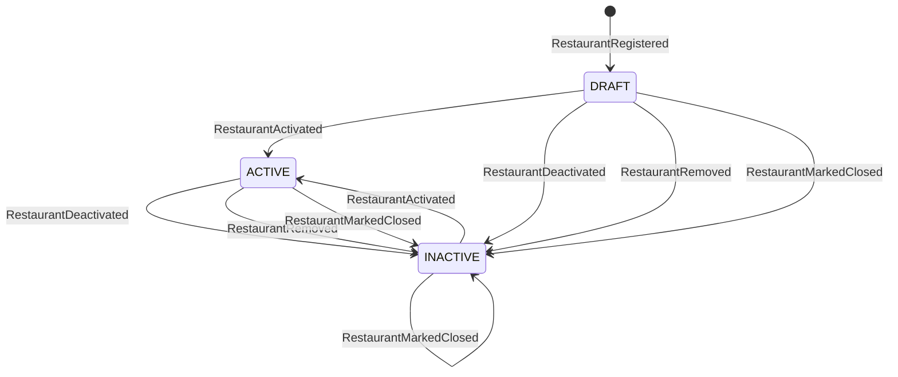
```mermaid
stateDiagram-v2
  [*] --> DRAFT : RestaurantRegistered
  DRAFT --> ACTIVE : RestaurantActivated
  INACTIVE --> ACTIVE : RestaurantActivated
  DRAFT --> INACTIVE : RestaurantDeactivated
  ACTIVE --> INACTIVE : RestaurantDeactivated
  DRAFT --> INACTIVE : RestaurantRemoved
  ACTIVE --> INACTIVE : RestaurantRemoved
  INACTIVE --> INACTIVE : RestaurantRemoved
  DRAFT --> INACTIVE : RestaurantMarkedClosed
  ACTIVE --> INACTIVE : RestaurantMarkedClosed
  INACTIVE --> INACTIVE : RestaurantMarkedClosed
```

<a id="actor-prospect"></a>
#### 🎭 Actor: `Prospect`

_🧩 aggregate_ — Sales/CRM state of a NON_PARTNER restaurant listing worked as a B2B prospect (ADR-0020); id = restaurantId. The `prospection-acl` worker (EXTERNAL) reads the COMPUTED score from ProspectionPipeline + the schedule, fires HubSpot/Resend/Slack, then records the contact fact here. The score is never an input or an emitted event. First RecordProspectContact is the prospect's birth; anti-spam invariants guard contacts.


| Receives | Emits → | Throws |
| --- | --- | --- |
| [📩 `RecordProspectContact`](#command-recordprospectcontact) | [⚡ `ProspectContacted`](#event-prospectcontacted) | [⛔ `ProspectContactLimitReached`](#error-prospectcontactlimitreached), [⛔ `ProspectContactedTooRecently`](#error-prospectcontactedtoorecently) |
| [📩 `MarkProspectCold`](#command-markprospectcold) | [⚡ `ProspectMarkedCold`](#event-prospectmarkedcold) | [⛔ `ProspectNotFound`](#error-prospectnotfound) |
| [📩 `RecordProspectReply`](#command-recordprospectreply) | [⚡ `ProspectReplied`](#event-prospectreplied) | [⛔ `ProspectNotFound`](#error-prospectnotfound) |

### 🗄️ Views (read models) _(3)_

<a id="view-restaurant"></a>
#### 🗄️ View: `Restaurant`

- **Source**: [🎭 `Restaurant`](#actor-restaurant) · 🛶 V0
- **Fed by**: [⚡ `RestaurantRegistered`](#event-restaurantregistered), [⚡ `RestaurantUpdated`](#event-restaurantupdated), [⚡ `RestaurantActivated`](#event-restaurantactivated), [⚡ `RestaurantDeactivated`](#event-restaurantdeactivated), [⚡ `RestaurantAcceptanceModeChanged`](#event-restaurantacceptancemodechanged), [⚡ `RestaurantRemoved`](#event-restaurantremoved), [⚡ `RestaurantGoogleBusinessProfileUpdated`](#event-restaurantgooglebusinessprofileupdated), [⚡ `RestaurantListingClaimed`](#event-restaurantlistingclaimed), [⚡ `RestaurantListingOptedOut`](#event-restaurantlistingoptedout), [⚡ `RestaurantMarkedClosed`](#event-restaurantmarkedclosed), [⚡ `RestaurantListingStatusChanged`](#event-restaurantlistingstatuschanged), [⚡ `RestaurantGoogleBusinessProfileOrderLinkConfigured`](#event-restaurantgooglebusinessprofileorderlinkconfigured), [⚡ `RestaurantGoogleBusinessProfileOrderLinkVerified`](#event-restaurantgooglebusinessprofileorderlinkverified), [⚡ `RestaurantSlugConfigured`](#event-restaurantslugconfigured), [⚡ `RestaurantSlugReconfigured`](#event-restaurantslugreconfigured), [⚡ `RestaurantAccountRegistered`](#event-restaurantaccountregistered)

| Column | Type | Sourced from | Constraints | Notes |
| --- | --- | --- | --- | --- |
| `restaurant_id` | [🔤 `RestaurantId`](#scalar-restaurantid) _(derived)_ | [⚡ `RestaurantRegistered`.`restaurantId`](#event-restaurantregistered--restaurantid) | PK |  |
| `restaurant_account_id` | [🔤 `RestaurantAccountId`](#scalar-restaurantaccountid) _(derived)_ | [⚡ `RestaurantRegistered`.`accountId`](#event-restaurantregistered--accountid), [⚡ `RestaurantListingClaimed`.`accountId`](#event-restaurantlistingclaimed--accountid) | index, nullable | NULL for a non-partner public listing; set on claim/conversion. |
| `listing_status` | [🔤 `RestaurantListingStatus`](#scalar-restaurantlistingstatus) | [⚡ `RestaurantRegistered`.`listingStatus`](#event-restaurantregistered--listingstatus), [⚡ `RestaurantListingStatusChanged`.`listingStatus`](#event-restaurantlistingstatuschanged--listingstatus) | index |  |
| `external_identifiers` | `jsonb` | [⚡ `RestaurantRegistered`.`externalIdentifiers`](#event-restaurantregistered--externalidentifiers) | nullable | Source-agnostic [{key,value}] (siret/naf/google_place_id…); not unique. |
| `google_place_id` | [🔤 `GooglePlaceId`](#scalar-googleplaceid) | [⚡ `RestaurantGoogleBusinessProfileUpdated`.`googlePlaceId`](#event-restaurantgooglebusinessprofileupdated--googleplaceid) | nullable |  |
| `slug` | [🔤 `Slug`](#scalar-slug) _(derived)_ | [⚡ `RestaurantSlugConfigured`.`slug`](#event-restaurantslugconfigured--slug), [⚡ `RestaurantSlugReconfigured`.`slug`](#event-restaurantslugreconfigured--slug) | unique, nullable |  |
| `display_name` | [🔤 `RestaurantDisplayName`](#scalar-restaurantdisplayname) _(derived)_ | [⚡ `RestaurantRegistered`.`displayName`](#event-restaurantregistered--displayname), [⚡ `RestaurantUpdated`.`displayName`](#event-restaurantupdated--displayname) | — |  |
| `description` | [🔤 `RestaurantDescription`](#scalar-restaurantdescription) | [⚡ `RestaurantUpdated`.`description`](#event-restaurantupdated--description) | nullable |  |
| `tags` | `jsonb` | [⚡ `RestaurantRegistered`.`tags`](#event-restaurantregistered--tags), [⚡ `RestaurantUpdated`.`tags`](#event-restaurantupdated--tags) | nullable | Cuisine/attribute tags — general restaurant info (source-agnostic), not from the GBP event. |
| `margin_rate` | [🔤 `MarginPercent`](#scalar-marginpercent) | [⚡ `RestaurantRegistered`.`marginRate`](#event-restaurantregistered--marginrate), [⚡ `RestaurantUpdated`.`marginRate`](#event-restaurantupdated--marginrate) | nullable | Food margin %, input to the Captain service-fee split (ADR-0017); back-office only. |
| `cuisine_category` | [🔤 `CuisineCategory`](#scalar-cuisinecategory) | [⚡ `RestaurantRegistered`.`cuisineCategory`](#event-restaurantregistered--cuisinecategory), [⚡ `RestaurantUpdated`.`cuisineCategory`](#event-restaurantupdated--cuisinecategory) | nullable | Selects the Uber Eats price-estimate coefficient in UberEstimationPolicy (ADR-0024). |
| `uber_prices_opt_in` | `boolean` | [⚡ `RestaurantRegistered`.`uberPricesOptIn`](#event-restaurantregistered--uberpricesoptin), [⚡ `RestaurantUpdated`.`uberPricesOptIn`](#event-restaurantupdated--uberpricesoptin) | nullable | Restaurant authorized showing its real Uber prices via HubRise (ADR-0023). Gates REAL vs ESTIMATED basis. |
| `website` | [🔤 `WebUrl`](#scalar-weburl) | [⚡ `RestaurantRegistered`.`website`](#event-restaurantregistered--website), [⚡ `RestaurantUpdated`.`website`](#event-restaurantupdated--website) | nullable |  |
| `rating` | [🔤 `GoogleRating`](#scalar-googlerating) | [⚡ `RestaurantGoogleBusinessProfileUpdated`.`rating`](#event-restaurantgooglebusinessprofileupdated--rating) | nullable | GBP-specific metric (Google listing), independent of the restaurant's own info. |
| `reviews_count` | `integer` | [⚡ `RestaurantGoogleBusinessProfileUpdated`.`reviewsCount`](#event-restaurantgooglebusinessprofileupdated--reviewscount) | nullable |  |
| `gbp_order_url` | [🔤 `WebUrl`](#scalar-weburl) | [⚡ `RestaurantGoogleBusinessProfileOrderLinkConfigured`.`gbpOrderUrl`](#event-restaurantgooglebusinessprofileorderlinkconfigured--gbporderurl) | nullable |  |
| `gbp_link_status` | [🔤 `GbpLinkStatus`](#scalar-gbplinkstatus) | [⚡ `RestaurantGoogleBusinessProfileOrderLinkVerified`.`status`](#event-restaurantgooglebusinessprofileorderlinkverified--status) | nullable |  |
| `address` | `jsonb` _(derived)_ | [⚡ `RestaurantRegistered`.`address`](#event-restaurantregistered--address), [⚡ `RestaurantUpdated`.`address`](#event-restaurantupdated--address) | — |  |
| `location` | `jsonb` _(derived)_ | [⚡ `RestaurantRegistered`.`location`](#event-restaurantregistered--location), [⚡ `RestaurantUpdated`.`location`](#event-restaurantupdated--location) | nullable | Geo coordinates {latitude, longitude}; typically from the Google Maps sync. |
| `opening_hours` | `jsonb` _(derived)_ | [⚡ `RestaurantRegistered`.`openingHours`](#event-restaurantregistered--openinghours), [⚡ `RestaurantUpdated`.`openingHours`](#event-restaurantupdated--openinghours) | — |  |
| `status` | [🔤 `RestaurantStatus`](#scalar-restaurantstatus) | [⚡ `RestaurantRegistered`](#event-restaurantregistered), [⚡ `RestaurantActivated`](#event-restaurantactivated), [⚡ `RestaurantDeactivated`](#event-restaurantdeactivated), [⚡ `RestaurantRemoved`](#event-restaurantremoved), [⚡ `RestaurantMarkedClosed`](#event-restaurantmarkedclosed) | — | Derived from the lifecycle event type: DRAFT on register, ACTIVE/INACTIVE on (de)activation, INACTIVE on closure. |
| `order_acceptance` | [🔤 `OrderAcceptanceMode`](#scalar-orderacceptancemode) _(derived)_ | [⚡ `RestaurantAcceptanceModeChanged`.`mode`](#event-restaurantacceptancemodechanged--mode) | — |  |
| `default_currency` | [🔤 `CurrencyCode`](#scalar-currencycode) _(derived)_ | [⚡ `RestaurantAccountRegistered`.`defaultCurrency`](#event-restaurantaccountregistered--defaultcurrency) | — |  |
| `timezone` | [🔤 `TimeZone`](#scalar-timezone) _(derived)_ | [⚡ `RestaurantRegistered`.`timezone`](#event-restaurantregistered--timezone), [⚡ `RestaurantUpdated`.`timezone`](#event-restaurantupdated--timezone) | nullable | Location timezone. NULL means NO timezone — the account-level fallback this note used to claim has NO materialized source (View_RestaurantAccount was deleted; corrected under RSO-1, DECISIONS §43): service-window evaluation treats NULL, or a zone that does not parse while hours are declared, as HOURS_UNDECLARED, never as "closed".  |
| `preparation_time_minutes` | `integer` _(derived)_ | [⚡ `RestaurantRegistered`.`preparationTimeMinutes`](#event-restaurantregistered--preparationtimeminutes), [⚡ `RestaurantUpdated`.`preparationTimeMinutes`](#event-restaurantupdated--preparationtimeminutes) | nullable |  |
| `created_at` | `timestamptz` | ⚠️ _(none)_ | — | technical — stamped from event.occurred_at (implicit on every read model) |
| `updated_at` | `timestamptz` | ⚠️ _(none)_ | — | technical — stamped from event.occurred_at (implicit on every read model) |

<a id="view-slugalias"></a>
#### 🗄️ View: `SlugAlias`

- **Source**: [🎭 `Restaurant`](#actor-restaurant) · 🛶 V0
- **Note**: Superseded storefront labels, so a renamed restaurant's OLD host keeps resolving (ADR-20260728-011344). `hosts.rs` resolves an incoming Host header against `Restaurant.slug` first and falls back here, answering 301 -> the current address. Without this, a rename instantly 404s every printed menu, QR code, inbound link and search result pointing at the old label -- which is why `RestaurantSlugReconfigured` carries `previousSlug` as business data rather than leaving it to be re-derived by folding history. Host resolution runs on EVERY request and must never fold. 
- **Rules**: One row per superseded label, keyed by that label. A restaurant renamed N times leaves N rows -- each recording the address that superseded it AT THAT MOMENT, which is a historical fact and therefore never stale. `current_slug` is NOT how a redirect is resolved: after A->B->C, row A still says B. `hosts.rs` resolves the alias to `restaurant_id` and reads that restaurant's CURRENT slug from the Restaurant projection, so every superseded label lands on the live address in ONE hop rather than walking a 301 chain. Rows are never deleted: the reservation table bars reuse of a released label, so an alias can never start pointing at a different business.
- **Fed by**: [⚡ `RestaurantSlugReconfigured`](#event-restaurantslugreconfigured)

| Column | Type | Sourced from | Constraints | Notes |
| --- | --- | --- | --- | --- |
| `previous_slug` | [🔤 `Slug`](#scalar-slug) _(derived)_ | [⚡ `RestaurantSlugReconfigured`.`previousSlug`](#event-restaurantslugreconfigured--previousslug) | PK |  |
| `restaurant_id` | [🔤 `RestaurantId`](#scalar-restaurantid) _(derived)_ | [⚡ `RestaurantSlugReconfigured`.`restaurantId`](#event-restaurantslugreconfigured--restaurantid) | index |  |
| `current_slug` | [🔤 `Slug`](#scalar-slug) _(derived)_ | [⚡ `RestaurantSlugReconfigured`.`slug`](#event-restaurantslugreconfigured--slug) | — | The address that superseded `previous_slug` at the time of the rename. Historical, not authoritative -- see the rules above: resolution goes through `restaurant_id`. |
| `created_at` | `timestamptz` | ⚠️ _(none)_ | — | technical — stamped from event.occurred_at (implicit on every read model) |
| `updated_at` | `timestamptz` | ⚠️ _(none)_ | — | technical — stamped from event.occurred_at (implicit on every read model) |

<a id="view-prospectionpipeline"></a>
#### 🗄️ View: `ProspectionPipeline`

- **Source**: [🎭 `Prospect`](#actor-prospect) · 🔭 V1
- **Note**: B2B prospection pipeline (ADR-0020): one row per worked listing, with the COMPUTED score and outreach state. Read by the admin prospectionPipeline query.
- **Filters**: Rows for NON_PARTNER / PASSIVE_PARTNER listings (active prospects); CONVERTED once ACTIVE_PARTNER.
- **Rules**: `score` (0–10) is COMPUTED by the projection from listing facts, NEVER stored in an event: food-truck NAF 56.10C +3, Google rating ≥4.0 +2, reviews <20 +2, created <12mo +2, no website +1, already on Uber/Deliveroo −2, national franchise −3; clamped to 0–10. Inputs not yet captured as fields (Sirene creation date, on-aggregator, national franchise) are best-effort/V1; the formula degrades gracefully to the available signals. `pipeline_status` is derived: NEW (no contact) → CONTACTED → COLD (ProspectMarkedCold) / REPLIED (ProspectReplied); CONVERTED when RestaurantListingStatusChanged reaches ACTIVE_PARTNER.
- **Fed by**: [⚡ `RestaurantRegistered`](#event-restaurantregistered), [⚡ `RestaurantGoogleBusinessProfileUpdated`](#event-restaurantgooglebusinessprofileupdated), [⚡ `RestaurantListingStatusChanged`](#event-restaurantlistingstatuschanged), [⚡ `ProspectContacted`](#event-prospectcontacted), [⚡ `ProspectMarkedCold`](#event-prospectmarkedcold), [⚡ `ProspectReplied`](#event-prospectreplied)

| Column | Type | Sourced from | Constraints | Notes |
| --- | --- | --- | --- | --- |
| `restaurant_id` | [🔤 `RestaurantId`](#scalar-restaurantid) _(derived)_ → [🗄️ `Restaurant`](#view-restaurant) | [⚡ `RestaurantRegistered`.`restaurantId`](#event-restaurantregistered--restaurantid) | PK |  |
| `score` | [🔤 `ProspectionScore`](#scalar-prospectionscore) | [⚡ `RestaurantRegistered`.`externalIdentifiers`](#event-restaurantregistered--externalidentifiers), [⚡ `RestaurantRegistered`.`website`](#event-restaurantregistered--website), [⚡ `RestaurantGoogleBusinessProfileUpdated`.`rating`](#event-restaurantgooglebusinessprofileupdated--rating), [⚡ `RestaurantGoogleBusinessProfileUpdated`.`reviewsCount`](#event-restaurantgooglebusinessprofileupdated--reviewscount) | index | Derived (see rules); not an event field. |
| `pipeline_status` | [🔤 `ProspectPipelineStatus`](#scalar-prospectpipelinestatus) | [⚡ `ProspectContacted`](#event-prospectcontacted), [⚡ `ProspectMarkedCold`](#event-prospectmarkedcold), [⚡ `ProspectReplied`](#event-prospectreplied), [⚡ `RestaurantListingStatusChanged`](#event-restaurantlistingstatuschanged) | index | Derived from the prospect events + listingStatus (see rules). |
| `contacts_count` | `integer` | [⚡ `ProspectContacted`](#event-prospectcontacted) | — | Count of ProspectContacted; drives the anti-spam ≤3 rule. |
| `last_contacted_at` | `timestamptz` | [⚡ `ProspectContacted`](#event-prospectcontacted) | nullable |  |
| `replied_at` | `timestamptz` | [⚡ `ProspectReplied`](#event-prospectreplied) | nullable |  |
| `created_at` | `timestamptz` | ⚠️ _(none)_ | — | technical — stamped from event.occurred_at (implicit on every read model) |
| `updated_at` | `timestamptz` | ⚠️ _(none)_ | — | technical — stamped from event.occurred_at (implicit on every read model) |

### 📩 Commands _(20)_

<a id="command-registerrestaurantaccount"></a>
#### 📩 Command: `RegisterRestaurantAccount`

Admin creates a restaurant ACCOUNT (HubRise: restaurant) that will own one or more locations. Account-level facts (legal entity, billing contact, currency, default tax, timezone) live here.

- **Dispatched by**: [✏️ `registerRestaurantAccount`](#mutation-registerrestaurantaccount) · **handled by** [🎭 `RestaurantAccount`](#actor-restaurantaccount)
- **Emits**: [⚡ `RestaurantAccountRegistered`](#event-restaurantaccountregistered)
- **Throws**: [⛔ `RefAlreadyUsed`](#error-refalreadyused), [⛔ `InvalidCurrency`](#error-invalidcurrency)

| Field | Type | Required | Description |
| --- | --- | --- | --- |
| <a id="command-registerrestaurantaccount--restaurantaccountid"></a>`restaurantAccountId` | [🔤 `RestaurantAccountId`](#scalar-restaurantaccountid) | ✅ | Client-generated id for the new account. |
| <a id="command-registerrestaurantaccount--legalname"></a>`legalName` | [🔤 `RestaurantLegalName`](#scalar-restaurantlegalname) | ✅ |  |
| <a id="command-registerrestaurantaccount--contact"></a>`contact` | [📦 `RestaurantContact`](#entity-restaurantcontact) | ⬜ |  |
| <a id="command-registerrestaurantaccount--defaultcurrency"></a>`defaultCurrency` | [🔤 `CurrencyCode`](#scalar-currencycode) | ✅ |  |
| <a id="command-registerrestaurantaccount--defaulttaxrate"></a>`defaultTaxRate` | [📦 `TaxRate`](#entity-taxrate) | ✅ |  |
| <a id="command-registerrestaurantaccount--timezone"></a>`timezone` | [🔤 `TimeZone`](#scalar-timezone) | ⬜ |  |
| <a id="command-registerrestaurantaccount--ref"></a>`ref` | [🔤 `ExternalReference`](#scalar-externalreference) | ⬜ | HubRise restaurant (account) reference, when seeded externally. |

<a id="command-updaterestaurantaccount"></a>
#### 📩 Command: `UpdateRestaurantAccount`

Owner/admin edits account-level fields (legal name, billing contact, default tax, timezone).

- **Dispatched by**: [✏️ `updateRestaurantAccount`](#mutation-updaterestaurantaccount) · **handled by** [🎭 `RestaurantAccount`](#actor-restaurantaccount)
- **Emits**: [⚡ `RestaurantAccountUpdated`](#event-restaurantaccountupdated)
- **Throws**: [⛔ `RestaurantAccountNotFound`](#error-restaurantaccountnotfound), [⛔ `NoEditableFieldProvided`](#error-noeditablefieldprovided)

| Field | Type | Required | Description |
| --- | --- | --- | --- |
| <a id="command-updaterestaurantaccount--restaurantaccountid"></a>`restaurantAccountId` | [🔤 `RestaurantAccountId`](#scalar-restaurantaccountid) | ✅ |  |
| <a id="command-updaterestaurantaccount--legalname"></a>`legalName` | [🔤 `RestaurantLegalName`](#scalar-restaurantlegalname) | ⬜ |  |
| <a id="command-updaterestaurantaccount--contact"></a>`contact` | [📦 `RestaurantContact`](#entity-restaurantcontact) | ⬜ |  |
| <a id="command-updaterestaurantaccount--defaulttaxrate"></a>`defaultTaxRate` | [📦 `TaxRate`](#entity-taxrate) | ⬜ |  |
| <a id="command-updaterestaurantaccount--timezone"></a>`timezone` | [🔤 `TimeZone`](#scalar-timezone) | ⬜ |  |

<a id="command-deleterestaurantaccount"></a>
#### 📩 Command: `DeleteRestaurantAccount`

Owner/admin closes a restaurant account (its locations must already be removed).

- **Dispatched by**: [✏️ `deleteRestaurantAccount`](#mutation-deleterestaurantaccount) · **handled by** [🎭 `RestaurantAccount`](#actor-restaurantaccount)
- **Emits**: [⚡ `RestaurantAccountDeleted`](#event-restaurantaccountdeleted)
- **Throws**: [⛔ `RestaurantAccountNotFound`](#error-restaurantaccountnotfound)

| Field | Type | Required | Description |
| --- | --- | --- | --- |
| <a id="command-deleterestaurantaccount--restaurantaccountid"></a>`restaurantAccountId` | [🔤 `RestaurantAccountId`](#scalar-restaurantaccountid) | ✅ |  |
| <a id="command-deleterestaurantaccount--reason"></a>`reason` | `string` | ⬜ |  |

<a id="command-registerrestaurant"></a>
#### 📩 Command: `RegisterRestaurant`

The single, generic way to register a restaurant LOCATION. Used by an owner/admin onboarding a partner location (accountId set), AND by the Sirene/Google sync ACL seeding a public listing as if it were the owner (no accountId, listingStatus NON_PARTNER, externalIdentifiers from the source). Starts in DRAFT.

- **Dispatched by**: [✏️ `registerRestaurant`](#mutation-registerrestaurant) · **handled by** [🎭 `Restaurant`](#actor-restaurant)
- **Emits**: [⚡ `RestaurantRegistered`](#event-restaurantregistered)
- **Throws**: [⛔ `RestaurantAccountNotFound`](#error-restaurantaccountnotfound), [⛔ `RefAlreadyUsed`](#error-refalreadyused)

| Field | Type | Required | Description |
| --- | --- | --- | --- |
| <a id="command-registerrestaurant--mode"></a>`mode` | [🔤 `Mode`](#scalar-mode) | ⬜ |  |
| <a id="command-registerrestaurant--restaurantid"></a>`restaurantId` | [🔤 `RestaurantId`](#scalar-restaurantid) | ✅ | Client/ACL-generated id for the new location. |
| <a id="command-registerrestaurant--accountid"></a>`accountId` | [🔤 `RestaurantAccountId`](#scalar-restaurantaccountid) | ⬜ | The owning account (must already exist) — omitted for a non-partner public listing. |
| <a id="command-registerrestaurant--listingstatus"></a>`listingStatus` | [🔤 `RestaurantListingStatus`](#scalar-restaurantlistingstatus) | ⬜ | Partnership funnel; defaults to NON_PARTNER when omitted (e.g. sync-seeded listing). |
| <a id="command-registerrestaurant--displayname"></a>`displayName` | [🔤 `RestaurantDisplayName`](#scalar-restaurantdisplayname) | ✅ |  |
| <a id="command-registerrestaurant--contact"></a>`contact` | [📦 `RestaurantContact`](#entity-restaurantcontact) | ⬜ | Location-specific contact; falls back to the account contact when absent. |
| <a id="command-registerrestaurant--website"></a>`website` | [🔤 `WebUrl`](#scalar-weburl) | ⬜ |  |
| <a id="command-registerrestaurant--tags"></a>`tags` | [[🔤 `Tag`](#scalar-tag)] | ⬜ |  |
| <a id="command-registerrestaurant--marginrate"></a>`marginRate` | [🔤 `MarginPercent`](#scalar-marginpercent) | ⬜ | Food margin %, input to the service-fee split (ADR-0017). |
| <a id="command-registerrestaurant--cuisinecategory"></a>`cuisineCategory` | [🔤 `CuisineCategory`](#scalar-cuisinecategory) | ⬜ | Cuisine bucket; selects the Uber Eats price-estimate coefficient (ADR-0024). |
| <a id="command-registerrestaurant--uberpricesoptin"></a>`uberPricesOptIn` | `boolean` | ⬜ | Authorize showing real Uber Eats prices for comparison (ADR-0023 opt-in). |
| <a id="command-registerrestaurant--address"></a>`address` | [📦 `Address`](#entity-address) | ✅ |  |
| <a id="command-registerrestaurant--location"></a>`location` | [📦 `GeoPoint`](#entity-geopoint) | ⬜ | Geo coordinates (typically from the Google Maps sync). |
| <a id="command-registerrestaurant--timezone"></a>`timezone` | [🔤 `TimeZone`](#scalar-timezone) | ⬜ | Location timezone; falls back to the account timezone when absent. |
| <a id="command-registerrestaurant--preparationtimeminutes"></a>`preparationTimeMinutes` | `integer` | ⬜ |  |
| <a id="command-registerrestaurant--openinghours"></a>`openingHours` | [[📦 `OpeningHoursSlot`](#entity-openinghoursslot)] | ⬜ |  |
| <a id="command-registerrestaurant--externalidentifiers"></a>`externalIdentifiers` | [[📦 `ExternalIdentifier`](#entity-externalidentifier)] | ⬜ | Source-agnostic identifiers preserving original keys (siret/naf/google_place_id…). Not unique. |
| <a id="command-registerrestaurant--ref"></a>`ref` | [🔤 `ExternalReference`](#scalar-externalreference) | ⬜ | Set only when seeded from an external source (e.g. HubRise location). |

<a id="command-configurerestaurantslug"></a>
#### 📩 Command: `ConfigureRestaurantSlug`

The owner chooses (or changes) the restaurant's STOREFRONT ADDRESS -- the {slug}.captain.food host (ADR-20260728-011344). A real command precisely because it CAN be refused: the label may already belong to another restaurant, and the person asking is a human who can pick again -- contrast the SIRENE registry feed, which states facts nobody can be told "no" about. Issued during onboarding after ownership is verified and before activation (a restaurant cannot be activated without a configured slug), and again later from the back office to rename. The aggregate decides which fact it is: first configuration emits RestaurantSlugConfigured, a change emits RestaurantSlugReconfigured carrying the previous label, and re-submitting the CURRENT label is an idempotent no-op (no event, no error).

- **Dispatched by**: [✏️ `configureRestaurantSlug`](#mutation-configurerestaurantslug) · **handled by** [🎭 `Restaurant`](#actor-restaurant)
- **Emits**: [⚡ `RestaurantSlugConfigured`](#event-restaurantslugconfigured), [⚡ `RestaurantSlugReconfigured`](#event-restaurantslugreconfigured)
- **Throws**: [⛔ `RestaurantNotFound`](#error-restaurantnotfound), [⛔ `SlugAlreadyTaken`](#error-slugalreadytaken)

| Field | Type | Required | Description |
| --- | --- | --- | --- |
| <a id="command-configurerestaurantslug--restaurantid"></a>`restaurantId` | [🔤 `RestaurantId`](#scalar-restaurantid) | ✅ |  |
| <a id="command-configurerestaurantslug--slug"></a>`slug` | [🔤 `Slug`](#scalar-slug) | ✅ | The requested storefront host label. Rejected with SlugAlreadyTaken if reserved by another restaurant -- including a label another restaurant has RELEASED by renaming, which stays reserved so its redirect cannot be hijacked. |

<a id="command-activaterestaurant"></a>
#### 📩 Command: `ActivateRestaurant`

Admin makes a restaurant visible and orderable by customers.

- **Dispatched by**: [✏️ `activateRestaurant`](#mutation-activaterestaurant) · **handled by** [🎭 `Restaurant`](#actor-restaurant)
- **Emits**: [⚡ `RestaurantActivated`](#event-restaurantactivated)
- **Throws**: [⛔ `RestaurantNotFound`](#error-restaurantnotfound), [⛔ `RestaurantNotReadyForActivation`](#error-restaurantnotreadyforactivation), [⛔ `SlugNotConfigured`](#error-slugnotconfigured)

| Field | Type | Required | Description |
| --- | --- | --- | --- |
| <a id="command-activaterestaurant--restaurantid"></a>`restaurantId` | [🔤 `RestaurantId`](#scalar-restaurantid) | ✅ |  |
| <a id="command-activaterestaurant--reason"></a>`reason` | `string` | ⬜ |  |

<a id="command-updaterestaurant"></a>
#### 📩 Command: `UpdateRestaurant`

Admin edits one or more mutable LOCATION fields (full replace of provided fields). Account-level facts (legalName, defaultTaxRate, currency) are edited on the account, not here.

- **Dispatched by**: [✏️ `updateRestaurant`](#mutation-updaterestaurant) · **handled by** [🎭 `Restaurant`](#actor-restaurant)
- **Emits**: [⚡ `RestaurantUpdated`](#event-restaurantupdated)
- **Throws**: [⛔ `RestaurantNotFound`](#error-restaurantnotfound), [⛔ `NoEditableFieldProvided`](#error-noeditablefieldprovided)

| Field | Type | Required | Description |
| --- | --- | --- | --- |
| <a id="command-updaterestaurant--restaurantid"></a>`restaurantId` | [🔤 `RestaurantId`](#scalar-restaurantid) | ✅ |  |
| <a id="command-updaterestaurant--displayname"></a>`displayName` | [🔤 `RestaurantDisplayName`](#scalar-restaurantdisplayname) | ⬜ |  |
| <a id="command-updaterestaurant--description"></a>`description` | [🔤 `RestaurantDescription`](#scalar-restaurantdescription) | ⬜ | Free-text presentation shown on the storefront and the discovery card. |
| <a id="command-updaterestaurant--contact"></a>`contact` | [📦 `RestaurantContact`](#entity-restaurantcontact) | ⬜ |  |
| <a id="command-updaterestaurant--website"></a>`website` | [🔤 `WebUrl`](#scalar-weburl) | ⬜ |  |
| <a id="command-updaterestaurant--tags"></a>`tags` | [[🔤 `Tag`](#scalar-tag)] | ⬜ |  |
| <a id="command-updaterestaurant--marginrate"></a>`marginRate` | [🔤 `MarginPercent`](#scalar-marginpercent) | ⬜ |  |
| <a id="command-updaterestaurant--cuisinecategory"></a>`cuisineCategory` | [🔤 `CuisineCategory`](#scalar-cuisinecategory) | ⬜ | Cuisine bucket; selects the Uber Eats price-estimate coefficient (ADR-0024). |
| <a id="command-updaterestaurant--uberpricesoptin"></a>`uberPricesOptIn` | `boolean` | ⬜ | Authorize showing real Uber Eats prices for comparison (ADR-0023 opt-in). |
| <a id="command-updaterestaurant--address"></a>`address` | [📦 `Address`](#entity-address) | ⬜ |  |
| <a id="command-updaterestaurant--location"></a>`location` | [📦 `GeoPoint`](#entity-geopoint) | ⬜ |  |
| <a id="command-updaterestaurant--timezone"></a>`timezone` | [🔤 `TimeZone`](#scalar-timezone) | ⬜ |  |
| <a id="command-updaterestaurant--preparationtimeminutes"></a>`preparationTimeMinutes` | `integer` | ⬜ |  |
| <a id="command-updaterestaurant--openinghours"></a>`openingHours` | [[📦 `OpeningHoursSlot`](#entity-openinghoursslot)] | ⬜ |  |

<a id="command-deactivaterestaurant"></a>
#### 📩 Command: `DeactivateRestaurant`

Admin takes a restaurant offline so it can no longer receive orders.

- **Dispatched by**: [✏️ `deactivateRestaurant`](#mutation-deactivaterestaurant) · **handled by** [🎭 `Restaurant`](#actor-restaurant)
- **Emits**: [⚡ `RestaurantDeactivated`](#event-restaurantdeactivated)
- **Throws**: [⛔ `RestaurantNotFound`](#error-restaurantnotfound)

| Field | Type | Required | Description |
| --- | --- | --- | --- |
| <a id="command-deactivaterestaurant--restaurantid"></a>`restaurantId` | [🔤 `RestaurantId`](#scalar-restaurantid) | ✅ |  |
| <a id="command-deactivaterestaurant--reason"></a>`reason` | `string` | ⬜ |  |

<a id="command-removerestaurant"></a>
#### 📩 Command: `RemoveRestaurant`

Owner/admin removes a location from its account (delisted; no longer orderable).

- **Dispatched by**: [✏️ `removeRestaurant`](#mutation-removerestaurant) · **handled by** [🎭 `Restaurant`](#actor-restaurant)
- **Emits**: [⚡ `RestaurantRemoved`](#event-restaurantremoved)
- **Throws**: [⛔ `RestaurantNotFound`](#error-restaurantnotfound)

| Field | Type | Required | Description |
| --- | --- | --- | --- |
| <a id="command-removerestaurant--restaurantid"></a>`restaurantId` | [🔤 `RestaurantId`](#scalar-restaurantid) | ✅ |  |
| <a id="command-removerestaurant--accountid"></a>`accountId` | [🔤 `RestaurantAccountId`](#scalar-restaurantaccountid) | ✅ |  |
| <a id="command-removerestaurant--reason"></a>`reason` | `string` | ⬜ |  |

<a id="command-changeorderacceptancemode"></a>
#### 📩 Command: `ChangeOrderAcceptanceMode`

Restaurant toggles its live order-acceptance mode (NORMAL / BUSY / PAUSED).

- **Dispatched by**: [✏️ `changeOrderAcceptanceMode`](#mutation-changeorderacceptancemode) · **handled by** [🎭 `Restaurant`](#actor-restaurant)
- **Emits**: [⚡ `RestaurantAcceptanceModeChanged`](#event-restaurantacceptancemodechanged)
- **Throws**: [⛔ `RestaurantNotFound`](#error-restaurantnotfound), [⛔ `RestaurantNotActive`](#error-restaurantnotactive), [⛔ `AcceptanceModeUnchanged`](#error-acceptancemodeunchanged)

| Field | Type | Required | Description |
| --- | --- | --- | --- |
| <a id="command-changeorderacceptancemode--restaurantid"></a>`restaurantId` | [🔤 `RestaurantId`](#scalar-restaurantid) | ✅ |  |
| <a id="command-changeorderacceptancemode--mode"></a>`mode` | [🔤 `OrderAcceptanceMode`](#scalar-orderacceptancemode) | ✅ |  |

<a id="command-updaterestaurantgooglebusinessprofile"></a>
#### 📩 Command: `UpdateRestaurantGoogleBusinessProfile`

Record GBP-SPECIFIC metrics (Google place id + rating/reviews) for a restaurant. Issued by the Sirene/Google sync ACL (or admin). Carries ONLY Google-listing data — general restaurant info (name/address/hours/phone/website/tags) is set via Register/UpdateRestaurant, so the two data sources stay independent.

- **Dispatched by**: [✏️ `updateRestaurantGoogleBusinessProfile`](#mutation-updaterestaurantgooglebusinessprofile) · **handled by** [🎭 `Restaurant`](#actor-restaurant)
- **Emits**: [⚡ `RestaurantGoogleBusinessProfileUpdated`](#event-restaurantgooglebusinessprofileupdated)
- **Throws**: [⛔ `RestaurantNotFound`](#error-restaurantnotfound)

| Field | Type | Required | Description |
| --- | --- | --- | --- |
| <a id="command-updaterestaurantgooglebusinessprofile--restaurantid"></a>`restaurantId` | [🔤 `RestaurantId`](#scalar-restaurantid) | ✅ |  |
| <a id="command-updaterestaurantgooglebusinessprofile--googleplaceid"></a>`googlePlaceId` | [🔤 `GooglePlaceId`](#scalar-googleplaceid) | ⬜ |  |
| <a id="command-updaterestaurantgooglebusinessprofile--rating"></a>`rating` | [🔤 `GoogleRating`](#scalar-googlerating) | ⬜ |  |
| <a id="command-updaterestaurantgooglebusinessprofile--reviewscount"></a>`reviewsCount` | `integer` | ⬜ |  |

<a id="command-markrestaurantclosed"></a>
#### 📩 Command: `MarkRestaurantClosed`

Record that the establishment is closed (e.g. Sirene closure); issued by the sync ACL or admin.

- **Dispatched by**: [✏️ `markRestaurantClosed`](#mutation-markrestaurantclosed) · **handled by** [🎭 `Restaurant`](#actor-restaurant)
- **Emits**: [⚡ `RestaurantMarkedClosed`](#event-restaurantmarkedclosed)
- **Throws**: [⛔ `RestaurantNotFound`](#error-restaurantnotfound)

| Field | Type | Required | Description |
| --- | --- | --- | --- |
| <a id="command-markrestaurantclosed--restaurantid"></a>`restaurantId` | [🔤 `RestaurantId`](#scalar-restaurantid) | ✅ |  |
| <a id="command-markrestaurantclosed--reason"></a>`reason` | `string` | ⬜ |  |

<a id="command-claimrestaurantlisting"></a>
#### 📩 Command: `ClaimRestaurantListing`

An owner claims a public listing. Ownership is proven by verifying the restaurant's Google Business Profile (delegated to Google as a start); the backend validates the proof server-side before accepting.

- **Dispatched by**: [✏️ `claimRestaurantListing`](#mutation-claimrestaurantlisting) · **handled by** [🎭 `Restaurant`](#actor-restaurant)
- **Emits**: [⚡ `RestaurantListingClaimed`](#event-restaurantlistingclaimed)
- **Throws**: [⛔ `RestaurantNotFound`](#error-restaurantnotfound), [⛔ `ListingOwnershipNotVerified`](#error-listingownershipnotverified), [⛔ `ListingAlreadyClaimed`](#error-listingalreadyclaimed)

| Field | Type | Required | Description |
| --- | --- | --- | --- |
| <a id="command-claimrestaurantlisting--restaurantid"></a>`restaurantId` | [🔤 `RestaurantId`](#scalar-restaurantid) | ✅ |  |
| <a id="command-claimrestaurantlisting--accountid"></a>`accountId` | [🔤 `RestaurantAccountId`](#scalar-restaurantaccountid) | ⬜ | Account to attach the claimed listing to, when the claimant already has one. |
| <a id="command-claimrestaurantlisting--googleownershipproof"></a>`googleOwnershipProof` | `string` | ✅ | Opaque Google Business Profile ownership proof/token, verified server-side. |

<a id="command-optoutrestaurantlisting"></a>
#### 📩 Command: `OptOutRestaurantListing`

An owner opts a public listing out (edit/remove), proven via Google Business Profile ownership.

- **Dispatched by**: [✏️ `optOutRestaurantListing`](#mutation-optoutrestaurantlisting) · **handled by** [🎭 `Restaurant`](#actor-restaurant)
- **Emits**: [⚡ `RestaurantListingOptedOut`](#event-restaurantlistingoptedout)
- **Throws**: [⛔ `RestaurantNotFound`](#error-restaurantnotfound), [⛔ `ListingOwnershipNotVerified`](#error-listingownershipnotverified)

| Field | Type | Required | Description |
| --- | --- | --- | --- |
| <a id="command-optoutrestaurantlisting--restaurantid"></a>`restaurantId` | [🔤 `RestaurantId`](#scalar-restaurantid) | ✅ |  |
| <a id="command-optoutrestaurantlisting--googleownershipproof"></a>`googleOwnershipProof` | `string` | ✅ | Opaque Google Business Profile ownership proof/token, verified server-side. |
| <a id="command-optoutrestaurantlisting--reason"></a>`reason` | `string` | ⬜ |  |

<a id="command-changerestaurantlistingstatus"></a>
#### 📩 Command: `ChangeRestaurantListingStatus`

Admin moves a listing along the partnership funnel (NON_PARTNER → PASSIVE_PARTNER → ACTIVE_PARTNER).

- **Dispatched by**: [✏️ `changeRestaurantListingStatus`](#mutation-changerestaurantlistingstatus) · **handled by** [🎭 `Restaurant`](#actor-restaurant)
- **Emits**: [⚡ `RestaurantListingStatusChanged`](#event-restaurantlistingstatuschanged)
- **Throws**: [⛔ `RestaurantNotFound`](#error-restaurantnotfound)

| Field | Type | Required | Description |
| --- | --- | --- | --- |
| <a id="command-changerestaurantlistingstatus--restaurantid"></a>`restaurantId` | [🔤 `RestaurantId`](#scalar-restaurantid) | ✅ |  |
| <a id="command-changerestaurantlistingstatus--listingstatus"></a>`listingStatus` | [🔤 `RestaurantListingStatus`](#scalar-restaurantlistingstatus) | ✅ |  |
| <a id="command-changerestaurantlistingstatus--reason"></a>`reason` | `string` | ⬜ |  |

<a id="command-configuregooglebusinessprofileorderlink"></a>
#### 📩 Command: `ConfigureGoogleBusinessProfileOrderLink`

Restaurant/admin sets the GBP 'Order online' link to its {slug}.captain.food page (ADR-0021; V1).

- **Dispatched by**: [✏️ `configureGbpOrderLink`](#mutation-configuregbporderlink) · **handled by** [🎭 `Restaurant`](#actor-restaurant)
- **Emits**: [⚡ `RestaurantGoogleBusinessProfileOrderLinkConfigured`](#event-restaurantgooglebusinessprofileorderlinkconfigured)
- **Throws**: [⛔ `RestaurantNotFound`](#error-restaurantnotfound)

| Field | Type | Required | Description |
| --- | --- | --- | --- |
| <a id="command-configuregooglebusinessprofileorderlink--restaurantid"></a>`restaurantId` | [🔤 `RestaurantId`](#scalar-restaurantid) | ✅ |  |
| <a id="command-configuregooglebusinessprofileorderlink--gbporderurl"></a>`gbpOrderUrl` | [🔤 `WebUrl`](#scalar-weburl) | ✅ |  |

<a id="command-verifygooglebusinessprofileorderlink"></a>
#### 📩 Command: `VerifyGoogleBusinessProfileOrderLink`

Ping the configured GBP 'Order online' link and record whether it is live (ADR-0021; V1).

- **Dispatched by**: [✏️ `verifyGbpOrderLink`](#mutation-verifygbporderlink) · **handled by** [🎭 `Restaurant`](#actor-restaurant)
- **Emits**: [⚡ `RestaurantGoogleBusinessProfileOrderLinkVerified`](#event-restaurantgooglebusinessprofileorderlinkverified)
- **Throws**: [⛔ `RestaurantNotFound`](#error-restaurantnotfound), [⛔ `GbpOrderLinkNotConfigured`](#error-gbporderlinknotconfigured)

| Field | Type | Required | Description |
| --- | --- | --- | --- |
| <a id="command-verifygooglebusinessprofileorderlink--restaurantid"></a>`restaurantId` | [🔤 `RestaurantId`](#scalar-restaurantid) | ✅ |  |

<a id="command-recordprospectcontact"></a>
#### 📩 Command: `RecordProspectContact`

Record a B2B outreach contact to a prospect. The worker decides WHO/WHEN from the read-model score + schedule; this just records the fact. First contact is the prospect's birth. Anti-spam invariants apply.

- **Dispatched by**: [✏️ `recordProspectContact`](#mutation-recordprospectcontact) · **handled by** [🎭 `Prospect`](#actor-prospect)
- **Emits**: [⚡ `ProspectContacted`](#event-prospectcontacted)
- **Throws**: [⛔ `ProspectContactLimitReached`](#error-prospectcontactlimitreached), [⛔ `ProspectContactedTooRecently`](#error-prospectcontactedtoorecently)

| Field | Type | Required | Description |
| --- | --- | --- | --- |
| <a id="command-recordprospectcontact--restaurantid"></a>`restaurantId` | [🔤 `RestaurantId`](#scalar-restaurantid) | ✅ |  |
| <a id="command-recordprospectcontact--channel"></a>`channel` | [🔤 `OutreachChannel`](#scalar-outreachchannel) | ✅ |  |
| <a id="command-recordprospectcontact--sequencestep"></a>`sequenceStep` | `integer` | ✅ |  |

<a id="command-markprospectcold"></a>
#### 📩 Command: `MarkProspectCold`

Mark a prospect cold (no reply by J+21); stops the outreach sequence.

- **Dispatched by**: [✏️ `markProspectCold`](#mutation-markprospectcold) · **handled by** [🎭 `Prospect`](#actor-prospect)
- **Emits**: [⚡ `ProspectMarkedCold`](#event-prospectmarkedcold)
- **Throws**: [⛔ `ProspectNotFound`](#error-prospectnotfound)

| Field | Type | Required | Description |
| --- | --- | --- | --- |
| <a id="command-markprospectcold--restaurantid"></a>`restaurantId` | [🔤 `RestaurantId`](#scalar-restaurantid) | ✅ |  |
| <a id="command-markprospectcold--reason"></a>`reason` | `string` | ⬜ |  |

<a id="command-recordprospectreply"></a>
#### 📩 Command: `RecordProspectReply`

Record that a prospect replied (CRM/admin or inbound), stopping the sequence.

- **Dispatched by**: [✏️ `recordProspectReply`](#mutation-recordprospectreply) · **handled by** [🎭 `Prospect`](#actor-prospect)
- **Emits**: [⚡ `ProspectReplied`](#event-prospectreplied)
- **Throws**: [⛔ `ProspectNotFound`](#error-prospectnotfound)

| Field | Type | Required | Description |
| --- | --- | --- | --- |
| <a id="command-recordprospectreply--restaurantid"></a>`restaurantId` | [🔤 `RestaurantId`](#scalar-restaurantid) | ✅ |  |
| <a id="command-recordprospectreply--note"></a>`note` | `string` | ⬜ |  |

### ⚡ Events _(21)_

<a id="event-restaurantaccountregistered"></a>
#### ⚡ Event: `RestaurantAccountRegistered`

A restaurant account (HubRise: restaurant) was created; it owns one or more locations.

- **Emitted by**: [🎭 `RestaurantAccount`](#actor-restaurantaccount)
- **Consumed by**: —
- **Projected into**: [🗄️ `Restaurant`](#view-restaurant)

| Field | Type | Required | Description |
| --- | --- | --- | --- |
| <a id="event-restaurantaccountregistered--restaurantaccountid"></a>`restaurantAccountId` | [🔤 `RestaurantAccountId`](#scalar-restaurantaccountid) | ✅ |  |
| <a id="event-restaurantaccountregistered--ref"></a>`ref` | [🔤 `ExternalReference`](#scalar-externalreference) | ⬜ |  |
| <a id="event-restaurantaccountregistered--legalname"></a>`legalName` | [🔤 `RestaurantLegalName`](#scalar-restaurantlegalname) | ✅ |  |
| <a id="event-restaurantaccountregistered--contact"></a>`contact` | [📦 `RestaurantContact`](#entity-restaurantcontact) | ⬜ |  |
| <a id="event-restaurantaccountregistered--defaultcurrency"></a>`defaultCurrency` | [🔤 `CurrencyCode`](#scalar-currencycode) | ✅ |  |
| <a id="event-restaurantaccountregistered--defaulttaxrate"></a>`defaultTaxRate` | [📦 `TaxRate`](#entity-taxrate) | ✅ |  |
| <a id="event-restaurantaccountregistered--timezone"></a>`timezone` | [🔤 `TimeZone`](#scalar-timezone) | ⬜ |  |

<a id="event-restaurantaccountupdated"></a>
#### ⚡ Event: `RestaurantAccountUpdated`

One or more account-level fields changed (legal name, contact, default tax, timezone).

- **Emitted by**: [🎭 `RestaurantAccount`](#actor-restaurantaccount)
- **Consumed by**: —
- **Projected into**: _non-projected (saga/transient)_

| Field | Type | Required | Description |
| --- | --- | --- | --- |
| <a id="event-restaurantaccountupdated--restaurantaccountid"></a>`restaurantAccountId` | [🔤 `RestaurantAccountId`](#scalar-restaurantaccountid) | ✅ |  |
| <a id="event-restaurantaccountupdated--legalname"></a>`legalName` | [🔤 `RestaurantLegalName`](#scalar-restaurantlegalname) | ⬜ |  |
| <a id="event-restaurantaccountupdated--contact"></a>`contact` | [📦 `RestaurantContact`](#entity-restaurantcontact) | ⬜ |  |
| <a id="event-restaurantaccountupdated--defaulttaxrate"></a>`defaultTaxRate` | [📦 `TaxRate`](#entity-taxrate) | ⬜ |  |
| <a id="event-restaurantaccountupdated--timezone"></a>`timezone` | [🔤 `TimeZone`](#scalar-timezone) | ⬜ |  |

<a id="event-restaurantaccountdeleted"></a>
#### ⚡ Event: `RestaurantAccountDeleted`

A restaurant account was closed/deleted.

- **Emitted by**: [🎭 `RestaurantAccount`](#actor-restaurantaccount)
- **Consumed by**: —
- **Projected into**: _non-projected (saga/transient)_

| Field | Type | Required | Description |
| --- | --- | --- | --- |
| <a id="event-restaurantaccountdeleted--restaurantaccountid"></a>`restaurantAccountId` | [🔤 `RestaurantAccountId`](#scalar-restaurantaccountid) | ✅ |  |
| <a id="event-restaurantaccountdeleted--reason"></a>`reason` | `string` | ⬜ |  |

<a id="event-restaurantregistered"></a>
#### ⚡ Event: `RestaurantRegistered`

A restaurant location has been registered. Covers every path: an owner/admin onboarding a partner location (with accountId), or the Sirene/Google sync ACL seeding a public NON_PARTNER listing (no accountId). The listingStatus and externalIdentifiers distinguish them.

- **Emitted by**: [🎭 `Restaurant`](#actor-restaurant)
- **Consumed by**: [🎭 `Restaurant`](#actor-restaurant)
- **Projected into**: [🗄️ `Restaurant`](#view-restaurant), [🗄️ `ProspectionPipeline`](#view-prospectionpipeline), [🗄️ `ScopeMembership`](#view-scopemembership)

| Field | Type | Required | Description |
| --- | --- | --- | --- |
| <a id="event-restaurantregistered--mode"></a>`mode` | [🔤 `Mode`](#scalar-mode) | ⬜ |  |
| <a id="event-restaurantregistered--restaurantid"></a>`restaurantId` | [🔤 `RestaurantId`](#scalar-restaurantid) | ✅ |  |
| <a id="event-restaurantregistered--accountid"></a>`accountId` | [🔤 `RestaurantAccountId`](#scalar-restaurantaccountid) | ⬜ |  |
| <a id="event-restaurantregistered--listingstatus"></a>`listingStatus` | [🔤 `RestaurantListingStatus`](#scalar-restaurantlistingstatus) | ✅ |  |
| <a id="event-restaurantregistered--ref"></a>`ref` | [🔤 `ExternalReference`](#scalar-externalreference) | ⬜ |  |
| <a id="event-restaurantregistered--externalidentifiers"></a>`externalIdentifiers` | [[📦 `ExternalIdentifier`](#entity-externalidentifier)] | ⬜ |  |
| <a id="event-restaurantregistered--displayname"></a>`displayName` | [🔤 `RestaurantDisplayName`](#scalar-restaurantdisplayname) | ✅ |  |
| <a id="event-restaurantregistered--contact"></a>`contact` | [📦 `RestaurantContact`](#entity-restaurantcontact) | ⬜ |  |
| <a id="event-restaurantregistered--website"></a>`website` | [🔤 `WebUrl`](#scalar-weburl) | ⬜ |  |
| <a id="event-restaurantregistered--tags"></a>`tags` | [[🔤 `Tag`](#scalar-tag)] | ⬜ |  |
| <a id="event-restaurantregistered--marginrate"></a>`marginRate` | [🔤 `MarginPercent`](#scalar-marginpercent) | ⬜ |  |
| <a id="event-restaurantregistered--cuisinecategory"></a>`cuisineCategory` | [🔤 `CuisineCategory`](#scalar-cuisinecategory) | ⬜ |  |
| <a id="event-restaurantregistered--uberpricesoptin"></a>`uberPricesOptIn` | `boolean` | ⬜ |  |
| <a id="event-restaurantregistered--address"></a>`address` | [📦 `Address`](#entity-address) | ✅ |  |
| <a id="event-restaurantregistered--location"></a>`location` | [📦 `GeoPoint`](#entity-geopoint) | ⬜ |  |
| <a id="event-restaurantregistered--timezone"></a>`timezone` | [🔤 `TimeZone`](#scalar-timezone) | ⬜ |  |
| <a id="event-restaurantregistered--preparationtimeminutes"></a>`preparationTimeMinutes` | `integer` | ⬜ |  |
| <a id="event-restaurantregistered--openinghours"></a>`openingHours` | [[📦 `OpeningHoursSlot`](#entity-openinghoursslot)] | ⬜ |  |

<a id="event-restaurantslugconfigured"></a>
#### ⚡ Event: `RestaurantSlugConfigured`

The restaurant's STOREFRONT ADDRESS has been chosen for the first time — {slug}.captain.food now resolves to it (ADR-20260728-011344). Emitted from ConfigureRestaurantSlug during onboarding, after ownership is verified and before activation: a restaurant cannot be activated without one. The acting user and the moment are envelope metadata (domain_events.user_id / occurred_at, ADR-0041), never payload.

- **Emitted by**: [🎭 `Restaurant`](#actor-restaurant)
- **Consumed by**: —
- **Projected into**: [🗄️ `Restaurant`](#view-restaurant)

| Field | Type | Required | Description |
| --- | --- | --- | --- |
| <a id="event-restaurantslugconfigured--restaurantid"></a>`restaurantId` | [🔤 `RestaurantId`](#scalar-restaurantid) | ✅ |  |
| <a id="event-restaurantslugconfigured--slug"></a>`slug` | [🔤 `Slug`](#scalar-slug) | ✅ | The chosen storefront host label. Unique across all CONFIGURED restaurants. |

<a id="event-restaurantslugreconfigured"></a>
#### ⚡ Event: `RestaurantSlugReconfigured`

The restaurant's storefront address has been CHANGED (ADR-20260728-011344). Distinct from RestaurantSlugConfigured because a rename carries an obligation the first configuration does not: the previous host is already on printed menus, QR codes, Google listings and inbound links, so it must keep resolving. `previousSlug` is business data — it feeds the slug-alias read model that serves the 301, and it keeps the old label RESERVED so a competitor cannot claim it and inherit the redirect.

- **Emitted by**: [🎭 `Restaurant`](#actor-restaurant)
- **Consumed by**: —
- **Projected into**: [🗄️ `Restaurant`](#view-restaurant), [🗄️ `SlugAlias`](#view-slugalias)

| Field | Type | Required | Description |
| --- | --- | --- | --- |
| <a id="event-restaurantslugreconfigured--restaurantid"></a>`restaurantId` | [🔤 `RestaurantId`](#scalar-restaurantid) | ✅ |  |
| <a id="event-restaurantslugreconfigured--slug"></a>`slug` | [🔤 `Slug`](#scalar-slug) | ✅ | The new storefront host label. |
| <a id="event-restaurantslugreconfigured--previousslug"></a>`previousSlug` | [🔤 `Slug`](#scalar-slug) | ✅ | The label being superseded — kept reserved, and 301-redirected to `slug`. |

<a id="event-restaurantupdated"></a>
#### ⚡ Event: `RestaurantUpdated`

One or more editable LOCATION fields of a restaurant have changed.

- **Emitted by**: [🎭 `Restaurant`](#actor-restaurant)
- **Consumed by**: —
- **Projected into**: [🗄️ `Restaurant`](#view-restaurant)

| Field | Type | Required | Description |
| --- | --- | --- | --- |
| <a id="event-restaurantupdated--restaurantid"></a>`restaurantId` | [🔤 `RestaurantId`](#scalar-restaurantid) | ✅ |  |
| <a id="event-restaurantupdated--displayname"></a>`displayName` | [🔤 `RestaurantDisplayName`](#scalar-restaurantdisplayname) | ⬜ |  |
| <a id="event-restaurantupdated--description"></a>`description` | [🔤 `RestaurantDescription`](#scalar-restaurantdescription) | ⬜ |  |
| <a id="event-restaurantupdated--contact"></a>`contact` | [📦 `RestaurantContact`](#entity-restaurantcontact) | ⬜ |  |
| <a id="event-restaurantupdated--website"></a>`website` | [🔤 `WebUrl`](#scalar-weburl) | ⬜ |  |
| <a id="event-restaurantupdated--tags"></a>`tags` | [[🔤 `Tag`](#scalar-tag)] | ⬜ |  |
| <a id="event-restaurantupdated--marginrate"></a>`marginRate` | [🔤 `MarginPercent`](#scalar-marginpercent) | ⬜ |  |
| <a id="event-restaurantupdated--cuisinecategory"></a>`cuisineCategory` | [🔤 `CuisineCategory`](#scalar-cuisinecategory) | ⬜ |  |
| <a id="event-restaurantupdated--uberpricesoptin"></a>`uberPricesOptIn` | `boolean` | ⬜ |  |
| <a id="event-restaurantupdated--address"></a>`address` | [📦 `Address`](#entity-address) | ⬜ |  |
| <a id="event-restaurantupdated--location"></a>`location` | [📦 `GeoPoint`](#entity-geopoint) | ⬜ |  |
| <a id="event-restaurantupdated--timezone"></a>`timezone` | [🔤 `TimeZone`](#scalar-timezone) | ⬜ |  |
| <a id="event-restaurantupdated--preparationtimeminutes"></a>`preparationTimeMinutes` | `integer` | ⬜ |  |
| <a id="event-restaurantupdated--openinghours"></a>`openingHours` | [[📦 `OpeningHoursSlot`](#entity-openinghoursslot)] | ⬜ |  |

<a id="event-restaurantactivated"></a>
#### ⚡ Event: `RestaurantActivated`

Restaurant is now visible and orderable by customers.

- **Emitted by**: [🎭 `Restaurant`](#actor-restaurant)
- **Consumed by**: —
- **Projected into**: [🗄️ `Restaurant`](#view-restaurant)

| Field | Type | Required | Description |
| --- | --- | --- | --- |
| <a id="event-restaurantactivated--restaurantid"></a>`restaurantId` | [🔤 `RestaurantId`](#scalar-restaurantid) | ✅ |  |
| <a id="event-restaurantactivated--reason"></a>`reason` | `string` | ⬜ |  |

<a id="event-restaurantdeactivated"></a>
#### ⚡ Event: `RestaurantDeactivated`

Restaurant can no longer receive orders.

- **Emitted by**: [🎭 `Restaurant`](#actor-restaurant)
- **Consumed by**: —
- **Projected into**: [🗄️ `Restaurant`](#view-restaurant)

| Field | Type | Required | Description |
| --- | --- | --- | --- |
| <a id="event-restaurantdeactivated--restaurantid"></a>`restaurantId` | [🔤 `RestaurantId`](#scalar-restaurantid) | ✅ |  |
| <a id="event-restaurantdeactivated--reason"></a>`reason` | `string` | ⬜ |  |

<a id="event-restaurantacceptancemodechanged"></a>
#### ⚡ Event: `RestaurantAcceptanceModeChanged`

Restaurant toggled its order acceptance mode (e.g. busy, paused).

- **Emitted by**: [🎭 `Restaurant`](#actor-restaurant)
- **Consumed by**: —
- **Projected into**: [🗄️ `Restaurant`](#view-restaurant)

| Field | Type | Required | Description |
| --- | --- | --- | --- |
| <a id="event-restaurantacceptancemodechanged--restaurantid"></a>`restaurantId` | [🔤 `RestaurantId`](#scalar-restaurantid) | ✅ |  |
| <a id="event-restaurantacceptancemodechanged--mode"></a>`mode` | [🔤 `OrderAcceptanceMode`](#scalar-orderacceptancemode) | ✅ |  |

<a id="event-restaurantremoved"></a>
#### ⚡ Event: `RestaurantRemoved`

A location was removed (delisted) from its account.

- **Emitted by**: [🎭 `Restaurant`](#actor-restaurant)
- **Consumed by**: —
- **Projected into**: [🗄️ `Restaurant`](#view-restaurant)

| Field | Type | Required | Description |
| --- | --- | --- | --- |
| <a id="event-restaurantremoved--restaurantid"></a>`restaurantId` | [🔤 `RestaurantId`](#scalar-restaurantid) | ✅ |  |
| <a id="event-restaurantremoved--accountid"></a>`accountId` | [🔤 `RestaurantAccountId`](#scalar-restaurantaccountid) | ✅ |  |
| <a id="event-restaurantremoved--reason"></a>`reason` | `string` | ⬜ |  |

<a id="event-restaurantgooglebusinessprofileupdated"></a>
#### ⚡ Event: `RestaurantGoogleBusinessProfileUpdated`

GBP-SPECIFIC metrics for the restaurant's Google Business Profile (place id + Google's rating/reviews) were observed/refreshed. Carries ONLY data intrinsic to the Google listing — never general restaurant info (name/address/hours/phone/website/tags), which flows through Register/UpdateRestaurant. This keeps Sirene and Google feeding the same restaurant side-by-side with no cross-source dependency.

- **Emitted by**: [🎭 `Restaurant`](#actor-restaurant)
- **Consumed by**: —
- **Projected into**: [🗄️ `Restaurant`](#view-restaurant), [🗄️ `ProspectionPipeline`](#view-prospectionpipeline)

| Field | Type | Required | Description |
| --- | --- | --- | --- |
| <a id="event-restaurantgooglebusinessprofileupdated--restaurantid"></a>`restaurantId` | [🔤 `RestaurantId`](#scalar-restaurantid) | ✅ |  |
| <a id="event-restaurantgooglebusinessprofileupdated--googleplaceid"></a>`googlePlaceId` | [🔤 `GooglePlaceId`](#scalar-googleplaceid) | ⬜ |  |
| <a id="event-restaurantgooglebusinessprofileupdated--rating"></a>`rating` | [🔤 `GoogleRating`](#scalar-googlerating) | ⬜ |  |
| <a id="event-restaurantgooglebusinessprofileupdated--reviewscount"></a>`reviewsCount` | `integer` | ⬜ |  |

<a id="event-restaurantlistingclaimed"></a>
#### ⚡ Event: `RestaurantListingClaimed`

An owner proved ownership of the listing (Google Business Profile verification) and claimed it.

- **Emitted by**: [🎭 `Restaurant`](#actor-restaurant)
- **Consumed by**: —
- **Projected into**: [🗄️ `Restaurant`](#view-restaurant), [🗄️ `ScopeMembership`](#view-scopemembership)

| Field | Type | Required | Description |
| --- | --- | --- | --- |
| <a id="event-restaurantlistingclaimed--restaurantid"></a>`restaurantId` | [🔤 `RestaurantId`](#scalar-restaurantid) | ✅ |  |
| <a id="event-restaurantlistingclaimed--accountid"></a>`accountId` | [🔤 `RestaurantAccountId`](#scalar-restaurantaccountid) | ⬜ |  |
| <a id="event-restaurantlistingclaimed--proof"></a>`proof` | `string` | ⬜ | Reference to the accepted Google ownership proof (audit; the token itself is not stored). |

<a id="event-restaurantlistingoptedout"></a>
#### ⚡ Event: `RestaurantListingOptedOut`

An owner asked to edit/remove their public listing (opt-out), proven via GBP ownership.

- **Emitted by**: [🎭 `Restaurant`](#actor-restaurant)
- **Consumed by**: —
- **Projected into**: [🗄️ `Restaurant`](#view-restaurant)

| Field | Type | Required | Description |
| --- | --- | --- | --- |
| <a id="event-restaurantlistingoptedout--restaurantid"></a>`restaurantId` | [🔤 `RestaurantId`](#scalar-restaurantid) | ✅ |  |
| <a id="event-restaurantlistingoptedout--reason"></a>`reason` | `string` | ⬜ |  |

<a id="event-restaurantmarkedclosed"></a>
#### ⚡ Event: `RestaurantMarkedClosed`

The establishment was reported closed (e.g. Sirene closure); recorded via the sync ACL.

- **Emitted by**: [🎭 `Restaurant`](#actor-restaurant)
- **Consumed by**: —
- **Projected into**: [🗄️ `Restaurant`](#view-restaurant)

| Field | Type | Required | Description |
| --- | --- | --- | --- |
| <a id="event-restaurantmarkedclosed--restaurantid"></a>`restaurantId` | [🔤 `RestaurantId`](#scalar-restaurantid) | ✅ |  |
| <a id="event-restaurantmarkedclosed--reason"></a>`reason` | `string` | ⬜ |  |

<a id="event-restaurantlistingstatuschanged"></a>
#### ⚡ Event: `RestaurantListingStatusChanged`

The partnership funnel status changed (NON_PARTNER → PASSIVE_PARTNER → ACTIVE_PARTNER).

- **Emitted by**: [🎭 `Restaurant`](#actor-restaurant)
- **Consumed by**: —
- **Projected into**: [🗄️ `Restaurant`](#view-restaurant), [🗄️ `ProspectionPipeline`](#view-prospectionpipeline)

| Field | Type | Required | Description |
| --- | --- | --- | --- |
| <a id="event-restaurantlistingstatuschanged--restaurantid"></a>`restaurantId` | [🔤 `RestaurantId`](#scalar-restaurantid) | ✅ |  |
| <a id="event-restaurantlistingstatuschanged--listingstatus"></a>`listingStatus` | [🔤 `RestaurantListingStatus`](#scalar-restaurantlistingstatus) | ✅ |  |
| <a id="event-restaurantlistingstatuschanged--reason"></a>`reason` | `string` | ⬜ |  |

<a id="event-restaurantgooglebusinessprofileorderlinkconfigured"></a>
#### ⚡ Event: `RestaurantGoogleBusinessProfileOrderLinkConfigured`

The restaurant's GBP 'Order online' link was set to its {slug}.captain.food page (ADR-0021; V1).

- **Emitted by**: [🎭 `Restaurant`](#actor-restaurant)
- **Consumed by**: —
- **Projected into**: [🗄️ `Restaurant`](#view-restaurant)

| Field | Type | Required | Description |
| --- | --- | --- | --- |
| <a id="event-restaurantgooglebusinessprofileorderlinkconfigured--restaurantid"></a>`restaurantId` | [🔤 `RestaurantId`](#scalar-restaurantid) | ✅ |  |
| <a id="event-restaurantgooglebusinessprofileorderlinkconfigured--gbporderurl"></a>`gbpOrderUrl` | [🔤 `WebUrl`](#scalar-weburl) | ✅ |  |

<a id="event-restaurantgooglebusinessprofileorderlinkverified"></a>
#### ⚡ Event: `RestaurantGoogleBusinessProfileOrderLinkVerified`

The configured GBP 'Order online' link was pinged and its live status recorded (ADR-0021; V1).

- **Emitted by**: [🎭 `Restaurant`](#actor-restaurant)
- **Consumed by**: —
- **Projected into**: [🗄️ `Restaurant`](#view-restaurant)

| Field | Type | Required | Description |
| --- | --- | --- | --- |
| <a id="event-restaurantgooglebusinessprofileorderlinkverified--restaurantid"></a>`restaurantId` | [🔤 `RestaurantId`](#scalar-restaurantid) | ✅ |  |
| <a id="event-restaurantgooglebusinessprofileorderlinkverified--status"></a>`status` | [🔤 `GbpLinkStatus`](#scalar-gbplinkstatus) | ✅ |  |

<a id="event-prospectcontacted"></a>
#### ⚡ Event: `ProspectContacted`

A B2B outreach contact was made to a prospect (NON_PARTNER listing) in the sequence.

- **Emitted by**: [🎭 `Prospect`](#actor-prospect)
- **Consumed by**: —
- **Projected into**: [🗄️ `ProspectionPipeline`](#view-prospectionpipeline)

| Field | Type | Required | Description |
| --- | --- | --- | --- |
| <a id="event-prospectcontacted--restaurantid"></a>`restaurantId` | [🔤 `RestaurantId`](#scalar-restaurantid) | ✅ |  |
| <a id="event-prospectcontacted--channel"></a>`channel` | [🔤 `OutreachChannel`](#scalar-outreachchannel) | ✅ |  |
| <a id="event-prospectcontacted--sequencestep"></a>`sequenceStep` | `integer` | ✅ | Day-offset step in the sequence (e.g. 0 = J+0, 7 = J+7 relance, 21 = J+21). |

<a id="event-prospectmarkedcold"></a>
#### ⚡ Event: `ProspectMarkedCold`

A prospect was marked cold (e.g. no reply by J+21); the outreach sequence stops.

- **Emitted by**: [🎭 `Prospect`](#actor-prospect)
- **Consumed by**: —
- **Projected into**: [🗄️ `ProspectionPipeline`](#view-prospectionpipeline)

| Field | Type | Required | Description |
| --- | --- | --- | --- |
| <a id="event-prospectmarkedcold--restaurantid"></a>`restaurantId` | [🔤 `RestaurantId`](#scalar-restaurantid) | ✅ |  |
| <a id="event-prospectmarkedcold--reason"></a>`reason` | `string` | ⬜ |  |

<a id="event-prospectreplied"></a>
#### ⚡ Event: `ProspectReplied`

A prospect replied to outreach; the sequence stops pending human follow-up.

- **Emitted by**: [🎭 `Prospect`](#actor-prospect)
- **Consumed by**: —
- **Projected into**: [🗄️ `ProspectionPipeline`](#view-prospectionpipeline)

| Field | Type | Required | Description |
| --- | --- | --- | --- |
| <a id="event-prospectreplied--restaurantid"></a>`restaurantId` | [🔤 `RestaurantId`](#scalar-restaurantid) | ✅ |  |
| <a id="event-prospectreplied--note"></a>`note` | `string` | ⬜ |  |

### 📦 Entities _(7)_

<a id="entity-openinghoursslot"></a>
#### 📦 Entity: `OpeningHoursSlot`

One opening time window for a given weekday (HubRise opening_hours).

| Field | Type | Required | Description |
| --- | --- | --- | --- |
| <a id="entity-openinghoursslot--weekday"></a>`weekday` | [🔤 `Weekday`](#scalar-weekday) | ✅ |  |
| <a id="entity-openinghoursslot--from"></a>`from` | [🔤 `TimeOfDay`](#scalar-timeofday) | ✅ |  |
| <a id="entity-openinghoursslot--to"></a>`to` | [🔤 `TimeOfDay`](#scalar-timeofday) | ✅ |  |

<a id="entity-restaurantcontact"></a>
#### 📦 Entity: `RestaurantContact`

Both fields optional: HubRise locations do not expose email/phone, so an imported restaurant starts without contact info, to be completed by the admin.

| Field | Type | Required | Description |
| --- | --- | --- | --- |
| <a id="entity-restaurantcontact--email"></a>`email` | [🔤 `EmailAddress`](#scalar-emailaddress) | ⬜ |  |
| <a id="entity-restaurantcontact--phone"></a>`phone` | [🔤 `PhoneNumber`](#scalar-phonenumber) | ⬜ |  |

<a id="entity-geopoint"></a>
#### 📦 Entity: `GeoPoint`

WGS84 geographic coordinates of the restaurant location (e.g. from Google Maps, for map display & distance).

| Field | Type | Required | Description |
| --- | --- | --- | --- |
| <a id="entity-geopoint--latitude"></a>`latitude` | [🔤 `Latitude`](#scalar-latitude) | ✅ |  |
| <a id="entity-geopoint--longitude"></a>`longitude` | [🔤 `Longitude`](#scalar-longitude) | ✅ |  |

<a id="entity-externalidentifier"></a>
#### 📦 Entity: `ExternalIdentifier`

A generic external identifier kept on a Restaurant listing, preserving the ORIGINAL source key/value (e.g. siret/naf from INSEE Sirene, google_place_id from Google, hubrise_ref). Source-agnostic and multi-valued: a restaurant may carry several, and a key (e.g. siret) is NOT unique across restaurants.

| Field | Type | Required | Description |
| --- | --- | --- | --- |
| <a id="entity-externalidentifier--key"></a>`key` | [🔤 `ExternalIdentifierKey`](#scalar-externalidentifierkey) | ✅ |  |
| <a id="entity-externalidentifier--value"></a>`value` | `string` | ✅ |  |

<a id="entity-prospect"></a>
#### 📦 Entity: `Prospect`

Sales/CRM state of a NON_PARTNER restaurant listing being worked as a B2B prospect (ADR-0020). Id is the restaurantId (1:1). The prospection SCORE is NOT here — it is computed by the ProspectionPipeline projection, never stored. This holds only the outreach state.

| Field | Type | Required | Description |
| --- | --- | --- | --- |
| <a id="entity-prospect--restaurantid"></a>`restaurantId` | [🔤 `RestaurantId`](#scalar-restaurantid) | ✅ |  |
| <a id="entity-prospect--pipelinestatus"></a>`pipelineStatus` | [🔤 `ProspectPipelineStatus`](#scalar-prospectpipelinestatus) | ✅ |  |
| <a id="entity-prospect--lastcontactedat"></a>`lastContactedAt` | `string` _date-time_ | ⬜ |  |

<a id="entity-restaurantaccount"></a>
#### 📦 Entity: `RestaurantAccount`

The business account that owns one or more restaurant locations (HubRise: restaurant).

| Field | Type | Required | Description |
| --- | --- | --- | --- |
| <a id="entity-restaurantaccount--id"></a>`id` | [🔤 `RestaurantAccountId`](#scalar-restaurantaccountid) | ✅ |  |
| <a id="entity-restaurantaccount--ref"></a>`ref` | [🔤 `ExternalReference`](#scalar-externalreference) | ⬜ | HubRise restaurant (account) reference, when imported. |
| <a id="entity-restaurantaccount--legalname"></a>`legalName` | [🔤 `RestaurantLegalName`](#scalar-restaurantlegalname) | ✅ |  |
| <a id="entity-restaurantaccount--contact"></a>`contact` | [📦 `RestaurantContact`](#entity-restaurantcontact) | ✅ |  |
| <a id="entity-restaurantaccount--defaultcurrency"></a>`defaultCurrency` | [🔤 `CurrencyCode`](#scalar-currencycode) | ✅ |  |
| <a id="entity-restaurantaccount--defaulttaxrate"></a>`defaultTaxRate` | [📦 `TaxRate`](#entity-taxrate) | ✅ |  |
| <a id="entity-restaurantaccount--timezone"></a>`timezone` | [🔤 `TimeZone`](#scalar-timezone) | ⬜ |  |
| <a id="entity-restaurantaccount--createdby"></a>`createdBy` | [🔤 `UserId`](#scalar-userid) | ✅ |  |
| <a id="entity-restaurantaccount--createdat"></a>`createdAt` | `string` _date-time_ | ✅ |  |

<a id="entity-restaurant"></a>
#### 📦 Entity: `Restaurant`

A single restaurant location (HubRise: location); belongs to a RestaurantAccount.

| Field | Type | Required | Description |
| --- | --- | --- | --- |
| <a id="entity-restaurant--mode"></a>`mode` | [🔤 `Mode`](#scalar-mode) | ⬜ |  |
| <a id="entity-restaurant--id"></a>`id` | [🔤 `RestaurantId`](#scalar-restaurantid) | ✅ |  |
| <a id="entity-restaurant--accountid"></a>`accountId` | [🔤 `RestaurantAccountId`](#scalar-restaurantaccountid) | ⬜ | The owning RestaurantAccount; NULL for a non-partner listing (no account yet), set on claim/conversion. |
| <a id="entity-restaurant--listingstatus"></a>`listingStatus` | [🔤 `RestaurantListingStatus`](#scalar-restaurantlistingstatus) | ✅ | Partnership funnel: NON_PARTNER (seeded from open data) → PASSIVE_PARTNER → ACTIVE_PARTNER. |
| <a id="entity-restaurant--ref"></a>`ref` | [🔤 `ExternalReference`](#scalar-externalreference) | ⬜ | HubRise location reference, when imported. |
| <a id="entity-restaurant--externalidentifiers"></a>`externalIdentifiers` | [[📦 `ExternalIdentifier`](#entity-externalidentifier)] | ⬜ | Source-agnostic identifiers preserving original keys (siret/naf/google_place_id/hubrise_ref…). Not unique. |
| <a id="entity-restaurant--googleplaceid"></a>`googlePlaceId` | [🔤 `GooglePlaceId`](#scalar-googleplaceid) | ⬜ | Google Place id, when known (enrichment / GBP). |
| <a id="entity-restaurant--slug"></a>`slug` | [🔤 `Slug`](#scalar-slug) | ✅ | The storefront host label ({slug}.captain.food) — NULL until the owner configures one (ADR-20260728-011344). An open-data listing has no storefront and therefore no slug; only a claimed restaurant that has been through onboarding does. Unique across the non-NULL set.  |
| <a id="entity-restaurant--displayname"></a>`displayName` | [🔤 `RestaurantDisplayName`](#scalar-restaurantdisplayname) | ✅ |  |
| <a id="entity-restaurant--contact"></a>`contact` | [📦 `RestaurantContact`](#entity-restaurantcontact) | ⬜ | Location-specific contact; falls back to the account contact when absent. |
| <a id="entity-restaurant--website"></a>`website` | [🔤 `WebUrl`](#scalar-weburl) | ⬜ | Restaurant website (general restaurant info; any source may provide it). |
| <a id="entity-restaurant--tags"></a>`tags` | [[🔤 `Tag`](#scalar-tag)] | ⬜ | Cuisine/attribute tags (general restaurant info; source-agnostic). |
| <a id="entity-restaurant--marginrate"></a>`marginRate` | [🔤 `MarginPercent`](#scalar-marginpercent) | ⬜ | Food margin %, input to the Captain service-fee split (ADR-0017); null → 0 restaurant contribution. |
| <a id="entity-restaurant--cuisinecategory"></a>`cuisineCategory` | [🔤 `CuisineCategory`](#scalar-cuisinecategory) | ⬜ | SINGLE primary cuisine, selects the Uber Eats estimate coefficient (ADR-0024); null → no estimate. Multi-cuisine discovery lives in `tags`. |
| <a id="entity-restaurant--uberpricesoptin"></a>`uberPricesOptIn` | `boolean` | ⬜ | The restaurant authorized showing its real Uber Eats prices for comparison (ADR-0023 opt-in). Null/false → estimate only. |
| <a id="entity-restaurant--address"></a>`address` | [📦 `Address`](#entity-address) | ✅ |  |
| <a id="entity-restaurant--location"></a>`location` | [📦 `GeoPoint`](#entity-geopoint) | ⬜ | Geo coordinates (general restaurant info; typically from the Google Maps sync). |
| <a id="entity-restaurant--status"></a>`status` | [🔤 `RestaurantStatus`](#scalar-restaurantstatus) | ✅ |  |
| <a id="entity-restaurant--orderacceptance"></a>`orderAcceptance` | [🔤 `OrderAcceptanceMode`](#scalar-orderacceptancemode) | ✅ |  |
| <a id="entity-restaurant--timezone"></a>`timezone` | [🔤 `TimeZone`](#scalar-timezone) | ⬜ | Location timezone (a chain may span zones); falls back to the account timezone when absent. |
| <a id="entity-restaurant--preparationtimeminutes"></a>`preparationTimeMinutes` | `integer` | ⬜ | Base preparation time (HubRise preparation_time). |
| <a id="entity-restaurant--openinghours"></a>`openingHours` | [[📦 `OpeningHoursSlot`](#entity-openinghoursslot)] | ⬜ |  |
| <a id="entity-restaurant--createdby"></a>`createdBy` | [🔤 `UserId`](#scalar-userid) | ✅ |  |
| <a id="entity-restaurant--createdat"></a>`createdAt` | `string` _date-time_ | ✅ |  |

### 🔤 Scalars _(26)_

| Scalar | Type | Description |
| --- | --- | --- |
| <a id="scalar-cityname"></a>🔤 `CityName` | string |  |
| <a id="scalar-pagelimit"></a>🔤 `PageLimit` | integer | Requested page size for a paginated list query (#113). The server CLAMPS it to a per-query maximum (restaurants: 200) — asking for more returns the maximum, never an error. Absent = the query's default page size.  |
| <a id="scalar-cuisinecategory"></a>🔤 `CuisineCategory` | enum (FAST_FOOD \| PIZZA \| TRADITIONAL \| BISTRONOMIC \| FOOD_TRUCK) | A restaurant's SINGLE primary/representative cuisine bucket, used only to select ONE Uber Eats mark-up coefficient in View_UberEstimationPolicy (ADR-0024): FAST_FOOD 1.30, PIZZA 1.35, TRADITIONAL 1.40, BISTRONOMIC 1.45, FOOD_TRUCK 1.35. NOT for discovery — a restaurant may belong to several cuisines for browsing/filtering; that is the multi-valued `Restaurant.tags`. This is deliberately one value because the estimate needs a single coefficient.  |
| <a id="scalar-restaurantaccountid"></a>🔤 `RestaurantAccountId` | string _uuid_ | Restaurant account (HubRise: restaurant) — groups one or more Restaurant locations. |
| <a id="scalar-userid"></a>🔤 `UserId` | string _uuid_ |  |
| <a id="scalar-externalidentifierkey"></a>🔤 `ExternalIdentifierKey` | string | Key of a generic external identifier kept on a Restaurant listing (see entities.yaml#/ExternalIdentifier). Open vocabulary preserving the ORIGINAL source key; well-known values: 'siret', 'naf', 'google_place_id', 'hubrise_ref'. NOTE: external ids are NOT assumed unique — one SIRET can host several dark-kitchen brands; cross-reference sources (a google_place_id usually distinguishes them).  |
| <a id="scalar-googleplaceid"></a>🔤 `GooglePlaceId` | string | Google Maps Place id identifying the establishment (enrichment / Business Profile). |
| <a id="scalar-latitude"></a>🔤 `Latitude` | number | WGS84 latitude in decimal degrees. |
| <a id="scalar-longitude"></a>🔤 `Longitude` | number | WGS84 longitude in decimal degrees. |
| <a id="scalar-googlerating"></a>🔤 `GoogleRating` | number | Google Maps / Business Profile average rating (0–5), enrichment only. |
| <a id="scalar-weburl"></a>🔤 `WebUrl` | string `^https?://` | An http(s) URL — restaurant website or the Google Business Profile 'Order online' link. |
| <a id="scalar-restaurantlegalname"></a>🔤 `RestaurantLegalName` | string | Legal entity name used for invoices and contracts. Example: 'SARL CHEZ MARCO', 'TOKYO SUSHI RESTAURATION SAS'.  |
| <a id="scalar-restaurantdescription"></a>🔤 `RestaurantDescription` | string | Free-text presentation of a restaurant LOCATION, shown on the storefront and the discovery card. Dedicated scalar rather than a reuse of ProductDescription — same shape today, different subject (one name = one scalar), so the two can diverge without a migration.  |
| <a id="scalar-pageoffset"></a>🔤 `PageOffset` | integer | Rows to skip before the page for a paginated list query (#113). Absent = 0. |
| <a id="scalar-marginpercent"></a>🔤 `MarginPercent` | number | A restaurant's food margin (%), input to the proportional Captain service fee (ADR-0016/0017): the restaurant's variable contribution scales with clamp((margin−55)/(70−55),0,1). Example: 62.0.  |
| <a id="scalar-weekday"></a>🔤 `Weekday` | enum (MONDAY \| TUESDAY \| WEDNESDAY \| THURSDAY \| FRIDAY \| SATURDAY \| SUNDAY) |  |
| <a id="scalar-timeofday"></a>🔤 `TimeOfDay` | string `^([01][0-9]|2[0-3]):[0-5][0-9]$` | Local time of day, HH:mm (HubRise opening_hours format). |
| <a id="scalar-restaurantstatus"></a>🔤 `RestaurantStatus` | enum (DRAFT \| ACTIVE \| INACTIVE) |  |
| <a id="scalar-restaurantlistingstatus"></a>🔤 `RestaurantListingStatus` | enum (NON_PARTNER \| PASSIVE_PARTNER \| ACTIVE_PARTNER) | Partnership funnel of a restaurant LISTING, orthogonal to RestaurantStatus (the operational DRAFT/ACTIVE/INACTIVE state). Orderable ⇔ ACTIVE_PARTNER + RestaurantStatus ACTIVE + acceptance ≠ PAUSED (the single statement is rules.yaml#/OrderableExcludesServiceHours — service hours are NOT a term).  |
| <a id="scalar-gbplinkstatus"></a>🔤 `GbpLinkStatus` | enum (UNSET \| CONFIGURED \| VERIFIED \| BROKEN) | State of the restaurant's Google Business Profile 'Order online' link to {slug}.captain.food (ADR-0021; V1). |
| <a id="scalar-prospectionscore"></a>🔤 `ProspectionScore` | integer | B2B prospection priority (0–10), COMPUTED by the ProspectionPipeline projection from listing facts (ADR-0020) — never stored in an event. |
| <a id="scalar-prospectpipelinestatus"></a>🔤 `ProspectPipelineStatus` | enum (NEW \| CONTACTED \| COLD \| REPLIED \| CONVERTED) | Prospect funnel stage, DERIVED in the pipeline projection: NEW (no contact) → CONTACTED → COLD (J+21) / REPLIED, and CONVERTED when the restaurant reaches ACTIVE_PARTNER. |
| <a id="scalar-outreachchannel"></a>🔤 `OutreachChannel` | enum (EMAIL \| SLACK \| PHONE) | Channel of a prospection contact (email via Resend, Slack alert, or phone). |
| <a id="scalar-orderacceptancemode"></a>🔤 `OrderAcceptanceMode` | enum (NORMAL \| BUSY \| PAUSED) | Current order acceptance mode of a restaurant (HubRise: order_acceptance). |
| <a id="scalar-pricerange"></a>🔤 `PriceRange` | enum (BUDGET \| MODERATE \| PREMIUM) | Coarse price tier of a restaurant, used as a discovery filter (UI: $ / $$ / $$$). |
| <a id="scalar-restaurantlistkey"></a>🔤 `RestaurantListKey` | enum (ORDER_AGAIN \| RECOMMENDED \| TOP_DEALS \| GREEN_PACKAGING) | Named, read-side-curated/personalized discovery shelf for the restaurants query. The read model resolves the actual member restaurants (editorial rules / customer history); the client just asks for a list by key.  |

### ⛔ Errors _(14)_

| Error | Description | Message (en) | Message (fr) | Thrown by |
| --- | --- | --- | --- | --- |
| <a id="error-restaurantaccountnotfound"></a>⛔ `RestaurantAccountNotFound` | No restaurant account with this id (e.g. registering a location under a missing account). | 🇬🇧 Restaurant account not found. | 🇫🇷 Compte restaurant introuvable. | [📩 `UpdateRestaurantAccount`](#command-updaterestaurantaccount), [📩 `DeleteRestaurantAccount`](#command-deleterestaurantaccount), [📩 `RegisterRestaurant`](#command-registerrestaurant) |
| <a id="error-slugalreadytaken"></a>⛔ `SlugAlreadyTaken` | Another restaurant already holds this slug. Includes a label a restaurant RELEASED by renaming: released labels stay reserved so their 301 redirect cannot be hijacked (ADR-20260728-011344).  | 🇬🇧 The address '{slug}' is already taken. | 🇫🇷 L'adresse '{slug}' est déjà utilisée. | [📩 `ConfigureRestaurantSlug`](#command-configurerestaurantslug) |
| <a id="error-slugnotconfigured"></a>⛔ `SlugNotConfigured` | The restaurant has no storefront address yet, so it cannot be activated — customers would have no host to reach it on (ADR-20260728-011344). Aggregate-local: the fold sees whether RestaurantSlugConfigured ever landed, so no read model is consulted.  | 🇬🇧 Choose your storefront address before going live. | 🇫🇷 Choisissez l'adresse de votre boutique avant la mise en ligne. | [📩 `ActivateRestaurant`](#command-activaterestaurant) |
| <a id="error-refalreadyused"></a>⛔ `RefAlreadyUsed` | The external reference (idempotent import key) is already owned by another aggregate. | 🇬🇧 The reference '{ref}' is already in use. | 🇫🇷 La référence '{ref}' est déjà utilisée. | [📩 `RegisterRestaurantAccount`](#command-registerrestaurantaccount), [📩 `RegisterRestaurant`](#command-registerrestaurant) |
| <a id="error-invalidcurrency"></a>⛔ `InvalidCurrency` | Currency is not a valid ISO 4217 code. | 🇬🇧 '{currency}' is not a valid currency. | 🇫🇷 '{currency}' n'est pas une devise valide. | [📩 `RegisterRestaurantAccount`](#command-registerrestaurantaccount) |
| <a id="error-restaurantnotactive"></a>⛔ `RestaurantNotActive` | Operation requires an ACTIVE restaurant. | 🇬🇧 The restaurant '{restaurantName}' is not active. | 🇫🇷 Le restaurant '{restaurantName}' n'est pas actif. | [📩 `ChangeOrderAcceptanceMode`](#command-changeorderacceptancemode) |
| <a id="error-restaurantnotreadyforactivation"></a>⛔ `RestaurantNotReadyForActivation` | Activation requires at least one catalog with one orderable offer. | 🇬🇧 Add at least one orderable product before activating '{restaurantName}'. | 🇫🇷 Ajoutez au moins un produit commandable avant d'activer '{restaurantName}'. | [📩 `ActivateRestaurant`](#command-activaterestaurant) |
| <a id="error-acceptancemodeunchanged"></a>⛔ `AcceptanceModeUnchanged` | Requested acceptance mode equals the current one. | 🇬🇧 '{restaurantName}' is already in '{mode}' mode. | 🇫🇷 '{restaurantName}' est déjà en mode '{mode}'. | [📩 `ChangeOrderAcceptanceMode`](#command-changeorderacceptancemode) |
| <a id="error-listingalreadyclaimed"></a>⛔ `ListingAlreadyClaimed` | The restaurant listing has already been claimed by an owner. | 🇬🇧 This restaurant listing has already been claimed. | 🇫🇷 Cette fiche restaurant a déjà été revendiquée. | [📩 `ClaimRestaurantListing`](#command-claimrestaurantlisting) |
| <a id="error-listingownershipnotverified"></a>⛔ `ListingOwnershipNotVerified` | Could not verify ownership of the listing (Google Business Profile proof rejected). | 🇬🇧 We couldn't verify that you own this restaurant. Please confirm via your Google Business Profile. | 🇫🇷 Nous n'avons pas pu vérifier que ce restaurant vous appartient. Confirmez via votre fiche Google Business Profile. | [📩 `ClaimRestaurantListing`](#command-claimrestaurantlisting), [📩 `OptOutRestaurantListing`](#command-optoutrestaurantlisting) |
| <a id="error-gbporderlinknotconfigured"></a>⛔ `GbpOrderLinkNotConfigured` | No Google Business Profile 'Order online' link is configured to verify. | 🇬🇧 Configure the Google 'Order online' link before verifying it. | 🇫🇷 Configurez le lien Google « Commander en ligne » avant de le vérifier. | [📩 `VerifyGoogleBusinessProfileOrderLink`](#command-verifygooglebusinessprofileorderlink) |
| <a id="error-prospectcontactlimitreached"></a>⛔ `ProspectContactLimitReached` | The prospect already received the maximum number of outreach contacts (anti-spam: ≤ 3). | 🇬🇧 This prospect has already been contacted the maximum number of times. | 🇫🇷 Ce prospect a déjà été contacté le nombre maximum de fois. | [📩 `RecordProspectContact`](#command-recordprospectcontact) |
| <a id="error-prospectcontactedtoorecently"></a>⛔ `ProspectContactedTooRecently` | A new contact is too soon after the previous one (anti-spam: ≥ 7 days apart). | 🇬🇧 This prospect was contacted too recently; wait before contacting again. | 🇫🇷 Ce prospect a été contacté trop récemment ; patientez avant de le recontacter. | [📩 `RecordProspectContact`](#command-recordprospectcontact) |
| <a id="error-prospectnotfound"></a>⛔ `ProspectNotFound` | No prospect (contact history) exists for this restaurant. | 🇬🇧 Prospect not found. | 🇫🇷 Prospect introuvable. | [📩 `MarkProspectCold`](#command-markprospectcold), [📩 `RecordProspectReply`](#command-recordprospectreply) |

### 📐 Business rules _(24)_

<a id="rule-accountregistrationvalidcurrencyuniqueref"></a>
#### 📐 Rule: `AccountRegistrationValidCurrencyUniqueRef`

_A restaurant account is registered only with a valid ISO currency and a not-already-used external ref._

- **Verified by**: [🧪 `TestRestaurantAccountRegistered`](#test-testrestaurantaccountregistered), [🧪 `TestRestaurantAccountRegisterIsRejected`](#test-testrestaurantaccountregisterisrejected)

<a id="rule-accountupdaterequiresexistingaccountandfield"></a>
#### 📐 Rule: `AccountUpdateRequiresExistingAccountAndField`

_Account-level fields update only for an existing account and when at least one editable field is provided._

- **Verified by**: [🧪 `TestRestaurantAccountUpdated`](#test-testrestaurantaccountupdated), [🧪 `TestRestaurantAccountUpdateIsRejected`](#test-testrestaurantaccountupdateisrejected)

<a id="rule-accountdeletion"></a>
#### 📐 Rule: `AccountDeletion`

_A restaurant account can be deleted._

- **Verified by**: [🧪 `TestRestaurantAccountDeleted`](#test-testrestaurantaccountdeleted)

<a id="rule-locationregistrationunderaccount"></a>
#### 📐 Rule: `LocationRegistrationUnderAccount`

_A location is registered under an existing account with a not-already-used external ref._

- **Verified by**: [🧪 `TestRestaurantLocationRegistered`](#test-testrestaurantlocationregistered), [🧪 `TestRestaurantRegisterIsRejected`](#test-testrestaurantregisterisrejected)

<a id="rule-storefrontslugchosenbyowner"></a>
#### 📐 Rule: `StorefrontSlugChosenByOwner`

_The storefront address is chosen by the owner, never derived at registration; re-submitting the current one is a no-op._

- **Verified by**: [🧪 `TestStorefrontSlugConfigured`](#test-teststorefrontslugconfigured), [🧪 `TestStorefrontSlugUnchangedIsANoOp`](#test-teststorefrontslugunchangedisanoop)

<a id="rule-storefrontslugrenamekeepsthepreviousaddress"></a>
#### 📐 Rule: `StorefrontSlugRenameKeepsThePreviousAddress`

_Renaming a storefront records the previous address, so old links, menus and QR codes keep resolving to it._

- **Verified by**: [🧪 `TestStorefrontSlugReconfigured`](#test-teststorefrontslugreconfigured)

<a id="rule-storefrontsluguniqueandneverreused"></a>
#### 📐 Rule: `StorefrontSlugUniqueAndNeverReused`

_A storefront address belongs to at most one restaurant, and an address released by a rename is never handed to another._

- **Verified by**: [🧪 `TestStorefrontSlugTakenIsRejected`](#test-teststorefrontslugtakenisrejected)

<a id="rule-registryreportappliesonlyrealchanges"></a>
#### 📐 Rule: `RegistryReportAppliesOnlyRealChanges`

_An open-data registry report updates a restaurant only where it genuinely differs, never clears fields the registry knows nothing about, and produces no event at all when nothing changed._

- **Verified by**: [🧪 `TestRegistryReportUnchangedEmitsNothing`](#test-testregistryreportunchangedemitsnothing), [🧪 `TestRegistryReportChangedEmitsAnUpdate`](#test-testregistryreportchangedemitsanupdate)

<a id="rule-activationrequiresstorefrontslug"></a>
#### 📐 Rule: `ActivationRequiresStorefrontSlug`

_A restaurant cannot go live without a storefront address — there would be no host for customers to reach it on._

- **Verified by**: [🧪 `TestActivationWithoutSlugIsRejected`](#test-testactivationwithoutslugisrejected)

<a id="rule-restaurantactivationvisibility"></a>
#### 📐 Rule: `RestaurantActivationVisibility`

_Activating a restaurant makes it visible/orderable; activation is rejected from an invalid state._

- **Verified by**: [🧪 `TestRestaurantActivated`](#test-testrestaurantactivated), [🧪 `TestRestaurantActivateIsRejected`](#test-testrestaurantactivateisrejected)

<a id="rule-restaurantactivationidempotent"></a>
#### 📐 Rule: `RestaurantActivationIdempotent`

_Re-activating an already-active restaurant is a no-op (idempotent)._

- **Verified by**: [🧪 `TestRestaurantActivateAgainIsNoOp`](#test-testrestaurantactivateagainisnoop)

<a id="rule-restaurantlocationfieldsupdate"></a>
#### 📐 Rule: `RestaurantLocationFieldsUpdate`

_Editable location fields can be updated; an update to a missing location or with no field is rejected._

- **Verified by**: [🧪 `TestRestaurantUpdated`](#test-testrestaurantupdated), [🧪 `TestRestaurantUpdateIsRejected`](#test-testrestaurantupdateisrejected)

<a id="rule-restaurantdeactivation"></a>
#### 📐 Rule: `RestaurantDeactivation`

_A restaurant can be deactivated (hidden from customers)._

- **Verified by**: [🧪 `TestRestaurantDeactivated`](#test-testrestaurantdeactivated)

<a id="rule-orderacceptancemodemanagement"></a>
#### 📐 Rule: `OrderAcceptanceModeManagement`

_The order-acceptance mode reflects kitchen capacity and is rejected from an invalid state._

- **Verified by**: [🧪 `TestRestaurantAcceptanceModeChanged`](#test-testrestaurantacceptancemodechanged), [🧪 `TestRestaurantAcceptanceModeIsRejected`](#test-testrestaurantacceptancemodeisrejected)

<a id="rule-restaurantremoval"></a>
#### 📐 Rule: `RestaurantRemoval`

_A restaurant location can be removed._

- **Verified by**: [🧪 `TestRestaurantRemoved`](#test-testrestaurantremoved)

<a id="rule-listingseededfromopendata"></a>
#### 📐 Rule: `ListingSeededFromOpenData`

_A public NON_PARTNER listing can be seeded from open data (Sirene/Google) with no account, preserving source identifiers._

- **Verified by**: [🧪 `TestRestaurantSeededFromSync`](#test-testrestaurantseededfromsync)

<a id="rule-googlebusinessprofileenrichment"></a>
#### 📐 Rule: `GoogleBusinessProfileEnrichment`

_Google Business Profile data (rating/reviews/hours…) is stored separately from the restaurant's own info._

- **Verified by**: [🧪 `TestRestaurantGoogleBusinessProfileUpdated`](#test-testrestaurantgooglebusinessprofileupdated)

<a id="rule-closedlistingsyncedfromsource"></a>
#### 📐 Rule: `ClosedListingSyncedFromSource`

_A listing reported closed by the source is marked closed._

- **Verified by**: [🧪 `TestRestaurantMarkedClosed`](#test-testrestaurantmarkedclosed)

<a id="rule-listingclaimrequiresverifiedownership"></a>
#### 📐 Rule: `ListingClaimRequiresVerifiedOwnership`

_A listing can be claimed only with verified ownership, and only once._

- **Verified by**: [🧪 `TestRestaurantListingClaimed`](#test-testrestaurantlistingclaimed), [🧪 `TestRestaurantListingClaimUnverifiedIsRejected`](#test-testrestaurantlistingclaimunverifiedisrejected), [🧪 `TestRestaurantListingClaimAgainIsRejected`](#test-testrestaurantlistingclaimagainisrejected)

<a id="rule-listingoptout"></a>
#### 📐 Rule: `ListingOptOut`

_A restaurant can opt a listing out._

- **Verified by**: [🧪 `TestRestaurantListingOptedOut`](#test-testrestaurantlistingoptedout)

<a id="rule-listingfunnelprogression"></a>
#### 📐 Rule: `ListingFunnelProgression`

_A listing progresses through the partnership funnel (NON_PARTNER → PASSIVE_PARTNER → ACTIVE_PARTNER)._

- **Verified by**: [🧪 `TestRestaurantListingStatusChanged`](#test-testrestaurantlistingstatuschanged)

<a id="rule-gbporderlinksetupandverification"></a>
#### 📐 Rule: `GbpOrderLinkSetupAndVerification`

_The Google 'Order online' link can be configured and verified; verification is rejected when it fails._

- **Verified by**: [🧪 `TestRestaurantGbpOrderLinkConfigured`](#test-testrestaurantgbporderlinkconfigured), [🧪 `TestRestaurantGbpOrderLinkVerified`](#test-testrestaurantgbporderlinkverified), [🧪 `TestRestaurantGbpOrderLinkVerifyIsRejected`](#test-testrestaurantgbporderlinkverifyisrejected)

<a id="rule-prospectcontactscheduleandlimit"></a>
#### 📐 Rule: `ProspectContactScheduleAndLimit`

_A prospect contact is recorded only within the outreach schedule and under the contact limit._

- **Verified by**: [🧪 `TestProspectContacted`](#test-testprospectcontacted), [🧪 `TestProspectContactedTooRecently`](#test-testprospectcontactedtoorecently), [🧪 `TestProspectContactLimitReached`](#test-testprospectcontactlimitreached)

<a id="rule-prospectoutreachstatetransitions"></a>
#### 📐 Rule: `ProspectOutreachStateTransitions`

_A prospect can be marked cold or replied; acting on a missing prospect is rejected._

- **Verified by**: [🧪 `TestProspectMarkedCold`](#test-testprospectmarkedcold), [🧪 `TestProspectReplied`](#test-testprospectreplied), [🧪 `TestProspectMarkColdNotFound`](#test-testprospectmarkcoldnotfound)

### 🧪 Tests _(3)_

**[🎭 `RestaurantAccount`](#actor-restaurantaccount)**

<a id="test-testrestaurantaccountregistered"></a>
#### 🧪 Test: `TestRestaurantAccountRegistered`

_Registers a restaurant account_

- **Given**: _(none)_
- **When**: [📩 `RegisterRestaurantAccount`](#command-registerrestaurantaccount)
- **Then**: [⚡ `RestaurantAccountRegistered`](#event-restaurantaccountregistered)
- **Verifies**: [📐 `AccountRegistrationValidCurrencyUniqueRef`](#rule-accountregistrationvalidcurrencyuniqueref)

<a id="test-testrestaurantaccountregisterisrejected"></a>
#### 🧪 Test: `TestRestaurantAccountRegisterIsRejected`

_Rejects registering an account with an invalid currency or an already-used external ref_

- **Given**: _(none)_
- **When**: [📩 `RegisterRestaurantAccount`](#command-registerrestaurantaccount)
- **Thrown**: [⛔ `InvalidCurrency`](#error-invalidcurrency), [⛔ `RefAlreadyUsed`](#error-refalreadyused)
- **Verifies**: [📐 `AccountRegistrationValidCurrencyUniqueRef`](#rule-accountregistrationvalidcurrencyuniqueref)

<a id="test-testrestaurantaccountupdated"></a>
#### 🧪 Test: `TestRestaurantAccountUpdated`

_Updates account-level fields (legal name)_

- **Given**: [⚡ `RestaurantAccountRegistered`](#event-restaurantaccountregistered)
- **When**: [📩 `UpdateRestaurantAccount`](#command-updaterestaurantaccount)
- **Then**: [⚡ `RestaurantAccountUpdated`](#event-restaurantaccountupdated)
- **Verifies**: [📐 `AccountUpdateRequiresExistingAccountAndField`](#rule-accountupdaterequiresexistingaccountandfield)

<a id="test-testrestaurantaccountupdateisrejected"></a>
#### 🧪 Test: `TestRestaurantAccountUpdateIsRejected`

_Rejects updating a missing account or an update with no editable field_

- **Given**: _(none)_
- **When**: [📩 `UpdateRestaurantAccount`](#command-updaterestaurantaccount)
- **Thrown**: [⛔ `RestaurantAccountNotFound`](#error-restaurantaccountnotfound), [⛔ `NoEditableFieldProvided`](#error-noeditablefieldprovided)
- **Verifies**: [📐 `AccountUpdateRequiresExistingAccountAndField`](#rule-accountupdaterequiresexistingaccountandfield)

<a id="test-testrestaurantaccountdeleted"></a>
#### 🧪 Test: `TestRestaurantAccountDeleted`

_Deletes a restaurant account_

- **Given**: [⚡ `RestaurantAccountRegistered`](#event-restaurantaccountregistered)
- **When**: [📩 `DeleteRestaurantAccount`](#command-deleterestaurantaccount)
- **Then**: [⚡ `RestaurantAccountDeleted`](#event-restaurantaccountdeleted)
- **Verifies**: [📐 `AccountDeletion`](#rule-accountdeletion)

**[🎭 `Restaurant`](#actor-restaurant)**

<a id="test-testrestaurantlocationregistered"></a>
#### 🧪 Test: `TestRestaurantLocationRegistered`

_Registers a location under an existing account_

- **Given**: [⚡ `RestaurantAccountRegistered`](#event-restaurantaccountregistered)
- **When**: [📩 `RegisterRestaurant`](#command-registerrestaurant)
- **Then**: [⚡ `RestaurantRegistered`](#event-restaurantregistered)
- **Verifies**: [📐 `LocationRegistrationUnderAccount`](#rule-locationregistrationunderaccount)

<a id="test-testrestaurantregisterisrejected"></a>
#### 🧪 Test: `TestRestaurantRegisterIsRejected`

_Rejects registering a location when the account is missing or the external ref is already used_

- **Given**: _(none)_
- **When**: [📩 `RegisterRestaurant`](#command-registerrestaurant)
- **Thrown**: [⛔ `RestaurantAccountNotFound`](#error-restaurantaccountnotfound), [⛔ `RefAlreadyUsed`](#error-refalreadyused)
- **Verifies**: [📐 `LocationRegistrationUnderAccount`](#rule-locationregistrationunderaccount)

<a id="test-teststorefrontslugconfigured"></a>
#### 🧪 Test: `TestStorefrontSlugConfigured`

_The owner chooses the storefront address for the first time_

- **Given**: [⚡ `RestaurantRegistered`](#event-restaurantregistered)
- **When**: [📩 `ConfigureRestaurantSlug`](#command-configurerestaurantslug)
- **Then**: [⚡ `RestaurantSlugConfigured`](#event-restaurantslugconfigured)
- **Verifies**: [📐 `StorefrontSlugChosenByOwner`](#rule-storefrontslugchosenbyowner)

<a id="test-teststorefrontslugreconfigured"></a>
#### 🧪 Test: `TestStorefrontSlugReconfigured`

_Renaming the storefront carries the previous address so it can keep resolving_

- **Given**: [⚡ `RestaurantRegistered`](#event-restaurantregistered), [⚡ `RestaurantSlugConfigured`](#event-restaurantslugconfigured)
- **When**: [📩 `ConfigureRestaurantSlug`](#command-configurerestaurantslug)
- **Then**: [⚡ `RestaurantSlugReconfigured`](#event-restaurantslugreconfigured)
- **Verifies**: [📐 `StorefrontSlugRenameKeepsThePreviousAddress`](#rule-storefrontslugrenamekeepsthepreviousaddress)

<a id="test-teststorefrontslugunchangedisanoop"></a>
#### 🧪 Test: `TestStorefrontSlugUnchangedIsANoOp`

_Re-submitting the current storefront address emits nothing_

- **Given**: [⚡ `RestaurantRegistered`](#event-restaurantregistered), [⚡ `RestaurantSlugConfigured`](#event-restaurantslugconfigured)
- **When**: [📩 `ConfigureRestaurantSlug`](#command-configurerestaurantslug)
- **Then**: ∅ _no event (idempotent no-op)_
- **Verifies**: [📐 `StorefrontSlugChosenByOwner`](#rule-storefrontslugchosenbyowner)

<a id="test-teststorefrontslugtakenisrejected"></a>
#### 🧪 Test: `TestStorefrontSlugTakenIsRejected`

_Rejects a storefront address held by another restaurant, or released by one_

- **Given**: [⚡ `RestaurantRegistered`](#event-restaurantregistered)
- **When**: [📩 `ConfigureRestaurantSlug`](#command-configurerestaurantslug)
- **Thrown**: [⛔ `SlugAlreadyTaken`](#error-slugalreadytaken), [⛔ `RestaurantNotFound`](#error-restaurantnotfound)
- **Verifies**: [📐 `StorefrontSlugUniqueAndNeverReused`](#rule-storefrontsluguniqueandneverreused)

<a id="test-testregistryreportunchangedemitsnothing"></a>
#### 🧪 Test: `TestRegistryReportUnchangedEmitsNothing`

_A registry report of a restaurant we already hold, unchanged, emits nothing_

- **Given**: [⚡ `RestaurantRegistered`](#event-restaurantregistered)
- **When**: [⚡ `RestaurantRegistered`](#event-restaurantregistered)
- **Then**: ∅ _no event (idempotent no-op)_
- **Verifies**: [📐 `RegistryReportAppliesOnlyRealChanges`](#rule-registryreportappliesonlyrealchanges)

<a id="test-testregistryreportchangedemitsanupdate"></a>
#### 🧪 Test: `TestRegistryReportChangedEmitsAnUpdate`

_A registry report that renames an établissement reaches the domain as an update_

- **Given**: [⚡ `RestaurantRegistered`](#event-restaurantregistered)
- **When**: [⚡ `RestaurantRegistered`](#event-restaurantregistered)
- **Then**: [⚡ `RestaurantUpdated`](#event-restaurantupdated)
- **Verifies**: [📐 `RegistryReportAppliesOnlyRealChanges`](#rule-registryreportappliesonlyrealchanges)

<a id="test-testactivationwithoutslugisrejected"></a>
#### 🧪 Test: `TestActivationWithoutSlugIsRejected`

_Rejects going live before a storefront address is chosen_

- **Given**: [⚡ `RestaurantRegistered`](#event-restaurantregistered)
- **When**: [📩 `ActivateRestaurant`](#command-activaterestaurant)
- **Thrown**: [⛔ `SlugNotConfigured`](#error-slugnotconfigured)
- **Verifies**: [📐 `ActivationRequiresStorefrontSlug`](#rule-activationrequiresstorefrontslug)

<a id="test-testrestaurantactivated"></a>
#### 🧪 Test: `TestRestaurantActivated`

_Activates a registered restaurant that has a storefront address_

- **Given**: [⚡ `RestaurantRegistered`](#event-restaurantregistered), [⚡ `RestaurantSlugConfigured`](#event-restaurantslugconfigured)
- **When**: [📩 `ActivateRestaurant`](#command-activaterestaurant)
- **Then**: [⚡ `RestaurantActivated`](#event-restaurantactivated)
- **Verifies**: [📐 `RestaurantActivationVisibility`](#rule-restaurantactivationvisibility)

<a id="test-testrestaurantactivateagainisnoop"></a>
#### 🧪 Test: `TestRestaurantActivateAgainIsNoOp`

_Re-activating an already-active restaurant is a no-op (idempotent)_

- **Given**: [⚡ `RestaurantRegistered`](#event-restaurantregistered), [⚡ `RestaurantSlugConfigured`](#event-restaurantslugconfigured), [⚡ `RestaurantActivated`](#event-restaurantactivated)
- **When**: [📩 `ActivateRestaurant`](#command-activaterestaurant)
- **Then**: ∅ _no event (idempotent no-op)_
- **Verifies**: [📐 `RestaurantActivationIdempotent`](#rule-restaurantactivationidempotent)

<a id="test-testrestaurantactivateisrejected"></a>
#### 🧪 Test: `TestRestaurantActivateIsRejected`

_Rejects activating a missing restaurant or one with no orderable offer_

- **Given**: _(none)_
- **When**: [📩 `ActivateRestaurant`](#command-activaterestaurant)
- **Thrown**: [⛔ `RestaurantNotFound`](#error-restaurantnotfound), [⛔ `RestaurantNotReadyForActivation`](#error-restaurantnotreadyforactivation)
- **Verifies**: [📐 `RestaurantActivationVisibility`](#rule-restaurantactivationvisibility)

<a id="test-testrestaurantupdated"></a>
#### 🧪 Test: `TestRestaurantUpdated`

_Updates editable location fields (display name)_

- **Given**: [⚡ `RestaurantRegistered`](#event-restaurantregistered)
- **When**: [📩 `UpdateRestaurant`](#command-updaterestaurant)
- **Then**: [⚡ `RestaurantUpdated`](#event-restaurantupdated)
- **Verifies**: [📐 `RestaurantLocationFieldsUpdate`](#rule-restaurantlocationfieldsupdate)

<a id="test-testrestaurantupdateisrejected"></a>
#### 🧪 Test: `TestRestaurantUpdateIsRejected`

_Rejects updating a missing restaurant or an update with no editable field_

- **Given**: _(none)_
- **When**: [📩 `UpdateRestaurant`](#command-updaterestaurant)
- **Thrown**: [⛔ `RestaurantNotFound`](#error-restaurantnotfound), [⛔ `NoEditableFieldProvided`](#error-noeditablefieldprovided)
- **Verifies**: [📐 `RestaurantLocationFieldsUpdate`](#rule-restaurantlocationfieldsupdate)

<a id="test-testrestaurantdeactivated"></a>
#### 🧪 Test: `TestRestaurantDeactivated`

_Deactivates an active restaurant_

- **Given**: [⚡ `RestaurantRegistered`](#event-restaurantregistered), [⚡ `RestaurantActivated`](#event-restaurantactivated)
- **When**: [📩 `DeactivateRestaurant`](#command-deactivaterestaurant)
- **Then**: [⚡ `RestaurantDeactivated`](#event-restaurantdeactivated)
- **Verifies**: [📐 `RestaurantDeactivation`](#rule-restaurantdeactivation)

<a id="test-testrestaurantacceptancemodechanged"></a>
#### 🧪 Test: `TestRestaurantAcceptanceModeChanged`

_Switches an active restaurant to BUSY_

- **Given**: [⚡ `RestaurantRegistered`](#event-restaurantregistered), [⚡ `RestaurantActivated`](#event-restaurantactivated)
- **When**: [📩 `ChangeOrderAcceptanceMode`](#command-changeorderacceptancemode)
- **Then**: [⚡ `RestaurantAcceptanceModeChanged`](#event-restaurantacceptancemodechanged)
- **Verifies**: [📐 `OrderAcceptanceModeManagement`](#rule-orderacceptancemodemanagement)

<a id="test-testrestaurantacceptancemodeisrejected"></a>
#### 🧪 Test: `TestRestaurantAcceptanceModeIsRejected`

_Rejects changing acceptance mode when the restaurant is inactive or already in that mode_

- **Given**: [⚡ `RestaurantRegistered`](#event-restaurantregistered)
- **When**: [📩 `ChangeOrderAcceptanceMode`](#command-changeorderacceptancemode)
- **Thrown**: [⛔ `RestaurantNotActive`](#error-restaurantnotactive), [⛔ `AcceptanceModeUnchanged`](#error-acceptancemodeunchanged)
- **Verifies**: [📐 `OrderAcceptanceModeManagement`](#rule-orderacceptancemodemanagement)

<a id="test-testrestaurantremoved"></a>
#### 🧪 Test: `TestRestaurantRemoved`

_Removes (delists) a location from its account_

- **Given**: [⚡ `RestaurantRegistered`](#event-restaurantregistered)
- **When**: [📩 `RemoveRestaurant`](#command-removerestaurant)
- **Then**: [⚡ `RestaurantRemoved`](#event-restaurantremoved)
- **Verifies**: [📐 `RestaurantRemoval`](#rule-restaurantremoval)

<a id="test-testrestaurantseededfromsync"></a>
#### 🧪 Test: `TestRestaurantSeededFromSync`

_Sync ACL seeds a public NON_PARTNER listing (no account)_

- **Given**: _(none)_
- **When**: [📩 `RegisterRestaurant`](#command-registerrestaurant)
- **Then**: [⚡ `RestaurantRegistered`](#event-restaurantregistered)
- **Verifies**: [📐 `ListingSeededFromOpenData`](#rule-listingseededfromopendata)

<a id="test-testrestaurantgooglebusinessprofileupdated"></a>
#### 🧪 Test: `TestRestaurantGoogleBusinessProfileUpdated`

_Records Google Business Profile enrichment_

- **Given**: [⚡ `RestaurantRegistered`](#event-restaurantregistered)
- **When**: [📩 `UpdateRestaurantGoogleBusinessProfile`](#command-updaterestaurantgooglebusinessprofile)
- **Then**: [⚡ `RestaurantGoogleBusinessProfileUpdated`](#event-restaurantgooglebusinessprofileupdated)
- **Verifies**: [📐 `GoogleBusinessProfileEnrichment`](#rule-googlebusinessprofileenrichment)

<a id="test-testrestaurantmarkedclosed"></a>
#### 🧪 Test: `TestRestaurantMarkedClosed`

_Marks a listing closed (Sirene closure)_

- **Given**: [⚡ `RestaurantRegistered`](#event-restaurantregistered)
- **When**: [📩 `MarkRestaurantClosed`](#command-markrestaurantclosed)
- **Then**: [⚡ `RestaurantMarkedClosed`](#event-restaurantmarkedclosed)
- **Verifies**: [📐 `ClosedListingSyncedFromSource`](#rule-closedlistingsyncedfromsource)

<a id="test-testrestaurantlistingclaimed"></a>
#### 🧪 Test: `TestRestaurantListingClaimed`

_Owner claims a listing with a valid Google ownership proof_

- **Given**: [⚡ `RestaurantRegistered`](#event-restaurantregistered)
- **When**: [📩 `ClaimRestaurantListing`](#command-claimrestaurantlisting)
- **Then**: [⚡ `RestaurantListingClaimed`](#event-restaurantlistingclaimed)
- **Verifies**: [📐 `ListingClaimRequiresVerifiedOwnership`](#rule-listingclaimrequiresverifiedownership)

<a id="test-testrestaurantlistingclaimunverifiedisrejected"></a>
#### 🧪 Test: `TestRestaurantListingClaimUnverifiedIsRejected`

_Rejects a claim whose Google ownership proof fails_

- **Given**: [⚡ `RestaurantRegistered`](#event-restaurantregistered)
- **When**: [📩 `ClaimRestaurantListing`](#command-claimrestaurantlisting)
- **Thrown**: [⛔ `ListingOwnershipNotVerified`](#error-listingownershipnotverified)
- **Verifies**: [📐 `ListingClaimRequiresVerifiedOwnership`](#rule-listingclaimrequiresverifiedownership)

<a id="test-testrestaurantlistingclaimagainisrejected"></a>
#### 🧪 Test: `TestRestaurantListingClaimAgainIsRejected`

_Rejects claiming an already-claimed listing_

- **Given**: [⚡ `RestaurantRegistered`](#event-restaurantregistered), [⚡ `RestaurantListingClaimed`](#event-restaurantlistingclaimed)
- **When**: [📩 `ClaimRestaurantListing`](#command-claimrestaurantlisting)
- **Thrown**: [⛔ `ListingAlreadyClaimed`](#error-listingalreadyclaimed)
- **Verifies**: [📐 `ListingClaimRequiresVerifiedOwnership`](#rule-listingclaimrequiresverifiedownership)

<a id="test-testrestaurantlistingoptedout"></a>
#### 🧪 Test: `TestRestaurantListingOptedOut`

_Owner opts a listing out (proven via GBP)_

- **Given**: [⚡ `RestaurantRegistered`](#event-restaurantregistered)
- **When**: [📩 `OptOutRestaurantListing`](#command-optoutrestaurantlisting)
- **Then**: [⚡ `RestaurantListingOptedOut`](#event-restaurantlistingoptedout)
- **Verifies**: [📐 `ListingOptOut`](#rule-listingoptout)

<a id="test-testrestaurantlistingstatuschanged"></a>
#### 🧪 Test: `TestRestaurantListingStatusChanged`

_Admin moves a listing along the partnership funnel_

- **Given**: [⚡ `RestaurantRegistered`](#event-restaurantregistered)
- **When**: [📩 `ChangeRestaurantListingStatus`](#command-changerestaurantlistingstatus)
- **Then**: [⚡ `RestaurantListingStatusChanged`](#event-restaurantlistingstatuschanged)
- **Verifies**: [📐 `ListingFunnelProgression`](#rule-listingfunnelprogression)

<a id="test-testrestaurantgbporderlinkconfigured"></a>
#### 🧪 Test: `TestRestaurantGbpOrderLinkConfigured`

_Configures the Google 'Order online' link_

- **Given**: [⚡ `RestaurantRegistered`](#event-restaurantregistered)
- **When**: [📩 `ConfigureGoogleBusinessProfileOrderLink`](#command-configuregooglebusinessprofileorderlink)
- **Then**: [⚡ `RestaurantGoogleBusinessProfileOrderLinkConfigured`](#event-restaurantgooglebusinessprofileorderlinkconfigured)
- **Verifies**: [📐 `GbpOrderLinkSetupAndVerification`](#rule-gbporderlinksetupandverification)

<a id="test-testrestaurantgbporderlinkverified"></a>
#### 🧪 Test: `TestRestaurantGbpOrderLinkVerified`

_Verifies the configured Google 'Order online' link_

- **Given**: [⚡ `RestaurantRegistered`](#event-restaurantregistered), [⚡ `RestaurantGoogleBusinessProfileOrderLinkConfigured`](#event-restaurantgooglebusinessprofileorderlinkconfigured)
- **When**: [📩 `VerifyGoogleBusinessProfileOrderLink`](#command-verifygooglebusinessprofileorderlink)
- **Then**: [⚡ `RestaurantGoogleBusinessProfileOrderLinkVerified`](#event-restaurantgooglebusinessprofileorderlinkverified)
- **Verifies**: [📐 `GbpOrderLinkSetupAndVerification`](#rule-gbporderlinksetupandverification)

<a id="test-testrestaurantgbporderlinkverifyisrejected"></a>
#### 🧪 Test: `TestRestaurantGbpOrderLinkVerifyIsRejected`

_Rejects verifying when no order link is configured_

- **Given**: [⚡ `RestaurantRegistered`](#event-restaurantregistered)
- **When**: [📩 `VerifyGoogleBusinessProfileOrderLink`](#command-verifygooglebusinessprofileorderlink)
- **Thrown**: [⛔ `GbpOrderLinkNotConfigured`](#error-gbporderlinknotconfigured)
- **Verifies**: [📐 `GbpOrderLinkSetupAndVerification`](#rule-gbporderlinksetupandverification)

**[🎭 `Prospect`](#actor-prospect)**

<a id="test-testprospectcontacted"></a>
#### 🧪 Test: `TestProspectContacted`

_Records the first prospection contact (prospect is born)_

- **Given**: _(none)_
- **When**: [📩 `RecordProspectContact`](#command-recordprospectcontact)
- **Then**: [⚡ `ProspectContacted`](#event-prospectcontacted)
- **Verifies**: [📐 `ProspectContactScheduleAndLimit`](#rule-prospectcontactscheduleandlimit)

<a id="test-testprospectcontactedtoorecently"></a>
#### 🧪 Test: `TestProspectContactedTooRecently`

_Rejects a new contact too soon after the previous one (≥7 days apart)_

- **Given**: [⚡ `ProspectContacted`](#event-prospectcontacted)
- **When**: [📩 `RecordProspectContact`](#command-recordprospectcontact)
- **Thrown**: [⛔ `ProspectContactedTooRecently`](#error-prospectcontactedtoorecently)
- **Verifies**: [📐 `ProspectContactScheduleAndLimit`](#rule-prospectcontactscheduleandlimit)

<a id="test-testprospectcontactlimitreached"></a>
#### 🧪 Test: `TestProspectContactLimitReached`

_Rejects a 4th contact (anti-spam: ≤ 3)_

- **Given**: [⚡ `ProspectContacted`](#event-prospectcontacted), [⚡ `ProspectContacted`](#event-prospectcontacted), [⚡ `ProspectContacted`](#event-prospectcontacted)
- **When**: [📩 `RecordProspectContact`](#command-recordprospectcontact)
- **Thrown**: [⛔ `ProspectContactLimitReached`](#error-prospectcontactlimitreached)
- **Verifies**: [📐 `ProspectContactScheduleAndLimit`](#rule-prospectcontactscheduleandlimit)

<a id="test-testprospectmarkedcold"></a>
#### 🧪 Test: `TestProspectMarkedCold`

_Marks a contacted prospect cold_

- **Given**: [⚡ `ProspectContacted`](#event-prospectcontacted)
- **When**: [📩 `MarkProspectCold`](#command-markprospectcold)
- **Then**: [⚡ `ProspectMarkedCold`](#event-prospectmarkedcold)
- **Verifies**: [📐 `ProspectOutreachStateTransitions`](#rule-prospectoutreachstatetransitions)

<a id="test-testprospectreplied"></a>
#### 🧪 Test: `TestProspectReplied`

_Records a prospect reply_

- **Given**: [⚡ `ProspectContacted`](#event-prospectcontacted)
- **When**: [📩 `RecordProspectReply`](#command-recordprospectreply)
- **Then**: [⚡ `ProspectReplied`](#event-prospectreplied)
- **Verifies**: [📐 `ProspectOutreachStateTransitions`](#rule-prospectoutreachstatetransitions)

<a id="test-testprospectmarkcoldnotfound"></a>
#### 🧪 Test: `TestProspectMarkColdNotFound`

_Rejects marking cold a prospect that was never contacted_

- **Given**: _(none)_
- **When**: [📩 `MarkProspectCold`](#command-markprospectcold)
- **Thrown**: [⛔ `ProspectNotFound`](#error-prospectnotfound)
- **Verifies**: [📐 `ProspectOutreachStateTransitions`](#rule-prospectoutreachstatetransitions)

### 📡 Observability _(1)_

<a id="obs-prospection"></a>
#### 📡 Contract: `prospection`

_criticality: **medium**_

- **Workflow**:  · command [📩 `RecordProspectContact`](#command-recordprospectcontact)
- **Emits**: [⚡ `ProspectContacted`](#event-prospectcontacted) · **Inbound**: —

**Run identity**

| Id | Source | Req. | Business key |
| --- | --- | --- | --- |
| `correlation_id` | `command.correlation_id` | ✅ | — |
| `trace_id` | `otel.trace_id` | ✅ | — |
| `restaurant_id` | `domain.aggregate_id` | ✅ | [🔤 `RestaurantId`](#scalar-restaurantid) |

**Spans** (`*` = required attribute)

| Span | Kind | Req. | Multiplicity | Attributes |
| --- | --- | --- | --- | --- |
| `pipeline.read` | `INTERNAL` | ✅ | — | `business.score`* |
| `outreach.dispatch` | `CLIENT` | ✅ | — | `messaging.system`*, `business.channel`*, `business.sequence_step`* |
| `command.receive` | `SERVER` | ✅ | — | `business.command_type`* |
| `event.store.append` | `INTERNAL` | ✅ | — | `business.event_type`* |
| `event.publish` | `PRODUCER` | ✅ | — | `business.event_type`* |

- **Metrics**: `prospect_contact_duration_ms` _(histogram)_ · **Business metrics**: `prospect_contacts_sent_total` _(counter)_, `prospects_converted_total` _(counter)_, `prospects_cold_total` _(counter)_
- **Status rules**: success ⇐ spans [`pipeline.read`, `outreach.dispatch`, `event.store.append`, `event.publish`]
- **SLOs**: p95 ≤ 2000ms · p99 ≤ 5000ms · error rate ≤ 5%

<a id="sec-ctx-catalog"></a>
## 🔲 2. catalog

_Catalog tree, products, offers (SKUs), option lists, per-offer stock; HubRise import._

### 🧰 API operations _(15)_

<a id="query-catalog"></a>
#### 🔎 Query: `catalog`

A restaurant's full catalog (categories → products → offers + option lists).

- **Input**: 🧩 `CatalogQueryInput` — `restaurantId?`: [🔤 `RestaurantId`](#scalar-restaurantid), `restaurantSlug?`: [🔤 `Slug`](#scalar-slug)
- **Returns**: [🧩 `Catalog`](#type-catalog) · **reads** [🗄️ `Catalog`](#view-catalog)
- **Roles**: EVERYONE (open — roles omitted) · **slice** V0

<a id="query-categories"></a>
#### 🔎 Query: `categories`

The category tree of a restaurant's catalog (for filtering & product discovery). Derived from Catalog.tree — categories are not a separate aggregate, so there is no dedicated view.


- **Input**: 🧩 `CategoriesQueryInput!` — `restaurantId`: [🔤 `RestaurantId`](#scalar-restaurantid)
- **Returns**: [🧩 `CatalogCategory`](#type-catalogcategory) (list) · **reads** [🗄️ `Catalog`](#view-catalog)
- **Roles**: EVERYONE (open — roles omitted) · **slice** V0

<a id="mutation-createcatalog"></a>
#### ✏️ Mutation: `createCatalog`

- **Command**: [📩 `CreateCatalog`](#command-createcatalog) → handled by [🎭 `Catalog`](#actor-catalog)
- **Roles**: ADMIN, RESTAURANT_ACCOUNT · **slice** V0
- **Returns**: [🧩 `MutationAcceptance`](#type-mutationacceptance) (acceptance-first — outcome via [🔎 `operationStatus`](#query-operationstatus))

<a id="mutation-configurecatalogslug"></a>
#### ✏️ Mutation: `configureCatalogSlug`

- **Command**: [📩 `ConfigureCatalogSlug`](#command-configurecatalogslug) → handled by [🎭 `Catalog`](#actor-catalog)
- **Roles**: ADMIN, RESTAURANT_ACCOUNT · **slice** V0
- **Returns**: [🧩 `MutationAcceptance`](#type-mutationacceptance) (acceptance-first — outcome via [🔎 `operationStatus`](#query-operationstatus))

<a id="mutation-addproduct"></a>
#### ✏️ Mutation: `addProduct`

- **Command**: [📩 `AddProduct`](#command-addproduct) → handled by [🎭 `Catalog`](#actor-catalog)
- **Roles**: ADMIN, RESTAURANT_ACCOUNT · **slice** V0
- **Returns**: [🧩 `MutationAcceptance`](#type-mutationacceptance) (acceptance-first — outcome via [🔎 `operationStatus`](#query-operationstatus))

<a id="mutation-updateproduct"></a>
#### ✏️ Mutation: `updateProduct`

- **Command**: [📩 `UpdateProduct`](#command-updateproduct) → handled by [🎭 `Catalog`](#actor-catalog)
- **Roles**: ADMIN, RESTAURANT_ACCOUNT · **slice** V1
- **Returns**: [🧩 `MutationAcceptance`](#type-mutationacceptance) (acceptance-first — outcome via [🔎 `operationStatus`](#query-operationstatus))

<a id="mutation-removeproduct"></a>
#### ✏️ Mutation: `removeProduct`

- **Command**: [📩 `RemoveProduct`](#command-removeproduct) → handled by [🎭 `Catalog`](#actor-catalog)
- **Roles**: ADMIN, RESTAURANT_ACCOUNT · **slice** V1
- **Returns**: [🧩 `MutationAcceptance`](#type-mutationacceptance) (acceptance-first — outcome via [🔎 `operationStatus`](#query-operationstatus))

<a id="mutation-addcatalogcategory"></a>
#### ✏️ Mutation: `addCatalogCategory`

- **Command**: [📩 `AddCatalogCategory`](#command-addcatalogcategory) → handled by [🎭 `Catalog`](#actor-catalog)
- **Roles**: ADMIN, RESTAURANT_ACCOUNT · **slice** V1
- **Returns**: [🧩 `MutationAcceptance`](#type-mutationacceptance) (acceptance-first — outcome via [🔎 `operationStatus`](#query-operationstatus))

<a id="mutation-updatecatalogcategory"></a>
#### ✏️ Mutation: `updateCatalogCategory`

- **Command**: [📩 `UpdateCatalogCategory`](#command-updatecatalogcategory) → handled by [🎭 `Catalog`](#actor-catalog)
- **Roles**: ADMIN, RESTAURANT_ACCOUNT · **slice** V1
- **Returns**: [🧩 `MutationAcceptance`](#type-mutationacceptance) (acceptance-first — outcome via [🔎 `operationStatus`](#query-operationstatus))

<a id="mutation-removecatalogcategory"></a>
#### ✏️ Mutation: `removeCatalogCategory`

- **Command**: [📩 `RemoveCatalogCategory`](#command-removecatalogcategory) → handled by [🎭 `Catalog`](#actor-catalog)
- **Roles**: ADMIN, RESTAURANT_ACCOUNT · **slice** V1
- **Returns**: [🧩 `MutationAcceptance`](#type-mutationacceptance) (acceptance-first — outcome via [🔎 `operationStatus`](#query-operationstatus))

<a id="mutation-addoptionlist"></a>
#### ✏️ Mutation: `addOptionList`

- **Command**: [📩 `AddOptionList`](#command-addoptionlist) → handled by [🎭 `Catalog`](#actor-catalog)
- **Roles**: ADMIN, RESTAURANT_ACCOUNT · **slice** V1
- **Returns**: [🧩 `MutationAcceptance`](#type-mutationacceptance) (acceptance-first — outcome via [🔎 `operationStatus`](#query-operationstatus))

<a id="mutation-updateoptionlist"></a>
#### ✏️ Mutation: `updateOptionList`

- **Command**: [📩 `UpdateOptionList`](#command-updateoptionlist) → handled by [🎭 `Catalog`](#actor-catalog)
- **Roles**: ADMIN, RESTAURANT_ACCOUNT · **slice** V1
- **Returns**: [🧩 `MutationAcceptance`](#type-mutationacceptance) (acceptance-first — outcome via [🔎 `operationStatus`](#query-operationstatus))

<a id="mutation-removeoptionlist"></a>
#### ✏️ Mutation: `removeOptionList`

- **Command**: [📩 `RemoveOptionList`](#command-removeoptionlist) → handled by [🎭 `Catalog`](#actor-catalog)
- **Roles**: ADMIN, RESTAURANT_ACCOUNT · **slice** V1
- **Returns**: [🧩 `MutationAcceptance`](#type-mutationacceptance) (acceptance-first — outcome via [🔎 `operationStatus`](#query-operationstatus))

<a id="mutation-updateofferstock"></a>
#### ✏️ Mutation: `updateOfferStock`

- **Command**: [📩 `UpdateOfferStock`](#command-updateofferstock) → handled by [🎭 `Catalog`](#actor-catalog)
- **Roles**: ADMIN, RESTAURANT_ACCOUNT · **slice** V1
- **Returns**: [🧩 `MutationAcceptance`](#type-mutationacceptance) (acceptance-first — outcome via [🔎 `operationStatus`](#query-operationstatus))

<a id="mutation-importcatalog"></a>
#### ✏️ Mutation: `importCatalog`

- **Command**: [📩 `ImportCatalog`](#command-importcatalog) → handled by [🎭 `Catalog`](#actor-catalog)
- **Roles**: ADMIN, RESTAURANT_ACCOUNT, EXTERNAL · **slice** V1
- **Returns**: [🧩 `MutationAcceptance`](#type-mutationacceptance) (acceptance-first — outcome via [🔎 `operationStatus`](#query-operationstatus))

### 🧩 Output types _(2)_

<a id="type-catalog"></a>
#### 🧩 Type: `Catalog`

A restaurant's catalog (categories → products → offers + option lists).

- **Read model**: [🗄️ `Catalog`](#view-catalog)

| Field | Type | Required |
| --- | --- | --- |
| <a id="type-catalog--id"></a>`id` | [🔤 `CatalogId`](#scalar-catalogid) | ✅ |
| <a id="type-catalog--restaurantid"></a>`restaurantId` | [🔤 `RestaurantId`](#scalar-restaurantid) | ✅ |
| <a id="type-catalog--slug"></a>`slug` | [🔤 `Slug`](#scalar-slug) | ⬜ |
| <a id="type-catalog--name"></a>`name` | [🔤 `CatalogName`](#scalar-catalogname) | ✅ |
| <a id="type-catalog--categories"></a>`categories` | [[🧩 `CatalogCategory`](#type-catalogcategory)] | ✅ |
| <a id="type-catalog--products"></a>`products` | [[🧩 `Product`](#type-product)] | ✅ |
| <a id="type-catalog--optionlists"></a>`optionLists` | [[🧩 `OptionList`](#type-optionlist)] | ✅ |
| <a id="type-catalog--updatedat"></a>`updatedAt` | `string` _date-time_ | ✅ |

<a id="type-catalogcategory"></a>
#### 🧩 Type: `CatalogCategory`

A catalog category (tree via parentRef).

- **Read model**: [🗄️ `Catalog`](#view-catalog)

| Field | Type | Required |
| --- | --- | --- |
| <a id="type-catalogcategory--id"></a>`id` | [🔤 `ProductCategoryId`](#scalar-productcategoryid) | ✅ |
| <a id="type-catalogcategory--parentref"></a>`parentRef` | [🔤 `ExternalReference`](#scalar-externalreference) | ⬜ |
| <a id="type-catalogcategory--name"></a>`name` | [🔤 `CatalogCategoryName`](#scalar-catalogcategoryname) | ✅ |
| <a id="type-catalogcategory--description"></a>`description` | [🔤 `ProductDescription`](#scalar-productdescription) | ⬜ |
| <a id="type-catalogcategory--tags"></a>`tags` | [[🔤 `Tag`](#scalar-tag)] | ✅ |
| <a id="type-catalogcategory--imageids"></a>`imageIds` | [[🔤 `ImageId`](#scalar-imageid)] | ✅ |

### 🎭 Actors _(1)_

<a id="actor-catalog"></a>
#### 🎭 Actor: `Catalog`

_🧩 aggregate_ — A restaurant catalog: catalog, category tree, products, offers (SKUs), option lists and per-offer stock.

| Receives | Emits → | Throws |
| --- | --- | --- |
| [📩 `CreateCatalog`](#command-createcatalog) | [⚡ `CatalogCreated`](#event-catalogcreated) | [⛔ `RestaurantNotFound`](#error-restaurantnotfound), [⛔ `RefNotUnique`](#error-refnotunique) |
| [📩 `ConfigureCatalogSlug`](#command-configurecatalogslug) | [⚡ `CatalogSlugConfigured`](#event-catalogslugconfigured) | [⛔ `CatalogNotFound`](#error-catalognotfound), [⛔ `CatalogSlugAlreadyTaken`](#error-catalogslugalreadytaken) |
| [📩 `AddProduct`](#command-addproduct) | [⚡ `ProductAdded`](#event-productadded) | [⛔ `CatalogNotFound`](#error-catalognotfound), [⛔ `CurrencyMismatch`](#error-currencymismatch), [⛔ `CatalogCategoryRefNotFound`](#error-catalogcategoryrefnotfound), [⛔ `RefNotUnique`](#error-refnotunique) |
| [📩 `UpdateProduct`](#command-updateproduct) | [⚡ `ProductUpdated`](#event-productupdated) | [⛔ `ProductNotFound`](#error-productnotfound), [⛔ `ProductMustHaveOffer`](#error-productmusthaveoffer), [⛔ `CurrencyMismatch`](#error-currencymismatch) |
| [📩 `RemoveProduct`](#command-removeproduct) | [⚡ `ProductRemoved`](#event-productremoved) | [⛔ `ProductNotFound`](#error-productnotfound) |
| [📩 `AddCatalogCategory`](#command-addcatalogcategory) | [⚡ `CatalogCategoryAdded`](#event-catalogcategoryadded) | [⛔ `CatalogNotFound`](#error-catalognotfound), [⛔ `ParentCatalogCategoryNotFound`](#error-parentcatalogcategorynotfound), [⛔ `RefNotUnique`](#error-refnotunique) |
| [📩 `UpdateCatalogCategory`](#command-updatecatalogcategory) | [⚡ `CatalogCategoryUpdated`](#event-catalogcategoryupdated) | [⛔ `CatalogCategoryNotFound`](#error-catalogcategorynotfound), [⛔ `CatalogCategoryCycle`](#error-catalogcategorycycle) |
| [📩 `RemoveCatalogCategory`](#command-removecatalogcategory) | [⚡ `CatalogCategoryRemoved`](#event-catalogcategoryremoved) | [⛔ `CatalogCategoryNotFound`](#error-catalogcategorynotfound), [⛔ `CatalogCategoryNotEmpty`](#error-catalogcategorynotempty) |
| [📩 `AddOptionList`](#command-addoptionlist) | [⚡ `OptionListAdded`](#event-optionlistadded) | [⛔ `CatalogNotFound`](#error-catalognotfound), [⛔ `OptionListMustHaveOption`](#error-optionlistmusthaveoption), [⛔ `InvalidSelectionBounds`](#error-invalidselectionbounds) |
| [📩 `UpdateOptionList`](#command-updateoptionlist) | [⚡ `OptionListUpdated`](#event-optionlistupdated) | [⛔ `OptionListNotFound`](#error-optionlistnotfound), [⛔ `OptionListMustHaveOption`](#error-optionlistmusthaveoption) |
| [📩 `RemoveOptionList`](#command-removeoptionlist) | [⚡ `OptionListRemoved`](#event-optionlistremoved) | [⛔ `OptionListNotFound`](#error-optionlistnotfound), [⛔ `OptionListInUse`](#error-optionlistinuse) |
| [📩 `UpdateOfferStock`](#command-updateofferstock) | [⚡ `OfferStockUpdated`](#event-offerstockupdated) | [⛔ `OfferNotFound`](#error-offernotfound), [⛔ `OfferNotStockTracked`](#error-offernotstocktracked) |
| [📩 `ImportCatalog`](#command-importcatalog) | [⚡ `CatalogImported`](#event-catalogimported) | [⛔ `CatalogNotFound`](#error-catalognotfound), [⛔ `CatalogTranslationFailed`](#error-catalogtranslationfailed), [⛔ `MissingRef`](#error-missingref) |
| [⚡ `OfferStockUpdated`](#event-offerstockupdated) | [⚡ `OfferStockUpdated`](#event-offerstockupdated) | — |

### 🗄️ Views (read models) _(1)_

<a id="view-catalog"></a>
#### 🗄️ View: `Catalog`

- **Source**: [🎭 `Catalog`](#actor-catalog) · 🛶 V0
- **Rules**: `stock_status` is derived (quantity vs lowStockThreshold); orderable = AVAILABLE and stock > 0. Could be normalized (one row per offer) if per-item querying is needed later. Each offer carries a derived `uberPrice` { amountCents, currency } + `uberPriceBasis` for the product-level comparison (ADR-0022): ESTIMATED = UberEstimationPolicy[restaurant.cuisine_category].price_coefficient × offer price (null when the restaurant has no cuisine_category); REAL = the restaurant's own Uber price when uber_prices_opt_in and a HubRise Uber menu is present (ingestion deferred — runtime). Always labelled.
- **Fed by**: [⚡ `CatalogCreated`](#event-catalogcreated), [⚡ `CatalogCategoryAdded`](#event-catalogcategoryadded), [⚡ `CatalogCategoryUpdated`](#event-catalogcategoryupdated), [⚡ `CatalogCategoryRemoved`](#event-catalogcategoryremoved), [⚡ `ProductAdded`](#event-productadded), [⚡ `ProductUpdated`](#event-productupdated), [⚡ `ProductRemoved`](#event-productremoved), [⚡ `OptionListAdded`](#event-optionlistadded), [⚡ `OptionListUpdated`](#event-optionlistupdated), [⚡ `OptionListRemoved`](#event-optionlistremoved), [⚡ `OfferStockUpdated`](#event-offerstockupdated), [⚡ `CatalogImported`](#event-catalogimported), [⚡ `CatalogSlugConfigured`](#event-catalogslugconfigured)

| Column | Type | Sourced from | Constraints | Notes |
| --- | --- | --- | --- | --- |
| `catalog_id` | [🔤 `CatalogId`](#scalar-catalogid) _(derived)_ | [⚡ `CatalogCreated`.`catalogId`](#event-catalogcreated--catalogid) | PK |  |
| `restaurant_id` | [🔤 `RestaurantId`](#scalar-restaurantid) _(derived)_ → [🗄️ `Restaurant`](#view-restaurant) | [⚡ `CatalogCreated`.`restaurantId`](#event-catalogcreated--restaurantid) | index |  |
| `slug` | [🔤 `Slug`](#scalar-slug) | [⚡ `CatalogSlugConfigured`.`slug`](#event-catalogslugconfigured--slug) | nullable | Null until the owner configures it (ConfigureCatalogSlug) -- the unset case is first-class, not an empty string, exactly like Restaurant.slug. |
| `name` | [🔤 `CatalogName`](#scalar-catalogname) _(derived)_ | [⚡ `CatalogCreated`.`name`](#event-catalogcreated--name) | — |  |
| `tree` | `jsonb` | [⚡ `CatalogCategoryAdded`](#event-catalogcategoryadded), [⚡ `CatalogCategoryUpdated`](#event-catalogcategoryupdated), [⚡ `CatalogCategoryRemoved`](#event-catalogcategoryremoved), [⚡ `ProductAdded`](#event-productadded), [⚡ `ProductUpdated`](#event-productupdated), [⚡ `ProductRemoved`](#event-productremoved), [⚡ `OptionListAdded`](#event-optionlistadded), [⚡ `OptionListUpdated`](#event-optionlistupdated), [⚡ `OptionListRemoved`](#event-optionlistremoved), [⚡ `OfferStockUpdated`](#event-offerstockupdated), [⚡ `CatalogImported`](#event-catalogimported) | — | Assembled tree: categories -> products -> offers { price_cents, currency, availability, stock_status, uberPrice?, uberPriceBasis? } + option lists. See rules for how uberPrice is derived (ADR-0022/0024). |
| `created_at` | `timestamptz` | ⚠️ _(none)_ | — | technical — stamped from event.occurred_at (implicit on every read model) |
| `updated_at` | `timestamptz` | ⚠️ _(none)_ | — | technical — stamped from event.occurred_at (implicit on every read model) |

### 📩 Commands _(13)_

<a id="command-createcatalog"></a>
#### 📩 Command: `CreateCatalog`

Admin creates a catalog for a restaurant.

- **Dispatched by**: [✏️ `createCatalog`](#mutation-createcatalog) · **handled by** [🎭 `Catalog`](#actor-catalog)
- **Emits**: [⚡ `CatalogCreated`](#event-catalogcreated)
- **Throws**: [⛔ `RestaurantNotFound`](#error-restaurantnotfound), [⛔ `RefNotUnique`](#error-refnotunique)

| Field | Type | Required | Description |
| --- | --- | --- | --- |
| <a id="command-createcatalog--catalogid"></a>`catalogId` | [🔤 `CatalogId`](#scalar-catalogid) | ✅ | Client-generated id for the new catalog. |
| <a id="command-createcatalog--restaurantid"></a>`restaurantId` | [🔤 `RestaurantId`](#scalar-restaurantid) | ✅ |  |
| <a id="command-createcatalog--name"></a>`name` | [🔤 `CatalogName`](#scalar-catalogname) | ✅ |  |
| <a id="command-createcatalog--ref"></a>`ref` | [🔤 `ExternalReference`](#scalar-externalreference) | ⬜ |  |

<a id="command-configurecatalogslug"></a>
#### 📩 Command: `ConfigureCatalogSlug`

The owner chooses (or changes) the catalog's ROUTE -- the label that addresses it inside the restaurant's storefront. A real command precisely because it CAN be refused: the label may already belong to another catalog of the same restaurant, and the person asking is a human who can pick again. Re-submitting the CURRENT label is an idempotent no-op (no event, no error). Unlike the restaurant slug this is a PATH, not a host: it carries no cross-restaurant uniqueness and no redirect obligation, so there is no reserved-label alias and no Reconfigured variant -- a rename simply replaces the label.

- **Dispatched by**: [✏️ `configureCatalogSlug`](#mutation-configurecatalogslug) · **handled by** [🎭 `Catalog`](#actor-catalog)
- **Emits**: [⚡ `CatalogSlugConfigured`](#event-catalogslugconfigured)
- **Throws**: [⛔ `CatalogNotFound`](#error-catalognotfound), [⛔ `CatalogSlugAlreadyTaken`](#error-catalogslugalreadytaken)

| Field | Type | Required | Description |
| --- | --- | --- | --- |
| <a id="command-configurecatalogslug--catalogid"></a>`catalogId` | [🔤 `CatalogId`](#scalar-catalogid) | ✅ |  |
| <a id="command-configurecatalogslug--slug"></a>`slug` | [🔤 `Slug`](#scalar-slug) | ✅ | URL-safe catalog label, unique within its restaurant. |

<a id="command-addproduct"></a>
#### 📩 Command: `AddProduct`

Admin adds a product (with its one-or-more offers) to a catalog. The client supplies the product id and each offer id (client-generated).

- **Dispatched by**: [✏️ `addProduct`](#mutation-addproduct) · **handled by** [🎭 `Catalog`](#actor-catalog)
- **Emits**: [⚡ `ProductAdded`](#event-productadded)
- **Throws**: [⛔ `CatalogNotFound`](#error-catalognotfound), [⛔ `CurrencyMismatch`](#error-currencymismatch), [⛔ `CatalogCategoryRefNotFound`](#error-catalogcategoryrefnotfound), [⛔ `RefNotUnique`](#error-refnotunique)

| Field | Type | Required | Description |
| --- | --- | --- | --- |
| <a id="command-addproduct--productid"></a>`productId` | [🔤 `ProductId`](#scalar-productid) | ✅ | Client-generated id for the new product. |
| <a id="command-addproduct--catalogid"></a>`catalogId` | [🔤 `CatalogId`](#scalar-catalogid) | ✅ |  |
| <a id="command-addproduct--restaurantid"></a>`restaurantId` | [🔤 `RestaurantId`](#scalar-restaurantid) | ✅ |  |
| <a id="command-addproduct--categoryref"></a>`categoryRef` | [🔤 `ExternalReference`](#scalar-externalreference) | ⬜ |  |
| <a id="command-addproduct--name"></a>`name` | [🔤 `ProductName`](#scalar-productname) | ✅ |  |
| <a id="command-addproduct--description"></a>`description` | [🔤 `ProductDescription`](#scalar-productdescription) | ⬜ |  |
| <a id="command-addproduct--tags"></a>`tags` | [[🔤 `Tag`](#scalar-tag)] | ⬜ |  |
| <a id="command-addproduct--taxrate"></a>`taxRate` | [📦 `TaxRate`](#entity-taxrate) | ✅ |  |
| <a id="command-addproduct--offers"></a>`offers` | [[📦 `Offer`](#entity-offer)] | ✅ |  |
| <a id="command-addproduct--ref"></a>`ref` | [🔤 `ExternalReference`](#scalar-externalreference) | ⬜ |  |

<a id="command-updateproduct"></a>
#### 📩 Command: `UpdateProduct`

Admin updates an existing product (full replace, including offers).

- **Dispatched by**: [✏️ `updateProduct`](#mutation-updateproduct) · **handled by** [🎭 `Catalog`](#actor-catalog)
- **Emits**: [⚡ `ProductUpdated`](#event-productupdated)
- **Throws**: [⛔ `ProductNotFound`](#error-productnotfound), [⛔ `ProductMustHaveOffer`](#error-productmusthaveoffer), [⛔ `CurrencyMismatch`](#error-currencymismatch)

| Field | Type | Required | Description |
| --- | --- | --- | --- |
| <a id="command-updateproduct--catalogid"></a>`catalogId` | [🔤 `CatalogId`](#scalar-catalogid) | ✅ |  |
| <a id="command-updateproduct--restaurantid"></a>`restaurantId` | [🔤 `RestaurantId`](#scalar-restaurantid) | ✅ |  |
| <a id="command-updateproduct--product"></a>`product` | [📦 `Product`](#entity-product) | ✅ |  |

<a id="command-removeproduct"></a>
#### 📩 Command: `RemoveProduct`

Admin removes a product from a catalog.

- **Dispatched by**: [✏️ `removeProduct`](#mutation-removeproduct) · **handled by** [🎭 `Catalog`](#actor-catalog)
- **Emits**: [⚡ `ProductRemoved`](#event-productremoved)
- **Throws**: [⛔ `ProductNotFound`](#error-productnotfound)

| Field | Type | Required | Description |
| --- | --- | --- | --- |
| <a id="command-removeproduct--catalogid"></a>`catalogId` | [🔤 `CatalogId`](#scalar-catalogid) | ✅ |  |
| <a id="command-removeproduct--restaurantid"></a>`restaurantId` | [🔤 `RestaurantId`](#scalar-restaurantid) | ✅ |  |
| <a id="command-removeproduct--productid"></a>`productId` | [🔤 `ProductId`](#scalar-productid) | ✅ |  |

<a id="command-addcatalogcategory"></a>
#### 📩 Command: `AddCatalogCategory`

Admin adds a category to a catalog (categories form a tree via parentRef).

- **Dispatched by**: [✏️ `addCatalogCategory`](#mutation-addcatalogcategory) · **handled by** [🎭 `Catalog`](#actor-catalog)
- **Emits**: [⚡ `CatalogCategoryAdded`](#event-catalogcategoryadded)
- **Throws**: [⛔ `CatalogNotFound`](#error-catalognotfound), [⛔ `ParentCatalogCategoryNotFound`](#error-parentcatalogcategorynotfound), [⛔ `RefNotUnique`](#error-refnotunique)

| Field | Type | Required | Description |
| --- | --- | --- | --- |
| <a id="command-addcatalogcategory--catalogid"></a>`catalogId` | [🔤 `CatalogId`](#scalar-catalogid) | ✅ |  |
| <a id="command-addcatalogcategory--restaurantid"></a>`restaurantId` | [🔤 `RestaurantId`](#scalar-restaurantid) | ✅ |  |
| <a id="command-addcatalogcategory--category"></a>`category` | [📦 `CatalogCategory`](#entity-catalogcategory) | ✅ |  |

<a id="command-updatecatalogcategory"></a>
#### 📩 Command: `UpdateCatalogCategory`

Admin updates a category (full replace).

- **Dispatched by**: [✏️ `updateCatalogCategory`](#mutation-updatecatalogcategory) · **handled by** [🎭 `Catalog`](#actor-catalog)
- **Emits**: [⚡ `CatalogCategoryUpdated`](#event-catalogcategoryupdated)
- **Throws**: [⛔ `CatalogCategoryNotFound`](#error-catalogcategorynotfound), [⛔ `CatalogCategoryCycle`](#error-catalogcategorycycle)

| Field | Type | Required | Description |
| --- | --- | --- | --- |
| <a id="command-updatecatalogcategory--catalogid"></a>`catalogId` | [🔤 `CatalogId`](#scalar-catalogid) | ✅ |  |
| <a id="command-updatecatalogcategory--restaurantid"></a>`restaurantId` | [🔤 `RestaurantId`](#scalar-restaurantid) | ✅ |  |
| <a id="command-updatecatalogcategory--category"></a>`category` | [📦 `CatalogCategory`](#entity-catalogcategory) | ✅ |  |

<a id="command-removecatalogcategory"></a>
#### 📩 Command: `RemoveCatalogCategory`

Admin removes a category from a catalog.

- **Dispatched by**: [✏️ `removeCatalogCategory`](#mutation-removecatalogcategory) · **handled by** [🎭 `Catalog`](#actor-catalog)
- **Emits**: [⚡ `CatalogCategoryRemoved`](#event-catalogcategoryremoved)
- **Throws**: [⛔ `CatalogCategoryNotFound`](#error-catalogcategorynotfound), [⛔ `CatalogCategoryNotEmpty`](#error-catalogcategorynotempty)

| Field | Type | Required | Description |
| --- | --- | --- | --- |
| <a id="command-removecatalogcategory--catalogid"></a>`catalogId` | [🔤 `CatalogId`](#scalar-catalogid) | ✅ |  |
| <a id="command-removecatalogcategory--restaurantid"></a>`restaurantId` | [🔤 `RestaurantId`](#scalar-restaurantid) | ✅ |  |
| <a id="command-removecatalogcategory--productcategoryid"></a>`productCategoryId` | [🔤 `ProductCategoryId`](#scalar-productcategoryid) | ✅ |  |

<a id="command-addoptionlist"></a>
#### 📩 Command: `AddOptionList`

Admin adds an option list (modifier group) to a catalog.

- **Dispatched by**: [✏️ `addOptionList`](#mutation-addoptionlist) · **handled by** [🎭 `Catalog`](#actor-catalog)
- **Emits**: [⚡ `OptionListAdded`](#event-optionlistadded)
- **Throws**: [⛔ `CatalogNotFound`](#error-catalognotfound), [⛔ `OptionListMustHaveOption`](#error-optionlistmusthaveoption), [⛔ `InvalidSelectionBounds`](#error-invalidselectionbounds)

| Field | Type | Required | Description |
| --- | --- | --- | --- |
| <a id="command-addoptionlist--catalogid"></a>`catalogId` | [🔤 `CatalogId`](#scalar-catalogid) | ✅ |  |
| <a id="command-addoptionlist--restaurantid"></a>`restaurantId` | [🔤 `RestaurantId`](#scalar-restaurantid) | ✅ |  |
| <a id="command-addoptionlist--optionlist"></a>`optionList` | [📦 `OptionList`](#entity-optionlist) | ✅ |  |

<a id="command-updateoptionlist"></a>
#### 📩 Command: `UpdateOptionList`

Admin updates an option list (full replace).

- **Dispatched by**: [✏️ `updateOptionList`](#mutation-updateoptionlist) · **handled by** [🎭 `Catalog`](#actor-catalog)
- **Emits**: [⚡ `OptionListUpdated`](#event-optionlistupdated)
- **Throws**: [⛔ `OptionListNotFound`](#error-optionlistnotfound), [⛔ `OptionListMustHaveOption`](#error-optionlistmusthaveoption)

| Field | Type | Required | Description |
| --- | --- | --- | --- |
| <a id="command-updateoptionlist--catalogid"></a>`catalogId` | [🔤 `CatalogId`](#scalar-catalogid) | ✅ |  |
| <a id="command-updateoptionlist--restaurantid"></a>`restaurantId` | [🔤 `RestaurantId`](#scalar-restaurantid) | ✅ |  |
| <a id="command-updateoptionlist--optionlist"></a>`optionList` | [📦 `OptionList`](#entity-optionlist) | ✅ |  |

<a id="command-removeoptionlist"></a>
#### 📩 Command: `RemoveOptionList`

Admin removes an option list from a catalog.

- **Dispatched by**: [✏️ `removeOptionList`](#mutation-removeoptionlist) · **handled by** [🎭 `Catalog`](#actor-catalog)
- **Emits**: [⚡ `OptionListRemoved`](#event-optionlistremoved)
- **Throws**: [⛔ `OptionListNotFound`](#error-optionlistnotfound), [⛔ `OptionListInUse`](#error-optionlistinuse)

| Field | Type | Required | Description |
| --- | --- | --- | --- |
| <a id="command-removeoptionlist--catalogid"></a>`catalogId` | [🔤 `CatalogId`](#scalar-catalogid) | ✅ |  |
| <a id="command-removeoptionlist--restaurantid"></a>`restaurantId` | [🔤 `RestaurantId`](#scalar-restaurantid) | ✅ |  |
| <a id="command-removeoptionlist--optionlistid"></a>`optionListId` | [🔤 `OptionListId`](#scalar-optionlistid) | ✅ |  |

<a id="command-updateofferstock"></a>
#### 📩 Command: `UpdateOfferStock`

Admin (or inventory sync) sets the stock level of a offer. The StockStatus is derived server-side from quantity vs lowStockThreshold.

- **Dispatched by**: [✏️ `updateOfferStock`](#mutation-updateofferstock) · **handled by** [🎭 `Catalog`](#actor-catalog)
- **Emits**: [⚡ `OfferStockUpdated`](#event-offerstockupdated)
- **Throws**: [⛔ `OfferNotFound`](#error-offernotfound), [⛔ `OfferNotStockTracked`](#error-offernotstocktracked)

| Field | Type | Required | Description |
| --- | --- | --- | --- |
| <a id="command-updateofferstock--catalogid"></a>`catalogId` | [🔤 `CatalogId`](#scalar-catalogid) | ✅ |  |
| <a id="command-updateofferstock--restaurantid"></a>`restaurantId` | [🔤 `RestaurantId`](#scalar-restaurantid) | ✅ |  |
| <a id="command-updateofferstock--offerid"></a>`offerId` | [🔤 `OfferId`](#scalar-offerid) | ✅ |  |
| <a id="command-updateofferstock--quantity"></a>`quantity` | [🔤 `Quantity`](#scalar-quantity) | ✅ |  |
| <a id="command-updateofferstock--lowstockthreshold"></a>`lowStockThreshold` | [🔤 `Quantity`](#scalar-quantity) | ⬜ |  |
| <a id="command-updateofferstock--expiresat"></a>`expiresAt` | `string` _date-time_ | ⬜ |  |

<a id="command-importcatalog"></a>
#### 📩 Command: `ImportCatalog`

Admin/system imports or re-syncs a full catalog from an external source (HubRise), replacing the current catalog content. Idempotent via entity `ref`s (HubRise import key).

- **Dispatched by**: [✏️ `importCatalog`](#mutation-importcatalog) · **handled by** [🎭 `Catalog`](#actor-catalog)
- **Emits**: [⚡ `CatalogImported`](#event-catalogimported)
- **Throws**: [⛔ `CatalogNotFound`](#error-catalognotfound), [⛔ `CatalogTranslationFailed`](#error-catalogtranslationfailed), [⛔ `MissingRef`](#error-missingref)

| Field | Type | Required | Description |
| --- | --- | --- | --- |
| <a id="command-importcatalog--catalogid"></a>`catalogId` | [🔤 `CatalogId`](#scalar-catalogid) | ✅ |  |
| <a id="command-importcatalog--restaurantid"></a>`restaurantId` | [🔤 `RestaurantId`](#scalar-restaurantid) | ✅ |  |
| <a id="command-importcatalog--source"></a>`source` | `string` (HUBRISE \| MANUAL) | ✅ |  |
| <a id="command-importcatalog--categories"></a>`categories` | [[📦 `CatalogCategory`](#entity-catalogcategory)] | ✅ |  |
| <a id="command-importcatalog--products"></a>`products` | [[📦 `Product`](#entity-product)] | ✅ |  |
| <a id="command-importcatalog--optionlists"></a>`optionLists` | [[📦 `OptionList`](#entity-optionlist)] | ✅ |  |

### ⚡ Events _(13)_

<a id="event-catalogcreated"></a>
#### ⚡ Event: `CatalogCreated`

A new catalog has been created for a restaurant.

- **Emitted by**: [🎭 `Catalog`](#actor-catalog)
- **Consumed by**: —
- **Projected into**: [🗄️ `Catalog`](#view-catalog)

| Field | Type | Required | Description |
| --- | --- | --- | --- |
| <a id="event-catalogcreated--catalogid"></a>`catalogId` | [🔤 `CatalogId`](#scalar-catalogid) | ✅ |  |
| <a id="event-catalogcreated--ref"></a>`ref` | [🔤 `ExternalReference`](#scalar-externalreference) | ⬜ |  |
| <a id="event-catalogcreated--restaurantid"></a>`restaurantId` | [🔤 `RestaurantId`](#scalar-restaurantid) | ✅ |  |
| <a id="event-catalogcreated--name"></a>`name` | [🔤 `CatalogName`](#scalar-catalogname) | ✅ |  |

<a id="event-catalogslugconfigured"></a>
#### ⚡ Event: `CatalogSlugConfigured`

The catalog's ROUTE has been chosen (or changed) -- the label that addresses it inside the restaurant's storefront. Emitted from ConfigureCatalogSlug; a rename simply replaces the label. Unlike RestaurantSlugConfigured there is no Reconfigured counterpart: a catalog slug is a PATH inside an already-resolved host, so no previous label has to keep resolving and none is reserved. The acting user and the moment are envelope metadata (domain_events.user_id / occurred_at, ADR-0041), never payload.

- **Emitted by**: [🎭 `Catalog`](#actor-catalog)
- **Consumed by**: —
- **Projected into**: [🗄️ `Catalog`](#view-catalog)

| Field | Type | Required | Description |
| --- | --- | --- | --- |
| <a id="event-catalogslugconfigured--catalogid"></a>`catalogId` | [🔤 `CatalogId`](#scalar-catalogid) | ✅ |  |
| <a id="event-catalogslugconfigured--restaurantid"></a>`restaurantId` | [🔤 `RestaurantId`](#scalar-restaurantid) | ✅ | The owning restaurant -- the scope the label is unique within. |
| <a id="event-catalogslugconfigured--slug"></a>`slug` | [🔤 `Slug`](#scalar-slug) | ✅ |  |

<a id="event-catalogcategoryadded"></a>
#### ⚡ Event: `CatalogCategoryAdded`

A category has been added to a catalog.

- **Emitted by**: [🎭 `Catalog`](#actor-catalog)
- **Consumed by**: —
- **Projected into**: [🗄️ `Catalog`](#view-catalog)

| Field | Type | Required | Description |
| --- | --- | --- | --- |
| <a id="event-catalogcategoryadded--catalogid"></a>`catalogId` | [🔤 `CatalogId`](#scalar-catalogid) | ✅ |  |
| <a id="event-catalogcategoryadded--restaurantid"></a>`restaurantId` | [🔤 `RestaurantId`](#scalar-restaurantid) | ✅ |  |
| <a id="event-catalogcategoryadded--category"></a>`category` | [📦 `CatalogCategory`](#entity-catalogcategory) | ✅ |  |

<a id="event-catalogcategoryupdated"></a>
#### ⚡ Event: `CatalogCategoryUpdated`

An existing category has been updated (full replace).

- **Emitted by**: [🎭 `Catalog`](#actor-catalog)
- **Consumed by**: —
- **Projected into**: [🗄️ `Catalog`](#view-catalog)

| Field | Type | Required | Description |
| --- | --- | --- | --- |
| <a id="event-catalogcategoryupdated--catalogid"></a>`catalogId` | [🔤 `CatalogId`](#scalar-catalogid) | ✅ |  |
| <a id="event-catalogcategoryupdated--restaurantid"></a>`restaurantId` | [🔤 `RestaurantId`](#scalar-restaurantid) | ✅ |  |
| <a id="event-catalogcategoryupdated--category"></a>`category` | [📦 `CatalogCategory`](#entity-catalogcategory) | ✅ |  |

<a id="event-catalogcategoryremoved"></a>
#### ⚡ Event: `CatalogCategoryRemoved`

A category has been removed from a catalog.

- **Emitted by**: [🎭 `Catalog`](#actor-catalog)
- **Consumed by**: —
- **Projected into**: [🗄️ `Catalog`](#view-catalog)

| Field | Type | Required | Description |
| --- | --- | --- | --- |
| <a id="event-catalogcategoryremoved--catalogid"></a>`catalogId` | [🔤 `CatalogId`](#scalar-catalogid) | ✅ |  |
| <a id="event-catalogcategoryremoved--restaurantid"></a>`restaurantId` | [🔤 `RestaurantId`](#scalar-restaurantid) | ✅ |  |
| <a id="event-catalogcategoryremoved--productcategoryid"></a>`productCategoryId` | [🔤 `ProductCategoryId`](#scalar-productcategoryid) | ✅ |  |

<a id="event-productadded"></a>
#### ⚡ Event: `ProductAdded`

A new product (with its offers) has been added to a catalog.

- **Emitted by**: [🎭 `Catalog`](#actor-catalog)
- **Consumed by**: —
- **Projected into**: [🗄️ `Catalog`](#view-catalog)

| Field | Type | Required | Description |
| --- | --- | --- | --- |
| <a id="event-productadded--catalogid"></a>`catalogId` | [🔤 `CatalogId`](#scalar-catalogid) | ✅ |  |
| <a id="event-productadded--restaurantid"></a>`restaurantId` | [🔤 `RestaurantId`](#scalar-restaurantid) | ✅ |  |
| <a id="event-productadded--product"></a>`product` | [📦 `Product`](#entity-product) | ✅ |  |

<a id="event-productupdated"></a>
#### ⚡ Event: `ProductUpdated`

An existing product has been updated (full replace, including offers).

- **Emitted by**: [🎭 `Catalog`](#actor-catalog)
- **Consumed by**: —
- **Projected into**: [🗄️ `Catalog`](#view-catalog)

| Field | Type | Required | Description |
| --- | --- | --- | --- |
| <a id="event-productupdated--catalogid"></a>`catalogId` | [🔤 `CatalogId`](#scalar-catalogid) | ✅ |  |
| <a id="event-productupdated--restaurantid"></a>`restaurantId` | [🔤 `RestaurantId`](#scalar-restaurantid) | ✅ |  |
| <a id="event-productupdated--product"></a>`product` | [📦 `Product`](#entity-product) | ✅ |  |

<a id="event-productremoved"></a>
#### ⚡ Event: `ProductRemoved`

A product has been removed from a catalog.

- **Emitted by**: [🎭 `Catalog`](#actor-catalog)
- **Consumed by**: —
- **Projected into**: [🗄️ `Catalog`](#view-catalog)

| Field | Type | Required | Description |
| --- | --- | --- | --- |
| <a id="event-productremoved--catalogid"></a>`catalogId` | [🔤 `CatalogId`](#scalar-catalogid) | ✅ |  |
| <a id="event-productremoved--restaurantid"></a>`restaurantId` | [🔤 `RestaurantId`](#scalar-restaurantid) | ✅ |  |
| <a id="event-productremoved--productid"></a>`productId` | [🔤 `ProductId`](#scalar-productid) | ✅ |  |

<a id="event-optionlistadded"></a>
#### ⚡ Event: `OptionListAdded`

An option list (modifier group) has been added to a catalog.

- **Emitted by**: [🎭 `Catalog`](#actor-catalog)
- **Consumed by**: —
- **Projected into**: [🗄️ `Catalog`](#view-catalog)

| Field | Type | Required | Description |
| --- | --- | --- | --- |
| <a id="event-optionlistadded--catalogid"></a>`catalogId` | [🔤 `CatalogId`](#scalar-catalogid) | ✅ |  |
| <a id="event-optionlistadded--restaurantid"></a>`restaurantId` | [🔤 `RestaurantId`](#scalar-restaurantid) | ✅ |  |
| <a id="event-optionlistadded--optionlist"></a>`optionList` | [📦 `OptionList`](#entity-optionlist) | ✅ |  |

<a id="event-optionlistupdated"></a>
#### ⚡ Event: `OptionListUpdated`

An existing option list has been updated (full replace).

- **Emitted by**: [🎭 `Catalog`](#actor-catalog)
- **Consumed by**: —
- **Projected into**: [🗄️ `Catalog`](#view-catalog)

| Field | Type | Required | Description |
| --- | --- | --- | --- |
| <a id="event-optionlistupdated--catalogid"></a>`catalogId` | [🔤 `CatalogId`](#scalar-catalogid) | ✅ |  |
| <a id="event-optionlistupdated--restaurantid"></a>`restaurantId` | [🔤 `RestaurantId`](#scalar-restaurantid) | ✅ |  |
| <a id="event-optionlistupdated--optionlist"></a>`optionList` | [📦 `OptionList`](#entity-optionlist) | ✅ |  |

<a id="event-optionlistremoved"></a>
#### ⚡ Event: `OptionListRemoved`

An option list has been removed from a catalog.

- **Emitted by**: [🎭 `Catalog`](#actor-catalog)
- **Consumed by**: —
- **Projected into**: [🗄️ `Catalog`](#view-catalog)

| Field | Type | Required | Description |
| --- | --- | --- | --- |
| <a id="event-optionlistremoved--catalogid"></a>`catalogId` | [🔤 `CatalogId`](#scalar-catalogid) | ✅ |  |
| <a id="event-optionlistremoved--restaurantid"></a>`restaurantId` | [🔤 `RestaurantId`](#scalar-restaurantid) | ✅ |  |
| <a id="event-optionlistremoved--optionlistid"></a>`optionListId` | [🔤 `OptionListId`](#scalar-optionlistid) | ✅ |  |

<a id="event-offerstockupdated"></a>
#### ⚡ Event: `OfferStockUpdated`

Inventory level of a offer changed (e.g. HubRise inventory sync).

- **Emitted by**: [🎭 `Catalog`](#actor-catalog)
- **Consumed by**: [🎭 `Catalog`](#actor-catalog)
- **Projected into**: [🗄️ `Catalog`](#view-catalog)

| Field | Type | Required | Description |
| --- | --- | --- | --- |
| <a id="event-offerstockupdated--catalogid"></a>`catalogId` | [🔤 `CatalogId`](#scalar-catalogid) | ✅ |  |
| <a id="event-offerstockupdated--restaurantid"></a>`restaurantId` | [🔤 `RestaurantId`](#scalar-restaurantid) | ✅ |  |
| <a id="event-offerstockupdated--offerid"></a>`offerId` | [🔤 `OfferId`](#scalar-offerid) | ✅ |  |
| <a id="event-offerstockupdated--stock"></a>`stock` | [📦 `Stock`](#entity-stock) | ✅ |  |

<a id="event-catalogimported"></a>
#### ⚡ Event: `CatalogImported`

A full catalog was imported/synced from an external source (e.g. HubRise), replacing the current catalog content for the restaurant.

- **Emitted by**: [🎭 `Catalog`](#actor-catalog)
- **Consumed by**: —
- **Projected into**: [🗄️ `Catalog`](#view-catalog)

| Field | Type | Required | Description |
| --- | --- | --- | --- |
| <a id="event-catalogimported--catalogid"></a>`catalogId` | [🔤 `CatalogId`](#scalar-catalogid) | ✅ |  |
| <a id="event-catalogimported--restaurantid"></a>`restaurantId` | [🔤 `RestaurantId`](#scalar-restaurantid) | ✅ |  |
| <a id="event-catalogimported--source"></a>`source` | `string` (HUBRISE \| MANUAL) | ✅ |  |
| <a id="event-catalogimported--categories"></a>`categories` | [[📦 `CatalogCategory`](#entity-catalogcategory)] | ✅ |  |
| <a id="event-catalogimported--products"></a>`products` | [[📦 `Product`](#entity-product)] | ✅ |  |
| <a id="event-catalogimported--optionlists"></a>`optionLists` | [[📦 `OptionList`](#entity-optionlist)] | ✅ |  |

### 📦 Entities _(7)_

<a id="entity-stock"></a>
#### 📦 Entity: `Stock`

Inventory of a offer/option. status is DERIVED from quantity and lowStockThreshold (see scalars.yaml#/StockStatus).

| Field | Type | Required | Description |
| --- | --- | --- | --- |
| <a id="entity-stock--quantity"></a>`quantity` | [🔤 `Quantity`](#scalar-quantity) | ✅ |  |
| <a id="entity-stock--lowstockthreshold"></a>`lowStockThreshold` | [🔤 `Quantity`](#scalar-quantity) | ⬜ | If quantity <= threshold, status becomes LOW_STOCK. |
| <a id="entity-stock--status"></a>`status` | [🔤 `StockStatus`](#scalar-stockstatus) | ✅ | DERIVED server-side from quantity vs lowStockThreshold — never a client input. |
| <a id="entity-stock--expiresat"></a>`expiresAt` | `string` _date-time_ | ⬜ | Restock/availability date for out-of-stock items (HubRise inventory expires_at). |

<a id="entity-catalog"></a>
#### 📦 Entity: `Catalog`

A catalog (HubRise: catalog).

| Field | Type | Required | Description |
| --- | --- | --- | --- |
| <a id="entity-catalog--id"></a>`id` | [🔤 `CatalogId`](#scalar-catalogid) | ✅ |  |
| <a id="entity-catalog--ref"></a>`ref` | [🔤 `ExternalReference`](#scalar-externalreference) | ⬜ |  |
| <a id="entity-catalog--restaurantid"></a>`restaurantId` | [🔤 `RestaurantId`](#scalar-restaurantid) | ✅ |  |
| <a id="entity-catalog--name"></a>`name` | [🔤 `CatalogName`](#scalar-catalogname) | ✅ |  |

<a id="entity-catalogcategory"></a>
#### 📦 Entity: `CatalogCategory`

Catalog category, hierarchical via parentRef (HubRise categories tree).

| Field | Type | Required | Description |
| --- | --- | --- | --- |
| <a id="entity-catalogcategory--id"></a>`id` | [🔤 `ProductCategoryId`](#scalar-productcategoryid) | ✅ |  |
| <a id="entity-catalogcategory--ref"></a>`ref` | [🔤 `ExternalReference`](#scalar-externalreference) | ⬜ |  |
| <a id="entity-catalogcategory--catalogid"></a>`catalogId` | [🔤 `CatalogId`](#scalar-catalogid) | ✅ |  |
| <a id="entity-catalogcategory--parentref"></a>`parentRef` | [🔤 `ExternalReference`](#scalar-externalreference) | ⬜ | Null for a top-level category. |
| <a id="entity-catalogcategory--name"></a>`name` | [🔤 `CatalogCategoryName`](#scalar-catalogcategoryname) | ✅ |  |
| <a id="entity-catalogcategory--description"></a>`description` | [🔤 `ProductDescription`](#scalar-productdescription) | ⬜ |  |
| <a id="entity-catalogcategory--tags"></a>`tags` | [[🔤 `Tag`](#scalar-tag)] | ⬜ |  |
| <a id="entity-catalogcategory--imageids"></a>`imageIds` | [[🔤 `ImageId`](#scalar-imageid)] | ⬜ |  |

<a id="entity-product"></a>
#### 📦 Entity: `Product`

A catalog product grouping one or more offers (HubRise: product + SKUs).

| Field | Type | Required | Description |
| --- | --- | --- | --- |
| <a id="entity-product--id"></a>`id` | [🔤 `ProductId`](#scalar-productid) | ✅ |  |
| <a id="entity-product--ref"></a>`ref` | [🔤 `ExternalReference`](#scalar-externalreference) | ⬜ |  |
| <a id="entity-product--catalogid"></a>`catalogId` | [🔤 `CatalogId`](#scalar-catalogid) | ✅ |  |
| <a id="entity-product--restaurantid"></a>`restaurantId` | [🔤 `RestaurantId`](#scalar-restaurantid) | ✅ |  |
| <a id="entity-product--categoryref"></a>`categoryRef` | [🔤 `ExternalReference`](#scalar-externalreference) | ⬜ |  |
| <a id="entity-product--name"></a>`name` | [🔤 `ProductName`](#scalar-productname) | ✅ |  |
| <a id="entity-product--description"></a>`description` | [🔤 `ProductDescription`](#scalar-productdescription) | ⬜ |  |
| <a id="entity-product--tags"></a>`tags` | [[🔤 `Tag`](#scalar-tag)] | ⬜ |  |
| <a id="entity-product--imageids"></a>`imageIds` | [[🔤 `ImageId`](#scalar-imageid)] | ⬜ |  |
| <a id="entity-product--taxrate"></a>`taxRate` | [📦 `TaxRate`](#entity-taxrate) | ✅ |  |
| <a id="entity-product--offers"></a>`offers` | [[📦 `Offer`](#entity-offer)] | ✅ |  |

<a id="entity-offer"></a>
#### 📦 Entity: `Offer`

A purchasable offer of a product (HubRise: SKU).

| Field | Type | Required | Description |
| --- | --- | --- | --- |
| <a id="entity-offer--id"></a>`id` | [🔤 `OfferId`](#scalar-offerid) | ✅ |  |
| <a id="entity-offer--ref"></a>`ref` | [🔤 `ExternalReference`](#scalar-externalreference) | ⬜ |  |
| <a id="entity-offer--productid"></a>`productId` | [🔤 `ProductId`](#scalar-productid) | ✅ |  |
| <a id="entity-offer--name"></a>`name` | [🔤 `OfferName`](#scalar-offername) | ✅ |  |
| <a id="entity-offer--price"></a>`price` | [📦 `Money`](#entity-money) | ✅ |  |
| <a id="entity-offer--availability"></a>`availability` | [🔤 `CatalogItemAvailability`](#scalar-catalogitemavailability) | ✅ |  |
| <a id="entity-offer--stock"></a>`stock` | [📦 `Stock`](#entity-stock) | ⬜ | Null when the offer is not stock-tracked. |
| <a id="entity-offer--optionlistids"></a>`optionListIds` | [[🔤 `OptionListId`](#scalar-optionlistid)] | ⬜ |  |

<a id="entity-optionlist"></a>
#### 📦 Entity: `OptionList`

| Field | Type | Required | Description |
| --- | --- | --- | --- |
| <a id="entity-optionlist--id"></a>`id` | [🔤 `OptionListId`](#scalar-optionlistid) | ✅ |  |
| <a id="entity-optionlist--ref"></a>`ref` | [🔤 `ExternalReference`](#scalar-externalreference) | ⬜ |  |
| <a id="entity-optionlist--name"></a>`name` | [🔤 `OptionListName`](#scalar-optionlistname) | ✅ |  |
| <a id="entity-optionlist--minselections"></a>`minSelections` | `integer` | ✅ |  |
| <a id="entity-optionlist--maxselections"></a>`maxSelections` | `integer` | ⬜ | Null means unlimited. |
| <a id="entity-optionlist--multipleselection"></a>`multipleSelection` | `boolean` | ✅ | Whether the same option can be selected more than once. |
| <a id="entity-optionlist--options"></a>`options` | [[📦 `ProductItemOption`](#entity-productitemoption)] | ✅ |  |

<a id="entity-productitemoption"></a>
#### 📦 Entity: `ProductItemOption`

| Field | Type | Required | Description |
| --- | --- | --- | --- |
| <a id="entity-productitemoption--id"></a>`id` | [🔤 `OptionId`](#scalar-optionid) | ✅ |  |
| <a id="entity-productitemoption--ref"></a>`ref` | [🔤 `ExternalReference`](#scalar-externalreference) | ⬜ |  |
| <a id="entity-productitemoption--optionlistid"></a>`optionListId` | [🔤 `OptionListId`](#scalar-optionlistid) | ✅ |  |
| <a id="entity-productitemoption--name"></a>`name` | [🔤 `OptionName`](#scalar-optionname) | ✅ |  |
| <a id="entity-productitemoption--price"></a>`price` | [📦 `Money`](#entity-money) | ✅ |  |
| <a id="entity-productitemoption--default"></a>`default` | `boolean` | ✅ |  |
| <a id="entity-productitemoption--availability"></a>`availability` | [🔤 `CatalogItemAvailability`](#scalar-catalogitemavailability) | ✅ |  |
| <a id="entity-productitemoption--stock"></a>`stock` | [📦 `Stock`](#entity-stock) | ⬜ |  |

### 🔤 Scalars _(10)_

| Scalar | Type | Description |
| --- | --- | --- |
| <a id="scalar-catalogid"></a>🔤 `CatalogId` | string _uuid_ | Catalog id (HubRise: catalog). |
| <a id="scalar-productcategoryid"></a>🔤 `ProductCategoryId` | string _uuid_ |  |
| <a id="scalar-imageid"></a>🔤 `ImageId` | string _uuid_ |  |
| <a id="scalar-catalogname"></a>🔤 `CatalogName` | string |  |
| <a id="scalar-catalogcategoryname"></a>🔤 `CatalogCategoryName` | string |  |
| <a id="scalar-productdescription"></a>🔤 `ProductDescription` | string |  |
| <a id="scalar-optionlistname"></a>🔤 `OptionListName` | string |  |
| <a id="scalar-catalogitemavailability"></a>🔤 `CatalogItemAvailability` | enum (AVAILABLE \| UNAVAILABLE) |  |
| <a id="scalar-stockstatus"></a>🔤 `StockStatus` | enum (IN_STOCK \| LOW_STOCK \| OUT_OF_STOCK) |  |
| <a id="scalar-optionlistid"></a>🔤 `OptionListId` | string _uuid_ |  |

### ⛔ Errors _(18)_

| Error | Description | Message (en) | Message (fr) | Thrown by |
| --- | --- | --- | --- | --- |
| <a id="error-catalognotfound"></a>⛔ `CatalogNotFound` | No catalog with this id (or it does not belong to the restaurant). | 🇬🇧 Catalog not found. | 🇫🇷 Catalog introuvable. | [📩 `ConfigureCatalogSlug`](#command-configurecatalogslug), [📩 `AddProduct`](#command-addproduct), [📩 `AddCatalogCategory`](#command-addcatalogcategory), [📩 `AddOptionList`](#command-addoptionlist), [📩 `ImportCatalog`](#command-importcatalog) |
| <a id="error-catalogslugalreadytaken"></a>⛔ `CatalogSlugAlreadyTaken` | Another catalog of the SAME restaurant already uses this label. Scoped per restaurant, not global: a catalog slug is a path inside one storefront, so two restaurants may both have a 'midi'. Distinct from SlugAlreadyTaken, which guards the cross-restaurant storefront HOST.  | 🇬🇧 The label '{slug}' is already used by another of your catalogs. | 🇫🇷 Le libellé '{slug}' est déjà utilisé par un autre de vos catalogues. | [📩 `ConfigureCatalogSlug`](#command-configurecatalogslug) |
| <a id="error-currencymismatch"></a>⛔ `CurrencyMismatch` | A offer price currency differs from the restaurant default currency. | 🇬🇧 Prices must use the currency of '{restaurantName}' ('{currency}'). | 🇫🇷 Les prix doivent utiliser la devise de '{restaurantName}' ('{currency}'). | [📩 `AddProduct`](#command-addproduct), [📩 `UpdateProduct`](#command-updateproduct) |
| <a id="error-refnotunique"></a>⛔ `RefNotUnique` | The ref is not unique within the catalog. | 🇬🇧 The reference '{ref}' is already used in this catalog. | 🇫🇷 La référence '{ref}' est déjà utilisée dans ce catalog. | [📩 `CreateCatalog`](#command-createcatalog), [📩 `AddProduct`](#command-addproduct), [📩 `AddCatalogCategory`](#command-addcatalogcategory) |
| <a id="error-catalogcategorynotfound"></a>⛔ `CatalogCategoryNotFound` | No category with this id in the catalog. | 🇬🇧 CatalogCategory not found. | 🇫🇷 Catégorie introuvable. | [📩 `UpdateCatalogCategory`](#command-updatecatalogcategory), [📩 `RemoveCatalogCategory`](#command-removecatalogcategory) |
| <a id="error-catalogcategoryrefnotfound"></a>⛔ `CatalogCategoryRefNotFound` | Referenced category ref does not exist in the catalog. | 🇬🇧 No category with reference '{ref}'. | 🇫🇷 Aucune catégorie avec la référence '{ref}'. | [📩 `AddProduct`](#command-addproduct) |
| <a id="error-parentcatalogcategorynotfound"></a>⛔ `ParentCatalogCategoryNotFound` | parentRef points to a category that does not exist in the catalog. | 🇬🇧 The parent category '{parentRef}' does not exist. | 🇫🇷 La catégorie parente '{parentRef}' n'existe pas. | [📩 `AddCatalogCategory`](#command-addcatalogcategory) |
| <a id="error-catalogcategorycycle"></a>⛔ `CatalogCategoryCycle` | parentRef would introduce a cycle in the category tree. | 🇬🇧 Moving '{categoryName}' there would create a category loop. | 🇫🇷 Déplacer '{categoryName}' ici créerait une boucle de catégories. | [📩 `UpdateCatalogCategory`](#command-updatecatalogcategory) |
| <a id="error-catalogcategorynotempty"></a>⛔ `CatalogCategoryNotEmpty` | CatalogCategory has child categories or products referencing it. | 🇬🇧 Empty the category '{categoryName}' before removing it. | 🇫🇷 Videz la catégorie '{categoryName}' avant de la supprimer. | [📩 `RemoveCatalogCategory`](#command-removecatalogcategory) |
| <a id="error-productnotfound"></a>⛔ `ProductNotFound` | No product with this id in the catalog. | 🇬🇧 Product not found. | 🇫🇷 Produit introuvable. | [📩 `UpdateProduct`](#command-updateproduct), [📩 `RemoveProduct`](#command-removeproduct) |
| <a id="error-productmusthaveoffer"></a>⛔ `ProductMustHaveOffer` | A product must keep at least one offer. | 🇬🇧 '{productName}' must keep at least one offer. | 🇫🇷 '{productName}' doit conserver au moins une offere. | [📩 `UpdateProduct`](#command-updateproduct) |
| <a id="error-optionlistnotfound"></a>⛔ `OptionListNotFound` | No option list with this id in the catalog. | 🇬🇧 Option list not found. | 🇫🇷 Liste d'options introuvable. | [📩 `UpdateOptionList`](#command-updateoptionlist), [📩 `RemoveOptionList`](#command-removeoptionlist) |
| <a id="error-optionlistmusthaveoption"></a>⛔ `OptionListMustHaveOption` | An option list must keep at least one option. | 🇬🇧 The option list '{optionListName}' must have at least one option. | 🇫🇷 La liste d'options '{optionListName}' doit contenir au moins une option. | [📩 `AddOptionList`](#command-addoptionlist), [📩 `UpdateOptionList`](#command-updateoptionlist) |
| <a id="error-invalidselectionbounds"></a>⛔ `InvalidSelectionBounds` | minSelections is greater than maxSelections. | 🇬🇧 In '{optionListName}', the minimum cannot exceed the maximum number of selections. | 🇫🇷 Dans '{optionListName}', le minimum ne peut pas dépasser le maximum de sélections. | [📩 `AddOptionList`](#command-addoptionlist) |
| <a id="error-optionlistinuse"></a>⛔ `OptionListInUse` | Option list is still referenced by a offer and cannot be removed. | 🇬🇧 The option list '{optionListName}' is still used by a product. | 🇫🇷 La liste d'options '{optionListName}' est encore utilisée par un produit. | [📩 `RemoveOptionList`](#command-removeoptionlist) |
| <a id="error-offernotstocktracked"></a>⛔ `OfferNotStockTracked` | Offer is not stock-tracked, so its stock cannot be set. | 🇬🇧 '{productName}' ({offerName}) does not track stock. | 🇫🇷 '{productName}' ({offerName}) ne suit pas de stock. | [📩 `UpdateOfferStock`](#command-updateofferstock) |
| <a id="error-catalogtranslationfailed"></a>⛔ `CatalogTranslationFailed` | The ACL could not map external (HubRise) shapes to domain types on import. | 🇬🇧 The imported catalog could not be processed. | 🇫🇷 Le catalogue importé n'a pas pu être traité. | [📩 `ImportCatalog`](#command-importcatalog) |
| <a id="error-missingref"></a>⛔ `MissingRef` | An imported entity is missing its ref (idempotency key). | 🇬🇧 Every imported item must have a reference. | 🇫🇷 Chaque élément importé doit avoir une référence. | [📩 `ImportCatalog`](#command-importcatalog) |

### 📐 Business rules _(7)_

<a id="rule-catalogcreationforrestaurant"></a>
#### 📐 Rule: `CatalogCreationForRestaurant`

_A catalog is created for a restaurant; creation is rejected when invalid/duplicate._

- **Verified by**: [🧪 `TestCatalogCreated`](#test-testcatalogcreated), [🧪 `TestCatalogCreateIsRejected`](#test-testcatalogcreateisrejected)

<a id="rule-catalogroutechosenbyowner"></a>
#### 📐 Rule: `CatalogRouteChosenByOwner`

_A catalog's route label is chosen by its owner after creation, never derived at creation, and is unique within the restaurant; a label already used by another of that restaurant's catalogs is rejected. Re-submitting the current label changes nothing._

- **Verified by**: [🧪 `TestCatalogSlugConfigured`](#test-testcatalogslugconfigured), [🧪 `TestCatalogSlugIsRejected`](#test-testcatalogslugisrejected)

<a id="rule-catalogproductmanagement"></a>
#### 📐 Rule: `CatalogProductManagement`

_Products can be added, updated and removed in a catalog, with rejection on invalid operations._

- **Verified by**: [🧪 `TestCatalogProductAdded`](#test-testcatalogproductadded), [🧪 `TestCatalogAddProductIsRejected`](#test-testcatalogaddproductisrejected), [🧪 `TestCatalogProductUpdated`](#test-testcatalogproductupdated), [🧪 `TestCatalogUpdateProductIsRejected`](#test-testcatalogupdateproductisrejected), [🧪 `TestCatalogProductRemoved`](#test-testcatalogproductremoved)

<a id="rule-catalogcategorytreemanagement"></a>
#### 📐 Rule: `CatalogCategoryTreeManagement`

_Catalog categories (the tree) can be added, updated and removed, with rejection on invalid operations._

- **Verified by**: [🧪 `TestCatalogCategoryAdded`](#test-testcatalogcategoryadded), [🧪 `TestCatalogAddCategoryIsRejected`](#test-testcatalogaddcategoryisrejected), [🧪 `TestCatalogCategoryUpdated`](#test-testcatalogcategoryupdated), [🧪 `TestCatalogUpdateCategoryIsRejected`](#test-testcatalogupdatecategoryisrejected), [🧪 `TestCatalogCategoryRemoved`](#test-testcatalogcategoryremoved), [🧪 `TestCatalogRemoveCategoryIsRejected`](#test-testcatalogremovecategoryisrejected)

<a id="rule-catalogoptionlistmanagement"></a>
#### 📐 Rule: `CatalogOptionListManagement`

_Option lists can be added, updated and removed, with rejection on invalid operations._

- **Verified by**: [🧪 `TestCatalogOptionListAdded`](#test-testcatalogoptionlistadded), [🧪 `TestCatalogAddOptionListIsRejected`](#test-testcatalogaddoptionlistisrejected), [🧪 `TestCatalogOptionListUpdated`](#test-testcatalogoptionlistupdated), [🧪 `TestCatalogUpdateOptionListIsRejected`](#test-testcatalogupdateoptionlistisrejected), [🧪 `TestCatalogOptionListRemoved`](#test-testcatalogoptionlistremoved), [🧪 `TestCatalogRemoveOptionListIsRejected`](#test-testcatalogremoveoptionlistisrejected)

<a id="rule-offerstockmanualorsynced"></a>
#### 📐 Rule: `OfferStockManualOrSynced`

_Offer stock can be updated manually or synced from HubRise; an invalid update is rejected._

- **Verified by**: [🧪 `TestCatalogOfferStockUpdated`](#test-testcatalogofferstockupdated), [🧪 `TestCatalogUpdateOfferStockIsRejected`](#test-testcatalogupdateofferstockisrejected), [🧪 `TestCatalogOfferStockSyncedFromHubRise`](#test-testcatalogofferstocksyncedfromhubrise)

<a id="rule-catalogimportreplacescontent"></a>
#### 📐 Rule: `CatalogImportReplacesContent`

_A HubRise catalog import replaces the catalog content (idempotent on ref); an invalid import is rejected._

- **Verified by**: [🧪 `TestCatalogImported`](#test-testcatalogimported), [🧪 `TestCatalogImportIsRejected`](#test-testcatalogimportisrejected)

### 🧪 Tests _(1)_

**[🎭 `Catalog`](#actor-catalog)**

<a id="test-testcatalogcreated"></a>
#### 🧪 Test: `TestCatalogCreated`

_Creates a catalog for a registered restaurant_

- **Given**: [⚡ `RestaurantRegistered`](#event-restaurantregistered)
- **When**: [📩 `CreateCatalog`](#command-createcatalog)
- **Then**: [⚡ `CatalogCreated`](#event-catalogcreated)
- **Verifies**: [📐 `CatalogCreationForRestaurant`](#rule-catalogcreationforrestaurant)

<a id="test-testcatalogcreateisrejected"></a>
#### 🧪 Test: `TestCatalogCreateIsRejected`

_Rejects creating a catalog for a missing restaurant or with a duplicate ref_

- **Given**: _(none)_
- **When**: [📩 `CreateCatalog`](#command-createcatalog)
- **Thrown**: [⛔ `RestaurantNotFound`](#error-restaurantnotfound), [⛔ `RefNotUnique`](#error-refnotunique)
- **Verifies**: [📐 `CatalogCreationForRestaurant`](#rule-catalogcreationforrestaurant)

<a id="test-testcatalogslugconfigured"></a>
#### 🧪 Test: `TestCatalogSlugConfigured`

_The owner chooses the catalog's route label after creation_

- **Given**: [⚡ `CatalogCreated`](#event-catalogcreated)
- **When**: [📩 `ConfigureCatalogSlug`](#command-configurecatalogslug)
- **Then**: [⚡ `CatalogSlugConfigured`](#event-catalogslugconfigured)
- **Verifies**: [📐 `CatalogRouteChosenByOwner`](#rule-catalogroutechosenbyowner)

<a id="test-testcatalogslugisrejected"></a>
#### 🧪 Test: `TestCatalogSlugIsRejected`

_Rejects a route label already used by another catalog of the same restaurant, or an unknown catalog_

- **Given**: [⚡ `CatalogCreated`](#event-catalogcreated), [⚡ `CatalogSlugConfigured`](#event-catalogslugconfigured)
- **When**: [📩 `ConfigureCatalogSlug`](#command-configurecatalogslug)
- **Thrown**: [⛔ `CatalogNotFound`](#error-catalognotfound), [⛔ `CatalogSlugAlreadyTaken`](#error-catalogslugalreadytaken)
- **Verifies**: [📐 `CatalogRouteChosenByOwner`](#rule-catalogroutechosenbyowner)

<a id="test-testcatalogproductadded"></a>
#### 🧪 Test: `TestCatalogProductAdded`

_Adds a product with one offer to a catalog_

- **Given**: [⚡ `CatalogCreated`](#event-catalogcreated)
- **When**: [📩 `AddProduct`](#command-addproduct)
- **Then**: [⚡ `ProductAdded`](#event-productadded)
- **Verifies**: [📐 `CatalogProductManagement`](#rule-catalogproductmanagement)

<a id="test-testcatalogaddproductisrejected"></a>
#### 🧪 Test: `TestCatalogAddProductIsRejected`

_Rejects adding a product when the catalog/category is missing, a price currency mismatches, or a ref is duplicated_

- **Given**: _(none)_
- **When**: [📩 `AddProduct`](#command-addproduct)
- **Thrown**: [⛔ `CatalogNotFound`](#error-catalognotfound), [⛔ `CurrencyMismatch`](#error-currencymismatch), [⛔ `CatalogCategoryRefNotFound`](#error-catalogcategoryrefnotfound), [⛔ `RefNotUnique`](#error-refnotunique)
- **Verifies**: [📐 `CatalogProductManagement`](#rule-catalogproductmanagement)

<a id="test-testcatalogproductupdated"></a>
#### 🧪 Test: `TestCatalogProductUpdated`

_Updates an existing product (full replace)_

- **Given**: [⚡ `CatalogCreated`](#event-catalogcreated), [⚡ `ProductAdded`](#event-productadded)
- **When**: [📩 `UpdateProduct`](#command-updateproduct)
- **Then**: [⚡ `ProductUpdated`](#event-productupdated)
- **Verifies**: [📐 `CatalogProductManagement`](#rule-catalogproductmanagement)

<a id="test-testcatalogupdateproductisrejected"></a>
#### 🧪 Test: `TestCatalogUpdateProductIsRejected`

_Rejects updating a missing product, removing its last offer, or mismatching the currency_

- **Given**: _(none)_
- **When**: [📩 `UpdateProduct`](#command-updateproduct)
- **Thrown**: [⛔ `ProductNotFound`](#error-productnotfound), [⛔ `ProductMustHaveOffer`](#error-productmusthaveoffer), [⛔ `CurrencyMismatch`](#error-currencymismatch)
- **Verifies**: [📐 `CatalogProductManagement`](#rule-catalogproductmanagement)

<a id="test-testcatalogproductremoved"></a>
#### 🧪 Test: `TestCatalogProductRemoved`

_Removes a product from a catalog_

- **Given**: [⚡ `CatalogCreated`](#event-catalogcreated), [⚡ `ProductAdded`](#event-productadded)
- **When**: [📩 `RemoveProduct`](#command-removeproduct)
- **Then**: [⚡ `ProductRemoved`](#event-productremoved)
- **Verifies**: [📐 `CatalogProductManagement`](#rule-catalogproductmanagement)

<a id="test-testcatalogcategoryadded"></a>
#### 🧪 Test: `TestCatalogCategoryAdded`

_Adds a category to a catalog_

- **Given**: [⚡ `CatalogCreated`](#event-catalogcreated)
- **When**: [📩 `AddCatalogCategory`](#command-addcatalogcategory)
- **Then**: [⚡ `CatalogCategoryAdded`](#event-catalogcategoryadded)
- **Verifies**: [📐 `CatalogCategoryTreeManagement`](#rule-catalogcategorytreemanagement)

<a id="test-testcatalogaddcategoryisrejected"></a>
#### 🧪 Test: `TestCatalogAddCategoryIsRejected`

_Rejects adding a category when the catalog/parent is missing or the ref is duplicated_

- **Given**: _(none)_
- **When**: [📩 `AddCatalogCategory`](#command-addcatalogcategory)
- **Thrown**: [⛔ `CatalogNotFound`](#error-catalognotfound), [⛔ `ParentCatalogCategoryNotFound`](#error-parentcatalogcategorynotfound), [⛔ `RefNotUnique`](#error-refnotunique)
- **Verifies**: [📐 `CatalogCategoryTreeManagement`](#rule-catalogcategorytreemanagement)

<a id="test-testcatalogcategoryupdated"></a>
#### 🧪 Test: `TestCatalogCategoryUpdated`

_Updates a catalog category (full replace)_

- **Given**: [⚡ `CatalogCreated`](#event-catalogcreated), [⚡ `CatalogCategoryAdded`](#event-catalogcategoryadded)
- **When**: [📩 `UpdateCatalogCategory`](#command-updatecatalogcategory)
- **Then**: [⚡ `CatalogCategoryUpdated`](#event-catalogcategoryupdated)
- **Verifies**: [📐 `CatalogCategoryTreeManagement`](#rule-catalogcategorytreemanagement)

<a id="test-testcatalogupdatecategoryisrejected"></a>
#### 🧪 Test: `TestCatalogUpdateCategoryIsRejected`

_Rejects updating a missing category or one that would create a cycle_

- **Given**: _(none)_
- **When**: [📩 `UpdateCatalogCategory`](#command-updatecatalogcategory)
- **Thrown**: [⛔ `CatalogCategoryNotFound`](#error-catalogcategorynotfound), [⛔ `CatalogCategoryCycle`](#error-catalogcategorycycle)
- **Verifies**: [📐 `CatalogCategoryTreeManagement`](#rule-catalogcategorytreemanagement)

<a id="test-testcatalogcategoryremoved"></a>
#### 🧪 Test: `TestCatalogCategoryRemoved`

_Removes a category from a catalog_

- **Given**: [⚡ `CatalogCreated`](#event-catalogcreated), [⚡ `CatalogCategoryAdded`](#event-catalogcategoryadded)
- **When**: [📩 `RemoveCatalogCategory`](#command-removecatalogcategory)
- **Then**: [⚡ `CatalogCategoryRemoved`](#event-catalogcategoryremoved)
- **Verifies**: [📐 `CatalogCategoryTreeManagement`](#rule-catalogcategorytreemanagement)

<a id="test-testcatalogremovecategoryisrejected"></a>
#### 🧪 Test: `TestCatalogRemoveCategoryIsRejected`

_Rejects removing a missing category or one that still has children/products_

- **Given**: _(none)_
- **When**: [📩 `RemoveCatalogCategory`](#command-removecatalogcategory)
- **Thrown**: [⛔ `CatalogCategoryNotFound`](#error-catalogcategorynotfound), [⛔ `CatalogCategoryNotEmpty`](#error-catalogcategorynotempty)
- **Verifies**: [📐 `CatalogCategoryTreeManagement`](#rule-catalogcategorytreemanagement)

<a id="test-testcatalogoptionlistadded"></a>
#### 🧪 Test: `TestCatalogOptionListAdded`

_Adds an option list (modifier group) to a catalog_

- **Given**: [⚡ `CatalogCreated`](#event-catalogcreated)
- **When**: [📩 `AddOptionList`](#command-addoptionlist)
- **Then**: [⚡ `OptionListAdded`](#event-optionlistadded)
- **Verifies**: [📐 `CatalogOptionListManagement`](#rule-catalogoptionlistmanagement)

<a id="test-testcatalogaddoptionlistisrejected"></a>
#### 🧪 Test: `TestCatalogAddOptionListIsRejected`

_Rejects adding an option list with no option or invalid selection bounds_

- **Given**: _(none)_
- **When**: [📩 `AddOptionList`](#command-addoptionlist)
- **Thrown**: [⛔ `CatalogNotFound`](#error-catalognotfound), [⛔ `OptionListMustHaveOption`](#error-optionlistmusthaveoption), [⛔ `InvalidSelectionBounds`](#error-invalidselectionbounds)
- **Verifies**: [📐 `CatalogOptionListManagement`](#rule-catalogoptionlistmanagement)

<a id="test-testcatalogoptionlistupdated"></a>
#### 🧪 Test: `TestCatalogOptionListUpdated`

_Updates an option list (full replace)_

- **Given**: [⚡ `CatalogCreated`](#event-catalogcreated), [⚡ `OptionListAdded`](#event-optionlistadded)
- **When**: [📩 `UpdateOptionList`](#command-updateoptionlist)
- **Then**: [⚡ `OptionListUpdated`](#event-optionlistupdated)
- **Verifies**: [📐 `CatalogOptionListManagement`](#rule-catalogoptionlistmanagement)

<a id="test-testcatalogupdateoptionlistisrejected"></a>
#### 🧪 Test: `TestCatalogUpdateOptionListIsRejected`

_Rejects updating a missing option list or leaving it with no option_

- **Given**: _(none)_
- **When**: [📩 `UpdateOptionList`](#command-updateoptionlist)
- **Thrown**: [⛔ `OptionListNotFound`](#error-optionlistnotfound), [⛔ `OptionListMustHaveOption`](#error-optionlistmusthaveoption)
- **Verifies**: [📐 `CatalogOptionListManagement`](#rule-catalogoptionlistmanagement)

<a id="test-testcatalogoptionlistremoved"></a>
#### 🧪 Test: `TestCatalogOptionListRemoved`

_Removes an option list from a catalog_

- **Given**: [⚡ `CatalogCreated`](#event-catalogcreated), [⚡ `OptionListAdded`](#event-optionlistadded)
- **When**: [📩 `RemoveOptionList`](#command-removeoptionlist)
- **Then**: [⚡ `OptionListRemoved`](#event-optionlistremoved)
- **Verifies**: [📐 `CatalogOptionListManagement`](#rule-catalogoptionlistmanagement)

<a id="test-testcatalogremoveoptionlistisrejected"></a>
#### 🧪 Test: `TestCatalogRemoveOptionListIsRejected`

_Rejects removing a missing option list or one still used by an offer_

- **Given**: _(none)_
- **When**: [📩 `RemoveOptionList`](#command-removeoptionlist)
- **Thrown**: [⛔ `OptionListNotFound`](#error-optionlistnotfound), [⛔ `OptionListInUse`](#error-optionlistinuse)
- **Verifies**: [📐 `CatalogOptionListManagement`](#rule-catalogoptionlistmanagement)

<a id="test-testcatalogofferstockupdated"></a>
#### 🧪 Test: `TestCatalogOfferStockUpdated`

_Sets the stock level of an offer_

- **Given**: [⚡ `CatalogCreated`](#event-catalogcreated), [⚡ `ProductAdded`](#event-productadded)
- **When**: [📩 `UpdateOfferStock`](#command-updateofferstock)
- **Then**: [⚡ `OfferStockUpdated`](#event-offerstockupdated)
- **Verifies**: [📐 `OfferStockManualOrSynced`](#rule-offerstockmanualorsynced)

<a id="test-testcatalogupdateofferstockisrejected"></a>
#### 🧪 Test: `TestCatalogUpdateOfferStockIsRejected`

_Rejects setting stock for a missing or non-stock-tracked offer_

- **Given**: _(none)_
- **When**: [📩 `UpdateOfferStock`](#command-updateofferstock)
- **Thrown**: [⛔ `OfferNotFound`](#error-offernotfound), [⛔ `OfferNotStockTracked`](#error-offernotstocktracked)
- **Verifies**: [📐 `OfferStockManualOrSynced`](#rule-offerstockmanualorsynced)

<a id="test-testcatalogofferstocksyncedfromhubrise"></a>
#### 🧪 Test: `TestCatalogOfferStockSyncedFromHubRise`

_Records an inbound HubRise inventory sync (event reaction, no command)_

- **Given**: [⚡ `CatalogCreated`](#event-catalogcreated), [⚡ `ProductAdded`](#event-productadded)
- **When**: [⚡ `OfferStockUpdated`](#event-offerstockupdated)
- **Then**: [⚡ `OfferStockUpdated`](#event-offerstockupdated)
- **Verifies**: [📐 `OfferStockManualOrSynced`](#rule-offerstockmanualorsynced)

<a id="test-testcatalogimported"></a>
#### 🧪 Test: `TestCatalogImported`

_Imports a full catalog from an external source_

- **Given**: [⚡ `CatalogCreated`](#event-catalogcreated)
- **When**: [📩 `ImportCatalog`](#command-importcatalog)
- **Then**: [⚡ `CatalogImported`](#event-catalogimported)
- **Verifies**: [📐 `CatalogImportReplacesContent`](#rule-catalogimportreplacescontent)

<a id="test-testcatalogimportisrejected"></a>
#### 🧪 Test: `TestCatalogImportIsRejected`

_Rejects importing into a missing catalog, on a translation failure, or with a missing ref_

- **Given**: _(none)_
- **When**: [📩 `ImportCatalog`](#command-importcatalog)
- **Thrown**: [⛔ `CatalogNotFound`](#error-catalognotfound), [⛔ `CatalogTranslationFailed`](#error-catalogtranslationfailed), [⛔ `MissingRef`](#error-missingref)
- **Verifies**: [📐 `CatalogImportReplacesContent`](#rule-catalogimportreplacescontent)

<a id="sec-ctx-order"></a>
## 🔲 3. order

_Cart selection → checkout → order lifecycle, incl. the checkout & refund sagas (the V0 risk point: external Stripe) and the per-order in-app conversation (#129)._

### 🧰 API operations _(35)_

<a id="query-orderconversation"></a>
#### 🔎 Query: `orderConversation`

The customer-visible (PUBLIC) message thread for one order, with the order's live status; the customer and the order's staff/rider read it (#129). NO ownership check exists today: the resolver reads `by_order(orderId)` with the caller's argument and returns the thread to ANY caller holding any of the listed roles — including a SELF-REGISTERED customer, since signup is open (phone OTP, `verifyPhone` roles [PUBLIC, CUSTOMER]). This is the sharpest read surface in the cross-tenant IDOR (#618; write side #178, DECISIONS §39) because the thread is unbounded customer free text, which in a food business predictably carries Art. 9(1) special-category prose (BRIEF-20260816-idor-obligation-map). Null when the conversation has not been opened.


- **Input**: 🧩 `OrderConversationQueryInput!` — `orderId`: [🔤 `OrderId`](#scalar-orderid)
- **Returns**: [🧩 `OrderConversation`](#type-orderconversation) · **reads** [🗄️ `OrderConversation`](#view-orderconversation)
- **Roles**: CUSTOMER, RESTAURANT, RESTAURANT_ACCOUNT, RIDER, ADMIN · **slice** V0

<a id="query-orderconversationinternalnotes"></a>
#### 🔎 Query: `orderConversationInternalNotes`

The INTERNAL staff notes on one order's conversation — staff/rider/admin only, deliberately NOT on the CUSTOMER schema (the visibility guarantee, #129). The role exclusion IS enforced — CUSTOMER is absent from the composed schema — but NO ownership check exists beyond it: the resolver reads `by_order(orderId)` from the caller's argument, so any RESTAURANT/RESTAURANT_ACCOUNT/RIDER credential reads any order's internal notes. Read-side half of the cross-tenant IDOR (#618; write side #178, DECISIONS §39). Null when the conversation has not been opened.


- **Input**: 🧩 `OrderConversationInternalNotesQueryInput!` — `orderId`: [🔤 `OrderId`](#scalar-orderid)
- **Returns**: [🧩 `ConversationInternalNotes`](#type-conversationinternalnotes) · **reads** [🗄️ `OrderConversation`](#view-orderconversation)
- **Roles**: RESTAURANT, RESTAURANT_ACCOUNT, RIDER, ADMIN · **slice** V0

<a id="query-orders"></a>
#### 🔎 Query: `orders`

Orders, optionally scoped by customer and/or restaurant and filtered by status. Serves both the customer's own history and the restaurant back-office queue; ownership/scope enforced server-side.


- **Input**: 🧩 `OrdersQueryInput` — `customerId?`: [🔤 `CustomerId`](#scalar-customerid), `restaurantId?`: [🔤 `RestaurantId`](#scalar-restaurantid), `status?`: [🔤 `OrderStatus`](#scalar-orderstatus)
- **Returns**: [🧩 `Order`](#type-order) (list) · **reads** [🗄️ `OrderTracking`](#view-ordertracking)
- **Roles**: CUSTOMER, RESTAURANT, RESTAURANT_ACCOUNT, ADMIN · **slice** V0

<a id="query-order"></a>
#### 🔎 Query: `order`

Order tracking by id; owning customer or the restaurant/admin. Ownership enforced server-side.

- **Input**: 🧩 `OrderQueryInput!` — `id`: [🔤 `OrderId`](#scalar-orderid)
- **Returns**: [🧩 `Order`](#type-order) · **reads** [🗄️ `OrderTracking`](#view-ordertracking)
- **Roles**: CUSTOMER, RESTAURANT, RESTAURANT_ACCOUNT, ADMIN · **slice** V0

<a id="query-reclamation"></a>
#### 🔎 Query: `reclamation`

A single reclamation by id (#154) — claim detail for the customer who raised it and the restaurant/admin deciding it. Null when unknown.


- **Input**: 🧩 `ReclamationQueryInput!` — `reclamationId`: [🔤 `ReclamationId`](#scalar-reclamationid)
- **Returns**: [🧩 `Reclamation`](#type-reclamation) · **reads** [🗄️ `View_Reclamation`](#view-view_reclamation)
- **Roles**: CUSTOMER, RESTAURANT, RESTAURANT_ACCOUNT, ADMIN · **slice** V1

<a id="mutation-openconversation"></a>
#### ✏️ Mutation: `openConversation`

- **Command**: [📩 `OpenConversation`](#command-openconversation) → handled by [🎭 `Conversation`](#actor-conversation)
- **Roles**: CUSTOMER, RESTAURANT, RESTAURANT_ACCOUNT, RIDER, ADMIN · **slice** V0
- **Returns**: [🧩 `MutationAcceptance`](#type-mutationacceptance) (acceptance-first — outcome via [🔎 `operationStatus`](#query-operationstatus))

<a id="mutation-postmessage"></a>
#### ✏️ Mutation: `postMessage`

- **Command**: [📩 `PostMessage`](#command-postmessage) → handled by [🎭 `Conversation`](#actor-conversation)
- **Roles**: CUSTOMER, RESTAURANT, RESTAURANT_ACCOUNT, RIDER, ADMIN · **slice** V0
- **Returns**: [🧩 `MutationAcceptance`](#type-mutationacceptance) (acceptance-first — outcome via [🔎 `operationStatus`](#query-operationstatus))

<a id="mutation-recordmessagetranslation"></a>
#### ✏️ Mutation: `recordMessageTranslation`

- **Command**: [📩 `RecordMessageTranslation`](#command-recordmessagetranslation) → handled by [🎭 `Conversation`](#actor-conversation)
- **Roles**: CUSTOMER, RESTAURANT, RESTAURANT_ACCOUNT, RIDER, ADMIN · **slice** V0
- **Returns**: [🧩 `MutationAcceptance`](#type-mutationacceptance) (acceptance-first — outcome via [🔎 `operationStatus`](#query-operationstatus))

<a id="mutation-escalatetoadmin"></a>
#### ✏️ Mutation: `escalateToAdmin`

- **Command**: [📩 `EscalateToAdmin`](#command-escalatetoadmin) → handled by [🎭 `Conversation`](#actor-conversation)
- **Roles**: RESTAURANT, RESTAURANT_ACCOUNT, RIDER, ADMIN · **slice** V0
- **Returns**: [🧩 `MutationAcceptance`](#type-mutationacceptance) (acceptance-first — outcome via [🔎 `operationStatus`](#query-operationstatus))

<a id="mutation-muteparticipant"></a>
#### ✏️ Mutation: `muteParticipant`

- **Command**: [📩 `MuteParticipant`](#command-muteparticipant) → handled by [🎭 `Conversation`](#actor-conversation)
- **Roles**: RESTAURANT, RESTAURANT_ACCOUNT, ADMIN · **slice** V0
- **Returns**: [🧩 `MutationAcceptance`](#type-mutationacceptance) (acceptance-first — outcome via [🔎 `operationStatus`](#query-operationstatus))

<a id="mutation-unmuteparticipant"></a>
#### ✏️ Mutation: `unmuteParticipant`

- **Command**: [📩 `UnmuteParticipant`](#command-unmuteparticipant) → handled by [🎭 `Conversation`](#actor-conversation)
- **Roles**: RESTAURANT, RESTAURANT_ACCOUNT, ADMIN · **slice** V0
- **Returns**: [🧩 `MutationAcceptance`](#type-mutationacceptance) (acceptance-first — outcome via [🔎 `operationStatus`](#query-operationstatus))

<a id="mutation-addcartline"></a>
#### ✏️ Mutation: `addCartLine`

- **Command**: [📩 `AddCartLine`](#command-addcartline) → handled by [🎭 `Cart`](#actor-cart)
- **Roles**: EVERYONE (open — roles omitted) · **slice** V0
- **Returns**: [🧩 `MutationAcceptance`](#type-mutationacceptance) (acceptance-first — outcome via [🔎 `operationStatus`](#query-operationstatus))

<a id="mutation-removecartline"></a>
#### ✏️ Mutation: `removeCartLine`

- **Command**: [📩 `RemoveCartLine`](#command-removecartline) → handled by [🎭 `Cart`](#actor-cart)
- **Roles**: EVERYONE (open — roles omitted) · **slice** V0
- **Returns**: [🧩 `MutationAcceptance`](#type-mutationacceptance) (acceptance-first — outcome via [🔎 `operationStatus`](#query-operationstatus))

<a id="mutation-changecartlinequantity"></a>
#### ✏️ Mutation: `changeCartLineQuantity`

- **Command**: [📩 `ChangeCartLineQuantity`](#command-changecartlinequantity) → handled by [🎭 `Cart`](#actor-cart)
- **Roles**: EVERYONE (open — roles omitted) · **slice** V0
- **Returns**: [🧩 `MutationAcceptance`](#type-mutationacceptance) (acceptance-first — outcome via [🔎 `operationStatus`](#query-operationstatus))

<a id="mutation-placeorder"></a>
#### ✏️ Mutation: `placeOrder`

- **Command**: [📩 `PlaceOrder`](#command-placeorder) → handled by [🎭 `PlaceOrderProcess`](#actor-placeorderprocess)
- **Roles**: CUSTOMER · **slice** V0
- **Returns**: [🧩 `MutationAcceptance`](#type-mutationacceptance) (acceptance-first — outcome via [🔎 `operationStatus`](#query-operationstatus))

<a id="mutation-acceptorder"></a>
#### ✏️ Mutation: `acceptOrder`

- **Command**: [📩 `AcceptOrder`](#command-acceptorder) → handled by [🎭 `Order`](#actor-order)
- **Roles**: RESTAURANT, RESTAURANT_ACCOUNT · **slice** V0
- **Returns**: [🧩 `MutationAcceptance`](#type-mutationacceptance) (acceptance-first — outcome via [🔎 `operationStatus`](#query-operationstatus))

<a id="mutation-rejectorder"></a>
#### ✏️ Mutation: `rejectOrder`

- **Command**: [📩 `RejectOrder`](#command-rejectorder) → handled by [🎭 `Order`](#actor-order)
- **Roles**: RESTAURANT, RESTAURANT_ACCOUNT · **slice** V0
- **Returns**: [🧩 `MutationAcceptance`](#type-mutationacceptance) (acceptance-first — outcome via [🔎 `operationStatus`](#query-operationstatus))

<a id="mutation-startpreparation"></a>
#### ✏️ Mutation: `startPreparation`

- **Command**: [📩 `StartPreparation`](#command-startpreparation) → handled by [🎭 `Order`](#actor-order)
- **Roles**: RESTAURANT, RESTAURANT_ACCOUNT · **slice** V1
- **Returns**: [🧩 `MutationAcceptance`](#type-mutationacceptance) (acceptance-first — outcome via [🔎 `operationStatus`](#query-operationstatus))

<a id="mutation-markorderready"></a>
#### ✏️ Mutation: `markOrderReady`

- **Command**: [📩 `MarkOrderReady`](#command-markorderready) → handled by [🎭 `Order`](#actor-order)
- **Roles**: RESTAURANT, RESTAURANT_ACCOUNT · **slice** V0
- **Returns**: [🧩 `MutationAcceptance`](#type-mutationacceptance) (acceptance-first — outcome via [🔎 `operationStatus`](#query-operationstatus))

<a id="mutation-markorderdelivered"></a>
#### ✏️ Mutation: `markOrderDelivered`

- **Command**: [📩 `MarkOrderDelivered`](#command-markorderdelivered) → handled by [🎭 `Order`](#actor-order)
- **Roles**: RESTAURANT, RESTAURANT_ACCOUNT, RIDER · **slice** V0
- **Returns**: [🧩 `MutationAcceptance`](#type-mutationacceptance) (acceptance-first — outcome via [🔎 `operationStatus`](#query-operationstatus))

<a id="mutation-cancelorderbycustomer"></a>
#### ✏️ Mutation: `cancelOrderByCustomer`

- **Command**: [📩 `CancelOrderByCustomer`](#command-cancelorderbycustomer) → handled by [🎭 `Order`](#actor-order)
- **Roles**: CUSTOMER · **slice** V0
- **Returns**: [🧩 `MutationAcceptance`](#type-mutationacceptance) (acceptance-first — outcome via [🔎 `operationStatus`](#query-operationstatus))

<a id="mutation-cancelorderbyrestaurant"></a>
#### ✏️ Mutation: `cancelOrderByRestaurant`

- **Command**: [📩 `CancelOrderByRestaurant`](#command-cancelorderbyrestaurant) → handled by [🎭 `Order`](#actor-order)
- **Roles**: RESTAURANT, RESTAURANT_ACCOUNT · **slice** V1
- **Returns**: [🧩 `MutationAcceptance`](#type-mutationacceptance) (acceptance-first — outcome via [🔎 `operationStatus`](#query-operationstatus))

<a id="mutation-rateorder"></a>
#### ✏️ Mutation: `rateOrder`

- **Command**: [📩 `RateOrder`](#command-rateorder) → handled by [🎭 `Order`](#actor-order)
- **Roles**: CUSTOMER · **slice** V1
- **Returns**: [🧩 `MutationAcceptance`](#type-mutationacceptance) (acceptance-first — outcome via [🔎 `operationStatus`](#query-operationstatus))

<a id="mutation-raterestaurant"></a>
#### ✏️ Mutation: `rateRestaurant`

- **Command**: [📩 `RateRestaurant`](#command-raterestaurant) → handled by [🎭 `Order`](#actor-order)
- **Roles**: CUSTOMER · **slice** V1
- **Returns**: [🧩 `MutationAcceptance`](#type-mutationacceptance) (acceptance-first — outcome via [🔎 `operationStatus`](#query-operationstatus))

<a id="mutation-recorddeliverysatisfaction"></a>
#### ✏️ Mutation: `recordDeliverySatisfaction`

- **Command**: [📩 `RecordDeliverySatisfaction`](#command-recorddeliverysatisfaction) → handled by [🎭 `Order`](#actor-order)
- **Roles**: CUSTOMER · **slice** V1
- **Returns**: [🧩 `MutationAcceptance`](#type-mutationacceptance) (acceptance-first — outcome via [🔎 `operationStatus`](#query-operationstatus))

<a id="mutation-tiporder"></a>
#### ✏️ Mutation: `tipOrder`

- **Command**: [📩 `TipOrder`](#command-tiporder) → handled by [🎭 `Order`](#actor-order)
- **Roles**: CUSTOMER, RESTAURANT, RESTAURANT_ACCOUNT · **slice** V1
- **Returns**: [🧩 `MutationAcceptance`](#type-mutationacceptance) (acceptance-first — outcome via [🔎 `operationStatus`](#query-operationstatus))

<a id="mutation-requestrefund"></a>
#### ✏️ Mutation: `requestRefund`

- **Command**: [📩 `RequestRefund`](#command-requestrefund) → handled by [🎭 `Order`](#actor-order)
- **Roles**: CUSTOMER · **slice** V1
- **Returns**: [🧩 `MutationAcceptance`](#type-mutationacceptance) (acceptance-first — outcome via [🔎 `operationStatus`](#query-operationstatus))

<a id="mutation-openreclamation"></a>
#### ✏️ Mutation: `openReclamation`

- **Command**: [📩 `OpenReclamation`](#command-openreclamation) → handled by [🎭 `Reclamation`](#actor-reclamation)
- **Roles**: CUSTOMER · **slice** V0
- **Returns**: [🧩 `MutationAcceptance`](#type-mutationacceptance) (acceptance-first — outcome via [🔎 `operationStatus`](#query-operationstatus))

<a id="mutation-resolvereclamation"></a>
#### ✏️ Mutation: `resolveReclamation`

- **Command**: [📩 `ResolveReclamation`](#command-resolvereclamation) → handled by [🎭 `Reclamation`](#actor-reclamation)
- **Roles**: RESTAURANT, RESTAURANT_ACCOUNT, ADMIN · **slice** V0
- **Returns**: [🧩 `MutationAcceptance`](#type-mutationacceptance) (acceptance-first — outcome via [🔎 `operationStatus`](#query-operationstatus))

<a id="mutation-rejectreclamation"></a>
#### ✏️ Mutation: `rejectReclamation`

- **Command**: [📩 `RejectReclamation`](#command-rejectreclamation) → handled by [🎭 `Reclamation`](#actor-reclamation)
- **Roles**: RESTAURANT, RESTAURANT_ACCOUNT, ADMIN · **slice** V0
- **Returns**: [🧩 `MutationAcceptance`](#type-mutationacceptance) (acceptance-first — outcome via [🔎 `operationStatus`](#query-operationstatus))

<a id="mutation-reopenreclamation"></a>
#### ✏️ Mutation: `reopenReclamation`

- **Command**: [📩 `ReopenReclamation`](#command-reopenreclamation) → handled by [🎭 `Reclamation`](#actor-reclamation)
- **Roles**: CUSTOMER · **slice** V0
- **Returns**: [🧩 `MutationAcceptance`](#type-mutationacceptance) (acceptance-first — outcome via [🔎 `operationStatus`](#query-operationstatus))

<a id="mutation-attachreclamationevidence"></a>
#### ✏️ Mutation: `attachReclamationEvidence`

- **Command**: [📩 `AttachReclamationEvidence`](#command-attachreclamationevidence) → handled by [🎭 `Reclamation`](#actor-reclamation)
- **Roles**: CUSTOMER · **slice** V0
- **Returns**: [🧩 `MutationAcceptance`](#type-mutationacceptance) (acceptance-first — outcome via [🔎 `operationStatus`](#query-operationstatus))

<a id="mutation-approverefund"></a>
#### ✏️ Mutation: `approveRefund`

- **Command**: [📩 `ApproveRefund`](#command-approverefund) → handled by [🎭 `RefundProcess`](#actor-refundprocess)
- **Roles**: RESTAURANT, ADMIN · **slice** V0
- **Returns**: [🧩 `MutationAcceptance`](#type-mutationacceptance) (acceptance-first — outcome via [🔎 `operationStatus`](#query-operationstatus))

<a id="mutation-denyrefund"></a>
#### ✏️ Mutation: `denyRefund`

- **Command**: [📩 `DenyRefund`](#command-denyrefund) → handled by [🎭 `RefundProcess`](#actor-refundprocess)
- **Roles**: RESTAURANT, ADMIN · **slice** V0
- **Returns**: [🧩 `MutationAcceptance`](#type-mutationacceptance) (acceptance-first — outcome via [🔎 `operationStatus`](#query-operationstatus))

<a id="subscription-orderstatuschanged"></a>
#### 🔔 Subscription: [`orderStatusChanged`](#subscription-orderstatuschanged)

Order status change events for ONE order, tracked by orderId — what the confirmation screen has in hand (#14, ADR-20260720-220000; replaces the pre-acceptance-first correlationId key). Ownership enforced server-side (#144): every row resolve reads through the caller's ReadScope against the ScopeMembership index, for EVERY role — customer, restaurant, account, rider — which closed the old "RESTAURANT paths are trusted" gap (ADR-20260809-160000 §7). A non-member's stream stays silent (no oracle). No guest session scope on Order reads (ADR-20260720-213000 §3 — guests follow paymentStatusChanged until they verify a phone).


- **Input**: 🧩 `OrderStatusChangedSubscriptionInput!` — `orderId`: [🔤 `OrderId`](#scalar-orderid)
- **Streams**: [🧩 `Order`](#type-order)
- **Roles**: CUSTOMER, RESTAURANT, RESTAURANT_ACCOUNT, ADMIN · **slice** V0

### 🧩 Output types _(8)_

<a id="type-orderconversation"></a>
#### 🧩 Type: `OrderConversation`

The per-order in-app conversation: the PUBLIC (customer-visible) message timeline, plus the order's live status folded from its lifecycle events and whether customer chat is enabled (#129).


- **Read model**: [🗄️ `OrderConversation`](#view-orderconversation)

| Field | Type | Required |
| --- | --- | --- |
| <a id="type-orderconversation--orderid"></a>`orderId` | [🔤 `OrderId`](#scalar-orderid) | ✅ |
| <a id="type-orderconversation--restaurantid"></a>`restaurantId` | [🔤 `RestaurantId`](#scalar-restaurantid) | ✅ |
| <a id="type-orderconversation--status"></a>`status` | [🔤 `OrderStatus`](#scalar-orderstatus) | ✅ |
| <a id="type-orderconversation--customerchatenabled"></a>`customerChatEnabled` | `boolean` | ✅ |
| <a id="type-orderconversation--openedat"></a>`openedAt` | `string` _date-time_ | ✅ |
| <a id="type-orderconversation--messages"></a>`messages` | [[📦 `ConversationMessage`](#entity-conversationmessage)] | ✅ |
| <a id="type-orderconversation--claimevents"></a>`claimEvents` | [[📦 `ClaimTimelineEntry`](#entity-claimtimelineentry)] | ✅ |

<a id="type-conversationinternalnotes"></a>
#### 🧩 Type: `ConversationInternalNotes`

The INTERNAL (staff-only) notes on an order's conversation — deliberately a SEPARATE type from OrderConversation and absent from the CUSTOMER schema; that separation IS the visibility guarantee (#129).


- **Read model**: [🗄️ `OrderConversation`](#view-orderconversation)

| Field | Type | Required |
| --- | --- | --- |
| <a id="type-conversationinternalnotes--orderid"></a>`orderId` | [🔤 `OrderId`](#scalar-orderid) | ✅ |
| <a id="type-conversationinternalnotes--notes"></a>`notes` | [[📦 `ConversationMessage`](#entity-conversationmessage)] | ✅ |
| <a id="type-conversationinternalnotes--admininvited"></a>`adminInvited` | `boolean` | ✅ |
| <a id="type-conversationinternalnotes--mutedparticipants"></a>`mutedParticipants` | [[📦 `MutedParticipant`](#entity-mutedparticipant)] | ✅ |

<a id="type-cart"></a>
#### 🧩 Type: `Cart`

A customer's in-progress selection for a single restaurant. The stored read model is a money-free pure fold (identity, status, repricing inputs); every priced field below — lines, totalAmount, breakdown, uberComparison — is computed AT READ TIME from the live catalog by the same `price_cart` authority the write path uses, so the cart always shows the LIVE price and the ONE authoritative freeze stays at checkout (rules.yaml#/CheckoutSnapshotFrozenAtIntent; PROP-20260810-231500 Option B, ADR-20260810-112836).


- **Read model**: [🗄️ `Cart`](#view-cart)

| Field | Type | Required |
| --- | --- | --- |
| <a id="type-cart--id"></a>`id` | [🔤 `CartId`](#scalar-cartid) | ✅ |
| <a id="type-cart--restaurantid"></a>`restaurantId` | [🔤 `RestaurantId`](#scalar-restaurantid) | ✅ |
| <a id="type-cart--customerid"></a>`customerId` | [🔤 `CustomerId`](#scalar-customerid) | ⬜ |
| <a id="type-cart--status"></a>`status` | [🔤 `CartStatus`](#scalar-cartstatus) | ✅ |
| <a id="type-cart--lines"></a>`lines` | [[📦 `OrderLineItem`](#entity-orderlineitem)] | ✅ |
| <a id="type-cart--totalamount"></a>`totalAmount` | [📦 `Money`](#entity-money) | ✅ |
| <a id="type-cart--breakdown"></a>`breakdown` | [📦 `PaymentBreakdown`](#entity-paymentbreakdown) | ⬜ |
| <a id="type-cart--ubercomparison"></a>`uberComparison` | [📦 `UberComparison`](#entity-ubercomparison) | ⬜ |
| <a id="type-cart--updatedat"></a>`updatedAt` | `string` _date-time_ | ✅ |

<a id="type-order"></a>
#### 🧩 Type: `Order`

An order with its tracking status and payment state.

- **Read model**: [🗄️ `OrderTracking`](#view-ordertracking)

| Field | Type | Required |
| --- | --- | --- |
| <a id="type-order--id"></a>`id` | [🔤 `OrderId`](#scalar-orderid) | ✅ |
| <a id="type-order--ref"></a>`ref` | [🔤 `ExternalReference`](#scalar-externalreference) | ✅ |
| <a id="type-order--restaurantid"></a>`restaurantId` | [🔤 `RestaurantId`](#scalar-restaurantid) | ✅ |
| <a id="type-order--customerid"></a>`customerId` | [🔤 `CustomerId`](#scalar-customerid) | ⬜ |
| <a id="type-order--status"></a>`status` | [🔤 `OrderStatus`](#scalar-orderstatus) | ✅ |
| <a id="type-order--servicetype"></a>`serviceType` | [🔤 `ServiceType`](#scalar-servicetype) | ✅ |
| <a id="type-order--items"></a>`items` | [[📦 `OrderLineItem`](#entity-orderlineitem)] | ✅ |
| <a id="type-order--totalamount"></a>`totalAmount` | [📦 `Money`](#entity-money) | ✅ |
| <a id="type-order--breakdown"></a>`breakdown` | [📦 `PaymentBreakdown`](#entity-paymentbreakdown) | ✅ |
| <a id="type-order--deliveryaddress"></a>`deliveryAddress` | [📦 `Address`](#entity-address) | ⬜ |
| <a id="type-order--estimatedreadyat"></a>`estimatedReadyAt` | `string` _date-time_ | ⬜ |
| <a id="type-order--placedat"></a>`placedAt` | `string` _date-time_ | ✅ |
| <a id="type-order--statuschangedat"></a>`statusChangedAt` | `string` _date-time_ | ✅ |
| <a id="type-order--paymentstatus"></a>`paymentStatus` | [🔤 `PaymentStatus`](#scalar-paymentstatus) | ✅ |
| <a id="type-order--restaurantstars"></a>`restaurantStars` | [🔤 `StarRating`](#scalar-starrating) | ⬜ |
| <a id="type-order--ratingcomment"></a>`ratingComment` | [🔤 `RatingComment`](#scalar-ratingcomment) | ⬜ |
| <a id="type-order--riderthumb"></a>`riderThumb` | [🔤 `ThumbRating`](#scalar-thumbrating) | ⬜ |
| <a id="type-order--deliverytimeliness"></a>`deliveryTimeliness` | [🔤 `DeliveryTimeliness`](#scalar-deliverytimeliness) | ⬜ |
| <a id="type-order--ridertip"></a>`riderTip` | [📦 `Money`](#entity-money) | ⬜ |
| <a id="type-order--restauranttip"></a>`restaurantTip` | [📦 `Money`](#entity-money) | ⬜ |
| <a id="type-order--captaintip"></a>`captainTip` | [📦 `Money`](#entity-money) | ⬜ |
| <a id="type-order--ubercomparison"></a>`uberComparison` | [📦 `UberComparison`](#entity-ubercomparison) | ⬜ |
| <a id="type-order--deliverystatus"></a>`deliveryStatus` | [🔤 `DeliveryStatus`](#scalar-deliverystatus) | ⬜ |
| <a id="type-order--courier"></a>`courier` | [📦 `Courier`](#entity-courier) | ⬜ |
| <a id="type-order--estimateddropoffat"></a>`estimatedDropoffAt` | `string` _date-time_ | ⬜ |
| <a id="type-order--ratedat"></a>`ratedAt` | `string` _date-time_ | ⬜ |

<a id="type-deliverysatisfaction"></a>
#### 🧩 Type: `DeliverySatisfaction`

One customer's delivery-delay satisfaction answer for an order (#62): the timeliness verdict and optional reason. Serves the restaurant's timeliness insight (self-dispatch-vs-Captain signal).


- **Read model**: [🗄️ `View_DeliverySatisfaction`](#view-view_deliverysatisfaction)

| Field | Type | Required |
| --- | --- | --- |
| <a id="type-deliverysatisfaction--orderid"></a>`orderId` | [🔤 `OrderId`](#scalar-orderid) | ✅ |
| <a id="type-deliverysatisfaction--restaurantid"></a>`restaurantId` | [🔤 `RestaurantId`](#scalar-restaurantid) | ✅ |
| <a id="type-deliverysatisfaction--timeliness"></a>`timeliness` | [🔤 `DeliveryTimeliness`](#scalar-deliverytimeliness) | ✅ |
| <a id="type-deliverysatisfaction--reason"></a>`reason` | [🔤 `DeliveryDissatisfactionReason`](#scalar-deliverydissatisfactionreason) | ⬜ |
| <a id="type-deliverysatisfaction--recordedat"></a>`recordedAt` | `string` _date-time_ | ✅ |

<a id="type-reclamation"></a>
#### 🧩 Type: `Reclamation`

A customer claim/dispute over a delivered order (aggregate Reclamation, id = reclamationId; #154). Serves the customer's "my claims" list + claim detail and the restaurant's/admin's claims queue. `status` is derived from the lifecycle facts (OPEN → RESOLVED/REJECTED → OPEN on reopen); the decision fields (`resolution`, `refundAmount`, `rejectReason`, `decidedAt`) are null while OPEN.


- **Read model**: [🗄️ `View_Reclamation`](#view-view_reclamation)

| Field | Type | Required |
| --- | --- | --- |
| <a id="type-reclamation--reclamationid"></a>`reclamationId` | [🔤 `ReclamationId`](#scalar-reclamationid) | ✅ |
| <a id="type-reclamation--orderid"></a>`orderId` | [🔤 `OrderId`](#scalar-orderid) | ✅ |
| <a id="type-reclamation--customerid"></a>`customerId` | [🔤 `CustomerId`](#scalar-customerid) | ✅ |
| <a id="type-reclamation--restaurantid"></a>`restaurantId` | [🔤 `RestaurantId`](#scalar-restaurantid) | ✅ |
| <a id="type-reclamation--category"></a>`category` | [🔤 `ReclamationCategory`](#scalar-reclamationcategory) | ✅ |
| <a id="type-reclamation--description"></a>`description` | [🔤 `ReclamationDescription`](#scalar-reclamationdescription) | ✅ |
| <a id="type-reclamation--requestedresolution"></a>`requestedResolution` | [🔤 `ReclamationResolution`](#scalar-reclamationresolution) | ⬜ |
| <a id="type-reclamation--status"></a>`status` | [🔤 `ReclamationStatus`](#scalar-reclamationstatus) | ✅ |
| <a id="type-reclamation--resolution"></a>`resolution` | [🔤 `ReclamationResolution`](#scalar-reclamationresolution) | ⬜ |
| <a id="type-reclamation--refundamount"></a>`refundAmount` | [📦 `Money`](#entity-money) | ⬜ |
| <a id="type-reclamation--rejectreason"></a>`rejectReason` | [🔤 `ReclamationReason`](#scalar-reclamationreason) | ⬜ |
| <a id="type-reclamation--openedat"></a>`openedAt` | `string` _date-time_ | ✅ |
| <a id="type-reclamation--decidedat"></a>`decidedAt` | `string` _date-time_ | ⬜ |
| <a id="type-reclamation--overdue"></a>`overdue` | `boolean` | ✅ |

<a id="type-customercredit"></a>
#### 🧩 Type: `CustomerCredit`

The authenticated customer's store-credit balance (#158, Part B of #207): the spendable goodwill credit (from resolved claims) the customer can apply at checkout. One row per customer with a ledger; `balanceCents` is the projector's running SUM (Σ granted − Σ consumed), never negative.


- **Read model**: [🗄️ `CustomerCreditBalance`](#view-customercreditbalance)

| Field | Type | Required |
| --- | --- | --- |
| <a id="type-customercredit--customerid"></a>`customerId` | [🔤 `CustomerId`](#scalar-customerid) | ✅ |
| <a id="type-customercredit--balancecents"></a>`balanceCents` | [🔤 `MoneyCents`](#scalar-moneycents) | ✅ |
| <a id="type-customercredit--currency"></a>`currency` | [🔤 `CurrencyCode`](#scalar-currencycode) | ✅ |

<a id="type-refund"></a>
#### 🧩 Type: `Refund`

A refund opened for decision on a paid order (RefundProcess): REQUESTED until the restaurant/admin decides, then APPROVED (Stripe refund requested) or DENIED, and REFUNDED once Stripe settles. Serves the restaurant's and admin's refund queue (filter status = REQUESTED for pending ones).


- **Read model**: [🗄️ `View_PendingRefunds`](#view-view_pendingrefunds)

| Field | Type | Required |
| --- | --- | --- |
| <a id="type-refund--orderid"></a>`orderId` | [🔤 `OrderId`](#scalar-orderid) | ✅ |
| <a id="type-refund--restaurantid"></a>`restaurantId` | [🔤 `RestaurantId`](#scalar-restaurantid) | ✅ |
| <a id="type-refund--status"></a>`status` | [🔤 `RefundStatus`](#scalar-refundstatus) | ✅ |
| <a id="type-refund--amount"></a>`amount` | [📦 `Money`](#entity-money) | ✅ |
| <a id="type-refund--approvedamount"></a>`approvedAmount` | [📦 `Money`](#entity-money) | ⬜ |
| <a id="type-refund--reason"></a>`reason` | `string` | ⬜ |
| <a id="type-refund--refundid"></a>`refundId` | [🔤 `RefundId`](#scalar-refundid) | ⬜ |
| <a id="type-refund--requestedat"></a>`requestedAt` | `string` _date-time_ | ✅ |
| <a id="type-refund--decidedat"></a>`decidedAt` | `string` _date-time_ | ⬜ |

### 🎭 Actors _(12)_

<a id="actor-conversation"></a>
#### 🎭 Actor: `Conversation`

_🧩 aggregate_ — Per-order in-app message thread; id = orderId (a conversation's identity IS its order, ADR-20260725-015921). OpenConversation is its birth (snapshots customerChatEnabled, default true); PostMessage appends a message with PUBLIC/INTERNAL visibility. A CUSTOMER author is rejected when customer chat is disabled. Idempotent by messageId. (#129)


| Receives | Emits → | Throws |
| --- | --- | --- |
| [📩 `OpenConversation`](#command-openconversation) | [⚡ `ConversationOpened`](#event-conversationopened) | [⛔ `ConversationAlreadyOpen`](#error-conversationalreadyopen) |
| [📩 `PostMessage`](#command-postmessage) | [⚡ `MessagePosted`](#event-messageposted) | [⛔ `ConversationNotFound`](#error-conversationnotfound), [⛔ `NotAParticipant`](#error-notaparticipant), [⛔ `RoleMismatch`](#error-rolemismatch), [⛔ `CustomerChatDisabled`](#error-customerchatdisabled), [⛔ `MessageAlreadyPosted`](#error-messagealreadyposted) |
| [📩 `RecordMessageTranslation`](#command-recordmessagetranslation) | [⚡ `MessageTranslationAdded`](#event-messagetranslationadded) | [⛔ `ConversationNotFound`](#error-conversationnotfound), [⛔ `MessageNotFoundInConversation`](#error-messagenotfoundinconversation), [⛔ `TranslationAlreadyRecorded`](#error-translationalreadyrecorded) |
| [📩 `EscalateToAdmin`](#command-escalatetoadmin) | [⚡ `AdminInvitedToConversation`](#event-admininvitedtoconversation) | [⛔ `ConversationNotFound`](#error-conversationnotfound) |
| [📩 `MuteParticipant`](#command-muteparticipant) | [⚡ `ParticipantMuted`](#event-participantmuted) | [⛔ `ConversationNotFound`](#error-conversationnotfound), [⛔ `MuteReasonRequired`](#error-mutereasonrequired) |
| [📩 `UnmuteParticipant`](#command-unmuteparticipant) | [⚡ `ParticipantUnmuted`](#event-participantunmuted) | [⛔ `ConversationNotFound`](#error-conversationnotfound), [⛔ `ParticipantNotMuted`](#error-participantnotmuted) |

<a id="actor-cart"></a>
#### 🎭 Actor: `Cart`

_🧩 aggregate_ — A visitor's in-progress selection for one restaurant, built (possibly as a guest) before checkout. Validated incrementally; converted to an Order by PlaceOrderProcess.

| Receives | Emits → | Throws |
| --- | --- | --- |
| [📩 `AddCartLine`](#command-addcartline) | [⚡ `CartStarted`](#event-cartstarted), [⚡ `CartLineAdded`](#event-cartlineadded) | [⛔ `CartNotFound`](#error-cartnotfound), [⛔ `CartNotOpen`](#error-cartnotopen), [⛔ `CartRestaurantMismatch`](#error-cartrestaurantmismatch), [⛔ `OfferNotFound`](#error-offernotfound), [⛔ `OfferUnavailable`](#error-offerunavailable), [⛔ `InsufficientStock`](#error-insufficientstock), [⛔ `InvalidOptionSelection`](#error-invalidoptionselection), [⛔ `QuantityExceedsLimit`](#error-quantityexceedslimit) |
| [📩 `RemoveCartLine`](#command-removecartline) | [⚡ `CartLineRemoved`](#event-cartlineremoved) | [⛔ `CartNotFound`](#error-cartnotfound), [⛔ `CartNotOpen`](#error-cartnotopen), [⛔ `CartLineNotFound`](#error-cartlinenotfound) |
| [📩 `ChangeCartLineQuantity`](#command-changecartlinequantity) | [⚡ `CartLineQuantityChanged`](#event-cartlinequantitychanged) | [⛔ `CartNotFound`](#error-cartnotfound), [⛔ `CartNotOpen`](#error-cartnotopen), [⛔ `CartLineNotFound`](#error-cartlinenotfound), [⛔ `InsufficientStock`](#error-insufficientstock), [⛔ `QuantityExceedsLimit`](#error-quantityexceedslimit) |
| [📩 `BindCartToCustomer`](#command-bindcarttocustomer) | [⚡ `CartBoundToCustomer`](#event-cartboundtocustomer) | [⛔ `CartNotFound`](#error-cartnotfound) |
| [⚡ `CartCheckedOut`](#event-cartcheckedout) | [⚡ `CartCheckedOut`](#event-cartcheckedout) | — |

Lifecycle (generated from the declared state machine):

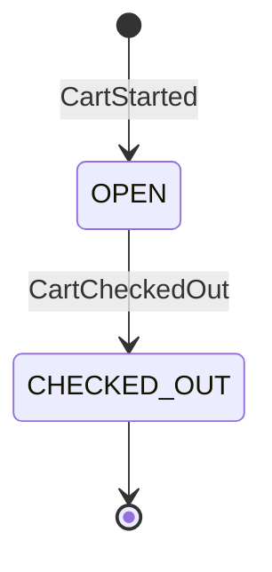
```mermaid
stateDiagram-v2
  [*] --> OPEN : CartStarted
  OPEN --> CHECKED_OUT : CartCheckedOut
  CHECKED_OUT --> [*]
```

<a id="actor-order"></a>
#### 🎭 Actor: `Order`

_🧩 aggregate_ — A single order through its lifecycle. Born from OrderPlaced (delivered by PlaceOrderProcess and recorded here), then driven to a terminal state.

| Receives | Emits → | Throws |
| --- | --- | --- |
| [⚡ `OrderPlaced`](#event-orderplaced) | [⚡ `OrderPlaced`](#event-orderplaced), ⏰ schedules `OrderAcceptanceTimedOut` | — |
| [📩 `PlaceReplacementOrder`](#command-placereplacementorder) | [⚡ `OrderPlaced`](#event-orderplaced), ⏰ schedules `OrderAcceptanceTimedOut` | [⛔ `OrderNotFound`](#error-ordernotfound) |
| [📩 `AcceptOrder`](#command-acceptorder) | [⚡ `OrderAcceptedByRestaurant`](#event-orderacceptedbyrestaurant) | [⛔ `OrderNotFound`](#error-ordernotfound), [⛔ `InvalidOrderStatus`](#error-invalidorderstatus) |
| [📩 `StartPreparation`](#command-startpreparation) | [⚡ `OrderPreparationStarted`](#event-orderpreparationstarted) | [⛔ `OrderNotFound`](#error-ordernotfound), [⛔ `InvalidOrderStatus`](#error-invalidorderstatus) |
| [📩 `MarkOrderReady`](#command-markorderready) | [⚡ `OrderMarkedReady`](#event-ordermarkedready) | [⛔ `OrderNotFound`](#error-ordernotfound), [⛔ `InvalidOrderStatus`](#error-invalidorderstatus) |
| [📩 `MarkOrderDelivered`](#command-markorderdelivered) | [⚡ `OrderDelivered`](#event-orderdelivered), ⏰ schedules `OrderExpired` | [⛔ `OrderNotFound`](#error-ordernotfound), [⛔ `InvalidOrderStatus`](#error-invalidorderstatus) |
| [📩 `RejectOrder`](#command-rejectorder) | [⚡ `OrderRejectedByRestaurant`](#event-orderrejectedbyrestaurant), ⏰ schedules `OrderExpired` | [⛔ `OrderNotFound`](#error-ordernotfound), [⛔ `InvalidOrderStatus`](#error-invalidorderstatus) |
| [📩 `CancelOrderByCustomer`](#command-cancelorderbycustomer) | [⚡ `OrderCancelledByCustomer`](#event-ordercancelledbycustomer), ⏰ schedules `OrderExpired` | [⛔ `OrderNotFound`](#error-ordernotfound), [⛔ `InvalidOrderStatus`](#error-invalidorderstatus) |
| [📩 `CancelOrderByRestaurant`](#command-cancelorderbyrestaurant) | [⚡ `OrderCancelledByRestaurant`](#event-ordercancelledbyrestaurant), ⏰ schedules `OrderExpired` | [⛔ `OrderNotFound`](#error-ordernotfound), [⛔ `InvalidOrderStatus`](#error-invalidorderstatus) |
| [📩 `RateOrder`](#command-rateorder) | [⚡ `OrderRated`](#event-orderrated) | [⛔ `OrderNotFound`](#error-ordernotfound), [⛔ `InvalidOrderStatus`](#error-invalidorderstatus), [⛔ `OrderAlreadyRated`](#error-orderalreadyrated) |
| [📩 `RateRestaurant`](#command-raterestaurant) | [⚡ `RestaurantRated`](#event-restaurantrated) | [⛔ `OrderNotFound`](#error-ordernotfound), [⛔ `InvalidOrderStatus`](#error-invalidorderstatus), [⛔ `RestaurantAlreadyRated`](#error-restaurantalreadyrated) |
| [📩 `RecordDeliverySatisfaction`](#command-recorddeliverysatisfaction) | [⚡ `DeliverySatisfactionRecorded`](#event-deliverysatisfactionrecorded) | [⛔ `OrderNotFound`](#error-ordernotfound), [⛔ `InvalidOrderStatus`](#error-invalidorderstatus), [⛔ `DeliverySatisfactionAlreadyRecorded`](#error-deliverysatisfactionalreadyrecorded) |
| [📩 `TipOrder`](#command-tiporder) | [⚡ `OrderTipped`](#event-ordertipped) | [⛔ `OrderNotFound`](#error-ordernotfound), [⛔ `InvalidOrderStatus`](#error-invalidorderstatus), [⛔ `InvalidTipRecipient`](#error-invalidtiprecipient) |
| [📩 `RequestRefund`](#command-requestrefund) | [⚡ `RefundRequested`](#event-refundrequested) | [⛔ `OrderNotFound`](#error-ordernotfound), [⛔ `InvalidOrderStatus`](#error-invalidorderstatus) |
| ⏰ `OrderExpired` _(reminder)_ | [⚡ `OrderExpired`](#event-orderexpired) | — |
| ⏰ `OrderAcceptanceTimedOut` _(reminder)_ | [⚡ `OrderAcceptanceTimedOut`](#event-orderacceptancetimedout), ⏰ schedules `OrderExpired` | — |

Reminders (self-scheduled facts — ADR-20260731-214500):

| Reminder | Payload | After | Reschedule |
| --- | --- | --- | --- |
| ⏰ `OrderExpired` | [⚡ `OrderExpired`](#event-orderexpired) | ⚙️ `ORDER_RETENTION_WINDOW_DAYS` | in-place |
| ⏰ `OrderAcceptanceTimedOut` | [⚡ `OrderAcceptanceTimedOut`](#event-orderacceptancetimedout) | ⚙️ `ORDER_ACCEPTANCE_TIMEOUT_SECONDS` | keep |

Deletion (declarative, generic engine — ADR-20260731-214500):

| On | Window | Cancelled on | Match |
| --- | --- | --- | --- |
| [⚡ `OrderExpired`](#event-orderexpired) | _immediate (propagation)_ | — | [⚡ `OrderExpired`.`orderId`](#event-orderexpired--orderid) ↔ `state.orderId` |
- **Receipt**: [⚡ `OrderDeleted`](#event-orderdeleted)

Lifecycle (generated from the declared state machine):

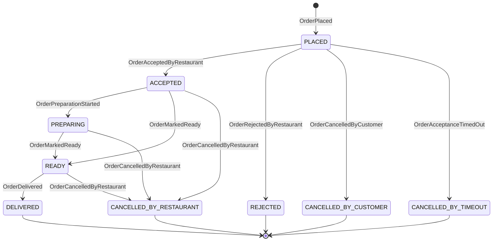
```mermaid
stateDiagram-v2
  [*] --> PLACED : OrderPlaced
  PLACED --> ACCEPTED : OrderAcceptedByRestaurant
  ACCEPTED --> PREPARING : OrderPreparationStarted
  ACCEPTED --> READY : OrderMarkedReady
  PREPARING --> READY : OrderMarkedReady
  READY --> DELIVERED : OrderDelivered
  PLACED --> REJECTED : OrderRejectedByRestaurant
  PLACED --> CANCELLED_BY_CUSTOMER : OrderCancelledByCustomer
  ACCEPTED --> CANCELLED_BY_RESTAURANT : OrderCancelledByRestaurant
  PREPARING --> CANCELLED_BY_RESTAURANT : OrderCancelledByRestaurant
  READY --> CANCELLED_BY_RESTAURANT : OrderCancelledByRestaurant
  PLACED --> CANCELLED_BY_TIMEOUT : OrderAcceptanceTimedOut
  DELIVERED --> [*]
  REJECTED --> [*]
  CANCELLED_BY_CUSTOMER --> [*]
  CANCELLED_BY_RESTAURANT --> [*]
  CANCELLED_BY_TIMEOUT --> [*]
```

<a id="actor-reclamation"></a>
#### 🎭 Actor: `Reclamation`

_🧩 aggregate_ — Customer claim/dispute over a delivered order; id = reclamationId (its own identity, correlated to an orderId — MULTIPLE reclamations may exist per order, #153). OpenReclamation is its birth; it then moves through OPEN -> RESOLVED/REJECTED, and a decided reclamation may be reopened back to OPEN. This slice is the lifecycle only: ReclamationResolved records the DECISION (+ amount for a PARTIAL_REFUND) so the downstream refund/credit/replacement slices react later; the aggregate performs no money-move. ReclamationOpened carries customerId/restaurantId (client-supplied, like OrderPlaced) so the View_Reclamation read model can scope "my claims" and the restaurant's claims queue (#154). FOLLOW-UP (NOT enforced yet): the 14-day window and order-eligibility (order exists/DELIVERED) are cross-aggregate/temporal invariants that belong in the APPLICATION layer (reading the order's delivered-at vs now). They are DEFERRED because the pure command-handler signature has no clock seam — a wall-clock stamp in a handler would break command→event determinism (see report_delivery_issue), and the order's delivered-at is event-envelope metadata not surfaced in the Order fold state. The DELIVERED-eligibility half is a clean cross-aggregate read (fold the Order stream, as require_order does); the 14-day-window half needs an injected clock that does not exist yet. Kept together as one follow-up rather than shipping a half-guard with unenforceable errors/rules (#151).


| Receives | Emits → | Throws |
| --- | --- | --- |
| [📩 `OpenReclamation`](#command-openreclamation) | [⚡ `ReclamationOpened`](#event-reclamationopened) | [⛔ `ReclamationAlreadyExists`](#error-reclamationalreadyexists) |
| [📩 `ResolveReclamation`](#command-resolvereclamation) | [⚡ `ReclamationResolved`](#event-reclamationresolved) | [⛔ `ReclamationNotFound`](#error-reclamationnotfound), [⛔ `ReclamationNotOpen`](#error-reclamationnotopen), [⛔ `PartialRefundAmountRequired`](#error-partialrefundamountrequired) |
| [📩 `RejectReclamation`](#command-rejectreclamation) | [⚡ `ReclamationRejected`](#event-reclamationrejected) | [⛔ `ReclamationNotFound`](#error-reclamationnotfound), [⛔ `ReclamationNotOpen`](#error-reclamationnotopen), [⛔ `RejectionReasonRequired`](#error-rejectionreasonrequired) |
| [📩 `ReopenReclamation`](#command-reopenreclamation) | [⚡ `ReclamationReopened`](#event-reclamationreopened) | [⛔ `ReclamationNotFound`](#error-reclamationnotfound), [⛔ `ReclamationNotReopenable`](#error-reclamationnotreopenable) |
| [📩 `AttachReclamationEvidence`](#command-attachreclamationevidence) | [⚡ `ReclamationEvidenceAttached`](#event-reclamationevidenceattached) | [⛔ `ReclamationNotFound`](#error-reclamationnotfound) |

Lifecycle (generated from the declared state machine):

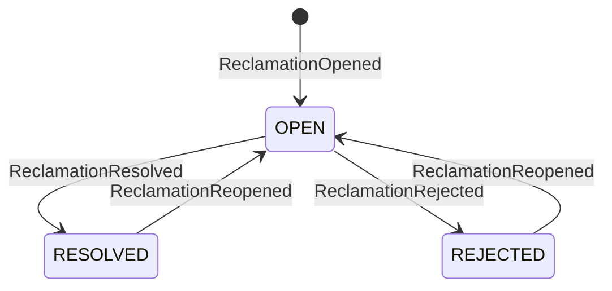
```mermaid
stateDiagram-v2
  [*] --> OPEN : ReclamationOpened
  OPEN --> RESOLVED : ReclamationResolved
  OPEN --> REJECTED : ReclamationRejected
  RESOLVED --> OPEN : ReclamationReopened
  REJECTED --> OPEN : ReclamationReopened
```

<a id="actor-placeorderprocess"></a>
#### 🎭 Actor: `PlaceOrderProcess`

_⚙️ process manager_ — The checkout saga (ADR-0004, acceptance-first ADR-20260720-015500): PlaceOrder validates the cart against the live catalog, prices server-side, creates the Stripe PaymentIntent (manual capture, ADR-20260808-195315 s1.2) and freezes the checkout as PaymentIntentCreated -- the ORDER IS NOT PLACED YET. The order materializes when Stripe confirms the AUTHORIZATION (funds held, not captured): the PaymentAuthorized reaction re-materializes the frozen checkout from PaymentIntentCreated's log (no external store) and emits OrderPlaced idempotently; capture happens on fulfilment, driven by PaymentSettlementProcess. A PaymentFailed reaction records the outcome on the process state; the customer retries by resubmitting checkout.


| Receives | Emits → | Throws |
| --- | --- | --- |
| [📩 `PlaceOrder`](#command-placeorder) | [⚡ `PaymentIntentCreated`](#event-paymentintentcreated) | [⛔ `CartNotFound`](#error-cartnotfound), [⛔ `CartNotOpen`](#error-cartnotopen), [⛔ `CartEmpty`](#error-cartempty), [⛔ `RestaurantNotFound`](#error-restaurantnotfound), [⛔ `RestaurantPaused`](#error-restaurantpaused), [⛔ `CannotOrderTestRestaurant`](#error-cannotordertestrestaurant), [⛔ `OutsideServiceHours`](#error-outsideservicehours), [⛔ `DeliveryAddressRequired`](#error-deliveryaddressrequired), [⛔ `OutsideDeliveryArea`](#error-outsidedeliveryarea), [⛔ `PriceMismatch`](#error-pricemismatch), [⛔ `PriceUnresolvable`](#error-priceunresolvable), [⛔ `PaymentDeclined`](#error-paymentdeclined) |
| [⚡ `PaymentAuthorized`](#event-paymentauthorized) | [⚡ `OrderPlaced`](#event-orderplaced) | — |
| [⚡ `PaymentFailed`](#event-paymentfailed) | _Inbound Stripe fact: the failure lands on the process state; the customer's resubmit is the retry._ | — |

Sequence (generated from the typed steps):

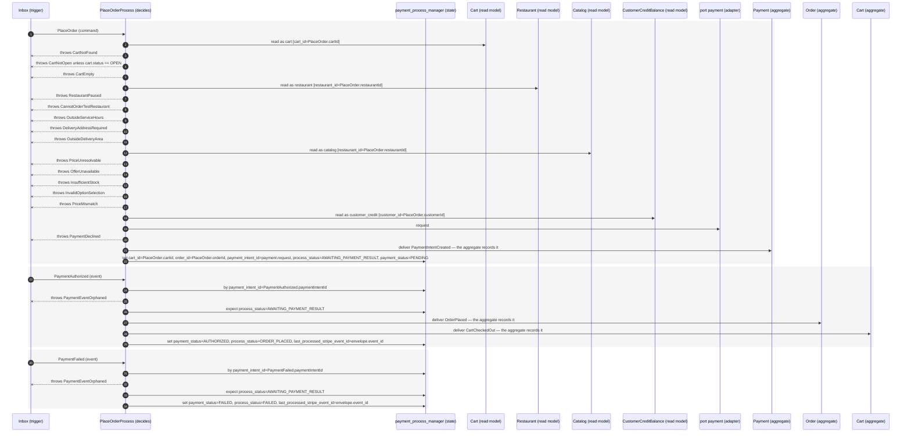
```mermaid
sequenceDiagram
  autonumber
  participant IN as Inbox (trigger)
  participant PM as PlaceOrderProcess (decides)
  participant ST as payment_process_manager (state)
  participant RM_Cart as Cart (read model)
  participant RM_Restaurant as Restaurant (read model)
  participant RM_Catalog as Catalog (read model)
  participant RM_CustomerCreditBalance as CustomerCreditBalance (read model)
  participant PT_payment as port payment (adapter)
  participant AG_Payment as Payment (aggregate)
  participant AG_Order as Order (aggregate)
  participant AG_Cart as Cart (aggregate)
  rect rgb(245,245,245)
  IN->>PM: PlaceOrder (command)
  PM->>RM_Cart: read as cart [cart_id=PlaceOrder.cartId]
  PM--xIN: throws CartNotFound
  PM--xIN: throws CartNotOpen unless cart.status == OPEN
  PM--xIN: throws CartEmpty
  PM->>RM_Restaurant: read as restaurant [restaurant_id=PlaceOrder.restaurantId]
  PM--xIN: throws RestaurantPaused
  PM--xIN: throws CannotOrderTestRestaurant
  PM--xIN: throws OutsideServiceHours
  PM--xIN: throws DeliveryAddressRequired
  PM--xIN: throws OutsideDeliveryArea
  PM->>RM_Catalog: read as catalog [restaurant_id=PlaceOrder.restaurantId]
  PM--xIN: throws PriceUnresolvable
  PM--xIN: throws OfferUnavailable
  PM--xIN: throws InsufficientStock
  PM--xIN: throws InvalidOptionSelection
  PM--xIN: throws PriceMismatch
  PM->>RM_CustomerCreditBalance: read as customer_credit [customer_id=PlaceOrder.customerId]
  PM->>PT_payment: request
  PM--xIN: throws PaymentDeclined
  PM->>AG_Payment: deliver PaymentIntentCreated — the aggregate records it
  PM->>ST: set cart_id=PlaceOrder.cartId, order_id=PlaceOrder.orderId, payment_intent_id=payment.request, process_status=AWAITING_PAYMENT_RESULT, payment_status=PENDING
  end
  rect rgb(245,245,245)
  IN->>PM: PaymentAuthorized (event)
  PM->>ST: by payment_intent_id=PaymentAuthorized.paymentIntentId
  PM--xIN: throws PaymentEventOrphaned
  PM->>ST: expect process_status=AWAITING_PAYMENT_RESULT
  PM->>AG_Order: deliver OrderPlaced — the aggregate records it
  PM->>AG_Cart: deliver CartCheckedOut — the aggregate records it
  PM->>ST: set payment_status=AUTHORIZED, process_status=ORDER_PLACED, last_processed_stripe_event_id=envelope.event_id
  end
  rect rgb(245,245,245)
  IN->>PM: PaymentFailed (event)
  PM->>ST: by payment_intent_id=PaymentFailed.paymentIntentId
  PM--xIN: throws PaymentEventOrphaned
  PM->>ST: expect process_status=AWAITING_PAYMENT_RESULT
  PM->>ST: set payment_status=FAILED, process_status=FAILED, last_processed_stripe_event_id=envelope.event_id
  end
```

<a id="actor-payment"></a>
#### 🎭 Actor: `Payment`

_🧩 aggregate_ — A payment for an order, driven to a terminal state. Born from PaymentIntentCreated (emitted by PlaceOrderProcess), authorized at checkout confirmation, captured on fulfilment (ADR-20260808-195315 §1.2) or released on abort.

| Receives | Emits → | Throws |
| --- | --- | --- |
| [⚡ `PaymentIntentCreated`](#event-paymentintentcreated) | [⚡ `PaymentIntentCreated`](#event-paymentintentcreated) | — |
| [⚡ `PaymentAuthorized`](#event-paymentauthorized) | [⚡ `PaymentAuthorized`](#event-paymentauthorized) | — |
| [⚡ `PaymentCaptured`](#event-paymentcaptured) | [⚡ `PaymentCaptured`](#event-paymentcaptured) | — |
| [⚡ `PaymentCaptureFailed`](#event-paymentcapturefailed) | [⚡ `PaymentCaptureFailed`](#event-paymentcapturefailed) | — |
| [⚡ `PaymentReleased`](#event-paymentreleased) | [⚡ `PaymentReleased`](#event-paymentreleased) | — |
| [⚡ `PaymentFailed`](#event-paymentfailed) | [⚡ `PaymentFailed`](#event-paymentfailed) | — |
| [⚡ `PaymentRefunded`](#event-paymentrefunded) | [⚡ `PaymentRefunded`](#event-paymentrefunded) | — |
| [⚡ `RefundOpened`](#event-refundopened) | [⚡ `RefundOpened`](#event-refundopened) | — |
| [⚡ `RefundApproved`](#event-refundapproved) | [⚡ `RefundApproved`](#event-refundapproved) | — |
| [⚡ `RefundDenied`](#event-refunddenied) | [⚡ `RefundDenied`](#event-refunddenied) | — |

Lifecycle (generated from the declared state machine):

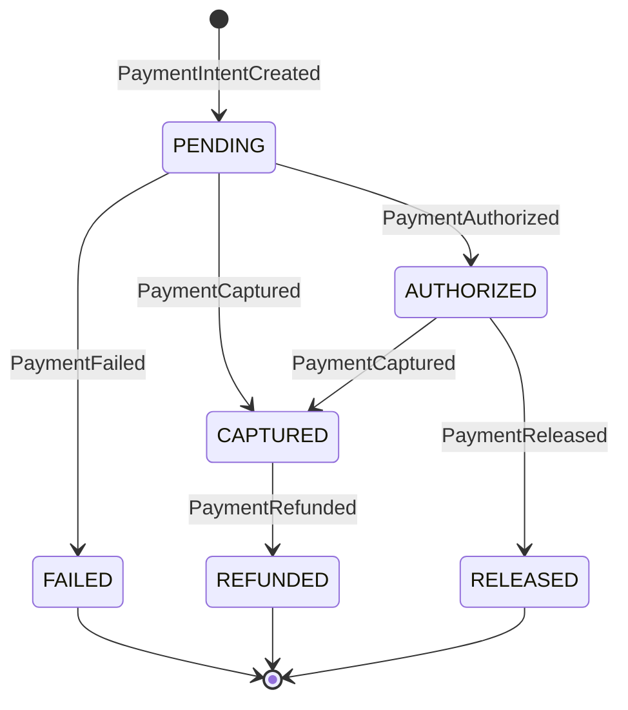
```mermaid
stateDiagram-v2
  [*] --> PENDING : PaymentIntentCreated
  PENDING --> AUTHORIZED : PaymentAuthorized
  PENDING --> CAPTURED : PaymentCaptured
  AUTHORIZED --> CAPTURED : PaymentCaptured
  PENDING --> FAILED : PaymentFailed
  AUTHORIZED --> RELEASED : PaymentReleased
  CAPTURED --> REFUNDED : PaymentRefunded
  FAILED --> [*]
  REFUNDED --> [*]
  RELEASED --> [*]
```

<a id="actor-customercredit"></a>
#### 🎭 Actor: `CustomerCredit`

_🧩 aggregate_ — A per-customer store-credit ledger; id = customerId (the aggregate identity IS the customer, like a Prospect is keyed by its RestaurantId). Credits (goodwill, from a resolved claim) and debits (spent at checkout) are recorded as facts on the customer's ledger stream; the AVAILABLE BALANCE is a fold over them (granted − consumed, never negative). No status lifecycle — a ledger has a balance, not a state. GrantCustomerCredit is idempotent per reclamationId (at most one grant per resolved claim), so a re-delivered ReclamationResolved from the ReclamationProcess saga never double-grants (ADR-20260726-163737, #158). Both commands are saga-/checkout-driven (no public GraphQL mutation).


| Receives | Emits → | Throws |
| --- | --- | --- |
| [📩 `GrantCustomerCredit`](#command-grantcustomercredit) | [⚡ `CustomerCreditGranted`](#event-customercreditgranted) | — |
| [📩 `ConsumeCustomerCredit`](#command-consumecustomercredit) | [⚡ `CustomerCreditConsumed`](#event-customercreditconsumed) | [⛔ `InsufficientCustomerCredit`](#error-insufficientcustomercredit) |

<a id="actor-refundprocess"></a>
#### 🎭 Actor: `RefundProcess`

_⚙️ process manager_ — The refund saga: records the staff decision on an OPEN refund (RefundOpened is emitted by the order-lifecycle commands -- RejectOrder, CancelOrder -- not by this saga's receives), drives the Stripe refund on approval, and closes idempotently when Stripe reports the PaymentRefunded fact. Approval and denial are restaurant/admin decisions on a pending refund; anything else is RefundNotPending.


| Receives | Emits → | Throws |
| --- | --- | --- |
| [📩 `ApproveRefund`](#command-approverefund) | [⚡ `RefundApproved`](#event-refundapproved) | [⛔ `RefundNotPending`](#error-refundnotpending) |
| [📩 `DenyRefund`](#command-denyrefund) | [⚡ `RefundDenied`](#event-refunddenied) | [⛔ `RefundNotPending`](#error-refundnotpending) |
| [⚡ `PaymentRefunded`](#event-paymentrefunded) | _Inbound Stripe fact: close the refund saga idempotently._ | — |

Sequence (generated from the typed steps):

```mermaid
sequenceDiagram
  autonumber
  participant IN as Inbox (trigger)
  participant PM as RefundProcess (decides)
  participant ST as refund_process_manager (state)
  participant RM_OrderTracking as OrderTracking (read model)
  participant AG_Payment as Payment (aggregate)
  participant PT_payment as port payment (adapter)
  rect rgb(245,245,245)
  IN->>PM: OrderRejectedByRestaurant (event)
  PM->>RM_OrderTracking: read as order [order_id=OrderRejectedByRestaurant.orderId]
  Note over PM: skip unless order.payment_status == CAPTURED
  PM->>AG_Payment: deliver RefundOpened — the aggregate records it
  PM->>ST: set order_id=OrderRejectedByRestaurant.orderId, payment_intent_id=order.payment_intent_id, process_status=PENDING_APPROVAL, reason=OrderRejectedByRestaurant.reason
  end
  rect rgb(245,245,245)
  IN->>PM: OrderCancelledByCustomer (event)
  PM->>RM_OrderTracking: read as order [order_id=OrderCancelledByCustomer.orderId]
  Note over PM: skip unless order.payment_status == CAPTURED
  PM->>AG_Payment: deliver RefundOpened — the aggregate records it
  PM->>ST: set order_id=OrderCancelledByCustomer.orderId, payment_intent_id=order.payment_intent_id, process_status=PENDING_APPROVAL, reason=OrderCancelledByCustomer.reason
  end
  rect rgb(245,245,245)
  IN->>PM: OrderCancelledByRestaurant (event)
  PM->>RM_OrderTracking: read as order [order_id=OrderCancelledByRestaurant.orderId]
  Note over PM: skip unless order.payment_status == CAPTURED
  PM->>AG_Payment: deliver RefundOpened — the aggregate records it
  PM->>ST: set order_id=OrderCancelledByRestaurant.orderId, payment_intent_id=order.payment_intent_id, process_status=PENDING_APPROVAL, reason=OrderCancelledByRestaurant.reason
  end
  rect rgb(245,245,245)
  IN->>PM: RefundRequested (event)
  PM->>RM_OrderTracking: read as order [order_id=RefundRequested.orderId]
  Note over PM: skip unless order.payment_status == CAPTURED
  PM->>AG_Payment: deliver RefundOpened — the aggregate records it
  PM->>ST: set order_id=RefundRequested.orderId, payment_intent_id=order.payment_intent_id, process_status=PENDING_APPROVAL, reason=RefundRequested.reason
  end
  rect rgb(245,245,245)
  IN->>PM: ApproveRefund (command)
  PM->>ST: by order_id=ApproveRefund.orderId
  PM--xIN: throws RefundNotPending unless state.process_status == PENDING_APPROVAL
  PM->>PT_payment: refund
  PM->>AG_Payment: deliver RefundApproved — the aggregate records it
  PM->>ST: set process_status=APPROVED_AWAITING_SETTLEMENT, approved_amount_cents=ApproveRefund.amount, reason=ApproveRefund.reason
  end
  rect rgb(245,245,245)
  IN->>PM: DenyRefund (command)
  PM->>ST: by order_id=DenyRefund.orderId
  PM--xIN: throws RefundNotPending unless state.process_status == PENDING_APPROVAL
  PM->>AG_Payment: deliver RefundDenied — the aggregate records it
  PM->>ST: set process_status=DENIED, reason=DenyRefund.reason
  end
  rect rgb(245,245,245)
  IN->>PM: PaymentRefunded (event)
  PM->>ST: by order_id=PaymentRefunded.orderId; expect process_status=APPROVED_AWAITING_SETTLEMENT
  PM->>ST: set refund_id=PaymentRefunded.refundId, process_status=REFUNDED
  end
```

<a id="actor-placeorderprocess"></a>
#### 🎭 Actor: `PlaceOrderProcess`

_⚙️ process manager_ — The checkout saga. On PlaceOrder: reads the OPEN cart, re-validates and prices it server-side against the live catalog, creates the Stripe PaymentIntent (manual capture, ADR-20260808-195315 §1.2), and freezes the full priced checkout onto PaymentIntentCreated (ADR-20260719-014434) — the state row (one live run per cart) is what prevents concurrent checkouts of the same cart. On PaymentAuthorized (funds held, not captured): materializes the Order and closes the cart from the frozen snapshot alone — capture happens later, on fulfilment, driven by PaymentSettlementProcess. On PaymentFailed: resolves the run; the cart stays OPEN.


| Receives | Emits → | Throws |
| --- | --- | --- |
| [📩 `PlaceOrder`](#command-placeorder) | [⚡ `PaymentIntentCreated`](#event-paymentintentcreated) | [⛔ `CartNotFound`](#error-cartnotfound), [⛔ `CartNotOpen`](#error-cartnotopen), [⛔ `CartEmpty`](#error-cartempty), [⛔ `RestaurantPaused`](#error-restaurantpaused), [⛔ `CannotOrderTestRestaurant`](#error-cannotordertestrestaurant), [⛔ `OutsideServiceHours`](#error-outsideservicehours), [⛔ `DeliveryAddressRequired`](#error-deliveryaddressrequired), [⛔ `OutsideDeliveryArea`](#error-outsidedeliveryarea), [⛔ `PriceUnresolvable`](#error-priceunresolvable), [⛔ `OfferUnavailable`](#error-offerunavailable), [⛔ `InsufficientStock`](#error-insufficientstock), [⛔ `InvalidOptionSelection`](#error-invalidoptionselection), [⛔ `PriceMismatch`](#error-pricemismatch), [⛔ `PaymentDeclined`](#error-paymentdeclined) |
| [⚡ `PaymentAuthorized`](#event-paymentauthorized) | [⚡ `OrderPlaced`](#event-orderplaced), [⚡ `CartCheckedOut`](#event-cartcheckedout) | [⛔ `PaymentEventOrphaned`](#error-paymenteventorphaned) |
| [⚡ `PaymentFailed`](#event-paymentfailed) | _Payment failed: resolve the run; no order is placed and the cart stays OPEN._ | [⛔ `PaymentEventOrphaned`](#error-paymenteventorphaned) |

Sequence (generated from the typed steps):


```mermaid
sequenceDiagram
  autonumber
  participant IN as Inbox (trigger)
  participant PM as PlaceOrderProcess (decides)
  participant ST as payment_process_manager (state)
  participant RM_Cart as Cart (read model)
  participant RM_Restaurant as Restaurant (read model)
  participant RM_Catalog as Catalog (read model)
  participant RM_CustomerCreditBalance as CustomerCreditBalance (read model)
  participant PT_payment as port payment (adapter)
  participant AG_Payment as Payment (aggregate)
  participant AG_Order as Order (aggregate)
  participant AG_Cart as Cart (aggregate)
  rect rgb(245,245,245)
  IN->>PM: PlaceOrder (command)
  PM->>RM_Cart: read as cart [cart_id=PlaceOrder.cartId]
  PM--xIN: throws CartNotFound
  PM--xIN: throws CartNotOpen unless cart.status == OPEN
  PM--xIN: throws CartEmpty
  PM->>RM_Restaurant: read as restaurant [restaurant_id=PlaceOrder.restaurantId]
  PM--xIN: throws RestaurantPaused
  PM--xIN: throws CannotOrderTestRestaurant
  PM--xIN: throws OutsideServiceHours
  PM--xIN: throws DeliveryAddressRequired
  PM--xIN: throws OutsideDeliveryArea
  PM->>RM_Catalog: read as catalog [restaurant_id=PlaceOrder.restaurantId]
  PM--xIN: throws PriceUnresolvable
  PM--xIN: throws OfferUnavailable
  PM--xIN: throws InsufficientStock
  PM--xIN: throws InvalidOptionSelection
  PM--xIN: throws PriceMismatch
  PM->>RM_CustomerCreditBalance: read as customer_credit [customer_id=PlaceOrder.customerId]
  PM->>PT_payment: request
  PM--xIN: throws PaymentDeclined
  PM->>AG_Payment: deliver PaymentIntentCreated — the aggregate records it
  PM->>ST: set cart_id=PlaceOrder.cartId, order_id=PlaceOrder.orderId, payment_intent_id=payment.request, process_status=AWAITING_PAYMENT_RESULT, payment_status=PENDING
  end
  rect rgb(245,245,245)
  IN->>PM: PaymentAuthorized (event)
  PM->>ST: by payment_intent_id=PaymentAuthorized.paymentIntentId
  PM--xIN: throws PaymentEventOrphaned
  PM->>ST: expect process_status=AWAITING_PAYMENT_RESULT
  PM->>AG_Order: deliver OrderPlaced — the aggregate records it
  PM->>AG_Cart: deliver CartCheckedOut — the aggregate records it
  PM->>ST: set payment_status=AUTHORIZED, process_status=ORDER_PLACED, last_processed_stripe_event_id=envelope.event_id
  end
  rect rgb(245,245,245)
  IN->>PM: PaymentFailed (event)
  PM->>ST: by payment_intent_id=PaymentFailed.paymentIntentId
  PM--xIN: throws PaymentEventOrphaned
  PM->>ST: expect process_status=AWAITING_PAYMENT_RESULT
  PM->>ST: set payment_status=FAILED, process_status=FAILED, last_processed_stripe_event_id=envelope.event_id
  end
```

<a id="actor-reclamationprocess"></a>
#### 🎭 Actor: `ReclamationProcess`

_⚙️ process manager_ — Reacts to a resolved reclamation (ReclamationResolved) and binds the DECISION to its money/credit automation (ADR-20260726-163737, #158). GOODWILL_CREDIT grants the claimant real store credit by sending GrantCustomerCredit to the CustomerCredit ledger (idempotent per reclamationId — the ledger dedups, so a re-delivered ReclamationResolved never double-grants; no state row needed). REFUND arm (WIRED, ADR-20260727-090000 / #207): on a FULL_REFUND / PARTIAL_REFUND resolution the saga drives the EXISTING refund path (RefundProcess) to a SETTLED Stripe refund -- the restaurant's resolution IS the approval, so the refund settles WITHOUT a separate manual ApproveRefund. In one reaction the saga reads the order (cross-aggregate, by orderId) for the captured total + payment intent, then drives RefundProcess's two application legs in order: on_refund_requested OPENS the PENDING_APPROVAL run (delivering RefundOpened to the Payment so View_PendingRefunds folds it) and then, because the resolution IS the approval, approve_refund drives the Stripe refund (delivering RefundApproved, run -> APPROVED_AWAITING_SETTLEMENT); the inbound PaymentRefunded later settles it via the normal RefundProcess leg. RefundProcess stays the ONE Stripe-driving mechanism -- nothing is duplicated. FULL_REFUND refunds the captured total; PARTIAL_REFUND the recorded amount, rejected with errors.yaml#/RefundExceedsCaptured when it exceeds the captured total (rules.yaml#/RefundResolutionCappedAtCaptured). Idempotent per reclamationId: a re-delivered resolution finds the run already APPROVED/settled (the RefundProcess state-row admission guard) and RefundOpened/RefundApproved already recorded (the Payment's own fold), so it never opens or settles a second refund. REPLACEMENT arm (WIRED, ADR-20260726-171736 / #159): on a REPLACEMENT resolution the saga places a NO-CHARGE replacement order — it reads the ORIGINAL order (cross-aggregate, by orderId) and sends PlaceReplacementOrder to the Order aggregate, which remakes the same items as a new linked order with a $0 buyer total and no paymentIntentId (OrderPlaced.replacementOf). The generated linear-branch below still isolates only the GOODWILL_CREDIT credit grant; the REPLACEMENT dispatch (a cross-aggregate read + one send, idempotent per reclamationId via a deterministic new orderId) is carried in this saga's hand-written wrapper seam (crate::process_managers::reclamation), the same seam that owns the branch decision — a 3-way credit/replacement/no-op split is not expressible in the current step DSL, so the command is declared on this leg's `sends:` instead of as a step. The DOOR that command goes through is gated (#595, ADR-20260829-230418 C2): with configuration.yaml#/ROUTE_REPLACEMENT_BIRTH_THROUGH_LANE ON the seam stages a COMMAND lane enqueue and the Order's OWN lane worker runs PlaceReplacementOrder — so the birth is appended by the aggregate that owns the fact, and the delivery arms the OrderAcceptanceTimedOut reminder this actor already declares for Order/PlaceReplacementOrder. OFF (the default) keeps the legacy in-process call, which writes Order-{id} from the saga with no transaction, no lane and no acceptance clock.


| Receives | Emits → | Throws |
| --- | --- | --- |
| [⚡ `ReclamationResolved`](#event-reclamationresolved) | [⚡ `CustomerCreditGranted`](#event-customercreditgranted), [⚡ `RefundOpened`](#event-refundopened), [⚡ `RefundApproved`](#event-refundapproved), [⚡ `OrderPlaced`](#event-orderplaced) | [⛔ `RefundExceedsCaptured`](#error-refundexceedscaptured) |

Sequence (generated from the typed steps):

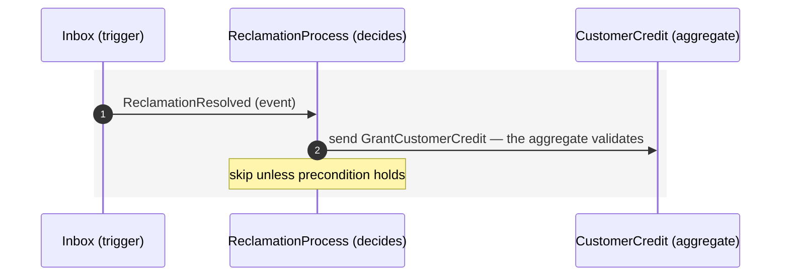
```mermaid
sequenceDiagram
  autonumber
  participant IN as Inbox (trigger)
  participant PM as ReclamationProcess (decides)
  participant AG_CustomerCredit as CustomerCredit (aggregate)
  rect rgb(245,245,245)
  IN->>PM: ReclamationResolved (event)
  PM->>AG_CustomerCredit: send GrantCustomerCredit — the aggregate validates
  Note over PM: skip unless precondition holds
  end
```

<a id="actor-paymentsettlementprocess"></a>
#### 🎭 Actor: `PaymentSettlementProcess`

_⚙️ process manager_ — Drives an AUTHORIZED payment to its settlement (ADR-20260808-195315 §1.2/§1.3, the authorize-then-capture posture): CAPTURE on fulfilment — OrderDelivered is the handover fact for BOTH service types (DELIVERY hands over at the door, COLLECTION at the counter; the Order lifecycle has one READY→DELIVERED transition) — and RELEASE (Stripe void of the uncaptured intent) on rejection/cancellation: "no need to refund because no capture". The recorded third arm — at-table service captures IN ADVANCE at checkout — is not built (no such service type yet); when the acceptance-timeout auto-cancel lands (§1.3) its cancellation fact rides the same release arms. Stateless (no state table): idempotency is the OrderTracking payment_status guard plus the adapter's deterministic Stripe idempotency keys (capture:{intentId} / release:{intentId}, ADR-20260801-023000) — a redelivered trigger lands on the SAME gateway object. Settlement always arrives asynchronously as the inbound facts the Payment aggregate records (PaymentCaptured / PaymentReleased), never as these calls' return values. The capture-failure branch — a deterministic decline or an unreachable gateway maps the call's outcome to a recorded PaymentCaptureFailed with a typed reason + the paging counter — is carried in the hand-written wrapper seam (crate::process_managers::payment_settlement), the same seam pattern as ReclamationProcess: "on call error, deliver X" is not expressible in the step DSL. The release arms need no failure fact: a failed void self-heals — the hold expires on its own within ~7 days — so the outcome is a counter (payment_release_failed_total), not a page. Post-capture rejection/cancellation stays RefundProcess's job (its payment_status = CAPTURED guards): the two sagas partition the same triggers by payment state, capture-side here, refund-side there.


| Receives | Emits → | Throws |
| --- | --- | --- |
| [⚡ `OrderDelivered`](#event-orderdelivered) | [⚡ `PaymentCaptureFailed`](#event-paymentcapturefailed) | — |
| [⚡ `OrderRejectedByRestaurant`](#event-orderrejectedbyrestaurant) | _The restaurant rejected the order before capture — release the hold (Stripe void); the settled fact arrives as inbound PaymentReleased. The acceptance-timeout auto-cancel (§1.3, unbuilt) rides this same arm._ | — |
| [⚡ `OrderCancelledByCustomer`](#event-ordercancelledbycustomer) | _The customer cancelled before capture — release the hold._ | — |
| [⚡ `OrderCancelledByRestaurant`](#event-ordercancelledbyrestaurant) | _The restaurant cancelled after acceptance but before capture — release the hold._ | — |

Sequence (generated from the typed steps):

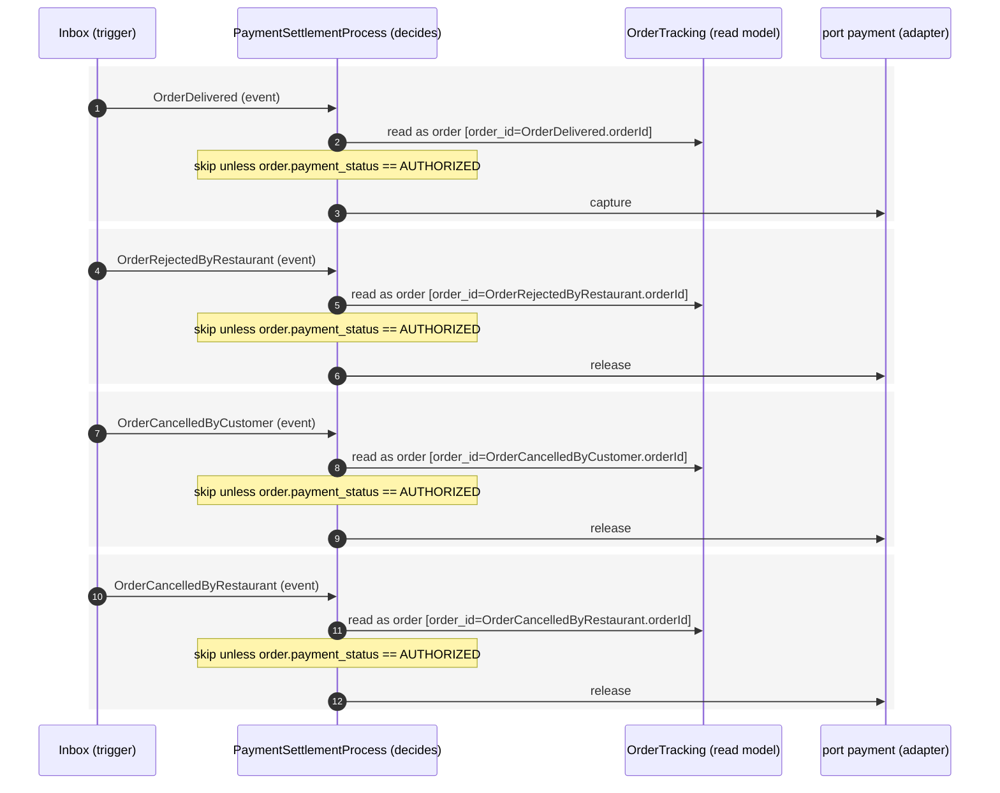
```mermaid
sequenceDiagram
  autonumber
  participant IN as Inbox (trigger)
  participant PM as PaymentSettlementProcess (decides)
  participant RM_OrderTracking as OrderTracking (read model)
  participant PT_payment as port payment (adapter)
  rect rgb(245,245,245)
  IN->>PM: OrderDelivered (event)
  PM->>RM_OrderTracking: read as order [order_id=OrderDelivered.orderId]
  Note over PM: skip unless order.payment_status == AUTHORIZED
  PM->>PT_payment: capture
  end
  rect rgb(245,245,245)
  IN->>PM: OrderRejectedByRestaurant (event)
  PM->>RM_OrderTracking: read as order [order_id=OrderRejectedByRestaurant.orderId]
  Note over PM: skip unless order.payment_status == AUTHORIZED
  PM->>PT_payment: release
  end
  rect rgb(245,245,245)
  IN->>PM: OrderCancelledByCustomer (event)
  PM->>RM_OrderTracking: read as order [order_id=OrderCancelledByCustomer.orderId]
  Note over PM: skip unless order.payment_status == AUTHORIZED
  PM->>PT_payment: release
  end
  rect rgb(245,245,245)
  IN->>PM: OrderCancelledByRestaurant (event)
  PM->>RM_OrderTracking: read as order [order_id=OrderCancelledByRestaurant.orderId]
  Note over PM: skip unless order.payment_status == AUTHORIZED
  PM->>PT_payment: release
  end
```

<a id="actor-refundprocess"></a>
#### 🎭 Actor: `RefundProcess`

_⚙️ process manager_ — Approved refunds. A refundable fact (rejection, cancellation, customer request) OPENS a pending refund: RefundOpened is delivered to the Payment aggregate (so the refund queue, View_PendingRefunds, folds from the log) and the state row goes PENDING_APPROVAL; the RESTAURANT (its own orders) or an ADMIN decides with ApproveRefund / DenyRefund (authz = api.yaml roles); on approval the outbound Stripe refund is requested and the run settles when Stripe reports PaymentRefunded (the fact itself is recorded by the Payment aggregate). The refund-eligibility window is a config value enforced at approval, not a domain rule.


| Receives | Emits → | Throws |
| --- | --- | --- |
| [⚡ `OrderRejectedByRestaurant`](#event-orderrejectedbyrestaurant) | [⚡ `RefundOpened`](#event-refundopened) | — |
| [⚡ `OrderCancelledByCustomer`](#event-ordercancelledbycustomer) | [⚡ `RefundOpened`](#event-refundopened) | — |
| [⚡ `OrderCancelledByRestaurant`](#event-ordercancelledbyrestaurant) | [⚡ `RefundOpened`](#event-refundopened) | — |
| [⚡ `RefundRequested`](#event-refundrequested) | [⚡ `RefundOpened`](#event-refundopened) | — |
| [📩 `ApproveRefund`](#command-approverefund) | [⚡ `RefundApproved`](#event-refundapproved) | [⛔ `RefundNotPending`](#error-refundnotpending) |
| [📩 `DenyRefund`](#command-denyrefund) | [⚡ `RefundDenied`](#event-refunddenied) | [⛔ `RefundNotPending`](#error-refundnotpending) |
| [⚡ `PaymentRefunded`](#event-paymentrefunded) | _Stripe reported the settled refund (recorded by the Payment aggregate) — close the run. The fact is already in the log; nothing to emit.
_ | — |

Sequence (generated from the typed steps):

```mermaid
sequenceDiagram
  autonumber
  participant IN as Inbox (trigger)
  participant PM as RefundProcess (decides)
  participant ST as refund_process_manager (state)
  participant RM_OrderTracking as OrderTracking (read model)
  participant AG_Payment as Payment (aggregate)
  participant PT_payment as port payment (adapter)
  rect rgb(245,245,245)
  IN->>PM: OrderRejectedByRestaurant (event)
  PM->>RM_OrderTracking: read as order [order_id=OrderRejectedByRestaurant.orderId]
  Note over PM: skip unless order.payment_status == CAPTURED
  PM->>AG_Payment: deliver RefundOpened — the aggregate records it
  PM->>ST: set order_id=OrderRejectedByRestaurant.orderId, payment_intent_id=order.payment_intent_id, process_status=PENDING_APPROVAL, reason=OrderRejectedByRestaurant.reason
  end
  rect rgb(245,245,245)
  IN->>PM: OrderCancelledByCustomer (event)
  PM->>RM_OrderTracking: read as order [order_id=OrderCancelledByCustomer.orderId]
  Note over PM: skip unless order.payment_status == CAPTURED
  PM->>AG_Payment: deliver RefundOpened — the aggregate records it
  PM->>ST: set order_id=OrderCancelledByCustomer.orderId, payment_intent_id=order.payment_intent_id, process_status=PENDING_APPROVAL, reason=OrderCancelledByCustomer.reason
  end
  rect rgb(245,245,245)
  IN->>PM: OrderCancelledByRestaurant (event)
  PM->>RM_OrderTracking: read as order [order_id=OrderCancelledByRestaurant.orderId]
  Note over PM: skip unless order.payment_status == CAPTURED
  PM->>AG_Payment: deliver RefundOpened — the aggregate records it
  PM->>ST: set order_id=OrderCancelledByRestaurant.orderId, payment_intent_id=order.payment_intent_id, process_status=PENDING_APPROVAL, reason=OrderCancelledByRestaurant.reason
  end
  rect rgb(245,245,245)
  IN->>PM: RefundRequested (event)
  PM->>RM_OrderTracking: read as order [order_id=RefundRequested.orderId]
  Note over PM: skip unless order.payment_status == CAPTURED
  PM->>AG_Payment: deliver RefundOpened — the aggregate records it
  PM->>ST: set order_id=RefundRequested.orderId, payment_intent_id=order.payment_intent_id, process_status=PENDING_APPROVAL, reason=RefundRequested.reason
  end
  rect rgb(245,245,245)
  IN->>PM: ApproveRefund (command)
  PM->>ST: by order_id=ApproveRefund.orderId
  PM--xIN: throws RefundNotPending unless state.process_status == PENDING_APPROVAL
  PM->>PT_payment: refund
  PM->>AG_Payment: deliver RefundApproved — the aggregate records it
  PM->>ST: set process_status=APPROVED_AWAITING_SETTLEMENT, approved_amount_cents=ApproveRefund.amount, reason=ApproveRefund.reason
  end
  rect rgb(245,245,245)
  IN->>PM: DenyRefund (command)
  PM->>ST: by order_id=DenyRefund.orderId
  PM--xIN: throws RefundNotPending unless state.process_status == PENDING_APPROVAL
  PM->>AG_Payment: deliver RefundDenied — the aggregate records it
  PM->>ST: set process_status=DENIED, reason=DenyRefund.reason
  end
  rect rgb(245,245,245)
  IN->>PM: PaymentRefunded (event)
  PM->>ST: by order_id=PaymentRefunded.orderId; expect process_status=APPROVED_AWAITING_SETTLEMENT
  PM->>ST: set refund_id=PaymentRefunded.refundId, process_status=REFUNDED
  end
```

### 🗄️ Views (read models) _(8)_

<a id="view-view_deliverysatisfaction"></a>
#### 🗄️ View: `View_DeliverySatisfaction`

- **Source**: [🎭 `Order`](#actor-order) · 🔭 V1
- **Rules**: One row per order, present only once the customer has answered the survey (DeliverySatisfactionRecorded); record-once, so the fold never sees a second answer. `timeliness` is the customer's verdict (ON_TIME / ACCEPTABLE_DELAY / TOO_LATE); the restaurant reads it, filtered by restaurant_id, to weigh self-dispatch vs Captain routing.
- **Fed by**: [⚡ `DeliverySatisfactionRecorded`](#event-deliverysatisfactionrecorded)

| Column | Type | Sourced from | Constraints | Notes |
| --- | --- | --- | --- | --- |
| `order_id` | [🔤 `OrderId`](#scalar-orderid) _(derived)_ | [⚡ `DeliverySatisfactionRecorded`.`orderId`](#event-deliverysatisfactionrecorded--orderid) | PK |  |
| `restaurant_id` | [🔤 `RestaurantId`](#scalar-restaurantid) _(derived)_ | [⚡ `DeliverySatisfactionRecorded`.`restaurantId`](#event-deliverysatisfactionrecorded--restaurantid) | index |  |
| `timeliness` | [🔤 `DeliveryTimeliness`](#scalar-deliverytimeliness) | [⚡ `DeliverySatisfactionRecorded`.`timeliness`](#event-deliverysatisfactionrecorded--timeliness) | — |  |
| `reason` | [🔤 `DeliveryDissatisfactionReason`](#scalar-deliverydissatisfactionreason) | [⚡ `DeliverySatisfactionRecorded`.`reason`](#event-deliverysatisfactionrecorded--reason) | nullable |  |
| `recorded_at` | `timestamptz` | [⚡ `DeliverySatisfactionRecorded`](#event-deliverysatisfactionrecorded) | — | DeliverySatisfactionRecorded occurrence time. |
| `created_at` | `timestamptz` | ⚠️ _(none)_ | — | technical — stamped from event.occurred_at (implicit on every read model) |
| `updated_at` | `timestamptz` | ⚠️ _(none)_ | — | technical — stamped from event.occurred_at (implicit on every read model) |

<a id="view-view_reclamation"></a>
#### 🗄️ View: `View_Reclamation`

- **Source**: [🎭 `Reclamation`](#actor-reclamation) · 🔭 V1
- **Rules**: `status` is derived from the latest lifecycle event type: OPEN on Opened → RESOLVED on Resolved / REJECTED on Rejected → OPEN again on Reopened. Set-once identity fields (order_id, customer_id, restaurant_id, category, description, requested_resolution) are carried only by the ReclamationOpened birth fact. The decision fields (resolution, refund_amount_cents/currency, reject_reason, decided_at) fill in on the ReclamationResolved / ReclamationRejected fact and are null while OPEN.
- **Fed by**: [⚡ `ReclamationOpened`](#event-reclamationopened), [⚡ `ReclamationResolved`](#event-reclamationresolved), [⚡ `ReclamationRejected`](#event-reclamationrejected), [⚡ `ReclamationReopened`](#event-reclamationreopened)

| Column | Type | Sourced from | Constraints | Notes |
| --- | --- | --- | --- | --- |
| `reclamation_id` | [🔤 `ReclamationId`](#scalar-reclamationid) _(derived)_ | [⚡ `ReclamationOpened`.`reclamationId`](#event-reclamationopened--reclamationid) | PK |  |
| `order_id` | [🔤 `OrderId`](#scalar-orderid) _(derived)_ | [⚡ `ReclamationOpened`.`orderId`](#event-reclamationopened--orderid) | index |  |
| `customer_id` | [🔤 `CustomerId`](#scalar-customerid) _(derived)_ | [⚡ `ReclamationOpened`.`customerId`](#event-reclamationopened--customerid) | index |  |
| `restaurant_id` | [🔤 `RestaurantId`](#scalar-restaurantid) _(derived)_ | [⚡ `ReclamationOpened`.`restaurantId`](#event-reclamationopened--restaurantid) | index |  |
| `category` | [🔤 `ReclamationCategory`](#scalar-reclamationcategory) _(derived)_ | [⚡ `ReclamationOpened`.`category`](#event-reclamationopened--category) | — |  |
| `description` | [🔤 `ReclamationDescription`](#scalar-reclamationdescription) _(derived)_ | [⚡ `ReclamationOpened`.`description`](#event-reclamationopened--description) | — |  |
| `requested_resolution` | [🔤 `ReclamationResolution`](#scalar-reclamationresolution) | [⚡ `ReclamationOpened`.`requestedResolution`](#event-reclamationopened--requestedresolution) | nullable | The resolution the customer asked for at open time, if any. |
| `status` | [🔤 `ReclamationStatus`](#scalar-reclamationstatus) | [⚡ `ReclamationOpened`](#event-reclamationopened), [⚡ `ReclamationResolved`](#event-reclamationresolved), [⚡ `ReclamationRejected`](#event-reclamationrejected), [⚡ `ReclamationReopened`](#event-reclamationreopened) | — | Derived from the latest lifecycle event type. |
| `resolution` | [🔤 `ReclamationResolution`](#scalar-reclamationresolution) | [⚡ `ReclamationResolved`.`resolution`](#event-reclamationresolved--resolution) | nullable | The decided resolution once resolved; null while OPEN or if rejected. |
| `refund_amount_cents` | [🔤 `MoneyCents`](#scalar-moneycents) | [⚡ `ReclamationResolved`.`refundAmount`](#event-reclamationresolved--refundamount) | nullable | amountCents of ReclamationResolved.refundAmount (Money — a PARTIAL_REFUND amount); null otherwise. |
| `currency` | [🔤 `CurrencyCode`](#scalar-currencycode) | [⚡ `ReclamationResolved`.`refundAmount`](#event-reclamationresolved--refundamount) | nullable | currency of ReclamationResolved.refundAmount (Money); null unless a refund amount was recorded. |
| `reject_reason` | [🔤 `ReclamationReason`](#scalar-reclamationreason) | [⚡ `ReclamationRejected`.`reason`](#event-reclamationrejected--reason) | nullable | The reason recorded on rejection; null unless rejected. |
| `opened_at` | `timestamptz` | [⚡ `ReclamationOpened`](#event-reclamationopened) | — | occurrence: max(occurred_at) of the birth fact. |
| `decided_at` | `timestamptz` | [⚡ `ReclamationResolved`](#event-reclamationresolved), [⚡ `ReclamationRejected`](#event-reclamationrejected) | nullable | occurrence: max(occurred_at) of the latest decision (resolve/reject); null while OPEN. |
| `created_at` | `timestamptz` | ⚠️ _(none)_ | — | technical — stamped from event.occurred_at (implicit on every read model) |
| `updated_at` | `timestamptz` | ⚠️ _(none)_ | — | technical — stamped from event.occurred_at (implicit on every read model) |

<a id="view-view_pendingrefunds"></a>
#### 🗄️ View: `View_PendingRefunds`

- **Source**: [🎭 `Payment`](#actor-payment) · 🛶 V0
- **Rules**: A row exists only for a refund actually opened for decision: RefundOpened is delivered by RefundProcess ONLY when the order's payment is CAPTURED (the guard lives in the saga, so the fold needs no payment-status filter). `status` is derived from the lifecycle events: REQUESTED on RefundOpened → APPROVED on RefundApproved (Stripe refund requested) or DENIED on RefundDenied → REFUNDED on PaymentRefunded (Stripe settled). `amount_cents` is the captured order total eligible for refund; `approved_amount_cents` is the (possibly partial) approved amount, null until approved.
- **Fed by**: [⚡ `RefundOpened`](#event-refundopened), [⚡ `RefundApproved`](#event-refundapproved), [⚡ `RefundDenied`](#event-refunddenied), [⚡ `PaymentRefunded`](#event-paymentrefunded)

| Column | Type | Sourced from | Constraints | Notes |
| --- | --- | --- | --- | --- |
| `order_id` | [🔤 `OrderId`](#scalar-orderid) _(derived)_ → [🗄️ `OrderTracking`](#view-ordertracking) | [⚡ `RefundOpened`.`orderId`](#event-refundopened--orderid) | PK |  |
| `restaurant_id` | [🔤 `RestaurantId`](#scalar-restaurantid) _(derived)_ → [🗄️ `Restaurant`](#view-restaurant) | [⚡ `RefundOpened`.`restaurantId`](#event-refundopened--restaurantid) | index |  |
| `status` | [🔤 `RefundStatus`](#scalar-refundstatus) | [⚡ `RefundOpened`](#event-refundopened), [⚡ `RefundApproved`](#event-refundapproved), [⚡ `RefundDenied`](#event-refunddenied), [⚡ `PaymentRefunded`](#event-paymentrefunded) | — | Derived from the latest lifecycle event type. |
| `amount_cents` | [🔤 `MoneyCents`](#scalar-moneycents) | [⚡ `RefundOpened`.`amount`](#event-refundopened--amount) | — | amountCents of RefundOpened.amount (Money) — the captured total eligible for refund. |
| `currency` | [🔤 `CurrencyCode`](#scalar-currencycode) | [⚡ `RefundOpened`.`amount`](#event-refundopened--amount) | — | currency of RefundOpened.amount (Money). |
| `approved_amount_cents` | [🔤 `MoneyCents`](#scalar-moneycents) | [⚡ `RefundApproved`.`amount`](#event-refundapproved--amount) | nullable | amountCents of RefundApproved.amount (Money — may be partial); null until approved. |
| `reason` | `text` | [⚡ `RefundOpened`.`reason`](#event-refundopened--reason), [⚡ `RefundApproved`.`reason`](#event-refundapproved--reason), [⚡ `RefundDenied`.`reason`](#event-refunddenied--reason) | nullable | The latest recorded reason: the opening fact's, then the decision's. |
| `refund_id` | [🔤 `RefundId`](#scalar-refundid) | [⚡ `PaymentRefunded`.`refundId`](#event-paymentrefunded--refundid) | nullable | The Stripe Refund id once settled; null before PaymentRefunded. |
| `requested_at` | `timestamptz` | [⚡ `RefundOpened`](#event-refundopened) | — | RefundOpened occurrence time. |
| `decided_at` | `timestamptz` | [⚡ `RefundApproved`](#event-refundapproved), [⚡ `RefundDenied`](#event-refunddenied) | nullable | The decision's occurrence time (approval or denial); null while REQUESTED. |
| `created_at` | `timestamptz` | ⚠️ _(none)_ | — | technical — stamped from event.occurred_at (implicit on every read model) |
| `updated_at` | `timestamptz` | ⚠️ _(none)_ | — | technical — stamped from event.occurred_at (implicit on every read model) |

<a id="view-cart"></a>
#### 🗄️ View: `Cart`

- **Source**: [🎭 `Cart`](#actor-cart) · 🛶 V0
- **Note**: MONEY-FREE fold (PROP-20260810-231500 Option B, ADR-20260810-112836): the row stores only identity, status and the REPRICING INPUTS (per line: offer_id, quantity, selected_option_ids). A replay reproduces these rows exactly — the fold reads nothing outside the event stream. Prices are computed AT READ TIME by `application::pricing::price_cart` against the live catalog (the same authority the checkout write path uses); the authoritative price freeze happens once, on PaymentIntentCreated.CheckoutSnapshot. 
- **Rules**: The fold is PURE and money-free: no price, currency, breakdown or comparison is stored — the read side prices the lines fresh on every read via price_cart (LIVE catalog), fail-closed on an unresolvable line (PriceUnresolvable → the honest no-price state, never a stale or client number). `customer_id` is NULL while the cart is owned by a guest; bound when CartBindingProcess reacts to CustomerIdentified by sending BindCartToCustomer to each OPEN cart of the session (same-stream CartBoundToCustomer), or at checkout. The estimated PaymentBreakdown and UberComparison shown on the cart (ADR-0018/0022/0025) are READ-TIME computations from the freshly priced food total + PricingPolicy / Uber*Policy — same formulas as before, no longer materialized. Recomputed authoritatively on OrderPlaced.breakdown.
- **Fed by**: [⚡ `CartStarted`](#event-cartstarted), [⚡ `CartLineAdded`](#event-cartlineadded), [⚡ `CartLineQuantityChanged`](#event-cartlinequantitychanged), [⚡ `CartLineRemoved`](#event-cartlineremoved), [⚡ `CartCheckedOut`](#event-cartcheckedout), [⚡ `CartBoundToCustomer`](#event-cartboundtocustomer)

| Column | Type | Sourced from | Constraints | Notes |
| --- | --- | --- | --- | --- |
| `cart_id` | [🔤 `CartId`](#scalar-cartid) _(derived)_ | [⚡ `CartStarted`.`cartId`](#event-cartstarted--cartid) | PK |  |
| `restaurant_id` | [🔤 `RestaurantId`](#scalar-restaurantid) _(derived)_ → [🗄️ `Restaurant`](#view-restaurant) | [⚡ `CartStarted`.`restaurantId`](#event-cartstarted--restaurantid) | — |  |
| `session_id` | [🔤 `SessionId`](#scalar-sessionid) _(derived)_ | [⚡ `CartStarted`.`sessionId`](#event-cartstarted--sessionid) | index | The visitor session that started the cart; CartBindingProcess binds all OPEN carts of a session on CustomerIdentified. |
| `customer_id` | [🔤 `CustomerId`](#scalar-customerid) _(derived)_ → [🗄️ `Customer`](#view-customer) | [⚡ `CartStarted`.`customerId`](#event-cartstarted--customerid), [⚡ `CartBoundToCustomer`.`customerId`](#event-cartboundtocustomer--customerid) | nullable | NULL while guest; bound by CartBoundToCustomer (CartBindingProcess sends BindCartToCustomer per open cart of the identified session) or at checkout. |
| `status` | [🔤 `CartStatus`](#scalar-cartstatus) | [⚡ `CartStarted`](#event-cartstarted), [⚡ `CartCheckedOut`](#event-cartcheckedout) | — | Derived from event type: OPEN on CartStarted, CHECKED_OUT on CartCheckedOut. |
| `lines` | `jsonb` | [⚡ `CartLineAdded`](#event-cartlineadded), [⚡ `CartLineQuantityChanged`](#event-cartlinequantitychanged), [⚡ `CartLineRemoved`](#event-cartlineremoved) | — | MONEY-FREE repricing inputs, folded verbatim from the cart events: [{ cart_line_id, offer_id, quantity, selected_option_ids }]. NO stored price/name fields — the read side resolves names and prices from the live catalog via price_cart. |
| `created_at` | `timestamptz` | ⚠️ _(none)_ | — | technical — stamped from event.occurred_at (implicit on every read model) |
| `updated_at` | `timestamptz` | ⚠️ _(none)_ | — | technical — stamped from event.occurred_at (implicit on every read model) |

<a id="view-ordertracking"></a>
#### 🗄️ View: `OrderTracking`

- **Source**: [🎭 `Order`](#actor-order) · 🛶 V0
- **Note**: The single canonical Order read model. Folds the Order lifecycle + Stripe payment facts (secondary source). Serves every order query — by id (`order`), by customer (history) and by restaurant+status (back-office queue) — via the indexes below; there is no separate per-persona order projection. 
- **Rules**: `payment_status` is folded from the Stripe payment facts. `delivery_status`/`courier`/`estimated_dropoff_at` mirror the order's DeliveryJob (correlated by order_id) so the customer's order view shows live delivery progress (ADR-0031); the full operational board is View_DeliveryJob. Rating columns are populated from OrderRated (rider_thumb), RestaurantRated (restaurant_stars + comment); null until the customer acts. The restaurant reads restaurant_stars/comment to see its rating. `delivery_timeliness` is the customer's post-delivery delay verdict (DeliverySatisfactionRecorded; #62); null until answered — the client hides the survey once set. The restaurant-facing aggregate is View_DeliverySatisfaction. `*_tip_cents` sum OrderTipped.tips by recipient (customer AND restaurant tippers combined; ADR-012); separate from the core split, Captain 0% skim; feed per-recipient Open-Collective totals. `uber_*` columns are the estimated Uber Eats comparison for the pedagogical receipt (ADR-0025), COMPUTED by the projection from breakdown.articles + the restaurant's cuisine_category → UberEstimationPolicy.price_coefficient + UberSplitPolicy. uber_total = coefficient·articles + avg_delivery_fee + platform fee; uber_restaurant = coefficient·articles·(1−uber_commission_pct/100); uber_rider ≈ rider_base_cents (per-km omitted, distance not modelled); uber_platform = uber_total − uber_restaurant − uber_rider. All null when the restaurant has no cuisine_category. uber_basis is ESTIMATED in V0 (REAL when opted-in + HubRise Uber prices — deferred). Contrast against the exact Captain split (restaurant_payout/rider_payout/captain_net).
- **Fed by**: [⚡ `OrderPlaced`](#event-orderplaced), [⚡ `OrderAcceptedByRestaurant`](#event-orderacceptedbyrestaurant), [⚡ `OrderPreparationStarted`](#event-orderpreparationstarted), [⚡ `OrderMarkedReady`](#event-ordermarkedready), [⚡ `OrderDelivered`](#event-orderdelivered), [⚡ `OrderRejectedByRestaurant`](#event-orderrejectedbyrestaurant), [⚡ `OrderCancelledByCustomer`](#event-ordercancelledbycustomer), [⚡ `OrderCancelledByRestaurant`](#event-ordercancelledbyrestaurant), [⚡ `OrderAcceptanceTimedOut`](#event-orderacceptancetimedout), [⚡ `PaymentCaptured`](#event-paymentcaptured), [⚡ `PaymentReleased`](#event-paymentreleased), [⚡ `PaymentRefunded`](#event-paymentrefunded), [⚡ `OrderRated`](#event-orderrated), [⚡ `RestaurantRated`](#event-restaurantrated), [⚡ `DeliverySatisfactionRecorded`](#event-deliverysatisfactionrecorded), [⚡ `OrderTipped`](#event-ordertipped), [⚡ `DeliveryAcceptedByPartner`](#event-deliveryacceptedbypartner), [⚡ `DeliveryAcceptedByRider`](#event-deliveryacceptedbyrider), [⚡ `DeliveryPickedUp`](#event-deliverypickedup), [⚡ `DeliveryStatusUpdated`](#event-deliverystatusupdated), [⚡ `DeliveryCompleted`](#event-deliverycompleted), [⚡ `DeliveryDispatchFailed`](#event-deliverydispatchfailed)

| Column | Type | Sourced from | Constraints | Notes |
| --- | --- | --- | --- | --- |
| `order_id` | [🔤 `OrderId`](#scalar-orderid) _(derived)_ | [⚡ `OrderPlaced`.`orderId`](#event-orderplaced--orderid) | PK |  |
| `ref` | [🔤 `ExternalReference`](#scalar-externalreference) _(derived)_ | [⚡ `OrderPlaced`.`ref`](#event-orderplaced--ref) | — |  |
| `restaurant_id` | [🔤 `RestaurantId`](#scalar-restaurantid) _(derived)_ → [🗄️ `Restaurant`](#view-restaurant) | [⚡ `OrderPlaced`.`restaurantId`](#event-orderplaced--restaurantid) | — |  |
| `customer_id` | [🔤 `CustomerId`](#scalar-customerid) _(derived)_ → [🗄️ `Customer`](#view-customer) | [⚡ `OrderPlaced`.`customerId`](#event-orderplaced--customerid) | index, nullable |  |
| `status` | [🔤 `OrderStatus`](#scalar-orderstatus) | [⚡ `OrderPlaced`](#event-orderplaced), [⚡ `OrderAcceptedByRestaurant`](#event-orderacceptedbyrestaurant), [⚡ `OrderPreparationStarted`](#event-orderpreparationstarted), [⚡ `OrderMarkedReady`](#event-ordermarkedready), [⚡ `OrderDelivered`](#event-orderdelivered), [⚡ `OrderRejectedByRestaurant`](#event-orderrejectedbyrestaurant), [⚡ `OrderCancelledByCustomer`](#event-ordercancelledbycustomer), [⚡ `OrderCancelledByRestaurant`](#event-ordercancelledbyrestaurant), [⚡ `OrderAcceptanceTimedOut`](#event-orderacceptancetimedout) | — | Derived from the lifecycle event type. |
| `service_type` | [🔤 `ServiceType`](#scalar-servicetype) _(derived)_ | [⚡ `OrderPlaced`.`serviceType`](#event-orderplaced--servicetype) | — |  |
| `items` | `jsonb` _(derived)_ | [⚡ `OrderPlaced`.`items`](#event-orderplaced--items) | — |  |
| `total_amount_cents` | [🔤 `MoneyCents`](#scalar-moneycents) | [⚡ `OrderPlaced`.`totalAmount`](#event-orderplaced--totalamount) | — | amountCents of OrderPlaced.totalAmount (Money). |
| `currency` | [🔤 `CurrencyCode`](#scalar-currencycode) | [⚡ `OrderPlaced`.`totalAmount`](#event-orderplaced--totalamount) | — | currency of OrderPlaced.totalAmount (Money). |
| `articles_cents` | [🔤 `MoneyCents`](#scalar-moneycents) | [⚡ `OrderPlaced`.`breakdown`](#event-orderplaced--breakdown) | — | breakdown.articles.amountCents (food TTC; ADR-0016/0018). |
| `delivery_cents` | [🔤 `MoneyCents`](#scalar-moneycents) | [⚡ `OrderPlaced`.`breakdown`](#event-orderplaced--breakdown) | — | breakdown.delivery.amountCents (→ rider; 0 for collection). |
| `service_fee_cents` | [🔤 `MoneyCents`](#scalar-moneycents) | [⚡ `OrderPlaced`.`breakdown`](#event-orderplaced--breakdown) | — | breakdown.serviceFee.amountCents (Captain buyer service fee). |
| `restaurant_payout_cents` | [🔤 `MoneyCents`](#scalar-moneycents) | [⚡ `OrderPlaced`.`breakdown`](#event-orderplaced--breakdown) | — | breakdown.restaurantPayout.amountCents (3-way split → restaurant). |
| `rider_payout_cents` | [🔤 `MoneyCents`](#scalar-moneycents) | [⚡ `OrderPlaced`.`breakdown`](#event-orderplaced--breakdown) | — | breakdown.riderPayout.amountCents (3-way split → rider). |
| `captain_net_cents` | [🔤 `MoneyCents`](#scalar-moneycents) | [⚡ `OrderPlaced`.`breakdown`](#event-orderplaced--breakdown) | — | breakdown.captainNet.amountCents (kept by Captain; feeds Open-Collective totals). |
| `uber_total_cents` | [🔤 `MoneyCents`](#scalar-moneycents) | [⚡ `OrderPlaced`.`breakdown`](#event-orderplaced--breakdown) | nullable | DERIVED estimated Uber Eats all-in total for the same order (ADR-0025; see rules). Null if no cuisine_category. |
| `uber_restaurant_cents` | [🔤 `MoneyCents`](#scalar-moneycents) | [⚡ `OrderPlaced`.`breakdown`](#event-orderplaced--breakdown) | nullable | DERIVED estimated Uber restaurant net (after ~30% commission; see rules). |
| `uber_rider_cents` | [🔤 `MoneyCents`](#scalar-moneycents) | [⚡ `OrderPlaced`.`breakdown`](#event-orderplaced--breakdown) | nullable | DERIVED estimated Uber courier earning (base; per-km not modelled in V0; see rules). |
| `uber_platform_cents` | [🔤 `MoneyCents`](#scalar-moneycents) | [⚡ `OrderPlaced`.`breakdown`](#event-orderplaced--breakdown) | nullable | DERIVED estimated Uber platform take = uber_total − uber_restaurant − uber_rider. |
| `uber_basis` | [🔤 `ComparisonBasis`](#scalar-comparisonbasis) | [⚡ `OrderPlaced`.`breakdown`](#event-orderplaced--breakdown) | nullable | ESTIMATED (V0) or REAL (opted-in + HubRise Uber prices; deferred). Null if no comparison. |
| `delivery_address` | `jsonb` _(derived)_ | [⚡ `OrderPlaced`.`deliveryAddress`](#event-orderplaced--deliveryaddress) | nullable |  |
| `estimated_ready_at` | `timestamptz` _(derived)_ | [⚡ `OrderAcceptedByRestaurant`.`estimatedReadyAt`](#event-orderacceptedbyrestaurant--estimatedreadyat) | nullable |  |
| `placed_at` | `timestamptz` | [⚡ `OrderPlaced`](#event-orderplaced) | — | OrderPlaced occurrence time. |
| `status_changed_at` | `timestamptz` | [⚡ `OrderAcceptedByRestaurant`](#event-orderacceptedbyrestaurant), [⚡ `OrderPreparationStarted`](#event-orderpreparationstarted), [⚡ `OrderMarkedReady`](#event-ordermarkedready), [⚡ `OrderDelivered`](#event-orderdelivered), [⚡ `OrderRejectedByRestaurant`](#event-orderrejectedbyrestaurant), [⚡ `OrderCancelledByCustomer`](#event-ordercancelledbycustomer), [⚡ `OrderCancelledByRestaurant`](#event-ordercancelledbyrestaurant), [⚡ `OrderAcceptanceTimedOut`](#event-orderacceptancetimedout) | — | Occurrence time of the latest status-changing event. |
| `payment_intent_id` | [🔤 `PaymentIntentId`](#scalar-paymentintentid) _(derived)_ | [⚡ `OrderPlaced`.`paymentIntentId`](#event-orderplaced--paymentintentid), [⚡ `PaymentCaptured`.`paymentIntentId`](#event-paymentcaptured--paymentintentid) | nullable | The order's Stripe PaymentIntent, SEEDED by OrderPlaced (the birth fact carries it — a charging order is born with its authorized intent; a $0 replacement carries none) and re-confirmed by PaymentCaptured. PaymentSettlementProcess reads it on fulfilment to capture/release the hold, and RefundProcess reads it to open a pending refund. NOT fed by PaymentAuthorized: that fact precedes the row's birth, so the OrderPlaced seed carries it.  |
| `payment_status` | `text` | [⚡ `OrderPlaced`](#event-orderplaced), [⚡ `PaymentCaptured`](#event-paymentcaptured), [⚡ `PaymentReleased`](#event-paymentreleased), [⚡ `PaymentRefunded`](#event-paymentrefunded) | — | Folded from Stripe facts; candidate for a PaymentStatus enum. OrderPlaced seeds AUTHORIZED for a charging order (authorize-then-capture, ADR-20260808-195315 §1.2): PlaceOrderProcess emits it only in reaction to PaymentAuthorized, and that authorization sits earlier in the log than the row it would fold into ($0 replacements — no intent — keep the historical CAPTURED = "nothing owed"). PaymentCaptured flips it on fulfilment, PaymentReleased on a voided/expired hold, PaymentRefunded on settlement of a post-capture abort.  |
| `restaurant_stars` | [🔤 `StarRating`](#scalar-starrating) _(derived)_ | [⚡ `RestaurantRated`.`stars`](#event-restaurantrated--stars) | nullable | Customer's 0–5 rating of the restaurant; null until rated. |
| `rating_comment` | [🔤 `RatingComment`](#scalar-ratingcomment) _(derived)_ | [⚡ `RestaurantRated`.`comment`](#event-restaurantrated--comment) | nullable |  |
| `rider_thumb` | [🔤 `ThumbRating`](#scalar-thumbrating) _(derived)_ | [⚡ `OrderRated`.`riderThumb`](#event-orderrated--riderthumb) | nullable |  |
| `delivery_timeliness` | [🔤 `DeliveryTimeliness`](#scalar-deliverytimeliness) | [⚡ `DeliverySatisfactionRecorded`.`timeliness`](#event-deliverysatisfactionrecorded--timeliness) | nullable | Customer's post-delivery delay verdict (#62); null until answered. |
| `rider_tip_cents` | [🔤 `MoneyCents`](#scalar-moneycents) | [⚡ `OrderTipped`.`tips`](#event-ordertipped--tips) | nullable | Σ OrderTipped.tips[recipient==RIDER].amount (all tippers); null if none. |
| `restaurant_tip_cents` | [🔤 `MoneyCents`](#scalar-moneycents) | [⚡ `OrderTipped`.`tips`](#event-ordertipped--tips) | nullable | Σ OrderTipped.tips[recipient==RESTAURANT].amount; null if none. |
| `captain_tip_cents` | [🔤 `MoneyCents`](#scalar-moneycents) | [⚡ `OrderTipped`.`tips`](#event-ordertipped--tips) | nullable | Σ OrderTipped.tips[recipient==CAPTAIN].amount; null if none. |
| `rated_at` | `timestamptz` | [⚡ `OrderRated`](#event-orderrated), [⚡ `RestaurantRated`](#event-restaurantrated), [⚡ `DeliverySatisfactionRecorded`](#event-deliverysatisfactionrecorded), [⚡ `OrderTipped`](#event-ordertipped) | nullable | Occurrence time of the latest rating/tip/survey event. |
| `delivery_status` | [🔤 `DeliveryStatus`](#scalar-deliverystatus) | [⚡ `DeliveryAcceptedByPartner`](#event-deliveryacceptedbypartner), [⚡ `DeliveryAcceptedByRider`](#event-deliveryacceptedbyrider), [⚡ `DeliveryPickedUp`](#event-deliverypickedup), [⚡ `DeliveryStatusUpdated`](#event-deliverystatusupdated), [⚡ `DeliveryCompleted`](#event-deliverycompleted), [⚡ `DeliveryDispatchFailed`](#event-deliverydispatchfailed) | nullable | Mirror of the order's DeliveryJob status (correlated by order_id); null for COLLECTION / before dispatch. DeliveryPickedUp mirrors PICKED_UP on the rider path (the partner path reports it via DeliveryStatusUpdated); DeliveryDispatchFailed (offer cap exhausted) mirrors FAILED (ADR-20260720-004556). |
| `courier` | `jsonb` | [⚡ `DeliveryAcceptedByPartner`](#event-deliveryacceptedbypartner), [⚡ `DeliveryAcceptedByRider`](#event-deliveryacceptedbyrider) | nullable | Assigned Courier { displayName, phone?, riderId? } once accepted; null before. |
| `estimated_dropoff_at` | `timestamptz` | [⚡ `DeliveryAcceptedByPartner`.`estimatedDropoffAt`](#event-deliveryacceptedbypartner--estimateddropoffat) | nullable | Partner-reported ETA to the customer; null when unknown. |
| `created_at` | `timestamptz` | ⚠️ _(none)_ | — | technical — stamped from event.occurred_at (implicit on every read model) |
| `updated_at` | `timestamptz` | ⚠️ _(none)_ | — | technical — stamped from event.occurred_at (implicit on every read model) |

<a id="view-orderconversation"></a>
#### 🗄️ View: `OrderConversation`

- **Source**: [🎭 `Conversation`](#actor-conversation) · 🛶 V0
- **Note**: The per-order conversation read model (#129). Folds the conversation's own messages AND the order's status lifecycle events (cross-aggregate, correlated by order_id) into one timeline, so order status participates in the thread with no status copied into a message. The projector appends each MessagePosted, splitting PUBLIC (messages) from INTERNAL (internal_notes). 
- **Fed by**: [⚡ `ConversationOpened`](#event-conversationopened), [⚡ `MessagePosted`](#event-messageposted), [⚡ `MessageTranslationAdded`](#event-messagetranslationadded), [⚡ `AdminInvitedToConversation`](#event-admininvitedtoconversation), [⚡ `ParticipantMuted`](#event-participantmuted), [⚡ `ParticipantUnmuted`](#event-participantunmuted), [⚡ `OrderPlaced`](#event-orderplaced), [⚡ `OrderAcceptedByRestaurant`](#event-orderacceptedbyrestaurant), [⚡ `OrderPreparationStarted`](#event-orderpreparationstarted), [⚡ `OrderMarkedReady`](#event-ordermarkedready), [⚡ `OrderDelivered`](#event-orderdelivered), [⚡ `OrderRejectedByRestaurant`](#event-orderrejectedbyrestaurant), [⚡ `OrderCancelledByCustomer`](#event-ordercancelledbycustomer), [⚡ `OrderCancelledByRestaurant`](#event-ordercancelledbyrestaurant), [⚡ `ReclamationOpened`](#event-reclamationopened), [⚡ `ReclamationResolved`](#event-reclamationresolved), [⚡ `ReclamationRejected`](#event-reclamationrejected), [⚡ `ReclamationReopened`](#event-reclamationreopened), [⚡ `ReclamationEvidenceAttached`](#event-reclamationevidenceattached)

| Column | Type | Sourced from | Constraints | Notes |
| --- | --- | --- | --- | --- |
| `order_id` | [🔤 `OrderId`](#scalar-orderid) _(derived)_ | [⚡ `ConversationOpened`.`orderId`](#event-conversationopened--orderid) | PK |  |
| `restaurant_id` | [🔤 `RestaurantId`](#scalar-restaurantid) _(derived)_ | [⚡ `ConversationOpened`.`restaurantId`](#event-conversationopened--restaurantid) | index |  |
| `customer_chat_enabled` | `boolean` | [⚡ `ConversationOpened`.`customerChatEnabled`](#event-conversationopened--customerchatenabled) | — |  |
| `status` | [🔤 `OrderStatus`](#scalar-orderstatus) | [⚡ `OrderPlaced`](#event-orderplaced), [⚡ `OrderAcceptedByRestaurant`](#event-orderacceptedbyrestaurant), [⚡ `OrderPreparationStarted`](#event-orderpreparationstarted), [⚡ `OrderMarkedReady`](#event-ordermarkedready), [⚡ `OrderDelivered`](#event-orderdelivered), [⚡ `OrderRejectedByRestaurant`](#event-orderrejectedbyrestaurant), [⚡ `OrderCancelledByCustomer`](#event-ordercancelledbycustomer), [⚡ `OrderCancelledByRestaurant`](#event-ordercancelledbyrestaurant) | — | Derived from the latest order lifecycle event type (cross-aggregate fold, correlated by order_id). |
| `messages` | `jsonb` | [⚡ `MessagePosted`](#event-messageposted), [⚡ `MessageTranslationAdded`](#event-messagetranslationadded) | — | PUBLIC ConversationMessage[] (entities.yaml#/ConversationMessage), appended per MessagePosted (visibility=PUBLIC) by the projector; MessageTranslationAdded is folded into the targeted message's per-message `translations` array (translate once, reuse; #129). |
| `internal_notes` | `jsonb` | [⚡ `MessagePosted`](#event-messageposted), [⚡ `MessageTranslationAdded`](#event-messagetranslationadded) | — | INTERNAL ConversationMessage[] staff notes, appended per MessagePosted (visibility=INTERNAL) by the projector; MessageTranslationAdded is folded into the targeted note's per-message `translations` array (#129). |
| `opened_at` | `timestamptz` | [⚡ `ConversationOpened`](#event-conversationopened) | — |  |
| `admin_invited` | `boolean` | [⚡ `AdminInvitedToConversation`](#event-admininvitedtoconversation) | — | True once an admin was pulled in by a reasoned escalation (#129). |
| `escalation_reason` | [🔤 `EscalationReason`](#scalar-escalationreason) | [⚡ `AdminInvitedToConversation`.`reason`](#event-admininvitedtoconversation--reason) | nullable | The reason recorded on the latest escalation; null until an admin is invited. |
| `muted` | `jsonb` | [⚡ `ParticipantMuted`](#event-participantmuted), [⚡ `ParticipantUnmuted`](#event-participantunmuted) | — | current MutedParticipant[] (entities.yaml#/MutedParticipant), applied per mute/unmute by the projector. |
| `claim_events` | `jsonb` | [⚡ `ReclamationOpened`](#event-reclamationopened), [⚡ `ReclamationResolved`](#event-reclamationresolved), [⚡ `ReclamationRejected`](#event-reclamationrejected), [⚡ `ReclamationReopened`](#event-reclamationreopened), [⚡ `ReclamationEvidenceAttached`](#event-reclamationevidenceattached) | — | ClaimTimelineEntry[] (entities.yaml#/ClaimTimelineEntry) — weaves the Reclamation lifecycle into the order thread: the projector appends one entry per Reclamation* event (kind OPENED/RESOLVED/REJECTED/REOPENED/EVIDENCE_ATTACHED), keyed onto the order row by the event's orderId (cross-aggregate, correlated by order_id), so a claim's status and evidence show inline in the per-order conversation (§2.5, #155, #156). |
| `created_at` | `timestamptz` | ⚠️ _(none)_ | — | technical — stamped from event.occurred_at (implicit on every read model) |
| `updated_at` | `timestamptz` | ⚠️ _(none)_ | — | technical — stamped from event.occurred_at (implicit on every read model) |

<a id="view-customercreditbalance"></a>
#### 🗄️ View: `CustomerCreditBalance`

- **Source**: [🎭 `CustomerCredit`](#actor-customercredit) · 🛶 V0
- **Note**: The per-customer store-credit BALANCE read model (#158, Part B of #207). One row per customer with a ledger; the projector keeps `balance_cents` as the running SUM over the ledger stream (`CustomerCredit-{customerId}`): += on CustomerCreditGranted, −= on CustomerCreditConsumed. Serves the `customerCredit` query (the customer sees their spendable goodwill balance) and mirrors the pure write-side fold in `crates/domain/src/customer_credit.rs`. The balance is never negative (the write side rejects an overspend, errors.yaml#/InsufficientCustomerCredit). 
- **Rules**: `balance_cents` is COMPUTED by the projector as Σ granted − Σ consumed (a SUM, not a fold-view column); the row is born on the first CustomerCreditGranted (a consume before any grant never materializes a ledger, mirroring the domain fold). `currency` is set from the first grant's amount and stays fixed (a customer's ledger is single-currency — their local currency, EUR for Tours V0).
- **Fed by**: [⚡ `CustomerCreditGranted`](#event-customercreditgranted), [⚡ `CustomerCreditConsumed`](#event-customercreditconsumed)

| Column | Type | Sourced from | Constraints | Notes |
| --- | --- | --- | --- | --- |
| `customer_id` | [🔤 `CustomerId`](#scalar-customerid) _(derived)_ | [⚡ `CustomerCreditGranted`.`customerId`](#event-customercreditgranted--customerid) | PK |  |
| `balance_cents` | [🔤 `MoneyCents`](#scalar-moneycents) | [⚡ `CustomerCreditGranted`.`amount`](#event-customercreditgranted--amount), [⚡ `CustomerCreditConsumed`.`amount`](#event-customercreditconsumed--amount) | — | Σ granted − Σ consumed (minor units), never negative. amountCents of the grant/consume Money, summed by the projector. |
| `currency` | [🔤 `CurrencyCode`](#scalar-currencycode) | [⚡ `CustomerCreditGranted`.`amount`](#event-customercreditgranted--amount) | — | The ledger currency, from the first grant's amount (single-currency per customer). |
| `created_at` | `timestamptz` | ⚠️ _(none)_ | — | technical — stamped from event.occurred_at (implicit on every read model) |
| `updated_at` | `timestamptz` | ⚠️ _(none)_ | — | technical — stamped from event.occurred_at (implicit on every read model) |

<a id="view-scopemembership"></a>
#### 🗄️ View: `ScopeMembership`

- **Source**: [🎭 `Order`](#actor-order) · 🛶 V0 · 🔒 internal
- **Note**: WHO may see WHICH protected instance (#144). One row per (scope, member): the single index every read-side authorization question resolves against, for every role and every surface — `SELECT EXISTS(... WHERE membership_id = $1)`. The guard never learns what an order is, so a new ScopeType is a projector rule rather than new code in the guard. Adopting this index replaced four separate mechanisms (PROP-20260725-185140 §3.4): per-role table/column resolution, the restaurant -> account hop, an `active` predicate on rider membership, and multi-rider-per-order special cases. Reassignment needs no special handling: it is a REVOKE followed by a GRANT, so the previous rider loses access the moment the new one is recorded. SAFETY: this is an ACL cache with asymmetric failure modes. A MISSING row denies (visible, safe); a STALE row grants (a silent breach). The revoke rules are therefore more safety-critical than the grants, and the projector errs toward deleting. Drift is repairable by replay, which is the property that makes the cache acceptable at all. 
- **Rules**: GRANT on OrderPlaced: the order's customer, its restaurant, and that restaurant's account. These are PERMANENT — order history must stay readable forever (product-owner decision, 2026-07-25). GRANT on DeliveryAcceptedByRider: the accepting rider, on the `orderId` the event carries (D-QW1 option b, ADR-20260808-234907). REVOKE on DeliveryCancelled / DeliveryDispatchFailed: the RIDER role rows for that job's order. The ONLY revoke in V0 — riders are the only membership that ends. DeliveryCancelled carries no orderId, so the worker resolves it via View_DeliveryJob before folding; an unresolvable job yields NO change (allow-stale on an orphan stream — acceptable only because a birth fact always precedes its cancel in position order). GRANT on RestaurantRegistered: the restaurant itself and its owning account, scope_type RESTAURANT. GRANT on RestaurantListingClaimed: the claiming account, scope_type RESTAURANT — the post-registration attachment path. A Sirene-seeded listing registers with NO accountId; without this fold its account would never gain membership and resolve_restaurant_account would find nothing for every subsequent OrderPlaced (review finding, ADR-20260809-160000 addendum). ADMIN holds NO rows — the guard short-circuits on the role. Storing them would mean a row per admin per instance, unbounded and pointless. membership_id is UUIDv5 over (scope_type, scope_id, member_type, member_id), so re-projecting a grant is an idempotent upsert and revoking needs no lookup — the same inputs always derive the same key (the hubrise_connections.restaurant_account_id pattern). ERASURE (#194, ADR-20260731-160000): this is an Order-fed read model holding a customer-to-order link — it OWES an OrderExpired tombstone fold (delete the order scope's rows) when the deletion engine lands. Named here so the #194 sweep cannot miss an app-projected table the generated dispatch skips.
- **Fed by**: [⚡ `OrderPlaced`](#event-orderplaced), [⚡ `DeliveryAcceptedByRider`](#event-deliveryacceptedbyrider), [⚡ `DeliveryCancelled`](#event-deliverycancelled), [⚡ `DeliveryDispatchFailed`](#event-deliverydispatchfailed), [⚡ `RestaurantRegistered`](#event-restaurantregistered), [⚡ `RestaurantListingClaimed`](#event-restaurantlistingclaimed)

| Column | Type | Sourced from | Constraints | Notes |
| --- | --- | --- | --- | --- |
| `membership_id` | `uuid` | [⚡ `OrderPlaced`](#event-orderplaced), [⚡ `DeliveryAcceptedByRider`](#event-deliveryacceptedbyrider), [⚡ `RestaurantRegistered`](#event-restaurantregistered), [⚡ `RestaurantListingClaimed`](#event-restaurantlistingclaimed) | PK | UUIDv5(scope_type|scope_id|member_type|member_id) — derived, never random, so a replayed grant upserts onto itself. |
| `scope_type` | [🔤 `ScopeType`](#scalar-scopetype) | [⚡ `OrderPlaced`](#event-orderplaced), [⚡ `RestaurantRegistered`](#event-restaurantregistered), [⚡ `RestaurantListingClaimed`](#event-restaurantlistingclaimed), [⚡ `DeliveryCancelled`](#event-deliverycancelled), [⚡ `DeliveryDispatchFailed`](#event-deliverydispatchfailed) | — | Which KIND of instance — ORDER or RESTAURANT. Constant per grant/revoke rule, not read from a payload. The revoke events appear in this lineage because the revoke's DELETE predicate reads exactly (scope_type, scope_id, member_type) — they write no value, they key a deletion. |
| `scope_id` | `uuid` | [⚡ `OrderPlaced`.`orderId`](#event-orderplaced--orderid), [⚡ `RestaurantRegistered`.`restaurantId`](#event-restaurantregistered--restaurantid), [⚡ `RestaurantListingClaimed`.`restaurantId`](#event-restaurantlistingclaimed--restaurantid), [⚡ `DeliveryAcceptedByRider`.`orderId`](#event-deliveryacceptedbyrider--orderid), [⚡ `DeliveryDispatchFailed`.`orderId`](#event-deliverydispatchfailed--orderid), [⚡ `DeliveryCancelled`](#event-deliverycancelled) | — | The protected instance: an OrderId or a RestaurantId. DeliveryCancelled carries no orderId — the worker resolves the job's order via View_DeliveryJob before folding. |
| `member_type` | [🔤 `UserType`](#scalar-usertype) | [⚡ `OrderPlaced`](#event-orderplaced), [⚡ `DeliveryAcceptedByRider`](#event-deliveryacceptedbyrider), [⚡ `RestaurantRegistered`](#event-restaurantregistered), [⚡ `RestaurantListingClaimed`](#event-restaurantlistingclaimed), [⚡ `DeliveryCancelled`](#event-deliverycancelled), [⚡ `DeliveryDispatchFailed`](#event-deliverydispatchfailed) | — | In the key deliberately: a rider who is ALSO a customer must hold two distinct memberships, or their customer row would let them fetch rider-audience data. The revoke events key their deletion by this column (the RIDER role), which is why they appear in its lineage.  |
| `member_id` | `uuid` | [⚡ `OrderPlaced`.`customerId`](#event-orderplaced--customerid), [⚡ `OrderPlaced`.`restaurantId`](#event-orderplaced--restaurantid), [⚡ `DeliveryAcceptedByRider`.`riderId`](#event-deliveryacceptedbyrider--riderid), [⚡ `RestaurantRegistered`.`restaurantId`](#event-restaurantregistered--restaurantid), [⚡ `RestaurantListingClaimed`.`accountId`](#event-restaurantlistingclaimed--accountid) | — | The DOMAIN id (customerId / restaurantId / restaurantAccountId / riderId), never the auth subject — the sub->domain bridge happens once per request at the edge. |
| `granted_at` | `timestamptz` | [⚡ `OrderPlaced`](#event-orderplaced), [⚡ `DeliveryAcceptedByRider`](#event-deliveryacceptedbyrider), [⚡ `RestaurantRegistered`](#event-restaurantregistered), [⚡ `RestaurantListingClaimed`](#event-restaurantlistingclaimed) | — | When the membership was recorded (the event's occurred_at) — deterministic under replay; preserved on a replayed grant (ON CONFLICT DO NOTHING). |
| `created_at` | `timestamptz` | ⚠️ _(none)_ | — | technical — stamped from event.occurred_at (implicit on every read model) |
| `updated_at` | `timestamptz` | ⚠️ _(none)_ | — | technical — stamped from event.occurred_at (implicit on every read model) |

### 📩 Commands _(33)_

<a id="command-openconversation"></a>
#### 📩 Command: `OpenConversation`

Open the in-app conversation for an order (id = orderId; idempotent birth). Snapshots whether customer<->restaurant direct chat is enabled (default true). orderId is the client-generated, idempotent key.

- **Dispatched by**: [✏️ `openConversation`](#mutation-openconversation) · **handled by** [🎭 `Conversation`](#actor-conversation)
- **Emits**: [⚡ `ConversationOpened`](#event-conversationopened)
- **Throws**: [⛔ `ConversationAlreadyOpen`](#error-conversationalreadyopen)

| Field | Type | Required | Description |
| --- | --- | --- | --- |
| <a id="command-openconversation--orderid"></a>`orderId` | [🔤 `OrderId`](#scalar-orderid) | ✅ |  |
| <a id="command-openconversation--restaurantid"></a>`restaurantId` | [🔤 `RestaurantId`](#scalar-restaurantid) | ✅ |  |
| <a id="command-openconversation--customerid"></a>`customerId` | [🔤 `CustomerId`](#scalar-customerid) | ⬜ |  |
| <a id="command-openconversation--customerchatenabled"></a>`customerChatEnabled` | `boolean` | ✅ |  |

<a id="command-postmessage"></a>
#### 📩 Command: `PostMessage`

Post a message to an order's conversation — PUBLIC (customer-visible) or INTERNAL (staff-only note). The client-generated messageId is the idempotency key (a re-post with the same id is rejected).

- **Dispatched by**: [✏️ `postMessage`](#mutation-postmessage) · **handled by** [🎭 `Conversation`](#actor-conversation)
- **Emits**: [⚡ `MessagePosted`](#event-messageposted)
- **Throws**: [⛔ `ConversationNotFound`](#error-conversationnotfound), [⛔ `NotAParticipant`](#error-notaparticipant), [⛔ `RoleMismatch`](#error-rolemismatch), [⛔ `CustomerChatDisabled`](#error-customerchatdisabled), [⛔ `MessageAlreadyPosted`](#error-messagealreadyposted)

| Field | Type | Required | Description |
| --- | --- | --- | --- |
| <a id="command-postmessage--orderid"></a>`orderId` | [🔤 `OrderId`](#scalar-orderid) | ✅ |  |
| <a id="command-postmessage--messageid"></a>`messageId` | [🔤 `ConversationMessageId`](#scalar-conversationmessageid) | ✅ |  |
| <a id="command-postmessage--authorrole"></a>`authorRole` | [🔤 `ConversationAuthorRole`](#scalar-conversationauthorrole) | ✅ |  |
| <a id="command-postmessage--visibility"></a>`visibility` | [🔤 `MessageVisibility`](#scalar-messagevisibility) | ✅ |  |
| <a id="command-postmessage--body"></a>`body` | [🔤 `MessageBody`](#scalar-messagebody) | ✅ |  |
| <a id="command-postmessage--originallocale"></a>`originalLocale` | [🔤 `Locale`](#scalar-locale) | ✅ |  |
| <a id="command-postmessage--attachmentrefs"></a>`attachmentRefs` | [[🔤 `AttachmentRef`](#scalar-attachmentref)] | ⬜ |  |

<a id="command-recordmessagetranslation"></a>
#### 📩 Command: `RecordMessageTranslation`

Record (cache) a translation of a posted message into a target locale; idempotent per (message, locale). The conversation and the message must exist. Translate once, reuse (#129).

- **Dispatched by**: [✏️ `recordMessageTranslation`](#mutation-recordmessagetranslation) · **handled by** [🎭 `Conversation`](#actor-conversation)
- **Emits**: [⚡ `MessageTranslationAdded`](#event-messagetranslationadded)
- **Throws**: [⛔ `ConversationNotFound`](#error-conversationnotfound), [⛔ `MessageNotFoundInConversation`](#error-messagenotfoundinconversation), [⛔ `TranslationAlreadyRecorded`](#error-translationalreadyrecorded)

| Field | Type | Required | Description |
| --- | --- | --- | --- |
| <a id="command-recordmessagetranslation--orderid"></a>`orderId` | [🔤 `OrderId`](#scalar-orderid) | ✅ |  |
| <a id="command-recordmessagetranslation--messageid"></a>`messageId` | [🔤 `ConversationMessageId`](#scalar-conversationmessageid) | ✅ |  |
| <a id="command-recordmessagetranslation--locale"></a>`locale` | [🔤 `Locale`](#scalar-locale) | ✅ |  |
| <a id="command-recordmessagetranslation--text"></a>`text` | [🔤 `TranslatedText`](#scalar-translatedtext) | ✅ |  |

<a id="command-escalatetoadmin"></a>
#### 📩 Command: `EscalateToAdmin`

Pull an admin into an order's conversation through a reasoned escalation (restaurant or rider). The conversation must exist. Emits AdminInvitedToConversation (#129).

- **Dispatched by**: [✏️ `escalateToAdmin`](#mutation-escalatetoadmin) · **handled by** [🎭 `Conversation`](#actor-conversation)
- **Emits**: [⚡ `AdminInvitedToConversation`](#event-admininvitedtoconversation)
- **Throws**: [⛔ `ConversationNotFound`](#error-conversationnotfound)

| Field | Type | Required | Description |
| --- | --- | --- | --- |
| <a id="command-escalatetoadmin--orderid"></a>`orderId` | [🔤 `OrderId`](#scalar-orderid) | ✅ |  |
| <a id="command-escalatetoadmin--reason"></a>`reason` | [🔤 `EscalationReason`](#scalar-escalationreason) | ✅ |  |

<a id="command-muteparticipant"></a>
#### 📩 Command: `MuteParticipant`

Mute a participant role in an order's conversation. A justification `reason` is REQUIRED, but is left OUT of `required` on purpose: the "justified" invariant is enforced by the write model as an anticipated error (errors.yaml#/MuteReasonRequired), not by the schema. `until` bounds the mute in time; absent = indefinite. The conversation must exist (#129).

- **Dispatched by**: [✏️ `muteParticipant`](#mutation-muteparticipant) · **handled by** [🎭 `Conversation`](#actor-conversation)
- **Emits**: [⚡ `ParticipantMuted`](#event-participantmuted)
- **Throws**: [⛔ `ConversationNotFound`](#error-conversationnotfound), [⛔ `MuteReasonRequired`](#error-mutereasonrequired)

| Field | Type | Required | Description |
| --- | --- | --- | --- |
| <a id="command-muteparticipant--orderid"></a>`orderId` | [🔤 `OrderId`](#scalar-orderid) | ✅ |  |
| <a id="command-muteparticipant--mutedrole"></a>`mutedRole` | [🔤 `ConversationAuthorRole`](#scalar-conversationauthorrole) | ✅ |  |
| <a id="command-muteparticipant--reason"></a>`reason` | [🔤 `MuteReason`](#scalar-mutereason) | ⬜ |  |
| <a id="command-muteparticipant--until"></a>`until` | `string` _date-time_ | ⬜ |  |

<a id="command-unmuteparticipant"></a>
#### 📩 Command: `UnmuteParticipant`

Unmute a previously muted participant role in an order's conversation. The conversation must exist and the role must currently be muted (errors.yaml#/ParticipantNotMuted) (#129).

- **Dispatched by**: [✏️ `unmuteParticipant`](#mutation-unmuteparticipant) · **handled by** [🎭 `Conversation`](#actor-conversation)
- **Emits**: [⚡ `ParticipantUnmuted`](#event-participantunmuted)
- **Throws**: [⛔ `ConversationNotFound`](#error-conversationnotfound), [⛔ `ParticipantNotMuted`](#error-participantnotmuted)

| Field | Type | Required | Description |
| --- | --- | --- | --- |
| <a id="command-unmuteparticipant--orderid"></a>`orderId` | [🔤 `OrderId`](#scalar-orderid) | ✅ |  |
| <a id="command-unmuteparticipant--mutedrole"></a>`mutedRole` | [🔤 `ConversationAuthorRole`](#scalar-conversationauthorrole) | ✅ |  |

<a id="command-addcartline"></a>
#### 📩 Command: `AddCartLine`

Visitor adds a line to a cart, validated against the live catalog. The client generates the cartId and sends it on every add; the first add for a new cartId creates the cart (idempotently), binding it to the restaurant.

- **Dispatched by**: [✏️ `addCartLine`](#mutation-addcartline) · **handled by** [🎭 `Cart`](#actor-cart)
- **Emits**: [⚡ `CartStarted`](#event-cartstarted), [⚡ `CartLineAdded`](#event-cartlineadded)
- **Throws**: [⛔ `CartNotFound`](#error-cartnotfound), [⛔ `CartNotOpen`](#error-cartnotopen), [⛔ `CartRestaurantMismatch`](#error-cartrestaurantmismatch), [⛔ `OfferNotFound`](#error-offernotfound), [⛔ `OfferUnavailable`](#error-offerunavailable), [⛔ `InsufficientStock`](#error-insufficientstock), [⛔ `InvalidOptionSelection`](#error-invalidoptionselection), [⛔ `QuantityExceedsLimit`](#error-quantityexceedslimit)

| Field | Type | Required | Description |
| --- | --- | --- | --- |
| <a id="command-addcartline--cartid"></a>`cartId` | [🔤 `CartId`](#scalar-cartid) | ✅ | Client-generated cart id; the first add for it creates the cart (session-owned). |
| <a id="command-addcartline--restaurantid"></a>`restaurantId` | [🔤 `RestaurantId`](#scalar-restaurantid) | ✅ |  |
| <a id="command-addcartline--line"></a>`line` | 📦 `CartLine` | ✅ |  |
| <a id="command-addcartline--sessionid"></a>`sessionId` | [🔤 `SessionId`](#scalar-sessionid) | ✅ | Optional session id (ADR-0038) to bind the cart to a session for test-mode carts. |

<a id="command-removecartline"></a>
#### 📩 Command: `RemoveCartLine`

Visitor removes a line from a cart.

- **Dispatched by**: [✏️ `removeCartLine`](#mutation-removecartline) · **handled by** [🎭 `Cart`](#actor-cart)
- **Emits**: [⚡ `CartLineRemoved`](#event-cartlineremoved)
- **Throws**: [⛔ `CartNotFound`](#error-cartnotfound), [⛔ `CartNotOpen`](#error-cartnotopen), [⛔ `CartLineNotFound`](#error-cartlinenotfound)

| Field | Type | Required | Description |
| --- | --- | --- | --- |
| <a id="command-removecartline--cartid"></a>`cartId` | [🔤 `CartId`](#scalar-cartid) | ✅ |  |
| <a id="command-removecartline--cartlineid"></a>`cartLineId` | [🔤 `CartLineId`](#scalar-cartlineid) | ✅ |  |
| <a id="command-removecartline--sessionid"></a>`sessionId` | [🔤 `SessionId`](#scalar-sessionid) | ✅ | Optional session id (ADR-0038) to bind the cart to a session for test-mode carts. |

<a id="command-changecartlinequantity"></a>
#### 📩 Command: `ChangeCartLineQuantity`

Visitor changes the quantity of an existing cart line.

- **Dispatched by**: [✏️ `changeCartLineQuantity`](#mutation-changecartlinequantity) · **handled by** [🎭 `Cart`](#actor-cart)
- **Emits**: [⚡ `CartLineQuantityChanged`](#event-cartlinequantitychanged)
- **Throws**: [⛔ `CartNotFound`](#error-cartnotfound), [⛔ `CartNotOpen`](#error-cartnotopen), [⛔ `CartLineNotFound`](#error-cartlinenotfound), [⛔ `InsufficientStock`](#error-insufficientstock), [⛔ `QuantityExceedsLimit`](#error-quantityexceedslimit)

| Field | Type | Required | Description |
| --- | --- | --- | --- |
| <a id="command-changecartlinequantity--cartid"></a>`cartId` | [🔤 `CartId`](#scalar-cartid) | ✅ |  |
| <a id="command-changecartlinequantity--cartlineid"></a>`cartLineId` | [🔤 `CartLineId`](#scalar-cartlineid) | ✅ |  |
| <a id="command-changecartlinequantity--quantity"></a>`quantity` | `integer` | ✅ |  |
| <a id="command-changecartlinequantity--sessionid"></a>`sessionId` | [🔤 `SessionId`](#scalar-sessionid) | ✅ | Optional session id (ADR-0038) to bind the cart to a session for test-mode carts. |

<a id="command-placeorder"></a>
#### 📩 Command: `PlaceOrder`

SAGA (checkout). Reads the OPEN cart referenced by cartId, re-validates it against the live catalog, prices it server-side, takes payment via Stripe, records the order, then closes the cart. This is the V0 risk point: it depends on an external actor (Stripe) and must be a saga with a failure branch. Now that the customer has verified their phone, customerId is bound here.

- **Dispatched by**: [✏️ `placeOrder`](#mutation-placeorder) · **handled by** [🎭 `PlaceOrderProcess`](#actor-placeorderprocess)
- **Emits**: [⚡ `PaymentIntentCreated`](#event-paymentintentcreated)
- **Throws**: [⛔ `CartNotFound`](#error-cartnotfound), [⛔ `CartNotOpen`](#error-cartnotopen), [⛔ `CartEmpty`](#error-cartempty), [⛔ `RestaurantPaused`](#error-restaurantpaused), [⛔ `CannotOrderTestRestaurant`](#error-cannotordertestrestaurant), [⛔ `OutsideServiceHours`](#error-outsideservicehours), [⛔ `DeliveryAddressRequired`](#error-deliveryaddressrequired), [⛔ `OutsideDeliveryArea`](#error-outsidedeliveryarea), [⛔ `PriceUnresolvable`](#error-priceunresolvable), [⛔ `OfferUnavailable`](#error-offerunavailable), [⛔ `InsufficientStock`](#error-insufficientstock), [⛔ `InvalidOptionSelection`](#error-invalidoptionselection), [⛔ `PriceMismatch`](#error-pricemismatch), [⛔ `PaymentDeclined`](#error-paymentdeclined)

| Field | Type | Required | Description |
| --- | --- | --- | --- |
| <a id="command-placeorder--mode"></a>`mode` | [🔤 `Mode`](#scalar-mode) | ⬜ |  |
| <a id="command-placeorder--orderid"></a>`orderId` | [🔤 `OrderId`](#scalar-orderid) | ✅ | Client-generated id for the order the saga will materialize on payment authorization (ADR-20260808-195315 §1.2). |
| <a id="command-placeorder--restaurantid"></a>`restaurantId` | [🔤 `RestaurantId`](#scalar-restaurantid) | ✅ |  |
| <a id="command-placeorder--cartid"></a>`cartId` | [🔤 `CartId`](#scalar-cartid) | ✅ | The OPEN cart to check out; its lines become the order's line items. |
| <a id="command-placeorder--customerid"></a>`customerId` | [🔤 `CustomerId`](#scalar-customerid) | ✅ | Resolved from the now-authenticated session; bound onto the cart at checkout. REQUIRED (#144) — the description above already asserted the customer has verified their phone by this point, but the field was nullable and absent from `required`, so nothing enforced it. Non-null makes it a structural (GraphQL) rejection rather than a domain invariant: the client cannot submit an unidentified checkout at all, so no new errors.yaml code is needed.  |
| <a id="command-placeorder--customercontact"></a>`customerContact` | [📦 `CustomerContact`](#entity-customercontact) | ✅ |  |
| <a id="command-placeorder--servicetype"></a>`serviceType` | [🔤 `ServiceType`](#scalar-servicetype) | ✅ |  |
| <a id="command-placeorder--deliveryaddress"></a>`deliveryAddress` | [📦 `Address`](#entity-address) | ⬜ |  |
| <a id="command-placeorder--note"></a>`note` | [🔤 `OrderNote`](#scalar-ordernote) | ⬜ |  |
| <a id="command-placeorder--paymentmethodid"></a>`paymentMethodId` | `string` | ✅ | Stripe PaymentMethod / client secret reference for the payment step. The wallet behind it (card, Apple Pay, Google Pay) is a client-side/Stripe concern and does not change the domain: every method yields a standard Stripe PaymentMethod and the same saga.  |
| <a id="command-placeorder--expectedtotal"></a>`expectedTotal` | [📦 `Money`](#entity-money) | ⬜ | OPTIONAL confirmation of the total the client displayed at checkout. NEVER used to price anything — the server recomputes the total from the live catalog (the only price authority) and rejects with errors.yaml#/PriceMismatch when the two diverge, so a customer is never charged an amount other than the one they were shown.  |

<a id="command-acceptorder"></a>
#### 📩 Command: `AcceptOrder`

Restaurant accepts an order and commits to preparing it.

- **Dispatched by**: [✏️ `acceptOrder`](#mutation-acceptorder) · **handled by** [🎭 `Order`](#actor-order)
- **Emits**: [⚡ `OrderAcceptedByRestaurant`](#event-orderacceptedbyrestaurant)
- **Throws**: [⛔ `OrderNotFound`](#error-ordernotfound), [⛔ `InvalidOrderStatus`](#error-invalidorderstatus)

| Field | Type | Required | Description |
| --- | --- | --- | --- |
| <a id="command-acceptorder--orderid"></a>`orderId` | [🔤 `OrderId`](#scalar-orderid) | ✅ |  |
| <a id="command-acceptorder--restaurantid"></a>`restaurantId` | [🔤 `RestaurantId`](#scalar-restaurantid) | ✅ |  |
| <a id="command-acceptorder--estimatedreadyat"></a>`estimatedReadyAt` | `string` _date-time_ | ⬜ |  |

<a id="command-rejectorder"></a>
#### 📩 Command: `RejectOrder`

Restaurant rejects a placed order; the captured payment is refunded.

- **Dispatched by**: [✏️ `rejectOrder`](#mutation-rejectorder) · **handled by** [🎭 `Order`](#actor-order)
- **Emits**: [⚡ `OrderRejectedByRestaurant`](#event-orderrejectedbyrestaurant)
- **Throws**: [⛔ `OrderNotFound`](#error-ordernotfound), [⛔ `InvalidOrderStatus`](#error-invalidorderstatus)

| Field | Type | Required | Description |
| --- | --- | --- | --- |
| <a id="command-rejectorder--orderid"></a>`orderId` | [🔤 `OrderId`](#scalar-orderid) | ✅ |  |
| <a id="command-rejectorder--restaurantid"></a>`restaurantId` | [🔤 `RestaurantId`](#scalar-restaurantid) | ✅ |  |
| <a id="command-rejectorder--reason"></a>`reason` | `string` | ✅ |  |

<a id="command-startpreparation"></a>
#### 📩 Command: `StartPreparation`

Restaurant starts preparing an accepted order (moves to PREPARING).

- **Dispatched by**: [✏️ `startPreparation`](#mutation-startpreparation) · **handled by** [🎭 `Order`](#actor-order)
- **Emits**: [⚡ `OrderPreparationStarted`](#event-orderpreparationstarted)
- **Throws**: [⛔ `OrderNotFound`](#error-ordernotfound), [⛔ `InvalidOrderStatus`](#error-invalidorderstatus)

| Field | Type | Required | Description |
| --- | --- | --- | --- |
| <a id="command-startpreparation--orderid"></a>`orderId` | [🔤 `OrderId`](#scalar-orderid) | ✅ |  |
| <a id="command-startpreparation--restaurantid"></a>`restaurantId` | [🔤 `RestaurantId`](#scalar-restaurantid) | ✅ |  |

<a id="command-markorderready"></a>
#### 📩 Command: `MarkOrderReady`

Restaurant marks an order as ready for pickup/delivery.

- **Dispatched by**: [✏️ `markOrderReady`](#mutation-markorderready) · **handled by** [🎭 `Order`](#actor-order)
- **Emits**: [⚡ `OrderMarkedReady`](#event-ordermarkedready)
- **Throws**: [⛔ `OrderNotFound`](#error-ordernotfound), [⛔ `InvalidOrderStatus`](#error-invalidorderstatus)

| Field | Type | Required | Description |
| --- | --- | --- | --- |
| <a id="command-markorderready--orderid"></a>`orderId` | [🔤 `OrderId`](#scalar-orderid) | ✅ |  |
| <a id="command-markorderready--restaurantid"></a>`restaurantId` | [🔤 `RestaurantId`](#scalar-restaurantid) | ✅ |  |

<a id="command-markorderdelivered"></a>
#### 📩 Command: `MarkOrderDelivered`

Restaurant/courier records that the order has been delivered or handed over.

- **Dispatched by**: [✏️ `markOrderDelivered`](#mutation-markorderdelivered) · **handled by** [🎭 `Order`](#actor-order)
- **Emits**: [⚡ `OrderDelivered`](#event-orderdelivered)
- **Throws**: [⛔ `OrderNotFound`](#error-ordernotfound), [⛔ `InvalidOrderStatus`](#error-invalidorderstatus)

| Field | Type | Required | Description |
| --- | --- | --- | --- |
| <a id="command-markorderdelivered--orderid"></a>`orderId` | [🔤 `OrderId`](#scalar-orderid) | ✅ |  |
| <a id="command-markorderdelivered--restaurantid"></a>`restaurantId` | [🔤 `RestaurantId`](#scalar-restaurantid) | ✅ |  |

<a id="command-cancelorderbycustomer"></a>
#### 📩 Command: `CancelOrderByCustomer`

Customer cancels their order before the restaurant has accepted it; payment is refunded.

- **Dispatched by**: [✏️ `cancelOrderByCustomer`](#mutation-cancelorderbycustomer) · **handled by** [🎭 `Order`](#actor-order)
- **Emits**: [⚡ `OrderCancelledByCustomer`](#event-ordercancelledbycustomer)
- **Throws**: [⛔ `OrderNotFound`](#error-ordernotfound), [⛔ `InvalidOrderStatus`](#error-invalidorderstatus)

| Field | Type | Required | Description |
| --- | --- | --- | --- |
| <a id="command-cancelorderbycustomer--orderid"></a>`orderId` | [🔤 `OrderId`](#scalar-orderid) | ✅ |  |
| <a id="command-cancelorderbycustomer--restaurantid"></a>`restaurantId` | [🔤 `RestaurantId`](#scalar-restaurantid) | ✅ |  |
| <a id="command-cancelorderbycustomer--reason"></a>`reason` | `string` | ⬜ |  |

<a id="command-cancelorderbyrestaurant"></a>
#### 📩 Command: `CancelOrderByRestaurant`

Restaurant cancels an order it had already accepted; payment is refunded.

- **Dispatched by**: [✏️ `cancelOrderByRestaurant`](#mutation-cancelorderbyrestaurant) · **handled by** [🎭 `Order`](#actor-order)
- **Emits**: [⚡ `OrderCancelledByRestaurant`](#event-ordercancelledbyrestaurant)
- **Throws**: [⛔ `OrderNotFound`](#error-ordernotfound), [⛔ `InvalidOrderStatus`](#error-invalidorderstatus)

| Field | Type | Required | Description |
| --- | --- | --- | --- |
| <a id="command-cancelorderbyrestaurant--orderid"></a>`orderId` | [🔤 `OrderId`](#scalar-orderid) | ✅ |  |
| <a id="command-cancelorderbyrestaurant--restaurantid"></a>`restaurantId` | [🔤 `RestaurantId`](#scalar-restaurantid) | ✅ |  |
| <a id="command-cancelorderbyrestaurant--reason"></a>`reason` | `string` | ✅ |  |

<a id="command-rateorder"></a>
#### 📩 Command: `RateOrder`

Customer rates the delivery of a completed order with a rider thumbs up/down.

- **Dispatched by**: [✏️ `rateOrder`](#mutation-rateorder) · **handled by** [🎭 `Order`](#actor-order)
- **Emits**: [⚡ `OrderRated`](#event-orderrated)
- **Throws**: [⛔ `OrderNotFound`](#error-ordernotfound), [⛔ `InvalidOrderStatus`](#error-invalidorderstatus), [⛔ `OrderAlreadyRated`](#error-orderalreadyrated)

| Field | Type | Required | Description |
| --- | --- | --- | --- |
| <a id="command-rateorder--orderid"></a>`orderId` | [🔤 `OrderId`](#scalar-orderid) | ✅ |  |
| <a id="command-rateorder--restaurantid"></a>`restaurantId` | [🔤 `RestaurantId`](#scalar-restaurantid) | ✅ |  |
| <a id="command-rateorder--riderthumb"></a>`riderThumb` | [🔤 `ThumbRating`](#scalar-thumbrating) | ✅ |  |

<a id="command-raterestaurant"></a>
#### 📩 Command: `RateRestaurant`

Customer rates the restaurant of a completed order (0–5 stars + optional comment).

- **Dispatched by**: [✏️ `rateRestaurant`](#mutation-raterestaurant) · **handled by** [🎭 `Order`](#actor-order)
- **Emits**: [⚡ `RestaurantRated`](#event-restaurantrated)
- **Throws**: [⛔ `OrderNotFound`](#error-ordernotfound), [⛔ `InvalidOrderStatus`](#error-invalidorderstatus), [⛔ `RestaurantAlreadyRated`](#error-restaurantalreadyrated)

| Field | Type | Required | Description |
| --- | --- | --- | --- |
| <a id="command-raterestaurant--orderid"></a>`orderId` | [🔤 `OrderId`](#scalar-orderid) | ✅ |  |
| <a id="command-raterestaurant--restaurantid"></a>`restaurantId` | [🔤 `RestaurantId`](#scalar-restaurantid) | ✅ |  |
| <a id="command-raterestaurant--stars"></a>`stars` | [🔤 `StarRating`](#scalar-starrating) | ✅ |  |
| <a id="command-raterestaurant--comment"></a>`comment` | [🔤 `RatingComment`](#scalar-ratingcomment) | ⬜ |  |

<a id="command-recorddeliverysatisfaction"></a>
#### 📩 Command: `RecordDeliverySatisfaction`

Customer answers the post-delivery delay-satisfaction survey on a delivered DELIVERY order (#62): was the delivery on time? Optional and recorded once per order (final). Beside the rider/restaurant ratings; the subjective signal the restaurant reads to decide self-dispatch vs Captain routing.

- **Dispatched by**: [✏️ `recordDeliverySatisfaction`](#mutation-recorddeliverysatisfaction) · **handled by** [🎭 `Order`](#actor-order)
- **Emits**: [⚡ `DeliverySatisfactionRecorded`](#event-deliverysatisfactionrecorded)
- **Throws**: [⛔ `OrderNotFound`](#error-ordernotfound), [⛔ `InvalidOrderStatus`](#error-invalidorderstatus), [⛔ `DeliverySatisfactionAlreadyRecorded`](#error-deliverysatisfactionalreadyrecorded)

| Field | Type | Required | Description |
| --- | --- | --- | --- |
| <a id="command-recorddeliverysatisfaction--orderid"></a>`orderId` | [🔤 `OrderId`](#scalar-orderid) | ✅ |  |
| <a id="command-recorddeliverysatisfaction--restaurantid"></a>`restaurantId` | [🔤 `RestaurantId`](#scalar-restaurantid) | ✅ |  |
| <a id="command-recorddeliverysatisfaction--timeliness"></a>`timeliness` | [🔤 `DeliveryTimeliness`](#scalar-deliverytimeliness) | ✅ |  |
| <a id="command-recorddeliverysatisfaction--reason"></a>`reason` | [🔤 `DeliveryDissatisfactionReason`](#scalar-deliverydissatisfactionreason) | ⬜ |  |

<a id="command-tiporder"></a>
#### 📩 Command: `TipOrder`

Customer tips one or more of the rider / restaurant / Captain on an order (ADR-012). Optional and SEPARATE from the price — Captain keeps 0% (100% passes through). Additive: may be sent at checkout or post-delivery; multiple tips accumulate.

- **Dispatched by**: [✏️ `tipOrder`](#mutation-tiporder) · **handled by** [🎭 `Order`](#actor-order)
- **Emits**: [⚡ `OrderTipped`](#event-ordertipped)
- **Throws**: [⛔ `OrderNotFound`](#error-ordernotfound), [⛔ `InvalidOrderStatus`](#error-invalidorderstatus), [⛔ `InvalidTipRecipient`](#error-invalidtiprecipient)

| Field | Type | Required | Description |
| --- | --- | --- | --- |
| <a id="command-tiporder--orderid"></a>`orderId` | [🔤 `OrderId`](#scalar-orderid) | ✅ |  |
| <a id="command-tiporder--restaurantid"></a>`restaurantId` | [🔤 `RestaurantId`](#scalar-restaurantid) | ✅ |  |
| <a id="command-tiporder--tips"></a>`tips` | [[📦 `Tip`](#entity-tip)] | ✅ |  |

<a id="command-requestrefund"></a>
#### 📩 Command: `RequestRefund`

Customer requests a refund for an order; the RefundProcess decides and drives Stripe.

- **Dispatched by**: [✏️ `requestRefund`](#mutation-requestrefund) · **handled by** [🎭 `Order`](#actor-order)
- **Emits**: [⚡ `RefundRequested`](#event-refundrequested)
- **Throws**: [⛔ `OrderNotFound`](#error-ordernotfound), [⛔ `InvalidOrderStatus`](#error-invalidorderstatus)

| Field | Type | Required | Description |
| --- | --- | --- | --- |
| <a id="command-requestrefund--orderid"></a>`orderId` | [🔤 `OrderId`](#scalar-orderid) | ✅ |  |
| <a id="command-requestrefund--restaurantid"></a>`restaurantId` | [🔤 `RestaurantId`](#scalar-restaurantid) | ✅ |  |
| <a id="command-requestrefund--reason"></a>`reason` | `string` | ⬜ |  |

<a id="command-bindcarttocustomer"></a>
#### 📩 Command: `BindCartToCustomer`

Bind a cart to a customer (after phone verification). The cart is then owned by the customer and can be retrieved across sessions. This is a one-time operation per cart.

- **Dispatched by**: — · **handled by** [🎭 `Cart`](#actor-cart)
- **Emits**: [⚡ `CartBoundToCustomer`](#event-cartboundtocustomer)
- **Throws**: [⛔ `CartNotFound`](#error-cartnotfound)

| Field | Type | Required | Description |
| --- | --- | --- | --- |
| <a id="command-bindcarttocustomer--cartid"></a>`cartId` | [🔤 `CartId`](#scalar-cartid) | ✅ |  |
| <a id="command-bindcarttocustomer--customerid"></a>`customerId` | [🔤 `CustomerId`](#scalar-customerid) | ✅ |  |

<a id="command-placereplacementorder"></a>
#### 📩 Command: `PlaceReplacementOrder`

Place a NO-CHARGE replacement order for a resolved reclamation (ReclamationResolved REPLACEMENT, ADR-20260726-171736 / #159). Dispatched by the ReclamationProcess saga; NOT a public GraphQL mutation. The handler reads the ORIGINAL order (by originalOrderId) and remakes it as a new Order carrying the SAME line items, a $0 buyer total and NO paymentIntentId (no Stripe), linked via OrderPlaced.replacementOf. It then enters the normal fulfilment/dispatch flow (the restaurant remakes it, the rider redelivers). Idempotent per reclamationId: the saga derives a deterministic orderId from reclamationId, so a re-delivered ReclamationResolved re-targets the same new-order stream and is absorbed as a no-op — never a second replacement.

- **Dispatched by**: — · **handled by** [🎭 `Order`](#actor-order)
- **Emits**: [⚡ `OrderPlaced`](#event-orderplaced)
- **Throws**: [⛔ `OrderNotFound`](#error-ordernotfound)

| Field | Type | Required | Description |
| --- | --- | --- | --- |
| <a id="command-placereplacementorder--orderid"></a>`orderId` | [🔤 `OrderId`](#scalar-orderid) | ✅ | Saga-generated id for the new replacement order (deterministic from reclamationId — the idempotency key). |
| <a id="command-placereplacementorder--originalorderid"></a>`originalOrderId` | [🔤 `OrderId`](#scalar-orderid) | ✅ | The original order to remake; its line items and delivery details are copied verbatim. |
| <a id="command-placereplacementorder--reclamationid"></a>`reclamationId` | [🔤 `ReclamationId`](#scalar-reclamationid) | ✅ |  |

<a id="command-openreclamation"></a>
#### 📩 Command: `OpenReclamation`

Open a customer reclamation over a delivered order (id = reclamationId; idempotent birth — a re-open with the same id is rejected). Records the category, description and optionally the requested resolution. The client supplies `customerId` (whose claim) and `restaurantId` (whose restaurant's order), mirroring how placeOrder supplies them — they scope the read model (#154). The 14-day window and order-eligibility are enforced in the application layer, not here (#151).

- **Dispatched by**: [✏️ `openReclamation`](#mutation-openreclamation) · **handled by** [🎭 `Reclamation`](#actor-reclamation)
- **Emits**: [⚡ `ReclamationOpened`](#event-reclamationopened)
- **Throws**: [⛔ `ReclamationAlreadyExists`](#error-reclamationalreadyexists)

| Field | Type | Required | Description |
| --- | --- | --- | --- |
| <a id="command-openreclamation--reclamationid"></a>`reclamationId` | [🔤 `ReclamationId`](#scalar-reclamationid) | ✅ |  |
| <a id="command-openreclamation--orderid"></a>`orderId` | [🔤 `OrderId`](#scalar-orderid) | ✅ |  |
| <a id="command-openreclamation--customerid"></a>`customerId` | [🔤 `CustomerId`](#scalar-customerid) | ✅ |  |
| <a id="command-openreclamation--restaurantid"></a>`restaurantId` | [🔤 `RestaurantId`](#scalar-restaurantid) | ✅ |  |
| <a id="command-openreclamation--category"></a>`category` | [🔤 `ReclamationCategory`](#scalar-reclamationcategory) | ✅ |  |
| <a id="command-openreclamation--description"></a>`description` | [🔤 `ReclamationDescription`](#scalar-reclamationdescription) | ✅ |  |
| <a id="command-openreclamation--requestedresolution"></a>`requestedResolution` | [🔤 `ReclamationResolution`](#scalar-reclamationresolution) | ⬜ |  |

<a id="command-resolvereclamation"></a>
#### 📩 Command: `ResolveReclamation`

Resolve (decide) an OPEN reclamation with a `resolution`. A PARTIAL_REFUND requires a `refundAmount` (enforced by the write model as errors.yaml#/PartialRefundAmountRequired, not by the schema). The aggregate records the decision only; the refund/credit/replacement automation is downstream (#151).

- **Dispatched by**: [✏️ `resolveReclamation`](#mutation-resolvereclamation) · **handled by** [🎭 `Reclamation`](#actor-reclamation)
- **Emits**: [⚡ `ReclamationResolved`](#event-reclamationresolved)
- **Throws**: [⛔ `ReclamationNotFound`](#error-reclamationnotfound), [⛔ `ReclamationNotOpen`](#error-reclamationnotopen), [⛔ `PartialRefundAmountRequired`](#error-partialrefundamountrequired)

| Field | Type | Required | Description |
| --- | --- | --- | --- |
| <a id="command-resolvereclamation--reclamationid"></a>`reclamationId` | [🔤 `ReclamationId`](#scalar-reclamationid) | ✅ |  |
| <a id="command-resolvereclamation--resolution"></a>`resolution` | [🔤 `ReclamationResolution`](#scalar-reclamationresolution) | ✅ |  |
| <a id="command-resolvereclamation--note"></a>`note` | [🔤 `ReclamationReason`](#scalar-reclamationreason) | ⬜ |  |
| <a id="command-resolvereclamation--refundamount"></a>`refundAmount` | [📦 `Money`](#entity-money) | ⬜ |  |

<a id="command-rejectreclamation"></a>
#### 📩 Command: `RejectReclamation`

Reject an OPEN reclamation. A `reason` is REQUIRED, but is left OUT of `required` on purpose: the "reasoned" invariant is enforced by the write model as an anticipated error (errors.yaml#/RejectionReasonRequired), not by the schema (#151).

- **Dispatched by**: [✏️ `rejectReclamation`](#mutation-rejectreclamation) · **handled by** [🎭 `Reclamation`](#actor-reclamation)
- **Emits**: [⚡ `ReclamationRejected`](#event-reclamationrejected)
- **Throws**: [⛔ `ReclamationNotFound`](#error-reclamationnotfound), [⛔ `ReclamationNotOpen`](#error-reclamationnotopen), [⛔ `RejectionReasonRequired`](#error-rejectionreasonrequired)

| Field | Type | Required | Description |
| --- | --- | --- | --- |
| <a id="command-rejectreclamation--reclamationid"></a>`reclamationId` | [🔤 `ReclamationId`](#scalar-reclamationid) | ✅ |  |
| <a id="command-rejectreclamation--reason"></a>`reason` | [🔤 `ReclamationReason`](#scalar-reclamationreason) | ⬜ |  |

<a id="command-reopenreclamation"></a>
#### 📩 Command: `ReopenReclamation`

Reopen a previously decided (resolved or rejected) reclamation for another look. The reclamation must exist and be in a decided state (errors.yaml#/ReclamationNotReopenable) (#151).

- **Dispatched by**: [✏️ `reopenReclamation`](#mutation-reopenreclamation) · **handled by** [🎭 `Reclamation`](#actor-reclamation)
- **Emits**: [⚡ `ReclamationReopened`](#event-reclamationreopened)
- **Throws**: [⛔ `ReclamationNotFound`](#error-reclamationnotfound), [⛔ `ReclamationNotReopenable`](#error-reclamationnotreopenable)

| Field | Type | Required | Description |
| --- | --- | --- | --- |
| <a id="command-reopenreclamation--reclamationid"></a>`reclamationId` | [🔤 `ReclamationId`](#scalar-reclamationid) | ✅ |  |
| <a id="command-reopenreclamation--reason"></a>`reason` | [🔤 `ReclamationReason`](#scalar-reclamationreason) | ⬜ |  |

<a id="command-attachreclamationevidence"></a>
#### 📩 Command: `AttachReclamationEvidence`

Attach an evidence photo (opaque, framework-managed attachment ref) to an existing claim. The only guard is that the reclamation exists (errors.yaml#/ReclamationNotFound) — evidence may be attached in any lifecycle state. `orderId` is NOT supplied: the handler stamps it from the aggregate's fold state (established at ReclamationOpened), like the #155 decision events. The file upload/storage is out of scope here (#134) — this models the domain fact with the opaque ref only (#156).

- **Dispatched by**: [✏️ `attachReclamationEvidence`](#mutation-attachreclamationevidence) · **handled by** [🎭 `Reclamation`](#actor-reclamation)
- **Emits**: [⚡ `ReclamationEvidenceAttached`](#event-reclamationevidenceattached)
- **Throws**: [⛔ `ReclamationNotFound`](#error-reclamationnotfound)

| Field | Type | Required | Description |
| --- | --- | --- | --- |
| <a id="command-attachreclamationevidence--reclamationid"></a>`reclamationId` | [🔤 `ReclamationId`](#scalar-reclamationid) | ✅ |  |
| <a id="command-attachreclamationevidence--attachmentref"></a>`attachmentRef` | [🔤 `AttachmentRef`](#scalar-attachmentref) | ✅ |  |

<a id="command-approverefund"></a>
#### 📩 Command: `ApproveRefund`

The RESTAURANT (its own orders) or an ADMIN approves a pending refund (optionally partial); the RefundProcess then drives Stripe.

- **Dispatched by**: [✏️ `approveRefund`](#mutation-approverefund) · **handled by** [🎭 `RefundProcess`](#actor-refundprocess)
- **Emits**: [⚡ `RefundApproved`](#event-refundapproved)
- **Throws**: [⛔ `RefundNotPending`](#error-refundnotpending)

| Field | Type | Required | Description |
| --- | --- | --- | --- |
| <a id="command-approverefund--orderid"></a>`orderId` | [🔤 `OrderId`](#scalar-orderid) | ✅ |  |
| <a id="command-approverefund--amount"></a>`amount` | [📦 `Money`](#entity-money) | ✅ | Approved refund amount (may be partial). |
| <a id="command-approverefund--reason"></a>`reason` | `string` | ⬜ |  |

<a id="command-denyrefund"></a>
#### 📩 Command: `DenyRefund`

The RESTAURANT (its own orders) or an ADMIN denies a pending refund request.

- **Dispatched by**: [✏️ `denyRefund`](#mutation-denyrefund) · **handled by** [🎭 `RefundProcess`](#actor-refundprocess)
- **Emits**: [⚡ `RefundDenied`](#event-refunddenied)
- **Throws**: [⛔ `RefundNotPending`](#error-refundnotpending)

| Field | Type | Required | Description |
| --- | --- | --- | --- |
| <a id="command-denyrefund--orderid"></a>`orderId` | [🔤 `OrderId`](#scalar-orderid) | ✅ |  |
| <a id="command-denyrefund--reason"></a>`reason` | `string` | ✅ |  |

<a id="command-grantcustomercredit"></a>
#### 📩 Command: `GrantCustomerCredit`

Grant goodwill store credit to a customer. Dispatched by the ReclamationProcess saga when a claim is resolved as GOODWILL_CREDIT; idempotent per `reclamationId` (a re-grant for the same claim is a no-op).

- **Dispatched by**: — · **handled by** [🎭 `CustomerCredit`](#actor-customercredit)
- **Emits**: [⚡ `CustomerCreditGranted`](#event-customercreditgranted)
- **Throws**: —

| Field | Type | Required | Description |
| --- | --- | --- | --- |
| <a id="command-grantcustomercredit--customerid"></a>`customerId` | [🔤 `CustomerId`](#scalar-customerid) | ✅ |  |
| <a id="command-grantcustomercredit--amount"></a>`amount` | [📦 `Money`](#entity-money) | ✅ | The credit amount to add to the customer's available balance. |
| <a id="command-grantcustomercredit--reclamationid"></a>`reclamationId` | [🔤 `ReclamationId`](#scalar-reclamationid) | ✅ |  |

<a id="command-consumecustomercredit"></a>
#### 📩 Command: `ConsumeCustomerCredit`

Spend a customer's available store credit at checkout (rejected if it exceeds the available balance, errors.yaml#/InsufficientCustomerCredit). Driven by the checkout flow (a flagged follow-up, #158).

- **Dispatched by**: — · **handled by** [🎭 `CustomerCredit`](#actor-customercredit)
- **Emits**: [⚡ `CustomerCreditConsumed`](#event-customercreditconsumed)
- **Throws**: [⛔ `InsufficientCustomerCredit`](#error-insufficientcustomercredit)

| Field | Type | Required | Description |
| --- | --- | --- | --- |
| <a id="command-consumecustomercredit--customerid"></a>`customerId` | [🔤 `CustomerId`](#scalar-customerid) | ✅ |  |
| <a id="command-consumecustomercredit--amount"></a>`amount` | [📦 `Money`](#entity-money) | ✅ | The credit amount to spend (<= available balance). |
| <a id="command-consumecustomercredit--orderid"></a>`orderId` | [🔤 `OrderId`](#scalar-orderid) | ✅ |  |

### ⚡ Events _(44)_

<a id="event-paymentintentcreated"></a>
#### ⚡ Event: `PaymentIntentCreated`

A payment intent was created at checkout for a pending order. Carries the full priced checkout frozen at intent creation (`checkout`), so PlaceOrderProcess can rebuild OrderPlaced + CartCheckedOut from the event log alone when PaymentAuthorized arrives (no out-of-log store). `checkout.restaurantId`/`customerId` duplicate the top-level fields and `checkout.totalAmount == amount == checkout.breakdown.total`.

- **Emitted by**: [🎭 `PlaceOrderProcess`](#actor-placeorderprocess), [🎭 `Payment`](#actor-payment)
- **Consumed by**: [🎭 `Payment`](#actor-payment)
- **Projected into**: _non-projected (saga/transient)_

| Field | Type | Required | Description |
| --- | --- | --- | --- |
| <a id="event-paymentintentcreated--paymentintentid"></a>`paymentIntentId` | [🔤 `PaymentIntentId`](#scalar-paymentintentid) | ✅ |  |
| <a id="event-paymentintentcreated--restaurantid"></a>`restaurantId` | [🔤 `RestaurantId`](#scalar-restaurantid) | ✅ |  |
| <a id="event-paymentintentcreated--customerid"></a>`customerId` | [🔤 `CustomerId`](#scalar-customerid) | ✅ | REQUIRED (#144) — derived from PlaceOrder, whose customerId is now required. |
| <a id="event-paymentintentcreated--amount"></a>`amount` | [📦 `Money`](#entity-money) | ✅ |  |
| <a id="event-paymentintentcreated--checkout"></a>`checkout` | [📦 `CheckoutSnapshot`](#entity-checkoutsnapshot) | ✅ | The full priced checkout frozen at intent creation (rebuilds OrderPlaced/CartCheckedOut on capture). |

<a id="event-refundapproved"></a>
#### ⚡ Event: `RefundApproved`

The restaurant or an admin approved a refund; the RefundProcess will drive the Stripe refund for this amount.

- **Emitted by**: [🎭 `Payment`](#actor-payment), [🎭 `RefundProcess`](#actor-refundprocess), [🎭 `ReclamationProcess`](#actor-reclamationprocess)
- **Consumed by**: [🎭 `Payment`](#actor-payment)
- **Projected into**: [🗄️ `View_PendingRefunds`](#view-view_pendingrefunds)

| Field | Type | Required | Description |
| --- | --- | --- | --- |
| <a id="event-refundapproved--paymentintentid"></a>`paymentIntentId` | [🔤 `PaymentIntentId`](#scalar-paymentintentid) | ✅ | Identity of the Payment aggregate this fact is delivered to (the stream is Payment-{paymentIntentId}). |
| <a id="event-refundapproved--orderid"></a>`orderId` | [🔤 `OrderId`](#scalar-orderid) | ✅ |  |
| <a id="event-refundapproved--amount"></a>`amount` | [📦 `Money`](#entity-money) | ✅ | Approved refund amount (may be partial). |
| <a id="event-refundapproved--reason"></a>`reason` | `string` | ⬜ |  |

<a id="event-conversationopened"></a>
#### ⚡ Event: `ConversationOpened`

Birth of the per-order in-app conversation (id = orderId; ADR-20260725-015921). Snapshots whether customer<->restaurant direct chat is enabled for this order (default true).

- **Emitted by**: [🎭 `Conversation`](#actor-conversation)
- **Consumed by**: —
- **Projected into**: [🗄️ `OrderConversation`](#view-orderconversation)

| Field | Type | Required | Description |
| --- | --- | --- | --- |
| <a id="event-conversationopened--orderid"></a>`orderId` | [🔤 `OrderId`](#scalar-orderid) | ✅ |  |
| <a id="event-conversationopened--restaurantid"></a>`restaurantId` | [🔤 `RestaurantId`](#scalar-restaurantid) | ✅ |  |
| <a id="event-conversationopened--customerid"></a>`customerId` | [🔤 `CustomerId`](#scalar-customerid) | ⬜ |  |
| <a id="event-conversationopened--customerchatenabled"></a>`customerChatEnabled` | `boolean` | ✅ |  |

<a id="event-messageposted"></a>
#### ⚡ Event: `MessagePosted`

A message was appended to an order's conversation. `visibility` splits customer-visible (PUBLIC) from staff-only (INTERNAL); `authorRole` is the business role that posted it; idempotent by messageId.

- **Emitted by**: [🎭 `Conversation`](#actor-conversation)
- **Consumed by**: —
- **Projected into**: [🗄️ `OrderConversation`](#view-orderconversation)

| Field | Type | Required | Description |
| --- | --- | --- | --- |
| <a id="event-messageposted--orderid"></a>`orderId` | [🔤 `OrderId`](#scalar-orderid) | ✅ |  |
| <a id="event-messageposted--messageid"></a>`messageId` | [🔤 `ConversationMessageId`](#scalar-conversationmessageid) | ✅ |  |
| <a id="event-messageposted--authorrole"></a>`authorRole` | [🔤 `ConversationAuthorRole`](#scalar-conversationauthorrole) | ✅ |  |
| <a id="event-messageposted--visibility"></a>`visibility` | [🔤 `MessageVisibility`](#scalar-messagevisibility) | ✅ |  |
| <a id="event-messageposted--body"></a>`body` | [🔤 `MessageBody`](#scalar-messagebody) | ✅ |  |
| <a id="event-messageposted--originallocale"></a>`originalLocale` | [🔤 `Locale`](#scalar-locale) | ✅ |  |
| <a id="event-messageposted--attachmentrefs"></a>`attachmentRefs` | [[🔤 `AttachmentRef`](#scalar-attachmentref)] | ⬜ |  |

<a id="event-messagetranslationadded"></a>
#### ⚡ Event: `MessageTranslationAdded`

A posted conversation message was translated into a target locale and the result cached (persisted) for reuse (translate once, reuse; #129). Idempotent per (message, locale).

- **Emitted by**: [🎭 `Conversation`](#actor-conversation)
- **Consumed by**: —
- **Projected into**: [🗄️ `OrderConversation`](#view-orderconversation)

| Field | Type | Required | Description |
| --- | --- | --- | --- |
| <a id="event-messagetranslationadded--orderid"></a>`orderId` | [🔤 `OrderId`](#scalar-orderid) | ✅ |  |
| <a id="event-messagetranslationadded--messageid"></a>`messageId` | [🔤 `ConversationMessageId`](#scalar-conversationmessageid) | ✅ |  |
| <a id="event-messagetranslationadded--locale"></a>`locale` | [🔤 `Locale`](#scalar-locale) | ✅ |  |
| <a id="event-messagetranslationadded--text"></a>`text` | [🔤 `TranslatedText`](#scalar-translatedtext) | ✅ |  |

<a id="event-admininvitedtoconversation"></a>
#### ⚡ Event: `AdminInvitedToConversation`

An admin was pulled into an order's conversation through a reasoned escalation by the restaurant or rider (rules.yaml#/AdminJoinsByReasonedEscalation) (#129).

- **Emitted by**: [🎭 `Conversation`](#actor-conversation)
- **Consumed by**: —
- **Projected into**: [🗄️ `OrderConversation`](#view-orderconversation)

| Field | Type | Required | Description |
| --- | --- | --- | --- |
| <a id="event-admininvitedtoconversation--orderid"></a>`orderId` | [🔤 `OrderId`](#scalar-orderid) | ✅ |  |
| <a id="event-admininvitedtoconversation--reason"></a>`reason` | [🔤 `EscalationReason`](#scalar-escalationreason) | ✅ |  |

<a id="event-participantmuted"></a>
#### ⚡ Event: `ParticipantMuted`

A participant role was muted in an order's conversation, with a recorded justification (rules.yaml#/MuteRequiresAReason). `until` bounds the mute in time; absent = indefinite (#129).

- **Emitted by**: [🎭 `Conversation`](#actor-conversation)
- **Consumed by**: —
- **Projected into**: [🗄️ `OrderConversation`](#view-orderconversation)

| Field | Type | Required | Description |
| --- | --- | --- | --- |
| <a id="event-participantmuted--orderid"></a>`orderId` | [🔤 `OrderId`](#scalar-orderid) | ✅ |  |
| <a id="event-participantmuted--mutedrole"></a>`mutedRole` | [🔤 `ConversationAuthorRole`](#scalar-conversationauthorrole) | ✅ |  |
| <a id="event-participantmuted--reason"></a>`reason` | [🔤 `MuteReason`](#scalar-mutereason) | ✅ |  |
| <a id="event-participantmuted--until"></a>`until` | `string` _date-time_ | ⬜ |  |

<a id="event-participantunmuted"></a>
#### ⚡ Event: `ParticipantUnmuted`

A previously muted participant role was unmuted in an order's conversation (rules.yaml#/OnlyMutedParticipantsCanBeUnmuted) (#129).

- **Emitted by**: [🎭 `Conversation`](#actor-conversation)
- **Consumed by**: —
- **Projected into**: [🗄️ `OrderConversation`](#view-orderconversation)

| Field | Type | Required | Description |
| --- | --- | --- | --- |
| <a id="event-participantunmuted--orderid"></a>`orderId` | [🔤 `OrderId`](#scalar-orderid) | ✅ |  |
| <a id="event-participantunmuted--mutedrole"></a>`mutedRole` | [🔤 `ConversationAuthorRole`](#scalar-conversationauthorrole) | ✅ |  |

<a id="event-cartboundtocustomer"></a>
#### ⚡ Event: `CartBoundToCustomer`

A cart that was started by a guest visitor (no customerId) was bound to a Customer after sign-in. This is a domain event, not an auth event. The cartId is the same as the original guest cart; the cart's customerId is now set to the signed-in customer.

- **Emitted by**: [🎭 `Cart`](#actor-cart), [🎭 `CartBindingProcess`](#actor-cartbindingprocess)
- **Consumed by**: —
- **Projected into**: [🗄️ `Cart`](#view-cart)

| Field | Type | Required | Description |
| --- | --- | --- | --- |
| <a id="event-cartboundtocustomer--cartid"></a>`cartId` | [🔤 `CartId`](#scalar-cartid) | ✅ |  |
| <a id="event-cartboundtocustomer--customerid"></a>`customerId` | [🔤 `CustomerId`](#scalar-customerid) | ✅ |  |

<a id="event-cartstarted"></a>
#### ⚡ Event: `CartStarted`

A new cart was created for a restaurant (emitted with the first line added).

- **Emitted by**: [🎭 `Cart`](#actor-cart)
- **Consumed by**: —
- **Projected into**: [🗄️ `Cart`](#view-cart)

| Field | Type | Required | Description |
| --- | --- | --- | --- |
| <a id="event-cartstarted--cartid"></a>`cartId` | [🔤 `CartId`](#scalar-cartid) | ✅ |  |
| <a id="event-cartstarted--restaurantid"></a>`restaurantId` | [🔤 `RestaurantId`](#scalar-restaurantid) | ✅ |  |
| <a id="event-cartstarted--sessionid"></a>`sessionId` | [🔤 `SessionId`](#scalar-sessionid) | ✅ | The visitor session that started the cart — the key CartBindingProcess uses to bind guest carts on CustomerIdentified. |
| <a id="event-cartstarted--customerid"></a>`customerId` | [🔤 `CustomerId`](#scalar-customerid) | ⬜ | Null while the visitor is a guest; bound at checkout. |

<a id="event-cartlineadded"></a>
#### ⚡ Event: `CartLineAdded`

A line was added to a cart.

- **Emitted by**: [🎭 `Cart`](#actor-cart)
- **Consumed by**: —
- **Projected into**: [🗄️ `Cart`](#view-cart)

| Field | Type | Required | Description |
| --- | --- | --- | --- |
| <a id="event-cartlineadded--cartid"></a>`cartId` | [🔤 `CartId`](#scalar-cartid) | ✅ |  |
| <a id="event-cartlineadded--line"></a>`line` | [📦 `CartLineItem`](#entity-cartlineitem) | ✅ |  |

<a id="event-cartlinequantitychanged"></a>
#### ⚡ Event: `CartLineQuantityChanged`

The quantity of an existing cart line changed.

- **Emitted by**: [🎭 `Cart`](#actor-cart)
- **Consumed by**: —
- **Projected into**: [🗄️ `Cart`](#view-cart)

| Field | Type | Required | Description |
| --- | --- | --- | --- |
| <a id="event-cartlinequantitychanged--cartid"></a>`cartId` | [🔤 `CartId`](#scalar-cartid) | ✅ |  |
| <a id="event-cartlinequantitychanged--cartlineid"></a>`cartLineId` | [🔤 `CartLineId`](#scalar-cartlineid) | ✅ |  |
| <a id="event-cartlinequantitychanged--quantity"></a>`quantity` | `integer` | ✅ |  |

<a id="event-cartlineremoved"></a>
#### ⚡ Event: `CartLineRemoved`

A line was removed from a cart.

- **Emitted by**: [🎭 `Cart`](#actor-cart)
- **Consumed by**: —
- **Projected into**: [🗄️ `Cart`](#view-cart)

| Field | Type | Required | Description |
| --- | --- | --- | --- |
| <a id="event-cartlineremoved--cartid"></a>`cartId` | [🔤 `CartId`](#scalar-cartid) | ✅ |  |
| <a id="event-cartlineremoved--cartlineid"></a>`cartLineId` | [🔤 `CartLineId`](#scalar-cartlineid) | ✅ |  |

<a id="event-cartcheckedout"></a>
#### ⚡ Event: `CartCheckedOut`

The cart was converted to an order at checkout and is now closed.

- **Emitted by**: [🎭 `Cart`](#actor-cart), [🎭 `PlaceOrderProcess`](#actor-placeorderprocess)
- **Consumed by**: [🎭 `Cart`](#actor-cart)
- **Projected into**: [🗄️ `Cart`](#view-cart)

| Field | Type | Required | Description |
| --- | --- | --- | --- |
| <a id="event-cartcheckedout--cartid"></a>`cartId` | [🔤 `CartId`](#scalar-cartid) | ✅ |  |
| <a id="event-cartcheckedout--orderid"></a>`orderId` | [🔤 `OrderId`](#scalar-orderid) | ✅ |  |

<a id="event-orderplaced"></a>
#### ⚡ Event: `OrderPlaced`

A customer has placed an order and payment was successfully authorized/captured.

- **Emitted by**: [🎭 `Order`](#actor-order), [🎭 `PlaceOrderProcess`](#actor-placeorderprocess), [🎭 `ReclamationProcess`](#actor-reclamationprocess)
- **Consumed by**: [🎭 `Order`](#actor-order)
- **Projected into**: [🗄️ `OrderTracking`](#view-ordertracking), [🗄️ `OrderConversation`](#view-orderconversation), [🗄️ `ScopeMembership`](#view-scopemembership)

| Field | Type | Required | Description |
| --- | --- | --- | --- |
| <a id="event-orderplaced--mode"></a>`mode` | [🔤 `Mode`](#scalar-mode) | ⬜ |  |
| <a id="event-orderplaced--orderid"></a>`orderId` | [🔤 `OrderId`](#scalar-orderid) | ✅ |  |
| <a id="event-orderplaced--ref"></a>`ref` | [🔤 `ExternalReference`](#scalar-externalreference) | ⬜ |  |
| <a id="event-orderplaced--restaurantid"></a>`restaurantId` | [🔤 `RestaurantId`](#scalar-restaurantid) | ✅ |  |
| <a id="event-orderplaced--customerid"></a>`customerId` | [🔤 `CustomerId`](#scalar-customerid) | ✅ | The identified customer. REQUIRED (#144): checkout requires a verified phone (specs/integrations/supabase.md §5 — placeOrder is roles: [CUSTOMER] in the ordering api.yaml), which registers or resolves the Customer, and OrderPlaced is emitted ONLY by PlaceOrderProcess — there is no import path that could produce an order without one. Previously nullable, which let the schema permit what the prose forbade and left an "order nobody owns" class the authorization index (ScopeMembership) could not grant.  |
| <a id="event-orderplaced--customercontact"></a>`customerContact` | [📦 `CustomerContact`](#entity-customercontact) | ✅ |  |
| <a id="event-orderplaced--servicetype"></a>`serviceType` | [🔤 `ServiceType`](#scalar-servicetype) | ✅ |  |
| <a id="event-orderplaced--deliveryaddress"></a>`deliveryAddress` | [📦 `Address`](#entity-address) | ⬜ |  |
| <a id="event-orderplaced--items"></a>`items` | [[📦 `OrderLineItem`](#entity-orderlineitem)] | ✅ |  |
| <a id="event-orderplaced--totalamount"></a>`totalAmount` | [📦 `Money`](#entity-money) | ✅ |  |
| <a id="event-orderplaced--breakdown"></a>`breakdown` | [📦 `PaymentBreakdown`](#entity-paymentbreakdown) | ✅ | Server-computed fee/split breakdown (ADR-0016/0017); breakdown.total == totalAmount. |
| <a id="event-orderplaced--note"></a>`note` | [🔤 `OrderNote`](#scalar-ordernote) | ⬜ |  |
| <a id="event-orderplaced--replacementof"></a>`replacementOf` | [🔤 `OrderId`](#scalar-orderid) | ⬜ | Set when this order is a NO-CHARGE replacement remade for a resolved reclamation (ReclamationResolved REPLACEMENT, ADR-20260726-171736 / #159): the id of the ORIGINAL order it replaces. A replacement is a normal Order that flows through the usual fulfilment/dispatch, but carries a $0 buyer total and NO paymentIntentId (no Stripe). Absent for an ordinary paid order.  |
| <a id="event-orderplaced--paymentintentid"></a>`paymentIntentId` | [🔤 `PaymentIntentId`](#scalar-paymentintentid) | ⬜ | The AUTHORIZED Stripe PaymentIntent for a paid order (authorize-then-capture, ADR-20260808-195315 §1.2): the hold is placed at checkout and captured later on fulfilment (OrderDelivered) — the OrderTracking projection seeds this id and its AUTHORIZED status from this field. ABSENT for a no-charge replacement order (replacementOf set) — no money moved, so there is no PaymentIntent (ADR-20260726-171736).  |

<a id="event-orderacceptedbyrestaurant"></a>
#### ⚡ Event: `OrderAcceptedByRestaurant`

Restaurant has accepted to prepare the order.

- **Emitted by**: [🎭 `Order`](#actor-order)
- **Consumed by**: —
- **Projected into**: [🗄️ `OrderTracking`](#view-ordertracking), [🗄️ `OrderConversation`](#view-orderconversation)

| Field | Type | Required | Description |
| --- | --- | --- | --- |
| <a id="event-orderacceptedbyrestaurant--orderid"></a>`orderId` | [🔤 `OrderId`](#scalar-orderid) | ✅ |  |
| <a id="event-orderacceptedbyrestaurant--restaurantid"></a>`restaurantId` | [🔤 `RestaurantId`](#scalar-restaurantid) | ✅ |  |
| <a id="event-orderacceptedbyrestaurant--estimatedreadyat"></a>`estimatedReadyAt` | `string` _date-time_ | ⬜ |  |

<a id="event-orderpreparationstarted"></a>
#### ⚡ Event: `OrderPreparationStarted`

Restaurant has started preparing an accepted order (status PREPARING).

- **Emitted by**: [🎭 `Order`](#actor-order)
- **Consumed by**: —
- **Projected into**: [🗄️ `OrderTracking`](#view-ordertracking), [🗄️ `OrderConversation`](#view-orderconversation)

| Field | Type | Required | Description |
| --- | --- | --- | --- |
| <a id="event-orderpreparationstarted--orderid"></a>`orderId` | [🔤 `OrderId`](#scalar-orderid) | ✅ |  |
| <a id="event-orderpreparationstarted--restaurantid"></a>`restaurantId` | [🔤 `RestaurantId`](#scalar-restaurantid) | ✅ |  |

<a id="event-orderrejectedbyrestaurant"></a>
#### ⚡ Event: `OrderRejectedByRestaurant`

Restaurant has rejected the order.

- **Emitted by**: [🎭 `Order`](#actor-order)
- **Consumed by**: [🎭 `PaymentSettlementProcess`](#actor-paymentsettlementprocess), [🎭 `RefundProcess`](#actor-refundprocess)
- **Projected into**: [🗄️ `OrderTracking`](#view-ordertracking), [🗄️ `OrderConversation`](#view-orderconversation)

| Field | Type | Required | Description |
| --- | --- | --- | --- |
| <a id="event-orderrejectedbyrestaurant--orderid"></a>`orderId` | [🔤 `OrderId`](#scalar-orderid) | ✅ |  |
| <a id="event-orderrejectedbyrestaurant--restaurantid"></a>`restaurantId` | [🔤 `RestaurantId`](#scalar-restaurantid) | ✅ |  |
| <a id="event-orderrejectedbyrestaurant--reason"></a>`reason` | `string` | ✅ |  |

<a id="event-ordermarkedready"></a>
#### ⚡ Event: `OrderMarkedReady`

Restaurant has marked the order as ready for pickup/delivery.

- **Emitted by**: [🎭 `Order`](#actor-order)
- **Consumed by**: [🎭 `DeliveryDispatchProcess`](#actor-deliverydispatchprocess)
- **Projected into**: [🗄️ `OrderTracking`](#view-ordertracking), [🗄️ `OrderConversation`](#view-orderconversation)

| Field | Type | Required | Description |
| --- | --- | --- | --- |
| <a id="event-ordermarkedready--orderid"></a>`orderId` | [🔤 `OrderId`](#scalar-orderid) | ✅ |  |
| <a id="event-ordermarkedready--restaurantid"></a>`restaurantId` | [🔤 `RestaurantId`](#scalar-restaurantid) | ✅ |  |

<a id="event-orderdelivered"></a>
#### ⚡ Event: `OrderDelivered`

The order has been delivered to the customer.

- **Emitted by**: [🎭 `Order`](#actor-order), [🎭 `DeliveryDispatchProcess`](#actor-deliverydispatchprocess)
- **Consumed by**: [🎭 `PaymentSettlementProcess`](#actor-paymentsettlementprocess)
- **Projected into**: [🗄️ `OrderTracking`](#view-ordertracking), [🗄️ `OrderConversation`](#view-orderconversation)

| Field | Type | Required | Description |
| --- | --- | --- | --- |
| <a id="event-orderdelivered--orderid"></a>`orderId` | [🔤 `OrderId`](#scalar-orderid) | ✅ |  |
| <a id="event-orderdelivered--restaurantid"></a>`restaurantId` | [🔤 `RestaurantId`](#scalar-restaurantid) | ✅ |  |

<a id="event-ordercancelledbycustomer"></a>
#### ⚡ Event: `OrderCancelledByCustomer`

The customer cancelled the order.

- **Emitted by**: [🎭 `Order`](#actor-order)
- **Consumed by**: [🎭 `PaymentSettlementProcess`](#actor-paymentsettlementprocess), [🎭 `RefundProcess`](#actor-refundprocess)
- **Projected into**: [🗄️ `OrderTracking`](#view-ordertracking), [🗄️ `OrderConversation`](#view-orderconversation)

| Field | Type | Required | Description |
| --- | --- | --- | --- |
| <a id="event-ordercancelledbycustomer--orderid"></a>`orderId` | [🔤 `OrderId`](#scalar-orderid) | ✅ |  |
| <a id="event-ordercancelledbycustomer--restaurantid"></a>`restaurantId` | [🔤 `RestaurantId`](#scalar-restaurantid) | ✅ |  |
| <a id="event-ordercancelledbycustomer--reason"></a>`reason` | `string` | ⬜ |  |

<a id="event-ordercancelledbyrestaurant"></a>
#### ⚡ Event: `OrderCancelledByRestaurant`

The restaurant cancelled the order after initial acceptance.

- **Emitted by**: [🎭 `Order`](#actor-order)
- **Consumed by**: [🎭 `PaymentSettlementProcess`](#actor-paymentsettlementprocess), [🎭 `RefundProcess`](#actor-refundprocess)
- **Projected into**: [🗄️ `OrderTracking`](#view-ordertracking), [🗄️ `OrderConversation`](#view-orderconversation)

| Field | Type | Required | Description |
| --- | --- | --- | --- |
| <a id="event-ordercancelledbyrestaurant--orderid"></a>`orderId` | [🔤 `OrderId`](#scalar-orderid) | ✅ |  |
| <a id="event-ordercancelledbyrestaurant--restaurantid"></a>`restaurantId` | [🔤 `RestaurantId`](#scalar-restaurantid) | ✅ |  |
| <a id="event-ordercancelledbyrestaurant--reason"></a>`reason` | `string` | ✅ |  |

<a id="event-orderacceptancetimedout"></a>
#### ⚡ Event: `OrderAcceptanceTimedOut`

The acceptance deadline elapsed while the order was still PLACED — at this moment the order IS cancelled by timeout: a FACT, never a command (ADR-20260731-153000 §1a — the deadline's passage cannot be refused). Scheduled by the Order actor's OrderAcceptanceTimedOut reminder on BOTH birth receives (reschedule keep: the first deadline wins, #167), delivered by the promotion pass when due, and recorded with record semantics iff the order is still PLACED — Ignored when acceptance won the race, Duplicate on redelivery, NEVER Rejected. Downstream the payment leg RELEASES the authorization (capture-on-fulfilment, ADR-20260808-195315 §1.2/§1.3): the customer was never charged, so there is no refund on this path. Payload = orderId only, mirroring OrderExpired: the TTL value is policy (configuration), not fact, and is derivable from the envelope timestamps.

- **Emitted by**: [🎭 `Order`](#actor-order)
- **Consumed by**: —
- **Projected into**: [🗄️ `OrderTracking`](#view-ordertracking)

| Field | Type | Required | Description |
| --- | --- | --- | --- |
| <a id="event-orderacceptancetimedout--orderid"></a>`orderId` | [🔤 `OrderId`](#scalar-orderid) | ✅ |  |

<a id="event-orderrated"></a>
#### ⚡ Event: `OrderRated`

The customer rated the delivery of a completed order (rider thumbs up/down).

- **Emitted by**: [🎭 `Order`](#actor-order)
- **Consumed by**: —
- **Projected into**: [🗄️ `OrderTracking`](#view-ordertracking)

| Field | Type | Required | Description |
| --- | --- | --- | --- |
| <a id="event-orderrated--orderid"></a>`orderId` | [🔤 `OrderId`](#scalar-orderid) | ✅ |  |
| <a id="event-orderrated--restaurantid"></a>`restaurantId` | [🔤 `RestaurantId`](#scalar-restaurantid) | ✅ |  |
| <a id="event-orderrated--customerid"></a>`customerId` | [🔤 `CustomerId`](#scalar-customerid) | ⬜ |  |
| <a id="event-orderrated--riderthumb"></a>`riderThumb` | [🔤 `ThumbRating`](#scalar-thumbrating) | ✅ |  |

<a id="event-restaurantrated"></a>
#### ⚡ Event: `RestaurantRated`

The customer rated the restaurant of a completed order (0–5 stars + optional comment).

- **Emitted by**: [🎭 `Order`](#actor-order)
- **Consumed by**: —
- **Projected into**: [🗄️ `Customer`](#view-customer), [🗄️ `OrderTracking`](#view-ordertracking)

| Field | Type | Required | Description |
| --- | --- | --- | --- |
| <a id="event-restaurantrated--orderid"></a>`orderId` | [🔤 `OrderId`](#scalar-orderid) | ✅ |  |
| <a id="event-restaurantrated--restaurantid"></a>`restaurantId` | [🔤 `RestaurantId`](#scalar-restaurantid) | ✅ |  |
| <a id="event-restaurantrated--customerid"></a>`customerId` | [🔤 `CustomerId`](#scalar-customerid) | ⬜ |  |
| <a id="event-restaurantrated--stars"></a>`stars` | [🔤 `StarRating`](#scalar-starrating) | ✅ |  |
| <a id="event-restaurantrated--comment"></a>`comment` | [🔤 `RatingComment`](#scalar-ratingcomment) | ⬜ |  |

<a id="event-deliverysatisfactionrecorded"></a>
#### ⚡ Event: `DeliverySatisfactionRecorded`

The customer answered the delivery-delay satisfaction survey for a delivered order (#62): the timeliness verdict (+ an optional reason when TOO_LATE). Recorded once per order.

- **Emitted by**: [🎭 `Order`](#actor-order)
- **Consumed by**: —
- **Projected into**: [🗄️ `View_DeliverySatisfaction`](#view-view_deliverysatisfaction), [🗄️ `OrderTracking`](#view-ordertracking)

| Field | Type | Required | Description |
| --- | --- | --- | --- |
| <a id="event-deliverysatisfactionrecorded--orderid"></a>`orderId` | [🔤 `OrderId`](#scalar-orderid) | ✅ |  |
| <a id="event-deliverysatisfactionrecorded--restaurantid"></a>`restaurantId` | [🔤 `RestaurantId`](#scalar-restaurantid) | ✅ |  |
| <a id="event-deliverysatisfactionrecorded--timeliness"></a>`timeliness` | [🔤 `DeliveryTimeliness`](#scalar-deliverytimeliness) | ✅ |  |
| <a id="event-deliverysatisfactionrecorded--reason"></a>`reason` | [🔤 `DeliveryDissatisfactionReason`](#scalar-deliverydissatisfactionreason) | ⬜ |  |

<a id="event-ordertipped"></a>
#### ⚡ Event: `OrderTipped`

A tipper (customer or restaurant) added one or more tips (rider / restaurant / Captain) on an order (ADR-012). Separate from the price; Captain keeps 0%. Additive — multiple OrderTipped accumulate.

- **Emitted by**: [🎭 `Order`](#actor-order)
- **Consumed by**: —
- **Projected into**: [🗄️ `OrderTracking`](#view-ordertracking)

| Field | Type | Required | Description |
| --- | --- | --- | --- |
| <a id="event-ordertipped--orderid"></a>`orderId` | [🔤 `OrderId`](#scalar-orderid) | ✅ |  |
| <a id="event-ordertipped--restaurantid"></a>`restaurantId` | [🔤 `RestaurantId`](#scalar-restaurantid) | ✅ |  |
| <a id="event-ordertipped--tippedby"></a>`tippedBy` | [🔤 `Tipper`](#scalar-tipper) | ✅ |  |
| <a id="event-ordertipped--customerid"></a>`customerId` | [🔤 `CustomerId`](#scalar-customerid) | ⬜ |  |
| <a id="event-ordertipped--tips"></a>`tips` | [[📦 `Tip`](#entity-tip)] | ✅ |  |

<a id="event-refundrequested"></a>
#### ⚡ Event: `RefundRequested`

The customer requested a refund for an order; the RefundProcess will drive Stripe.

- **Emitted by**: [🎭 `Order`](#actor-order)
- **Consumed by**: [🎭 `RefundProcess`](#actor-refundprocess)
- **Projected into**: _non-projected (saga/transient)_

| Field | Type | Required | Description |
| --- | --- | --- | --- |
| <a id="event-refundrequested--orderid"></a>`orderId` | [🔤 `OrderId`](#scalar-orderid) | ✅ |  |
| <a id="event-refundrequested--restaurantid"></a>`restaurantId` | [🔤 `RestaurantId`](#scalar-restaurantid) | ✅ |  |
| <a id="event-refundrequested--customerid"></a>`customerId` | [🔤 `CustomerId`](#scalar-customerid) | ⬜ |  |
| <a id="event-refundrequested--reason"></a>`reason` | `string` | ⬜ |  |

<a id="event-refundopened"></a>
#### ⚡ Event: `RefundOpened`

A refundable fact on a paid order (rejection, cancellation, customer request) opened a refund for a restaurant/admin decision. Delivered by RefundProcess to the Payment aggregate ONLY when the payment is CAPTURED, so the refund queue (View_PendingRefunds) folds from the log, not from PM state. `amount` is the captured order total eligible for refund (an approval may still be partial).

- **Emitted by**: [🎭 `Payment`](#actor-payment), [🎭 `ReclamationProcess`](#actor-reclamationprocess), [🎭 `RefundProcess`](#actor-refundprocess)
- **Consumed by**: [🎭 `Payment`](#actor-payment)
- **Projected into**: [🗄️ `View_PendingRefunds`](#view-view_pendingrefunds)

| Field | Type | Required | Description |
| --- | --- | --- | --- |
| <a id="event-refundopened--paymentintentid"></a>`paymentIntentId` | [🔤 `PaymentIntentId`](#scalar-paymentintentid) | ✅ | Identity of the Payment aggregate this fact is delivered to (the stream is Payment-{paymentIntentId}). |
| <a id="event-refundopened--orderid"></a>`orderId` | [🔤 `OrderId`](#scalar-orderid) | ✅ |  |
| <a id="event-refundopened--restaurantid"></a>`restaurantId` | [🔤 `RestaurantId`](#scalar-restaurantid) | ✅ |  |
| <a id="event-refundopened--amount"></a>`amount` | [📦 `Money`](#entity-money) | ✅ | The captured order total eligible for refund (the decision may approve less). |
| <a id="event-refundopened--reason"></a>`reason` | `string` | ⬜ |  |

<a id="event-reclamationopened"></a>
#### ⚡ Event: `ReclamationOpened`

Birth of a customer reclamation over a delivered order (id = reclamationId; #153). Records the category, the customer's description and — optionally — the resolution the customer requested. Carries `customerId` (whose claim) and `restaurantId` (on whose restaurant's order) — business data the client supplies, mirroring how OrderPlaced carries them — so the read model can scope "my claims" and the restaurant's claims queue (#154). The 14-day window and order-eligibility (order exists/delivered) are enforced in the application layer when opening, not by the aggregate (#151).

- **Emitted by**: [🎭 `Reclamation`](#actor-reclamation)
- **Consumed by**: —
- **Projected into**: [🗄️ `View_Reclamation`](#view-view_reclamation), [🗄️ `OrderConversation`](#view-orderconversation)

| Field | Type | Required | Description |
| --- | --- | --- | --- |
| <a id="event-reclamationopened--reclamationid"></a>`reclamationId` | [🔤 `ReclamationId`](#scalar-reclamationid) | ✅ |  |
| <a id="event-reclamationopened--orderid"></a>`orderId` | [🔤 `OrderId`](#scalar-orderid) | ✅ |  |
| <a id="event-reclamationopened--customerid"></a>`customerId` | [🔤 `CustomerId`](#scalar-customerid) | ✅ |  |
| <a id="event-reclamationopened--restaurantid"></a>`restaurantId` | [🔤 `RestaurantId`](#scalar-restaurantid) | ✅ |  |
| <a id="event-reclamationopened--category"></a>`category` | [🔤 `ReclamationCategory`](#scalar-reclamationcategory) | ✅ |  |
| <a id="event-reclamationopened--description"></a>`description` | [🔤 `ReclamationDescription`](#scalar-reclamationdescription) | ✅ |  |
| <a id="event-reclamationopened--requestedresolution"></a>`requestedResolution` | [🔤 `ReclamationResolution`](#scalar-reclamationresolution) | ⬜ |  |

<a id="event-reclamationresolved"></a>
#### ⚡ Event: `ReclamationResolved`

A reclamation was decided (resolved). Carries the chosen `resolution` and, for a PARTIAL_REFUND or a GOODWILL_CREDIT, the `refundAmount` — so the downstream refund/credit/replacement slices can react to the recorded decision. The aggregate records the DECISION only; it performs no money-move (#151). `orderId` AND `customerId` ride along (sourced from the aggregate's own fold state, established at ReclamationOpened) so the claim lifecycle can be woven into the per-order conversation thread, keyed by order (§2.5, #155), and so the ReclamationProcess saga can grant goodwill credit to the claimant without a read step (ADR-20260726-163737, #158).

- **Emitted by**: [🎭 `Reclamation`](#actor-reclamation)
- **Consumed by**: [🎭 `ReclamationProcess`](#actor-reclamationprocess)
- **Projected into**: [🗄️ `View_Reclamation`](#view-view_reclamation), [🗄️ `OrderConversation`](#view-orderconversation)

| Field | Type | Required | Description |
| --- | --- | --- | --- |
| <a id="event-reclamationresolved--reclamationid"></a>`reclamationId` | [🔤 `ReclamationId`](#scalar-reclamationid) | ✅ |  |
| <a id="event-reclamationresolved--orderid"></a>`orderId` | [🔤 `OrderId`](#scalar-orderid) | ✅ |  |
| <a id="event-reclamationresolved--customerid"></a>`customerId` | [🔤 `CustomerId`](#scalar-customerid) | ✅ |  |
| <a id="event-reclamationresolved--resolution"></a>`resolution` | [🔤 `ReclamationResolution`](#scalar-reclamationresolution) | ✅ |  |
| <a id="event-reclamationresolved--note"></a>`note` | [🔤 `ReclamationReason`](#scalar-reclamationreason) | ⬜ |  |
| <a id="event-reclamationresolved--refundamount"></a>`refundAmount` | [📦 `Money`](#entity-money) | ⬜ |  |

<a id="event-reclamationrejected"></a>
#### ⚡ Event: `ReclamationRejected`

A reclamation was rejected (the claim was declined) with a recorded reason (rules.yaml#/ReclamationRejectionCarriesAReason) (#151). `orderId` rides along (from the aggregate's fold state) so the claim lifecycle weaves into the per-order conversation thread, keyed by order (#155).

- **Emitted by**: [🎭 `Reclamation`](#actor-reclamation)
- **Consumed by**: —
- **Projected into**: [🗄️ `View_Reclamation`](#view-view_reclamation), [🗄️ `OrderConversation`](#view-orderconversation)

| Field | Type | Required | Description |
| --- | --- | --- | --- |
| <a id="event-reclamationrejected--reclamationid"></a>`reclamationId` | [🔤 `ReclamationId`](#scalar-reclamationid) | ✅ |  |
| <a id="event-reclamationrejected--orderid"></a>`orderId` | [🔤 `OrderId`](#scalar-orderid) | ✅ |  |
| <a id="event-reclamationrejected--reason"></a>`reason` | [🔤 `ReclamationReason`](#scalar-reclamationreason) | ✅ |  |

<a id="event-reclamationreopened"></a>
#### ⚡ Event: `ReclamationReopened`

A previously decided (resolved or rejected) reclamation was reopened for another look (rules.yaml#/OnlyDecidedReclamationsCanBeReopened). `reason` is optional — a reopen need not state why — mirroring the optional command input (there is no reason-required guard on reopen, unlike reject) (#151). `orderId` rides along (from the aggregate's fold state) so the claim lifecycle weaves into the per-order conversation thread, keyed by order (#155).

- **Emitted by**: [🎭 `Reclamation`](#actor-reclamation)
- **Consumed by**: —
- **Projected into**: [🗄️ `View_Reclamation`](#view-view_reclamation), [🗄️ `OrderConversation`](#view-orderconversation)

| Field | Type | Required | Description |
| --- | --- | --- | --- |
| <a id="event-reclamationreopened--reclamationid"></a>`reclamationId` | [🔤 `ReclamationId`](#scalar-reclamationid) | ✅ |  |
| <a id="event-reclamationreopened--orderid"></a>`orderId` | [🔤 `OrderId`](#scalar-orderid) | ✅ |  |
| <a id="event-reclamationreopened--reason"></a>`reason` | [🔤 `ReclamationReason`](#scalar-reclamationreason) | ⬜ |  |

<a id="event-reclamationevidenceattached"></a>
#### ⚡ Event: `ReclamationEvidenceAttached`

The customer attached an evidence photo to their claim — an opaque, framework-managed attachment ref (storage/moderation/GDPR retention handled generically by the framework, not this aggregate; #156). Evidence may be attached in any lifecycle state — the only guard is that the claim exists. `orderId` rides along (from the aggregate's fold state, established at ReclamationOpened) so the evidence weaves into the per-order conversation thread, keyed by order (§2.5, #155).

- **Emitted by**: [🎭 `Reclamation`](#actor-reclamation)
- **Consumed by**: —
- **Projected into**: [🗄️ `OrderConversation`](#view-orderconversation)

| Field | Type | Required | Description |
| --- | --- | --- | --- |
| <a id="event-reclamationevidenceattached--reclamationid"></a>`reclamationId` | [🔤 `ReclamationId`](#scalar-reclamationid) | ✅ |  |
| <a id="event-reclamationevidenceattached--orderid"></a>`orderId` | [🔤 `OrderId`](#scalar-orderid) | ✅ |  |
| <a id="event-reclamationevidenceattached--attachmentref"></a>`attachmentRef` | [🔤 `AttachmentRef`](#scalar-attachmentref) | ✅ |  |

<a id="event-orderexpired"></a>
#### ⚡ Event: `OrderExpired`

The order's retention window elapsed — at this moment the order IS expired: no discussion, no rejection possible (ADR-20260731-153000 §1a: a FACT, never a command). Scheduled by the Order actor's OrderExpired reminder when a terminal lifecycle fact is recorded (`schedules:` on the terminal receives, ADR-20260731-214500 §2), delivered by the promotion pass when due, and recorded with record semantics (Recorded, or Ignored/Duplicate — never Rejected). Recording it starts the order's exit from the system (ADR-20260731-160000): projections fold it to tombstone their rows, and the generic deletion engine reacts to the recorded fact with the journey that ends in the OrderDeleted receipt. The erasure ACTION on this recording is a STUB until the engine's journey lands (#194 "GDPR erasure").

- **Emitted by**: [🎭 `Order`](#actor-order)
- **Consumed by**: —
- **Projected into**: _non-projected (saga/transient)_

| Field | Type | Required | Description |
| --- | --- | --- | --- |
| <a id="event-orderexpired--orderid"></a>`orderId` | [🔤 `OrderId`](#scalar-orderid) | ✅ |  |

<a id="event-paymentauthorized"></a>
#### ⚡ Event: `PaymentAuthorized`

The customer's card authorization is confirmed: funds are HELD on the card, not yet moved (ADR-20260808-195315 §1.2 — authorize on checkout, capture on delivered/picked up). Inbound Stripe fact (`payment_intent.amount_capturable_updated`); PlaceOrderProcess materializes the Order on it. The hold is valid ~7 days — the bound the scheduled-order window is recorded against.

- **Emitted by**: [🎭 `Payment`](#actor-payment)
- **Consumed by**: [🎭 `PlaceOrderProcess`](#actor-placeorderprocess), [🎭 `Payment`](#actor-payment)
- **Projected into**: —

| Field | Type | Required | Description |
| --- | --- | --- | --- |
| <a id="event-paymentauthorized--paymentintentid"></a>`paymentIntentId` | [🔤 `PaymentIntentId`](#scalar-paymentintentid) | ✅ |  |
| <a id="event-paymentauthorized--orderid"></a>`orderId` | [🔤 `OrderId`](#scalar-orderid) | ⬜ | Null when authorized before the Order aggregate is created in the saga. |
| <a id="event-paymentauthorized--restaurantid"></a>`restaurantId` | [🔤 `RestaurantId`](#scalar-restaurantid) | ✅ |  |
| <a id="event-paymentauthorized--amount"></a>`amount` | [📦 `Money`](#entity-money) | ✅ | The capturable amount (the server-priced checkout total the intent was created with). |

<a id="event-paymentcaptured"></a>
#### ⚡ Event: `PaymentCaptured`

The authorized payment was CAPTURED — the money moved. Under the authorize-then-capture posture (ADR-20260808-195315 §1.2) this is the settlement fact alone (capture on delivered / picked up, driven by PaymentSettlementProcess), no longer the authorized-and-captured composite of the automatic-capture era. Inbound Stripe fact (`payment_intent.succeeded`).

- **Emitted by**: [🎭 `Payment`](#actor-payment)
- **Consumed by**: [🎭 `Payment`](#actor-payment)
- **Projected into**: [🗄️ `OrderTracking`](#view-ordertracking)

| Field | Type | Required | Description |
| --- | --- | --- | --- |
| <a id="event-paymentcaptured--paymentintentid"></a>`paymentIntentId` | [🔤 `PaymentIntentId`](#scalar-paymentintentid) | ✅ |  |
| <a id="event-paymentcaptured--orderid"></a>`orderId` | [🔤 `OrderId`](#scalar-orderid) | ⬜ | Null when captured before the Order aggregate is created in the saga (defensive: at-table advance capture is the recorded third arm, not built yet). |
| <a id="event-paymentcaptured--restaurantid"></a>`restaurantId` | [🔤 `RestaurantId`](#scalar-restaurantid) | ✅ |  |
| <a id="event-paymentcaptured--amount"></a>`amount` | [📦 `Money`](#entity-money) | ✅ |  |

<a id="event-paymentcapturefailed"></a>
#### ⚡ Event: `PaymentCaptureFailed`

Capturing a confirmed authorization FAILED after fulfilment — the food is cooked (or picked up) and the money did not move (ADR-20260808-195315 §1.2 team note). Recorded by PaymentSettlementProcess from the capture call's outcome, with a typed reason; alertable (observability.yaml#/payment-settlement) because an operator must act — this is the inverse of the paid-order-nobody-told-about failure class. The payment stays AUTHORIZED: a later retried capture settles as PaymentCaptured; a dead hold expires to PaymentReleased.

- **Emitted by**: [🎭 `Payment`](#actor-payment), [🎭 `PaymentSettlementProcess`](#actor-paymentsettlementprocess)
- **Consumed by**: [🎭 `Payment`](#actor-payment)
- **Projected into**: —

| Field | Type | Required | Description |
| --- | --- | --- | --- |
| <a id="event-paymentcapturefailed--paymentintentid"></a>`paymentIntentId` | [🔤 `PaymentIntentId`](#scalar-paymentintentid) | ✅ |  |
| <a id="event-paymentcapturefailed--orderid"></a>`orderId` | [🔤 `OrderId`](#scalar-orderid) | ✅ |  |
| <a id="event-paymentcapturefailed--restaurantid"></a>`restaurantId` | [🔤 `RestaurantId`](#scalar-restaurantid) | ✅ |  |
| <a id="event-paymentcapturefailed--reason"></a>`reason` | [🔤 `CaptureFailureReason`](#scalar-capturefailurereason) | ✅ |  |
| <a id="event-paymentcapturefailed--detail"></a>`detail` | `string` | ⬜ | Gateway error detail for the operator (Stripe code/message), never parsed by the domain. |

<a id="event-paymentreleased"></a>
#### ⚡ Event: `PaymentReleased`

An uncaptured authorization was RELEASED — the hold on the customer's card is gone without any money moving ("no need to refund because no capture", ADR-20260808-195315 §1.3). Inbound Stripe fact (`payment_intent.canceled`), settling the void PaymentSettlementProcess requests on rejection/cancellation (and the fact an expired authorization reports on its own). Terminal.

- **Emitted by**: [🎭 `Payment`](#actor-payment)
- **Consumed by**: [🎭 `Payment`](#actor-payment)
- **Projected into**: [🗄️ `OrderTracking`](#view-ordertracking)

| Field | Type | Required | Description |
| --- | --- | --- | --- |
| <a id="event-paymentreleased--paymentintentid"></a>`paymentIntentId` | [🔤 `PaymentIntentId`](#scalar-paymentintentid) | ✅ |  |
| <a id="event-paymentreleased--orderid"></a>`orderId` | [🔤 `OrderId`](#scalar-orderid) | ⬜ | Null when released before the Order aggregate was created (a checkout abandoned pre-materialization). |
| <a id="event-paymentreleased--restaurantid"></a>`restaurantId` | [🔤 `RestaurantId`](#scalar-restaurantid) | ✅ |  |
| <a id="event-paymentreleased--reason"></a>`reason` | `string` | ⬜ | Stripe cancellation_reason as reported (requested_by_customer, abandoned, ...), for the operator. |

<a id="event-paymentfailed"></a>
#### ⚡ Event: `PaymentFailed`

Payment authorization failed at checkout confirmation (card declined before any hold existed); no order is placed and the cart stays OPEN. Inbound Stripe fact (`payment_intent.payment_failed`).

- **Emitted by**: [🎭 `Payment`](#actor-payment)
- **Consumed by**: [🎭 `PlaceOrderProcess`](#actor-placeorderprocess), [🎭 `Payment`](#actor-payment)
- **Projected into**: _non-projected (saga/transient)_

| Field | Type | Required | Description |
| --- | --- | --- | --- |
| <a id="event-paymentfailed--paymentintentid"></a>`paymentIntentId` | [🔤 `PaymentIntentId`](#scalar-paymentintentid) | ✅ |  |
| <a id="event-paymentfailed--restaurantid"></a>`restaurantId` | [🔤 `RestaurantId`](#scalar-restaurantid) | ✅ |  |
| <a id="event-paymentfailed--reason"></a>`reason` | `string` | ✅ |  |

<a id="event-paymentrefunded"></a>
#### ⚡ Event: `PaymentRefunded`

A captured payment was refunded (e.g. after rejection or cancellation).

- **Emitted by**: [🎭 `Payment`](#actor-payment)
- **Consumed by**: [🎭 `Payment`](#actor-payment), [🎭 `RefundProcess`](#actor-refundprocess)
- **Projected into**: [🗄️ `View_PendingRefunds`](#view-view_pendingrefunds), [🗄️ `OrderTracking`](#view-ordertracking)

| Field | Type | Required | Description |
| --- | --- | --- | --- |
| <a id="event-paymentrefunded--refundid"></a>`refundId` | [🔤 `RefundId`](#scalar-refundid) | ✅ |  |
| <a id="event-paymentrefunded--paymentintentid"></a>`paymentIntentId` | [🔤 `PaymentIntentId`](#scalar-paymentintentid) | ✅ |  |
| <a id="event-paymentrefunded--orderid"></a>`orderId` | [🔤 `OrderId`](#scalar-orderid) | ✅ |  |
| <a id="event-paymentrefunded--restaurantid"></a>`restaurantId` | [🔤 `RestaurantId`](#scalar-restaurantid) | ✅ |  |
| <a id="event-paymentrefunded--amount"></a>`amount` | [📦 `Money`](#entity-money) | ✅ |  |
| <a id="event-paymentrefunded--reason"></a>`reason` | `string` | ⬜ |  |

<a id="event-refunddenied"></a>
#### ⚡ Event: `RefundDenied`

The restaurant or an admin denied a pending refund request.

- **Emitted by**: [🎭 `Payment`](#actor-payment), [🎭 `RefundProcess`](#actor-refundprocess)
- **Consumed by**: [🎭 `Payment`](#actor-payment)
- **Projected into**: [🗄️ `View_PendingRefunds`](#view-view_pendingrefunds)

| Field | Type | Required | Description |
| --- | --- | --- | --- |
| <a id="event-refunddenied--paymentintentid"></a>`paymentIntentId` | [🔤 `PaymentIntentId`](#scalar-paymentintentid) | ✅ | Identity of the Payment aggregate this fact is delivered to (the stream is Payment-{paymentIntentId}). |
| <a id="event-refunddenied--orderid"></a>`orderId` | [🔤 `OrderId`](#scalar-orderid) | ✅ |  |
| <a id="event-refunddenied--reason"></a>`reason` | `string` | ✅ |  |

<a id="event-customercreditgranted"></a>
#### ⚡ Event: `CustomerCreditGranted`

Goodwill store credit was granted to a customer (id = customerId). Emitted by the CustomerCredit aggregate when the ReclamationProcess saga resolves a claim as GOODWILL_CREDIT. `reclamationId` is the idempotent grant key: at most one grant per resolved claim, so a re-delivered ReclamationResolved never double-grants. `amount` (Money) increases the customer's available balance.

- **Emitted by**: [🎭 `CustomerCredit`](#actor-customercredit), [🎭 `ReclamationProcess`](#actor-reclamationprocess)
- **Consumed by**: —
- **Projected into**: [🗄️ `CustomerCreditBalance`](#view-customercreditbalance)

| Field | Type | Required | Description |
| --- | --- | --- | --- |
| <a id="event-customercreditgranted--customerid"></a>`customerId` | [🔤 `CustomerId`](#scalar-customerid) | ✅ |  |
| <a id="event-customercreditgranted--amount"></a>`amount` | [📦 `Money`](#entity-money) | ✅ |  |
| <a id="event-customercreditgranted--reclamationid"></a>`reclamationId` | [🔤 `ReclamationId`](#scalar-reclamationid) | ✅ |  |

<a id="event-customercreditconsumed"></a>
#### ⚡ Event: `CustomerCreditConsumed`

Store credit was spent by a customer at checkout (id = customerId). `amount` (Money) decreases the available balance; `orderId` is the order the credit was applied to. Consuming more than the available balance is rejected (errors.yaml#/InsufficientCustomerCredit) — the balance never goes negative. Driven by the checkout flow (a flagged follow-up, ADR-20260726-163737 §checkout-consume); recorded as a fact.

- **Emitted by**: [🎭 `CustomerCredit`](#actor-customercredit)
- **Consumed by**: —
- **Projected into**: [🗄️ `CustomerCreditBalance`](#view-customercreditbalance)

| Field | Type | Required | Description |
| --- | --- | --- | --- |
| <a id="event-customercreditconsumed--customerid"></a>`customerId` | [🔤 `CustomerId`](#scalar-customerid) | ✅ |  |
| <a id="event-customercreditconsumed--amount"></a>`amount` | [📦 `Money`](#entity-money) | ✅ |  |
| <a id="event-customercreditconsumed--orderid"></a>`orderId` | [🔤 `OrderId`](#scalar-orderid) | ✅ |  |

### 📦 Entities _(15)_

<a id="entity-money"></a>
#### 📦 Entity: `Money`

Stronger-typed money than HubRise's "9.80 EUR" string. Converted at the HubRise boundary (parse + x100), kept as integer minor units + currency internally.

| Field | Type | Required | Description |
| --- | --- | --- | --- |
| <a id="entity-money--amountcents"></a>`amountCents` | [🔤 `MoneyCents`](#scalar-moneycents) | ✅ |  |
| <a id="entity-money--currency"></a>`currency` | [🔤 `CurrencyCode`](#scalar-currencycode) | ✅ |  |

<a id="entity-paymentbreakdown"></a>
#### 📦 Entity: `PaymentBreakdown`

The order's money breakdown, computed server-side by PlaceOrderProcess (ADR-0016/0017/0018). Carries BOTH the buyer-facing checkout lines and the 3-way Stripe Connect split, in one place so they can't diverge. Invariants: total = articles + delivery + serviceFee; restaurantPayout = articles − restaurantContribution; riderPayout = delivery; captainNet = serviceFee + restaurantContribution (gross of Stripe fees, which Captain absorbs as merchant of record). 0% commission on food: restaurantContribution is a distinct service line, never a cut of the menu price.

| Field | Type | Required | Description |
| --- | --- | --- | --- |
| <a id="entity-paymentbreakdown--articles"></a>`articles` | [📦 `Money`](#entity-money) | ✅ | Food sub-total TTC (100% to the restaurant, minus its service contribution). |
| <a id="entity-paymentbreakdown--delivery"></a>`delivery` | [📦 `Money`](#entity-money) | ✅ | Delivery fee (→ rider); zero for collection. Delivery integration is post-V0. |
| <a id="entity-paymentbreakdown--servicefee"></a>`serviceFee` | [📦 `Money`](#entity-money) | ✅ | Captain service fee shown to the buyer (the buyer part of the fee). |
| <a id="entity-paymentbreakdown--total"></a>`total` | [📦 `Money`](#entity-money) | ✅ | What the buyer pays = articles + delivery + serviceFee (the PaymentIntent amount). |
| <a id="entity-paymentbreakdown--restaurantcontribution"></a>`restaurantContribution` | [📦 `Money`](#entity-money) | ✅ | Restaurant's variable service part (margin-proportional); deducted from its payout. |
| <a id="entity-paymentbreakdown--restaurantpayout"></a>`restaurantPayout` | [📦 `Money`](#entity-money) | ✅ | Transfer to the restaurant Connect account = articles − restaurantContribution. |
| <a id="entity-paymentbreakdown--riderpayout"></a>`riderPayout` | [📦 `Money`](#entity-money) | ✅ | Transfer to the rider Connect account = delivery. |
| <a id="entity-paymentbreakdown--captainnet"></a>`captainNet` | [📦 `Money`](#entity-money) | ✅ | Kept on the Captain platform account = serviceFee + restaurantContribution (gross of Stripe). |

<a id="entity-customercontact"></a>
#### 📦 Entity: `CustomerContact`

| Field | Type | Required | Description |
| --- | --- | --- | --- |
| <a id="entity-customercontact--displayname"></a>`displayName` | [🔤 `CustomerDisplayName`](#scalar-customerdisplayname) | ✅ |  |
| <a id="entity-customercontact--email"></a>`email` | [🔤 `EmailAddress`](#scalar-emailaddress) | ⬜ |  |
| <a id="entity-customercontact--phone"></a>`phone` | [🔤 `PhoneNumber`](#scalar-phonenumber) | ✅ |  |

<a id="entity-selectedoption"></a>
#### 📦 Entity: `SelectedOption`

An option chosen by the customer on a line item, priced at order time.

| Field | Type | Required | Description |
| --- | --- | --- | --- |
| <a id="entity-selectedoption--optionid"></a>`optionId` | [🔤 `OptionId`](#scalar-optionid) | ✅ |  |
| <a id="entity-selectedoption--optionlistid"></a>`optionListId` | [🔤 `OptionListId`](#scalar-optionlistid) | ⬜ |  |
| <a id="entity-selectedoption--name"></a>`name` | [🔤 `OptionName`](#scalar-optionname) | ✅ |  |
| <a id="entity-selectedoption--price"></a>`price` | [📦 `Money`](#entity-money) | ✅ |  |

<a id="entity-orderlineitem"></a>
#### 📦 Entity: `OrderLineItem`

| Field | Type | Required | Description |
| --- | --- | --- | --- |
| <a id="entity-orderlineitem--offerid"></a>`offerId` | [🔤 `OfferId`](#scalar-offerid) | ✅ |  |
| <a id="entity-orderlineitem--productid"></a>`productId` | [🔤 `ProductId`](#scalar-productid) | ⬜ |  |
| <a id="entity-orderlineitem--name"></a>`name` | [🔤 `ProductName`](#scalar-productname) | ✅ |  |
| <a id="entity-orderlineitem--offername"></a>`offerName` | [🔤 `OfferName`](#scalar-offername) | ⬜ |  |
| <a id="entity-orderlineitem--quantity"></a>`quantity` | `integer` | ✅ |  |
| <a id="entity-orderlineitem--unitprice"></a>`unitPrice` | [📦 `Money`](#entity-money) | ✅ |  |
| <a id="entity-orderlineitem--selectedoptions"></a>`selectedOptions` | [[📦 `SelectedOption`](#entity-selectedoption)] | ⬜ |  |
| <a id="entity-orderlineitem--linetotal"></a>`lineTotal` | [📦 `Money`](#entity-money) | ✅ | (unitPrice + sum(selectedOptions.price)) * quantity, computed server-side. |

<a id="entity-checkoutsnapshot"></a>
#### 📦 Entity: `CheckoutSnapshot`

The validated, server-priced checkout PlaceOrderProcess freezes onto events.yaml#/PaymentIntentCreated when it creates the Stripe PaymentIntent — everything events.yaml#/OrderPlaced + events.yaml#/CartCheckedOut need beyond the inbound PaymentAuthorized fact, so the order is reconstructable from the event log alone (no out-of-log store). Mirrors the application `CheckoutSnapshot` port type. Invariant: totalAmount == breakdown.total (== the PaymentIntent amount).

| Field | Type | Required | Description |
| --- | --- | --- | --- |
| <a id="entity-checkoutsnapshot--orderid"></a>`orderId` | [🔤 `OrderId`](#scalar-orderid) | ✅ |  |
| <a id="entity-checkoutsnapshot--cartid"></a>`cartId` | [🔤 `CartId`](#scalar-cartid) | ✅ |  |
| <a id="entity-checkoutsnapshot--restaurantid"></a>`restaurantId` | [🔤 `RestaurantId`](#scalar-restaurantid) | ✅ |  |
| <a id="entity-checkoutsnapshot--customerid"></a>`customerId` | [🔤 `CustomerId`](#scalar-customerid) | ✅ | REQUIRED (#144) — frozen from PlaceOrder, whose customerId is now required. |
| <a id="entity-checkoutsnapshot--mode"></a>`mode` | [🔤 `Mode`](#scalar-mode) | ⬜ |  |
| <a id="entity-checkoutsnapshot--ref"></a>`ref` | [🔤 `ExternalReference`](#scalar-externalreference) | ⬜ |  |
| <a id="entity-checkoutsnapshot--customercontact"></a>`customerContact` | [📦 `CustomerContact`](#entity-customercontact) | ✅ |  |
| <a id="entity-checkoutsnapshot--servicetype"></a>`serviceType` | [🔤 `ServiceType`](#scalar-servicetype) | ✅ |  |
| <a id="entity-checkoutsnapshot--deliveryaddress"></a>`deliveryAddress` | [📦 `Address`](#entity-address) | ⬜ |  |
| <a id="entity-checkoutsnapshot--items"></a>`items` | [[📦 `OrderLineItem`](#entity-orderlineitem)] | ✅ | Priced order lines frozen at checkout — recomputed server-side from the live catalog (rules.yaml#/ServerPriceAuthority). |
| <a id="entity-checkoutsnapshot--totalamount"></a>`totalAmount` | [📦 `Money`](#entity-money) | ✅ |  |
| <a id="entity-checkoutsnapshot--breakdown"></a>`breakdown` | [📦 `PaymentBreakdown`](#entity-paymentbreakdown) | ✅ |  |
| <a id="entity-checkoutsnapshot--note"></a>`note` | [🔤 `OrderNote`](#scalar-ordernote) | ⬜ |  |
| <a id="entity-checkoutsnapshot--verdict"></a>`verdict` | [🔤 `ServiceWindowVerdict`](#scalar-servicewindowverdict) | ⬜ | The service-hours verdict at acceptance. Absent on snapshots frozen before RSO-1; recorded even in shadow mode (the gate changes whether OUTSIDE_HOURS refuses, never whether the verdict is recorded). |
| <a id="entity-checkoutsnapshot--windowfrom"></a>`windowFrom` | `string` _date-time_ | ⬜ | Evidence: start instant of the window the verdict was judged against (null under HOURS_UNDECLARED, or pre-RSO-1). |
| <a id="entity-checkoutsnapshot--windowto"></a>`windowTo` | `string` _date-time_ | ⬜ | Evidence: end instant of that window — min(door-close, cutoff), the same number the guard enforced. |
| <a id="entity-checkoutsnapshot--timezone"></a>`timezone` | [🔤 `TimeZone`](#scalar-timezone) | ⬜ | Evidence: the timezone the evaluation ran in (null when undeclared — one input to HOURS_UNDECLARED). |
| <a id="entity-checkoutsnapshot--evaluatedat"></a>`evaluatedAt` | `string` _date-time_ | ⬜ | Evidence: the injected request instant the verdict was evaluated at. |

<a id="entity-conversationmessage"></a>
#### 📦 Entity: `ConversationMessage`

One message in an order's in-app conversation (read-model array element; #129). `authorRole` is the business role that posted it; `visibility` splits customer-visible (PUBLIC) from staff-only (INTERNAL); `originalLocale` records the language it was written in (for later translation). Attachments are opaque framework-managed refs.

| Field | Type | Required | Description |
| --- | --- | --- | --- |
| <a id="entity-conversationmessage--messageid"></a>`messageId` | [🔤 `ConversationMessageId`](#scalar-conversationmessageid) | ✅ |  |
| <a id="entity-conversationmessage--authorrole"></a>`authorRole` | [🔤 `ConversationAuthorRole`](#scalar-conversationauthorrole) | ✅ |  |
| <a id="entity-conversationmessage--visibility"></a>`visibility` | [🔤 `MessageVisibility`](#scalar-messagevisibility) | ✅ |  |
| <a id="entity-conversationmessage--body"></a>`body` | [🔤 `MessageBody`](#scalar-messagebody) | ✅ |  |
| <a id="entity-conversationmessage--originallocale"></a>`originalLocale` | [🔤 `Locale`](#scalar-locale) | ✅ |  |
| <a id="entity-conversationmessage--postedat"></a>`postedAt` | `string` _date-time_ | ✅ |  |
| <a id="entity-conversationmessage--attachmentrefs"></a>`attachmentRefs` | [[🔤 `AttachmentRef`](#scalar-attachmentref)] | ⬜ |  |
| <a id="entity-conversationmessage--translations"></a>`translations` | [[📦 `MessageTranslation`](#entity-messagetranslation)] | ⬜ |  |

<a id="entity-messagetranslation"></a>
#### 📦 Entity: `MessageTranslation`

The cached translation of a conversation message into one target locale — persisted once and reused across readers (translate once, reuse; #129). Rides along with each ConversationMessage in the read model via its `translations` array.

| Field | Type | Required | Description |
| --- | --- | --- | --- |
| <a id="entity-messagetranslation--locale"></a>`locale` | [🔤 `Locale`](#scalar-locale) | ✅ |  |
| <a id="entity-messagetranslation--text"></a>`text` | [🔤 `TranslatedText`](#scalar-translatedtext) | ✅ |  |

<a id="entity-mutedparticipant"></a>
#### 📦 Entity: `MutedParticipant`

A role currently muted in an order conversation (read-model array element; #129). `reason` is the recorded justification (mutes require one, rules.yaml#/MuteRequiresAReason); `until` bounds the mute in time, or is null for an indefinite mute.

| Field | Type | Required | Description |
| --- | --- | --- | --- |
| <a id="entity-mutedparticipant--role"></a>`role` | [🔤 `ConversationAuthorRole`](#scalar-conversationauthorrole) | ✅ |  |
| <a id="entity-mutedparticipant--reason"></a>`reason` | [🔤 `MuteReason`](#scalar-mutereason) | ✅ |  |
| <a id="entity-mutedparticipant--until"></a>`until` | `string` _date-time_ | ⬜ |  |

<a id="entity-claimtimelineentry"></a>
#### 📦 Entity: `ClaimTimelineEntry`

One reclamation-lifecycle entry woven into the per-order conversation thread (read-model array element; §2.5, #155). `kind` says which fact it records (OPENED/RESOLVED/REJECTED/REOPENED); `reclamationId` correlates entries of the same claim (multiple claims may exist per order). The remaining fields ride along per kind: `category`/`requestedResolution` from the opening, `resolution`/ `refundAmount` from a resolution, `reason` from a rejection or reopen, `attachmentRef` from an EVIDENCE_ATTACHED (#156). `at` is the fact's occurred-at. Customer-visible — it is the customer's own claim shown inline in their order thread.

| Field | Type | Required | Description |
| --- | --- | --- | --- |
| <a id="entity-claimtimelineentry--kind"></a>`kind` | [🔤 `ClaimTimelineEventKind`](#scalar-claimtimelineeventkind) | ✅ |  |
| <a id="entity-claimtimelineentry--reclamationid"></a>`reclamationId` | [🔤 `ReclamationId`](#scalar-reclamationid) | ✅ |  |
| <a id="entity-claimtimelineentry--category"></a>`category` | [🔤 `ReclamationCategory`](#scalar-reclamationcategory) | ⬜ |  |
| <a id="entity-claimtimelineentry--requestedresolution"></a>`requestedResolution` | [🔤 `ReclamationResolution`](#scalar-reclamationresolution) | ⬜ |  |
| <a id="entity-claimtimelineentry--resolution"></a>`resolution` | [🔤 `ReclamationResolution`](#scalar-reclamationresolution) | ⬜ |  |
| <a id="entity-claimtimelineentry--refundamount"></a>`refundAmount` | [📦 `Money`](#entity-money) | ⬜ |  |
| <a id="entity-claimtimelineentry--reason"></a>`reason` | [🔤 `ReclamationReason`](#scalar-reclamationreason) | ⬜ |  |
| <a id="entity-claimtimelineentry--attachmentref"></a>`attachmentRef` | [🔤 `AttachmentRef`](#scalar-attachmentref) | ⬜ |  |
| <a id="entity-claimtimelineentry--at"></a>`at` | `string` _date-time_ | ✅ |  |

<a id="entity-ubercomparison"></a>
#### 📦 Entity: `UberComparison`

What the same order would cost — and how it would be split — on Uber Eats, for the pedagogical comparison (ADR-0022/0025). `basis` says whether these are the restaurant's REAL Uber prices (shared via HubRise opt-in, ADR-0023) or a labelled ESTIMATE (coefficient-based, ADR-0024). Estimated split: restaurantShare = uberFood × (1 − uber_commission); riderShare ≈ rider_base (+/km, not modelled in V0); platformShare = total − restaurantShare − riderShare. The client derives "you save" = captainTotal − total.

| Field | Type | Required | Description |
| --- | --- | --- | --- |
| <a id="entity-ubercomparison--total"></a>`total` | [📦 `Money`](#entity-money) | ✅ | Estimated (or real) all-in Uber Eats price for the same order. |
| <a id="entity-ubercomparison--restaurantshare"></a>`restaurantShare` | [📦 `Money`](#entity-money) | ✅ | What the restaurant would net on Uber (after its ~30% commission). |
| <a id="entity-ubercomparison--ridershare"></a>`riderShare` | [📦 `Money`](#entity-money) | ✅ | What the courier would earn on Uber (base + per-km; per-km not modelled in V0). |
| <a id="entity-ubercomparison--platformshare"></a>`platformShare` | [📦 `Money`](#entity-money) | ✅ | What Uber Eats would keep = total − restaurantShare − riderShare. |
| <a id="entity-ubercomparison--basis"></a>`basis` | [🔤 `ComparisonBasis`](#scalar-comparisonbasis) | ✅ | REAL (HubRise opt-in) or ESTIMATED (labelled). V0 shows ESTIMATED. |

<a id="entity-tip"></a>
#### 📦 Entity: `Tip`

One customer tip to a single recipient (ADR-012). Optional, separate from the price; Captain keeps 0%.

| Field | Type | Required | Description |
| --- | --- | --- | --- |
| <a id="entity-tip--recipient"></a>`recipient` | [🔤 `TipRecipient`](#scalar-tiprecipient) | ✅ |  |
| <a id="entity-tip--amount"></a>`amount` | [📦 `Money`](#entity-money) | ✅ |  |

<a id="entity-cartlineitem"></a>
#### 📦 Entity: `CartLineItem`

A line stored in a cart: the customer's selection by id (no prices stored).

| Field | Type | Required | Description |
| --- | --- | --- | --- |
| <a id="entity-cartlineitem--cartlineid"></a>`cartLineId` | [🔤 `CartLineId`](#scalar-cartlineid) | ✅ |  |
| <a id="entity-cartlineitem--offerid"></a>`offerId` | [🔤 `OfferId`](#scalar-offerid) | ✅ |  |
| <a id="entity-cartlineitem--quantity"></a>`quantity` | `integer` | ✅ |  |
| <a id="entity-cartlineitem--selectedoptionids"></a>`selectedOptionIds` | [[🔤 `OptionId`](#scalar-optionid)] | ⬜ |  |

<a id="entity-cart"></a>
#### 📦 Entity: `Cart`

A customer's in-progress selection for a SINGLE restaurant. customerId is null while the visitor is still a guest; it is bound at checkout once the phone is verified.

| Field | Type | Required | Description |
| --- | --- | --- | --- |
| <a id="entity-cart--id"></a>`id` | [🔤 `CartId`](#scalar-cartid) | ✅ |  |
| <a id="entity-cart--restaurantid"></a>`restaurantId` | [🔤 `RestaurantId`](#scalar-restaurantid) | ✅ |  |
| <a id="entity-cart--customerid"></a>`customerId` | [🔤 `CustomerId`](#scalar-customerid) | ⬜ |  |
| <a id="entity-cart--status"></a>`status` | [🔤 `CartStatus`](#scalar-cartstatus) | ✅ |  |
| <a id="entity-cart--lines"></a>`lines` | [[📦 `CartLineItem`](#entity-cartlineitem)] | ✅ |  |

<a id="entity-order"></a>
#### 📦 Entity: `Order`

| Field | Type | Required | Description |
| --- | --- | --- | --- |
| <a id="entity-order--mode"></a>`mode` | [🔤 `Mode`](#scalar-mode) | ⬜ |  |
| <a id="entity-order--id"></a>`id` | [🔤 `OrderId`](#scalar-orderid) | ✅ |  |
| <a id="entity-order--ref"></a>`ref` | [🔤 `ExternalReference`](#scalar-externalreference) | ⬜ |  |
| <a id="entity-order--restaurantid"></a>`restaurantId` | [🔤 `RestaurantId`](#scalar-restaurantid) | ✅ |  |
| <a id="entity-order--customerid"></a>`customerId` | [🔤 `CustomerId`](#scalar-customerid) | ✅ | REQUIRED (#144), mirroring OrderPlaced: an Order is only ever born from that event, which now always carries an identified customer. Leaving the entity looser than the event it is folded from would reintroduce the "order nobody owns" class at the aggregate level.  |
| <a id="entity-order--customercontact"></a>`customerContact` | [📦 `CustomerContact`](#entity-customercontact) | ✅ |  |
| <a id="entity-order--servicetype"></a>`serviceType` | [🔤 `ServiceType`](#scalar-servicetype) | ✅ |  |
| <a id="entity-order--deliveryaddress"></a>`deliveryAddress` | [📦 `Address`](#entity-address) | ⬜ |  |
| <a id="entity-order--items"></a>`items` | [[📦 `OrderLineItem`](#entity-orderlineitem)] | ✅ |  |
| <a id="entity-order--totalamount"></a>`totalAmount` | [📦 `Money`](#entity-money) | ✅ |  |
| <a id="entity-order--status"></a>`status` | [🔤 `OrderStatus`](#scalar-orderstatus) | ✅ |  |
| <a id="entity-order--note"></a>`note` | [🔤 `OrderNote`](#scalar-ordernote) | ⬜ |  |

### 🔤 Scalars _(38)_

| Scalar | Type | Description |
| --- | --- | --- |
| <a id="scalar-optionid"></a>🔤 `OptionId` | string _uuid_ |  |
| <a id="scalar-cartid"></a>🔤 `CartId` | string _uuid_ |  |
| <a id="scalar-paymentintentid"></a>🔤 `PaymentIntentId` | string | Stripe PaymentIntent id (provider reference). Example: 'pi_3Nabc...'. |
| <a id="scalar-moneycents"></a>🔤 `MoneyCents` | integer | Monetary amount in minor units (e.g. cents). |
| <a id="scalar-ordernote"></a>🔤 `OrderNote` | string |  |
| <a id="scalar-orderstatus"></a>🔤 `OrderStatus` | enum (PLACED \| ACCEPTED \| REJECTED \| PREPARING \| READY \| OUT_FOR_DELIVERY \| DELIVERED \| CANCELLED_BY_CUSTOMER \| CANCELLED_BY_RESTAURANT \| CANCELLED_BY_TIMEOUT) |  |
| <a id="scalar-paymentstatus"></a>🔤 `PaymentStatus` | enum (PENDING \| AUTHORIZED \| CAPTURED \| FAILED \| REFUNDED \| RELEASED) | Order payment state, folded from Stripe facts (PaymentIntentCreated/Authorized/Captured/Failed/ Refunded/Released). Authorize-then-capture posture (ADR-20260808-195315 §1.2): AUTHORIZED = funds held on the customer's card at checkout confirmation, not yet moved; CAPTURED = the money moved (capture on delivered / picked up); RELEASED = an uncaptured authorization was voided (rejection, cancellation or expiry — "no need to refund because no capture").  |
| <a id="scalar-servicewindowverdict"></a>🔤 `ServiceWindowVerdict` | enum (OPEN \| OUTSIDE_HOURS \| HOURS_UNDECLARED) | "Is this restaurant serving right now?" as a three-valued VERDICT derived AT AN INSTANT from the declared opening hours + timezone with the clock injected — deliberately NOT a `*Status` (that suffix means stored state; nobody stores this, everybody computes it, and no event announces it). The third value is the whole point (DECISIONS §43 blocker): `opening_hours` storage collapses "never provided", "cleared" and "unparseable" into ONE `[]`, so `[]` IS HOURS_UNDECLARED by definition — never "closed" — and a NULL timezone (or one that does not parse while hours are declared) is HOURS_UNDECLARED too, because the once-documented account-timezone fallback has no materialized source. Evaluation converts the UTC instant into the restaurant's LOCAL time (total, DST-safe), never slot times to UTC; overnight slots (`to` < `from`, e.g. Friday 19:00–01:00) are legal and cross midnight. At checkout, OUTSIDE_HOURS is the ONLY refusing verdict — OPEN and HOURS_UNDECLARED accept (rules.yaml#/CheckoutRefusesOnlyOutsideServiceHours).  |
| <a id="scalar-comparisonbasis"></a>🔤 `ComparisonBasis` | enum (ESTIMATED \| REAL) | Provenance of an Uber Eats comparison amount: REAL (the restaurant's own Uber prices, shared via HubRise after explicit opt-in — ADR-0023) or ESTIMATED (coefficient-based, always labelled — ADR-0024).  |
| <a id="scalar-usertype"></a>🔤 `UserType` | enum (PUBLIC \| CUSTOMER \| RESTAURANT_ACCOUNT \| RESTAURANT \| RIDER \| ADMIN \| EXTERNAL) |  |
| <a id="scalar-attachmentref"></a>🔤 `AttachmentRef` | string | Opaque reference to a framework-managed attachment on a conversation message. Storage, moderation and GDPR retention are handled generically by the framework, not by this aggregate (#129).  |
| <a id="scalar-reclamationid"></a>🔤 `ReclamationId` | string _uuid_ | Client-generated id of a customer reclamation (claim/dispute) — the idempotency key for OpenReclamation (a re-open with the same id is rejected). Multiple reclamations may exist per order, so the reclamation has its own identity, distinct from the orderId it is about (#151).  |
| <a id="scalar-reclamationcategory"></a>🔤 `ReclamationCategory` | enum (MISSING_ITEM \| WRONG_ITEM \| QUALITY \| LATE_DELIVERY \| DAMAGED \| NOT_DELIVERED \| OTHER) | What the customer is claiming about the order: an item was missing, the wrong item was delivered, a quality problem, a late delivery, damaged goods, nothing delivered at all, or another reason (#151).  |
| <a id="scalar-reclamationresolution"></a>🔤 `ReclamationResolution` | enum (FULL_REFUND \| PARTIAL_REFUND \| REPLACEMENT \| GOODWILL_CREDIT \| REJECTED) | The decision recorded when a reclamation is closed: a full or partial refund, a replacement order, a goodwill credit, or a rejection of the claim. The aggregate records the DECISION only; the refund money-move, credit ledger and replacement orders are downstream slices (#151).  |
| <a id="scalar-reclamationreason"></a>🔤 `ReclamationReason` | string | Free-text reason recorded when a reclamation is rejected or reopened — why the claim was declined, or why it is being reopened after a decision (#151).  |
| <a id="scalar-scopetype"></a>🔤 `ScopeType` | enum (ORDER \| RESTAURANT) | The kind of instance an authorization scope refers to (#144). Paired with a scope id, it names exactly one protected instance: `ScopeMembership` records who belongs to it. Read-side per-instance authorization asks one question of this vocabulary — "is this principal a member of (scopeType, scopeId)?" — for every role and every surface, so the guard never learns what an order or a restaurant is.  |
| <a id="scalar-conversationmessageid"></a>🔤 `ConversationMessageId` | string _uuid_ | Client-generated id of one posted conversation message — the idempotency key for PostMessage (a re-post with the same id is rejected). Distinct from the write-path envelope `MessageId` (the mailbox submission id); this identifies the business message itself (#129).  |
| <a id="scalar-messagevisibility"></a>🔤 `MessageVisibility` | enum (PUBLIC \| INTERNAL) | Audience of a conversation message: PUBLIC = visible to the customer in the order thread; INTERNAL = staff-only note (restaurant/rider/admin), never shown to the customer (#129).  |
| <a id="scalar-conversationauthorrole"></a>🔤 `ConversationAuthorRole` | enum (CUSTOMER \| RESTAURANT \| RIDER \| ADMIN) | Business role that authored a conversation message. A semantic role that changes the meaning of the thread (a customer message vs a staff note), so it is business payload — NOT envelope metadata (the acting user stays on domain_events.user_id) (#129).  |
| <a id="scalar-messagebody"></a>🔤 `MessageBody` | string | Free-text body of a conversation message (#129). |
| <a id="scalar-mutereason"></a>🔤 `MuteReason` | string | The REQUIRED justification recorded when a participant is muted in an order conversation; a mute without one is rejected (rules.yaml#/MuteRequiresAReason) (#129).  |
| <a id="scalar-escalationreason"></a>🔤 `EscalationReason` | string | Why an admin was pulled into an order conversation — the reason recorded when the restaurant or rider escalates the thread (rules.yaml#/AdminJoinsByReasonedEscalation) (#129).  |
| <a id="scalar-translatedtext"></a>🔤 `TranslatedText` | string | A conversation message body translated into one target locale — the cached (persisted) translation reused across readers (translate once, reuse; #129).  |
| <a id="scalar-claimtimelineeventkind"></a>🔤 `ClaimTimelineEventKind` | enum (OPENED \| RESOLVED \| REJECTED \| REOPENED \| EVIDENCE_ATTACHED) | Which reclamation lifecycle fact a ClaimTimelineEntry records as it is woven into the per-order conversation thread: OPENED (ReclamationOpened), RESOLVED (ReclamationResolved), REJECTED (ReclamationRejected), REOPENED (ReclamationReopened) or EVIDENCE_ATTACHED (ReclamationEvidenceAttached — the customer attached an evidence photo to the claim, #156). Lets the order thread show a claim's status and evidence inline without copying the reclamation's own read model (§2.5, #155).  |
| <a id="scalar-cartlineid"></a>🔤 `CartLineId` | string _uuid_ | Identifies a line within a cart, used to edit its quantity or remove it. |
| <a id="scalar-starrating"></a>🔤 `StarRating` | integer | Restaurant rating in stars (0–5), given by the customer on a delivered order. |
| <a id="scalar-thumbrating"></a>🔤 `ThumbRating` | enum (UP \| DOWN) | Rider rating: thumbs up or down. |
| <a id="scalar-ratingcomment"></a>🔤 `RatingComment` | string | Free-text comment accompanying a restaurant rating. |
| <a id="scalar-deliverytimeliness"></a>🔤 `DeliveryTimeliness` | enum (ON_TIME \| ACCEPTABLE_DELAY \| TOO_LATE) | The customer's post-delivery verdict on the delivery delay (#62), asked once a DELIVERY order is delivered. The subjective counterpart of the objective delivered/late facts (ADR-0031/#60); feeds the restaurant's self-dispatch-vs-Captain decision.  |
| <a id="scalar-deliverydissatisfactionreason"></a>🔤 `DeliveryDissatisfactionReason` | string | Optional free-text reason a customer gives for a TOO_LATE delivery-timeliness verdict (#62). |
| <a id="scalar-tiprecipient"></a>🔤 `TipRecipient` | enum (RIDER \| RESTAURANT \| CAPTAIN) | Who a tip goes to (ADR-012). Tips are separate from the core 3-way split and Captain skims 0% (100% passes through); a tip to CAPTAIN is the tipper's explicit choice, not a cut of others' tips.  |
| <a id="scalar-tipper"></a>🔤 `Tipper` | enum (CUSTOMER \| RESTAURANT) | Who gives a tip: the CUSTOMER (may tip rider/restaurant/Captain) or the RESTAURANT (may tip rider/ Captain — e.g. thanking the courier). Derived server-side from the caller's role, not client-supplied.  |
| <a id="scalar-cartstatus"></a>🔤 `CartStatus` | enum (OPEN \| CHECKED_OUT) | Lifecycle of a cart. Only an OPEN cart accepts line edits or checkout. Carts are never abandoned/expired — they persist until checked out, so there is no abandonment state.  |
| <a id="scalar-reclamationdescription"></a>🔤 `ReclamationDescription` | string | Free-text description of the problem the customer is claiming about the order (#151). |
| <a id="scalar-reclamationstatus"></a>🔤 `ReclamationStatus` | enum (OPEN \| RESOLVED \| REJECTED) | Lifecycle of a reclamation as the read model folds it from the domain facts (View_Reclamation): OPEN on ReclamationOpened (awaiting a decision), RESOLVED on ReclamationResolved, REJECTED on ReclamationRejected, and back to OPEN on ReclamationReopened. Mirrors the pure domain enum in `crates/domain/src/reclamation.rs`; this DSL scalar backs the view/api derived status (#154).  |
| <a id="scalar-refundid"></a>🔤 `RefundId` | string | Stripe Refund id (provider reference). Example: 're_3Nabc...'. |
| <a id="scalar-refundstatus"></a>🔤 `RefundStatus` | enum (REQUESTED \| APPROVED \| DENIED \| REFUNDED) | Lifecycle of a refund request as read models fold it from the domain facts (View_PendingRefunds): REQUESTED on RefundOpened (awaiting a restaurant/admin decision), APPROVED on RefundApproved (Stripe refund requested), DENIED on RefundDenied, REFUNDED once Stripe settles (PaymentRefunded). Distinct from RefundProcessStatus, the RefundProcess state-table run status.  |
| <a id="scalar-capturefailurereason"></a>🔤 `CaptureFailureReason` | enum (CARD_DECLINED \| AUTHORIZATION_EXPIRED \| GATEWAY_REFUSED \| GATEWAY_UNAVAILABLE) | Why capturing a confirmed authorization failed AFTER fulfilment (PaymentCaptureFailed — the food is cooked and the money did not move, ADR-20260808-195315 §1.2 team note): CARD_DECLINED = the issuer refused the capture; AUTHORIZATION_EXPIRED = the ~7-day hold lapsed before capture; GATEWAY_REFUSED = Stripe refused the request deterministically (already captured/canceled, keying bug); GATEWAY_UNAVAILABLE = transport/5xx — the capture MAY have succeeded provider-side (the settled PaymentCaptured webhook supersedes this fact when it did).  |

### ⛔ Errors _(41)_

| Error | Description | Message (en) | Message (fr) | Thrown by |
| --- | --- | --- | --- | --- |
| <a id="error-conversationalreadyopen"></a>⛔ `ConversationAlreadyOpen` | OpenConversation targeted an order whose conversation already exists (id = orderId). The birth is idempotent-guarded, so a second open is rejected (#129).  | 🇬🇧 A conversation is already open for this order. | 🇫🇷 Une conversation est déjà ouverte pour cette commande. | [📩 `OpenConversation`](#command-openconversation) |
| <a id="error-conversationnotfound"></a>⛔ `ConversationNotFound` | PostMessage targeted an order whose conversation was never opened; a message cannot be posted before the conversation exists (#129).  | 🇬🇧 No conversation exists for this order. | 🇫🇷 Aucune conversation n'existe pour cette commande. | [📩 `PostMessage`](#command-postmessage), [📩 `RecordMessageTranslation`](#command-recordmessagetranslation), [📩 `EscalateToAdmin`](#command-escalatetoadmin), [📩 `MuteParticipant`](#command-muteparticipant), [📩 `UnmuteParticipant`](#command-unmuteparticipant) |
| <a id="error-notaparticipant"></a>⛔ `NotAParticipant` | The acting principal is not a participant of the aggregate instance it tried to write to — the aggregate's own folded state names its participants and the caller is not among them (write-side per-instance authorization, #235 / PROP-20260728-135632 requires.acting). The instance's existence is NOT disclosed beyond this rejection.  | 🇬🇧 You are not a participant in this conversation. | 🇫🇷 Vous ne participez pas à cette conversation. | [📩 `PostMessage`](#command-postmessage) |
| <a id="error-rolemismatch"></a>⛔ `RoleMismatch` | The role claimed in the payload does not match the verified acting principal — e.g. a CUSTOMER posting authorRole RESTAURANT to forge a staff note (write-side anti-forgery, #235 / PROP-20260728-135632 requires.claims).  | 🇬🇧 The author role does not match your account. | 🇫🇷 Le rôle d'auteur ne correspond pas à votre compte. | [📩 `PostMessage`](#command-postmessage) |
| <a id="error-customerchatdisabled"></a>⛔ `CustomerChatDisabled` | A CUSTOMER-authored message was posted to an order whose restaurant disabled customer chat; only staff may post on that thread (#129).  | 🇬🇧 Customer messaging is disabled for this order. | 🇫🇷 La messagerie client est désactivée pour cette commande. | [📩 `PostMessage`](#command-postmessage) |
| <a id="error-messagealreadyposted"></a>⛔ `MessageAlreadyPosted` | A message with this client-generated messageId was already posted to the conversation; the re-post is a duplicate and is rejected (idempotency; #129).  | 🇬🇧 This message has already been posted. | 🇫🇷 Ce message a déjà été envoyé. | [📩 `PostMessage`](#command-postmessage) |
| <a id="error-messagenotfoundinconversation"></a>⛔ `MessageNotFoundInConversation` | A translation targeted a message that was never posted to the conversation; a translation can only be recorded for an actually-posted message (rules.yaml#/TranslationTargetsAPostedMessage) (#129).  | 🇬🇧 No such message exists in this conversation. | 🇫🇷 Ce message n'existe pas dans cette conversation. | [📩 `RecordMessageTranslation`](#command-recordmessagetranslation) |
| <a id="error-translationalreadyrecorded"></a>⛔ `TranslationAlreadyRecorded` | A translation for this message and target locale is already cached; the re-record is idempotent and rejected (translate once, reuse; rules.yaml#/TranslationsAreCachedOncePerLocale) (#129).  | 🇬🇧 This message is already translated into this language. | 🇫🇷 Ce message est déjà traduit dans cette langue. | [📩 `RecordMessageTranslation`](#command-recordmessagetranslation) |
| <a id="error-mutereasonrequired"></a>⛔ `MuteReasonRequired` | A participant was muted without a justification reason; a mute must record why (rules.yaml#/MuteRequiresAReason) (#129).  | 🇬🇧 A reason is required to mute a participant. | 🇫🇷 Un motif est requis pour rendre un participant muet. | [📩 `MuteParticipant`](#command-muteparticipant) |
| <a id="error-participantnotmuted"></a>⛔ `ParticipantNotMuted` | An unmute targeted a role that is not currently muted in the order's conversation (rules.yaml#/OnlyMutedParticipantsCanBeUnmuted) (#129).  | 🇬🇧 This participant is not currently muted. | 🇫🇷 Ce participant n'est pas actuellement muet. | [📩 `UnmuteParticipant`](#command-unmuteparticipant) |
| <a id="error-restaurantpaused"></a>⛔ `RestaurantPaused` | Restaurant acceptance mode is PAUSED; it cannot take orders. | 🇬🇧 '{restaurantName}' is not taking orders right now. | 🇫🇷 '{restaurantName}' ne prend pas de commandes pour le moment. | [📩 `PlaceOrder`](#command-placeorder) |
| <a id="error-offerunavailable"></a>⛔ `OfferUnavailable` | Offer availability is UNAVAILABLE (manual flag). | 🇬🇧 '{productName}' ({offerName}) is currently unavailable. | 🇫🇷 '{productName}' ({offerName}) est actuellement indisponible. | [📩 `AddCartLine`](#command-addcartline), [📩 `PlaceOrder`](#command-placeorder) |
| <a id="error-insufficientstock"></a>⛔ `InsufficientStock` | Requested quantity exceeds available stock. | 🇬🇧 Only {available} left of '{productName}' ({offerName}), but {requested} were requested. | 🇫🇷 Il ne reste que {available} de '{productName}' ({offerName}), mais {requested} ont été demandés. | [📩 `AddCartLine`](#command-addcartline), [📩 `ChangeCartLineQuantity`](#command-changecartlinequantity), [📩 `PlaceOrder`](#command-placeorder) |
| <a id="error-quantityexceedslimit"></a>⛔ `QuantityExceedsLimit` | Requested quantity exceeds the per-line maximum. | 🇬🇧 You can't order that many of '{productName}'. | 🇫🇷 Vous ne pouvez pas commander autant de '{productName}'. | [📩 `AddCartLine`](#command-addcartline), [📩 `ChangeCartLineQuantity`](#command-changecartlinequantity) |
| <a id="error-invalidoptionselection"></a>⛔ `InvalidOptionSelection` | A selected option does not belong to the offer, or violates the option list's min/max. | 🇬🇧 Invalid option selection for '{productName}'. | 🇫🇷 Sélection d'options invalide pour '{productName}'. | [📩 `AddCartLine`](#command-addcartline), [📩 `PlaceOrder`](#command-placeorder) |
| <a id="error-cartnotfound"></a>⛔ `CartNotFound` | No cart with this id. | 🇬🇧 Cart not found. | 🇫🇷 Panier introuvable. | [📩 `AddCartLine`](#command-addcartline), [📩 `RemoveCartLine`](#command-removecartline), [📩 `ChangeCartLineQuantity`](#command-changecartlinequantity), [📩 `BindCartToCustomer`](#command-bindcarttocustomer), [📩 `PlaceOrder`](#command-placeorder) |
| <a id="error-cartnotopen"></a>⛔ `CartNotOpen` | Cart is not OPEN (already checked out). | 🇬🇧 This cart can no longer be modified. | 🇫🇷 Ce panier ne peut plus être modifié. | [📩 `AddCartLine`](#command-addcartline), [📩 `RemoveCartLine`](#command-removecartline), [📩 `ChangeCartLineQuantity`](#command-changecartlinequantity), [📩 `PlaceOrder`](#command-placeorder) |
| <a id="error-cartrestaurantmismatch"></a>⛔ `CartRestaurantMismatch` | Line/checkout restaurant differs from the cart's restaurant (no mixing). | 🇬🇧 Your cart already has items from another restaurant, not '{restaurantName}'. | 🇫🇷 Votre panier contient déjà des articles d'un autre restaurant que '{restaurantName}'. | [📩 `AddCartLine`](#command-addcartline) |
| <a id="error-cartlinenotfound"></a>⛔ `CartLineNotFound` | No line with this id in the cart. | 🇬🇧 This cart line no longer exists. | 🇫🇷 Cette ligne du panier n'existe plus. | [📩 `RemoveCartLine`](#command-removecartline), [📩 `ChangeCartLineQuantity`](#command-changecartlinequantity) |
| <a id="error-cartempty"></a>⛔ `CartEmpty` | Checkout attempted on an empty cart. | 🇬🇧 Your cart is empty. | 🇫🇷 Votre panier est vide. | [📩 `PlaceOrder`](#command-placeorder) |
| <a id="error-ordernotfound"></a>⛔ `OrderNotFound` | No order with this id. | 🇬🇧 Order not found. | 🇫🇷 Commande introuvable. | [📩 `PlaceReplacementOrder`](#command-placereplacementorder), [📩 `AcceptOrder`](#command-acceptorder), [📩 `StartPreparation`](#command-startpreparation), [📩 `MarkOrderReady`](#command-markorderready), [📩 `MarkOrderDelivered`](#command-markorderdelivered), [📩 `RejectOrder`](#command-rejectorder), [📩 `CancelOrderByCustomer`](#command-cancelorderbycustomer), [📩 `CancelOrderByRestaurant`](#command-cancelorderbyrestaurant), [📩 `RateOrder`](#command-rateorder), [📩 `RateRestaurant`](#command-raterestaurant), [📩 `RecordDeliverySatisfaction`](#command-recorddeliverysatisfaction), [📩 `TipOrder`](#command-tiporder), [📩 `RequestRefund`](#command-requestrefund) |
| <a id="error-invalidorderstatus"></a>⛔ `InvalidOrderStatus` | Order is not in a status that allows this transition. | 🇬🇧 This action is not allowed while the order is '{currentStatus}'. | 🇫🇷 Cette action n'est pas autorisée tant que la commande est '{currentStatus}'. | [📩 `AcceptOrder`](#command-acceptorder), [📩 `StartPreparation`](#command-startpreparation), [📩 `MarkOrderReady`](#command-markorderready), [📩 `MarkOrderDelivered`](#command-markorderdelivered), [📩 `RejectOrder`](#command-rejectorder), [📩 `CancelOrderByCustomer`](#command-cancelorderbycustomer), [📩 `CancelOrderByRestaurant`](#command-cancelorderbyrestaurant), [📩 `RateOrder`](#command-rateorder), [📩 `RateRestaurant`](#command-raterestaurant), [📩 `RecordDeliverySatisfaction`](#command-recorddeliverysatisfaction), [📩 `TipOrder`](#command-tiporder), [📩 `RequestRefund`](#command-requestrefund) |
| <a id="error-orderalreadyrated"></a>⛔ `OrderAlreadyRated` | The delivery (rider thumb) has already been rated for this order; final. | 🇬🇧 You have already rated this delivery. | 🇫🇷 Vous avez déjà noté cette livraison. | [📩 `RateOrder`](#command-rateorder) |
| <a id="error-restaurantalreadyrated"></a>⛔ `RestaurantAlreadyRated` | The restaurant has already been rated for this order; final (one per order). | 🇬🇧 You have already rated the restaurant for this order. | 🇫🇷 Vous avez déjà noté le restaurant pour cette commande. | [📩 `RateRestaurant`](#command-raterestaurant) |
| <a id="error-deliverysatisfactionalreadyrecorded"></a>⛔ `DeliverySatisfactionAlreadyRecorded` | The delivery-delay satisfaction survey has already been answered for this order; final (one per order). | 🇬🇧 You have already answered the delivery survey for this order. | 🇫🇷 Vous avez déjà répondu au questionnaire de livraison pour cette commande. | [📩 `RecordDeliverySatisfaction`](#command-recorddeliverysatisfaction) |
| <a id="error-invalidtiprecipient"></a>⛔ `InvalidTipRecipient` | The tipper cannot tip this recipient (e.g. a restaurant tipping itself). | 🇬🇧 You can't send a tip to this recipient. | 🇫🇷 Vous ne pouvez pas envoyer de pourboire à ce destinataire. | [📩 `TipOrder`](#command-tiporder) |
| <a id="error-deliveryaddressrequired"></a>⛔ `DeliveryAddressRequired` | serviceType is DELIVERY but no delivery address was provided. | 🇬🇧 A delivery address is required for delivery. | 🇫🇷 Une adresse de livraison est requise pour la livraison. | [📩 `PlaceOrder`](#command-placeorder) |
| <a id="error-outsidedeliveryarea"></a>⛔ `OutsideDeliveryArea` | Delivery address is outside the restaurant's delivery area. | 🇬🇧 This address is outside the delivery area of '{restaurantName}'. | 🇫🇷 Cette adresse est en dehors de la zone de livraison de '{restaurantName}'. | [📩 `PlaceOrder`](#command-placeorder) |
| <a id="error-outsideservicehours"></a>⛔ `OutsideServiceHours` | PlaceOrder arrived at an instant outside the restaurant's declared service hours — thrown ONLY on verdict OUTSIDE_HOURS (rules.yaml#/CheckoutRefusesOnlyOutsideServiceHours: OPEN and HOURS_UNDECLARED both accept), and only while configuration.yaml#/ENFORCE_SERVICE_HOURS_GUARD is ON (default OFF = shadow). The context carries the NEXT OPENING SLOT (the actionable half of the message — "closed, opens tomorrow 11:30" is a different product from "closed") AND the refusal EVIDENCE: the window and timezone the verdict was evaluated against plus the evaluation instant, so a disputed refusal is provable from the record. Copy note: never phrase this as a refund/no-refund statement — the perishables withdrawal exemption is not a non-performance posture.  | 🇬🇧 '{restaurantName}' is closed right now — it opens again at {nextOpensAt}. | 🇫🇷 '{restaurantName}' est fermé pour le moment — réouverture à {nextOpensAt}. | [📩 `PlaceOrder`](#command-placeorder) |
| <a id="error-paymentdeclined"></a>⛔ `PaymentDeclined` | Stripe declined the payment synchronously at checkout (no order placed). | 🇬🇧 Payment was declined. | 🇫🇷 Le paiement a été refusé. | [📩 `PlaceOrder`](#command-placeorder) |
| <a id="error-pricemismatch"></a>⛔ `PriceMismatch` | The client-submitted confirmation total (PlaceOrder.expectedTotal) differs from the total the server recomputed from the live catalog. The server is the only price authority: the checkout is rejected so the customer is never charged an amount other than the one they were shown.  | 🇬🇧 Prices have changed since you loaded the menu. Please review your cart and try again. | 🇫🇷 Les prix ont changé depuis l'affichage du menu. Veuillez vérifier votre panier et réessayer. | [📩 `PlaceOrder`](#command-placeorder) |
| <a id="error-priceunresolvable"></a>⛔ `PriceUnresolvable` | A cart line's price could not be resolved from the live catalog at checkout (offer or selected option no longer present). Fail-closed: the checkout is rejected — the server never falls back to a client-supplied amount.  | 🇬🇧 An item in your cart is no longer available at a known price. Please review your cart. | 🇫🇷 Un article de votre panier n'a plus de prix connu. Veuillez vérifier votre panier. | [📩 `PlaceOrder`](#command-placeorder) |
| <a id="error-cannotordertestrestaurant"></a>⛔ `CannotOrderTestRestaurant` | A production (LIVE) order was placed against a TEST restaurant (ADR-0038 test-mode isolation). Real customers never reach test data; a TEST order may instead target a LIVE restaurant (receipt validation).  | 🇬🇧 This restaurant is not available. | 🇫🇷 Ce restaurant n'est pas disponible. | [📩 `PlaceOrder`](#command-placeorder) |
| <a id="error-reclamationalreadyexists"></a>⛔ `ReclamationAlreadyExists` | OpenReclamation targeted a reclamationId that already exists; the birth is idempotent-guarded, so a second open is rejected (rules.yaml#/ReclamationIsUniquePerId) (#151).  | 🇬🇧 A reclamation already exists with this id. | 🇫🇷 Une réclamation existe déjà avec cet identifiant. | [📩 `OpenReclamation`](#command-openreclamation) |
| <a id="error-reclamationnotfound"></a>⛔ `ReclamationNotFound` | Resolve/reject/reopen targeted a reclamation that does not exist; a decision cannot be made before the reclamation is opened (#151).  | 🇬🇧 No reclamation exists with this id. | 🇫🇷 Aucune réclamation n'existe avec cet identifiant. | [📩 `ResolveReclamation`](#command-resolvereclamation), [📩 `RejectReclamation`](#command-rejectreclamation), [📩 `ReopenReclamation`](#command-reopenreclamation), [📩 `AttachReclamationEvidence`](#command-attachreclamationevidence) |
| <a id="error-reclamationnotopen"></a>⛔ `ReclamationNotOpen` | Resolve or reject targeted a reclamation that is not currently OPEN; only an open reclamation can be decided (rules.yaml#/OnlyOpenReclamationsAreDecided) (#151).  | 🇬🇧 This reclamation is not open. | 🇫🇷 Cette réclamation n'est pas ouverte. | [📩 `ResolveReclamation`](#command-resolvereclamation), [📩 `RejectReclamation`](#command-rejectreclamation) |
| <a id="error-reclamationnotreopenable"></a>⛔ `ReclamationNotReopenable` | Reopen targeted a reclamation that is not in a decided (resolved or rejected) state; only a decided reclamation can be reopened (rules.yaml#/OnlyDecidedReclamationsCanBeReopened) (#151).  | 🇬🇧 This reclamation cannot be reopened. | 🇫🇷 Cette réclamation ne peut pas être rouverte. | [📩 `ReopenReclamation`](#command-reopenreclamation) |
| <a id="error-rejectionreasonrequired"></a>⛔ `RejectionReasonRequired` | A reclamation was rejected without a (non-empty) reason; a rejection must record why the claim was declined (rules.yaml#/ReclamationRejectionCarriesAReason) (#151).  | 🇬🇧 A reason is required to reject a reclamation. | 🇫🇷 Un motif est requis pour rejeter une réclamation. | [📩 `RejectReclamation`](#command-rejectreclamation) |
| <a id="error-partialrefundamountrequired"></a>⛔ `PartialRefundAmountRequired` | A reclamation was resolved as PARTIAL_REFUND without a refund amount; a partial refund must carry the amount to refund (rules.yaml#/PartialRefundResolutionCarriesAnAmount) (#151).  | 🇬🇧 A refund amount is required for a partial refund. | 🇫🇷 Un montant de remboursement est requis pour un remboursement partiel. | [📩 `ResolveReclamation`](#command-resolvereclamation) |
| <a id="error-refundnotpending"></a>⛔ `RefundNotPending` | The refund decision (ApproveRefund / DenyRefund, by the restaurant or an admin) targets an order with no refund pending approval — either no refund run exists for the order, or it was already approved, denied or settled.  | 🇬🇧 No refund is pending approval for this order. | 🇫🇷 Aucun remboursement n'est en attente d'approbation pour cette commande. | [📩 `ApproveRefund`](#command-approverefund), [📩 `DenyRefund`](#command-denyrefund) |
| <a id="error-insufficientcustomercredit"></a>⛔ `InsufficientCustomerCredit` | A ConsumeCustomerCredit tried to spend more store credit than the customer's available balance (rules.yaml#/CreditCannotBeOverspent, #158). The balance never goes negative.  | 🇬🇧 You do not have enough store credit for this. | 🇫🇷 Vous n'avez pas assez d'avoir en boutique pour cela. | [📩 `ConsumeCustomerCredit`](#command-consumecustomercredit) |

### 📐 Business rules _(56)_

<a id="rule-checkoutsnapshotfrozenatintent"></a>
#### 📐 Rule: `CheckoutSnapshotFrozenAtIntent`

_When it creates the PaymentIntent, PlaceOrderProcess freezes the full priced checkout (cart, contact, service type, delivery address, priced items, breakdown) onto PaymentIntentCreated, so the order can be materialized from the event log alone on payment authorization — no out-of-log store._

- **Verified by**: [🧪 `TestPlaceOrderCreatesPaymentIntent`](#test-testplaceordercreatespaymentintent), [🧪 `TestPaymentIntentCreatedRecorded`](#test-testpaymentintentcreatedrecorded)

<a id="rule-ordermaterializedonpaymentauthorization"></a>
#### 📐 Rule: `OrderMaterializedOnPaymentAuthorization`

_On payment AUTHORIZATION (funds held on the card, not captured — ADR-20260808-195315 §1.2) the order is materialized and the cart is closed; the money moves only at capture, on fulfilment._

- **Verified by**: [🧪 `TestPlaceOrderPaymentAuthorizedPlacesOrder`](#test-testplaceorderpaymentauthorizedplacesorder), [🧪 `TestPlaceOrderPaymentAuthorizedToleratesLegacySnapshotShape`](#test-testplaceorderpaymentauthorizedtolerateslegacysnapshotshape), [🧪 `TestCartCheckedOutRecorded`](#test-testcartcheckedoutrecorded), [🧪 `TestOrderPlacedBirthRecorded`](#test-testorderplacedbirthrecorded), [🧪 `TestPaymentAuthorizedRecorded`](#test-testpaymentauthorizedrecorded)

<a id="rule-paymentcapturedonfulfilment"></a>
#### 📐 Rule: `PaymentCapturedOnFulfilment`

_A payment is captured on handover (OrderDelivered — the one fact for DELIVERY and COLLECTION alike) ONLY when the order carries a Captain AUTHORIZATION to capture: an order whose OrderTracking row has a payment_intent_id AND payment_status AUTHORIZED. The delivery fact alone NEVER captures — an order with no Captain PaymentIntent ($0 replacements today; post-V0 external orders ingested from Uber Eats, already paid on the partner's rails with no Captain authorization, ADR-20260813-233418 AR-2) is structurally skipped, not captured. PaymentSettlementProcess requests the full-amount capture; the settled inbound PaymentCaptured records that the money moved. The concrete external-order regression test (an ExternalOrderReceived order marked delivered triggers no capture) lands with the external-orders slice — the event does not exist yet._

- **Verified by**: [🧪 `TestCaptureRequestedOnOrderDelivered`](#test-testcapturerequestedonorderdelivered), [🧪 `TestNoCaptureWithoutCaptainAuthorization`](#test-testnocapturewithoutcaptainauthorization), [🧪 `TestPaymentCapturedRecorded`](#test-testpaymentcapturedrecorded)

<a id="rule-authorizationreleasedwithoutcapture"></a>
#### 📐 Rule: `AuthorizationReleasedWithoutCapture`

_A rejected or cancelled order whose payment is AUTHORIZED but not captured RELEASES the hold (Stripe void) instead of refunding — 'no need to refund because no capture' (ADR-20260808-195315 §1.3). Post-capture rejection/cancellation still opens the ordinary refund path (RefundProcess)._

- **Verified by**: [🧪 `TestReleaseRequestedOnOrderRejected`](#test-testreleaserequestedonorderrejected), [🧪 `TestReleaseRequestedOnOrderCancelledByCustomer`](#test-testreleaserequestedonordercancelledbycustomer), [🧪 `TestReleaseRequestedOnOrderCancelledByRestaurant`](#test-testreleaserequestedonordercancelledbyrestaurant), [🧪 `TestPaymentReleasedRecorded`](#test-testpaymentreleasedrecorded)

<a id="rule-capturefailureisrecordedandpaged"></a>
#### 📐 Rule: `CaptureFailureIsRecordedAndPaged`

_A capture that fails after fulfilment — food cooked, money did not move — is never silent: PaymentSettlementProcess records PaymentCaptureFailed with a typed reason on the Payment and the paging counter fires (observability.yaml#/payment-settlement). The payment stays AUTHORIZED so a retried capture can still settle._

- **Verified by**: [🧪 `TestPaymentCaptureFailedRecorded`](#test-testpaymentcapturefailedrecorded)

<a id="rule-refundrequiresapproval"></a>
#### 📐 Rule: `RefundRequiresApproval`

_Only an explicit decision — by the RESTAURANT for its own orders, or by an ADMIN — resolves a pending refund: ApproveRefund (possibly partial) requests the Stripe refund, DenyRefund closes it; both are rejected when no refund is pending approval for the order._

- **Verified by**: [🧪 `TestPaymentRefundApprovedRecorded`](#test-testpaymentrefundapprovedrecorded), [🧪 `TestPaymentRefundDeniedRecorded`](#test-testpaymentrefunddeniedrecorded), [🧪 `TestRefundApprovedByAdmin`](#test-testrefundapprovedbyadmin), [🧪 `TestRefundDeniedByAdmin`](#test-testrefunddeniedbyadmin), [🧪 `TestRefundDecisionRejectedWhenNotPending`](#test-testrefunddecisionrejectedwhennotpending)

<a id="rule-conversationidentityistheorder"></a>
#### 📐 Rule: `ConversationIdentityIsTheOrder`

_A conversation is opened once per order (id = orderId); a second open is rejected, and posting a message before the conversation is opened is rejected (#129)._

- **Verified by**: [🧪 `TestConversationOpened`](#test-testconversationopened), [🧪 `TestConversationOpenedTwiceIsRejected`](#test-testconversationopenedtwiceisrejected), [🧪 `TestPostToUnopenedConversationIsRejected`](#test-testposttounopenedconversationisrejected)

<a id="rule-onlyparticipantswritetoanaggregate"></a>
#### 📐 Rule: `OnlyParticipantsWriteToAnAggregate`

_A write to an existing aggregate instance is accepted only from a principal the aggregate's own folded state names as a participant (or an explicitly exempt role) — enforced in the actor, against the fold, with zero projection lag (#235, PROP-20260728-135632)._

- **Verified by**: [🧪 `TestPostByStrangerRejected`](#test-testpostbystrangerrejected), [🧪 `TestRiderPostDenied`](#test-testriderpostdenied)

<a id="rule-authorroleispinnedtotheprincipal"></a>
#### 📐 Rule: `AuthorRoleIsPinnedToThePrincipal`

_A payload field claiming a business role (e.g. a conversation message's authorRole) must match the verified acting principal — a customer can never forge a staff note (#235, requires.claims)._

- **Verified by**: [🧪 `TestForgedAuthorRoleRejected`](#test-testforgedauthorrolerejected)

<a id="rule-customerchatrequiresrestaurantoptin"></a>
#### 📐 Rule: `CustomerChatRequiresRestaurantOptIn`

_A CUSTOMER may post to the order thread only when the restaurant has customer chat enabled for that order; otherwise the post is rejected (#129)._

- **Verified by**: [🧪 `TestPublicMessagePosted`](#test-testpublicmessageposted), [🧪 `TestCustomerPostRejectedWhenChatDisabled`](#test-testcustomerpostrejectedwhenchatdisabled)

<a id="rule-messagescarryvisibility"></a>
#### 📐 Rule: `MessagesCarryVisibility`

_Every conversation message is either PUBLIC (customer-visible) or INTERNAL (staff-only); restaurant/rider/admin may post INTERNAL staff notes that never surface to the customer (#129)._

- **Verified by**: [🧪 `TestInternalNotePosted`](#test-testinternalnoteposted)

<a id="rule-messagepostingisidempotent"></a>
#### 📐 Rule: `MessagePostingIsIdempotent`

_Re-posting a message with an already-seen client-generated messageId is rejected (idempotent posting; #129)._

- **Verified by**: [🧪 `TestDuplicateMessageRejected`](#test-testduplicatemessagerejected)

<a id="rule-muterequiresareason"></a>
#### 📐 Rule: `MuteRequiresAReason`

_Muting a participant in an order conversation requires a justification reason; a mute without one is rejected (#129)._

- **Verified by**: [🧪 `TestParticipantMuted`](#test-testparticipantmuted), [🧪 `TestMuteWithoutReasonRejected`](#test-testmutewithoutreasonrejected)

<a id="rule-adminjoinsbyreasonedescalation"></a>
#### 📐 Rule: `AdminJoinsByReasonedEscalation`

_An admin is added to a conversation only through a reasoned escalation by the restaurant or rider (#129)._

- **Verified by**: [🧪 `TestAdminEscalated`](#test-testadminescalated), [🧪 `TestEscalateUnopenedRejected`](#test-testescalateunopenedrejected)

<a id="rule-onlymutedparticipantscanbeunmuted"></a>
#### 📐 Rule: `OnlyMutedParticipantsCanBeUnmuted`

_Unmuting a role that is not currently muted is rejected (#129)._

- **Verified by**: [🧪 `TestParticipantUnmuted`](#test-testparticipantunmuted), [🧪 `TestUnmuteNotMutedRejected`](#test-testunmutenotmutedrejected)

<a id="rule-translationsarecachedonceperlocale"></a>
#### 📐 Rule: `TranslationsAreCachedOncePerLocale`

_A message is translated at most once per target locale; re-recording an existing (message, locale) translation is rejected (translate once, reuse; #129)._

- **Verified by**: [🧪 `TestMessageTranslationRecorded`](#test-testmessagetranslationrecorded), [🧪 `TestTranslationAlreadyRecordedRejected`](#test-testtranslationalreadyrecordedrejected)

<a id="rule-translationtargetsapostedmessage"></a>
#### 📐 Rule: `TranslationTargetsAPostedMessage`

_A translation can only be recorded for a message that was actually posted to the conversation (#129)._

- **Verified by**: [🧪 `TestTranslateUnknownMessageRejected`](#test-testtranslateunknownmessagerejected)

<a id="rule-servicewindowverdictderivedataninstant"></a>
#### 📐 Rule: `ServiceWindowVerdictDerivedAtAnInstant`

_"Is this restaurant serving right now?" is a three-valued VERDICT (OPEN / OUTSIDE_HOURS / HOURS_UNDECLARED) derived AT AN INSTANT from the declared opening hours + timezone with the clock injected — one shared derivation consumed by both the api serviceWindow field and the checkout guard, so badge and guard cannot disagree. Empty hours ([] — which storage makes indistinguishable from "cleared" and "unparseable") and a missing/unparseable timezone are HOURS_UNDECLARED, never "closed": a verdict must not take a live restaurant offline over missing seed data. Evaluation converts the instant to the restaurant's local time (DST-safe); overnight slots cross midnight; the effective close is min(door-close, cutoff) with the degradation to door-close explicit while no cutoff source is declared._

- **Verified by**: [🧪 `TestPlaceOrderRejectsOutsideServiceHours`](#test-testplaceorderrejectsoutsideservicehours), [🧪 `TestPlaceOrderShadowModeAcceptsOutsideHoursAndRecordsTheVerdict`](#test-testplaceordershadowmodeacceptsoutsidehoursandrecordstheverdict), [🧪 `TestPlaceOrderAcceptsWhenHoursUndeclared`](#test-testplaceorderacceptswhenhoursundeclared), [🧪 `TestPlaceOrderAcceptsInsideServiceWindowFreezesEvidence`](#test-testplaceorderacceptsinsideservicewindowfreezesevidence)

<a id="rule-orderableexcludesservicehours"></a>
#### 📐 Rule: `OrderableExcludesServiceHours`

_THE single statement of the orderable formula (api.yaml Restaurant.orderable and scalars.yaml#/RestaurantListingStatus cite it): orderable ⇔ listingStatus ACTIVE_PARTNER + RestaurantStatus ACTIVE + acceptance ≠ PAUSED — and service hours are NOT a term of it: an OUTSIDE_HOURS restaurant still reads orderable: true, and the time-varying answer lives ONLY on serviceWindow. The formula is an event fold carried alongside updatedAt; a clock-varying bit folded into it would have no meaningful updatedAt and would serve stale answers from every cache keyed on it. Folding hours into orderable would silently reverse DECISIONS §43 correction 3 — this rule exists so that reversal cannot be silent._

- **Verified by**: [🧪 `TestPlaceOrderRejectsOutsideServiceHours`](#test-testplaceorderrejectsoutsideservicehours)

<a id="rule-cartpricedfromlivecatalog"></a>
#### 📐 Rule: `CartPricedFromLiveCatalog`

_The cart price is LIVE: cart mutation events and the Cart read model carry NO money — the price a customer sees is computed ON READ from the live catalog by the SAME `price_cart` authority the write path uses (one code path), never stored in the fold and never trusted from the client. A restaurant price change is reflected on the next read; the one authoritative freeze happens at checkout (CheckoutSnapshotFrozenAtIntent). (PROP-20260810-231500 Option B, ADR-20260810-112836 — corrects the earlier impure-fold wording that had the projection reading the catalog.)_

- **Verified by**: [🧪 `TestCartFirstLineAdded`](#test-testcartfirstlineadded), [🧪 `TestCartLineQuantityChanged`](#test-testcartlinequantitychanged), [🧪 `TestCartLineRemoved`](#test-testcartlineremoved)

<a id="rule-cartrejectsunorderableorinvalidline"></a>
#### 📐 Rule: `CartRejectsUnorderableOrInvalidLine`

_Adding an unorderable offer or operating on an invalid/absent line is rejected._

- **Verified by**: [🧪 `TestCartAddLineIsRejectedWhenOfferNotOrderable`](#test-testcartaddlineisrejectedwhenoffernotorderable), [🧪 `TestCartAddLineIsRejectedWhenCartInvalid`](#test-testcartaddlineisrejectedwhencartinvalid), [🧪 `TestCartRemoveLineIsRejected`](#test-testcartremovelineisrejected)

<a id="rule-orderlifecyclestatusmachine"></a>
#### 📐 Rule: `OrderLifecycleStatusMachine`

_An order advances accept → prepare → ready → delivered (or reject/cancel), each transition allowed only from the correct status._

- **Verified by**: [🧪 `TestOrderAcceptedByRestaurant`](#test-testorderacceptedbyrestaurant), [🧪 `TestOrderAcceptIsRejected`](#test-testorderacceptisrejected), [🧪 `TestOrderPreparationStarted`](#test-testorderpreparationstarted), [🧪 `TestOrderMarkedReady`](#test-testordermarkedready), [🧪 `TestOrderDelivered`](#test-testorderdelivered), [🧪 `TestOrderRejected`](#test-testorderrejected), [🧪 `TestOrderCancelledByCustomer`](#test-testordercancelledbycustomer), [🧪 `TestOrderCancelledByRestaurant`](#test-testordercancelledbyrestaurant), [🧪 `TestOrderLifecycleRejectsSkippedTransition`](#test-testorderlifecyclerejectsskippedtransition), [🧪 `TestOrderLifecycleTerminalStateRefusesTransitions`](#test-testorderlifecycleterminalstaterefusestransitions)

<a id="rule-orderlifecycleisexplicit"></a>
#### 📐 Rule: `OrderLifecycleIsExplicit`

_The Order status machine is the DECLARED lifecycle (actors.yaml#/Order/lifecycle, ADR-20260720-004419), not implicit code: a move the declared transition table does not contain — a skipped/repeated step, or any transition out of a terminal state (DELIVERED, REJECTED, CANCELLED_BY_CUSTOMER, CANCELLED_BY_RESTAURANT) — is rejected with InvalidOrderStatus._

- **Verified by**: [🧪 `TestOrderLifecycleRejectsSkippedTransition`](#test-testorderlifecyclerejectsskippedtransition), [🧪 `TestOrderLifecycleTerminalStateRefusesTransitions`](#test-testorderlifecycleterminalstaterefusestransitions)

<a id="rule-orderratedoncewhendelivered"></a>
#### 📐 Rule: `OrderRatedOnceWhenDelivered`

_A delivered order can be rated (rider thumb) exactly once._

- **Verified by**: [🧪 `TestOrderRated`](#test-testorderrated), [🧪 `TestOrderRateOrderIsRejected`](#test-testorderrateorderisrejected)

<a id="rule-restaurantratedonceperorder"></a>
#### 📐 Rule: `RestaurantRatedOncePerOrder`

_The restaurant can be rated exactly once per order._

- **Verified by**: [🧪 `TestOrderRestaurantRated`](#test-testorderrestaurantrated), [🧪 `TestOrderRateRestaurantTwiceIsRejected`](#test-testorderraterestauranttwiceisrejected)

<a id="rule-deliverysatisfactionrecordedonceperdeliveredorder"></a>
#### 📐 Rule: `DeliverySatisfactionRecordedOncePerDeliveredOrder`

_A delivered order's delivery-delay satisfaction survey can be answered exactly once (#62); a second answer, a missing order, or a not-delivered order is rejected._

- **Verified by**: [🧪 `TestDeliverySatisfactionRecorded`](#test-testdeliverysatisfactionrecorded), [🧪 `TestDeliverySatisfactionIsRejected`](#test-testdeliverysatisfactionisrejected)

<a id="rule-deliverysatisfactionvisibletorestaurant"></a>
#### 📐 Rule: `DeliverySatisfactionVisibleToRestaurant`

_A recorded delivery-delay verdict (DeliverySatisfactionRecorded) is projected into the restaurant-facing timeliness read model (restaurantDeliverySatisfaction) so the restaurant can weigh self-dispatch vs Captain routing (#62)._

- **Verified by**: [🧪 `TestDeliverySatisfactionRecorded`](#test-testdeliverysatisfactionrecorded)

<a id="rule-tipsadditivemultirecipientseparate"></a>
#### 📐 Rule: `TipsAdditiveMultiRecipientSeparate`

_Tips (rider/restaurant/Captain, by customer or restaurant) are additive and separate from the split; an invalid recipient is rejected (ADR-0029)._

- **Verified by**: [🧪 `TestOrderTipped`](#test-testordertipped), [🧪 `TestOrderTippedByRestaurant`](#test-testordertippedbyrestaurant), [🧪 `TestOrderTipIsRejected`](#test-testordertipisrejected)

<a id="rule-refundrequestbycustomer"></a>
#### 📐 Rule: `RefundRequestByCustomer`

_A customer can request a refund for an order._

- **Verified by**: [🧪 `TestOrderRefundRequested`](#test-testorderrefundrequested)

<a id="rule-serverpriceauthority"></a>
#### 📐 Rule: `ServerPriceAuthority`

_The server is the only price authority on the write path: order line totals, the order total and the payment-intent amount are recomputed at checkout from the live catalog (Offer prices, Option prices) — no client-supplied amount is ever trusted. A client-submitted expectedTotal is a confirmation only, checked for equality (divergence rejects with PriceMismatch), and a cart line whose price cannot be resolved from the live catalog rejects the checkout fail-closed (PriceUnresolvable) — never a fallback to the client's number. LEGAL DISPLAY GUARANTEE (Code de la consommation L112-1/L221-5 posture): the total displayed at the commit moment equals the CheckoutSnapshot total — the price the consumer agreed to IS the price charged. The equality check on expectedTotal is the enforcement: a displayed total that drifted from the server's recomputation can never be charged, only rejected and re-confirmed._

- **Verified by**: [🧪 `TestPlaceOrderRecomputesPriceServerSide`](#test-testplaceorderrecomputespriceserverside), [🧪 `TestPlaceOrderRejectsPriceMismatch`](#test-testplaceorderrejectspricemismatch), [🧪 `TestPlaceOrderRejectsUnresolvablePrice`](#test-testplaceorderrejectsunresolvableprice)

<a id="rule-checkoutpricescartcreatespaymentintent"></a>
#### 📐 Rule: `CheckoutPricesCartCreatesPaymentIntent`

_Checkout reads the open cart's money-free lines, prices them from the live catalog (price_cart), and creates a Stripe PaymentIntent; it is rejected on paused restaurant / empty cart / missing or out-of-area address / declined payment. ORDERABILITY IS RE-DERIVED AT CHECKOUT, never inherited from the moment the line was added: every cart line is re-validated against the LIVE catalog for availability (OfferUnavailable), tracked stock covering its quantity (InsufficientStock) and a still-valid option selection (InvalidOptionSelection), strictly BEFORE the payment call so a refusal can never strand a Stripe hold. Pricing alone is not this check — it fails closed only on a line that LEFT the catalog, while an offer the kitchen 86'd between adding and paying still resolves a price; without the re-check that order is accepted and the ticket lands on a pass that has none. Untracked stock (no quantity) never blocks — untracked is not zero (availability ≠ stock; orderable = AVAILABLE and stock > 0)._

- **Verified by**: [🧪 `TestPlaceOrderCreatesPaymentIntent`](#test-testplaceordercreatespaymentintent), [🧪 `TestPlaceOrderRejectsOfferUnavailableSinceTheLineWasAdded`](#test-testplaceorderrejectsofferunavailablesincethelinewasadded), [🧪 `TestPlaceOrderRejectsStockFallenBelowTheCartLineQuantity`](#test-testplaceorderrejectsstockfallenbelowthecartlinequantity), [🧪 `TestPlaceOrderAcceptsAnOfferThatTracksNoStock`](#test-testplaceorderacceptsanofferthattracksnostock), [🧪 `TestPlaceOrderIsRejected`](#test-testplaceorderisrejected)

<a id="rule-checkoutrefusesonlyoutsideservicehours"></a>
#### 📐 Rule: `CheckoutRefusesOnlyOutsideServiceHours`

_PlaceOrder refuses on service hours ONLY at verdict OUTSIDE_HOURS (errors.yaml#/OutsideServiceHours, carrying the next opening slot and the evaluated window/timezone/instant as evidence); OPEN and HOURS_UNDECLARED both ACCEPT — a deliberately activated restaurant with no declared hours takes orders (DECISIONS §43 fourth amendment: refusing over missing seed data is the worse failure, and a zero-order graph is indistinguishable from "no demand"). Every accepted checkout freezes the verdict evidence onto the CheckoutSnapshot regardless of the enforcement gate (configuration.yaml#/ENFORCE_SERVICE_HOURS_GUARD, default OFF = shadow), so the log can prove what was known at acceptance; a snapshot frozen BEFORE the evidence existed still materializes its order (the fields are optional forever)._

- **Verified by**: [🧪 `TestPlaceOrderRejectsOutsideServiceHours`](#test-testplaceorderrejectsoutsideservicehours), [🧪 `TestPlaceOrderShadowModeAcceptsOutsideHoursAndRecordsTheVerdict`](#test-testplaceordershadowmodeacceptsoutsidehoursandrecordstheverdict), [🧪 `TestPlaceOrderAcceptsWhenHoursUndeclared`](#test-testplaceorderacceptswhenhoursundeclared), [🧪 `TestPlaceOrderAcceptsInsideServiceWindowFreezesEvidence`](#test-testplaceorderacceptsinsideservicewindowfreezesevidence)

<a id="rule-ordertestmodeisolation"></a>
#### 📐 Rule: `OrderTestModeIsolation`

_Test-mode isolation (ADR-0038): a production (LIVE) order is rejected against a TEST restaurant, so real customers never reach test data; a TEST order MAY target a LIVE restaurant to validate the real receipt path, and TEST orders/deliveries are excluded from payouts and analytics._

- **Verified by**: [🧪 `TestPlaceOrderRejectsTestRestaurantForLiveOrder`](#test-testplaceorderrejectstestrestaurantforliveorder)

<a id="rule-refundonrejectionorcancellation"></a>
#### 📐 Rule: `RefundOnRejectionOrCancellation`

_When a paid order is rejected, cancelled, or a refund is requested, a refund is opened as PENDING_APPROVAL for a restaurant/admin decision; nothing is refunded without approval._

- **Verified by**: [🧪 `TestRefundOnOrderRejected`](#test-testrefundonorderrejected), [🧪 `TestRefundOnOrderCancelledByCustomer`](#test-testrefundonordercancelledbycustomer), [🧪 `TestRefundOnOrderCancelledByRestaurant`](#test-testrefundonordercancelledbyrestaurant), [🧪 `TestRefundOnRefundRequested`](#test-testrefundonrefundrequested)

<a id="rule-pendingrefundvisibleuntildecided"></a>
#### 📐 Rule: `PendingRefundVisibleUntilDecided`

_A refund opened for decision is recorded as a domain fact (RefundOpened on the Payment) and stays visible in the refund queue (pendingRefunds) as REQUESTED until an explicit decision resolves it; the decision and the Stripe settlement update its status (APPROVED/DENIED, then REFUNDED) instead of dropping it._

- **Verified by**: [🧪 `TestPendingRefundVisibleUntilDecided`](#test-testpendingrefundvisibleuntildecided)

<a id="rule-reclamationisuniqueperid"></a>
#### 📐 Rule: `ReclamationIsUniquePerId`

_A reclamation is opened once per reclamationId; opening a claim with an already-used id is rejected (#151)._

- **Verified by**: [🧪 `TestReclamationOpened`](#test-testreclamationopened), [🧪 `TestReclamationOpenedTwiceIsRejected`](#test-testreclamationopenedtwiceisrejected)

<a id="rule-onlyopenreclamationsaredecided"></a>
#### 📐 Rule: `OnlyOpenReclamationsAreDecided`

_A reclamation can be resolved or rejected only while it is OPEN; deciding one that is not open is rejected (#151)._

- **Verified by**: [🧪 `TestReclamationResolvedFullRefund`](#test-testreclamationresolvedfullrefund), [🧪 `TestResolveNotOpenRejected`](#test-testresolvenotopenrejected), [🧪 `TestRejectNotOpenRejected`](#test-testrejectnotopenrejected), [🧪 `TestResolveMissingReclamationRejected`](#test-testresolvemissingreclamationrejected), [🧪 `TestRejectMissingReclamationRejected`](#test-testrejectmissingreclamationrejected)

<a id="rule-reclamationrejectioncarriesareason"></a>
#### 📐 Rule: `ReclamationRejectionCarriesAReason`

_Rejecting a reclamation requires a non-empty reason; a rejection without one is rejected (#151)._

- **Verified by**: [🧪 `TestReclamationRejected`](#test-testreclamationrejected), [🧪 `TestRejectWithoutReasonRejected`](#test-testrejectwithoutreasonrejected)

<a id="rule-partialrefundresolutioncarriesanamount"></a>
#### 📐 Rule: `PartialRefundResolutionCarriesAnAmount`

_Resolving a reclamation as PARTIAL_REFUND requires a refund amount; a partial refund without one is rejected (#151)._

- **Verified by**: [🧪 `TestResolvePartialRefundWithoutAmountRejected`](#test-testresolvepartialrefundwithoutamountrejected)

<a id="rule-onlydecidedreclamationscanbereopened"></a>
#### 📐 Rule: `OnlyDecidedReclamationsCanBeReopened`

_Only a decided (resolved or rejected) reclamation can be reopened; reopening an open reclamation is rejected (#151)._

- **Verified by**: [🧪 `TestReclamationReopened`](#test-testreclamationreopened), [🧪 `TestReopenOpenRejected`](#test-testreopenopenrejected), [🧪 `TestReopenMissingReclamationRejected`](#test-testreopenmissingreclamationrejected)

<a id="rule-reclamationevidencetargetsanexistingclaim"></a>
#### 📐 Rule: `ReclamationEvidenceTargetsAnExistingClaim`

_Evidence (an attachment ref) can only be attached to an existing reclamation; attaching to a claim that was never opened is rejected (#156)._

- **Verified by**: [🧪 `TestReclamationEvidenceAttached`](#test-testreclamationevidenceattached), [🧪 `TestAttachEvidenceMissingReclamationRejected`](#test-testattachevidencemissingreclamationrejected)

<a id="rule-goodwillcreditgrantedonresolution"></a>
#### 📐 Rule: `GoodwillCreditGrantedOnResolution`

_When a reclamation is resolved as GOODWILL_CREDIT, the ReclamationProcess saga grants the claimant store credit for the recorded amount (#158)._

- **Verified by**: [🧪 `TestReclamationProcessGrantsGoodwillCredit`](#test-testreclamationprocessgrantsgoodwillcredit)

<a id="rule-replacementorderplacedonresolution"></a>
#### 📐 Rule: `ReplacementOrderPlacedOnResolution`

_When a reclamation is resolved as REPLACEMENT, a no-charge replacement order is placed with the SAME line items as the original, a $0 buyer total and no payment (no Stripe PaymentIntent), linked to the original via OrderPlaced.replacementOf — so it enters the normal fulfilment/dispatch flow. Idempotent per reclamationId: a re-delivered resolution never places a second replacement (#159, ADR-20260726-171736)._

- **Verified by**: [🧪 `TestPlaceReplacementOrderCopiesItems`](#test-testplacereplacementordercopiesitems)

<a id="rule-refundsettledonresolution"></a>
#### 📐 Rule: `RefundSettledOnResolution`

_When a reclamation is resolved as FULL_REFUND or PARTIAL_REFUND, the ReclamationProcess drives the EXISTING refund path (RefundProcess) to a settled Stripe refund — the restaurant's resolution IS the approval, so the refund settles without a separate manual ApproveRefund. FULL_REFUND refunds the order's captured total; PARTIAL_REFUND refunds the recorded amount. RefundProcess remains the single Stripe-driving mechanism (no parallel money path). Idempotent per reclamationId: a re-delivered resolution never opens or settles a second refund (#207, ADR-20260727-090000)._

- **Verified by**: [🧪 `TestReclamationProcessSettlesFullRefund`](#test-testreclamationprocesssettlesfullrefund), [🧪 `TestReclamationProcessSettlesPartialRefund`](#test-testreclamationprocesssettlespartialrefund)

<a id="rule-refundresolutioncappedatcaptured"></a>
#### 📐 Rule: `RefundResolutionCappedAtCaptured`

_A refund resolution can never refund more than the order's captured total; a PARTIAL_REFUND amount over the captured total is rejected before any Stripe refund is driven (#207)._

- **Verified by**: [🧪 `TestReclamationProcessRefundOverCapturedRejected`](#test-testreclamationprocessrefundovercapturedrejected)

<a id="rule-terminalorderschedulesitsexpiry"></a>
#### 📐 Rule: `TerminalOrderSchedulesItsExpiry`

_Every order reaching a terminal state (delivered, rejected or cancelled) schedules its OrderExpired reminder ORDER_RETENTION_WINDOW_DAYS out. One pending expiry per order — the deterministic reminder identity guarantees it: a later terminal fact postpones the SAME scheduled row in place, it never duplicates it (ADR-20260731-150500, #272)._

- **Verified by**: [🧪 `TestOrderDelivered`](#test-testorderdelivered)

<a id="rule-orderexpiryisrecordedneverrejected"></a>
#### 📐 Rule: `OrderExpiryIsRecordedNeverRejected`

_Delivering the due OrderExpired reminder records the fact with record semantics: Recorded the first time, a benign no-op when the order is already expired — a retention deadline's passage cannot be refused, so REJECTED is not a possible verdict for this delivery (ADR-20260731-153000 §1a, #272)._

- **Verified by**: [🧪 `TestOrderExpiredRecorded`](#test-testorderexpiredrecorded), [🧪 `TestOrderExpiredRedeliveryIsNoOp`](#test-testorderexpiredredeliveryisnoop)

<a id="rule-unacceptedorderiscancelledbytimeoutandnevercharged"></a>
#### 📐 Rule: `UnacceptedOrderIsCancelledByTimeoutAndNeverCharged`

_A paid order that nobody accepts is never left sitting forever: if it is still PLACED when the acceptance deadline (ORDER_ACCEPTANCE_TIMEOUT_SECONDS past birth — both births, including the $0 replacement, whose first deadline wins: reschedule keep) is delivered, the timeout is recorded and the order moves PLACED -> CANCELLED_BY_TIMEOUT, a terminal state that also starts the GDPR retention clock. The customer is never charged on this path: capture happens on fulfilment (ADR-20260808-195315 §1.2), so the downstream payment leg RELEASES the authorization — release, not refund. Enforcement is gated (ENFORCE_ACCEPTANCE_TIMEOUT, read at delivery time): while OFF the identical guard runs in shadow and only the append is inert._

- **Verified by**: [🧪 `TestOrderAcceptanceTimedOutCancelsPlacedOrder`](#test-testorderacceptancetimedoutcancelsplacedorder), [🧪 `TestOrderAcceptanceTimeoutShadowModeAppendsNothing`](#test-testorderacceptancetimeoutshadowmodeappendsnothing)

<a id="rule-acceptancetimeoutonlycancelsastillplacedorder"></a>
#### 📐 Rule: `AcceptanceTimeoutOnlyCancelsAStillPlacedOrder`

_The timeout delivery is record-semantics, never a rejection, and it cancels ONLY an order that is still PLACED: an order accepted, rejected or cancelled before the deadline fires absorbs the delivery as a benign no-op (the race is lost by design — cancel_scheduled loses to promotion, so the still-PLACED guard is the real protection), and a redelivered timeout on an already timed-out order is a duplicate no-op (#167)._

- **Verified by**: [🧪 `TestOrderAcceptanceTimeoutAbsorbedWhenAccepted`](#test-testorderacceptancetimeoutabsorbedwhenaccepted), [🧪 `TestOrderAcceptanceTimeoutAbsorbedWhenTerminal`](#test-testorderacceptancetimeoutabsorbedwhenterminal), [🧪 `TestOrderAcceptanceTimeoutRedeliveryIsNoOp`](#test-testorderacceptancetimeoutredeliveryisnoop)

<a id="rule-checkoutabortsonpaymentfailure"></a>
#### 📐 Rule: `CheckoutAbortsOnPaymentFailure`

_On payment failure the saga aborts, no order is placed and the cart stays open._

- **Verified by**: [🧪 `TestPlaceOrderPaymentFailedPlacesNothing`](#test-testplaceorderpaymentfailedplacesnothing), [🧪 `TestPaymentFailedRecorded`](#test-testpaymentfailedrecorded)

<a id="rule-refundsettledfactrecorded"></a>
#### 📐 Rule: `RefundSettledFactRecorded`

_The settled refund fact reported back by Stripe is recorded._

- **Verified by**: [🧪 `TestRefundSettledFactRecorded`](#test-testrefundsettledfactrecorded), [🧪 `TestPaymentRefundedRecorded`](#test-testpaymentrefundedrecorded)

<a id="rule-orphanpaymenteventflagged"></a>
#### 📐 Rule: `OrphanPaymentEventFlagged`

_A Stripe payment outcome that matches no known checkout run is surfaced as a typed error (PaymentEventOrphaned) — the recorded fact stands, but the anomaly is never silently skipped._

- **Verified by**: [🧪 `TestPaymentAuthorizationOrphanIsFlagged`](#test-testpaymentauthorizationorphanisflagged)

<a id="rule-creditgrantincreasesbalance"></a>
#### 📐 Rule: `CreditGrantIncreasesBalance`

_Granting store credit to a customer increases their available balance by the granted amount (#158)._

- **Verified by**: [🧪 `TestCustomerCreditGranted`](#test-testcustomercreditgranted)

<a id="rule-creditconsumedecreasesbalance"></a>
#### 📐 Rule: `CreditConsumeDecreasesBalance`

_Spending store credit decreases the customer's available balance by the consumed amount (#158)._

- **Verified by**: [🧪 `TestCustomerCreditConsumed`](#test-testcustomercreditconsumed)

<a id="rule-creditcannotbeoverspent"></a>
#### 📐 Rule: `CreditCannotBeOverspent`

_A customer can never spend more store credit than their available balance; an over-spend is rejected and the balance never goes negative (#158)._

- **Verified by**: [🧪 `TestConsumeBeyondBalanceRejected`](#test-testconsumebeyondbalancerejected)

<a id="rule-creditconsumedatmostonceperorder"></a>
#### 📐 Rule: `CreditConsumedAtMostOncePerOrder`

_Store credit is consumed at most once per order: the debit is keyed by the client-minted orderId, so a re-delivered or retried consume for an order already debited is a benign no-op — the same order never spends credit twice (#158, Part B of #207)._

- **Verified by**: [🧪 `TestConsumeSameOrderTwiceIsNoOp`](#test-testconsumesameordertwiceisnoop)

### 🧪 Tests _(12)_

**[🎭 `Conversation`](#actor-conversation)**

<a id="test-testconversationopened"></a>
#### 🧪 Test: `TestConversationOpened`

_Opens the per-order conversation_

- **Given**: _(none)_
- **When**: [📩 `OpenConversation`](#command-openconversation)
- **Then**: [⚡ `ConversationOpened`](#event-conversationopened)
- **Verifies**: [📐 `ConversationIdentityIsTheOrder`](#rule-conversationidentityistheorder)

<a id="test-testconversationopenedtwiceisrejected"></a>
#### 🧪 Test: `TestConversationOpenedTwiceIsRejected`

_Opening an already-open conversation is rejected_

- **Given**: [⚡ `ConversationOpened`](#event-conversationopened)
- **When**: [📩 `OpenConversation`](#command-openconversation)
- **Thrown**: [⛔ `ConversationAlreadyOpen`](#error-conversationalreadyopen)
- **Verifies**: [📐 `ConversationIdentityIsTheOrder`](#rule-conversationidentityistheorder)

<a id="test-testposttounopenedconversationisrejected"></a>
#### 🧪 Test: `TestPostToUnopenedConversationIsRejected`

_Posting a message before the conversation is opened is rejected_

- **Given**: _(none)_
- **When**: [📩 `PostMessage`](#command-postmessage)
- **Thrown**: [⛔ `ConversationNotFound`](#error-conversationnotfound)
- **Verifies**: [📐 `ConversationIdentityIsTheOrder`](#rule-conversationidentityistheorder)

<a id="test-testpublicmessageposted"></a>
#### 🧪 Test: `TestPublicMessagePosted`

_A customer posts a public message to the thread (chat enabled)_

- **Given**: [⚡ `ConversationOpened`](#event-conversationopened)
- **When**: [📩 `PostMessage`](#command-postmessage)
- **Then**: [⚡ `MessagePosted`](#event-messageposted)
- **Verifies**: [📐 `CustomerChatRequiresRestaurantOptIn`](#rule-customerchatrequiresrestaurantoptin)

<a id="test-testinternalnoteposted"></a>
#### 🧪 Test: `TestInternalNotePosted`

_The restaurant posts an internal staff note (not shown to the customer)_

- **Given**: [⚡ `ConversationOpened`](#event-conversationopened)
- **When**: [📩 `PostMessage`](#command-postmessage)
- **Then**: [⚡ `MessagePosted`](#event-messageposted)
- **Verifies**: [📐 `MessagesCarryVisibility`](#rule-messagescarryvisibility)

<a id="test-testcustomerpostrejectedwhenchatdisabled"></a>
#### 🧪 Test: `TestCustomerPostRejectedWhenChatDisabled`

_A customer post is rejected when the restaurant disabled customer chat_

- **Given**: [⚡ `ConversationOpened`](#event-conversationopened)
- **When**: [📩 `PostMessage`](#command-postmessage)
- **Thrown**: [⛔ `CustomerChatDisabled`](#error-customerchatdisabled)
- **Verifies**: [📐 `CustomerChatRequiresRestaurantOptIn`](#rule-customerchatrequiresrestaurantoptin)

<a id="test-testduplicatemessagerejected"></a>
#### 🧪 Test: `TestDuplicateMessageRejected`

_Re-posting a message with an already-seen messageId is rejected (idempotency)_

- **Given**: [⚡ `ConversationOpened`](#event-conversationopened), [⚡ `MessagePosted`](#event-messageposted)
- **When**: [📩 `PostMessage`](#command-postmessage)
- **Thrown**: [⛔ `MessageAlreadyPosted`](#error-messagealreadyposted)
- **Verifies**: [📐 `MessagePostingIsIdempotent`](#rule-messagepostingisidempotent)

<a id="test-testpostbystrangerrejected"></a>
#### 🧪 Test: `TestPostByStrangerRejected`

_A customer who is not the order's customer cannot post into its thread_

- **Given**: [⚡ `ConversationOpened`](#event-conversationopened)
- **When**: [📩 `PostMessage`](#command-postmessage)
- **Thrown**: [⛔ `NotAParticipant`](#error-notaparticipant)
- **Verifies**: [📐 `OnlyParticipantsWriteToAnAggregate`](#rule-onlyparticipantswritetoanaggregate)

<a id="test-testforgedauthorrolerejected"></a>
#### 🧪 Test: `TestForgedAuthorRoleRejected`

_A customer cannot post as authorRole RESTAURANT (forged staff note)_

- **Given**: [⚡ `ConversationOpened`](#event-conversationopened)
- **When**: [📩 `PostMessage`](#command-postmessage)
- **Thrown**: [⛔ `RoleMismatch`](#error-rolemismatch)
- **Verifies**: [📐 `AuthorRoleIsPinnedToThePrincipal`](#rule-authorroleispinnedtotheprincipal)

<a id="test-testriderpostdenied"></a>
#### 🧪 Test: `TestRiderPostDenied`

_A rider cannot post into an order thread (RIDER absent from requires.acting = denied)_

- **Given**: [⚡ `ConversationOpened`](#event-conversationopened)
- **When**: [📩 `PostMessage`](#command-postmessage)
- **Thrown**: [⛔ `NotAParticipant`](#error-notaparticipant)
- **Verifies**: [📐 `OnlyParticipantsWriteToAnAggregate`](#rule-onlyparticipantswritetoanaggregate)

<a id="test-testmessagetranslationrecorded"></a>
#### 🧪 Test: `TestMessageTranslationRecorded`

_A posted message is translated into a target locale and the translation is cached_

- **Given**: [⚡ `ConversationOpened`](#event-conversationopened), [⚡ `MessagePosted`](#event-messageposted)
- **When**: [📩 `RecordMessageTranslation`](#command-recordmessagetranslation)
- **Then**: [⚡ `MessageTranslationAdded`](#event-messagetranslationadded)
- **Verifies**: [📐 `TranslationsAreCachedOncePerLocale`](#rule-translationsarecachedonceperlocale)

<a id="test-testtranslateunknownmessagerejected"></a>
#### 🧪 Test: `TestTranslateUnknownMessageRejected`

_Translating a message that was never posted is rejected_

- **Given**: [⚡ `ConversationOpened`](#event-conversationopened)
- **When**: [📩 `RecordMessageTranslation`](#command-recordmessagetranslation)
- **Thrown**: [⛔ `MessageNotFoundInConversation`](#error-messagenotfoundinconversation)
- **Verifies**: [📐 `TranslationTargetsAPostedMessage`](#rule-translationtargetsapostedmessage)

<a id="test-testtranslationalreadyrecordedrejected"></a>
#### 🧪 Test: `TestTranslationAlreadyRecordedRejected`

_Re-recording an existing (message, locale) translation is rejected (idempotency)_

- **Given**: [⚡ `ConversationOpened`](#event-conversationopened), [⚡ `MessagePosted`](#event-messageposted), [⚡ `MessageTranslationAdded`](#event-messagetranslationadded)
- **When**: [📩 `RecordMessageTranslation`](#command-recordmessagetranslation)
- **Thrown**: [⛔ `TranslationAlreadyRecorded`](#error-translationalreadyrecorded)
- **Verifies**: [📐 `TranslationsAreCachedOncePerLocale`](#rule-translationsarecachedonceperlocale)

<a id="test-testadminescalated"></a>
#### 🧪 Test: `TestAdminEscalated`

_The restaurant escalates the conversation to an admin with a reason_

- **Given**: [⚡ `ConversationOpened`](#event-conversationopened)
- **When**: [📩 `EscalateToAdmin`](#command-escalatetoadmin)
- **Then**: [⚡ `AdminInvitedToConversation`](#event-admininvitedtoconversation)
- **Verifies**: [📐 `AdminJoinsByReasonedEscalation`](#rule-adminjoinsbyreasonedescalation)

<a id="test-testescalateunopenedrejected"></a>
#### 🧪 Test: `TestEscalateUnopenedRejected`

_Escalating a conversation that was never opened is rejected_

- **Given**: _(none)_
- **When**: [📩 `EscalateToAdmin`](#command-escalatetoadmin)
- **Thrown**: [⛔ `ConversationNotFound`](#error-conversationnotfound)
- **Verifies**: [📐 `AdminJoinsByReasonedEscalation`](#rule-adminjoinsbyreasonedescalation)

<a id="test-testparticipantmuted"></a>
#### 🧪 Test: `TestParticipantMuted`

_A participant is muted with a recorded reason_

- **Given**: [⚡ `ConversationOpened`](#event-conversationopened)
- **When**: [📩 `MuteParticipant`](#command-muteparticipant)
- **Then**: [⚡ `ParticipantMuted`](#event-participantmuted)
- **Verifies**: [📐 `MuteRequiresAReason`](#rule-muterequiresareason)

<a id="test-testmutewithoutreasonrejected"></a>
#### 🧪 Test: `TestMuteWithoutReasonRejected`

_Muting a participant without a reason is rejected_

- **Given**: [⚡ `ConversationOpened`](#event-conversationopened)
- **When**: [📩 `MuteParticipant`](#command-muteparticipant)
- **Thrown**: [⛔ `MuteReasonRequired`](#error-mutereasonrequired)
- **Verifies**: [📐 `MuteRequiresAReason`](#rule-muterequiresareason)

<a id="test-testparticipantunmuted"></a>
#### 🧪 Test: `TestParticipantUnmuted`

_A currently muted participant is unmuted_

- **Given**: [⚡ `ConversationOpened`](#event-conversationopened), [⚡ `ParticipantMuted`](#event-participantmuted)
- **When**: [📩 `UnmuteParticipant`](#command-unmuteparticipant)
- **Then**: [⚡ `ParticipantUnmuted`](#event-participantunmuted)
- **Verifies**: [📐 `OnlyMutedParticipantsCanBeUnmuted`](#rule-onlymutedparticipantscanbeunmuted)

<a id="test-testunmutenotmutedrejected"></a>
#### 🧪 Test: `TestUnmuteNotMutedRejected`

_Unmuting a role that is not currently muted is rejected_

- **Given**: [⚡ `ConversationOpened`](#event-conversationopened)
- **When**: [📩 `UnmuteParticipant`](#command-unmuteparticipant)
- **Thrown**: [⛔ `ParticipantNotMuted`](#error-participantnotmuted)
- **Verifies**: [📐 `OnlyMutedParticipantsCanBeUnmuted`](#rule-onlymutedparticipantscanbeunmuted)

**[🎭 `Cart`](#actor-cart)**

<a id="test-testcartfirstlineadded"></a>
#### 🧪 Test: `TestCartFirstLineAdded`

_Adds the first line to a new cart (the cart is created)_

- **Given**: _(none)_
- **When**: [📩 `AddCartLine`](#command-addcartline)
- **Then**: [⚡ `CartStarted`](#event-cartstarted), [⚡ `CartLineAdded`](#event-cartlineadded)
- **Verifies**: [📐 `CartPricedFromLiveCatalog`](#rule-cartpricedfromlivecatalog)

<a id="test-testcartaddlineisrejectedwhenoffernotorderable"></a>
#### 🧪 Test: `TestCartAddLineIsRejectedWhenOfferNotOrderable`

_Rejects adding a line when the offer is unknown, unavailable, or out of stock_

- **Given**: _(none)_
- **When**: [📩 `AddCartLine`](#command-addcartline)
- **Thrown**: [⛔ `OfferNotFound`](#error-offernotfound), [⛔ `OfferUnavailable`](#error-offerunavailable), [⛔ `InsufficientStock`](#error-insufficientstock)
- **Verifies**: [📐 `CartRejectsUnorderableOrInvalidLine`](#rule-cartrejectsunorderableorinvalidline)

<a id="test-testcartaddlineisrejectedwhencartinvalid"></a>
#### 🧪 Test: `TestCartAddLineIsRejectedWhenCartInvalid`

_Rejects adding a line on a missing/closed/mismatched cart, with a bad option selection, or over the quantity limit_

- **Given**: [⚡ `CartStarted`](#event-cartstarted)
- **When**: [📩 `AddCartLine`](#command-addcartline)
- **Thrown**: [⛔ `CartNotFound`](#error-cartnotfound), [⛔ `CartNotOpen`](#error-cartnotopen), [⛔ `CartRestaurantMismatch`](#error-cartrestaurantmismatch), [⛔ `InvalidOptionSelection`](#error-invalidoptionselection), [⛔ `QuantityExceedsLimit`](#error-quantityexceedslimit)
- **Verifies**: [📐 `CartRejectsUnorderableOrInvalidLine`](#rule-cartrejectsunorderableorinvalidline)

<a id="test-testcartlinequantitychanged"></a>
#### 🧪 Test: `TestCartLineQuantityChanged`

_Changes the quantity of an existing cart line_

- **Given**: [⚡ `CartStarted`](#event-cartstarted), [⚡ `CartLineAdded`](#event-cartlineadded)
- **When**: [📩 `ChangeCartLineQuantity`](#command-changecartlinequantity)
- **Then**: [⚡ `CartLineQuantityChanged`](#event-cartlinequantitychanged)
- **Verifies**: [📐 `CartPricedFromLiveCatalog`](#rule-cartpricedfromlivecatalog)

<a id="test-testcartlineremoved"></a>
#### 🧪 Test: `TestCartLineRemoved`

_Removes a line from a cart_

- **Given**: [⚡ `CartStarted`](#event-cartstarted), [⚡ `CartLineAdded`](#event-cartlineadded)
- **When**: [📩 `RemoveCartLine`](#command-removecartline)
- **Then**: [⚡ `CartLineRemoved`](#event-cartlineremoved)
- **Verifies**: [📐 `CartPricedFromLiveCatalog`](#rule-cartpricedfromlivecatalog)

<a id="test-testcartremovelineisrejected"></a>
#### 🧪 Test: `TestCartRemoveLineIsRejected`

_Rejects removing a line from a missing/closed cart or a line that does not exist_

- **Given**: _(none)_
- **When**: [📩 `RemoveCartLine`](#command-removecartline)
- **Thrown**: [⛔ `CartNotFound`](#error-cartnotfound), [⛔ `CartNotOpen`](#error-cartnotopen), [⛔ `CartLineNotFound`](#error-cartlinenotfound)
- **Verifies**: [📐 `CartRejectsUnorderableOrInvalidLine`](#rule-cartrejectsunorderableorinvalidline)

<a id="test-testcartboundtocustomer"></a>
#### 🧪 Test: `TestCartBoundToCustomer`

_A guest cart is bound to the identified customer (one-time bind)_

- **Given**: [⚡ `CartStarted`](#event-cartstarted)
- **When**: [📩 `BindCartToCustomer`](#command-bindcarttocustomer)
- **Then**: [⚡ `CartBoundToCustomer`](#event-cartboundtocustomer)
- **Verifies**: [📐 `GuestCartsBoundOnIdentification`](#rule-guestcartsboundonidentification)

<a id="test-testcartcheckedoutrecorded"></a>
#### 🧪 Test: `TestCartCheckedOutRecorded`

_The Cart records the checkout fact delivered by PlaceOrderProcess and closes (idempotent)_

- **Given**: [⚡ `CartStarted`](#event-cartstarted), [⚡ `CartLineAdded`](#event-cartlineadded)
- **When**: [⚡ `CartCheckedOut`](#event-cartcheckedout)
- **Then**: [⚡ `CartCheckedOut`](#event-cartcheckedout)
- **Verifies**: [📐 `OrderMaterializedOnPaymentAuthorization`](#rule-ordermaterializedonpaymentauthorization)

**[🎭 `Order`](#actor-order)**

<a id="test-testorderacceptedbyrestaurant"></a>
#### 🧪 Test: `TestOrderAcceptedByRestaurant`

_Restaurant accepts a placed order_

- **Given**: [⚡ `OrderPlaced`](#event-orderplaced)
- **When**: [📩 `AcceptOrder`](#command-acceptorder)
- **Then**: [⚡ `OrderAcceptedByRestaurant`](#event-orderacceptedbyrestaurant)
- **Verifies**: [📐 `OrderLifecycleStatusMachine`](#rule-orderlifecyclestatusmachine)

<a id="test-testorderacceptisrejected"></a>
#### 🧪 Test: `TestOrderAcceptIsRejected`

_Rejects accepting a missing order or one not in an acceptable status_

- **Given**: _(none)_
- **When**: [📩 `AcceptOrder`](#command-acceptorder)
- **Thrown**: [⛔ `OrderNotFound`](#error-ordernotfound), [⛔ `InvalidOrderStatus`](#error-invalidorderstatus)
- **Verifies**: [📐 `OrderLifecycleStatusMachine`](#rule-orderlifecyclestatusmachine)

<a id="test-testorderpreparationstarted"></a>
#### 🧪 Test: `TestOrderPreparationStarted`

_Restaurant starts preparing an accepted order_

- **Given**: [⚡ `OrderPlaced`](#event-orderplaced), [⚡ `OrderAcceptedByRestaurant`](#event-orderacceptedbyrestaurant)
- **When**: [📩 `StartPreparation`](#command-startpreparation)
- **Then**: [⚡ `OrderPreparationStarted`](#event-orderpreparationstarted)
- **Verifies**: [📐 `OrderLifecycleStatusMachine`](#rule-orderlifecyclestatusmachine)

<a id="test-testordermarkedready"></a>
#### 🧪 Test: `TestOrderMarkedReady`

_Restaurant marks the order ready for pickup/delivery_

- **Given**: [⚡ `OrderPlaced`](#event-orderplaced), [⚡ `OrderAcceptedByRestaurant`](#event-orderacceptedbyrestaurant), [⚡ `OrderPreparationStarted`](#event-orderpreparationstarted)
- **When**: [📩 `MarkOrderReady`](#command-markorderready)
- **Then**: [⚡ `OrderMarkedReady`](#event-ordermarkedready)
- **Verifies**: [📐 `OrderLifecycleStatusMachine`](#rule-orderlifecyclestatusmachine)

<a id="test-testorderdelivered"></a>
#### 🧪 Test: `TestOrderDelivered`

_The order is delivered to the customer (and its retention clock starts)_

- **Given**: [⚡ `OrderPlaced`](#event-orderplaced), [⚡ `OrderMarkedReady`](#event-ordermarkedready)
- **When**: [📩 `MarkOrderDelivered`](#command-markorderdelivered)
- **Then**: [⚡ `OrderDelivered`](#event-orderdelivered)
- **Verifies**: [📐 `OrderLifecycleStatusMachine`](#rule-orderlifecyclestatusmachine), [📐 `TerminalOrderSchedulesItsExpiry`](#rule-terminalorderschedulesitsexpiry)

<a id="test-testorderrejected"></a>
#### 🧪 Test: `TestOrderRejected`

_Restaurant rejects a placed order_

- **Given**: [⚡ `OrderPlaced`](#event-orderplaced)
- **When**: [📩 `RejectOrder`](#command-rejectorder)
- **Then**: [⚡ `OrderRejectedByRestaurant`](#event-orderrejectedbyrestaurant)
- **Verifies**: [📐 `OrderLifecycleStatusMachine`](#rule-orderlifecyclestatusmachine)

<a id="test-testordercancelledbycustomer"></a>
#### 🧪 Test: `TestOrderCancelledByCustomer`

_Customer cancels the order before acceptance_

- **Given**: [⚡ `OrderPlaced`](#event-orderplaced)
- **When**: [📩 `CancelOrderByCustomer`](#command-cancelorderbycustomer)
- **Then**: [⚡ `OrderCancelledByCustomer`](#event-ordercancelledbycustomer)
- **Verifies**: [📐 `OrderLifecycleStatusMachine`](#rule-orderlifecyclestatusmachine)

<a id="test-testordercancelledbyrestaurant"></a>
#### 🧪 Test: `TestOrderCancelledByRestaurant`

_Restaurant cancels an order it had accepted_

- **Given**: [⚡ `OrderPlaced`](#event-orderplaced), [⚡ `OrderAcceptedByRestaurant`](#event-orderacceptedbyrestaurant)
- **When**: [📩 `CancelOrderByRestaurant`](#command-cancelorderbyrestaurant)
- **Then**: [⚡ `OrderCancelledByRestaurant`](#event-ordercancelledbyrestaurant)
- **Verifies**: [📐 `OrderLifecycleStatusMachine`](#rule-orderlifecyclestatusmachine)

<a id="test-testorderexpiredrecorded"></a>
#### 🧪 Test: `TestOrderExpiredRecorded`

_The delivered retention reminder records the expiry fact (record semantics, never rejected)_

- **Given**: [⚡ `OrderPlaced`](#event-orderplaced), [⚡ `OrderDelivered`](#event-orderdelivered)
- **When**: [⚡ `OrderExpired`](#event-orderexpired)
- **Then**: [⚡ `OrderExpired`](#event-orderexpired)
- **Verifies**: [📐 `OrderExpiryIsRecordedNeverRejected`](#rule-orderexpiryisrecordedneverrejected)

<a id="test-testorderacceptancetimedoutcancelsplacedorder"></a>
#### 🧪 Test: `TestOrderAcceptanceTimedOutCancelsPlacedOrder`

_A due acceptance deadline on a still-PLACED order records the timeout (gate ON): PLACED → CANCELLED_BY_TIMEOUT_

- **Given**: [⚡ `OrderPlaced`](#event-orderplaced)
- **When**: [⚡ `OrderAcceptanceTimedOut`](#event-orderacceptancetimedout)
- **Then**: [⚡ `OrderAcceptanceTimedOut`](#event-orderacceptancetimedout)
- **Verifies**: [📐 `UnacceptedOrderIsCancelledByTimeoutAndNeverCharged`](#rule-unacceptedorderiscancelledbytimeoutandnevercharged)

<a id="test-testorderacceptancetimeoutshadowmodeappendsnothing"></a>
#### 🧪 Test: `TestOrderAcceptanceTimeoutShadowModeAppendsNothing`

_Gate OFF (the default) is shadow mode: the full still-PLACED guard runs, the append is inert_

- **Given**: [⚡ `OrderPlaced`](#event-orderplaced)
- **When**: [⚡ `OrderAcceptanceTimedOut`](#event-orderacceptancetimedout)
- **Then**: ∅ _no event (idempotent no-op)_
- **Verifies**: [📐 `UnacceptedOrderIsCancelledByTimeoutAndNeverCharged`](#rule-unacceptedorderiscancelledbytimeoutandnevercharged)

<a id="test-testorderacceptancetimeoutabsorbedwhenaccepted"></a>
#### 🧪 Test: `TestOrderAcceptanceTimeoutAbsorbedWhenAccepted`

_Acceptance won the race: the due deadline on an ACCEPTED order is a benign no-op_

- **Given**: [⚡ `OrderPlaced`](#event-orderplaced), [⚡ `OrderAcceptedByRestaurant`](#event-orderacceptedbyrestaurant)
- **When**: [⚡ `OrderAcceptanceTimedOut`](#event-orderacceptancetimedout)
- **Then**: ∅ _no event (idempotent no-op)_
- **Verifies**: [📐 `AcceptanceTimeoutOnlyCancelsAStillPlacedOrder`](#rule-acceptancetimeoutonlycancelsastillplacedorder)

<a id="test-testorderacceptancetimeoutabsorbedwhenterminal"></a>
#### 🧪 Test: `TestOrderAcceptanceTimeoutAbsorbedWhenTerminal`

_A terminal order absorbs the deadline: no double-cancel on a customer-cancelled order_

- **Given**: [⚡ `OrderPlaced`](#event-orderplaced), [⚡ `OrderCancelledByCustomer`](#event-ordercancelledbycustomer)
- **When**: [⚡ `OrderAcceptanceTimedOut`](#event-orderacceptancetimedout)
- **Then**: ∅ _no event (idempotent no-op)_
- **Verifies**: [📐 `AcceptanceTimeoutOnlyCancelsAStillPlacedOrder`](#rule-acceptancetimeoutonlycancelsastillplacedorder)

<a id="test-testorderacceptancetimeoutredeliveryisnoop"></a>
#### 🧪 Test: `TestOrderAcceptanceTimeoutRedeliveryIsNoOp`

_A redelivered acceptance deadline is a benign no-op — the order already timed out_

- **Given**: [⚡ `OrderPlaced`](#event-orderplaced), [⚡ `OrderAcceptanceTimedOut`](#event-orderacceptancetimedout)
- **When**: [⚡ `OrderAcceptanceTimedOut`](#event-orderacceptancetimedout)
- **Then**: ∅ _no event (idempotent no-op)_
- **Verifies**: [📐 `AcceptanceTimeoutOnlyCancelsAStillPlacedOrder`](#rule-acceptancetimeoutonlycancelsastillplacedorder)

<a id="test-testorderexpiredredeliveryisnoop"></a>
#### 🧪 Test: `TestOrderExpiredRedeliveryIsNoOp`

_A redelivered expiry reminder is a benign no-op — the order is already expired_

- **Given**: [⚡ `OrderPlaced`](#event-orderplaced), [⚡ `OrderDelivered`](#event-orderdelivered), [⚡ `OrderExpired`](#event-orderexpired)
- **When**: [⚡ `OrderExpired`](#event-orderexpired)
- **Then**: ∅ _no event (idempotent no-op)_
- **Verifies**: [📐 `OrderExpiryIsRecordedNeverRejected`](#rule-orderexpiryisrecordedneverrejected)

<a id="test-testorderlifecyclerejectsskippedtransition"></a>
#### 🧪 Test: `TestOrderLifecycleRejectsSkippedTransition`

_Rejects a move the declared Order state machine does not contain (accepting an already-accepted order)_

- **Given**: [⚡ `OrderPlaced`](#event-orderplaced), [⚡ `OrderAcceptedByRestaurant`](#event-orderacceptedbyrestaurant)
- **When**: [📩 `AcceptOrder`](#command-acceptorder)
- **Thrown**: [⛔ `InvalidOrderStatus`](#error-invalidorderstatus)
- **Verifies**: [📐 `OrderLifecycleIsExplicit`](#rule-orderlifecycleisexplicit), [📐 `OrderLifecycleStatusMachine`](#rule-orderlifecyclestatusmachine)

<a id="test-testorderlifecycleterminalstaterefusestransitions"></a>
#### 🧪 Test: `TestOrderLifecycleTerminalStateRefusesTransitions`

_Rejects any lifecycle transition out of a terminal state (cancelling a delivered order)_

- **Given**: [⚡ `OrderPlaced`](#event-orderplaced), [⚡ `OrderMarkedReady`](#event-ordermarkedready), [⚡ `OrderDelivered`](#event-orderdelivered)
- **When**: [📩 `CancelOrderByRestaurant`](#command-cancelorderbyrestaurant)
- **Thrown**: [⛔ `InvalidOrderStatus`](#error-invalidorderstatus)
- **Verifies**: [📐 `OrderLifecycleIsExplicit`](#rule-orderlifecycleisexplicit), [📐 `OrderLifecycleStatusMachine`](#rule-orderlifecyclestatusmachine)

<a id="test-testorderrated"></a>
#### 🧪 Test: `TestOrderRated`

_Customer rates the delivery (rider thumb) after delivery_

- **Given**: [⚡ `OrderPlaced`](#event-orderplaced), [⚡ `OrderDelivered`](#event-orderdelivered)
- **When**: [📩 `RateOrder`](#command-rateorder)
- **Then**: [⚡ `OrderRated`](#event-orderrated)
- **Verifies**: [📐 `OrderRatedOnceWhenDelivered`](#rule-orderratedoncewhendelivered)

<a id="test-testorderrateorderisrejected"></a>
#### 🧪 Test: `TestOrderRateOrderIsRejected`

_Rejects rating the delivery of a missing/not-delivered order or rating it twice_

- **Given**: _(none)_
- **When**: [📩 `RateOrder`](#command-rateorder)
- **Thrown**: [⛔ `OrderNotFound`](#error-ordernotfound), [⛔ `InvalidOrderStatus`](#error-invalidorderstatus), [⛔ `OrderAlreadyRated`](#error-orderalreadyrated)
- **Verifies**: [📐 `OrderRatedOnceWhenDelivered`](#rule-orderratedoncewhendelivered)

<a id="test-testorderrestaurantrated"></a>
#### 🧪 Test: `TestOrderRestaurantRated`

_Customer rates the restaurant after delivery_

- **Given**: [⚡ `OrderPlaced`](#event-orderplaced), [⚡ `OrderDelivered`](#event-orderdelivered)
- **When**: [📩 `RateRestaurant`](#command-raterestaurant)
- **Then**: [⚡ `RestaurantRated`](#event-restaurantrated)
- **Verifies**: [📐 `RestaurantRatedOncePerOrder`](#rule-restaurantratedonceperorder)

<a id="test-testorderraterestauranttwiceisrejected"></a>
#### 🧪 Test: `TestOrderRateRestaurantTwiceIsRejected`

_Rejects rating the restaurant a second time for the same order_

- **Given**: [⚡ `OrderPlaced`](#event-orderplaced), [⚡ `OrderDelivered`](#event-orderdelivered), [⚡ `RestaurantRated`](#event-restaurantrated)
- **When**: [📩 `RateRestaurant`](#command-raterestaurant)
- **Thrown**: [⛔ `RestaurantAlreadyRated`](#error-restaurantalreadyrated)
- **Verifies**: [📐 `RestaurantRatedOncePerOrder`](#rule-restaurantratedonceperorder)

<a id="test-testdeliverysatisfactionrecorded"></a>
#### 🧪 Test: `TestDeliverySatisfactionRecorded`

_Customer answers the delivery-delay survey (on time) after delivery; the verdict feeds the restaurant insight (#62)_

- **Given**: [⚡ `OrderPlaced`](#event-orderplaced), [⚡ `OrderDelivered`](#event-orderdelivered)
- **When**: [📩 `RecordDeliverySatisfaction`](#command-recorddeliverysatisfaction)
- **Then**: [⚡ `DeliverySatisfactionRecorded`](#event-deliverysatisfactionrecorded)
- **Verifies**: [📐 `DeliverySatisfactionRecordedOncePerDeliveredOrder`](#rule-deliverysatisfactionrecordedonceperdeliveredorder), [📐 `DeliverySatisfactionVisibleToRestaurant`](#rule-deliverysatisfactionvisibletorestaurant)

<a id="test-testdeliverysatisfactionisrejected"></a>
#### 🧪 Test: `TestDeliverySatisfactionIsRejected`

_Rejects the delivery survey on a missing/not-delivered order or answering it twice_

- **Given**: _(none)_
- **When**: [📩 `RecordDeliverySatisfaction`](#command-recorddeliverysatisfaction)
- **Thrown**: [⛔ `OrderNotFound`](#error-ordernotfound), [⛔ `InvalidOrderStatus`](#error-invalidorderstatus), [⛔ `DeliverySatisfactionAlreadyRecorded`](#error-deliverysatisfactionalreadyrecorded)
- **Verifies**: [📐 `DeliverySatisfactionRecordedOncePerDeliveredOrder`](#rule-deliverysatisfactionrecordedonceperdeliveredorder)

<a id="test-testordertipped"></a>
#### 🧪 Test: `TestOrderTipped`

_Customer tips the rider, restaurant and Captain after delivery_

- **Given**: [⚡ `OrderPlaced`](#event-orderplaced), [⚡ `OrderDelivered`](#event-orderdelivered)
- **When**: [📩 `TipOrder`](#command-tiporder)
- **Then**: [⚡ `OrderTipped`](#event-ordertipped)
- **Verifies**: [📐 `TipsAdditiveMultiRecipientSeparate`](#rule-tipsadditivemultirecipientseparate)

<a id="test-testordertippedbyrestaurant"></a>
#### 🧪 Test: `TestOrderTippedByRestaurant`

_Restaurant tips the rider (thanking the courier)_

- **Given**: [⚡ `OrderPlaced`](#event-orderplaced), [⚡ `OrderDelivered`](#event-orderdelivered)
- **When**: [📩 `TipOrder`](#command-tiporder)
- **Then**: [⚡ `OrderTipped`](#event-ordertipped)
- **Verifies**: [📐 `TipsAdditiveMultiRecipientSeparate`](#rule-tipsadditivemultirecipientseparate)

<a id="test-testordertipisrejected"></a>
#### 🧪 Test: `TestOrderTipIsRejected`

_Rejects tipping a missing order, or a restaurant tipping itself_

- **Given**: _(none)_
- **When**: [📩 `TipOrder`](#command-tiporder)
- **Thrown**: [⛔ `OrderNotFound`](#error-ordernotfound), [⛔ `InvalidOrderStatus`](#error-invalidorderstatus), [⛔ `InvalidTipRecipient`](#error-invalidtiprecipient)
- **Verifies**: [📐 `TipsAdditiveMultiRecipientSeparate`](#rule-tipsadditivemultirecipientseparate)

<a id="test-testorderrefundrequested"></a>
#### 🧪 Test: `TestOrderRefundRequested`

_Customer requests a refund for a delivered order_

- **Given**: [⚡ `OrderPlaced`](#event-orderplaced), [⚡ `OrderDelivered`](#event-orderdelivered)
- **When**: [📩 `RequestRefund`](#command-requestrefund)
- **Then**: [⚡ `RefundRequested`](#event-refundrequested)
- **Verifies**: [📐 `RefundRequestByCustomer`](#rule-refundrequestbycustomer)

<a id="test-testorderplacedbirthrecorded"></a>
#### 🧪 Test: `TestOrderPlacedBirthRecorded`

_The Order is born by recording the OrderPlaced fact delivered by PlaceOrderProcess (idempotent)_

- **Given**: _(none)_
- **When**: [⚡ `OrderPlaced`](#event-orderplaced)
- **Then**: [⚡ `OrderPlaced`](#event-orderplaced)
- **Verifies**: [📐 `OrderMaterializedOnPaymentAuthorization`](#rule-ordermaterializedonpaymentauthorization)

<a id="test-testplacereplacementordercopiesitems"></a>
#### 🧪 Test: `TestPlaceReplacementOrderCopiesItems`

_Places a no-charge replacement order copying the original's items, linked via replacementOf_

- **Given**: [⚡ `OrderPlaced`](#event-orderplaced)
- **When**: [📩 `PlaceReplacementOrder`](#command-placereplacementorder)
- **Then**: [⚡ `OrderPlaced`](#event-orderplaced)
- **Verifies**: [📐 `ReplacementOrderPlacedOnResolution`](#rule-replacementorderplacedonresolution)

**[🎭 `Reclamation`](#actor-reclamation)**

<a id="test-testreclamationopened"></a>
#### 🧪 Test: `TestReclamationOpened`

_Opens a customer reclamation over an order_

- **Given**: _(none)_
- **When**: [📩 `OpenReclamation`](#command-openreclamation)
- **Then**: [⚡ `ReclamationOpened`](#event-reclamationopened)
- **Verifies**: [📐 `ReclamationIsUniquePerId`](#rule-reclamationisuniqueperid)

<a id="test-testreclamationopenedtwiceisrejected"></a>
#### 🧪 Test: `TestReclamationOpenedTwiceIsRejected`

_Opening a reclamation with an already-used id is rejected_

- **Given**: [⚡ `ReclamationOpened`](#event-reclamationopened)
- **When**: [📩 `OpenReclamation`](#command-openreclamation)
- **Thrown**: [⛔ `ReclamationAlreadyExists`](#error-reclamationalreadyexists)
- **Verifies**: [📐 `ReclamationIsUniquePerId`](#rule-reclamationisuniqueperid)

<a id="test-testreclamationresolvedfullrefund"></a>
#### 🧪 Test: `TestReclamationResolvedFullRefund`

_Resolves an open reclamation with a full refund_

- **Given**: [⚡ `ReclamationOpened`](#event-reclamationopened)
- **When**: [📩 `ResolveReclamation`](#command-resolvereclamation)
- **Then**: [⚡ `ReclamationResolved`](#event-reclamationresolved)
- **Verifies**: [📐 `OnlyOpenReclamationsAreDecided`](#rule-onlyopenreclamationsaredecided)

<a id="test-testresolvenotopenrejected"></a>
#### 🧪 Test: `TestResolveNotOpenRejected`

_Resolving a reclamation that is not open is rejected_

- **Given**: [⚡ `ReclamationOpened`](#event-reclamationopened), [⚡ `ReclamationResolved`](#event-reclamationresolved)
- **When**: [📩 `ResolveReclamation`](#command-resolvereclamation)
- **Thrown**: [⛔ `ReclamationNotOpen`](#error-reclamationnotopen)
- **Verifies**: [📐 `OnlyOpenReclamationsAreDecided`](#rule-onlyopenreclamationsaredecided)

<a id="test-testresolvepartialrefundwithoutamountrejected"></a>
#### 🧪 Test: `TestResolvePartialRefundWithoutAmountRejected`

_Resolving as PARTIAL_REFUND without an amount is rejected_

- **Given**: [⚡ `ReclamationOpened`](#event-reclamationopened)
- **When**: [📩 `ResolveReclamation`](#command-resolvereclamation)
- **Thrown**: [⛔ `PartialRefundAmountRequired`](#error-partialrefundamountrequired)
- **Verifies**: [📐 `PartialRefundResolutionCarriesAnAmount`](#rule-partialrefundresolutioncarriesanamount)

<a id="test-testreclamationrejected"></a>
#### 🧪 Test: `TestReclamationRejected`

_Rejects an open reclamation with a reason_

- **Given**: [⚡ `ReclamationOpened`](#event-reclamationopened)
- **When**: [📩 `RejectReclamation`](#command-rejectreclamation)
- **Then**: [⚡ `ReclamationRejected`](#event-reclamationrejected)
- **Verifies**: [📐 `ReclamationRejectionCarriesAReason`](#rule-reclamationrejectioncarriesareason)

<a id="test-testrejectwithoutreasonrejected"></a>
#### 🧪 Test: `TestRejectWithoutReasonRejected`

_Rejecting a reclamation without a reason is rejected_

- **Given**: [⚡ `ReclamationOpened`](#event-reclamationopened)
- **When**: [📩 `RejectReclamation`](#command-rejectreclamation)
- **Thrown**: [⛔ `RejectionReasonRequired`](#error-rejectionreasonrequired)
- **Verifies**: [📐 `ReclamationRejectionCarriesAReason`](#rule-reclamationrejectioncarriesareason)

<a id="test-testrejectnotopenrejected"></a>
#### 🧪 Test: `TestRejectNotOpenRejected`

_Rejecting a reclamation that is not open is rejected_

- **Given**: [⚡ `ReclamationOpened`](#event-reclamationopened), [⚡ `ReclamationRejected`](#event-reclamationrejected)
- **When**: [📩 `RejectReclamation`](#command-rejectreclamation)
- **Thrown**: [⛔ `ReclamationNotOpen`](#error-reclamationnotopen)
- **Verifies**: [📐 `OnlyOpenReclamationsAreDecided`](#rule-onlyopenreclamationsaredecided)

<a id="test-testreclamationreopened"></a>
#### 🧪 Test: `TestReclamationReopened`

_Reopens a rejected reclamation for another look_

- **Given**: [⚡ `ReclamationOpened`](#event-reclamationopened), [⚡ `ReclamationRejected`](#event-reclamationrejected)
- **When**: [📩 `ReopenReclamation`](#command-reopenreclamation)
- **Then**: [⚡ `ReclamationReopened`](#event-reclamationreopened)
- **Verifies**: [📐 `OnlyDecidedReclamationsCanBeReopened`](#rule-onlydecidedreclamationscanbereopened)

<a id="test-testreopenopenrejected"></a>
#### 🧪 Test: `TestReopenOpenRejected`

_Reopening a reclamation that is still open is rejected_

- **Given**: [⚡ `ReclamationOpened`](#event-reclamationopened)
- **When**: [📩 `ReopenReclamation`](#command-reopenreclamation)
- **Thrown**: [⛔ `ReclamationNotReopenable`](#error-reclamationnotreopenable)
- **Verifies**: [📐 `OnlyDecidedReclamationsCanBeReopened`](#rule-onlydecidedreclamationscanbereopened)

<a id="test-testresolvemissingreclamationrejected"></a>
#### 🧪 Test: `TestResolveMissingReclamationRejected`

_Resolving a reclamation that does not exist is rejected_

- **Given**: _(none)_
- **When**: [📩 `ResolveReclamation`](#command-resolvereclamation)
- **Thrown**: [⛔ `ReclamationNotFound`](#error-reclamationnotfound)
- **Verifies**: [📐 `OnlyOpenReclamationsAreDecided`](#rule-onlyopenreclamationsaredecided)

<a id="test-testrejectmissingreclamationrejected"></a>
#### 🧪 Test: `TestRejectMissingReclamationRejected`

_Rejecting a reclamation that does not exist is rejected_

- **Given**: _(none)_
- **When**: [📩 `RejectReclamation`](#command-rejectreclamation)
- **Thrown**: [⛔ `ReclamationNotFound`](#error-reclamationnotfound)
- **Verifies**: [📐 `OnlyOpenReclamationsAreDecided`](#rule-onlyopenreclamationsaredecided)

<a id="test-testreopenmissingreclamationrejected"></a>
#### 🧪 Test: `TestReopenMissingReclamationRejected`

_Reopening a reclamation that does not exist is rejected_

- **Given**: _(none)_
- **When**: [📩 `ReopenReclamation`](#command-reopenreclamation)
- **Thrown**: [⛔ `ReclamationNotFound`](#error-reclamationnotfound)
- **Verifies**: [📐 `OnlyDecidedReclamationsCanBeReopened`](#rule-onlydecidedreclamationscanbereopened)

<a id="test-testreclamationevidenceattached"></a>
#### 🧪 Test: `TestReclamationEvidenceAttached`

_Attaches an evidence photo to an open reclamation_

- **Given**: [⚡ `ReclamationOpened`](#event-reclamationopened)
- **When**: [📩 `AttachReclamationEvidence`](#command-attachreclamationevidence)
- **Then**: [⚡ `ReclamationEvidenceAttached`](#event-reclamationevidenceattached)
- **Verifies**: [📐 `ReclamationEvidenceTargetsAnExistingClaim`](#rule-reclamationevidencetargetsanexistingclaim)

<a id="test-testattachevidencemissingreclamationrejected"></a>
#### 🧪 Test: `TestAttachEvidenceMissingReclamationRejected`

_Attaching evidence to a reclamation that does not exist is rejected_

- **Given**: _(none)_
- **When**: [📩 `AttachReclamationEvidence`](#command-attachreclamationevidence)
- **Thrown**: [⛔ `ReclamationNotFound`](#error-reclamationnotfound)
- **Verifies**: [📐 `ReclamationEvidenceTargetsAnExistingClaim`](#rule-reclamationevidencetargetsanexistingclaim)

**[🎭 `PlaceOrderProcess`](#actor-placeorderprocess)**

<a id="test-testplaceordercreatespaymentintent"></a>
#### 🧪 Test: `TestPlaceOrderCreatesPaymentIntent`

_Checkout reads the open cart, prices it, and creates a Stripe payment intent_

- **Given**: [⚡ `RestaurantRegistered`](#event-restaurantregistered), [⚡ `RestaurantActivated`](#event-restaurantactivated), [⚡ `CatalogCreated`](#event-catalogcreated), [⚡ `ProductAdded`](#event-productadded), [⚡ `CartStarted`](#event-cartstarted), [⚡ `CartLineAdded`](#event-cartlineadded)
- **When**: [📩 `PlaceOrder`](#command-placeorder)
- **Then**: [⚡ `PaymentIntentCreated`](#event-paymentintentcreated)
- **Verifies**: [📐 `CheckoutPricesCartCreatesPaymentIntent`](#rule-checkoutpricescartcreatespaymentintent), [📐 `CheckoutSnapshotFrozenAtIntent`](#rule-checkoutsnapshotfrozenatintent)

<a id="test-testplaceorderrecomputespriceserverside"></a>
#### 🧪 Test: `TestPlaceOrderRecomputesPriceServerSide`

_Checkout recomputes every line total and the order total from the live catalog; a matching client confirmation total passes_

- **Given**: [⚡ `RestaurantRegistered`](#event-restaurantregistered), [⚡ `RestaurantActivated`](#event-restaurantactivated), [⚡ `CatalogCreated`](#event-catalogcreated), [⚡ `ProductAdded`](#event-productadded), [⚡ `CartStarted`](#event-cartstarted), [⚡ `CartLineAdded`](#event-cartlineadded)
- **When**: [📩 `PlaceOrder`](#command-placeorder)
- **Then**: [⚡ `PaymentIntentCreated`](#event-paymentintentcreated)
- **Verifies**: [📐 `ServerPriceAuthority`](#rule-serverpriceauthority)

<a id="test-testplaceorderrejectspricemismatch"></a>
#### 🧪 Test: `TestPlaceOrderRejectsPriceMismatch`

_A client confirmation total that diverges from the server-recomputed total rejects the checkout (server is the price authority; the displayed total the consumer agreed to is the only total that can be charged — L112-1/L221-5 posture)_

- **Given**: [⚡ `RestaurantRegistered`](#event-restaurantregistered), [⚡ `RestaurantActivated`](#event-restaurantactivated), [⚡ `CatalogCreated`](#event-catalogcreated), [⚡ `ProductAdded`](#event-productadded), [⚡ `CartStarted`](#event-cartstarted), [⚡ `CartLineAdded`](#event-cartlineadded)
- **When**: [📩 `PlaceOrder`](#command-placeorder)
- **Thrown**: [⛔ `PriceMismatch`](#error-pricemismatch)
- **Verifies**: [📐 `ServerPriceAuthority`](#rule-serverpriceauthority)

<a id="test-testplaceorderrejectsunresolvableprice"></a>
#### 🧪 Test: `TestPlaceOrderRejectsUnresolvablePrice`

_A cart line whose price cannot be resolved from the live catalog rejects the checkout fail-closed (never the client's number)_

- **Given**: [⚡ `RestaurantRegistered`](#event-restaurantregistered), [⚡ `RestaurantActivated`](#event-restaurantactivated), [⚡ `CatalogCreated`](#event-catalogcreated), [⚡ `CartStarted`](#event-cartstarted), [⚡ `CartLineAdded`](#event-cartlineadded)
- **When**: [📩 `PlaceOrder`](#command-placeorder)
- **Thrown**: [⛔ `PriceUnresolvable`](#error-priceunresolvable)
- **Verifies**: [📐 `ServerPriceAuthority`](#rule-serverpriceauthority)

<a id="test-testplaceorderrejectsofferunavailablesincethelinewasadded"></a>
#### 🧪 Test: `TestPlaceOrderRejectsOfferUnavailableSinceTheLineWasAdded`

_An offer 86'd AFTER the cart line was added rejects the checkout: it still prices (it never left the catalog), so only a re-derived availability check can catch it_

- **Given**: [⚡ `RestaurantRegistered`](#event-restaurantregistered), [⚡ `RestaurantActivated`](#event-restaurantactivated), [⚡ `CatalogCreated`](#event-catalogcreated), [⚡ `ProductAdded`](#event-productadded), [⚡ `CartStarted`](#event-cartstarted), [⚡ `CartLineAdded`](#event-cartlineadded), [⚡ `ProductUpdated`](#event-productupdated)
- **When**: [📩 `PlaceOrder`](#command-placeorder)
- **Thrown**: [⛔ `OfferUnavailable`](#error-offerunavailable)
- **Verifies**: [📐 `CheckoutPricesCartCreatesPaymentIntent`](#rule-checkoutpricescartcreatespaymentintent)

<a id="test-testplaceorderrejectsstockfallenbelowthecartlinequantity"></a>
#### 🧪 Test: `TestPlaceOrderRejectsStockFallenBelowTheCartLineQuantity`

_A stock-TRACKED offer whose stock fell below the cart line's quantity after the line was added rejects the checkout — the oversell case, caught at checkout and not only at cart-edit time_

- **Given**: [⚡ `RestaurantRegistered`](#event-restaurantregistered), [⚡ `RestaurantActivated`](#event-restaurantactivated), [⚡ `CatalogCreated`](#event-catalogcreated), [⚡ `ProductAdded`](#event-productadded), [⚡ `CartStarted`](#event-cartstarted), [⚡ `CartLineAdded`](#event-cartlineadded), [⚡ `OfferStockUpdated`](#event-offerstockupdated)
- **When**: [📩 `PlaceOrder`](#command-placeorder)
- **Thrown**: [⛔ `InsufficientStock`](#error-insufficientstock)
- **Verifies**: [📐 `CheckoutPricesCartCreatesPaymentIntent`](#rule-checkoutpricescartcreatespaymentintent)

<a id="test-testplaceorderacceptsanofferthattracksnostock"></a>
#### 🧪 Test: `TestPlaceOrderAcceptsAnOfferThatTracksNoStock`

_An offer that tracks no stock never blocks the checkout: untracked is not zero — the false-positive floor of the orderability re-check, for every restaurant that does not count portions_

- **Given**: [⚡ `RestaurantRegistered`](#event-restaurantregistered), [⚡ `RestaurantActivated`](#event-restaurantactivated), [⚡ `CatalogCreated`](#event-catalogcreated), [⚡ `ProductAdded`](#event-productadded), [⚡ `CartStarted`](#event-cartstarted), [⚡ `CartLineAdded`](#event-cartlineadded)
- **When**: [📩 `PlaceOrder`](#command-placeorder)
- **Then**: [⚡ `PaymentIntentCreated`](#event-paymentintentcreated)
- **Verifies**: [📐 `CheckoutPricesCartCreatesPaymentIntent`](#rule-checkoutpricescartcreatespaymentintent)

<a id="test-testplaceorderisrejected"></a>
#### 🧪 Test: `TestPlaceOrderIsRejected`

_Rejects checkout when the restaurant is paused, the cart is empty, the delivery address is missing or out of area, or the payment is declined_

- **Given**: [⚡ `RestaurantRegistered`](#event-restaurantregistered), [⚡ `RestaurantActivated`](#event-restaurantactivated), [⚡ `CartStarted`](#event-cartstarted)
- **When**: [📩 `PlaceOrder`](#command-placeorder)
- **Thrown**: [⛔ `RestaurantPaused`](#error-restaurantpaused), [⛔ `CartEmpty`](#error-cartempty), [⛔ `DeliveryAddressRequired`](#error-deliveryaddressrequired), [⛔ `OutsideDeliveryArea`](#error-outsidedeliveryarea), [⛔ `PaymentDeclined`](#error-paymentdeclined)
- **Verifies**: [📐 `CheckoutPricesCartCreatesPaymentIntent`](#rule-checkoutpricescartcreatespaymentintent)

<a id="test-testplaceorderrejectstestrestaurantforliveorder"></a>
#### 🧪 Test: `TestPlaceOrderRejectsTestRestaurantForLiveOrder`

_A production (LIVE) order against a TEST restaurant is rejected (test-mode isolation)_

- **Given**: [⚡ `RestaurantRegistered`](#event-restaurantregistered), [⚡ `RestaurantActivated`](#event-restaurantactivated), [⚡ `CartStarted`](#event-cartstarted), [⚡ `CartLineAdded`](#event-cartlineadded)
- **When**: [📩 `PlaceOrder`](#command-placeorder)
- **Thrown**: [⛔ `CannotOrderTestRestaurant`](#error-cannotordertestrestaurant)
- **Verifies**: [📐 `OrderTestModeIsolation`](#rule-ordertestmodeisolation)

<a id="test-testplaceorderpaymentauthorizedplacesorder"></a>
#### 🧪 Test: `TestPlaceOrderPaymentAuthorizedPlacesOrder`

_On payment authorization (funds held, not captured) the saga materializes the order and closes the cart_

- **Given**: [⚡ `CartStarted`](#event-cartstarted), [⚡ `CartLineAdded`](#event-cartlineadded), [⚡ `PaymentIntentCreated`](#event-paymentintentcreated)
- **When**: [⚡ `PaymentAuthorized`](#event-paymentauthorized)
- **Then**: [⚡ `OrderPlaced`](#event-orderplaced), [⚡ `CartCheckedOut`](#event-cartcheckedout)
- **Verifies**: [📐 `OrderMaterializedOnPaymentAuthorization`](#rule-ordermaterializedonpaymentauthorization)

<a id="test-testplaceorderrejectsoutsideservicehours"></a>
#### 🧪 Test: `TestPlaceOrderRejectsOutsideServiceHours`

_A checkout at 04:00 against a restaurant with declared hours (Friday 19:00–23:00 Paris) is refused with the next opening slot — the restaurant is ACTIVE and not PAUSED, so the refusal can only come from the service-hours guard_

- **Given**: [⚡ `RestaurantRegistered`](#event-restaurantregistered), [⚡ `RestaurantActivated`](#event-restaurantactivated), [⚡ `RestaurantUpdated`](#event-restaurantupdated), [⚡ `CatalogCreated`](#event-catalogcreated), [⚡ `ProductAdded`](#event-productadded), [⚡ `CartStarted`](#event-cartstarted), [⚡ `CartLineAdded`](#event-cartlineadded)
- **When**: [📩 `PlaceOrder`](#command-placeorder)
- **Thrown**: [⛔ `OutsideServiceHours`](#error-outsideservicehours)
- **Verifies**: [📐 `CheckoutRefusesOnlyOutsideServiceHours`](#rule-checkoutrefusesonlyoutsideservicehours), [📐 `ServiceWindowVerdictDerivedAtAnInstant`](#rule-servicewindowverdictderivedataninstant), [📐 `OrderableExcludesServiceHours`](#rule-orderableexcludesservicehours)

<a id="test-testplaceordershadowmodeacceptsoutsidehoursandrecordstheverdict"></a>
#### 🧪 Test: `TestPlaceOrderShadowModeAcceptsOutsideHoursAndRecordsTheVerdict`

_The SAME 04:00 checkout with the enforcement gate OFF (the production default) is ACCEPTED — shadow mode — and the frozen snapshot records verdict OUTSIDE_HOURS, so the log can prove what the guard would have refused before the default flips_

- **Given**: [⚡ `RestaurantRegistered`](#event-restaurantregistered), [⚡ `RestaurantActivated`](#event-restaurantactivated), [⚡ `RestaurantUpdated`](#event-restaurantupdated), [⚡ `CatalogCreated`](#event-catalogcreated), [⚡ `ProductAdded`](#event-productadded), [⚡ `CartStarted`](#event-cartstarted), [⚡ `CartLineAdded`](#event-cartlineadded)
- **When**: [📩 `PlaceOrder`](#command-placeorder)
- **Then**: [⚡ `PaymentIntentCreated`](#event-paymentintentcreated)
- **Verifies**: [📐 `CheckoutRefusesOnlyOutsideServiceHours`](#rule-checkoutrefusesonlyoutsideservicehours), [📐 `ServiceWindowVerdictDerivedAtAnInstant`](#rule-servicewindowverdictderivedataninstant)

<a id="test-testplaceorderacceptswhenhoursundeclared"></a>
#### 🧪 Test: `TestPlaceOrderAcceptsWhenHoursUndeclared`

_A checkout against an ACTIVE restaurant with a timezone but NO declared hours (the prod-smoke L4 shape) is accepted, and the frozen snapshot records verdict HOURS_UNDECLARED with a null window — not OPEN, and not a refusal_

- **Given**: [⚡ `RestaurantRegistered`](#event-restaurantregistered), [⚡ `RestaurantActivated`](#event-restaurantactivated), [⚡ `CatalogCreated`](#event-catalogcreated), [⚡ `ProductAdded`](#event-productadded), [⚡ `CartStarted`](#event-cartstarted), [⚡ `CartLineAdded`](#event-cartlineadded)
- **When**: [📩 `PlaceOrder`](#command-placeorder)
- **Then**: [⚡ `PaymentIntentCreated`](#event-paymentintentcreated)
- **Verifies**: [📐 `CheckoutRefusesOnlyOutsideServiceHours`](#rule-checkoutrefusesonlyoutsideservicehours), [📐 `ServiceWindowVerdictDerivedAtAnInstant`](#rule-servicewindowverdictderivedataninstant)

<a id="test-testplaceorderacceptsinsideservicewindowfreezesevidence"></a>
#### 🧪 Test: `TestPlaceOrderAcceptsInsideServiceWindowFreezesEvidence`

_A checkout inside the declared window (Friday 20:00 Paris, window 19:00–23:00) is accepted and the frozen snapshot carries verdict OPEN with the window's own instants and timezone — evidence a disputed acceptance can be proved from, not just an enum_

- **Given**: [⚡ `RestaurantRegistered`](#event-restaurantregistered), [⚡ `RestaurantActivated`](#event-restaurantactivated), [⚡ `RestaurantUpdated`](#event-restaurantupdated), [⚡ `CatalogCreated`](#event-catalogcreated), [⚡ `ProductAdded`](#event-productadded), [⚡ `CartStarted`](#event-cartstarted), [⚡ `CartLineAdded`](#event-cartlineadded)
- **When**: [📩 `PlaceOrder`](#command-placeorder)
- **Then**: [⚡ `PaymentIntentCreated`](#event-paymentintentcreated)
- **Verifies**: [📐 `CheckoutRefusesOnlyOutsideServiceHours`](#rule-checkoutrefusesonlyoutsideservicehours), [📐 `ServiceWindowVerdictDerivedAtAnInstant`](#rule-servicewindowverdictderivedataninstant)

<a id="test-testplaceorderpaymentauthorizedtolerateslegacysnapshotshape"></a>
#### 🧪 Test: `TestPlaceOrderPaymentAuthorizedToleratesLegacySnapshotShape`

_A payment authorization for a snapshot frozen BEFORE the verdict evidence existed (no verdict/window keys at all) still materializes the order — the evidence fields are optional in fact, so old paid checkouts can never be orphaned by the new shape_

- **Given**: [⚡ `CartStarted`](#event-cartstarted), [⚡ `CartLineAdded`](#event-cartlineadded), [⚡ `PaymentIntentCreated`](#event-paymentintentcreated)
- **When**: [⚡ `PaymentAuthorized`](#event-paymentauthorized)
- **Then**: [⚡ `OrderPlaced`](#event-orderplaced), [⚡ `CartCheckedOut`](#event-cartcheckedout)
- **Verifies**: [📐 `OrderMaterializedOnPaymentAuthorization`](#rule-ordermaterializedonpaymentauthorization)

<a id="test-testplaceorderpaymentfailedplacesnothing"></a>
#### 🧪 Test: `TestPlaceOrderPaymentFailedPlacesNothing`

_On payment failure the saga aborts and places no order (cart stays open)_

- **Given**: [⚡ `PaymentIntentCreated`](#event-paymentintentcreated)
- **When**: [⚡ `PaymentFailed`](#event-paymentfailed)
- **Then**: ∅ _no event (idempotent no-op)_
- **Verifies**: [📐 `CheckoutAbortsOnPaymentFailure`](#rule-checkoutabortsonpaymentfailure)

<a id="test-testpaymentauthorizationorphanisflagged"></a>
#### 🧪 Test: `TestPaymentAuthorizationOrphanIsFlagged`

_An authorization matching no checkout run aborts the saga with a typed error (never a silent skip)_

- **Given**: _(none)_
- **When**: [⚡ `PaymentAuthorized`](#event-paymentauthorized)
- **Thrown**: [⛔ `PaymentEventOrphaned`](#error-paymenteventorphaned)
- **Verifies**: [📐 `OrphanPaymentEventFlagged`](#rule-orphanpaymenteventflagged)

**[🎭 `Payment`](#actor-payment)**

<a id="test-testpaymentintentcreatedrecorded"></a>
#### 🧪 Test: `TestPaymentIntentCreatedRecorded`

_The Payment is born by recording PaymentIntentCreated with the frozen checkout snapshot_

- **Given**: _(none)_
- **When**: [⚡ `PaymentIntentCreated`](#event-paymentintentcreated)
- **Then**: [⚡ `PaymentIntentCreated`](#event-paymentintentcreated)
- **Verifies**: [📐 `CheckoutSnapshotFrozenAtIntent`](#rule-checkoutsnapshotfrozenatintent)

<a id="test-testpaymentauthorizedrecorded"></a>
#### 🧪 Test: `TestPaymentAuthorizedRecorded`

_The Payment records the inbound Stripe authorization fact (funds held; delivered via the ACL, idempotent)_

- **Given**: [⚡ `PaymentIntentCreated`](#event-paymentintentcreated)
- **When**: [⚡ `PaymentAuthorized`](#event-paymentauthorized)
- **Then**: [⚡ `PaymentAuthorized`](#event-paymentauthorized)
- **Verifies**: [📐 `OrderMaterializedOnPaymentAuthorization`](#rule-ordermaterializedonpaymentauthorization)

<a id="test-testpaymentcapturedrecorded"></a>
#### 🧪 Test: `TestPaymentCapturedRecorded`

_The Payment records the inbound Stripe capture fact — the money moved on fulfilment (idempotent)_

- **Given**: [⚡ `PaymentIntentCreated`](#event-paymentintentcreated), [⚡ `PaymentAuthorized`](#event-paymentauthorized)
- **When**: [⚡ `PaymentCaptured`](#event-paymentcaptured)
- **Then**: [⚡ `PaymentCaptured`](#event-paymentcaptured)
- **Verifies**: [📐 `PaymentCapturedOnFulfilment`](#rule-paymentcapturedonfulfilment)

<a id="test-testpaymentcapturefailedrecorded"></a>
#### 🧪 Test: `TestPaymentCaptureFailedRecorded`

_The Payment records the capture failure delivered by PaymentSettlementProcess (typed reason; status stays AUTHORIZED)_

- **Given**: [⚡ `PaymentIntentCreated`](#event-paymentintentcreated), [⚡ `PaymentAuthorized`](#event-paymentauthorized)
- **When**: [⚡ `PaymentCaptureFailed`](#event-paymentcapturefailed)
- **Then**: [⚡ `PaymentCaptureFailed`](#event-paymentcapturefailed)
- **Verifies**: [📐 `CaptureFailureIsRecordedAndPaged`](#rule-capturefailureisrecordedandpaged)

<a id="test-testpaymentreleasedrecorded"></a>
#### 🧪 Test: `TestPaymentReleasedRecorded`

_The Payment records the inbound Stripe release fact — the uncaptured hold is gone, no money moved (idempotent)_

- **Given**: [⚡ `PaymentIntentCreated`](#event-paymentintentcreated), [⚡ `PaymentAuthorized`](#event-paymentauthorized)
- **When**: [⚡ `PaymentReleased`](#event-paymentreleased)
- **Then**: [⚡ `PaymentReleased`](#event-paymentreleased)
- **Verifies**: [📐 `AuthorizationReleasedWithoutCapture`](#rule-authorizationreleasedwithoutcapture)

<a id="test-testpaymentfailedrecorded"></a>
#### 🧪 Test: `TestPaymentFailedRecorded`

_The Payment records the inbound Stripe failure fact (cart stays open downstream)_

- **Given**: [⚡ `PaymentIntentCreated`](#event-paymentintentcreated)
- **When**: [⚡ `PaymentFailed`](#event-paymentfailed)
- **Then**: [⚡ `PaymentFailed`](#event-paymentfailed)
- **Verifies**: [📐 `CheckoutAbortsOnPaymentFailure`](#rule-checkoutabortsonpaymentfailure)

<a id="test-testpaymentrefundedrecorded"></a>
#### 🧪 Test: `TestPaymentRefundedRecorded`

_The Payment records the settled refund fact reported by Stripe (idempotent)_

- **Given**: [⚡ `PaymentIntentCreated`](#event-paymentintentcreated), [⚡ `PaymentCaptured`](#event-paymentcaptured)
- **When**: [⚡ `PaymentRefunded`](#event-paymentrefunded)
- **Then**: [⚡ `PaymentRefunded`](#event-paymentrefunded)
- **Verifies**: [📐 `RefundSettledFactRecorded`](#rule-refundsettledfactrecorded)

<a id="test-testpendingrefundvisibleuntildecided"></a>
#### 🧪 Test: `TestPendingRefundVisibleUntilDecided`

_The Payment records the opened refund (RefundOpened, idempotent) so the refund queue folds it as REQUESTED until decided_

- **Given**: [⚡ `PaymentIntentCreated`](#event-paymentintentcreated), [⚡ `PaymentCaptured`](#event-paymentcaptured)
- **When**: [⚡ `RefundOpened`](#event-refundopened)
- **Then**: [⚡ `RefundOpened`](#event-refundopened)
- **Verifies**: [📐 `PendingRefundVisibleUntilDecided`](#rule-pendingrefundvisibleuntildecided)

<a id="test-testpaymentrefundapprovedrecorded"></a>
#### 🧪 Test: `TestPaymentRefundApprovedRecorded`

_The Payment records the refund approval (restaurant or admin) delivered by RefundProcess_

- **Given**: [⚡ `PaymentIntentCreated`](#event-paymentintentcreated), [⚡ `PaymentCaptured`](#event-paymentcaptured)
- **When**: [⚡ `RefundApproved`](#event-refundapproved)
- **Then**: [⚡ `RefundApproved`](#event-refundapproved)
- **Verifies**: [📐 `RefundRequiresApproval`](#rule-refundrequiresapproval)

<a id="test-testpaymentrefunddeniedrecorded"></a>
#### 🧪 Test: `TestPaymentRefundDeniedRecorded`

_The Payment records the refund denial (restaurant or admin) delivered by RefundProcess_

- **Given**: [⚡ `PaymentIntentCreated`](#event-paymentintentcreated), [⚡ `PaymentCaptured`](#event-paymentcaptured)
- **When**: [⚡ `RefundDenied`](#event-refunddenied)
- **Then**: [⚡ `RefundDenied`](#event-refunddenied)
- **Verifies**: [📐 `RefundRequiresApproval`](#rule-refundrequiresapproval)

**[🎭 `CustomerCredit`](#actor-customercredit)**

<a id="test-testcustomercreditgranted"></a>
#### 🧪 Test: `TestCustomerCreditGranted`

_Grants goodwill store credit to a customer, increasing the balance_

- **Given**: _(none)_
- **When**: [📩 `GrantCustomerCredit`](#command-grantcustomercredit)
- **Then**: [⚡ `CustomerCreditGranted`](#event-customercreditgranted)
- **Verifies**: [📐 `CreditGrantIncreasesBalance`](#rule-creditgrantincreasesbalance)

<a id="test-testcustomercreditconsumed"></a>
#### 🧪 Test: `TestCustomerCreditConsumed`

_Spends store credit within balance, decreasing the balance_

- **Given**: [⚡ `CustomerCreditGranted`](#event-customercreditgranted)
- **When**: [📩 `ConsumeCustomerCredit`](#command-consumecustomercredit)
- **Then**: [⚡ `CustomerCreditConsumed`](#event-customercreditconsumed)
- **Verifies**: [📐 `CreditConsumeDecreasesBalance`](#rule-creditconsumedecreasesbalance)

<a id="test-testconsumebeyondbalancerejected"></a>
#### 🧪 Test: `TestConsumeBeyondBalanceRejected`

_Spending more store credit than the available balance is rejected_

- **Given**: [⚡ `CustomerCreditGranted`](#event-customercreditgranted)
- **When**: [📩 `ConsumeCustomerCredit`](#command-consumecustomercredit)
- **Thrown**: [⛔ `InsufficientCustomerCredit`](#error-insufficientcustomercredit)
- **Verifies**: [📐 `CreditCannotBeOverspent`](#rule-creditcannotbeoverspent)

<a id="test-testconsumesameordertwiceisnoop"></a>
#### 🧪 Test: `TestConsumeSameOrderTwiceIsNoOp`

_Consuming store credit again for the same order is a benign no-op (exactly-once per order)_

- **Given**: [⚡ `CustomerCreditGranted`](#event-customercreditgranted), [⚡ `CustomerCreditConsumed`](#event-customercreditconsumed)
- **When**: [📩 `ConsumeCustomerCredit`](#command-consumecustomercredit)
- **Then**: ∅ _no event (idempotent no-op)_
- **Verifies**: [📐 `CreditConsumedAtMostOncePerOrder`](#rule-creditconsumedatmostonceperorder)

**[🎭 `RefundProcess`](#actor-refundprocess)**

<a id="test-testrefundonorderrejected"></a>
#### 🧪 Test: `TestRefundOnOrderRejected`

_Requests a Stripe refund when an order is rejected by the restaurant AFTER capture_

- **Given**: [⚡ `PaymentCaptured`](#event-paymentcaptured)
- **When**: [⚡ `OrderRejectedByRestaurant`](#event-orderrejectedbyrestaurant)
- **Then**: [⚡ `RefundOpened`](#event-refundopened)
- **Verifies**: [📐 `RefundOnRejectionOrCancellation`](#rule-refundonrejectionorcancellation)

<a id="test-testrefundonordercancelledbycustomer"></a>
#### 🧪 Test: `TestRefundOnOrderCancelledByCustomer`

_Requests a Stripe refund when the customer cancels the order_

- **Given**: [⚡ `PaymentCaptured`](#event-paymentcaptured)
- **When**: [⚡ `OrderCancelledByCustomer`](#event-ordercancelledbycustomer)
- **Then**: [⚡ `RefundOpened`](#event-refundopened)
- **Verifies**: [📐 `RefundOnRejectionOrCancellation`](#rule-refundonrejectionorcancellation)

<a id="test-testrefundonordercancelledbyrestaurant"></a>
#### 🧪 Test: `TestRefundOnOrderCancelledByRestaurant`

_Requests a Stripe refund when the restaurant cancels the order_

- **Given**: [⚡ `PaymentCaptured`](#event-paymentcaptured)
- **When**: [⚡ `OrderCancelledByRestaurant`](#event-ordercancelledbyrestaurant)
- **Then**: [⚡ `RefundOpened`](#event-refundopened)
- **Verifies**: [📐 `RefundOnRejectionOrCancellation`](#rule-refundonrejectionorcancellation)

<a id="test-testrefundonrefundrequested"></a>
#### 🧪 Test: `TestRefundOnRefundRequested`

_Validates eligibility and requests a Stripe refund on a customer refund request_

- **Given**: [⚡ `PaymentCaptured`](#event-paymentcaptured)
- **When**: [⚡ `RefundRequested`](#event-refundrequested)
- **Then**: [⚡ `RefundOpened`](#event-refundopened)
- **Verifies**: [📐 `RefundOnRejectionOrCancellation`](#rule-refundonrejectionorcancellation)

<a id="test-testrefundsettledfactrecorded"></a>
#### 🧪 Test: `TestRefundSettledFactRecorded`

_Records the settled refund fact reported back by Stripe_

- **Given**: _(none)_
- **When**: [⚡ `PaymentRefunded`](#event-paymentrefunded)
- **Then**: ∅ _no event (idempotent no-op)_
- **Verifies**: [📐 `RefundSettledFactRecorded`](#rule-refundsettledfactrecorded)

<a id="test-testrefundapprovedbyadmin"></a>
#### 🧪 Test: `TestRefundApprovedByAdmin`

_The restaurant or an admin approves the pending refund: Stripe refund requested, decision recorded on the Payment_

- **Given**: [⚡ `RefundRequested`](#event-refundrequested)
- **When**: [📩 `ApproveRefund`](#command-approverefund)
- **Then**: [⚡ `RefundApproved`](#event-refundapproved)
- **Verifies**: [📐 `RefundRequiresApproval`](#rule-refundrequiresapproval)

<a id="test-testrefunddeniedbyadmin"></a>
#### 🧪 Test: `TestRefundDeniedByAdmin`

_The restaurant or an admin denies the pending refund: the run closes with the decision recorded on the Payment_

- **Given**: [⚡ `RefundRequested`](#event-refundrequested)
- **When**: [📩 `DenyRefund`](#command-denyrefund)
- **Then**: [⚡ `RefundDenied`](#event-refunddenied)
- **Verifies**: [📐 `RefundRequiresApproval`](#rule-refundrequiresapproval)

<a id="test-testrefunddecisionrejectedwhennotpending"></a>
#### 🧪 Test: `TestRefundDecisionRejectedWhenNotPending`

_A refund decision on an order with no refund pending approval is rejected_

- **Given**: _(none)_
- **When**: [📩 `ApproveRefund`](#command-approverefund)
- **Thrown**: [⛔ `RefundNotPending`](#error-refundnotpending)
- **Verifies**: [📐 `RefundRequiresApproval`](#rule-refundrequiresapproval)

**[🎭 `PlaceOrderProcess`](#actor-placeorderprocess)**

<a id="test-testplaceordercreatespaymentintent"></a>
#### 🧪 Test: `TestPlaceOrderCreatesPaymentIntent`

_Checkout reads the open cart, prices it, and creates a Stripe payment intent_

- **Given**: [⚡ `RestaurantRegistered`](#event-restaurantregistered), [⚡ `RestaurantActivated`](#event-restaurantactivated), [⚡ `CatalogCreated`](#event-catalogcreated), [⚡ `ProductAdded`](#event-productadded), [⚡ `CartStarted`](#event-cartstarted), [⚡ `CartLineAdded`](#event-cartlineadded)
- **When**: [📩 `PlaceOrder`](#command-placeorder)
- **Then**: [⚡ `PaymentIntentCreated`](#event-paymentintentcreated)
- **Verifies**: [📐 `CheckoutPricesCartCreatesPaymentIntent`](#rule-checkoutpricescartcreatespaymentintent), [📐 `CheckoutSnapshotFrozenAtIntent`](#rule-checkoutsnapshotfrozenatintent)

<a id="test-testplaceorderrecomputespriceserverside"></a>
#### 🧪 Test: `TestPlaceOrderRecomputesPriceServerSide`

_Checkout recomputes every line total and the order total from the live catalog; a matching client confirmation total passes_

- **Given**: [⚡ `RestaurantRegistered`](#event-restaurantregistered), [⚡ `RestaurantActivated`](#event-restaurantactivated), [⚡ `CatalogCreated`](#event-catalogcreated), [⚡ `ProductAdded`](#event-productadded), [⚡ `CartStarted`](#event-cartstarted), [⚡ `CartLineAdded`](#event-cartlineadded)
- **When**: [📩 `PlaceOrder`](#command-placeorder)
- **Then**: [⚡ `PaymentIntentCreated`](#event-paymentintentcreated)
- **Verifies**: [📐 `ServerPriceAuthority`](#rule-serverpriceauthority)

<a id="test-testplaceorderrejectspricemismatch"></a>
#### 🧪 Test: `TestPlaceOrderRejectsPriceMismatch`

_A client confirmation total that diverges from the server-recomputed total rejects the checkout (server is the price authority; the displayed total the consumer agreed to is the only total that can be charged — L112-1/L221-5 posture)_

- **Given**: [⚡ `RestaurantRegistered`](#event-restaurantregistered), [⚡ `RestaurantActivated`](#event-restaurantactivated), [⚡ `CatalogCreated`](#event-catalogcreated), [⚡ `ProductAdded`](#event-productadded), [⚡ `CartStarted`](#event-cartstarted), [⚡ `CartLineAdded`](#event-cartlineadded)
- **When**: [📩 `PlaceOrder`](#command-placeorder)
- **Thrown**: [⛔ `PriceMismatch`](#error-pricemismatch)
- **Verifies**: [📐 `ServerPriceAuthority`](#rule-serverpriceauthority)

<a id="test-testplaceorderrejectsunresolvableprice"></a>
#### 🧪 Test: `TestPlaceOrderRejectsUnresolvablePrice`

_A cart line whose price cannot be resolved from the live catalog rejects the checkout fail-closed (never the client's number)_

- **Given**: [⚡ `RestaurantRegistered`](#event-restaurantregistered), [⚡ `RestaurantActivated`](#event-restaurantactivated), [⚡ `CatalogCreated`](#event-catalogcreated), [⚡ `CartStarted`](#event-cartstarted), [⚡ `CartLineAdded`](#event-cartlineadded)
- **When**: [📩 `PlaceOrder`](#command-placeorder)
- **Thrown**: [⛔ `PriceUnresolvable`](#error-priceunresolvable)
- **Verifies**: [📐 `ServerPriceAuthority`](#rule-serverpriceauthority)

<a id="test-testplaceorderrejectsofferunavailablesincethelinewasadded"></a>
#### 🧪 Test: `TestPlaceOrderRejectsOfferUnavailableSinceTheLineWasAdded`

_An offer 86'd AFTER the cart line was added rejects the checkout: it still prices (it never left the catalog), so only a re-derived availability check can catch it_

- **Given**: [⚡ `RestaurantRegistered`](#event-restaurantregistered), [⚡ `RestaurantActivated`](#event-restaurantactivated), [⚡ `CatalogCreated`](#event-catalogcreated), [⚡ `ProductAdded`](#event-productadded), [⚡ `CartStarted`](#event-cartstarted), [⚡ `CartLineAdded`](#event-cartlineadded), [⚡ `ProductUpdated`](#event-productupdated)
- **When**: [📩 `PlaceOrder`](#command-placeorder)
- **Thrown**: [⛔ `OfferUnavailable`](#error-offerunavailable)
- **Verifies**: [📐 `CheckoutPricesCartCreatesPaymentIntent`](#rule-checkoutpricescartcreatespaymentintent)

<a id="test-testplaceorderrejectsstockfallenbelowthecartlinequantity"></a>
#### 🧪 Test: `TestPlaceOrderRejectsStockFallenBelowTheCartLineQuantity`

_A stock-TRACKED offer whose stock fell below the cart line's quantity after the line was added rejects the checkout — the oversell case, caught at checkout and not only at cart-edit time_

- **Given**: [⚡ `RestaurantRegistered`](#event-restaurantregistered), [⚡ `RestaurantActivated`](#event-restaurantactivated), [⚡ `CatalogCreated`](#event-catalogcreated), [⚡ `ProductAdded`](#event-productadded), [⚡ `CartStarted`](#event-cartstarted), [⚡ `CartLineAdded`](#event-cartlineadded), [⚡ `OfferStockUpdated`](#event-offerstockupdated)
- **When**: [📩 `PlaceOrder`](#command-placeorder)
- **Thrown**: [⛔ `InsufficientStock`](#error-insufficientstock)
- **Verifies**: [📐 `CheckoutPricesCartCreatesPaymentIntent`](#rule-checkoutpricescartcreatespaymentintent)

<a id="test-testplaceorderacceptsanofferthattracksnostock"></a>
#### 🧪 Test: `TestPlaceOrderAcceptsAnOfferThatTracksNoStock`

_An offer that tracks no stock never blocks the checkout: untracked is not zero — the false-positive floor of the orderability re-check, for every restaurant that does not count portions_

- **Given**: [⚡ `RestaurantRegistered`](#event-restaurantregistered), [⚡ `RestaurantActivated`](#event-restaurantactivated), [⚡ `CatalogCreated`](#event-catalogcreated), [⚡ `ProductAdded`](#event-productadded), [⚡ `CartStarted`](#event-cartstarted), [⚡ `CartLineAdded`](#event-cartlineadded)
- **When**: [📩 `PlaceOrder`](#command-placeorder)
- **Then**: [⚡ `PaymentIntentCreated`](#event-paymentintentcreated)
- **Verifies**: [📐 `CheckoutPricesCartCreatesPaymentIntent`](#rule-checkoutpricescartcreatespaymentintent)

<a id="test-testplaceorderisrejected"></a>
#### 🧪 Test: `TestPlaceOrderIsRejected`

_Rejects checkout when the restaurant is paused, the cart is empty, the delivery address is missing or out of area, or the payment is declined_

- **Given**: [⚡ `RestaurantRegistered`](#event-restaurantregistered), [⚡ `RestaurantActivated`](#event-restaurantactivated), [⚡ `CartStarted`](#event-cartstarted)
- **When**: [📩 `PlaceOrder`](#command-placeorder)
- **Thrown**: [⛔ `RestaurantPaused`](#error-restaurantpaused), [⛔ `CartEmpty`](#error-cartempty), [⛔ `DeliveryAddressRequired`](#error-deliveryaddressrequired), [⛔ `OutsideDeliveryArea`](#error-outsidedeliveryarea), [⛔ `PaymentDeclined`](#error-paymentdeclined)
- **Verifies**: [📐 `CheckoutPricesCartCreatesPaymentIntent`](#rule-checkoutpricescartcreatespaymentintent)

<a id="test-testplaceorderrejectstestrestaurantforliveorder"></a>
#### 🧪 Test: `TestPlaceOrderRejectsTestRestaurantForLiveOrder`

_A production (LIVE) order against a TEST restaurant is rejected (test-mode isolation)_

- **Given**: [⚡ `RestaurantRegistered`](#event-restaurantregistered), [⚡ `RestaurantActivated`](#event-restaurantactivated), [⚡ `CartStarted`](#event-cartstarted), [⚡ `CartLineAdded`](#event-cartlineadded)
- **When**: [📩 `PlaceOrder`](#command-placeorder)
- **Thrown**: [⛔ `CannotOrderTestRestaurant`](#error-cannotordertestrestaurant)
- **Verifies**: [📐 `OrderTestModeIsolation`](#rule-ordertestmodeisolation)

<a id="test-testplaceorderpaymentauthorizedplacesorder"></a>
#### 🧪 Test: `TestPlaceOrderPaymentAuthorizedPlacesOrder`

_On payment authorization (funds held, not captured) the saga materializes the order and closes the cart_

- **Given**: [⚡ `CartStarted`](#event-cartstarted), [⚡ `CartLineAdded`](#event-cartlineadded), [⚡ `PaymentIntentCreated`](#event-paymentintentcreated)
- **When**: [⚡ `PaymentAuthorized`](#event-paymentauthorized)
- **Then**: [⚡ `OrderPlaced`](#event-orderplaced), [⚡ `CartCheckedOut`](#event-cartcheckedout)
- **Verifies**: [📐 `OrderMaterializedOnPaymentAuthorization`](#rule-ordermaterializedonpaymentauthorization)

<a id="test-testplaceorderrejectsoutsideservicehours"></a>
#### 🧪 Test: `TestPlaceOrderRejectsOutsideServiceHours`

_A checkout at 04:00 against a restaurant with declared hours (Friday 19:00–23:00 Paris) is refused with the next opening slot — the restaurant is ACTIVE and not PAUSED, so the refusal can only come from the service-hours guard_

- **Given**: [⚡ `RestaurantRegistered`](#event-restaurantregistered), [⚡ `RestaurantActivated`](#event-restaurantactivated), [⚡ `RestaurantUpdated`](#event-restaurantupdated), [⚡ `CatalogCreated`](#event-catalogcreated), [⚡ `ProductAdded`](#event-productadded), [⚡ `CartStarted`](#event-cartstarted), [⚡ `CartLineAdded`](#event-cartlineadded)
- **When**: [📩 `PlaceOrder`](#command-placeorder)
- **Thrown**: [⛔ `OutsideServiceHours`](#error-outsideservicehours)
- **Verifies**: [📐 `CheckoutRefusesOnlyOutsideServiceHours`](#rule-checkoutrefusesonlyoutsideservicehours), [📐 `ServiceWindowVerdictDerivedAtAnInstant`](#rule-servicewindowverdictderivedataninstant), [📐 `OrderableExcludesServiceHours`](#rule-orderableexcludesservicehours)

<a id="test-testplaceordershadowmodeacceptsoutsidehoursandrecordstheverdict"></a>
#### 🧪 Test: `TestPlaceOrderShadowModeAcceptsOutsideHoursAndRecordsTheVerdict`

_The SAME 04:00 checkout with the enforcement gate OFF (the production default) is ACCEPTED — shadow mode — and the frozen snapshot records verdict OUTSIDE_HOURS, so the log can prove what the guard would have refused before the default flips_

- **Given**: [⚡ `RestaurantRegistered`](#event-restaurantregistered), [⚡ `RestaurantActivated`](#event-restaurantactivated), [⚡ `RestaurantUpdated`](#event-restaurantupdated), [⚡ `CatalogCreated`](#event-catalogcreated), [⚡ `ProductAdded`](#event-productadded), [⚡ `CartStarted`](#event-cartstarted), [⚡ `CartLineAdded`](#event-cartlineadded)
- **When**: [📩 `PlaceOrder`](#command-placeorder)
- **Then**: [⚡ `PaymentIntentCreated`](#event-paymentintentcreated)
- **Verifies**: [📐 `CheckoutRefusesOnlyOutsideServiceHours`](#rule-checkoutrefusesonlyoutsideservicehours), [📐 `ServiceWindowVerdictDerivedAtAnInstant`](#rule-servicewindowverdictderivedataninstant)

<a id="test-testplaceorderacceptswhenhoursundeclared"></a>
#### 🧪 Test: `TestPlaceOrderAcceptsWhenHoursUndeclared`

_A checkout against an ACTIVE restaurant with a timezone but NO declared hours (the prod-smoke L4 shape) is accepted, and the frozen snapshot records verdict HOURS_UNDECLARED with a null window — not OPEN, and not a refusal_

- **Given**: [⚡ `RestaurantRegistered`](#event-restaurantregistered), [⚡ `RestaurantActivated`](#event-restaurantactivated), [⚡ `CatalogCreated`](#event-catalogcreated), [⚡ `ProductAdded`](#event-productadded), [⚡ `CartStarted`](#event-cartstarted), [⚡ `CartLineAdded`](#event-cartlineadded)
- **When**: [📩 `PlaceOrder`](#command-placeorder)
- **Then**: [⚡ `PaymentIntentCreated`](#event-paymentintentcreated)
- **Verifies**: [📐 `CheckoutRefusesOnlyOutsideServiceHours`](#rule-checkoutrefusesonlyoutsideservicehours), [📐 `ServiceWindowVerdictDerivedAtAnInstant`](#rule-servicewindowverdictderivedataninstant)

<a id="test-testplaceorderacceptsinsideservicewindowfreezesevidence"></a>
#### 🧪 Test: `TestPlaceOrderAcceptsInsideServiceWindowFreezesEvidence`

_A checkout inside the declared window (Friday 20:00 Paris, window 19:00–23:00) is accepted and the frozen snapshot carries verdict OPEN with the window's own instants and timezone — evidence a disputed acceptance can be proved from, not just an enum_

- **Given**: [⚡ `RestaurantRegistered`](#event-restaurantregistered), [⚡ `RestaurantActivated`](#event-restaurantactivated), [⚡ `RestaurantUpdated`](#event-restaurantupdated), [⚡ `CatalogCreated`](#event-catalogcreated), [⚡ `ProductAdded`](#event-productadded), [⚡ `CartStarted`](#event-cartstarted), [⚡ `CartLineAdded`](#event-cartlineadded)
- **When**: [📩 `PlaceOrder`](#command-placeorder)
- **Then**: [⚡ `PaymentIntentCreated`](#event-paymentintentcreated)
- **Verifies**: [📐 `CheckoutRefusesOnlyOutsideServiceHours`](#rule-checkoutrefusesonlyoutsideservicehours), [📐 `ServiceWindowVerdictDerivedAtAnInstant`](#rule-servicewindowverdictderivedataninstant)

<a id="test-testplaceorderpaymentauthorizedtolerateslegacysnapshotshape"></a>
#### 🧪 Test: `TestPlaceOrderPaymentAuthorizedToleratesLegacySnapshotShape`

_A payment authorization for a snapshot frozen BEFORE the verdict evidence existed (no verdict/window keys at all) still materializes the order — the evidence fields are optional in fact, so old paid checkouts can never be orphaned by the new shape_

- **Given**: [⚡ `CartStarted`](#event-cartstarted), [⚡ `CartLineAdded`](#event-cartlineadded), [⚡ `PaymentIntentCreated`](#event-paymentintentcreated)
- **When**: [⚡ `PaymentAuthorized`](#event-paymentauthorized)
- **Then**: [⚡ `OrderPlaced`](#event-orderplaced), [⚡ `CartCheckedOut`](#event-cartcheckedout)
- **Verifies**: [📐 `OrderMaterializedOnPaymentAuthorization`](#rule-ordermaterializedonpaymentauthorization)

<a id="test-testplaceorderpaymentfailedplacesnothing"></a>
#### 🧪 Test: `TestPlaceOrderPaymentFailedPlacesNothing`

_On payment failure the saga aborts and places no order (cart stays open)_

- **Given**: [⚡ `PaymentIntentCreated`](#event-paymentintentcreated)
- **When**: [⚡ `PaymentFailed`](#event-paymentfailed)
- **Then**: ∅ _no event (idempotent no-op)_
- **Verifies**: [📐 `CheckoutAbortsOnPaymentFailure`](#rule-checkoutabortsonpaymentfailure)

<a id="test-testpaymentauthorizationorphanisflagged"></a>
#### 🧪 Test: `TestPaymentAuthorizationOrphanIsFlagged`

_An authorization matching no checkout run aborts the saga with a typed error (never a silent skip)_

- **Given**: _(none)_
- **When**: [⚡ `PaymentAuthorized`](#event-paymentauthorized)
- **Thrown**: [⛔ `PaymentEventOrphaned`](#error-paymenteventorphaned)
- **Verifies**: [📐 `OrphanPaymentEventFlagged`](#rule-orphanpaymenteventflagged)

**[🎭 `ReclamationProcess`](#actor-reclamationprocess)**

<a id="test-testreclamationprocessgrantsgoodwillcredit"></a>
#### 🧪 Test: `TestReclamationProcessGrantsGoodwillCredit`

_Grants store credit when a claim is resolved as GOODWILL_CREDIT_

- **Given**: _(none)_
- **When**: [⚡ `ReclamationResolved`](#event-reclamationresolved)
- **Then**: [⚡ `CustomerCreditGranted`](#event-customercreditgranted)
- **Verifies**: [📐 `GoodwillCreditGrantedOnResolution`](#rule-goodwillcreditgrantedonresolution)

<a id="test-testreclamationprocesssettlesfullrefund"></a>
#### 🧪 Test: `TestReclamationProcessSettlesFullRefund`

_Settles a full Stripe refund when a claim is resolved as FULL_REFUND (resolution IS the approval)_

- **Given**: [⚡ `PaymentCaptured`](#event-paymentcaptured)
- **When**: [⚡ `ReclamationResolved`](#event-reclamationresolved)
- **Then**: [⚡ `RefundOpened`](#event-refundopened), [⚡ `RefundApproved`](#event-refundapproved)
- **Verifies**: [📐 `RefundSettledOnResolution`](#rule-refundsettledonresolution)

<a id="test-testreclamationprocesssettlespartialrefund"></a>
#### 🧪 Test: `TestReclamationProcessSettlesPartialRefund`

_Settles a partial Stripe refund when a claim is resolved as PARTIAL_REFUND_

- **Given**: [⚡ `PaymentCaptured`](#event-paymentcaptured)
- **When**: [⚡ `ReclamationResolved`](#event-reclamationresolved)
- **Then**: [⚡ `RefundOpened`](#event-refundopened), [⚡ `RefundApproved`](#event-refundapproved)
- **Verifies**: [📐 `RefundSettledOnResolution`](#rule-refundsettledonresolution)

<a id="test-testreclamationprocessrefundovercapturedrejected"></a>
#### 🧪 Test: `TestReclamationProcessRefundOverCapturedRejected`

_Rejects a partial refund resolution that exceeds the order's captured total_

- **Given**: [⚡ `PaymentCaptured`](#event-paymentcaptured)
- **When**: [⚡ `ReclamationResolved`](#event-reclamationresolved)
- **Thrown**: [⛔ `RefundExceedsCaptured`](#error-refundexceedscaptured)
- **Verifies**: [📐 `RefundResolutionCappedAtCaptured`](#rule-refundresolutioncappedatcaptured)

**[🎭 `PaymentSettlementProcess`](#actor-paymentsettlementprocess)**

<a id="test-testcapturerequestedonorderdelivered"></a>
#### 🧪 Test: `TestCaptureRequestedOnOrderDelivered`

_Requests the Stripe capture when an AUTHORIZED order is delivered / picked up_

- **Given**: _(none)_
- **When**: [⚡ `OrderDelivered`](#event-orderdelivered)
- **Then**: ∅ _no event (idempotent no-op)_
- **Verifies**: [📐 `PaymentCapturedOnFulfilment`](#rule-paymentcapturedonfulfilment)

<a id="test-testnocapturewithoutcaptainauthorization"></a>
#### 🧪 Test: `TestNoCaptureWithoutCaptainAuthorization`

_Delivery alone never captures: an order with no Captain authorization (no payment intent) is structurally skipped_

- **Given**: [⚡ `OrderPlaced`](#event-orderplaced)
- **When**: [⚡ `OrderDelivered`](#event-orderdelivered)
- **Then**: ∅ _no event (idempotent no-op)_
- **Verifies**: [📐 `PaymentCapturedOnFulfilment`](#rule-paymentcapturedonfulfilment)

<a id="test-testreleaserequestedonorderrejected"></a>
#### 🧪 Test: `TestReleaseRequestedOnOrderRejected`

_Releases the uncaptured hold when the restaurant rejects an AUTHORIZED order (no refund — no capture)_

- **Given**: _(none)_
- **When**: [⚡ `OrderRejectedByRestaurant`](#event-orderrejectedbyrestaurant)
- **Then**: ∅ _no event (idempotent no-op)_
- **Verifies**: [📐 `AuthorizationReleasedWithoutCapture`](#rule-authorizationreleasedwithoutcapture)

<a id="test-testreleaserequestedonordercancelledbycustomer"></a>
#### 🧪 Test: `TestReleaseRequestedOnOrderCancelledByCustomer`

_Releases the uncaptured hold when the customer cancels an AUTHORIZED order_

- **Given**: _(none)_
- **When**: [⚡ `OrderCancelledByCustomer`](#event-ordercancelledbycustomer)
- **Then**: ∅ _no event (idempotent no-op)_
- **Verifies**: [📐 `AuthorizationReleasedWithoutCapture`](#rule-authorizationreleasedwithoutcapture)

<a id="test-testreleaserequestedonordercancelledbyrestaurant"></a>
#### 🧪 Test: `TestReleaseRequestedOnOrderCancelledByRestaurant`

_Releases the uncaptured hold when the restaurant cancels an AUTHORIZED order after acceptance_

- **Given**: _(none)_
- **When**: [⚡ `OrderCancelledByRestaurant`](#event-ordercancelledbyrestaurant)
- **Then**: ∅ _no event (idempotent no-op)_
- **Verifies**: [📐 `AuthorizationReleasedWithoutCapture`](#rule-authorizationreleasedwithoutcapture)

**[🎭 `RefundProcess`](#actor-refundprocess)**

<a id="test-testrefundonorderrejected"></a>
#### 🧪 Test: `TestRefundOnOrderRejected`

_Requests a Stripe refund when an order is rejected by the restaurant AFTER capture_

- **Given**: [⚡ `PaymentCaptured`](#event-paymentcaptured)
- **When**: [⚡ `OrderRejectedByRestaurant`](#event-orderrejectedbyrestaurant)
- **Then**: [⚡ `RefundOpened`](#event-refundopened)
- **Verifies**: [📐 `RefundOnRejectionOrCancellation`](#rule-refundonrejectionorcancellation)

<a id="test-testrefundonordercancelledbycustomer"></a>
#### 🧪 Test: `TestRefundOnOrderCancelledByCustomer`

_Requests a Stripe refund when the customer cancels the order_

- **Given**: [⚡ `PaymentCaptured`](#event-paymentcaptured)
- **When**: [⚡ `OrderCancelledByCustomer`](#event-ordercancelledbycustomer)
- **Then**: [⚡ `RefundOpened`](#event-refundopened)
- **Verifies**: [📐 `RefundOnRejectionOrCancellation`](#rule-refundonrejectionorcancellation)

<a id="test-testrefundonordercancelledbyrestaurant"></a>
#### 🧪 Test: `TestRefundOnOrderCancelledByRestaurant`

_Requests a Stripe refund when the restaurant cancels the order_

- **Given**: [⚡ `PaymentCaptured`](#event-paymentcaptured)
- **When**: [⚡ `OrderCancelledByRestaurant`](#event-ordercancelledbyrestaurant)
- **Then**: [⚡ `RefundOpened`](#event-refundopened)
- **Verifies**: [📐 `RefundOnRejectionOrCancellation`](#rule-refundonrejectionorcancellation)

<a id="test-testrefundonrefundrequested"></a>
#### 🧪 Test: `TestRefundOnRefundRequested`

_Validates eligibility and requests a Stripe refund on a customer refund request_

- **Given**: [⚡ `PaymentCaptured`](#event-paymentcaptured)
- **When**: [⚡ `RefundRequested`](#event-refundrequested)
- **Then**: [⚡ `RefundOpened`](#event-refundopened)
- **Verifies**: [📐 `RefundOnRejectionOrCancellation`](#rule-refundonrejectionorcancellation)

<a id="test-testrefundsettledfactrecorded"></a>
#### 🧪 Test: `TestRefundSettledFactRecorded`

_Records the settled refund fact reported back by Stripe_

- **Given**: _(none)_
- **When**: [⚡ `PaymentRefunded`](#event-paymentrefunded)
- **Then**: ∅ _no event (idempotent no-op)_
- **Verifies**: [📐 `RefundSettledFactRecorded`](#rule-refundsettledfactrecorded)

<a id="test-testrefundapprovedbyadmin"></a>
#### 🧪 Test: `TestRefundApprovedByAdmin`

_The restaurant or an admin approves the pending refund: Stripe refund requested, decision recorded on the Payment_

- **Given**: [⚡ `RefundRequested`](#event-refundrequested)
- **When**: [📩 `ApproveRefund`](#command-approverefund)
- **Then**: [⚡ `RefundApproved`](#event-refundapproved)
- **Verifies**: [📐 `RefundRequiresApproval`](#rule-refundrequiresapproval)

<a id="test-testrefunddeniedbyadmin"></a>
#### 🧪 Test: `TestRefundDeniedByAdmin`

_The restaurant or an admin denies the pending refund: the run closes with the decision recorded on the Payment_

- **Given**: [⚡ `RefundRequested`](#event-refundrequested)
- **When**: [📩 `DenyRefund`](#command-denyrefund)
- **Then**: [⚡ `RefundDenied`](#event-refunddenied)
- **Verifies**: [📐 `RefundRequiresApproval`](#rule-refundrequiresapproval)

<a id="test-testrefunddecisionrejectedwhennotpending"></a>
#### 🧪 Test: `TestRefundDecisionRejectedWhenNotPending`

_A refund decision on an order with no refund pending approval is rejected_

- **Given**: _(none)_
- **When**: [📩 `ApproveRefund`](#command-approverefund)
- **Thrown**: [⛔ `RefundNotPending`](#error-refundnotpending)
- **Verifies**: [📐 `RefundRequiresApproval`](#rule-refundrequiresapproval)

### 📡 Observability _(4)_

<a id="obs-place-order"></a>
#### 📡 Contract: `place-order`

_criticality: **high**_

- **Workflow**: saga [🎭 `PlaceOrderProcess`](#actor-placeorderprocess) · command [📩 `PlaceOrder`](#command-placeorder)
- **Emits**: [⚡ `PaymentIntentCreated`](#event-paymentintentcreated), [⚡ `OrderPlaced`](#event-orderplaced), [⚡ `CartCheckedOut`](#event-cartcheckedout) · **Inbound**: [⚡ `PaymentAuthorized`](#event-paymentauthorized), [⚡ `PaymentFailed`](#event-paymentfailed)

**Run identity**

| Id | Source | Req. | Business key |
| --- | --- | --- | --- |
| `correlation_id` | `command.correlation_id` | ✅ | — |
| `trace_id` | `otel.trace_id` | ✅ | — |
| `message_id` | `command.message_id` | ✅ | — |
| `order_id` | `domain.aggregate_id` | ✅ | [🔤 `OrderId`](#scalar-orderid) |
| `command_type` | `command.type` | ✅ | — |

**Spans** (`*` = required attribute)

| Span | Kind | Req. | Multiplicity | Attributes |
| --- | --- | --- | --- | --- |
| `command.receive` | `SERVER` | ✅ | — | `business.command_type`*, `business.actor`* |
| `command.journal` | `INTERNAL` | ✅ | — | `business.message_id`*, `business.journal_status`* |
| `command.validate` | `INTERNAL` | ✅ | — | `business.validation_status`*, `business.service_window_verdict`* |
| `cart.read` | `INTERNAL` | ✅ | — | `business.aggregate_id`* |
| `pricing.compute` | `INTERNAL` | ✅ | — | `business.service_fee`*, `business.split_ok`* |
| `payment.intent.create` | `CLIENT` | ✅ | — | `messaging.system`*, `business.result`* |
| `event.store.append` | `INTERNAL` | ⬜ | — | `business.event_type`*, `business.stream_id`* |
| `order.lane.enqueue` | `PRODUCER` | ⬜ | — | `messaging.system`*, `business.event_type`*, `business.aggregate_id`* |
| `event.publish` | `PRODUCER` | ✅ | — | `messaging.system`*, `business.event_type`* |
| `event.consume.projection` | `CONSUMER` | ✅ | `>= 1` | `business.projection_name`* |

- **Metrics**: `place_order_duration_ms` _(histogram)_, `checkout_degraded_render_total` _(counter)_, `order_birth_lag_ms` _(histogram)_, `order_lane_watch_heartbeat_total` _(counter)_, `order_lane_oldest_pending_age_ms` _(gauge)_, `runtime_flag_state` _(gauge)_, `payment_authorized_no_order_birth_age_seconds` _(gauge)_, `payment_birth_gap_sweep_heartbeat_total` _(counter)_ · **Business metrics**: `orders_placed_total` _(counter)_, `checkout_payment_failures_total` _(counter)_
- **Status rules**: success ⇐ spans [`command.receive`, `command.journal`, `pricing.compute`, `payment.intent.create`, (`event.store.append` | `order.lane.enqueue`), `event.publish`, `event.consume.projection`]
- **SLOs**: p95 ≤ 800ms · p99 ≤ 1500ms · error rate ≤ 1%

<a id="obs-refund"></a>
#### 📡 Contract: `refund`

_criticality: **high**_

- **Workflow**: saga [🎭 `RefundProcess`](#actor-refundprocess)
- **Emits**: — · **Inbound**: [⚡ `OrderRejectedByRestaurant`](#event-orderrejectedbyrestaurant), [⚡ `OrderCancelledByCustomer`](#event-ordercancelledbycustomer), [⚡ `OrderCancelledByRestaurant`](#event-ordercancelledbyrestaurant), [⚡ `RefundRequested`](#event-refundrequested), [⚡ `PaymentRefunded`](#event-paymentrefunded)

**Run identity**

| Id | Source | Req. | Business key |
| --- | --- | --- | --- |
| `correlation_id` | `event.correlation_id` | ✅ | — |
| `trace_id` | `otel.trace_id` | ✅ | — |
| `order_id` | `domain.aggregate_id` | ✅ | [🔤 `OrderId`](#scalar-orderid) |

**Spans** (`*` = required attribute)

| Span | Kind | Req. | Multiplicity | Attributes |
| --- | --- | --- | --- | --- |
| `event.consume.trigger` | `CONSUMER` | ✅ | — | `business.event_type`*, `business.correlation_id`* |
| `refund.request` | `CLIENT` | ✅ | — | `messaging.system`*, `business.result`* |
| `event.store.append` | `INTERNAL` | ✅ | — | `business.event_type`* |

- **Metrics**: `refund_duration_ms` _(histogram)_ · **Business metrics**: `refunds_settled_total` _(counter)_, `saga_compensation_total` _(counter)_
- **Status rules**: success ⇐ spans [`refund.request`, `event.store.append`]
- **SLOs**: p95 ≤ 1000ms · p99 ≤ 3000ms · error rate ≤ 2%

<a id="obs-payment-settlement"></a>
#### 📡 Contract: `payment-settlement`

_criticality: **high**_

- **Workflow**: saga [🎭 `PaymentSettlementProcess`](#actor-paymentsettlementprocess)
- **Emits**: — · **Inbound**: [⚡ `OrderDelivered`](#event-orderdelivered), [⚡ `OrderRejectedByRestaurant`](#event-orderrejectedbyrestaurant), [⚡ `OrderCancelledByCustomer`](#event-ordercancelledbycustomer), [⚡ `OrderCancelledByRestaurant`](#event-ordercancelledbyrestaurant)

**Run identity**

| Id | Source | Req. | Business key |
| --- | --- | --- | --- |
| `correlation_id` | `event.correlation_id` | ✅ | — |
| `trace_id` | `otel.trace_id` | ✅ | — |
| `order_id` | `domain.aggregate_id` | ✅ | [🔤 `OrderId`](#scalar-orderid) |

**Spans** (`*` = required attribute)

| Span | Kind | Req. | Multiplicity | Attributes |
| --- | --- | --- | --- | --- |
| `event.consume.trigger` | `CONSUMER` | ✅ | — | `business.event_type`*, `business.correlation_id`* |
| `payment.capture` | `CLIENT` | ⬜ | — | `messaging.system`*, `business.result`* |
| `payment.release` | `CLIENT` | ⬜ | — | `messaging.system`*, `business.result`* |

- **Metrics**: `payment_capture_failed_total` _(counter)_, `payment_release_failed_total` _(counter)_, `payment_authorized_unsettled_age_seconds` _(gauge)_ · **Business metrics**: —
- **Status rules**: success ⇐ spans [`event.consume.trigger`]
- **SLOs**: p95 ≤ 1000ms · p99 ≤ 3000ms · error rate ≤ 1%

<a id="obs-reclamation-sla"></a>
#### 📡 Contract: `reclamation-sla`

_criticality: **medium**_

- **Workflow**:  · command [📩 `ResolveReclamation`](#command-resolvereclamation)
- **Emits**: [⚡ `ReclamationOpened`](#event-reclamationopened), [⚡ `ReclamationResolved`](#event-reclamationresolved), [⚡ `ReclamationRejected`](#event-reclamationrejected) · **Inbound**: —

**Run identity**

| Id | Source | Req. | Business key |
| --- | --- | --- | --- |
| `correlation_id` | `command.correlation_id` | ✅ | — |
| `trace_id` | `otel.trace_id` | ✅ | — |
| `reclamation_id` | `domain.aggregate_id` | ✅ | [🔤 `ReclamationId`](#scalar-reclamationid) |
| `command_type` | `command.type` | ✅ | — |

**Spans** (`*` = required attribute)

| Span | Kind | Req. | Multiplicity | Attributes |
| --- | --- | --- | --- | --- |
| `command.receive` | `SERVER` | ✅ | — | `business.command_type`*, `business.actor`* |
| `command.validate` | `INTERNAL` | ✅ | — | `business.validation_status`* |
| `event.store.append` | `INTERNAL` | ✅ | — | `business.event_type`*, `business.stream_id`* |
| `event.publish` | `PRODUCER` | ✅ | — | `business.event_type`* |

- **Metrics**: `reclamation_decision_duration_ms` _(histogram)_ · **Business metrics**: `reclamations_decided_total` _(counter)_, `reclamations_overdue_total` _(counter)_
- **Status rules**: success ⇐ spans [`command.receive`, `command.validate`, `event.store.append`, `event.publish`]
- **SLOs**: p95 ≤ 600ms · p99 ≤ 1500ms · error rate ≤ 2%

<a id="sec-ctx-platform"></a>
## 🔲 4. platform

_Platform operations (cross-cutting, ADMIN-performed): supervision of the write-path actor mailbox itself — operator interventions recorded as facts on supervision streams (#315). No customer-facing surface; the system.captain.food ops screens are its UI._

### 🧰 API operations _(1)_

<a id="mutation-requeuemailboxmessage"></a>
#### ✏️ Mutation: `requeueMailboxMessage`

- **Command**: [📩 `RequeueMailboxMessage`](#command-requeuemailboxmessage) → handled by [🎭 `MailboxSupervision`](#actor-mailboxsupervision)
- **Roles**: ADMIN · **slice** V0
- **Returns**: [🧩 `MutationAcceptance`](#type-mutationacceptance) (acceptance-first — outcome via [🔎 `operationStatus`](#query-operationstatus))

### 🎭 Actors _(1)_

<a id="actor-mailboxsupervision"></a>
#### 🎭 Actor: `MailboxSupervision`

_🧩 aggregate_ — Operator supervision actions over the actor mailbox itself (#315, ADR-20260803-002712 Q1) — the write-side counterpart of the ADMIN mailboxLanes/poisonedMailboxMessages reads. Keyed by the SUPERVISED row's messageId: every operator intervention on that row accumulates on one stream (`MailboxSupervision-{targetMessageId}`), which is the audit trail SQL runbooks never leave. RequeueMailboxMessage flips a cap-poisoned FAILED row back to RECEIVED through the application MailboxRequeue port (attempts reset, error + backoff schedule cleared, lane nudged); the port write is idempotent (an already-deliverable row is a recorded no-op), so a redelivered requeue command converges instead of erroring. The command itself rides this actor's own mailbox lane like any other command — acceptance-first, pollable via operationStatus. No lifecycle: a supervision stream is a ledger of interventions, not a state machine.


| Receives | Emits → | Throws |
| --- | --- | --- |
| [📩 `RequeueMailboxMessage`](#command-requeuemailboxmessage) | [⚡ `MailboxMessageRequeued`](#event-mailboxmessagerequeued) | [⛔ `MailboxMessageNotFound`](#error-mailboxmessagenotfound), [⛔ `MailboxMessageNotRequeueable`](#error-mailboxmessagenotrequeueable) |

### 📩 Commands _(1)_

<a id="command-requeuemailboxmessage"></a>
#### 📩 Command: `RequeueMailboxMessage`

ADMIN operator recovery of a POISONED mailbox row (#315): after fixing the cause, return an inbound_messages row that the delivery-attempts cap flipped to terminal FAILED (error code DeliveryInfrastructureError, PROP-20260802-223522 D4) to RECEIVED — attempts reset, error and backoff schedule cleared — so its lane's worker delivers it again. Only cap-poisoned rows are requeueable: handler REJECTED/FAILED verdicts are business decisions, not infrastructure casualties (errors.yaml#/MailboxMessageNotRequeueable). `targetMessageId` names the poisoned row (from the poisonedMailboxMessages supervision query) — distinct from the envelope's own messageId, which identifies THIS requeue submission.

- **Dispatched by**: [✏️ `requeueMailboxMessage`](#mutation-requeuemailboxmessage) · **handled by** [🎭 `MailboxSupervision`](#actor-mailboxsupervision)
- **Emits**: [⚡ `MailboxMessageRequeued`](#event-mailboxmessagerequeued)
- **Throws**: [⛔ `MailboxMessageNotFound`](#error-mailboxmessagenotfound), [⛔ `MailboxMessageNotRequeueable`](#error-mailboxmessagenotrequeueable)

| Field | Type | Required | Description |
| --- | --- | --- | --- |
| <a id="command-requeuemailboxmessage--targetmessageid"></a>`targetMessageId` | [🔤 `MessageId`](#scalar-messageid) | ✅ |  |

### ⚡ Events _(1)_

<a id="event-mailboxmessagerequeued"></a>
#### ⚡ Event: `MailboxMessageRequeued`

An ADMIN operator returned a poisoned mailbox row (terminal FAILED at the delivery-attempts cap, error code DeliveryInfrastructureError) to RECEIVED for redelivery (#315) — attempts reset, error and backoff schedule cleared, the lane's worker nudged. The audit fact of the operator action: WHO requeued is the envelope's acting user (ADR-0041), never payload; `actorType` names the lane whose row was requeued so the audit trail reads without dereferencing the id. Idempotent at the port: requeueing a row that is ALREADY deliverable again records the intent without touching the row.

- **Emitted by**: [🎭 `MailboxSupervision`](#actor-mailboxsupervision)
- **Consumed by**: —
- **Projected into**: _non-projected (saga/transient)_

| Field | Type | Required | Description |
| --- | --- | --- | --- |
| <a id="event-mailboxmessagerequeued--targetmessageid"></a>`targetMessageId` | [🔤 `MessageId`](#scalar-messageid) | ✅ |  |
| <a id="event-mailboxmessagerequeued--actortype"></a>`actorType` | [🔤 `MailboxActorType`](#scalar-mailboxactortype) | ✅ |  |

### 🔤 Scalars _(3)_

| Scalar | Type | Description |
| --- | --- | --- |
| <a id="scalar-messageid"></a>🔤 `MessageId` | string _uuid_ | Unique id of one command submission — the idempotency key of the write path (inbound_messages pk, ADR-20260720-015300). Client-suppliable via MetadataInput; server-generated (UUIDv7) when absent. A replayed messageId with an identical payload acknowledges against the original; the same id with a different payload is rejected (Conflict). Events emitted by the command carry it as domain_events.cause_id.  |
| <a id="scalar-inboundmessagestatus"></a>🔤 `InboundMessageStatus` | enum (SCHEDULED \| CANCELLED \| RECEIVED \| SUCCEEDED \| REJECTED \| FAILED \| IGNORED \| DUPLICATE) | Lifecycle of a mailbox row (PROP-20260728-152752 §2/§3.4). Immediate rows are born RECEIVED; scheduled rows (reminders / scheduled operations) are born SCHEDULED with NO position and are PROMOTED to RECEIVED with a fresh position when due — or completed CANCELLED before it. Terminal outcomes merge the two legacy vocabularies: SUCCEEDED / REJECTED (business invariant, {code, context} in `error`) / FAILED (technical) from the command journal; IGNORED (the aggregate decided nothing changed) / DUPLICATE (the exact fact was already in the stream) from the inbound-events inbox.  |
| <a id="scalar-mailboxactortype"></a>🔤 `MailboxActorType` | string | The actor type a mailbox lane belongs to — one of the actors.yaml keys with a declared `mailbox:` (e.g. 'Payment', 'Cart'), as stored in inbound_messages.actor_type / mailbox_partitions.actor_type. Carried on mailbox-supervision facts (#315) so an audit reader sees WHICH lane's row an operator requeued without dereferencing the id.  |

### ⛔ Errors _(2)_

| Error | Description | Message (en) | Message (fr) | Thrown by |
| --- | --- | --- | --- | --- |
| <a id="error-mailboxmessagenotfound"></a>⛔ `MailboxMessageNotFound` | No inbound_messages row with this id (e.g. a stale supervision screen after retention swept the row). | 🇬🇧 Mailbox message not found. | 🇫🇷 Message de boîte aux lettres introuvable. | [📩 `RequeueMailboxMessage`](#command-requeuemailboxmessage) |
| <a id="error-mailboxmessagenotrequeueable"></a>⛔ `MailboxMessageNotRequeueable` | The row exists but is not a cap-poisoned FAILED (error code DeliveryInfrastructureError): handler REJECTED/FAILED verdicts are recorded business decisions and SUCCEEDED/IGNORED/ DUPLICATE rows already ran — requeueing any of them would re-execute something the system decided on purpose (#315, rules.yaml#/OnlyCapPoisonedMailboxRowsAreRequeueable).  | 🇬🇧 This mailbox message did not fail at the delivery-attempts cap; it cannot be requeued. | 🇫🇷 Ce message n'a pas échoué au plafond de tentatives de livraison ; il ne peut pas être remis en file. | [📩 `RequeueMailboxMessage`](#command-requeuemailboxmessage) |

### 📐 Business rules _(1)_

<a id="rule-onlycappoisonedmailboxrowsarerequeueable"></a>
#### 📐 Rule: `OnlyCapPoisonedMailboxRowsAreRequeueable`

_An admin requeue returns a POISONED mailbox row — one the delivery-attempts cap flipped to terminal FAILED with error code DeliveryInfrastructureError (PROP-20260802-223522 D4) — to RECEIVED with attempts reset and error + backoff schedule cleared, and records the intervention as a MailboxMessageRequeued fact on the row's supervision stream. Rows in any other state are never requeued: handler REJECTED/FAILED verdicts are recorded business decisions, and SUCCEEDED/IGNORED/DUPLICATE rows already ran — re-executing either class would overturn something the system decided on purpose (#315, ADR-20260803-002712 Q1)._

- **Verified by**: [🧪 `TestMailboxMessageRequeued`](#test-testmailboxmessagerequeued), [🧪 `TestRequeueOfNonPoisonedRowIsRejected`](#test-testrequeueofnonpoisonedrowisrejected), [🧪 `TestRequeueOfUnknownMessageIsRejected`](#test-testrequeueofunknownmessageisrejected)

### 🧪 Tests _(1)_

**[🎭 `MailboxSupervision`](#actor-mailboxsupervision)**

<a id="test-testmailboxmessagerequeued"></a>
#### 🧪 Test: `TestMailboxMessageRequeued`

_Requeues a cap-poisoned mailbox row and records the intervention_

- **Given**: _(none)_
- **When**: [📩 `RequeueMailboxMessage`](#command-requeuemailboxmessage)
- **Then**: [⚡ `MailboxMessageRequeued`](#event-mailboxmessagerequeued)
- **Verifies**: [📐 `OnlyCapPoisonedMailboxRowsAreRequeueable`](#rule-onlycappoisonedmailboxrowsarerequeueable)

<a id="test-testrequeueofnonpoisonedrowisrejected"></a>
#### 🧪 Test: `TestRequeueOfNonPoisonedRowIsRejected`

_Refuses to requeue a row that did not fail at the delivery-attempts cap_

- **Given**: _(none)_
- **When**: [📩 `RequeueMailboxMessage`](#command-requeuemailboxmessage)
- **Thrown**: [⛔ `MailboxMessageNotRequeueable`](#error-mailboxmessagenotrequeueable)
- **Verifies**: [📐 `OnlyCapPoisonedMailboxRowsAreRequeueable`](#rule-onlycappoisonedmailboxrowsarerequeueable)

<a id="test-testrequeueofunknownmessageisrejected"></a>
#### 🧪 Test: `TestRequeueOfUnknownMessageIsRejected`

_Refuses to requeue a mailbox row that does not exist_

- **Given**: _(none)_
- **When**: [📩 `RequeueMailboxMessage`](#command-requeuemailboxmessage)
- **Thrown**: [⛔ `MailboxMessageNotFound`](#error-mailboxmessagenotfound)
- **Verifies**: [📐 `OnlyCapPoisonedMailboxRowsAreRequeueable`](#rule-onlycappoisonedmailboxrowsarerequeueable)

<a id="sec-ctx-customer"></a>
## 🔲 5. customer

_Customer-facing consumer domain: discovery/browse, identity (phone-keyed), favorites, profile, address book, cart & ordering use-cases; cart binding._

### 🧰 API operations _(27)_

<a id="query-me"></a>
#### 🔎 Query: `me`

The signed-in customer's own profile (resolves the session authRef → Customer via Customer).

- **Input**: _(none)_
- **Returns**: [🧩 `CustomerProfile`](#type-customerprofile) · **reads** [🗄️ `Customer`](#view-customer)
- **Roles**: CUSTOMER · **slice** V1

<a id="query-erasurestatus"></a>
#### 🔎 Query: `erasureStatus`

The authenticated customer's own erasure request, or null when none exists. NO ARGS BY DESIGN: the subject is derived from AUTH CONTEXT server-side, never supplied by the client. A required `customerId!` here would be exactly the #745 unfulfillable class — an identity fact the account route has no source for, so the read would fail structurally on every paint — AND it would let any authenticated caller ask about somebody else's deletion, which is a disclosure of the most sensitive thing this product knows about a person. Answers before AND after the erasure completes: pre-receipt from the folded request row, post-receipt from the same row now carrying the receipt's policy and retained-under limbs. CONFIRM-WHILE-LOGGED-OUT is deliberately NOT served here (see the mutation roles): this query is CUSTOMER-only, so a subject who has signed out follows their emailed link, confirms, and then sees the status by signing in — the status surface never becomes an unauthenticated lookup of "what is happening to this account".


- **Input**: _(none)_
- **Returns**: [🧩 `CustomerErasure`](#type-customererasure) · **reads** [🗄️ `View_CustomerErasure`](#view-view_customererasure)
- **Roles**: CUSTOMER · **slice** V1

<a id="query-favoriterestaurants"></a>
#### 🔎 Query: `favoriteRestaurants`

The customer's favorited restaurants (Customer.favorite_restaurant_ids joined to Restaurant).

- **Input**: 🧩 `FavoriteRestaurantsQueryInput!` — `customerId`: [🔤 `CustomerId`](#scalar-customerid)
- **Returns**: [🧩 `Restaurant`](#type-restaurant) (list) · **reads** [🗄️ `Restaurant`](#view-restaurant)
- **Roles**: CUSTOMER · **slice** V1

<a id="query-carts"></a>
#### 🔎 Query: `carts`

A customer's carts (one OPEN cart per restaurant). Ownership enforced server-side (#144): for a CUSTOMER caller the customerId argument is IGNORED and forced to the caller's own identity (resolved once per request from the verified principal); only ADMIN reads another customer's carts. An unresolvable caller identity yields an empty list, never a fall-through to the client-supplied filter.


- **Input**: 🧩 `CartsQueryInput!` — `customerId`: [🔤 `CustomerId`](#scalar-customerid)
- **Returns**: [🧩 `Cart`](#type-cart) (list) · **reads** [🗄️ `Cart`](#view-cart)
- **Roles**: CUSTOMER, ADMIN · **slice** V0

<a id="query-cart"></a>
#### 🔎 Query: `cart`

A single cart by id — the per-restaurant cart a customer picked from their carts list (`carts`), serving the checkout-breakdown and Uber-comparison story steps. Ownership enforced server-side by claim (#144/#434): for a CUSTOMER caller the row must belong to the caller's claim-resolved customer id, else null (no existence oracle); ADMIN reads any cart. This retires the live IDOR the query shipped with (no role guard, any cart fetchable by id — found in the #451 mob briefing). Claim-ownership was chosen over ADMIN-only because the customer story steps legitimately read a specific cart by id. The GUEST path is not this query and not a gap: anonymous carts are session-keyed and read through `current`'s session leg (ADR-20260810-120531 — CartBindingProcess associates them to the customer on identification).


- **Input**: 🧩 `CartQueryInput!` — `id`: [🔤 `CartId`](#scalar-cartid)
- **Returns**: [🧩 `Cart`](#type-cart) · **reads** [🗄️ `Cart`](#view-cart)
- **Roles**: CUSTOMER, ADMIN · **slice** V0

<a id="query-current"></a>
#### 🔎 Query: `current`

The caller's CURRENT cart AT THIS STOREFRONT — the cart/mini-cart read, TWO-LEG resolution WITHIN ONE TENANT (#451/#469, PROP-20260810-231500, ADR-20260810-120531): carts are built ANONYMOUSLY under a session id (cookie on web, stored in the native app) BEFORE any customer identity exists, and CartBindingProcess associates them to the customer on identification. The TENANT comes from the request Host ({slug}.captain.food -> RestaurantId, resolved once at the edge), NEVER from an argument — an argument would let a client assert whose cart to serve, and an OPTIONAL one would mean "unbounded when omitted". BOTH legs are bounded by it, in SQL. Leg 1 — a verified CUSTOMER claim resolves the claim-holder's most-recently-updated OPEN cart AT THIS RESTAURANT (ReadScope::Customer, the `myReclamations` pattern; PUBLIC is the anonymous PATH, not "no identity" — the open path reads the caller's credential and degrades to anonymous, so a signed-in customer on a storefront IS resolved here). Leg 2 — otherwise (anonymous, or the association not yet folded), a valid X-SESSION-ID resolves the session's most-recently-updated OPEN cart at this restaurant WHERE its customerId is NULL or equals the caller's claim: the session id is an UNAUTHENTICATED correlator, scoping only, never identity — a cart already bound to someone else is invisible to it. Zero args: neither leg reads a client argument or route param. A host that names NO restaurant (the marketplace, an unknown slug) resolves NULL, never "the newest cart anywhere" — the customer's carts at other restaurants are a different query (`carts`). OPEN only; priced fresh on every read via the shared `price_cart` authority (LIVE price; the authoritative freeze happens once, at checkout). Null means "no open cart here" — the client renders the empty state, never a fabricated 0,00 EUR payable.


- **Input**: _(none)_
- **Returns**: [🧩 `Cart`](#type-cart) · **reads** [🗄️ `Cart`](#view-cart)
- **Roles**: PUBLIC, CUSTOMER · **slice** V0

<a id="query-myreclamations"></a>
#### 🔎 Query: `myReclamations`

The authenticated customer's own reclamations (claims/disputes), newest-first (#154). No args — scoped server-side to the caller's Customer identity (the verified session principal → Customer row); an anonymous caller sees an empty list.


- **Input**: _(none)_
- **Returns**: [🧩 `Reclamation`](#type-reclamation) (list) · **reads** [🗄️ `View_Reclamation`](#view-view_reclamation)
- **Roles**: CUSTOMER · **slice** V1

<a id="query-paymentstatus"></a>
#### 🔎 Query: `paymentStatus`

The checkout payment state for an order (ADR-20260720-015500): paymentIntentId, clientSecret while the run is in flight, and the folded PaymentStatus — the read-side home of the values placeOrder used to return. Served from the PlaceOrderProcess run row (the declared exception to PM-table privacy). Literal roles [PUBLIC, CUSTOMER, ADMIN] (#13/#31): the checkout paths only, ownership-scoped in the resolver — the checkout's customer, its anonymous session (X-SESSION-ID), or ADMIN; strangers resolve null (never an existence oracle).


- **Input**: 🧩 `PaymentStatusQueryInput!` — `orderId`: [🔤 `OrderId`](#scalar-orderid)
- **Returns**: [🧩 `PaymentIntent`](#type-paymentintent) · **reads** —
- **Roles**: PUBLIC, CUSTOMER, ADMIN · **slice** V0

<a id="query-customercredit"></a>
#### 🔎 Query: `customerCredit`

The authenticated customer's store-credit balance (#158, Part B of #207). No args — scoped server-side to the caller's Customer identity (the verified session principal → Customer row, the same me-pattern as myReclamations); an anonymous caller, or a customer with no ledger yet, sees null (no credit).


- **Input**: _(none)_
- **Returns**: [🧩 `CustomerCredit`](#type-customercredit) · **reads** [🗄️ `CustomerCreditBalance`](#view-customercreditbalance)
- **Roles**: CUSTOMER · **slice** V1

<a id="mutation-requestphoneverification"></a>
#### ✏️ Mutation: `requestPhoneVerification`

- **Command**: [📩 `RequestPhoneVerification`](#command-requestphoneverification) → handled by [🎭 `Customer`](#actor-customer)
- **Roles**: PUBLIC, CUSTOMER · **slice** V0
- **Returns**: [🧩 `MutationAcceptance`](#type-mutationacceptance) (acceptance-first — outcome via [🔎 `operationStatus`](#query-operationstatus))

<a id="mutation-verifyphone"></a>
#### ✏️ Mutation: `verifyPhone`

- **Command**: [📩 `VerifyPhone`](#command-verifyphone) → handled by [🎭 `Customer`](#actor-customer)
- **Roles**: PUBLIC, CUSTOMER · **slice** V0
- **Returns**: [🧩 `MutationAcceptance`](#type-mutationacceptance) (acceptance-first — outcome via [🔎 `operationStatus`](#query-operationstatus))

<a id="mutation-requestemailverification"></a>
#### ✏️ Mutation: `requestEmailVerification`

- **Command**: [📩 `RequestEmailVerification`](#command-requestemailverification) → handled by [🎭 `Customer`](#actor-customer)
- **Roles**: CUSTOMER · **slice** V1
- **Returns**: [🧩 `MutationAcceptance`](#type-mutationacceptance) (acceptance-first — outcome via [🔎 `operationStatus`](#query-operationstatus))

<a id="mutation-confirmemailverification"></a>
#### ✏️ Mutation: `confirmEmailVerification`

- **Command**: [📩 `ConfirmEmailVerification`](#command-confirmemailverification) → handled by [🎭 `Customer`](#actor-customer)
- **Roles**: CUSTOMER · **slice** V1
- **Returns**: [🧩 `MutationAcceptance`](#type-mutationacceptance) (acceptance-first — outcome via [🔎 `operationStatus`](#query-operationstatus))

<a id="mutation-requestphonechange"></a>
#### ✏️ Mutation: `requestPhoneChange`

- **Command**: [📩 `RequestPhoneChange`](#command-requestphonechange) → handled by [🎭 `Customer`](#actor-customer)
- **Roles**: CUSTOMER · **slice** V1
- **Returns**: [🧩 `MutationAcceptance`](#type-mutationacceptance) (acceptance-first — outcome via [🔎 `operationStatus`](#query-operationstatus))

<a id="mutation-confirmphonechange"></a>
#### ✏️ Mutation: `confirmPhoneChange`

- **Command**: [📩 `ConfirmPhoneChange`](#command-confirmphonechange) → handled by [🎭 `Customer`](#actor-customer)
- **Roles**: CUSTOMER · **slice** V1
- **Returns**: [🧩 `MutationAcceptance`](#type-mutationacceptance) (acceptance-first — outcome via [🔎 `operationStatus`](#query-operationstatus))

<a id="mutation-changelanguage"></a>
#### ✏️ Mutation: `changeLanguage`

- **Command**: [📩 `ChangeLanguage`](#command-changelanguage) → handled by [🎭 `Customer`](#actor-customer)
- **Roles**: CUSTOMER · **slice** V1
- **Returns**: [🧩 `MutationAcceptance`](#type-mutationacceptance) (acceptance-first — outcome via [🔎 `operationStatus`](#query-operationstatus))

<a id="mutation-markrestaurantasfavorite"></a>
#### ✏️ Mutation: `markRestaurantAsFavorite`

- **Command**: [📩 `MarkRestaurantAsFavorite`](#command-markrestaurantasfavorite) → handled by [🎭 `Customer`](#actor-customer)
- **Roles**: CUSTOMER · **slice** V1
- **Returns**: [🧩 `MutationAcceptance`](#type-mutationacceptance) (acceptance-first — outcome via [🔎 `operationStatus`](#query-operationstatus))

<a id="mutation-unmarkrestaurantasfavorite"></a>
#### ✏️ Mutation: `unmarkRestaurantAsFavorite`

- **Command**: [📩 `UnmarkRestaurantAsFavorite`](#command-unmarkrestaurantasfavorite) → handled by [🎭 `Customer`](#actor-customer)
- **Roles**: CUSTOMER · **slice** V1
- **Returns**: [🧩 `MutationAcceptance`](#type-mutationacceptance) (acceptance-first — outcome via [🔎 `operationStatus`](#query-operationstatus))

<a id="mutation-updatecustomerinfo"></a>
#### ✏️ Mutation: `updateCustomerInfo`

- **Command**: [📩 `UpdateCustomerInfo`](#command-updatecustomerinfo) → handled by [🎭 `Customer`](#actor-customer)
- **Roles**: CUSTOMER · **slice** V1
- **Returns**: [🧩 `MutationAcceptance`](#type-mutationacceptance) (acceptance-first — outcome via [🔎 `operationStatus`](#query-operationstatus))

<a id="mutation-setcustomerpreferences"></a>
#### ✏️ Mutation: `setCustomerPreferences`

- **Command**: [📩 `SetCustomerPreferences`](#command-setcustomerpreferences) → handled by [🎭 `Customer`](#actor-customer)
- **Roles**: CUSTOMER · **slice** V1
- **Returns**: [🧩 `MutationAcceptance`](#type-mutationacceptance) (acceptance-first — outcome via [🔎 `operationStatus`](#query-operationstatus))

<a id="mutation-setcustomeraddress"></a>
#### ✏️ Mutation: `setCustomerAddress`

- **Command**: [📩 `SetCustomerAddress`](#command-setcustomeraddress) → handled by [🎭 `Customer`](#actor-customer)
- **Roles**: CUSTOMER · **slice** V1
- **Returns**: [🧩 `MutationAcceptance`](#type-mutationacceptance) (acceptance-first — outcome via [🔎 `operationStatus`](#query-operationstatus))

<a id="mutation-removecustomeraddress"></a>
#### ✏️ Mutation: `removeCustomerAddress`

- **Command**: [📩 `RemoveCustomerAddress`](#command-removecustomeraddress) → handled by [🎭 `Customer`](#actor-customer)
- **Roles**: CUSTOMER · **slice** V1
- **Returns**: [🧩 `MutationAcceptance`](#type-mutationacceptance) (acceptance-first — outcome via [🔎 `operationStatus`](#query-operationstatus))

<a id="mutation-setcustomerpaymentmethod"></a>
#### ✏️ Mutation: `setCustomerPaymentMethod`

- **Command**: [📩 `SetCustomerPaymentMethod`](#command-setcustomerpaymentmethod) → handled by [🎭 `Customer`](#actor-customer)
- **Roles**: CUSTOMER · **slice** V1
- **Returns**: [🧩 `MutationAcceptance`](#type-mutationacceptance) (acceptance-first — outcome via [🔎 `operationStatus`](#query-operationstatus))

<a id="mutation-requesterasure"></a>
#### ✏️ Mutation: `requestErasure`

- **Command**: [📩 `RequestCustomerErasure`](#command-requestcustomererasure) → handled by [🎭 `Customer`](#actor-customer)
- **Roles**: CUSTOMER · **slice** V1
- **Returns**: [🧩 `MutationAcceptance`](#type-mutationacceptance) (acceptance-first — outcome via [🔎 `operationStatus`](#query-operationstatus))

<a id="mutation-confirmerasure"></a>
#### ✏️ Mutation: `confirmErasure`

- **Command**: [📩 `ConfirmCustomerErasure`](#command-confirmcustomererasure) → handled by [🎭 `Customer`](#actor-customer)
- **Roles**: CUSTOMER · **slice** V1
- **Returns**: [🧩 `MutationAcceptance`](#type-mutationacceptance) (acceptance-first — outcome via [🔎 `operationStatus`](#query-operationstatus))

<a id="mutation-cancelerasure"></a>
#### ✏️ Mutation: `cancelErasure`

- **Command**: [📩 `CancelCustomerErasure`](#command-cancelcustomererasure) → handled by [🎭 `Customer`](#actor-customer)
- **Roles**: CUSTOMER · **slice** V1
- **Returns**: [🧩 `MutationAcceptance`](#type-mutationacceptance) (acceptance-first — outcome via [🔎 `operationStatus`](#query-operationstatus))

<a id="subscription-paymentstatuschanged"></a>
#### 🔔 Subscription: [`paymentStatusChanged`](#subscription-paymentstatuschanged)

Checkout payment-state changes for one order (the push counterpart of queries/paymentStatus, ADR-20260720-015500): re-resolves the PlaceOrderProcess run row on Payment-stream events, so the checkout page receives the clientSecret and the terminal CAPTURED/FAILED without polling. Literal roles like the query (#31), ownership-scoped at stream setup (customer / session / ADMIN) — strangers get an empty stream.


- **Input**: 🧩 `PaymentStatusChangedSubscriptionInput!` — `orderId`: [🔤 `OrderId`](#scalar-orderid)
- **Streams**: [🧩 `PaymentIntent`](#type-paymentintent)
- **Roles**: PUBLIC, CUSTOMER, ADMIN · **slice** V0

### 🧩 Output types _(2)_

<a id="type-customerprofile"></a>
#### 🧩 Type: `CustomerProfile`

A customer's own profile (display name + contact). Backed by the identity read model; surfaced to the customer only (profile management is V1 — no V0 query yet).


- **Read model**: [🗄️ `Customer`](#view-customer)

| Field | Type | Required |
| --- | --- | --- |
| <a id="type-customerprofile--customerid"></a>`customerId` | [🔤 `CustomerId`](#scalar-customerid) | ✅ |
| <a id="type-customerprofile--displayname"></a>`displayName` | [🔤 `CustomerDisplayName`](#scalar-customerdisplayname) | ⬜ |
| <a id="type-customerprofile--email"></a>`email` | [🔤 `EmailAddress`](#scalar-emailaddress) | ⬜ |
| <a id="type-customerprofile--emailverified"></a>`emailVerified` | `boolean` | ✅ |
| <a id="type-customerprofile--phone"></a>`phone` | [🔤 `PhoneNumber`](#scalar-phonenumber) | ✅ |
| <a id="type-customerprofile--locale"></a>`locale` | [🔤 `Locale`](#scalar-locale) | ⬜ |
| <a id="type-customerprofile--timezone"></a>`timezone` | [🔤 `TimeZone`](#scalar-timezone) | ⬜ |

<a id="type-customererasure"></a>
#### 🧩 Type: `CustomerErasure`

The state of ONE erasure request, as the data subject is entitled to see it (Art. 12/15), plus the disclosure limb of §3.6 once the receipt exists: what was retained and under which instrument. Every field is PSEUDONYMOUS — this type must keep answering after the customer's stream is gone, so a name or an address here would either have to die with the stream (leaving the subject unable to check the erasure they asked for) or survive it (making the erasure a lie).


- **Read model**: [🗄️ `View_CustomerErasure`](#view-view_customererasure)

| Field | Type | Required |
| --- | --- | --- |
| <a id="type-customererasure--erasurerequestid"></a>`erasureRequestId` | [🔤 `ErasureRequestId`](#scalar-erasurerequestid) | ✅ |
| <a id="type-customererasure--status"></a>`status` | [🔤 `ErasureStatus`](#scalar-erasurestatus) | ✅ |
| <a id="type-customererasure--cancelledat"></a>`cancelledAt` | `string` _date-time_ | ⬜ |
| <a id="type-customererasure--policy"></a>`policy` | `string` | ⬜ |
| <a id="type-customererasure--retainedunder"></a>`retainedUnder` | `array` | ✅ |

### 🎭 Actors _(2)_

<a id="actor-customer"></a>
#### 🎭 Actor: `Customer`

_🧩 aggregate_ — A customer identity, keyed by phone number and linked to the auth provider user (authRef).

| Receives | Emits → | Throws |
| --- | --- | --- |
| [📩 `RequestPhoneVerification`](#command-requestphoneverification) | _Delegate to Supabase Auth: send an SMS OTP (OVHcloud SMS hook; mock in dev), REFUSING when the guards say so. No event._ | [⛔ `PhoneCountryNotServed`](#error-phonecountrynotserved), [⛔ `RateLimited`](#error-ratelimited), [⛔ `VerificationSendLimitReached`](#error-verificationsendlimitreached), [⛔ `VerificationSendCapacityExhausted`](#error-verificationsendcapacityexhausted) |
| [📩 `VerifyPhone`](#command-verifyphone) | [⚡ `CustomerRegistered`](#event-customerregistered), [⚡ `CustomerIdentified`](#event-customeridentified) | [⛔ `InvalidVerificationCode`](#error-invalidverificationcode), [⛔ `VerificationCodeExpired`](#error-verificationcodeexpired) |
| [📩 `RequestEmailVerification`](#command-requestemailverification) | _Delegate to Supabase Auth: send an email magic link (localized via the stored locale). No event._ | [⛔ `EmailAlreadyInUse`](#error-emailalreadyinuse) |
| [📩 `ConfirmEmailVerification`](#command-confirmemailverification) | [⚡ `CustomerEmailVerified`](#event-customeremailverified) | [⛔ `InvalidVerificationToken`](#error-invalidverificationtoken), [⛔ `VerificationCodeExpired`](#error-verificationcodeexpired) |
| [📩 `RequestPhoneChange`](#command-requestphonechange) | _Delegate to Supabase Auth: send an SMS OTP to the new phone, REFUSING when the send guards say so. No event._ | [⛔ `PhoneAlreadyInUse`](#error-phonealreadyinuse), [⛔ `PhoneCountryNotServed`](#error-phonecountrynotserved), [⛔ `RateLimited`](#error-ratelimited), [⛔ `VerificationSendLimitReached`](#error-verificationsendlimitreached), [⛔ `VerificationSendCapacityExhausted`](#error-verificationsendcapacityexhausted) |
| [📩 `ConfirmPhoneChange`](#command-confirmphonechange) | [⚡ `CustomerPhoneChanged`](#event-customerphonechanged) | [⛔ `InvalidVerificationCode`](#error-invalidverificationcode), [⛔ `VerificationCodeExpired`](#error-verificationcodeexpired), [⛔ `PhoneAlreadyInUse`](#error-phonealreadyinuse) |
| [📩 `ChangeLanguage`](#command-changelanguage) | [⚡ `CustomerLanguageChanged`](#event-customerlanguagechanged) | — |
| [📩 `MarkRestaurantAsFavorite`](#command-markrestaurantasfavorite) | [⚡ `RestaurantFavorited`](#event-restaurantfavorited) | [⛔ `RestaurantNotFound`](#error-restaurantnotfound) |
| [📩 `UnmarkRestaurantAsFavorite`](#command-unmarkrestaurantasfavorite) | [⚡ `RestaurantUnfavorited`](#event-restaurantunfavorited) | — |
| [📩 `UpdateCustomerInfo`](#command-updatecustomerinfo) | [⚡ `CustomerInfoUpdated`](#event-customerinfoupdated) | [⛔ `NoEditableFieldProvided`](#error-noeditablefieldprovided) |
| [📩 `SetCustomerPreferences`](#command-setcustomerpreferences) | [⚡ `CustomerPreferencesSet`](#event-customerpreferencesset) | — |
| [📩 `SetCustomerAddress`](#command-setcustomeraddress) | [⚡ `CustomerAddressSet`](#event-customeraddressset) | — |
| [📩 `RemoveCustomerAddress`](#command-removecustomeraddress) | [⚡ `CustomerAddressRemoved`](#event-customeraddressremoved) | — |
| [📩 `SetCustomerPaymentMethod`](#command-setcustomerpaymentmethod) | [⚡ `CustomerPaymentMethodSet`](#event-customerpaymentmethodset) | — |
| [📩 `RequestCustomerErasure`](#command-requestcustomererasure) | [⚡ `CustomerErasureRequested`](#event-customererasurerequested) | [⛔ `ErasureBlockedByOpenOrder`](#error-erasureblockedbyopenorder), [⛔ `ErasureEngineUnavailable`](#error-erasureengineunavailable) |
| [📩 `ConfirmCustomerErasure`](#command-confirmcustomererasure) | [⚡ `CustomerErasureConfirmed`](#event-customererasureconfirmed), ⏰ schedules `CustomerErasureDue` | [⛔ `InvalidErasureConfirmationToken`](#error-invaliderasureconfirmationtoken), [⛔ `ErasureNotRequested`](#error-erasurenotrequested), [⛔ `ErasureEngineUnavailable`](#error-erasureengineunavailable) |
| [📩 `CancelCustomerErasure`](#command-cancelcustomererasure) | [⚡ `CustomerErasureCancelled`](#event-customererasurecancelled) | [⛔ `ErasureNotRequested`](#error-erasurenotrequested) |
| [⚡ `CustomerIdentityUnlinked`](#event-customeridentityunlinked) | [⚡ `CustomerIdentityUnlinked`](#event-customeridentityunlinked) | — |
| ⏰ `CustomerErasureDue` _(reminder)_ | [⚡ `CustomerErasureDue`](#event-customererasuredue) | — |

Reminders (self-scheduled facts — ADR-20260731-214500):

| Reminder | Payload | After | Reschedule |
| --- | --- | --- | --- |
| ⏰ `CustomerErasureDue` | [⚡ `CustomerErasureDue`](#event-customererasuredue) | ⚙️ `CUSTOMER_ERASURE_GRACE_WINDOW_DAYS` | keep |

<a id="actor-cartbindingprocess"></a>
#### 🎭 Actor: `CartBindingProcess`

_⚙️ process manager_ — Binds a returning visitor's OPEN guest carts to their Customer. Reacts to CustomerIdentified (authRef → customerId) by sending BindCartToCustomer for each OPEN cart of the session — the Cart aggregate owns the bind fact (CartBoundToCustomer); the state row makes a re-delivered CustomerIdentified a no-op.


| Receives | Emits → | Throws |
| --- | --- | --- |
| [⚡ `CustomerIdentified`](#event-customeridentified) | [⚡ `CartBoundToCustomer`](#event-cartboundtocustomer) | — |

Sequence (generated from the typed steps):

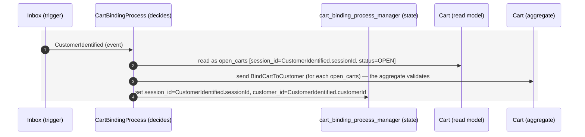
```mermaid
sequenceDiagram
  autonumber
  participant IN as Inbox (trigger)
  participant PM as CartBindingProcess (decides)
  participant ST as cart_binding_process_manager (state)
  participant RM_Cart as Cart (read model)
  participant AG_Cart as Cart (aggregate)
  rect rgb(245,245,245)
  IN->>PM: CustomerIdentified (event)
  PM->>RM_Cart: read as open_carts [session_id=CustomerIdentified.sessionId, status=OPEN]
  PM->>AG_Cart: send BindCartToCustomer (for each open_carts) — the aggregate validates
  PM->>ST: set session_id=CustomerIdentified.sessionId, customer_id=CustomerIdentified.customerId
  end
```

### 🗄️ Views (read models) _(2)_

<a id="view-view_customererasure"></a>
#### 🗄️ View: `View_CustomerErasure`

- **Source**: [🎭 `Customer`](#actor-customer) · 🔭 V1
- **Rules**: `status` is derived from the latest recorded fact: REQUESTED -> CONFIRMED -> EXECUTING (the first destructive leg reported) -> ERASED. A CustomerErasureCancelled stamps cancelled_at and ends the row's life as a request; nothing further folds onto it. PARKED is ABSENT on purpose: parking is process-row state — an internal scheduling fact about OUR execution, never a recorded event — and the subject is owed the state of their RIGHT, not of our scheduler. The row-state enum that carries it lands with the orchestrator. Every column is pseudonymous. The row must survive the deletion of the Customer stream, which is exactly why it may never carry personal data.
- **Fed by**: [⚡ `CustomerErasureRequested`](#event-customererasurerequested), [⚡ `CustomerErasureConfirmed`](#event-customererasureconfirmed), [⚡ `CustomerErasureCancelled`](#event-customererasurecancelled), [⚡ `CustomerErasureDue`](#event-customererasuredue), [⚡ `CustomerIdentityUnlinked`](#event-customeridentityunlinked), [⚡ `CustomerErased`](#event-customererased)

| Column | Type | Sourced from | Constraints | Notes |
| --- | --- | --- | --- | --- |
| `customer_id` | [🔤 `CustomerId`](#scalar-customerid) _(derived)_ | [⚡ `CustomerErasureRequested`.`customerId`](#event-customererasurerequested--customerid) | PK | The accountability reference the query scopes on — resolved from the authenticated principal, never from a client argument. |
| `erasure_request_id` | [🔤 `ErasureRequestId`](#scalar-erasurerequestid) _(derived)_ | [⚡ `CustomerErasureRequested`.`erasureRequestId`](#event-customererasurerequested--erasurerequestid) | — | The subject's pseudonymous reference for the right they exercised; quotable back to us after everything else is gone. |
| `status` | [🔤 `ErasureStatus`](#scalar-erasurestatus) | [⚡ `CustomerErasureRequested`](#event-customererasurerequested), [⚡ `CustomerErasureConfirmed`](#event-customererasureconfirmed), [⚡ `CustomerErasureDue`](#event-customererasuredue), [⚡ `CustomerIdentityUnlinked`](#event-customeridentityunlinked), [⚡ `CustomerErased`](#event-customererased) | — | Derived from the latest fact. The grace window elapsing is what turns the answer to EXECUTING — the subject can no longer cancel from that moment, so telling them otherwise would be false. The unlink leg keeps it there. |
| `cancelled_at` | `timestamptz` | [⚡ `CustomerErasureCancelled`](#event-customererasurecancelled) | nullable | occurrence: when the subject withdrew the request inside the window. A separate TIMESTAMP rather than a member of ErasureStatus: a cancelled request is not a phase of an erasure, it is the absence of one — and the moment they changed their mind is the fact worth keeping, not merely that they did.  |
| `policy` | `text` _(derived)_ | [⚡ `CustomerErased`.`policy`](#event-customererased--policy) | nullable | The window the erasure ran under; null until the receipt exists. |
| `retained_under` | `jsonb` _(derived)_ | [⚡ `CustomerErased`.`retainedUnder`](#event-customererased--retainedunder) | nullable | The approved retention windows under which data about this subject survives, by catalog name — the disclosure limb of §3.6, generated from the same declarations that enforce it, so the screen cannot drift from the behaviour. |
| `created_at` | `timestamptz` | ⚠️ _(none)_ | — | technical — stamped from event.occurred_at (implicit on every read model) |
| `updated_at` | `timestamptz` | ⚠️ _(none)_ | — | technical — stamped from event.occurred_at (implicit on every read model) |

<a id="view-customer"></a>
#### 🗄️ View: `Customer`

- **Source**: [🎭 `Customer`](#actor-customer) · 🛶 V0
- **Note**: Identity/lookup read model: resolves a returning phone (or auth_ref) to an existing Customer, backs VerifyPhone idempotency + auth resolution, and serves the `me` query (CustomerProfile). Also bound when CustomerIdentified stamps carts. The stored `locale` localizes authenticated SMS/email sends.
- **Rules**: `ratings` accumulates the customer's own restaurant ratings (from RestaurantRated) so they can see how they rated each restaurant. `favorite_restaurant_ids` is maintained from RestaurantFavorited/RestaurantUnfavorited; the favoriteRestaurants query joins it to Restaurant.
- **Fed by**: [⚡ `CustomerRegistered`](#event-customerregistered), [⚡ `RestaurantRated`](#event-restaurantrated), [⚡ `RestaurantFavorited`](#event-restaurantfavorited), [⚡ `RestaurantUnfavorited`](#event-restaurantunfavorited), [⚡ `CustomerInfoUpdated`](#event-customerinfoupdated), [⚡ `CustomerEmailVerified`](#event-customeremailverified), [⚡ `CustomerPhoneChanged`](#event-customerphonechanged), [⚡ `CustomerLanguageChanged`](#event-customerlanguagechanged), [⚡ `CustomerPreferencesSet`](#event-customerpreferencesset), [⚡ `CustomerAddressSet`](#event-customeraddressset), [⚡ `CustomerAddressRemoved`](#event-customeraddressremoved), [⚡ `CustomerPaymentMethodSet`](#event-customerpaymentmethodset)

| Column | Type | Sourced from | Constraints | Notes |
| --- | --- | --- | --- | --- |
| `customer_id` | [🔤 `CustomerId`](#scalar-customerid) _(derived)_ | [⚡ `CustomerRegistered`.`customerId`](#event-customerregistered--customerid) | PK |  |
| `phone` | [🔤 `PhoneNumber`](#scalar-phonenumber) _(derived)_ | [⚡ `CustomerRegistered`.`phone`](#event-customerregistered--phone), [⚡ `CustomerPhoneChanged`.`phone`](#event-customerphonechanged--phone) | unique |  |
| `auth_ref` | [🔤 `AuthSubject`](#scalar-authsubject) _(derived)_ | [⚡ `CustomerRegistered`.`authRef`](#event-customerregistered--authref) | index, nullable | Auth provider user id (Supabase Auth) → Customer. |
| `display_name` | [🔤 `CustomerDisplayName`](#scalar-customerdisplayname) _(derived)_ | [⚡ `CustomerRegistered`.`displayName`](#event-customerregistered--displayname), [⚡ `CustomerInfoUpdated`.`displayName`](#event-customerinfoupdated--displayname) | nullable |  |
| `email` | [🔤 `EmailAddress`](#scalar-emailaddress) _(derived)_ | [⚡ `CustomerRegistered`.`email`](#event-customerregistered--email), [⚡ `CustomerEmailVerified`.`email`](#event-customeremailverified--email) | nullable |  |
| `email_verified` | `boolean` | [⚡ `CustomerEmailVerified`](#event-customeremailverified) | — | True once an email magic link has been confirmed (CustomerEmailVerified). |
| `locale` | [🔤 `Locale`](#scalar-locale) _(derived)_ | [⚡ `CustomerRegistered`.`locale`](#event-customerregistered--locale), [⚡ `CustomerLanguageChanged`.`locale`](#event-customerlanguagechanged--locale) | nullable | i18n culture; set at registration or via ChangeLanguage. Localizes authenticated SMS/email sends. |
| `timezone` | [🔤 `TimeZone`](#scalar-timezone) _(derived)_ | [⚡ `CustomerRegistered`.`timezone`](#event-customerregistered--timezone), [⚡ `CustomerPreferencesSet`.`timezone`](#event-customerpreferencesset--timezone) | nullable |  |
| `ratings` | `jsonb` | [⚡ `RestaurantRated`](#event-restaurantrated) | — | The customer's own submitted ratings (assembled from RestaurantRated): [{ order_id, restaurant_id, stars, comment, rated_at }]. |
| `favorite_restaurant_ids` | `jsonb` | [⚡ `RestaurantFavorited`](#event-restaurantfavorited), [⚡ `RestaurantUnfavorited`](#event-restaurantunfavorited) | — | [restaurant_id] the customer favorited. |
| `preferences` | `jsonb` | [⚡ `CustomerPreferencesSet`](#event-customerpreferencesset) | nullable | { dietary_tags: [...], favorite_cuisines: [...] } from CustomerPreferencesSet. |
| `addresses` | `jsonb` | [⚡ `CustomerAddressSet`](#event-customeraddressset), [⚡ `CustomerAddressRemoved`](#event-customeraddressremoved) | — | Saved address book: [{ address_id, label, address }] from CustomerAddressSet/Removed. |
| `payment_method_id` | [🔤 `PaymentMethodId`](#scalar-paymentmethodid) _(derived)_ | [⚡ `CustomerPaymentMethodSet`.`paymentMethodId`](#event-customerpaymentmethodset--paymentmethodid) | nullable |  |
| `created_at` | `timestamptz` | ⚠️ _(none)_ | — | technical — stamped from event.occurred_at (implicit on every read model) |
| `updated_at` | `timestamptz` | ⚠️ _(none)_ | — | technical — stamped from event.occurred_at (implicit on every read model) |

### 📩 Commands _(17)_

<a id="command-requestphoneverification"></a>
#### 📩 Command: `RequestPhoneVerification`

Ask Supabase Auth to send an SMS OTP to a phone (OVHcloud SMS via the Supabase send-SMS hook; a mock provider in dev). Emits no event. `locale` localizes the message; when absent it defaults from the dialing code (e.g. '+33' → fr-FR).

- **Dispatched by**: [✏️ `requestPhoneVerification`](#mutation-requestphoneverification) · **handled by** [🎭 `Customer`](#actor-customer)
- **Emits**: —
- **Throws**: [⛔ `PhoneCountryNotServed`](#error-phonecountrynotserved), [⛔ `RateLimited`](#error-ratelimited), [⛔ `VerificationSendLimitReached`](#error-verificationsendlimitreached), [⛔ `VerificationSendCapacityExhausted`](#error-verificationsendcapacityexhausted)

| Field | Type | Required | Description |
| --- | --- | --- | --- |
| <a id="command-requestphoneverification--dialingcode"></a>`dialingCode` | [🔤 `DialingCode`](#scalar-dialingcode) | ✅ |  |
| <a id="command-requestphoneverification--nationalnumber"></a>`nationalNumber` | [🔤 `NationalPhoneNumber`](#scalar-nationalphonenumber) | ✅ |  |
| <a id="command-requestphoneverification--locale"></a>`locale` | [🔤 `Locale`](#scalar-locale) | ⬜ | SMS language; defaults from the dialing code's country when absent. |

<a id="command-verifyphone"></a>
#### 📩 Command: `VerifyPhone`

Verify the SMS OTP with Supabase Auth, then register-or-identify: a first verified phone CREATES the Customer (CustomerRegistered), a returning phone RESOLVES + signs in (CustomerIdentified). The backend decides new-vs-returning; the client never calls register/identify directly.

- **Dispatched by**: [✏️ `verifyPhone`](#mutation-verifyphone) · **handled by** [🎭 `Customer`](#actor-customer)
- **Emits**: [⚡ `CustomerRegistered`](#event-customerregistered), [⚡ `CustomerIdentified`](#event-customeridentified)
- **Throws**: [⛔ `InvalidVerificationCode`](#error-invalidverificationcode), [⛔ `VerificationCodeExpired`](#error-verificationcodeexpired)

| Field | Type | Required | Description |
| --- | --- | --- | --- |
| <a id="command-verifyphone--customerid"></a>`customerId` | [🔤 `CustomerId`](#scalar-customerid) | ✅ | Client-generated id, used only when the phone is new; ignored for a returning phone. |
| <a id="command-verifyphone--dialingcode"></a>`dialingCode` | [🔤 `DialingCode`](#scalar-dialingcode) | ✅ |  |
| <a id="command-verifyphone--nationalnumber"></a>`nationalNumber` | [🔤 `NationalPhoneNumber`](#scalar-nationalphonenumber) | ✅ |  |
| <a id="command-verifyphone--code"></a>`code` | [🔤 `OtpCode`](#scalar-otpcode) | ✅ |  |
| <a id="command-verifyphone--sessionid"></a>`sessionId` | [🔤 `SessionId`](#scalar-sessionid) | ✅ | The visitor session verifying the phone — carried onto CustomerIdentified so CartBindingProcess binds this session's open carts. |
| <a id="command-verifyphone--displayname"></a>`displayName` | [🔤 `CustomerDisplayName`](#scalar-customerdisplayname) | ⬜ |  |
| <a id="command-verifyphone--locale"></a>`locale` | [🔤 `Locale`](#scalar-locale) | ⬜ | Persisted on registration; defaults from the dialing code when absent. |
| <a id="command-verifyphone--timezone"></a>`timezone` | [🔤 `TimeZone`](#scalar-timezone) | ⬜ |  |

<a id="command-requestemailverification"></a>
#### 📩 Command: `RequestEmailVerification`

Ask Supabase Auth to email a magic link to verify/link an email for the signed-in customer. Emits no event; the message is localized via the customer's STORED locale (no per-call language param).

- **Dispatched by**: [✏️ `requestEmailVerification`](#mutation-requestemailverification) · **handled by** [🎭 `Customer`](#actor-customer)
- **Emits**: —
- **Throws**: [⛔ `EmailAlreadyInUse`](#error-emailalreadyinuse)

| Field | Type | Required | Description |
| --- | --- | --- | --- |
| <a id="command-requestemailverification--customerid"></a>`customerId` | [🔤 `CustomerId`](#scalar-customerid) | ✅ |  |
| <a id="command-requestemailverification--email"></a>`email` | [🔤 `EmailAddress`](#scalar-emailaddress) | ✅ |  |

<a id="command-confirmemailverification"></a>
#### 📩 Command: `ConfirmEmailVerification`

Confirm an email magic link: the client returns the Supabase token, we VERIFY it server-side and link the now-verified email to the Customer. Used for both the initial email and later changes.

- **Dispatched by**: [✏️ `confirmEmailVerification`](#mutation-confirmemailverification) · **handled by** [🎭 `Customer`](#actor-customer)
- **Emits**: [⚡ `CustomerEmailVerified`](#event-customeremailverified)
- **Throws**: [⛔ `InvalidVerificationToken`](#error-invalidverificationtoken), [⛔ `VerificationCodeExpired`](#error-verificationcodeexpired)

| Field | Type | Required | Description |
| --- | --- | --- | --- |
| <a id="command-confirmemailverification--customerid"></a>`customerId` | [🔤 `CustomerId`](#scalar-customerid) | ✅ |  |
| <a id="command-confirmemailverification--token"></a>`token` | [🔤 `EmailVerificationToken`](#scalar-emailverificationtoken) | ✅ |  |

<a id="command-requestphonechange"></a>
#### 📩 Command: `RequestPhoneChange`

Ask Supabase to send an SMS OTP to a NEW phone for a signed-in customer (stored locale). Emits no event.

- **Dispatched by**: [✏️ `requestPhoneChange`](#mutation-requestphonechange) · **handled by** [🎭 `Customer`](#actor-customer)
- **Emits**: —
- **Throws**: [⛔ `PhoneAlreadyInUse`](#error-phonealreadyinuse), [⛔ `PhoneCountryNotServed`](#error-phonecountrynotserved), [⛔ `RateLimited`](#error-ratelimited), [⛔ `VerificationSendLimitReached`](#error-verificationsendlimitreached), [⛔ `VerificationSendCapacityExhausted`](#error-verificationsendcapacityexhausted)

| Field | Type | Required | Description |
| --- | --- | --- | --- |
| <a id="command-requestphonechange--customerid"></a>`customerId` | [🔤 `CustomerId`](#scalar-customerid) | ✅ |  |
| <a id="command-requestphonechange--newdialingcode"></a>`newDialingCode` | [🔤 `DialingCode`](#scalar-dialingcode) | ✅ |  |
| <a id="command-requestphonechange--newnationalnumber"></a>`newNationalNumber` | [🔤 `NationalPhoneNumber`](#scalar-nationalphonenumber) | ✅ |  |

<a id="command-confirmphonechange"></a>
#### 📩 Command: `ConfirmPhoneChange`

Verify the OTP on the new phone and change the customer's phone (→ canonical E.164 PhoneNumber).

- **Dispatched by**: [✏️ `confirmPhoneChange`](#mutation-confirmphonechange) · **handled by** [🎭 `Customer`](#actor-customer)
- **Emits**: [⚡ `CustomerPhoneChanged`](#event-customerphonechanged)
- **Throws**: [⛔ `InvalidVerificationCode`](#error-invalidverificationcode), [⛔ `VerificationCodeExpired`](#error-verificationcodeexpired), [⛔ `PhoneAlreadyInUse`](#error-phonealreadyinuse)

| Field | Type | Required | Description |
| --- | --- | --- | --- |
| <a id="command-confirmphonechange--customerid"></a>`customerId` | [🔤 `CustomerId`](#scalar-customerid) | ✅ |  |
| <a id="command-confirmphonechange--newdialingcode"></a>`newDialingCode` | [🔤 `DialingCode`](#scalar-dialingcode) | ✅ |  |
| <a id="command-confirmphonechange--newnationalnumber"></a>`newNationalNumber` | [🔤 `NationalPhoneNumber`](#scalar-nationalphonenumber) | ✅ |  |
| <a id="command-confirmphonechange--code"></a>`code` | [🔤 `OtpCode`](#scalar-otpcode) | ✅ |  |

<a id="command-changelanguage"></a>
#### 📩 Command: `ChangeLanguage`

Persist the customer's preferred language (the single locale setter). The stored locale then localizes subsequent authenticated SMS/email sends — so they need no per-call language param.

- **Dispatched by**: [✏️ `changeLanguage`](#mutation-changelanguage) · **handled by** [🎭 `Customer`](#actor-customer)
- **Emits**: [⚡ `CustomerLanguageChanged`](#event-customerlanguagechanged)
- **Throws**: —

| Field | Type | Required | Description |
| --- | --- | --- | --- |
| <a id="command-changelanguage--customerid"></a>`customerId` | [🔤 `CustomerId`](#scalar-customerid) | ✅ |  |
| <a id="command-changelanguage--locale"></a>`locale` | [🔤 `Locale`](#scalar-locale) | ✅ |  |

<a id="command-markrestaurantasfavorite"></a>
#### 📩 Command: `MarkRestaurantAsFavorite`

Customer marks a restaurant as a favorite for quick access.

- **Dispatched by**: [✏️ `markRestaurantAsFavorite`](#mutation-markrestaurantasfavorite) · **handled by** [🎭 `Customer`](#actor-customer)
- **Emits**: [⚡ `RestaurantFavorited`](#event-restaurantfavorited)
- **Throws**: [⛔ `RestaurantNotFound`](#error-restaurantnotfound)

| Field | Type | Required | Description |
| --- | --- | --- | --- |
| <a id="command-markrestaurantasfavorite--customerid"></a>`customerId` | [🔤 `CustomerId`](#scalar-customerid) | ✅ |  |
| <a id="command-markrestaurantasfavorite--restaurantid"></a>`restaurantId` | [🔤 `RestaurantId`](#scalar-restaurantid) | ✅ |  |

<a id="command-unmarkrestaurantasfavorite"></a>
#### 📩 Command: `UnmarkRestaurantAsFavorite`

Customer removes a restaurant from their favorites.

- **Dispatched by**: [✏️ `unmarkRestaurantAsFavorite`](#mutation-unmarkrestaurantasfavorite) · **handled by** [🎭 `Customer`](#actor-customer)
- **Emits**: [⚡ `RestaurantUnfavorited`](#event-restaurantunfavorited)
- **Throws**: —

| Field | Type | Required | Description |
| --- | --- | --- | --- |
| <a id="command-unmarkrestaurantasfavorite--customerid"></a>`customerId` | [🔤 `CustomerId`](#scalar-customerid) | ✅ |  |
| <a id="command-unmarkrestaurantasfavorite--restaurantid"></a>`restaurantId` | [🔤 `RestaurantId`](#scalar-restaurantid) | ✅ |  |

<a id="command-updatecustomerinfo"></a>
#### 📩 Command: `UpdateCustomerInfo`

Customer updates their display name. (Email is verified-only — set via ConfirmEmailVerification.)

- **Dispatched by**: [✏️ `updateCustomerInfo`](#mutation-updatecustomerinfo) · **handled by** [🎭 `Customer`](#actor-customer)
- **Emits**: [⚡ `CustomerInfoUpdated`](#event-customerinfoupdated)
- **Throws**: [⛔ `NoEditableFieldProvided`](#error-noeditablefieldprovided)

| Field | Type | Required | Description |
| --- | --- | --- | --- |
| <a id="command-updatecustomerinfo--customerid"></a>`customerId` | [🔤 `CustomerId`](#scalar-customerid) | ✅ |  |
| <a id="command-updatecustomerinfo--displayname"></a>`displayName` | [🔤 `CustomerDisplayName`](#scalar-customerdisplayname) | ⬜ |  |

<a id="command-setcustomerpreferences"></a>
#### 📩 Command: `SetCustomerPreferences`

Customer sets discovery + i18n preferences (timezone, dietary restrictions, favorite cuisines). Language is set via ChangeLanguage.

- **Dispatched by**: [✏️ `setCustomerPreferences`](#mutation-setcustomerpreferences) · **handled by** [🎭 `Customer`](#actor-customer)
- **Emits**: [⚡ `CustomerPreferencesSet`](#event-customerpreferencesset)
- **Throws**: —

| Field | Type | Required | Description |
| --- | --- | --- | --- |
| <a id="command-setcustomerpreferences--customerid"></a>`customerId` | [🔤 `CustomerId`](#scalar-customerid) | ✅ |  |
| <a id="command-setcustomerpreferences--timezone"></a>`timezone` | [🔤 `TimeZone`](#scalar-timezone) | ⬜ |  |
| <a id="command-setcustomerpreferences--dietarytags"></a>`dietaryTags` | [[🔤 `Tag`](#scalar-tag)] | ⬜ |  |
| <a id="command-setcustomerpreferences--favoritecuisines"></a>`favoriteCuisines` | [[🔤 `Tag`](#scalar-tag)] | ⬜ |  |

<a id="command-setcustomeraddress"></a>
#### 📩 Command: `SetCustomerAddress`

Customer adds or updates a saved delivery address in their address book.

- **Dispatched by**: [✏️ `setCustomerAddress`](#mutation-setcustomeraddress) · **handled by** [🎭 `Customer`](#actor-customer)
- **Emits**: [⚡ `CustomerAddressSet`](#event-customeraddressset)
- **Throws**: —

| Field | Type | Required | Description |
| --- | --- | --- | --- |
| <a id="command-setcustomeraddress--customerid"></a>`customerId` | [🔤 `CustomerId`](#scalar-customerid) | ✅ |  |
| <a id="command-setcustomeraddress--addressid"></a>`addressId` | [🔤 `AddressId`](#scalar-addressid) | ✅ | Client-generated id; re-using it updates that address. |
| <a id="command-setcustomeraddress--label"></a>`label` | `string` | ⬜ |  |
| <a id="command-setcustomeraddress--address"></a>`address` | [📦 `Address`](#entity-address) | ✅ |  |

<a id="command-removecustomeraddress"></a>
#### 📩 Command: `RemoveCustomerAddress`

Customer removes a saved address from their address book.

- **Dispatched by**: [✏️ `removeCustomerAddress`](#mutation-removecustomeraddress) · **handled by** [🎭 `Customer`](#actor-customer)
- **Emits**: [⚡ `CustomerAddressRemoved`](#event-customeraddressremoved)
- **Throws**: —

| Field | Type | Required | Description |
| --- | --- | --- | --- |
| <a id="command-removecustomeraddress--customerid"></a>`customerId` | [🔤 `CustomerId`](#scalar-customerid) | ✅ |  |
| <a id="command-removecustomeraddress--addressid"></a>`addressId` | [🔤 `AddressId`](#scalar-addressid) | ✅ |  |

<a id="command-setcustomerpaymentmethod"></a>
#### 📩 Command: `SetCustomerPaymentMethod`

Customer sets or updates their preferred Stripe payment method.

- **Dispatched by**: [✏️ `setCustomerPaymentMethod`](#mutation-setcustomerpaymentmethod) · **handled by** [🎭 `Customer`](#actor-customer)
- **Emits**: [⚡ `CustomerPaymentMethodSet`](#event-customerpaymentmethodset)
- **Throws**: —

| Field | Type | Required | Description |
| --- | --- | --- | --- |
| <a id="command-setcustomerpaymentmethod--customerid"></a>`customerId` | [🔤 `CustomerId`](#scalar-customerid) | ✅ |  |
| <a id="command-setcustomerpaymentmethod--paymentmethodid"></a>`paymentMethodId` | [🔤 `PaymentMethodId`](#scalar-paymentmethodid) | ✅ |  |

<a id="command-requestcustomererasure"></a>
#### 📩 Command: `RequestCustomerErasure`

Ask for this account and its personal data to be erased (GDPR Art. 17). Acceptance-first: the mutation returns the `erasureRequestId` and the fact is recorded by the aggregate, which is what lets the status surface answer immediately. IDEMPOTENT while one request is pending — a second ask returns the SAME id and records nothing new, because a double-tap on a delete button is a nervous customer, not a second intention. IN THIS DEPLOYMENT THE HANDLER REFUSES UNCONDITIONALLY with `ErasureEngineUnavailable` and records nothing: it reads no gate, because the journey that executes an erasure is the next chunk — a typed refusal, never a silent accept. `RUN_DELETION_ENGINE` gates the deletion ENGINE POD, not this mutation. `ErasureBlockedByOpenOrder` is the declared refusal for an order in flight; its precondition needs a read model that lands with that journey.

- **Dispatched by**: [✏️ `requestErasure`](#mutation-requesterasure) · **handled by** [🎭 `Customer`](#actor-customer)
- **Emits**: [⚡ `CustomerErasureRequested`](#event-customererasurerequested)
- **Throws**: [⛔ `ErasureBlockedByOpenOrder`](#error-erasureblockedbyopenorder), [⛔ `ErasureEngineUnavailable`](#error-erasureengineunavailable)

| Field | Type | Required | Description |
| --- | --- | --- | --- |
| <a id="command-requestcustomererasure--customerid"></a>`customerId` | [🔤 `CustomerId`](#scalar-customerid) | ✅ | The subject — resolved server-side from the authenticated principal, never taken from the client. |
| <a id="command-requestcustomererasure--erasurerequestid"></a>`erasureRequestId` | [🔤 `ErasureRequestId`](#scalar-erasurerequestid) | ✅ | The journey id the acceptance returns; deterministic per pending request so a retry re-resolves the same one. |

<a id="command-confirmcustomererasure"></a>
#### 📩 Command: `ConfirmCustomerErasure`

Confirm the erasure with the token sent to the subject's verified channel — the SECOND round-trip that turns a request into a scheduled destruction. On acceptance the grace window starts and the `deletion:` trigger arms. The token is verified server-side and is the ONLY thing that authorizes the confirm; it is deliberately not "being logged in", because the whole point of the second step is to prove the person holding the session is the person who owns the channel.

- **Dispatched by**: [✏️ `confirmErasure`](#mutation-confirmerasure) · **handled by** [🎭 `Customer`](#actor-customer)
- **Emits**: [⚡ `CustomerErasureConfirmed`](#event-customererasureconfirmed)
- **Throws**: [⛔ `InvalidErasureConfirmationToken`](#error-invaliderasureconfirmationtoken), [⛔ `ErasureNotRequested`](#error-erasurenotrequested), [⛔ `ErasureEngineUnavailable`](#error-erasureengineunavailable)

| Field | Type | Required | Description |
| --- | --- | --- | --- |
| <a id="command-confirmcustomererasure--customerid"></a>`customerId` | [🔤 `CustomerId`](#scalar-customerid) | ✅ |  |
| <a id="command-confirmcustomererasure--erasurerequestid"></a>`erasureRequestId` | [🔤 `ErasureRequestId`](#scalar-erasurerequestid) | ✅ |  |
| <a id="command-confirmcustomererasure--token"></a>`token` | [🔤 `ErasureConfirmationToken`](#scalar-erasureconfirmationtoken) | ✅ |  |

<a id="command-cancelcustomererasure"></a>
#### 📩 Command: `CancelCustomerErasure`

The subject changed their mind inside the grace window and keeps their account. RE-LOGIN-CANCELS is the recorded posture: cancelling is the USER's act — there is no admin resurrection, because an erasure an operator can undo is not an erasure. A returning customer placing an order is the strongest cancel-intent signal there is, but it does NOT auto-cancel: the recorded intent stands until the subject withdraws it; an in-flight order only defers EXECUTION (the PARKED arm).

- **Dispatched by**: [✏️ `cancelErasure`](#mutation-cancelerasure) · **handled by** [🎭 `Customer`](#actor-customer)
- **Emits**: [⚡ `CustomerErasureCancelled`](#event-customererasurecancelled)
- **Throws**: [⛔ `ErasureNotRequested`](#error-erasurenotrequested)

| Field | Type | Required | Description |
| --- | --- | --- | --- |
| <a id="command-cancelcustomererasure--customerid"></a>`customerId` | [🔤 `CustomerId`](#scalar-customerid) | ✅ |  |
| <a id="command-cancelcustomererasure--erasurerequestid"></a>`erasureRequestId` | [🔤 `ErasureRequestId`](#scalar-erasurerequestid) | ✅ |  |

### ⚡ Events _(17)_

<a id="event-customerregistered"></a>
#### ⚡ Event: `CustomerRegistered`

A customer account was created on first phone verification (passwordless OTP, identity managed by the auth provider). Phone number is the primary identifier.

- **Emitted by**: [🎭 `Customer`](#actor-customer)
- **Consumed by**: —
- **Projected into**: [🗄️ `Customer`](#view-customer)

| Field | Type | Required | Description |
| --- | --- | --- | --- |
| <a id="event-customerregistered--mode"></a>`mode` | [🔤 `Mode`](#scalar-mode) | ⬜ |  |
| <a id="event-customerregistered--customerid"></a>`customerId` | [🔤 `CustomerId`](#scalar-customerid) | ✅ |  |
| <a id="event-customerregistered--authref"></a>`authRef` | [🔤 `AuthSubject`](#scalar-authsubject) | ⬜ | Auth provider user id (e.g. Supabase Auth), linking identity to this Customer. |
| <a id="event-customerregistered--phone"></a>`phone` | [🔤 `PhoneNumber`](#scalar-phonenumber) | ✅ |  |
| <a id="event-customerregistered--displayname"></a>`displayName` | [🔤 `CustomerDisplayName`](#scalar-customerdisplayname) | ⬜ |  |
| <a id="event-customerregistered--email"></a>`email` | [🔤 `EmailAddress`](#scalar-emailaddress) | ⬜ | Optional, e.g. captured later for receipts. |
| <a id="event-customerregistered--locale"></a>`locale` | [🔤 `Locale`](#scalar-locale) | ⬜ | Preferred culture (language + date/time/number display). |
| <a id="event-customerregistered--timezone"></a>`timezone` | [🔤 `TimeZone`](#scalar-timezone) | ⬜ |  |

<a id="event-customeridentified"></a>
#### ⚡ Event: `CustomerIdentified`

A returning visitor signed in and was resolved to an existing Customer (authRef → customerId). NOT an auth event (OTP/session live in the auth provider): this records the DOMAIN fact so the visitor's OPEN guest carts can be bound to the customerId — letting carts started on different devices converge under one customer and be merged at checkout. Thanks to the sessionId, the existing open cart(s) can be bound to the customerId and merged at checkout. This is a domain event, not an auth event.

- **Emitted by**: [🎭 `Customer`](#actor-customer)
- **Consumed by**: [🎭 `CartBindingProcess`](#actor-cartbindingprocess)
- **Projected into**: _non-projected (saga/transient)_

| Field | Type | Required | Description |
| --- | --- | --- | --- |
| <a id="event-customeridentified--customerid"></a>`customerId` | [🔤 `CustomerId`](#scalar-customerid) | ✅ |  |
| <a id="event-customeridentified--authref"></a>`authRef` | [🔤 `AuthSubject`](#scalar-authsubject) | ✅ | Auth provider user id that was matched to this Customer (via Customer.auth_ref). |
| <a id="event-customeridentified--sessionid"></a>`sessionId` | [🔤 `SessionId`](#scalar-sessionid) | ✅ | Session id (ADR-0041) for the sign-in event; not required for cart binding. |

<a id="event-restaurantfavorited"></a>
#### ⚡ Event: `RestaurantFavorited`

Customer marked a restaurant as a favorite.

- **Emitted by**: [🎭 `Customer`](#actor-customer)
- **Consumed by**: —
- **Projected into**: [🗄️ `Customer`](#view-customer)

| Field | Type | Required | Description |
| --- | --- | --- | --- |
| <a id="event-restaurantfavorited--customerid"></a>`customerId` | [🔤 `CustomerId`](#scalar-customerid) | ✅ |  |
| <a id="event-restaurantfavorited--restaurantid"></a>`restaurantId` | [🔤 `RestaurantId`](#scalar-restaurantid) | ✅ |  |

<a id="event-restaurantunfavorited"></a>
#### ⚡ Event: `RestaurantUnfavorited`

Customer removed a restaurant from their favorites.

- **Emitted by**: [🎭 `Customer`](#actor-customer)
- **Consumed by**: —
- **Projected into**: [🗄️ `Customer`](#view-customer)

| Field | Type | Required | Description |
| --- | --- | --- | --- |
| <a id="event-restaurantunfavorited--customerid"></a>`customerId` | [🔤 `CustomerId`](#scalar-customerid) | ✅ |  |
| <a id="event-restaurantunfavorited--restaurantid"></a>`restaurantId` | [🔤 `RestaurantId`](#scalar-restaurantid) | ✅ |  |

<a id="event-customerinfoupdated"></a>
#### ⚡ Event: `CustomerInfoUpdated`

Customer updated their display name. (Email is verified-only — see CustomerEmailVerified.)

- **Emitted by**: [🎭 `Customer`](#actor-customer)
- **Consumed by**: —
- **Projected into**: [🗄️ `Customer`](#view-customer)

| Field | Type | Required | Description |
| --- | --- | --- | --- |
| <a id="event-customerinfoupdated--customerid"></a>`customerId` | [🔤 `CustomerId`](#scalar-customerid) | ✅ |  |
| <a id="event-customerinfoupdated--displayname"></a>`displayName` | [🔤 `CustomerDisplayName`](#scalar-customerdisplayname) | ⬜ |  |

<a id="event-customeremailverified"></a>
#### ⚡ Event: `CustomerEmailVerified`

An email was verified (Supabase magic link) and linked to the Customer — initial set OR a later change.

- **Emitted by**: [🎭 `Customer`](#actor-customer)
- **Consumed by**: —
- **Projected into**: [🗄️ `Customer`](#view-customer)

| Field | Type | Required | Description |
| --- | --- | --- | --- |
| <a id="event-customeremailverified--customerid"></a>`customerId` | [🔤 `CustomerId`](#scalar-customerid) | ✅ |  |
| <a id="event-customeremailverified--email"></a>`email` | [🔤 `EmailAddress`](#scalar-emailaddress) | ✅ |  |

<a id="event-customerphonechanged"></a>
#### ⚡ Event: `CustomerPhoneChanged`

The Customer's phone was changed after re-verification (canonical E.164).

- **Emitted by**: [🎭 `Customer`](#actor-customer)
- **Consumed by**: —
- **Projected into**: [🗄️ `Customer`](#view-customer)

| Field | Type | Required | Description |
| --- | --- | --- | --- |
| <a id="event-customerphonechanged--customerid"></a>`customerId` | [🔤 `CustomerId`](#scalar-customerid) | ✅ |  |
| <a id="event-customerphonechanged--phone"></a>`phone` | [🔤 `PhoneNumber`](#scalar-phonenumber) | ✅ |  |

<a id="event-customerlanguagechanged"></a>
#### ⚡ Event: `CustomerLanguageChanged`

The Customer's preferred language (locale) was set/changed; localizes later SMS/email sends.

- **Emitted by**: [🎭 `Customer`](#actor-customer)
- **Consumed by**: —
- **Projected into**: [🗄️ `Customer`](#view-customer)

| Field | Type | Required | Description |
| --- | --- | --- | --- |
| <a id="event-customerlanguagechanged--customerid"></a>`customerId` | [🔤 `CustomerId`](#scalar-customerid) | ✅ |  |
| <a id="event-customerlanguagechanged--locale"></a>`locale` | [🔤 `Locale`](#scalar-locale) | ✅ |  |

<a id="event-customerpreferencesset"></a>
#### ⚡ Event: `CustomerPreferencesSet`

Customer set their discovery + i18n preferences (timezone, dietary restrictions, favorite cuisines). Language is CustomerLanguageChanged.

- **Emitted by**: [🎭 `Customer`](#actor-customer)
- **Consumed by**: —
- **Projected into**: [🗄️ `Customer`](#view-customer)

| Field | Type | Required | Description |
| --- | --- | --- | --- |
| <a id="event-customerpreferencesset--customerid"></a>`customerId` | [🔤 `CustomerId`](#scalar-customerid) | ✅ |  |
| <a id="event-customerpreferencesset--timezone"></a>`timezone` | [🔤 `TimeZone`](#scalar-timezone) | ⬜ |  |
| <a id="event-customerpreferencesset--dietarytags"></a>`dietaryTags` | [[🔤 `Tag`](#scalar-tag)] | ⬜ |  |
| <a id="event-customerpreferencesset--favoritecuisines"></a>`favoriteCuisines` | [[🔤 `Tag`](#scalar-tag)] | ⬜ |  |

<a id="event-customeraddressset"></a>
#### ⚡ Event: `CustomerAddressSet`

Customer added or updated a saved delivery address.

- **Emitted by**: [🎭 `Customer`](#actor-customer)
- **Consumed by**: —
- **Projected into**: [🗄️ `Customer`](#view-customer)

| Field | Type | Required | Description |
| --- | --- | --- | --- |
| <a id="event-customeraddressset--customerid"></a>`customerId` | [🔤 `CustomerId`](#scalar-customerid) | ✅ |  |
| <a id="event-customeraddressset--addressid"></a>`addressId` | [🔤 `AddressId`](#scalar-addressid) | ✅ |  |
| <a id="event-customeraddressset--label"></a>`label` | `string` | ⬜ |  |
| <a id="event-customeraddressset--address"></a>`address` | [📦 `Address`](#entity-address) | ✅ |  |

<a id="event-customeraddressremoved"></a>
#### ⚡ Event: `CustomerAddressRemoved`

Customer removed a saved address.

- **Emitted by**: [🎭 `Customer`](#actor-customer)
- **Consumed by**: —
- **Projected into**: [🗄️ `Customer`](#view-customer)

| Field | Type | Required | Description |
| --- | --- | --- | --- |
| <a id="event-customeraddressremoved--customerid"></a>`customerId` | [🔤 `CustomerId`](#scalar-customerid) | ✅ |  |
| <a id="event-customeraddressremoved--addressid"></a>`addressId` | [🔤 `AddressId`](#scalar-addressid) | ✅ |  |

<a id="event-customerpaymentmethodset"></a>
#### ⚡ Event: `CustomerPaymentMethodSet`

Customer set or updated their preferred Stripe payment method.

- **Emitted by**: [🎭 `Customer`](#actor-customer)
- **Consumed by**: —
- **Projected into**: [🗄️ `Customer`](#view-customer)

| Field | Type | Required | Description |
| --- | --- | --- | --- |
| <a id="event-customerpaymentmethodset--customerid"></a>`customerId` | [🔤 `CustomerId`](#scalar-customerid) | ✅ |  |
| <a id="event-customerpaymentmethodset--paymentmethodid"></a>`paymentMethodId` | [🔤 `PaymentMethodId`](#scalar-paymentmethodid) | ✅ |  |

<a id="event-customererasurerequested"></a>
#### ⚡ Event: `CustomerErasureRequested`

The customer asked to be erased (Art. 17). Recorded on acceptance, which is what starts the Art. 12(3) month — the clock is anchored HERE, at receipt of the request, and the confirmation step never re-anchors it: the confirmation is our safeguard, so it may not eat the subject's time.

- **Emitted by**: [🎭 `Customer`](#actor-customer)
- **Consumed by**: —
- **Projected into**: [🗄️ `View_CustomerErasure`](#view-view_customererasure)

| Field | Type | Required | Description |
| --- | --- | --- | --- |
| <a id="event-customererasurerequested--customerid"></a>`customerId` | [🔤 `CustomerId`](#scalar-customerid) | ✅ |  |
| <a id="event-customererasurerequested--erasurerequestid"></a>`erasureRequestId` | [🔤 `ErasureRequestId`](#scalar-erasurerequestid) | ✅ |  |

<a id="event-customererasureconfirmed"></a>
#### ⚡ Event: `CustomerErasureConfirmed`

The subject confirmed the erasure with their token. THIS is the fact the machinery reacts to: the `deletion:` trigger arms on it and the grace window runs from it. A request alone never destroys anything.

- **Emitted by**: [🎭 `Customer`](#actor-customer)
- **Consumed by**: —
- **Projected into**: [🗄️ `View_CustomerErasure`](#view-view_customererasure)

| Field | Type | Required | Description |
| --- | --- | --- | --- |
| <a id="event-customererasureconfirmed--customerid"></a>`customerId` | [🔤 `CustomerId`](#scalar-customerid) | ✅ |  |
| <a id="event-customererasureconfirmed--erasurerequestid"></a>`erasureRequestId` | [🔤 `ErasureRequestId`](#scalar-erasurerequestid) | ✅ |  |

<a id="event-customererasurecancelled"></a>
#### ⚡ Event: `CustomerErasureCancelled`

The subject withdrew the erasure inside the grace window (re-login-cancels — the user's act, never an admin resurrection). Listed in the deletion block's `cancelled_on:`, so a pending deletion goes SCHEDULED → CANCELLED.

- **Emitted by**: [🎭 `Customer`](#actor-customer)
- **Consumed by**: —
- **Projected into**: [🗄️ `View_CustomerErasure`](#view-view_customererasure)

| Field | Type | Required | Description |
| --- | --- | --- | --- |
| <a id="event-customererasurecancelled--customerid"></a>`customerId` | [🔤 `CustomerId`](#scalar-customerid) | ✅ |  |
| <a id="event-customererasurecancelled--erasurerequestid"></a>`erasureRequestId` | [🔤 `ErasureRequestId`](#scalar-erasurerequestid) | ✅ |  |

<a id="event-customererasuredue"></a>
#### ⚡ Event: `CustomerErasureDue`

THE GRACE WINDOW ELAPSED — a recorded business fact, delivered by the Customer's own `CustomerErasureDue` reminder and recorded on acceptance (record semantics, never rejected). It exists as a FACT rather than as an engine-internal timer for the reason ADR-20260731-160000 §2 gives for the Order pilot: projections must be able to FOLD the moment the journey became due — an internal timer would move read models with no foldable cause in the log, and the subject's status screen would change for no reason anyone could replay. This is what the erasure journey's first destructive leg reacts to, and what the `deletion:` trigger fires on. IT CARRIES THE IDENTITY ONLY. A reminder is one actor talking to ITSELF, and its payload is built generically from the actor's identity — so `erasureRequestId` is deliberately absent rather than declared and left unfillable. The journey is found from the subject, which is sound because a customer may have at most one live erasure at a time (the process row's `customer_id` is UNIQUE).

- **Emitted by**: [🎭 `Customer`](#actor-customer)
- **Consumed by**: —
- **Projected into**: [🗄️ `View_CustomerErasure`](#view-view_customererasure)

| Field | Type | Required | Description |
| --- | --- | --- | --- |
| <a id="event-customererasuredue--customerid"></a>`customerId` | [🔤 `CustomerId`](#scalar-customerid) | ✅ |  |

<a id="event-customeridentityunlinked"></a>
#### ⚡ Event: `CustomerIdentityUnlinked`

INBOUND INTEGRATION FACT, recorded through the identity ACL with NO command (ADR-0004): the auth provider confirmed the subject's identity was deleted at its end. An external fact that already happened is never a command — there is nothing left to reject. THE NAME CARRIES THE DISTINCTION AND MUST NOT BE "ERASED" (evans): erasure is data destroyed on our side; UNLINKING is the identity mapping severed at the provider. Erasing our stream without provider-side revocation would leave the foreign model holding exactly what we deleted, so this is a mandatory leg of the journey and not a nicety. The instruction that provokes it is an Art. 28 processor instruction — a Tell, never an Ask.

- **Emitted by**: [🎭 `Customer`](#actor-customer)
- **Consumed by**: [🎭 `Customer`](#actor-customer)
- **Projected into**: [🗄️ `View_CustomerErasure`](#view-view_customererasure)

| Field | Type | Required | Description |
| --- | --- | --- | --- |
| <a id="event-customeridentityunlinked--customerid"></a>`customerId` | [🔤 `CustomerId`](#scalar-customerid) | ✅ |  |
| <a id="event-customeridentityunlinked--erasurerequestid"></a>`erasureRequestId` | [🔤 `ErasureRequestId`](#scalar-erasurerequestid) | ✅ |  |

### 🔤 Scalars _(11)_

| Scalar | Type | Description |
| --- | --- | --- |
| <a id="scalar-retryafterseconds"></a>🔤 `RetryAfterSeconds` | integer | How long the caller must wait before the same request can succeed, in seconds — the SERVER's own remaining backoff window, never a client guess (#516). Carried by the `RateLimited` rejection so a screen can render an honest countdown instead of inventing one. ABSENT means the rejection has no useful countdown to offer (a daily ceiling — counting down to tomorrow is not information), never "retry immediately".  |
| <a id="scalar-addressid"></a>🔤 `AddressId` | string _uuid_ | Identifies a saved address in a customer's address book. |
| <a id="scalar-paymentmethodid"></a>🔤 `PaymentMethodId` | string | Stripe PaymentMethod id (provider reference). Example: 'pm_1Nabc...'. |
| <a id="scalar-dialingcode"></a>🔤 `DialingCode` | string `^\+[0-9]{1,4}$` | Country dialing/calling code in '+NN' form (e.g. '+33', '+1'). This is what the phone-country picker emits and what the auth commands receive — NOT the ISO country code.  |
| <a id="scalar-nationalphonenumber"></a>🔤 `NationalPhoneNumber` | string | National (subscriber) part of a phone number, without the dialing code. E.g. '0612345678' or '612345678'. |
| <a id="scalar-otpcode"></a>🔤 `OtpCode` | string `^[0-9]{4,8}$` | One-time SMS code from Supabase Auth (sent via the OVHcloud SMS hook; a mock provider in dev). |
| <a id="scalar-emailverificationtoken"></a>🔤 `EmailVerificationToken` | string | Opaque Supabase token from an email magic link; verified server-side (never trusted as a bare client claim). |
| <a id="scalar-erasurerequestid"></a>🔤 `ErasureRequestId` | string _uuid_ | Identifies ONE erasure journey, from the request through to the receipt. It is the customer's reference for a right they exercised, so it must outlive the customer: after stream deletion this id is the only handle joining the surviving tombstone, the `CustomerErased` receipt and the subject's own "is it done?" question. Pseudonymous by construction — it identifies a REQUEST, never a person. A second request while one is pending returns the SAME id (acceptance-first absorbs the duplicate; a typed rejection would punish a double-tap for no gain); a fresh request after a cancel gets a fresh one.  |
| <a id="scalar-erasureconfirmationtoken"></a>🔤 `ErasureConfirmationToken` | string | The one-shot token proving the SECOND round-trip of an irreversible act — deliberately its own scalar and NOT `EmailVerificationToken`, because these are different secrets with different lifetimes and blast radii, and one name means one thing. It expires (the confirm window) so an unconfirmed request LAPSES VISIBLY on the status view instead of silently eating the subject's Art. 12(3) month: the confirmation step is OUR safeguard, so it may not consume their clock.  |
| <a id="scalar-erasurestatus"></a>🔤 `ErasureStatus` | enum (REQUESTED \| CONFIRMED \| EXECUTING \| ERASED) | The CUSTOMER-VISIBLE chain of an erasure request — what the data subject is told, and nothing else. `PARKED` is deliberately ABSENT: parking is an internal scheduling fact about OUR execution (an in-flight paid order of the subject's own defers the destructive legs), it is row state on the erasure process (landing with the orchestrator), and it is never an event. Leaking it here would make the subject read an operational excuse as a decision about their rights, and would put a member in a stored, promised enum for a concept the ledger has no fact for.  |
| <a id="scalar-hasopenorders"></a>🔤 `HasOpenOrders` | enum (NONE \| PRESENT) | The open-order verdict for one customer, as an ENUM rather than a boolean or a count — because a process-manager `guard.that` admits only `{ const: <ENUM_MEMBER> }` (specs/common/processmanager.yaml). Expressing the re-check as a declared enum column keeps the erasure re-check inside the LIVE lane grammar instead of forcing a grammar extension for one saga (vernon). The read side derives it; nothing stores it.  |

### ⛔ Errors _(13)_

| Error | Description | Message (en) | Message (fr) | Thrown by |
| --- | --- | --- | --- | --- |
| <a id="error-ratelimited"></a>⛔ `RateLimited` | Too many requests on this path, and the caller may succeed later — a WAIT, not a refusal. Carries the server's own remaining backoff so the screen renders a real countdown rather than guessing (#516: the SMS-OTP send is the first path to throw it, where a wrong countdown costs a resend and a resend costs money). A ceiling with no useful countdown is a DIFFERENT error, not this one with a null field.  | 🇬🇧 Too many requests. Please wait {retryAfterSeconds}s and try again. | 🇫🇷 Trop de requêtes. Veuillez patienter {retryAfterSeconds}s avant de réessayer. | [📩 `RequestPhoneVerification`](#command-requestphoneverification), [📩 `RequestPhoneChange`](#command-requestphonechange) |
| <a id="error-phonecountrynotserved"></a>⛔ `PhoneCountryNotServed` | The phone's dialing code is outside the served set (`SMS_ALLOWED_DIALING_CODES`). NOT a validation error and NOT an accusation: it lands on a real person whose number is simply somewhere we do not deliver yet, so the message NAMES the country code and points at an exit. The allowlist is the served-country decision plus cost containment — a calling code is not a destination, and a code we do not serve can reach territories rated far above what we budgeted (the global ceiling, not this list, is the economic control against pumping) — which is why the refusal is fail-closed: an unparseable number lands here too, never on a send.  | 🇬🇧 We can't send a code to {dialingCode} numbers yet — we deliver in Tours. Please use a French mobile number, or contact us. | 🇫🇷 Nous ne pouvons pas encore envoyer de code vers les numéros {dialingCode} — nous livrons à Tours. Utilisez un numéro de mobile français ou contactez-nous. | [📩 `RequestPhoneVerification`](#command-requestphoneverification), [📩 `RequestPhoneChange`](#command-requestphonechange) |
| <a id="error-verificationsendlimitreached"></a>⛔ `VerificationSendLimitReached` | This phone number has used up its allowance of OTP sends for the day. Deliberately NOT a `RateLimited`: there is no countdown worth rendering (tomorrow is not a countdown), so the screen must offer help instead of a timer. A customer who genuinely burned five sends has a delivery problem no sixth SMS will fix.  | 🇬🇧 You've requested too many codes today. Please try again tomorrow, or contact us and we'll help you sign in. | 🇫🇷 Vous avez demandé trop de codes aujourd'hui. Réessayez demain ou contactez-nous, nous vous aiderons à vous connecter. | [📩 `RequestPhoneVerification`](#command-requestphoneverification), [📩 `RequestPhoneChange`](#command-requestphonechange) |
| <a id="error-verificationsendcapacityexhausted"></a>⛔ `VerificationSendCapacityExhausted` | The GLOBAL daily SMS ceiling is spent, so NO further OTP is sent to anyone until it is raised (#516). This is the one refusal that turns legitimate sign-ups away ON PURPOSE: per-number caps limit an individual, and an attacker rotates numbers, so only a total ceiling bounds the bill. It must be LOUD — if this fires, either the ceiling is too low for real traffic or an attack is under way, and both need a human tonight.  | 🇬🇧 We can't send verification codes right now. Please contact us — we'll get you signed in. | 🇫🇷 Nous ne pouvons pas envoyer de code de vérification pour le moment. Contactez-nous, nous vous connecterons. | [📩 `RequestPhoneVerification`](#command-requestphoneverification), [📩 `RequestPhoneChange`](#command-requestphonechange) |
| <a id="error-invalidverificationcode"></a>⛔ `InvalidVerificationCode` | The SMS OTP code does not match (rejected by Supabase Auth). | 🇬🇧 The verification code is incorrect. Please try again. | 🇫🇷 Le code de vérification est incorrect. Veuillez réessayer. | [📩 `VerifyPhone`](#command-verifyphone), [📩 `ConfirmPhoneChange`](#command-confirmphonechange) |
| <a id="error-verificationcodeexpired"></a>⛔ `VerificationCodeExpired` | The SMS OTP (or email link) has expired; request a new one. | 🇬🇧 The verification code has expired. Please request a new one. | 🇫🇷 Le code de vérification a expiré. Veuillez en demander un nouveau. | [📩 `VerifyPhone`](#command-verifyphone), [📩 `ConfirmEmailVerification`](#command-confirmemailverification), [📩 `ConfirmPhoneChange`](#command-confirmphonechange) |
| <a id="error-invalidverificationtoken"></a>⛔ `InvalidVerificationToken` | The email magic-link token failed server-side verification with Supabase Auth. | 🇬🇧 This email verification link is invalid or has already been used. | 🇫🇷 Ce lien de vérification d'e-mail est invalide ou a déjà été utilisé. | [📩 `ConfirmEmailVerification`](#command-confirmemailverification) |
| <a id="error-emailalreadyinuse"></a>⛔ `EmailAlreadyInUse` | The email is already linked to another customer. | 🇬🇧 The email '{email}' is already in use by another account. | 🇫🇷 L'e-mail '{email}' est déjà utilisé par un autre compte. | [📩 `RequestEmailVerification`](#command-requestemailverification) |
| <a id="error-phonealreadyinuse"></a>⛔ `PhoneAlreadyInUse` | The phone number is already linked to another customer (on change). | 🇬🇧 The phone number '{phone}' is already in use by another account. | 🇫🇷 Le numéro '{phone}' est déjà utilisé par un autre compte. | [📩 `RequestPhoneChange`](#command-requestphonechange), [📩 `ConfirmPhoneChange`](#command-confirmphonechange) |
| <a id="error-erasureblockedbyopenorder"></a>⛔ `ErasureBlockedByOpenOrder` | The customer asked to be erased while an order of theirs is still in flight (or money is still settling). A set-based precondition the write side checks, which is exactly why erasure begins as a rejectable COMMAND and not an event: an event cannot be refused, a command can. NOT a refusal of the right — a refusal of the TIMING, and the message must say so, because a person exercising Art. 17 who reads "no" will not ask twice. The same precondition re-runs at promotion, where failing it PARKS the journey rather than rejecting it (the request already stands by then; only execution waits).  | 🇬🇧 You have an order in progress. You can request deletion once it is complete — your request has not been recorded. | 🇫🇷 Vous avez une commande en cours. Vous pourrez demander la suppression une fois celle-ci terminée — votre demande n'a pas été enregistrée. | [📩 `RequestCustomerErasure`](#command-requestcustomererasure) |
| <a id="error-invaliderasureconfirmationtoken"></a>⛔ `InvalidErasureConfirmationToken` | The erasure confirmation token does not verify, or its window has expired. DELIBERATELY NOT `InvalidVerificationToken`, which already means the email magic link: one name, one meaning. Overloading it would render "this email verification link is invalid" to a customer who is trying to delete their account — a lie at the highest-stakes tap in the product, and one that would send them to the wrong recovery path.  | 🇬🇧 This deletion confirmation link is invalid or has expired. Please request deletion again. | 🇫🇷 Ce lien de confirmation de suppression est invalide ou a expiré. Veuillez redemander la suppression. | [📩 `ConfirmCustomerErasure`](#command-confirmcustomererasure) |
| <a id="error-erasurenotrequested"></a>⛔ `ErasureNotRequested` | A confirm or cancel arrived with no erasure request outstanding for this customer — the request was already confirmed, already cancelled, or never made. Typed rather than silent because both commands are irreversible-adjacent: a cancel that quietly does nothing would let a customer believe they had kept an account that is still scheduled for deletion.  | 🇬🇧 There is no deletion request to act on for this account. | 🇫🇷 Aucune demande de suppression n'est en cours pour ce compte. | [📩 `ConfirmCustomerErasure`](#command-confirmcustomererasure), [📩 `CancelCustomerErasure`](#command-cancelcustomererasure) |
| <a id="error-erasureengineunavailable"></a>⛔ `ErasureEngineUnavailable` | Erasure is declared but its engine cannot execute a request in this deployment. IN THE CURRENT CHUNK THIS IS UNCONDITIONAL: the erasure journey is not built, so every leg refuses and records nothing. It is a TYPED REFUSAL, NEVER A SILENT ACCEPT (farley). The eventual condition is `configuration.yaml#/RUN_DELETION_ENGINE` — the single gate (gate-then-stabilize) that runs the deletion ENGINE POD — and the handlers begin reading it in the runtime chunk, when an ON branch exists to select. Accepting a request the engine cannot execute would start the Art. 12(3) thirty-day clock on a journey nothing will ever run, and produce a status screen that says "scheduled" forever: the erasure analogue of a paid order nobody is told about — and worse here, because the subject stops chasing a right they believe is being honoured. Refusing loudly keeps the failure OURS instead of moving it onto the customer. A second flag was rejected on purpose: one blast radius, one decision surface.  | 🇬🇧 Account deletion is temporarily unavailable, so your request has not been recorded. This does not affect your right to have your data erased. | 🇫🇷 La suppression de compte est temporairement indisponible : votre demande n'a donc pas été enregistrée. Cela n'affecte pas votre droit à l'effacement de vos données. | [📩 `RequestCustomerErasure`](#command-requestcustomererasure), [📩 `ConfirmCustomerErasure`](#command-confirmcustomererasure) |

### 📐 Business rules _(14)_

<a id="rule-guestcartsboundonidentification"></a>
#### 📐 Rule: `GuestCartsBoundOnIdentification`

_A returning visitor's open guest carts are bound to their Customer on identification._

- **Verified by**: [🧪 `TestCartBindingOnCustomerIdentified`](#test-testcartbindingoncustomeridentified), [🧪 `TestCartBoundToCustomer`](#test-testcartboundtocustomer)

<a id="rule-phoneverificationregistersoridentifies"></a>
#### 📐 Rule: `PhoneVerificationRegistersOrIdentifies`

_Phone-OTP verification registers a new customer or identifies a returning one; an invalid code is rejected._

- **Verified by**: [🧪 `TestCustomerRequestPhoneVerification`](#test-testcustomerrequestphoneverification), [🧪 `TestCustomerVerifyPhoneRegisters`](#test-testcustomerverifyphoneregisters), [🧪 `TestCustomerVerifyPhoneReturningIdentifies`](#test-testcustomerverifyphonereturningidentifies), [🧪 `TestCustomerVerifyPhoneIsRejected`](#test-testcustomerverifyphoneisrejected)

<a id="rule-otpsendisguardedbycountryandbudget"></a>
#### 📐 Rule: `OtpSendIsGuardedByCountryAndBudget`

_An SMS OTP is sent ONLY to a dialing code on the served allowlist, ONLY within this number's per-hour and per-day allowance, and ONLY while the platform's global daily SMS ceiling has room; otherwise the request is refused with a typed reason and NOTHING is handed to the sender. The global ceiling is the ECONOMIC control and the only one that bounds the TOTAL spend — an attacker rotates numbers so per-number caps multiply, and a ceiling-capped day grosses an attacker a few euros, which destroys the pumping economics for every range; the allowlist's job is cost containment (never paying a premium destination rate for a message we never wanted) plus refusing what we cannot serve; and the guard is fail-closed — a number that cannot be parsed is refused, never sent. One phone number has ONE budget, whichever door asks and however the number is written: '0612345678', '00612345678' and '612345678' under '+33' share a single counter, and requesting a phone CHANGE draws on the same budget as requesting verification — a budget keyed on the request rather than on the number is doubled by asking twice, differently._

- **Verified by**: [🧪 `TestCustomerRequestPhoneVerification`](#test-testcustomerrequestphoneverification), [🧪 `TestCustomerRequestPhoneVerificationIsRefusedByTheSendGuards`](#test-testcustomerrequestphoneverificationisrefusedbythesendguards)

<a id="rule-emailverificationuniquetokenvalid"></a>
#### 📐 Rule: `EmailVerificationUniqueTokenValid`

_Email verification requires a unique email and a valid token; duplicates/invalid tokens are rejected._

- **Verified by**: [🧪 `TestCustomerRequestEmailVerification`](#test-testcustomerrequestemailverification), [🧪 `TestCustomerRequestEmailVerificationDuplicateIsRejected`](#test-testcustomerrequestemailverificationduplicateisrejected), [🧪 `TestCustomerConfirmEmailVerification`](#test-testcustomerconfirmemailverification), [🧪 `TestCustomerConfirmEmailInvalidTokenIsRejected`](#test-testcustomerconfirmemailinvalidtokenisrejected)

<a id="rule-phonechangeverifiedandunique"></a>
#### 📐 Rule: `PhoneChangeVerifiedAndUnique`

_A phone change is verified and must be unique; a duplicate is rejected._

- **Verified by**: [🧪 `TestCustomerRequestPhoneChange`](#test-testcustomerrequestphonechange), [🧪 `TestCustomerRequestPhoneChangeDuplicateIsRejected`](#test-testcustomerrequestphonechangeduplicateisrejected), [🧪 `TestCustomerConfirmPhoneChange`](#test-testcustomerconfirmphonechange)

<a id="rule-customerprofileupdate"></a>
#### 📐 Rule: `CustomerProfileUpdate`

_A customer can change language and profile info; an update with no field is rejected._

- **Verified by**: [🧪 `TestCustomerChangeLanguage`](#test-testcustomerchangelanguage), [🧪 `TestCustomerInfoUpdated`](#test-testcustomerinfoupdated), [🧪 `TestCustomerUpdateWithoutFieldIsRejected`](#test-testcustomerupdatewithoutfieldisrejected)

<a id="rule-customerpreferences"></a>
#### 📐 Rule: `CustomerPreferences`

_A customer's preferences can be set._

- **Verified by**: [🧪 `TestCustomerPreferencesSet`](#test-testcustomerpreferencesset)

<a id="rule-favoritesmanagement"></a>
#### 📐 Rule: `FavoritesManagement`

_A customer can favorite/unfavorite restaurants; favoriting an unknown one is rejected and unfavoriting a non-favorite is a no-op._

- **Verified by**: [🧪 `TestCustomerRestaurantFavorited`](#test-testcustomerrestaurantfavorited), [🧪 `TestCustomerFavoriteUnknownRestaurantIsRejected`](#test-testcustomerfavoriteunknownrestaurantisrejected), [🧪 `TestCustomerRestaurantUnfavorited`](#test-testcustomerrestaurantunfavorited), [🧪 `TestCustomerUnfavoriteNonFavoriteIsNoOp`](#test-testcustomerunfavoritenonfavoriteisnoop)

<a id="rule-addressbookmanagement"></a>
#### 📐 Rule: `AddressBookManagement`

_A customer can add/update and remove saved delivery addresses._

- **Verified by**: [🧪 `TestCustomerAddressSet`](#test-testcustomeraddressset), [🧪 `TestCustomerAddressRemoved`](#test-testcustomeraddressremoved)

<a id="rule-paymentmethodstorage"></a>
#### 📐 Rule: `PaymentMethodStorage`

_A customer's payment method can be stored._

- **Verified by**: [🧪 `TestCustomerPaymentMethodSet`](#test-testcustomerpaymentmethodset)

<a id="rule-erasureisrequestedconfirmedthenexecuted"></a>
#### 📐 Rule: `ErasureIsRequestedConfirmedThenExecuted`

_Erasure takes TWO round-trips before anything is destroyed: a request that can be REFUSED (an open order or funds in flight), then a confirmation proved by a one-shot token. Only the confirmation arms the deletion; a request alone never destroys anything, and a token that does not verify is rejected with its own typed error — never the email magic link's, which means a different secret entirely._

- **Verified by**: [🧪 `TestCustomerRequestErasureIsRefusedWhileTheJourneyIsUnbuilt`](#test-testcustomerrequesterasureisrefusedwhilethejourneyisunbuilt), [🧪 `TestCustomerConfirmErasureIsRefusedWhileTheJourneyIsUnbuilt`](#test-testcustomerconfirmerasureisrefusedwhilethejourneyisunbuilt)

<a id="rule-erasureiscancellablebythesubjectwithinthewindow"></a>
#### 📐 Rule: `ErasureIsCancellableByTheSubjectWithinTheWindow`

_Inside the grace window the subject, and ONLY the subject, can withdraw the erasure (re-login-cancels). There is no admin resurrection: an erasure an operator can undo is not an erasure. Cancelling stays available whatever state the deletion engine is in — a customer must always be able to stop a deletion in progress, which is why the cancel path alone does not refuse when the engine is gated off._

- **Verified by**: [🧪 `TestCustomerCancelErasureAnswersAboutTheAccountNotTheEngine`](#test-testcustomercancelerasureanswersabouttheaccountnottheengine), [🧪 `TestCustomerErasureWindowElapses`](#test-testcustomererasurewindowelapses)

<a id="rule-erasureisrefusedwhiletheengineisgatedoff"></a>
#### 📐 Rule: `ErasureIsRefusedWhileTheEngineIsGatedOff`

_While the deletion engine is gated OFF, the erasure mutations REFUSE with a typed error instead of accepting. Accepting a request nothing can execute would start the Art. 12(3) thirty-day clock on a journey that will never run and show the subject "scheduled" forever — the erasure analogue of a paid order nobody is told about, and worse, because the subject stops chasing a right they believe is being honoured._

- **Verified by**: [🧪 `TestCustomerRequestErasureIsRefusedWhileTheJourneyIsUnbuilt`](#test-testcustomerrequesterasureisrefusedwhilethejourneyisunbuilt)

<a id="rule-erasureunlinkingisrecordedwithoutacommand"></a>
#### 📐 Rule: `ErasureUnlinkingIsRecordedWithoutACommand`

_The auth provider's confirmation that the identity was deleted at its end is recorded as an INBOUND fact with no command: an external event that already happened cannot be rejected. Unlinking is a distinct act from erasure and a mandatory leg — erasing our stream without provider-side revocation leaves the foreign model holding exactly what we deleted._

- **Verified by**: [🧪 `TestCustomerIdentityUnlinkedIsRecorded`](#test-testcustomeridentityunlinkedisrecorded)

### 🧪 Tests _(2)_

**[🎭 `Customer`](#actor-customer)**

<a id="test-testcustomerrequestphoneverification"></a>
#### 🧪 Test: `TestCustomerRequestPhoneVerification`

_Sends an SMS OTP to a phone (localized via the dialing code); emits nothing_

- **Given**: _(none)_
- **When**: [📩 `RequestPhoneVerification`](#command-requestphoneverification)
- **Then**: ∅ _no event (idempotent no-op)_
- **Verifies**: [📐 `PhoneVerificationRegistersOrIdentifies`](#rule-phoneverificationregistersoridentifies), [📐 `OtpSendIsGuardedByCountryAndBudget`](#rule-otpsendisguardedbycountryandbudget)

<a id="test-testcustomerrequestphoneverificationisrefusedbythesendguards"></a>
#### 🧪 Test: `TestCustomerRequestPhoneVerificationIsRefusedByTheSendGuards`

_Refuses an OTP send to an unserved dialing code -- and hands nothing to the sender_

- **Given**: _(none)_
- **When**: [📩 `RequestPhoneVerification`](#command-requestphoneverification)
- **Thrown**: [⛔ `PhoneCountryNotServed`](#error-phonecountrynotserved), [⛔ `RateLimited`](#error-ratelimited), [⛔ `VerificationSendLimitReached`](#error-verificationsendlimitreached), [⛔ `VerificationSendCapacityExhausted`](#error-verificationsendcapacityexhausted)
- **Verifies**: [📐 `OtpSendIsGuardedByCountryAndBudget`](#rule-otpsendisguardedbycountryandbudget)

<a id="test-testcustomerverifyphoneregisters"></a>
#### 🧪 Test: `TestCustomerVerifyPhoneRegisters`

_Verifying the OTP on a new phone registers the customer_

- **Given**: _(none)_
- **When**: [📩 `VerifyPhone`](#command-verifyphone)
- **Then**: [⚡ `CustomerRegistered`](#event-customerregistered)
- **Verifies**: [📐 `PhoneVerificationRegistersOrIdentifies`](#rule-phoneverificationregistersoridentifies)

<a id="test-testcustomerverifyphonereturningidentifies"></a>
#### 🧪 Test: `TestCustomerVerifyPhoneReturningIdentifies`

_Verifying the OTP on a known phone identifies the returning customer_

- **Given**: [⚡ `CustomerRegistered`](#event-customerregistered)
- **When**: [📩 `VerifyPhone`](#command-verifyphone)
- **Then**: [⚡ `CustomerIdentified`](#event-customeridentified)
- **Verifies**: [📐 `PhoneVerificationRegistersOrIdentifies`](#rule-phoneverificationregistersoridentifies)

<a id="test-testcustomerverifyphoneisrejected"></a>
#### 🧪 Test: `TestCustomerVerifyPhoneIsRejected`

_Rejects phone verification when the OTP is wrong or expired_

- **Given**: _(none)_
- **When**: [📩 `VerifyPhone`](#command-verifyphone)
- **Thrown**: [⛔ `InvalidVerificationCode`](#error-invalidverificationcode), [⛔ `VerificationCodeExpired`](#error-verificationcodeexpired)
- **Verifies**: [📐 `PhoneVerificationRegistersOrIdentifies`](#rule-phoneverificationregistersoridentifies)

<a id="test-testcustomerrequestemailverification"></a>
#### 🧪 Test: `TestCustomerRequestEmailVerification`

_Sends an email magic link to verify/link an email; emits nothing_

- **Given**: [⚡ `CustomerRegistered`](#event-customerregistered)
- **When**: [📩 `RequestEmailVerification`](#command-requestemailverification)
- **Then**: ∅ _no event (idempotent no-op)_
- **Verifies**: [📐 `EmailVerificationUniqueTokenValid`](#rule-emailverificationuniquetokenvalid)

<a id="test-testcustomerrequestemailverificationduplicateisrejected"></a>
#### 🧪 Test: `TestCustomerRequestEmailVerificationDuplicateIsRejected`

_Rejects requesting email verification for an email already used by another account_

- **Given**: [⚡ `CustomerRegistered`](#event-customerregistered)
- **When**: [📩 `RequestEmailVerification`](#command-requestemailverification)
- **Thrown**: [⛔ `EmailAlreadyInUse`](#error-emailalreadyinuse)
- **Verifies**: [📐 `EmailVerificationUniqueTokenValid`](#rule-emailverificationuniquetokenvalid)

<a id="test-testcustomerconfirmemailverification"></a>
#### 🧪 Test: `TestCustomerConfirmEmailVerification`

_Confirms the email magic link (token verified server-side) and links the email_

- **Given**: [⚡ `CustomerRegistered`](#event-customerregistered)
- **When**: [📩 `ConfirmEmailVerification`](#command-confirmemailverification)
- **Then**: [⚡ `CustomerEmailVerified`](#event-customeremailverified)
- **Verifies**: [📐 `EmailVerificationUniqueTokenValid`](#rule-emailverificationuniquetokenvalid)

<a id="test-testcustomerconfirmemailinvalidtokenisrejected"></a>
#### 🧪 Test: `TestCustomerConfirmEmailInvalidTokenIsRejected`

_Rejects email confirmation when the magic-link token is invalid or expired_

- **Given**: [⚡ `CustomerRegistered`](#event-customerregistered)
- **When**: [📩 `ConfirmEmailVerification`](#command-confirmemailverification)
- **Thrown**: [⛔ `InvalidVerificationToken`](#error-invalidverificationtoken), [⛔ `VerificationCodeExpired`](#error-verificationcodeexpired)
- **Verifies**: [📐 `EmailVerificationUniqueTokenValid`](#rule-emailverificationuniquetokenvalid)

<a id="test-testcustomerrequestphonechange"></a>
#### 🧪 Test: `TestCustomerRequestPhoneChange`

_Sends an OTP to a new phone for a phone change; emits nothing_

- **Given**: [⚡ `CustomerRegistered`](#event-customerregistered)
- **When**: [📩 `RequestPhoneChange`](#command-requestphonechange)
- **Then**: ∅ _no event (idempotent no-op)_
- **Verifies**: [📐 `PhoneChangeVerifiedAndUnique`](#rule-phonechangeverifiedandunique)

<a id="test-testcustomerrequestphonechangeduplicateisrejected"></a>
#### 🧪 Test: `TestCustomerRequestPhoneChangeDuplicateIsRejected`

_Rejects changing to a phone already used by another account_

- **Given**: [⚡ `CustomerRegistered`](#event-customerregistered)
- **When**: [📩 `RequestPhoneChange`](#command-requestphonechange)
- **Thrown**: [⛔ `PhoneAlreadyInUse`](#error-phonealreadyinuse)
- **Verifies**: [📐 `PhoneChangeVerifiedAndUnique`](#rule-phonechangeverifiedandunique)

<a id="test-testcustomerconfirmphonechange"></a>
#### 🧪 Test: `TestCustomerConfirmPhoneChange`

_Confirms the OTP on the new phone and changes the phone_

- **Given**: [⚡ `CustomerRegistered`](#event-customerregistered)
- **When**: [📩 `ConfirmPhoneChange`](#command-confirmphonechange)
- **Then**: [⚡ `CustomerPhoneChanged`](#event-customerphonechanged)
- **Verifies**: [📐 `PhoneChangeVerifiedAndUnique`](#rule-phonechangeverifiedandunique)

<a id="test-testcustomerchangelanguage"></a>
#### 🧪 Test: `TestCustomerChangeLanguage`

_Persists the customer's preferred language_

- **Given**: [⚡ `CustomerRegistered`](#event-customerregistered)
- **When**: [📩 `ChangeLanguage`](#command-changelanguage)
- **Then**: [⚡ `CustomerLanguageChanged`](#event-customerlanguagechanged)
- **Verifies**: [📐 `CustomerProfileUpdate`](#rule-customerprofileupdate)

<a id="test-testcustomerinfoupdated"></a>
#### 🧪 Test: `TestCustomerInfoUpdated`

_Updates the customer's display name_

- **Given**: [⚡ `CustomerRegistered`](#event-customerregistered)
- **When**: [📩 `UpdateCustomerInfo`](#command-updatecustomerinfo)
- **Then**: [⚡ `CustomerInfoUpdated`](#event-customerinfoupdated)
- **Verifies**: [📐 `CustomerProfileUpdate`](#rule-customerprofileupdate)

<a id="test-testcustomerupdatewithoutfieldisrejected"></a>
#### 🧪 Test: `TestCustomerUpdateWithoutFieldIsRejected`

_Rejects a customer update that carries no editable field_

- **Given**: [⚡ `CustomerRegistered`](#event-customerregistered)
- **When**: [📩 `UpdateCustomerInfo`](#command-updatecustomerinfo)
- **Thrown**: [⛔ `NoEditableFieldProvided`](#error-noeditablefieldprovided)
- **Verifies**: [📐 `CustomerProfileUpdate`](#rule-customerprofileupdate)

<a id="test-testcustomerpreferencesset"></a>
#### 🧪 Test: `TestCustomerPreferencesSet`

_Sets the customer's discovery preferences (timezone + dietary tags)_

- **Given**: [⚡ `CustomerRegistered`](#event-customerregistered)
- **When**: [📩 `SetCustomerPreferences`](#command-setcustomerpreferences)
- **Then**: [⚡ `CustomerPreferencesSet`](#event-customerpreferencesset)
- **Verifies**: [📐 `CustomerPreferences`](#rule-customerpreferences)

<a id="test-testcustomerrestaurantfavorited"></a>
#### 🧪 Test: `TestCustomerRestaurantFavorited`

_Marks a restaurant as favorite_

- **Given**: [⚡ `CustomerRegistered`](#event-customerregistered), [⚡ `RestaurantRegistered`](#event-restaurantregistered)
- **When**: [📩 `MarkRestaurantAsFavorite`](#command-markrestaurantasfavorite)
- **Then**: [⚡ `RestaurantFavorited`](#event-restaurantfavorited)
- **Verifies**: [📐 `FavoritesManagement`](#rule-favoritesmanagement)

<a id="test-testcustomerfavoriteunknownrestaurantisrejected"></a>
#### 🧪 Test: `TestCustomerFavoriteUnknownRestaurantIsRejected`

_Rejects favoriting a restaurant that does not exist_

- **Given**: [⚡ `CustomerRegistered`](#event-customerregistered)
- **When**: [📩 `MarkRestaurantAsFavorite`](#command-markrestaurantasfavorite)
- **Thrown**: [⛔ `RestaurantNotFound`](#error-restaurantnotfound)
- **Verifies**: [📐 `FavoritesManagement`](#rule-favoritesmanagement)

<a id="test-testcustomerrestaurantunfavorited"></a>
#### 🧪 Test: `TestCustomerRestaurantUnfavorited`

_Removes a restaurant from favorites_

- **Given**: [⚡ `CustomerRegistered`](#event-customerregistered), [⚡ `RestaurantFavorited`](#event-restaurantfavorited)
- **When**: [📩 `UnmarkRestaurantAsFavorite`](#command-unmarkrestaurantasfavorite)
- **Then**: [⚡ `RestaurantUnfavorited`](#event-restaurantunfavorited)
- **Verifies**: [📐 `FavoritesManagement`](#rule-favoritesmanagement)

<a id="test-testcustomerunfavoritenonfavoriteisnoop"></a>
#### 🧪 Test: `TestCustomerUnfavoriteNonFavoriteIsNoOp`

_Unfavoriting a restaurant that is not a favorite is a no-op (idempotent)_

- **Given**: [⚡ `CustomerRegistered`](#event-customerregistered)
- **When**: [📩 `UnmarkRestaurantAsFavorite`](#command-unmarkrestaurantasfavorite)
- **Then**: ∅ _no event (idempotent no-op)_
- **Verifies**: [📐 `FavoritesManagement`](#rule-favoritesmanagement)

<a id="test-testcustomeraddressset"></a>
#### 🧪 Test: `TestCustomerAddressSet`

_Saves a delivery address in the customer's address book_

- **Given**: [⚡ `CustomerRegistered`](#event-customerregistered)
- **When**: [📩 `SetCustomerAddress`](#command-setcustomeraddress)
- **Then**: [⚡ `CustomerAddressSet`](#event-customeraddressset)
- **Verifies**: [📐 `AddressBookManagement`](#rule-addressbookmanagement)

<a id="test-testcustomeraddressremoved"></a>
#### 🧪 Test: `TestCustomerAddressRemoved`

_Removes a saved address from the address book_

- **Given**: [⚡ `CustomerRegistered`](#event-customerregistered), [⚡ `CustomerAddressSet`](#event-customeraddressset)
- **When**: [📩 `RemoveCustomerAddress`](#command-removecustomeraddress)
- **Then**: [⚡ `CustomerAddressRemoved`](#event-customeraddressremoved)
- **Verifies**: [📐 `AddressBookManagement`](#rule-addressbookmanagement)

<a id="test-testcustomerpaymentmethodset"></a>
#### 🧪 Test: `TestCustomerPaymentMethodSet`

_Sets the customer's preferred Stripe payment method_

- **Given**: [⚡ `CustomerRegistered`](#event-customerregistered)
- **When**: [📩 `SetCustomerPaymentMethod`](#command-setcustomerpaymentmethod)
- **Then**: [⚡ `CustomerPaymentMethodSet`](#event-customerpaymentmethodset)
- **Verifies**: [📐 `PaymentMethodStorage`](#rule-paymentmethodstorage)

<a id="test-testcustomerrequesterasureisrefusedwhilethejourneyisunbuilt"></a>
#### 🧪 Test: `TestCustomerRequestErasureIsRefusedWhileTheJourneyIsUnbuilt`

_Refuses an erasure request while no journey can execute it -- typed, renderable, and records NOTHING_

- **Given**: [⚡ `CustomerRegistered`](#event-customerregistered)
- **When**: [📩 `RequestCustomerErasure`](#command-requestcustomererasure)
- **Thrown**: [⛔ `ErasureEngineUnavailable`](#error-erasureengineunavailable), [⛔ `ErasureBlockedByOpenOrder`](#error-erasureblockedbyopenorder)
- **Verifies**: [📐 `ErasureIsRequestedConfirmedThenExecuted`](#rule-erasureisrequestedconfirmedthenexecuted), [📐 `ErasureIsRefusedWhileTheEngineIsGatedOff`](#rule-erasureisrefusedwhiletheengineisgatedoff)

<a id="test-testcustomerconfirmerasureisrefusedwhilethejourneyisunbuilt"></a>
#### 🧪 Test: `TestCustomerConfirmErasureIsRefusedWhileTheJourneyIsUnbuilt`

_Refuses a confirmation while no request can exist to confirm -- with erasure's OWN token error, never the email magic link's_

- **Given**: [⚡ `CustomerRegistered`](#event-customerregistered), [⚡ `CustomerErasureRequested`](#event-customererasurerequested)
- **When**: [📩 `ConfirmCustomerErasure`](#command-confirmcustomererasure)
- **Thrown**: [⛔ `ErasureEngineUnavailable`](#error-erasureengineunavailable), [⛔ `InvalidErasureConfirmationToken`](#error-invaliderasureconfirmationtoken), [⛔ `ErasureNotRequested`](#error-erasurenotrequested)
- **Verifies**: [📐 `ErasureIsRequestedConfirmedThenExecuted`](#rule-erasureisrequestedconfirmedthenexecuted)

<a id="test-testcustomercancelerasureanswersabouttheaccountnottheengine"></a>
#### 🧪 Test: `TestCustomerCancelErasureAnswersAboutTheAccountNotTheEngine`

_A cancel is answered about the ACCOUNT, never about our engine -- a customer must always be able to stop a deletion_

- **Given**: [⚡ `CustomerRegistered`](#event-customerregistered), [⚡ `CustomerErasureConfirmed`](#event-customererasureconfirmed), [⚡ `CustomerErasureCancelled`](#event-customererasurecancelled)
- **When**: [📩 `CancelCustomerErasure`](#command-cancelcustomererasure)
- **Thrown**: [⛔ `ErasureNotRequested`](#error-erasurenotrequested)
- **Verifies**: [📐 `ErasureIsCancellableByTheSubjectWithinTheWindow`](#rule-erasureiscancellablebythesubjectwithinthewindow)

<a id="test-testcustomererasurewindowelapses"></a>
#### 🧪 Test: `TestCustomerErasureWindowElapses`

_The grace window elapsing is RECORDED as a fact, not left to an internal timer_

- **Given**: [⚡ `CustomerRegistered`](#event-customerregistered), [⚡ `CustomerErasureConfirmed`](#event-customererasureconfirmed)
- **When**: [⚡ `CustomerErasureDue`](#event-customererasuredue)
- **Then**: [⚡ `CustomerErasureDue`](#event-customererasuredue)
- **Verifies**: [📐 `ErasureIsCancellableByTheSubjectWithinTheWindow`](#rule-erasureiscancellablebythesubjectwithinthewindow)

<a id="test-testcustomeridentityunlinkedisrecorded"></a>
#### 🧪 Test: `TestCustomerIdentityUnlinkedIsRecorded`

_Records the auth provider's confirmation that the identity was deleted at its end (inbound fact, no command)_

- **Given**: [⚡ `CustomerRegistered`](#event-customerregistered), [⚡ `CustomerErasureConfirmed`](#event-customererasureconfirmed)
- **When**: [⚡ `CustomerIdentityUnlinked`](#event-customeridentityunlinked)
- **Then**: [⚡ `CustomerIdentityUnlinked`](#event-customeridentityunlinked)
- **Verifies**: [📐 `ErasureUnlinkingIsRecordedWithoutACommand`](#rule-erasureunlinkingisrecordedwithoutacommand)

**[🎭 `CartBindingProcess`](#actor-cartbindingprocess)**

<a id="test-testcartbindingoncustomeridentified"></a>
#### 🧪 Test: `TestCartBindingOnCustomerIdentified`

_Binds a returning visitor's open guest carts when they are identified_

- **Given**: _(none)_
- **When**: [⚡ `CustomerIdentified`](#event-customeridentified)
- **Then**: ∅ _no event (idempotent no-op)_
- **Verifies**: [📐 `GuestCartsBoundOnIdentification`](#rule-guestcartsboundonidentification)

### 📡 Observability _(1)_

<a id="obs-customer-identification"></a>
#### 📡 Contract: `customer-identification`

_criticality: **high**_

- **Workflow**:  · command [📩 `VerifyPhone`](#command-verifyphone)
- **Emits**: [⚡ `CustomerRegistered`](#event-customerregistered), [⚡ `CustomerIdentified`](#event-customeridentified) · **Inbound**: —

**Run identity**

| Id | Source | Req. | Business key |
| --- | --- | --- | --- |
| `correlation_id` | `command.correlation_id` | ✅ | — |
| `trace_id` | `otel.trace_id` | ✅ | — |
| `customer_id` | `domain.aggregate_id` | ✅ | [🔤 `CustomerId`](#scalar-customerid) |

**Spans** (`*` = required attribute)

| Span | Kind | Req. | Multiplicity | Attributes |
| --- | --- | --- | --- | --- |
| `command.receive` | `SERVER` | ✅ | — | `business.command_type`* |
| `otp.verify` | `CLIENT` | ✅ | — | `messaging.system`*, `business.result`* |
| `claims.stamp` | `CLIENT` | ✅ | — | `messaging.system`*, `business.result`* |
| `event.store.append` | `INTERNAL` | ✅ | — | `business.event_type`* |
| `event.publish` | `PRODUCER` | ✅ | — | `business.event_type`* |

- **Metrics**: `customer_identification_duration_ms` _(histogram)_, `customer_claim_stamp_failed_total` _(counter)_, `otp_send_requested_total` _(counter)_, `otp_send_refused_total` _(counter)_, `sms_send_total` _(counter)_, `otp_send_guard_enforcing` _(gauge)_, `ovh_sms_credit_balance` _(gauge)_ · **Business metrics**: `customer_signins_total` _(counter)_, `otp_verifications_failed_total` _(counter)_
- **Status rules**: success ⇐ spans [`command.receive`, `otp.verify`, `claims.stamp`, `event.store.append`, `event.publish`]
- **SLOs**: p95 ≤ 600ms · p99 ≤ 1200ms · error rate ≤ 2%

<a id="sec-ctx-delivery"></a>
## 🔲 6. delivery

_Delivery fulfilment: dispatch of ready DELIVERY orders to a partner (Avelo37) and/or independent riders, courier assignment, status tracking to hand-over (ADR-0031)._

### 🧰 API operations _(12)_

<a id="query-delivery"></a>
#### 🔎 Query: `delivery`

The delivery job of an order (tracking); owning customer, the restaurant/admin, or the assigned rider. Ownership enforced server-side.

- **Input**: 🧩 `DeliveryQueryInput!` — `orderId`: [🔤 `OrderId`](#scalar-orderid)
- **Returns**: [🧩 `DeliveryJob`](#type-deliveryjob) · **reads** [🗄️ `View_DeliveryJob`](#view-view_deliveryjob)
- **Roles**: CUSTOMER, RESTAURANT, RESTAURANT_ACCOUNT, RIDER, ADMIN · **slice** V0

<a id="query-mydeliveries"></a>
#### 🔎 Query: `myDeliveries`

The independent rider's assigned/available delivery jobs (rider app).

- **Input**: 🧩 `MyDeliveriesQueryInput` — `status?`: [🔤 `DeliveryStatus`](#scalar-deliverystatus)
- **Returns**: [🧩 `DeliveryJob`](#type-deliveryjob) (list) · **reads** [🗄️ `View_DeliveryJob`](#view-view_deliveryjob)
- **Roles**: RIDER · **slice** V0

<a id="query-deliverypartneravailabilities"></a>
#### 🔎 Query: `deliveryPartnerAvailabilities`

Delivery-partner city-availability registrations (#61): a partner (EXTERNAL) reviews the state of its own submissions and an admin works the review queue. Optional filters by city, channel and status (status = PENDING is the admin review queue). EXTERNAL is a trusted partner-ACL role — no per-owner narrowing in this slice (a recorded gap; contact-scoped narrowing is a follow-up).


- **Input**: 🧩 `DeliveryPartnerAvailabilitiesQueryInput` — `cityId?`: [🔤 `CityId`](#scalar-cityid), `channel?`: [🔤 `DeliveryChannelKey`](#scalar-deliverychannelkey), `status?`: [🔤 `CityAvailabilityStatus`](#scalar-cityavailabilitystatus)
- **Returns**: [🧩 `DeliveryPartnerAvailability`](#type-deliverypartneravailability) (list) · **reads** [🗄️ `View_DeliveryPartnerAvailability`](#view-view_deliverypartneravailability)
- **Roles**: EXTERNAL, ADMIN · **slice** V1

<a id="mutation-changeriderstatus"></a>
#### ✏️ Mutation: `changeRiderStatus`

- **Command**: [📩 `ChangeRiderStatus`](#command-changeriderstatus) → handled by [🎭 `Rider`](#actor-rider)
- **Roles**: RIDER, ADMIN · **slice** V0
- **Returns**: [🧩 `MutationAcceptance`](#type-mutationacceptance) (acceptance-first — outcome via [🔎 `operationStatus`](#query-operationstatus))

<a id="mutation-acceptdelivery"></a>
#### ✏️ Mutation: `acceptDelivery`

- **Command**: [📩 `AcceptDelivery`](#command-acceptdelivery) → handled by [🎭 `DeliveryJob`](#actor-deliveryjob)
- **Roles**: RIDER · **slice** V0
- **Returns**: [🧩 `MutationAcceptance`](#type-mutationacceptance) (acceptance-first — outcome via [🔎 `operationStatus`](#query-operationstatus))

<a id="mutation-confirmpickup"></a>
#### ✏️ Mutation: `confirmPickup`

- **Command**: [📩 `ConfirmPickup`](#command-confirmpickup) → handled by [🎭 `DeliveryJob`](#actor-deliveryjob)
- **Roles**: RIDER · **slice** V0
- **Returns**: [🧩 `MutationAcceptance`](#type-mutationacceptance) (acceptance-first — outcome via [🔎 `operationStatus`](#query-operationstatus))

<a id="mutation-completedelivery"></a>
#### ✏️ Mutation: `completeDelivery`

- **Command**: [📩 `CompleteDelivery`](#command-completedelivery) → handled by [🎭 `DeliveryJob`](#actor-deliveryjob)
- **Roles**: RIDER · **slice** V0
- **Returns**: [🧩 `MutationAcceptance`](#type-mutationacceptance) (acceptance-first — outcome via [🔎 `operationStatus`](#query-operationstatus))

<a id="mutation-canceldelivery"></a>
#### ✏️ Mutation: `cancelDelivery`

- **Command**: [📩 `CancelDelivery`](#command-canceldelivery) → handled by [🎭 `DeliveryJob`](#actor-deliveryjob)
- **Roles**: RESTAURANT, RESTAURANT_ACCOUNT, ADMIN · **slice** V0
- **Returns**: [🧩 `MutationAcceptance`](#type-mutationacceptance) (acceptance-first — outcome via [🔎 `operationStatus`](#query-operationstatus))

<a id="mutation-escalatedelivery"></a>
#### ✏️ Mutation: `escalateDelivery`

- **Command**: [📩 `EscalateDelivery`](#command-escalatedelivery) → handled by [🎭 `DeliveryJob`](#actor-deliveryjob)
- **Roles**: RESTAURANT, ADMIN · **slice** V0
- **Returns**: [🧩 `MutationAcceptance`](#type-mutationacceptance) (acceptance-first — outcome via [🔎 `operationStatus`](#query-operationstatus))

<a id="mutation-registerdeliverypartneravailability"></a>
#### ✏️ Mutation: `registerDeliveryPartnerAvailability`

- **Command**: [📩 `RegisterDeliveryPartnerAvailability`](#command-registerdeliverypartneravailability) → handled by [🎭 `DeliveryPartnerRegistration`](#actor-deliverypartnerregistration)
- **Roles**: EXTERNAL, ADMIN · **slice** V1
- **Returns**: [🧩 `MutationAcceptance`](#type-mutationacceptance) (acceptance-first — outcome via [🔎 `operationStatus`](#query-operationstatus))

<a id="mutation-approvedeliverypartneravailability"></a>
#### ✏️ Mutation: `approveDeliveryPartnerAvailability`

- **Command**: [📩 `ApproveDeliveryPartnerAvailability`](#command-approvedeliverypartneravailability) → handled by [🎭 `DeliveryPartnerRegistration`](#actor-deliverypartnerregistration)
- **Roles**: ADMIN · **slice** V1
- **Returns**: [🧩 `MutationAcceptance`](#type-mutationacceptance) (acceptance-first — outcome via [🔎 `operationStatus`](#query-operationstatus))

<a id="mutation-revokedeliverypartneravailability"></a>
#### ✏️ Mutation: `revokeDeliveryPartnerAvailability`

- **Command**: [📩 `RevokeDeliveryPartnerAvailability`](#command-revokedeliverypartneravailability) → handled by [🎭 `DeliveryPartnerRegistration`](#actor-deliverypartnerregistration)
- **Roles**: EXTERNAL, ADMIN · **slice** V1
- **Returns**: [🧩 `MutationAcceptance`](#type-mutationacceptance) (acceptance-first — outcome via [🔎 `operationStatus`](#query-operationstatus))

### 🧩 Output types _(2)_

<a id="type-deliveryjob"></a>
#### 🧩 Type: `DeliveryJob`

One delivery of an order (ADR-0031): status, courier, addresses and ETAs. Serves the rider job list, the restaurant delivery board and admin.

- **Read model**: [🗄️ `View_DeliveryJob`](#view-view_deliveryjob)

| Field | Type | Required |
| --- | --- | --- |
| <a id="type-deliveryjob--id"></a>`id` | [🔤 `DeliveryJobId`](#scalar-deliveryjobid) | ✅ |
| <a id="type-deliveryjob--orderid"></a>`orderId` | [🔤 `OrderId`](#scalar-orderid) | ✅ |
| <a id="type-deliveryjob--restaurantid"></a>`restaurantId` | [🔤 `RestaurantId`](#scalar-restaurantid) | ✅ |
| <a id="type-deliveryjob--status"></a>`status` | [🔤 `DeliveryStatus`](#scalar-deliverystatus) | ✅ |
| <a id="type-deliveryjob--provider"></a>`provider` | [🔤 `DeliveryProvider`](#scalar-deliveryprovider) | ⬜ |
| <a id="type-deliveryjob--courier"></a>`courier` | [📦 `Courier`](#entity-courier) | ⬜ |
| <a id="type-deliveryjob--pickupaddress"></a>`pickupAddress` | [📦 `Address`](#entity-address) | ✅ |
| <a id="type-deliveryjob--dropoffaddress"></a>`dropoffAddress` | [📦 `Address`](#entity-address) | ✅ |
| <a id="type-deliveryjob--estimatedpickupat"></a>`estimatedPickupAt` | `string` _date-time_ | ⬜ |
| <a id="type-deliveryjob--estimateddropoffat"></a>`estimatedDropoffAt` | `string` _date-time_ | ⬜ |
| <a id="type-deliveryjob--requestedat"></a>`requestedAt` | `string` _date-time_ | ✅ |
| <a id="type-deliveryjob--pickedupat"></a>`pickedUpAt` | `string` _date-time_ | ⬜ |
| <a id="type-deliveryjob--deliveredat"></a>`deliveredAt` | `string` _date-time_ | ⬜ |

<a id="type-deliverypartneravailability"></a>
#### 🧩 Type: `DeliveryPartnerAvailability`

A delivery partner's declared availability to serve a city on a catalog channel, with its review status (#61). Serves the EXTERNAL partner portal + the admin review queue.

- **Read model**: [🗄️ `View_DeliveryPartnerAvailability`](#view-view_deliverypartneravailability)

| Field | Type | Required |
| --- | --- | --- |
| <a id="type-deliverypartneravailability--registrationid"></a>`registrationId` | [🔤 `DeliveryPartnerRegistrationId`](#scalar-deliverypartnerregistrationid) | ✅ |
| <a id="type-deliverypartneravailability--channel"></a>`channel` | [🔤 `DeliveryChannelKey`](#scalar-deliverychannelkey) | ✅ |
| <a id="type-deliverypartneravailability--cityid"></a>`cityId` | [🔤 `CityId`](#scalar-cityid) | ✅ |
| <a id="type-deliverypartneravailability--partnername"></a>`partnerName` | [🔤 `DeliveryPartnerName`](#scalar-deliverypartnername) | ✅ |
| <a id="type-deliverypartneravailability--contactemail"></a>`contactEmail` | [🔤 `EmailAddress`](#scalar-emailaddress) | ✅ |
| <a id="type-deliverypartneravailability--status"></a>`status` | [🔤 `CityAvailabilityStatus`](#scalar-cityavailabilitystatus) | ✅ |
| <a id="type-deliverypartneravailability--requestedat"></a>`requestedAt` | `string` _date-time_ | ✅ |
| <a id="type-deliverypartneravailability--decidedat"></a>`decidedAt` | `string` _date-time_ | ⬜ |

### 🎭 Actors _(4)_

<a id="actor-deliverypartnerregistration"></a>
#### 🎭 Actor: `DeliveryPartnerRegistration`

_🧩 aggregate_ — A delivery partner's self-registration of availability to serve one city on one catalog channel (#61); id = registrationId. RegisterDeliveryPartnerAvailability is its birth (lands PENDING); an admin approves it, and the partner or an admin may revoke it. Status invariants read only this stream's fold — the review state, not referential FK integrity (channel/city existence is enforced at the boundary, a follow-up). The approved set is the substrate the #60 city dispatch ranking consumes (wiring deferred).


| Receives | Emits → | Throws |
| --- | --- | --- |
| [📩 `RegisterDeliveryPartnerAvailability`](#command-registerdeliverypartneravailability) | [⚡ `DeliveryPartnerAvailabilityRequested`](#event-deliverypartneravailabilityrequested) | [⛔ `DeliveryPartnerAvailabilityAlreadyRequested`](#error-deliverypartneravailabilityalreadyrequested) |
| [📩 `ApproveDeliveryPartnerAvailability`](#command-approvedeliverypartneravailability) | [⚡ `DeliveryPartnerAvailabilityApproved`](#event-deliverypartneravailabilityapproved) | [⛔ `DeliveryPartnerAvailabilityNotFound`](#error-deliverypartneravailabilitynotfound), [⛔ `DeliveryPartnerAvailabilityNotPending`](#error-deliverypartneravailabilitynotpending) |
| [📩 `RevokeDeliveryPartnerAvailability`](#command-revokedeliverypartneravailability) | [⚡ `DeliveryPartnerAvailabilityRevoked`](#event-deliverypartneravailabilityrevoked) | [⛔ `DeliveryPartnerAvailabilityNotFound`](#error-deliverypartneravailabilitynotfound) |

<a id="actor-deliveryjob"></a>
#### 🎭 Actor: `DeliveryJob`

_🧩 aggregate_ — One delivery of an order (bounded context: delivery). Born from DeliveryRequested (emitted by DeliveryDispatchProcess), then fulfilled by EITHER an independent Captain rider (these commands) OR a delivery partner (inbound DeliveryAcceptedByPartner/RejectedByPartner/StatusUpdated, recorded via the avelo37-acl — no command). ADR-0031.


| Receives | Emits → | Throws |
| --- | --- | --- |
| [⚡ `DeliveryRequested`](#event-deliveryrequested) | [⚡ `DeliveryRequested`](#event-deliveryrequested) | — |
| [⚡ `DeliveryAcceptedByPartner`](#event-deliveryacceptedbypartner) | [⚡ `DeliveryAcceptedByPartner`](#event-deliveryacceptedbypartner) | — |
| [⚡ `DeliveryRejectedByPartner`](#event-deliveryrejectedbypartner) | [⚡ `DeliveryRejectedByPartner`](#event-deliveryrejectedbypartner) | — |
| [⚡ `DeliveryOfferTimedOut`](#event-deliveryoffertimedout) | [⚡ `DeliveryOfferTimedOut`](#event-deliveryoffertimedout) | — |
| [⚡ `DeliveryStatusUpdated`](#event-deliverystatusupdated) | [⚡ `DeliveryStatusUpdated`](#event-deliverystatusupdated) | — |
| [⚡ `DeliveryDispatchFailed`](#event-deliverydispatchfailed) | [⚡ `DeliveryDispatchFailed`](#event-deliverydispatchfailed) | — |
| [📩 `AcceptDelivery`](#command-acceptdelivery) | [⚡ `DeliveryAcceptedByRider`](#event-deliveryacceptedbyrider) | [⛔ `DeliveryJobNotFound`](#error-deliveryjobnotfound), [⛔ `InvalidDeliveryStatus`](#error-invaliddeliverystatus), [⛔ `DeliveryAlreadyAssigned`](#error-deliveryalreadyassigned) |
| [📩 `ConfirmPickup`](#command-confirmpickup) | [⚡ `DeliveryPickedUp`](#event-deliverypickedup) | [⛔ `DeliveryJobNotFound`](#error-deliveryjobnotfound), [⛔ `InvalidDeliveryStatus`](#error-invaliddeliverystatus) |
| [📩 `CompleteDelivery`](#command-completedelivery) | [⚡ `DeliveryCompleted`](#event-deliverycompleted) | [⛔ `DeliveryJobNotFound`](#error-deliveryjobnotfound), [⛔ `InvalidDeliveryStatus`](#error-invaliddeliverystatus) |
| [📩 `CancelDelivery`](#command-canceldelivery) | [⚡ `DeliveryCancelled`](#event-deliverycancelled) | [⛔ `DeliveryJobNotFound`](#error-deliveryjobnotfound), [⛔ `InvalidDeliveryStatus`](#error-invaliddeliverystatus) |
| [📩 `EscalateDelivery`](#command-escalatedelivery) | [⚡ `DeliveryEscalationRequested`](#event-deliveryescalationrequested) | [⛔ `DeliveryJobNotFound`](#error-deliveryjobnotfound) |
| [📩 `ReportDeliveryIssue`](#command-reportdeliveryissue) | [⚡ `DeliveryIssueReported`](#event-deliveryissuereported) | [⛔ `DeliveryJobNotFound`](#error-deliveryjobnotfound), [⛔ `InvalidDeliveryStatus`](#error-invaliddeliverystatus) |
| [📩 `ResolveDeliveryIssue`](#command-resolvedeliveryissue) | [⚡ `DeliveryIssueResolved`](#event-deliveryissueresolved) | [⛔ `DeliveryJobNotFound`](#error-deliveryjobnotfound), [⛔ `InvalidDeliveryStatus`](#error-invaliddeliverystatus) |
| [📩 `UpdateDeliveryStatus`](#command-updatedeliverystatus) | [⚡ `DeliveryStatusUpdated`](#event-deliverystatusupdated) | [⛔ `DeliveryJobNotFound`](#error-deliveryjobnotfound), [⛔ `InvalidDeliveryStatus`](#error-invaliddeliverystatus) |
| [📩 `UnassignDeliveryFromPartner`](#command-unassigndeliveryfrompartner) | [⚡ `DeliveryUnassignedFromPartner`](#event-deliveryunassignedfrompartner) | [⛔ `DeliveryJobNotFound`](#error-deliveryjobnotfound), [⛔ `InvalidDeliveryStatus`](#error-invaliddeliverystatus) |
| [📩 `DeclineDelivery`](#command-declinedelivery) | [⚡ `DeliveryDeclinedByRider`](#event-deliverydeclinedbyrider) | [⛔ `DeliveryJobNotFound`](#error-deliveryjobnotfound), [⛔ `InvalidDeliveryStatus`](#error-invaliddeliverystatus), [⛔ `DeliveryAlreadyAssigned`](#error-deliveryalreadyassigned) |

Lifecycle (generated from the declared state machine):

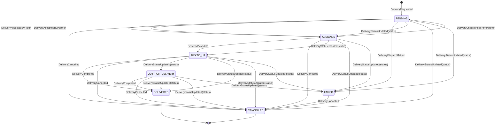
```mermaid
stateDiagram-v2
  [*] --> PENDING : DeliveryRequested
  PENDING --> ASSIGNED : DeliveryAcceptedByRider
  PENDING --> ASSIGNED : DeliveryAcceptedByPartner
  ASSIGNED --> PENDING : DeliveryUnassignedFromPartner
  ASSIGNED --> PICKED_UP : DeliveryPickedUp
  PICKED_UP --> DELIVERED : DeliveryCompleted
  OUT_FOR_DELIVERY --> DELIVERED : DeliveryCompleted
  PENDING --> CANCELLED : DeliveryCancelled
  ASSIGNED --> CANCELLED : DeliveryCancelled
  PICKED_UP --> CANCELLED : DeliveryCancelled
  OUT_FOR_DELIVERY --> CANCELLED : DeliveryCancelled
  FAILED --> CANCELLED : DeliveryCancelled
  PENDING --> FAILED : DeliveryDispatchFailed
  PENDING --> ASSIGNED : DeliveryStatusUpdated(status)
  ASSIGNED --> PICKED_UP : DeliveryStatusUpdated(status)
  PICKED_UP --> OUT_FOR_DELIVERY : DeliveryStatusUpdated(status)
  PICKED_UP --> DELIVERED : DeliveryStatusUpdated(status)
  OUT_FOR_DELIVERY --> DELIVERED : DeliveryStatusUpdated(status)
  PENDING --> CANCELLED : DeliveryStatusUpdated(status)
  ASSIGNED --> CANCELLED : DeliveryStatusUpdated(status)
  PICKED_UP --> CANCELLED : DeliveryStatusUpdated(status)
  OUT_FOR_DELIVERY --> CANCELLED : DeliveryStatusUpdated(status)
  PENDING --> FAILED : DeliveryStatusUpdated(status)
  ASSIGNED --> FAILED : DeliveryStatusUpdated(status)
  PICKED_UP --> FAILED : DeliveryStatusUpdated(status)
  OUT_FOR_DELIVERY --> FAILED : DeliveryStatusUpdated(status)
  DELIVERED --> [*]
  CANCELLED --> [*]
```

<a id="actor-rider"></a>
#### 🎭 Actor: `Rider`

_🧩 aggregate_ — A rider identity, linked to the auth provider user (authRef).

| Receives | Emits → | Throws |
| --- | --- | --- |
| [📩 `RegisterRider`](#command-registerrider) | [⚡ `RiderRegistered`](#event-riderregistered) | [⛔ `RiderAlreadyRegistered`](#error-rideralreadyregistered), [⛔ `RiderAuthSubjectAlreadyBound`](#error-riderauthsubjectalreadybound) |
| [📩 `UpdateRiderInfo`](#command-updateriderinfo) | [⚡ `RiderInfoUpdated`](#event-riderinfoupdated) | [⛔ `RiderNotFound`](#error-ridernotfound), [⛔ `NoEditableFieldProvided`](#error-noeditablefieldprovided) |
| [📩 `ChangeRiderStatus`](#command-changeriderstatus) | [⚡ `RiderStatusChanged`](#event-riderstatuschanged) | [⛔ `RiderNotFound`](#error-ridernotfound), [⛔ `InvalidRiderStatusTransition`](#error-invalidriderstatustransition) |

Lifecycle (generated from the declared state machine):

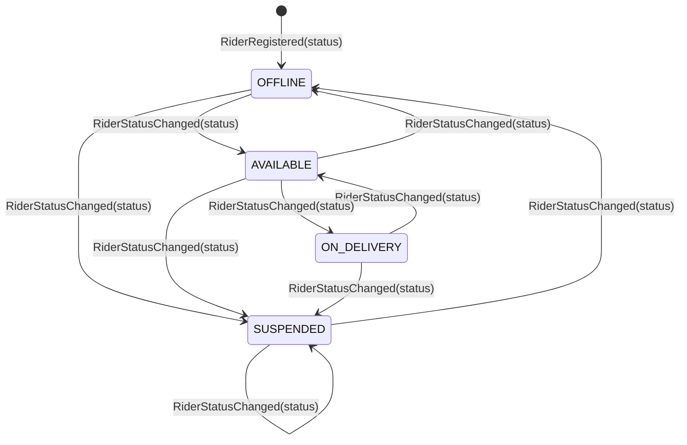
```mermaid
stateDiagram-v2
  [*] --> OFFLINE : RiderRegistered(status)
  OFFLINE --> AVAILABLE : RiderStatusChanged(status)
  ON_DELIVERY --> AVAILABLE : RiderStatusChanged(status)
  AVAILABLE --> OFFLINE : RiderStatusChanged(status)
  SUSPENDED --> OFFLINE : RiderStatusChanged(status)
  AVAILABLE --> ON_DELIVERY : RiderStatusChanged(status)
  OFFLINE --> SUSPENDED : RiderStatusChanged(status)
  AVAILABLE --> SUSPENDED : RiderStatusChanged(status)
  ON_DELIVERY --> SUSPENDED : RiderStatusChanged(status)
  SUSPENDED --> SUSPENDED : RiderStatusChanged(status)
```

<a id="actor-deliverydispatchprocess"></a>
#### 🎭 Actor: `DeliveryDispatchProcess`

_⚙️ process manager_ — Dispatches and tracks deliveries (bounded context: delivery, ADR-0031; resolve→walk strategy, #60). When a DELIVERY order is marked ready, delivers the DeliveryRequested birth to the DeliveryJob (deterministic UUIDv5 job id from the order id = idempotency key), then RESOLVES a dispatch strategy: a RESTAURANT-dispatch order short-circuits to SELF_DISPATCHED (Captain offers no channel and only tracks — the restaurant drives progress and the customer still gets tracking); a CAPTAIN-dispatch order WALKS the city's ranked channel list (CityDeliveryRanking), offering the rank-1 channel. Three triggers advance the walk to the next ranked channel — a partner decline (DeliveryRejectedByPartner), an offer timeout (DeliveryOfferTimedOut) and a manual operator escalate (DeliveryEscalationRequested) — until the list is exhausted, then fails closed with DeliveryDispatchFailed (fail-closed, rules.yaml#/DispatchExhaustionFailsClosed — #60 supersedes the ADR-20260720-004556 numeric cap-3). Channel selection and "channels remain?" are RUNTIME HOOKS (the CityDeliveryRanking read/selection the value forms cannot carry), so each leg carries its branches linearly with notes. Closes the order on delivery by sending MarkOrderDelivered — the Order validates the transition, so a terminal cancelled/rejected order is never resurrected.


| Receives | Emits → | Throws |
| --- | --- | --- |
| [⚡ `OrderMarkedReady`](#event-ordermarkedready) | [⚡ `DeliveryRequested`](#event-deliveryrequested) | — |
| [⚡ `DeliveryAcceptedByPartner`](#event-deliveryacceptedbypartner) | _The partner accepted (inbound, recorded by the DeliveryJob aggregate — the courier lives on the job): just advance the run.
_ | [⛔ `DeliveryJobNotFound`](#error-deliveryjobnotfound) |
| [⚡ `DeliveryRejectedByPartner`](#event-deliveryrejectedbypartner) | [⚡ `DeliveryDispatchFailed`](#event-deliverydispatchfailed) | [⛔ `DeliveryJobNotFound`](#error-deliveryjobnotfound) |
| [⚡ `DeliveryEscalationRequested`](#event-deliveryescalationrequested) | [⚡ `DeliveryDispatchFailed`](#event-deliverydispatchfailed) | [⛔ `DeliveryJobNotFound`](#error-deliveryjobnotfound) |
| [⚡ `DeliveryOfferTimedOut`](#event-deliveryoffertimedout) | [⚡ `DeliveryDispatchFailed`](#event-deliverydispatchfailed) | [⛔ `DeliveryJobNotFound`](#error-deliveryjobnotfound) |
| [⚡ `DeliveryStatusUpdated`](#event-deliverystatusupdated) | [⚡ `OrderDelivered`](#event-orderdelivered) | [⛔ `DeliveryJobNotFound`](#error-deliveryjobnotfound) |
| [⚡ `DeliveryCompleted`](#event-deliverycompleted) | [⚡ `OrderDelivered`](#event-orderdelivered) | [⛔ `DeliveryJobNotFound`](#error-deliveryjobnotfound) |

Sequence (generated from the typed steps):

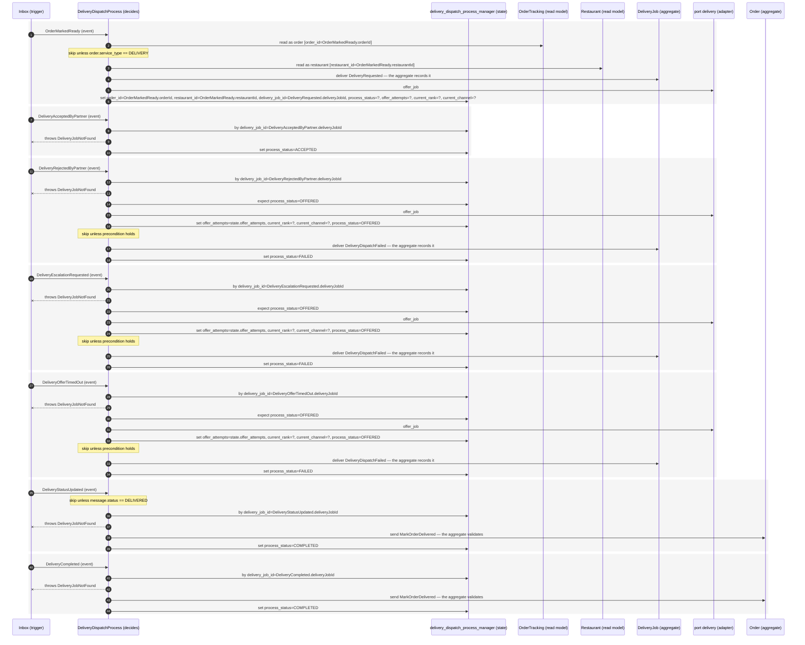
```mermaid
sequenceDiagram
  autonumber
  participant IN as Inbox (trigger)
  participant PM as DeliveryDispatchProcess (decides)
  participant ST as delivery_dispatch_process_manager (state)
  participant RM_OrderTracking as OrderTracking (read model)
  participant RM_Restaurant as Restaurant (read model)
  participant AG_DeliveryJob as DeliveryJob (aggregate)
  participant PT_delivery as port delivery (adapter)
  participant AG_Order as Order (aggregate)
  rect rgb(245,245,245)
  IN->>PM: OrderMarkedReady (event)
  PM->>RM_OrderTracking: read as order [order_id=OrderMarkedReady.orderId]
  Note over PM: skip unless order.service_type == DELIVERY
  PM->>RM_Restaurant: read as restaurant [restaurant_id=OrderMarkedReady.restaurantId]
  PM->>AG_DeliveryJob: deliver DeliveryRequested — the aggregate records it
  PM->>PT_delivery: offer_job
  PM->>ST: set order_id=OrderMarkedReady.orderId, restaurant_id=OrderMarkedReady.restaurantId, delivery_job_id=DeliveryRequested.deliveryJobId, process_status=?, offer_attempts=?, current_rank=?, current_channel=?
  end
  rect rgb(245,245,245)
  IN->>PM: DeliveryAcceptedByPartner (event)
  PM->>ST: by delivery_job_id=DeliveryAcceptedByPartner.deliveryJobId
  PM--xIN: throws DeliveryJobNotFound
  PM->>ST: set process_status=ACCEPTED
  end
  rect rgb(245,245,245)
  IN->>PM: DeliveryRejectedByPartner (event)
  PM->>ST: by delivery_job_id=DeliveryRejectedByPartner.deliveryJobId
  PM--xIN: throws DeliveryJobNotFound
  PM->>ST: expect process_status=OFFERED
  PM->>PT_delivery: offer_job
  PM->>ST: set offer_attempts=state.offer_attempts, current_rank=?, current_channel=?, process_status=OFFERED
  Note over PM: skip unless precondition holds
  PM->>AG_DeliveryJob: deliver DeliveryDispatchFailed — the aggregate records it
  PM->>ST: set process_status=FAILED
  end
  rect rgb(245,245,245)
  IN->>PM: DeliveryEscalationRequested (event)
  PM->>ST: by delivery_job_id=DeliveryEscalationRequested.deliveryJobId
  PM--xIN: throws DeliveryJobNotFound
  PM->>ST: expect process_status=OFFERED
  PM->>PT_delivery: offer_job
  PM->>ST: set offer_attempts=state.offer_attempts, current_rank=?, current_channel=?, process_status=OFFERED
  Note over PM: skip unless precondition holds
  PM->>AG_DeliveryJob: deliver DeliveryDispatchFailed — the aggregate records it
  PM->>ST: set process_status=FAILED
  end
  rect rgb(245,245,245)
  IN->>PM: DeliveryOfferTimedOut (event)
  PM->>ST: by delivery_job_id=DeliveryOfferTimedOut.deliveryJobId
  PM--xIN: throws DeliveryJobNotFound
  PM->>ST: expect process_status=OFFERED
  PM->>PT_delivery: offer_job
  PM->>ST: set offer_attempts=state.offer_attempts, current_rank=?, current_channel=?, process_status=OFFERED
  Note over PM: skip unless precondition holds
  PM->>AG_DeliveryJob: deliver DeliveryDispatchFailed — the aggregate records it
  PM->>ST: set process_status=FAILED
  end
  rect rgb(245,245,245)
  IN->>PM: DeliveryStatusUpdated (event)
  Note over PM: skip unless message.status == DELIVERED
  PM->>ST: by delivery_job_id=DeliveryStatusUpdated.deliveryJobId
  PM--xIN: throws DeliveryJobNotFound
  PM->>AG_Order: send MarkOrderDelivered — the aggregate validates
  PM->>ST: set process_status=COMPLETED
  end
  rect rgb(245,245,245)
  IN->>PM: DeliveryCompleted (event)
  PM->>ST: by delivery_job_id=DeliveryCompleted.deliveryJobId
  PM--xIN: throws DeliveryJobNotFound
  PM->>AG_Order: send MarkOrderDelivered — the aggregate validates
  PM->>ST: set process_status=COMPLETED
  end
```

### 🗄️ Views (read models) _(3)_

<a id="view-view_deliveryjob"></a>
#### 🗄️ View: `View_DeliveryJob`

- **Source**: [🎭 `DeliveryJob`](#actor-deliveryjob) · 🛶 V0
- **Rules**: `status` is derived from the lifecycle events: PENDING on DeliveryRequested → ASSIGNED on DeliveryAcceptedByRider/DeliveryAcceptedByPartner → PICKED_UP on DeliveryPickedUp → then partner DeliveryStatusUpdated (OUT_FOR_DELIVERY/DELIVERED/FAILED) or DeliveryCompleted (DELIVERED) / DeliveryCancelled (CANCELLED) / DeliveryDispatchFailed (FAILED — offer cap exhausted, ADR-20260720-004556). `provider` is INDEPENDENT once a rider accepts, PARTNER once a partner accepts.
- **Fed by**: [⚡ `DeliveryRequested`](#event-deliveryrequested), [⚡ `DeliveryAcceptedByPartner`](#event-deliveryacceptedbypartner), [⚡ `DeliveryRejectedByPartner`](#event-deliveryrejectedbypartner), [⚡ `DeliveryStatusUpdated`](#event-deliverystatusupdated), [⚡ `DeliveryAcceptedByRider`](#event-deliveryacceptedbyrider), [⚡ `DeliveryPickedUp`](#event-deliverypickedup), [⚡ `DeliveryCompleted`](#event-deliverycompleted), [⚡ `DeliveryCancelled`](#event-deliverycancelled), [⚡ `DeliveryDispatchFailed`](#event-deliverydispatchfailed)

| Column | Type | Sourced from | Constraints | Notes |
| --- | --- | --- | --- | --- |
| `delivery_job_id` | [🔤 `DeliveryJobId`](#scalar-deliveryjobid) _(derived)_ | [⚡ `DeliveryRequested`.`deliveryJobId`](#event-deliveryrequested--deliveryjobid) | PK |  |
| `order_id` | [🔤 `OrderId`](#scalar-orderid) _(derived)_ → [🗄️ `OrderTracking`](#view-ordertracking) | [⚡ `DeliveryRequested`.`orderId`](#event-deliveryrequested--orderid) | index |  |
| `restaurant_id` | [🔤 `RestaurantId`](#scalar-restaurantid) _(derived)_ → [🗄️ `Restaurant`](#view-restaurant) | [⚡ `DeliveryRequested`.`restaurantId`](#event-deliveryrequested--restaurantid) | — |  |
| `status` | [🔤 `DeliveryStatus`](#scalar-deliverystatus) | [⚡ `DeliveryRequested`](#event-deliveryrequested), [⚡ `DeliveryAcceptedByRider`](#event-deliveryacceptedbyrider), [⚡ `DeliveryAcceptedByPartner`](#event-deliveryacceptedbypartner), [⚡ `DeliveryPickedUp`](#event-deliverypickedup), [⚡ `DeliveryStatusUpdated`](#event-deliverystatusupdated), [⚡ `DeliveryCompleted`](#event-deliverycompleted), [⚡ `DeliveryCancelled`](#event-deliverycancelled), [⚡ `DeliveryDispatchFailed`](#event-deliverydispatchfailed) | — | Derived from the lifecycle event type / DeliveryStatusUpdated.status (DeliveryDispatchFailed → FAILED, the offer-cap exhaustion). |
| `provider` | [🔤 `DeliveryProvider`](#scalar-deliveryprovider) | [⚡ `DeliveryAcceptedByRider`](#event-deliveryacceptedbyrider), [⚡ `DeliveryAcceptedByPartner`](#event-deliveryacceptedbypartner) | nullable | INDEPENDENT (rider accepted) or PARTNER (partner accepted); null while PENDING. |
| `rider_id` | [🔤 `RiderId`](#scalar-riderid) | [⚡ `DeliveryAcceptedByRider`.`riderId`](#event-deliveryacceptedbyrider--riderid) | nullable | Set for an independent-rider delivery; null for a partner delivery. |
| `courier` | `jsonb` | [⚡ `DeliveryAcceptedByPartner`.`courier`](#event-deliveryacceptedbypartner--courier) | nullable | Courier { displayName, phone?, riderId? }; from the partner on acceptance (independent rider is in rider_id). |
| `partner_ref` | [🔤 `ExternalReference`](#scalar-externalreference) | [⚡ `DeliveryAcceptedByPartner`.`partnerRef`](#event-deliveryacceptedbypartner--partnerref) | nullable | Partner-side delivery id; idempotent key for inbound updates. |
| `pickup_address` | `jsonb` | [⚡ `DeliveryRequested`.`pickup`](#event-deliveryrequested--pickup) | — |  |
| `dropoff_address` | `jsonb` | [⚡ `DeliveryRequested`.`dropoff`](#event-deliveryrequested--dropoff) | — |  |
| `estimated_pickup_at` | `timestamptz` | [⚡ `DeliveryAcceptedByPartner`.`estimatedPickupAt`](#event-deliveryacceptedbypartner--estimatedpickupat) | nullable |  |
| `estimated_dropoff_at` | `timestamptz` | [⚡ `DeliveryAcceptedByPartner`.`estimatedDropoffAt`](#event-deliveryacceptedbypartner--estimateddropoffat) | nullable |  |
| `requested_at` | `timestamptz` | [⚡ `DeliveryRequested`](#event-deliveryrequested) | — | DeliveryRequested occurrence time. |
| `picked_up_at` | `timestamptz` | [⚡ `DeliveryPickedUp`](#event-deliverypickedup) | nullable |  |
| `delivered_at` | `timestamptz` | [⚡ `DeliveryCompleted`](#event-deliverycompleted), [⚡ `DeliveryStatusUpdated`](#event-deliverystatusupdated) | nullable | Set on DeliveryCompleted or DeliveryStatusUpdated=DELIVERED (conditional occurrence). |
| `last_partner_rejection` | `text` | [⚡ `DeliveryRejectedByPartner`.`reason`](#event-deliveryrejectedbypartner--reason) | nullable | Reason of the latest partner decline (the job stays PENDING and is re-offered, up to the 3-offer cap — ADR-20260720-004556); null if never rejected. |
| `created_at` | `timestamptz` | ⚠️ _(none)_ | — | technical — stamped from event.occurred_at (implicit on every read model) |
| `updated_at` | `timestamptz` | ⚠️ _(none)_ | — | technical — stamped from event.occurred_at (implicit on every read model) |

<a id="view-view_deliverypartneravailability"></a>
#### 🗄️ View: `View_DeliveryPartnerAvailability`

- **Source**: [🎭 `DeliveryPartnerRegistration`](#actor-deliverypartnerregistration) · 🔭 V1
- **Rules**: `status` is derived from the latest lifecycle event type: PENDING on Requested → APPROVED on Approved → REVOKED on Revoked. Set-once identity fields (channel, city_id, partner_name, contact_email) are carried only by the Requested birth fact.
- **Fed by**: [⚡ `DeliveryPartnerAvailabilityRequested`](#event-deliverypartneravailabilityrequested), [⚡ `DeliveryPartnerAvailabilityApproved`](#event-deliverypartneravailabilityapproved), [⚡ `DeliveryPartnerAvailabilityRevoked`](#event-deliverypartneravailabilityrevoked)

| Column | Type | Sourced from | Constraints | Notes |
| --- | --- | --- | --- | --- |
| `registration_id` | [🔤 `DeliveryPartnerRegistrationId`](#scalar-deliverypartnerregistrationid) _(derived)_ | [⚡ `DeliveryPartnerAvailabilityRequested`.`registrationId`](#event-deliverypartneravailabilityrequested--registrationid) | PK |  |
| `channel` | [🔤 `DeliveryChannelKey`](#scalar-deliverychannelkey) _(derived)_ | [⚡ `DeliveryPartnerAvailabilityRequested`.`channel`](#event-deliverypartneravailabilityrequested--channel) | — |  |
| `city_id` | [🔤 `CityId`](#scalar-cityid) _(derived)_ | [⚡ `DeliveryPartnerAvailabilityRequested`.`cityId`](#event-deliverypartneravailabilityrequested--cityid) | index |  |
| `partner_name` | [🔤 `DeliveryPartnerName`](#scalar-deliverypartnername) _(derived)_ | [⚡ `DeliveryPartnerAvailabilityRequested`.`partnerName`](#event-deliverypartneravailabilityrequested--partnername) | — |  |
| `contact_email` | [🔤 `EmailAddress`](#scalar-emailaddress) _(derived)_ | [⚡ `DeliveryPartnerAvailabilityRequested`.`contactEmail`](#event-deliverypartneravailabilityrequested--contactemail) | — |  |
| `status` | [🔤 `CityAvailabilityStatus`](#scalar-cityavailabilitystatus) | [⚡ `DeliveryPartnerAvailabilityRequested`](#event-deliverypartneravailabilityrequested), [⚡ `DeliveryPartnerAvailabilityApproved`](#event-deliverypartneravailabilityapproved), [⚡ `DeliveryPartnerAvailabilityRevoked`](#event-deliverypartneravailabilityrevoked) | — | Derived from the latest lifecycle event type. |
| `requested_at` | `timestamptz` | [⚡ `DeliveryPartnerAvailabilityRequested`](#event-deliverypartneravailabilityrequested) | — | occurrence: max(occurred_at) of the birth fact. |
| `decided_at` | `timestamptz` | [⚡ `DeliveryPartnerAvailabilityApproved`](#event-deliverypartneravailabilityapproved), [⚡ `DeliveryPartnerAvailabilityRevoked`](#event-deliverypartneravailabilityrevoked) | nullable | occurrence: max(occurred_at) of the latest decision (approve/revoke); null while PENDING. |
| `created_at` | `timestamptz` | ⚠️ _(none)_ | — | technical — stamped from event.occurred_at (implicit on every read model) |
| `updated_at` | `timestamptz` | ⚠️ _(none)_ | — | technical — stamped from event.occurred_at (implicit on every read model) |

<a id="view-rider"></a>
#### 🗄️ View: `Rider`

- **Source**: [🎭 `Rider`](#actor-rider) · 🛶 V0 · 🔒 internal
- **Note**: The rider identity read model: the auth subject -> riderId mapping the authenticated request path resolves against (ADR-20260818-004646 -- no business identifier lives in the identity provider, so the mapping resolves in OUR Postgres), plus the rider's profile and availability. `RiderRegistered` has always carried `authRef` as required; until #639 nothing projected it, so `auth_ref` occurred exactly once in the whole projection set, on Customer, and the RIDER role had no sign-in-capable identity at all. A TABLE and not a `View_*` for the reason SlugAlias states three declarations up: this is read on EVERY authenticated request and must never fold on read -- peak is Friday/Saturday 19:00-21:30. Recovery is REPLAY, so there is no backup of it and there must not be one. 
- **Rules**: This table answers WHO this connection is. It must never become the anchor for WHAT that connection may see -- the distinction the mapping exists to preserve. Concretely: the resolver reads `auth_ref -> rider_id` and NOTHING else. `status` sits in the same row and will tempt a `SUSPENDED => deny` check onto the auth path; that check belongs in the handler folding the `Rider-{id}` stream, which owns the transition table (delivery/actors.yaml) and reads it anyway. A read model is not an authorization oracle, and revocation is separately recorded as unrepresentable today -- there is no unbinding fact for anyone in the model (ADR-20260818-094500 finding 5). `auth_ref` is UNIQUE, not merely indexed, and the difference is a security property rather than a performance one: the repository lookup is `fetch_optional`, which on multiplicity returns an ARBITRARY row -- plan-dependent, no error -- and `ScopeMembership` keys its grants on `member_id = rider_id`, so a duplicate would hand one rider another rider's order scope. The constraint converts a silent breach into a visible denial. It does NOT create the invariant: nothing on the write side prevents two `RiderRegistered` with the same `authRef` and different `riderId`s (`register_rider` guards `riderId` existence only), and the write-side reservation that does is `database/tables/reservations.yaml#/auth_subject_reservations`, keyed `(principal_kind, auth_subject)` and pinned by `rules.yaml#/RiderAuthSubjectBoundOnce`: `register_rider` reserves BEFORE the append, so a duplicate is refused up front and this constraint is the second line, never the first. Uniqueness over a POPULATION is not an aggregate's to enforce. `phone` carries NO unique constraint and NO index, deliberately, and this is where copying Customer would inject a defect: Customer.phone is UNIQUE because it is that aggregate's identity key, whereas a rider is keyed by `authRef` precisely so the phone never becomes a domain key. French mobile numbers are recycled, so a unique phone here is a scheduled future projector fault on a number's second owner. Rebuild by RESETTING THE CHECKPOINT, never by TRUNCATE. The fold is an upsert keyed on `rider_id` and `RiderRegistered` is the only creating arm, so a from-zero replay rewrites every row in place and no rider is ever denied mid-rebuild. TRUNCATE + replay does the opposite: every rider fails closed to Public for the length of the drain, and the fleet cannot sign in. ERASURE, named here so the sweep cannot miss an app-projected table the generated dispatch skips (the ScopeMembership precedent): `display_name` and `phone` are a natural person's data held OUTSIDE the stream, and the deletion engine deletes streams, not projection rows. Delivery declares no `deletion:` block for Rider today, so there is nothing to build yet -- but a rider tombstone fold is OWED the moment one is declared.
- **Fed by**: [⚡ `RiderRegistered`](#event-riderregistered), [⚡ `RiderInfoUpdated`](#event-riderinfoupdated), [⚡ `RiderStatusChanged`](#event-riderstatuschanged)

| Column | Type | Sourced from | Constraints | Notes |
| --- | --- | --- | --- | --- |
| `rider_id` | [🔤 `RiderId`](#scalar-riderid) _(derived)_ | [⚡ `RiderRegistered`.`riderId`](#event-riderregistered--riderid) | PK |  |
| `auth_ref` | [🔤 `AuthSubject`](#scalar-authsubject) _(derived)_ | [⚡ `RiderRegistered`.`authRef`](#event-riderregistered--authref) | unique | Auth provider user id (Supabase Auth) -> Rider. The lookup key of the identity bridge; see the `auth_ref` rule above for why the constraint is UNIQUE and what it does and does not guarantee. |
| `display_name` | `text` _(derived)_ | [⚡ `RiderRegistered`.`displayName`](#event-riderregistered--displayname), [⚡ `RiderInfoUpdated`.`displayName`](#event-riderinfoupdated--displayname) | — | Rider's display name; RiderInfoUpdated overwrites it only when it carries one. |
| `phone` | [🔤 `PhoneNumber`](#scalar-phonenumber) _(derived)_ | [⚡ `RiderRegistered`.`phone`](#event-riderregistered--phone), [⚡ `RiderInfoUpdated`.`phone`](#event-riderinfoupdated--phone) | — | Contact number, a profile attribute and never a lookup key -- see the `phone` rule above. NOT NULL for the same partial-update reason as display_name. |
| `status` | [🔤 `RiderStatus`](#scalar-riderstatus) _(derived)_ | [⚡ `RiderRegistered`.`status`](#event-riderregistered--status), [⚡ `RiderStatusChanged`.`status`](#event-riderstatuschanged--status) | — | Availability/lifecycle status, straight off the payload of whichever event wrote last. |
| `created_at` | `timestamptz` | ⚠️ _(none)_ | — | technical — stamped from event.occurred_at (implicit on every read model) |
| `updated_at` | `timestamptz` | ⚠️ _(none)_ | — | technical — stamped from event.occurred_at (implicit on every read model) |

### 📩 Commands _(16)_

<a id="command-acceptdelivery"></a>
#### 📩 Command: `AcceptDelivery`

An independent Captain rider accepts a pending delivery job.

- **Dispatched by**: [✏️ `acceptDelivery`](#mutation-acceptdelivery) · **handled by** [🎭 `DeliveryJob`](#actor-deliveryjob)
- **Emits**: [⚡ `DeliveryAcceptedByRider`](#event-deliveryacceptedbyrider)
- **Throws**: [⛔ `DeliveryJobNotFound`](#error-deliveryjobnotfound), [⛔ `InvalidDeliveryStatus`](#error-invaliddeliverystatus), [⛔ `DeliveryAlreadyAssigned`](#error-deliveryalreadyassigned)

| Field | Type | Required | Description |
| --- | --- | --- | --- |
| <a id="command-acceptdelivery--deliveryjobid"></a>`deliveryJobId` | [🔤 `DeliveryJobId`](#scalar-deliveryjobid) | ✅ |  |
| <a id="command-acceptdelivery--riderid"></a>`riderId` | [🔤 `RiderId`](#scalar-riderid) | ✅ |  |

<a id="command-confirmpickup"></a>
#### 📩 Command: `ConfirmPickup`

The assigned rider confirms they collected the order from the restaurant.

- **Dispatched by**: [✏️ `confirmPickup`](#mutation-confirmpickup) · **handled by** [🎭 `DeliveryJob`](#actor-deliveryjob)
- **Emits**: [⚡ `DeliveryPickedUp`](#event-deliverypickedup)
- **Throws**: [⛔ `DeliveryJobNotFound`](#error-deliveryjobnotfound), [⛔ `InvalidDeliveryStatus`](#error-invaliddeliverystatus)

| Field | Type | Required | Description |
| --- | --- | --- | --- |
| <a id="command-confirmpickup--deliveryjobid"></a>`deliveryJobId` | [🔤 `DeliveryJobId`](#scalar-deliveryjobid) | ✅ |  |
| <a id="command-confirmpickup--riderid"></a>`riderId` | [🔤 `RiderId`](#scalar-riderid) | ✅ |  |

<a id="command-canceldelivery"></a>
#### 📩 Command: `CancelDelivery`

Restaurant/admin cancels a delivery job before it completes.

- **Dispatched by**: [✏️ `cancelDelivery`](#mutation-canceldelivery) · **handled by** [🎭 `DeliveryJob`](#actor-deliveryjob)
- **Emits**: [⚡ `DeliveryCancelled`](#event-deliverycancelled)
- **Throws**: [⛔ `DeliveryJobNotFound`](#error-deliveryjobnotfound), [⛔ `InvalidDeliveryStatus`](#error-invaliddeliverystatus)

| Field | Type | Required | Description |
| --- | --- | --- | --- |
| <a id="command-canceldelivery--deliveryjobid"></a>`deliveryJobId` | [🔤 `DeliveryJobId`](#scalar-deliveryjobid) | ✅ |  |
| <a id="command-canceldelivery--reason"></a>`reason` | `string` | ⬜ |  |

<a id="command-escalatedelivery"></a>
#### 📩 Command: `EscalateDelivery`

Restaurant/admin asks to skip the delivery channel currently offered and advance the ranked walk now (#60). The DeliveryJob emits DeliveryEscalationRequested; DeliveryDispatchProcess offers the next ranked channel, or fails the dispatch closed when the walk is exhausted. Self-dispatch and exhaustion are handled by the saga (a benign skip / a terminal fact), not rejected as command errors.

- **Dispatched by**: [✏️ `escalateDelivery`](#mutation-escalatedelivery) · **handled by** [🎭 `DeliveryJob`](#actor-deliveryjob)
- **Emits**: [⚡ `DeliveryEscalationRequested`](#event-deliveryescalationrequested)
- **Throws**: [⛔ `DeliveryJobNotFound`](#error-deliveryjobnotfound)

| Field | Type | Required | Description |
| --- | --- | --- | --- |
| <a id="command-escalatedelivery--deliveryjobid"></a>`deliveryJobId` | [🔤 `DeliveryJobId`](#scalar-deliveryjobid) | ✅ |  |
| <a id="command-escalatedelivery--reason"></a>`reason` | `string` | ⬜ |  |

<a id="command-completedelivery"></a>
#### 📩 Command: `CompleteDelivery`

The assigned rider marks the delivery complete (handed to the customer).

- **Dispatched by**: [✏️ `completeDelivery`](#mutation-completedelivery) · **handled by** [🎭 `DeliveryJob`](#actor-deliveryjob)
- **Emits**: [⚡ `DeliveryCompleted`](#event-deliverycompleted)
- **Throws**: [⛔ `DeliveryJobNotFound`](#error-deliveryjobnotfound), [⛔ `InvalidDeliveryStatus`](#error-invaliddeliverystatus)

| Field | Type | Required | Description |
| --- | --- | --- | --- |
| <a id="command-completedelivery--deliveryjobid"></a>`deliveryJobId` | [🔤 `DeliveryJobId`](#scalar-deliveryjobid) | ✅ |  |
| <a id="command-completedelivery--riderid"></a>`riderId` | [🔤 `RiderId`](#scalar-riderid) | ✅ |  |

<a id="command-declinedelivery"></a>
#### 📩 Command: `DeclineDelivery`

An independent rider declines a pending delivery job (it stays PENDING, re-offerable).

- **Dispatched by**: — · **handled by** [🎭 `DeliveryJob`](#actor-deliveryjob)
- **Emits**: [⚡ `DeliveryDeclinedByRider`](#event-deliverydeclinedbyrider)
- **Throws**: [⛔ `DeliveryJobNotFound`](#error-deliveryjobnotfound), [⛔ `InvalidDeliveryStatus`](#error-invaliddeliverystatus), [⛔ `DeliveryAlreadyAssigned`](#error-deliveryalreadyassigned)

| Field | Type | Required | Description |
| --- | --- | --- | --- |
| <a id="command-declinedelivery--deliveryjobid"></a>`deliveryJobId` | [🔤 `DeliveryJobId`](#scalar-deliveryjobid) | ✅ |  |
| <a id="command-declinedelivery--riderid"></a>`riderId` | [🔤 `RiderId`](#scalar-riderid) | ✅ |  |
| <a id="command-declinedelivery--reason"></a>`reason` | `string` | ⬜ |  |

<a id="command-reportdeliveryissue"></a>
#### 📩 Command: `ReportDeliveryIssue`

Report an issue on a delivery job (rider/partner/support).

- **Dispatched by**: — · **handled by** [🎭 `DeliveryJob`](#actor-deliveryjob)
- **Emits**: [⚡ `DeliveryIssueReported`](#event-deliveryissuereported)
- **Throws**: [⛔ `DeliveryJobNotFound`](#error-deliveryjobnotfound), [⛔ `InvalidDeliveryStatus`](#error-invaliddeliverystatus)

| Field | Type | Required | Description |
| --- | --- | --- | --- |
| <a id="command-reportdeliveryissue--deliveryjobid"></a>`deliveryJobId` | [🔤 `DeliveryJobId`](#scalar-deliveryjobid) | ✅ |  |
| <a id="command-reportdeliveryissue--riderid"></a>`riderId` | [🔤 `RiderId`](#scalar-riderid) | ⬜ |  |
| <a id="command-reportdeliveryissue--issue"></a>`issue` | `string` | ✅ |  |

<a id="command-resolvedeliveryissue"></a>
#### 📩 Command: `ResolveDeliveryIssue`

Resolve a previously reported delivery issue.

- **Dispatched by**: — · **handled by** [🎭 `DeliveryJob`](#actor-deliveryjob)
- **Emits**: [⚡ `DeliveryIssueResolved`](#event-deliveryissueresolved)
- **Throws**: [⛔ `DeliveryJobNotFound`](#error-deliveryjobnotfound), [⛔ `InvalidDeliveryStatus`](#error-invaliddeliverystatus)

| Field | Type | Required | Description |
| --- | --- | --- | --- |
| <a id="command-resolvedeliveryissue--deliveryjobid"></a>`deliveryJobId` | [🔤 `DeliveryJobId`](#scalar-deliveryjobid) | ✅ |  |
| <a id="command-resolvedeliveryissue--resolution"></a>`resolution` | `string` | ✅ |  |

<a id="command-updatedeliverystatus"></a>
#### 📩 Command: `UpdateDeliveryStatus`

Drive a delivery job's status (independent-rider path / admin correction).

- **Dispatched by**: — · **handled by** [🎭 `DeliveryJob`](#actor-deliveryjob)
- **Emits**: [⚡ `DeliveryStatusUpdated`](#event-deliverystatusupdated)
- **Throws**: [⛔ `DeliveryJobNotFound`](#error-deliveryjobnotfound), [⛔ `InvalidDeliveryStatus`](#error-invaliddeliverystatus)

| Field | Type | Required | Description |
| --- | --- | --- | --- |
| <a id="command-updatedeliverystatus--deliveryjobid"></a>`deliveryJobId` | [🔤 `DeliveryJobId`](#scalar-deliveryjobid) | ✅ |  |
| <a id="command-updatedeliverystatus--status"></a>`status` | [🔤 `DeliveryStatus`](#scalar-deliverystatus) | ✅ |  |

<a id="command-unassigndeliveryfrompartner"></a>
#### 📩 Command: `UnassignDeliveryFromPartner`

Unassign a delivery job from its partner (to re-offer it).

- **Dispatched by**: — · **handled by** [🎭 `DeliveryJob`](#actor-deliveryjob)
- **Emits**: [⚡ `DeliveryUnassignedFromPartner`](#event-deliveryunassignedfrompartner)
- **Throws**: [⛔ `DeliveryJobNotFound`](#error-deliveryjobnotfound), [⛔ `InvalidDeliveryStatus`](#error-invaliddeliverystatus)

| Field | Type | Required | Description |
| --- | --- | --- | --- |
| <a id="command-unassigndeliveryfrompartner--deliveryjobid"></a>`deliveryJobId` | [🔤 `DeliveryJobId`](#scalar-deliveryjobid) | ✅ |  |
| <a id="command-unassigndeliveryfrompartner--reason"></a>`reason` | `string` | ⬜ |  |

<a id="command-registerdeliverypartneravailability"></a>
#### 📩 Command: `RegisterDeliveryPartnerAvailability`

A delivery partner self-registers its availability to serve a city on a catalog channel (#61). Birth of a DeliveryPartnerRegistration; lands PENDING until an admin approves. registrationId is client-generated (idempotent).

- **Dispatched by**: [✏️ `registerDeliveryPartnerAvailability`](#mutation-registerdeliverypartneravailability) · **handled by** [🎭 `DeliveryPartnerRegistration`](#actor-deliverypartnerregistration)
- **Emits**: [⚡ `DeliveryPartnerAvailabilityRequested`](#event-deliverypartneravailabilityrequested)
- **Throws**: [⛔ `DeliveryPartnerAvailabilityAlreadyRequested`](#error-deliverypartneravailabilityalreadyrequested)

| Field | Type | Required | Description |
| --- | --- | --- | --- |
| <a id="command-registerdeliverypartneravailability--registrationid"></a>`registrationId` | [🔤 `DeliveryPartnerRegistrationId`](#scalar-deliverypartnerregistrationid) | ✅ | Client-generated id for the new availability registration. |
| <a id="command-registerdeliverypartneravailability--channel"></a>`channel` | [🔤 `DeliveryChannelKey`](#scalar-deliverychannelkey) | ✅ | The catalog channel this partner operates (e.g. 'uber_direct'). |
| <a id="command-registerdeliverypartneravailability--cityid"></a>`cityId` | [🔤 `CityId`](#scalar-cityid) | ✅ |  |
| <a id="command-registerdeliverypartneravailability--partnername"></a>`partnerName` | [🔤 `DeliveryPartnerName`](#scalar-deliverypartnername) | ✅ |  |
| <a id="command-registerdeliverypartneravailability--contactemail"></a>`contactEmail` | [🔤 `EmailAddress`](#scalar-emailaddress) | ✅ |  |

<a id="command-approvedeliverypartneravailability"></a>
#### 📩 Command: `ApproveDeliveryPartnerAvailability`

An admin approves a PENDING delivery-partner availability registration (#61); it becomes eligible for the city's dispatch ranking.

- **Dispatched by**: [✏️ `approveDeliveryPartnerAvailability`](#mutation-approvedeliverypartneravailability) · **handled by** [🎭 `DeliveryPartnerRegistration`](#actor-deliverypartnerregistration)
- **Emits**: [⚡ `DeliveryPartnerAvailabilityApproved`](#event-deliverypartneravailabilityapproved)
- **Throws**: [⛔ `DeliveryPartnerAvailabilityNotFound`](#error-deliverypartneravailabilitynotfound), [⛔ `DeliveryPartnerAvailabilityNotPending`](#error-deliverypartneravailabilitynotpending)

| Field | Type | Required | Description |
| --- | --- | --- | --- |
| <a id="command-approvedeliverypartneravailability--registrationid"></a>`registrationId` | [🔤 `DeliveryPartnerRegistrationId`](#scalar-deliverypartnerregistrationid) | ✅ |  |

<a id="command-revokedeliverypartneravailability"></a>
#### 📩 Command: `RevokeDeliveryPartnerAvailability`

Revoke a delivery-partner availability registration (#61) — the partner withdraws or an admin disables it.

- **Dispatched by**: [✏️ `revokeDeliveryPartnerAvailability`](#mutation-revokedeliverypartneravailability) · **handled by** [🎭 `DeliveryPartnerRegistration`](#actor-deliverypartnerregistration)
- **Emits**: [⚡ `DeliveryPartnerAvailabilityRevoked`](#event-deliverypartneravailabilityrevoked)
- **Throws**: [⛔ `DeliveryPartnerAvailabilityNotFound`](#error-deliverypartneravailabilitynotfound)

| Field | Type | Required | Description |
| --- | --- | --- | --- |
| <a id="command-revokedeliverypartneravailability--registrationid"></a>`registrationId` | [🔤 `DeliveryPartnerRegistrationId`](#scalar-deliverypartnerregistrationid) | ✅ |  |
| <a id="command-revokedeliverypartneravailability--reason"></a>`reason` | `string` | ⬜ |  |

<a id="command-registerrider"></a>
#### 📩 Command: `RegisterRider`

Register as an independent Captain rider (linked to the auth provider user).

- **Dispatched by**: — · **handled by** [🎭 `Rider`](#actor-rider)
- **Emits**: [⚡ `RiderRegistered`](#event-riderregistered)
- **Throws**: [⛔ `RiderAlreadyRegistered`](#error-rideralreadyregistered), [⛔ `RiderAuthSubjectAlreadyBound`](#error-riderauthsubjectalreadybound)

| Field | Type | Required | Description |
| --- | --- | --- | --- |
| <a id="command-registerrider--riderid"></a>`riderId` | [🔤 `RiderId`](#scalar-riderid) | ✅ |  |
| <a id="command-registerrider--authref"></a>`authRef` | [🔤 `AuthSubject`](#scalar-authsubject) | ✅ |  |
| <a id="command-registerrider--displayname"></a>`displayName` | `string` | ✅ |  |
| <a id="command-registerrider--phone"></a>`phone` | [🔤 `PhoneNumber`](#scalar-phonenumber) | ✅ |  |

<a id="command-updateriderinfo"></a>
#### 📩 Command: `UpdateRiderInfo`

Update editable rider profile fields.

- **Dispatched by**: — · **handled by** [🎭 `Rider`](#actor-rider)
- **Emits**: [⚡ `RiderInfoUpdated`](#event-riderinfoupdated)
- **Throws**: [⛔ `RiderNotFound`](#error-ridernotfound), [⛔ `NoEditableFieldProvided`](#error-noeditablefieldprovided)

| Field | Type | Required | Description |
| --- | --- | --- | --- |
| <a id="command-updateriderinfo--riderid"></a>`riderId` | [🔤 `RiderId`](#scalar-riderid) | ✅ |  |
| <a id="command-updateriderinfo--displayname"></a>`displayName` | `string` | ⬜ |  |
| <a id="command-updateriderinfo--phone"></a>`phone` | [🔤 `PhoneNumber`](#scalar-phonenumber) | ⬜ |  |

<a id="command-changeriderstatus"></a>
#### 📩 Command: `ChangeRiderStatus`

Change a rider's availability/lifecycle status.

- **Dispatched by**: [✏️ `changeRiderStatus`](#mutation-changeriderstatus) · **handled by** [🎭 `Rider`](#actor-rider)
- **Emits**: [⚡ `RiderStatusChanged`](#event-riderstatuschanged)
- **Throws**: [⛔ `RiderNotFound`](#error-ridernotfound), [⛔ `InvalidRiderStatusTransition`](#error-invalidriderstatustransition)

| Field | Type | Required | Description |
| --- | --- | --- | --- |
| <a id="command-changeriderstatus--riderid"></a>`riderId` | [🔤 `RiderId`](#scalar-riderid) | ✅ |  |
| <a id="command-changeriderstatus--status"></a>`status` | [🔤 `RiderStatus`](#scalar-riderstatus) | ✅ |  |

### ⚡ Events _(21)_

<a id="event-deliveryrequested"></a>
#### ⚡ Event: `DeliveryRequested`

A delivery job has been created for a ready DELIVERY order and offered for fulfilment (dispatched to a partner and/or made available to independent riders). Emitted by DeliveryDispatchProcess.

- **Emitted by**: [🎭 `DeliveryJob`](#actor-deliveryjob), [🎭 `DeliveryDispatchProcess`](#actor-deliverydispatchprocess)
- **Consumed by**: [🎭 `DeliveryJob`](#actor-deliveryjob)
- **Projected into**: [🗄️ `View_DeliveryJob`](#view-view_deliveryjob)

| Field | Type | Required | Description |
| --- | --- | --- | --- |
| <a id="event-deliveryrequested--mode"></a>`mode` | [🔤 `Mode`](#scalar-mode) | ⬜ |  |
| <a id="event-deliveryrequested--deliveryjobid"></a>`deliveryJobId` | [🔤 `DeliveryJobId`](#scalar-deliveryjobid) | ✅ |  |
| <a id="event-deliveryrequested--orderid"></a>`orderId` | [🔤 `OrderId`](#scalar-orderid) | ✅ |  |
| <a id="event-deliveryrequested--restaurantid"></a>`restaurantId` | [🔤 `RestaurantId`](#scalar-restaurantid) | ✅ |  |
| <a id="event-deliveryrequested--pickup"></a>`pickup` | [📦 `Address`](#entity-address) | ✅ | Restaurant pickup address. |
| <a id="event-deliveryrequested--dropoff"></a>`dropoff` | [📦 `Address`](#entity-address) | ✅ | Customer delivery address. |
| <a id="event-deliveryrequested--provider"></a>`provider` | [🔤 `DeliveryProvider`](#scalar-deliveryprovider) | ⬜ | Intended channel when known at request time; resolved for certain on acceptance. |

<a id="event-deliveryacceptedbyrider"></a>
#### ⚡ Event: `DeliveryAcceptedByRider`

An independent Captain rider accepted the delivery job.

- **Emitted by**: [🎭 `DeliveryJob`](#actor-deliveryjob)
- **Consumed by**: —
- **Projected into**: [🗄️ `View_DeliveryJob`](#view-view_deliveryjob), [🗄️ `OrderTracking`](#view-ordertracking), [🗄️ `ScopeMembership`](#view-scopemembership)

| Field | Type | Required | Description |
| --- | --- | --- | --- |
| <a id="event-deliveryacceptedbyrider--deliveryjobid"></a>`deliveryJobId` | [🔤 `DeliveryJobId`](#scalar-deliveryjobid) | ✅ |  |
| <a id="event-deliveryacceptedbyrider--orderid"></a>`orderId` | [🔤 `OrderId`](#scalar-orderid) | ✅ | The order this job delivers — self-contained cross-aggregate keying (D-QW1 option b, ADR-20260808-234907; the PaymentRefunded precedent). |
| <a id="event-deliveryacceptedbyrider--riderid"></a>`riderId` | [🔤 `RiderId`](#scalar-riderid) | ✅ |  |

<a id="event-deliverypickedup"></a>
#### ⚡ Event: `DeliveryPickedUp`

The rider collected the order from the restaurant.

- **Emitted by**: [🎭 `DeliveryJob`](#actor-deliveryjob)
- **Consumed by**: —
- **Projected into**: [🗄️ `View_DeliveryJob`](#view-view_deliveryjob), [🗄️ `OrderTracking`](#view-ordertracking)

| Field | Type | Required | Description |
| --- | --- | --- | --- |
| <a id="event-deliverypickedup--deliveryjobid"></a>`deliveryJobId` | [🔤 `DeliveryJobId`](#scalar-deliveryjobid) | ✅ |  |
| <a id="event-deliverypickedup--orderid"></a>`orderId` | [🔤 `OrderId`](#scalar-orderid) | ✅ | The order this job delivers — self-contained cross-aggregate keying (D-QW1 option b, ADR-20260808-234907). |
| <a id="event-deliverypickedup--riderid"></a>`riderId` | [🔤 `RiderId`](#scalar-riderid) | ✅ |  |
| <a id="event-deliverypickedup--at"></a>`at` | `string` _date-time_ | ⬜ |  |

<a id="event-deliverycompleted"></a>
#### ⚡ Event: `DeliveryCompleted`

The rider handed the order over to the customer (independent-rider delivery success).

- **Emitted by**: [🎭 `DeliveryJob`](#actor-deliveryjob)
- **Consumed by**: [🎭 `DeliveryDispatchProcess`](#actor-deliverydispatchprocess)
- **Projected into**: [🗄️ `View_DeliveryJob`](#view-view_deliveryjob), [🗄️ `OrderTracking`](#view-ordertracking)

| Field | Type | Required | Description |
| --- | --- | --- | --- |
| <a id="event-deliverycompleted--deliveryjobid"></a>`deliveryJobId` | [🔤 `DeliveryJobId`](#scalar-deliveryjobid) | ✅ |  |
| <a id="event-deliverycompleted--orderid"></a>`orderId` | [🔤 `OrderId`](#scalar-orderid) | ✅ | The order this job delivers — self-contained cross-aggregate keying (D-QW1 option b, ADR-20260808-234907). |
| <a id="event-deliverycompleted--at"></a>`at` | `string` _date-time_ | ⬜ |  |

<a id="event-deliverycancelled"></a>
#### ⚡ Event: `DeliveryCancelled`

A delivery job was cancelled before delivery (e.g. by the restaurant or admin).

- **Emitted by**: [🎭 `DeliveryJob`](#actor-deliveryjob)
- **Consumed by**: —
- **Projected into**: [🗄️ `View_DeliveryJob`](#view-view_deliveryjob), [🗄️ `ScopeMembership`](#view-scopemembership)

| Field | Type | Required | Description |
| --- | --- | --- | --- |
| <a id="event-deliverycancelled--deliveryjobid"></a>`deliveryJobId` | [🔤 `DeliveryJobId`](#scalar-deliveryjobid) | ✅ |  |
| <a id="event-deliverycancelled--reason"></a>`reason` | `string` | ⬜ |  |

<a id="event-deliverydispatchfailed"></a>
#### ⚡ Event: `DeliveryDispatchFailed`

Dispatch failed terminally: the delivery partner declined the job at every offer attempt (cap of 3 total offers, ADR-20260720-004556). Emitted by DeliveryDispatchProcess (like DeliveryRequested) so read models surface the failed job to the restaurant for manual handling; no automatic retry follows.

- **Emitted by**: [🎭 `DeliveryJob`](#actor-deliveryjob), [🎭 `DeliveryDispatchProcess`](#actor-deliverydispatchprocess)
- **Consumed by**: [🎭 `DeliveryJob`](#actor-deliveryjob)
- **Projected into**: [🗄️ `View_DeliveryJob`](#view-view_deliveryjob), [🗄️ `OrderTracking`](#view-ordertracking), [🗄️ `ScopeMembership`](#view-scopemembership)

| Field | Type | Required | Description |
| --- | --- | --- | --- |
| <a id="event-deliverydispatchfailed--deliveryjobid"></a>`deliveryJobId` | [🔤 `DeliveryJobId`](#scalar-deliveryjobid) | ✅ |  |
| <a id="event-deliverydispatchfailed--orderid"></a>`orderId` | [🔤 `OrderId`](#scalar-orderid) | ✅ |  |
| <a id="event-deliverydispatchfailed--restaurantid"></a>`restaurantId` | [🔤 `RestaurantId`](#scalar-restaurantid) | ✅ |  |
| <a id="event-deliverydispatchfailed--attempts"></a>`attempts` | `integer` | ✅ | Total offer attempts made before giving up (the cap; the birth offer counts as 1). |
| <a id="event-deliverydispatchfailed--lastreason"></a>`lastReason` | `string` | ⬜ | Reason carried by the final partner decline, when the partner gave one. |

<a id="event-deliveryescalationrequested"></a>
#### ⚡ Event: `DeliveryEscalationRequested`

An operator (restaurant/admin) asked to skip the delivery channel currently offered and advance the ranked walk now (#60). Emitted by the DeliveryJob aggregate handling the EscalateDelivery command; consumed by DeliveryDispatchProcess, which offers the next ranked channel (or fails closed when the walk is exhausted). Internal dispatch mechanics — feeds no View_*.

- **Emitted by**: [🎭 `DeliveryJob`](#actor-deliveryjob)
- **Consumed by**: [🎭 `DeliveryDispatchProcess`](#actor-deliverydispatchprocess)
- **Projected into**: _non-projected (saga/transient)_

| Field | Type | Required | Description |
| --- | --- | --- | --- |
| <a id="event-deliveryescalationrequested--deliveryjobid"></a>`deliveryJobId` | [🔤 `DeliveryJobId`](#scalar-deliveryjobid) | ✅ |  |
| <a id="event-deliveryescalationrequested--reason"></a>`reason` | `string` | ⬜ | Why the operator escalated (optional free text). |

<a id="event-deliveryoffertimedout"></a>
#### ⚡ Event: `DeliveryOfferTimedOut`

An outstanding delivery offer expired before the channel answered (#60): the DeliveryOfferTimeoutWorker found an OFFERED run older than the resolved TTL and records this fact (authored like DeliveryDispatchFailed). Recorded by the DeliveryJob aggregate and consumed by DeliveryDispatchProcess, which advances the ranked walk to the next channel (or fails closed when exhausted). Internal dispatch mechanics — feeds no View_*.

- **Emitted by**: [🎭 `DeliveryJob`](#actor-deliveryjob)
- **Consumed by**: [🎭 `DeliveryJob`](#actor-deliveryjob), [🎭 `DeliveryDispatchProcess`](#actor-deliverydispatchprocess)
- **Projected into**: _non-projected (saga/transient)_

| Field | Type | Required | Description |
| --- | --- | --- | --- |
| <a id="event-deliveryoffertimedout--deliveryjobid"></a>`deliveryJobId` | [🔤 `DeliveryJobId`](#scalar-deliveryjobid) | ✅ |  |
| <a id="event-deliveryoffertimedout--channel"></a>`channel` | [🔤 `DeliveryChannelKey`](#scalar-deliverychannelkey) | ✅ | The channel whose offer timed out. |
| <a id="event-deliveryoffertimedout--rank"></a>`rank` | `integer` | ✅ | 1-based rank of the timed-out channel in the city's ranked walk. |
| <a id="event-deliveryoffertimedout--reason"></a>`reason` | `string` | ⬜ | Optional detail (e.g. the resolved TTL that elapsed). |

<a id="event-deliveryacceptedbypartner"></a>
#### ⚡ Event: `DeliveryAcceptedByPartner`

The delivery partner (e.g. Avelo37) accepted the job and assigned one of its couriers (inbound).

- **Emitted by**: [🎭 `DeliveryJob`](#actor-deliveryjob)
- **Consumed by**: [🎭 `DeliveryJob`](#actor-deliveryjob), [🎭 `DeliveryDispatchProcess`](#actor-deliverydispatchprocess)
- **Projected into**: [🗄️ `View_DeliveryJob`](#view-view_deliveryjob), [🗄️ `OrderTracking`](#view-ordertracking)

| Field | Type | Required | Description |
| --- | --- | --- | --- |
| <a id="event-deliveryacceptedbypartner--deliveryjobid"></a>`deliveryJobId` | [🔤 `DeliveryJobId`](#scalar-deliveryjobid) | ✅ |  |
| <a id="event-deliveryacceptedbypartner--partnerref"></a>`partnerRef` | [🔤 `ExternalReference`](#scalar-externalreference) | ✅ | Partner-side delivery id; idempotent key for inbound updates. |
| <a id="event-deliveryacceptedbypartner--courier"></a>`courier` | [📦 `Courier`](#entity-courier) | ✅ |  |
| <a id="event-deliveryacceptedbypartner--estimatedpickupat"></a>`estimatedPickupAt` | `string` _date-time_ | ⬜ |  |
| <a id="event-deliveryacceptedbypartner--estimateddropoffat"></a>`estimatedDropoffAt` | `string` _date-time_ | ⬜ |  |

<a id="event-deliveryrejectedbypartner"></a>
#### ⚡ Event: `DeliveryRejectedByPartner`

The delivery partner declined the job (inbound); the dispatcher must re-offer or fall back to manual.

- **Emitted by**: [🎭 `DeliveryJob`](#actor-deliveryjob)
- **Consumed by**: [🎭 `DeliveryJob`](#actor-deliveryjob), [🎭 `DeliveryDispatchProcess`](#actor-deliverydispatchprocess)
- **Projected into**: [🗄️ `View_DeliveryJob`](#view-view_deliveryjob)

| Field | Type | Required | Description |
| --- | --- | --- | --- |
| <a id="event-deliveryrejectedbypartner--deliveryjobid"></a>`deliveryJobId` | [🔤 `DeliveryJobId`](#scalar-deliveryjobid) | ✅ |  |
| <a id="event-deliveryrejectedbypartner--partnerref"></a>`partnerRef` | [🔤 `ExternalReference`](#scalar-externalreference) | ⬜ |  |
| <a id="event-deliveryrejectedbypartner--reason"></a>`reason` | `string` | ⬜ |  |

<a id="event-deliverystatusupdated"></a>
#### ⚡ Event: `DeliveryStatusUpdated`

The delivery partner reported a status change for the job (inbound): PICKED_UP, OUT_FOR_DELIVERY, DELIVERED, FAILED…

- **Emitted by**: [🎭 `DeliveryJob`](#actor-deliveryjob)
- **Consumed by**: [🎭 `DeliveryJob`](#actor-deliveryjob), [🎭 `DeliveryDispatchProcess`](#actor-deliverydispatchprocess)
- **Projected into**: [🗄️ `View_DeliveryJob`](#view-view_deliveryjob), [🗄️ `OrderTracking`](#view-ordertracking)

| Field | Type | Required | Description |
| --- | --- | --- | --- |
| <a id="event-deliverystatusupdated--deliveryjobid"></a>`deliveryJobId` | [🔤 `DeliveryJobId`](#scalar-deliveryjobid) | ✅ |  |
| <a id="event-deliverystatusupdated--orderid"></a>`orderId` | [🔤 `OrderId`](#scalar-orderid) | ⬜ | The order this job delivers (D-QW1 option b, ADR-20260808-234907). Nullable, NOT for convenience: partner webhooks carry no orderId and the inbound recorder legally appends facts to birthless orphan streams where none exists (deliveries.rs orphan doctrine). Every non-orphan path supplies it — the command handler from folded state, the recorder by enrichment from the birth fact — so null marks exactly the orphan anomaly. |
| <a id="event-deliverystatusupdated--partnerref"></a>`partnerRef` | [🔤 `ExternalReference`](#scalar-externalreference) | ⬜ |  |
| <a id="event-deliverystatusupdated--status"></a>`status` | [🔤 `DeliveryStatus`](#scalar-deliverystatus) | ✅ |  |
| <a id="event-deliverystatusupdated--occurredat"></a>`occurredAt` | `string` _date-time_ | ⬜ |  |
| <a id="event-deliverystatusupdated--note"></a>`note` | `string` | ⬜ |  |

<a id="event-deliveryunassignedfrompartner"></a>
#### ⚡ Event: `DeliveryUnassignedFromPartner`

A delivery job was unassigned from its partner (e.g. to re-offer it elsewhere).

- **Emitted by**: [🎭 `DeliveryJob`](#actor-deliveryjob)
- **Consumed by**: —
- **Projected into**: —

| Field | Type | Required | Description |
| --- | --- | --- | --- |
| <a id="event-deliveryunassignedfrompartner--deliveryjobid"></a>`deliveryJobId` | [🔤 `DeliveryJobId`](#scalar-deliveryjobid) | ✅ |  |
| <a id="event-deliveryunassignedfrompartner--reason"></a>`reason` | `string` | ⬜ |  |

<a id="event-deliverydeclinedbyrider"></a>
#### ⚡ Event: `DeliveryDeclinedByRider`

An independent rider declined a pending delivery job (stays PENDING, re-offerable).

- **Emitted by**: [🎭 `DeliveryJob`](#actor-deliveryjob)
- **Consumed by**: —
- **Projected into**: —

| Field | Type | Required | Description |
| --- | --- | --- | --- |
| <a id="event-deliverydeclinedbyrider--deliveryjobid"></a>`deliveryJobId` | [🔤 `DeliveryJobId`](#scalar-deliveryjobid) | ✅ |  |
| <a id="event-deliverydeclinedbyrider--riderid"></a>`riderId` | [🔤 `RiderId`](#scalar-riderid) | ✅ |  |
| <a id="event-deliverydeclinedbyrider--reason"></a>`reason` | `string` | ⬜ |  |

<a id="event-deliveryissuereported"></a>
#### ⚡ Event: `DeliveryIssueReported`

An issue was reported on a delivery job (by the rider, partner, or support).

- **Emitted by**: [🎭 `DeliveryJob`](#actor-deliveryjob)
- **Consumed by**: —
- **Projected into**: —

| Field | Type | Required | Description |
| --- | --- | --- | --- |
| <a id="event-deliveryissuereported--deliveryjobid"></a>`deliveryJobId` | [🔤 `DeliveryJobId`](#scalar-deliveryjobid) | ✅ |  |
| <a id="event-deliveryissuereported--riderid"></a>`riderId` | [🔤 `RiderId`](#scalar-riderid) | ⬜ |  |
| <a id="event-deliveryissuereported--issue"></a>`issue` | `string` | ✅ |  |
| <a id="event-deliveryissuereported--reportedat"></a>`reportedAt` | `string` _date-time_ | ⬜ |  |

<a id="event-deliveryissueresolved"></a>
#### ⚡ Event: `DeliveryIssueResolved`

A previously reported delivery issue was resolved.

- **Emitted by**: [🎭 `DeliveryJob`](#actor-deliveryjob)
- **Consumed by**: —
- **Projected into**: —

| Field | Type | Required | Description |
| --- | --- | --- | --- |
| <a id="event-deliveryissueresolved--deliveryjobid"></a>`deliveryJobId` | [🔤 `DeliveryJobId`](#scalar-deliveryjobid) | ✅ |  |
| <a id="event-deliveryissueresolved--resolution"></a>`resolution` | `string` | ✅ |  |
| <a id="event-deliveryissueresolved--resolvedat"></a>`resolvedAt` | `string` _date-time_ | ⬜ |  |

<a id="event-deliverypartneravailabilityrequested"></a>
#### ⚡ Event: `DeliveryPartnerAvailabilityRequested`

A delivery partner self-registered its availability to serve a city on a catalog channel (#61). The registration's birth fact; lands PENDING until an admin approves it.

- **Emitted by**: [🎭 `DeliveryPartnerRegistration`](#actor-deliverypartnerregistration)
- **Consumed by**: —
- **Projected into**: [🗄️ `View_DeliveryPartnerAvailability`](#view-view_deliverypartneravailability)

| Field | Type | Required | Description |
| --- | --- | --- | --- |
| <a id="event-deliverypartneravailabilityrequested--registrationid"></a>`registrationId` | [🔤 `DeliveryPartnerRegistrationId`](#scalar-deliverypartnerregistrationid) | ✅ |  |
| <a id="event-deliverypartneravailabilityrequested--channel"></a>`channel` | [🔤 `DeliveryChannelKey`](#scalar-deliverychannelkey) | ✅ |  |
| <a id="event-deliverypartneravailabilityrequested--cityid"></a>`cityId` | [🔤 `CityId`](#scalar-cityid) | ✅ |  |
| <a id="event-deliverypartneravailabilityrequested--partnername"></a>`partnerName` | [🔤 `DeliveryPartnerName`](#scalar-deliverypartnername) | ✅ |  |
| <a id="event-deliverypartneravailabilityrequested--contactemail"></a>`contactEmail` | [🔤 `EmailAddress`](#scalar-emailaddress) | ✅ |  |

<a id="event-deliverypartneravailabilityapproved"></a>
#### ⚡ Event: `DeliveryPartnerAvailabilityApproved`

An admin approved a delivery partner's city availability (#61); it becomes eligible for the city's dispatch ranking.

- **Emitted by**: [🎭 `DeliveryPartnerRegistration`](#actor-deliverypartnerregistration)
- **Consumed by**: —
- **Projected into**: [🗄️ `View_DeliveryPartnerAvailability`](#view-view_deliverypartneravailability)

| Field | Type | Required | Description |
| --- | --- | --- | --- |
| <a id="event-deliverypartneravailabilityapproved--registrationid"></a>`registrationId` | [🔤 `DeliveryPartnerRegistrationId`](#scalar-deliverypartnerregistrationid) | ✅ |  |

<a id="event-deliverypartneravailabilityrevoked"></a>
#### ⚡ Event: `DeliveryPartnerAvailabilityRevoked`

A delivery partner's city availability was revoked — withdrawn by the partner or disabled by an admin (#61); no longer eligible.

- **Emitted by**: [🎭 `DeliveryPartnerRegistration`](#actor-deliverypartnerregistration)
- **Consumed by**: —
- **Projected into**: [🗄️ `View_DeliveryPartnerAvailability`](#view-view_deliverypartneravailability)

| Field | Type | Required | Description |
| --- | --- | --- | --- |
| <a id="event-deliverypartneravailabilityrevoked--registrationid"></a>`registrationId` | [🔤 `DeliveryPartnerRegistrationId`](#scalar-deliverypartnerregistrationid) | ✅ |  |
| <a id="event-deliverypartneravailabilityrevoked--reason"></a>`reason` | `string` | ⬜ |  |

<a id="event-riderregistered"></a>
#### ⚡ Event: `RiderRegistered`

An independent Captain rider registered (linked to the auth provider user).

- **Emitted by**: [🎭 `Rider`](#actor-rider)
- **Consumed by**: —
- **Projected into**: [🗄️ `Rider`](#view-rider)

| Field | Type | Required | Description |
| --- | --- | --- | --- |
| <a id="event-riderregistered--riderid"></a>`riderId` | [🔤 `RiderId`](#scalar-riderid) | ✅ |  |
| <a id="event-riderregistered--authref"></a>`authRef` | [🔤 `AuthSubject`](#scalar-authsubject) | ✅ | Auth-provider user reference (Supabase), like the Customer's authRef. |
| <a id="event-riderregistered--displayname"></a>`displayName` | `string` | ✅ |  |
| <a id="event-riderregistered--phone"></a>`phone` | [🔤 `PhoneNumber`](#scalar-phonenumber) | ✅ |  |
| <a id="event-riderregistered--status"></a>`status` | [🔤 `RiderStatus`](#scalar-riderstatus) | ✅ |  |

<a id="event-riderinfoupdated"></a>
#### ⚡ Event: `RiderInfoUpdated`

One or more editable rider profile fields changed.

- **Emitted by**: [🎭 `Rider`](#actor-rider)
- **Consumed by**: —
- **Projected into**: [🗄️ `Rider`](#view-rider)

| Field | Type | Required | Description |
| --- | --- | --- | --- |
| <a id="event-riderinfoupdated--riderid"></a>`riderId` | [🔤 `RiderId`](#scalar-riderid) | ✅ |  |
| <a id="event-riderinfoupdated--displayname"></a>`displayName` | `string` | ⬜ |  |
| <a id="event-riderinfoupdated--phone"></a>`phone` | [🔤 `PhoneNumber`](#scalar-phonenumber) | ⬜ |  |

<a id="event-riderstatuschanged"></a>
#### ⚡ Event: `RiderStatusChanged`

A rider's availability/lifecycle status changed.

- **Emitted by**: [🎭 `Rider`](#actor-rider)
- **Consumed by**: —
- **Projected into**: [🗄️ `Rider`](#view-rider)

| Field | Type | Required | Description |
| --- | --- | --- | --- |
| <a id="event-riderstatuschanged--riderid"></a>`riderId` | [🔤 `RiderId`](#scalar-riderid) | ✅ |  |
| <a id="event-riderstatuschanged--status"></a>`status` | [🔤 `RiderStatus`](#scalar-riderstatus) | ✅ |  |

### 🔤 Scalars _(9)_

| Scalar | Type | Description |
| --- | --- | --- |
| <a id="scalar-riderid"></a>🔤 `RiderId` | string _uuid_ | An independent Captain rider (courier). Null on a partner-fulfilled job (the partner's courier is name/phone only). |
| <a id="scalar-deliveryjobid"></a>🔤 `DeliveryJobId` | string _uuid_ | Identifies one DeliveryJob (a single delivery of an order from restaurant to customer). |
| <a id="scalar-cityid"></a>🔤 `CityId` | string _uuid_ | A city Captain operates in — the scope that anchors delivery routing config (CityDeliveryRanking) and, later, partner availability. First-class id (delivery dispatch strategy foundation, #60). |
| <a id="scalar-riderstatus"></a>🔤 `RiderStatus` | enum (OFFLINE \| AVAILABLE \| ON_DELIVERY \| SUSPENDED) | Availability/lifecycle status of an independent Captain rider. |
| <a id="scalar-deliveryprovider"></a>🔤 `DeliveryProvider` | enum (PARTNER \| INDEPENDENT) | Fulfilment channel of a delivery: PARTNER (e.g. Avelo37) or INDEPENDENT (a Captain rider). |
| <a id="scalar-deliverychannelkey"></a>🔤 `DeliveryChannelKey` | string `^[a-z0-9]+(?:_[a-z0-9]+)*$` | Slug key of a delivery channel in the DeliveryChannelCatalog (e.g. 'independent', 'avelo37', 'uber_direct', 'coopcycle'). Data-driven (a new partner = a catalog row + an adapter), so channels are NOT a fixed enum (#60). |
| <a id="scalar-deliverypartnerregistrationid"></a>🔤 `DeliveryPartnerRegistrationId` | string _uuid_ | A delivery partner's self-registration of availability to serve one city on one catalog channel (#61). Client-generated; the aggregate id of the DeliveryPartnerRegistration. |
| <a id="scalar-deliverypartnername"></a>🔤 `DeliveryPartnerName` | string | The delivery partner's display/legal name as stated on self-registration (#61). |
| <a id="scalar-cityavailabilitystatus"></a>🔤 `CityAvailabilityStatus` | enum (PENDING \| APPROVED \| REVOKED) | Review state of a delivery partner's declared availability to serve a city (#61): PENDING until an admin approves, APPROVED = live for dispatch consideration, REVOKED = withdrawn/disabled. |

### ⛔ Errors _(10)_

| Error | Description | Message (en) | Message (fr) | Thrown by |
| --- | --- | --- | --- | --- |
| <a id="error-deliveryjobnotfound"></a>⛔ `DeliveryJobNotFound` | No delivery job with this id. | 🇬🇧 Delivery job not found. | 🇫🇷 Livraison introuvable. | [📩 `AcceptDelivery`](#command-acceptdelivery), [📩 `ConfirmPickup`](#command-confirmpickup), [📩 `CompleteDelivery`](#command-completedelivery), [📩 `CancelDelivery`](#command-canceldelivery), [📩 `EscalateDelivery`](#command-escalatedelivery), [📩 `ReportDeliveryIssue`](#command-reportdeliveryissue), [📩 `ResolveDeliveryIssue`](#command-resolvedeliveryissue), [📩 `UpdateDeliveryStatus`](#command-updatedeliverystatus), [📩 `UnassignDeliveryFromPartner`](#command-unassigndeliveryfrompartner), [📩 `DeclineDelivery`](#command-declinedelivery) |
| <a id="error-invaliddeliverystatus"></a>⛔ `InvalidDeliveryStatus` | The delivery job is not in a status that allows this transition. | 🇬🇧 This action is not allowed while the delivery is '{currentStatus}'. | 🇫🇷 Cette action n'est pas autorisée tant que la livraison est '{currentStatus}'. | [📩 `AcceptDelivery`](#command-acceptdelivery), [📩 `ConfirmPickup`](#command-confirmpickup), [📩 `CompleteDelivery`](#command-completedelivery), [📩 `CancelDelivery`](#command-canceldelivery), [📩 `ReportDeliveryIssue`](#command-reportdeliveryissue), [📩 `ResolveDeliveryIssue`](#command-resolvedeliveryissue), [📩 `UpdateDeliveryStatus`](#command-updatedeliverystatus), [📩 `UnassignDeliveryFromPartner`](#command-unassigndeliveryfrompartner), [📩 `DeclineDelivery`](#command-declinedelivery) |
| <a id="error-deliveryalreadyassigned"></a>⛔ `DeliveryAlreadyAssigned` | The delivery job has already been accepted by a courier/rider. | 🇬🇧 This delivery has already been taken. | 🇫🇷 Cette livraison a déjà été prise en charge. | [📩 `AcceptDelivery`](#command-acceptdelivery), [📩 `DeclineDelivery`](#command-declinedelivery) |
| <a id="error-deliverypartneravailabilityalreadyrequested"></a>⛔ `DeliveryPartnerAvailabilityAlreadyRequested` | A registration with this id already exists (idempotent self-registration guard). | 🇬🇧 This availability registration already exists. | 🇫🇷 Cette demande de disponibilité existe déjà. | [📩 `RegisterDeliveryPartnerAvailability`](#command-registerdeliverypartneravailability) |
| <a id="error-deliverypartneravailabilitynotfound"></a>⛔ `DeliveryPartnerAvailabilityNotFound` | No delivery-partner availability registration with this id. | 🇬🇧 Availability registration not found. | 🇫🇷 Demande de disponibilité introuvable. | [📩 `ApproveDeliveryPartnerAvailability`](#command-approvedeliverypartneravailability), [📩 `RevokeDeliveryPartnerAvailability`](#command-revokedeliverypartneravailability) |
| <a id="error-deliverypartneravailabilitynotpending"></a>⛔ `DeliveryPartnerAvailabilityNotPending` | The availability registration is not PENDING, so it cannot be approved. | 🇬🇧 This availability registration is not awaiting review. | 🇫🇷 Cette demande de disponibilité n'est pas en attente de validation. | [📩 `ApproveDeliveryPartnerAvailability`](#command-approvedeliverypartneravailability) |
| <a id="error-rideralreadyregistered"></a>⛔ `RiderAlreadyRegistered` | A rider is already registered for this identity (authRef/id). | 🇬🇧 You are already registered as a rider. | 🇫🇷 Vous êtes déjà inscrit en tant que livreur. | [📩 `RegisterRider`](#command-registerrider) |
| <a id="error-riderauthsubjectalreadybound"></a>⛔ `RiderAuthSubjectAlreadyBound` | The login credential (`authRef`) is already bound to ANOTHER rider id: the write-side reservation `(RIDER, authRef)` in `database/tables/reservations.yaml#/auth_subject_reservations` lost its insert to a row held by a different principal (#639 part C, #794). Named for THIS population and distinct from `RiderAlreadyRegistered` (same rider id twice) and from `RefAlreadyUsed` (a HubRise import key): the human already has a rider account, and the remedy is to sign in to it, never to register a second one -- the binding is never released.  | 🇬🇧 This login is already linked to a rider account. Sign in to that account instead. | 🇫🇷 Cette identité de connexion est déjà liée à un compte livreur. Connectez-vous à ce compte. | [📩 `RegisterRider`](#command-registerrider) |
| <a id="error-ridernotfound"></a>⛔ `RiderNotFound` | No rider with this id. | 🇬🇧 Rider not found. | 🇫🇷 Livreur introuvable. | [📩 `UpdateRiderInfo`](#command-updateriderinfo), [📩 `ChangeRiderStatus`](#command-changeriderstatus) |
| <a id="error-invalidriderstatustransition"></a>⛔ `InvalidRiderStatusTransition` | The rider is not in a status that allows this transition. | 🇬🇧 A rider cannot move from '{currentStatus}' to '{targetStatus}'. | 🇫🇷 Un livreur ne peut pas passer de '{currentStatus}' à '{targetStatus}'. | [📩 `ChangeRiderStatus`](#command-changeriderstatus) |

### 📐 Business rules _(19)_

<a id="rule-readydeliveryordertriggersdispatch"></a>
#### 📐 Rule: `ReadyDeliveryOrderTriggersDispatch`

_A ready DELIVERY order triggers creation of a delivery job (dispatch)._

- **Verified by**: [🧪 `TestDispatchOnOrderReady`](#test-testdispatchonorderready), [🧪 `TestDeliveryJobBornOnDeliveryRequested`](#test-testdeliveryjobbornondeliveryrequested)

<a id="rule-deliveryacceptedonlywhenpending"></a>
#### 📐 Rule: `DeliveryAcceptedOnlyWhenPending`

_A pending delivery job can be accepted by an independent rider only once._

- **Verified by**: [🧪 `TestAcceptDelivery`](#test-testacceptdelivery), [🧪 `TestAcceptDeliveryIsRejected`](#test-testacceptdeliveryisrejected)

<a id="rule-deliverypickupandcompletionbyrider"></a>
#### 📐 Rule: `DeliveryPickupAndCompletionByRider`

_The assigned rider confirms pickup then records hand-over, in the correct order._

- **Verified by**: [🧪 `TestConfirmPickup`](#test-testconfirmpickup), [🧪 `TestCompleteDelivery`](#test-testcompletedelivery), [🧪 `TestDeliveryStatusUpdatedByCommand`](#test-testdeliverystatusupdatedbycommand)

<a id="rule-deliverycancellablebeforecompletion"></a>
#### 📐 Rule: `DeliveryCancellableBeforeCompletion`

_A delivery job can be cancelled before completion but not after it is delivered._

- **Verified by**: [🧪 `TestCancelDelivery`](#test-testcanceldelivery), [🧪 `TestCancelDeliveryIsRejected`](#test-testcanceldeliveryisrejected)

<a id="rule-partneracceptancerecordscourier"></a>
#### 📐 Rule: `PartnerAcceptanceRecordsCourier`

_When the partner accepts (inbound), the assigned courier is recorded on the job._

- **Verified by**: [🧪 `TestDispatchPartnerAccepted`](#test-testdispatchpartneraccepted), [🧪 `TestDispatchAcceptedAfterReoffer`](#test-testdispatchacceptedafterreoffer), [🧪 `TestDeliveryJobRecordsPartnerAcceptance`](#test-testdeliveryjobrecordspartneracceptance)

<a id="rule-partnerrejectionreoffers"></a>
#### 📐 Rule: `PartnerRejectionReoffers`

_When the partner declines (inbound), the job is re-offered or flagged for manual handling._

- **Verified by**: [🧪 `TestDispatchPartnerRejected`](#test-testdispatchpartnerrejected), [🧪 `TestDeliveryJobRecordsPartnerRejection`](#test-testdeliveryjobrecordspartnerrejection)

<a id="rule-dispatchexhaustionfailsclosed"></a>
#### 📐 Rule: `DispatchExhaustionFailsClosed`

_When Captain dispatches, the delivery job walks the city's ranked channel list, offering each ranked channel at most once in rank order; once every ranked channel has been offered and none accepts, the dispatch fails terminally (DeliveryDispatchFailed, run FAILED) and is surfaced to the restaurant for manual handling — never an unbounded retry loop (#60, supersedes ADR-20260720-004556)._

- **Verified by**: [🧪 `TestDispatchFailsAfterOfferCap`](#test-testdispatchfailsafteroffercap), [🧪 `TestDeliveryJobRecordsDispatchFailure`](#test-testdeliveryjobrecordsdispatchfailure)

<a id="rule-cityrankingwalkedinorder"></a>
#### 📐 Rule: `CityRankingWalkedInOrder`

_When Captain dispatches, channels are offered in the city's configured rank order (CityDeliveryRanking, rank 1 first): the birth offer goes to the rank-1 channel and each advance moves to the next rank (#60)._

- **Verified by**: [🧪 `TestDispatchPartnerRejected`](#test-testdispatchpartnerrejected), [🧪 `TestDispatchAcceptedAfterReoffer`](#test-testdispatchacceptedafterreoffer)

<a id="rule-timeoutescalatestonextchannel"></a>
#### 📐 Rule: `TimeoutEscalatesToNextChannel`

_When an outstanding delivery offer times out (DeliveryOfferTimedOut), the dispatch advances to the next ranked channel (or fails closed when the ranked walk is exhausted) — a stale offer never blocks the walk (#60)._

- **Verified by**: [🧪 `TestDispatchAdvancesOnTimeout`](#test-testdispatchadvancesontimeout), [🧪 `TestDeliveryJobRecordsOfferTimeout`](#test-testdeliveryjobrecordsoffertimeout)

<a id="rule-manualescalateskipschannel"></a>
#### 📐 Rule: `ManualEscalateSkipsChannel`

_An operator (restaurant/admin) may escalate an outstanding delivery offer (EscalateDelivery → DeliveryEscalationRequested), skipping the channel currently offered and advancing to the next ranked channel (or failing closed when the ranked walk is exhausted) (#60)._

- **Verified by**: [🧪 `TestDispatchAdvancesOnEscalate`](#test-testdispatchadvancesonescalate), [🧪 `TestDeliveryJobEscalated`](#test-testdeliveryjobescalated)

<a id="rule-orderclosedondeliverycompletion"></a>
#### 📐 Rule: `OrderClosedOnDeliveryCompletion`

_The order is closed (OrderDelivered) when the partner reports DELIVERED or an independent rider completes the delivery._

- **Verified by**: [🧪 `TestDispatchClosesOrderOnPartnerDelivered`](#test-testdispatchclosesorderonpartnerdelivered), [🧪 `TestDispatchClosesOrderOnRiderCompleted`](#test-testdispatchclosesorderonridercompleted)

<a id="rule-deliverypartnerassignmentlifecycle"></a>
#### 📐 Rule: `DeliveryPartnerAssignmentLifecycle`

_A delivery job ASSIGNED to a partner (by the partner's acceptance — the only assignment path) can be unassigned to be re-offered, and partner-reported status changes apply only as valid transitions._

- **Verified by**: [🧪 `TestDeliveryJobRecordsPartnerStatusReport`](#test-testdeliveryjobrecordspartnerstatusreport), [🧪 `TestDeliveryUnassignedFromPartner`](#test-testdeliveryunassignedfrompartner)

<a id="rule-deliverydeclinekeepsjobpending"></a>
#### 📐 Rule: `DeliveryDeclineKeepsJobPending`

_An independent rider may decline a pending delivery job; the job stays PENDING and re-offerable._

- **Verified by**: [🧪 `TestDeliveryDeclinedByRider`](#test-testdeliverydeclinedbyrider)

<a id="rule-deliveryissuelifecycle"></a>
#### 📐 Rule: `DeliveryIssueLifecycle`

_A delivery issue can be reported on a non-delivered job and later resolved._

- **Verified by**: [🧪 `TestDeliveryIssueReported`](#test-testdeliveryissuereported), [🧪 `TestDeliveryIssueResolved`](#test-testdeliveryissueresolved)

<a id="rule-deliverypartnerselfregisterscityavailability"></a>
#### 📐 Rule: `DeliveryPartnerSelfRegistersCityAvailability`

_A delivery partner can self-register (via the EXTERNAL API) its availability to serve a city on a catalog channel; the registration is idempotent by its client-generated id and lands PENDING (#61)._

- **Verified by**: [🧪 `TestDeliveryPartnerAvailabilityRequested`](#test-testdeliverypartneravailabilityrequested), [🧪 `TestDeliveryPartnerRegisterAgainIsRejected`](#test-testdeliverypartnerregisteragainisrejected)

<a id="rule-deliverypartneravailabilitygoesliveonlyafterapproval"></a>
#### 📐 Rule: `DeliveryPartnerAvailabilityGoesLiveOnlyAfterApproval`

_A self-registered city availability becomes APPROVED (eligible for the city's dispatch ranking) only after an admin approves a PENDING registration; approving anything not PENDING is rejected, and a registration may later be revoked by the partner or an admin (#61)._

- **Verified by**: [🧪 `TestDeliveryPartnerAvailabilityApproved`](#test-testdeliverypartneravailabilityapproved), [🧪 `TestDeliveryPartnerApproveMissingIsRejected`](#test-testdeliverypartnerapprovemissingisrejected), [🧪 `TestDeliveryPartnerApproveNonPendingIsRejected`](#test-testdeliverypartnerapprovenonpendingisrejected), [🧪 `TestDeliveryPartnerAvailabilityRevoked`](#test-testdeliverypartneravailabilityrevoked), [🧪 `TestDeliveryPartnerRevokeMissingIsRejected`](#test-testdeliverypartnerrevokemissingisrejected)

<a id="rule-riderlifecycle"></a>
#### 📐 Rule: `RiderLifecycle`

_A rider registers once (per auth user), may update editable profile fields, and changes availability status only through valid transitions._

- **Verified by**: [🧪 `TestRiderRegistered`](#test-testriderregistered), [🧪 `TestRiderRegisterAgainIsRejected`](#test-testriderregisteragainisrejected), [🧪 `TestRiderInfoUpdated`](#test-testriderinfoupdated), [🧪 `TestRiderUpdateIsRejectedWhenNotFound`](#test-testriderupdateisrejectedwhennotfound), [🧪 `TestRiderStatusChanged`](#test-testriderstatuschanged), [🧪 `TestRiderStatusChangeIsRejected`](#test-testriderstatuschangeisrejected)

<a id="rule-riderauthsubjectboundonce"></a>
#### 📐 Rule: `RiderAuthSubjectBoundOnce`

_One login credential binds to at most one rider id, forever: a registration whose authRef is already bound to another rider is rejected before any fact is recorded, and revoking or suspending a rider never frees the binding -- the same human always resolves to the same rider (#639 part C step 2a, #794)._

- **Verified by**: [🧪 `TestRiderAuthSubjectAlreadyBoundIsRejected`](#test-testriderauthsubjectalreadyboundisrejected)

<a id="rule-restaurantdispatchbypassesrouting"></a>
#### 📐 Rule: `RestaurantDispatchBypassesRouting`

_A RESTAURANT-dispatch order (RestaurantDispatchMode RESTAURANT) is never offered to a delivery channel: the dispatch run short-circuits to SELF_DISPATCHED and Captain only tracks the delivery, while the restaurant drives its progress and the customer still gets order tracking (#60)._

- **Verified by**: [🧪 `TestDispatchSelfDispatched`](#test-testdispatchselfdispatched)

### 🧪 Tests _(4)_

**[🎭 `DeliveryPartnerRegistration`](#actor-deliverypartnerregistration)**

<a id="test-testdeliverypartneravailabilityrequested"></a>
#### 🧪 Test: `TestDeliveryPartnerAvailabilityRequested`

_A delivery partner self-registers availability to serve a city on a catalog channel_

- **Given**: _(none)_
- **When**: [📩 `RegisterDeliveryPartnerAvailability`](#command-registerdeliverypartneravailability)
- **Then**: [⚡ `DeliveryPartnerAvailabilityRequested`](#event-deliverypartneravailabilityrequested)
- **Verifies**: [📐 `DeliveryPartnerSelfRegistersCityAvailability`](#rule-deliverypartnerselfregisterscityavailability)

<a id="test-testdeliverypartnerregisteragainisrejected"></a>
#### 🧪 Test: `TestDeliveryPartnerRegisterAgainIsRejected`

_Re-registering the same availability id is rejected (idempotent birth)_

- **Given**: [⚡ `DeliveryPartnerAvailabilityRequested`](#event-deliverypartneravailabilityrequested)
- **When**: [📩 `RegisterDeliveryPartnerAvailability`](#command-registerdeliverypartneravailability)
- **Thrown**: [⛔ `DeliveryPartnerAvailabilityAlreadyRequested`](#error-deliverypartneravailabilityalreadyrequested)
- **Verifies**: [📐 `DeliveryPartnerSelfRegistersCityAvailability`](#rule-deliverypartnerselfregisterscityavailability)

<a id="test-testdeliverypartneravailabilityapproved"></a>
#### 🧪 Test: `TestDeliveryPartnerAvailabilityApproved`

_An admin approves a pending city-availability registration_

- **Given**: [⚡ `DeliveryPartnerAvailabilityRequested`](#event-deliverypartneravailabilityrequested)
- **When**: [📩 `ApproveDeliveryPartnerAvailability`](#command-approvedeliverypartneravailability)
- **Then**: [⚡ `DeliveryPartnerAvailabilityApproved`](#event-deliverypartneravailabilityapproved)
- **Verifies**: [📐 `DeliveryPartnerAvailabilityGoesLiveOnlyAfterApproval`](#rule-deliverypartneravailabilitygoesliveonlyafterapproval)

<a id="test-testdeliverypartnerapprovemissingisrejected"></a>
#### 🧪 Test: `TestDeliveryPartnerApproveMissingIsRejected`

_Approving an unknown availability registration is rejected_

- **Given**: _(none)_
- **When**: [📩 `ApproveDeliveryPartnerAvailability`](#command-approvedeliverypartneravailability)
- **Thrown**: [⛔ `DeliveryPartnerAvailabilityNotFound`](#error-deliverypartneravailabilitynotfound)
- **Verifies**: [📐 `DeliveryPartnerAvailabilityGoesLiveOnlyAfterApproval`](#rule-deliverypartneravailabilitygoesliveonlyafterapproval)

<a id="test-testdeliverypartnerapprovenonpendingisrejected"></a>
#### 🧪 Test: `TestDeliveryPartnerApproveNonPendingIsRejected`

_Approving an already-approved registration is rejected (not pending)_

- **Given**: [⚡ `DeliveryPartnerAvailabilityRequested`](#event-deliverypartneravailabilityrequested), [⚡ `DeliveryPartnerAvailabilityApproved`](#event-deliverypartneravailabilityapproved)
- **When**: [📩 `ApproveDeliveryPartnerAvailability`](#command-approvedeliverypartneravailability)
- **Thrown**: [⛔ `DeliveryPartnerAvailabilityNotPending`](#error-deliverypartneravailabilitynotpending)
- **Verifies**: [📐 `DeliveryPartnerAvailabilityGoesLiveOnlyAfterApproval`](#rule-deliverypartneravailabilitygoesliveonlyafterapproval)

<a id="test-testdeliverypartneravailabilityrevoked"></a>
#### 🧪 Test: `TestDeliveryPartnerAvailabilityRevoked`

_A partner (or admin) revokes a city-availability registration_

- **Given**: [⚡ `DeliveryPartnerAvailabilityRequested`](#event-deliverypartneravailabilityrequested)
- **When**: [📩 `RevokeDeliveryPartnerAvailability`](#command-revokedeliverypartneravailability)
- **Then**: [⚡ `DeliveryPartnerAvailabilityRevoked`](#event-deliverypartneravailabilityrevoked)
- **Verifies**: [📐 `DeliveryPartnerAvailabilityGoesLiveOnlyAfterApproval`](#rule-deliverypartneravailabilitygoesliveonlyafterapproval)

<a id="test-testdeliverypartnerrevokemissingisrejected"></a>
#### 🧪 Test: `TestDeliveryPartnerRevokeMissingIsRejected`

_Revoking an unknown availability registration is rejected_

- **Given**: _(none)_
- **When**: [📩 `RevokeDeliveryPartnerAvailability`](#command-revokedeliverypartneravailability)
- **Thrown**: [⛔ `DeliveryPartnerAvailabilityNotFound`](#error-deliverypartneravailabilitynotfound)
- **Verifies**: [📐 `DeliveryPartnerAvailabilityGoesLiveOnlyAfterApproval`](#rule-deliverypartneravailabilitygoesliveonlyafterapproval)

**[🎭 `DeliveryJob`](#actor-deliveryjob)**

<a id="test-testacceptdelivery"></a>
#### 🧪 Test: `TestAcceptDelivery`

_An independent rider accepts a pending delivery job_

- **Given**: [⚡ `DeliveryRequested`](#event-deliveryrequested)
- **When**: [📩 `AcceptDelivery`](#command-acceptdelivery)
- **Then**: [⚡ `DeliveryAcceptedByRider`](#event-deliveryacceptedbyrider)
- **Verifies**: [📐 `DeliveryAcceptedOnlyWhenPending`](#rule-deliveryacceptedonlywhenpending)

<a id="test-testacceptdeliveryisrejected"></a>
#### 🧪 Test: `TestAcceptDeliveryIsRejected`

_Rejects accepting a missing job or one already taken_

- **Given**: [⚡ `DeliveryRequested`](#event-deliveryrequested), [⚡ `DeliveryAcceptedByRider`](#event-deliveryacceptedbyrider)
- **When**: [📩 `AcceptDelivery`](#command-acceptdelivery)
- **Thrown**: [⛔ `DeliveryJobNotFound`](#error-deliveryjobnotfound), [⛔ `InvalidDeliveryStatus`](#error-invaliddeliverystatus), [⛔ `DeliveryAlreadyAssigned`](#error-deliveryalreadyassigned)
- **Verifies**: [📐 `DeliveryAcceptedOnlyWhenPending`](#rule-deliveryacceptedonlywhenpending)

<a id="test-testconfirmpickup"></a>
#### 🧪 Test: `TestConfirmPickup`

_The assigned rider confirms pickup from the restaurant_

- **Given**: [⚡ `DeliveryRequested`](#event-deliveryrequested), [⚡ `DeliveryAcceptedByRider`](#event-deliveryacceptedbyrider)
- **When**: [📩 `ConfirmPickup`](#command-confirmpickup)
- **Then**: [⚡ `DeliveryPickedUp`](#event-deliverypickedup)
- **Verifies**: [📐 `DeliveryPickupAndCompletionByRider`](#rule-deliverypickupandcompletionbyrider)

<a id="test-testcompletedelivery"></a>
#### 🧪 Test: `TestCompleteDelivery`

_The assigned rider records hand-over to the customer_

- **Given**: [⚡ `DeliveryRequested`](#event-deliveryrequested), [⚡ `DeliveryAcceptedByRider`](#event-deliveryacceptedbyrider), [⚡ `DeliveryPickedUp`](#event-deliverypickedup)
- **When**: [📩 `CompleteDelivery`](#command-completedelivery)
- **Then**: [⚡ `DeliveryCompleted`](#event-deliverycompleted)
- **Verifies**: [📐 `DeliveryPickupAndCompletionByRider`](#rule-deliverypickupandcompletionbyrider)

<a id="test-testcanceldelivery"></a>
#### 🧪 Test: `TestCancelDelivery`

_The restaurant cancels a pending delivery job_

- **Given**: [⚡ `DeliveryRequested`](#event-deliveryrequested)
- **When**: [📩 `CancelDelivery`](#command-canceldelivery)
- **Then**: [⚡ `DeliveryCancelled`](#event-deliverycancelled)
- **Verifies**: [📐 `DeliveryCancellableBeforeCompletion`](#rule-deliverycancellablebeforecompletion)

<a id="test-testcanceldeliveryisrejected"></a>
#### 🧪 Test: `TestCancelDeliveryIsRejected`

_Rejects cancelling a missing or already-delivered job_

- **Given**: [⚡ `DeliveryRequested`](#event-deliveryrequested), [⚡ `DeliveryAcceptedByRider`](#event-deliveryacceptedbyrider), [⚡ `DeliveryPickedUp`](#event-deliverypickedup), [⚡ `DeliveryCompleted`](#event-deliverycompleted)
- **When**: [📩 `CancelDelivery`](#command-canceldelivery)
- **Thrown**: [⛔ `DeliveryJobNotFound`](#error-deliveryjobnotfound), [⛔ `InvalidDeliveryStatus`](#error-invaliddeliverystatus)
- **Verifies**: [📐 `DeliveryCancellableBeforeCompletion`](#rule-deliverycancellablebeforecompletion)

<a id="test-testdeliveryjobbornondeliveryrequested"></a>
#### 🧪 Test: `TestDeliveryJobBornOnDeliveryRequested`

_The DeliveryJob is born by recording the DeliveryRequested fact delivered by DeliveryDispatchProcess (idempotent)_

- **Given**: _(none)_
- **When**: [⚡ `DeliveryRequested`](#event-deliveryrequested)
- **Then**: [⚡ `DeliveryRequested`](#event-deliveryrequested)
- **Verifies**: [📐 `ReadyDeliveryOrderTriggersDispatch`](#rule-readydeliveryordertriggersdispatch)

<a id="test-testdeliveryjobrecordspartneracceptance"></a>
#### 🧪 Test: `TestDeliveryJobRecordsPartnerAcceptance`

_The DeliveryJob records the inbound partner acceptance with its courier (idempotent by partnerRef)_

- **Given**: [⚡ `DeliveryRequested`](#event-deliveryrequested)
- **When**: [⚡ `DeliveryAcceptedByPartner`](#event-deliveryacceptedbypartner)
- **Then**: [⚡ `DeliveryAcceptedByPartner`](#event-deliveryacceptedbypartner)
- **Verifies**: [📐 `PartnerAcceptanceRecordsCourier`](#rule-partneracceptancerecordscourier)

<a id="test-testdeliveryjobrecordspartnerrejection"></a>
#### 🧪 Test: `TestDeliveryJobRecordsPartnerRejection`

_The DeliveryJob records the inbound partner rejection (the dispatcher re-offers, bounded)_

- **Given**: [⚡ `DeliveryRequested`](#event-deliveryrequested)
- **When**: [⚡ `DeliveryRejectedByPartner`](#event-deliveryrejectedbypartner)
- **Then**: [⚡ `DeliveryRejectedByPartner`](#event-deliveryrejectedbypartner)
- **Verifies**: [📐 `PartnerRejectionReoffers`](#rule-partnerrejectionreoffers)

<a id="test-testdeliveryjobrecordsdispatchfailure"></a>
#### 🧪 Test: `TestDeliveryJobRecordsDispatchFailure`

_The DeliveryJob records the terminal dispatch failure delivered by DeliveryDispatchProcess (job → FAILED)_

- **Given**: [⚡ `DeliveryRequested`](#event-deliveryrequested)
- **When**: [⚡ `DeliveryDispatchFailed`](#event-deliverydispatchfailed)
- **Then**: [⚡ `DeliveryDispatchFailed`](#event-deliverydispatchfailed)
- **Verifies**: [📐 `DispatchExhaustionFailsClosed`](#rule-dispatchexhaustionfailsclosed)

<a id="test-testdeliveryjobescalated"></a>
#### 🧪 Test: `TestDeliveryJobEscalated`

_An operator escalates an outstanding offer: the DeliveryJob emits DeliveryEscalationRequested_

- **Given**: [⚡ `DeliveryRequested`](#event-deliveryrequested)
- **When**: [📩 `EscalateDelivery`](#command-escalatedelivery)
- **Then**: [⚡ `DeliveryEscalationRequested`](#event-deliveryescalationrequested)
- **Verifies**: [📐 `ManualEscalateSkipsChannel`](#rule-manualescalateskipschannel)

<a id="test-testdeliveryjobrecordsoffertimeout"></a>
#### 🧪 Test: `TestDeliveryJobRecordsOfferTimeout`

_The DeliveryJob records the offer-timeout fact (the dispatcher advances the ranked walk)_

- **Given**: [⚡ `DeliveryRequested`](#event-deliveryrequested)
- **When**: [⚡ `DeliveryOfferTimedOut`](#event-deliveryoffertimedout)
- **Then**: [⚡ `DeliveryOfferTimedOut`](#event-deliveryoffertimedout)
- **Verifies**: [📐 `TimeoutEscalatesToNextChannel`](#rule-timeoutescalatestonextchannel)

<a id="test-testdeliveryjobrecordspartnerstatusreport"></a>
#### 🧪 Test: `TestDeliveryJobRecordsPartnerStatusReport`

_The DeliveryJob records the inbound partner status report as a valid transition (avelo37 inbox, issue #28)_

- **Given**: [⚡ `DeliveryRequested`](#event-deliveryrequested), [⚡ `DeliveryAcceptedByPartner`](#event-deliveryacceptedbypartner)
- **When**: [⚡ `DeliveryStatusUpdated`](#event-deliverystatusupdated)
- **Then**: [⚡ `DeliveryStatusUpdated`](#event-deliverystatusupdated)
- **Verifies**: [📐 `DeliveryPartnerAssignmentLifecycle`](#rule-deliverypartnerassignmentlifecycle)

<a id="test-testdeliverystatusupdatedbycommand"></a>
#### 🧪 Test: `TestDeliveryStatusUpdatedByCommand`

_The delivery status is driven through valid transitions to DELIVERED_

- **Given**: [⚡ `DeliveryRequested`](#event-deliveryrequested), [⚡ `DeliveryAcceptedByRider`](#event-deliveryacceptedbyrider), [⚡ `DeliveryPickedUp`](#event-deliverypickedup)
- **When**: [📩 `UpdateDeliveryStatus`](#command-updatedeliverystatus)
- **Then**: [⚡ `DeliveryStatusUpdated`](#event-deliverystatusupdated)
- **Verifies**: [📐 `DeliveryPickupAndCompletionByRider`](#rule-deliverypickupandcompletionbyrider)

<a id="test-testdeliveryunassignedfrompartner"></a>
#### 🧪 Test: `TestDeliveryUnassignedFromPartner`

_An assigned delivery job is unassigned from its partner to be re-offered_

- **Given**: [⚡ `DeliveryRequested`](#event-deliveryrequested), [⚡ `DeliveryAcceptedByPartner`](#event-deliveryacceptedbypartner)
- **When**: [📩 `UnassignDeliveryFromPartner`](#command-unassigndeliveryfrompartner)
- **Then**: [⚡ `DeliveryUnassignedFromPartner`](#event-deliveryunassignedfrompartner)
- **Verifies**: [📐 `DeliveryPartnerAssignmentLifecycle`](#rule-deliverypartnerassignmentlifecycle)

<a id="test-testdeliverydeclinedbyrider"></a>
#### 🧪 Test: `TestDeliveryDeclinedByRider`

_An independent rider declines a pending job; it stays PENDING and re-offerable_

- **Given**: [⚡ `DeliveryRequested`](#event-deliveryrequested)
- **When**: [📩 `DeclineDelivery`](#command-declinedelivery)
- **Then**: [⚡ `DeliveryDeclinedByRider`](#event-deliverydeclinedbyrider)
- **Verifies**: [📐 `DeliveryDeclineKeepsJobPending`](#rule-deliverydeclinekeepsjobpending)

<a id="test-testdeliveryissuereported"></a>
#### 🧪 Test: `TestDeliveryIssueReported`

_An issue is reported on a non-delivered job_

- **Given**: [⚡ `DeliveryRequested`](#event-deliveryrequested), [⚡ `DeliveryAcceptedByRider`](#event-deliveryacceptedbyrider)
- **When**: [📩 `ReportDeliveryIssue`](#command-reportdeliveryissue)
- **Then**: [⚡ `DeliveryIssueReported`](#event-deliveryissuereported)
- **Verifies**: [📐 `DeliveryIssueLifecycle`](#rule-deliveryissuelifecycle)

<a id="test-testdeliveryissueresolved"></a>
#### 🧪 Test: `TestDeliveryIssueResolved`

_A previously reported delivery issue is resolved_

- **Given**: [⚡ `DeliveryRequested`](#event-deliveryrequested), [⚡ `DeliveryAcceptedByRider`](#event-deliveryacceptedbyrider), [⚡ `DeliveryIssueReported`](#event-deliveryissuereported)
- **When**: [📩 `ResolveDeliveryIssue`](#command-resolvedeliveryissue)
- **Then**: [⚡ `DeliveryIssueResolved`](#event-deliveryissueresolved)
- **Verifies**: [📐 `DeliveryIssueLifecycle`](#rule-deliveryissuelifecycle)

**[🎭 `Rider`](#actor-rider)**

<a id="test-testriderregistered"></a>
#### 🧪 Test: `TestRiderRegistered`

_A rider registers (linked to the auth provider user)_

- **Given**: _(none)_
- **When**: [📩 `RegisterRider`](#command-registerrider)
- **Then**: [⚡ `RiderRegistered`](#event-riderregistered)
- **Verifies**: [📐 `RiderLifecycle`](#rule-riderlifecycle)

<a id="test-testriderregisteragainisrejected"></a>
#### 🧪 Test: `TestRiderRegisterAgainIsRejected`

_Registering the same rider twice is rejected_

- **Given**: [⚡ `RiderRegistered`](#event-riderregistered)
- **When**: [📩 `RegisterRider`](#command-registerrider)
- **Thrown**: [⛔ `RiderAlreadyRegistered`](#error-rideralreadyregistered)
- **Verifies**: [📐 `RiderLifecycle`](#rule-riderlifecycle)

<a id="test-testriderauthsubjectalreadyboundisrejected"></a>
#### 🧪 Test: `TestRiderAuthSubjectAlreadyBoundIsRejected`

_Registering a NEW rider id with a login already bound to another rider is rejected_

- **Given**: _(none)_
- **When**: [📩 `RegisterRider`](#command-registerrider)
- **Thrown**: [⛔ `RiderAuthSubjectAlreadyBound`](#error-riderauthsubjectalreadybound)
- **Verifies**: [📐 `RiderAuthSubjectBoundOnce`](#rule-riderauthsubjectboundonce)

<a id="test-testriderinfoupdated"></a>
#### 🧪 Test: `TestRiderInfoUpdated`

_A rider updates editable profile fields_

- **Given**: [⚡ `RiderRegistered`](#event-riderregistered)
- **When**: [📩 `UpdateRiderInfo`](#command-updateriderinfo)
- **Then**: [⚡ `RiderInfoUpdated`](#event-riderinfoupdated)
- **Verifies**: [📐 `RiderLifecycle`](#rule-riderlifecycle)

<a id="test-testriderupdateisrejectedwhennotfound"></a>
#### 🧪 Test: `TestRiderUpdateIsRejectedWhenNotFound`

_Updating an unknown rider is rejected_

- **Given**: _(none)_
- **When**: [📩 `UpdateRiderInfo`](#command-updateriderinfo)
- **Thrown**: [⛔ `RiderNotFound`](#error-ridernotfound)
- **Verifies**: [📐 `RiderLifecycle`](#rule-riderlifecycle)

<a id="test-testriderstatuschanged"></a>
#### 🧪 Test: `TestRiderStatusChanged`

_A rider goes AVAILABLE (valid transition from OFFLINE)_

- **Given**: [⚡ `RiderRegistered`](#event-riderregistered)
- **When**: [📩 `ChangeRiderStatus`](#command-changeriderstatus)
- **Then**: [⚡ `RiderStatusChanged`](#event-riderstatuschanged)
- **Verifies**: [📐 `RiderLifecycle`](#rule-riderlifecycle)

<a id="test-testriderstatuschangeisrejected"></a>
#### 🧪 Test: `TestRiderStatusChangeIsRejected`

_An OFFLINE rider cannot jump straight to ON_DELIVERY (invalid transition)_

- **Given**: [⚡ `RiderRegistered`](#event-riderregistered)
- **When**: [📩 `ChangeRiderStatus`](#command-changeriderstatus)
- **Thrown**: [⛔ `InvalidRiderStatusTransition`](#error-invalidriderstatustransition)
- **Verifies**: [📐 `RiderLifecycle`](#rule-riderlifecycle)

**[🎭 `DeliveryDispatchProcess`](#actor-deliverydispatchprocess)**

<a id="test-testdispatchonorderready"></a>
#### 🧪 Test: `TestDispatchOnOrderReady`

_A ready DELIVERY order triggers creation of a delivery job_

- **Given**: [⚡ `RestaurantRegistered`](#event-restaurantregistered), [⚡ `OrderPlaced`](#event-orderplaced)
- **When**: [⚡ `OrderMarkedReady`](#event-ordermarkedready)
- **Then**: [⚡ `DeliveryRequested`](#event-deliveryrequested)
- **Verifies**: [📐 `ReadyDeliveryOrderTriggersDispatch`](#rule-readydeliveryordertriggersdispatch)

<a id="test-testdispatchpartneraccepted"></a>
#### 🧪 Test: `TestDispatchPartnerAccepted`

_Records the assigned courier when the partner accepts (inbound)_

- **Given**: [⚡ `DeliveryRequested`](#event-deliveryrequested)
- **When**: [⚡ `DeliveryAcceptedByPartner`](#event-deliveryacceptedbypartner)
- **Then**: ∅ _no event (idempotent no-op)_
- **Verifies**: [📐 `PartnerAcceptanceRecordsCourier`](#rule-partneracceptancerecordscourier)

<a id="test-testdispatchpartnerrejected"></a>
#### 🧪 Test: `TestDispatchPartnerRejected`

_Advances the ranked channel walk to the next channel on a partner decline (inbound)_

- **Given**: [⚡ `DeliveryRequested`](#event-deliveryrequested)
- **When**: [⚡ `DeliveryRejectedByPartner`](#event-deliveryrejectedbypartner)
- **Then**: ∅ _no event (idempotent no-op)_
- **Verifies**: [📐 `PartnerRejectionReoffers`](#rule-partnerrejectionreoffers), [📐 `CityRankingWalkedInOrder`](#rule-cityrankingwalkedinorder)

<a id="test-testdispatchacceptedafterreoffer"></a>
#### 🧪 Test: `TestDispatchAcceptedAfterReoffer`

_A channel accepts a re-offered job after the walk advanced: the run reaches ACCEPTED_

- **Given**: [⚡ `DeliveryRequested`](#event-deliveryrequested), [⚡ `DeliveryRejectedByPartner`](#event-deliveryrejectedbypartner)
- **When**: [⚡ `DeliveryAcceptedByPartner`](#event-deliveryacceptedbypartner)
- **Then**: ∅ _no event (idempotent no-op)_
- **Verifies**: [📐 `CityRankingWalkedInOrder`](#rule-cityrankingwalkedinorder), [📐 `PartnerAcceptanceRecordsCourier`](#rule-partneracceptancerecordscourier)

<a id="test-testdispatchfailsafteroffercap"></a>
#### 🧪 Test: `TestDispatchFailsAfterOfferCap`

_Exhausting the ranked channel walk fails the dispatch closed (DeliveryDispatchFailed, run FAILED)_

- **Given**: [⚡ `DeliveryRequested`](#event-deliveryrequested), [⚡ `DeliveryRejectedByPartner`](#event-deliveryrejectedbypartner), [⚡ `DeliveryRejectedByPartner`](#event-deliveryrejectedbypartner)
- **When**: [⚡ `DeliveryRejectedByPartner`](#event-deliveryrejectedbypartner)
- **Then**: [⚡ `DeliveryDispatchFailed`](#event-deliverydispatchfailed)
- **Verifies**: [📐 `DispatchExhaustionFailsClosed`](#rule-dispatchexhaustionfailsclosed)

<a id="test-testdispatchselfdispatched"></a>
#### 🧪 Test: `TestDispatchSelfDispatched`

_A RESTAURANT-dispatch order is not offered to a channel: the run self-dispatches (Captain tracks only)_

- **Given**: [⚡ `RestaurantRegistered`](#event-restaurantregistered), [⚡ `OrderPlaced`](#event-orderplaced)
- **When**: [⚡ `OrderMarkedReady`](#event-ordermarkedready)
- **Then**: [⚡ `DeliveryRequested`](#event-deliveryrequested)
- **Verifies**: [📐 `RestaurantDispatchBypassesRouting`](#rule-restaurantdispatchbypassesrouting)

<a id="test-testdispatchadvancesonescalate"></a>
#### 🧪 Test: `TestDispatchAdvancesOnEscalate`

_A manual operator escalate skips the current channel and advances the ranked walk_

- **Given**: [⚡ `DeliveryRequested`](#event-deliveryrequested)
- **When**: [⚡ `DeliveryEscalationRequested`](#event-deliveryescalationrequested)
- **Then**: ∅ _no event (idempotent no-op)_
- **Verifies**: [📐 `ManualEscalateSkipsChannel`](#rule-manualescalateskipschannel)

<a id="test-testdispatchadvancesontimeout"></a>
#### 🧪 Test: `TestDispatchAdvancesOnTimeout`

_An expired offer advances the ranked walk to the next channel_

- **Given**: [⚡ `DeliveryRequested`](#event-deliveryrequested)
- **When**: [⚡ `DeliveryOfferTimedOut`](#event-deliveryoffertimedout)
- **Then**: ∅ _no event (idempotent no-op)_
- **Verifies**: [📐 `TimeoutEscalatesToNextChannel`](#rule-timeoutescalatestonextchannel)

<a id="test-testdispatchclosesorderonpartnerdelivered"></a>
#### 🧪 Test: `TestDispatchClosesOrderOnPartnerDelivered`

_Closes the order when the partner reports DELIVERED (inbound)_

- **Given**: [⚡ `OrderPlaced`](#event-orderplaced), [⚡ `OrderAcceptedByRestaurant`](#event-orderacceptedbyrestaurant), [⚡ `OrderMarkedReady`](#event-ordermarkedready), [⚡ `DeliveryRequested`](#event-deliveryrequested)
- **When**: [⚡ `DeliveryStatusUpdated`](#event-deliverystatusupdated)
- **Then**: [⚡ `OrderDelivered`](#event-orderdelivered)
- **Verifies**: [📐 `OrderClosedOnDeliveryCompletion`](#rule-orderclosedondeliverycompletion)

<a id="test-testdispatchclosesorderonridercompleted"></a>
#### 🧪 Test: `TestDispatchClosesOrderOnRiderCompleted`

_Closes the order when an independent rider completes the delivery_

- **Given**: [⚡ `OrderPlaced`](#event-orderplaced), [⚡ `OrderAcceptedByRestaurant`](#event-orderacceptedbyrestaurant), [⚡ `OrderMarkedReady`](#event-ordermarkedready), [⚡ `DeliveryRequested`](#event-deliveryrequested), [⚡ `DeliveryAcceptedByRider`](#event-deliveryacceptedbyrider), [⚡ `DeliveryPickedUp`](#event-deliverypickedup)
- **When**: [⚡ `DeliveryCompleted`](#event-deliverycompleted)
- **Then**: [⚡ `OrderDelivered`](#event-orderdelivered)
- **Verifies**: [📐 `OrderClosedOnDeliveryCompletion`](#rule-orderclosedondeliverycompletion)

### 📡 Observability _(1)_

<a id="obs-delivery-dispatch-strategy"></a>
#### 📡 Contract: `delivery-dispatch-strategy`

_criticality: **high**_

- **Workflow**: saga [🎭 `DeliveryDispatchProcess`](#actor-deliverydispatchprocess)
- **Emits**: [⚡ `DeliveryRequested`](#event-deliveryrequested), [⚡ `DeliveryDispatchFailed`](#event-deliverydispatchfailed) · **Inbound**: [⚡ `OrderMarkedReady`](#event-ordermarkedready), [⚡ `DeliveryRejectedByPartner`](#event-deliveryrejectedbypartner), [⚡ `DeliveryEscalationRequested`](#event-deliveryescalationrequested), [⚡ `DeliveryOfferTimedOut`](#event-deliveryoffertimedout)

**Run identity**

| Id | Source | Req. | Business key |
| --- | --- | --- | --- |
| `correlation_id` | `event.correlation_id` | ✅ | — |
| `trace_id` | `otel.trace_id` | ✅ | — |
| `order_id` | `domain.aggregate_id` | ✅ | [🔤 `OrderId`](#scalar-orderid) |
| `delivery_job_id` | `domain.delivery_job_id` | ✅ | [🔤 `DeliveryJobId`](#scalar-deliveryjobid) |

**Spans** (`*` = required attribute)

| Span | Kind | Req. | Multiplicity | Attributes |
| --- | --- | --- | --- | --- |
| `event.consume.trigger` | `CONSUMER` | ✅ | — | `business.event_type`* |
| `dispatch.resolve_strategy` | `INTERNAL` | ✅ | — | `business.dispatch_mode`*, `business.city_id` |
| `dispatch.select_channel` | `INTERNAL` | ⬜ | — | `business.channel`*, `business.rank`*, `business.channels_remaining`* |
| `delivery.offer_job` | `CLIENT` | ⬜ | — | `business.channel`*, `business.result`* |
| `event.store.append` | `INTERNAL` | ✅ | — | `business.event_type`*, `business.stream_id`* |

- **Metrics**: `delivery_dispatch_duration_ms` _(histogram)_, `delivery_offer_timeout_ms` _(histogram)_ · **Business metrics**: `delivery_offers_total` _(counter)_, `delivery_dispatch_failed_total` _(counter)_, `delivery_self_dispatched_total` _(counter)_
- **Status rules**: success ⇐ spans [`event.consume.trigger`, `dispatch.resolve_strategy`, `event.store.append`]
- **SLOs**: p95 ≤ 800ms · p99 ≤ 2000ms · error rate ≤ 2%

<a id="sec-ctx-cross-cutting"></a>
## 🔲 7. cross-cutting

_Shared vocabulary and operations that span several bounded contexts (or belong to none)._

### 🧰 API operations _(7)_

<a id="query-mailboxlanes"></a>
#### 🔎 Query: `mailboxLanes`

Actor supervision (ADMIN): every mailbox lane with its checkpoint, lease, fencing counter and live pending/scheduled depth — the PROP-20260728-152752 §6 ops monitor as an API. Transient — served from the DECLARED lane grid LEFT JOINed to mailbox_partitions and inbound_messages (#596 — driven by the declaration, so an unseeded lane holding work is visible rather than absent), no View_* (write-path infrastructure, not a business read model).


- **Input**: _(none)_
- **Returns**: [🧩 `MailboxLane`](#type-mailboxlane) (list) · **reads** —
- **Roles**: ADMIN · **slice** V0

<a id="query-poisonedmailboxmessages"></a>
#### 🔎 Query: `poisonedMailboxMessages`

Actor supervision detail (ADMIN, #315): every cap-poisoned mailbox row — terminal FAILED with error code DeliveryInfrastructureError — newest first, with the messageId the requeueMailboxMessage recovery needs and the error evidence to judge whether the cause is fixed. The per-row detail behind MailboxLane.poisoned's count. Transient — served from inbound_messages directly, no View_* (write-path infrastructure, not a business read model). Server clamps the page to 200.


- **Input**: 🧩 `PoisonedMailboxMessagesQueryInput` — `actorType?`: [🔤 `MailboxActorType`](#scalar-mailboxactortype), `limit?`: [🔤 `PageLimit`](#scalar-pagelimit)
- **Returns**: [🧩 `PoisonedMailboxMessage`](#type-poisonedmailboxmessage) (list) · **reads** —
- **Roles**: ADMIN · **slice** V0

<a id="query-operationstatus"></a>
#### 🔎 Query: `operationStatus`

Poll a journaled command's status by its messageId acceptance handle (the pull counterpart of the operationStatusChanged subscription, ADR-20260720-015500). Open to every role path (roles omitted) but OWNERSHIP-SCOPED in the resolver: the row is returned only to the journaling actor (JWT subject match), the journaling session (X-SESSION-ID match — anonymous users), or ADMIN; anything else resolves null (no existence oracle). Transient — served from the mailbox, no View_*.


- **Input**: 🧩 `OperationStatusQueryInput!` — `messageId`: [🔤 `MessageId`](#scalar-messageid)
- **Returns**: [🧩 `Operation`](#type-operation) · **reads** —
- **Roles**: EVERYONE (open — roles omitted) · **slice** V0

<a id="query-pricingpolicy"></a>
#### 🔎 Query: `pricingPolicy`

The active Captain service-fee policy (admin; calibration/transparency).

- **Input**: _(none)_
- **Returns**: [🧩 `PricingPolicy`](#type-pricingpolicy) (list) · **reads** 🗄️ `PricingPolicy`
- **Roles**: ADMIN · **slice** V1

<a id="query-uberestimationpolicy"></a>
#### 🔎 Query: `uberEstimationPolicy`

The active per-cuisine Uber Eats mark-up coefficients (admin; calibration/transparency).

- **Input**: _(none)_
- **Returns**: [🧩 `UberEstimationPolicy`](#type-uberestimationpolicy) (list) · **reads** 🗄️ `UberEstimationPolicy`
- **Roles**: ADMIN · **slice** V1

<a id="query-ubersplitpolicy"></a>
#### 🔎 Query: `uberSplitPolicy`

The active Uber Eats split/fee assumptions for the estimated comparison (admin; calibration/transparency).

- **Input**: _(none)_
- **Returns**: [🧩 `UberSplitPolicy`](#type-ubersplitpolicy) (list) · **reads** 🗄️ `UberSplitPolicy`
- **Roles**: ADMIN · **slice** V1

<a id="subscription-operationstatuschanged"></a>
#### 🔔 Subscription: [`operationStatusChanged`](#subscription-operationstatuschanged)

Live status of one journaled command, keyed by its messageId acceptance handle (the push counterpart of queries/operationStatus, ADR-20260720-015500). Yields the current journal state first (no subscribe/complete race), then every transition. Open to every role path (roles omitted) but ownership-scoped like the query (JWT subject / X-SESSION-ID via the WS connection_init payload / ADMIN).


- **Input**: 🧩 `OperationStatusChangedSubscriptionInput!` — `messageId`: [🔤 `MessageId`](#scalar-messageid)
- **Streams**: [🧩 `Operation`](#type-operation)
- **Roles**: EVERYONE (open — roles omitted) · **slice** V0

### 🧩 Output types _(13)_

<a id="type-product"></a>
#### 🧩 Type: `Product`

A catalog product grouping one or more purchasable offers.

- **Read model**: _(resolved within a parent projection)_

| Field | Type | Required |
| --- | --- | --- |
| <a id="type-product--id"></a>`id` | [🔤 `ProductId`](#scalar-productid) | ✅ |
| <a id="type-product--categoryref"></a>`categoryRef` | [🔤 `ExternalReference`](#scalar-externalreference) | ⬜ |
| <a id="type-product--name"></a>`name` | [🔤 `ProductName`](#scalar-productname) | ✅ |
| <a id="type-product--description"></a>`description` | [🔤 `ProductDescription`](#scalar-productdescription) | ⬜ |
| <a id="type-product--tags"></a>`tags` | [[🔤 `Tag`](#scalar-tag)] | ✅ |
| <a id="type-product--imageids"></a>`imageIds` | [[🔤 `ImageId`](#scalar-imageid)] | ✅ |
| <a id="type-product--taxrate"></a>`taxRate` | [📦 `TaxRate`](#entity-taxrate) | ✅ |
| <a id="type-product--offers"></a>`offers` | [[🧩 `Offer`](#type-offer)] | ✅ |

<a id="type-offer"></a>
#### 🧩 Type: `Offer`

A purchasable offer (SKU) of a product, with its price and derived availability.

- **Read model**: _(resolved within a parent projection)_

| Field | Type | Required |
| --- | --- | --- |
| <a id="type-offer--id"></a>`id` | [🔤 `OfferId`](#scalar-offerid) | ✅ |
| <a id="type-offer--name"></a>`name` | [🔤 `OfferName`](#scalar-offername) | ✅ |
| <a id="type-offer--price"></a>`price` | [📦 `Money`](#entity-money) | ✅ |
| <a id="type-offer--uberprice"></a>`uberPrice` | [📦 `Money`](#entity-money) | ⬜ |
| <a id="type-offer--uberpricebasis"></a>`uberPriceBasis` | [🔤 `ComparisonBasis`](#scalar-comparisonbasis) | ⬜ |
| <a id="type-offer--availability"></a>`availability` | [🔤 `CatalogItemAvailability`](#scalar-catalogitemavailability) | ✅ |
| <a id="type-offer--stockstatus"></a>`stockStatus` | [🔤 `StockStatus`](#scalar-stockstatus) | ✅ |
| <a id="type-offer--optionlistids"></a>`optionListIds` | [[🔤 `OptionListId`](#scalar-optionlistid)] | ✅ |

<a id="type-optionlist"></a>
#### 🧩 Type: `OptionList`

A modifier group (HubRise option list).

- **Read model**: _(resolved within a parent projection)_

| Field | Type | Required |
| --- | --- | --- |
| <a id="type-optionlist--id"></a>`id` | [🔤 `OptionListId`](#scalar-optionlistid) | ✅ |
| <a id="type-optionlist--name"></a>`name` | [🔤 `OptionListName`](#scalar-optionlistname) | ✅ |
| <a id="type-optionlist--minselections"></a>`minSelections` | `integer` | ✅ |
| <a id="type-optionlist--maxselections"></a>`maxSelections` | `integer` | ⬜ |
| <a id="type-optionlist--multipleselection"></a>`multipleSelection` | `boolean` | ✅ |
| <a id="type-optionlist--options"></a>`options` | [[🧩 `Option`](#type-option)] | ✅ |

<a id="type-option"></a>
#### 🧩 Type: `Option`

A selectable option within an option list.

- **Read model**: _(resolved within a parent projection)_

| Field | Type | Required |
| --- | --- | --- |
| <a id="type-option--id"></a>`id` | [🔤 `OptionId`](#scalar-optionid) | ✅ |
| <a id="type-option--name"></a>`name` | [🔤 `OptionName`](#scalar-optionname) | ✅ |
| <a id="type-option--price"></a>`price` | [📦 `Money`](#entity-money) | ✅ |
| <a id="type-option--default"></a>`default` | `boolean` | ✅ |
| <a id="type-option--availability"></a>`availability` | [🔤 `CatalogItemAvailability`](#scalar-catalogitemavailability) | ✅ |
| <a id="type-option--stockstatus"></a>`stockStatus` | [🔤 `StockStatus`](#scalar-stockstatus) | ⬜ |

<a id="type-mutationacceptance"></a>
#### 🧩 Type: `MutationAcceptance`

The uniform acceptance EVERY mutation returns (acceptance-first writes, ADR-20260720-015500): the EFFECTIVE technical envelope echoed back (server-computed where the client supplied nothing) plus the journaled operation status. Business outcomes are never here — read them via queries/subscriptions (`operationStatus`, `paymentStatus`, the read models). NON-PROJECTED (transient) — built from the mailbox acceptance, no `reads`.


- **Read model**: _(resolved within a parent projection)_

| Field | Type | Required |
| --- | --- | --- |
| <a id="type-mutationacceptance--messageid"></a>`messageId` | [🔤 `MessageId`](#scalar-messageid) | ✅ |
| <a id="type-mutationacceptance--correlationid"></a>`correlationId` | [🔤 `CorrelationId`](#scalar-correlationid) | ✅ |
| <a id="type-mutationacceptance--causeid"></a>`causeId` | [🔤 `CauseId`](#scalar-causeid) | ⬜ |
| <a id="type-mutationacceptance--sessionid"></a>`sessionId` | [🔤 `SessionId`](#scalar-sessionid) | ⬜ |
| <a id="type-mutationacceptance--traceid"></a>`traceId` | [🔤 `TraceId`](#scalar-traceid) | ⬜ |
| <a id="type-mutationacceptance--operationstatus"></a>`operationStatus` | [🔤 `OperationStatus`](#scalar-operationstatus) | ✅ |
| <a id="type-mutationacceptance--duplicate"></a>`duplicate` | `boolean` | ✅ |

<a id="type-mailboxlane"></a>
#### 🧩 Type: `MailboxLane`

One actor-supervision lane (ADMIN; #242, PROP-20260728-152752 §6 made real): a (actorType, partition) lane from the DECLARED routing contract (actors.yaml `mailbox.partitions`), joined with its mailbox_partitions registry row when it has one and with live pending/scheduled counts from inbound_messages. The population is the DECLARATION, not the registry (#596): a lane appears whether or not a worker has ever seeded it, because the case that must never be invisible is a lane holding a paid order whose worker never started. `registration` says which of the three situations a row is in — without it a never-seeded lane and a seeded-but-unclaimed one render identically. checkpoint/ownershipVersion are BIGINT rendered as decimal strings (GraphQL Int is 32-bit). retryingAttempts = the largest attempts counter among the lane's RECEIVED rows (> 0 means a head row is failing and being re-paced); poisoned = rows terminally FAILED by the delivery-attempts cap (PROP-20260802-223522 D4) — each one is an operator event. NON-PROJECTED (transient) — write-path infrastructure, no backing View_*; lanes show zero traffic until the #242 worker flip.


- **Read model**: _(resolved within a parent projection)_

| Field | Type | Required |
| --- | --- | --- |
| <a id="type-mailboxlane--actortype"></a>`actorType` | `string` | ✅ |
| <a id="type-mailboxlane--partition"></a>`partition` | `integer` | ✅ |
| <a id="type-mailboxlane--ownershipversion"></a>`ownershipVersion` | `string` | ✅ |
| <a id="type-mailboxlane--claimedby"></a>`claimedBy` | `string` | ⬜ |
| <a id="type-mailboxlane--leaseuntil"></a>`leaseUntil` | `string` _date-time_ | ⬜ |
| <a id="type-mailboxlane--checkpoint"></a>`checkpoint` | `string` | ✅ |
| <a id="type-mailboxlane--pending"></a>`pending` | `integer` | ✅ |
| <a id="type-mailboxlane--scheduled"></a>`scheduled` | `integer` | ✅ |
| <a id="type-mailboxlane--oldestpendingat"></a>`oldestPendingAt` | `string` _date-time_ | ⬜ |
| <a id="type-mailboxlane--retryingattempts"></a>`retryingAttempts` | `integer` | ✅ |
| <a id="type-mailboxlane--poisoned"></a>`poisoned` | `integer` | ✅ |
| <a id="type-mailboxlane--registration"></a>`registration` | [🔤 `MailboxLaneRegistration`](#scalar-mailboxlaneregistration) | ✅ |

<a id="type-poisonedmailboxmessage"></a>
#### 🧩 Type: `PoisonedMailboxMessage`

One cap-poisoned mailbox row (#315): an inbound_messages row the delivery-attempts cap flipped to terminal FAILED with error code DeliveryInfrastructureError (PROP-20260802-223522 D4). The ADMIN supervision detail behind MailboxLane.poisoned's bare count — carries the messageId an operator needs to requeue it (requeueMailboxMessage) after fixing the cause, plus the evidence to judge whether the cause IS fixed. NON-PROJECTED (transient) — write-path infrastructure, no backing View_*.


- **Read model**: _(resolved within a parent projection)_

| Field | Type | Required |
| --- | --- | --- |
| <a id="type-poisonedmailboxmessage--messageid"></a>`messageId` | `string` | ✅ |
| <a id="type-poisonedmailboxmessage--actortype"></a>`actorType` | `string` | ✅ |
| <a id="type-poisonedmailboxmessage--partition"></a>`partition` | `integer` | ✅ |
| <a id="type-poisonedmailboxmessage--messagetype"></a>`messageType` | `string` | ✅ |
| <a id="type-poisonedmailboxmessage--attempts"></a>`attempts` | `integer` | ✅ |
| <a id="type-poisonedmailboxmessage--errorcode"></a>`errorCode` | `string` | ⬜ |
| <a id="type-poisonedmailboxmessage--correlationid"></a>`correlationId` | `string` | ⬜ |
| <a id="type-poisonedmailboxmessage--receivedat"></a>`receivedAt` | `string` _date-time_ | ✅ |
| <a id="type-poisonedmailboxmessage--completedat"></a>`completedAt` | `string` _date-time_ | ⬜ |

<a id="type-operation"></a>
#### 🧩 Type: `Operation`

Live status of a journaled command (ADR-20260720-015300), keyed by its `messageId` acceptance handle: polled by `operationStatus`, streamed by `operationStatusChanged`. `errorCode` is the stable errors.yaml code when the operation REJECTED/FAILED after acceptance (the async home of the P-10 rejection contract — sync validation failures still use GraphQL errors). Ownership- scoped in the resolver: the journaling actor (JWT), the journaling session (X-SESSION-ID), or ADMIN. NON-PROJECTED (transient) — served from the mailbox, no backing View_*.


- **Read model**: _(resolved within a parent projection)_

| Field | Type | Required |
| --- | --- | --- |
| <a id="type-operation--messageid"></a>`messageId` | [🔤 `MessageId`](#scalar-messageid) | ✅ |
| <a id="type-operation--correlationid"></a>`correlationId` | [🔤 `CorrelationId`](#scalar-correlationid) | ✅ |
| <a id="type-operation--status"></a>`status` | [🔤 `OperationStatus`](#scalar-operationstatus) | ✅ |
| <a id="type-operation--errorcode"></a>`errorCode` | `string` | ⬜ |
| <a id="type-operation--message"></a>`message` | `string` | ⬜ |
| <a id="type-operation--occurredat"></a>`occurredAt` | `string` _date-time_ | ✅ |

<a id="type-servicewindow"></a>
#### 🧩 Type: `ServiceWindow`

The restaurant's service-hours verdict AT AN INSTANT. `verdict` is the ONLY discriminator — clients must never read nullability patterns as semantics. Orthogonal to `ServiceType`: ONE window governs both DELIVERY and COLLECTION.


- **Read model**: _(resolved within a parent projection)_

| Field | Type | Required |
| --- | --- | --- |
| <a id="type-servicewindow--verdict"></a>`verdict` | [🔤 `ServiceWindowVerdict`](#scalar-servicewindowverdict) | ✅ |
| <a id="type-servicewindow--opensat"></a>`opensAt` | `string` _date-time_ | ⬜ |
| <a id="type-servicewindow--lastorderat"></a>`lastOrderAt` | `string` _date-time_ | ⬜ |
| <a id="type-servicewindow--evaluatedat"></a>`evaluatedAt` | `string` _date-time_ | ✅ |
| <a id="type-servicewindow--validuntil"></a>`validUntil` | `string` _date-time_ | ✅ |

<a id="type-paymentintent"></a>
#### 🧩 Type: `PaymentIntent`

Checkout payment state for one order (ADR-20260720-015500): the read-side home of the values placeOrder used to return, served from the PlaceOrderProcess run row by `paymentStatus` / `paymentStatusChanged`. `clientSecret` is present only while the run is in flight (NULLed when it resolves — a revocable Stripe credential, never event-sourced). NON-PROJECTED (transient): resolver-served from the saga state row, never a View_* — hence no `reads`.


- **Read model**: _(resolved within a parent projection)_

| Field | Type | Required |
| --- | --- | --- |
| <a id="type-paymentintent--paymentintentid"></a>`paymentIntentId` | [🔤 `PaymentIntentId`](#scalar-paymentintentid) | ✅ |
| <a id="type-paymentintent--clientsecret"></a>`clientSecret` | `string` | ⬜ |
| <a id="type-paymentintent--status"></a>`status` | [🔤 `PaymentStatus`](#scalar-paymentstatus) | ✅ |

<a id="type-pricingpolicy"></a>
#### 🧩 Type: `PricingPolicy`

The calibratable Captain service-fee policy (ADR-0016/0017); admin/transparency.

- **Read model**: 🗄️ `PricingPolicy`

| Field | Type | Required |
| --- | --- | --- |
| <a id="type-pricingpolicy--currency"></a>`currency` | [🔤 `CurrencyCode`](#scalar-currencycode) | ✅ |
| <a id="type-pricingpolicy--feerate"></a>`feeRate` | `number` | ✅ |
| <a id="type-pricingpolicy--buyershare"></a>`buyerShare` | `number` | ✅ |
| <a id="type-pricingpolicy--marginlow"></a>`marginLow` | `number` | ✅ |
| <a id="type-pricingpolicy--marginhigh"></a>`marginHigh` | `number` | ✅ |
| <a id="type-pricingpolicy--effectivefrom"></a>`effectiveFrom` | `string` _date-time_ | ✅ |

<a id="type-uberestimationpolicy"></a>
#### 🧩 Type: `UberEstimationPolicy`

Calibratable per-cuisine Uber Eats mark-up coefficient (ADR-0024/0030); admin/transparency.

- **Read model**: 🗄️ `UberEstimationPolicy`

| Field | Type | Required |
| --- | --- | --- |
| <a id="type-uberestimationpolicy--cuisinecategory"></a>`cuisineCategory` | [🔤 `CuisineCategory`](#scalar-cuisinecategory) | ✅ |
| <a id="type-uberestimationpolicy--pricecoefficient"></a>`priceCoefficient` | `number` | ✅ |
| <a id="type-uberestimationpolicy--effectivefrom"></a>`effectiveFrom` | `string` _date-time_ | ✅ |

<a id="type-ubersplitpolicy"></a>
#### 🧩 Type: `UberSplitPolicy`

Calibratable Uber Eats split/fee assumptions for the estimated comparison (ADR-0024/0025/0030); admin/transparency.

- **Read model**: 🗄️ `UberSplitPolicy`

| Field | Type | Required |
| --- | --- | --- |
| <a id="type-ubersplitpolicy--currency"></a>`currency` | [🔤 `CurrencyCode`](#scalar-currencycode) | ✅ |
| <a id="type-ubersplitpolicy--ubercommissionpct"></a>`uberCommissionPct` | `number` | ✅ |
| <a id="type-ubersplitpolicy--riderbasecents"></a>`riderBaseCents` | `integer` | ✅ |
| <a id="type-ubersplitpolicy--riderperkmcents"></a>`riderPerKmCents` | `integer` | ✅ |
| <a id="type-ubersplitpolicy--avgdeliveryfeecents"></a>`avgDeliveryFeeCents` | `integer` | ✅ |
| <a id="type-ubersplitpolicy--platformfeepct"></a>`platformFeePct` | `number` | ✅ |
| <a id="type-ubersplitpolicy--effectivefrom"></a>`effectiveFrom` | `string` _date-time_ | ✅ |

### ⚡ Events _(2)_

<a id="event-customererased"></a>
#### ⚡ Event: `CustomerErased`

THE RECEIPT — the terminal fact, recorded on the DELETION LEDGER stream (never on the Customer stream, which no longer exists by then), mirroring `OrderDeleted` (ADR-20260731-160000 §6). This is what makes "is this customer really gone?" a durable, queryable answer that OUTLIVES the streams, and it is the record the post-erasure status response is served from — so every field a rebuilt read side needs must be here, PSEUDONYMOUSLY. Domain references only: never the erased payloads, which are gone. It is also the worklist a restore re-executes: after any PITR to a point before a deletion, the receipts are what say which subjects must be swept again (§3.5).

- **Emitted by**: _inbound / external_
- **Consumed by**: —
- **Projected into**: [🗄️ `View_CustomerErasure`](#view-view_customererasure)

| Field | Type | Required | Description |
| --- | --- | --- | --- |
| <a id="event-customererased--customerid"></a>`customerId` | [🔤 `CustomerId`](#scalar-customerid) | ✅ | The accountability reference, not personal data — the same posture as OrderDeleted.customerId. |
| <a id="event-customererased--erasurerequestid"></a>`erasureRequestId` | [🔤 `ErasureRequestId`](#scalar-erasurerequestid) | ✅ |  |
| <a id="event-customererased--policy"></a>`policy` | `string` | ✅ | The configuration key naming the grace window under which erasure ran (CUSTOMER_ERASURE_GRACE_WINDOW_DAYS). |
| <a id="event-customererased--retainedunder"></a>`retainedUnder` | [`string`] | ⬜ | The approved retention windows under which data about this subject SURVIVES, by catalog name (`configuration.yaml#/retention_windows`). This is the disclosure limb of the receipt: it is what lets the post-erasure answer say WHAT was kept and under WHICH instrument once the streams are gone, generated from the same declarations that enforce it — so the copy cannot drift from the behaviour.  |
| <a id="event-customererased--tombstoneeventid"></a>`tombstoneEventId` | `string` | ⬜ | The technical tombstone event that instructed the stream deletion — the receipt's 'deleted, thanks to tombstone <id>' stamp. |

<a id="event-orderdeleted"></a>
#### ⚡ Event: `OrderDeleted`

The deletion receipt (ADR-20260731-160000 §6): recorded on the DELETION LEDGER stream — never on the (about-to-be / already deleted) order streams — when the generic deletion engine's journey completes (projection checkpoints verified → technical tombstone appended → streams deleted from domain_events + domain_stream). Carries PSEUDONYMOUS domain references only: whose order was erased must remain answerable (GDPR accountability), but never the erased personal payloads (address, phone, conversation content — those are gone).

- **Emitted by**: _inbound / external_
- **Consumed by**: —
- **Projected into**: —

| Field | Type | Required | Description |
| --- | --- | --- | --- |
| <a id="event-orderdeleted--orderid"></a>`orderId` | [🔤 `OrderId`](#scalar-orderid) | ✅ |  |
| <a id="event-orderdeleted--restaurantid"></a>`restaurantId` | [🔤 `RestaurantId`](#scalar-restaurantid) | ✅ |  |
| <a id="event-orderdeleted--customerid"></a>`customerId` | [🔤 `CustomerId`](#scalar-customerid) | ⬜ | Null for a guest order — the accountability reference, not personal data. |
| <a id="event-orderdeleted--policy"></a>`policy` | `string` | ✅ | The configuration key naming the retention window under which erasure ran (ORDER_RETENTION_WINDOW_DAYS). |
| <a id="event-orderdeleted--tombstoneeventid"></a>`tombstoneEventId` | `string` | ⬜ | The technical tombstone event (envelope-level, ADR-20260731-160000 §5) that instructed the stream deletion — the receipt's 'deleted, thanks to tombstone <id>' stamp. |

### 📦 Entities _(4)_

<a id="entity-courier"></a>
#### 📦 Entity: `Courier`

The person delivering an order. For an INDEPENDENT rider, `riderId` is set (a Captain RIDER); for a PARTNER courier (e.g. Avelo37) only `displayName`/`phone` are known, reported by the partner.

| Field | Type | Required | Description |
| --- | --- | --- | --- |
| <a id="entity-courier--displayname"></a>`displayName` | `string` | ✅ |  |
| <a id="entity-courier--phone"></a>`phone` | [🔤 `PhoneNumber`](#scalar-phonenumber) | ⬜ |  |
| <a id="entity-courier--riderid"></a>`riderId` | [🔤 `RiderId`](#scalar-riderid) | ⬜ | Set when the courier is an independent Captain rider; null for a partner courier. |

<a id="entity-taxrate"></a>
#### 📦 Entity: `TaxRate`

Per-service-mode VAT, mirroring HubRise product tax_rate.

| Field | Type | Required | Description |
| --- | --- | --- | --- |
| <a id="entity-taxrate--delivery"></a>`delivery` | [🔤 `TaxRatePercent`](#scalar-taxratepercent) | ✅ |  |
| <a id="entity-taxrate--collection"></a>`collection` | [🔤 `TaxRatePercent`](#scalar-taxratepercent) | ⬜ |  |
| <a id="entity-taxrate--eatin"></a>`eatIn` | [🔤 `TaxRatePercent`](#scalar-taxratepercent) | ⬜ |  |

<a id="entity-address"></a>
#### 📦 Entity: `Address`

| Field | Type | Required | Description |
| --- | --- | --- | --- |
| <a id="entity-address--line1"></a>`line1` | [🔤 `AddressLine`](#scalar-addressline) | ✅ |  |
| <a id="entity-address--line2"></a>`line2` | [🔤 `AddressLine`](#scalar-addressline) | ⬜ |  |
| <a id="entity-address--postalcode"></a>`postalCode` | [🔤 `PostalCode`](#scalar-postalcode) | ✅ |  |
| <a id="entity-address--city"></a>`city` | [🔤 `CityName`](#scalar-cityname) | ✅ |  |
| <a id="entity-address--country"></a>`country` | [🔤 `CountryCode`](#scalar-countrycode) | ✅ |  |

<a id="entity-commandfailureattribution"></a>
#### 📦 Entity: `CommandFailureAttribution`

THE ONLY SHAPE a non-catalogued command failure may write into `inbound_messages.error.context` ([#623](https://github.com/TheCaptainCompany/captain-food/issues/623), [#625](https://github.com/TheCaptainCompany/captain-food/issues/625)). Every field is a closed set or a number, so a provider body is UNSPELLABLE here — the guarantee is the type, not a review convention, which is what the ten existing `context: { detail: e.to_string() }` sites show a convention is worth. The free diagnostic text still exists and still matters; it goes to the LOG at the seam that produced it, never into this row, because this row persists for the retention window and is served to callers as `Operation.errorCode` / `Operation.message`. NOT an event payload and not a projected entity: it is the vocabulary of one jsonb column.

| Field | Type | Required | Description |
| --- | --- | --- | --- |
| <a id="entity-commandfailureattribution--seam"></a>`seam` | [🔤 `CommandFailureSeam`](#scalar-commandfailureseam) | ✅ | Which boundary failed — the first discrimination an operator needs. |
| <a id="entity-commandfailureattribution--reason"></a>`reason` | [🔤 `CommandFailureReason`](#scalar-commandfailurereason) | ✅ | Why it failed, in the coarsest vocabulary that changes the operational response. |
| <a id="entity-commandfailureattribution--gatewaystatus"></a>`gatewayStatus` | [🔤 `GatewayStatusCode`](#scalar-gatewaystatuscode) | ⬜ | The gateway's HTTP status, present ONLY at the PAYMENT_GATEWAY seam. Its ABSENCE on every other seam is meaningful and is asserted: a status on a payload-decode failure would mean the classifier had guessed.  |

### 🔤 Scalars _(59)_

| Scalar | Type | Description |
| --- | --- | --- |
| <a id="scalar-restaurantid"></a>🔤 `RestaurantId` | string _uuid_ | A single restaurant location (HubRise: location), belonging to a RestaurantAccount. |
| <a id="scalar-productid"></a>🔤 `ProductId` | string _uuid_ | A product groups one or more offers (HubRise: product). |
| <a id="scalar-sessionid"></a>🔤 `SessionId` | string _uuid_ | A session is a temporary auth token (ADR-0041) for a visitor or customer, used to bind carts and track the user across devices. |
| <a id="scalar-offerid"></a>🔤 `OfferId` | string _uuid_ | A purchasable offer with its own price (HubRise: SKU). |
| <a id="scalar-orderid"></a>🔤 `OrderId` | string _uuid_ |  |
| <a id="scalar-customerid"></a>🔤 `CustomerId` | string _uuid_ |  |
| <a id="scalar-correlationid"></a>🔤 `CorrelationId` | string _uuid_ | Correlates a command with the events/state it produces. Returned by every mutation payload so the client can track the outcome via the read side (matches domain_events.correlation_id).  |
| <a id="scalar-causeid"></a>🔤 `CauseId` | string _uuid_ | Causation id: the id of the message/event that directly caused this one (matches domain_events.cause_id). Threads a cause→effect chain through the log; null for a root command.  |
| <a id="scalar-traceid"></a>🔤 `TraceId` | string `^[0-9a-f]{32}$` | W3C trace-id (from the inbound `traceparent` header, or server-started). Response-only technical tracing identifier — never client-suppliable, never a substitute for correlationId (P-02).  |
| <a id="scalar-externalreference"></a>🔤 `ExternalReference` | string | External reference code (HubRise `ref`), unique within its scope. Used for idempotent import/sync and as a stable reference inside orders. Example: 'MARGHERITA', 'CAT-PIZZAS'.  |
| <a id="scalar-slug"></a>🔤 `Slug` | string `^[a-z0-9]+(?:-[a-z0-9]+)*$` | URL-safe identifier for restaurants. Lowercase, dash-separated. Example: 'chez-marco', 'tokyo-sushi'.  |
| <a id="scalar-restaurantdisplayname"></a>🔤 `RestaurantDisplayName` | string | Public label shown to customers. Can be short and brand-oriented. Example: 'Chez Marco', 'Tokyo Sushi'.  |
| <a id="scalar-productname"></a>🔤 `ProductName` | string |  |
| <a id="scalar-offername"></a>🔤 `OfferName` | string | Offer label, unique within a product (HubRise SKU name). Example: 'Small', 'Large', 'Default'.  |
| <a id="scalar-optionname"></a>🔤 `OptionName` | string |  |
| <a id="scalar-tag"></a>🔤 `Tag` | string | Free-form label (HubRise: tags). Example: 'vegan', 'spicy', 'eco'. |
| <a id="scalar-emailaddress"></a>🔤 `EmailAddress` | string _email_ |  |
| <a id="scalar-phonenumber"></a>🔤 `PhoneNumber` | string | Canonical E.164 phone (e.g. '+33612345678'). Composed server-side from DialingCode + NationalPhoneNumber and stored on events/views. Validation enforced at application level.  |
| <a id="scalar-addressline"></a>🔤 `AddressLine` | string |  |
| <a id="scalar-postalcode"></a>🔤 `PostalCode` | string |  |
| <a id="scalar-countrycode"></a>🔤 `CountryCode` | string `^[A-Z]{2}$` | ISO 3166-1 alpha-2 country code. Example: 'FR'. |
| <a id="scalar-timezone"></a>🔤 `TimeZone` | string | IANA timezone. Example: 'Europe/Paris'. |
| <a id="scalar-locale"></a>🔤 `Locale` | string `^[a-z]{2}-[A-Z]{2}$` | i18n culture code, language-REGION (BCP 47 / .NET CultureInfo). Example: 'fr-FR', 'en-US'. Drives the UI language AND the display of dates, times and numbers (paired with TimeZone for the zone).  |
| <a id="scalar-currencycode"></a>🔤 `CurrencyCode` | string `^[A-Z]{3}$` | ISO 4217 currency code. Example: 'EUR'. |
| <a id="scalar-taxratepercent"></a>🔤 `TaxRatePercent` | number | Percentage tax rate. Example: 10.0 for 10%. |
| <a id="scalar-quantity"></a>🔤 `Quantity` | number | Stock quantity in units. Decimals allowed to match HubRise inventory. 0 means out of stock.  |
| <a id="scalar-customerdisplayname"></a>🔤 `CustomerDisplayName` | string |  |
| <a id="scalar-servicetype"></a>🔤 `ServiceType` | enum (DELIVERY \| COLLECTION) | Aligned with HubRise service types. COLLECTION == customer pickup. (EAT_IN is not offered by Captain.Food but is kept in TaxRate for catalog fidelity.)  |
| <a id="scalar-deliverystatus"></a>🔤 `DeliveryStatus` | enum (PENDING \| ASSIGNED \| PICKED_UP \| OUT_FOR_DELIVERY \| DELIVERED \| FAILED \| CANCELLED) | Status of one delivery, reported by the partner (inbound) or driven by an independent rider's commands. |
| <a id="scalar-operationstatus"></a>🔤 `OperationStatus` | enum (PENDING \| SUCCEEDED \| REJECTED \| FAILED) | Live status of a command/operation streamed by the operationStatusChanged subscription: PENDING (accepted, in flight), SUCCEEDED, REJECTED (business invariant), FAILED (technical error)."  |
| <a id="scalar-inboundmessagekind"></a>🔤 `InboundMessageKind` | enum (COMMAND \| EVENT \| MESSAGE) | What kind of thing one inbound_messages row is — the request/report split as a column (PROP-20260728-152752 §2): COMMAND = a request the actor may reject (feeds the operationStatus surface); EVENT = an adapted external fact that already happened (nothing to reject — the aggregate decides what follows); MESSAGE = a plain note, typically a reminder to self (§3.4) — neither rejectable nor a business fact.  |
| <a id="scalar-mailboxlaneregistration"></a>🔤 `MailboxLaneRegistration` | enum (SEEDED \| DECLARED_UNSEEDED \| UNDECLARED_ORPHAN) | How a supervision lane relates to the DECLARED routing contract (#596). The lane monitor is driven by the declaration (actors.yaml `mailbox.partitions`), not by the `mailbox_partitions` registry, so it renders three genuinely different situations that were previously indistinguishable — a registry row is absent in two of them, and both rendered as `ownershipVersion 0` + `claimedBy null` + `checkpoint 0`, byte for byte. SEEDED = declared AND registered: a worker has started for it at some point, so the lease, fencing counter and checkpoint mean what they say. DECLARED_UNSEEDED = declared but NEVER registered: no worker has ever started for this lane in this database. Nothing owns it and nothing will drain it. With `pending > 0` this is the state that holds a paid order waiting on a worker that never started — the one an operator must be able to find, and the reason this field exists. UNDECLARED_ORPHAN = carrying work OUTSIDE the declared keyspace: rows stranded by a past width DECREASE, addressed to a partition the declaration no longer has. Nothing else in the system mentions them. `seed_partitions` now refuses the start that would create this state, so it can only be historical.  |
| <a id="scalar-inboundmessagechannel"></a>🔤 `InboundMessageChannel` | enum (GRAPHQL \| WORKER \| EXTERNAL) | Surface a mailbox row arrived through: the GraphQL BFF dispatch (typed client at the edge), an on-app worker (enricher/PM emission/promotion), or an external adapter ACL (Stripe, SIRENE, HubRise…). Succeeds the retired CommandChannel (whose INTERNAL became WORKER here, and which gained EXTERNAL for adapted facts).  |
| <a id="scalar-paymentprocessstatus"></a>🔤 `PaymentProcessStatus` | enum (AWAITING_PAYMENT_RESULT \| ORDER_PLACED \| FAILED) | State of one PlaceOrderProcess checkout run (payment_process_manager row, keyed by cart). |
| <a id="scalar-refundprocessstatus"></a>🔤 `RefundProcessStatus` | enum (PENDING_APPROVAL \| APPROVED_AWAITING_SETTLEMENT \| DENIED \| REFUNDED) | State of one RefundProcess run (refund_process_manager row, keyed by order). Refunds are approved by the restaurant (own orders) or an admin. |
| <a id="scalar-deliverydispatchprocessstatus"></a>🔤 `DeliveryDispatchProcessStatus` | enum (OFFERED \| ACCEPTED \| FAILED \| COMPLETED \| SELF_DISPATCHED) | State of one DeliveryDispatchProcess run (delivery_dispatch_process_manager row, keyed by order). FAILED now marks the ranked channel walk exhausted (fail closed, rules.yaml#/DispatchExhaustionFailsClosed — #60 supersedes the ADR-20260720-004556 numeric cap-3 framing). SELF_DISPATCHED was appended LAST to preserve the then-stored ordinals of the pre-#60 values (moot since ADR-20260728: enums persist as TEXT)."  |
| <a id="scalar-restaurantdispatchmode"></a>🔤 `RestaurantDispatchMode` | enum (CAPTAIN \| RESTAURANT) | Who is responsible for fulfilling a restaurant's deliveries (restaurant-scoped config, resolved at runtime; #60). Default CAPTAIN keeps today's behaviour. |
| <a id="scalar-deliverychannelkind"></a>🔤 `DeliveryChannelKind` | enum (POOL \| PARTNER) | Kind of a DeliveryChannelCatalog entry — POOL (independent riders) vs PARTNER (adapter-backed). Every PARTNER channel must have a wired services.yaml delivery implementation (#60). |
| <a id="scalar-mode"></a>🔤 `Mode` | enum (LIVE \| TEST) | Whether an aggregate is production (LIVE) or a non-production TEST fixture coexisting in prod (ADR-0038, Stripe-`livemode`-style). Set at creation, immutable; absent = LIVE. TEST data is isolated from payouts, analytics and real notifications; a TEST order may target a LIVE restaurant to validate the real receipt path.  |
| <a id="scalar-authsubject"></a>🔤 `AuthSubject` | string | The identity provider's subject (`sub`) for ONE credential -- the Supabase Auth user id, as carried by `authRef` on CustomerRegistered / CustomerIdentified / RiderRegistered. Example: 'a3f1c8de-0b2e-4f77-9a11-0c4d2e8b7f10'. NOT `ExternalReference`, which this replaces at those sites: that scalar is declared as the HubRise `ref` with examples 'MARGHERITA' and 'CAT-PIZZAS', so typing a person's credential with it made a catalog import key and a human identity the same type -- interchangeable at every boundary, in the kernel, against CLAUDE.md's `one name = one dedicated scalar`. Structurally the same string (`type: string`, so the same TEXT column and the same JSON), which is precisely why the compiler could not see the confusion until the names were separated. It is an AUTHENTICATION fact and never an authorization one: `ScopeMembership.member_id` holds the DOMAIN id, never this, because the sub->domain bridge happens once per request at the edge (ADR-20260818-004646). A subject that reaches the authorization index has crossed a boundary that exists to be crossed exactly once.  |
| <a id="scalar-memberid"></a>🔤 `MemberId` | string _uuid_ | A natural person who may act within some scope -- minted by us, bridged from an `AuthSubject` in our Postgres, never the auth subject itself. The person concept the model lacks today, where `RESTAURANT` is a place standing in for whoever is holding the tablet (#639 part C). Deliberately not `RestaurantMemberId`: a person is not restaurant-shaped. Scope is an axis on the MEMBERSHIP (the relationship that is identified), so naming the person for one scope width would bake back in the collapse this vocabulary exists to undo. Declared here in `specs/common/` because it is kernel vocabulary; the aggregates that mint and reference it (`RestaurantInvitation`, `RestaurantMembership`) land in `specs/network/` in a later step of PROP-20260831-180622 and are not part of this change.  |
| <a id="scalar-principalkind"></a>🔤 `PrincipalKind` | enum (CUSTOMER \| RESTAURANT \| RESTAURANT_ACCOUNT \| RIDER \| MEMBER) | WHAT KIND OF PRINCIPAL acts -- the vocabulary `ScopeMembership.member_type` is really typed by, and the first half of the rider sign-in reservation key `(principal_kind, auth_subject)`. One member per entry in `actors.yaml`'s `principals` map, plus `MEMBER`. A NEW scalar with NO stored history: nothing has ever been written with this type, so `MEMBER` costs no upcaster, no re-attribution of past events, and no migration. That is the whole reason the vocabulary is added here rather than onto `UserType` (see the note above). `PUBLIC`, `ADMIN` and `EXTERNAL` are absent on purpose, exactly as they are absent from `principals`: they have no resolved domain identity, so they can never be a member of anything and can never satisfy an `acting` entry other than the explicit `any` keyword. NOT `ScopeType`, which is untouched by this change: `ScopeType` names the kind of protected INSTANCE one belongs to (`ORDER`, `RESTAURANT`), whereas this names the kind of party doing the belonging. A member is not a thing others are members of.  |
| <a id="scalar-configboolean"></a>🔤 `ConfigBoolean` | string `^(?i)(true|yes|1|on|false|no|0|off)$` | A boolean configuration value. Accepts true/yes/1/on and false/no/0/off, CASE-INSENSITIVE, with surrounding whitespace and wrapping quotes trimmed before matching (ADR-20260728-224500). Deliberately generous, because the failure it prevents was real: `RUN_SIRENE_WORKER=TRUE` silently meant PAUSED under an exact `== "true"` gate, and 6,649 rows sat unprocessed for four hours. Anything NOT in this set is a misconfiguration, not a false — it is reported, never guessed.  |
| <a id="scalar-stripesecretkey"></a>🔤 `StripeSecretKey` | string `^sk_(test|live)_[A-Za-z0-9]+$` | A Stripe secret API key, either mode. The app is mode-agnostic by design: the deployed value decides, and its `sk_test_` / `sk_live_` prefix is what the boot report renders as the MODE (never the key). Accepting both is deliberate for now — V0 runs TEST keys on production pre-launch. At go-live, swapping this key's scalar to StripeSecretKeyLive makes "production must be live mode" a startup guarantee instead of a thing someone remembers to check.  |
| <a id="scalar-stripesecretkeytest"></a>🔤 `StripeSecretKeyTest` | string `^sk_test_[A-Za-z0-9]+$` | A Stripe TEST-mode secret key. Typing the test slot separately is what stops a LIVE key being pasted into it — which would move real money from a job whose entire premise is that it cannot (`prod-smoke.sh` already refuses to confirm a payment unless the key is `sk_test_`; this makes the same rule declarative and checked at startup rather than only in one script).  |
| <a id="scalar-stripesecretkeylive"></a>🔤 `StripeSecretKeyLive` | string `^sk_live_[A-Za-z0-9]+$` | A Stripe LIVE-mode secret key. The counterpart slot: it rejects a test key, so a go-live that silently kept test credentials cannot boot as if it were taking real payments.  |
| <a id="scalar-stripepublishablekeytest"></a>🔤 `StripePublishableKeyTest` | string `^pk_test_[A-Za-z0-9]+$` | A Stripe TEST-mode PUBLISHABLE key. Public by design — it ships to every browser that loads the checkout shell and can only initialise stripe.js, never move money — which is why it is not secret-classed. The `^pk_test_` anchor makes a LIVE publishable key or ANY secret key unspellable in this slot, mirroring the sk_ scalars rejecting `pk_`. Go-live deliberately requires a spec change here: the live publishable key gets its own scalar and mode witness (ADR-20260809-050000 decision 5), so production cannot start fronting live-mode Stripe by a dashboard edit alone.  |
| <a id="scalar-stripewebhooksecret"></a>🔤 `StripeWebhookSecret` | string `^whsec_[A-Za-z0-9_-]+$` | A Stripe webhook signing secret. Stripe issues a DIFFERENT one per mode, so it must be switched together with the secret key; a mismatched pair verifies nothing and the endpoint fails closed — the customer is charged and the restaurant is never told.  |
| <a id="scalar-authsessionkey"></a>🔤 `AuthSessionKey` | string `^([0-9a-fA-F]{64}|[A-Za-z0-9+/]{43}=)$` | The AES-256-GCM key encrypting parked auth sessions: exactly 32 bytes, as 64 hex chars or standard base64. A key of the wrong length currently makes the store fall back to the no-op, so login SILENTLY degrades to anonymous-only — the pattern turns that into a startup failure.  |
| <a id="scalar-postgresurl"></a>🔤 `PostgresUrl` | string `^postgres(ql)?://` | A PostgreSQL connection string. On Supabase this must be the SESSION POOLER host (IPv4); the direct `db.<ref>.supabase.co` host is IPv6-only and unreachable from Render — a distinction the URL shape cannot express, so it stays documented in the key's `gates`.  |
| <a id="scalar-httpsurl"></a>🔤 `HttpsUrl` | string `^https?://` | An absolute HTTP(S) endpoint. Catches the common paste error of a bare host, which fails later as an opaque request error rather than at startup.  |
| <a id="scalar-departmentlist"></a>🔤 `DepartmentList` | string `^([0-9]{2,3}|2[AB])(,([0-9]{2,3}|2[AB]))*$` | A comma-separated INSEE department list for a scoped SIRENE sweep (e.g. `37`, `37,41`). Allows the Corsican `2A`/`2B` codes, which a naive numeric check would reject.  |
| <a id="scalar-honeycombingestkey"></a>🔤 `HoneycombIngestKey` | string `^[A-Za-z0-9_]{20,120}$` | A Honeycomb INGEST key — the credential the OTLP exporter sends as `x-honeycomb-team` (ADR-20260729 telemetry backend, issue #191). Deliberately PERMISSIVE on charset and length, and that is a considered choice rather than laziness. Honeycomb has shipped several ingest-key formats (32-char hex "classic" keys, and the newer `hc?ik_`-prefixed keys), and this value gates STARTUP: on production a pattern that is stricter than reality turns a perfectly good key into `exit 78` and a failed deploy. An over-tight regex here would manufacture exactly the outage this file exists to prevent, so the rule encodes only what is genuinely invariant across formats. What it does still catch is the mistake people actually make: a **management** key (`<Key ID>:<Secret Key>`, used by the Honeycomb MCP server and the Query API) pasted into the ingest slot. Management keys contain a colon, ingest keys never do — so the colon exclusion is the load- bearing part of this pattern, in the same spirit as rejecting a `pk_` publishable key in a `StripeSecretKey` slot. It also rejects the empty, whitespace-padded and obviously-truncated value.  |
| <a id="scalar-tracesampleratio"></a>🔤 `TraceSampleRatio` | string `^(0(\.[0-9]+)?|1(\.0+)?)$` | The head-sampling probability for traces, as a decimal in [0, 1] — `1.0` keeps every trace, `0.1` keeps a tenth. Rejects the two plausible mistakes that would otherwise be discovered as missing data weeks later: a percentage (`50`, `50%`) silently read as "way out of range", and a ratio above 1.  |
| <a id="scalar-loglevel"></a>🔤 `LogLevel` | string `^(?i)(trace|debug|info|warn|error)$` | The minimum severity emitted by the structured-logging layer, case-insensitive. A closed set rather than a free-form `RUST_LOG` filter, because the failure mode of a typo'd directive is silence — the logs simply stop, which reads as a healthy quiet system.  |
| <a id="scalar-commandfailureseam"></a>🔤 `CommandFailureSeam` | enum (PAYMENT_GATEWAY \| COMMAND_PAYLOAD \| DOMAIN_INVARIANT \| INFRASTRUCTURE) | WHICH SEAM of a command's handling failed — the first thing an operator needs and the thing [#623](https://github.com/TheCaptainCompany/captain-food/issues/623) found missing: a failed `PlaceOrder` recorded `{"code":"Internal","context":{}}`, so "Stripe is refusing us" and "our database is wedged" were the same string at peak. Deliberately COARSE and closed: it names the boundary that failed, never what the boundary said. The operational response differs per member, which is the test for whether a value belongs here. EVERY MEMBER HAS A PRODUCER, and that is enforced rather than promised: an exhaustive test in `crates/infrastructure/src/mailbox/attribution.rs` drives a real `DomainError` onto each one, so adding a member here fails the build until something can actually emit it. `EVENT_APPEND` was drafted in the #623 review and WITHDRAWN before landing for exactly that reason — its producers are the three staged-flush arms of [#628](https://github.com/TheCaptainCompany/captain-food/issues/628), which are out of #623's scope, and a declared-but-unemitted member is the same defect class this scalar exists to fix. It comes back with #628, in the change that emits it.  |
| <a id="scalar-commandfailurereason"></a>🔤 `CommandFailureReason` | enum (GATEWAY_REFUSED \| CARD_DECLINED \| PAYLOAD_UNDECODABLE \| UNCATALOGUED_INVARIANT \| TRANSIENT_INFRASTRUCTURE) | WHY the seam failed, in the coarsest vocabulary that still changes what an operator does. Paired with `CommandFailureSeam`, never alone: the same reason means different things at different seams. Closed for the same reason as the seam — this value is written into a durable, customer-servable jsonb row, so the set of things it can say must be enumerable in advance. `UNCATALOGUED_INVARIANT` is the honest catch-all and its presence in a row is itself a finding: a business refusal that reaches it is a missing `errors.yaml` declaration.  |
| <a id="scalar-gatewaystatuscode"></a>🔤 `GatewayStatusCode` | integer | The HTTP status an external gateway answered with, when a failure attribution has one. A NUMBER, on purpose: it is the one further discrimination the operator needs (401 = our credentials, 400 = our request, 402 = the customer's card) and it is the only shape at that seam that cannot carry a provider's prose. The provider's message goes to the log; this goes to the journal row.  |
| <a id="scalar-erasureparkreason"></a>🔤 `ErasureParkReason` | enum (OPEN_ORDER \| FUNDS_IN_FLIGHT) | Why a due erasure was PARKED instead of executing — a CLOSED set precisely because it is the grouping key of `erasure_request_parked_total` (a metric label needs a declared bounded population, ADR-20260811-014129). Both members mean the same thing to the customer: destroying the subject key mid-delivery would make an in-flight order's encrypted address unreadable while the food is moving and the money has already left — the erasure analogue of a paid order nobody is told about.  |

### ⛔ Errors _(12)_

| Error | Description | Message (en) | Message (fr) | Thrown by |
| --- | --- | --- | --- | --- |
| <a id="error-catalogselectorinvalid"></a>⛔ `CatalogSelectorInvalid` | The catalog query's selector is over- or under-specified: exactly one of 'restaurantId' or 'restaurantSlug' must be provided (#749). The check is GENERATED from the query's `argsExactlyOneOf` declaration — zero-of and two-of both land here, even an agreeing pair (exactly one means exactly one). An UNKNOWN slug is not this error: it answers null.  | 🇬🇧 Provide exactly one of restaurantId or restaurantSlug. | 🇫🇷 Fournissez exactement un des deux : restaurantId ou restaurantSlug. | — |
| <a id="error-tenantselectormismatch"></a>⛔ `TenantSelectorMismatch` | The request arrived on a storefront host whose tenant is a DIFFERENT restaurant than the one the query's selector names (#749). On a tenant host the Host is the tenant selector (#469); a disagreeing client-sent selector is rejected — never silently overridden in either direction, because a silent pick is a cross-tenant read wearing a default.  | 🇬🇧 This storefront cannot serve another restaurant's catalog. | 🇫🇷 Cette boutique ne peut pas servir le catalogue d'un autre restaurant. | — |
| <a id="error-unauthorized"></a>⛔ `Unauthorized` | No valid authentication for this path/role. | 🇬🇧 You must be signed in to do this. | 🇫🇷 Vous devez être connecté pour effectuer cette action. | — |
| <a id="error-forbidden"></a>⛔ `Forbidden` | Authenticated, but not allowed to act on this resource (e.g. not the owner). | 🇬🇧 You are not allowed to perform this action. | 🇫🇷 Vous n'êtes pas autorisé à effectuer cette action. | — |
| <a id="error-validationerror"></a>⛔ `ValidationError` | Input failed schema validation (type, format, required, bounds). | 🇬🇧 The field '{field}' is invalid. | 🇫🇷 Le champ '{field}' est invalide. | — |
| <a id="error-conflict"></a>⛔ `Conflict` | Concurrent modification (optimistic-concurrency version clash); retry. | 🇬🇧 This item was modified meanwhile. Please retry. | 🇫🇷 Cet élément a été modifié entre-temps. Veuillez réessayer. | — |
| <a id="error-internal"></a>⛔ `Internal` | Unexpected server error. | 🇬🇧 Something went wrong on our side. | 🇫🇷 Une erreur est survenue de notre côté. | — |
| <a id="error-restaurantnotfound"></a>⛔ `RestaurantNotFound` | No restaurant with this id. | 🇬🇧 Restaurant not found. | 🇫🇷 Restaurant introuvable. | [📩 `CreateCatalog`](#command-createcatalog), [📩 `MarkRestaurantAsFavorite`](#command-markrestaurantasfavorite), [📩 `ConfigureRestaurantSlug`](#command-configurerestaurantslug), [📩 `ActivateRestaurant`](#command-activaterestaurant), [📩 `UpdateRestaurant`](#command-updaterestaurant), [📩 `DeactivateRestaurant`](#command-deactivaterestaurant), [📩 `ChangeOrderAcceptanceMode`](#command-changeorderacceptancemode), [📩 `RemoveRestaurant`](#command-removerestaurant), [📩 `UpdateRestaurantGoogleBusinessProfile`](#command-updaterestaurantgooglebusinessprofile), [📩 `MarkRestaurantClosed`](#command-markrestaurantclosed), [📩 `ClaimRestaurantListing`](#command-claimrestaurantlisting), [📩 `OptOutRestaurantListing`](#command-optoutrestaurantlisting), [📩 `ChangeRestaurantListingStatus`](#command-changerestaurantlistingstatus), [📩 `ConfigureGoogleBusinessProfileOrderLink`](#command-configuregooglebusinessprofileorderlink), [📩 `VerifyGoogleBusinessProfileOrderLink`](#command-verifygooglebusinessprofileorderlink), [📩 `PlaceOrder`](#command-placeorder) |
| <a id="error-noeditablefieldprovided"></a>⛔ `NoEditableFieldProvided` | Update command carried no editable field. | 🇬🇧 Provide at least one field to update. | 🇫🇷 Indiquez au moins un champ à modifier. | [📩 `UpdateCustomerInfo`](#command-updatecustomerinfo), [📩 `UpdateRiderInfo`](#command-updateriderinfo), [📩 `UpdateRestaurantAccount`](#command-updaterestaurantaccount), [📩 `UpdateRestaurant`](#command-updaterestaurant) |
| <a id="error-offernotfound"></a>⛔ `OfferNotFound` | No offer with this id in the catalog. | 🇬🇧 Product offer not found. | 🇫🇷 Offere de produit introuvable. | [📩 `UpdateOfferStock`](#command-updateofferstock), [📩 `AddCartLine`](#command-addcartline) |
| <a id="error-paymenteventorphaned"></a>⛔ `PaymentEventOrphaned` | A Stripe payment outcome (capture or failure) references a PaymentIntent that matches no known checkout run. The inbound fact stays recorded on the Payment, but the process manager aborts and surfaces this error for ops attention (money may have been taken with no order to materialize) — an anomaly is never silently skipped.  | 🇬🇧 Payment event received for an unknown checkout. | 🇫🇷 Événement de paiement reçu pour un checkout inconnu. | — |
| <a id="error-refundexceedscaptured"></a>⛔ `RefundExceedsCaptured` | A reclamation resolved as PARTIAL_REFUND asked to refund more than the order's captured total; the ReclamationProcess refund arm never refunds more than was captured, so the over-total resolution is rejected before any Stripe refund is driven (rules.yaml#/RefundResolutionCappedAtCaptured) (#207).  | 🇬🇧 The refund amount exceeds the order's captured total. | 🇫🇷 Le montant du remboursement dépasse le total encaissé de la commande. | — |

### 📡 Observability _(12)_

<a id="obs-command-acceptance"></a>
#### 📡 Contract: `command-acceptance`

_criticality: **high**_

- **Workflow**: surface `graphql` (dispatch pipeline)
- **Emits**: — · **Inbound**: —

**Run identity**

| Id | Source | Req. | Business key |
| --- | --- | --- | --- |
| `correlation_id` | `command.correlation_id` | ✅ | — |
| `trace_id` | `otel.trace_id` | ✅ | — |
| `message_id` | `command.message_id` | ✅ | — |
| `command_type` | `command.type` | ✅ | — |
| `channel` | `journal.channel` | ✅ | — |

**Spans** (`*` = required attribute)

| Span | Kind | Req. | Multiplicity | Attributes |
| --- | --- | --- | --- | --- |
| `command.receive` | `SERVER` | ✅ | — | `business.command_type`*, `business.actor`*, `business.channel`* |
| `command.journal` | `INTERNAL` | ✅ | — | `business.message_id`*, `business.journal_status`* |
| `command.dispatch` | `INTERNAL` | ✅ | — | `business.message_id`*, `business.dispatch_outcome`* |

- **Metrics**: `commands_accepted_total` _(counter)_, `command_duplicates_total` _(counter)_, `command_sync_conflicts_total` _(counter)_, `command_completion_ms` _(histogram)_, `mailbox_poison_failed_total` _(counter)_, `mailbox_push_down_total` _(counter)_ · **Business metrics**: —
- **Status rules**: success ⇐ spans [`command.receive`, `command.journal`, `command.dispatch`]
- **SLOs**: p95 ≤ 150ms · p99 ≤ 400ms · error rate ≤ 0.5%

<a id="obs-cart-price"></a>
#### 📡 Contract: `cart-price`

_criticality: **high**_

- **Workflow**: surface `graphql` (dispatch pipeline)
- **Emits**: — · **Inbound**: —

**Run identity**

| Id | Source | Req. | Business key |
| --- | --- | --- | --- |
| `correlation_id` | `request.correlation_id` | ✅ | — |
| `trace_id` | `otel.trace_id` | ✅ | — |

**Spans** (`*` = required attribute)

| Span | Kind | Req. | Multiplicity | Attributes |
| --- | --- | --- | --- | --- |
| `cart.price` | `INTERNAL` | ✅ | — | `business.aggregate_id`*, `business.correlation_id`* |

- **Metrics**: `cart_price_ms` _(histogram)_, `cart_price_unresolvable_total` _(counter)_ · **Business metrics**: —
- **Status rules**: success ⇐ spans [`cart.price`]
- **SLOs**: p95 ≤ 300ms · p99 ≤ 600ms · error rate ≤ 1%

<a id="obs-customer-identity"></a>
#### 📡 Contract: `customer-identity`

_criticality: **high**_

- **Workflow**: surface `graphql` (dispatch pipeline)
- **Emits**: — · **Inbound**: —

**Run identity**

| Id | Source | Req. | Business key |
| --- | --- | --- | --- |
| `correlation_id` | `request.correlation_id` | ✅ | — |
| `trace_id` | `otel.trace_id` | ✅ | — |

**Spans** (`*` = required attribute)

| Span | Kind | Req. | Multiplicity | Attributes |
| --- | --- | --- | --- | --- |
| `customer.identity.resolve` | `INTERNAL` | ⬜ | — | `business.result`*, `business.correlation_id`*, `business.failure_reason` |

- **Metrics**: `customer_identity_resolve_ms` _(histogram)_, `customer_identity_not_found_total` _(counter)_, `customer_identity_lookup_failed_total` _(counter)_, `customer_identity_lookup_source_total` _(counter)_ · **Business metrics**: —
- **Status rules**: success ⇐ spans []
- **SLOs**: p95 ≤ 15ms · p99 ≤ 50ms · error rate ≤ 0.1%

<a id="obs-stripe-webhook-ingestion"></a>
#### 📡 Contract: `stripe-webhook-ingestion`

_criticality: **high**_

- **Workflow**: 
- **Emits**: — · **Inbound**: [⚡ `PaymentAuthorized`](#event-paymentauthorized), [⚡ `PaymentCaptured`](#event-paymentcaptured), [⚡ `PaymentReleased`](#event-paymentreleased), [⚡ `PaymentFailed`](#event-paymentfailed), [⚡ `PaymentRefunded`](#event-paymentrefunded)

**Run identity**

| Id | Source | Req. | Business key |
| --- | --- | --- | --- |
| `correlation_id` | `inbound.correlation_id` | ✅ | — |
| `trace_id` | `otel.trace_id` | ✅ | — |
| `inbound_event_id` | `inbound.inbound_event_id` | ✅ | — |
| `external_event_id` | `stripe.event_id` | ✅ | — |

**Spans** (`*` = required attribute)

| Span | Kind | Req. | Multiplicity | Attributes |
| --- | --- | --- | --- | --- |
| `webhook.verify` | `SERVER` | ✅ | — | `business.source`*, `business.signature_status`* |
| `external.persist` | `INTERNAL` | ✅ | — | `business.external_event_id`*, `business.dedupe`* |
| `acl.translate` | `INTERNAL` | ✅ | — | `business.event_type`* |
| `inbound.persist` | `INTERNAL` | ✅ | — | `business.inbound_event_id`* |
| `inbound.drain.deliver` | `CONSUMER` | ✅ | — | `business.inbound_event_id`*, `business.delivery_outcome`* |
| `event.store.append` | `INTERNAL` | ✅ | — | `business.event_type`*, `business.stream_id`* |

- **Metrics**: `stripe_webhook_ingest_duration_ms` _(histogram)_, `inbound_drain_lag_ms` _(histogram)_ · **Business metrics**: `inbound_events_staged_total` _(counter)_, `inbound_events_delivered_total` _(counter)_, `webhook_duplicates_total` _(counter)_
- **Status rules**: success ⇐ spans [`webhook.verify`, `external.persist`, `acl.translate`, `inbound.persist`, `inbound.drain.deliver`, `event.store.append`]
- **SLOs**: p95 ≤ 1000ms · p99 ≤ 3000ms · error rate ≤ 1%

<a id="obs-avelo37-webhook-ingestion"></a>
#### 📡 Contract: `avelo37-webhook-ingestion`

_criticality: **high**_

- **Workflow**: 
- **Emits**: — · **Inbound**: [⚡ `DeliveryAcceptedByPartner`](#event-deliveryacceptedbypartner), [⚡ `DeliveryRejectedByPartner`](#event-deliveryrejectedbypartner), [⚡ `DeliveryStatusUpdated`](#event-deliverystatusupdated)

**Run identity**

| Id | Source | Req. | Business key |
| --- | --- | --- | --- |
| `correlation_id` | `inbound.correlation_id` | ✅ | — |
| `trace_id` | `otel.trace_id` | ✅ | — |
| `inbound_event_id` | `inbound.inbound_event_id` | ✅ | — |
| `external_event_id` | `avelo37.event_id` | ✅ | — |

**Spans** (`*` = required attribute)

| Span | Kind | Req. | Multiplicity | Attributes |
| --- | --- | --- | --- | --- |
| `webhook.verify` | `SERVER` | ✅ | — | `business.source`*, `business.signature_status`* |
| `external.persist` | `INTERNAL` | ✅ | — | `business.external_event_id`*, `business.dedupe`* |
| `acl.translate` | `INTERNAL` | ✅ | — | `business.event_type`* |
| `inbound.persist` | `INTERNAL` | ✅ | — | `business.inbound_event_id`* |
| `inbound.drain.deliver` | `CONSUMER` | ✅ | — | `business.inbound_event_id`*, `business.delivery_outcome`* |
| `event.store.append` | `INTERNAL` | ✅ | — | `business.event_type`*, `business.stream_id`* |

- **Metrics**: `avelo37_webhook_ingest_duration_ms` _(histogram)_, `inbound_drain_lag_ms` _(histogram)_ · **Business metrics**: —
- **SLOs**: p95 ≤ —ms · p99 ≤ —ms · error rate ≤ —%

<a id="obs-coopcycle-webhook-ingestion"></a>
#### 📡 Contract: `coopcycle-webhook-ingestion`

_criticality: **high**_

- **Workflow**: 
- **Emits**: — · **Inbound**: [⚡ `DeliveryAcceptedByPartner`](#event-deliveryacceptedbypartner), [⚡ `DeliveryRejectedByPartner`](#event-deliveryrejectedbypartner), [⚡ `DeliveryStatusUpdated`](#event-deliverystatusupdated)

**Run identity**

| Id | Source | Req. | Business key |
| --- | --- | --- | --- |
| `correlation_id` | `inbound.correlation_id` | ✅ | — |
| `trace_id` | `otel.trace_id` | ✅ | — |
| `inbound_event_id` | `inbound.inbound_event_id` | ✅ | — |
| `external_event_id` | `coopcycle.event_id` | ✅ | — |
| `instance_id` | `coopcycle.instance_id` | ✅ | — |

**Spans** (`*` = required attribute)

| Span | Kind | Req. | Multiplicity | Attributes |
| --- | --- | --- | --- | --- |
| `webhook.verify` | `SERVER` | ✅ | — | `business.source`*, `business.instance_id`*, `business.signature_status`* |
| `external.persist` | `INTERNAL` | ✅ | — | `business.external_event_id`*, `business.instance_id`*, `business.dedupe`* |
| `acl.translate` | `INTERNAL` | ✅ | — | `business.event_type`* |
| `inbound.persist` | `INTERNAL` | ✅ | — | `business.inbound_event_id`* |
| `inbound.drain.deliver` | `CONSUMER` | ✅ | — | `business.inbound_event_id`*, `business.delivery_outcome`* |
| `event.store.append` | `INTERNAL` | ✅ | — | `business.event_type`*, `business.stream_id`* |

- **Metrics**: `coopcycle_webhook_ingest_duration_ms` _(histogram)_, `inbound_drain_lag_ms` _(histogram)_ · **Business metrics**: `inbound_events_staged_total` _(counter)_, `inbound_events_delivered_total` _(counter)_, `webhook_duplicates_total` _(counter)_
- **Status rules**: success ⇐ spans [`webhook.verify`, `external.persist`, `acl.translate`, `inbound.persist`, `inbound.drain.deliver`, `event.store.append`]
- **SLOs**: p95 ≤ 1000ms · p99 ≤ 3000ms · error rate ≤ 1%

<a id="obs-uber_direct-webhook-ingestion"></a>
#### 📡 Contract: `uber_direct-webhook-ingestion`

_criticality: **high**_

- **Workflow**: 
- **Emits**: — · **Inbound**: [⚡ `DeliveryAcceptedByPartner`](#event-deliveryacceptedbypartner), [⚡ `DeliveryRejectedByPartner`](#event-deliveryrejectedbypartner), [⚡ `DeliveryStatusUpdated`](#event-deliverystatusupdated)

**Run identity**

| Id | Source | Req. | Business key |
| --- | --- | --- | --- |
| `correlation_id` | `inbound.correlation_id` | ✅ | — |
| `trace_id` | `otel.trace_id` | ✅ | — |
| `inbound_event_id` | `inbound.inbound_event_id` | ✅ | — |
| `external_event_id` | `uber_direct.event_id` | ✅ | — |

**Spans** (`*` = required attribute)

| Span | Kind | Req. | Multiplicity | Attributes |
| --- | --- | --- | --- | --- |
| `webhook.verify` | `SERVER` | ✅ | — | `business.source`*, `business.signature_status`* |
| `external.persist` | `INTERNAL` | ✅ | — | `business.external_event_id`*, `business.dedupe`* |
| `acl.translate` | `INTERNAL` | ✅ | — | `business.event_type`* |
| `inbound.persist` | `INTERNAL` | ✅ | — | `business.inbound_event_id`* |
| `inbound.drain.deliver` | `CONSUMER` | ✅ | — | `business.inbound_event_id`*, `business.delivery_outcome`* |
| `event.store.append` | `INTERNAL` | ✅ | — | `business.event_type`*, `business.stream_id`* |

- **Metrics**: `uber_direct_webhook_ingest_duration_ms` _(histogram)_, `inbound_drain_lag_ms` _(histogram)_ · **Business metrics**: `inbound_events_staged_total` _(counter)_, `inbound_events_delivered_total` _(counter)_, `webhook_duplicates_total` _(counter)_
- **Status rules**: success ⇐ spans [`webhook.verify`, `external.persist`, `acl.translate`, `inbound.persist`, `inbound.drain.deliver`, `event.store.append`]
- **SLOs**: p95 ≤ 1000ms · p99 ≤ 3000ms · error rate ≤ 1%

<a id="obs-sirene-sync"></a>
#### 📡 Contract: `sirene-sync`

_criticality: **medium**_

- **Workflow**: 
- **Emits**: — · **Inbound**: [⚡ `RestaurantRegistered`](#event-restaurantregistered)

**Run identity**

| Id | Source | Req. | Business key |
| --- | --- | --- | --- |
| `correlation_id` | `inbound.correlation_id` | ✅ | — |
| `trace_id` | `otel.trace_id` | ✅ | — |
| `inbound_event_id` | `inbound.inbound_event_id` | ✅ | — |
| `external_id` | `sirene.siret_and_hash` | ✅ | — |

**Spans** (`*` = required attribute)

| Span | Kind | Req. | Multiplicity | Attributes |
| --- | --- | --- | --- | --- |
| `registry.stage` | `INTERNAL` | ✅ | — | `business.source`*, `business.staged`* |
| `inbound.drain` | `INTERNAL` | ✅ | — | `business.event_type`*, `business.decision`* |
| `event.store.append` | `INTERNAL` | ⬜ | — | `business.event_type`* |

- **Metrics**: `sirene_sweep_duration_ms` _(histogram)_ · **Business metrics**: `sirene_records_created_total` _(counter)_, `sirene_records_updated_total` _(counter)_, `sirene_records_ignored_total` _(counter)_, `sirene_records_failed_total` _(counter)_, `event_store_version_conflicts_total` _(counter)_
- **Status rules**: success ⇐ spans [`registry.stage`, `inbound.drain`]
- **SLOs**: p95 ≤ 500ms · p99 ≤ 2000ms · error rate ≤ 1%

<a id="obs-read-authorization"></a>
#### 📡 Contract: `read-authorization`

_criticality: **high**_

- **Workflow**: surface `graphql` (dispatch pipeline)
- **Emits**: — · **Inbound**: —

**Run identity**

| Id | Source | Req. | Business key |
| --- | --- | --- | --- |
| `correlation_id` | `request.correlation_id` | ✅ | — |
| `trace_id` | `otel.trace_id` | ✅ | — |

**Spans** (`*` = required attribute)

| Span | Kind | Req. | Multiplicity | Attributes |
| --- | --- | --- | --- | --- |
| `auth.read_scope` | `INTERNAL` | ✅ | — | `business.role`*, `business.bridge_resolved`* |
| `auth.scope_membership` | `INTERNAL` | ✅ | — | `business.scope_type`*, `business.role`*, `business.authorized`* |

- **Metrics**: `read_authorization_denied_total` _(counter)_, `read_authorization_checks_total` _(counter)_, `read_authorization_bridge_unresolved_total` _(counter)_, `public_credential_degraded_total` _(counter)_, `sdui_degraded_render_total` _(counter)_, `read_authorization_check_ms` _(histogram)_ · **Business metrics**: `scope_membership_lag_positions` _(gauge)_
- **Status rules**: success ⇐ spans [`auth.read_scope`, `auth.scope_membership`]
- **SLOs**: p95 ≤ 15ms · p99 ≤ 50ms · error rate ≤ 0.1%

<a id="obs-acceptance-timeout"></a>
#### 📡 Contract: `acceptance-timeout`

_criticality: **high**_

- **Workflow**: 
- **Emits**: [⚡ `OrderAcceptanceTimedOut`](#event-orderacceptancetimedout) · **Inbound**: —

**Run identity**

| Id | Source | Req. | Business key |
| --- | --- | --- | --- |
| `correlation_id` | `message.correlation_id` | ✅ | — |
| `trace_id` | `otel.trace_id` | ✅ | — |
| `order_id` | `payload.orderId` | ✅ | — |

**Spans** (`*` = required attribute)

| Span | Kind | Req. | Multiplicity | Attributes |
| --- | --- | --- | --- | --- |
| `reminder.promote` | `INTERNAL` | ✅ | — | `business.reminder_type`*, `business.shadow`*, `business.would_cancel`*, `business.due_at`, `business.fire_delay_ms`, `business.order_id`* |
| `event.store.append` | `INTERNAL` | ⬜ | — | `business.event_type`*, `business.stream_id`* |

- **Metrics**: `reminder_promotion_due_lag_ms` _(histogram)_, `mailbox_scheduled_depth` _(gauge)_ · **Business metrics**: —
- **Status rules**: success ⇐ spans [`reminder.promote`]
- **SLOs**: p95 ≤ 500ms · p99 ≤ 2000ms · error rate ≤ 1%

<a id="obs-customer-erasure"></a>
#### 📡 Contract: `customer-erasure`

_criticality: **high**_

- **Workflow**: 
- **Emits**: — · **Inbound**: [⚡ `CustomerErasureRequested`](#event-customererasurerequested), [⚡ `CustomerErasureConfirmed`](#event-customererasureconfirmed), [⚡ `CustomerErasureCancelled`](#event-customererasurecancelled), [⚡ `CustomerErasureDue`](#event-customererasuredue), [⚡ `CustomerIdentityUnlinked`](#event-customeridentityunlinked)

**Run identity**

| Id | Source | Req. | Business key |
| --- | --- | --- | --- |
| `correlation_id` | `event.correlation_id` | ✅ | — |
| `trace_id` | `otel.trace_id` | ✅ | — |
| `customer_id` | `domain.aggregate_id` | ✅ | [🔤 `CustomerId`](#scalar-customerid) |

**Spans** (`*` = required attribute)

| Span | Kind | Req. | Multiplicity | Attributes |
| --- | --- | --- | --- | --- |
| `command.receive` | `SERVER` | ✅ | — | `business.command_type`*, `business.correlation_id`* |
| `erasure.store.purge` | `CLIENT` | ✅ | — | `business.store`*, `business.result`* |
| `event.store.append` | `INTERNAL` | ✅ | — | `business.event_type`* |

- **Metrics**: `erasure_duration_ms` _(histogram)_, `erasure_store_failed_total` _(counter)_, `erasure_request_parked_total` _(counter)_, `erasure_overdue_age_seconds` _(gauge)_ · **Business metrics**: —
- **Status rules**: success ⇐ spans [`erasure.store.purge`, `event.store.append`]
- **SLOs**: p95 ≤ 5000ms · p99 ≤ 15000ms · error rate ≤ 0%

<a id="obs-mailbox-delivery"></a>
#### 📡 Contract: `mailbox-delivery`

_criticality: **high**_

- **Workflow**: surface `mailbox` (dispatch pipeline)
- **Emits**: — · **Inbound**: —

**Run identity**

| Id | Source | Req. | Business key |
| --- | --- | --- | --- |
| `correlation_id` | `message.correlation_id` | ✅ | — |
| `trace_id` | `otel.trace_id` | ✅ | — |
| `message_id` | `message.message_id` | ✅ | — |

**Spans** (`*` = required attribute)

| Span | Kind | Req. | Multiplicity | Attributes |
| --- | --- | --- | --- | --- |
| `message.deliver` | `CONSUMER` | ✅ | — | `business.actor_type`*, `business.message_type`*, `business.message_kind`*, `business.message_id`*, `business.correlation_id`*, `business.verdict`* |

- **Metrics**: `mailbox_fact_unrecorded_total` _(counter)_ · **Business metrics**: —
- **Status rules**: success ⇐ spans [`message.deliver`]
- **SLOs**: p95 ≤ 250ms · p99 ≤ 1000ms · error rate ≤ 1%

<a id="sec-screens"></a>
## 📱 Front-office screens (SDUI)

Server-Driven UI screens (`specs/screens/*.yaml`, one file per audience, ADR-0033/ADR-20260722-091500).
Each screen's **reads** (resolvers →
queries) and **writes** (actions → mutations) are `$ref`-bound to the GraphQL API and validated, so the
mockups below are the **proof the API answers the UI**. ⚠️ gaps mark UI needs the API does not serve yet.
Screens marked 🚫 are intentionally not SDUI-rendered (Stripe/subscription/auth integrity).

_Surface_ **`captain_frontoffice.yaml`**

<a id="screen-home"></a>
### 📱 `home` · `/` · 📱 SDUI

```
┌──────────────────────────────────────────┐
│ Home                                     │
├──────────────────────────────────────────┤
│ «topbar»                                 │
│ hero_search_bar — Search restaurants or… │
│ horizontal_scroll                        │
│ section — What are you craving?          │
│ section — Featured near you              │
│ section — All restaurants                │
│ cta_banner — Are you a restaurant?       │
│ «cart_fab»                               │
│ «bottom_nav»                             │
└──────────────────────────────────────────┘
```

| Kind | UI need | GraphQL operation |
| --- | --- | --- |
| read | `promotions.active` | ⚠️ _gap: No promotions/deals query — HubRise deals not modelled in V0 (home promo banners)._ |
| read | `categories.all` | [🔎 `categories`](#query-categories) |
| read | `restaurants.featured` | [🔎 `restaurants`](#query-restaurants) |
| read | `restaurants.all` | [🔎 `restaurants`](#query-restaurants) |

**Gaps**
- ⚠️ `promotions.active` (promo banners) has no backing query — deals deferred.
- ⚠️ GDPR account deletion (#708) has no entry point on this audience: the topbar and bottom_nav route to `/account`, which this file declares no screen for, so the three erasure screens and the four ops (`requestErasure`, `confirmErasure`, `cancelErasure`, `erasureStatus`) are unreachable here. The account surface itself is the missing piece; the erasure screens land with it.

<a id="screen-search"></a>
### 📱 `search` · `/search` · 📱 SDUI

```
┌──────────────────────────────────────────┐
│ Search                                   │
├──────────────────────────────────────────┤
│ «topbar»                                 │
│ search_bar_active — Restaurants, dishes… │
│ conditional_section                      │
│ «bottom_nav»                             │
└──────────────────────────────────────────┘
```

| Kind | UI need | GraphQL operation |
| --- | --- | --- |
| read | `restaurants.search` | [🔎 `restaurants`](#query-restaurants) |
| read | `categories.all` | [🔎 `categories`](#query-categories) |
| read | `dishes.search` | ⚠️ _gap: No dish/product search query — only restaurant search (queries/restaurants) exists._ |
| read | `searches.recent` | ⚠️ _gap: Client-side recent-searches state has no producer, and set_search/search_query are not registered actions — needs the client-state producer plus action registration (#723)._ |

**Gaps**
- ⚠️ `dishes.search` (the "Dishes" results) has no backing query — only restaurant search exists.
- ⚠️ `searches.recent` (the "Recent searches" branch) has no client-side producer and its set_search/search_query actions are unregistered (#723) — the section stays hidden rather than rendering a dead control.

<a id="screen-partner_landing"></a>
### 📱 `partner_landing` · `/partner` · 📱 SDUI

```
┌──────────────────────────────────────────┐
│ Partner with us                          │
├──────────────────────────────────────────┤
│ back_button_header — Partner with us     │
│ hero_section — Grow your restaurant wit… │
│ value_props                              │
│ cta_section                              │
└──────────────────────────────────────────┘
```


**Gaps**
- ⚠️ The apply CTA's destination — `https://restos.captain.food/onboarding`, the self-serve partner application form — does not exist: `restaurant_backoffice.yaml` declares no `/onboarding` screen and no owner self-signup story activity exists (stories.yaml onboarding is the admin-driven `OnboardRestaurants`), although the API already admits owner self-signup (`registerRestaurantAccount` roles include RESTAURANT_ACCOUNT). Until that surface is built the CTA lands on an unrouted host path.

_Surface_ **`restaurant_backoffice.yaml`**

<a id="screen-orders_queue"></a>
### 📱 `orders_queue` · `/` · 📱 SDUI · 🔒 auth

```
┌──────────────────────────────────────────┐
│ Order queue                              │
├──────────────────────────────────────────┤
│ «staff_topbar»                           │
│ page_header — Order queue                │
│ tab_bar                                  │
│ order_list                               │
│ order_card_status — Expired — no respon… │
│ section                                  │
│ «staff_nav»                              │
└──────────────────────────────────────────┘
```

| Kind | UI need | GraphQL operation |
| --- | --- | --- |
| read | `orders.byRestaurant` | [🔎 `orders`](#query-orders) |
| write | `accept_order` | [✏️ `acceptOrder`](#mutation-acceptorder) |
| write | `reject_order` | [✏️ `rejectOrder`](#mutation-rejectorder) |
| write | `start_preparation` | [✏️ `startPreparation`](#mutation-startpreparation) |
| write | `mark_order_ready` | [✏️ `markOrderReady`](#mutation-markorderready) |
| write | `cancel_order_by_restaurant` | [✏️ `cancelOrderByRestaurant`](#mutation-cancelorderbyrestaurant) |
| write | `change_order_acceptance` | [✏️ `changeOrderAcceptanceMode`](#mutation-changeorderacceptancemode) |

<a id="screen-deliveries_board"></a>
### 📱 `deliveries_board` · `/deliveries` · 📱 SDUI · 🔒 auth

```
┌──────────────────────────────────────────┐
│ Delivery board                           │
├──────────────────────────────────────────┤
│ «staff_topbar»                           │
│ page_header — Delivery board             │
│ order_list                               │
│ section                                  │
│ «staff_nav»                              │
└──────────────────────────────────────────┘
```

| Kind | UI need | GraphQL operation |
| --- | --- | --- |
| read | `deliveries.byRestaurant` | [🔎 `restaurantDeliveries`](#query-restaurantdeliveries) |
| write | `escalate_delivery` | [✏️ `escalateDelivery`](#mutation-escalatedelivery) |
| write | `mark_order_delivered` | [✏️ `markOrderDelivered`](#mutation-markorderdelivered) |

<a id="screen-refunds_queue"></a>
### 📱 `refunds_queue` · `/refunds` · 📱 SDUI · 🔒 auth

```
┌──────────────────────────────────────────┐
│ Refund requests                          │
├──────────────────────────────────────────┤
│ «staff_topbar»                           │
│ page_header — Refund requests            │
│ order_list                               │
│ section                                  │
│ «staff_nav»                              │
└──────────────────────────────────────────┘
```

| Kind | UI need | GraphQL operation |
| --- | --- | --- |
| read | `refunds.pending` | [🔎 `pendingRefunds`](#query-pendingrefunds) |
| write | `approve_refund` | [✏️ `approveRefund`](#mutation-approverefund) |
| write | `deny_refund` | [✏️ `denyRefund`](#mutation-denyrefund) |

<a id="screen-satisfaction"></a>
### 📱 `satisfaction` · `/satisfaction` · 📱 SDUI · 🔒 auth

```
┌──────────────────────────────────────────┐
│ Delivery satisfaction                    │
├──────────────────────────────────────────┤
│ «staff_topbar»                           │
│ page_header — Delivery satisfaction      │
│ text                                     │
│ order_list                               │
│ «staff_nav»                              │
└──────────────────────────────────────────┘
```

| Kind | UI need | GraphQL operation |
| --- | --- | --- |
| read | `satisfaction.byRestaurant` | [🔎 `restaurantDeliverySatisfaction`](#query-restaurantdeliverysatisfaction) |

<a id="screen-order_conversation"></a>
### 📱 `order_conversation` · `/orders/:orderId/chat` · 📱 SDUI · 🔒 auth

```
┌──────────────────────────────────────────┐
│ Order conversation                       │
├──────────────────────────────────────────┤
│ «staff_topbar»                           │
│ page_header — Order conversation         │
│ info_row — Order                         │
│ status_chip                              │
│ section                                  │
│ text                                     │
│ message_bubble                           │
│ text                                     │
│ message_bubble                           │
│ chip_multi_select — Post as              │
│ row                                      │
│ section — Escalate to admin              │
│ section — Mute participant               │
│ «staff_nav»                              │
└──────────────────────────────────────────┘
```

| Kind | UI need | GraphQL operation |
| --- | --- | --- |
| read | `conversation.byOrder` | [🔎 `orderConversation`](#query-orderconversation) |
| read | `internal_notes.byOrder` | [🔎 `orderConversationInternalNotes`](#query-orderconversationinternalnotes) |
| write | `post_message` | [✏️ `postMessage`](#mutation-postmessage) |
| write | `escalate_to_admin` | [✏️ `escalateToAdmin`](#mutation-escalatetoadmin) |
| write | `mute_participant` | [✏️ `muteParticipant`](#mutation-muteparticipant) |

<a id="screen-claims_queue"></a>
### 📱 `claims_queue` · `/claims` · 📱 SDUI · 🔒 auth

```
┌──────────────────────────────────────────┐
│ Claims                                   │
├──────────────────────────────────────────┤
│ «staff_topbar»                           │
│ page_header — Claims                     │
│ chip_multi_select — Status               │
│ chip_multi_select — SLA                  │
│ list                                     │
│ «staff_nav»                              │
└──────────────────────────────────────────┘
```

| Kind | UI need | GraphQL operation |
| --- | --- | --- |
| read | `reclamations.queue` | [🔎 `restaurantReclamations`](#query-restaurantreclamations) |

<a id="screen-claim_resolve"></a>
### 📱 `claim_resolve` · `/claims/:reclamationId` · 📱 SDUI · 🔒 auth

```
┌──────────────────────────────────────────┐
│ Resolve claim                            │
├──────────────────────────────────────────┤
│ «staff_topbar»                           │
│ page_header — Resolve claim              │
│ status_chip                              │
│ badge                                    │
│ info_row — Order                         │
│ info_row — Problem                       │
│ info_row — Details                       │
│ chip_multi_select — Resolve as           │
│ text_input — Note (optional)             │
│ tip_amount_selector — Amount             │
│ button — Resolve                         │
│ section — Reject                         │
│ «staff_nav»                              │
└──────────────────────────────────────────┘
```

| Kind | UI need | GraphQL operation |
| --- | --- | --- |
| read | `reclamation.byId` | [🔎 `reclamation`](#query-reclamation) |
| write | `resolve_reclamation` | [✏️ `resolveReclamation`](#mutation-resolvereclamation) |
| write | `reject_reclamation` | [✏️ `rejectReclamation`](#mutation-rejectreclamation) |

**Gaps**
- ⚠️ refundAmount currency is hard-coded EUR (V0 Tours is single-currency; View_Reclamation exposes no order currency on the panel). PARTIAL_REFUND is fully wired via the amount picker's own action; a GOODWILL_CREDIT *amount* is recorded as intent only (the credit ledger is #158, post-V0).

<a id="screen-restaurant_profile"></a>
### 📱 `restaurant_profile` · `/settings/profile` · 📱 SDUI · 🔒 auth

```
┌──────────────────────────────────────────┐
│ Restaurant profile                       │
├──────────────────────────────────────────┤
│ «staff_topbar»                           │
│ page_header — Restaurant profile         │
│ section — How you appear                 │
│ section — Main cuisine                   │
│ section                                  │
│ button — Save profile                    │
│ «staff_nav»                              │
└──────────────────────────────────────────┘
```

| Kind | UI need | GraphQL operation |
| --- | --- | --- |
| read | `restaurant.locations` | [🔎 `restaurantLocationsByAccount`](#query-restaurantlocationsbyaccount) |
| write | `update_restaurant_profile` | [✏️ `updateRestaurant`](#mutation-updaterestaurant) |

**Gaps**
- ⚠️ Same missing `restaurantById` query as the storefront screen: the only single-restaurant read is keyed by SLUG, so this screen reads `restaurantLocationsByAccount` and binds the selected location. A restaurant that has not yet chosen a storefront address has no slug to be fetched by.
- ⚠️ `openingHours` is editable through UpdateRestaurant but not offered here: a weekly slot editor is a repeatable per-day range control the SDUI component set does not have, and a half-built one would silently drop slots on save. It is left off the form rather than rendered as a control that cannot round-trip the array.
- ⚠️ `contact`, `address` and `location` are carried by UpdateRestaurant but stay off this screen: address changes move the geocoded position and the delivery quote, so they belong with a geocoding confirmation step rather than in a free-text profile form.
- ⚠️ `marginRate` is an UpdateRestaurant field the owner must NOT set — it is the Captain service-fee split input (ADR-0017), back-office/ADMIN only. It is excluded here by omission; the mutation still accepts it from an ADMIN caller.

<a id="screen-storefront_address"></a>
### 📱 `storefront_address` · `/settings/storefront` · 📱 SDUI · 🔒 auth

```
┌──────────────────────────────────────────┐
│ Storefront address                       │
├──────────────────────────────────────────┤
│ «staff_topbar»                           │
│ page_header — Storefront address         │
│ section — Current address                │
│ section                                  │
│ section — What happens when you change … │
│ button — Save address                    │
│ «staff_nav»                              │
└──────────────────────────────────────────┘
```

| Kind | UI need | GraphQL operation |
| --- | --- | --- |
| read | `restaurant.locations` | [🔎 `restaurantLocationsByAccount`](#query-restaurantlocationsbyaccount) |
| write | `configure_storefront_slug` | [✏️ `configureRestaurantSlug`](#mutation-configurerestaurantslug) |

**Gaps**
- ⚠️ Availability is not checked as the owner types: there is no `restaurantSlugAvailable` query, so the only feedback is the SlugAlreadyTaken rejection on submit. Deliberate -- an availability query is a public existence oracle over the tenant namespace and wants its own decision. The write side is authoritative either way.
- ⚠️ No `restaurantById` query exists: the only single-restaurant read (`restaurant`) is keyed by SLUG, which is circular here -- a restaurant with no storefront address cannot be fetched by the thing it lacks. This screen therefore reads `restaurantLocationsByAccount` and binds the selected location. A by-id query is the real fix and is a deliberate API-surface decision, not something to slip in under a screen.
- ⚠️ `Previous addresses` has no resolver: SlugAlias is server-internal (it serves the 301 in hosts.rs) and no api.yaml query exposes it. Listing them needs a read model decision, so the section renders from nothing today and is marked here rather than shipped as a live-looking widget bound to no data.

_Surface_ **`restaurant_frontoffice.yaml`**

<a id="screen-restaurant"></a>
### 📱 `restaurant` · `/` · 📱 SDUI

```
┌──────────────────────────────────────────┐
│ {{ restaurant.displayName }}             │
├──────────────────────────────────────────┤
│ back_button_header                       │
│ section                                  │
│ sticky_category_nav                      │
│ catalog_sections                         │
│ spacer                                   │
│ «cart_fab»                               │
│ «bottom_nav»                             │
└──────────────────────────────────────────┘
```

| Kind | UI need | GraphQL operation |
| --- | --- | --- |
| read | `restaurant.bySlug` | [🔎 `restaurant`](#query-restaurant) |
| read | `catalog.byRestaurant` | [🔎 `catalog`](#query-catalog) |
| write | `toggle_favorite` | [✏️ `markRestaurantAsFavorite`](#mutation-markrestaurantasfavorite) |

**Gaps**
- ⚠️ Pre-order delivery ETA: no domain concept computes a customer-facing delivery estimate (preparationTimeMinutes is prep, not delivery — binding it would show a false ETA). The ETA slot is honestly empty; THE priority gap on this screen (the ETA is the product).
- ⚠️ Merchandising imagery: the Restaurant type carries no coverUrl/logoUrl media fields (market-parity deficit vs incumbents, ADR-20260808-212741 §2).
- ⚠️ Delivery fee display: no deliveryFee field exists on Restaurant — the removed row could render 'Livraison gratuite' as a false price claim.
- ⚠️ Minimum order: no MinimumOrderAmount concept exists (tracked by docs/decisions/V0-PROMO-AND-MINIMUM.yaml); the removed row's translation needed an {amount} nothing supplies.
- ⚠️ Badges: no badge/label concept on the Restaurant type.

<a id="screen-cart"></a>
### 📱 `cart` · `/cart` · 📱 SDUI

```
┌──────────────────────────────────────────┐
│ Your cart                                │
├──────────────────────────────────────────┤
│ back_button_header — Your cart           │
│ cart_lines                               │
│ promo_code_input — Promo code            │
│ delivery_mode_toggle                     │
│ order_summary_block                      │
│ sticky_bottom_bar                        │
└──────────────────────────────────────────┘
```

| Kind | UI need | GraphQL operation |
| --- | --- | --- |
| read | `cart.current` | [🔎 `current`](#query-current) |
| write | `change_cart_line_quantity` | [✏️ `changeCartLineQuantity`](#mutation-changecartlinequantity) |
| write | `apply_promo_code` | ⚠️ _gap: No applyPromoCode mutation — promo codes / cart discount not modelled._ |
| write | `set_delivery_mode` | ⚠️ _gap: Cart-level delivery-mode toggle not modelled — serviceType is chosen at placeOrder._ |

**Gaps**
- ⚠️ `apply_promo_code` action + cart.discount/promoCode have no backing mutation — promo codes not modelled.
- ⚠️ `set_delivery_mode` action has no backing mutation — serviceType is chosen at placeOrder, not stored on the cart.
- ⚠️ cart.discount: no domain concept exists — no PromoCode entity, no discount field on Cart/PaymentBreakdown, no command or rule computes one — so the discount row is removed from order_summary_block rather than bound to a field that does not exist (#468). Unlocked once promo codes are modelled end to end (command, `price_cart` participation, api field) — tracked by `docs/decisions/V0-PROMO-AND-MINIMUM.yaml`.
- ⚠️ cart.minimumOrderMet: no domain concept exists — no MinimumOrderAmount rule/command computes or enforces one — so the minimum-order warning widget and its `checkout_btn` disabled-when gate are removed (#468). Unlocked once a minimum-order rule is modelled — tracked by `docs/decisions/V0-PROMO-AND-MINIMUM.yaml`.

<a id="screen-checkout"></a>
### 📱 `checkout` · `/checkout` · 🚫 not SDUI — Stripe Elements + payment security — a static React page, not runtime JSON. · 🔒 auth

```
┌──────────────────────────────────────────┐
│ Checkout                                 │
├──────────────────────────────────────────┤
│ back_button_header — Checkout            │
│ checkout_section — Delivery details      │
│ checkout_section — Contact               │
│ checkout_section — Delivery instructions │
│ checkout_section — Order summary         │
│ checkout_section — Payment               │
│ conditional_section                      │
│ conditional_section                      │
│ sticky_bottom_bar                        │
└──────────────────────────────────────────┘
```

| Kind | UI need | GraphQL operation |
| --- | --- | --- |
| read | `cart.current` | [🔎 `current`](#query-current) |
| read | `me.profile` | [🔎 `me`](#query-me) |
| read | `paymentStatus.byOrder` | [🔎 `paymentStatus`](#query-paymentstatus) |
| read | `restaurant.bySlug` | [🔎 `restaurant`](#query-restaurant) |
| write | `place_order` | [✏️ `placeOrder`](#mutation-placeorder) |
| write | `set_delivery_address_saved` | [✏️ `setCustomerAddress`](#mutation-setcustomeraddress) |

<a id="screen-order_tracking"></a>
### 📱 `order_tracking` · `/orders/:orderId/confirmation` · 🚫 not SDUI — Realtime GraphQL subscription + order state machine — a static React page. · 🔒 auth

```
┌──────────────────────────────────────────┐
│ Order tracking                           │
├──────────────────────────────────────────┤
│ order_status_hero                        │
│ eta_bar — Estimated arrival              │
│ order_items_summary                      │
│ order_id_row — Order ID                  │
│ section                                  │
└──────────────────────────────────────────┘
```

| Kind | UI need | GraphQL operation |
| --- | --- | --- |
| read | `order.byId` | [🔎 `order`](#query-order) |
| write | `reorder` | ⚠️ _gap: No reorder op — client re-adds past order lines via add_to_cart._ |
| write | `rate_order` | [✏️ `rateOrder`](#mutation-rateorder) |
| write | `record_delivery_satisfaction` | [✏️ `recordDeliverySatisfaction`](#mutation-recorddeliverysatisfaction) |
| write | `tip_order` | [✏️ `tipOrder`](#mutation-tiporder) |

**Gaps**
- ⚠️ `reorder` action has no backing op — the client re-adds past lines via add_to_cart.
- ⚠️ Order status timeline: Order carries no event-history field (only status + statusChangedAt), so the timeline widget bound a field that does not exist; removed (#717). tracking.rs keeps an empty order_timeline slot. Needs a read-model decision (per-order status history).
- ⚠️ Customer → restaurant contact: the api Restaurant type exposes no phone (the projection intent exists — DECISIONS STO-8 — but no api field), so the contact row bound dead fields and tracking.rs never rendered it; removed (#717). The concept: a customer mid-delivery needs to reach the restaurant.
- ⚠️ Unknown-status client fallback (#167 / PR #586 graphql F3): a STALE WASM bundle served beside a newer server can receive an OrderStatus this build's status_config does not know (e.g. CANCELLED_BY_TIMEOUT before the client deploy lands). The build renders SILENCE with the raw token stamped (tracking.rs — never the not-found hero over a paid order, pinned by test), but the honest content is a neutral 'your order is being updated' line; that copy is customer-facing and founder-approved verbatim, so it is recorded here rather than invented in code.

<a id="screen-order_history"></a>
### 📱 `order_history` · `/orders` · 📱 SDUI · 🔒 auth

```
┌──────────────────────────────────────────┐
│ Your orders                              │
├──────────────────────────────────────────┤
│ «topbar»                                 │
│ page_header — Your orders                │
│ tab_bar                                  │
│ order_list                               │
│ «bottom_nav»                             │
└──────────────────────────────────────────┘
```

| Kind | UI need | GraphQL operation |
| --- | --- | --- |
| read | `orders.mine` | [🔎 `orders`](#query-orders) |

<a id="screen-order_conversation"></a>
### 📱 `order_conversation` · `/orders/:orderId/chat` · 📱 SDUI · 🔒 auth

```
┌──────────────────────────────────────────┐
│ Order chat                               │
├──────────────────────────────────────────┤
│ back_button_header — Order chat          │
│ status_chip                              │
│ message_bubble                           │
│ quick_reply_chips                        │
│ row                                      │
│ «bottom_nav»                             │
└──────────────────────────────────────────┘
```

| Kind | UI need | GraphQL operation |
| --- | --- | --- |
| read | `conversation.byOrder` | [🔎 `orderConversation`](#query-orderconversation) |
| write | `post_message` | [✏️ `postMessage`](#mutation-postmessage) |

<a id="screen-open_claim"></a>
### 📱 `open_claim` · `/orders/:orderId/claim` · 📱 SDUI · 🔒 auth

```
┌──────────────────────────────────────────┐
│ Report a problem                         │
├──────────────────────────────────────────┤
│ back_button_header — Report a problem    │
│ info_row — Order                         │
│ chip_multi_select — What went wrong?     │
│ text_input — Tell us more…               │
│ chip_multi_select — What would resolve … │
│ button — Submit claim                    │
│ «bottom_nav»                             │
└──────────────────────────────────────────┘
```

| Kind | UI need | GraphQL operation |
| --- | --- | --- |
| read | `order.byId` | [🔎 `order`](#query-order) |
| write | `open_reclamation` | [✏️ `openReclamation`](#mutation-openreclamation) |

**Gaps**
- ⚠️ Evidence photo is added AFTER the claim exists (attach needs the reclamationId): the `attach_reclamation_evidence` affordance lives on `claim_detail`, not here. A real in-form photo picker is #134-deferred.

<a id="screen-my_claims"></a>
### 📱 `my_claims` · `/claims` · 📱 SDUI · 🔒 auth

```
┌──────────────────────────────────────────┐
│ My claims                                │
├──────────────────────────────────────────┤
│ «topbar»                                 │
│ page_header — My claims                  │
│ list                                     │
│ «bottom_nav»                             │
└──────────────────────────────────────────┘
```

| Kind | UI need | GraphQL operation |
| --- | --- | --- |
| read | `reclamations.mine` | [🔎 `myReclamations`](#query-myreclamations) |

<a id="screen-claim_detail"></a>
### 📱 `claim_detail` · `/claims/:reclamationId` · 📱 SDUI · 🔒 auth

```
┌──────────────────────────────────────────┐
│ Claim                                    │
├──────────────────────────────────────────┤
│ back_button_header — Claim               │
│ status_chip                              │
│ info_row — Order                         │
│ info_row — Problem                       │
│ info_row — Details                       │
│ info_row — Resolution                    │
│ info_row — Reason                        │
│ section — Reopen                         │
│ section — Add a photo (optional)         │
│ button — Open the conversation           │
│ «bottom_nav»                             │
└──────────────────────────────────────────┘
```

| Kind | UI need | GraphQL operation |
| --- | --- | --- |
| read | `reclamation.byId` | [🔎 `reclamation`](#query-reclamation) |
| write | `reopen_reclamation` | [✏️ `reopenReclamation`](#mutation-reopenreclamation) |
| write | `attach_reclamation_evidence` | [✏️ `attachReclamationEvidence`](#mutation-attachreclamationevidence) |

**Gaps**
- ⚠️ Evidence: a real photo picker is #134-deferred — the `attach_reclamation_evidence` affordance takes an opaque attachmentRef in a text field; the command models the domain fact with the opaque ref only (#156).

<a id="screen-account"></a>
### 📱 `account` · `/account` · 📱 SDUI · 🔒 auth

```
┌──────────────────────────────────────────┐
│ Account                                  │
├──────────────────────────────────────────┤
│ «topbar»                                 │
│ account_header                           │
│ menu_section — My account                │
│ menu_section — Captain.Food              │
│ menu_section — Support                   │
│ sign_out_button — Sign out               │
│ «bottom_nav»                             │
└──────────────────────────────────────────┘
```

| Kind | UI need | GraphQL operation |
| --- | --- | --- |
| read | `me.profile` | [🔎 `me`](#query-me) |
| read | `favorites.mine` | [🔎 `favoriteRestaurants`](#query-favoriterestaurants) |
| read | `rewards.balance` | ⚠️ _gap: Captain Coins / loyalty balance not modelled (deferred domain)._ |
| write | `open_intercom` | ⚠️ _gap: Support chat (Intercom) is a third-party widget, not a domain op._ |
| write | `set_delivery_address_saved` | [✏️ `setCustomerAddress`](#mutation-setcustomeraddress) |

**Gaps**
- ⚠️ `rewards.balance` (Captain Coins), referral and passkeys/notifications management are not modelled (deferred domains).
- ⚠️ GDPR account deletion is specified but not yet rendered here (#708): the three screens (request `/account/delete`, confirm `/account/delete/confirm`, status `/account/delete/status`) and the four ops (`requestErasure`, `confirmErasure`, `cancelErasure`, `erasureStatus`) exist in the DSL, and the mutations currently refuse every request with a typed `ErasureEngineUnavailable` and record nothing — the engine gate (`RUN_DELETION_ENGINE`) is NOT yet read by them, and wiring it is part of the runtime chunk. No control is bound until that chunk lands — a Delete button that cannot delete is a promise to a data subject we would not be keeping.

_Surface_ **`rider.yaml`**

<a id="screen-jobs"></a>
### 📱 `jobs` · `/` · 📱 SDUI · 🔒 auth

```
┌──────────────────────────────────────────┐
│ My deliveries                            │
├──────────────────────────────────────────┤
│ «rider_topbar»                           │
│ page_header — My deliveries              │
│ order_list                               │
│ section                                  │
└──────────────────────────────────────────┘
```

| Kind | UI need | GraphQL operation |
| --- | --- | --- |
| read | `deliveries.mine` | [🔎 `myDeliveries`](#query-mydeliveries) |
| write | `accept_delivery` | [✏️ `acceptDelivery`](#mutation-acceptdelivery) |
| write | `rider_toggle_online` | [✏️ `changeRiderStatus`](#mutation-changeriderstatus) |

<a id="screen-job_detail"></a>
### 📱 `job_detail` · `/jobs/:orderId` · 📱 SDUI · 🔒 auth

```
┌──────────────────────────────────────────┐
│ Delivery                                 │
├──────────────────────────────────────────┤
│ back_button_header — Delivery            │
│ status_chip                              │
│ info_row — Pickup                        │
│ info_row — Drop-off                      │
│ info_row — Restaurant                    │
│ sticky_bottom_bar                        │
└──────────────────────────────────────────┘
```

| Kind | UI need | GraphQL operation |
| --- | --- | --- |
| read | `delivery.byOrder` | [🔎 `delivery`](#query-delivery) |
| write | `confirm_pickup` | [✏️ `confirmPickup`](#mutation-confirmpickup) |
| write | `complete_delivery` | [✏️ `completeDelivery`](#mutation-completedelivery) |

**Gaps**
- ⚠️ Rider → restaurant pickup contact: the api Restaurant type exposes no phone, so the removed restaurant_contact_row bound fields (restaurantName/restaurantPhone) DeliveryJob never carried and its call button could never dial (#717). The projection INTENT is recorded (DECISIONS STO-8 joins the restaurant's phone into the rider job view) but no api field carries it. The concept: a rider at pickup who cannot find the entrance, or whose order is not ready, needs to call the restaurant.

_Surface_ **`system.yaml`**

<a id="screen-mailbox_lanes"></a>
### 📱 `mailbox_lanes` · `/system/mailbox` · 📱 SDUI

```
┌──────────────────────────────────────────┐
│ Actor mailbox                            │
├──────────────────────────────────────────┤
│ page_header — Actor mailbox              │
│ section — Lanes                          │
│ section — Poisoned rows                  │
│ section — How to read this page          │
└──────────────────────────────────────────┘
```

| Kind | UI need | GraphQL operation |
| --- | --- | --- |
| read | `mailbox.lanes` | [🔎 `mailboxLanes`](#query-mailboxlanes) |
| read | `mailbox.poisoned` | [🔎 `poisonedMailboxMessages`](#query-poisonedmailboxmessages) |
| write | `requeue_mailbox_message` | [✏️ `requeueMailboxMessage`](#mutation-requeuemailboxmessage) |

<a id="sec-translations"></a>
## 🌐 Translations

The i18n catalog (`specs/translations.yaml`) — every user-visible screen string, referenced by `$ref` and
generated to a single `translations.generated.json`. `{param}` tokens are validated against `params`.

| Key | Params | 🇬🇧 en | 🇫🇷 fr |
| --- | --- | --- | --- |
| <a id="translation-home-search_placeholder"></a>`home.search_placeholder` | — | Search restaurants or dishes… | Rechercher un restaurant ou un plat… |
| <a id="translation-home-craving"></a>`home.craving` | — | What are you craving? | Une envie particulière ? |
| <a id="translation-home-featured"></a>`home.featured` | — | Featured near you | En vedette près de chez vous |
| <a id="translation-home-all_restaurants"></a>`home.all_restaurants` | — | All restaurants | Tous les restaurants |
| <a id="translation-home-sort-recommended"></a>`home.sort.recommended` | — | Recommended | Recommandés |
| <a id="translation-home-sort-delivery_time"></a>`home.sort.delivery_time` | — | Fastest delivery | Livraison la plus rapide |
| <a id="translation-home-sort-rating"></a>`home.sort.rating` | — | Top rated | Les mieux notés |
| <a id="translation-home-sort-price"></a>`home.sort.price` | — | Price: low to high | Prix : croissant |
| <a id="translation-home-filter-category"></a>`home.filter.category` | — | Category | Catégorie |
| <a id="translation-home-filter-delivery_mode"></a>`home.filter.delivery_mode` | — | Delivery / Pickup | Livraison / À emporter |
| <a id="translation-home-empty-title"></a>`home.empty.title` | — | No restaurants match | Aucun restaurant correspondant |
| <a id="translation-home-empty-body"></a>`home.empty.body` | — | Try adjusting your filters. | Essayez d'ajuster vos filtres. |
| <a id="translation-home-partner_cta-title"></a>`home.partner_cta.title` | — | Are you a restaurant? | Vous êtes un restaurant ? |
| <a id="translation-home-partner_cta-body"></a>`home.partner_cta.body` | — | Join Captain.Food and grow your sales. | Rejoignez Captain.Food et augmentez vos ventes. |
| <a id="translation-home-partner_cta-button"></a>`home.partner_cta.button` | — | Become a partner | Devenir partenaire |
| <a id="translation-search-placeholder"></a>`search.placeholder` | — | Restaurants, dishes, cuisines… | Restaurants, plats, cuisines… |
| <a id="translation-search-recent"></a>`search.recent` | — | Recent searches | Recherches récentes |
| <a id="translation-search-popular"></a>`search.popular` | — | Popular categories | Catégories populaires |
| <a id="translation-search-restaurants"></a>`search.restaurants` | — | Restaurants | Restaurants |
| <a id="translation-search-dishes"></a>`search.dishes` | — | Dishes | Plats |
| <a id="translation-search-empty-title"></a>`search.empty.title` | `query` | No results for "{query}" | Aucun résultat pour « {query} » |
| <a id="translation-search-empty-body"></a>`search.empty.body` | — | Try a different dish or restaurant name. | Essayez un autre plat ou nom de restaurant. |
| <a id="translation-partner-header"></a>`partner.header` | — | Partner with us | Devenez partenaire |
| <a id="translation-partner-hero_title"></a>`partner.hero_title` | — | Grow your restaurant with Captain.Food | Développez votre restaurant avec Captain.Food |
| <a id="translation-partner-hero_body"></a>`partner.hero_body` | — | Join Tours' leading food platform. No commission model — flat subscription. | Rejoignez la première plateforme food de Tours. Sans commission — abonnement forfaitaire. |
| <a id="translation-partner-prop-orders-title"></a>`partner.prop.orders.title` | — | Increase orders | Augmentez vos commandes |
| <a id="translation-partner-prop-orders-body"></a>`partner.prop.orders.body` | — | Reach thousands of new customers in your city. | Touchez des milliers de nouveaux clients dans votre ville. |
| <a id="translation-partner-prop-margins-title"></a>`partner.prop.margins.title` | — | Keep your margins | Préservez vos marges |
| <a id="translation-partner-prop-margins-body"></a>`partner.prop.margins.body` | — | Flat monthly fee. No per-order commission. | Forfait mensuel fixe. Aucune commission par commande. |
| <a id="translation-partner-prop-control-title"></a>`partner.prop.control.title` | — | Full control | Contrôle total |
| <a id="translation-partner-prop-control-body"></a>`partner.prop.control.body` | — | Manage your menu, hours, and catalog in real-time. | Gérez votre menu, vos horaires et votre catalogue en temps réel. |
| <a id="translation-partner-apply"></a>`partner.apply` | — | Apply to join | Postuler |
| <a id="translation-back-title"></a>`back.title` | — | Back office | Espace restaurant |
| <a id="translation-back-pause_orders"></a>`back.pause_orders` | — | Pause orders | Suspendre les commandes |
| <a id="translation-back-nav-orders"></a>`back.nav.orders` | — | Orders | Commandes |
| <a id="translation-back-nav-deliveries"></a>`back.nav.deliveries` | — | Deliveries | Livraisons |
| <a id="translation-back-nav-refunds"></a>`back.nav.refunds` | — | Refunds | Remboursements |
| <a id="translation-back-nav-claims"></a>`back.nav.claims` | — | Claims | Réclamations |
| <a id="translation-back-nav-satisfaction"></a>`back.nav.satisfaction` | — | Satisfaction | Satisfaction |
| <a id="translation-back-orders-title"></a>`back.orders.title` | — | Order queue | File des commandes |
| <a id="translation-back-orders-tab-incoming"></a>`back.orders.tab.incoming` | — | Incoming | Entrantes |
| <a id="translation-back-orders-tab-preparing"></a>`back.orders.tab.preparing` | — | Preparing | En préparation |
| <a id="translation-back-orders-tab-ready"></a>`back.orders.tab.ready` | — | Ready | Prêtes |
| <a id="translation-back-orders-accept"></a>`back.orders.accept` | — | Accept | Accepter |
| <a id="translation-back-orders-reject"></a>`back.orders.reject` | — | Reject | Refuser |
| <a id="translation-back-orders-start"></a>`back.orders.start` | — | Start preparing | Lancer la préparation |
| <a id="translation-back-orders-ready"></a>`back.orders.ready` | — | Mark ready | Marquer prête |
| <a id="translation-back-orders-cancel"></a>`back.orders.cancel` | — | Cancel order | Annuler la commande |
| <a id="translation-back-orders-timed_out-title"></a>`back.orders.timed_out.title` | — | Expired — no response | Expirée — sans réponse |
| <a id="translation-back-orders-timed_out-body"></a>`back.orders.timed_out.body` | — | This order timed out before it was accepted. It was cancelled automatically and the customer's payment hold is being released. | Cette commande a expiré avant d'être acceptée. Elle a été annulée automatiquement et l'empreinte bancaire du client est en cours de libération. |
| <a id="translation-back-orders-empty-title"></a>`back.orders.empty.title` | — | No orders right now | Aucune commande pour le moment |
| <a id="translation-back-orders-empty-body"></a>`back.orders.empty.body` | — | New orders appear here the moment they are placed. | Les nouvelles commandes apparaissent ici dès qu'elles sont passées. |
| <a id="translation-back-deliveries-title"></a>`back.deliveries.title` | — | Delivery board | Tableau des livraisons |
| <a id="translation-back-deliveries-escalate"></a>`back.deliveries.escalate` | — | Escalate dispatch | Escalader la course |
| <a id="translation-back-deliveries-delivered"></a>`back.deliveries.delivered` | — | Mark delivered | Marquer livrée |
| <a id="translation-back-deliveries-empty-title"></a>`back.deliveries.empty.title` | — | No active deliveries | Aucune livraison en cours |
| <a id="translation-back-deliveries-empty-body"></a>`back.deliveries.empty.body` | — | Delivery jobs for your orders show up here. | Les courses de vos commandes s'affichent ici. |
| <a id="translation-back-refunds-title"></a>`back.refunds.title` | — | Refund requests | Demandes de remboursement |
| <a id="translation-back-refunds-approve"></a>`back.refunds.approve` | — | Approve refund | Approuver le remboursement |
| <a id="translation-back-refunds-deny"></a>`back.refunds.deny` | — | Deny refund | Refuser le remboursement |
| <a id="translation-back-refunds-empty-title"></a>`back.refunds.empty.title` | — | No pending refunds | Aucun remboursement en attente |
| <a id="translation-back-refunds-empty-body"></a>`back.refunds.empty.body` | — | Refund requests awaiting your decision show up here. | Les demandes en attente de votre décision s'affichent ici. |
| <a id="translation-back-satisfaction-title"></a>`back.satisfaction.title` | — | Delivery satisfaction | Satisfaction livraison |
| <a id="translation-back-satisfaction-explainer"></a>`back.satisfaction.explainer` | — | How customers judged the timeliness of your deliveries — the signal for choosing self-dispatch or Captain routing. | Comment vos clients ont jugé la ponctualité de vos livraisons — le signal pour choisir entre livraison en propre et Captain. |
| <a id="translation-back-satisfaction-empty-title"></a>`back.satisfaction.empty.title` | — | No answers yet | Pas encore de réponses |
| <a id="translation-back-satisfaction-empty-body"></a>`back.satisfaction.empty.body` | — | Post-delivery survey answers show up here. | Les réponses au sondage post-livraison s'affichent ici. |
| <a id="translation-back-chat-title"></a>`back.chat.title` | — | Order conversation | Conversation de la commande |
| <a id="translation-back-chat-order_ref"></a>`back.chat.order_ref` | — | Order | Commande |
| <a id="translation-back-chat-translated"></a>`back.chat.translated` | — | Translated | Traduit |
| <a id="translation-back-chat-admin_invited"></a>`back.chat.admin_invited` | — | An admin has been invited to this conversation. | Un administrateur a été invité dans cette conversation. |
| <a id="translation-back-chat-muted-title"></a>`back.chat.muted.title` | — | Muted participants | Participants réduits au silence |
| <a id="translation-back-chat-public-label"></a>`back.chat.public.label` | — | Public thread (customer-visible) | Fil public (visible par le client) |
| <a id="translation-back-chat-public-empty-title"></a>`back.chat.public.empty.title` | — | No messages yet | Aucun message pour le moment |
| <a id="translation-back-chat-public-empty-body"></a>`back.chat.public.empty.body` | — | Messages exchanged with the customer appear here. | Les messages échangés avec le client apparaissent ici. |
| <a id="translation-back-chat-internal-label"></a>`back.chat.internal.label` | — | Internal notes (staff-only, locked) | Notes internes (personnel uniquement, verrouillées) |
| <a id="translation-back-chat-internal-empty-title"></a>`back.chat.internal.empty.title` | — | No internal notes yet | Aucune note interne pour le moment |
| <a id="translation-back-chat-internal-empty-body"></a>`back.chat.internal.empty.body` | — | Notes visible only to your team appear here. | Les notes visibles uniquement par votre équipe apparaissent ici. |
| <a id="translation-back-chat-visibility-label"></a>`back.chat.visibility.label` | — | Post as | Publier en tant que |
| <a id="translation-back-chat-visibility-public"></a>`back.chat.visibility.public` | — | Public reply | Réponse publique |
| <a id="translation-back-chat-visibility-internal"></a>`back.chat.visibility.internal` | — | Internal note | Note interne |
| <a id="translation-back-chat-compose_placeholder"></a>`back.chat.compose_placeholder` | — | Write a message… | Écrire un message… |
| <a id="translation-back-chat-send"></a>`back.chat.send` | — | Send | Envoyer |
| <a id="translation-back-chat-escalate-label"></a>`back.chat.escalate.label` | — | Escalate to admin | Escalader à un administrateur |
| <a id="translation-back-chat-escalate-reason_ph"></a>`back.chat.escalate.reason_ph` | — | Why are you escalating? | Pourquoi escaladez-vous ? |
| <a id="translation-back-chat-mute-label"></a>`back.chat.mute.label` | — | Mute participant | Réduire un participant au silence |
| <a id="translation-back-chat-mute-role_label"></a>`back.chat.mute.role_label` | — | Who to mute | Qui réduire au silence |
| <a id="translation-back-chat-mute-role-customer"></a>`back.chat.mute.role.customer` | — | Customer | Client |
| <a id="translation-back-chat-mute-role-rider"></a>`back.chat.mute.role.rider` | — | Rider | Livreur |
| <a id="translation-back-chat-mute-reason_ph"></a>`back.chat.mute.reason_ph` | — | Reason (required) | Motif (obligatoire) |
| <a id="translation-back-claims-title"></a>`back.claims.title` | — | Claims | Réclamations |
| <a id="translation-back-claims-filter-label"></a>`back.claims.filter.label` | — | Status | Statut |
| <a id="translation-back-claims-status-open"></a>`back.claims.status.open` | — | Open | Ouvertes |
| <a id="translation-back-claims-status-resolved"></a>`back.claims.status.resolved` | — | Resolved | Résolues |
| <a id="translation-back-claims-status-rejected"></a>`back.claims.status.rejected` | — | Rejected | Rejetées |
| <a id="translation-back-claims-empty-title"></a>`back.claims.empty.title` | — | No claims | Aucune réclamation |
| <a id="translation-back-claims-empty-body"></a>`back.claims.empty.body` | — | Customer claims on your orders appear here. | Les réclamations des clients sur vos commandes apparaissent ici. |
| <a id="translation-back-claims-order_ref"></a>`back.claims.order_ref` | — | Order | Commande |
| <a id="translation-back-claims-category"></a>`back.claims.category` | — | Problem | Problème |
| <a id="translation-back-claims-description"></a>`back.claims.description` | — | Details | Détails |
| <a id="translation-back-claims-note_ph"></a>`back.claims.note_ph` | — | Note (optional) | Note (facultatif) |
| <a id="translation-back-claims-resolve-title"></a>`back.claims.resolve.title` | — | Resolve claim | Résoudre la réclamation |
| <a id="translation-back-claims-resolve-label"></a>`back.claims.resolve.label` | — | Resolve as | Résoudre en |
| <a id="translation-back-claims-resolve-submit"></a>`back.claims.resolve.submit` | — | Resolve | Résoudre |
| <a id="translation-back-claims-resolution-full_refund"></a>`back.claims.resolution.full_refund` | — | Full refund | Remboursement total |
| <a id="translation-back-claims-resolution-partial_refund"></a>`back.claims.resolution.partial_refund` | — | Partial refund | Remboursement partiel |
| <a id="translation-back-claims-resolution-replacement"></a>`back.claims.resolution.replacement` | — | Replacement | Remplacement |
| <a id="translation-back-claims-resolution-goodwill_credit"></a>`back.claims.resolution.goodwill_credit` | — | Goodwill credit | Geste commercial |
| <a id="translation-back-claims-amount-title"></a>`back.claims.amount.title` | — | Amount | Montant |
| <a id="translation-back-claims-amount-subtitle"></a>`back.claims.amount.subtitle` | — | Choose the amount to refund or credit. | Choisissez le montant à rembourser ou à créditer. |
| <a id="translation-back-claims-amount-custom"></a>`back.claims.amount.custom` | — | Other amount | Autre montant |
| <a id="translation-back-claims-reject-label"></a>`back.claims.reject.label` | — | Reject | Rejeter |
| <a id="translation-back-claims-reject-reason_ph"></a>`back.claims.reject.reason_ph` | — | Reason (required) | Motif (obligatoire) |
| <a id="translation-back-claims-filter-overdue"></a>`back.claims.filter.overdue` | — | SLA | SLA |
| <a id="translation-back-claims-overdue-all"></a>`back.claims.overdue.all` | — | All | Toutes |
| <a id="translation-back-claims-overdue-only"></a>`back.claims.overdue.only` | — | Overdue only | En retard uniquement |
| <a id="translation-back-claims-overdue-badge"></a>`back.claims.overdue.badge` | — | Overdue | En retard |
| <a id="translation-back-storefront-title"></a>`back.storefront.title` | — | Storefront address | Adresse de la boutique |
| <a id="translation-back-storefront-current-label"></a>`back.storefront.current.label` | — | Current address | Adresse actuelle |
| <a id="translation-back-storefront-unset"></a>`back.storefront.unset` | — | Not chosen yet — customers cannot reach your restaurant without one. | Pas encore choisie — vos clients ne peuvent pas accéder à votre restaurant sans elle. |
| <a id="translation-back-storefront-field-label"></a>`back.storefront.field.label` | — | Address | Adresse |
| <a id="translation-back-storefront-field_ph"></a>`back.storefront.field_ph` | — | your-restaurant | votre-restaurant |
| <a id="translation-back-storefront-suffix"></a>`back.storefront.suffix` | — | .captain.food | .captain.food |
| <a id="translation-back-storefront-help"></a>`back.storefront.help` | — | Lowercase letters, numbers and dashes. This goes on your menus and your Google listing, so choose carefully. | Minuscules, chiffres et tirets. Elle figurera sur vos menus et votre fiche Google, choisissez-la avec soin. |
| <a id="translation-back-storefront-consequences-title"></a>`back.storefront.consequences.title` | — | What happens when you change it | Ce qui se passe si vous la changez |
| <a id="translation-back-storefront-consequences-redirect"></a>`back.storefront.consequences.redirect` | — | Your old address redirects here, so printed menus and QR codes keep working. | Votre ancienne adresse redirige ici : menus imprimés et QR codes continuent de fonctionner. |
| <a id="translation-back-storefront-consequences-reserved"></a>`back.storefront.consequences.reserved` | — | The old address stays reserved to you — nobody else can take it. | L'ancienne adresse vous reste réservée — personne d'autre ne peut la prendre. |
| <a id="translation-back-storefront-save"></a>`back.storefront.save` | — | Save address | Enregistrer l'adresse |
| <a id="translation-back-profile-title"></a>`back.profile.title` | — | Restaurant profile | Profil du restaurant |
| <a id="translation-back-profile-identity-title"></a>`back.profile.identity.title` | — | How you appear | Votre présentation |
| <a id="translation-back-profile-name-label"></a>`back.profile.name.label` | — | Restaurant name | Nom du restaurant |
| <a id="translation-back-profile-description-label"></a>`back.profile.description.label` | — | Description | Description |
| <a id="translation-back-profile-description_ph"></a>`back.profile.description_ph` | — | What makes your place worth the trip -- your cooking, your story, your specialities. | Ce qui donne envie de venir chez vous : votre cuisine, votre histoire, vos spécialités. |
| <a id="translation-back-profile-description-help"></a>`back.profile.description.help` | — | Shown on your storefront and on your card in the marketplace listing. | Affichée sur votre boutique et sur votre fiche dans le catalogue. |
| <a id="translation-back-profile-website-label"></a>`back.profile.website.label` | — | Website | Site web |
| <a id="translation-back-profile-website_ph"></a>`back.profile.website_ph` | — | https:// | https:// |
| <a id="translation-back-profile-tags-label"></a>`back.profile.tags.label` | — | Tags | Étiquettes |
| <a id="translation-back-profile-tags-help"></a>`back.profile.tags.help` | — | Used to help customers find you when browsing. | Servent à vous trouver lors de la navigation. |
| <a id="translation-back-profile-cuisine-title"></a>`back.profile.cuisine.title` | — | Main cuisine | Cuisine principale |
| <a id="translation-back-profile-cuisine-help"></a>`back.profile.cuisine.help` | — | One choice only. It sets the coefficient behind the Uber Eats price comparison, not how customers search for you -- that is your tags. | Un seul choix. Il détermine le coefficient de la comparaison de prix Uber Eats, et non la recherche client -- ce sont vos étiquettes. |
| <a id="translation-back-profile-cuisine-fast_food"></a>`back.profile.cuisine.fast_food` | — | Fast food | Restauration rapide |
| <a id="translation-back-profile-cuisine-pizza"></a>`back.profile.cuisine.pizza` | — | Pizza | Pizzeria |
| <a id="translation-back-profile-cuisine-traditional"></a>`back.profile.cuisine.traditional` | — | Traditional | Traditionnel |
| <a id="translation-back-profile-cuisine-bistronomic"></a>`back.profile.cuisine.bistronomic` | — | Bistronomic | Bistronomique |
| <a id="translation-back-profile-cuisine-food_truck"></a>`back.profile.cuisine.food_truck` | — | Food truck | Food truck |
| <a id="translation-back-profile-save"></a>`back.profile.save` | — | Save profile | Enregistrer le profil |
| <a id="translation-location-title"></a>`location.title` | — | Delivery address | Adresse de livraison |
| <a id="translation-location-search_placeholder"></a>`location.search_placeholder` | — | Search for an address… | Rechercher une adresse… |
| <a id="translation-location-recent"></a>`location.recent` | — | Recent | Récentes |
| <a id="translation-location-saved"></a>`location.saved` | — | Saved | Enregistrées |
| <a id="translation-location-use_current"></a>`location.use_current` | — | Use current location | Utiliser ma position |
| <a id="translation-auth-title"></a>`auth.title` | — | Sign in or create account | Se connecter ou créer un compte |
| <a id="translation-auth-body"></a>`auth.body` | — | Enter your phone number to continue. No password needed. | Entrez votre numéro de téléphone pour continuer. Aucun mot de passe requis. |
| <a id="translation-auth-phone_label"></a>`auth.phone_label` | — | Phone number | Numéro de téléphone |
| <a id="translation-auth-continue"></a>`auth.continue` | — | Continue | Continuer |
| <a id="translation-auth-or"></a>`auth.or` | — | or | ou |
| <a id="translation-auth-passkey"></a>`auth.passkey` | — | Continue with passkey | Continuer avec une clé d'accès |
| <a id="translation-auth-otp_title"></a>`auth.otp_title` | — | Verify your number | Vérifiez votre numéro |
| <a id="translation-auth-otp_body"></a>`auth.otp_body` | `phone` | We sent a code to {phone}. Enter it below. | Nous avons envoyé un code au {phone}. Saisissez-le ci-dessous. |
| <a id="translation-auth-resend"></a>`auth.resend` | — | Resend code | Renvoyer le code |
| <a id="translation-auth-resend_in"></a>`auth.resend_in` | `seconds` | Resend in {seconds}s | Renvoyer dans {seconds}s |
| <a id="translation-item-choose_one"></a>`item.choose_one` | — | Choose 1 | Choisissez 1 |
| <a id="translation-item-instructions_placeholder"></a>`item.instructions_placeholder` | — | Special instructions (optional) | Instructions spéciales (facultatif) |
| <a id="translation-item-add_to_cart"></a>`item.add_to_cart` | `total` | Add to cart — {total} | Ajouter au panier — {total} |
| <a id="translation-rating-title"></a>`rating.title` | — | Rate your order | Évaluez votre commande |
| <a id="translation-rating-food_question"></a>`rating.food_question` | — | How was the food? | Comment était le repas ? |
| <a id="translation-rating-tags_label"></a>`rating.tags_label` | — | What went well? (optional) | Qu'est-ce qui vous a plu ? (facultatif) |
| <a id="translation-rating-tag-taste"></a>`rating.tag.taste` | — | Great taste | Très bon goût |
| <a id="translation-rating-tag-portions"></a>`rating.tag.portions` | — | Good portions | Bonnes portions |
| <a id="translation-rating-tag-fast"></a>`rating.tag.fast` | — | Fast delivery | Livraison rapide |
| <a id="translation-rating-tag-accurate"></a>`rating.tag.accurate` | — | Accurate order | Commande conforme |
| <a id="translation-rating-tag-packaging"></a>`rating.tag.packaging` | — | Great packaging | Bon emballage |
| <a id="translation-rating-comment_placeholder"></a>`rating.comment_placeholder` | — | Add a comment (optional) | Ajouter un commentaire (facultatif) |
| <a id="translation-rating-thanks"></a>`rating.thanks` | — | Thanks for your feedback! | Merci pour votre retour ! |
| <a id="translation-rating-delivery_question"></a>`rating.delivery_question` | — | Was the delivery on time? | La livraison était-elle à l'heure ? |
| <a id="translation-rating-delivery-on_time"></a>`rating.delivery.on_time` | — | On time | À l'heure |
| <a id="translation-rating-delivery-acceptable"></a>`rating.delivery.acceptable` | — | A bit late, but OK | Un peu en retard, mais ça va |
| <a id="translation-rating-delivery-too_late"></a>`rating.delivery.too_late` | — | Too late | Trop en retard |
| <a id="translation-rating-delivery-reason_ph"></a>`rating.delivery.reason_ph` | — | What went wrong? (optional) | Qu'est-ce qui n'a pas été ? (facultatif) |
| <a id="translation-tip-title"></a>`tip.title` | — | Tip your courier | Pourboire pour votre livreur |
| <a id="translation-tip-subtitle"></a>`tip.subtitle` | — | 100% goes to the person who delivered your order. | 100 % revient à la personne qui a livré votre commande. |
| <a id="translation-tip-custom"></a>`tip.custom` | — | Other amount | Autre montant |
| <a id="translation-tip-thanks"></a>`tip.thanks` | — | Thanks — your tip is on its way! | Merci — votre pourboire est en route ! |
| <a id="translation-restaurant-open"></a>`restaurant.open` | — | Open | Ouvert |
| <a id="translation-restaurant-closed"></a>`restaurant.closed` | — | Closed | Fermé |
| <a id="translation-restaurant-opens_at"></a>`restaurant.opens_at` | `time` | Opens at {time} | Ouvre à {time} |
| <a id="translation-restaurant-unavailable"></a>`restaurant.unavailable` | — | Unavailable | Indisponible |
| <a id="translation-cart-title"></a>`cart.title` | — | Your cart | Votre panier |
| <a id="translation-cart-empty-title"></a>`cart.empty.title` | — | Your cart is empty | Votre panier est vide |
| <a id="translation-cart-empty-body"></a>`cart.empty.body` | — | Add items from a restaurant to get started. | Ajoutez des articles d'un restaurant pour commencer. |
| <a id="translation-cart-empty-browse"></a>`cart.empty.browse` | — | Browse restaurants | Parcourir les restaurants |
| <a id="translation-cart-promo_placeholder"></a>`cart.promo_placeholder` | — | Promo code | Code promo |
| <a id="translation-cart-promo_applied"></a>`cart.promo_applied` | `code`, `amount` | Code {code} applied — {amount} off | Code {code} appliqué — {amount} de réduction |
| <a id="translation-cart-subtotal"></a>`cart.subtotal` | — | Subtotal | Sous-total |
| <a id="translation-cart-delivery_fee"></a>`cart.delivery_fee` | — | Delivery fee | Frais de livraison |
| <a id="translation-cart-service_fee"></a>`cart.service_fee` | — | Captain service fee | Frais de service Captain |
| <a id="translation-cart-total"></a>`cart.total` | — | Total | Total |
| <a id="translation-cart-checkout_cta"></a>`cart.checkout_cta` | `total` | Go to checkout — {total} | Passer au paiement — {total} |
| <a id="translation-checkout-title"></a>`checkout.title` | — | Checkout | Paiement |
| <a id="translation-checkout-delivery_details"></a>`checkout.delivery_details` | — | Delivery details | Détails de livraison |
| <a id="translation-checkout-contact"></a>`checkout.contact` | — | Contact | Contact |
| <a id="translation-checkout-full_name"></a>`checkout.full_name` | — | Full name | Nom complet |
| <a id="translation-checkout-phone"></a>`checkout.phone` | — | Phone | Téléphone |
| <a id="translation-checkout-phone_helper"></a>`checkout.phone_helper` | — | Verified via SMS | Vérifié par SMS |
| <a id="translation-checkout-email"></a>`checkout.email` | — | Email (for receipt) | E-mail (pour le reçu) |
| <a id="translation-checkout-delivery_instructions"></a>`checkout.delivery_instructions` | — | Delivery instructions | Instructions de livraison |
| <a id="translation-checkout-delivery_instructions_ph"></a>`checkout.delivery_instructions_ph` | — | Floor, door code, landmarks… | Étage, code d'accès, points de repère… |
| <a id="translation-checkout-order_summary"></a>`checkout.order_summary` | — | Order summary | Récapitulatif |
| <a id="translation-checkout-payment"></a>`checkout.payment` | — | Payment | Paiement |
| <a id="translation-checkout-payment-hold_notice"></a>`checkout.payment.hold_notice` | — | Your card is authorized now and charged when your order is delivered. | Votre carte est autorisée maintenant, débitée à la livraison. |
| <a id="translation-checkout-processing"></a>`checkout.processing` | — | Processing… | Traitement… |
| <a id="translation-checkout-place_order"></a>`checkout.place_order` | `total` | Order with obligation to pay — {total} | Commander avec obligation de paiement — {total} |
| <a id="translation-checkout-payment_failed-title"></a>`checkout.payment_failed.title` | — | Payment failed | Paiement refusé |
| <a id="translation-checkout-payment_failed-body"></a>`checkout.payment_failed.body` | — | Your card was not charged. Your cart is intact. | Votre carte n'a pas été débitée. Votre panier est intact. |
| <a id="translation-checkout-payment_failed-retry"></a>`checkout.payment_failed.retry` | — | Retry payment | Réessayer le paiement |
| <a id="translation-checkout-payment_failed-back_to_cart"></a>`checkout.payment_failed.back_to_cart` | — | Back to cart | Revenir au panier |
| <a id="translation-checkout-payment_unavailable-title"></a>`checkout.payment_unavailable.title` | — | Payment temporarily unavailable | Paiement momentanément indisponible |
| <a id="translation-checkout-payment_unavailable-body"></a>`checkout.payment_unavailable.body` | — | Online payment is temporarily unavailable — your cart is saved, try again in a few minutes. | Le paiement en ligne est momentanément indisponible — votre panier est conservé, réessayez dans quelques minutes. |
| <a id="translation-checkout-test_mode-banner"></a>`checkout.test_mode.banner` | — | Test mode — no real charges | Mode test — aucun débit réel |
| <a id="translation-order-tracking_title"></a>`order.tracking_title` | — | Order tracking | Suivi de commande |
| <a id="translation-order-status-placed-title"></a>`order.status.placed.title` | — | Order placed! | Commande passée ! |
| <a id="translation-order-status-placed-body"></a>`order.status.placed.body` | `restaurant` | Your order is being sent to {restaurant}. | Votre commande est envoyée à {restaurant}. |
| <a id="translation-order-status-accepted-title"></a>`order.status.accepted.title` | — | Order accepted | Commande acceptée |
| <a id="translation-order-status-accepted-body"></a>`order.status.accepted.body` | `restaurant` | {restaurant} is preparing your food. | {restaurant} prépare votre commande. |
| <a id="translation-order-status-rejected-title"></a>`order.status.rejected.title` | — | Order rejected | Commande refusée |
| <a id="translation-order-status-rejected-body"></a>`order.status.rejected.body` | — | The restaurant couldn't accept your order. Your card was not charged — the authorization has been released. | Le restaurant n'a pas pu accepter votre commande. Votre carte n'a pas été débitée ; l'autorisation a été annulée. |
| <a id="translation-order-status-preparing-title"></a>`order.status.preparing.title` | — | Being prepared | En préparation |
| <a id="translation-order-status-preparing-body"></a>`order.status.preparing.body` | `minutes` | Estimated ready in {minutes} min. | Prêt dans environ {minutes} min. |
| <a id="translation-order-status-ready-title"></a>`order.status.ready.title` | — | Ready for pickup! | Prêt à récupérer ! |
| <a id="translation-order-status-ready-body"></a>`order.status.ready.body` | — | Your order is ready. | Votre commande est prête. |
| <a id="translation-order-status-out_for_delivery-title"></a>`order.status.out_for_delivery.title` | — | On the way! | En route ! |
| <a id="translation-order-status-out_for_delivery-body"></a>`order.status.out_for_delivery.body` | — | Your delivery is en route. | Votre livraison est en route. |
| <a id="translation-order-status-delivered-title"></a>`order.status.delivered.title` | — | Delivered! | Livré ! |
| <a id="translation-order-status-delivered-body"></a>`order.status.delivered.body` | — | Enjoy your meal. 🎉 | Bon appétit. 🎉 |
| <a id="translation-order-status-cancelled-title"></a>`order.status.cancelled.title` | — | Order cancelled | Commande annulée |
| <a id="translation-order-status-cancelled-body"></a>`order.status.cancelled.body` | — | If your card was already charged, a refund is on its way; otherwise the authorization is released and you were never charged. | Si votre carte a déjà été débitée, un remboursement est en cours ; sinon l'autorisation est annulée et vous n'avez jamais été débité. |
| <a id="translation-order-status-acceptance_timed_out-title"></a>`order.status.acceptance_timed_out.title` | — | The restaurant didn't respond in time | Le restaurant n'a pas répondu à temps |
| <a id="translation-order-status-acceptance_timed_out-body"></a>`order.status.acceptance_timed_out.body` | — | Your order was cancelled automatically and the hold on your card is being released — you were never charged. | Votre commande a été annulée automatiquement et l'empreinte sur votre carte est en cours de libération — vous n'avez jamais été débité. |
| <a id="translation-order-eta"></a>`order.eta` | — | Estimated arrival | Arrivée estimée |
| <a id="translation-order-id_label"></a>`order.id_label` | — | Order ID | N° de commande |
| <a id="translation-order-rate"></a>`order.rate` | — | Rate your order | Évaluer la commande |
| <a id="translation-order-reorder"></a>`order.reorder` | — | Reorder | Recommander |
| <a id="translation-order-help"></a>`order.help` | — | Get help | Obtenir de l'aide |
| <a id="translation-order-not_found"></a>`order.not_found` | — | Order not found | Commande introuvable |
| <a id="translation-cart-error-load"></a>`cart.error.load` | — | We couldn't load your cart | Impossible de charger votre panier |
| <a id="translation-order-error-tracking_stale"></a>`order.error.tracking_stale` | — | Your order is safely recorded — tracking just isn't refreshing. | Votre commande est bien enregistrée — le suivi ne s'actualise pas. |
| <a id="translation-order-confirming"></a>`order.confirming` | — | Received ✓ — confirmation in progress… | Reçu ✓ — confirmation en cours… |
| <a id="translation-order-history_title"></a>`order.history_title` | — | Your orders | Vos commandes |
| <a id="translation-order-tab-active"></a>`order.tab.active` | — | Active | En cours |
| <a id="translation-order-tab-past"></a>`order.tab.past` | — | Past | Passées |
| <a id="translation-order-count_total"></a>`order.count_total` | `count`, `total` | {count} items · {total} | {count} articles · {total} |
| <a id="translation-order-empty-title"></a>`order.empty.title` | — | No orders yet | Aucune commande |
| <a id="translation-order-empty-body"></a>`order.empty.body` | — | Your order history will appear here. | Votre historique de commandes apparaîtra ici. |
| <a id="translation-order-empty-cta"></a>`order.empty.cta` | — | Order now | Commander |
| <a id="translation-conversation-title"></a>`conversation.title` | — | Order chat | Discussion |
| <a id="translation-conversation-compose_placeholder"></a>`conversation.compose_placeholder` | — | Write a message… | Écrire un message… |
| <a id="translation-conversation-send"></a>`conversation.send` | — | Send | Envoyer |
| <a id="translation-conversation-quick_thanks"></a>`conversation.quick_thanks` | — | Thanks! | Merci ! |
| <a id="translation-conversation-quick_where"></a>`conversation.quick_where` | — | Where is my order? | Où en est ma commande ? |
| <a id="translation-conversation-empty-title"></a>`conversation.empty.title` | — | No messages yet | Aucun message |
| <a id="translation-conversation-empty-body"></a>`conversation.empty.body` | — | Start the conversation about your order. | Démarrez la discussion au sujet de votre commande. |
| <a id="translation-conversation-translated"></a>`conversation.translated` | — | Translated | Traduit |
| <a id="translation-account-default_name"></a>`account.default_name` | — | Captain | Captain |
| <a id="translation-account-section-my_account"></a>`account.section.my_account` | — | My account | Mon compte |
| <a id="translation-account-saved_addresses"></a>`account.saved_addresses` | — | Saved addresses | Adresses enregistrées |
| <a id="translation-account-payment_methods"></a>`account.payment_methods` | — | Payment methods | Moyens de paiement |
| <a id="translation-account-passkeys"></a>`account.passkeys` | — | Passkeys | Clés d'accès |
| <a id="translation-account-notifications"></a>`account.notifications` | — | Notifications | Notifications |
| <a id="translation-account-section-captain"></a>`account.section.captain` | — | Captain.Food | Captain.Food |
| <a id="translation-account-captain_coins"></a>`account.captain_coins` | — | Captain Coins | Captain Coins |
| <a id="translation-account-refer"></a>`account.refer` | — | Refer a friend | Parrainer un ami |
| <a id="translation-account-favorites"></a>`account.favorites` | — | Favorite restaurants | Restaurants favoris |
| <a id="translation-account-section-support"></a>`account.section.support` | — | Support | Assistance |
| <a id="translation-account-help"></a>`account.help` | — | Help Center | Centre d'aide |
| <a id="translation-account-contact"></a>`account.contact` | — | Contact us | Nous contacter |
| <a id="translation-account-legal"></a>`account.legal` | — | Terms & Privacy | Conditions et confidentialité |
| <a id="translation-account-sign_out"></a>`account.sign_out` | — | Sign out | Se déconnecter |
| <a id="translation-account-coins_badge"></a>`account.coins_badge` | `points` | {points} pts | {points} pts |
| <a id="translation-claim-open-title"></a>`claim.open.title` | — | Report a problem | Signaler un problème |
| <a id="translation-claim-open-submit"></a>`claim.open.submit` | — | Submit claim | Envoyer la réclamation |
| <a id="translation-claim-order_ref"></a>`claim.order_ref` | — | Order | Commande |
| <a id="translation-claim-category-label"></a>`claim.category.label` | — | What went wrong? | Que s'est-il passé ? |
| <a id="translation-claim-category-missing_item"></a>`claim.category.missing_item` | — | Missing item | Article manquant |
| <a id="translation-claim-category-wrong_item"></a>`claim.category.wrong_item` | — | Wrong item | Mauvais article |
| <a id="translation-claim-category-quality"></a>`claim.category.quality` | — | Quality | Qualité |
| <a id="translation-claim-category-late_delivery"></a>`claim.category.late_delivery` | — | Late delivery | Livraison en retard |
| <a id="translation-claim-category-damaged"></a>`claim.category.damaged` | — | Damaged | Endommagé |
| <a id="translation-claim-category-not_delivered"></a>`claim.category.not_delivered` | — | Not delivered | Non livré |
| <a id="translation-claim-category-other"></a>`claim.category.other` | — | Other | Autre |
| <a id="translation-claim-description_ph"></a>`claim.description_ph` | — | Tell us more… | Dites-nous en plus… |
| <a id="translation-claim-requested-label"></a>`claim.requested.label` | — | What would resolve this? (optional) | Comment résoudre cela ? (facultatif) |
| <a id="translation-claim-resolution-full_refund"></a>`claim.resolution.full_refund` | — | Full refund | Remboursement total |
| <a id="translation-claim-resolution-partial_refund"></a>`claim.resolution.partial_refund` | — | Partial refund | Remboursement partiel |
| <a id="translation-claim-resolution-replacement"></a>`claim.resolution.replacement` | — | Replacement | Remplacement |
| <a id="translation-claim-resolution-goodwill_credit"></a>`claim.resolution.goodwill_credit` | — | Goodwill credit | Geste commercial |
| <a id="translation-claim-evidence-label"></a>`claim.evidence.label` | — | Add a photo (optional) | Ajouter une photo (facultatif) |
| <a id="translation-claim-evidence-add"></a>`claim.evidence.add` | — | Attach | Joindre |
| <a id="translation-claim-evidence-ref_ph"></a>`claim.evidence.ref_ph` | — | Photo reference | Référence de la photo |
| <a id="translation-claim-mine-title"></a>`claim.mine.title` | — | My claims | Mes réclamations |
| <a id="translation-claim-mine-empty-title"></a>`claim.mine.empty.title` | — | No claims | Aucune réclamation |
| <a id="translation-claim-mine-empty-body"></a>`claim.mine.empty.body` | — | You haven't reported a problem with any order. | Vous n'avez signalé aucun problème sur vos commandes. |
| <a id="translation-claim-detail-title"></a>`claim.detail.title` | — | Claim | Réclamation |
| <a id="translation-claim-detail-category"></a>`claim.detail.category` | — | Problem | Problème |
| <a id="translation-claim-detail-description"></a>`claim.detail.description` | — | Details | Détails |
| <a id="translation-claim-detail-resolution"></a>`claim.detail.resolution` | — | Resolution | Résolution |
| <a id="translation-claim-detail-reason"></a>`claim.detail.reason` | — | Reason | Motif |
| <a id="translation-claim-detail-open_thread"></a>`claim.detail.open_thread` | — | Open the conversation | Ouvrir la conversation |
| <a id="translation-claim-reopen-label"></a>`claim.reopen.label` | — | Reopen | Rouvrir |
| <a id="translation-claim-reopen-reason_ph"></a>`claim.reopen.reason_ph` | — | Why are you reopening? (optional) | Pourquoi rouvrez-vous ? (facultatif) |
| <a id="translation-rider-title"></a>`rider.title` | — | Captain Rider | Captain Rider |
| <a id="translation-rider-go_online"></a>`rider.go_online` | — | Go online | Passer en ligne |
| <a id="translation-rider-jobs-title"></a>`rider.jobs.title` | — | My deliveries | Mes courses |
| <a id="translation-rider-jobs-accept"></a>`rider.jobs.accept` | — | Accept job | Accepter la course |
| <a id="translation-rider-jobs-empty-title"></a>`rider.jobs.empty.title` | — | No deliveries | Aucune course |
| <a id="translation-rider-jobs-empty-body"></a>`rider.jobs.empty.body` | — | Offered and assigned delivery jobs show up here. | Les courses proposées et attribuées s'affichent ici. |
| <a id="translation-rider-job-title"></a>`rider.job.title` | — | Delivery | Course |
| <a id="translation-rider-job-pickup"></a>`rider.job.pickup` | — | Pickup | Retrait |
| <a id="translation-rider-job-restaurant"></a>`rider.job.restaurant` | — | Restaurant | Restaurant |
| <a id="translation-rider-job-dropoff"></a>`rider.job.dropoff` | — | Drop-off | Livraison |
| <a id="translation-rider-job-picked_up"></a>`rider.job.picked_up` | — | Picked up | Commande récupérée |
| <a id="translation-rider-job-delivered"></a>`rider.job.delivered` | — | Delivered | Livrée |
| <a id="translation-mailbox-title"></a>`mailbox.title` | — | Actor mailbox | Boîte aux lettres des acteurs |
| <a id="translation-mailbox-subtitle"></a>`mailbox.subtitle` | — | One lane per (actor type, partition) — leases, checkpoints and backlog. | Une voie par (type d'acteur, partition) — baux, points de contrôle et arriéré. |
| <a id="translation-mailbox-lanes"></a>`mailbox.lanes` | — | Lanes | Voies |
| <a id="translation-mailbox-lane"></a>`mailbox.lane` | — | Lane | Voie |
| <a id="translation-mailbox-owner"></a>`mailbox.owner` | — | Owner | Propriétaire |
| <a id="translation-mailbox-lease"></a>`mailbox.lease` | — | Lease until | Bail jusqu'à |
| <a id="translation-mailbox-ownership"></a>`mailbox.ownership` | — | Ownership version | Version de propriété |
| <a id="translation-mailbox-checkpoint"></a>`mailbox.checkpoint` | — | Checkpoint | Point de contrôle |
| <a id="translation-mailbox-pending"></a>`mailbox.pending` | — | Pending | En attente |
| <a id="translation-mailbox-scheduled"></a>`mailbox.scheduled` | — | Scheduled | Planifiés |
| <a id="translation-mailbox-oldest_pending"></a>`mailbox.oldest_pending` | — | Oldest pending since | Plus ancien en attente depuis |
| <a id="translation-mailbox-registration"></a>`mailbox.registration` | — | Registration | Enregistrement |
| <a id="translation-mailbox-empty-title"></a>`mailbox.empty.title` | — | No lanes registered | Aucune voie enregistrée |
| <a id="translation-mailbox-empty-body"></a>`mailbox.empty.body` | — | No actor declares a mailbox in this build. Lanes come from the declaration (actors.yaml mailbox.partitions), not from what a worker has registered, so this list is never empty just because no worker has started. | Aucun acteur ne declare de boite aux lettres dans cette version. Les voies proviennent de la declaration (actors.yaml mailbox.partitions), pas de ce qu'un worker a enregistre : cette liste n'est donc jamais vide du seul fait qu'aucun worker n'a demarre. |
| <a id="translation-mailbox-guide-title"></a>`mailbox.guide.title` | — | How to read this page | Comment lire cette page |
| <a id="translation-mailbox-guide-body"></a>`mailbox.guide.body` | — | Every DECLARED lane is listed, seeded or not, so read the Registration badge first. Seeded: a healthy lane has a live lease and pending near zero; a growing pending count with an expired lease means no worker owns the lane, and with a live lease it means the owner is stuck. Never seeded: no worker has EVER started for this lane, so no owner, no lease and ownership version 0 are expected, not a fault — but pending above zero here is the serious one, because nothing is coming to drain it; that is a paid order waiting on a worker that was never deployed. Stranded: work addressed outside the declared keyspace by a past width change — nothing will ever drain it and it needs a deliberate cutover. Ownership version increments on every takeover, so it should be stable outside deployments. | Toutes les voies DECLAREES sont listees, initialisees ou non : lisez d'abord le badge Enregistrement. Initialisee : une voie saine a un bail actif et un arriere proche de zero ; un arriere croissant avec un bail expire signifie qu'aucun worker ne possede la voie, et avec un bail actif que le proprietaire est bloque. Jamais initialisee : aucun worker n'a JAMAIS demarre pour cette voie, donc l'absence de proprietaire et de bail et une version de propriete a 0 sont normales — mais un arriere superieur a zero y est le cas grave, car rien ne viendra le traiter : c'est une commande payee qui attend un worker jamais deploye. Orpheline : du travail adresse hors de l'espace declare par un ancien changement de largeur — rien ne le traitera jamais et cela exige une bascule deliberee. La version de propriete s'incremente a chaque reprise : elle doit rester stable hors deploiements. |
| <a id="translation-mailbox-poisoned-title"></a>`mailbox.poisoned.title` | — | Poisoned rows | Lignes empoisonnées |
| <a id="translation-mailbox-poisoned-guide"></a>`mailbox.poisoned.guide` | — | Rows terminally FAILED at the delivery-attempts cap. Fix the cause first (the error code is the lead), then requeue — the row returns to RECEIVED with its attempts reset and its lane is nudged. Judge before you click: the row re-enters AHEAD of newer work on its lane and replays an OLD intent after everything delivered since (last-write-wins updates can reverse). A row whose error names a payload decode failure cannot be recovered by requeue — it would only fail again. | Lignes en échec définitif au plafond de tentatives de livraison. Corrigez d'abord la cause (le code d'erreur est la piste), puis remettez en file — la ligne repasse à RECEIVED, ses tentatives sont réinitialisées et sa voie est relancée. Jugez avant de cliquer : la ligne repasse DEVANT le travail plus récent de sa voie et rejoue une intention ANCIENNE après tout ce qui a été livré depuis (les mises à jour dernier-écrit-gagne peuvent s'inverser). Une ligne dont l'erreur indique un échec de décodage ne peut pas être récupérée par remise en file — elle échouerait à nouveau. |
| <a id="translation-mailbox-poisoned-message"></a>`mailbox.poisoned.message` | — | Message | Message |
| <a id="translation-mailbox-poisoned-id"></a>`mailbox.poisoned.id` | — | Message id | Identifiant du message |
| <a id="translation-mailbox-poisoned-attempts"></a>`mailbox.poisoned.attempts` | — | Attempts | Tentatives |
| <a id="translation-mailbox-poisoned-error"></a>`mailbox.poisoned.error` | — | Error code | Code d'erreur |
| <a id="translation-mailbox-poisoned-received"></a>`mailbox.poisoned.received` | — | Received at | Reçu à |
| <a id="translation-mailbox-poisoned-requeue"></a>`mailbox.poisoned.requeue` | — | Requeue | Remettre en file |
| <a id="translation-mailbox-poisoned-empty-title"></a>`mailbox.poisoned.empty.title` | — | No poisoned rows | Aucune ligne empoisonnée |
| <a id="translation-mailbox-poisoned-empty-body"></a>`mailbox.poisoned.empty.body` | — | Nothing has failed at the delivery-attempts cap. This is the healthy state. | Rien n'a échoué au plafond de tentatives de livraison. C'est l'état sain. |
| <a id="translation-common-nav-home"></a>`common.nav.home` | — | Home | Accueil |
| <a id="translation-common-nav-search"></a>`common.nav.search` | — | Search | Recherche |
| <a id="translation-common-nav-orders"></a>`common.nav.orders` | — | Orders | Commandes |
| <a id="translation-common-nav-account"></a>`common.nav.account` | — | Account | Compte |
| <a id="translation-common-cart-view"></a>`common.cart.view` | — | View cart | Voir le panier |
| <a id="translation-common-action-change"></a>`common.action.change` | — | Change | Modifier |
| <a id="translation-common-action-apply"></a>`common.action.apply` | — | Apply | Appliquer |
| <a id="translation-common-action-submit"></a>`common.action.submit` | — | Submit | Envoyer |
| <a id="translation-common-action-see_all"></a>`common.action.see_all` | — | See all | Tout voir |
| <a id="translation-common-error-data_unavailable"></a>`common.error.data_unavailable` | — | We couldn't load this content. | Impossible de charger le contenu. |
| <a id="translation-common-error-retry"></a>`common.error.retry` | — | Retry | Réessayer |
| <a id="translation-common-filter-sort"></a>`common.filter.sort` | — | Sort | Trier |
| <a id="translation-common-mode-delivery"></a>`common.mode.delivery` | — | Delivery | Livraison |
| <a id="translation-common-mode-pickup"></a>`common.mode.pickup` | — | Pickup | À emporter |

<a id="sec-architecture"></a>
## 🏛️ Architecture (C4)

C4 views as source-managed DSL (`specs/architecture/c4-l{2,3}.yaml`). Bounded contexts bind their
aggregates; components bind the aggregates they handle, the read models they update, and (`reads`) the
read models they CONSUME outside GraphQL -- every read model must have a declared reader (#305).

**System**: `Captain.Food` — Local-first food ordering & delivery for independent restaurants and food trucks (V0: Tours).

### 🔲 L2 — Bounded contexts

| Context | Description | Aggregates / process managers |
| --- | --- | --- |
| 🔲 `restaurant` | Restaurant provider domain: accounts, locations, lifecycle, order-acceptance mode (incl. catalog & order-fulfilment operations performed by restaurant staff). | [🎭 `RestaurantAccount`](#actor-restaurantaccount), [🎭 `Restaurant`](#actor-restaurant), [🎭 `Prospect`](#actor-prospect) |
| 🔲 `catalog` | Catalog tree, products, offers (SKUs), option lists, per-offer stock; HubRise import. | [🎭 `Catalog`](#actor-catalog) |
| 🔲 `order` | Cart selection → checkout → order lifecycle, incl. the checkout & refund sagas (the V0 risk point: external Stripe) and the per-order in-app conversation (#129). | [🎭 `Cart`](#actor-cart), [🎭 `Order`](#actor-order), [🎭 `Payment`](#actor-payment), [🎭 `Conversation`](#actor-conversation), [🎭 `Reclamation`](#actor-reclamation), [🎭 `CustomerCredit`](#actor-customercredit) · [🎭 `PlaceOrderProcess`](#actor-placeorderprocess), [🎭 `PaymentSettlementProcess`](#actor-paymentsettlementprocess), [🎭 `RefundProcess`](#actor-refundprocess), [🎭 `ReclamationProcess`](#actor-reclamationprocess) |
| 🔲 `platform` | Platform operations (cross-cutting, ADMIN-performed): supervision of the write-path actor mailbox itself — operator interventions recorded as facts on supervision streams (#315). No customer-facing surface; the system.captain.food ops screens are its UI. | [🎭 `MailboxSupervision`](#actor-mailboxsupervision) |
| 🔲 `customer` | Customer-facing consumer domain: discovery/browse, identity (phone-keyed), favorites, profile, address book, cart & ordering use-cases; cart binding. | [🎭 `Customer`](#actor-customer) · [🎭 `CartBindingProcess`](#actor-cartbindingprocess) |
| 🔲 `delivery` | Delivery fulfilment: dispatch of ready DELIVERY orders to a partner (Avelo37) and/or independent riders, courier assignment, status tracking to hand-over (ADR-0031). | [🎭 `DeliveryJob`](#actor-deliveryjob), [🎭 `Rider`](#actor-rider), [🎭 `DeliveryPartnerRegistration`](#actor-deliverypartnerregistration) · [🎭 `DeliveryDispatchProcess`](#actor-deliverydispatchprocess) |

### 🧱 L2 — Containers

| Container | Technology | Description |
| --- | --- | --- |
| 🧱 `server` | Rust — Axum monolith (server bin): GraphQL role paths, SDUI SSR + assets, partner webhook ingest, in-process projector and mailbox drain | The single deployed process (ADR-0042/0043): serves every audience host and every /{role}/graphql path from one binary, ingests partner webhooks, and runs the projector in-process. Split into the bin topology by ADR-20260807-183024 steps (6)-(7); retired when they flip. |
| 🧱 `web-client` | Leptos (Rust → WASM), Crux core, SSR+hydration | Customer mobile-first web client (SDUI renderer, ADR-0033/0034); multi-tenant via {restaurantSlug}.captain.food. |
| 🧱 `web-restaurant` | Leptos (Rust → WASM), Crux core | Restaurant web app/dashboard: onboarding (incl. Google Business Profile 'Order online' setup — ADR-019), catalog, order queue, payouts (/restaurant-account/graphql, /restaurant/graphql). |
| 🧱 `web-admin` | Leptos (Rust → WASM), Crux core | Platform back-office for Captain.Food staff (/admin/graphql): restaurant approvals, pre-registration pipeline, ops. |
| 🧱 `desktop-restaurant` | Tauri 2.0 shell + Leptos + Crux core (Rust) | Restaurant-manager desktop app (ADR-0034): the web-restaurant UI in a native shell, same Rust core in-process. |
| 🧱 `mobile-customer` | SwiftUI (iOS) / Jetpack Compose (Android) thin shells → Crux core via UniFFI (Rust) | Customer mobile app (post-V0); thin native UI over the shared Rust core (ADR-0034); same GraphQL API (/customer/graphql, /public/graphql). |
| 🧱 `mobile-restaurant` | SwiftUI / Jetpack Compose thin shells → Crux core via UniFFI (Rust) | Restaurant-staff mobile app (post-V0): order queue, accept/ready (/restaurant/graphql). |
| 🧱 `mobile-rider` | SwiftUI / Jetpack Compose thin shells → Crux core via UniFFI (Rust) | Delivery-rider mobile app (post-V0): assigned deliveries + status updates (/rider/graphql). |
| 🧱 `fo-marketplace` | Rust — Axum bin (assets + SSR) | Marketplace front office at live.captain.food (captain_frontoffice screens); serves the customer SPA, speaks to gateway-public/gateway-customer. |
| 🧱 `fo-storefront` | Rust — Axum bin (assets + SSR + Host routing) | Per-restaurant storefront front office at {slug}.captain.food (restaurant_frontoffice screens); resolves the tenant from the Host header. |
| 🧱 `bo-restaurant` | Rust — Axum bin (assets + SSR) | Restaurant back office (restaurant_backoffice screens): order queue, catalog, refunds; speaks to gateway-restaurant/gateway-restaurant-account. |
| 🧱 `bo-rider` | Rust — Axum bin (assets + SSR) | Rider back office (rider screens): job list, pickup/deliver flow; speaks to gateway-rider. |
| 🧱 `bo-admin` | Rust — Axum bin (assets + SSR) | Platform admin back office (system screens): approvals, prospection, mailbox supervision; speaks to gateway-admin. |
| 🧱 `adapter-stripe` | Rust — Axum bin (webhook ingestor + Stripe ACL) | Stripe webhook ingestion (the money path, isolated): verify signature, mirror into external_stripe_events, translate through the ACL, ENQUEUE on the Payment lane — the owning actor bins deliver. Holds only Stripe secrets. |
| 🧱 `adapter-hubrise` | Rust — Axum bin (webhook ingestor + HubRise ACL + connect flow) | HubRise callbacks + OAuth connect flow: verify HMAC, mirror, enrich via per-connection tokens, enqueue catalog imports. Holds only HubRise secrets. |
| 🧱 `adapter-uber-direct` | Rust — Axum bin (webhook ingestor + Uber Direct ACL) | Uber Direct courier/status webhooks (X-Uber-Signature HMAC): verify, mirror, enqueue on the DeliveryJob lane. Holds only Uber Direct secrets. |
| 🧱 `adapter-coopcycle` | Rust — Axum bin (webhook ingestor + CoopCycle ACL, federated) | CoopCycle per-instance webhooks (federation registry): verify per-instance secret, mirror, enqueue on the DeliveryJob lane. Holds only CoopCycle configuration. |
| 🧱 `adapter-avelo37` | Rust — Axum bin (webhook ingestor + Avelo37 ACL) | Avelo37 delivery-partner webhooks: verify, mirror, enqueue on the DeliveryJob lane. PRE-MILESTONE: the bin exists but stays unprovisioned/undeployed (its keys deliberately declare no deploy source) until the partner milestone. |
| 🧱 `graphql-ordering` | Rust — async-graphql subgraph bin | Ordering subgraph: cart/checkout/order queries over the ordering views schema; mutations enqueue ordering commands on the mailbox. |
| 🧱 `graphql-catalog` | Rust — async-graphql subgraph bin | Catalog subgraph: menu/product/offer queries over the catalog views schema; catalog mutations. |
| 🧱 `graphql-network` | Rust — async-graphql subgraph bin | Network (supply-side) subgraph: restaurant accounts/locations/prospection over the network views schema. |
| 🧱 `graphql-customer` | Rust — async-graphql subgraph bin | Customer subgraph: identity, profile, favorites, addresses over the customer views schema. |
| 🧱 `graphql-delivery` | Rust — async-graphql subgraph bin | Delivery subgraph: jobs, riders, dispatch state over the delivery views schema. |
| 🧱 `graphql-payments` | Rust — async-graphql subgraph bin | Payments subgraph: payment intents, refunds, pricing policy over the payments views schema. |
| 🧱 `graphql-comms` | Rust — async-graphql subgraph bin | Comms subgraph: per-order conversations and messages over the comms views schema. |
| 🧱 `graphql-common` | Rust — async-graphql subgraph bin | Kernel subgraph: operation status + mailbox supervision (served from the write-path journals, no View_*). |
| 🧱 `gateway-public` | Rust — generated gateway bin | /public/graphql: routes top-level fields to the owning subgraphs from the codegen-emitted composition table. |
| 🧱 `gateway-customer` | Rust — generated gateway bin | /customer/graphql: top-level field routing per the generated composition table. |
| 🧱 `gateway-restaurant-account` | Rust — generated gateway bin | /restaurant-account/graphql: top-level field routing per the generated composition table. |
| 🧱 `gateway-restaurant` | Rust — generated gateway bin | /restaurant/graphql: top-level field routing per the generated composition table. |
| 🧱 `gateway-rider` | Rust — generated gateway bin | /rider/graphql: top-level field routing per the generated composition table. |
| 🧱 `gateway-admin` | Rust — generated gateway bin | /admin/graphql: top-level field routing per the generated composition table. |
| 🧱 `gateway-external` | Rust — generated gateway bin | /external/graphql: top-level field routing for the integration ACLs (token-authenticated). |
| 🧱 `actor-restaurant-account` | Rust — mailbox worker bin | Drains RestaurantAccount lanes; appends its domain events.<br>realizes: [🎭 `RestaurantAccount`](#actor-restaurantaccount) |
| 🧱 `actor-restaurant` | Rust — mailbox worker bin | Drains Restaurant lanes; appends its domain events.<br>realizes: [🎭 `Restaurant`](#actor-restaurant) |
| 🧱 `actor-prospect` | Rust — mailbox worker bin | Drains Prospect lanes; appends its domain events.<br>realizes: [🎭 `Prospect`](#actor-prospect) |
| 🧱 `actor-catalog` | Rust — mailbox worker bin | Drains Catalog lanes (incl. HubRise imports); appends its domain events.<br>realizes: [🎭 `Catalog`](#actor-catalog) |
| 🧱 `actor-customer` | Rust — mailbox worker bin | Drains Customer lanes; appends its domain events.<br>realizes: [🎭 `Customer`](#actor-customer) |
| 🧱 `actor-cart` | Rust — mailbox worker bin | Drains Cart lanes; appends its domain events.<br>realizes: [🎭 `Cart`](#actor-cart) |
| 🧱 `actor-order` | Rust — mailbox worker bin | Drains Order lanes (the Friday-peak hot type — #242's leases are the second-replica unlock); appends its domain events.<br>realizes: [🎭 `Order`](#actor-order) |
| 🧱 `actor-payment` | Rust — mailbox worker bin | Drains Payment lanes (inbound Stripe facts + refund decisions); appends its domain events.<br>realizes: [🎭 `Payment`](#actor-payment) |
| 🧱 `actor-delivery-job` | Rust — mailbox worker bin | Drains DeliveryJob lanes; appends its domain events.<br>realizes: [🎭 `DeliveryJob`](#actor-deliveryjob) |
| 🧱 `actor-rider` | Rust — mailbox worker bin | Drains Rider lanes; appends its domain events.<br>realizes: [🎭 `Rider`](#actor-rider) |
| 🧱 `actor-delivery-partner-registration` | Rust — mailbox worker bin | Drains DeliveryPartnerRegistration lanes; appends its domain events.<br>realizes: [🎭 `DeliveryPartnerRegistration`](#actor-deliverypartnerregistration) |
| 🧱 `actor-conversation` | Rust — mailbox worker bin | Drains Conversation lanes (per-order messaging); appends its domain events.<br>realizes: [🎭 `Conversation`](#actor-conversation) |
| 🧱 `actor-reclamation` | Rust — mailbox worker bin | Drains Reclamation lanes; appends its domain events.<br>realizes: [🎭 `Reclamation`](#actor-reclamation) |
| 🧱 `actor-customer-credit` | Rust — mailbox worker bin | Drains CustomerCredit lanes (goodwill-credit ledger); appends its domain events.<br>realizes: [🎭 `CustomerCredit`](#actor-customercredit) |
| 🧱 `actor-mailbox-supervision` | Rust — mailbox worker bin | Drains MailboxSupervision lanes (operator interventions recorded as facts, #315).<br>realizes: [🎭 `MailboxSupervision`](#actor-mailboxsupervision) |
| 🧱 `pm-place-order` | Rust — mailbox worker bin | The checkout saga (acceptance-first): PlaceOrder → PaymentIntent → OrderPlaced on the captured fact.<br>realizes: [🎭 `PlaceOrderProcess`](#actor-placeorderprocess) |
| 🧱 `pm-payment-settlement` | Rust — mailbox worker bin | The settlement saga (ADR-20260808-195315 §1.2/§1.3): capture the authorized payment on fulfilment, release the hold on rejection/cancellation.<br>realizes: [🎭 `PaymentSettlementProcess`](#actor-paymentsettlementprocess) |
| 🧱 `pm-refund` | Rust — mailbox worker bin | The refund saga: decision facts → outbound Stripe refund → settled on PaymentRefunded.<br>realizes: [🎭 `RefundProcess`](#actor-refundprocess) |
| 🧱 `pm-cart-binding` | Rust — mailbox worker bin | Binds anonymous carts to identified customers.<br>realizes: [🎭 `CartBindingProcess`](#actor-cartbindingprocess) |
| 🧱 `pm-delivery-dispatch` | Rust — mailbox worker bin | Dispatches ready DELIVERY orders to partners/riders (ADR-0031).<br>realizes: [🎭 `DeliveryDispatchProcess`](#actor-deliverydispatchprocess) |
| 🧱 `pm-reclamation` | Rust — mailbox worker bin | Drives reclamations to a resolution (refund / replacement / goodwill credit arms).<br>realizes: [🎭 `ReclamationProcess`](#actor-reclamationprocess) |
| 🧱 `projector-ordering` | Rust — projection worker bin | Projects ordering-scope events into the ordering views schema; own checkpoint. |
| 🧱 `projector-catalog` | Rust — projection worker bin | Projects catalog-scope events into the catalog views schema; own checkpoint. |
| 🧱 `projector-network` | Rust — projection worker bin | Projects network-scope events into the network views schema; own checkpoint. |
| 🧱 `projector-customer` | Rust — projection worker bin | Projects customer-scope events into the customer views schema; own checkpoint. |
| 🧱 `projector-delivery` | Rust — projection worker bin | Projects delivery-scope events into the delivery views schema; own checkpoint. |
| 🧱 `projector-payments` | Rust — projection worker bin | Projects payments-scope events into the payments views schema; own checkpoint. |
| 🧱 `projector-comms` | Rust — projection worker bin | Projects comms-scope events into the comms views schema; own checkpoint. |
| 🧱 `event-store` | PostgreSQL (CNPG) — captain-core | Append-only domain_events + the inbound_messages mailbox (the write model / source of truth; ALL backup/PITR budget — D2/D3). |
| 🧱 `read-models` | PostgreSQL (CNPG) — captain-views | Per-scope schemas of denormalized View_* projections + admin + bam; queries read here, never domain_events. Excluded from backups — restore is replay (D2). |
| 🧱 `worker-sirene-sync` | Rust — scheduled worker bin (CronJob) | Restaurant listing sync (ADR-0020/0045), one weekly pass in two phases: SIRENE raw ingestion (sirene_ingest::sweep — stalest-first departments within a wall-clock budget) then the staged-row drain through the SIRENE ACL (SireneSyncWorker) issuing RegisterRestaurant / MarkRestaurantClosed on THIS deployed version. SUSPENDED: the GitHub-Actions cron (sirene-sync.yml) stays the authoritative residence until the #358 cutover, and the pipeline itself is paused (issue #220) — the pass also honours RUN_SIRENE_WORKER, so un-suspending alone cannot bypass the pause. Google Maps enrichment + prospection outreach ride here when they land (ADR-0020/0021). |
| 🧱 `worker-retention` | Rust — scheduled worker bin (CronJob) | Retention sweep (ADR-20260721-025159): one sweep_retention() call per run — the windows and predicates live entirely in the SQL function (specs/database/functions/sweep_retention.sql), so this pod is a dumb periodic caller and the policy can never drift between code sites. Sweeps terminal mailbox rows, processed webhook-mirror rows and abandoned auth sessions; NEVER touches domain_events (the forever log). |
| 🧱 `worker-erasure` | Rust — scheduled worker bin (CronJob) | The GDPR erasure worker (ADR-20260731-214500 §4): the generic deletion engine as ONE NAMED, minimal-grant pod — an auditable legal-precondition posture ('the process that erases personal data' is this pod and nothing else). Each run executes the declared deletion journeys over the bounded scan window (tombstone → delete stream + receipt on the deletion ledger, restart-safe two-tx design); honours the RUN_DELETION_ENGINE gate (default off until smoked). Its env carries DATABASE_URL + telemetry ONLY — no partner or identity secrets. |
| 🧱 `bam` | Projection worker | Business Activity Monitoring projector — consumes the same event stream to answer business questions. Always-on (a projector follows the log, not a clock): stays a single-bin Deployment (ADR-20260808-062933). |
| 🧱 `otel-collector` | OpenTelemetry Collector | Receives traces/metrics/logs from every service bin; exports to the backend(s). |

### 🔌 L2 — External systems

| System | Description |
| --- | --- |
| 🔌 `stripe` | Payments (PaymentIntent capture, refunds); later Stripe Connect. |
| 🔌 `hubrise` | Existing restaurant catalog/orders systems; import via the Anti-Corruption Layer. |
| 🔌 `delivery-partner` | Delivery partner (e.g. Avelo37): dispatch delivery jobs out, receive courier/status facts inbound via the avelo37-acl (ADR-0031). |
| 🔌 `supabase-auth` | Passwordless OTP identity for customers (not a domain concern). |
| 🔌 `sirene` | INSEE Sirene / Recherche d'Entreprises (Etalab open data): SIRET, name, address, NAF, active/closed. Seeds listings via the ACL. |
| 🔌 `google-maps` | Google Maps Places / Business Profile: rating, reviews, hours, phone, website, place id, and the 'Order online' link (ADR-0021). Enrichment + ownership proof. |
| 🔌 `hubspot` | CRM for B2B prospection leads (ADR-0020); post-V0. |
| 🔌 `resend` | Transactional email for prospection outreach sequences (ADR-0020); post-V0. |
| 🔌 `slack` | Ops/prospection alerts (active-partner closures, sequence events); post-V0. |

### ➡️ L2 — Relationships

| Edge | Description |
| --- | --- |
| `web-client` → `gateway-customer` | GraphQL over HTTPS (/customer/graphql) |
| `web-client` → `gateway-public` | GraphQL (/public/graphql, anonymous browse/cart) |
| `web-restaurant` → `gateway-restaurant` | GraphQL (/restaurant/graphql) |
| `web-restaurant` → `gateway-restaurant-account` | GraphQL (/restaurant-account/graphql) |
| `web-admin` → `gateway-admin` | GraphQL (/admin/graphql) |
| `desktop-restaurant` → `gateway-restaurant` | GraphQL (/restaurant/graphql) — Tauri shell |
| `mobile-customer` → `gateway-customer` | GraphQL (/customer/graphql) — post-V0 |
| `mobile-restaurant` → `gateway-restaurant` | GraphQL (/restaurant/graphql) — post-V0 |
| `mobile-rider` → `gateway-rider` | GraphQL (/rider/graphql) — post-V0 |
| `fo-marketplace` → `gateway-public` | Serves the marketplace SPA; SSR reads via the public gateway |
| `fo-storefront` → `gateway-public` | Serves {slug}.captain.food; tenant-resolved SSR reads |
| `bo-restaurant` → `gateway-restaurant` | Serves the restaurant back office |
| `bo-rider` → `gateway-rider` | Serves the rider back office |
| `bo-admin` → `gateway-admin` | Serves the platform back office |
| `gateway-public` → `graphql-network` | Top-level routing: restaurant discovery/browse |
| `gateway-public` → `graphql-catalog` | Top-level routing: menus |
| `gateway-public` → `graphql-ordering` | Top-level routing: anonymous cart + checkout |
| `gateway-customer` → `graphql-ordering` | Top-level routing: cart/checkout/orders (money path) |
| `gateway-customer` → `graphql-customer` | Top-level routing: identity/profile/favorites |
| `gateway-restaurant` → `graphql-ordering` | Top-level routing: order queue, accept/ready |
| `gateway-restaurant` → `graphql-catalog` | Top-level routing: catalog management |
| `gateway-restaurant-account` → `graphql-network` | Top-level routing: account + locations |
| `gateway-rider` → `graphql-delivery` | Top-level routing: jobs + status updates |
| `gateway-admin` → `graphql-network` | Top-level routing: approvals + prospection |
| `gateway-admin` → `graphql-common` | Top-level routing: mailbox supervision (#315) |
| `gateway-external` → `graphql-network` | Top-level routing: SIRENE/Google listing sync writes |
| `graphql-ordering` → `read-models` | SELECT on the ordering schema (GRANT-scoped role) |
| `graphql-ordering` → `event-store` | Enqueue ordering commands on the actor mailbox (acceptance-first) |
| `graphql-catalog` → `read-models` | SELECT on the catalog schema |
| `graphql-catalog` → `event-store` | Enqueue catalog commands |
| `graphql-network` → `read-models` | SELECT on the network schema |
| `graphql-network` → `event-store` | Enqueue network commands |
| `graphql-customer` → `read-models` | SELECT on the customer schema |
| `graphql-customer` → `event-store` | Enqueue customer commands |
| `graphql-delivery` → `read-models` | SELECT on the delivery schema |
| `graphql-delivery` → `event-store` | Enqueue delivery commands |
| `graphql-payments` → `read-models` | SELECT on the payments schema |
| `graphql-payments` → `event-store` | Enqueue payment commands |
| `graphql-comms` → `read-models` | SELECT on the comms schema |
| `graphql-comms` → `event-store` | Enqueue comms commands |
| `graphql-common` → `event-store` | Operation status + mailbox lanes from the write-path journals (no View_*) |
| `actor-order` → `event-store` | Lease Order lanes; append Order events |
| `actor-cart` → `event-store` | Lease Cart lanes; append Cart events |
| `actor-payment` → `event-store` | Lease Payment lanes; append Payment events |
| `actor-catalog` → `event-store` | Lease Catalog lanes; append Catalog events |
| `actor-mailbox-supervision` → `event-store` | Lease supervision lanes; record operator facts |
| `pm-place-order` → `event-store` | Drain PlaceOrderProcess lanes; append PaymentIntentCreated/OrderPlaced |
| `pm-place-order` → `stripe` | Create manual-capture PaymentIntents (outbound payment port) |
| `pm-payment-settlement` → `event-store` | Drain fulfilment/abort triggers; record PaymentCaptureFailed on a declined capture |
| `pm-payment-settlement` → `stripe` | Capture on fulfilment / void on abort (outbound payment port) |
| `pm-refund` → `event-store` | Drain RefundProcess lanes; append refund decision facts |
| `pm-refund` → `stripe` | Request refunds (outbound payment port) |
| `pm-delivery-dispatch` → `event-store` | Drain dispatch lanes; append dispatch facts |
| `pm-delivery-dispatch` → `delivery-partner` | Dispatch delivery jobs to the partner API |
| `adapter-stripe` → `event-store` | Record verified inbound payment facts idempotently through the mailbox |
| `adapter-hubrise` → `event-store` | Record verified catalog/inventory callbacks through the mailbox |
| `adapter-uber-direct` → `event-store` | Record verified courier/status facts through the mailbox |
| `adapter-coopcycle` → `event-store` | Record verified courier/status facts through the mailbox |
| `adapter-avelo37` → `event-store` | Record verified courier/status facts through the mailbox (pre-milestone: undeployed) |
| `stripe` → `adapter-stripe` | Payment webhooks (PaymentAuthorized/Captured/Released/Failed/Refunded) |
| `hubrise` → `adapter-hubrise` | Catalog/inventory callbacks (inbound facts) |
| `delivery-partner` → `adapter-uber-direct` | Courier acceptance/status webhooks (inbound facts) — ADR-0031 |
| `delivery-partner` → `adapter-coopcycle` | Per-instance courier/status webhooks (inbound facts) — ADR-0031 |
| `delivery-partner` → `adapter-avelo37` | Courier acceptance/status webhooks (inbound facts) — ADR-0031 |
| `adapter-hubrise` → `hubrise` | Import catalog / sync inventory via the ACL |
| `graphql-customer` → `supabase-auth` | OTP verify / session (out of domain) |
| `worker-sirene-sync` → `sirene` | Poll establishments (SIRET/NAF/address/closures) |
| `worker-sirene-sync` → `google-maps` | Fetch Business Profile data (rating/reviews/hours/website) |
| `worker-sirene-sync` → `event-store` | UPSERT the raw SIRENE mirror, then drain staged rows through the ACL into the write path (journaled sends) |
| `worker-sirene-sync` → `hubspot` | Create/update prospection leads (ADR-0020) |
| `worker-sirene-sync` → `resend` | Send prospection outreach emails (ADR-0020) |
| `worker-sirene-sync` → `slack` | Prospection / ops alerts (ADR-0020) |
| `worker-retention` → `event-store` | sweep_retention(): expire terminal mailbox rows + processed webhook mirrors (windows live in the SQL function) |
| `worker-erasure` → `event-store` | Tombstone + delete erased streams; record receipts on the per-actor deletion ledger (two-tx journeys) |
| `worker-erasure` → `read-models` | Scan bound = the slowest projection checkpoint (a fact is acted on only after every read model folded it) |
| `worker-erasure` → `otel-collector` | OTLP export (every worker bin) |
| `projector-ordering` → `event-store` | Consume the single log filtered to ordering events; own checkpoint |
| `projector-ordering` → `read-models` | Maintain the ordering schema's View_* (GRANT-scoped) |
| `projector-catalog` → `event-store` | Consume catalog events; own checkpoint |
| `projector-catalog` → `read-models` | Maintain the catalog schema's View_* |
| `bam` → `event-store` | Consume the event stream for business metrics |
| `gateway-customer` → `otel-collector` | OTLP export (every gateway bin) |
| `actor-order` → `otel-collector` | OTLP export (every actor/pm bin) |
| `projector-ordering` → `otel-collector` | OTLP export (every projector bin) |
| `adapter-stripe` → `otel-collector` | OTLP export (every adapter bin) |
| `bam` → `otel-collector` | Export traces/metrics/logs (OTLP) |

### ⚙️ L3 — Components of the `api` container

| Component | Instrumented | Description | Binds |
| --- | --- | --- | --- |
| ⚙️ `graphql-gateway` | 📡 yes | Per-role GraphQL endpoint (/{role}/graphql); applies the @auth/@public ACL; entry span (SERVER). | — |
| ⚙️ `tenant-host-router` | — no | Resolves the tenant from the Host header ({slug}.captain.food) and 301s a SUPERSEDED label to the restaurant's live address (ADR-20260728-011344). Reads a read model WITHOUT going through GraphQL, so its access is declared here rather than by an api.yaml type binding. | reads [🗄️ `Restaurant`](#view-restaurant), [🗄️ `SlugAlias`](#view-slugalias) |
| ⚙️ `observability-middleware` | 📡 yes | Attaches business.* attributes + correlation/cause ids to spans; structured JSON logging; the only place domain context meets OTel. | — |
| ⚙️ `command-bus` | 📡 yes | Dispatches commands to handlers; span 'command.receive'/'command.validate'/'command.handle'. | — |
| ⚙️ `actor-client` | — no | The compiler-enforced mailbox door (crates/actor_client — #290 phase 1, PROP-20260802-130500 D1/D4): one GENERATED typed client per actor with a SPEC-GATED surface (send/record/schedule/cancel_scheduling exist only where actors.yaml declares a use, ADR-20260802-170059) plus the generic ActorClient operation-status read door. The only place a mailbox row can be constructed (MailboxEntry fields private); graphql-gateway and the ACLs enqueue through it, and PgMailbox (infrastructure) is the SQL adapter behind its Mailbox port. Port-level assembly, pure — NOT instrumented. | — |
| ⚙️ `command-handlers` | — no | One handler per aggregate; validates invariants then appends events. Pure domain — NOT instrumented. | handles [🎭 `RestaurantAccount`](#actor-restaurantaccount), [🎭 `Restaurant`](#actor-restaurant), [🎭 `Prospect`](#actor-prospect), [🎭 `Catalog`](#actor-catalog), [🎭 `Cart`](#actor-cart), [🎭 `Order`](#actor-order), [🎭 `Customer`](#actor-customer), [🎭 `DeliveryJob`](#actor-deliveryjob)<br>reads [🗄️ `Restaurant`](#view-restaurant), [🗄️ `Catalog`](#view-catalog), [🗄️ `Customer`](#view-customer), [🗄️ `ProspectionPipeline`](#view-prospectionpipeline) |
| ⚙️ `process-managers` | 📡 yes | Sagas coordinating aggregates + externals (checkout, refund, cart binding, delivery dispatch). | handles [🎭 `PlaceOrderProcess`](#actor-placeorderprocess), [🎭 `RefundProcess`](#actor-refundprocess), [🎭 `CartBindingProcess`](#actor-cartbindingprocess), [🎭 `DeliveryDispatchProcess`](#actor-deliverydispatchprocess)<br>reads [🗄️ `Cart`](#view-cart), [🗄️ `OrderTracking`](#view-ordertracking) |
| ⚙️ `event-store-adapter` | 📡 yes | Appends to domain_events; span 'event.store.append' with business.event_type/stream_id. | — |
| ⚙️ `event-publisher` | 📡 yes | Publishes appended events to the bus; span 'event.publish' (PRODUCER). | — |
| ⚙️ `message-consumers` | 📡 yes | Consume domain + inbound integration events; span 'event.consume.*' (CONSUMER). | — |
| ⚙️ `projection-updaters` | 📡 yes | Update the View_* read models from events; span 'event.consume.projection'. | updates [🗄️ `Restaurant`](#view-restaurant), [🗄️ `Customer`](#view-customer), [🗄️ `Catalog`](#view-catalog), [🗄️ `Cart`](#view-cart), [🗄️ `OrderTracking`](#view-ordertracking), [🗄️ `ProspectionPipeline`](#view-prospectionpipeline), [🗄️ `View_DeliveryJob`](#view-view_deliveryjob) |
| ⚙️ `bam-projector` | 📡 yes | Business Activity Monitoring projection (runs in the bam container); business_metrics only. | — |
| ⚙️ `hubrise-acl` | 📡 yes | Anti-Corruption Layer translating HubRise payloads (SKU/option_list/'9.80 EUR') into the domain. | reads [🗄️ `Restaurant`](#view-restaurant) |
| ⚙️ `stripe-adapter` | 📡 yes | Stripe Connect (Separate Charges & Transfers, transfer_group=ORDER_{id}; Captain = merchant of record): creates the PaymentIntent for the buyer total, then after capture transfers restaurantPayout/riderPayout to the connected accounts (3-way split, ADR-0017), keeping captainNet on the platform; refunds reverse the transfers. Records inbound webhook facts (PaymentCaptured/Failed/Refunded). | — |
| ⚙️ `supabase-acl` | 📡 yes | Anti-Corruption Layer wrapping Supabase Auth (ADR-0015): sends/verifies phone OTP (Twilio; mock in dev) and email magic links SYNCHRONOUSLY, validates tokens server-side, and translates the Supabase user (id/phone/email) into the domain (authRef). Keeps the Supabase SDK out of the aggregates. | — |
| ⚙️ `sirene-google-acl` | 📡 yes | Anti-Corruption Layer translating INSEE Sirene + Google Maps data into Restaurant commands (RegisterRestaurant / UpdateRestaurantGoogleBusinessProfile / MarkRestaurantClosed) as the owner (infrastructure::integrations::sirene + the staged-row drain). Keeps Sirene/Google SDKs out of the aggregate. | — |
| ⚙️ `google-ownership-verifier` | 📡 yes | Google Business Profile ownership verification (ADR-0019/0021): validates claim/opt-out proofs for ClaimRestaurantListing / OptOutRestaurantListing via the GoogleOwnershipVerifier port in the Restaurant aggregate's command path (fail-closed binding until the live Google API is wired). Keeps the Google SDK out of the aggregate. | — |
| ⚙️ `prospection-acl` | 📡 yes | B2B prospection worker (ADR-0020): consumes the COMPUTED score from ProspectionPipeline, applies the J+0/J+7/J+21 schedule + anti-spam, fires HubSpot/Resend/Slack, then issues RecordProspectContact / MarkProspectCold to record the facts. The score is never an input it stores back. NOTE: carries no `reads:` on purpose -- no such worker exists in Rust yet, and the ProspectionPipeline read that DOES exist lives in the command handlers, which declare it. The declaration follows the code, not this description. | — |
| ⚙️ `avelo37-acl` | 📡 yes | Anti-Corruption Layer for the delivery partner (Avelo37; ADR-0031): on DeliveryRequested, dispatches the job to the partner API; translates the partner's webhooks into the inbound facts DeliveryAcceptedByPartner / DeliveryRejectedByPartner / DeliveryStatusUpdated (idempotent on partnerRef). Keeps the partner SDK out of the domain; mirrors stripe-adapter. | — |
| ⚙️ `coopcycle-acl` | 📡 yes | Anti-Corruption Layer for the CoopCycle delivery federation (issue #58, ADR-20260721-122910): the third PARTNER seam, mirroring avelo37-acl. FEDERATION — CoopCycle is many self-hosted co-op instances, so the outbound offer_job resolves a job to an instance (per-instance base URL + OAuth2 client-credentials, env-gated) and each instance's verified webhook (per-instance secret) is translated into the same inbound facts DeliveryAcceptedByPartner / DeliveryRejectedByPartner / DeliveryStatusUpdated (idempotent on partnerRef). Keeps the partner SDK out of the domain. | — |
| ⚙️ `uber_direct-acl` | 📡 yes | Anti-Corruption Layer for the Uber Direct delivery partner (issue #57, ADR-20260721-172500): a PARTNER seam via the Uber DIRECT delivery API (not the Uber Eats marketplace), mirroring avelo37-acl. ONE central API (no federation): the outbound offer_job fetches an OAuth2 client-credentials token (env-gated by UBER_DIRECT_*) and POSTs a Create Delivery; Uber's verified webhook (X-Uber-Signature raw-body HMAC) is translated into the same inbound facts DeliveryAcceptedByPartner / DeliveryRejectedByPartner / DeliveryStatusUpdated (idempotent on partnerRef). Keeps the partner SDK out of the domain. | — |
